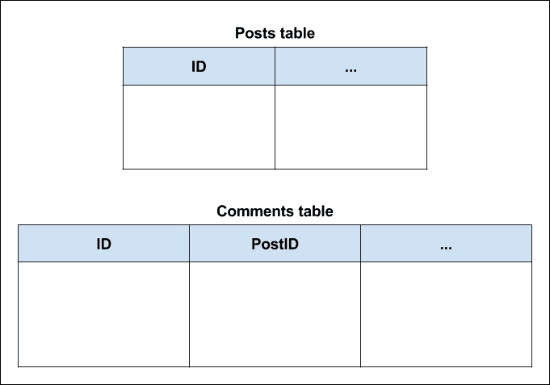
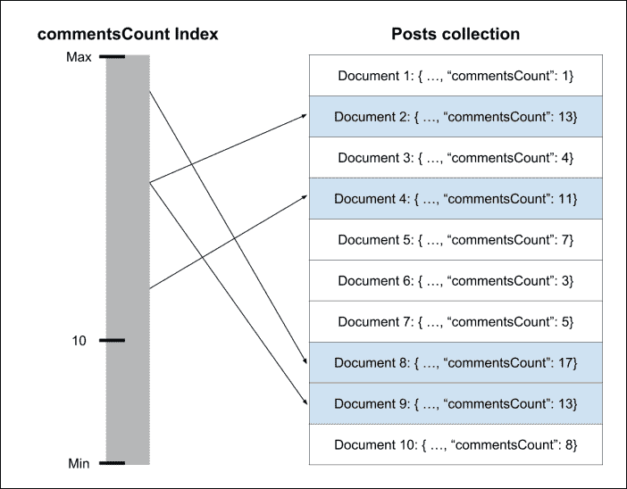
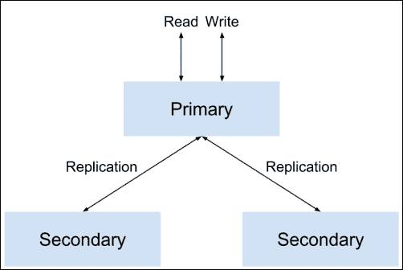
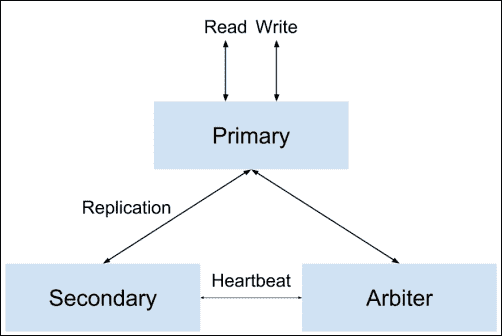
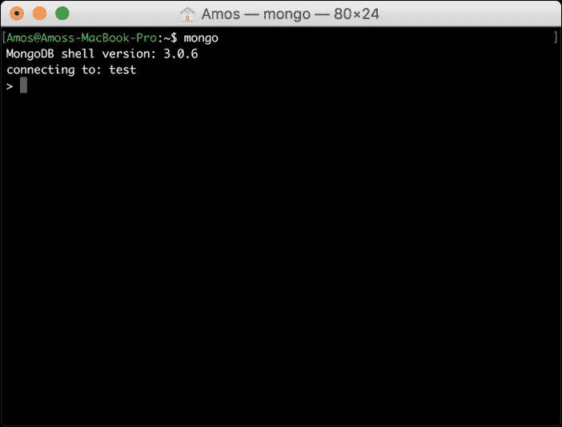
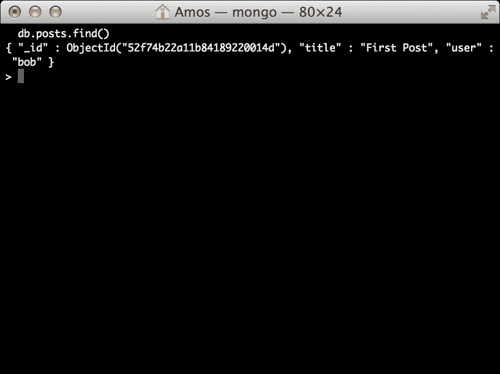

# 第四章：MongoDB 简介

MongoDB 是一种令人兴奋的新型数据库。作为 NoSQL 运动的领导者，它正在成为世界上最有用的数据库解决方案之一。Mongo 的高吞吐量、独特的 BSON 数据模型和易于扩展的架构为 Web 开发人员提供了更好的工具来存储他们的持久数据。从关系型数据库转移到 NoSQL 解决方案可能是一个令人不知所措的任务，但通过了解 MongoDB 的设计目标可以轻松简化。在本章中，我们将涵盖以下主题：

+   了解 NoSQL 运动和 MongoDB 设计目标

+   MongoDB BSON 数据结构

+   MongoDB 集合和文档

+   MongoDB 查询语言

+   使用 MongoDB shell

# NoSQL 简介

在过去的几年里，Web 应用程序开发通常需要使用关系型数据库来存储持久数据。大多数开发人员已经非常习惯使用众多的 SQL 解决方案之一。因此，使用成熟的关系数据库存储规范化数据模型的方法成为了标准。对象关系映射器开始出现，为开发人员提供了适当的解决方案，以从其应用程序的不同部分整理数据。但随着 Web 的不断扩大，越来越多的开发人员面临更多的扩展问题。为了解决这个问题，社区创建了各种键值存储解决方案，旨在提供更好的可用性、简单的查询和水平扩展。这种新型数据存储变得越来越健壮，提供了许多关系数据库的功能。在这一演变过程中，出现了不同的存储设计模式，包括键值存储、列存储、对象存储和最流行的文档存储。

在常见的关系数据库中，您的数据存储在不同的表中，通常使用主键到外键的关系连接。您的程序将稍后使用各种 SQL 语句重新构建模型，以将数据排列成某种层次化对象表示。文档型数据库处理数据的方式不同。它们不使用表，而是以标准格式（如 JSON 和 XML）存储分层文档。

为了更好地理解这一点，让我们看一个典型博客文章的例子。要使用 SQL 解决方案构建此博客文章模型，您可能至少需要使用两个表。第一个表包含帖子信息，而第二个表包含帖子评论。下图显示了一个示例表结构：



在您的应用程序中，您将使用对象关系映射库或直接 SQL 语句来选择博客文章记录和帖子评论记录，以创建您的博客文章对象。然而，在基于文档的数据库中，博客文章将完全存储为单个文档，以后可以进行查询。例如，在一个以 JSON 格式存储文档的数据库中，您的博客文章文档可能看起来像以下代码片段：

```js
{
  "title": "First Blog Post",
  "comments": [{
    "title": "First Comment"
  }, {
    "title": "Second Comment"
  }]
}
```

这表明了文档型数据库和关系型数据库之间的主要区别。因此，在使用关系型数据库时，您的数据存储在不同的表中，您的应用程序使用表记录组装对象。将数据存储为整体文档将允许更快的读取操作，因为您的应用程序不必在每次读取时重新构建对象。此外，面向文档的数据库还有其他优势。

在开发应用程序时，您经常会遇到另一个问题：模型更改。假设您想要为每篇博客文章添加一个新属性。因此，您可以更改您的帖子表，然后转到应用程序数据层，并将该属性添加到您的博客文章对象中。由于您的应用程序已经包含了几篇博客文章，所有现有的博客文章对象也将发生变化，这意味着您必须在代码中添加额外的验证过程。然而，基于文档的数据库通常是无模式的，这意味着您可以在单个对象集合中存储不同的对象，而无需更改数据库中的任何内容。尽管这对一些有经验的开发人员来说可能听起来像是在寻求麻烦，但无模式存储的自由具有几个优点。

例如，想象一个销售二手家具的电子商务应用程序。在您的“产品”表中，椅子和壁橱可能具有一些共同的特征，比如木材的类型，但客户可能还对壁橱有多少个门感兴趣。将壁橱和椅子对象存储在同一个表中意味着它们可以存储在具有大量空列的表中，或者使用更实用的实体-属性-值模式，其中另一个表用于存储键-值属性。然而，使用无模式存储将允许您在同一集合中为不同的对象定义不同的属性，同时仍然可以使用常见属性查询该集合，比如木材类型。这意味着您的应用程序，而不是数据库，将负责强制执行数据结构，这可以帮助您加快开发过程。

虽然有许多 NoSQL 解决方案解决各种开发问题，通常围绕缓存和规模，但面向文档的数据库正在迅速成为该运动的领导者。文档导向数据库的易用性，以及其独立的持久存储功能，甚至威胁着在某些用例中取代传统的 SQL 解决方案。尽管有一些文档导向数据库，但没有一个像 MongoDB 那样受欢迎。

# 介绍 MongoDB

回到 2007 年，Dwight Merriman 和 Eliot Horowitz 成立了一家名为 10gen 的公司，以创建一个更好的平台来托管 Web 应用程序。他们的想法是创建一个作为服务的托管平台，让开发人员专注于构建他们的应用程序，而不是处理硬件管理和基础设施扩展。很快，他们发现社区不愿意放弃对他们应用程序基础设施的控制。因此，他们将平台的不同部分作为开源项目发布。

有一个这样的项目是一个名为 MongoDB 的基于文档的数据库解决方案。MongoDB 源自于“巨大”的单词，能够支持复杂的数据存储，同时保持其他 NoSQL 存储的高性能方法。社区欣然接受了这种新的范式，使 MongoDB 成为世界上增长最快的数据库之一。拥有 150 多名贡献者和超过 10,000 次提交，它也成为最受欢迎的开源项目之一。

MongoDB 的主要目标是创建一种新类型的数据库，将关系数据库的健壮性与分布式键值数据存储的快速吞吐量相结合。考虑到可扩展的平台，它必须支持简单的水平扩展，同时保持传统数据库的耐久性。另一个关键的设计目标是支持 Web 应用程序开发，以标准 JSON 输出的形式。这两个设计目标最终成为 MongoDB 相对于其他解决方案的最大优势，因为这些与 Web 开发中的其他趋势完美契合，比如几乎无处不在的云虚拟化托管的使用或向水平而不是垂直扩展的转变。

最初被认为是更可行的关系数据库上的另一个 NoSQL 存储层，MongoDB 发展到远远超出了它诞生的平台。它的生态系统发展到支持大多数流行的编程平台，拥有各种社区支持的驱动程序。除此之外，还形成了许多其他工具，包括不同的 MongoDB 客户端、性能分析和优化工具、管理和维护实用程序，以及一些风险投资支持的托管服务。甚至一些大公司，如 eBay 和纽约时报，开始在其生产环境中使用 MongoDB 数据存储。要了解为什么开发人员更喜欢 MongoDB，现在是时候深入了解它的一些关键特性了。

# MongoDB 的关键特性

MongoDB 有一些关键特性，帮助它变得如此受欢迎。正如我们之前提到的，目标是在传统数据库功能和 NoSQL 存储的高性能之间创建一种新的品种。因此，它的大多数关键特性都是为了超越其他 NoSQL 解决方案的限制，同时整合一些关系数据库的能力而创建的。在本节中，您将了解为什么在处理现代 Web 应用程序开发时，MongoDB 可以成为您首选的数据库。

## BSON 格式

MongoDB 最伟大的特性之一是其类似 JSON 的存储格式，名为 BSON。BSON 代表**二进制 JSON**，BSON 格式是 JSON 样式文档的二进制编码序列化，旨在在大小和速度上更高效，从而实现 MongoDB 的高读/写吞吐量。

与 JSON 一样，BSON 文档是对象和数组的简单数据结构表示，采用键值格式。文档由一系列元素组成，每个元素都有一个字符串类型的字段名和一个类型化的字段值。这些文档支持所有 JSON 特定的数据类型以及其他数据类型，例如`Date`类型。

BSON 格式的另一个重要优势是使用`_id`字段作为主键。`_id`字段值通常是一个名为`ObjectId`的唯一标识符类型，它可以由应用程序驱动程序或 mongod 服务生成。如果驱动程序未能提供带有唯一`ObjectId`的`_id`字段，mongod 服务将自动添加它，使用以下方式：

+   一个表示自 Unix 纪元以来的秒数的 4 字节值

+   一个 3 字节的机器标识符

+   一个 2 字节的进程 ID

+   一个 3 字节的计数器，从一个随机值开始

因此，上一个示例中的博客文章对象的 BSON 表示将如下代码片段所示：

```js
{
  "_id": ObjectId("52d02240e4b01d67d71ad577"),
  "title": "First Blog Post",
  "comments": [
  ...
  ]
}
```

BSON 格式使 MongoDB 能够在内部索引和映射文档属性，甚至嵌套文档，从而能够高效地扫描集合，并且更重要的是，能够将对象与复杂的查询表达式匹配。

## MongoDB 的特点

MongoDB 的另一个设计目标是扩展普通键值存储的能力。常见键值存储的主要问题是其有限的查询能力，这通常意味着您的数据只能使用键字段进行查询，而更复杂的查询大多是预定义的。为了解决这个问题，MongoDB 从关系数据库动态查询语言中汲取了灵感。

支持即席查询意味着数据库将立即响应动态结构化的查询，无需预定义每个查询。它能够通过索引 BSON 文档并使用独特的查询语言来实现这一点。让我们看一下以下 SQL 语句示例：

```js
SELECT * FROM Posts WHERE Title LIKE '%mongo%';

```

这个简单的语句是在要求数据库返回所有标题中包含单词`mongo`的帖子记录。在 MongoDB 中复制这个查询将如下所示：

```js
db.posts.find({ title:/mongo/ });

```

在 MongoDB shell 中运行此命令将返回所有`title`字段包含单词`mongo`的帖子。您将在本章后面学习更多关于 MongoDB 查询语言的内容，但现在重要的是要记住它几乎与传统的关系型数据库一样可查询。MongoDB 查询语言很棒，但它引发了一个问题，即当数据库变得更大时，这些查询运行效率如何。像关系型数据库一样，MongoDB 使用称为索引的机制来解决这个问题。

## MongoDB 索引

索引是一种独特的数据结构，使数据库引擎能够高效解析查询。当查询发送到数据库时，它将不得不扫描整个文档集合，以找到与查询语句匹配的文档。这种方式，数据库引擎处理了大量不必要的数据，导致性能不佳。

为了加快扫描速度，数据库引擎可以使用预定义的索引，它映射文档字段，并告诉引擎哪些文档与此查询语句兼容。为了理解索引的工作原理，我们假设我们想检索所有具有超过 10 条评论的帖子。在这种情况下，我们的文档定义如下：

```js
{
  "_id": ObjectId("52d02240e4b01d67d71ad577"),
  "title": "First Blog Post",
  "comments": [
  …
  ],
  "commentsCount": 12
}
```

因此，一个请求超过 10 条评论的文档的 MongoDB 查询将如下所示：

```js
db.posts.find({ commentsCount: { $gt: 10 } });

```

要执行此查询，MongoDB 必须遍历所有帖子，并检查帖子是否具有大于`10`的`commentCount`属性。然而，如果定义了`commentCount`索引，那么 MongoDB 只需检查哪些文档具有大于`10`的`commentCount`属性，然后检索这些文档。以下图表说明了`commentCount`索引的工作原理：



使用`commentsCount`索引检索具有超过`10`条评论的文档

## MongoDB 副本集

为了提供数据冗余和改善可用性，MongoDB 使用一种称为**副本集**的架构。数据库的复制有助于保护数据，以便从硬件故障中恢复并增加读取容量。副本集是一组承载相同数据集的 MongoDB 服务。一个服务被用作主服务，其他服务被称为次服务。所有的实例都支持读操作，但只有主实例负责写操作。当发生写操作时，主实例会通知次实例进行更改，并确保它们已将更改应用到其数据集的复制中。以下图表说明了一个常见的副本集：



具有一个主和两个次的副本集的工作流程

MongoDB 副本集的另一个强大功能是其自动故障转移。当副本集的一个成员无法在 10 秒内到达主实例时，副本集将自动选举并提升一个次实例为新的主实例。旧的主实例恢复在线后，它将作为次实例重新加入副本集。

副本集的另一个特性是能够添加仲裁节点。仲裁者不维护任何数据；它们的主要目的是在副本集中维护法定人数。这意味着它们参与选举新的主要过程，但不能作为次要功能或被选为主要功能。简而言之，仲裁者有助于以比常规数据节点更低的资源成本在副本集中提供一致性。以下图表说明了一个带有仲裁者的常见副本集：



具有主、次和仲裁者的副本集的工作流程

MongoDB 的复制是一个非常强大的功能，直接源自其平台起源，是使 MongoDB 达到生产就绪状态的主要功能之一。然而，这并不是唯一的功能。

### 注意

要了解更多关于 MongoDB 副本集的信息，请访问[`docs.mongodb.org/manual/replication/`](http://docs.mongodb.org/manual/replication/)。

## MongoDB 分片

随着 Web 应用程序的增长，扩展性是一个常见的问题。解决这个问题的各种方法可以分为两组：垂直扩展和水平扩展。两者之间的区别在下图中有所说明：


单台机器的垂直扩展与多台机器的水平扩展

垂直扩展更容易，包括增加单台机器的资源，如 RAM 和 CPU。然而，它有两个主要缺点：首先，在某个水平上，增加单台机器的资源相对于在几台较小的机器之间分配负载变得更加昂贵。其次，流行的云托管提供商限制了您可以使用的机器实例的大小。因此，垂直扩展应用程序只能在一定水平上进行。

水平扩展更加复杂，需要使用多台机器。每台机器将处理一部分负载，提供更好的整体性能。水平数据库扩展的问题在于如何正确地在不同的机器之间分配数据，以及如何管理它们之间的读/写操作。

幸运的是，MongoDB 支持水平扩展，它称之为分片。*分片是将数据分割到不同的机器或分片的过程*。每个分片保存一部分数据，并作为一个独立的数据库。几个分片的集合形成了一个单一的逻辑数据库。操作是通过称为查询路由器的服务执行的，它们询问配置服务器如何将每个操作委派给正确的分片。

### 注意

要了解更多关于 MongoDB 分片的信息，请访问[`docs.mongodb.org/manual/sharding/`](http://docs.mongodb.org/manual/sharding/)。

## MongoDB 3.0

2015 年初，MongoDB 团队推出了 MongoDB 数据库的第三个主要版本。最重要的是，这个版本标志着 MongoDB 正在向成为更大更复杂的生产环境的领先数据库解决方案迈进。或者，正如团队所描述的那样，使 MongoDB 成为每个组织的“默认数据库”。为了实现这一目标，团队提出了几个新功能：

+   **存储 API**：在这个版本中，存储引擎层与更高级别的操作解耦。这意味着组织现在可以根据其应用程序需求选择使用哪种存储引擎，从而获得高达 10 倍的性能提升。

+   **增强的查询引擎内省**：这使得数据库管理员能够更好地分析关键查询，确保性能得到优化。

+   **更好的身份验证和审计**：这使得大型组织能够更安全地管理他们的 MongoDB 实例。

+   **更好的日志记录**：更复杂的日志记录功能使开发人员能够更好地跟踪 MongoDB 的操作。

这些功能和许多其他功能使 MongoDB 如此受欢迎。尽管有许多良好的替代方案，但 MongoDB 在开发人员中变得越来越普遍，并且正在成为世界领先的数据库解决方案之一。让我们深入了解如何轻松开始使用 MongoDB。

# MongoDB shell

如果您遵循了第一章, *MEAN 简介*，您应该在本地环境中拥有一个可用的 MongoDB 实例。要与 MongoDB 交互，您将使用 MongoDB shell，这是您在第一章中遇到的。MongoDB shell 是一个命令行工具，它使用 JavaScript 语法查询语言来执行不同的操作。

为了探索 MongoDB 的不同部分，让我们通过运行`mongo`可执行文件来启动 MongoDB shell，如下所示：

```js
$ mongo

```

如果 MongoDB 已正确安装，您应该看到类似于以下截图所示的输出：



注意 shell 如何告诉您当前的 shell 版本，并且它已连接到默认的测试数据库。

# MongoDB 数据库

每个 MongoDB 服务器实例可以存储多个数据库。除非特别定义，否则 MongoDB shell 将自动连接到默认的测试数据库。通过执行以下命令切换到另一个名为 mean 的数据库：

```js
> use mean

```

您将看到一个命令行输出，告诉您 shell 已切换到 mean 数据库。请注意，您无需在使用数据库之前创建数据库，因为在 MongoDB 中，当您插入第一个文档时，数据库和集合会懒惰地创建。这种行为与 MongoDB 对数据的动态方法一致。使用特定数据库的另一种方法是以数据库名称作为参数运行 shell 可执行文件，如下所示：

```js
$ mongo mean

```

shell 将自动连接到 mean 数据库。如果您想列出当前 MongoDB 服务器中的所有其他数据库，只需执行以下命令：

```js
> show dbs

```

这将显示当前可用的至少存储了一个文档的数据库列表。

# MongoDB 集合

MongoDB 集合是 MongoDB 文档的列表，相当于关系数据库表。当插入其第一个文档时，将创建一个集合。与表不同，集合不强制执行任何类型的模式，并且可以托管不同结构的文档。

要在 MongoDB 集合上执行操作，您需要使用集合方法。让我们创建一个名为 posts 的集合并插入第一篇文章。为了做到这一点，在 MongoDB shell 中执行以下命令：

```js
> db.posts.insert({"title":"First Post", "user": "bob"})

```

执行上述命令后，它将自动创建 posts 集合并插入第一个文档。要检索集合文档，请在 MongoDB shell 中执行以下命令：

```js
> db.posts.find()

```

您应该看到类似于以下截图所示的命令行输出：



这意味着您已成功创建了 posts 集合并插入了第一个文档。

要显示所有可用的集合，请在 MongoDB shell 中发出以下命令：

```js
> show collections

```

MongoDB shell 将输出可用集合的列表，您的情况下是 posts 集合和另一个名为 system.indexes 的集合，它保存了数据库索引的列表。

如果您想删除 posts 集合，您需要执行 drop()命令，如下所示：

```js
> db.posts.drop()

```

shell 将通过输出 true 来通知您该集合已被删除。

# MongoDB CRUD 操作

**创建-读取-更新-删除**（CRUD）操作是您与数据库执行的基本交互。为了对数据库实体执行 CRUD 操作，MongoDB 提供了各种集合方法。

## 创建新文档

您已经熟悉使用 insert()方法创建新文档的基本方法，就像您之前在早期示例中所做的那样。除了 insert()方法，还有两种方法叫做 update()和 save()来创建新对象。

### 使用 insert()创建文档

创建新文档的最常见方法是使用 insert()方法。insert()方法接受一个表示新文档的单个参数。要插入新的文章，只需在 MongoDB shell 中发出以下命令：

```js
> db.posts.insert({"title":"Second Post", "user": "alice"})

```

### 使用 update()创建文档

update()方法通常用于更新现有文档。您还可以使用 upsert 标志来创建新文档，如果没有文档与查询条件匹配：

```js
> db.posts.update({
 "user": "alice"
}, {
 "title": "Second Post",
 "user": "alice"
}, {
 upsert: true
})

```

在前面的例子中，MongoDB 将查找由`alice`创建的帖子并尝试更新它。考虑到`posts`集合没有由`alice`创建的帖子，以及您已经使用了`upsert`标志，MongoDB 将找不到适当的文档进行更新，而是创建一个新文档。

### 使用 save()创建文档

创建新文档的另一种方法是调用`save()`方法，传递一个没有`_id`字段或在集合中不存在的`_id`字段的文档：

```js
> db.posts.save({"title":"Second Post", "user": "alice"})

```

这将产生与`update()`方法相同的效果，并将创建一个新文档而不是更新现有文档。

## 阅读文档

`find()`方法用于从 MongoDB 集合中检索文档列表。使用`find()`方法，您可以请求集合中的所有文档，或使用查询检索特定文档。

### 查找所有集合文档

要检索`posts`集合中的所有文档，应该将空查询传递给`find()`方法，或者根本不传递任何参数。以下查询将检索`posts`集合中的所有文档：

```js
> db.posts.find()

```

此外，也可以使用以下查询执行相同的操作：

```js
> db.posts.find({})

```

这两个查询基本上是相同的，将返回`posts`集合中的所有文档。

### 使用相等语句

要检索特定文档，可以使用相等条件查询，该查询将抓取符合该条件的所有文档。例如，要检索由`alice`创建的所有帖子，您需要在 shell 中发出以下命令：

```js
> db.posts.find({ "user": "alice" })

```

这将检索具有`user`属性等于`alice`的所有文档。

### 使用查询操作符

使用相等语句可能不够。为了构建更复杂的查询，MongoDB 支持各种查询操作符。使用查询操作符，您可以查找不同类型的条件。例如，要检索由`alice`或`bob`创建的所有帖子，可以使用以下`$in`操作符：

```js
> db.posts.find({ "user": { $in: ["alice", "bob"] } })

```

### 注意

您可以通过访问[`docs.mongodb.org/manual/reference/operator/query/#query-selectors`](http://docs.mongodb.org/manual/reference/operator/query/#query-selectors)了解更多查询操作符。

### 构建 AND/OR 查询

构建查询时，可能需要使用多个条件。就像在 SQL 中一样，您可以使用`AND`/`OR`运算符来构建多条件查询语句。要执行`AND`查询，只需将要检查的属性添加到查询对象中。例如，看一下以下查询：

```js
> db.posts.find({ "user": "alice", "commentsCount": { $gt: 10 }  })

```

它类似于您之前使用的`find()`查询，但添加了另一个条件，验证文档的`commentCount`属性，并且只会抓取由`alice`创建且评论数超过`10`的文档。`OR`查询稍微复杂，因为它涉及`$or`运算符。要更好地理解它，请看上一个例子的另一个版本：

```js
> db.posts.find( { $or: [{ "user": "alice" }, { "user": "bob" }] })

```

与查询操作符示例一样，这个查询也会抓取由`bob`或`alice`创建的所有帖子。

## 更新现有文档

使用 MongoDB，您可以使用`update()`或`save()`方法更新文档。

### 使用 update()更新文档

`update()`方法需要三个参数来更新现有文档。第一个参数是选择条件，指示要更新哪些文档，第二个参数是`update`语句，最后一个参数是`options`对象。例如，在下面的例子中，第一个参数告诉 MongoDB 查找所有由`alice`创建的文档，第二个参数告诉它更新`title`字段，第三个参数强制它在找到的所有文档上执行`update`操作：

```js
> db.posts.update({
 "user": "alice"
}, {
 $set: {
 "title": "Second Post"
 }
}, {
 multi: true
})

```

请注意`multi`属性已添加到`options`对象中。`update()`方法的默认行为是更新单个文档，因此通过设置`multi`属性，您告诉`update()`方法更新符合选择条件的所有文档。

### 使用 save()更新文档

更新现有文档的另一种方法是调用`save()`方法，将包含`_id`字段的文档传递给它。例如，以下命令将更新具有`_id`字段等于`ObjectId("50691737d386d8fadbd6b01d")`的现有文档：

```js
> db.posts.save({
 "_id": ObjectId("50691737d386d8fadbd6b01d"),
 "title": "Second Post",
 "user": "alice"
})

```

重要的是要记住，如果`save()`方法无法找到合适的对象，它将创建一个新对象。

## 删除文档

要删除文档，您需要使用`remove()`方法。`remove()`方法最多可以接受两个参数。第一个是删除条件，第二个是一个布尔参数，指示是否删除多个文档。

### 删除所有文档

要从集合中删除所有文档，您需要调用`remove()`方法，而不需要任何删除条件。例如，要删除所有`posts`文档，您需要执行以下命令：

```js
> db.posts.remove({})

```

请注意，`remove()`方法与`drop()`方法不同，因为它不会删除集合或其索引。要使用不同的索引重建集合，最好使用`drop()`方法。

#### 删除多个文档

要从集合中删除符合条件的多个文档，您需要使用带有删除条件的`remove()`方法。例如，要删除`alice`发布的所有帖子，您需要执行以下命令：

```js
> db.posts.remove({ "user": "alice" })

```

请注意，这将删除`alice`创建的所有文档，因此在使用`remove()`方法时要小心。

#### 删除单个文档

要从集合中删除与条件匹配的单个文档，您需要使用带有删除条件和布尔值的`remove()`方法，指示您只想删除单个文档。例如，要删除`alice`发布的第一篇帖子，您需要执行以下命令：

```js
> db.posts.remove({ "user": "alice" }, true)

```

这将删除由`alice`创建的第一个文档，并且即使它们符合删除条件，也会保留其他文档。

# 摘要

在本章中，您了解了 NoSQL 数据库以及它们在现代 Web 开发中的用途。您还了解了 NoSQL 运动的新兴领导者 MongoDB。您深入了解了使 MongoDB 成为强大解决方案的各种功能，并了解了其基本术语。最后，您一窥了 MongoDB 强大的查询语言以及如何执行所有四个 CRUD 操作。在下一章中，我们将讨论如何使用流行的 Mongoose 模块将 Node.js 和 MongoDB 连接在一起。
