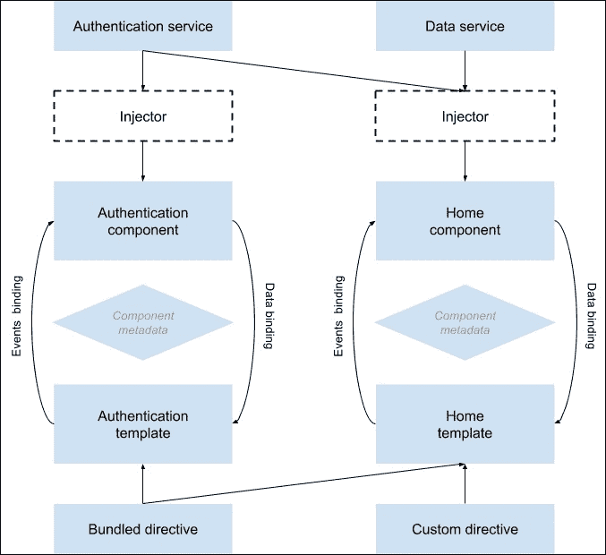
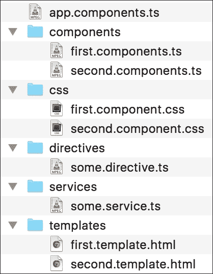
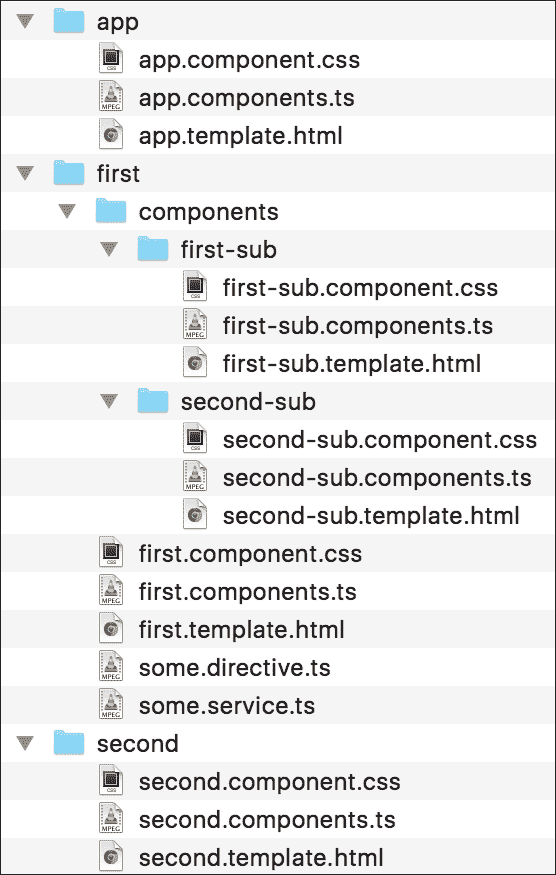

# 第七章：Angular 简介

MEAN 拼图的最后一块当然是 Angular。回到 2009 年，当开发人员 Miško Hevery 和 Adam Abrons 在构建他们的 JSON 作为平台服务时，他们注意到常见的 JavaScript 库并不够用。他们丰富的 Web 应用程序的性质引发了对更有结构的框架的需求，以减少冗余工作并保持项目代码有序。他们放弃了最初的想法，决定专注于开发他们的框架，将其命名为 AngularJS，并在开源许可下发布。这个想法是弥合 JavaScript 和 HTML 之间的差距，并帮助推广单页面应用程序的开发。在接下来的几年里，AngularJS—现在被称为 Angular—成为 JavaScript 生态系统中最受欢迎的框架之一，并彻底改变了前端开发世界。然而，在过去的几年里，发生了一些重大的范式转变。因此，当由谷歌赞助的团队决定开发 Angular 的下一个版本时，他们引入了一整套新的想法。在本章中，我们将涵盖以下主题：

+   介绍 TypeScript

+   介绍 Angular 2

+   理解 Angular 2 的构建块

+   安装和配置 TypeScript 和 Angular 2

+   创建和组织 Angular 2 应用程序

+   利用 Angular 的组件架构

+   实现`Authentication`组件

# 介绍 Angular 2

AngularJS 是一个前端 JavaScript 框架，旨在使用类似 MVC 的架构构建单页面应用程序。Angular 的方法是通过特殊属性扩展 HTML 的功能，将 JavaScript 逻辑与 HTML 元素绑定在一起。AngularJS 扩展 HTML 的能力允许通过客户端模板化进行更清晰的 DOM 操作，并实现了无缝同步的双向数据绑定，使模型和视图之间无缝同步。AngularJS 还通过 MVC 和依赖注入改进了应用程序的代码结构和可测试性。AngularJS 1 是一个很棒的框架，但它是基于 ES5 的概念构建的，随着新的 ES2015 规范带来的巨大改进，团队不得不重新思考整个方法。

## 从 Angular 1.x 到 Angular 2.x

如果您已经熟悉 Angular 1，转向 Angular 2 可能看起来是一个很大的步骤。然而，Angular 团队确保保留了 Angular 1 的优点，同时利用 ES2015 的新功能，并保持了通向改进框架的更清晰的路径。以下是从 Angular 1 所做的更改的快速总结：

+   **语法**：Angular 2 依赖于以前称为 ES6 的新 ECMAScript 规范，现在更名为 ES2015。然而，该规范仍在不断发展，浏览器支持仍然不足。为了解决这个问题，Angular 2 团队决定使用 TypeScript。

+   **TypeScript**：TypeScript 是 ES2015 的超集，这意味着它允许您编写强类型的 ES2015 代码，稍后将根据您的需求和平台支持编译为 ES5 或 ES2015 源代码。Angular 2 在其文档和代码示例中大力推动 TypeScript 的使用，我们也会这样做。不过，不用担心；尽管 TypeScript 可能看起来广泛而可怕，但在本章结束时，您将能够使用它。

+   **模块**：Angular 1 引入了一个模块化架构，需要使用`angular#module()`自定义方法。然而，ES2015 引入了一个类似于 Node.js 中使用的内置模块系统。因此，Angular 2 模块更容易创建和使用。

+   **控制器**：Angular 1 主要关注控制器。在本书的第一个版本中，本章主要关注 Angular 1 的 MVC 方法，但在 Angular 2 中，基本构建块是组件。这种转变也代表了 JavaScript 生态系统的更大转变，特别是关于 Web 组件。

+   **作用域**：著名的`$scope`对象现在已经过时。在 Angular 2 中，组件模型更清晰、更可读。一般来说，ES2015 中引入类的概念及其在 TypeScript 中的支持允许更好的设计模式。

+   **装饰器**：装饰器是 TypeScript 中实现的一种设计特性，可能会在 ES2016（ES7）中实现。装饰器允许开发人员注释类和成员，以添加功能或数据，而不扩展实体。Angular 2 依赖装饰器来实现某些功能，您将在本章后面处理它们。

+   **依赖注入**：Angular 1 非常强调依赖注入范式。Angular 2 简化了依赖注入，现在支持多个注入器而不是一个。

所有这些特性标志着 Angular 和 JavaScript 的新时代，一切都始于 TypeScript。

# TypeScript 简介

TypeScript 是由微软创建的一种类型化编程语言，它使用了 C＃、Java 和现在的 ES2015 的面向对象基础。用 TypeScript 编写的代码会被转译成 ES3、ES5 或 ES2015 的 JavaScript 代码，并可以在任何现代 Web 浏览器上运行。它也是 ES2015 的超集，因此基本上任何 JavaScript 代码都是有效的 TypeScript 代码。其背后的想法是创建一个强类型的编程语言，用于大型项目，可以让大型团队更好地沟通其软件组件之间的接口。由于 TypeScript 中的许多特性已经在 ES2015 中实现，我们将介绍一些基本特性，这些特性是我们需要的，但在当前规范中没有得到。

## 类型

类型是每种编程语言的重要部分，包括 JavaScript。不幸的是，静态类型在 ES2015 中没有被引入；然而，TypeScript 支持基本的 JavaScript 类型，并允许开发人员创建和使用自己的类型。

### 基本类型

类型可以是 JavaScript 原始类型，如下面的代码所示：

```js
let firstName: string = "John";
let lastName = 'Smith';
let height: number = 6;
let isDone: boolean = false;
```

此外，TypeScript 还允许您使用数组：

```js
var numbers:number[] = [1, 2, 3];
var names:Array<string> = ['Alice', 'Helen', 'Claire'];
```

然后，这两种方式都被转译成熟悉的 JavaScript 数组声明。

### 任意类型

`any`类型表示任何自由形式的 JavaScript 值。`any`的值将通过转译器进行最小的静态类型检查，并支持作为 JavaScript 值的所有操作。可以访问`any`值上的所有属性，并且`any`值也可以作为带有参数列表的函数调用。实际上，`any`是所有类型的超类型，每当 TypeScript 无法推断类型时，将使用`any`类型。您可以显式或隐式地使用`any`类型：

```js
var x: any;
var y;
```

## 接口

由于 TypeScript 是关于保持项目结构的，语言的重要部分是接口。接口允许您塑造对象并保持代码的稳固和清晰。类可以实现接口，这意味着它们必须符合接口中声明的属性或方法。接口还可以继承自其他接口，这意味着它们的实现类将能够实现扩展的接口。一个示例的 TypeScript 接口将类似于这样：

```js
interface IVehicle {
  wheels: number;
  engine: string;
  drive();
}
```

在这里，我们有一个`IVehicle`接口，有两个属性和一个方法。一个实现类会是这样的：

```js
class Car implements IVehicle  {
  wheels: number;
  engine: string;

  constructor(wheels: number, engine: string) {
    this.wheels = wheels;
    this.engine = engine;
  }

  drive() {
    console.log('Driving...');
  }
}
```

正如您所看到的，`Car`类实现了`IVehicle`接口，并遵循了其设置的结构。

### 注意

接口是 TypeScript 的一个强大特性，也是面向对象编程的重要部分。建议您继续阅读有关它们的内容：[`www.typescriptlang.org/docs/handbook/interfaces.html`](https://www.typescriptlang.org/docs/handbook/interfaces.html)。

## 装饰器

虽然对于新的 ES7 规范来说，它仍处于提案阶段，但 Angular 2 在装饰器上有很大的依赖。装饰器是一种特殊类型的声明，可以附加到各种实体上，比如类、方法或属性。装饰器为开发人员提供了一种可重用的方式来注释和修改类和成员。装饰器使用 `@decoratorName` 的形式，其中 `decoratorName` 参数必须是一个函数，在运行时将被调用以装饰实体。一个简单的装饰器如下所示：

```js
function Decorator(target: any) {

}
@Decorator
class MyClass {

}
```

在运行时，装饰器将使用 `MyClass` 构造函数填充目标参数执行。此外，装饰器也可以带有参数，如下所示：

```js
function DecoratorWithArgs(options: Object) {
  return (target: Object) => {

  }
}

@DecoratorWithArgs({ type: 'SomeType' })
class MyClass {

}
```

这种模式也被称为装饰器工厂。装饰器可能看起来有点奇怪，但一旦我们深入了解 Angular 2，你就会开始理解它们的强大。

### 总结

TypeScript 已经存在多年，并且由一个非常强大的团队开发。这意味着我们仅仅触及了它无尽的功能和能力的表面。然而，这个介绍将为我们提供进入 Angular 2 这个伟大框架所需的技能和知识。

# Angular 2 架构

Angular 2 的目标很简单：以一种可管理和可扩展的方式将 HTML 和 JavaScript 结合起来，以构建客户端应用程序。为此，Angular 2 使用了基于组件的方法，支持实体，如服务和指令，在运行时注入到组件中。这种方法一开始可能有点奇怪，但它允许我们保持关注点的清晰分离，并通常保持更清晰的项目结构。为了理解 Angular 2 的基础知识，请看下面的图：



上图展示了一个由两个组件组成的 Angular 2 应用程序的简单架构。中心实体是组件。每个组件都通过其模板执行数据绑定和事件处理，以向用户呈现交互式用户界面。服务用于执行任何其他任务，比如加载数据、执行计算等。然后组件消耗这些服务并委托这些任务。指令是组件模板的渲染指令。为了更好地理解这一点，让我们深入了解一下。

## Angular 2 模块

Angular 2 应用通常是模块化的应用程序。这意味着 Angular 2 应用程序由多个模块组成，每个模块通常都是专门用于单个任务的一段代码。事实上，整个框架都是以模块化的方式构建的，允许开发人员只导入他们需要的功能。幸运的是，Angular 2 使用了我们之前介绍过的 ES2015 模块语法。我们的应用程序也将由自定义模块构建，一个示例应用程序模块如下所示：

```js
import { NgModule }       from '@angular/core';
import { CommonModule }   from '@angular/common';
import { RouterModule }   from '@angular/router';

import { AppComponent }       from './app.component';
import { AppRoutes }       from './app.routes';

@NgModule({
  imports: [
    CommonModule,
    RouterModule.forRoot(AppRoutes),
  ],
  declarations: [
    AppComponent
  ],
  bootstrap: [AppComponent]
})
export class AppModule { }
```

如你所见，我们使用 `@NgModule` 装饰器来创建应用程序模块，该模块使用应用程序组件和路由来启动我们的应用程序。为了更好地理解这一点，让我们来看看 Angular 2 应用程序的第一个和最重要的构建块：组件。

## Angular 2 组件

组件是 Angular 2 应用程序的基本构建块。它的工作是控制用户界面的一个专用部分，通常称为视图。大多数应用程序至少包含一个根应用程序组件，通常还包含多个控制不同视图的组件。组件通常被定义为一个常规的 ES2015 类，带有一个 `@Component` 装饰器，用于将其定义为组件并包含组件元数据。然后将组件类导出为一个模块，可以在应用程序的其他部分导入和使用。一个简单的应用程序组件如下所示：

```js
import { Component } from '@angular/core';

@Component({
  selector: 'mean-app',
  template: '<h1>I AM AN APPLICATION COMPONENT</h1>'
})
export class AppComponent { 	}
```

注意我们如何从 `@angular/core` 模块库中导入 `@Component` 装饰器，然后使用它来定义我们的组件 DOM 选择器和我们想要使用的模板。最后，我们导出一个名为 `AppComponent` 的类。组件是视图管理的一方，另一方是模板。

## Angular 2 模板

模板由组件用于呈现组件视图。它们由基本的 HTML 与 Angular 专用的注解组合而成，告诉组件如何呈现最终视图。在前面的例子中，你可以看到一个简单的模板直接传递给了 `AppComponent` 类。然而，你也可以将模板保存在外部模板文件中，并将组件更改为如下所示：

```js
import { Component } from '@angular/core';

@Component({
  selector: 'mean-app',
  templateUrl: 'app.template.html'
})
export class AppComponent { 	}
```

如你所见，我们当前的模板是静态的，所以为了创建更有用的模板，现在是时候讨论数据绑定了。

## Angular 2 数据绑定

Angular 最大的特点之一是其复杂的数据绑定能力。如果你习惯于在框架之外工作，你就知道在视图和数据模型之间管理数据更新是一种噩梦。幸运的是，Angular 的数据绑定为你提供了一种简单的方式来管理组件类和渲染视图之间的绑定。

### 插值绑定

将数据从组件类绑定到模板的最简单方法称为插值。插值使用双大括号语法将类属性的值与模板绑定。这种机制的一个简单例子如下：

```js
import { Component } from '@angular/core';

@Component({
  selector: 'mean-app',
  template: '<h1>{{title}}</h1>'
})
export class AppComponent {
  title = 'MEAN Application';
}
```

注意我们如何在模板 HTML 中绑定了 `AppComponent` 类的 `title` 属性。

### 属性绑定

单向数据绑定的另一个例子是属性绑定，它允许你将 HTML 元素的属性值与组件属性值或任何其他模板表达式绑定。这是使用方括号来完成的，如下所示：

```js
import { Component } from '@angular/core';

@Component({
  selector: 'mean-app',
  template: '<button [disabled]="isButtonDisabled">My Button</button>'
})
export class AppComponent {
  isButtonDisabled = true;
}
```

在这个例子中，Angular 会将按钮呈现为禁用状态，因为我们将 `isButtonDisabled` 属性设置为 `true`。

### 事件绑定

为了使你的组件响应从视图生成的 DOM 事件，Angular 2 为你提供了事件绑定的机制。要将 DOM 事件绑定到组件方法，你只需要在圆括号内设置事件名称，如下例所示：

```js
import { Component } from '@angular/core';

@Component({
  selector: 'mean-app',
  template: '<button (click)="showMessage()">Show Message</button>'
})
export class AppComponent {
  showMessage() {
    alert('This is a message!')
  }
}
```

在这个例子中，视图按钮的点击事件将调用我们的 `AppComponent` 类内的 `showMessage()` 方法。

### 双向绑定

到目前为止，我们只讨论了单向数据绑定，其中视图调用组件函数或组件改变视图。然而，当处理用户输入时，我们需要以一种无缝的方式进行双向数据绑定。这可以通过将 `ngModel` 属性添加到你的输入 HTML 元素并将其绑定到组件属性来完成。为了做到这一点，我们需要使用圆括号和方括号的组合语法，如下例所示：

```js
import { Component } from '@angular/core';

@Component({
  selector: 'mean-app',
  template: '<h1>Hello {{name}}</h1><br><input [(ngModel)]="name">'
})
export class AppComponent {
  name = ''
}
```

在这个例子中，用户将看到一个标题元素，它将根据输入实时更新。输入双向绑定了名称属性，因此对输入值的每次更改都将更新到 `AppComponent` 类并呈现到视图中。我们在这里使用的 `ngModel` 属性被称为指令，因此自然而然地，现在是时候讨论指令了。

## Angular 2 指令

Angular 的基本操作是使用一组通常是指令的指令将我们的动态模板转换为视图。有几种类型的指令，但最基本和令人惊讶的是组件。`@Component` 装饰器实际上通过向其添加模板来扩展了 `@Directive` 装饰器。还记得之前例子中的选择器属性吗？如果你在另一个组件内使用这个选择器作为标签，它将呈现我们的组件内部。但这只是一种指令的类型；另一种是我们在之前例子中使用的 `ngModel` 指令。总而言之，我们有三种类型的指令。

### 属性指令

属性指令改变 DOM 元素的行为或外观。我们将这些指令作为 HTML 属性应用于要更改的 DOM 元素上。Angular 2 包含了几个预定义的属性指令，例如以下内容：

+   `ngClass`：为元素绑定单个或多个类的方法

+   `ngStyle`：为元素绑定单个或多个内联样式的方法

+   `ngModel`：为表单元素创建双向数据绑定

这只是一些例子，但您应该记住，您可以并且应该编写自己的自定义指令。

### 结构指令

结构指令通过移除和添加 DOM 元素来改变我们应用程序的 DOM 布局。Angular 2 包含了三个您应该了解的主要结构指令：

+   `ngIf`：提供一种根据条件添加或移除元素的方法

+   `ngFor`：提供一种根据对象列表创建元素副本的方法

+   `ngSwitch`：提供一种根据属性值从元素列表中显示单个元素的方法

所有结构指令都使用一种称为 HTML5 模板的机制，它允许我们的 DOM 保留一个 HTML 模板，而不使用模板标签进行渲染。当我们使用这些指令时，这会产生一个我们将讨论的后果。

### 组件指令

正如之前所述，每个组件基本上都是一个指令。例如，假设我们有一个名为`SampleComponent`的组件：

```js
import { Component } from '@angular/core';

@Component({
  selector: 'sample-component',
  template: '<h1>I'm a component</h1>'
})
export class SampleComponent {

}
```

我们可以在`AppComponent`类中将其作为指令使用，如下所示：

```js
import { Component } from '@angular/core';
import { SampleComponent } from 'sample.component';

@Component({
  selector: 'mean-app',
  template: '<sample-component></sample-component>',
  directives: [SampleComponent]
})
export class AppComponent {

}
```

请注意我们如何在`AppComponent`类中使用`sample-component`标签并包含我们的`SampleComponent`模块在指令列表中。

总之，对于许多 Angular 1 开发人员来说，指令曾经是一个令人恐惧的概念，但现在它们变得简单、易于理解和有趣。在本书的后面，您将学习如何使用本节中介绍的大部分概念。

## Angular 2 服务

服务是 Angular 2 的一个重要部分。它们基本上只是应用程序中单一目的或功能所需的类。由于我们希望保持组件的清晰并专注于用户体验，服务几乎包含了其他所有内容。例如，任何数据管理、日志记录、应用程序配置或其他不属于组件的功能都将作为服务实现。值得注意的是，Angular 2 服务并没有什么特别之处；它们只是具有定义功能的普通类。它们之所以特别，是因为我们可以使用一种称为依赖注入的机制将这些服务提供给组件。

## Angular 2 依赖注入

依赖注入是一种软件设计模式，由软件工程师马丁·福勒（Martin Fowler）推广。依赖注入背后的主要原则是软件开发架构中的控制反转。为了更好地理解这一点，让我们来看一下以下的`notifier`示例：

```js
const Notifier = function() {
  this.userService = new UserService();
};

Notifier.prototype.notify = function() {
  const user = this.userService.getUser();

  if (user.role === 'admin') {
    alert('You are an admin!');
  } else {
    alert('Hello user!');
  }
};
```

我们的`Notifier`类创建了一个`userService`的实例，当调用`notify()`方法时，它会根据用户角色发出不同的消息。现在这样做可能效果很好，但当您想要测试您的`Notifier`类时会发生什么呢？您将在测试中创建一个`Notifier`实例，但您将无法传递一个模拟的`userService`对象来测试`notify`方法的不同结果。依赖注入通过将创建`userService`对象的责任移交给`Notifier`实例的创建者来解决了这个问题，无论是另一个对象还是一个测试。这个创建者通常被称为注入器。这个示例的一个经过修订的、依赖注入的版本将如下所示：

```js
const Notifier = function(userService) {
  this.userService = userService;
};

Notifier.prototype.notify = function() {
  const user = this.userService.getUser();

  if (user.role === 'admin') {
    alert('You are an admin!');
  } else {
    alert('Hello user!');
  }
};
```

现在，每当您创建`Notifier`类的实例时，注入器将负责将`userService`对象注入到构造函数中，从而使得在构造函数之外控制`Notifier`实例的行为成为可能，这种设计通常被描述为控制反转。

### 在 Angular 2 中使用依赖注入

在 Angular 2 中，依赖注入用于将服务注入到组件中。服务是在构造函数中注入到组件中的，如下所示：

```js
import { Component } from '@angular/core';
import { SomeService } from '../users/services/some.service';

@Component({
  selector: 'some-component',
  template: 'Hello Services',
 providers: [SomeService]
})
export class SomeComponent {
  user = null;
  constructor (private _someService: SomeService) {
    this.user = _someService.user;
  }
}
```

当 Angular 2 创建组件类的实例时，它将首先请求一个注入器来解析所需的服务以调用构造函数。如果注入器包含服务的先前实例，它将提供它；否则，注入器将创建一个新实例。为此，您需要为组件注入器提供服务提供程序。这就是为什么我们在`@Component`装饰器中添加`providers`属性。此外，我们可以在组件树的任何级别注册提供程序，一个常见的模式是在应用程序启动时在根级别注册提供程序，这样服务的相同实例将在整个应用程序组件树中可用。

## Angular 2 路由

在我们着手实现应用程序之前，我们最后一个主题将是导航和路由。使用 Web 应用程序，用户期望一定类型的 URL 路由。为此，Angular 团队创建了一个名为组件路由器的模块。组件路由器解释浏览器 URL，然后在其定义中查找并加载组件视图。支持现代浏览器的历史 API，路由器将响应来自浏览器 URL 栏或用户交互的任何 URL 更改。让我们看看它是如何工作的。

### 设置

由于 Angular 2 团队专注于模块化方法，您需要单独加载路由文件 - 无论是从本地文件还是使用 CDN。此外，您还需要在主 HTML 文件的头部设置`<base href="/">`标签。但现在不用担心这些。我们将在下一节中处理这些更改。

### 路由

每个应用程序将有一个路由器，因此当发生 URL 导航时，路由器将查找应用程序内部的路由配置，以确定要加载哪个组件。为了配置应用程序路由，Angular 提供了一个特殊的数组类，称为`Routes`，其中包括 URL 和组件之间的映射列表。这种机制的示例如下：

```js
import { Routes } from '@angular/router';
import { HomeComponent } from './home.component';

export const HomeRoutes: Routes = [{
  path: '',
  component: HomeComponent,
}];
```

### 路由出口

组件路由器使用分层组件结构，这意味着每个由组件路由器装饰和加载的组件都可以配置子路径。因此，加载根组件并在主应用程序标签中呈现其视图；然而，当加载子组件时，它们将如何以及在哪里呈现？为了解决这个问题，路由器模块包括一个名为`RouterOutlet`的指令。要呈现您的子组件，您只需在父组件的模板中包含`RouterOutlet`指令。一个示例组件如下：

```js
import { Component } from '@angular/core';

@Component({
  selector: 'mean-app',
  template: '<h1>Application Title</h1>
    <br>
 <router-outlet></router-outlet>'
})
export class AppComponent { ... }
```

请注意，`router-outlet`标签将被替换为您的子组件的视图。

### 路由链接

在我们配置应用程序路由之后，我们将能够通过更改浏览器 URL 或使用`RouterLink`指令来生成指向应用程序内部链接的锚标签来浏览我们的应用程序。`RouterLink`指令使用链接参数数组，路由器将稍后解析为与组件映射匹配的 URL。带有`RouterLink`指令的示例锚标签如下：

```js
<a [routerLink]="['/about']">Some</a>
```

### 总结

随着我们在本章的进展，我们已经了解了 TypeScript 和 Angular 2。我们现在已经涵盖了我们在 MEAN 应用程序中创建 Angular 应用程序所需的一切。所以让我们开始设置我们的项目。

# 项目设置

为了在我们的项目中使用 Angular，我们需要安装 TypeScript 和 Angular。我们需要使用 TypeScript 转译器将我们的 TypeScript 文件转换为有效的 ES5 或 ES6 JavaScript 文件。此外，由于 Angular 是一个前端框架，安装它需要在应用程序的主页面中包含 JavaScript 文件。这可以通过各种方式完成，最简单的方式是下载你需要的文件并将它们存储在`public`文件夹中。另一种方法是使用 Angular 的 CDN 并直接从 CDN 服务器加载文件。虽然这两种方法都简单易懂，但它们都有一个严重的缺陷。加载单个第三方 JavaScript 文件是可读和直接的，但当你开始向项目中添加更多的供应商库时会发生什么？更重要的是，你如何管理你的依赖版本？

所有这些问题的答案都是 NPM！NPM 将允许我们在开发应用程序时安装所有依赖项并运行 TypeScript 转译器。为了做到这一点，你需要修改你的`package.json`文件，如下所示：

```js
{
  "name": "MEAN",
  "version": "0.0.7",
 "scripts": {
 "tsc": "tsc",
 "tsc:w": "tsc -w",
 "app": "node server",
 "start": "concurrently \"npm run tsc:w\" \"npm run app\" ",
 "postinstall": "typings install"
 },
  "dependencies": {
 "@angular/common": "2.1.1",
 "@angular/compiler": "2.1.1",
 "@angular/core": "2.1.1",
 "@angular/forms": "2.1.1",
 "@angular/http": "2.1.1",
 "@angular/platform-browser": "2.1.1",
 "@angular/platform-browser-dynamic": "2.1.1",
 "@angular/router": "3.1.1",
    "body-parser": "1.15.2",
 "core-js": "2.4.1",
    "compression": "1.6.0",
    "connect-flash": "0.1.1",
    "ejs": "2.5.2",
    "express": "4.14.0",
    "express-session": "1.14.1",
    "method-override": "2.3.6",
    "mongoose": "4.6.5",
    "morgan": "1.7.0",
    "passport": "0.3.2",
    "passport-facebook": "2.1.1",
    "passport-google-oauth": "1.0.0",
    "passport-local": "1.0.0",
    "passport-twitter": "1.0.4",
 "reflect-metadata": "0.1.8",
 "rxjs": "5.0.0-beta.12",
 "systemjs": "0.19.39",
 "zone.js": "0.6.26"
  },
  "devDependencies": {
 "concurrently": "3.1.0",
 "traceur": "0.0.111",
    "typescript": "2.0.3",
    "typings": "1.4.0"
  }
}
```

在我们的新`package.json`文件中，我们做了一些事情；首先，我们添加了我们项目的 Angular 依赖，包括一些支持库：

+   **CoreJS**：这将为我们提供一些 ES6 polyfills

+   **ReflectMetadata**：这将为我们提供一些元数据反射 polyfill

+   **Rx.JS**：这是一个我们以后会使用的响应式框架

+   **SystemJS**：这将帮助加载我们的应用程序模块

+   **Zone.js**：这允许创建不同的执行上下文区域，并被 Angular 库使用

+   **Concurrently**：这将允许我们同时运行 TypeScript 转译器和我们的服务器

+   **Typings**：这将帮助我们下载预定义的外部库的 TypeScript 定义

在顶部，我们添加了一个 scripts 属性，其中我们定义了希望 npm 为我们运行的不同脚本。例如，我们有一个脚本用于安装第三方库的类型定义，另一个用于运行名为`tsc`的 TypeScript 编译器的脚本，一个名为`app`的脚本用于运行我们的节点服务器，以及一个名为`start`的脚本，使用并发工具同时运行这两个脚本。

接下来，我们将配置 TypeScript 编译器的运行方式。

## 配置 TypeScript

为了配置 TypeScript 的工作方式，我们需要在应用程序的根目录下添加一个名为`tsconfig.json`的新文件。在你的新文件中，粘贴以下 JSON：

```js
{
  "compilerOptions": {
    "target": "es5",
    "module": "system",
    "moduleResolution": "node",
    "sourceMap": true,
    "emitDecoratorMetadata": true,
    "experimentalDecorators": true,
    "removeComments": false,
    "noImplicitAny": false
  },
  "exclude": [
    "node_modules",
    "typings/main",
    "typings/main.d.ts"
  ]
}
```

在我们的`tsconfig.json`文件中，我们配置了 TypeScript 编译器：

+   将我们的 TypeScript 代码编译成 ES5 代码

+   将我们的模块编译成系统模块模式

+   使用 Node 进行模块解析

+   生成源映射

+   包括装饰器并发出它们的元数据

+   保留注释

+   取消任何隐式声明的错误

+   不包括`node_modules`文件夹和类型文件

当我们运行我们的应用程序时，TypeScript 将默认使用`tsconfig.json`配置文件。接下来，你需要在应用程序的根目录下添加一个名为`typings.json`的新文件。在你的新文件中，粘贴以下 JSON：

```js
{
  "globalDependencies": {
  "core-js": "registry:dt/core-js#0.0.0+20160914114559",
    "jasmine": "registry:dt/jasmine#2.5.0+20161025102649",
    "socket.io-client": "registry:dt/socket.io-client#1.4.4+20160317120654",
    "node": "registry:dt/node#6.0.0+20161102143327"
  }
}
```

正如你所看到的，我们已经添加了所有我们需要的第三方库，以便让 TypeScript 转译器正确编译我们的代码。完成后，继续安装你的新依赖：

```js
$ npm install

```

我们需要的所有包都将与我们需要的外部类型定义一起安装，以支持 TypeScript 编译。现在我们已经安装了新的包并配置了我们的 TypeScript 实现，是时候设置 Angular 了。

### 注意

建议你继续阅读 Typings 的官方文档[`github.com/typings/typings`](https://github.com/typings/typings)。

## 配置 Express

要开始使用 Angular，你需要在我们的主 EJS 视图中包含新的 JavaScript 库文件。因此，我们将使用`app/views/index.ejs`文件作为主应用程序页面。然而，NPM 将所有依赖项安装在`node_module`文件夹中，这对我们的客户端不可访问。为了解决这个问题，我们将不得不修改我们的`config/express.js`文件如下：

```js
const path = require('path'),
const config = require('./config'),
const express = require('express'),
const morgan = require('morgan'),
const compress = require('compression'),
const bodyParser = require('body-parser'),
const methodOverride = require('method-override'),
const session = require('express-session'),
const flash = require('connect-flash'),
const passport = require('passport');

module.exports = function() {
  const app = express();

  if (process.env.NODE_ENV === 'development') {
    app.use(morgan('dev'));
  } else if (process.env.NODE_ENV === 'production') {
    app.use(compress());
  }

  app.use(bodyParser.urlencoded({
    extended: true
  }));
  app.use(bodyParser.json());
  app.use(methodOverride());

  app.use(session({
    saveUninitialized: true,
    resave: true,
    secret: config.sessionSecret
  }));

  app.set('views', './app/views');
  app.set('view engine', 'ejs');

  app.use(flash());
  app.use(passport.initialize());
  app.use(passport.session());

  app.use('/', express.static(path.resolve('./public')));
 app.use('/lib', express.static(path.resolve('./node_modules')));

  require('../app/routes/users.server.routes.js')(app);
  require('../app/routes/index.server.routes.js')(app);

  return app;
};
```

这里的一个重大变化涉及创建一个指向我们`node_modules`文件夹的`/lib`静态路由。当我们在这里时，我们还切换了用户和索引路由的顺序。当我们开始处理 Angular 的路由机制时，这将非常方便。在这方面，我们还需要做一件事，那就是确保我们的 Express 应用程序在接收到未定义路由时始终返回主应用程序视图。这是为了处理浏览器初始请求使用的 URL 是由 Angular 路由器生成的，而不受我们的 Express 配置支持的情况。为此，返回到`app/routes/index.server.routes.js`文件，并进行如下更改：

```js
module.exports = function(app) {
  const index = require('../controllers/index.server.controller');

  app.get('/*', index.render);
};
```

现在，我们已经配置了 TypeScript 和 Express，是时候设置 Angular 了，但在我们这样做之前，让我们稍微谈谈我们的应用程序结构。

## 重新构建应用程序

正如你可能记得的来自第三章，*构建 Express Web 应用程序*，你的应用程序结构取决于你的应用程序的复杂性。我们之前决定对整个 MEAN 应用程序使用水平方法；然而，正如我们之前所述，MEAN 应用程序可以以各种方式构建，而 Angular 应用程序结构是一个不同的话题，经常由社区和 Angular 开发团队讨论。有许多用于不同目的的原则，其中一些有点复杂，而其他一些则提供了更简单的方法。在本节中，我们将介绍一个推荐的结构。随着从 Angular 1 到 Angular 2 的转变，这个讨论现在变得更加复杂。对我们来说，最简单的方法是从我们 Express 应用程序的`public`文件夹开始，作为 Angular 应用程序的根文件夹，以便每个文件都可以静态地使用。

根据其复杂性，有几种选项可以结构化应用程序。简单的应用程序可以具有水平结构，其中实体根据其类型排列在文件夹中，并且主应用程序文件放置在应用程序的根文件夹中。这种类型的示例应用程序结构可以在以下截图中看到：



正如你所看到的，这是一个非常舒适的解决方案，适用于具有少量实体的小型应用程序。然而，你的应用程序可能更复杂，具有多种不同的功能和更多的实体。这种结构无法处理这种类型的应用程序，因为它会混淆每个应用程序文件的行为，将会有一个文件过多的臃肿文件夹，并且通常会非常难以维护。为此，有一种不同的方法来以垂直方式组织文件。垂直结构根据其功能上下文定位每个文件，因此不同类型的实体可以根据其在功能或部分中的角色进行排序。这类似于我们在第三章中介绍的垂直方法，*构建 Express Web 应用程序*。然而，不同之处在于只有 Angular 的逻辑单元将具有独立的模块文件夹结构，通常包括组件和模板文件。Angular 应用程序垂直结构的示例可以在以下截图中看到：



如你所见，每个模块都有自己的文件夹结构，这使你可以封装每个组件。我们还使用了我们在第三章中介绍的文件命名约定，*构建 Express Web 应用程序*。

现在你知道了命名和结构化应用程序的基本最佳实践，让我们继续创建应用程序模块。

## 创建应用程序模块

首先，清空`public`文件夹的内容，并在其中创建一个名为`app`的文件夹。在你的新文件夹中，创建一个名为`app.module.ts`的文件。在你的文件中，添加以下代码：

```js
import { NgModule }       from '@angular/core';
import { BrowserModule }  from '@angular/platform-browser';

import { AppComponent }       from './app.component';

@NgModule({
  imports: [
    BrowserModule
  ],
  declarations: [
    AppComponent
  ],
  bootstrap: [AppComponent]
})
export class AppModule { }
```

如你所见，我们基本上只是创建了一个声明应用程序组件并将其用于引导的简单模块。接下来我们需要创建应用程序组件。

## 创建应用程序组件

在你的`public/app`文件夹中，创建一个名为`app.component.ts`的新文件。在你的文件中，添加以下代码：

```js
import { Component } from '@angular/core';

@Component({
  selector: 'mean-app',
  template: '<h1>Hello World</h1>',
})
export class AppComponent {}
```

如你所见，我们基本上只是创建了最简单的组件。接下来我们将学习如何引导我们的`AppModule`类。

## 引导应用程序模块

要引导你的应用程序模块，转到你的`app`文件夹并创建一个名为`bootstrap.ts`的新文件。在你的文件中，添加以下代码：

```js
import { platformBrowserDynamic } from '@angular/platform-browser-dynamic';
import { AppModule } from './app.module';

platformBrowserDynamic().bootstrapModule(AppModule);
```

基本上，这段代码使用浏览器平台模块来为浏览器引导应用程序模块。一旦我们配置好这些，就是时候学习如何使用 SystemJS 模块加载器加载我们的引导代码了。

## 启动你的 Angular 应用程序

要使用 SystemJS 作为我们的模块加载器，我们将在`public`文件夹中创建一个名为`systemjs.config.js`的新文件。在你的新文件中，粘贴以下代码：

```js
(function(global) {
  var packages = {
    app: {
      main: './bootstrap.js',
      defaultExtension: 'js'
    }
  };

  var map = {
    '@angular': 'lib/@angular',
    'rxjs': 'lib/rxjs'
  };

  var ngPackageNames = [
    'common',
    'compiler',
    'core',
    'forms',
    'http',
    'router',
    'platform-browser',
    'platform-browser-dynamic',
  ];

  ngPackageNames.forEach(function(pkgName) {	
    packages['@angular/' + pkgName] = { main: '/bundles/' + pkgName + '.umd.js', defaultExtension: 'js' };
  });

  System.config({
    defaultJSExtensions: true,
    transpiler: null,
    packages: packages,
    map: map
  });
})(this);
```

在这个文件中，我们告诉 SystemJS 关于我们的应用程序包以及从哪里加载 Angular 和 Rx 模块。然后我们描述了每个 Angular 包的主文件；在这种情况下，我们要求它加载每个包的 UMD 文件。然后我们使用`System.config`方法来配置 SystemJS。最后，我们重新访问我们的`app/views/index.ejs`文件并进行更改，如下所示：

```js
<!DOCTYPE html>
<html>
<head>
  <title><%= title %></title>
 <base href="/">
</head>
<body>
  <mean-app>
    <h1>Loading...</h1>
  </mean-app>

 <script src="img/shim.min.js"></script>
 <script src="img/zone.js"></script>
 <script src="img/Reflect.js"></script>
 <script src="img/system.js"></script>

 <script src="img/systemjs.config.js"></script>
 <script>
 System.import('app').catch(function(err){ console.error(err); });
 </script>
</body>
</html>
```

如你所见，我们直接从`node_modules`包文件夹中加载我们的模块文件，并包括我们的 SystemJS 配置文件。最后一个脚本告诉 SystemJS 加载我们在配置文件中定义的应用程序包。

### 注意

要了解更多关于 SystemJS 的信息，建议你访问官方文档[`github.com/systemjs/systemjs`](https://github.com/systemjs/systemjs)。

现在你所要做的就是在命令行中调用以下命令来运行你的应用程序：

```js
$ npm start

```

当你的应用程序正在运行时，使用浏览器打开你的应用程序 URL，地址为`http://localhost:3000`。你应该看到一个标题标签显示`Hello World`。恭喜！你已经创建了你的第一个 Angular 2 模块和组件，并成功地引导了你的应用程序。接下来，我们将重构应用程序的身份验证部分并创建一个新的身份验证模块。

# 管理身份验证

管理 Angular 应用程序的身份验证是一个复杂的问题。问题在于，虽然服务器保存了关于经过身份验证的用户的信息，但 Angular 应用程序并不知道这些信息。一个解决方案是使用一个服务并向服务器询问身份验证状态；然而，这个解决方案存在缺陷，因为所有的 Angular 组件都必须等待响应返回，导致不一致和开发开销。这可以通过使用高级的 Angular 路由对象来解决；然而，一个更简单的解决方案是让 Express 应用程序直接在 EJS 视图中渲染`user`对象，然后使用 Angular 服务来提供该对象。

## 渲染用户对象

要渲染经过身份验证的`user`对象，你需要进行一些更改。让我们从更改`app/controllers/index.server.controller.js`文件开始，如下所示：

```js
exports.render = function(req, res) {
  const user = (!req.user) ? null : {
    _id: req.user.id,
    firstName: req.user.firstName,
    lastName: req.user.lastName
  };

  res.render('index', {
    title: 'Hello World',
    user: JSON.stringify(user)
  });
};
```

接下来，转到你的`app/views/index.ejs`文件并进行以下更改：

```js
<!DOCTYPE html>
<html>
<head>
  <title><%= title %></title>
  <base href="/">
</head>
<body>
  <mean-app>
    <h1>Loading...</h1>
  </mean-app>

 <script type="text/javascript">
 window.user = <%- user || 'null' %>;
 </script>

  <script src="img/shim.min.js"></script>
  <script src="img/zone.js"></script>
  <script src="img/Reflect.js"></script>
  <script src="img/system.js"></script>

  <script src="img/systemjs.config.js"></script>

  <script>
    System.import('app').catch(function(err){ console.error(err); });
  </script>
</body>
</html>
```

这将在您的主视图应用程序中以 JSON 表示形式呈现用户对象。当 Angular 应用程序启动时，身份验证状态将已经可用。如果用户已经通过身份验证，`user`对象将变为可用；否则，`user`对象将为 Null。

## 修改用户服务器控制器

为了支持我们的身份验证重构，我们需要确保我们的用户服务器控制器能够处理 Angular 服务请求。为此，您需要更改您的`app/controllers/users.server.controller.js`文件中的代码如下：

```js
const User = require('mongoose').model('User'),
  passport = require('passport');

const getErrorMessage = function(err) {
  const message = '';

  if (err.code) {
    switch (err.code) {
      case 11000:
      case 11001:
      message = 'Username already exists';
      break;
      default:
      message = 'Something went wrong';
    }
  } else {
    for (let errName in err.errors) {
      if (err.errors[errName].message) message = err.errors[errName].message;
    }
  }

  return message;
};

exports.signin = function(req, res, next) {
  passport.authenticate('local', function(err, user, info) {
    if (err || !user) {
      res.status(400).send(info);
    } else {
      // Remove sensitive data before login
      user.password = undefined;
      user.salt = undefined;

      req.login(user, function(err) {
        if (err) {
          res.status(400).send(err);
        } else {
          res.json(user);
        }
      });
    }
  })(req, res, next);
};

exports.signup = function(req, res) {
  const user = new User(req.body);
  user.provider = 'local';

  user.save((err) => {
    if (err) {
      return res.status(400).send({
        message: getErrorMessage(err)
      });
    } else {
      // Remove sensitive data before login
      user.password = undefined;
      user.salt = undefined;

      req.login(user, function(err) {
        if (err) {
          res.status(400).send(err);
        } else {
          res.json(user);
        }
      });
    }
  });
};

exports.signout = function(req, res) {
  req.logout();
  res.redirect('/');
};

exports.saveOAuthUserProfile = function(req, profile, done) {
  User.findOne({
    provider: profile.provider,
    providerId: profile.providerId
  }, function(err, user) {
    if (err) {
      return done(err);
    } else {
      if (!user) {
        const possibleUsername = profile.username ||
        ((profile.email) ? profile.email.split('@')[0] : '');

        User.findUniqueUsername(possibleUsername, null,
        function(availableUsername) {
          profile.username = availableUsername;

          user = new User(profile);

          user.save((err) => {
            if (err) {
              const message = _this.getErrorMessage(err);

              req.flash('error', message);
              return res.redirect('/signup');
            }

            return done(err, user);
          });
        });
      } else {
        return done(err, user);
      }
    }
  });
};
```

我们基本上只是将身份验证逻辑封装在两个可以接受和响应 JSON 对象的方法中。现在让我们继续并按照以下方式更改`app/routes/users.server.routes.js`目录：

```js
const users = require('../../app/controllers/users.server.controller'),
  passport = require('passport');

module.exports = function(app) {
  app.route('/api/auth/signup').post(users.signup);
  app.route('/api/auth/signin').post(users.signin);
  app.route('/api/auth/signout').get(users.signout);

  app.get('/api/oauth/facebook', passport.authenticate('facebook', {
    failureRedirect: '/signin'
  }));
  app.get('/api/oauth/facebook/callback', passport.authenticate('facebook', {
    failureRedirect: '/signin',
    successRedirect: '/'
  }));

  app.get('/api/oauth/twitter', passport.authenticate('twitter', {
     failureRedirect: '/signin'
  }));
  app.get('/api/oauth/twitter/callback', passport.authenticate('twitter', {
    failureRedirect: '/signin',
    successRedirect: '/'
  }));

  app.get('/api/oauth/google', passport.authenticate('google', {
    failureRedirect: '/signin',
    scope: [
      'https://www.googleapis.com/auth/userinfo.profile',
      'https://www.googleapis.com/auth/userinfo.email'
    ],
  }));
  app.get('/api/oauth/google/callback', passport.authenticate('google', {
    failureRedirect: '/signin',
    successRedirect: '/'
  }));

};
```

注意我们删除了用于渲染身份验证视图的路由。更重要的是，看看我们为所有路由添加了`/api`前缀的方式。将所有路由放在一个前缀下是一个很好的做法，因为我们希望 Angular 路由器能够拥有不干扰我们服务器路由的路由。现在我们的服务器端准备好了，是时候创建我们的 Angular 身份验证模块了。

## 创建身份验证模块

现在我们已经为我们的 Angular 应用程序奠定了基础，我们可以继续并将我们的身份验证逻辑重构为一个统一的身份验证模块。为此，我们将首先在我们的`public/app`文件夹内创建一个名为`authentication`的新文件夹。在我们的新文件夹中，创建一个名为`authentication.module.ts`的文件，并添加以下代码：

```js
import { NgModule }       from '@angular/core';
import { FormsModule }    from '@angular/forms';
import { RouterModule } from '@angular/router';

import { AuthenticationRoutes } from './authentication.routes';
import { AuthenticationComponent } from './authentication.component';
import { SigninComponent } from './signin/signin.component';
import { SignupComponent } from './signup/signup.component';

@NgModule({
  imports: [
    FormsModule,
    RouterModule.forChild(AuthenticationRoutes),
  ],
  declarations: [
    AuthenticationComponent,
    SigninComponent,
    SignupComponent,
  ]
})
export class AuthenticationModule {}
```

我们的模块由三个组件组成：

+   一个身份验证组件

+   一个注册组件

+   一个登录组件

我们还包括了一个身份验证路由配置和 Angular 的 Forms 模块来支持我们的登录和注册表单。让我们开始实现基本的身份验证组件。

### 创建身份验证组件

我们将首先创建我们的身份验证组件层次结构。然后，我们将把我们的服务器登录和注册视图转换为 Angular 模板，将身份验证功能添加到`AuthenticationService`中，并重构我们的服务器逻辑。让我们首先在我们的`public/app/authentication`文件夹内创建一个名为`authentication.component.ts`的文件。在新文件中，粘贴以下代码：

```js
import { Component } from '@angular/core';
import { SigninComponent } from './signin/signin.component';
import { SignupComponent } from './signup/signup.component';

@Component({
  selector: 'authentication',
  templateUrl: 'app/authentication/authentication.template.html',
})
export class AuthenticationComponent { }
```

在这段代码中，我们实现了我们的新身份验证组件。我们首先导入了身份验证服务和注册和登录组件，这些组件我们还没有创建。另一个需要注意的是，这次我们为我们的组件使用了外部模板文件。接下来，我们将为我们的身份验证模块创建路由配置。

### 配置身份验证路由

为此，在我们的`public/app/authentication`文件夹内创建一个名为`authentication.routes.ts`的新文件。在新文件中，粘贴以下代码：

```js
import { Routes } from '@angular/router';

import { AuthenticationComponent } from './authentication.component';
import { SigninComponent } from './signin/signin.component';
import { SignupComponent } from './signup/signup.component';

export const AuthenticationRoutes: Routes = [{
  path: 'authentication',
  component: AuthenticationComponent,
  children: [
    { path: 'signin', component: SigninComponent },
    { path: 'signup', component: SignupComponent },
  ],
}];
```

如您所见，我们创建了一个具有`authentication`父路由和`signin`和`signup`组件两个子路由的新`Routes`实例。接下来，我们将在我们的组件文件夹内创建名为`authentication.template.html`的模板文件。在新文件中，粘贴以下代码：

```js
<div>
  <a href="/api/oauth/google">Sign in with Google</a>
  <a href="/api/oauth/facebook">Sign in with Facebook</a>
  <a href="/api/oauth/twitter">Sign in with Twitter</a>
  <router-outlet></router-outlet>
</div>
```

注意我们在代码中使用了`RouterOutlet`指令。这是我们的子组件将被渲染的地方。我们将继续创建这些子组件。

### 创建登录组件

要实现`signin`组件，请在您的`public/app/authentication`文件夹内创建一个名为`signin`的新文件夹。在您的新文件夹中，创建一个名为`signin.component.ts`的新文件，并添加以下代码：

```js
import { Component } from '@angular/core';
import { Router } from '@angular/router';

import { AuthenticationService } from '../authentication.service';

@Component({
  selector: 'signin',
  templateUrl: 'app/authentication/signin/signin.template.html'
})
export class SigninComponent {
  errorMessage: string;
  credentials: any = {};

  constructor (private _authenticationService: AuthenticationService, private _router: Router) {	}

  signin() {
    this._authenticationService.signin(this.credentials).subscribe(result  => this._router.navigate(['/']),
      error =>  this.errorMessage = error );
  }
}
```

注意我们的`signin`组件如何使用身份验证服务来执行`signin`操作。不用担心，我们将在下一节中实现这一点。接下来，您需要在与您的组件相同的文件夹中创建一个名为`signin.template.html`的文件。在您的新文件中，添加以下代码：

```js
<form (ngSubmit)="signin()">
  <div>
    <label>Username:</label>
    <input type="text" [(ngModel)]="credentials.username" name="username">
  </div>
  <div>
    <label>Password:</label>
    <input type="password" [(ngModel)]="credentials.password" name="password">
  </div>
  <div>
    <input type="submit" value="Sign In">
  </div>
  <span>{{errorMessage}}</span>
</form>
```

我们刚刚创建了一个新的组件来处理我们的身份验证登录操作！注册组件看起来会非常相似。

### 创建注册组件

要实现注册组件，请在您的`public/app/authentication`文件夹内创建一个名为`signup`的新文件夹。在您的新文件夹内，创建一个名为`signup.component.ts`的新文件，并包含以下代码：

```js
import { Component } from '@angular/core';
import { Router } from '@angular/router';

import { AuthenticationService } from '../authentication.service';

@Component({
  selector: 'signup',
  templateUrl: 'app/authentication/signup/signup.template.html'
})
export class SignupComponent {
  errorMessage: string;
  user: any = {};

  constructor (private _authenticationService: 
    AuthenticationService,
    private _router: Router) {}

  signup() {
    this._authenticationService.signup(this.user)
    .subscribe(result  => this._router.navigate(['/']),
    error =>  this.errorMessage = error);
  }
}
```

请注意我们的注册组件如何使用身份验证服务来执行`注册`操作。接下来，您需要在与您的组件相同的文件夹中创建一个名为`signup.template.html`的文件。在您的新文件中，添加以下代码：

```js
<form (ngSubmit)="signup()">
  <div>
  <label>First Name:</label>
    <input type="text" [(ngModel)]="user.firstName" name="firstName">
  </div>
  <div>
    <label>Last Name:</label>
    <input type="text" [(ngModel)]="user.lastName" name="lastName">
  </div>
  <div>
    <label>Email:</label>
    <input type="text" [(ngModel)]="user.email" name="email">
  </div>
  <div>
    <label>Username:</label>
    <input type="text" [(ngModel)]="user.username" name="username">
  </div>
  <div>
    <label>Password:</label>
    <input type="password" [(ngModel)]="user.password" name="password">
  </div>
  <div>
    <input type="submit" value="Sign up" />
  </div>
  <span>{{errorMessage}}</span>
</form>
```

现在我们已经有了我们的身份验证组件，让我们回过头来处理身份验证服务。

### 创建身份验证服务

为了支持我们的新组件，我们需要创建一个身份验证服务，以为它们提供所需的功能。为此，请在您的`public/app/authentication`文件夹内创建一个名为`authentication.service.ts`的新文件。在您的新文件中，粘贴以下代码：

```js
import 'rxjs/Rx';
import { Injectable } from '@angular/core';
import { Http, Response, Headers, RequestOptions } from '@angular/http';
import { Observable } from 'rxjs/Observable';

@Injectable()
export class AuthenticationService {
  public user = window['user'];

  private _signinURL = 'api/auth/signin';
  private _signupURL = 'api/auth/signup';

  constructor (private http: Http) {

  }
  isLoggedIn(): boolean {
    return (!!this.user);
  }

  signin(credentials: any): Observable<any> {
    let body = JSON.stringify(credentials);
    let headers = new Headers({ 'Content-Type': 'application/json' });
    let options = new RequestOptions({ headers: headers });

    return this.http.post(this._signinURL, body, options)
    .map(res => this.user = res.json())
    .catch(this.handleError)
  }

  signup(user: any): Observable<any> {
    let body = JSON.stringify(user);
    let headers = new Headers({ 'Content-Type': 'application/json' });
    let options = new RequestOptions({ headers: headers });

    return this.http.post(this._signupURL, body, options)
    .map(res => this.user = res.json())
    .catch(this.handleError)
  }

  private handleError(error: Response) {
    console.error(error);
    return Observable.throw(error.json().message || 'Server error');
  }
}
```

请注意我们如何使用`@Injectable`装饰器装饰了`AuthenticationService`类。虽然在这种情况下不需要，但用这种装饰器装饰您的服务是一个好习惯。原因是，如果您想要用另一个服务来注入一个服务，您将需要使用这个装饰器，所以为了统一起见，最好是保险起见，装饰所有的服务。另一个需要注意的是我们如何从窗口对象中获取我们的用户对象。

我们还为我们的服务添加了三种方法：一个处理登录的方法，另一个处理注册的方法，以及一个用于错误处理的方法。在我们的方法内部，我们使用 Angular 提供的 HTTP 模块来调用我们的服务器端点。在下一章中，我们将进一步阐述这个模块，但与此同时，您需要知道的是，我们只是用它来向服务器发送 POST 请求。为了完成 Angular 部分，我们的应用程序将需要修改我们的应用程序模块，并添加一个简单的主页组件。

## 创建主页模块

为了扩展我们的简单示例，我们需要一个主页组件，它将为我们的基本根提供视图，并为已登录和未登录的用户呈现不同的信息。为此，请在您的`public/app`文件夹内创建一个名为`home`的文件夹。然后，在此文件夹内创建一个名为`home.module.ts`的文件，其中包含以下代码：

```js
import { NgModule }       from '@angular/core';
import { CommonModule }   from '@angular/common';
import { RouterModule } from '@angular/router';

import { HomeRoutes } from './home.routes';
import { HomeComponent } from './home.component';

@NgModule({
  imports: [
    CommonModule,
    RouterModule.forChild(HomeRoutes),
  ],
  declarations: [
    HomeComponent,
  ]
})
export class HomeModule {}
```

正如您可能已经注意到的，我们的模块只导入了一个新的主页组件和路由配置。让我们继续创建我们的主页组件。

### 创建主页组件

接下来，我们将创建我们的主页组件。为此，请转到您的`public/app/home`文件夹，并创建一个名为`home.component.ts`的新文件，其中包含以下代码：

```js
import { Component } from '@angular/core';
import { AuthenticationService } from '../authentication/authentication.service';

@Component({
  selector: 'home',
  templateUrl: './app/home/home.template.html'
})
export class HomeComponent {
  user: any;

  constructor (private _authenticationService: AuthenticationService) {
    this.user = _authenticationService.user;
  }
}
```

正如您所看到的，这只是一个简单的组件，它注入了身份验证服务，并用于为组件提供用户对象。接下来，我们需要创建我们的主页组件模板。为此，请转到您的`public/app/home`文件夹，并创建一个名为`home.template.html`的文件，其中包含以下代码：

```js
<div *ngIf="user">
  <h1>Hello {{user.firstName}}</h1>
  <a href="/api/auth/signout">Signout</a>
</div>

<div *ngIf="!user">
  <a [routerLink]="['/authentication/signup']">Signup</a>
  <a [routerLink]="['/authentication/signin']">Signin</a>
</div>
```

这个模板的代码很好地演示了我们之前讨论过的一些主题。请注意我们在本章前面讨论过的`ngIf`和`routerLink`指令的使用。

### 配置主页路由

为了完成我们的模块，我们需要为我们的主页组件创建一个路由配置。为此，请在您的`public/app/home`文件夹内创建一个名为`home.routes.ts`的新文件。在您的新文件中，粘贴以下代码：

```js
import { Routes } from '@angular/router';
import { HomeComponent } from './home.component';

export const HomeRoutes: Routes = [{
  path: '',
  component: HomeComponent,
}];
```

正如您所看到的，这只是一个简单的组件路由。为了完成我们的实现，我们需要稍微修改我们的应用程序模块。

## 重构应用程序模块

为了包含我们的身份验证和主页组件模块，我们需要修改我们的`app.module.ts`文件如下：

```js
import { NgModule }       from '@angular/core';
import { BrowserModule }  from '@angular/platform-browser';
import { RouterModule }   from '@angular/router';
import { HttpModule } from '@angular/http';

import { AppComponent }       from './app.component';
import { AppRoutes }       from './app.routes';

import { HomeModule } from './home/home.module';
import { AuthenticationService } from './authentication/authentication.service';
import { AuthenticationModule } from './authentication/authentication.module';

@NgModule({
  imports: [
    BrowserModule,
    HttpModule,
 AuthenticationModule,
 HomeModule,
 RouterModule.forRoot(AppRoutes),
  ],
  declarations: [
    AppComponent
  ],
  providers: [
    AuthenticationService
  ],
  bootstrap: [AppComponent]
})
export class AppModule { }

```

正如您所看到的，这对我们的应用程序模块来说是一个相当大的改变。首先，我们导入了 HTTP 模块和我们的新主页和身份验证模块，以及我们的新应用程序路由配置。我们在`providers`属性中注入了身份验证服务，以便它对我们所有的子模块都可用。我们需要做的最后一件事就是实现我们的应用程序路由配置。

### 配置应用程序路由

配置我们的应用程序路由，我们需要在`public/app`文件夹内创建一个名为`app.routes.ts`的新文件。在新文件中，粘贴以下代码：

```js
import { Routes } from '@angular/router';

export const AppRoutes: Routes = [{
  path: '**',
  redirectTo: '/',
}];
```

正如你所看到的，我们的应用程序由一个非常简单的单一配置组成，它将任何未知的路由请求重定向到我们的主页组件。

就是这样。您的应用程序已经准备好使用了！您需要做的就是在命令行中调用以下命令来运行它：

```js
$ npm start

```

当您的应用程序正在运行时，请使用浏览器打开您的应用程序 URL，地址为`http://localhost:3000`。您应该会看到两个链接，用于注册和登录。尝试使用它们，看看会发生什么。尝试刷新您的应用程序，看看它如何保持其状态和路由。

# 总结

在本章中，您了解了 TypeScript 的基本原理。您学习了 Angular 的构建模块，并了解了它们如何适用于 Angular 2 应用程序的架构。您还学会了如何使用 NPM 安装前端库以及如何结构化和引导您的应用程序。您发现了 Angular 的实体以及它们如何协同工作。您还使用了 Angular 的路由器来配置您的应用程序路由方案。在本章的末尾，我们利用了所有这些知识来重构我们的身份验证模块。在下一章中，您将把迄今为止学到的所有内容连接起来，创建您的第一个 MEAN CRUD 模块。
