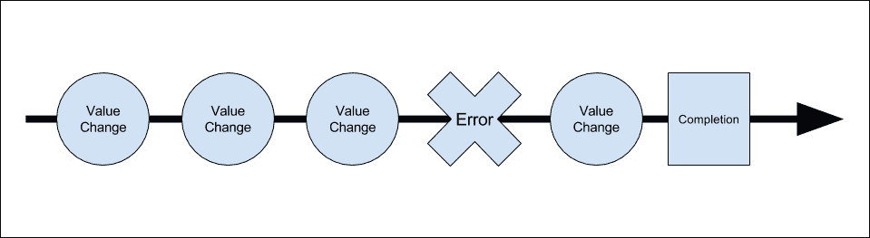

# 第八章：创建一个 MEAN CRUD 模块

在之前的章节中，您学习了如何设置每个框架以及如何将它们全部连接在一起。在本章中，您将实现 MEAN 应用程序的基本操作构建模块，即 CRUD 模块。CRUD 模块由一个基本实体和创建、读取、更新和删除实体实例的基本功能组成。在 MEAN 应用程序中，您的 CRUD 模块是从服务器端 Express 组件和一个 Angular 客户端模块构建的。在本章中，我们将涵盖以下主题：

+   设置 Mongoose 模型

+   创建 Express 控制器

+   连接 Express 路由

+   创建和组织 Angular 模块

+   理解 Angular 表单

+   介绍 Angular`http`客户端

+   实现 Angular 模块服务

+   实现 Angular 模块组件

# 介绍 CRUD 模块

CRUD 模块是 MEAN 应用程序的基本构建模块。每个 CRUD 模块由支持 Express 和 Angular 功能的两个结构组成。Express 部分是建立在 Mongoose 模型、Express 控制器和 Express 路由文件之上的。Angular 模块稍微复杂，包含一组模板和一些 Angular 组件、服务和路由配置。在本章中，您将学习如何将这些组件组合起来，以构建一个示例的`Article`CRUD 模块。本章的示例将直接从前几章中的示例继续，因此请从第七章 *Angular 简介*中复制最终示例，然后从那里开始。

# 设置 Express 组件

让我们从模块的 Express 部分开始。首先，您将创建一个 Mongoose 模型，用于保存和验证您的文章。然后，您将继续创建处理模块业务逻辑的 Express 控制器。最后，您将连接 Express 路由，以生成控制器方法的 RESTful API。我们将从 Mongoose 模型开始。

## 创建 Mongoose 模型

Mongoose 模型将由四个简单的属性组成，代表我们的`Article`实体。让我们从在`app/models`文件夹中创建 Mongoose 模型文件开始；创建一个名为`article.server.model.js`的新文件，其中包含以下代码片段：

```js
const mongoose = require('mongoose');
const Schema = mongoose.Schema;

const ArticleSchema = new Schema({
  created: {
    type: Date,
    default: Date.now
  },
  title: {
    type: String,
    default: '',
    trim: true,
    required: 'Title cannot be blank'
  },
  content: {
    type: String,
    default: '',
    trim: true
  },
  creator: {
    type: Schema.ObjectId,
    ref: 'User'
  }
});

mongoose.model('Article', ArticleSchema);
```

您应该熟悉这段代码片段，所以让我们快速浏览一下这个模型。首先，您包含了您的模型依赖项，然后使用 Mongoose 的`Schema`对象创建了一个新的`ArticleSchema`。`ArticleSchema`定义了四个模型字段：

+   `created`：这是一个日期字段，表示文章创建的时间

+   `title`：这是一个字符串字段，表示文章标题；请注意如何使用了必需的验证，以确保所有文章都有标题

+   `content`：这是一个字符串字段，表示文章内容

+   `creator`：这是一个表示创建文章的用户的引用对象

最后，您注册了`Article`Mongoose 模型，以便在`Articles`Express 控制器中使用它。接下来，您需要确保您的应用程序正在加载模型文件，因此返回到`config/mongoose.js`文件，并进行以下更改：

```js
const config = require('./config');
const mongoose = require('mongoose');

module.exports = function() {
  const db = mongoose.connect(config.db);

  require('../app/models/user.server.model');
  require('../app/models/article.server.model');

  return db;
};
```

这将加载您的新模型文件，并确保您的应用程序可以使用您的`Article`模型。一旦配置了模型，您就可以创建您的`Articles`控制器。

## 设置 Express 控制器

Express 控制器负责在服务器端管理与文章相关的功能。它旨在为 MongoDB 文章文档提供基本的 CRUD 操作。要开始编写 Express 控制器，请转到您的`app/controllers`文件夹，并创建一个名为`articles.server.controller.js`的新文件。在您新创建的文件中，添加以下依赖项：

```js
const mongoose = require('mongoose');
const Article = mongoose.model('Article');
```

在前面的代码行中，你基本上只包含了你的`Article` mongoose 模型。现在，在开始创建 CRUD 方法之前，建议你为验证和其他服务器错误创建一个错误处理方法。

### Express 控制器的错误处理方法

为了处理 Mongoose 错误，最好编写一个简单的错误处理方法，它将负责从 Mongoose 错误对象中提取简单的错误消息，并将其提供给你的控制器方法。回到你的`app/controllers/articles.server.controller.js`文件，并添加以下代码行：

```js
function getErrorMessage (err) {
  if (err.errors) {
    for (let errName in err.errors) {
      if (err.errors[errName].message) return err.errors[errName].message;
    }
  } else {
    return 'Unknown server error';
  }
};
```

`getErrorMessage()`方法接收 Mongoose 错误对象作为参数，然后遍历错误集合并提取第一个消息。这样做是因为你不希望一次向用户展示多个错误消息。现在你已经设置好了错误处理，是时候编写你的第一个控制器方法了。

### Express 控制器的`create()`方法

Express 控制器的`create()`方法将提供创建新文章文档的基本功能。它将使用 HTTP 请求体作为文档的 JSON 基对象，并使用模型的`save()`方法将其保存到 MongoDB。要实现`create()`方法，请将以下代码添加到你的`app/controllers/articles.server.controller.js`文件中：

```js
exports.create = function(req, res) {
  const article = new Article(req.body);
  article.creator = req.user;

  article.save((err) => {
    if (err) {
      return res.status(400).send({
        message: getErrorMessage(err)
      });
    } else {
      res.status(200).json(article);
    }
  });
};
```

让我们来看一下`create()`方法的代码。首先，你使用 HTTP 请求体创建了一个新的`Article`模型实例。接下来，你将经过身份验证的`passport`用户添加为文章的`creator`。最后，你使用 Mongoose 实例的`save()`方法来保存文章文档。在`save()`回调函数中，值得注意的是你要么返回一个错误响应和适当的 HTTP 错误代码，要么返回新的`article`对象作为 JSON 响应。一旦你完成了`create()`方法，你将继续实现读取操作。读取操作包括两个方法：一个是检索文章列表的方法，另一个是检索特定文章的方法。让我们从列出文章集合的方法开始。

### Express 控制器的`list()`方法

Express 控制器的`list()`方法将提供检索现有文章列表的基本功能。它将使用模型的`find()`方法来检索文章集合中的所有文档，然后输出这个列表的 JSON 表示。要实现`list()`方法，请将以下代码添加到你的`app/controllers/articles.server.controller.js`文件中：

```js
exports.list = function(req, res) {
  Article.find().sort('-created').populate('creator', 'firstName lastName fullName').exec((err, articles) => {
    if (err) {
      return res.status(400).send({
        message: getErrorMessage(err)
      });
    } else {
      res.status(200).json(articles);
    }
  });
};
```

在这个控制器方法中，注意你如何使用 Mongoose 的`find()`函数来获取文章文档的集合，虽然我们可以添加一些 MongoDB 查询，但现在我们将检索集合中的所有文档。接下来，注意文章集合是如何使用`created`属性进行排序的。然后，你可以看到 Mongoose 的`populate()`方法是如何用来向`articles`对象的`creator`属性添加一些用户字段的。在这种情况下，你填充了`creator`用户对象的`firstName`、`lastName`和`fullName`属性。

CRUD 操作的其余部分涉及对单个现有文章文档的操作。当然，你可以在每个方法中实现对文章文档的检索，基本上重复这个逻辑。然而，Express 路由器有一个很好的特性用于处理路由参数，所以在实现 Express CRUD 功能的其余部分之前，你首先要学习如何利用路由参数中间件来节省一些时间和代码冗余。

### Express 控制器的`read()`中间件

Express 控制器的 read() 方法将提供从数据库中读取现有文章文档的基本功能。由于您正在编写一种类似 RESTful API 的东西，因此这种方法的常见用法将通过将文章的 ID 字段作为路由参数来处理。这意味着您发送到服务器的请求将在其路径中包含一个 `articleId` 参数。

幸运的是，Express 路由器提供了 `app.param()` 方法来处理路由参数。该方法允许您为包含 `articleId` 路由参数的所有请求附加一个中间件。然后中间件本身将使用提供的 `articleId` 来查找适当的 MongoDB 文档，并将检索到的 `article` 对象添加到请求对象中。这将允许所有操作现有文章的控制器方法从 Express 请求对象中获取 `article` 对象。为了更清晰，让我们实现路由参数中间件。转到您的 `app/controllers/articles.server.controller.js` 文件并追加以下代码行：

```js
exports.articleByID = function(req, res, next, id) {
  Article.findById(id).populate('creator', 'firstName lastName fullName').exec((err, article) => {
    if (err) return next(err);
    if (!article) return next(new Error('Failed to load article ' + id));

    req.article = article;
    next();
  });
};
```

如您所见，中间件函数签名包含所有 Express 中间件参数和一个 `id` 参数。然后使用 `id` 参数查找文章，并使用 `req.article` 属性引用它。请注意，Mongoose 模型的 `populate()` 方法用于向 `article` 对象的 `creator` 属性添加一些用户字段。在这种情况下，您填充了 `creator` 用户对象的 `firstName`、`lastName` 和 `fullName` 属性。

当您连接 Express 路由时，您将学习如何将 `articleByID()` 中间件添加到不同的路由，但现在让我们添加 Express 控制器的 `read()` 方法，它将返回一个 `article` 对象。要添加 `read()` 方法，请将以下代码行追加到您的 `app/controllers/articles.server.controller.js` 文件中：

```js
exports.read = function(req, res) {
  res.status(200).json(req.article);
};
```

相当简单，不是吗？那是因为您已经在 `articleByID()` 中间件中处理了获取 `article` 对象的问题，所以现在您所需做的就是以 JSON 表示形式输出 `article` 对象。我们将在接下来的部分连接中间件和路由，但在此之前，让我们完成实现 Express 控制器的 CRUD 功能。

### Express 控制器的 update() 方法

Express 控制器的 update() 方法将提供更新现有文章文档的基本操作。它将使用现有的 `article` 对象作为基础对象，然后使用 HTTP 请求体更新 `title` 和 `content` 字段。它还将使用模型的 `save()` 方法将更改保存到数据库。要实现 `update()` 方法，请转到您的 `app/controllers/articles.server.controller.js` 文件并追加以下代码行：

```js
exports.update = function(req, res) {
  const article = req.article;

  article.title = req.body.title;
  article.content = req.body.content;

  article.save((err) => {
    if (err) {
      return res.status(400).send({
        message: getErrorMessage(err)
      });
    } else {
      res.status(200).json(article);
    }
  });
};
```

如您所见，`update()` 方法还假设您已经在 `articleByID()` 中间件中获取了 `article` 对象。因此，您所需做的就是更新 `title` 和 `content` 字段，保存文章，然后以 JSON 表示形式输出更新后的 `article` 对象。如果出现错误，它将使用您之前编写的 `getErrorMessage()` 方法和 HTTP 错误代码输出适当的错误消息。剩下要实现的最后一个 CRUD 操作是 `delete()` 方法；所以让我们看看如何向 Express 控制器添加一个简单的 `delete()` 方法。

### Express 控制器的 delete() 方法

Express 控制器的 delete() 方法将提供删除现有文章文档的基本操作。它将使用模型的 `remove()` 方法从数据库中删除现有文章。要实现 `delete()` 方法，请转到您的 `app/controllers/articles.server.controller.js` 文件并追加以下代码行：

```js
exports.delete = function(req, res) {
  const article = req.article;

  article.remove((err) => {
    if (err) {
      return res.status(400).send({
        message: getErrorMessage(err)
      });
    } else {
      res.status(200).json(article);
    }
  });
};
```

同样，您可以看到`delete()`方法也利用了已经获取的`article`对象，通过`articleByID()`中间件。因此，您所需做的就是调用 Mongoose 模型的`remove()`方法，然后输出已删除的`article`对象作为 JSON 表示。如果出现错误，它将使用您之前编写的`getErrorMessage()`方法输出适当的错误消息和 HTTP 错误代码。

恭喜！您刚刚完成了实现 Express 控制器的 CRUD 功能。在继续连接调用这些方法的 Express 路线之前，让我们花点时间来实现两个授权中间件。

### 实施身份验证中间件

在构建 Express 控制器时，您可能已经注意到大多数方法要求用户进行身份验证。例如，如果`req.user`对象未分配，`create()`方法将无法操作。虽然您可以在方法内部检查此分配，但这将强制您一遍又一遍地实施相同的验证代码。相反，您可以使用 Express 中间件链来阻止未经授权的请求执行您的控制器方法。您应该实施的第一个中间件将检查用户是否已经认证。由于这是一个与身份验证相关的方法，最好将其实施在 Express`users`控制器中，因此转到`app/controllers/users.server.controller.js`文件，并追加以下代码行：

```js
exports.requiresLogin = function(req, res, next) {
  if (!req.isAuthenticated()) {
    return res.status(401).send({
      message: 'User is not logged in'
    });
  }

  next();
};
```

`requiresLogin()`中间件使用 Passport 启动的`req.isAuthenticated()`方法来检查用户当前是否已经认证。如果发现用户确实已登录，它将调用链中的下一个中间件；否则，它将以身份验证错误和 HTTP 错误代码进行响应。这个中间件很棒，但如果您想检查特定用户是否被授权执行某个操作，您需要实施一个特定于文章的授权中间件。

### 实施授权中间件

在您的 CRUD 模块中，有两种方法可以编辑现有的文章文档。通常，`update()`和`delete()`方法应该受限，以便只有创建文章的用户才能使用它们。这意味着您需要授权对这些方法的任何请求，以验证当前文章是否正在被其创建者编辑。为此，您需要向`Articles`控制器添加一个授权中间件，因此转到`app/controllers/articles.server.controller.js`文件，并追加以下代码行：

```js
exports.hasAuthorization = function(req, res, next) {
    if (req.article.creator.id !== req.user.id) {
        return res.status(403).send({
            message: 'User is not authorized'
        });
    }

    next();
};
```

`hasAuthorization()`中间件使用`req.article`和`req.user`对象来验证当前用户是否是当前文章的创建者。该中间件还假定它仅对包含`articleId`路由参数的请求执行。现在，您已经将所有方法和中间件放置好，是时候连接启用它们的路线了。

## 连接 Express 路线

在我们开始连接 Express 路线之前，让我们快速回顾一下 RESTful API 的架构设计。RESTful API 提供了一个连贯的服务结构，代表了您可以在应用程序资源上执行的一组操作。这意味着 API 使用预定义的路由结构以及 HTTP 方法名称，以提供 HTTP 请求的上下文。虽然 RESTful 架构可以以不同的方式应用，但 RESTful API 通常遵守一些简单的规则：

+   每个资源的基本 URI，在我们的情况下是`http://localhost:3000/articles`

+   一个数据结构，通常是 JSON，传递到请求体中

+   使用标准的 HTTP 方法（例如，`GET`，`POST`，`PUT`和`DELETE`）

使用这三条规则，您将能够正确地路由 HTTP 请求以使用正确的控制器方法。因此，您的文章 API 将包括五条路线：

+   `GET http://localhost:3000/articles`：这将返回一系列文章

+   `POST http://localhost:3000/articles`：这将创建并返回新文章

+   `GET http://localhost:3000/articles/:articleId`：这将返回单个现有文章

+   `PUT http://localhost:3000/articles/:articleId`：这将更新并返回单个现有文章

+   `DELETE http://localhost:3000/articles/:articleId`：这将删除并返回单篇文章

您可能已经注意到，这些路由已经有了相应的控制器方法。甚至已经实现了`articleId`路由参数中间件，因此剩下的就是实现 Express 路由。为此，请转到`app/routes`文件夹，并创建一个名为`articles.server.routes.js`的新文件。在您新创建的文件中，粘贴以下代码片段：

```js
const users = require('../../app/controllers/users.server.controller');
const articles = require('../../app/controllers/articles.server.controller');

module.exports = function(app) {
  app.route('/api/articles')
     .get(articles.list)
     .post(users.requiresLogin, articles.create);

  app.route('/api/articles/:articleId')
     .get(articles.read)
     .put(users.requiresLogin, articles.hasAuthorization, articles.update)
     .delete(users.requiresLogin, articles.hasAuthorization, articles.delete);

  app.param('articleId', articles.articleByID);
};
```

在上述代码片段中，您做了几件事。首先，您需要了`users`和`articles`控制器，然后使用 Express 的`app.route()`方法来定义 CRUD 操作的基本路由。您使用 Express 路由方法将每个控制器方法与特定的 HTTP 方法进行了连接。您可能还注意到`POST`方法如何使用`users.requiresLogin()`中间件，因为用户需要在创建新文章之前登录。同样，`PUT`和`DELETE`方法使用了`users.requiresLogin()`和`articles.hasAuthorization()`中间件，因为用户只能编辑和删除他们创建的文章。最后，您使用了`app.param()`方法来确保具有`articleId`参数的每个路由将首先调用`articles.articleByID()`中间件。接下来，您需要配置 Express 应用程序以加载您的新`Article`模型和路由文件。

## 配置 Express 应用程序

为了使用您的新的 Express 资源，您必须配置 Express 应用程序以加载您的路由文件。为此，请返回到您的`config/express.js`文件并进行更改，如下所示：

```js
const path = require('path');
const config = require('./config');
const express = require('express');
const morgan = require('morgan');
const compress = require('compression');
const bodyParser = require('body-parser');
const methodOverride = require('method-override');
const session = require('express-session');
const flash = require('connect-flash');
const passport = require('passport');

module.exports = function() {
  const app = express();

  if (process.env.NODE_ENV === 'development') {
    app.use(morgan('dev'));
  } else if (process.env.NODE_ENV === 'production') {
    app.use(compress());
  }

  app.use(bodyParser.urlencoded({
    extended: true
  }));
  app.use(bodyParser.json());
  app.use(methodOverride());

  app.use(session({
    saveUninitialized: true,
    resave: true,
    secret: config.sessionSecret
  }));

  app.set('views', './app/views');
  app.set('view engine', 'ejs');

  app.use(flash());
  app.use(passport.initialize());
  app.use(passport.session());

  app.use('/', express.static(path.resolve('./public')));
  app.use('/lib', express.static(path.resolve('./node_modules')));

  require('../app/routes/users.server.routes.js')(app);  
  require('../app/routes/articles.server.routes.js')(app);
  require('../app/routes/index.server.routes.js')(app);

  return app;
}; 
```

就是这样；您的文章的 RESTful API 已经准备就绪！接下来，您将学习如何简单地使用`HTTP`客户端让您的 Angular 组件与其通信。

# 使用 HTTP 客户端

在第七章中，*Angular 简介*，我们提到`http`客户端作为 Angular 2 应用程序与后端 API 之间通信的手段。由于 REST 架构结构良好，因此很容易为我们的 Angular 模块实现一个服务，并通过 API 提供给我们的组件，以便与服务器通信。为此，Angular http 客户端利用 Observable 模式来处理其异步性质，因此在继续之前，最好快速回顾一下这个强大的模式。

## 响应式编程和 Observables

在编程中，我们大多数情况下期望事情按顺序运行，所有指令都按顺序发生。然而，从一开始，Web 应用程序开发就遭受了缺乏同步性的问题。当处理数据时，特别是在我们的情况下，从服务器检索到的数据时，这是一个特别大的问题。为了解决这个问题，创建了各种不同的模式，现在我们主要使用回调和 Promise 模式。回调在大部分 JavaScript 的生命周期中都是首选，而最近，Promise 开始受到一些关注。然而，Promise 的寿命很短。更准确地说，Promise 可以设置，但只能延迟一次，但我们的数据可能随着时间的推移而改变，所以我们需要创建更多的 Promise。举个例子，假设我们想跟踪对文本字段所做的所有更改并实现“撤销”功能；为此，我们可以使用回调来处理文本更改事件，然后记录所有更改并对其进行处理。这可能看起来很简单，但如果我们有数百个对象，或者如果我们的文本字段值是以编程方式更改的呢？这只是一个非常简单的例子，但这种情况在现代应用程序开发中以各种方式重复出现，为了解决这个问题，出现了一种新的方法论，称为响应式编程。您可能听说过响应式编程，也可能没有，但最容易理解它的方法是意识到它主要是跟踪随时间变化的异步数据，它通过使用 Observables 来实现这一点。Observables 是可以被一个或多个观察者观察的数据流。Observable 会随着时间发出值，并通过新值、错误或完成事件通知“订阅”的观察者。这种机制的可视化表示可以在下图中看到：



在这个图表中，您可以看到 Observables 不断发出值的变化，一个错误，另一个值的变化，然后在 Observable 完成其生命周期时发出完成事件。响应式编程可能看起来很复杂，但幸运的是，ReactiveX 库允许我们以非常简单的方式处理 Observables。

### 注意

建议您继续阅读有关响应式编程的内容，因为它正在迅速成为现代 Web 应用程序开发的主要方法。

# ReactiveX 库

Rx 库是一个跨平台库，它使用观察者模式来帮助开发人员管理随时间发生的异步数据更改。简而言之，ReactiveX 是一个允许我们创建和操作 Observable 对象的库。在 Angular 2 项目中，我们使用 RxJS 库，它基本上是 ReactiveX 库的 JavaScript 版本。如果您仔细观察前一章，您将看到我们已经设置了它，甚至在我们的身份验证服务中使用了它。我们通过使用`npm`安装它来实现这一点：

```js
...
"rxjs": "5.0.0-beta.12",
...

```

我们在实体中导入它如下：

```js
...
import 'rxjs/Rx';

```

我们不得不这样做是因为 Angular 团队选择广泛使用 Observables。我们第一次遇到它是在使用 http 客户端时。

## 使用 http 客户端

`http`模块为我们提供了与 RESTful 端点通信的标准化方式。要使用`http`客户端，我们需要将其导入并注入到我们的实体中，然后使用我们的`http`客户端实例执行不同的 HTTP 请求。在第七章中，我们展示了使用 http 客户端执行 POST 请求的简单示例，*Angular 简介*中我们在登录方法中使用了它：

```js
signin(credentials: any): Observable<any> {
      let body = JSON.stringify(credentials);
      let headers = new Headers({ 'Content-Type': 'application/json' });
      let options = new RequestOptions({ headers: headers });

  return this.http.post(this._signinURL, body, options)
                        .map(res => this.user = res.json())
                        .catch(this.handleError)
  }

```

正如您所看到的，我们创建了一个 JSON 字符串，并在调用`http`客户端的`post()`方法之前使用`RequestOptions`对象设置了请求头。`http`客户端方法返回一个 Observable 对象，跟踪 HTTP 响应对象。但是由于我们希望我们的服务提供数据，我们使用`map()`方法提取响应的 JSON 对象。

### 注意

我们需要使用`json()`方法，因为 Angular 遵循 HTTP 响应对象的 ES2015 规范。

请注意，我们还使用我们的`handleError()`方法捕获任何错误。那么我们如何使用从这个方法返回的 Observable 对象？如果您回顾一下我们的`signin`组件，您将能够看到我们如何使用我们的认证服务：

```js
signin() {
    this._authenticationService.signin(this.credentials).subscribe(
    result  => this._router.navigate(['/']), 
    error =>  this.errorMessage = error );
  }
}

```

在这个方法中，我们调用了认证服务的登录方法，然后订阅返回的 Observable。然后我们用第一个箭头函数处理任何值事件，用第二个箭头函数处理任何错误。这基本上是我们使用 HTTP 客户端的方式！

HTTP 客户端提供了各种方法来处理不同的 HTTP 请求：

+   `request(url, options)`: 这个方法允许我们执行由选项对象定义的任何 HTTP 请求。

+   `get()`: 这个方法执行一个`GET` HTTP 请求。

+   `post()`: 这个方法执行一个`POST` HTTP 请求。

+   `put()`: 这个方法执行一个`PUT` HTTP 请求。

+   `delete()`: 这个方法执行一个`DELETE` HTTP 请求。

所有这些方法都返回一个可订阅或可操作的响应 Observable 对象。

### 注意

一个重要的事情要注意的是，HTTP 客户端总是返回一个“冷”可观察对象。这意味着请求本身直到有人订阅可观察对象才会被发送。

在下一节中，您将学习如何使用`http`客户端与您的 Express API 进行通信。

# 实现 Angular 模块

您的 CRUD 模块的第二部分是 Angular 模块。这个模块将包含一个 Angular 服务，该服务将使用`http`客户端与 Express API 进行通信，一个包含四个子组件的 Angular 文章组件，这些子组件具有一组模板，为您的用户提供执行 CRUD 操作的界面。在开始创建您的 Angular 实体之前，让我们首先创建初始模块结构。转到您的应用程序的`public/app`文件夹，并创建一个名为`articles`的新文件夹。在这个新文件夹中，创建名为`articles.module.ts`的模块文件，并粘贴以下代码行：

```js
import { NgModule }       from '@angular/core';
import { CommonModule }   from '@angular/common';
import { FormsModule }    from '@angular/forms';
import { RouterModule } from '@angular/router';

import { ArticlesRoutes } from './articles.routes';
import { ArticlesComponent } from './articles.component';
import { CreateComponent } from './create/create.component';
import { ListComponent } from './list/list.component';
import { ViewComponent } from './view/view.component';
import { EditComponent } from './edit/edit.component';

@NgModule({
  imports: [
    CommonModule,
    FormsModule,
    RouterModule.forChild(ArticlesRoutes),
  ],
  declarations: [
    ArticlesComponent,
    CreateComponent,
    ListComponent,
    ViewComponent,
    EditComponent,
  ]
})
export class ArticlesModule {}
```

正如您所看到的，我们只是从 Angular 包中导入了我们需要的模块，以及我们新模块的组件、服务和路由定义。接下来，我们创建了一个新的 Angular 模块，它作为子路由导入了 Angular 模块和我们的路由配置，然后声明了我们新模块的组件。现在，我们可以继续创建我们的主组件文件。为此，在您的`public/app`文件夹中创建一个名为`articles.component.ts`的文件，并粘贴以下代码行：

import { Component } from '@angular/core';

```js
import { ArticlesService } from './articles.service';

@Component({
  selector: 'articles',
  template: '<router-outlet></router-outlet>',
  providers: [ArticlesService]
})
export class ArticlesComponent {}

```

在这个文件中，我们导入了基本的 Angular 模块和我们即将创建的文章服务。然后我们创建了一个使用`router-outlet`并注入我们的服务的新组件。接下来，我们需要为我们的`articles`组件创建一个路由配置。为此，创建一个名为`articles.routes.ts`的文件，并粘贴以下代码行：

```js
import { Routes } from '@angular/router';

import { ArticlesComponent } from './articles.component';
import { CreateComponent } from './create/create.component';
import { ListComponent } from './list/list.component';
import { ViewComponent } from './view/view.component';
import { EditComponent } from './edit/edit.component';

export const ArticlesRoutes: Routes = [{
  path: 'articles',
  component: ArticlesComponent,
  children: [
    {path: '', component: ListComponent},
    {path: 'create', component: CreateComponent},
    {path: ':articleId', component: ViewComponent},
    {path: ':articleId/edit', component: EditComponent}
  ],
}];

```

正如您所看到的，我们简单地为我们的组件及其子组件创建了一个路由配置。这段代码应该很熟悉，因为它类似于我们在上一章中实现的认证路由。此外，在我们的更新和查看路径中，我们定义了一个 URL 参数，形式为冒号后跟我们的参数名称，这种情况下是`articleId`参数。

接下来，您需要在我们的应用程序模块配置中导入我们的文章模块。为此，返回到您的`public/app/app.module.ts`文件，并将其更改如下：

```js
import { NgModule }       from '@angular/core';
import { BrowserModule }  from '@angular/platform-browser';
import { FormsModule }    from '@angular/forms';
import { RouterModule }   from '@angular/router';
import { HttpModule, RequestOptions } from '@angular/http';
import { LocationStrategy, HashLocationStrategy } from '@angular/common';

import { AppComponent }       from './app.component';
import { AppRoutes }       from './app.routes';

import { HomeModule } from './home/home.module';
import { AuthenticationService } from './authentication/authentication.service';
import { AuthenticationModule } from './authentication/authentication.module';
import { ArticlesModule } from './articles/articles.module';

@NgModule({
  imports: [
    BrowserModule,
    HttpModule,
    FormsModule,
    AuthenticationModule,
    HomeModule,
    ArticlesModule,
    RouterModule.forRoot(AppRoutes),
  ],
  declarations: [
    AppComponent
  ],
  providers: [
    AuthenticationService
  ],
  bootstrap: [AppComponent]
})
export class AppModule { }
```

这就完成了我们新模块的配置。现在我们可以继续创建我们的模块实体。我们将从我们的模块服务开始。

## 创建 Angular 模块服务

为了使您的 CRUD 模块能够轻松与 API 端点通信，建议您使用一个单一的 Angular 服务，该服务将利用`http`客户端方法。为此，请转到您的`public/app/articles`文件夹，并创建一个名为`articles.service.ts`的新文件，其中包含以下代码行：

```js
import 'rxjs/Rx';
import {Observable} from 'rxjs/Observable';

import {Injectable} from '@angular/core';
import {Http, Headers, Request, RequestMethod, Response} from '@angular/http';

@Injectable()
export class ArticlesService {
  private _baseURL = 'api/articles';

  constructor (private _http: Http) {}

  create(article: any): Observable<any> {
    return this._http
      .post(this._baseURL, article)
      .map((res: Response) => res.json())
      .catch(this.handleError);
    }

  read(articleId: string): Observable<any> {
    return this._http
      .get(`${this._baseURL}/${articleId}`)
      .map((res: Response) => res.json())
      .catch(this.handleError);
  }

  update(article: any): Observable<any> {
    return this._http
      .put(`${this._baseURL}/${article._id}`, article)
      .map((res: Response) => res.json())
      .catch(this.handleError);
    }

  delete(articleId: any): Observable<any> {
    return this._http
      .delete(`${this._baseURL}/${articleId}`)
      .map((res: Response) => res.json())
      .catch(this.handleError);
  }  

  list(): Observable<any> {
    return this._http
      .get(this._baseURL)
      .map((res: Response) => res.json())
      .catch(this.handleError);
  }

  private handleError(error: Response) {
    return Observable.throw(error.json().message || 'Server error');
  }
}
```

让我们来回顾一下。首先，我们从 Angular 库中导入了`Observable`和`rxjs`库模块。您可能注意到我们导入了整个库，因为我们需要在 Observable 对象中使用各种操作符，例如`map()`方法。

接下来，我们从 Angular 库中导入了我们需要的模块，并使用`@Injectable`装饰器创建了我们的可注入服务。我们的服务有一个属性来保存我们的 API 基本 URL，并且有一个构造函数来注入 HTTP 客户端。它包含一个处理服务器错误的方法。我们的其他方法都很容易理解：

+   `create()`: 接受文章对象并使用 HTTP POST 请求将其发送到服务器

+   `read()`: 接受`文章 ID`字符串并使用 HTTP GET 请求向服务器请求文章对象

+   `update()`: 接受文章对象并使用 HTTP PUT 请求将其发送到服务器进行更新

+   `delete()`: 接受`文章 ID`字符串并尝试使用 HTTP DELETE 请求删除它

+   `list()`: 使用 HTTP GET 请求请求文章对象数组

注意我们如何将响应对象映射为只发送 JSON 对象，并且如何捕获任何错误以修改响应，以便我们的组件只需处理数据本身。

就是这样！我们的模块基础设施已经为我们的子组件准备好了。在接下来的章节中，您将能够看到我们如何利用之前的准备来轻松实现我们的实现。

## 实现创建子组件

我们的“创建”子组件将负责创建新文章。首先在`public/app/articles`文件夹内创建一个名为`create`的新文件夹。在此文件夹中，创建一个名为`create.component.ts`的新文件，并粘贴以下代码：

```js
import { Component } from '@angular/core';
import { Router } from '@angular/router';

import { ArticlesService } from '../articles.service';

@Component({
  selector: 'create',
  templateUrl: 'app/articles/create/create.template.html'
})
export class CreateComponent {
  article: any = {};
  errorMessage: string;

  constructor(private _router:Router,
        private _articlesService: ArticlesService) {}

  create() {
    this._articlesService
      .create(this.article)
      .subscribe(createdArticle => this._router.navigate(['/articles', createdArticle._id]),
               error =>  this.errorMessage = error);
  }
}

```

让我们来回顾一下。我们首先从 Angular 库中导入了我们需要的模块以及我们的`ArticlesService`。然后，我们创建了一个带有空文章和`errorMessage`对象的组件。注意我们的组件构造函数如何注入了`Router`和我们的`ArticlesService`服务。然后，我们创建了一个`create()`方法，该方法使用`ArticlesService`来创建一个新的文章对象。在我们的可观察订阅中，我们使用`Router`服务导航到我们的视图组件以及新创建的`文章 ID`。在出现错误的情况下，我们将组件的`errorMessage`属性设置为该消息。为了完成我们的子组件，我们需要创建其模板。

### 添加模板

`create`模板将为您的用户提供一个创建新文章的界面。它将包含一个 HTML 表单，并且将使用您组件的`create`方法来保存新文章。要创建您的模板，请转到`public/app/articles/create`文件夹，并创建一个名为`create.template.html`的新文件。在您的新文件中，粘贴以下代码片段：

```js
<h1>New Article</h1>
<form (ngSubmit)="create()" novalidate>
  <div>
    <label for="title">Title</label>
    <div>
      <input type="text" required [(ngModel)]="article.title" name="title" placeholder="Title">
    </div>
  </div>
  <div>
    <label for="content">Content</label>
    <div>
      <textarea type="text" required cols="30" rows="10" [(ngModel)]="article.content" name="content" placeholder="Content"></textarea>
    </div>
  </div>
  <div>
    <input type="submit">
  </div>

  <strong id="error">{{errorMessage}}</strong>
</form>

```

`create`模板包含一个简单的表单，其中包含两个文本输入字段和一个提交按钮。文本字段使用`ngModel`指令将用户输入绑定到我们组件的属性。还要注意在`form`元素中放置的`ngSubmit`指令。该指令告诉 Angular 在提交表单时调用特定的组件方法。在这种情况下，表单提交将执行您组件的`create()`方法。您应该注意到的最后一件事是表单末尾的错误消息，以防出现任何错误时会显示。接下来，我们将实现视图子组件。

## 实现视图子组件

我们的“查看”子组件将负责呈现单篇文章。我们的组件还将包含一组按钮，仅对文章创建者可见，这些按钮将允许创建者删除文章或导航到“编辑”路由。首先，在`public/app/articles`文件夹内创建一个名为`view`的新文件夹。在这个文件夹中，创建一个名为`view.component.ts`的新文件，并粘贴以下代码：

```js
import { Component } from '@angular/core';
import { Router, ActivatedRoute } from '@angular/router';
import { AuthenticationService } from '../../authentication/authentication.service';
import { ArticlesService } from '../articles.service';

@Component({
  selector: 'view',
  templateUrl: 'app/articles/view/view.template.html',
})
export class ViewComponent {
  user: any;
  article: any;
  paramsObserver: any;
  errorMessage: string;
  allowEdit: boolean = false;

  constructor(private _router:Router, 
        private _route: ActivatedRoute, 
        private _authenticationService: AuthenticationService, 
        private _articlesService: ArticlesService) {}

  ngOnInit() {
    this.user = this._authenticationService.user

    this.paramsObserver = this._route.params.subscribe(params => {
      let articleId = params['articleId'];

      this._articlesService
        .read(articleId)
        .subscribe(
          article => {
            this.article = article;
            this.allowEdit = (this.user && this.user._id === this.article.creator._id);
           },
          error => this._router.navigate(['/articles'])
        );
    });
  }

  ngOnDestroy() {
    this.paramsObserver.unsubscribe();
  }

  delete() {
    this._articlesService.delete(this.article._id).subscribe(deletedArticle => this._router.navigate(['/articles']),
                                 error => this.errorMessage = error);
  }
}
```

我们从 Angular 库中导入我们需要的模块以及我们的`ArticlesService`和`AuthenticationService`。然后，我们创建了一个具有文章属性、`currentUser`属性、`paramsObserver`属性、`allowEdit`标志和`errorMessage`属性的组件。请注意，我们的组件构造函数注入了`Router`、`RouteParams`和我们的`ArticlesService`和`AuthenticationService`服务。我们的构造函数还使用`AuthenticationService`实例设置了`currentUser`属性。在我们的`ngOnInit`方法中，当组件初始化时被调用，我们从路由参数中读取`文章 ID`参数，然后使用`ArticlesService`来获取现有的文章。我们使用`ActivatedRoute`来完成这个操作，它为我们提供了一个`params` Observable。我们在组件的`ngOnDestroy`方法中取消了对这个 Observable 的订阅。在我们的 Observable 订阅中，我们设置了组件的`article`属性，并确定当前用户是否可以编辑文章。在出现错误时，我们使用`Router`服务来导航回到我们的`List`路由。最后，我们实现了一个`delete()`方法，该方法使用`ArticlesService`来删除查看的文章并返回到文章列表。要完成我们的子组件，我们需要创建它的模板。

### 添加模板

“视图”模板将为用户提供一个界面来“查看”现有文章。您的模板还将包含一组按钮，仅对文章创建者可见，这些按钮将允许创建者删除文章或导航到“编辑”路由。要创建模板，请转到`public/app/articles/view`文件夹，并创建一个名为`view.template.html`的新文件。在新文件中，粘贴以下代码片段：

```js
<section *ngIf="article && article.creator">
  <h1>{{article.title}}</h1>

  <div *ngIf="allowEdit">
      <a [routerLink]="['/articles', article._id, 'edit']">edit</a>
      <button (click)="delete()">delete</button>
  </div>
  <small>
      <em>Posted on {{article.created}} by {{article.creator.fullName}}</em>
  </small>

  <p>{{article.content}}</p>
</section>
```

`view`模板包含一组简单的 HTML 元素，使用`双大括号`语法呈现文章信息。还要注意您如何使用`ngIf`指令，仅向文章的创建者呈现文章编辑链接和删除按钮。编辑链接将引导用户到`edit`子组件，而删除按钮将调用您的控制器的`delete()`方法。接下来，我们将实现我们的编辑组件。

## 实现编辑子组件

我们的“编辑”子组件将负责编辑现有文章。首先，在`public/app/articles`文件夹内创建一个名为`edit`的新文件夹。在这个文件夹中，创建一个名为`edit.component.ts`的新文件，并粘贴以下代码：

```js
import { Component } from '@angular/core';
import { Router, ActivatedRoute } from '@angular/router';

import { ArticlesService } from '../articles.service';

@Component({
  selector: 'edit',
  templateUrl: 'app/articles/edit/edit.template.html'
})
export class EditComponent {
  article: any = {};
  errorMessage: string;
  paramsObserver: any;

  constructor(private _router:Router, 
        private _route: ActivatedRoute, 
        private _articlesService: ArticlesService) {}

  ngOnInit() {
    this.paramsObserver = this._route.params.subscribe(params => {
      let articleId = params['articleId'];

      this._articlesService.read(articleId).subscribe(article => {
                                this.article = article;
                               },
                              error => this._router.navigate(['/articles']));
    });
  }

  ngOnDestroy() {
    this.paramsObserver.unsubscribe();
  }

  update() {
    this._articlesService.update(this.article).subscribe(savedArticle => this._router.navigate(['/articles', savedArticle._id]),
                                  error =>  this.errorMessage = error);
  }
}
```

再次，我们从 Angular 库中导入我们需要的模块以及我们的`ArticlesService`。然后，我们创建了一个具有文章属性和`errorMessage`属性的组件。在我们的构造函数中，我们从路由参数中读取`文章 ID`，然后使用`ArticlesService`来获取现有的文章。在我们的 Observable 订阅中，我们设置了组件的文章属性，并在出现错误时，我们使用`Router`服务来导航回到我们的 List 路由。最后，我们实现了一个`update()`方法，该方法使用`ArticlesService`来更新查看的文章并返回到 View 路由。要完成我们的子组件，我们需要创建它的模板。

### 添加模板

`edit` 模板将为用户提供一个界面来更新现有文章。它将包含一个 HTML 表单，并使用你的组件的 `update()` 方法来保存更新后的文章。要创建这个模板，转到 `public/app/articles/edit` 文件夹并创建一个名为 `edit.template.html` 的新文件。在你的新文件中，粘贴以下 HTML 代码：

```js
<h1>Edit Article</h1>
<form (ngSubmit)="update()" novalidate>
    <div>
        <label for="title">Title</label>
        <div>
            <input type="text" required [(ngModel)]="article.title" name="title" placeholder="Title">
        </div>
    </div>
    <div>
        <label for="content">Content</label>
        <div>
            <textarea type="text" required cols="30" rows="10" [(ngModel)]="article.content" name="content" placeholder="Content"></textarea>
        </div>
    </div>
    <div>
        <input type="submit" value="Update">
    </div>

    <strong>{{errorMessage}}</strong>
</form>
```

`edit` 模板包含一个简单的表单，其中有两个文本输入字段和一个提交按钮。文本字段使用 `ngModel` 指令将用户输入绑定到组件的 `article` 属性。还要注意在 `form` 元素中放置的 `ngSubmit` 指令。这次，该指令告诉 Angular 表单提交应执行组件的 `update()` 方法。你应该注意到的最后一件事是表单末尾的错误消息，在编辑错误的情况下会显示出来。我们的最终子组件是我们的 List 子组件。

## 实现 List 子组件

我们的 "List" 子组件将负责呈现文章列表。我们将首先在 `public/app/articles` 文件夹内创建一个名为 `list` 的新文件夹。在这个文件夹中，创建一个名为 `list.component.ts` 的新文件，并粘贴以下代码：

```js
import { Component } from '@angular/core';
import { ArticlesService } from '../articles.service';

@Component({
  selector: 'list',
  templateUrl: 'app/articles/list/list.template.html'
})
export class ListComponent{
  articles: any;
  errorMessage: string;

  constructor(private _articlesService: ArticlesService) {}

  ngOnInit() {
    this._articlesService.list().subscribe(articles  => this.articles = articles);
  }
}
```

我们首先从 Angular 库中导入我们需要的模块以及我们的 `ArticlesService`。然后，我们创建了一个具有 articles 属性和 errorMessage 属性的组件。注意我们组件的构造函数如何注入 `ArticlesService` 并使用它来获取文章列表。在我们的 Observables 订阅中，我们设置了组件的 articles 属性。现在我们只剩下实现组件的模板了。

### 添加模板

`list` 模板将为用户提供一个查看现有文章列表的界面。我们的模板将使用 `ngFor` 指令来呈现一系列 HTML 元素，每个元素代表一篇文章。如果没有现有的文章，视图将提供用户导航到 `create` 路由。要创建你的视图，转到 `public/app/articles/list` 文件夹并创建一个名为 `list.template.html` 的新文件。在你的新文件中，粘贴以下代码片段：

```js
<h1>Articles</h1>
<ul>
  <li *ngFor="let article of articles">
    <a [routerLink]="['/articles', article._id]">{{article.title}}</a>
    <br>
    <small>{{article.created}}/{{article.creator.fullName}}</small>
    <p>{{article.content}}</p>
  </li>
</ul>

<div *ngIf="articles && articles.length === 0">
  No articles yet, why don't you <a [routerLink]="['/articles/create']">create one</a>? 
</div>
```

`list` 模板包含一组简单的重复的 HTML 元素，代表文章列表。它使用 `ngFor` 指令为集合中的每篇文章复制列表项并显示每篇文章的信息。然后我们使用 `routerLink` 链接到单篇文章视图。还要注意我们如何使用 `ngIf` 指令来要求用户在没有现有文章的情况下创建一篇新文章。

通过实现你的 Angular 子组件，你实际上完成了你的第一个 CRUD 模块！现在剩下的就是向用户提供到我们新路由的链接。

# 总结

要完成我们的实现，最好是向用户提供到你的新 CRUD 模块路由的链接。为此，转到你的 `public/app/home/home.template.html` 文件并进行更改，如下所示：

```js
<div *ngIf="user">
  <h1>Hello {{user.firstName}}</h1>
  <a href="/api/auth/signout">Signout</a>
  <ul>
    <li><a [routerLink]="['/articles']">List Articles</a></li>
 <li><a [routerLink]="['/articles/create']">Create Article</a></li>
 </ul>
</div>

<div *ngIf="!user">
  <a [routerLink]="['/authentication/signup']">Signup</a>
  <a [routerLink]="['/authentication/signin']">Signin</a>
</div>

```

这个改变将只在用户登录时向用户显示到新的 `Articles` 组件路由的链接，并在用户未登录时隐藏它。就是这样！一切都准备就绪，可以测试你的新的 CRUD 模块了。使用命令行工具导航到 MEAN 应用程序的根文件夹，然后运行你的应用程序：

```js
$ npm start

```

当你的应用程序运行时，使用浏览器导航到 `http://localhost:3000`。你会看到注册和登录链接；尝试登录并观察主页视图的变化。然后，尝试导航到 `http://localhost:3000/articles` URL，并查看 `list` 组件如何建议你创建一个新文章。继续创建一个新文章，并尝试使用之前创建的组件编辑和删除它。你的 CRUD 模块应该是完全可操作的。

# 总结

在本章中，您学习了如何构建您的第一个 CRUD 模块。您首先定义了 Mongoose 模型和 Express 控制器，并学习了如何实现每个 CRUD 方法。您还使用 Express 中间件对控制器方法进行了授权。然后，您为模块方法定义了一个 RESTful API。您还学习了一些关于响应式编程和观察者模式的知识。您使用 HTTP 客户端与您的 API 进行通信。然后，您创建了您的 Angular 组件并实现了 Angular CRUD 功能。在连接 MEAN 应用程序的四个部分并创建您的第一个 CRUD 模块之后，在下一章中，您将使用 Socket.io 来实现服务器和客户端应用程序之间的实时连接。
