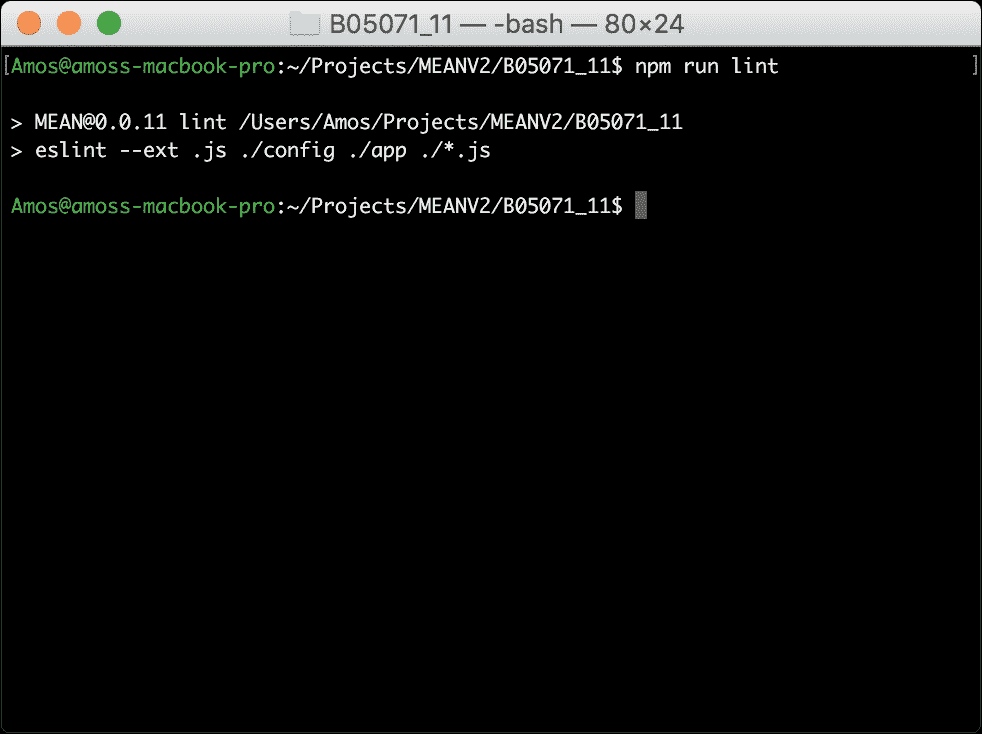
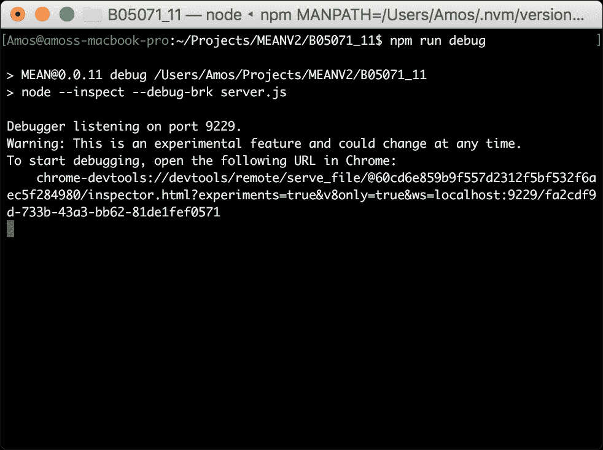
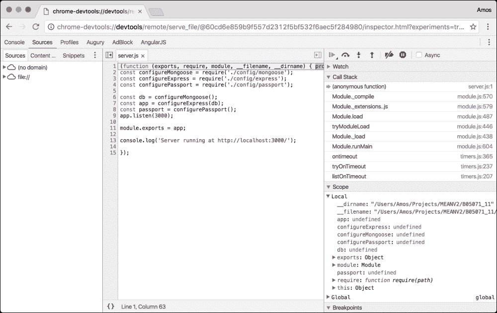
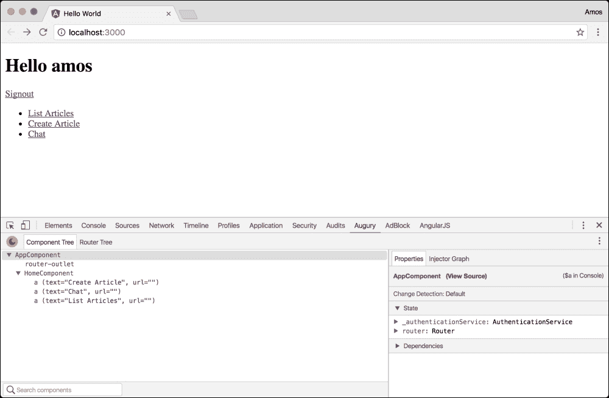
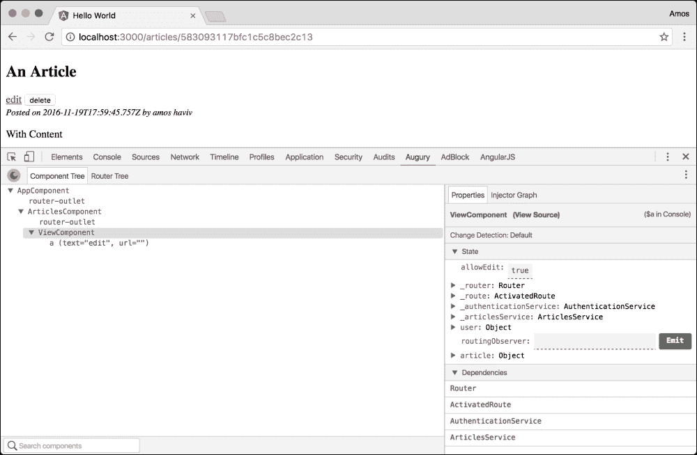
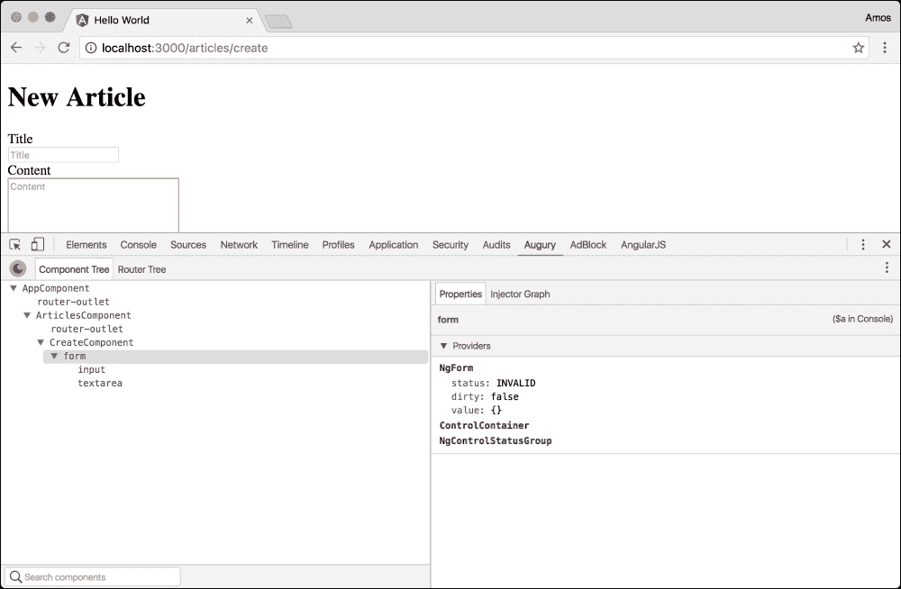
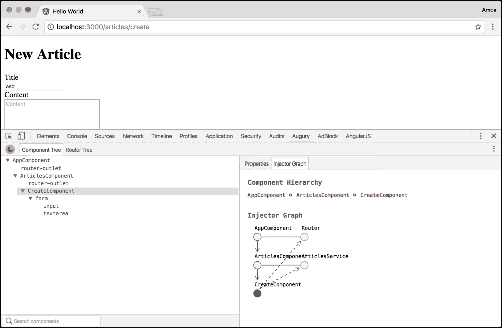
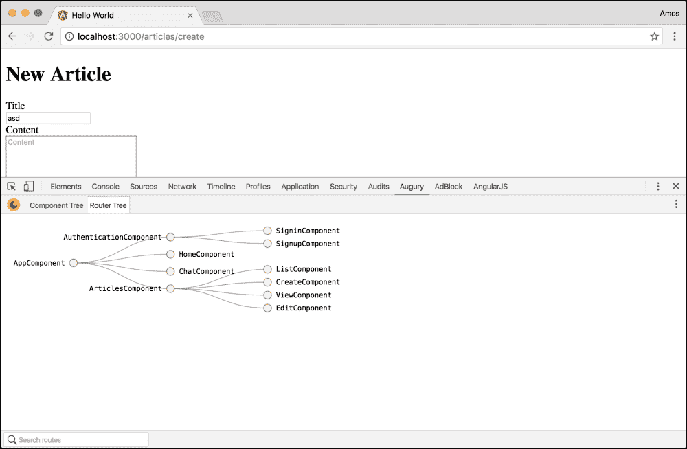

# 第十一章：自动化和调试 MEAN 应用程序

在之前的章节中，您学会了如何构建和测试您的实时 MEAN 应用程序。您学会了如何连接所有的 MEAN 组件，以及如何使用测试框架来测试您的应用程序。虽然您可以继续使用前几章中使用的相同方法来开发您的应用程序，但您也可以通过使用支持性工具和框架来加快开发周期。这些工具将通过自动化和抽象为您提供一个稳固的开发环境。在本章中，您将学习如何使用不同的社区工具来加快您的 MEAN 应用程序的开发。我们将涵盖以下主题：

+   使用 NPM 脚本

+   介绍 Webpack

+   介绍 ESLint

+   介绍 Nodemon

+   使用 V8 检查器调试您的 Express 应用程序

+   使用 NPM 脚本

# 使用 NPM 脚本

正如您可能已经注意到的，开发我们的应用程序涉及同时执行多个任务。例如，为了运行我们的应用程序，我们需要转译我们的 Angular 文件，然后运行我们的 Express 应用程序。这种模式将重复并变得更加复杂。为了解决这个问题，开发人员倾向于自动化一些应用功能，并使用支持性工具来加快他们的工作。一些开发人员喜欢使用第三方工具，比如 Grunt 或 Gulp，也被称为任务运行器；然而，我们已经使用了一个允许我们运行脚本的工具，一个叫做 NPM 的工具。为了更好地理解这一点，请查看您的`package.json`文件的`scripts`属性：

```js
...
"scripts": {
  "tsc": "tsc",
  "tsc:w": "tsc -w",
  "app": "node server",
  "start": "concurrently \"npm run tsc:w\" \"npm run app\" ",
  "postinstall": "typings install",
},
...
```

正如您所看到的，您已经有了五个脚本来管理您的应用程序开发。在接下来的章节中，我们将学习如何添加更多脚本，以及如何使用这个 NPM 功能来帮助您自动化您的日常工作。我们将从 Webpack 模块打包工具开始。

# 介绍 Webpack

Webpack 是由 Tobias Koppers 创建的流行模块打包工具。它已经占领了 JavaScript 世界，并成为我们生态系统中最常用的工具之一。作为其他模块打包工具的替代品，比如 SystemJS（我们到目前为止使用的），它有一个非常简单的动机：简化代码打包，将大型应用模块化，并进行代码拆分。然而，在经过几年的积极开发后，它现在可以做的更多，包括资源打包、预处理和优化等功能。在我们简单的介绍中，我们将学习如何简单地替换 SystemJS 来打包和加载我们的 Angular 模块。

### 注意

强烈建议您通过访问官方项目页面[`webpack.github.io/`](https://webpack.github.io/)来了解更多关于 Webpack 的信息。

## 安装 Webpack

在我们开始配置我们的 Webpack 实现之前，我们需要使用`npm`安装 Webpack 的依赖项。为此，请按照以下方式更改您的`package.json`文件：

```js
{
  "name": "MEAN",
  "version": "0.0.11",
  "scripts": {
    "tsc": "tsc",
    "tsc:w": "tsc -w",
    "app": "node server",
 "start": "concurrently \"npm run webpack\" \"npm run app\" ",
    "postinstall": "typings install",
 "webpack": "webpack --watch"
  },
  "dependencies": {
    "@angular/common": "2.1.1",
    "@angular/compiler": "2.1.1",
    "@angular/core": "2.1.1",
    "@angular/forms": "2.1.1",
    "@angular/http": "2.1.1",
    "@angular/platform-browser": "2.1.1",
    "@angular/platform-browser-dynamic": "2.1.1",
    "@angular/router": "3.1.1",
    "body-parser": "1.15.2",
    "core-js": "2.4.1",
    "compression": "~1.6.0",
    "connect-flash": "0.1.1",
    "connect-mongo": "1.3.2",
    "cookie-parser": "1.4.3",
    "ejs": "2.5.2",
    "es6-promise": "4.0.5",
    "express": "4.14.0",
    "express-session": "1.14.1",
    "method-override": "2.3.6",
    "mongoose": "4.6.5",
    "morgan": "1.7.0",
    "passport": "0.3.2",
    "passport-facebook": "2.1.1",
    "passport-google-oauth": "1.0.0",
    "passport-local": "1.0.0",
    "passport-twitter": "1.0.4",
    "phantomjs-prebuilt": "2.1.13",
    "reflect-metadata": "0.1.8",
    "rxjs": "5.0.0-beta.12",
    "socket.io": "1.4.5",
    "systemjs": "0.19.39",
    "zone.js": "0.6.26"
  },
  "devDependencies": {
 "awesome-typescript-loader": "2.2.4",
    "concurrently": "3.1.0",
    "jasmine": "2.5.2",
    "jasmine-core": "2.5.2",
    "karma": "1.3.0",
    "karma-jasmine": "1.0.2",
    "karma-phantomjs-launcher": "1.0.2",
    "should": "11.1.1",
    "supertest": "2.0.1",
    "traceur": "0.0.111",
    "typescript": "2.0.3",
    "typings": "1.4.0",
 "webpack": "1.13.3"
  }
}
```

如您所见，您已经将 Webpack 和 TypeScript 加载器添加到了您的`devDependencies`属性中。我们还添加了一个 Webpack 脚本，以便以“监视”模式运行 Webpack，这样我们文件的每次更改都会自动更新。然后，我们将我们的 NPM 启动脚本更改为使用 Webpack，而不是使用 TypeScript 命令行工具转译我们的 Angular 文件。要安装您的新依赖项，请转到您的应用程序的根文件夹，并在命令行工具中输入以下命令：

```js
$ npm install

```

这将在您的项目的`node_modules`文件夹中安装指定版本的 Webpack 和 TypeScript 加载器。当安装过程成功完成后，您将能够使用这些模块来运行 Webpack 并打包您的 TypeScript 模块。接下来，您将学习如何配置 Webpack。

## 配置 Webpack

为了控制 Webpack 的执行，您需要使用一个特殊的配置文件来配置 Webpack，该文件放置在应用程序的根文件夹中。当执行时，Webpack 将自动查找应用程序根文件夹中名为`webpack.config.js`的默认配置文件。您也可以使用命令行标志指示您的配置文件名称，但为简单起见，我们将使用默认文件名。要开始配置 Webpack，创建一个新文件在您的应用程序根文件夹中，并将其命名为`webpack.config.js`。在您的新文件中，粘贴以下代码片段：

```js
const webpack = require('webpack');

module.exports = {
  entry: {
    'polyfills': './public/polyfills',
    'vendor': './public/vendor',
    'bootstrap': './public/bootstrap'
  },
  devtool: 'source-map',
  resolve: {
    extensions: ['', '.js', '.ts']
  },
  output: {
    path: 'public/build',
    filename: '[name].js',
  },
  module: {
    loaders: [
      {
        test: /\.ts$/,
        loaders: ['awesome-typescript-loader']
      }
    ]
  },
  plugins: [
    new webpack.optimize.CommonsChunkPlugin({
      name: ['bootstrap', 'vendor', 'polyfills']
    })
  ]
};
```

正如您所看到的，Webpack 的配置文件用于设置 Webpack 构建我们的模块的方式。在这种情况下，我们使用了以下设置：

+   `entry`：这告诉 Webpack 我们应用程序的入口点是什么。如果您不认识这些文件，不要担心；我们将在下一步中创建它们。您需要理解的是，我们将我们的应用程序捆绑成三个不同的文件：我们的 polyfills 文件，其中将包括所有与 polyfills 相关的模块，我们的 vendor 文件，其中将包括所有第三方模块，如 Angular 核心模块，以及我们的应用程序文件，其中将包括我们的 Angular 应用程序文件。

+   `devtool`：这告诉 Webpack 要使用哪种开发工具；在这种情况下，我们希望 Webpack 为转译后的应用程序文件创建映射文件。

+   `resolve`：这告诉 Webpack 要解析什么样的模块扩展名；在这种情况下，它将包括没有扩展名的模块导入，TypeScript 和 JavaScript 文件。

+   `output`：这设置了 Webpack 保存输出文件的方式。在这里，我们告诉它我们要在`public/build`文件夹中创建捆绑文件，并使用 JavaScript 文件扩展名。

+   `module`：这是 Webpack 将使用的模块列表。在我们的情况下，我们告诉 Webpack 使用我们之前安装的 TypeScript 加载器加载所有 TypeScript 文件。

+   `optimize`：这设置了 Webpack 优化模块捆绑的方式。在我们的情况下，我们希望 Webpack 只捆绑每个模块一次。这意味着如果 Webpack 在 Bootstrap 文件和 Vendor 文件中找到一个常见的模块导入，它将只在 vendor 文件中捆绑一次。

请注意，这些属性是面向项目的，这意味着它将根据您的要求进行更改。我们将继续创建我们缺少的文件。首先，转到您的`public`文件夹并创建一个名为`polyfills.ts`的文件。在这个文件中，粘贴以下代码：

```js
import 'core-js/es6/symbol';
import 'core-js/es6/object';
import 'core-js/es6/function';
import 'core-js/es6/parse-int';
import 'core-js/es6/parse-float';
import 'core-js/es6/number';
import 'core-js/es6/math';
import 'core-js/es6/string';
import 'core-js/es6/date';
import 'core-js/es6/array';
import 'core-js/es6/regexp';
import 'core-js/es6/map';
import 'core-js/es6/set';
import 'core-js/es6/weak-map';
import 'core-js/es6/weak-set';
import 'core-js/es6/typed';
import 'core-js/es6/reflect';
import 'core-js/es7/reflect';
import 'zone.js/dist/zone';
import 'zone.js/dist/long-stack-trace-zone';
```

正如您所看到的，我们包含了所有的 polyfills 库。接下来，我们将创建一个名为`vendor.ts`的文件；在这个文件中，粘贴以下代码：

```js
import '@angular/common';
import '@angular/compiler';
import '@angular/core';
import '@angular/forms';
import '@angular/http';
import '@angular/router';
import '@angular/platform-browser';
import '@angular/platform-browser-dynamic';
import 'rxjs';
```

正如您所看到的，我们包含了 Angular 和 RXJS 库的所有核心模块。最后，我们将把之前的`bootstrap.ts`文件复制到`public`文件夹中。要做到这一点，转到您的`public`文件夹并创建一个名为`bootstrap.ts`的文件。在这个文件中，粘贴以下代码：

```js
import { platformBrowserDynamic } from '@angular/platform-browser-dynamic';
import { AppModule } from './app/app.module';

platformBrowserDynamic().bootstrapModule(AppModule);
```

正如您所看到的，这是我们之前章节的应用程序引导文件。我们唯一剩下的事情就是更改我们的主应用程序页面。要做到这一点，转到`app/views/index.ejs`文件并进行以下更改：

```js
<!DOCTYPE html>
<html>
<head>
  <title><%= title %></title>
  <base href="/">
</head>
<body>
  <mean-app>
    <h1>Loading...</h1>
  </mean-app>

  <script type="text/javascript">
    window.user = <%- user || 'null' %>;
  </script>

  <script src="img/socket.io.js"></script>

 <script src="img/polyfills.js"></script>
 <script src="img/vendor.js"></script>
 <script src="img/bootstrap.js"></script>
</body>
</html>
```

正如您所看到的，我们刚刚用新的捆绑脚本文件替换了旧的脚本。完成这些更改后，您的 Webpack 配置应该已经准备好使用了！使用您的命令行工具并导航到 MEAN 应用程序的根文件夹。然后，通过输入以下命令来运行您的应用程序：

```js
$ npm start

```

一旦您的应用程序正在运行并且 Webpack 完成了代码的捆绑，导航到`http://localhost:3000/`并测试您的应用程序。当然，这只是一个基本的设置，因此强烈建议您继续学习 Webpack 的其他功能。

# 引入 ESLint

在软件开发中，linting 是使用专用工具识别可疑代码使用的过程。在 MEAN 应用程序中，linting 可以帮助您避免日常开发周期中的常见错误和编码错误；此外，它还可以让您在团队中设置统一的代码样式。在我们的生态系统中最常用的 linting 工具叫做 ESLint。ESLint 是一个可插拔的 linting 实用程序，最初由 Nicholas C. Zakas 于 2013 年创建。它允许我们使用一组规则和预设配置来 lint 我们的 JavaScript 代码。我们将从在我们的应用程序中安装 ESLint 包开始。

### 注意

强烈建议您访问官方项目页面[`eslint.org/`](http://eslint.org/)，了解更多关于 ESLint 的信息。

## 安装 ESLint

在我们开始配置 ESLint 执行之前，我们需要使用`npm`安装 ESLint 包。为此，请按照以下更改您的`package.json`文件：

```js
{
  "name": "MEAN",
  "version": "0.0.11",
  "scripts": {
    "tsc": "tsc",
    "tsc:w": "tsc -w",
    "app": "node server",
    "start": "concurrently \"npm run webpack\" \"npm run app\" ",
    "postinstall": "typings install",
    "webpack": "webpack --watch",
 "lint": "eslint --ext .js ./config ./app ./*.js"
  },
  "dependencies": {
    "@angular/common": "2.1.1",
    "@angular/compiler": "2.1.1",
    "@angular/core": "2.1.1",
    "@angular/forms": "2.1.1",
    "@angular/http": "2.1.1",
    "@angular/platform-browser": "2.1.1",
    "@angular/platform-browser-dynamic": "2.1.1",
    "@angular/router": "3.1.1",
    "body-parser": "1.15.2",
    "core-js": "2.4.1",
    "compression": "~1.6.0",
    "connect-flash": "0.1.1",
    "connect-mongo": "1.3.2",
    "cookie-parser": "1.4.3",
    "ejs": "2.5.2",
    "es6-promise": "4.0.5",
    "express": "4.14.0",
    "express-session": "1.14.1",
    "method-override": "2.3.6",
    "mongoose": "4.6.5",
    "morgan": "1.7.0",
    "passport": "0.3.2",
    "passport-facebook": "2.1.1",
    "passport-google-oauth": "1.0.0",
    "passport-local": "1.0.0",
    "passport-twitter": "1.0.4",
    "phantomjs-prebuilt": "2.1.13",
    "reflect-metadata": "0.1.8",
    "rxjs": "5.0.0-beta.12",
    "socket.io": "1.4.5",
    "systemjs": "0.19.39",
    "zone.js": "0.6.26"
  },
  "devDependencies": {
    "awesome-typescript-loader": "2.2.4",
    "concurrently": "3.1.0",
 "eslint": "3.10.2",
    "jasmine": "2.5.2",
    "jasmine-core": "2.5.2",
    "karma": "1.3.0",
    "karma-jasmine": "1.0.2",
    "karma-phantomjs-launcher": "1.0.2",
    "should": "11.1.1",
    "supertest": "2.0.1",
    "traceur": "0.0.111",
    "typescript": "2.0.3",
    "typings": "1.4.0",
    "webpack": "1.13.3"
  }
}
```

正如您所看到的，您已经将 ESLint 包添加到了`devDependencies`属性中。您还添加了一个`lint`脚本来运行 ESLint，并在您的`app`和`config`文件夹中放置了一个 lint JavaScript 文件。要安装新的依赖项，请转到应用程序的根文件夹，并在命令行工具中输入以下命令：

```js
$ npm install

```

这将在您的项目的`node_modules`文件夹中安装指定版本的 ESLint 包。接下来，您将学习如何配置 ESLint。

## 配置 ESLint

为了控制 ESLint 的执行，您需要使用放置在应用程序根文件夹中的特殊配置文件进行配置。当执行时，ESLint 会自动查找应用程序根文件夹中名为`.eslintrc`的默认配置文件。在应用程序的根文件夹中创建一个新文件，并将其命名为`.eslintrc`。在新文件中，粘贴以下 JSON 对象：

```js
{
  "parserOptions": {
    "ecmaVersion": 6
  }
}
```

正如您所看到的，这个简单的配置基本上告诉 ESLint 我们的代码是用 ECMAScript 6 编写的。然而，ESLint 还可以做更多的事情；例如，您可以通过更改配置告诉 ESLint 验证我们的代码缩进，如下所示：

```js
{
  "parserOptions": {
    "ecmaVersion": 6
  },
  "rules": {
    "indent": ["error", 2]
  }
}
```

这将告诉 ESLint 在我们的代码文件中期望两个空格的缩进。此外，通常情况下，您将使用`extend`属性来扩展现有的配置文件，如下所示：

```js
{
  "extends": "eslint:recommended",
  "parserOptions": {
    "ecmaVersion": 6
  }
}
```

这将扩展 ESLint 的推荐规则集。然而，这些只是简单的例子，因此建议您继续学习 ESLint，以找到最佳的项目配置。要运行 lint 任务，请转到命令行工具并执行以下命令：

```js
$ npm run lint

```

linting 结果应该在您的命令行工具中报告，并且与以下截图中显示的内容类似：



ESLint 结果

ESLint 是一个强大的工具。然而，在这种形式下，您需要手动运行`lint`任务。更好的方法是在修改文件时自动运行 lint 任务。

# 使用 Nodemon

使用 Node 的命令行工具运行应用程序可能看起来不是一个多余的任务。然而，当不断开发您的应用程序时，您很快会注意到您经常停止和启动应用程序服务器。为了帮助完成这项任务，有一个常用的工具叫做 Nodemon。Nodemon 是一个 Node.js 命令行工具，作为简单的 node 命令行工具的包装器，但它会监视您的应用程序文件的更改。当 Nodemon 检测到文件更改时，它会自动重新启动 node 服务器以更新应用程序。要使用 Nodemon，您需要修改项目的`package.json`文件，如下所示：

```js
{
  "name": "MEAN",
  "version": "0.0.11",
  "scripts": {
    "tsc": "tsc",
    "tsc:w": "tsc -w",
    "app": "node server",
 "app:dev": "npm run lint && npm run app",
 "nodemon": "nodemon -w app -w config -w server.js --exec npm run app:dev",
 "start": "concurrently \"npm run webpack\" \"npm run nodemon\",
    "postinstall": "typings install",
    "webpack": "webpack --watch",
    "lint": "eslint --ext .js ./config ./app ./*.js"
  },
  "dependencies": {
    "@angular/common": "2.1.1",
    "@angular/compiler": "2.1.1",
    "@angular/core": "2.1.1",
    "@angular/forms": "2.1.1",
    "@angular/http": "2.1.1",
    "@angular/platform-browser": "2.1.1",
    "@angular/platform-browser-dynamic": "2.1.1",
    "@angular/router": "3.1.1",
    "body-parser": "1.15.2",
    "core-js": "2.4.1",
    "compression": "~1.6.0",
    "connect-flash": "0.1.1",
    "connect-mongo": "1.3.2",
    "cookie-parser": "1.4.3",
    "ejs": "2.5.2",
    "es6-promise": "4.0.5",
    "express": "4.14.0",
    "express-session": "1.14.1",
    "method-override": "2.3.6",
    "mongoose": "4.6.5",
    "morgan": "1.7.0",
    "passport": "0.3.2",
    "passport-facebook": "2.1.1",
    "passport-google-oauth": "1.0.0",
    "passport-local": "1.0.0",
    "passport-twitter": "1.0.4",
    "phantomjs-prebuilt": "2.1.13",
    "reflect-metadata": "0.1.8",
    "rxjs": "5.0.0-beta.12",
    "socket.io": "1.4.5",
    "systemjs": "0.19.39",
    "zone.js": "0.6.26"
  },
  "devDependencies": {
    "awesome-typescript-loader": "2.2.4",
    "concurrently": "3.1.0",
    "eslint": "3.10.2",
    "jasmine": "2.5.2",
    "jasmine-core": "2.5.2",
    "karma": "1.3.0",
    "karma-jasmine": "1.0.2",
    "karma-phantomjs-launcher": "1.0.2",
 "nodemon": "1.11.0",
    "should": "11.1.1",
    "supertest": "2.0.1",
    "traceur": "0.0.111",
    "typescript": "2.0.3",
    "typings": "1.4.0",
    "webpack": "1.13.3"
  }
}
```

正如你所看到的，我们将 Nodemon 包添加到我们的开发依赖项中。我们还添加了两个新的脚本，并更改了我们的`start`脚本。我们添加的第一个脚本是`app:dev`，它运行`lint`和`app`脚本。接下来，我们创建了一个`nodemon`脚本，它监视我们所有的服务器 JavaScript 文件，并在文件被修改时运行`app:dev`脚本。在我们的`start`脚本中，我们同时执行我们的 Webpack 和 Nodemon 脚本。就是这样！你所要做的就是在你的应用程序根文件夹中安装 Nodemon 包，并在命令行工具中发出以下命令：

```js
$ npm install

```

然后，使用常规的`start`命令运行你的应用程序：

```js
$ npm start

```

这将使用新的设置启动你的应用程序。尝试更改你的 Angular 或 Express 应用程序文件；注意，如果你更改了服务器文件，你的应用程序将重新启动，并且当你更改 Angular 文件时，Webpack 会自动编译你的代码的方式。

# 使用 V8 检查器调试 Express

使用 V8 检查器调试 Express 部分的 MEAN 应用程序可能是一个复杂的任务。幸运的是，有一个名为 V8 检查器的解决这个问题的好工具。V8 检查器是一个使用 Blink（一个 WebKit 分支）开发者工具的调试工具。事实上，使用 Google 的 Chrome 浏览器的开发人员已经熟悉它，以 Chrome 开发者工具界面的形式。V8 检查器支持一些非常强大的调试功能：

+   源代码文件导航

+   断点操作

+   跳过、步入、步出和恢复执行

+   变量和属性检查

+   实时代码编辑

要调试你的应用程序，你需要使用兼容的网络浏览器访问 V8 检查器界面。然后你就可以使用它来调试你的应用程序代码，使用 Chrome 开发者工具界面。要做到这一点，你只需要在你的`package.json`文件中添加一个调试脚本，如下所示：

```js
{
  "name": "MEAN",
  "version": "0.0.11",
  "scripts": {
    "tsc": "tsc",	
    "tsc:w": "tsc -w",
    "app": "node server",
    "app:dev": "npm run lint && npm run app",
    "nodemon": "nodemon -w app -w config -w server.js --exec npm run app:dev",
    "start": "concurrently \"npm run webpack\" \"npm run nodemon\",
 "debug": "node --inspect --debug-brk server.js",
    "postinstall": "typings install",
    "webpack": "webpack --watch",
    "lint": "eslint --ext .js ./config ./app ./*.js"
  },
  "dependencies": {
    "@angular/common": "2.1.1",
    "@angular/compiler": "2.1.1",
    "@angular/core": "2.1.1",
    "@angular/forms": "2.1.1",
    "@angular/http": "2.1.1",
    "@angular/platform-browser": "2.1.1",
    "@angular/platform-browser-dynamic": "2.1.1",
    "@angular/router": "3.1.1",
    "body-parser": "1.15.2",
    "core-js": "2.4.1",
    "compression": "~1.6.0",
    "connect-flash": "0.1.1",
    "connect-mongo": "1.3.2",
    "cookie-parser": "1.4.3",
    "ejs": "2.5.2",
    "es6-promise": "4.0.5",
    "express": "4.14.0",
    "express-session": "1.14.1",
    "method-override": "2.3.6",
    "mongoose": "4.6.5",
    "morgan": "1.7.0",
    "passport": "0.3.2",
    "passport-facebook": "2.1.1",
    "passport-google-oauth": "1.0.0",
    "passport-local": "1.0.0",
    "passport-twitter": "1.0.4",
    "phantomjs-prebuilt": "2.1.13",
    "reflect-metadata": "0.1.8",
    "rxjs": "5.0.0-beta.12",
    "socket.io": "1.4.5",
    "systemjs": "0.19.39",
    "zone.js": "0.6.26"
  },
  "devDependencies": {
    "awesome-typescript-loader": "2.2.4",
    "concurrently": "3.1.0",
    "eslint": "3.10.2",
    "jasmine": "2.5.2",
    "jasmine-core": "2.5.2",
    "karma": "1.3.0",
    "karma-jasmine": "1.0.2",
    "karma-phantomjs-launcher": "1.0.2",
    "nodemon": "1.11.0",
    "should": "11.1.1",
    "supertest": "2.0.1",
    "traceur": "0.0.111",
    "typescript": "2.0.3",
    "typings": "1.4.0",
    "webpack": "1.13.3"
  }
}
```

在你的新脚本中，你所做的就是用两个命令行标志运行你的应用程序。`inspect`标志允许将 Chrome 开发者工具附加到我们的 Node.js 实例，`debug-brk`标志阻止 Node.js 在附加调试器之前运行你的代码。接下来，我们将使用新脚本运行我们的应用程序，并看看我们如何调试它。

# 调试你的应用程序

要使用你的新的`debug`脚本，导航到你的应用程序根文件夹，并在命令行工具中发出以下命令：

```js
$ npm run debug

```

这将以调试模式运行你的应用程序，并等待你附加 Chrome 开发者工具调试器。你的命令行工具中的输出应该类似于以下截图所示的内容：



以调试模式运行

正如你所看到的，`debug`脚本邀请你通过使用兼容的浏览器访问`chrome-devtools://…`来开始调试应用程序。在 Google Chrome 中打开这个 URL，你应该会看到一个类似以下截图所示的界面：



使用 V8 检查器调试

正如你所看到的，你会在左侧面板中得到你项目的文件列表，在中间面板中得到文件内容查看器，在右侧面板中得到调试仪表板。这意味着你的`debug`脚本正在正确运行，并且正在识别你的 Express 项目。你可以通过设置一些断点并测试你的应用程序行为来开始调试你的项目。

### 注意

节点检查只能在使用 Blink 引擎的浏览器上工作，例如 Google Chrome 或 Opera。此外，这个功能仍然是实验性的。因此，建议您随时关注官方的 Node.js 文档。

# 使用 Angular Augury 调试 Angular 应用程序

调试 MEAN 应用程序的大部分 Angular 部分通常在浏览器中完成。但是，调试 Angular 的内部操作可能有点棘手。出于这个目的，来自 Google 和 Rangle.io 的联合团队创建了一个名为 Angular Augury 的 Chrome 扩展。Angular Augury 通过一个新的选项卡扩展了 Chrome 开发者工具，您可以在其中调试您的 Angular 应用程序的不同方面。安装 Angular Augury 非常简单。您只需访问 Chrome 网络商店[`chrome.google.com/webstore/detail/augury/elgalmkoelokbchhkhacckoklkejnhcd`](https://chrome.google.com/webstore/detail/augury/elgalmkoelokbchhkhacckoklkejnhcd)并安装 Chrome 扩展即可。

### 注意

Angular Augury 只能在 Google Chrome 浏览器上运行。

## 使用 Angular Augury

安装完 Angular Augury 后，使用 Chrome 导航到您的应用程序 URL。然后，打开 Chrome 开发者工具面板，您应该会看到一个**Angular**选项卡。单击它，应该会打开一个与以下截图中显示的类似的面板：



Angular Augury

## 组件树

我们的 Angular 应用程序是以组件树的形式构建的。Augury 允许我们以分层方式检查这些组件；为了更好地理解这一点，请看以下截图：



Augury 组件树

正如您所看到的，我们正在检查文章模块中的`ViewComponent`。由于我们的组件路由基于简单的层次结构，您可以注意到我们还看到了`AppComponent`和`ArticlesComponent`。在右侧，您会注意到我们有两个选项卡：**属性**和**注入器图**。在**属性**选项卡中，您将找到组件状态，包括`article`和`user`属性以及组件依赖项。状态是可编辑的，因此它允许您更改组件状态并查看对`ViewComponent`的渲染的影响。此外，如果我们检查`CreateComponent`，您将能够看到 Augury 如何与表单一起工作：



带有表单的 Augury

正如您所看到的，您可以检查您的表单状态并了解其内部状态。如果您编辑表单输入的值，您还将能够在右侧窗格上实时看到其状态更新。如果单击**注入器图**选项，您将能够看到 Angular 的注入器是如何工作以及当前组件的注入提供程序：



Augury 注入器图

请注意，`Router`和`ArticlesService`提供程序被注入到`CreateComponent`中。在更大的应用程序中，这将让您更好地了解项目状态。

## 路由树

要探索您的 Angular 应用程序路由，您可以单击**路由树**选项卡。在这样做之前，您需要在应用程序组件中注入路由提供程序，如下所示：

```js
import { Component } from '@angular/core';
import { AuthenticationService } from './authentication/authentication.service';
import { Router } from '@angular/router';

@Component({
  selector: 'mean-app',
  template: '<router-outlet></router-outlet>',
})
export class AppComponent {
  constructor(private _authenticationService: AuthenticationService,
 private router: Router) {}
}
```

一旦您这样做，您将能够看到与以下截图中显示的类似的面板：



Augury 路由树

正如您所看到的，**路由树**选项卡可以让您以易于理解的图形方式了解您的应用程序路由方案。

Angular Augury 是一个简单而强大的工具。正确使用，它可以节省您大量时间，而不是不断地四处查找和使用控制台日志。确保您了解每个选项卡，并尝试自己探索应用程序。

# 总结

在本章中，您学习了如何自动化您的 MEAN 应用程序的开发，以及如何调试应用程序的 Express 和 Angular 部分。我们从简要解释 NPM 脚本开始。然后我们讨论了 Webpack 及其强大的功能，您学会了如何自动重新启动和 lint 您的应用程序。然后，您学会了如何使用 V8 检查器工具来调试您的 Express 代码。在本章的最后，您了解了 Angular Augury Chrome 扩展程序。您了解了 Angular Augury 的功能，并了解了如何调试您的 Angular 内部。

由于这是本书的最后一章，您现在应该知道如何构建、运行、测试、调试和轻松开发您的 MEAN 应用程序。

接下来的步骤就看您了。
