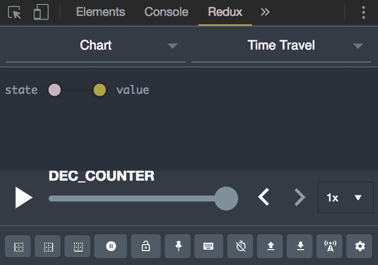
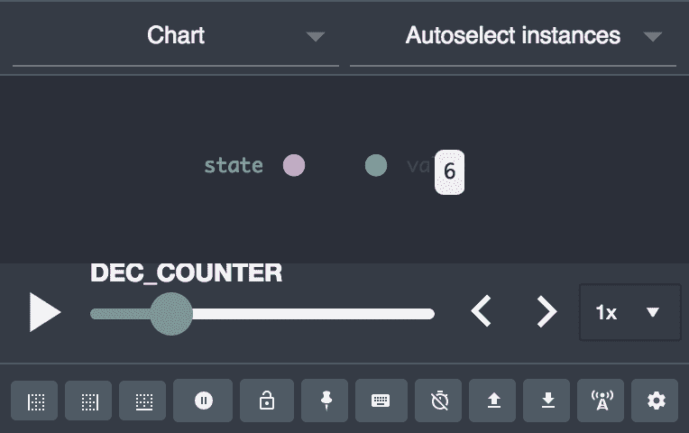
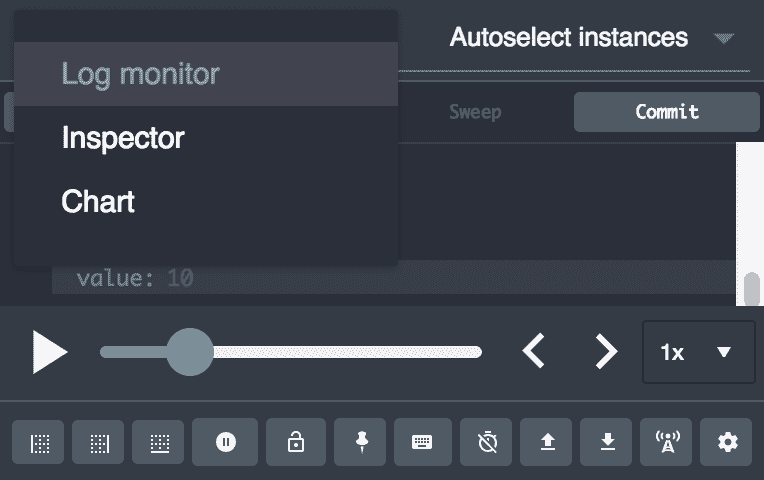

# 第五章：使用 Redux 管理状态

在本章中，我们将介绍以下食谱：

+   定义动作和动作创建器

+   定义 Reducer 函数

+   创建 Redux 存储

+   将动作创建器绑定到分发方法

+   分割和组合 Reducers

+   编写 Redux 存储增强器

+   使用 Redux 进行时间旅行

+   理解 Redux 中间件

+   处理异步数据流

# 技术要求

您需要有一个 IDE、Visual Studio Code、Node.js 和 MongoDB。您还需要安装 Git，以便使用本书的 Git 仓库。

本章的代码文件可以在 GitHub 上找到：

[`github.com/PacktPublishing/MERN-Quick-Start-Guide/tree/master/Chapter05`](https://github.com/PacktPublishing/MERN-Quick-Start-Guide/tree/master/Chapter05)

观看以下视频，了解代码的实际应用：

[`goo.gl/mU9AjR`](https://goo.gl/mU9AjR)

# 简介

Redux 是 JavaScript 应用程序的可预测状态容器。它允许开发者轻松地管理他们应用程序的状态。使用 Redux，状态是不可变的。因此，您可以来回切换到应用程序的下一个或上一个状态。Redux 绑定了三个核心原则：

+   **单一事实来源**：您应用程序的所有状态都必须存储在单个对象树中，位于单个存储中

+   **状态是只读的**：您不得修改状态树。只有通过分发一个动作，状态树才能改变

+   **更改是通过纯函数进行的**：这些被称为 Reducers，它们是接受前一个状态和一个动作并计算新状态的函数。Reducers 必须永远不修改前一个状态，而应始终返回一个新的状态

Reducers 的工作方式与 `Array.prototype.reduce` 函数非常相似。`reduce` 方法对数组中的每个项目执行一个函数，针对累加器进行操作，以将其减少到单个值。例如：

```js
const a = 5 
const b = 10 
const c = [a, b].reduce((accumulator, value) => { 
    return accumulator + value 
}, 0) 
```

在变量 `c` 中，当对 `a` 和 `b` 进行累加器 `accumulator` 的减少操作时得到的结果是 `15`，初始值是 `0`。这里的 reducer 函数是：

```js
(accumulator, value) => { 
    return accumulator + value 
} 
```

Redux Reducers 的编写方式类似，并且是 Redux 中最重要的概念。例如：

```js
const reducer = (prevState, action) => newState 
```

在本章中，我们将专注于学习如何使用 Redux 管理简单和复杂的状态树。您还将学习如何处理异步数据流。

# 定义动作和动作创建器

Reducers 接受一个描述将要执行的动作的 `action` 对象，并根据这个 `action` 对象决定如何根据状态转换状态。

动作只是普通的对象，并且它们只有一个必需的属性，即动作类型。例如：

```js
const action = { 
    type: 'INCREMENT_COUNTER', 
} 
```

我们还可以提供额外的属性。例如：

```js
const action = { 
    type: 'INCREMENT_COUNTER', 
    incrementBy: 2, 
} 
```

Actions creators 是返回动作的函数，例如：

```js
const increment = (incrementBy) => ({ 
    type: 'INCREMENT_COUNTER', 
    incrementBy, 
}) 
```

# 准备工作

在这个食谱中，您将看到这些简单的 Redux 概念如何与 `Array.prototype.reduce` 结合使用，以决定数据应该如何累积或减少。

我们目前不需要 Redux 库来完成此目的。

# 如何做...

构建一个小的 JavaScript 应用程序，该应用程序将根据提供的动作增加或减少计数器。

1.  创建一个名为`counter.js`的新文件

1.  将动作类型定义为常量：

```js
      const INCREMENT_COUNTER = 'INCREMENT_COUNTER' 
      const DECREMENT_COUNTER = 'DECREMENT_COUNTER' 
```

1.  定义两个动作创建器，用于生成两种类型的动作来`increment`和`decrement`计数器：

```js
      const increment = (by) => ({ 
          type: INCREMENT_COUNTER, 
          by, 
      }) 
      const decrement = (by) => ({ 
          type: DECREMENT_COUNTER, 
          by, 
      }) 
```

1.  将初始累加器初始化为`0`，然后通过传递几个动作来减少它。reducer 函数将根据动作类型决定执行哪种类型的动作：

```js
      const reduced = [ 
          increment(10), 
          decrement(5), 
          increment(3), 
      ].reduce((accumulator, action) => { 
          switch (action.type) { 
              case INCREMENT_COUNTER: 
            return accumulator + action.by 
              case DECREMENT_COUNTER: 
                  return accumulator - action.by 
              default: 
                  return accumulator 
          } 
      }, 0) 
```

1.  记录结果值：

```js
      console.log(reduced) 
```

1.  保存文件

1.  打开终端并运行：

```js
       node counter.js

```

1.  输出：`8`

# 它是如何工作的...

1.  遇到的第一个动作类型是`increment(10)`，这将使累加器增加`10`。因为累加器的初始值是`0`，下一个当前值将是`10`

1.  第二个动作类型告诉 reducer 函数将累加器减少`5`。因此，累加器的值将是`5`。

1.  最后一个动作类型告诉 reducer 函数将累加器增加`3`。因此，累加器的值将是`8`。

# 定义 reducer 函数

Redux reducer 是纯函数。这意味着，它们没有副作用。给定相同的参数，reducer 必须始终生成相同形状的状态。例如，以下 reducer 函数：

```js
const reducer = (prevState, action) => { 
    if (action.type === 'INC') { 
        return { counter: prevState.counter + 1 } 
    } 
    return prevState 
} 
```

如果我们提供相同的参数执行此函数，结果总是相同的：

```js
const a = reducer( 
   { counter: 0 }, 
   { type: 'INC' }, 
) // Value is { counter: 1 }  
const b = reducer( 
   { counter: 0 }, 
   { type: 'INC' }, 
) // Value is { counter: 1 } 
```

然而，请注意，尽管返回的值具有相同的形状，但这些是两个不同的对象。例如，比较上面的：

`console.log(a === b)`返回`false`。

不纯净的 reducer 函数会阻止你的应用程序状态可预测，并使重现相同状态变得困难。例如：

```js
const impureReducer = (prevState = {}, action) => { 
    if (action.type === 'SET_TIME') { 
        return { time: new Date().toString() } 
    } 
    return prevState 
} 
```

如果我们执行此函数：

```js
const a = impureReducer({}, { type: 'SET_TIME' }) 
setTimeout(() => { 
    const b = impureReducer({}, { type: 'SET_TIME' }) 
    console.log( 
        a, // Output may be: {time: "22:10:15 GMT+0000"} 
        b, // Output may be: {time: "22:10:17 GMT+0000"} 
    ) 
}, 2000) 
```

如你所见，在 2 秒后执行函数第二次后，我们得到了不同的结果。为了使其纯净，你可以考虑重新编写之前的不纯净 reducer，如下所示：

```js
const timeReducer = (prevState = {}, action) => { 
    if (action.type === 'SET_TIME') { 
        return { time: action.time } 
    } 
    return prevState 
} 
```

然后，你可以安全地在你的动作中传递一个时间属性来设置时间：

```js
const currentTime = new Date().toTimeString() 
const a = timeReducer( 
   { time: null }, 
   { type: 'SET_TIME', time: currentTime }, 
) 
const b = timeReducer( 
   { time: null }, 
   { type: 'SET_TIME', time: currentTime }, 
) 
console.log(a.time === b.time) // true 
```

这种方法使你的状态可预测，并且状态易于重现。例如，你可以重新创建一个场景，即如果你在早上或下午的任何时间传递`time`属性，你的应用程序将如何行动。

# 准备中

现在你已经理解了 reducer 的工作原理，在这个菜谱中，你将构建一个应用程序，该应用程序将根据状态变化而采取不同的行动。

为了这个目的，你目前不需要安装或使用 Redux 库。

# 如何做...

构建一个应用程序，它会提醒你根据当地时间你应该吃什么类型的餐点。将我们应用程序的所有状态管理在一个单独的对象树中。还提供一种模拟如果时间是`00:00a.m`或`12:00p.m`时应用程序将显示什么的方式：

1.  创建一个名为`meal-time.html`的新文件。

1.  添加以下代码：

```js
      <!DOCTYPE html> 
      <html lang="en"> 
      <head> 
          <meta charset="UTF-8"> 
          <title>Breakfast Time</title> 
          <script 
         src="img/babel.min.js">  
        </script> 
      </head> 
      <body> 
          <h1>What you need to do:</h1> 
          <p> 
              <b>Current time:</b> 
              <span id="display-time"></span> 
          </p> 
                <p id="display-meal"></p> 
                <button id="emulate-night"> 
              Let's pretend is 00:00:00 
          </button> 
          <button id="emulate-noon"> 
              Let's pretend is 12:00:00 
          </button> 
          <script type="text/babel"> 
              // Add JavaScript code here 
          </script> 
      </body> 
      </html> 
```

1.  在脚本标签内添加以下步骤中定义的代码，从第 4 步开始。

1.  定义一个包含所有状态树和稍后下一个状态的变量 `state`：

```js
      let state = { 
          kindOfMeal: null, 
          time: null, 
      } 
```

1.  创建一个引用 HTML 元素的引用，我们将使用它来显示数据或添加事件监听器：

```js
      const meal = document.getElementById('display-meal') 
      const time = document.getElementById('display-time') 
      const btnNight = document.getElementById('emulate-night') 
      const btnNoon = document.getElementById('emulate-noon') 
```

1.  定义两个动作类型：

```js
      const SET_MEAL = 'SET_MEAL' 
      const SET_TIME = 'SET_TIME' 
```

1.  定义一个设置用户应享用的餐类的动作创建器：

```js
      const setMeal = (kindOfMeal) => ({ 
          type: SET_MEAL, 
          kindOfMeal, 
      }) 
```

1.  定义一个设置时间的动作创建器：

```js
      const setTime = (time) => ({ 
          type: SET_TIME, 
          time, 
      }) 
```

1.  定义一个当动作被分发时计算新状态的还原函数：

```js
      const reducer = (prevState = state, action) => { 
          switch (action.type) { 
              case SET_MEAL: 
                  return Object.assign({}, prevState, { 
                      kindOfMeal: action.kindOfMeal, 
                  }) 
              case SET_TIME: 
                  return Object.assign({}, prevState, { 
                      time: action.time, 
                  }) 
              default: 
                  return prevState 
          } 
      } 
```

1.  添加一个当状态改变时我们将调用的函数，以便我们可以更新我们的视图：

```js
      const onStateChange = (nextState) => { 
          const comparison = [ 
              { time: '23:00:00', info: 'Too late for dinner!' }, 
              { time: '18:00:00', info: 'Dinner time!' }, 
              { time: '16:00:00', info: 'Snacks time!' }, 
              { time: '12:00:00', info: 'Lunch time!' }, 
              { time: '10:00:00', info: 'Branch time!' }, 
              { time: '05:00:00', info: 'Breakfast time!' }, 
              { time: '00:00:00', info: 'Too early for breakfast!' }, 
          ] 
          time.textContent = nextState.time 
          meal.textContent = comparison.find((condition) => ( 
              nextState.time >= condition.time 
          )).info 
      } 
```

1.  定义一个将当前状态和动作传递给还原器以生成新状态树的分发函数。然后，它将调用 `onChangeState` 函数来通知应用程序状态已更改：

```js
      const dispatch = (action) => { 
          state = reducer(state, action) 
          onStateChange(state) 
      } 
```

1.  为按钮添加一个事件监听器，模拟时间为 `00:00a.m`：

```js
      btnNight.addEventListener('click', () => { 
          const time = new Date('1/1/1 00:00:00') 
          dispatch(setTime(time.toTimeString())) 
      }) 
```

1.  为按钮添加一个事件监听器，模拟时间为 `12:00p.m`：

```js
      btnNoon.addEventListener('click', () => { 
          const time = new Date('1/1/1 12:00:00') 
          dispatch(setTime(time.toTimeString())) 
      }) 
```

1.  一旦脚本开始运行，分发一个包含当前时间的动作以更新视图：

```js
      dispatch(setTime(new Date().toTimeString())) 
```

1.  保存文件。

# 让我们测试它...

要查看您之前的工作效果：

1.  在您的网络浏览器中打开 `meal-time.html` 文件。您可以通过双击文件或右键单击文件并选择“打开方式”来完成此操作。

1.  您应该能够看到您当前的本地区时以及一条消息，说明您应该享用什么类型的餐。例如，如果您的本地时间是 `20:42:35 GMT+0800 (CST)`，您应该看到 `Dinner time!`

1.  点击按钮 `"Let's pretend is 00:00:00"` 来查看如果时间是 `00:00a.m`，您的应用程序会显示什么。

1.  以相同的方式，点击按钮 `"Let's pretend is 12:00:00"` 来查看如果时间是 `12:00p.m`，您的应用程序会显示什么。

# 它是如何工作的...

我们可以如下总结我们的应用程序以了解其工作原理：

1.  定义了 `SET_MEAL` 和 `SET_TIME` 动作类型。

1.  定义了两个动作创建器：

    1.  `setMeal` 函数生成一个具有 `SET_MEAL` 操作类型和 `kindOfMeal` 属性的 `kindOfMeal` 提供的参数的动作

    1.  `setTime` 函数生成一个具有 `SET_TIME` 操作类型和 `time` 属性的 `time` 提供的参数的动作

1.  定义了一个还原函数：

    1.  对于 `SET_MEAL` 动作类型，计算一个新的状态，包含新的 `kindOfMeal` 属性

    1.  对于 `SET_TIME` 动作类型，计算一个新的状态，包含新的 `time` 属性

1.  我们定义了一个当状态树改变时将被调用的函数。在函数内部，我们根据新的状态更新了视图。

1.  定义了一个 `dispatch` 函数，它调用还原函数，提供前一个状态和一个动作对象以生成新状态。

# 创建 Redux 存储

在之前的示例中，我们看到了如何定义还原器和动作。我们还看到了如何创建一个分发函数来分发动作以更新状态。存储是一个对象，它提供了一个小的 API 来将这些功能组合在一起。

Redux 模块公开了 `createStore` 方法，我们可以使用它来创建存储。它具有以下签名：

```js
createStore(reducer, preloadedState, enhancer) 
```

最后两个参数是可选的。例如，创建一个包含单个还原器的存储库可能看起来像这样：

```js
const TYPE = { 
    INC_COUNTER: 'INC_COUNTER', 
    DEC_COUNTER: 'DEC_COUNTER', 
} 
const initialState = { 
    counter: 0, 
} 
const reducer = (state = initialState, action) => { 
    switch (action.type) { 
        case TYPE.INC_COUNTER:  
            return { counter: state.counter + 1 } 
        case TYPE.DEC_COUNTER:  
            return { counter: state.counter - 1 } 
        default:  
            return state 
    } 
} 
const store = createStore(reducer) 
```

调用 `createStore` 将公开四个方法：

+   `store.dispatch(action)`: 其中 action 是一个包含至少一个名为 `type` 的属性的对象，该属性指定了动作类型

+   `store.getState()`: 返回整个状态树

+   `store.subscribe(listener)`: 其中 listener 是一个回调函数，每当状态树发生变化时都会被触发。可以订阅多个监听器

+   `store.replaceReducer(reducer)`: 用新的还原器函数替换当前的还原器函数

# 准备工作

在这个菜谱中，你将重新构建你在上一个菜谱中构建的应用程序。然而，这次你将使用 Redux。在你开始之前，创建一个包含以下内容的新的 `package.json` 文件：

```js
{ 
    "dependencies": { 
        "express": "4.16.3", 
        "redux": "4.0.0" 
    } 
} 
```

然后，通过打开终端并运行以下命令来安装依赖项：

```js
npm install

```

# 如何做到这一点...

首先，构建一个小型的 ExpressJS 服务器应用程序，其唯一目的是提供 HTML 文件和 Redux 模块

1.  创建一个名为 `meal-time-server.js` 的新文件

1.  包含 ExpressJS 和 `path` 模块，并初始化一个新的 ExpressJS 应用程序：

```js
      const express = require('express') 
      const path = require('path') 
      const app = express() 
```

1.  在 `/lib` 路径上提供 Redux 库。确保路径指向 `node_modules` 文件夹：

```js
      app.use('/lib', express.static( 
          path.join(__dirname, 'node_modules', 'redux', 'dist') 
      )) 
```

1.  在根路径 `/` 上提供客户端应用程序

```js
      app.get('/', (req, res) => { 
          res.sendFile(path.join( 
              __dirname, 
              'meal-time-client.html', 
          )) 
      }) 
```

1.  在端口 `1337` 上监听新的连接：

```js
      app.listen( 
          1337, 
          () => console.log('Web Server running on port 1337'), 
      ) 
```

1.  保存文件

现在，按照以下步骤使用 Redux 构建客户端应用程序：

1.  创建一个名为 `meal-time-client.html` 的新文件

1.  添加以下代码：

```js
      <!DOCTYPE html> 
      <html lang="en"> 
      <head> 
          <meta charset="UTF-8"> 
          <title>Meal Time with Redux</title> 
          <script 
          src="img/babel.min.js">
         </script> 
          <script src="img/redux.js"></script> 
      </head> 
      <body> 
          <h1>What you need to do:</h1> 
          <p> 
              <b>Current time:</b> 
              <span id="display-time"></span> 
          </p> 
          <p id="display-meal"></p> 
          <button id="emulate-night"> 
              Let's pretend is 00:00:00 
          </button> 
          <button id="emulate-noon"> 
              Let's pretend is 12:00:00 
          </button> 
          <script type="text/babel"> 
              // Add JavaScript code here 
          </script> 
      </body> 
      </html> 
```

1.  在脚本标签内，添加从第 4 步开始的代码

1.  从 Redux 库中提取 `createStore` 方法

```js
      const { createStore } = Redux 
```

1.  定义你应用程序的初始状态

```js
      const initialState = { 
          kindOfMeal: null, 
          time: null, 
      } 
```

1.  保持对将用于显示状态或与应用程序交互的 HTML DOM 元素的引用

```js
      const meal = document.getElementById('display-meal') 
      const time = document.getElementById('display-time') 
      const btnNight = document.getElementById('emulate-night') 
      const btnNoon = document.getElementById('emulate-noon') 
```

1.  定义两个动作类型：

```js
      const SET_MEAL = 'SET_MEAL' 
      const SET_TIME = 'SET_TIME' 
```

1.  定义两个动作创建者：

```js
      const setMeal = (kindOfMeal) => ({ 
          type: SET_MEAL, 
          kindOfMeal, 
      }) 
      const setTime = (time) => ({ 
          type: SET_TIME, 
          time, 
      }) 
```

1.  定义当 `SET_TIME` 和/或 `SET_TIME` 动作类型被分派时将转换状态的还原器：

```js
      const reducer = (prevState = initialState, action) => { 
          switch (action.type) { 
              case SET_MEAL: 
                  return {...prevState, 
                      kindOfMeal: action.kindOfMeal, 
                  } 
              case SET_TIME: 
                  return {...prevState, 
                      time: action.time, 
                  } 
              default: 
                  return prevState 
          } 
      } 
```

1.  创建一个新的 Redux 存储

```js
      const store = createStore(reducer) 
```

1.  将一个回调函数订阅到存储的变化。每当存储发生变化时，这个回调函数都会被触发，并根据存储中的变化更新视图：

```js
      store.subscribe(() => { 
          const nextState = store.getState() 
          const comparison = [ 
              { time: '23:00:00', info: 'Too late for dinner!' }, 
              { time: '18:00:00', info: 'Dinner time!' }, 
              { time: '16:00:00', info: 'Snacks time!' }, 
              { time: '12:00:00', info: 'Lunch time!' }, 
              { time: '10:00:00', info: 'Brunch time!' }, 
              { time: '05:00:00', info: 'Breakfast time!' }, 
              { time: '00:00:00', info: 'Too early for breakfast!' }, 
          ] 
          time.textContent = nextState.time 
          meal.textContent = comparison.find((condition) => ( 
              nextState.time >= condition.time 
          )).info 
      }) 
```

1.  为我们的按钮添加一个 `click` 事件的监听器，将 `SET_TIME` 动作类型分发给设置时间为 `00:00:00`

```js
      btnNight.addEventListener('click', () => { 
          const time = new Date('1/1/1 00:00:00') 
          store.dispatch(setTime(time.toTimeString())) 
      }) 
```

1.  为我们的按钮添加一个 `click` 事件的监听器，将 `SET_TIME` 动作类型分发给设置时间为 `12:00:00`

```js
      btnNoon.addEventListener('click', () => { 
          const time = new Date('1/1/1 12:00:00') 
          store.dispatch(setTime(time.toTimeString())) 
      }) 
```

1.  当应用程序首次启动时，分派一个动作来设置时间为当前本地区时：

```js
      store.dispatch(setTime(new Date().toTimeString())) 
```

1.  保存文件

# 让我们来测试一下...

要查看之前的工作效果：

1.  打开一个新的终端并运行：

```js
 node meal-time-server.js
```

1.  在你的网络浏览器中，访问：

```js

       http://localhost:1337/
```

1.  你应该能够看到你当前的本地区时以及一条消息，说明你应该吃什么样的餐。例如，如果你的本地时间是 `20:42:35 GMT+0800 (CST)`，你应该看到 `Dinner time!`

1.  点击按钮 `"Let's pretend is 00:00:00"` 来查看如果时间是 `00:00a.m.`，你的应用程序会显示什么

1.  同样，点击 `"Let's pretend is 12:00:00"` 按钮，看看如果时间是 `12:00p.m.`，您的应用程序会显示什么。

# 还有更多

你可以使用 ES6 扩展运算符来代替 `Object.assign` 来合并你的前一个状态和下一个状态，例如，我们重新编写了之前食谱中的 reducer 函数：

```js
const reducer = (prevState = initialState, action) => { 
    switch (action.type) { 
        case SET_MEAL: 
            return Object.assign({}, prevState, { 
                kindOfMeal: action.kindOfMeal, 
            }) 
        case SET_TIME: 
            return Object.assign({}, prevState, { 
                time: action.time, 
            }) 
        default: 
            return prevState 
    } 
} 
```

我们将其重写为以下内容：

```js
const reducer = (prevState = initialState, action) => { 
    switch (action.type) { 
        case SET_MEAL: 
            return {...prevState, 
                kindOfMeal: action.kindOfMeal, 
            } 
        case SET_TIME: 
            return {...prevState, 
                time: action.time, 
            } 
        default: 
            return prevState 
    } 
} 
```

这可以使代码更易于阅读。

# 将动作创建者绑定到 dispatch 方法

动作创建者只是生成动作对象的函数，这些对象可以稍后用于使用 `dispatch` 方法分发动作。以下是一个例子：

```js
const TYPES = { 
    ADD_ITEM: 'ADD_ITEM', 
    REMOVE_ITEM: 'REMOVE_ITEM', 
} 
const actions = { 
    addItem: (name, description) => ({ 
        type: TYPES.ADD_ITEM, 
        payload: { name, description }, 
    }), 
    removeItem: (id) => ({ 
        type: TYPES.REMOVE_ITEM, 
        payload: { id }, 
    }) 
} 
module.exports = actions 
```

然后，在您的应用程序的某个地方，您可以使用 `dispatch` 方法分发这些动作：

```js
dispatch(actions.addItem('Little Box', 'Cats')) 
dispatch(actions.removeItem(123)) 
```

然而，如您所见，每次调用 `dispatch` 方法似乎是一个重复且不必要的步骤。您可以简单地将动作创建者包装在 `dispatch` 函数本身周围，如下所示：

```js
const actions = { 
    addItem: (name, description) => dispatch({ 
        type: TYPES.ADD_ITEM, 
        payload: { name, description }, 
    }), 
    removeItem: (id) => dispatch({ 
        type: TYPES.REMOVE_ITEM, 
        payload: { id }, 
    }) 
} 
module.exports = actions 
```

尽管这似乎是一个不错的解决方案，但存在一个问题。这意味着，您需要首先创建存储，然后定义动作创建者并将它们绑定到 `dispatch` 方法。此外，由于它们依赖于 `dispatch` 方法存在，因此在单独的文件中维护动作创建者将变得困难。Redux 模块提供了一个解决方案，这是一个名为 `bindActionCreators` 的辅助方法，它接受两个参数。第一个参数是一个对象，其键代表动作创建者的名称，值代表返回动作的函数。第二个参数预期是 `dispatch` 函数：

```js
bindActionCreators(actionCreators, dispatchMethod) 
```

这个辅助方法将所有动作创建者映射到 dispatch 方法。例如，我们可以将之前的例子重写为以下内容：

```js
const store = createStore(reducer) 
const originalActions = require('./actions') 
const actions = bindActionCreators( 
    originalActions, 
    store.dispatch, 
) 
```

然后，在您的应用程序的某个地方，您可以调用这些方法，而无需将它们包装在 `dispatch` 方法周围：

```js
actions.addItem('Little Box', 'Cats') 
actions.removeItem(123) 
```

如您所见，我们的绑定动作创建者现在看起来更像常规函数。实际上，通过解构 `actions` 对象，您可以使用您需要的任何方法。例如：

```js
const { 
    addItem, 
    removeItem, 
} = bindActionCreators( 
    originalActions,  
    store.dispatch, 
) 
```

然后，您可以像这样调用它们：

```js
addItem('Little Box', 'Cats') 
removeItem(123) 
```

# 准备工作

在这个食谱中，您将构建一个简单的待办事项应用程序，并且您将使用您刚刚学到的绑定动作创建者的概念。首先，创建一个包含以下内容的 `package.json` 文件：

```js
{ 
    "dependencies": { 
        "express": "4.16.3", 
        "redux": "4.0.0" 
    } 
} 
```

然后，通过打开终端并运行以下命令来安装依赖项：

```js
npm install
```

# 如何做到这一点...

为了本食谱的目的，定义一个动作创建者，并使用 `bindActionCreators` 将其绑定到 `dispatch` 方法。

首先，构建一个小型的 ExpressJS 应用程序，该应用程序将提供包含我们之后将要构建的待办事项客户端应用程序的 HTML 文件：

1.  创建一个名为 `bind-server.js` 的新文件

1.  添加以下代码：

```js
      const express = require('express') 
      const path = require('path') 
      const app = express() 
      app.use('/lib', express.static( 
          path.join(__dirname, 'node_modules', 'redux', 'dist') 
      )) 
      app.get('/', (req, res) => { 
          res.sendFile(path.join( 
              __dirname, 
              'bind-index.html', 
          )) 
      }) 
      app.listen( 
          1337, 
          () => console.log('Web Server running on port 1337'), 
      ) 
```

1.  保存文件

接下来，在 HTML 文件中构建待办事项应用程序：

1.  创建一个名为 `bind-index.html` 的新文件。

1.  添加以下代码：

```js
      <!DOCTYPE html> 
      <html lang="en"> 
      <head> 
          <meta charset="UTF-8"> 
          <title>Binding action creators</title> 
          <script 
           src="img/babel.min.js">
          </script> 
          <script src="img/redux.js"></script> 
      </head> 
      <body> 
          <h1>List:</h1> 
          <form id="item-form"> 
              <input id="item-input" name="item" /> 
          </form> 
          <ul id="list"></ul> 
          <script type="text/babel"> 
              // Add code here 
          </script> 
      </body> 
      </html> 
```

1.  在脚本标签内，按照以下步骤添加代码，从第 4 步开始。

1.  保留将用于应用程序的 HTML DOM 元素的引用：

```js
      const form = document.querySelector('#item-form') 
      const input = document.querySelector('#item-input') 
      const list = document.querySelector('#list') 
```

1.  定义应用程序的初始状态：

```js
      const initialState = { 
          items: [], 
      } 
```

1.  定义一个动作类型：

```js
      const TYPE = { 
          ADD_ITEM: 'ADD_ITEM', 
      } 
```

1.  定义一个动作创建器：

```js
      const actions = { 
          addItem: (text) => ({ 
              type: TYPE.ADD_ITEM, 
              text, 
          }) 
      } 
```

1.  定义一个还原函数，每当派发 `ADD_ITEM` 动作类型时，都会向列表中添加一个新项目。状态将只保留 5 个项目：

```js
      const reducer = (state = initialState, action) => { 
          switch (action.type) { 
              case TYPE.ADD_ITEM: return { 
                  items: [...state.items, action.text].splice(-5) 
              } 
              default: return state 
          } 
      } 
```

1.  创建一个存储库并将 `dispatch` 函数绑定到动作创建器：

```js
      const { createStore, bindActionCreators } = Redux 
      const store = createStore(reducer) 
      const { addItem } = bindActionCreators( 
          actions,  
          store.dispatch, 
      ) 
```

1.  订阅存储库，每当状态改变时，向列表中添加一个新项目。如果项目已经定义，我们将重用它而不是创建一个新的：

```js
      store.subscribe(() => { 
          const { items } = store.getState() 
          items.forEach((itemText, index) => { 
              const li = ( 
                  list.children.item(index) || 
                  document.createElement('li') 
              ) 
              li.textContent = itemText 
              list.insertBefore(li, list.children.item(0)) 
          }) 
      }) 
```

1.  将事件监听器添加到表单的 `submit` 事件上。这样，我们就可以获取输入值并派发一个动作：

```js
      form.addEventListener('submit', (event) => { 
          event.preventDefault() 
          addItem(input.value) 
      }) 
```

1.  保存文件。

# 让我们测试一下...

为了看到之前的工作效果：

1.  打开一个新的终端并运行：

```js
 node bind-server.js
```

1.  在你的浏览器中，访问：

```js
     http://localhost:1337/
```

1.  在输入框中输入一些内容并按 Enter。列表中应该会出现一个新项目。

1.  尝试向列表中添加超过五个项目。最后显示的项目将被移除，并且只保留五个项目在视图中。

# 拆分和组合还原器

随着应用程序的增长，你可能不希望在一个简单的还原函数中编写所有关于如何转换应用程序状态的逻辑。你可能想要编写更小的还原器，这些还原器专门管理状态的不同部分。

以以下还原函数为例：

```js
const initialState = { 
    todoList: [], 
    chatMsg: [], 
} 
const reducer = (state = initialState, action) => { 
    switch (action.type) { 
        case 'ADD_TODO': return { 
            ...state, 
            todoList: [ 
                ...state.todoList, 
                { 
                    title: action.title, 
                    completed: action.completed, 
                }, 
            ], 
        } 
        case 'ADD_CHAT_MSG': return { 
            ...state, 
            chatMsg: [ 
                ...state.chatMsg, 
                { 
                    from: action.id, 
                    message: action.message, 
                }, 
            ], 
        } 
        default: 
            return state 
    } 
} 
```

你有两个属性管理应用程序两个不同部分的状态。一个管理 Todo 列表的状态，另一个管理聊天消息。你可以将这个还原器拆分为两个还原函数，其中每个管理状态的一部分，例如：

```js
const initialState = { 
    todoList: [], 
    chatMsg: [], 
} 
const todoListReducer = (state = initialState.todoList, action) => { 
    switch (action.type) { 
        case 'ADD_TODO': return state.concat([ 
            { 
                title: action.title, 
                completed: action.completed, 
            }, 
        ]) 
        default: return state 
    } 
} 
const chatMsgReducer = (state = initialState.chatMsg, action) => { 
    switch (action.type) { 
        case 'ADD_CHAT_MSG': return state.concat([ 
            { 
                from: action.id, 
                message: action.message, 
            }, 
        ]) 
        default: return state 
    } 
} 
```

然而，因为 `createStore` 方法只接受一个还原器作为第一个参数，所以你需要将它们组合成一个单一的还原器：

```js
const reducer = (state = initialState, action) => { 
    return { 
        todoList: todoListReducer(state.todoList, action), 
        chatMsg: chatMsgReducer(state.chatMsg, action), 
    } 
} 
```

以这种方式，我们能够将我们的还原器拆分为更小的还原器，这些还原器专门管理状态的一小部分，然后稍后将其组合成一个单一的还原器函数。

Redux 提供了一个名为 `combineReducers` 的辅助方法，它允许你以与我们刚才做的方式类似的方式组合还原器，但不需要重复很多代码；例如，我们可以像这样重写之前组合还原器的方式：

```js
const reducer = combineReducers({ 
    todoList: todoListReducer, 
    chatMsg: chatMsgReducer, 
}) 
```

`combineReducers` 方法是一个 *高阶还原器* 函数。它接受一个对象映射，指定键到由特定 `reducer` 函数管理的特定状态的一部分，并返回一个新的还原器函数。例如，如果你运行以下代码：

```js
console.log(JSON.stringify( 
    reducer(initialState, { type: null }), 
    null, 2, 
)) 
```

你会看到生成的状态形状如下所示：

```js
{ 
    "todoList": [], 
    "chatMsg": [], 
} 
```

我们也可以尝试如果我们的组合还原器正在工作并且只管理分配给它们的州的一部分。例如：

```js
console.log(JSON.stringify( 
    reducer( 
        initialState, 
        { 
            type: 'ADD_TODO', 
            title: 'This is an example', 
            completed: false, 
        }, 
    ), 
    null, 2, 
)) 
```

输出应该显示生成的状态如下所示：

```js
{ 
    "todoList": [ 
        { 
            "title": "This is an example", 
            "completed": false, 
        }, 
    ], 
    "chatMsg": [], 
} 
```

这表明每个还原器只管理分配给它们的州的一部分。

# 准备工作

在这个菜谱中，你将重新创建与之前菜谱中相同的 To-do 应用程序。然而，你将添加其他功能，如删除和切换 To-do 项。你将定义其他由单独的 reducer 函数管理的应用程序状态。首先，创建一个包含以下内容的新的`package.json`文件：

```js
{ 
    "dependencies": { 
        "express": "4.16.3", 
        "redux": "4.0.0" 
    } 
} 
```

然后，通过打开终端并运行以下命令来安装依赖项：

```js
npm install
```

# 如何操作...

首先，构建一个小型的 ExpressJS 服务器应用程序，该应用程序将提供客户端应用程序和安装在`node_modules`中的 Redux 库：

1.  创建一个名为`todo-time.js`的新文件：

1.  添加以下代码：

```js
      const express = require('express') 
      const path = require('path') 
      const app = express() 
      app.use('/lib', express.static( 
          path.join(__dirname, 'node_modules', 'redux', 'dist') 
      )) 
      app.get('/', (req, res) => { 
          res.sendFile(path.join( 
              __dirname, 
              'todo-time.html', 
          )) 
      }) 
      app.listen( 
          1337, 
          () => console.log('Web Server running on port 1337'), 
      ) 
```

1.  保存文件

接下来，构建 To-do 客户端应用程序。还包括一个单独的 reducer 来管理当前本地时间和随机幸运数字生成器的状态：

1.  创建一个名为`todo-time.html`的新文件：

1.  添加以下 HTML 代码：

```js
      <!DOCTYPE html> 
      <html lang="en"> 
      <head> 
         <meta charset="UTF-8"> 
          <title>Lucky Todo</title> 
          <script 
           src="img/babel.min.js">
          </script> 
          <script src="img/redux.js"></script> 
      </head> 
      <body> 
          <h1>List:</h1> 
          <form id="item-form"> 
              <input id="item-input" name="item" /> 
          </form> 
          <ul id="list"></ul> 
          <script type="text/babel"> 
              // Add code here 
          </script> 
      </body> 
      </html> 
```

1.  在脚本标签内，按照以下步骤添加 JavaScript 代码，从第 4 步开始：

1.  保留我们将用于显示数据或与应用程序交互的 HTML 元素的引用：

```js
      const timeElem = document.querySelector('#current-time') 
      const formElem = document.querySelector('#todo-form') 
      const listElem = document.querySelector('#todo-list') 
      const inputElem = document.querySelector('#todo-input') 
      const luckyElem = document.querySelector('#lucky-number') 
```

1.  从 Redux 库中获取`createStore`方法和辅助方法：

```js
      const { 
          createStore, 
          combineReducers, 
          bindActionCreators, 
      } = Redux 
```

1.  设置动作类型：

```js
      const TYPE = { 
          SET_TIME: 'SET_TIME', 
          SET_LUCKY_NUMBER: 'SET_LUCKY_NUMBER', 
          ADD_TODO: 'ADD_TODO', 
          REMOVE_TODO: 'REMOVE_TODO', 
          TOGGLE_COMPLETED_TODO: 'TOGGLE_COMPLETED_TODO', 
      } 
```

1.  定义动作创建者：

```js
      const actions = { 
          setTime: (time) => ({ 
              type: TYPE.SET_TIME, 
              time, 
          }), 
          setLuckyNumber: (number) => ({ 
              type: TYPE.SET_LUCKY_NUMBER, 
              number, 
          }), 
          addTodo: (id, title) => ({ 
              type: TYPE.ADD_TODO, 
              title, 
              id, 
          }), 
          removeTodo: (id) => ({ 
              type: TYPE.REMOVE_TODO, 
              id, 
          }), 
          toggleTodo: (id) => ({ 
              type: TYPE.TOGGLE_COMPLETED_TODO, 
              id, 
          }), 
      } 
```

1.  定义一个 reducer 函数来管理保持时间的状态片段：

```js
      const currentTime = (state = null, action) => { 
          switch (action.type) { 
              case TYPE.SET_TIME: return action.time 
              default: return state 
          } 
      } 
```

1.  定义一个 reducer 函数来管理每次用户加载你的应用程序时生成的幸运数字的状态片段：

```js
      const luckyNumber = (state = null, action) => { 
          switch (action.type) { 
              case TYPE.SET_LUCKY_NUMBER: return action.number 
              default: return state 
          } 
      } 
```

1.  定义一个 reducer 函数来管理保持 To-do 项数组的州片段：

```js
      const todoList = (state = [], action) => { 
          switch (action.type) { 
              case TYPE.ADD_TODO: return state.concat([ 
                  { 
                      id: String(action.id), 
                      title: action.title, 
                      completed: false, 
                  } 
              ]) 
              case TYPE.REMOVE_TODO: return state.filter( 
                  todo => todo.id !== action.id 
              ) 
              case TYPE.TOGGLE_COMPLETED_TODO: return state.map( 
                  todo => ( 
                      todo.id === action.id 
                          ? { 
                              ...todo, 
                              completed: !todo.completed, 
                          } 
                          : todo 
                  ) 
              ) 
              default: return state 
          } 
      } 
```

1.  将所有 reducers 合并为一个：

```js
      const reducer = combineReducers({ 
          currentTime, 
          luckyNumber, 
          todoList, 
      }) 
```

1.  创建一个 store：

```js
      const store = createStore(reducer) 
```

1.  将所有动作创建者绑定到 store 的`dispatch`方法：

```js
      const { 
          setTime, 
          setLuckyNumber, 
          addTodo, 
          removeTodo, 
          toggleTodo, 
      } = bindActionCreators(actions, store.dispatch) 
```

1.  订阅一个监听器到 store，当状态改变时更新持有时间的 HTML 元素：

```js
      store.subscribe(() => { 
          const { currentTime } = store.getState() 
          timeElem.textContent = currentTime 
      }) 
```

1.  订阅一个监听器到 store，当状态改变时更新显示幸运数字的 HTML 元素：

```js
      store.subscribe(() => { 
          const { luckyNumber } = store.getState() 
          luckyElem.textContent = `Your lucky number is: ${luckyNumber}` 
      }) 
```

1.  订阅一个监听器到 store，当状态改变时更新显示 To-do 项列表的 HTML 元素。将`li`HTML 元素的属性`draggable`设置为允许用户在视图中拖放项目：

```js
      store.subscribe(() => { 
          const { todoList } = store.getState() 
          listElem.innerHTML = '' 
          todoList.forEach(todo => { 
              const li = document.createElement('li') 
              li.textContent = todo.title 
              li.dataset.id = todo.id 
              li.setAttribute('draggable', true) 
              if (todo.completed) { 
                  li.style = 'text-decoration: line-through' 
              } 
              listElem.appendChild(li) 
          }) 
      }) 
```

1.  在列表 HTML 元素上添加一个`click`事件监听器，当项目被点击时切换 To-do 项的`completed`属性：

```js
      listElem.addEventListener('click', (event) => { 
    toggleTodo(event.target.dataset.id) 
      }) 
```

1.  在列表 HTML 元素上添加一个`drag`事件监听器，当项目被拖出列表外时删除 To-do 项：

```js
      listElem.addEventListener('drag', (event) => { 
          removeTodo(event.target.dataset.id) 
      }) 
```

1.  在包含输入 HTML 元素的表上添加一个`submit`事件监听器，该监听器将派发一个新动作来添加一个新的 To-do 项：

```js
      let id = 0 
      formElem.addEventListener('submit', (event) => { 
          event.preventDefault() 
          addTodo(++id, inputElem.value) 
          inputElem.value = '' 
      }) 
```

1.  当页面第一次加载时，派发一个动作来设置幸运数字，并定义一个每秒被触发以更新应用程序状态中的当前时间的函数：

```js
      setLuckyNumber(Math.ceil(Math.random() * 1024)) 
      setInterval(() => { 
          setTime(new Date().toTimeString()) 
      }, 1000) 
```

1.  保存文件

# 让我们测试一下...

要查看之前工作的实际效果：

1.  打开一个新的终端并运行：

```js
 node todo-time.js
```

1.  在你的浏览器中，访问：

```js
      http://localhost:1337/
```

1.  在输入框中输入一些内容并按回车键。一个新的项目应该出现在列表中。

1.  点击你添加的其中一个项目以标记它为已完成。

1.  再次点击标记为已完成的其中一个项目以标记它为未完成。

1.  点击并拖动列表外的其中一个项目以从待办事项列表中移除它。

# 它是如何工作的...

1.  定义了三个 reducer 函数，以独立管理具有以下形状的每个状态切片：

```js
      { 
          currentTime: String, 
          luckyNumber: Number, 
          todoList: Array.of({ 
              id: Number, 
              title: String, 
              completed: Boolean, 
          }), 
      } 
```

1.  我们使用了 Redux 库中的`combineReducers`辅助方法将这三个 reducer 组合成一个。

1.  然后，创建了一个提供组合 reducer 函数的存储。

1.  为了方便起见，我们订阅了三个监听函数，每当状态改变时，这些函数就会被触发以更新用于显示状态数据的 HTML 元素。

1.  我们还定义了三个事件监听器：一个用于检测用户提交包含用于添加新待办事项的输入 HTML 元素的表单，另一个用于检测用户点击屏幕上显示的待办事项以切换其状态从未完成到完成或反之，最后一个是用于检测用户将元素从列表中拖动以从待办事项列表中移除的事件监听器

# 编写 Redux 存储增强器

Redux 存储增强器是一个高阶函数，它接受一个存储创建函数并返回一个新的增强存储创建函数。`createStore`方法是一个存储创建函数，其签名如下：

```js
createStore = (reducer, preloadedState, enhancer) => Store 
```

而存储增强器函数的签名如下：

```js
enhancer = (...optionalArguments) => ( 
createStore => (reducer, preloadedState, enhancer) => Store 
) 
```

现在看起来可能有点难以理解，但如果你一开始不理解，其实不必担心，因为你可能永远不需要编写存储增强器。这个菜谱的目的是简单地帮助你以非常简单的方式理解它们的目的。

# 准备工作

在这个菜谱中，你将创建一个存储增强器，通过允许在`Map`JavaScript 原生对象中定义 reducer 函数来扩展 Redux 的功能。首先，创建一个包含以下内容的新的`package.json`文件：

```js
{ 
    "dependencies": { 
        "redux": "4.0.0" 
    } 
} 
```

然后，通过打开终端并运行以下命令来安装依赖项：

```js
 npm install
```

# 如何做到这一点...

记住`createStore`接受一个 reducer 函数作为第一个参数。我们编写一个存储增强器，允许`createStore`方法接受一个包含键值对的`Map`对象，其中键是将被管理的属性或状态切片，值是一个`reducer`函数。然后，使用`Map`对象定义两个 reducer 函数来处理两个状态切片，一个用于计数器，另一个用于设置当前时间：

1.  创建一个名为`map-store.js`的新文件。

1.  包含 Redux 库：

```js
      const { 
          createStore, 
          combineReducers, 
          bindActionCreators, 
      } = require('redux') 
```

1.  定义一个存储增强器函数，它将允许`createStore`方法接受一个`Map`对象作为参数。它将遍历`Map`中的每个键值对，并将它们添加到一个对象中，然后使用`combineReducers`方法将这个对象与 reducer 组合：

```js
      const acceptMap = () => createStore => ( 
          (reducerMap, ...rest) => { 
              const reducerList = {} 
              for (const [key, val] of reducerMap) { 
                  reducerList[key] = val 
              } 
              return createStore( 
                  combineReducers(reducerList), 
                  ...rest, 
              ) 
          } 
      ) 
```

1.  定义动作类型：

```js
      const TYPE = { 
          INC_COUNTER: 'INC_COUNTER', 
          DEC_COUNTER: 'DEC_COUNTER', 
          SET_TIME: 'SET_TIME', 
      } 
```

1.  定义动作创建者：

```js
      const actions = { 
          incrementCounter: (incBy) => ({ 
              type: TYPE.INC_COUNTER, 
              incBy, 
          }), 
          decrementCounter: (decBy) => ({ 
              type: TYPE.DEC_COUNTER, 
              decBy, 
          }), 
          setTime: (time) => ({ 
              type: TYPE.SET_TIME, 
              time, 
          }), 
      } 
```

1.  定义一个包含`Map`实例的`map`常量：

```js
      const map = new Map() 
```

1.  在 `map` 对象中添加一个新的还原函数，键为 `counter`：

```js
      map.set('counter', (state = 0, action) => { 
          switch (action.type) { 
              case TYPE.INC_COUNTER: return state + action.incBy 
              case TYPE.DEC_COUNTER: return state - action.decBy 
              default: return state 
          } 
      }) 
```

1.  在 `map` 对象中添加另一个名为 `time` 的还原函数：

```js
      map.set('time', (state = null, action) => { 
          switch (action.type) { 
              case TYPE.SET_TIME: return action.time 
              default: return state 
          } 
      }) 
```

1.  创建一个新的存储，将 `map` 作为第一个参数，将 **存储增强器** 作为第二个参数提供给 `createStore` 方法以扩展其功能：

```js
      const store = createStore(map, acceptMap()) 
```

1.  将先前定义的动作创建者绑定到存储的 `dispatch` 方法：

```js
      const { 
          incrementCounter, 
          decrementCounter, 
          setTime, 
      } = bindActionCreators(actions, store.dispatch) 
```

1.  要在 NodeJS 中测试代码，使用 `setInterval` 全局方法每秒重复调用一个函数。它将首先派发一个动作来设置当前时间，然后，根据标准，它将决定是否增加或减少计数器。之后，在终端中漂亮地打印存储的当前值：

```js
      setInterval(function() { 
          setTime(new Date().toTimeString()) 
          if (this.shouldIncrement) { 
              incrementCounter((Math.random() * 5) + 1 | 0) 
          } else { 
              decrementCounter((Math.random() * 5) + 1 | 0) 
          } 
          console.dir( 
              store.getState(), 
              { colors: true, compact: false }, 
          ) 
          this.shouldIncrement = !this.shouldIncrement 
      }.bind({ shouldIncrement: false }), 1000) 
```

1.  保存文件。

1.  打开一个新的终端并运行：

```js
 node map-store.js
```

1.  当前状态将每秒显示一次，其形状如下：

```js
      { 
          "counter": Number, 
          "time": String, 
      } 
```

# 它是如何工作的...

增强器将存储创建者组合成一个新的。例如，以下行：

```js
const store = createStore(map, acceptMap()) 
```

可以写成：

```js
const store = acceptMap()(createStore)(map) 
```

实际上，在某种程度上，它将原始的 `createStore` 方法包装在另一个 `createStore` 方法中。

组合可以解释为一组函数，这些函数接受前一个函数的结果参数。例如：

```js
const c = (...args) => f(g(h(...args))) 
```

这将从右到左将函数 `f`、`g` 和 `h` 组合成一个单独的函数 `c`。这意味着，我们也可以像这样编写前面的代码行：

```js
const _createStore = acceptMap()(createStore) 
const store = _createStore(map) 
```

其中 `_createStore` 是组合 `createStore` 和你的存储增强器函数的结果。

# 使用 Redux 进行时间旅行

尽管你可能永远不需要编写存储增强器，但有一个特殊的增强器你可能发现对调试你的 Redux 驱动的应用程序进行时间旅行非常有用。你可以通过简单地安装 **Redux DevTools 扩展**（适用于 Chrome 和 Firefox）来在你的应用程序上启用时间旅行：[`github.com/zalmoxisus/redux-devtools-extension`](https://github.com/zalmoxisus/redux-devtools-extension)。

# 准备中

在这个菜谱中，我们将看到一个如何充分利用这个功能的例子，并分析你的应用程序状态是如何随时间在浏览器上运行而变化的。首先，创建一个包含以下内容的新的 `package.json` 文件：

```js
{ 
    "dependencies": { 
        "express": "4.16.3", 
        "redux": "4.0.0" 
    } 
} 
```

然后，通过打开终端并运行来安装依赖项：

```js
npm install 
```

确保已安装 Redux DevTools 扩展到你的网络浏览器中。

# 如何做到这一点...

构建一个计数器应用程序，当应用程序在浏览器上运行时，将随机增加或减少初始指定的计数器 10 次。然而，因为发生得很快，用户将无法注意到自应用程序开始以来状态实际上已经改变了 10 次。我们将使用 Redux DevTools 扩展来导航和分析状态是如何随时间变化的。

首先，构建一个小型的 ExpressJS 服务器应用程序，该应用程序将提供客户端应用程序和安装在 `node_modules` 中的 Redux 库：

1.  创建一个名为 `time-travel.js` 的新文件

1.  添加以下代码：

```js
      const express = require('express') 
      const path = require('path') 
      const app = express() 
      app.use('/lib', express.static( 
          path.join(__dirname, 'node_modules', 'redux', 'dist') 
      )) 
      app.get('/', (req, res) => { 
          res.sendFile(path.join( 
              __dirname, 
              'time-travel.html', 
          )) 
      }) 
      app.listen( 
          1337, 
          () => console.log('Web Server running on port 1337'), 
      ) 
```

1.  保存文件

接下来，构建你的计数器，Redux 驱动的应用程序，具有时间旅行功能：

1.  创建一个名为 `time-travel.html` 的新文件

1.  添加以下 HTML 代码：

```js
      <!DOCTYPE html> 
      <html lang="en"> 
      <head> 
          <meta charset="UTF-8"> 
          <title>Time travel</title> 
          <script 
           src="img/babel.min.js">
          </script> 
          <script src="img/redux.js"></script> 
      </head> 
      <body> 
          <h1>Counter: <span id="counter"></span></h1> 
          <script type="text/babel"> 
              // Add JavaScript Code here 
          </script> 
      </body> 
      </html> 
```

1.  在脚本标签内添加以下 JavaScript 代码，从第 4 步开始：

1.  保留一个对 `span` HTML 元素的引用，该元素将在状态更改时显示计数器的当前值：

```js
      const counterElem = document.querySelector('#counter') 
```

1.  从 Redux 库中获取 `createStore` 方法 和 `bindActionCreators` 方法：

```js
      const { 
          createStore, 
          bindActionCreators, 
      } = Redux 
```

1.  定义两个动作类型：

```js
      const TYPE = { 
          INC_COUNTER: 'INC_COUNTER', 
          DEC_COUNTER: 'DEC_COUNTER', 
      } 
```

1.  定义两个动作创建者：

```js
      const actions = { 
          incCounter: (by) => ({ type: TYPE.INC_COUNTER, by }), 
          decCounter: (by) => ({ type: TYPE.DEC_COUNTER, by }), 
      } 
```

1.  定义一个根据给定动作类型转换状态的 reducer 函数：

```js
      const reducer = (state = { value: 5 }, action) => { 
          switch (action.type) { 
              case TYPE.INC_COUNTER: 
                  return { value: state.value + action.by } 
              case TYPE.DEC_COUNTER: 
                  return { value: state.value - action.by } 
              default: 
                  return state 
          } 
      } 
```

1.  创建一个新的 store，提供一个 store enhancer 函数，当 Redux DevTools 扩展安装时，该函数将在 `window` 对象上可用：

```js
      const store = createStore( 
          reducer, 
          ( 
              window.__REDUX_DEVTOOLS_EXTENSION__ && 
              window.__REDUX_DEVTOOLS_EXTENSION__() 
          ), 
      ) 
```

1.  将动作创建者绑定到 store 的 `dispatch` 方法：

```js
      const { 
          incCounter, 
          decCounter, 
      } = bindActionCreators(actions, store.dispatch) 
```

1.  订阅一个监听函数到 store，当状态更改时，它会更新 `span` HTML 元素：

```js
      store.subscribe(() => { 
          const state = store.getState() 
          counterElem.textContent = state.value 
      }) 
```

1.  让我们创建一个 `for` 循环，当应用程序运行时，它会随机更新计数器 10 次：

```js
      for (let i = 0; i < 10; i++) { 
          const incORdec = (Math.random() * 10) > 5 
          if (incORdec) incCounter(2) 
          else decCounter(1) 
      } 
```

1.  保存文件

# 让我们测试一下...

要查看之前的工作效果：

1.  打开一个新的终端并运行：

```js
 node todo-time.js
```

1.  在你的浏览器中访问：

```js
      http://localhost:1337/
```

1.  打开浏览器中的开发者工具并查找 Redux 选项卡。你应该看到一个像这样的标签：



Redux DevTools – 标签窗口

1.  滑块允许你从最后一个状态移动到应用程序的第一个状态。尝试将滑块移动到不同的位置：



Redux DevTools – 滑块移动

1.  当你移动滑块时，你会在浏览器中看到计数器的初始值以及它在 for 循环中改变了十次：

# 还有更多

**Redux DevTools** 有一些你可能觉得非常神奇且对调试和管理应用程序状态非常有用的功能。实际上，如果你遵循了之前的食谱，我建议你回到我们编写的项目，启用此增强器并尝试使用 Redux DevTools 进行实验。

Redux DevTools 的许多功能之一是日志监控器，它按时间顺序显示哪个动作被分发以及转换状态的结果：



Redux DevTools – 日志监控器

# 理解 Redux 中间件

扩展 Redux 功能最简单、最好的方法之一是使用中间件。

Redux 库中有一个名为 `applyMiddleware` 的 store enhancer 函数，允许你定义一个或多个中间件函数。Redux 中中间件的工作方式很简单，它允许你包装 store 的 `dispatch` 方法来扩展其功能。与 store enhancer 函数一样，中间件是可组合的，并且具有以下签名：

```js
middleware = API => next => action => next(action) 
```

在这里，`API` 是一个包含从 store 中获取的 `dispatch` 和 `getState` 方法的对象，解构 `API`，其签名如下：

```js
middleware = ({ 
    getState, 
    dispatch, 
}) => next => action => next(action)  
```

让我们分析它是如何工作的：

1.  `applyMiddleware` 函数接收一个或多个中间件函数作为参数。例如：

```js
      applyMiddleware(middleware1, middleware2) 
```

1.  每个中间件函数都作为 `Array` 内部保持。然后，内部使用 `Array.prototype.map` 方法，该数组通过调用自身来映射每个中间件函数，提供包含存储的 `dispatch` 和 `getState` 方法的中间件 `API` 对象。类似于以下：

```js
      middlewares.map((middleware) => middleware(API)) 
```

1.  然后，通过组合所有中间件函数，它为 `dispatch` 方法提供一个带有 `next` 参数的新值。在执行的第一个中间件中，`next` 参数指的是应用任何中间件之前的原始 `dispatch` 方法。例如，如果应用了三个中间件函数，新的计算出的分发方法的签名将是：

```js
      dispatch = (action) => ( 
          (action) => ( 
              (action) => store.dispatch(action) 
          )(action) 
      )(action) 
```

1.  这意味着如果未调用 `next(action)` 方法，中间件函数可以中断链路并阻止某些动作被分发。

1.  中间件 `API` 对象中的分发方法允许你调用存储的分发方法，该方法带有之前应用的中件。这意味着，如果你在使用此方法时不够小心，你可能会创建一个无限循环。

最初理解其内部工作原理可能并不简单，但我向你保证，你很快就会明白。

# 准备工作

在这个菜谱中，你将编写一个中间件函数，当分发未定义的动作类型时，它会警告用户。首先，创建一个包含以下内容的新的 `package.json` 文件：

```js
{ 
    "dependencies": { 
        "redux": "4.0.0" 
    } 
} 
```

然后，通过打开终端并运行以下命令来安装依赖项：

```js
npm install
```

# 如何操作...

当使用在您的 reducer 中从未定义的动作类型时，Redux 不会警告您或显示错误。构建一个使用 Redux 来管理其状态的 NodeJS 应用程序。专注于编写一个中间件函数，该函数将检查分发动作的类型是否已定义，否则抛出错误：

1.  创建一个名为 `type-check-redux.js` 的新文件。

1.  包含 Redux 库：

```js
      const { 
          createStore, 
          applyMiddleware, 
      } = require('redux') 
```

1.  定义一个包含允许的动作类型的对象：

```js
      const TYPE = { 
          INCREMENT: 'INCREMENT', 
          DECREMENT: 'DECREMENT', 
          SET_TIME: 'SET_TIME', 
      } 
```

1.  创建一个虚拟的 reducer 函数，无论调用哪种动作类型，它都返回其原始状态。我们不需要它来完成这个菜谱的目的：

```js
      const reducer = ( 
          state = null, 
          action, 
      ) => state 
```

1.  定义一个中间件函数，该函数将拦截正在分发的每个动作并检查动作类型是否存在于 `TYPE` 对象中。如果动作存在，允许分发动作，否则抛出错误并通知用户已分发无效的动作类型。此外，让我们在错误消息中为用户提供有关哪些有效类型允许的信息：

```js
      const typeCheckMiddleware = api => next => action => { 
          if (Reflect.has(TYPE, action.type)) { 
              next(action) 
          } else { 
              const err = new Error( 
                  `Type "${action.type}" is not a valid` + 
                  `action type. ` + 
                  `did you mean to use one of the following` + 
                  `valid types? ` + 
                  `"${Reflect.ownKeys(TYPE).join('"|"')}"n`, 
              ) 
              throw err 
          } 
      } 
```

1.  创建一个存储并应用定义的中间件函数：

```js
      const store = createStore( 
          reducer, 
          applyMiddleware(typeCheckMiddleware), 
      ) 
```

1.  分发两个动作类型。第一个动作类型是有效的，它存在于 `TYPE` 对象中。然而，第二个是一个从未定义过的动作类型：

```js
      store.dispatch({ type: 'INCREMENT' }) 
      store.dispatch({ type: 'MISTAKE' }) 
```

1.  保存文件。

# 让我们测试它...

首先，打开一个新的终端并运行：

```js
    node type-check-redux.js 
```

终端输出应显示类似于以下错误：

```js
/type-check-redux.js:25 
                throw err 
                ^ 
Error: Type "MISTAKE" is not a valid action type. did you mean to use one of the following valid types? "INCREMENT"|"DECREMENT"|"SET_TIME" 
    at Object.action [as dispatch] (/type-check-redux.js:18:15) 
    at Object.<anonymous> (/type-check-redux.js:33:7) 
```

在这个例子中，堆栈跟踪告诉我们错误发生在第`18`行，这指向了我们的中间件函数。然而，下一个错误指向第`33`行，`store.dispatch({ type: 'MISTAKE' })`，这是一个好事，因为它可以帮助你追踪某些从未定义的动作的确切分发位置。

# 它是如何工作的...

这相当简单，中间件函数检查正在分发的动作的类型，看它是否是`TYPE`对象常量的属性。如果是，那么中间件将控制权传递给链中的下一个中间件。然而，在我们的情况下，没有下一个中间件，所以控制权传递给了存储的原始`dispatch`方法，它将应用 reducer 并转换状态。另一方面，如果动作类型未定义，中间件函数通过不调用`next`函数并抛出错误来中断中间件链。

# 处理异步数据流

默认情况下，Redux 不处理异步数据流。市面上有多个库可以帮助你处理这些任务。然而，为了本章的目的，我们将使用中间件函数构建自己的实现，以赋予`dispatch`方法分发和处理异步数据流的能力。

# 准备工作

在这个菜谱中，你将构建一个 ExpressJS 应用程序，它有一个非常小的 API，用于在发送 HTTP 请求和处理异步数据流及错误时测试你的应用程序。首先，创建一个包含以下内容的新的`package.json`文件：

```js
{ 
    "dependencies": { 
        "express": "4.16.3", 
        "node-fetch": "2.1.2", 
        "redux": "4.0.0" 
    } 
} 
```

然后通过打开终端并运行以下命令来安装依赖项：

```js
npm install  
```

# 如何做到这一点...

构建一个简单的 RESTful API 服务器，该服务器在接收到 GET 请求时将有两个端点或响应路径`/time`和`/date`。然而，在`/date`路径上，我们将假装存在内部错误，使请求失败，以便了解如何处理异步请求中的错误：

1.  创建一个名为`api-server.js`的新文件

1.  包含 ExpressJS 库并初始化一个新的 ExpressJS 应用程序：

```js
      const express = require('express') 
      const app = express() 
```

1.  对于`/time`路径，在发送响应之前模拟`2s`的延迟：

```js
      app.get('/time', (req, res) => { 
          setTimeout(() => { 
              res.send(new Date().toTimeString()) 
          }, 2000) 
      }) 
```

1.  对于`/date`路径，在发送失败响应之前模拟`2s`的延迟：

```js
      app.get('/date', (req, res) => { 
          setTimeout(() => { 
              res.destroy(new Error('Internal Server Error')) 
          }, 2000) 
      }) 
```

1.  监听`1337`端口以接收新的连接

```js
      app.listen( 
          1337, 
          () => console.log('API server running on port 1337'), 
      ) 
```

1.  保存文件

对于客户端，使用 Redux 构建一个 NodeJS 应用程序，该应用程序将分发同步和异步动作。编写一个中间件函数，允许`dispatch`方法处理异步动作：

1.  创建一个名为`async-redux.js`的新文件

1.  包含`node-fetch`和 Redux 库：

```js
      const fetch = require('node-fetch') 
      const { 
          createStore, 
          applyMiddleware, 
          combineReducers, 
          bindActionCreators, 
      } = require('redux') 
```

1.  定义三种状态。每种状态代表异步操作的状态：

```js
      const STATUS = { 
          PENDING: 'PENDING', 
          RESOLVED: 'RESOLVED', 
          REJECTED: 'REJECTED', 
      } 
```

1.  定义两种动作类型：

```js
      const TYPE = { 
          FETCH_TIME: 'FETCH_TIME', 
          FETCH_DATE: 'FETCH_DATE', 
      } 
```

1.  定义动作创建者。注意，前两个动作创建者的值属性是异步函数。你稍后定义的中间件函数将负责让 Redux 理解这些动作：

```js
      const actions = { 
          fetchTime: () => ({ 
              type: TYPE.FETCH_TIME, 
              value: async () => { 
                  const time = await fetch( 
                      'http://localhost:1337/time' 
                  ).then((res) => res.text()) 
                  return time 
              } 
          }), 
          fetchDate: () => ({ 
              type: TYPE.FETCH_DATE, 
              value: async () => { 
                  const date = await fetch( 
                      'http://localhost:1337/date' 
                  ).then((res) => res.text()) 
                  return date 
              } 
          }), 
          setTime: (time) => ({ 
              type: TYPE.FETCH_TIME, 
              value: time, 
          }) 
      } 
```

1.  定义一个用于从动作对象设置值的通用函数，该函数将在你的 reducer 中使用：

```js
      const setValue = (prevState, action) => ({ 
          ...prevState, 
          value: action.value || null, 
          error: action.error || null, 
          status: action.status || STATUS.RESOLVED, 
      }) 
```

1.  定义你应用程序的初始状态：

```js
      const iniState = { 
          time: { 
              value: null, 
              error: null, 
              status: STATUS.RESOLVED, 
          }, 
          date: { 
              value: null, 
              error: null, 
              status: STATUS.RESOLVED, 
          } 
      } 
```

1.  定义一个还原函数。注意，只有一个还原函数处理两个状态片段，即`time`和`date`：

```js
      const timeReducer = (state = iniState, action) => { 
          switch (action.type) { 
              case TYPE.FETCH_TIME: return { 
                  ...state, 
                  time: setValue(state.time, action) 
              } 
              case TYPE.FETCH_DATE: return { 
                  ...state, 
                  date: setValue(state.date, action) 
              } 
              default: return state 
          } 
      } 
```

1.  定义一个中间件函数，该函数将检查派发的动作类型是否具有作为`value`属性的函数。如果是这样，假设`value`属性是一个异步函数。首先，我们派发一个动作将状态设置为`PENDING`。然后，当异步函数解决时，我们派发另一个动作将状态设置为`RESOLVED`或错误情况下设置为`REJECTED`：

```js
      const allowAsync = ({ dispatch }) => next => action => { 
          if (typeof action.value === 'function') { 
              dispatch({ 
                  type: action.type, 
                  status: STATUS.PENDING, 
              }) 
              const promise = Promise 
                  .resolve(action.value()) 
                  .then((value) => dispatch({ 
                      type: action.type, 
                      status: STATUS.RESOLVED, 
                      value, 
                  })) 
                        .catch((error) => dispatch({ 
                      type: action.type, 
                      status: STATUS.REJECTED, 
                      error: error.message, 
                  })) 
              return promise 
          } 
          return next(action) 
      } 
```

1.  创建一个新的存储并将你定义的中间件函数应用到扩展`dispatch`方法的功能：

```js
      const store = createStore( 
          timeReducer, 
          applyMiddleware( 
              allowAsync, 
          ), 
      ) 
```

1.  将动作创建者绑定到存储的`dispatch`方法：

```js
      const { 
          setTime, 
          fetchTime, 
          fetchDate, 
      } = bindActionCreators(actions, store.dispatch) 
```

1.  将一个函数监听器订阅到存储中，并在终端中显示状态树，作为 JSON 字符串，每次状态有变化时：

```js
      store.subscribe(() => { 
          console.log('x1b[1;34m%sx1b[0m', 'State has changed') 
          console.dir( 
              store.getState(), 
              { colors: true, compact: false }, 
          ) 
      }) 
```

1.  派发一个同步动作来设置时间：

```js
      setTime(new Date().toTimeString()) 
```

1.  派发一个异步动作来获取并设置时间：

```js
      fetchTime() 
```

1.  派发另一个异步动作来获取并尝试设置日期。请记住，这个操作应该失败，这是故意的：

```js
      fetchDate() 
```

1.  保存文件。

# 让我们测试一下...

要查看你的先前工作效果：

1.  打开一个新的终端并运行：

```js
 node api-server.js
```

1.  在不关闭之前运行的 NodeJS 进程的情况下，打开另一个终端并运行：

```js
 node async-redux.js
```

# 它是如何工作的...

1.  每当状态有变化时，订阅的监听器函数将在终端中格式化打印当前状态树

1.  第一个派发的动作是同步的。它将导致状态树的时间片段更新如下，例如：

```js
      time: { 
          value: "01:02:03 GMT+0000", 
          error: null, 
          status: "RESOLVED" 
      } 
```

1.  被派发的第二个动作是异步的。内部，派发了两个动作来反映异步操作的状态，一个是在异步函数仍在执行时，另一个是在异步函数解决时：

```js
      time: { 
          value: null, 
          error: null, 
          status: "PENDING" 
      } 
      // Later, once the operation is fulfilled: 
      time: { 
          value: "01:02:03 GMT+0000", 
          error: null, 
          status: "RESOLVED" 
      } 
```

1.  被派发的第三个动作也是异步的。内部，它也会导致两个动作被派发以反映异步操作的状态：

```js
      date: { 
          value: null, 
          error: null, 
          status: "PENDING" 
      } 
      // Later, once the operation is fulfilled: 
      date: { 
          value: null, 
          error: "request to http://localhost:1337/date failed, reason:   
             socket hang up", 
          status: "REJECTED" 
      } 
```

1.  考虑到操作是异步的，终端中显示的输出可能不会总是按相同的顺序

1.  注意，第一个异步操作已完成，状态标记为`RESOLVED`，而第二个异步操作已完成，其状态标记为`REJECTED`

1.  状态`PENDING`、`RESOLVED`和`REJECTED`反映了 JavaScript Promise 可能的三种状态，并且这些名称不是强制的，只是易于记忆

# 更多内容...

如果你不想编写自己的中间件函数或存储增强器来处理异步操作，你可以选择使用许多 Redux 库中的一个。其中两个最常用或最受欢迎的是这些：

+   Redux Thunk—[`github.com/gaearon/redux-thunk`](https://github.com/gaearon/redux-thunk)

+   Redux Saga—[`github.com/redux-saga/redux-saga`](https://github.com/redux-saga/redux-saga)
