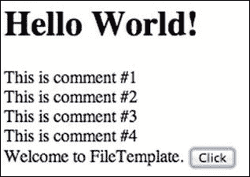
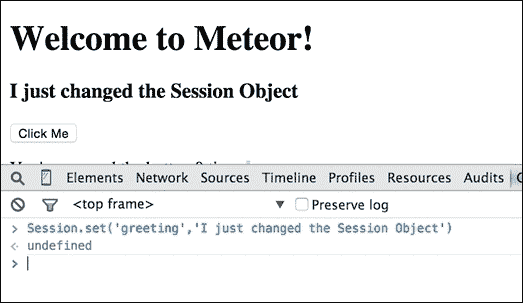
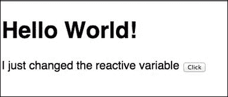
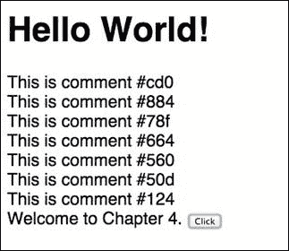
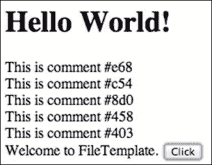
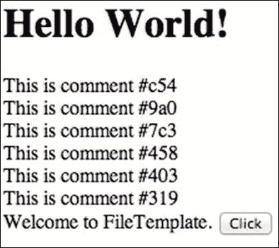
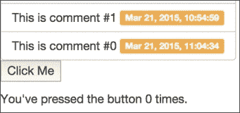

# 第四章。创建模型

在本章中，我们将涵盖以下主题：

+   实现一个简单的集合

+   使用 Session 对象

+   使用 MongoDB 查询进行排序

+   使用 MongoDB 查询进行过滤

+   创建 upsert MongoDB 查询

+   实现部分集合

# 简介

Meteor 数据模型设计得非常易于开发。那些担心长 SQL 语句、数据库驱动程序和严格结构的数据库表的日子已经过去了。取而代之的是一种简单直接的、基于 JSON 的文档模型，让你能够专注于应用程序的功能。本章包含了与 MongoDB 和 Meteor 中的反应模型上下文交互的最常见菜谱。

# 实现一个简单的集合

集合是客户端和服务器之间通信的媒介，更改会推送到客户端，请求会推送到服务器。这个菜谱将向你展示如何在客户端和服务器上声明一个集合以供使用。

## 准备工作

首先，你需要安装 Meteor 并创建一个项目。要创建标准的项目文件结构，请参阅 第一章 中的 *设置你的项目文件结构* 菜谱，*优化你的工作流程*。

对于这个特定的练习，你还需要安装 `autopublish` 和 `insecure` 包（这些包默认已安装）。如果你需要添加它们，请参阅 第二章 中的 *使用包进行自定义* 菜谱，*使用包进行自定义*。

## 如何做...

要实现一个简单的集合，请按照以下步骤进行：

1.  在你的 `both` 文件夹中创建一个新文件，命名为 `simple.js`。

1.  在编辑器中打开 `simple.js` 文件，通过输入以下内容来声明一个 MongoDB 注释集合：

    ```js
    Comments = new Mongo.Collection('comments');
    ```

1.  现在，打开客户端 `scripts` 文件夹中的 `main.js` 文件（`[项目根]/client/scripts/main.js`），向 `click button` 事件处理器添加一个动作，该动作将记录插入到 `Comments` 集合中：

    ```js
    Template.hello.events({ 'click button': function () { // increment the counter when button is clicked
        Session.set('counter', Session.get('counter') + 1);
     Comments.insert({text:'This is comment #' + (Comments.find().count()+1)});
      }
    });
    ```

1.  我们还需要添加一个注释助手。定位到 `Template.hello.helpers` 方法，并在开头添加以下助手：

    ```js
    Template.hello.helpers({
     comments: function () {
     return Comments.find();
     },
      ...
       });
    ```

1.  保存这些更改。

1.  打开你的 `main.html` 页面（`[项目根]/client/main.html`），按照以下示例在 `hello` 模板中添加一个 `{{ #each..}}` 模板片段，并保存你的更改：

    ```js
    <template name="hello">
     {{#each comments}}
     <div>{{text}}</div>
     {{/each}}
      ...
    </template>
    ```

1.  现在，打开一个终端窗口，导航到你的项目 `[root]` 文件夹，并启动 Meteor：

    ```js
    $ cd [project root]
    $ meteor

    ```

1.  在网页浏览器中，导航到 `http://localhost:3000/` 并点击屏幕上的按钮几次。结果应该每次点击都添加注释，类似于这样：

## 它是如何工作的...

`simple.js` 中的声明被客户端和服务器读取：

```js
Comments = new Mongo.Collection('comments');
```

这将实例化模型，并以 `Comments` 集合的形式体现。

`main.js` 的更改包括在 `click` 事件中添加一个额外的动作：

```js
Comments.insert({text:'This is comment #' + (Comments.find().count()+1)});
```

这将在客户端的 `Comments` 集合中添加一个评论对象，它将迅速传播到客户端的 minimongo，然后到服务器上的 MongoDB。由于 `main.js` 中的第二个更改，UI 立即更新：

```js
comments: function () { return Comments.find();
  }
```

`comments` 辅助函数是一个**响应式**计算，这意味着每当它包含的**响应式**上下文（观察属性）之一发生变化时，它都会重新运行。在这个例子中，`Comments.find()` 是一个响应式上下文，因此每当 `Comments` 集合发生变化时，这个 `comments` 辅助函数都会重新运行。

假设 MongoDB 集合（服务器端）批准了更改，UI 将保持更新。如果发生冲突或事务中存在问题，服务器将发送纠正消息，Minimongo 将使用正确的状态更新。但是，在这种情况下，因为我们没有冲突或延迟，更改被卡住，每次点击后都会添加评论。

此模板是响应式的，这意味着当在 `Comments` 集合中找到更改时，此函数将更新，Blaze 将重新渲染添加到 `main.html` 的 `{{#each…}}` 模板块：

```js
{{#each comments}}
  <div>{{text}}</div>
  {{/each}}
```

## 相关内容

+   第三章中的 *创建动态列表* 和 *使用响应式与 HTML 属性* 食谱，*构建出色的用户界面*

# 使用会话对象

**会话**对象是一个全局客户端对象，因此它是客户端模型的一部分。尽管它不属于任何集合，但会话对象可以在响应式上下文中使用，这意味着您可以使用它来使响应式方法在它发生变化时重新运行。本食谱将向您展示如何使用会话对象来更新页面上的元素。

## 准备工作

您需要安装 Meteor 并创建一个项目。要创建标准项目文件结构，请参阅第一章中的 *设置您的项目文件结构* 食谱，*优化您的流程*。一个快速默认项目对于本食谱来说也完全可以。

## 如何操作…

要使用会话对象，请按照以下步骤操作：

1.  在您的客户端的 `scripts` 文件夹中的 `main.js` 文件（[项目根目录]/client/scripts/main.js）中打开，并将 `greeting` 辅助函数添加到 `Template.hello.helpers` 的开头，如下所示：

    ```js
    Template.hello.helpers({   greeting: function() { return Session.get('greeting')||'Welcome to Chapter 4';
     },
      ...
    ```

1.  打开 `main.html` 并将问候语添加到您的 `hello` 模板中，如下所示：

    ```js
    <template name="hello">
     <h3>{{greeting}}</h3>

    ```

1.  如果 Meteor 尚未运行，请在终端窗口中导航到您的项目根目录并运行 `meteor` 命令：

    ```js
    $ cd [project root]
    $ meteor

    ```

1.  现在，打开浏览器，导航到 `http://localhost:3000/`，并打开您的网页控制台。

1.  在网页控制台中，输入并执行以下命令：

    ```js
    > Session.set('greeting','I just changed the Session Object')

    ```

    您屏幕上的问候语应从 **欢迎来到第四章** 更改为 **我刚刚更改了会话对象**，如下面的截图所示：

    

## 它是如何工作的…

在`greeting`模板辅助函数内部添加对`Session.get`的调用，告诉 Meteor 在`Session.keys`集合的`greeting`键中查找一个值。由于集合是 Meteor 中的响应式上下文，对`Session`集合所做的更改（即使通过 Web 控制台执行）会立即反映在 UI 上。

### 注意

`Session`对象字面上是一个*会话*对象。它只持续到下一次手动页面刷新。如果您需要更持久的，您将需要使用离线存储或 MongoDB 集合。请确保在设计/开发计划中包含这一事实。

## 还有更多...

截至`0.9.1`版本，Meteor 还提供了单个响应式变量。它们可以用作`Session`对象的替代品，具有更简洁的语法，可以是任何类型的对象，并且支持在触发响应式无效化之前检查更改。

要使用响应式变量，将`reactive-var`包添加到您的 Meteor 项目中：

```js
$ meteor add reactive-var

```

您可以声明并使用一个变量而不是`Sessio` `n`对象：

```js
greeting = ReactiveVar("Welcome to Chapter 4");

greeting: function () {
    return greeting.get();
}
```

此变量（正确声明）可以像处理`Session`对象一样进行操作，具有更简洁的语法。在 Web 调试控制台中输入以下命令将相应地更改显示：

```js
> greeting.set('I just changed the reactive variable')

```

上述命令将产生类似于以下截图的结果：



## 参见

+   在第三章的*使用 HTML 属性与响应性结合*食谱中，*构建出色的用户界面*

+   在第六章的*创建和消费响应值*以及*不使用 Mongo 更新 Blaze 模板*的食谱中，*掌握响应性*

# 使用 MongoDB 查询进行排序

有很多时候您需要排序一个集合。最近的评论、按字母顺序排列的列表和按金额排序的银行交易都是很好的例子。本食谱将向您展示如何使用`find()`请求中的选项对 MongoDB 集合进行排序。

## 准备工作

我们将使用本章中找到的*实现简单集合*食谱作为基准。请为此活动遵循该食谱。

## 如何做到这一点…

要使用 MongoDB 查询执行排序，请按照以下步骤进行：

1.  在您的`main.html`文件（位于`[project root]/client/main.html`）中，对`{{#each…}}`模板片段进行以下修改：

    ```js
    {{#each comments}}
      <div>{{text}}{{number}}</div>
      {{/each}}
      {{greeting}}
    ```

1.  接下来，修改位于`[project root]/client/script/main.js`中的`click`事件处理器内的`Comments.insert`操作：

    ```js
    Template.hello.events({
        'click button' : function () {
          // template data, if any, is available in 'this'
          if (typeof console !== 'undefined')
            console.log("You pressed the button");
            Comments.insert({text:'This int #',
    	 number:Random.hexString(3)});
        }
      });
    ```

1.  最后，在`main.js`内部，修改`find()`参数以指定按其`number`降序排序评论（`-1`）：

    ```js
    Template.hello.helpers({
      ...
      comments: function () {
      return Comments.find({},{sort:{number:-1}});
      },
      ...
    });
    ```

1.  保存所有更改，如果需要的话运行 Meteor。导航到`http://localhost:3000/`，点击屏幕上的按钮几次，并观察评论按评论编号排序：

## 工作原理…

这个菜谱的核心在于`find()`方法参数。我们通过添加一个随机数来修改了数字的存储方式，这样如果我们不做其他任何事情，评论将无序显示。但是，通过在`comments`辅助函数中添加`{sort:{number:-1}}`，我们向 Blaze 提供了按随机生成的`number`属性降序排序的结果。要按升序排序，请使用`1`作为参数。要按降序排序，请使用`-1`。

其余的更改是为了支持排序更改。首先，`main.js`被修改，以便`number`属性可以被随机分配并在将其插入`Comments`集合时添加到注释对象中：

```js
Comments.insert({text:'This is comment #', number:Random.hexString(3)});
```

最后的更改是对`main.html`进行更改，以在 UI 中显示新的`number`属性：

```js
<div>{{text}}{{number}}</div>
```

## 更多内容…

如果需要，你可以使用多个属性执行复杂的排序。要这样做，只需将额外的属性键添加到`sort`选项中，使用升序（`1`）或降序（`-1`）值，类似于以下：

```js
return Collection.find({},{sort:{prop1:-1, prop2:1}});
```

## 参见

+   在第三章的*使用 Spacebars 插入模板*菜谱中，*构建优秀的用户界面*

# 使用 MongoDB 查询进行过滤

无论你是在执行搜索、组织记录还是缩小结果范围，迟早你都会想要过滤你收藏的结果。这个菜谱展示了如何使用 MongoDB 的`find`方法选项来限制集合中的记录数量。

## 准备工作

我们将使用本章中*使用 MongoDB 查询进行排序*菜谱中创建的项目。请完成该菜谱，并使用文件作为本菜谱的基线。

## 如何操作…

要过滤 MongoDB 查询，请按照以下步骤操作：

1.  将以下更改应用到`[项目根]/client/scripts/main.js`中的`comments`辅助函数：

    ```js
    Template.hello.helpers({
      ...
      comments: function () {
        return Comments.find({number:/[2468]/},{sort:{number:-1}});
      },
      ...
    });
    ```

1.  保存`main.js`并在必要时启动 Meteor。导航到`http://localhost:3000/`；点击屏幕上的按钮几次，并观察只显示包含偶数的评论。多次点击后的结果应该类似于以下截图：

1.  将`main.js`中的正则表达式更改，只显示包含奇数的评论，通过在查询中进行以下更改：

    ```js
    return Comments.find({number:/[13579]/}, {sort:{number:-1}});
    ```

1.  保存你的更改，并观察你的 UI 的变化，它应该看起来类似于以下截图：

## 它是如何工作的…

通过在查询中的`find()`语句中添加一个选择器，集合将缩小以匹配选择器中指定的任何内容。在这种情况下，选择器是一个正则表达式，只有当`number`属性包含至少一个偶数时，才会返回结果，随后，如果`number`属性包含至少一个奇数。

注意，这并没有以任何方式改变 `{sort:{number:-1}}` 断言，并且它工作得完全一样，无论我们如何更改查询。

### 小贴士

你可以使用一系列选择器来限制/过滤你的集合。要获取完整列表，请查看位于 [`docs.mongodb.org/manual/reference/operator/query/`](http://docs.mongodb.org/manual/reference/operator/query/) 的 MongoDB 查询运算符列表。

## 还有更多...

将过滤器移到服务器端提供了安全性和性能优势，因为非匹配的结果从一开始就不会发送到客户端。实际上，`find()` 最常在服务器上使用，利用 Meteor 的发布和订阅功能。关于在服务器上使用 `find()` 的示例，请参阅本章中找到的 *使用 MongoDB 查询进行排序* 菜谱。

## 相关内容

+   本章中的 *实现部分集合* 和 *使用 MongoDB 查询进行排序* 菜谱

# 创建 upsert MongoDB 查询

在开发应用程序时，有时你会遇到需要更新现有记录或如果不存在则插入记录的情况。这通常使用条件运算符，如 `if` 来完成。

通过 MongoDB，Meteor 通过允许你使用简单语法进行 upsert（更新+插入）记录来减轻检查的负担。这个菜谱将向你展示如何做到这一点。

## 准备工作

我们将再次使用本章中 *使用 MongoDB 查询进行排序* 菜谱中创建的项目。请创建这个菜谱的新副本，并使用这些文件作为本菜谱的基线。

我们还将使用官方的 `momentjs` 包。要添加 `momentjs` 包，请在终端窗口中导航到你的项目根目录。一旦到达那里，请执行以下命令：

```js
$ meteor add momentjs:moment

```

这将添加 `momentjs` 包，现在你可以完成这个菜谱了。

## 如何做到...

我们首先需要增加重复记录的可能性，并确定每个评论被插入或更新的时间。按照以下步骤创建 upsert MongoDB 查询：

1.  打开 `[项目根目录]/client/scripts/main.js` 文件，并按如下方式修改 `Template.hello.events`：

    ```js
      'click button': function () {
      ...
      Session.set('counter', Session.get('counter') + 1);
     var newC = {
     text:'This is comment #',
     number:Random.hexString(1),
     time: moment().format('ll, hh:mm:ss')
     };
     Meteor.call('commentUpsert',newC);
    }
    ```

1.  我们现在将为 `upsert` 函数创建一个服务器方法。默认情况下，Meteor 只允许通过 `_id` 在客户端进行修改，由于 `_id` 值可能不存在，我们需要为我们的 `upsert` 函数创建一个服务器方法。打开 `[项目根目录]/server/server.js` 并在文件底部添加以下方法：

    ```js
    Meteor.methods({
      commentUpsert: function(newC){
        Comments.upsert({number:newC.number},{$set:newC});
      }
    });
    ```

1.  最后，我们将修改 `[项目根目录]/client/main.html` 以在 `comments` 集合中显示每个评论的时间戳：

    ```js
    {{#each comments}}
      <div>{{text}}{{number}} at: {{time}}</div>
      {{/each}}
    ```

1.  保存你的更改，如果 Meteor 还未运行，请启动它，并导航到 `http://localhost:3000/`。

1.  持续点击屏幕上的按钮，观察每次点击时，不是添加新记录，而是如果记录已存在，则更新记录的时间戳。

## 它是如何工作的...

在 `server.js` 中，我们在 `Meteor.methods` 内声明了 `commentUpsert` 方法。

此方法接收一个新评论对象 (`newC`) 作为参数，并在 `Comments` 集合上调用 `upsert`。第一个参数（选择器）告诉 MongoDB 在 `newC` 对象中查找与 `number` 属性匹配的任何条目。第二个参数（修改器）告诉 MongoDB 在 `upsert` 对象上插入/更新哪些字段。

如果找到匹配项，则更新字段。如果没有找到匹配项，则插入一个新记录，`newC` 对象提供值。

在 `main.html` 中，我们只是简单地添加了新的 `time` 属性到显示中：

```js
<div>{{text}}{{number}} at: {{time}}</div>
```

在 `main.js` 中，我们首先删除了 `Comments.insert()` 语句。然后创建 `newC` 对象，使用 `moment().format()` 将时间戳转换为可读格式，填充一个随机数字、一些文本和一个时间戳。最后，我们通过 `Meteor.call` 语句调用 `commentUpsert` 服务器端方法。

结果确认我们的 `upsert` 函数正在正常工作，因为每个新的评论（带有新的 `number` 属性）都被添加到我们的列表中，每个现有的评论（带有已经存在的 `number` 属性）的时间戳都得到了更新。

## 还有更多…

Meteor 通过添加实际的 `upsert` 函数来简化事情，而不是在传统的 MongoDB `update` 查询中设置 `{upsert:true}`。在 Meteor 中，`update` 或 `upsert` 都可以使用，具体选择取决于你。

### 小贴士

关于在 MongoDB 集合中更新和 upsert 记录的详细文档已经存在。你可以在 [`docs.mongodb.org/manual/reference/method/db.collection.update/`](http://docs.mongodb.org/manual/reference/method/db.collection.update/) 找到更多详细信息。

## 参见

+   第十一章 *构建自定义服务器方法* 菜谱，*利用高级功能*

# 实现部分集合

部分集合是从服务器发送下来的集合，其中只包含每个记录上可用的部分信息。这对于隐藏属性或字段，以及减少包含大量信息的记录的大小很有用。换句话说，部分集合可以帮助提高安全和性能。这个菜谱将向你展示如何在服务器上实现部分集合。

## 准备工作

让我们以本章中找到的 *创建 upsert MongoDB 查询* 菜谱作为本菜谱的基准。创建这个菜谱的新副本，然后进行其他准备工作。

让我们在做这件事的同时也稍微整理一下。在一个终端窗口中，导航到根项目文件夹，并执行以下命令：

```js
$ meteor add twbs:bootstrap

```

这将添加 `bootstrap` CSS 框架。现在我们想利用 `bootstrap`，所以打开你的 `main.html` 文件（位于 `[项目根]/client/`），并对 `hello` 模板进行以下更改：

```js
<template name="hello">
  ...
 <div class="btn-group-vertical">
 {{#each comments}}
 <div class="btn btn-default">{{text}}{{number}}
 <span class="label label-warning">
 {{time}}
 </span>
 </div>
 {{/each}}
 </div>
 <p><button>Click Me</button></p>
  ...
</template>
```

这些更改将使用一些默认的`bootstrap`组件样式来使我们的显示看起来类似于以下截图：



现在，我们需要移除`autopublish`默认的 Meteor 包。在终端窗口中，执行以下命令：

```js
$ meteor remove autopublish

```

这将暂时**中断**你的应用程序；在这种情况下，`Comments`集合中的记录不会通过线发送到客户端，因此 UI 中不会显示任何记录。别担心，我们会修复这个问题！

你现在可以继续到下一个步骤。

## 如何操作…

首先，由于我们移除了`autopublish`，我们需要准备客户端订阅`comments`数据流。要实现部分集合，请按照以下步骤进行：

1.  打开`[项目根]/client/scripts/main.js`，并将以下代码添加到文档的顶部：

    ```js
    Meteor.subscribe('comments');

    ```

1.  当我们打开`main.js`时，让我们也改变我们排序的内容，通过修改`comments`辅助函数并保存你的更改：

    ```js
    comments: function () {
      return Comments.find({},{sort:{time:-1}});
    },
    ```

1.  接下来，我们需要服务器发布`Comments`数据集合。我们将同时从响应流中移除文本字段，实现**部分集合**。打开`[项目根]/server/server.js`，添加以下代码，并保存你的更改：

    ```js
    Meteor.publish ('comments',function(){
      return Comments.find({} , {fields:{text:false}});
    });
    ```

    我们现在可以立即看到文本字段不再在 UI 中显示，如下面的截图所示：

    

1.  让我们现在稍微清理一下 UI，使其明显显示记录正在重新排序。再次打开`main.html`，进行以下更改，并保存文件：

    ```js
    <div class="btn btn-default">{{time}}
      <span class="label label-warning">
     {{number}}
      </span>
    </div>
    ```

    现在，当你点击按钮来更新`time`属性时，时间戳将被更新，并且每次点击（点击几次以真正看到效果）都会改变记录的排序：

    

## 它是如何工作的…

这个菜谱的核心在`server.js`中，我们添加了`fields`字段指定符到 MongoDB 查询（在`Meteor.publish(…)`语句中）：

```js
Meteor.publish ('comments',function(){ return Comments.find({} , {fields:{text:false}});
})
```

这个字段指定符告诉 MongoDB 查询从结果中排除文本字段/属性。一旦做出这个更改，`main.html`仍然试图在模板中调用`{{text}}`，但由于它是空的，所以没有显示。然后我们完全移除了显示`{{text}}`的调用，因为它不是必需的。

## 还有更多…

如前所述，`fields`字段指定符可以通过只列出我们不想看到的字段来设置为**排除**。为此，只需为每个不想看到的字段使用`:false`（或`:0`）参数，其余字段将默认包含。例如：

```js
record.find({} , {fields:{f1:false , f2:false}});
```

字段指定符也可以设置为**包含**，这意味着只有指定的字段将通过使用`:true`（或`:1`）参数被包含。这看起来会类似于以下代码：

```js
record.find({} , {fields:{f3:true , f4:true}});
```

### 提示

要了解更多关于`fields`字段指定符的信息，请查看官方 Meteor 文档，链接为[`docs.meteor.com/#/full/fieldspecifiers`](http://docs.meteor.com/#/full/fieldspecifiers)。

## 参见

+   第九章中的*基本安全 - 关闭 autopublish*配方，*保护您的应用程序*，章节链接为 Chapter 9。
