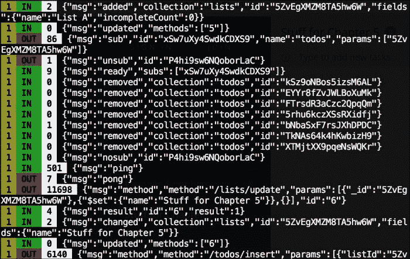
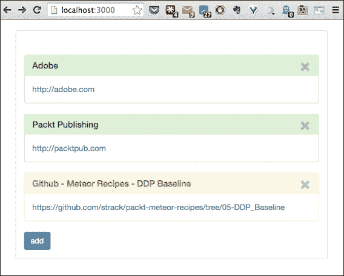
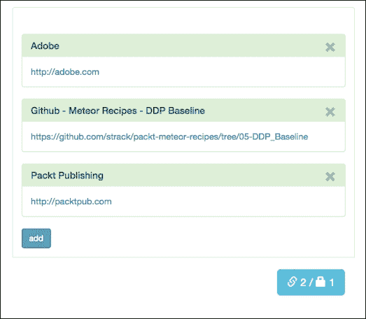
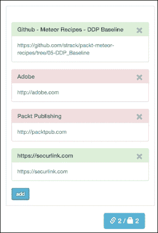
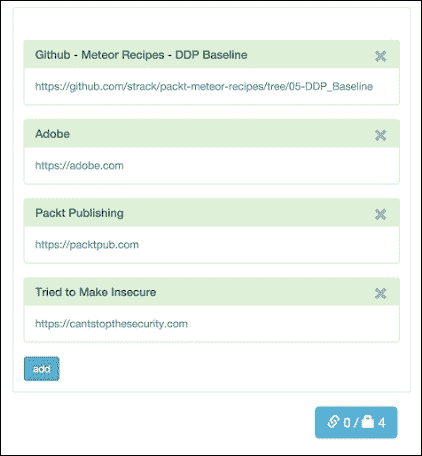

# 第五章。实现 DDP

在本章中，我们将涵盖以下主题：

+   读取 DDP 流

+   使用仅客户端集合

+   实现多服务器 DDP

+   将 DDP 与其他技术集成

# 简介

对于 Meteor 来说，实时应用程序的概念是基础，客户端和服务器通过**数据在线上**的原则相互交互。Meteor 团队为此实时客户端-服务器通信开发了一种协议，称为**分布式数据协议**（**DDP**）。与 Meteor 中的其他一切一样，DDP 是一个独立的（尽管是核心）库，您可以使用它单独使用。本章中的食谱将向您展示 DDP 是如何工作的，并给您一些关于如何在 Meteor 的默认使用之外使用它的想法。

# 读取 DDP 流

要真正理解 DDP（以及调试目的）的情况，能够读取 DDP 流非常有用。看到 DDP 的实际操作不仅可以帮助调试过程，还可以帮助您更好地理解这个协议的灵活性和实用性。这个食谱将向您展示如何使用 Arunoda Susiripala 的出色的 DDP 分析器。

## 准备工作

您需要安装 Meteor、Node 和 npm。有关安装说明，请访问以下网址：

+   Node—[`nodejs.org`](http://nodejs.org)

+   npm—[`www.npmjs.com/`](https://www.npmjs.com/)

您还需要一个项目。您可以使用几乎任何您喜欢的项目。因为它提供了合理的、可控的客户-服务器通信量（换句话说，DDP 流），我们将使用`todos`示例应用程序。请注意，如果您愿意，您也可以使用自己的 Meteor 项目。我们之所以使用这个示例，是因为它方便，并且我们可以控制数据流。

要安装`todos`示例，请打开一个终端窗口，导航到您选择的目录，并输入以下命令：

```js
$ meteor create --example todos

```

现在请输入以下命令启动您的 Meteor 应用程序：

```js
$ cd todos
$ meteor

```

您现在已准备好在`todos`应用程序上安装和运行 DDP 分析器。

## 如何做...

1.  首先，我们需要安装 DDP 分析器。在终端窗口中，输入并执行以下命令：

    ```js
    $ npm install -g ddp-analyzer

    ```

    注意，您可能需要在使用`-g`操作符时使用`sudo`，以便从任何地方使分析器可用，并确保它具有适当的权限。经过简短的安装过程后，分析器将安装并准备好使用。

1.  通过输入以下命令启动分析器代理：

    ```js
    $ ddp-analyzer-proxy

    ```

    您将收到类似以下的消息：

    ```js
    DDP Proxy Started on port: 3030
    ===============================
    Export following env. variables and start your meteor app
     export DDP_DEFAULT_CONNECTION_URL=http://localhost:3030
     meteor

    ```

1.  我们现在需要重新启动我们的 Meteor 实例，使用前面步骤中提到的环境变量。在您的终端窗口中，如果`meteor`仍在运行，请停止它，并输入以下命令：

    ```js
    $ export DDP_DEFAULT_CONNECTION_URL=http://localhost:3030
    $ meteor

    ```

1.  一旦`meteor`开始备份，请在浏览器中导航到`http://localhost:3000`，DDP 分析器将准备就绪。

1.  执行多个任务，例如添加新的`todo`项，完成/编辑现有项等。

1.  查看你在启动 DDP 分析器时所在的终端窗口中的 DDP 流。它看起来会类似于以下截图：

    你将能够看到所有针对客户端的消息。黄色数字告诉你消息是发送给哪个客户端的。以 **IN** 开头的消息表示消息是从服务器发送到客户端的。如果消息以 **OUT** 开头，这表示消息和客户端到服务器的出站请求。消息是按照颜色编码的文本之后的纯文本。

    使用 DDP 分析器，你可以真正地深入了解，看到 DDP 究竟是如何工作的。你会很快意识到该协议是多么灵活和简单，并且你将更好地理解你可以在你的 Meteor（或其他）应用程序中使用它做什么。

## 它是如何工作的...

简单来说，DDP 是两个端点之间的一系列消息。这些消息显示了更新、添加和删除，并通过 WebSocket 传输。这意味着消息可以实时发送，而不是等待传统的客户端请求轮询。这减少了流量（嘈杂），并确保消息尽可能快地送达。

DDP 分析器使用 DDP 协议，监听你的浏览器和 Meteor 应用程序之间的流式对话。当你使用 `DDP_DEFAULT_CONNECTION_URL=` 命令更改 DDP 执行的端口时，你通过端口 `3030` 重定向了你的应用程序。DDP 分析器监听这个端口，代理连接到端口 `3000`，并在终端窗口中记录所有接近它的流量。

## 更多内容...

完成后，请确保打开一个新的终端窗口或使用以下命令将你的环境变量改回端口 `3000`：

```js
$ export DDP_DEFAULT_CONNECTION_URL=http://localhost:3000

```

如果你不这样做，你的应用程序将停止工作，因为 DDP 仍在通过端口 `3030` 运行。

## 参见

+   在 第一章 的 *使用 web 控制台* 食谱中，*优化你的工作流程*

# 使用仅客户端集合

要真正理解 DDP 的工作原理，尝试自己实现与数据通过网络通信是有帮助的。这样做（并且是一个非常有用的食谱！）的最佳方式是让客户端继续利用内置的 Mongo 集合，并基于一些简单的逻辑从服务器端程序性地发送更新。这个食谱将指导你创建一个仅客户端的集合，并通过服务器端的调用来操作这个集合。

## 准备工作

我们将需要一个示例项目作为基准。为此基准，我们将快速创建一个书签应用程序。没有铃声和哨声，只是一个简单的书签标题和 URL 列表。

要做到这一点，我们首先需要默认的模板脚手架。请使用第一章中“设置你的项目文件结构”配方创建一个名为`bookmarks`的新项目，作为你的起始文件结构。

我们需要添加和移除一些 Meteor 包。首先，移除`autopublish`包。打开一个终端窗口，导航到你的项目根目录，并执行以下命令：

```js
$ meteor remove autopublish

```

接下来，让我们添加`bootstrap`包。在你的终端窗口中执行以下命令：

```js
$ meteor add twbs:bootstrap

```

现在我们将添加创建我们的`bookmarks`程序所需的 HTML 和 JavaScript。

将你的`[项目根目录]/client/main.html`文件的内容替换为以下内容：

```js
<head>
    <title>Chapter 05</title>
</head>
<body>
    {{> urls}}
</body>
<template name="urls">
    <div class="url-container">
      {{#each bookmarks}}
      <div class="bookmark panel {{selected}}">
        <div class="panel-heading">
          <button type="button" class="close"><span class="glyphicon glyphicon-remove"></span>
          </button>
          {{#if editing}}
            <h3 class="panel-title"><input type="text" value="{{title}}"></h3>
          {{else}}
          <h3 class="panel-title"> {{title}}</h3>
            {{/if}}
        </div>
        <div class="panel-body">
          {{#if src}}
            <a href="{{src}}">{{src}}</a>
          {{else}}
            <div class="input-group">
              <input type="text" class="form-control" placeholder="enter URL here" />
            </div>
          {{/if}}
        </div>
      </div>
      {{/each}}
      <input type="button" class="btn btn-primary" id="btnNewBM" value="add" />
    </div>
</template>
```

接下来，在你的`[项目根目录]/client/scripts`文件夹中，将以下内容添加到`main.js`中：

```js
Meteor.subscribe('urls');
```

然后，在同一个`scripts`文件夹中创建一个`templateHelpers.js`文件，并添加以下`helpers`函数：

```js
Template.urls.helpers({ bookmarks: function () { return URLs.find();
    },
    title: function () { return this.title || this.src;
    },
    editing: function () { return Session.equals('selMark', this._id) && Session.equals('editMark', this._id);
    },
    selected: function () { return Session.equals('selMark', this._id) ? "panel-warning" : "panel-success";
    },
    src: function () { return this.src || false;
    }
});
```

在同一个`templateHelpers.js`文件中，添加以下`events`函数：

```js
Template.urls.events({
    'click .bookmark': function (e) {
        Session.set('selMark', this._id);
    },
    'dblclick .bookmark': function (e) {
        Session.set('editMark', this._id);
    },
    'blur .panel-title > input': function (e) {
        if (e.currentTarget.value !== this.title) {
            Meteor.call('updateTitle', this._id, e.currentTarget.value, function (err, succ) {
                console.log(succ);
            });
        }
        Session.set('editMark', null);
    },
    'keypress .panel-title > input': function (e) {
        if (e.keyCode == 13 && e.currentTarget.value !== this.title) {
            Meteor.call('updateTitle', this._id, e.currentTarget.value, function (err, succ) {
                console.log(succ);
                Session.set('editMark', null);
            });
        }
    },
    'click #btnNewBM': function (e) {
        URLs.insert({
            title: 'new bookmark'
        });
    },
    'blur .input-group > input': function (e) {
        if (e.currentTarget.value !== this.src) {
            Meteor.call('updateSRC', this._id, e.currentTarget.value, function (err, succ) {
                console.log(succ);
            });
        }
    },
    'keypress .input-group > input': function (e) {
        if (e.keyCode == 13 && e.currentTarget.value !== this.src) {
            Meteor.call('updateSRC', this._id, e.currentTarget.value, function (err, succ) {
                console.log(succ);
            });
        }
    },
    'click .close': function (e) {
        Meteor.call('removeBM', this._id, function (err, succ) {

        });
    }
});
```

现在，我们需要一点样式。打开位于你的`[项目根目录]/libs/styles`文件夹中的`style.css`文件，并用以下样式替换现有的样式：

```js
/* CSS declarations go here */
body {
    font-size:1.5rem;
}

.url-container{
    background-color: rgb(255, 255, 255);
    border-color: rgb(221, 221, 221);
    border-width: 1px;
    border-radius: 4px 4px 0 0;
    -webkit-box-shadow: none;
    box-shadow: none;
    position: relative;
    padding: 45px 15px 15px;
    margin: 20px;
    margin-left:auto;
    margin-right:auto;
    max-width: 90%;
    border-style:solid;
}

.input-group {
    width:90%;
}
```

我们需要声明我们的 URL 集合，因此在你的`[项目根目录]/both`文件夹中创建一个`collections.js`文件，并添加以下`Mongo.Collection`声明和`String.prototype`函数：

```js
URLs = new Mongo.Collection("urls");

if (typeof String.prototype.startsWith != 'function') {
    String.prototype.startsWith = function (str){
        return this.slice(0, str.length) == str;
    };
}
```

最后，我们添加一些服务器逻辑。打开`[项目根目录]/server/server.js`，并用以下代码替换任何现有的代码：

```js
    Meteor.publish('urls',function(){
       return URLs.find();
    });

    Meteor.methods({
        updateTitle: function(id,title){
            var bmark = URLs.findOne(id);
            if (!bmark) return;
            if (title&& title!==bmark.title){
                URLs.update(id,{$set:{title:title}});

            return "updated";
            }
            return "same title";
        },
        updateSRC: function(id,src){
            var bmark = URLs.findOne(id);
            if (!bmark) return;
            if (src&& src!==bmark.src){

                //Adding the http if it doesn't already have it...
                src = src.startsWith('http')? src: 'http://'+src;
                URLs.update(id,{$set:{src:src}});

                return "updated";
            }
            return "same src";
        },
        removeBM: function(id){
            URLs.remove(id);
            return "removed";
        }
    });
```

保存所有更改，启动你的`meteor`实例，并在浏览器中导航到你的项目（通常是`http://localhost:3000`）。如果一切顺利，你现在将有一个工作的`bookmarks`应用，你可以添加 URLs，并通过双击添加/更改书签的标题。以下截图是浏览器完成时的一个示例：



## 如何做到这一点...

我们将在“书签”页面的底部添加一个计数器。这个计数器会告诉我们有多少个安全和非安全链接（通过链接是否以`https`开头来决定）。

1.  首先，我们将添加一个客户端只读的集合`bmcounts`并订阅它。如果我们在这个`clients`文件夹的任何地方声明这个集合，服务器将看不到它。因此，它将是一个客户端只读的集合。在你的客户端`scripts`文件夹中的`main.js`文件（`[项目根目录]/client/scripts/main.js`）中打开，并在现有的`Meteor.subscribe('urls')`命令周围添加以下两行，如下所示：

    ```js
    BMCounts = new Mongo.Collection("bmcounts");
    Meteor.subscribe('urls');
    Meteor.subscribe('bmcounts', new Mongo.ObjectID());

    ```

1.  当我们在`scripts`文件夹中时，让我们打开`templateHelpers.js`文件，并添加我们需要来显示计数的反应式`Template.helpers`函数。将以下函数添加到文件的底部：

    ```js
    Template.linkcount.helpers({
        BMCount: function(){
            return BMCounts.findOne();
        }
    });
    ```

1.  现在，让我们添加 HTML 模板。打开位于你的`client`文件夹中的`main.html`，并在`<body>`标签周围添加以下代码：

    ```js
    <body>
        {{> urls}}
     {{> linkcou
    nt}}
    </body>
    <template name="linkcount">
     {{#with BMCount}}
     <div id="counts">
     <button class="btn btn-lg btn-info">
     <span class="glyphicon glyphicon-link"></span>
     {{unsecureCount}} /
     <span class="glyphicon glyphicon-lock"></span>
     {{secureCount}}
     </button>
     </div>
     {{/with}}
    </template>

    ```

1.  我们还会用一些 CSS 让计数器看起来更美观。打开你的`style.css`文件，它位于你的`lib`/`styles`目录中，并添加以下 CSS 声明：

    ```js
    #counts{
        position:relative;
        float:right;
        margin-right:50px;
    }
    ```

1.  现在我们需要在服务器端做一些实际的工作。我们需要在添加、删除或更改书签时计数和排序。打开你的`server.js`文件，它位于你的`server`文件夹中，并添加以下`Meteor.publish`函数：

    ```js
    Meteor.publish('bmcounts', function (id) {
      var self = this;
      var count = 0;
      var secCount = 0;
      var initializing = true;
      var handle = URLs.find().observeChanges({
        //TODO: Added
        //TODO: Removed
        //TODO: Changed
      });
      initializing = false;
      self.added("bmcounts", id, {
        unsecureCount: count,
        secureCount: secCount
      });
      self.ready();
      self.onStop(function () {
        handle.stop();
      });
    });
    ```

1.  在前面的代码块中，我们有三个`TODO`注释。我们首先需要创建`added`监听器。直接在`//TODO: Added`注释下方，添加以下代码：

    ```js
    //TODO: Added
    added: function (idx, doc) {
     if (doc.src && doc.src.toLowerCase().startsWith('https')) {
     secCount++;
     if (!initializing)
     self.changed("bmcounts", id, {
     secureCount: secCount
     });
     } else {
     count++;
     if (!initializing)
     self.changed("bmcounts", id, {
     unsecureCount: count
     });
     }
    },

    ```

1.  接下来是`removed`监听器。直接在`//TODO: Removed`注释下方，添加以下代码：

    ```js
    //TODO: Removed
    removed: function (idx, doc) {
     //really inefficient...
     var bms = URLs.find().fetch();
     secCount = _.filter(bms,function(bm){
     return bm.src && bm.src.toLowerCase().startsWith('https');
     }).length;
     count = bms.length - secCount;
     self.changed("bmcounts", id, {
     unsecureCount: count,
     secureCount: secCount
     });

     },

    ```

1.  最后，是`changed`监听器。直接在`//TODO: Changed`注释下方添加以下代码：

    ```js
    //TODO: Changed
    changed: function (idx, doc) {
     if (doc.src && doc.src.toLowerCase().startsWith('https')) {
     secCount++;
     count--;
     self.changed("bmcounts", id, {
     unsecureCount: count,
     secureCount: secCount
     });
     }
    }

    ```

1.  保存所有更改，如果你的`meteor`实例尚未启动，请启动它，并在浏览器中导航到你的项目（通常是`http://localhost:3000`）。你应该会在屏幕的右下角看到一个包含安全和非安全链接计数的小信息按钮。添加一些新链接，删除一些链接，并观察浏览器中的计数即时变化，类似于以下截图：

## 它是如何工作的…

我们刚刚添加的所有客户端代码与常规 Mongo 集合的代码完全相同。对于客户端来说，一切都是正常的。

然而，在服务器上，我们需要手动根据对`URLs`集合所做的更改更新 DDP 流中的`.added`和`.changed`消息。

为了实现这一点，我们首先使用`Meteor.publish()`函数参数中传递的函数：

```js
Meteor.publish('bmcounts', function (id) {
...
});
```

每当客户端订阅 DDP 流时，这个函数就会重新运行。在函数内部，我们使用`Mongo.Cursor.observeChanges()`函数创建一个`handle`：

```js
var handle = URLs.find().observeChanges({
  ...
});
```

在`observeChanges`函数内部，如果添加了一个文档（除了初始化时），我们会检查`src`属性是否以`https`开头，以确定是否可以增加`secCount`（安全计数）变量；否则，我们只会增加正常的`count`变量。

如果一个文档被删除，我们不得不做一些小技巧，但我们会重新计算`secCount`和`count`变量。

如果文档的`src`变量被更改，我们将执行与`added`中相同的检查，并将增量从`count`移动到`secCount`。

随着`URLs`集合实时变化，这三种情况将会发生。因此，在每个更改之后，我们将调用`self.changed()`函数，该函数通过 DDP 向客户端发送消息，模拟如果我们正常修改`bmcounts`集合时将会发送的自动更改消息。

你会注意到`bmcounts`集合在服务器上从未被使用。相反，我们通过`"bmcounts"`订阅通道向客户端发送消息，如下例所示：

```js
self.changed("bmcounts", id, {
  ...
});
```

这是一个重要的区别。客户端并没有订阅实际的 MongoDB 集合。相反，它订阅了一个 `DDP` 消息通道。在这种情况下，我们让客户端为我们做繁重的工作，通过向 `bmcount` 客户端专用集合发送 `"bmcounts"` 订阅消息。本质上，服务器通过电线发送数据变化，而客户端由于不知情，将这些消息视为实际的数据变化。

该方法的其余部分是在客户端取消订阅时的清理工作，使用 `handle.stop()` 来完成初始化。它包括调用 `self.added()`，这与 `self.changed()` 调用做同样的事情（模拟数据变化并将其发送到已订阅的客户端）。初始化的最后一步是调用 `self.ready()`，这会让已订阅的客户端知道所有初始数据变化都已发送。

## 参见

+   在 第四章 的 *实现部分集合* 食谱中，*创建模型*

+   在 第九章 的 *基本安全 - 关闭 autopublish* 食谱中，*保护您的应用程序*

# 实现多服务器 DDP

乐趣不仅仅局限于单个客户端和服务器 DDP 连接。哦，不！实际上，Meteor 已经邀请了所有人参加 DDP 舞会，在这个食谱中，我们将看到两个 Meteor 服务器如何使用 DDP 互相通信。

## 准备工作

我们将使用本章中找到的 *使用客户端专用集合* 的代码库。请创建此项目的实例并启动你的 `meteor` 服务器。

对于这个项目，我们将根据链接是否安全来改变书签标题的颜色；因此，我们需要对我们的第一个项目进行一个修改，使颜色依赖于 `secType` 属性（我们将在本食谱中创建）。打开位于 `[项目根]/client/scripts` 文件夹中的 `templateHelpers.js` 文件。定位到 `Template.urls.helpers` 部分，并对 `selected` 函数进行以下修改：

```js
Template.urls.helpers({
    …
    selected: function () {
        return Session.equals('selMark', this._id) ? "panel-warning" : this.secType;
    },
    …
```

由于我们将实现另一个 Meteor 服务器实例，我们还需要创建一个新的 Meteor 项目。在终端窗口中，导航到根项目文件夹之外的位置，并在终端窗口中输入以下命令：

```js
$ meteor create typecheck
$ cd typecheck
$ meteor remove autopublish
$ meteor --port 3030

```

这将正确初始化第二个服务器实例，并在端口 `3030` 上启动它。

现在我们已经准备好让我们的第二个 Meteor 项目与第一个项目进行通信了！

## 如何做到这一点...

我们将使用一个新的书签属性 `secType` 来改变书签标题的颜色。我们的新（第二个）项目将在书签通过 DDP 通道到来时进行检查，并在需要时添加 `secType` 属性。让我们开始吧。

1.  首先，我们将想要利用我们从*使用仅客户端集合*食谱中熟悉的`String.startsWith()`函数。将以下原型修改器添加到位于您第二个项目根文件夹中的`typecheck.js`文件底部：

    ```js
    if (typeof String.prototype.startsWith != 'function') { String.prototype.startsWith = function (str){return this.slice(0, str.length) == str;
        };
    }
    ```

1.  现在，我们想要创建一个仅服务器文件，以便我们可以专注于手头的任务。在项目根目录下创建一个`server`文件夹，然后创建并打开一个名为`DDPChecker.js`的文件进行编辑。

1.  在`DDPChecker.js`文件中，添加以下代码以从我们的第一个项目连接和订阅`urls`集合：

    ```js
    conn = DDP.connect("http://localhost:3000");
    URLs = new Mongo.Collection("urls",conn);
    conn.subscribe("urls");
    ```

1.  现在，我们创建一个函数来检查记录，看`secType`变量是否已设置。如果没有设置，并且有一个要检查的`src`属性，它将使用适当的`secType`变量更新记录。将以下函数添加到`DDPChecker.js`文件底部：

    ```js
    function checkSecType(idx,doc){ if (!doc.src || doc.secType) return;
        if (doc.src.toLowerCase().startsWith('https'))
            doc.secType = 'panel-success';
        else
            doc.secType = 'panel-danger';
        URLs.update(idx,doc);
    }
    ```

1.  最后一个拼图是添加对刚刚创建的`checkSecType`函数的调用，每次记录被添加或更改时。我们通过调用`observeChanges`函数和`URLs.find()`游标来完成此操作。将以下代码添加到`DDPChecker.js`文件底部：

    ```js
    URLs.find().observeChanges({ added:checkSecType, changed:checkSecType });
    ```

1.  打开浏览器并导航到您的项目（通常是`http://localhost:3000`）。每个书签的颜色应该对应于书签链接的网络安全类型，类似于以下截图：

## 它是如何工作的…

在我们的第二个项目中，我们声明了`URLs`集合并订阅了变化，就像在正常的`client`应用中做的那样。这里的区别在于我们正在使用`DDP.Connect()`函数建立与现有 Meteor 服务器的连接：

```js
conn = DDP.connect("http://localhost:3000");
URLs = new Mongo.Collection("urls",conn);
```

当我们声明`URLs`集合时，我们将此连接的处理程序作为名为`conn`的参数传递。这告诉 Meteor 我们对该集合（更准确地说，是 DDP 消息）感兴趣，这些消息来自我们的第一个服务器。

为了避免冗余代码，我们创建了`checkSecType`函数，该函数监听对`URLs`集合所做的更改，并将`secType`属性设置为与`src`属性的网络安全类型相对应。然后我们将`checkSecType`函数用作通过`observeChanges`通过 DDP 线传入的`added`和`changed`事件的处理器。

## 还有更多…

使用 DDP 作为客户端并不局限于 Meteor。您可以使用 DDP 与几乎所有技术一起使用。您将在本章后面的*将 DDP 与其他技术集成*食谱中看到一个示例。

## 相关内容

+   在第四章的*实现部分集合*食谱中，*创建模型*

+   本章中的*将 DDP 与其他技术集成*食谱

# 将 DDP 与其他技术集成

DDP 永远不会停止！DDP 库适用于大多数主要编程语言和平台，你可以非常快速地让你的客户端、服务器，甚至是硬件设备与你的 Meteor 服务器进行通信，而不需要太多努力。这个配方将向你展示如何从 `Node.js` 程序使用 DDP 连接到 Meteor 服务器。

## 准备工作

我们将想要使用本章中找到的 *使用仅客户端集合* 配方的代码库。请创建该项目的实例并启动你的 `meteor` 服务器。

你需要安装 Node 和 npm 来完成这个配方。它们默认与 Meteor 一起安装。但是，如果你需要有关如何安装 Node.js 和 npm 的说明，可以在以下网站上找到：

+   Node—[`nodejs.org`](http://nodejs.org)

+   NPM—[`www.npmjs.com/`](https://www.npmjs.com/)

我们还需要确保 `ddp` `npm` 模块已安装。打开终端窗口并执行以下命令：

```js
$ npm -g install ddp

```

### 小贴士

当全局安装 `npm` 模块时，你可能需要使用 `sudo` 命令，类似于以下命令：

```js
$ sudo npm –g install ...

```

## 如何操作...

我们将创建一个 Node 服务，该服务将检查 `URLs` 集合中记录的 `src` 属性以确保它们是安全的（HTTPS）。如果它们不安全，Node 服务将调用我们的 Meteor `updateSRC` 方法并将 `src` 属性更改为安全。要与其他技术集成 DDP，请执行以下步骤：

1.  我们首先创建项目文件夹。在终端窗口中，创建一个 `nodecheck` 文件夹，然后使用 `cd` 命令进入该目录，并通过执行以下命令添加 `ddp` `npm` 模块：

    ```js
    $ mkdir nodecheck
    $ cd nodecheck
    $ npm install ddp

    ```

1.  我们现在想创建我们的服务。在 `nodecheck` 目录中创建一个名为 `main.js` 的文件。打开它进行编辑，并声明 DDP 连接，添加以下代码：

    ```js
    var DDPClient = require("ddp");

    var ddpclient = new DDPClient({
        host: "localhost",
        port: 3000,
        path: "websocket",
        ssl: false,
        autoReconnect: true,
        autoReconnectTimer: 500,
        maintainCollections: true,
        ddpVersion: '1'
    });
    ```

1.  我们现在想使用 `.connect()` 函数连接到我们的 Meteor 服务器，并在控制台窗口中显示成功订阅的结果。将以下代码添加到 `main.js`：

    ```js
    ddpclient.connect(function (error) {
        if (error) {
            console.log(error);
        } else console.log('successful connection');

        ddpclient.subscribe('urls', [], function () {
            var urls = Object.keys(ddpclient.collections.urls);
            console.log(urls);
        })
    });
    ```

1.  最后，我们将使用 `.on()` 函数监听通过 DDP 传输的消息。我们将检查所有 `added` 和 `changed` 消息，并在需要时将 URL 替换为安全的 URL，使用 `.call()` 函数调用远程 Meteor 服务器 `updateSRC` 方法。将以下代码添加到 `main.js`：

    ```js
    ddpclient.on('message', function (msg) {
        var message = ddpclient.EJSON.parse(msg);
        switch (message.msg) {
        case "added":
        case "changed":
            var url = message.fields.src;
            if (url) {
                if (!url.startsWith('https')) {
                    message.fields.src = url.replace('http:', 'https:');
                    ddpclient.call('updateSRC', [message.id, message.fields.src], function (err, success) { if (!err) console.log(success);
                        })
                }
            }
            break;
        default:
            break;
        }
    });
    if (typeof String.prototype.startsWith != 'function') {
        String.prototype.startsWith = function (str) {
            return this.slice(0, str.length) == str;
        };
    }
    ```

    好的，我们现在可以运行我们的 Node 服务了。保存所有更改，并确保你在浏览器中打开了你原始 Meteor 项目的实例（通常是 `http://localhost:3000`），这样你就可以看到更改。它们会很快发生，所以不要眨眼！

1.  在终端窗口中，导航到你的 `nodecheck` 文件夹，并输入以下命令：

    ```js
    $ node main.js

    ```

    在你的网页浏览器中，之前使用 `http` 的每个链接现在都将使用 `https`。如果你添加另一个链接并故意尝试将其作为 `http` 输入，正在运行的节点服务将立即将其更改为 `https`。如果你查看运行 `node main.js` 命令的终端窗口，你将看到每个转换后的链接旁边都有单词 **updated**，你的网页浏览器看起来可能如下截图所示：

    

## 它是如何工作的…

Meteor 服务器正在使用 DDP 监听客户端订阅请求。由于我们使用的是为 Node 构建的 DDP `client` 库（使用 `ddp` `npm` 模块），因此我们可以使用新的 `DDPClient()` 函数声明我们的连接，连接并订阅 `urls` 通道，并使用 `.on()` 函数监控通过 DDP 传递的所有消息：

```js
var ddpclient = new DDPClient({
  host: "localhost",
  port: 3000,
  ...
});
ddpclient.connect(function (error) {
  ...
  ddpclient.subscribe('urls', ... );
  ...
});
ddpclient.on('message', function (msg) {
  ...
});
```

最后，如果我们想要进行修改，可以通过调用 Meteor 服务器的远程 `methods` 来实现，使用 `.call()` 函数：

```js
ddpclient.call('updateSRC', ... );
```

你会注意到，我们不需要在 Meteor 服务器端做任何事情就能使它工作。这就是 DDP 的美妙之处；对于任何兼容的 DDP 库，协议都是相同的。只要两个系统都使用 DDP 协议，系统的语言、硬件和操作系统都是无关紧要的，并且不会影响服务器之间的通信。

如你所见，DDP 协议非常强大，因为它简单且清晰。DDP 还有许多其他方面，你将需要查阅 Meteor 和相应的 GitHub 文档。

## 还有更多…

你可以通过访问 Meteoropedia 在 [`www.meteorpedia.com/read/DDP_Clients`](http://www.meteorpedia.com/read/DDP_Clients) 查看可用的 DDP 客户端列表。

## 参见

+   本章中的 *使用仅客户端集合* 和 *实现多服务器 DDP* 菜单
