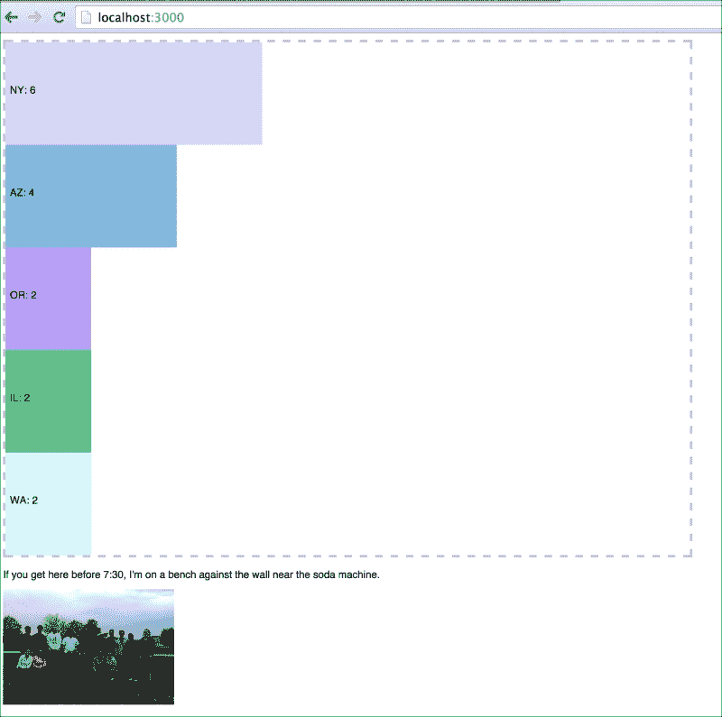
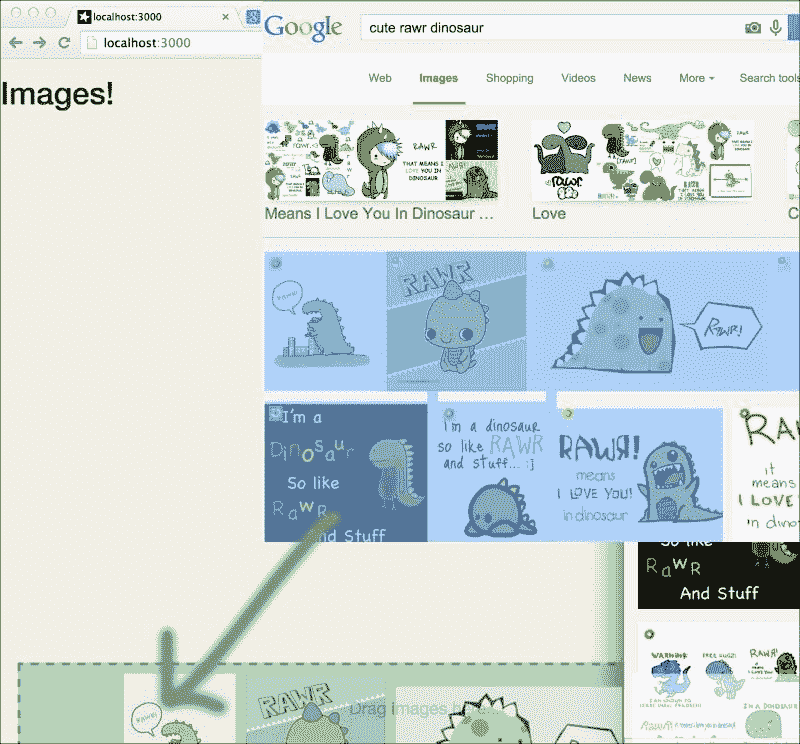
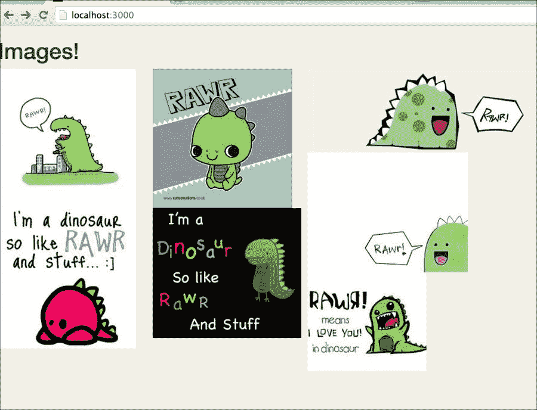
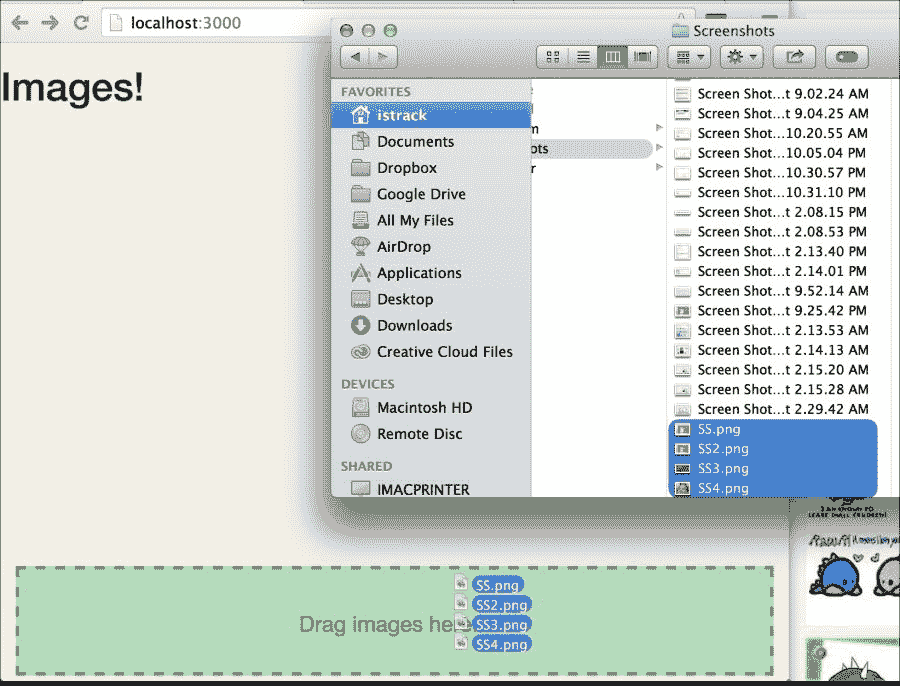
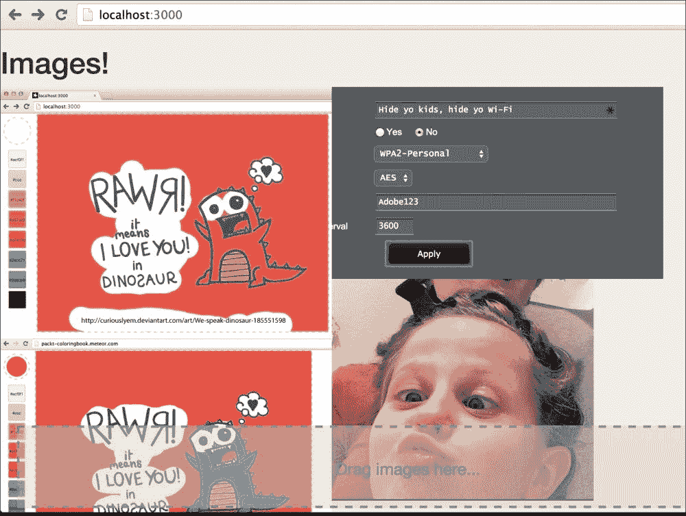
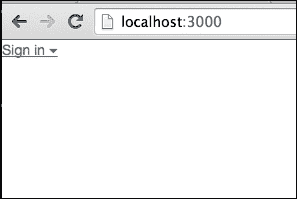
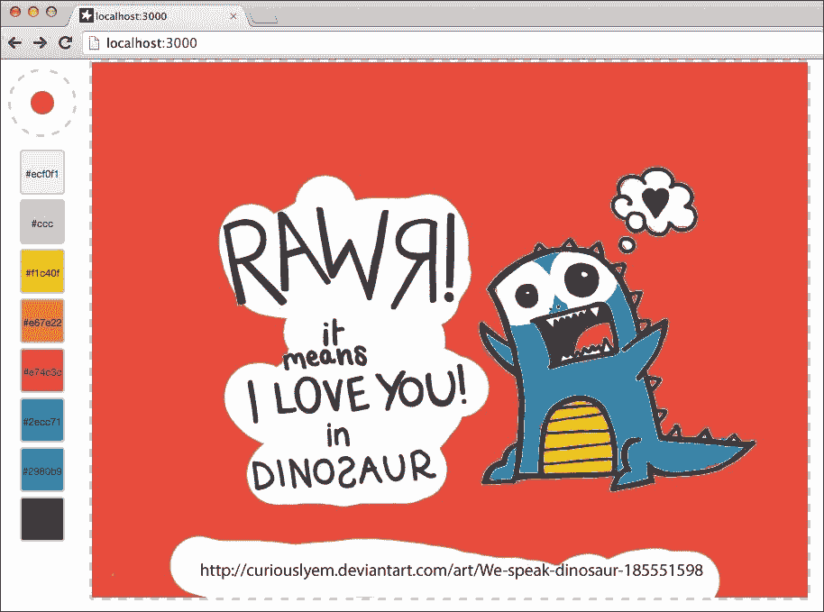

# 第七章. 使用客户端方法

在本章中，你将学习以下主题：

+   使用 SVG 和 Ajax 创建动态图表

+   使用 HTML FileReader 上传图片

+   使用 Canvas 元素创建彩色书

# 简介

自从 HTML 诞生以来，客户端的 Web 编程已经取得了长足的进步。直到最近，为了做一些简单的事情，比如构建图表、读取文件和在屏幕上绘制，还需要编写/使用第三方**polyfill**库。但那个我们所有人都知道且不喜欢的小男孩已经长大了！随着强大的、易于使用的脚本和图形 API 以及对象现在几乎在所有浏览器中都得到了支持，Web 编程终于可以独立使用了。本章中的食谱将介绍一些最受欢迎的 Web API 对象，并展示如何在 Meteor 中实现它们。

# 使用 SVG 和 Ajax 创建动态图表

虽然现在有很多图表库（所有这些你都可以在 Meteor 中使用，顺便提一下！）但了解如何在 HTML 页面内部实现基本形状，使用**SVG** **模板**，是很有好处的。有时实现一个完整的图表库可能有些过度，而掌握 SVG 的相关知识可以非常有用。然而，这是一个 Meteor 食谱；我们不仅想看到一个 SVG 的例子，还想看到它在实际中的应用！这个食谱将教你如何将实时数据源流式传输到 MongoDB 集合中，然后使用 SVG 标签图形化地表示这个动态集合。

## 准备工作

我们将使用默认项目安装，包含`client`、`server`和`both`文件夹，以保持代码的整洁和可读性。在终端窗口中，导航到你希望项目所在的位置，并执行以下命令：

```js
$ meteor create svggraph
$ cd svggraph
$ rm svggraph.*
$ mkdir client
$ mkdir server
$ mkdir both

```

我们还想要使用一些包，并移除`autopublish`包，所以现在就来做这件事。在终端窗口中运行以下命令：

```js
$ meteor remove autopublish
$ meteor add http
$ meteor add meteorhacks:aggregate
$ meteor add rzymek:randomcolor
$ meteor

```

我们现在可以开始创建我们的 SVG 流数据图表了。

## 如何做到这一点...

我们的项目将读取来自[`www.meetup.com/`](http://www.meetup.com/)的评论流，该流是免费提供的，并且非常容易使用。我们将记录流中的评论，并显示按州的总评论数。我们需要创建一个界面，该界面将显示州的总数作为垂直条形图，并显示最后一条评论以及它来自的 Meetup Group 的图片。

### 注意

**注意**

我们仅为了演示目的使用数据流收集代码！它没有内置冗余检查或加固。我们强烈建议不要将此代码直接用于任何类似生产的应用程序。

按以下步骤使用 SVG 和 Ajax 创建动态图表：

1.  我们首先将创建一个具有`id`为`stateBars`的 SVG 元素。然后，我们将为每个单独的状态创建一个`<rect>`元素，并使用`stateStat`模板调整高度。在`[project root]/client/`文件夹中，创建一个`client.html`文件，添加以下 HTML 代码，并保存文件：

    ```js
    <body>
      {{> cPic}}
    </body>

    <template name="cPic">
      <svg id="stateBars" width="800" height="600">
        {{#each stateStats}}
        {{> stateStat}}
        {{/each}}
      </svg>
      <div id="cComment">{{curComment}}</div>
      
    </template>

    <template name="stateStat">
      <rect width="{{width}}" height="{{stackHeight}}" y="{{stackPosition}}"
            style="fill:{{color}};fill-opacity:0.8;" />
      <text x="5" y="{{textYPos}}" fill="black">{{state}}: {{total}}</text>
    </template>
    ```

1.  我们希望在页面上提供一些基本的样式，所以让我们先把这件事处理掉。在`[project root]/client`文件夹中，创建一个`style.css`文件，并添加以下样式声明：

    ```js
    body {
      font-family: 'Helvetica-Neue', sans-serif;
      font-size: 12px;
    }
    #stateBars {
      border:dashed 3px #ccc;
    }
    #cComment {
      margin-top: 10px;
    }
    #cPic {
      width: 200px;
      margin-top: 10px;
    }
    ```

1.  接下来，让我们设置`Comments`和`CountryTotals`集合。为了在逻辑上保持事情更清晰，在客户端我们将使用一些服务器端逻辑来聚合传入的评论。我们首先需要声明我们的集合，以便在客户端和服务器端使用。在`[project root]/both/`文件夹中，创建一个名为`model.js`的新文件，并将以下两个声明添加到该文件中：

    ```js
    Comments = new Mongo.Collection('comments');
    CountryTotals = new Mongo.Collection('countryTotals');
    ```

1.  接下来，让我们设置对`commentsStream`数据的监控，并添加代码来统计总数。由于我们移除了`autopublish`包，我们需要声明我们的`Comments`发布，同时，我们希望在每次有新的评论到来时更新某个状态的总数。我们可以通过使用`Meteor.publish()`函数和`cursor.observeChanges()`方法来实现这一点。在你的`[project root]/server/`文件夹中，创建一个名为`svggraph-server.js`的新文件，并添加以下方法：

    ```js
    Meteor.publish("commentsStream", function(country){
      var cursor = Comments.find({country:country});
      var initializing = true;
      cursor.observeChanges({
        added:function(id,doc){
          if (initializing) return;
          var cTots = Meteor.call('totalsByCountry', doc.country);
          var sTots = Meteor.call('totalsByState',doc.country);
          var existingTots = CountryTotals.findOne({country:doc.country});

          if (!sTots || !cTots) return;
          sTots = _.map(sTots,function(s,i,d){
            s._id.total = s.total;
            if (existingTots){
              var existingState = _.findWhere(existingTots.states,{state:s._id.state});
              if (existingState) s._id.color = existingState.color || randomColor({luminosity: 'light', hue: 'blue'});
              else s._id.color = randomColor({luminosity: 'light', hue: 'blue'});
            }
            return s._id;
          });
          var cObj = {country:doc.country, total:cTots[0].total, states: sTots};
          CountryTotals.upsert({country:cObj.country},cObj);
        }
      });
      initializing = false;

      return cursor;
    });
    ```

1.  我们还需要通过国家声明我们的状态总数`Meteor.publish()`方法，因此让我们也这样做。将以下内容追加到`svggraph-server.js`文件的末尾：

    ```js
    Meteor.publish("graphData", function(country){
      return CountryTotals.find({country:country});
    });
    ```

1.  我们需要跟踪我们正在监控的国家，以及 Meetup Group 的最后一条评论和图片。最直接的方法是通过`Session`变量来实现，因此让我们在`[project root]/client/`文件夹中创建一个名为`svggraph-client.js`的文件，并在顶部添加以下三个变量：

    ```js
    Session.setDefault("country", "us");
    Session.setDefault("msgComment","No comments yet");
    Session.setDefault("msgPic", "https://d14jjfgstdxsoz.cloudfront.net/meteor-logo.png");
    ```

1.  现在我们已经指定了我们将要监控的国家，我们可以添加我们的`Meteor.subscribe`语句，这两个语句都接受国家作为参数。在`svggraph-client.js`文件中，在`Tracker.autorun`块内添加以下语句：

    ```js
    Tracker.autorun(function(){
      Meteor.subscribe("graphData", Session.get('country'));
      Meteor.subscribe("commentsStream", Session.get('country'));
    });
    ```

1.  我们将在稍后连接数据，但仍然需要添加基于前面步骤中声明的`Session`变量的`Template.helpers`方法来显示最新的图片和评论。在`svggraph-client.js`文件中，在`Tracker.autorun`块下方添加以下代码：

    ```js
    Template.cPic.helpers({
      curPic: function () {
        return Session.get('msgPic');
      },
      curComment: function() {
        return Session.get('msgComment');
      }
    });
    ```

1.  针对客户端即将到来的数据，我们需要一些`helper`方法，用于发送数据和在我们的 Mongo DB 集合上执行*聚合查询*。我们还想有一个快速重置我们集合的方法，因为收集到的数据量对于示例应用来说可能会变得杂乱无章。因此，我们将创建以下服务器端方法：

    +   `addMsg`：这个方法用于将消息插入到我们的`Comments`集合中。

    +   `totalsByState`：这个用于按状态汇总 `Comments` 的总数。

    +   `totalsByCountry`：这个用于按国家汇总总数。

    +   `resetDB`：这个用于重置 `Comments` 和 `CountryTotals` 集合。

    打开 `svggraph-server.js` 并添加以下代码：

    ```js
    Meteor.methods({
      addMsg : function (msg) {
        var upMsg = {};
        try {
        upMsg.country = msg.group.country;
        upMsg.state = msg.group.state;
        upMsg.category = msg.group.category.name;
        upMsg.thumb = (msg.group.group_photo ? msg.group.group_photo.thumb_link: "");
        upMsg.createdAt = Date.now();
        }
        catch(e){
          console.log(e.message);
          return null;
        }
        Comments.insert(upMsg);
      },
      totalsByState: function (country){
        return Comments.aggregate([ {$match:{country:country}}, {$group:{_id:{state:"$state"},total:{$sum:1}}}, {$sort:{"total":-1}} ]);
      },
      totalsByCountry: function(country){
        return Comments.aggregate([ {$match:{country:country}}, {$group:{_id:{},total:{$sum:1}}} ]);
      },
      resetDB: function(){
        Comments.remove({});
        CountryTotals.remove({});
        console.log('Collections have been reset');
      }
    });
    ```

1.  在服务器端辅助逻辑全部就绪后，是时候读取和解析数据流了。在 `svggraph-client.js` 文件中，添加以下 `connect`、`disconnect`、`onopen`、`onclose` 和 `onmessage` WebSocket 函数：

    ```js
    function MeetupsStream() {
      var ms = {};
      var ws;
      var sURL = "ws://stream.meetup.com/2/event_comments";
      ms.connect = function (url) {
        sURL = url || sURL;
        ws = new WebSocket(sURL);
        ws.onopen = ms.onopen;
        ws.onmessage = ms.onmessage;
        ws.onclose = ms.onclose;
        return ms;
      };
      ms.disconnect = function () {
        ws && ws.close();
      };
      ms.onopen = function () {
        console.log("Meetup stream started...");
      };
      ms.onmessage = function (e) {
        var rec_msg = EJSON.parse(e.data);
        if (rec_msg.group.group_photo)
          Session.set('msgPic', rec_msg.group.group_photo.photo_link);
        Session.set('msgComment', rec_msg.comment);
        Meteor.call('addMsg', rec_msg);
    //   
      };

      ms.onclose = function () {
        console.log("Meetup stream closed.");
      };

      return ms;
    }
    ```

1.  数据流已经准备就绪，接下来只需添加我们的显示逻辑，并切换开关。在 `svggraph-client.js` 文件中，定位到 `Template.cPic.helpers` 代码块，并在 `curComment` 事件下方添加以下辅助函数（别忘了逗号！）：

    ```js
    curComment: function() {
        return Session.get('msgComment');
      },
     stateStats: function () {
     var ct = CountryTotals.findOne({country:Session.get('country')});
     if (!ct) return [];
     var stateTotals = ct.states;
     var ctotal = ct.total;
     var SVGWidth = 800;
     var SVGHeight = 600;
     return _.map(stateTotals, function(s,i,l){
     var retObj = {};
     retObj.state = s.state;
     retObj.index = i;
     retObj.total = s.total;
     retObj.width = ~~(SVGWidth * (s.total/ctotal));
     retObj.stackHeight = ~~(SVGHeight/l.length);
     retObj.stackPosition = i*retObj.stackHeight;
     retObj.color = s.color;
     return retObj;
     });
     }
    });
    ```

1.  我们需要一些样式辅助器来正确定位我们的文本数据，并让我们知道最新评论添加的位置（以使事物更加精美！）。将以下 `Template.helpers` 代码块追加到 `svggraph-client.js` 文件的底部：

    ```js
    Template.stateStat.helpers({
      textYPos: function () {
        return this.stackPosition + ~~(this.stackHeight/2);

      },
      textXPos : function(){
        return this.width - ~~(this.width*.2);
      },
      color : function(){
        if (Session.equals('lastState',this.state)) return '#2ecc71';
        return this.color;
      }
    });
    ```

1.  使用 `Template.rendered` 方法块，我们将数据流打开，并在每次发布新评论时更新我们的 `lastState` 会话变量，使用简单的 `autorun` 方法。在 `svggraph-client.js` 文件的底部输入以下代码：

    ```js
    Template.cPic.rendered = function(){
      MStream = new MeetupsStream();
      MStream.connect();
      this.autorun(function(){
        var last = Comments.findOne( {country:Session.get('country')}, {sort:{createdAt:-1}});
        if (last) Session.set('lastState',last.state);
      });
    }
    ```

1.  保存所有更改，并打开浏览器（如果您还没有的话）到 `http://localhost:3000`。稍等片刻，您应该会看到新的评论正在到来，状态总数正在更新，如下面的截图所示：

1.  让它运行一段时间，以便出现更多州。如果您运行足够长的时间，最终会得到所有 50 个州（也许甚至包括波多黎各！）。如果您想重置您的集合，打开浏览器控制台并输入以下命令：

    ```js
    > Meteor.call('resetDB')

    ```

## 它是如何工作的...

如同食谱介绍中提到的，图形化动态数据有两个关键点。第一个与渲染 SVG 对象有关，主要可以在 HTML 模板代码中找到，位于 `[项目根]/clie` `nt/client.html` 文件中。我们首先使用了 `{{> cPic}}` 模板包含来引用我们的 `cPic` 模板。模板本身声明了我们的 `<svg>` 元素，然后对 `stateStats` 集合运行标准的 `{{#each }}` 控制结构：

```js
<template name="cPic">
 <svg ...>
    {{#each stateStats}}
    {{> stateStat}}
 {{/each}}
 </svg>
  ...
</template>
```

我们直接设置了 `<svg>` 元素的宽度和高度（注意，它们不是 CSS 样式属性，而是实际元素属性），并添加了一个唯一的 `id` 属性用于 CSS 样式，如下面的示例所示：

```js
<svg id="stateBars" width="800" height="600">
```

在 `stateStat` 模板中，我们创建一个 `<rect>` 元素并动态设置几乎所有属性：

+   `width`：这个基于评论数量设置。

+   `height`：这个基于总状态数设置。

+   `y`：这是垂直位置，基于数据集中的位置设置。

+   `fill`：这是颜色值，如果它是最后更新的状态，则设置为绿色。

我们同样设置了文本 SVG 元素的位置，以确保它与相应的`<rect>`元素对齐：

```js
<template name="stateStat">
  <rect width="{{width}}" height="{{stackHeight}}" y="{{stackPosition}}"
        style="fill:{{color}};fill-opacity:0.8;" />
  <text x="5" y="{{textYPos}}" fill="black">{{state}}: {{total}}</text>
</template>
```

重要的是要理解 SVG 元素不是相对于同一`<svg>`块内的其他元素定位的。这就是为什么我们必须设置每个元素的位置。此外，一些属性（例如`width`和`height`）可以直接设置。SVG 元素实际上是真正的 DOM 元素和图形元素的混合体。

### 小贴士

对于 SVG 的精彩介绍，你可以阅读 MDN SVG 教程，位于[`developer.mozilla.org/en-US/docs/Web/SVG/Tutorial`](https://developer.mozilla.org/en-US/docs/Web/SVG/Tutorial)。

第二个关键部分围绕着`WebSocket` HTML5 Web API 对象的使用，该对象位于`svggraph-client.js`文件的`MeetupsStream`函数中。在这个函数中，我们通过设置`.ondisconnect`、`.onopen`和`.onmessage`处理程序来准备一个相当标准的 Ajax（实际上是`WebSocket`）调用：

```js
function MeetupsStream() {
  ms.onopen = ...
  ms.onmessage = ...
  ms.onclose = ...
}
```

我们最感兴趣的是`.onmessage`处理器，其中我们将数据（以字符串形式传入）解析为`EJSON`对象：

```js
var rec_msg = EJSON.parse(e.data);
```

然后（条件性地）设置`msgPic`变量，这立即改变了`cPic`模板中显示的图像。我们同样更新`msgComment`来更改显示的评论：

```js
if (rec_msg.group.group_photo)
      Session.set('msgPic', ...);
    Session.set('msgComment', rec_msg.comment);
```

最后，我们在服务器端的`'addMsg'`方法上创建了一个`Meteor.call`方法，这使我们的状态总数更新开始运转：

```js
Meteor.call('addMsg', rec_msg);
```

### 小贴士

`WebSocket`对象也有一个很好的 MDN 教程，位于[`developer.mozilla.org/en-US/docs/WebSockets`](https://developer.mozilla.org/en-US/docs/WebSockets)。

在我们使用的代码中还可以找到一些其他零散的内容，例如`meteorhacks:aggregate`包，它允许我们通过`.aggregate`方法在 MongoDB 集合上进行求和和分组（官方支持即将推出！）但这个菜谱旨在关注 SVG 和 Ajax（`WebSocket`）方面。

## 参见

+   在第三章的*创建动态列表*菜谱中，*构建出色的用户界面*

+   在第十一章的*处理异步事件*菜谱中，*利用高级功能*

# 使用 HTML FileReader 上传图像

通过网络应用添加文件现在是一个相当标准的功能。但这并不意味着它容易通过编程来实现。新浏览器支持 Web API 来简化我们的工作，并且存在许多高质量的库/包来帮助我们导航文件读取/上传的森林，但作为我们这样的编码伐木工，我们喜欢知道如何自己动手！在这个菜谱中，你将学习如何读取和上传图像文件到 Meteor 服务器。

## 准备工作

我们将使用默认的项目安装，包括 `client`、`server` 和 `both` 文件夹，以及用于存储图像的特殊文件夹。在终端窗口中，导航到你希望项目存放的位置，并执行以下命令：

```js
$ meteor create imageupload
$ cd imageupload
$ rm imageupload.*
$ mkdir client
$ mkdir server
$ mkdir both
$ mkdir .images

```

注意 `.images` 文件夹中的点。这非常重要，因为我们不希望每次向服务器添加图像时，Meteor 应用程序都会自动刷新！通过将图像文件夹命名为 `.images`，我们将其隐藏在 Meteor 内置的类似索伦之眼的监控系统之下，因为以点开头的文件夹对 Linux 或 Unix 来说是“不可见”的。

让我们也注意一下我们需要的额外大气层（Atmosphere）包。在同一个终端窗口中，执行以下命令：

```js
$ meteor add twbs:bootstrap
$ meteor add voodoohop:masonrify

```

我们现在可以开始构建我们的图像上传应用程序了。

## 如何操作...

我们想显示我们上传的图像，因此我们将使用布局包（`voodoohop:masonrify`）进行显示。我们还将通过拖放来启动上传，以减少 UI 组件。最后，我们将依赖一个 npm 模块来使文件上传变得更容易。让我们将其分解为几个步骤，从用户界面开始。

1.  在 `[项目根目录]/client` 文件夹中，创建一个名为 `imageupload.html` 的文件，并添加以下模板和 `template` 包含：

    ```js
    <body>
      <h1>Images!</h1>
      {{> display}}
      {{> dropzone}}
    </body>

    <template name="display">
      {{#masonryContainer
        columnWidth=50
        transitionDuration="0.2s"
        id="MasonryContainer"
      }}
      {{#each imgs}}
      {{> img}}
      {{/each}}
      {{/masonryContainer}}
    </template>

    <template name="dropzone">
      <div id="dropzone" class="{{dropcloth}}">Drag images here...</div>
    </template>

    <template name="img">
      {{#masonryElement "MasonryContainer"}}
      
      {{/masonryElement}}
    </template>
    ```

1.  我们只想添加一点点的样式，包括为我们的拖放区域添加一个“激活”状态，这样我们就能知道何时可以安全地将文件拖放到页面上。在你的 `[项目根目录]/client/` 文件夹中，创建一个新的 `style.css` 文件，并输入以下 CSS 样式指令：

    ```js
    body {
      background-color: #f5f0e5;
      font-size: 2rem;

    }

    div#dropzone {
      position: fixed;
      bottom:5px;
      left:2%;
      width:96%;
      height:100px;
      margin: auto auto;
      line-height: 100px;
      text-align: center;
      border: 3px dashed #7f898d;
      color: #7f8c8d;
      background-color: rgba(210,200,200,0.5);
    }

    div#dropzone.active {
      border-color: #27ae60;
      color: #27ae60;
      background-color: rgba(39, 174, 96,0.3);
    }

    img.display-image {
      max-width: 400px;
    }
    ```

1.  现在我们想创建一个 `Images` 集合来存储上传的图像文件的引用。为此，我们将依赖 **EJSON**。EJSON 是 Meteor 对 JSON 的扩展版本，它允许我们快速将二进制文件从客户端传输到服务器。在你的 `[项目根目录]/both/` 文件夹中，创建一个名为 `imgFile.js` 的文件，并添加以下 MongoDB 集合的代码行：

    ```js
    Images = new Mongo.Collection('images');
    ```

1.  现在我们将创建 `imgFile` 对象，并声明一个用于客户端和服务器上的 `imgFile` EJSON 类型。在先前的 `Images` 声明之后，输入以下代码：

    ```js
    imgFile = function (d) {
      d = d || {};
      this.name = d.name;
      this.type = d.type;
      this.source = d.source;
      this.size = d.size;
    };
    ```

1.  为了正确初始化 `imgFile` 作为 EJSON 类型，我们需要实现 `fromJSONValue()`、`prototype()` 和 `toJSONValue()` 方法。然后我们将使用 `EJSON.addType()` 方法将 `imgFile` 声明为 EJSON 类型。在 `imgFile` 函数声明下方添加以下代码：

    ```js
    imgFile.fromJSONValue = function (d) {
      return new imgFile({
        name: d.name,
        type: d.type,
        source: EJSON.fromJSONValue(d.source),
        size: d.size
      });
    };

    imgFile.prototype = {
      constructor: imgFile,

      typeName: function () {
        return 'imgFile'
      },
      equals: function (comp) {
        return (this.name == comp.name &&
          this.size == comp.size);
      },
      clone: function () {
        return new imgFile({
          name: this.name,
          type: this.type,
          source: this.source,
          size: this.size
        });
      },
      toJSONValue: function () {
        return {
          name: this.name,
          type: this.type,
          source: EJSON.toJSONValue(this.source),
          size: this.size
        };
      }
    };

    EJSON.addType('imgFile', imgFile.fromJSONValue);
    ```

    ### 备注

    本食谱中使用的 EJSON 代码深受克里斯·马瑟（Chris Mather）的事件驱动思维文件上传教程的启发。我们建议查看他的网站，并了解更多关于文件上传的信息。[`www.eventedmind.com`](https://www.eventedmind.com)。

1.  尽管通常将客户端特定和服务器特定代码放在单独的文件中会更干净，但由于代码与刚刚输入的 `imgFile` 代码相关，我们将把它们都放在同一个文件中。在上一步中 `EJSON.addType()` 函数调用下方，添加以下 `Meteor.isClient` 和 `Meteor.isServer` 代码：

    ```js
    if (Meteor.isClient){
      _.extend(imgFile.prototype, {
        read: function (f, callback) {

          var fReader = new FileReader;
          var self = this;
          callback = callback || function () {};

          fReader.onload = function() {
            self.source = new Uint8Array(fReader.result);
            callback(null,self);
          };

          fReader.onerror = function() {
            callback(fReader.error);
          };

          fReader.readAsArrayBuffer(f);
        }
      });

      _.extend (imgFile, {
        read: function (f, callback){
          return new imgFile(f).read(f,callback);
        }
      });
    };

    if (Meteor.isServer){
      var fs = Npm.require('fs');
      var path = Npm.require('path');
      _.extend(imgFile.prototype, {
        save: function(dirPath, options){
          var fPath = path.join(process.env.PWD,dirPath,this.name);
          var imgBuffer = new Buffer(this.source);
          fs.writeFileSync(fPath, imgBuffer, options);
        }
      });
    };
    ```

1.  接下来，我们将添加一些 `Images` 集合的 `insert` 辅助工具。我们将提供添加图像引用（URI）或上传文件到服务器上的 `.images` 文件夹的能力。为此，我们需要一些 `Meteor.methods`。在 `[project root]/server/` 文件夹中，创建一个 `imageupload-server.js` 文件，并输入以下代码：

    ```js
    Meteor.methods({
      addURL : function(uri){
        Images.insert({src:uri});
      },
      uploadIMG : function(iFile){
        iFile.save('.images',{});
        Images.insert({src:'images/' +iFile.name});
      }
    });
    ```

1.  我们现在需要建立从 `.images` 文件夹处理/提供图像的代码。我们需要绕过 Meteor 的正常资产服务能力，以处理在（隐藏的）`.images` 文件夹中找到的内容。为此，我们将使用 `fs` npm 模块，并将任何访问 `Images/` 文件夹地址的内容请求重定向到服务器上找到的实际 `.images` 文件夹。在上一步中输入的 `Meteor.methods` 块之后，添加以下 `WebApp.connectHandlers.use()` 函数代码：

    ```js
    var fs = Npm.require('fs');
    WebApp.connectHandlers.use(function(req, res, next) {
      var re = /^\/images\/(.*)$/.exec(req.url);
      if (re !== null) {
        var filePath = process.env.PWD + '/.images/'+ re[1];
        var data = fs.readFileSync(filePath, data);
        res.writeHead(200, {
          'Content-Type': 'image'
        });
        res.write(data);
        res.end();
      } else {
        next();
      }
    });
    ```

1.  我们的图像 `display` 模板完全依赖于 `Images` 集合，因此我们需要在客户端添加适当的反应式 `Template.helpers` 函数。在你的 `[project root]/client/` 文件夹中，创建一个 `imageupload-client.js` 文件，并添加以下代码：

    ```js
    Template.display.helpers({
      imgs: function () {
        return Images.find();
      }
    });
    ```

1.  如果我们添加了不喜欢的图片并想快速删除它们，最简单的方法是在图片上双击。所以，让我们在这个文件中 `Template.helpers` 方法下方添加执行此操作的代码：

    ```js
    Template.display.events({
      'dblclick .display-image': function (e) {
        Images.remove({
          _id: this._id
        });
      }
    });
    ```

1.  现在是时候添加一些有趣的功能了。我们将添加拖放视觉反馈提示，这样无论何时我们将任何东西拖到我们的拖放区域，拖放区域都会向用户提供视觉反馈。同样，一旦我们离开该区域，或者实际上放下项目，拖放区域应该恢复到正常状态。我们将通过一个 `Session` 变量来实现这一点，该变量在 `div.dropzone` 元素的 CSS 类被更改时修改。在 `imageupload-client.js` 文件的底部，添加以下 `Template.helpers` 和 `Template.events` 代码块：

    ```js
    Template.dropzone.helpers({
      dropcloth: function () {
        return Session.get('dropcloth');
      }
    });

    Template.dropzone.events({
      'dragover #dropzone': function (e) {
        e.preventDefault();
        Session.set('dropcloth', 'active');
      },
      'dragleave #dropzone': function (e) {
        e.preventDefault();
        Session.set('dropcloth');

      }
    });
    ```

1.  最后的任务是评估被拖放到页面拖放区域的内容。如果拖放的是简单的 URI，我们将直接将其添加到 `Images` 集合中。如果是文件，我们将存储它，创建一个指向它的 URI，然后将它附加到 `Images` 集合中。在 `imageupload-client.js` 文件中，在 `Template.dropzone.events` 代码块最后的闭合花括号之前，添加以下事件处理逻辑：

    ```js
      'dragleave #dropzone': function (e) {
        ...
      },
     'drop #dropzone': function (e) {
     e.preventDefault();
     Session.set('dropcloth');

     var files = e.originalEvent.dataTransfer.files;
     var images = 
    $(e.originalEvent.dataTransfer.getData('text/html')).find('img');
     var fragment = _.findWhere(e.originalEvent.dataTransfer.items, {
     type: 'text/html'
     });
     if (files.length) {
     _.each(files, function (e, i, l) {
     imgFile.read(e, function (error, imgfile) {
     Meteor.call('uploadIMG', imgfile, function (e) {
     if (e) {
     console.log(e.message);
     }
     });
     })
     });
     } else if (images.length) {
     _.each(images, function (e, i, l) {
     Meteor.call('addURL', $(e).attr('src'));
     });
     } else if (fragment) {
     fragment.getAsString(function (e) {
     var frags = $(e);
     var img = _.find(frags, function (e) {
     return e.hasAttribute('src');
     });
     if (img) Meteor.call('addURL', img.src);
     });

     }

     }
    });
    ```

1.  保存所有更改并打开浏览器到 `http://localhost:3000`。从任何网站找到一些图片，并将它们拖放到拖放区域。当你拖放图像时，图像将立即出现在你的网页上，如下面的截图所示：

    当你将恐龙图像拖放到拖放区域时，它们将按以下截图所示上传：

    

    同样，拖放实际文件也会迅速上传并显示图像，如下面的截图所示：

    

1.  当文件被拖放时，它们会被上传并保存在 `.images/` 文件夹中：

## 它是如何工作的…

我们刚刚创建的代码有很多组成部分，但我们可以将它精简为四个区域。

首先，我们创建了一个新的 `imgFile` 对象，包括通过 `Object.prototype = {…}` 声明添加的内部函数。这里添加的函数（`typeName`、`equals`、`clone`、`toJSONValue` 和 `fromJSONValue`）主要用于允许 `imgFile` 对象在客户端和服务器上正确地进行 *序列化* 和 *反序列化*。通常情况下，这并不是必需的，因为我们可以直接将数据 `insert` 到 Mongo 集合中，但在这个例子中是必需的，因为我们想在客户端和服务器上分别使用 `FileReader` 和 Node `fs` 包来直接加载和保存图像文件，而不是将它们写入集合。

第二，客户端使用下划线 `_.extend()` 方法创建 `read()` 函数，而服务器端则用于创建 `save()` 函数。`read` 函数接收被拖放的文件，将其读取到 `ArrayBuffer` 中，然后调用包含的 `callback`，将文件上传到服务器。服务器端的 `save` 函数读取 `ArrayBuffer`，并将后续的图像文件写入服务器上的指定位置（在我们的例子中，是 `.images` 文件夹）。

第三，我们创建了一个 `ondropped` 事件处理器，使用 `'drop #dropzone'` 事件。此处理器确定是否实际文件被拖放并放下，或者它只是一个包含 `src` 属性中 URI 链接的 HTML `` 元素。在文件的情况下（由 `files.length` 确定），我们调用 `imgFile.read` 命令，并传递一个带有立即 `Meteor.call('uploadIMG'…)` 方法的回调。在 `` 标签的情况下，我们解析 `src` 属性中的 URI，并使用 `Meteor.call('addURL')` 更新 `Images` 集合。

第四，我们有用于更新 UI 的`helper`函数。这些包括`Template.helpers`函数、`Template.events`函数以及`WebApp.connectedHandlers.use()`函数，用于在每次上传文件时无需更新 UI 的情况下正确地服务上传的图片。记住，Meteor 会在任何文件更改时自动更新 UI。遗憾的是，这包括静态文件，例如图片。为了解决这个问题，我们将我们的图片存储在一个对 Meteor 不可见的文件中（使用`.images`）。为了将流量重定向到那个隐藏文件夹，我们实现了`.use()`方法来监听任何意图访问`'/images/'`文件夹的流量，并相应地重定向。

与任何复杂的配方一样，代码中还有其他部分，但这应该涵盖了文件上传的主要方面（前面章节中提到的四个区域）。

## 更多内容…

下一个逻辑步骤不是简单地复制远程图像文件的 URI，而是下载、保存并服务这些远程图像的本地副本。这也可以使用`FileReader`和 Node `fs`库来完成，可以通过前面章节中提到的现有客户端代码，或者直接在服务器上作为*cron*作业来完成。

### 小贴士

更多关于`FileReader`的信息，请参阅位于[`developer.mozilla.org/en-US/docs/Web/API/FileReader`](https://developer.mozilla.org/en-US/docs/Web/API/FileReader)的 MDN FileReader 文章。

## 相关内容

+   第八章中的*直接使用 npm 包*配方，*集成第三方库*

+   第十一章中的*创建自定义 EJSON 对象*配方，*利用高级功能*

# 使用 Canvas 元素制作彩色书

现在有多种方式可以在网页上显示图形。DOM 元素、SVG、WebGL，以及可能是最用户友好的`Canvas`元素。使用 JavaScript，`Canvas`元素提供了一个灵活的图形区域，你可以随心所欲地绘画、擦除、上色、剪切和粘贴。你可以在这个配方中找到一个很好的`Canvas`元素的应用示例，你将学习如何从头开始构建一个彩色书应用。

## 准备工作

拿出你的蜡笔！好吧，可能不需要（不要在显示器上使用它们！）但我们即将创建的是最好的替代品，所以让我们先处理掉应用结构和包，这样我们就可以开始涂色了！

除了常见的文件夹外，我们还需要一些特殊文件夹来使我们的代码分组更干净、更易于管理。打开一个终端窗口，导航到你想要创建根项目的地方，并执行以下命令：

```js
$ meteor create coloringbook
$ cd coloringbook
$ rm coloringbook.*
$ mkdir -p client/scripts
$ mkdir {both,server,public}
$ meteor

```

## 如何做到这一点…

表面上可能看起来不多，但实际上开发一本涂色书应用有很多工作要做。你必须考虑用户偏好、撤销/重做、选择颜色、擦除等等。我们将一步一步地解决这些问题，随着项目的进行添加包和功能。

1.  首先，我们将添加用户管理包。Meteor 提供了一些非常出色的开箱即用的用户账户管理功能，我们将利用这些功能。在终端窗口中，导航到你的 `[项目根目录]` 文件夹，并输入以下命令添加以下两个 Meteor 库：

    ```js
    $ meteor add accounts-password
    $ meteor add accounts-ui

    ```

1.  我们希望在屏幕上显示这些样式，所以让我们添加必要的 UI 元素并适当地进行样式化。在你的 `[项目根目录]/client/` 文件夹中创建一个名为 `cb-ui.html` 的文件，并添加以下代码：

    ```js
    <body>
      {{> loginButtons}}
    </body>
    ```

    目前你的页面看起来非常简洁，但就像那样，我们已经有账户和账户创建功能了！在浏览器中，导航到 `http://localhost:3000`，你应该会在屏幕左上角看到账户对话框下拉菜单，类似于以下截图：

    

1.  让我们通过添加一个工具栏来完成 UI 的视觉方面，在这个工具栏中我们可以看到颜色样本并调整画笔的大小；同时，我们也要添加我们的 `canvas` 元素，以及一个背景 `<div>` 来显示我们想要着色的图片。在同一个 `cb-ui.html` 文件中，在 `body` 元素块中添加以下模板包含：

    ```js
    <body>
      {{> loginButtons}}
      {{> toolbar}}
      <div id="bgpicture"></div>
      {{> picture}}
    </body>
    ```

1.  `picture` 模板实际上是最简单的，所以我们将首先添加该代码。在 `</body>` 标签下方添加以下模板代码：

    ```js
    <template name="picture">
      <canvas id="picture" class="no-copy">Images go here...</canvas>
    </template>
    ```

1.  现在我们添加 `toolbar` 和 `swatch` 模板，这些模板使用 SVG 和 `Masonry.js` 来显示我们的画笔和颜色样本。在上一步骤添加的模板代码下方，添加以下代码：

    ```js
    <template name="toolbar">
      <div class="brush-size" id="brush-size">
        <svg id="brush-preview"
         height="70" width="70"
         style="display:{{eraseMode}}">
          <circle cx="35" cy="35"
          r="{{preview.size}}"
          fill="{{preview.color}}" />
        </svg>
      </div>
      {{#masonryContainer columnWidth=50
        transitionDuration="0.2s"
        id="MasonryContainer" }}

         {{#each swatches}}
          {{> swatch}}
         {{/each}}

      {{/masonryContainer}}
    </template>
    <template name="swatch">
      {{#masonryElement "MasonryContainer"}}
        <div class="swatch" 
       style="background-color:{{color}};">
    {{color}}</div>
      {{/masonryElement}}
    </template>
    ```

1.  为了让一切看起来都很漂亮，我们需要添加一些 Atmosphere 包，以及一点 CSS 样式。在终端窗口中，导航到你的 `[项目根目录]` 文件夹，并运行以下命令：

    ```js
    $ meteor add twbs:bootstrap
    $ meteor add voodoohop:masonrify

    ```

1.  接下来，在 `[项目根目录]/client/` 文件夹中创建一个名为 `cb-style.css` 的文件，并添加以下样式声明：

    ```js
    #picture {
      color: #ccc;
      border: 3px dashed #ccc;
      width:800px;
      height:600px;
      border-radius: 4px;
      line-height: 3em;
      text-align: center;
      left: 100px;
      position: absolute;

    }

    #bgpicture {
      pointer-events:none;
      touch-events:none;
      position:absolute;
      background: url('Rawr.GIF');
      top:0px;
      left:100px;
      width: 800px;
      height:600px;
      z-index: 999;

    }
    .no-copy {
      -webkit-user-select: none;
    }
    #login-buttons {
      position : absolute;
      min-width: 220px;
      right: 20px;
      top: 10px;
    }
    .login-link-text {
      position:absolute;
      right: 0px;
    }
    .swatch {
      height:50px;
      width:50px;
      border-radius: 4px;
      border: solid #ccc 2px;
      line-height: 50px;
      font-size:0.8em;
      text-align: center;
      margin-bottom: 5px;
    }
    .masonry_container {
      position:absolute;
      top:100px;
      left:23px;
      width: 50px;
    }
    .brush-size {
      position:absolute;
      left:10px;
      top:10px;
      border: dashed 3px #ccc;
      border-radius: 40px;
      width:76px;
      height:76px;
    }
    ```

1.  注意到 `bgpicture` 元素中有一个背景图片，名为 `'RAWR.GIF'`——你可以从本菜谱的源文件中获取这张图片，或者你可以添加自己的图片进行着色。图片 *必须* 有透明背景，如果它是 `800x600` 像素，看起来会更好，但无论如何，你想要显示的图片应该放入 `[项目根目录]/public/` 文件夹中，并且你应该在上一步中更改 `background` 属性，以便它在屏幕上正确显示。

1.  我们需要能够更改画笔大小、更改颜色，并在画布上绘画/擦除，并且我们希望在无论什么设备上都能做到这一点，因此我们将使用官方的`Hammer.js`包。我们还希望包括全局快捷键来撤销（*control* + *Z*）和重做（*shift* + *control* + *Z*），因此我们将添加一个方便的库来实现这一点！在终端窗口中，在你的`[项目根]`文件夹中，输入以下两个命令：

    ```js
    $ meteor add hammer:hammer@=2.0.4_1
    $ meteor add gwendall:body-events

    ```

1.  在`Template.events`块中使用`Hammer.js`事件更干净、更易于使用，因此我们希望为`Hammer.js`文件添加 jQuery 插件。由于 Meteor 依赖于 jQuery 事件处理器，如果插件添加到 jQuery 中，它也会添加到 Meteor 中！截至本文撰写时，添加插件最可靠的方法是将`plugin`脚本文件手动复制到你的`[项目根]/client/scripts/`文件夹中。你可以通过访问[`hammerjs.github.io/jquery-plugin/`](http://hammerjs.github.io/jquery-plugin/)并遵循那里的说明来获取脚本，或者在你的`scripts`文件夹中创建一个名为`jquery.hammer.js`的文件，并添加以下代码：

    ```js
    (function(factory) {
      if (typeof define === 'function' && define.amd) {
        define(['jquery', 'hammerjs'], factory);
      } else if (typeof exports === 'object') {
        factory(require('jquery'), require('hammerjs'));
      } else {
        factory(jQuery, Hammer);
      }
    }(function($, Hammer) {
      function hammerify(el, options) {
        var $el = $(el);
        if(!$el.data("hammer")) {
          $el.data("hammer", new Hammer($el[0], options));
        }
      }

      $.fn.hammer = function(options) {
        return this.each(function() {
          hammerify(this, options);
        });
      };

      // extend the emit method to also trigger jQuery events
      Hammer.Manager.prototype.emit = (function(originalEmit) {
        return function(type, data) {
          originalEmit.call(this, type, data);
          $(this.element).trigger({
            type: type,
            gesture: data
          });
        };
      })(Hammer.Manager.prototype.emit);
    }));
    ```

1.  现在，我们将添加`Activities`、`Prefs`和`Swatches`集合。如前所述，我们需要通过记录活动来跟踪我们的撤销/重做。我们还需要跟踪颜色样本、用户对画笔大小的偏好等。为此，我们将声明三个 MongoDB 集合。在你的`[项目根]/both/`文件夹中，创建一个名为`cb-model.js`的文件，并添加以下代码：

    ```js
    Swatches = new Mongo.Collection('swatches');
    Prefs = new Mongo.Collection('prefs');
    Activities = new Mongo.Collection('activities');
    ```

    我们稍后将在客户端和服务器端使用这些，但现在我们已经完成了所有工作。你可以关闭`cb-model.js`文件，继续下一步。

1.  让我们添加偏好设置和撤销/重做历史记录的服务器端逻辑。尽管这听起来可能令人难以置信，但与客户端代码相比，彩色书的服务器端代码非常轻量。因此，我们将把它放在一边。我们需要在服务器上做一些事情：

    +   初始化样本和其他偏好设置

    +   如果需要，允许添加新的样本

    +   跟踪和回忆我们的绘画活动（撤销/重做）

    +   清除一切，以便从头开始

    在你的`[项目根]/server/`文件夹中，创建一个名为`cb-server.js`的文件，并添加以下`Meteor.methods`声明：

    ```js
    Meteor.methods({

      initSwatches : function(userId){
        // no user = nothing to do. return.
        if (!userId) return;
        // if we already have swatches, return.
        if (Swatches.findOne({user:userId})) return;
        // add initial swatches
        Swatches.insert({color: '#ecf0f1', user:userId});
        Swatches.insert({color: '#ccc', user:userId});
        Swatches.insert({color: '#f1c40f', user:userId});
        Swatches.insert({color: '#e67e22', user:userId});
        Swatches.insert({color: '#e74c3c', user:userId});
        Swatches.insert({color: '#2ecc71', user:userId});
        Swatches.insert({color: '#2980b9', user:userId});
        Swatches.insert({color: '#000', user:userId});
      },

      addSwatch : function (color){
        // no user = nothing to do. return.
        if (!this.userId) return;
        // if it doesn't already exist, add the swatch
        if (!Swatches.findOne({color:color})){
          Swatches.insert({color:color, user:this.userId});
        }
      },

      clearActivity : function(){
        // no user, return.
        if (!this.userId) return;
        // clear the undo history from Activities collection
        Activities.remove({user:this.userId});
      },

      breakHistory : function(snapShot){
        // if we don't have a valid snapshot,
        // or user isn't logged in, return.
        if (!snapShot||!this.userId) return;
        // remove all snapshots after this one in the undo chain
        Activities.remove({$and: [{createdAt:{$gt:snapShot.createdAt}},{user:this.userId}]})
      }
    });
    ```

1.  现在在同一个文件中添加`Accounts.onLogin()`事件处理器：

    ```js
    Accounts.onLogin(function(login){
      // first, confirm that we have a valid userId
      userId = login.user._id;
      if (!userId) return;
      // if so, and if we don't have preferences, let's initialize
      if (!Prefs.findOne({user:userId})){
        Prefs.insert({user:userId, size:11, color:'#e74c3c'});
      }
      // likewise, let's initialize swatches
      Meteor.call('initSwatches', userId);
    });
    ```

1.  是时候构建允许我们使用`canvas`元素在屏幕上绘制的主体逻辑了。在`[项目根]/client/`文件夹中创建一个名为`cb-client.js`的文件，并添加以下初始默认值，这些值控制我们要绘制的内容以及我们的画笔颜色：

    ```js
    Session.setDefault('drawing', false);
    Session.setDefault('color', '#e74c3c');
    ```

1.  由于它被用于多个地方，我们希望创建一个`drawLine`函数，该函数将根据需要绘制/擦除屏幕的一部分。在`Session.setDefault`声明下方添加以下代码：

    ```js
    // **drawLine** -- helper function to draw / erase lines
    drawLine = function (from, to, color,size) {
      if (size)
        ctx.lineWidth = size;
      if (color)
        ctx.strokeStyle = color;
      if (Session.get('erase')){
        ctx.globalCompositeOperation = 'destination-out';
      } else {
        ctx.globalCompositeOperation = 'source-over';
      }
      ctx.beginPath();
      ctx.moveTo(from.x, from.y);
      ctx.lineTo(to.x, to.y);
      ctx.closePath();
      ctx.stroke();
    }
    ```

1.  现在，添加一些辅助函数，帮助我们清理屏幕，或计算相对于页面的绘画笔迹定位：

    ```js
    // **getPosition** -- helper function to calculate cursor position
    getPosition = function (event) {
      return {
        x: parseInt(event.gesture.center.x - event.currentTarget.offsetLeft),
        y: parseInt(event.gesture.center.y - event.currentTarget.offsetTop)
      };
    }

    // **wipe** -- function to clear the painting area
    wipe = function (emitAlso) {
      ctx.clearRect(0, 0, canvas.attr('width'), canvas.attr('height'));
    }
    ```

    当用户将鼠标/笔/手指从屏幕上抬起时，我们想要记录他们刚刚绘制的图案，因此让我们在我们的辅助函数下方添加一个快照拍摄函数：

    ```js
    // **addSnapshot** -- helper function to save strokes and update // undo history
    addSnapshot = function(){
      var userId = Meteor.userId();

      if (!userId) return;

      //Convert Canvas into a Picture
      ctx.globalCompositeOperation = 'source-over';
      var canvasPic = canvas[0].toDataURL();
      var timestamp = Date.now();

      //  check current history. if we are in undo-land, need to clean // up snapshots
      var curHist = Session.get('history');
      if (curHist){
        var curSnap = Session.get('currentSnapshot');
        Meteor.call('breakHistory',curSnap);
        Session.set('history',0);
      }

      // Save it to our Activities History
      Activities.insert({
        user:userId,
        canvas:canvasPic,
        createdAt:timestamp
      });
    };
    ```

1.  当我们首次登录，或者在我们上下翻滚撤销/重做历史记录链时，我们需要重新绘制屏幕。在`addSnapshot`辅助函数下方添加以下辅助函数：

    ```js
    // **paintActivity** -- helper function to redraw screen on undo/// redo/draw
    paintActivity = function(userId,idx){
      var latestActs = Activities.find({user:userId},
    {sort:{createdAt:-1}}).fetch();
      if (!latestActs.length) {
        return;
      }
      if(!latestActs[idx]) idx = latestActs.length-1;
      wipe();
      var imageObj = new Image();
      imageObj.onload = function () {
        ctx.drawImage(this, 0, 0);
      };
      Session.set('currentSnapshot',latestActs[idx]);
      imageObj.src = latestActs[idx].canvas;
    };
    ```

1.  好的，我们已经准备好进行最后的润色，这包括启用我们的工具栏，并将所有触摸/鼠标事件连接起来以调整画笔大小、更改颜色、绘画和擦除。在您的`[project root]/client/`文件夹中，创建一个名为`tmpl-toolbar.js`的文件，并添加以下交互事件处理器代码：

    ```js
    Template.toolbar.rendered = function(){
      // we first need to turn on hammer.js touch events...
      var brushSize = this.$('#brush-size').hammer();
      // ...we then change the pan threshold from 10 to 2
      var mgr = brushSize.data('hammer');
      mgr.get('pan').set({ threshold: 2 });
    };
    ```

1.  在同一文件中，添加`Template.helpers`函数以显示画笔大小、颜色偏好等：

    ```js
    Template.toolbar.helpers({
      swatches: function () {
        // Return the swatches for this user
        return Swatches.find({ user: Meteor.userId() });
      },
      preview : function(){
        // gets preferences for toolbar, with one modification...
        var prefs = Prefs.findOne({user:Meteor.userId()});
        // ...because brush is a circle, we need radius, not diameter
        if (prefs) prefs.size= ~~(prefs.size/2);
        return prefs;
      },
      eraseMode : function(){
        // if we're in erase mode, the brush circle is hidden
        return (Session.get('erase')? 'none':null);
      }
    });
    ```

1.  让我们再添加交互逻辑，通过`Template.events`辅助块：

    ```js
    Template.toolbar.events({
      'panstart #brush-size' : function(ev){
        // record our offset position, and turn on resizing
        Session.set('brushFrom',ev.gesture.center.x);
        Session.set('brushResize',true);
      },
      'pan  #brush-size': function(ev){
        // if we're not resizing, no need to continue
        if (!Session.equals('brushResize',true)) return;
        // likewise, if there are no prefs, just return
        var prefs = Prefs.findOne({user:Meteor.userId()});
        if (!prefs) return;
        // calculate the delta from last we checked...
        var adjustment = Session.get('brushFrom');
        adjustment = ev.gesture.center.x - adjustment;
        // ...and create a new brush size
        var newbrushSize = prefs.size + adjustment;
        // reset offset position, in case resizing continues
        Session.set('brushFrom', ev.gesture.center.x);
        // new brush size needs to be the 3rd bowl of porridge...
        if (newbrushSize<=70&&newbrushSize>=3){
          // adjust the preferences record and update the collection
          prefs.size = newbrushSize;
          Prefs.update({_id:prefs._id}, prefs);
        }
      },
      'panstop #brush-size': function(ev){
        // job's done. clean up.
        Session.set('brushFrom');
        Session.set('brushResize',false);
      },
      'doubletap #brush-size': function(ev){
        // turn on 'erase' mode
        Session.set('erase',(!Session.get('erase')));
      }
    });
    ```

1.  我们还对`swatch`模板有一些逻辑/事件处理，因此让我们在`[project root]/client/`文件夹中创建一个名为`tmpl-swatch.js`的文件，并添加以下事件监听器和事件交互逻辑：

    ```js
    // suuuuper simple turning on of touch events
    // using hammer.js
    Template.swatch.rendered = function () {
      this.$('.swatch').hammer();
    };

    Template.swatch.events({
      'tap .swatch': function (ev) {
        // if no preference, return;
        var prefs = Prefs.findOne({user:Meteor.userId()});
        if (!prefs) return;
        // change the color to whatever swatch we tapped on
        prefs.color = this.color;
        // update Prefs collection
        Prefs.update({_id:prefs._id},prefs);
      }
    });
    ```

1.  再添加两个文件，我们就完成了！在`picture`模板（我们的`canvas`元素所在的位置）中，我们需要处理相当多的交互，因此让我们在`[project root]/client/`文件夹中创建一个名为`tmpl-picture.js`的文件，并通过`Template.rendered`方法块添加我们的初始化逻辑。将以下代码添加到`tmpl-picture.js`文件中：

    ```js
    Template.picture.rendered = function () {
      // set the canvas we will be drawing on
      canvas = this.$('#picture');
      // set the context for the canvas
      ctx = canvas[0].getContext('2d');
      // need to properly size the canvas
      canvas.attr({
        width: 800, height: 600
        // ...AND set up tap listeners via hammer.js
      }).hammer();
      // we want to change the default threshold from 10 to 2
      canvas.data('hammer').get('pan').set({threshold:2});
      // we now set the line and line cap style
      ctx.lineJoin = ctx.lineCap = 'round';
      // Stops iOS from doing that bouncy, janky thing
      document.ontouchmove = function (event) {
        event.preventDefault();
      };
    ```

1.  在偏好更改或用户登录/注销时，我们必须执行一些响应式逻辑来清理或初始化我们的画布。在`Template.picture.rendered`下方添加两个`autorun`方法块，如下所示：

    ```js
    // Reactive function that reruns whenever
      // preference are updated
      this.autorun(function () {
        // if no prefs exist, return
        var prefs = Prefs.findOne({user:Meteor.userId()});
        if (!prefs) return;
        // set stroke color and width
        ctx.strokeStyle = prefs.color;
        ctx.lineWidth = prefs.size;
      });

      // Reactive function that reruns whenever
      // User logs in, or our undo history position changes
      this.autorun(function(){
        // if we're not logged in (no userId), return
        var userId = Meteor.userId();
        if (!userId){
          wipe();
          return;
        }
        // otherwise, paint the proper screen,
        // using the undo chain history position
        paintActivity(userId,Session.get('history')||0);
      });
    };
    ```

1.  `picture`模板的最后一件事情是将绘图事件本身连接起来。当我们开始绘图时，我们需要`panstart`、`panmove`、`panend`的事件处理器，并且我们还需要一个在页面上`doubletap`时清理一切的处理器。将以下`Template.events`方法块添加到`tmpl-pictur``e.js`文件的底部：

    ```js
    Template.picture.events({
      'panmove #picture': function (ev) {
        // we must be in drawing mode...
        if (Session.equals('drawing', true)
            && Meteor.userId()) {
          // find our cursor position
          to = getPosition(ev);
          // physically draw the stroke
          drawLine(from,to);
          // update our from position
          from = to;
        }
      },
      'panstart #picture': function (ev) {
        // get our from position, when we start drawing
        from = getPosition(ev);
        // tell everyone that we are in drawing mode
        Session.set('drawing', true);
      },
      'panend #picture': function (ev) {
        // drawing mode is over!
        Session.set('drawing', false);
        // we now record the screen, add to undo chain
        addSnapshot();
      },
      'doubletap #picture': function (ev) {
        // clear the screen
        wipe();
        // wipe out our undo history
        Meteor.call('clearActivity');
      }
    });
    ```

1.  现在只剩下`keydown`事件逻辑，这样我们才能有适当的撤销/重做。快速在`[project root]/client/`文件夹中创建一个名为`tmpl-body.js`的文件，并添加以下代码：

    ```js
    Template.body.events({
      'keydown' : function(ev){

        // if there's no undo history, no reason to continue, // so return.
        var histLength = Activities.find({user:Meteor.userId()}).fetch().length;
        if (!histLength) return;

        // If it's not a CTRL+Z or CMD+Z, we don't care, so // return.
        if ((!ev.metaKey && !ev.ctrlKey)||(ev.keyCode!==90)) return;

        // find the current position in the undo chain, if any.
        var curHist = Session.get('history')||0;

        // if it was SHIFT+CMD+Z, it means redo, so decrement // the history
        if (ev.shiftKey)
          curHist--;
        // otherwise, increment the history
        else
          curHist++;

        // if we're past the boundaries of TIME and SPACE we
        // certainly don't care about JavaScript anymore, so let's return.
        if(curHist<0 || curHist> histLength-1 ) return;

        // after all that, set the new undo chain position
        Session.set('history',curHist);
      }
    });
    ```

    呼呼！我们做到了！保存所有更改，并通过浏览器导航到您的项目，通过`http://localhost:3000`。登录/创建账户后，您应该看到一个漂亮的调色板，您选择的图片，以及画笔大小/预览。以下功能可用：

    +   在画笔预览上双击以切换`'eraser'`模式

    +   在画笔预览上点击并左右拖动以调整画笔大小

    +   在页面上双击以擦除并清除您的撤销历史

    +   按*Ctrl* + *Z*或*CMD* + *Z*来撤销您的笔触

    +   按*Shift* + *Ctrl* + *Z*或*Shift* + *CMD* + *Z*来重做您的笔触

    +   使用另一个用户注销并重新登录，以允许多用户使用

    请注意，即使你登出，你的撤销/重做历史链也会被保留。一旦你重新登录，你可以逐笔浏览你的绘画创作。

    如果你是一个特别棒的艺术家，就像我的女儿一样，并且你正确地编写了所有代码，你的页面看起来将类似于以下杰作：

    

## 它是如何工作的…

哇！这代码太多了，只是为了演示`canvas`元素的工作原理，不是吗？我们不必一步一步地通过所有这些，让我们看看与`Canvas`元素相关的重要部分。

在`tmpl-picture.js`内部，我们初始化我们的`canvas`。在`Template.picture.rendered()`辅助块中，我们首先使用`this.$('#picture')`找到我们的`canvas`元素：

```js
canvas = this.$('#picture');
```

我们然后使用名为`getContext()`的非常合适的函数来获取上下文（处理程序）。我们只想得到 2D 表示，而不是 3D，所以我们把`'2d'`作为参数传递给`getContext`：

```js
ctx = canvas[0].getContext('2d');
```

接下来是`cb-client.js`，我们在全局`ctx`变量中传递上下文，有几种用途。在`drawLine`函数中，我们设置大小（`lineWidth`），颜色（`strokeStyle`），并根据我们是擦除（`'destination-out'`）还是铺上一些颜料（`'source-over'`）来设置笔触类型（`globalCompositeOperation`）：

```js
drawLine = function (from, to, color,size) {
  ...
 ctx.lineWidth = size;
  ...
 ctx.strokeStyle = color;
  if (Session.get('erase')){
    ctx.globalCompositeOperation = 'destination-out';
  } else {
    ctx.globalCompositeOperation = 'source-over';
  }
  ...
```

一切设置/确定之后，我们告诉画布我们开始绘制（`beginPath`）；我们移动我们的笔触（`moveTo`，`lineTo`），然后我们清理（`closePath`，`stroke`）：

```js
ctx.beginPath();
ctx.moveTo(from.x, from.y);
ctx.lineTo(to.x, to.y);
ctx.closePath();
ctx.stroke();
```

为了节省数据库空间/事务，我们不记录每一笔。相反，我们等待一笔画完成（`'panend #picture'`事件）并添加整个画布的快照。我们是在`addSnapshot`辅助函数内部这样做，通过调用`canvas.toDataURL()`方法：

```js
var canvasPic = canvas[0].toDataURL();
```

一旦我们将`canvas`图形元素表示为数据，我们只需通过`Activities.insert()`将其保存到`Activities`集合中：

```js
Activities.insert({
  user:userId,
  canvas:canvasPic,
  createdAt:timestamp
});
```

从`Activities`集合检索和显示保存的截图同样简单。`ctx`处理程序为我们处理绘图。我们只需提供数据，就可以让那只猴子跳舞。因此，在`paintActivity`中，我们创建一个新的`Image()`对象，并给那个`imageObj`添加一个`.src`。然后，当`.onLoad`事件回调被触发时，我们调用`ctx.drawImage()`：

```js
var imageObj = new Image();
imageObj.onload = function () {
  ctx.drawImage(this, 0, 0);
};
```

最后，也是最简单的，如果我们想`清除`屏幕，我们只需调用`ctx.clearRect()`并指定我们想要清除的尺寸（在这种情况下，画布的`width`和`height`）：

```js
ctx.clearRect(0, 0, canvas.attr('width'), canvas.attr('height'));
```

在这里，有很多 Meteor 魔法在协同工作，因此我们尽可能少地使用函数式编程，但这种协调在其他菜谱中有详细说明。

## 还有更多…

实际上，还有更多！我们本来可以添加自定义颜色样本（顺便说一句，你可以使用 `Meteor.call('addSwatch','#yourcolorhere')` 从控制台完成此操作），或者启用拖放，以及存储其他图片。如果你想要这样做，可以使用本章中找到的 *使用 HTML FileReader 上传图片* 菜单。

然而，核心功能将保持不变：引用一个 `<canvas>` 对象，获取上下文，然后绘制，宝贝，画吧！

### 小贴士

想要一个关于 HTML canvas 的信息丰富且详尽的教程，请访问：[`www.html5canvastutorials.com/`](http://www.html5canvastutorials.com/)。

## 参见

+   在 第二章 的 *添加 Meteor 包* 菜单，*使用包进行自定义*

+   在 第三章 的 *使用 Spacebars 插入模板* 和 *创建自定义全局辅助函数* 菜单，*构建出色的用户界面*

+   在 第六章 的 *创建和消费反应性值* 菜单，*掌握反应性*

+   本章中的 *使用 HTML FileReader 上传图片* 菜单
