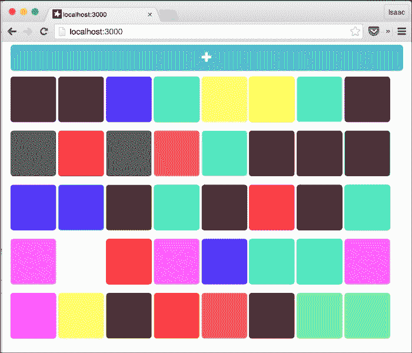
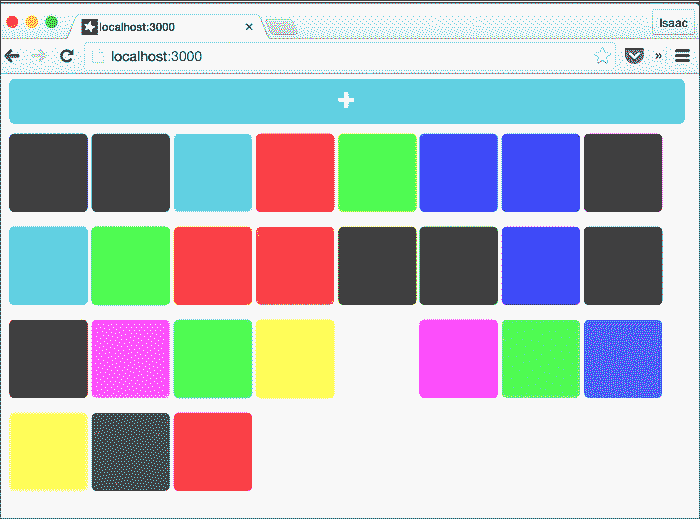
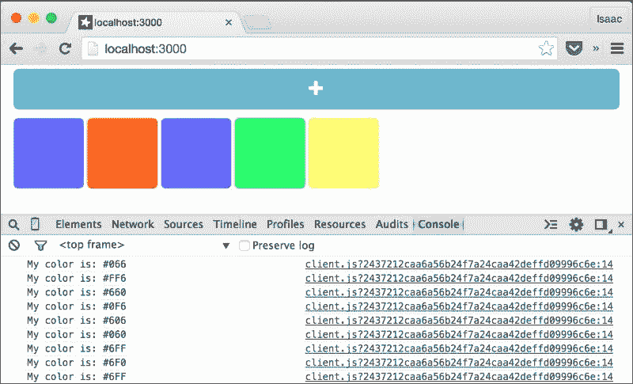
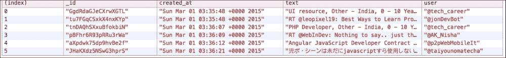

# 第十一章。利用高级功能

在本章中，我们将介绍以下主题：

+   构建自定义服务器方法

+   创建自定义 EJSON 对象

+   处理异步事件

+   使用异步函数

# 简介

Meteor 提供了一些独特的功能，使我们在全栈开发环境中的生活更加轻松。本章将深入探讨这些不太为人所知的功能区域，为你提供更多底层知识，使你的应用程序更加优雅和强大。

# 构建自定义服务器方法

在 Meteor 中，我们与客户端和服务器之间的大部分通信都是通过 DDP 完成的。然而，有时直接调用服务器会非常有用。例如，在测试时，或者作为管理员，你可能需要创建一些“隐藏”的辅助方法来简化调试。在其他情况下，你可能希望提供非常安全或非常简单的服务方法，以减少代码的脆弱性或复杂性。无论如何，服务器方法是开发的基础，本食谱将指导你使用`Meteor.methods()`函数创建和使用服务器端方法。

## 准备工作

要创建服务器方法，我们首先需要一个基本的应用程序。我们将快速创建一个颜色样本应用程序。虽然不是什么特别复杂的应用，但一旦完成，我们就能通过良好的视觉反馈来创建服务器方法。

### 项目设置

你需要安装 Meteor，并创建一个项目。在终端窗口中，通过输入以下命令创建你的根项目：

```js
$ meteor create server-calls
$ cd server-calls
$ rm server-calls.*
$ mkdir {client,server,both}
$ meteor add twbs:bootstrap
$ meteor

```

### 创建一个简单应用

创建一个名为 `[project root]/both/helpers.js` 的文件，并添加以下代码：

```js
Swatches = new Mongo.Collection('swatches');

randomColor = function(){
  var retCol = '#';
  while (retCol.length<4) {
    retCol += Random.choice('06F');
  }
  return retCol;
}
```

接下来，创建一个名为 `[project root]/client/client.js` 的文件，并添加以下代码：

```js
Template.colors.helpers({
  swatches: function(){
    return Swatches.find().fetch();
  }
})

Template.body.events({
  'click #newColor' : function(e){
    Swatches.insert({color:randomColor()});
  }
})
```

通过创建一个名为 `[project root]/client/styles.css` 的文件并添加以下样式声明来创建一些简单的样式：

```js
.swatch{
  display:inline-block;
  height:8rem;
  width:8rem;
  border-radius: 0.5rem;
  margin-top: 1rem;
}

#newColor{
  display:block;
  margin-top: 0.5rem;
}
```

最后，通过创建 `[project root]/client/main.html` 并添加以下模板来创建你的模板：

```js
<body>
  <div class="container">
    <div id="newColor" class="btn btn-info btn-lg">
      <span class="glyphicon glyphicon-plus"></span>
    </div>
    {{> colors}}
  </div>
</body>

<template name="colors">
  {{#each swatches}}
  <div class="swatch" style="background-color:{{color}}"></div>
  {{/each}}
</template>
```

保存所有更改，在浏览器中导航到 `http://localhost:3000`，然后反复点击带有加号按钮以添加随机颜色样本。你应该会看到以下截图类似的内容：



现在你可以准备创建一些辅助服务器方法了。

## 如何操作...

我们将创建两个服务器方法。一个用于清除`Swatches`集合，另一个用于添加唯一的颜色。

1.  首先，让我们构建`clearSwatches()`函数。创建一个名为 `[project root]/server/methods.js` 的文件，并添加以下`Meteor.methods`声明：

    ```js
    Meteor.methods({
      clearSwatches: function(){
        Swatches.remove({});
      }
    });
    ```

    在你的浏览器控制台中，输入以下命令：

    ```js
    > Meteor.call('clearSwatches')

    ```

    所有的颜色样本都应该消失。不要担心，朋友，你总是可以通过点击屏幕上的按钮来创建更多样本。

1.  接下来，让我们创建`addUniqueSwatches()`函数。从上一步打开`methods.js`文件，并在`clearSwatches`声明之后添加以下声明：

    ```js
    clearSwatches: function(){
        Swatches.remove({});
      },
     addUniqueSwatch: function(newColor){
     if (Swatches.findOne({color:newColor})) return null;
     Swatches.insert({color:newColor});
     }

    ```

1.  现在，打开 `[项目根目录]/client/client.js` 文件，并对 `Template.body.events` 声明进行以下修改：

    ```js
    Template.body.events({
      'click #newColor' : function(e){
     Meteor.call('addUniqueSwatch' , randomColor());
      }
    })
    ```

    现在，当你点击按钮添加颜色时，你会发现最终不会添加新的色卡。这是因为独特的颜色总数为 27。如果你一开始没有色卡，你的屏幕最终会看起来类似于以下截图：

    

    无论你点击按钮多少次，都无法添加超过 27 种颜色。

## 它是如何工作的…

我们通过在 `server` 文件夹内创建代码在服务器上创建了两个调用。这些调用被暴露给客户端，因为我们使用 `Meteor.methods()` 函数声明了它们。

我们在 `methods.js` 文件中创建的 `clearSwatches()` 方法是 *隐藏的*，也就是说，除非你知道它的存在，否则没有简单的方法知道它存在。`addUniqueSwatch()` 方法用于我们按钮的 `onclick` 事件中，所以有人可以通过查看我们的客户端代码来发现它。

在这两种情况下，方法不是通过 Ajax/传统服务器调用调用的，而是由 Meteor 自动暴露，并且通过 `Meteor.call()` 方法调用，该方法接受方法名称作为第一个参数，以及任何额外的参数作为方法参数，非常容易调用。

## 还有更多…

如果你将回调函数作为 `Meteor.call()` 的最后一个参数传递，当服务器方法执行完成后，回调函数将被自动调用。你可以使用这个功能在调用完成后执行操作。以下是一个示例。

打开 `[项目根目录]/server/methods.js` 文件，并对 `addUniqueSwatch()` 函数进行以下修改：

```js
addUniqueSwatch: function(newColor){
    if (Swatches.findOne({color:newColor})) return null;
    Swatches.insert({color:newColor});
 return Swatches.find().count();
  }
```

现在，在你的浏览器控制台中，快速重置 `Swatches` 集合：

```js
> Meteor.call('clearSwatches')

```

最后，多次手动调用 `addUniqueSwatch()`：

```js
> Meteor.call('addUniqueSwatch',randomColor(), function(err,data){console.log(data);})

```

每次运行该命令时，控制台将打印出色卡的总数。Meteor 会自动运行你传递的回调函数，将 `addUniqueSwitch()` 方法的结果填充到数据参数中。

## 参见

+   在 第一章 的 *使用网络控制台* 菜谱中，*优化你的工作流程*

+   在 第二章 的 *添加 Meteor 包* 菜谱中，*使用包进行自定义*

# 创建自定义 EJSON 对象

使用 DDP 在客户端和服务器之间传递简单对象非常简单。但你是否知道你可以传递自定义的、命名的对象，包括方法？Meteor 的人扩展了 JSON，允许通过 DDP 传递自定义的完整对象，而不必担心序列化/反序列化。这个菜谱将教你如何创建和使用自定义 EJSON 对象，并在客户端和服务器之间传递这些自定义对象。

## 准备工作

我们将使用本章中找到的先前配方，即*构建自定义服务器方法*，作为基准。请完成该配方，然后进行以下修改。

### 声明 Swatch 对象

创建一个名为`[项目根目录]/both/swatch.js`的新文件，并将以下代码添加到该文件中：

```js
Swatch = function (color){
  this.color = color;
}

Swatch.prototype = {
  constructor: Swatch,

  switch: function(){
    this.color = randomColor();
  },
  toString: function(){
    return "My color is: " + this.color;
  }
}
```

### 修改 Swatches.insert()

为了使用 EJSON 对象，这些对象不是 MongoDB 期望的正常、纯对象，我们在插入时需要将对象分层。在网页控制台中，执行以下行以清除`Swatches`集合：

```js
> Meteor.call('clearSwatches')

```

现在，打开`[项目根目录]/server/methods.js`并修改`Swatches.insert()`方法如下：

```js
addUniqueSwatch: function(newColor){
  ...
 Swatches.insert({swatch:new Swatch(newColor)});
}
```

### 改变色板颜色

在插入时分层将稍微破坏我们的 UI，但没关系，我们可以恢复，因为我们很棒。在`[项目根目录]/client/client.js`文件中的`Template.colors.helpers`部分，并在`swatches`辅助函数下方添加以下辅助函数：

```js
},
color: function(){
 return this.swatch.color;
}

```

最后，让我们添加以下`events`声明，以便我们可以改变色板的颜色：

```js
Template.colors.events({
  'click .swatch' : function(e){
    this.swatch.color = randomColor();
    Swatches.update(this._id,this);
  }
})
```

保存您的更改，并通过点击添加的任何色板在浏览器中测试。每次点击时，相应的色板都应该改变为随机颜色。现在，您已经准备好创建自定义 EJSON 对象了。

## 如何操作...

如前所述，Meteor 会为我们处理序列化和反序列化。我们只需要将我们的对象声明为 EJSON 对象。按照以下步骤创建自定义 EJSON 对象：

1.  让我们添加`typeName`和`toJSONValue`函数。打开`[项目根目录]/both/swatch.js`文件，并在`toString()`函数下方添加以下两个函数到`Swatch.prototype`声明中：

    ```js
    },
    typeName: function(){
     return 'Swatch';
    },
    toJSONValue: function(){
     return {
     color:this.color
     };
    }

    ```

1.  接下来，我们需要使用`EJSON.addType`声明我们的对象。在同一个`swatch.js`文件中，在最底部添加以下函数调用：

    ```js
    EJSON.addType("Swatch", function fromJSONValue(value){
      return new Swatch(value.color);
    });
    ```

1.  我们现在可以使用我们的 EJSON 对象方法了。打开`[项目根目录]/client/client.js`文件，并对`Template.colors.events`进行以下更改：

    ```js
    'click .swatch': function (e) {
     this.swatch.switch();
        Swatches.update(this._id, this);
     console.log(this.swatch.toString());
     }

    ```

    在浏览器中，添加一些新的色板，并使用打开的浏览器控制台窗口点击它们。色板会改变颜色，并在控制台中显示它们的新颜色。您的屏幕应该类似于以下截图：

    

## 它是如何工作的...

当已知的`EJSON`对象被插入到或从 MongoDB 检索时，Meteor 会自动使用`EJSON`库对对象进行序列化和反序列化。

要正确完成这项任务，对象本身至少需要有两个方法。首先，对象必须有一个`typeName`函数，它有助于将对象映射到声明的`EJSON`对象。其次，对象必须有一个`toJSONValue()`函数，这样 Meteor 才能正确地将对象序列化为字符串/标准 JSON 值。如果没有`toJSONValue()`函数，MongoDB 会对对象产生错误，并拒绝插入它。通过 DDP 传输对象同样不可行。

需要进行的另一个操作是声明 `EJSON` 对象，我们在 `swatch.js` 中使用 `EJSON.addType()` 函数完成了这一操作。这个函数接受一个 `fromJSONValue()` 函数作为参数，该函数（正如其名）接收通过线路传递的 JSON 值，并实例化一个适当类型的实际对象。在我们的例子中，这是一个 `Swatch` 对象，唯一需要创建的属性是 `color` 属性，它通过构造函数传入。

一旦声明了前面的方法并调用了 `addType` 函数，Meteor 会为我们处理其余的事情，并将我们的对象巧妙地存储在 MongoDB 中。以下是一个示例，展示了我们序列化的 `Swatch` 对象的原始 JSON：

```js
 {
  "_id" : "tktEzxMGTGNZ8oB4R",
    "swatch" : {
      "EJSON$type" : "Swatch",
        "EJSON$value" : {
          "EJSONcolor" : "#66F"
        }
    }
}
```

## 还有更多...

`EJSON` 对象还有其他辅助函数，您可以在一个对象中声明这些函数，以帮助开发和使用 `EJSON` 对象。

可以在 `EJSON` 对象上实现 `.clone()` 方法，以执行具有逻辑的深度复制。如果你没有声明 `.clone()` 函数，Meteor 将使用 `toJSONValue()` 代替。

`.equals()` 方法接受另一个对象作为参数，并执行你选择的自定义比较。如果你没有声明 `.equals()` 函数，Meteor 将简单地取两个对象，对每个对象执行 `toJSONValue()` 转换，并比较结果。

### 小贴士

通过查看 Meteor 文档了解更多关于 EJSON 库的信息，文档地址为：[`www.meteor.com/ejson`](https://www.meteor.com/ejson)。

## 参见

+   本章中 *构建* *自定义服务器方法* 的配方

# 处理异步事件

Meteor 是一个响应式框架。正如你可能注意到的，它建立在 `Node.js` 之上，但在编写或使用包时，它神奇地避免了你通常在 `Node.js` 中遇到的回调和事件循环的戏剧性。Meteor 允许你以声明式、类似同步的风格进行编码。这个配方将向你展示 Meteor 是如何做到这一点的，以及你如何处理来自第三方包的异步事件。在这种情况下，我们将从 npm 的 `twit` 包中读取 Twitter 流。

## 准备工作

我们需要快速在 Twitter 上设置一个测试应用并加载 npm 的 `twit` 模块，所以我们在这里做，以免分散对配方本身的注意力。请注意，你可以为这个配方使用任何你想要的异步事件流，包括标准的 `setInterval()` 方法，它可以用来模拟异步事件流。

### 创建基线 Meteor 应用

打开一个终端窗口，导航到你希望项目所在的位置，并输入以下命令：

```js
$ meteor create thirdpartyevents
$ cd thirdpartyevents
$ rm thirdpartyevents.*
$ mkdir {client,server,both}
$ meteor add meteorhacks:npm
$ meteor

```

与通常启动 Meteor 不同，这将创建一个名为 `[项目根]/packages.json` 的文件。在编辑器中打开该文件，并添加以下声明：

```js
{
 "twit" : "1.1.20"
}
```

保存你的更改，然后在终端中再次运行 `meteor` 命令：

```js
$ meteor

```

### 获取你的 Twitter 访问令牌

使用浏览器登录到[`twitter.com`](http://twitter.com)，然后导航到[`apps.twitter.com`](https://apps.twitter.com)。按照说明创建一个新的应用，点击**密钥和访问令牌**标签以获取您的消费者密钥 + 秘密以及在该页面上找到的有效访问令牌 + 秘密。*请保持此页面打开*，因为我们稍后会需要参考它。

### 小贴士

关于设置 Twitter 应用的 Meteor 特定说明，请参阅第十章中的*实现 OAuth 账户包*配方，*处理账户*。

### 初始化 twit

创建一个名为`[项目根]/server/config-twit.js`的文件，并添加以下代码，用之前获得的信息替换`consumer_key`、`consumer_secret`、`access_token`和`access_token_secret`。完成后，您的文件应类似于以下代码：

```js
Twitter = Meteor.npmRequire('twit');

Twit = new Twitter({
  consumer_key: 'egrdttfakeconsumerkeyFMx42339eMR8',
  consumer_secret: 'fR2r02CthisnJCDtVisMij2WjNiafakeo6QPqsecretnxztb',
  access_token: 'q8thisnEkn3xMiscUhafake9I5EOAtoken3DvDZM',
  access_token_secret: '7mel7Kr8fakeaccesstokensecretdzpiDuaqtRaij914'
});

simplifyTweet = function(tweet){
  var retObj = {};
  if (!tweet) return retObj;
  retObj.created_at = tweet.created_at;
  retObj.text = tweet.text;
  retObj.user = '@' + tweet.user.screen_name;

  return retObj;
}
```

### 创建推文集合，并构建流读取器

创建一个名为`[项目根]/both/model.js`的文件，并添加以下行：

```js
Tweets = new Mongo.Collection('tweets');
```

现在，创建一个名为`[项目根]/server/twitter-stream.js`的文件，并添加以下代码：

```js
stream = {};
Meteor.methods({
  TwitterStream: function (query) {
    if (query == 'off') {
      if (stream.stop != null) stream.stop();
      Tweets.remove({});
      return;
    }
    stream = Twit.stream('statuses/filter', {
      track: query
    });
    stream.on('tweet', function (tweet) {
      var simpleT = simplifyTweet(tweet);
      console.log(simpleT);
    });
  }
})
```

### 跟踪和测试更改

创建一个名为`[项目根]/client/consoleTracking.js`的文件，并添加以下代码：

```js
Tracker.autorun(function(){
    console.table(Tweets.find().fetch());
  });
```

现在，在浏览器中导航到`http://localhost:3000`，打开控制台窗口，并输入以下命令：

```js
> Meteor.call('TwitterStream','JavaScript')

```

在您使用`meteor`命令启动 Meteor 的终端窗口中，您应该定期看到一些 JSON 格式的推文。如果推文没有显示，可能是因为您使用的查询不够流行（这是一个实时 Twitter 流！），因此您可以选择其他内容，如*lmao*或*lebron*，如果您想看到稳定的流。

最后，您将想要测试`Tweets`集合的跟踪。在浏览器控制台中输入以下命令，并多次运行它：

```js
> Tweets.insert({a:Tweets.find().count()})

```

如果一切设置正确，您将在控制台中看到不断增长的条目表。

要关闭 Twitter 流并清除`Tweets`集合，请在浏览器控制台中输入以下内容：

```js
> Meteor.call('TwitterStream','off')

```

在一切清理完毕后，让我们继续到配方。

## 如何操作...

此配方专注于仅处理异步事件同步。因此，以下有两个非常简单的步骤：

1.  打开`[项目根]/server/twitter-stream.js`，并在`stream.on`处理器中添加以下`insert`语句，如下所示：

    ```js
    stream.on('tweet', function (tweet) {
          var simpleT = simplifyTweet(tweet);
          console.log(simpleT);
     Tweets.insert(simpleT);
        });
    ```

    因为事件处理器是异步事件，如果您直接尝试打开流，您将得到一个非常糟糕的错误，如下所示：

    ```js
    Meteor code must always run within a Fiber.

    ```

1.  按照以下方式修改`stream.on`处理器：

    ```js
    stream.on('tweet', Meteor.bindEnvironment(
          function (tweet) {
          var simpleT = simplifyTweet(tweet);
          console.log(simpleT);
          Tweets.insert(simpleT);
        }));
    ```

    您现在可以在浏览器控制台中打开流，如下所示：

    ```js
    > Meteor.call('TwitterStream','JavaScript')

    ```

    随着从流中进入的条目，它们将在推文集合中填充，您将在浏览器控制台中看到类似以下的结果：

    

## 它是如何工作的…

为了实现我们熟悉并喜爱的声明式、响应式环境，Meteor 服务器故意在每个请求上运行单个线程。因此，当你创建某种异步操作，例如监听 `Node.js` 事件流时，该异步操作的回调（处理程序）在另一个线程上操作。当回调被触发时，如果你尝试调用 Meteor 函数（例如 `Tweets.insert()`），Meteor 将抛出错误，因为回调和主 Meteor 服务器在不同的线程上。此外，如果你使用了任何具有值的全局变量，你无法保证在异步调用等待期间这些值保持不变。其他操作可能会改变环境！

Meteor 有一种优雅的方式来处理这种情况，使用 `Meteor.bindEnvironment()`。

通过使用 `Meteor.bindEnvironment()` 封装回调函数，创建了一个 *Fiber*。Fiber 跟踪变量及其值（环境），并知道迟早会调用回调。

同时，Fiber 将操作从事件循环中移除，以便操作不会阻塞其他操作。一旦回调就绪，Fiber 将操作放回事件循环，恢复环境，并完成操作。

在这个特定的情况下，当我们使用 `Meteor.call('TwitterStream',…)` 时，我们是在单个线程上向 Meteor 服务器发送请求。`Twit.stream` 服务在该线程上启动，但事件（传入的流）是异步的。通过使用 `Meteor.bindEnvironment()` 封装 `stream.on()` 的处理程序，我们指示 Meteor “拍摄”当前环境的快照。然后，Meteor 将当前操作从事件循环中取出，以便其他事情可以通过。然后，我们等待。

当流有新数据时，事件被触发，这会触发回调。Meteor（或更准确地说，Fiber）看到回调已就绪，从使用 `Meteor.bindEnvironment()` 创建的快照中恢复环境，并将操作放回事件循环。这个过程会重复进行，直到需要多少次就重复多少次，每次有新的推文到来并触发回调函数时。

以简化的风险，`Meteor.bindEnvironment()` 将一些代码封装到 Fiber 中，然后等待，而不阻塞任何其他代码操作。一旦封装的代码准备就绪/激活，Fiber 确保代码在正确的线程上以正确的数据执行。

## 还有更多……

我们可以非常细致地控制要封装的代码，并且可以将封装的代码分离出来，使整体代码更容易阅读。

将以下函数添加到 `twitter-stream.js` 文件的顶部：

```js
wrappedInsert = Meteor.bindEnvironment(function(simpleT){
  Tweets.insert(simpleT);
});
```

现在，通过移除 `stream.on` 的 `Meteor.bindEnvironment()` 封装，并调用 `wrappedInsert()` 而不是 `Tweets.insert()`，如下所示：

```js
stream.on('tweet', function (tweet) {
      var simpleT = simplifyTweet(tweet);
      console.log(simpleT);
 wrappedInsert(simpleT);
    });
```

这将完全与封装整个回调函数的方式相同。

最后一种选择，我们可以移除整个回调，用用户友好的名称包装它，并在回调部分使用该名称，如下面的示例所示：

```js
wrappedCallback = Meteor.bindEnvironment(
  function (tweet) {
    var simpleT = simplifyTweet(tweet);
    console.log(simpleT);
    Tweets.insert(simpleT);
  }
);
...
stream.on('tweet', wrappedCallback);
```

### 小贴士

关于 Fibers、Futures 和`Meteor.bindEnvironment()`的最简洁解释可以在以下链接找到：[`bit.ly/meteor-fibers-explained`](http://bit.ly/meteor-fibers-explained)。请务必仔细查看该页面的所有链接！

## 相关内容

+   在第十章（[part0079.xhtml#aid-2BASE1 "第十章。使用账户"】）的*实现 OAuth 账户包*食谱中，*使用账户*

# 使用异步函数

`Node.js` 尽管非常出色，但有一个缺陷：回调。异步和非阻塞有许多优点，我们无法想象没有它的生活。但是，如果有一种方法可以避免“回调地狱”，通过以同步风格编写我们的代码，但仍然获得异步代码的好处，那岂不是很好？正如您可能已经猜到的，Meteor 有实现这一点的办法。这个食谱将向您展示如何使用 `Meteor.wrapAsync()` 以同步风格编写和处理异步函数。

## 准备工作

由于简洁性可以带来清晰性，我们将尽可能简化这个食谱。

打开一个终端窗口，导航到您希望项目存放的位置，并输入以下命令：

```js
$ meteor create wrap-sample
$ cd wrap-sample
$ mkdir server
$ meteor

```

## 如何做…

我们将使用标准的 JavaScript `setTimeout()` 函数来模拟对异步方法的延迟调用。

1.  首先，让我们为服务器调用做准备。打开 `[项目根]/wrap-sample.js` 并修改 `Template.hello.events` 函数，如下所示：

    ```js
    'click button': function () {
     var x = 0;
     while (x < 5) {
     x++;
     var q = "" + x + ". do work";
     Meteor.call('someCall', q, function (e, d) {
     console.log(d);
     });
     }
        }
    ```

1.  创建一个名为 `[项目根]/server/method.js` 的文件，并添加以下异步函数：

    ```js
    asyncCall = function(query,cb){
      var ranLen = ~~(Math.random()*3000);
      setTimeout(function(){
        cb && cb(null,query + " complete!");
      },ranLen);
    };
    ```

1.  现在，添加一个简单的 `Meteor.methods` 声明，使用 `Meteor.wrapAsync()` 来编写同步风格的代码，如下所示：

    ```js
    Meteor.methods({
      someCall: function (query) {
        console.log('performing: '+query);
        this.unblock();
        var syncCall = Meteor.wrapAsync(asyncCall);
        var result = syncCall(query);
        return result;
      }
    });
    ```

1.  打开一个浏览器到 `http://localhost:3000`，打开浏览器控制台，并点击屏幕上的按钮。当您查看服务器终端时，您将立即看到五个日志条目，按顺序打印，类似于以下内容：

    ```js
    performing: 1\. do work
    performing: 2\. do work
    performing: 3\. do work
    performing: 4\. do work
    performing: 5\. do work

    ```

    在浏览器窗口中，您将看到五个日志条目。然而，这些条目不会立即出现，并且可能顺序混乱，类似于以下示例：

    ```js
    1\. do work complete!
    4\. do work complete!
    2\. do work complete!
    5\. do work complete!
    3\. do work complete!

    ```

1.  再次点击按钮，注意五个服务器调用的随机顺序和完成时间。

## 它是如何工作的…

`Meteor.wrapAsync()` 是一种语法糖，用于将异步调用运行得像同步调用一样。正如本章中讨论的*处理异步事件*食谱所示，Fibers 和 Futures 是 Meteor 处理异步逻辑的方式。在这种情况下，我们正在处理在`Node.js`中会被认为是*标准异步函数*的函数。

Meteor 定义的标准异步函数如下：

+   将回调作为最后一个参数

+   是非阻塞的

+   在完成时执行回调

传入回调函数的签名总是相同的。有两个参数，第一个是一个 `error` 对象。如果有错误，这个对象将有一个值，否则，`error` 参数将是 `null`。

第二个参数是一个 `data` 对象。如果调用不返回一个错误对象作为其第一个参数，这个数据参数将包含可以被回调函数使用的数据。

在我们的例子中，我们声明了一个名为 `asyncCall()` 的标准异步函数。`asyncCall()` 的签名如下所示：

```js
function(query,cb)...
```

在 `asyncCall()` 中没有任何操作会阻塞事件循环，尽管我们调用了 `setInterval()`。`setInterval()` 调用是异步的，因此是非阻塞的（非常类似于 AJAX 调用或文件 I/O 操作等）。一旦 `setInterval()` 完成，它将调用我们的回调函数 `cb(null, query + '...')`。

在 `Meteor.methods` 声明中，我们创建了一个名为 `someCall` 的方法。在 `someCall` 内部，我们首先通过调用 `this.unblock()` 确保不会阻塞事件循环。

然后，我们使用 `Meteor.wrapAsync(asyncCall)` 命令将我们的标准异步函数（如前所述）进行封装。

一旦封装，我们就可以像同步调用一样使用封装后的调用。实际上它不是同步的。结果会有延迟，但我们的操作将等待异步调用完成，这使我们能够更好地理解正在发生的事情。如果我们查看 `Meteor.wrapAsync()` 之后的代码行，我们可以轻松地理解正在发生的情况：

```js
var result = syncCall(query);
return result;
```

`result` 变量被分配给调用结果。然后我们像在同步函数中一样返回 `result`。简单易懂。

## 还有更多…

使用 `Meteor.wrapAsync()` 的规则可以这样表述：任何你原本需要将逻辑嵌套在回调中的标准异步函数，你都可以将其封装，并像同步调用一样使用其结果。

在底层，Meteor 正在封装 Fiber/Future 并自动实现 `.current`、`.yield()`、`.run()` 和 `.wait()` 这些功能供你使用。但无需担心这一点。只要你坚持认为 `.wrapAsync()` 将带有回调的异步函数转换成不带回调的标准函数，你就能顺利地写出优雅、声明式的代码。

## 参见

+   本章中关于 *处理异步事件* 的配方
