# 第一章：使用 JavaScript 开发工具

我们将在这里看到的配方如下：

+   安装 Visual Studio Code 进行开发

+   扩展 Visual Studio Code

+   添加 Fira Code 字体以获得更好的编辑效果

+   添加 npm 进行包管理

+   使用 Git 进行版本控制

+   使用 Prettier 格式化您的源代码

+   使用 JSDoc 为您的代码编写文档

+   使用 ESLint 添加代码质量检查

+   添加 Flow 进行数据类型检查

# 介绍

JavaScript 已经不再是一个简单的用于向网页添加小效果或行为的工具，现在它已经成为世界上使用最广泛的语言之一，应用于各种开发。鉴于当今包、库和框架的复杂性和多样性，您不会开始工作而没有一整套工具，在本章中，我们将致力于建立一个良好的开发环境，以便您可以以最有效的方式工作。

让我们首先设置一些对所有 JS 开发都有用的工具。有人说“差的工匠怪工具”，所以让我们通过做出一些好选择来避免甚至一点点这样的情况！

# 安装 Visual Studio Code 进行开发

我们需要的第一个工具是一个**集成开发环境**（**IDE**），或者至少是一个强大的代码编辑器。有些人可能会使用简单的编辑器，可能类似于`vi`或`Notepad`，但从长远来看，手工做所有事情所浪费的时间并不值得。有许多选择，例如（按字母顺序）Atom、Eclipse、IntelliJ IDEA、Microsoft Visual Studio、NetBeans、Sublime Text、WebStorm 和 Visual Studio Code。就我个人而言，我选择了后者，当然您也可以完全使用其他任何一个。

“集成开发环境”这个术语并没有一个很明确定义。一个集成开发环境通常集成了许多工具，为开发人员提供更无缝的体验。专为开发工作而设计的编辑器通过插件或扩展提供了一些类似的功能。虽然这当然可以近似于使用集成开发环境的便利性，但可能会出现一些问题，比如更难的安装或配置，或者界面可能更难理解，但最终，您可能会获得几乎相同的功能集。

**Visual Studio Code**（**VSC**）基本上是一个源代码编辑器，由微软于 2015 年开发。尽管名字相似，但它与微软更强大的集成开发环境 Visual Studio 无关。该编辑器是免费且开源的，最新版本是（目前）1.29.1，日期为 2018 年 11 月，但新版本每月发布一次。它可以用于 JS 开发，也可以用于其他语言，因此如果你想在 PHP 中进行服务器端编码，你也可以完全使用 VSC。然而，从我们的角度来看，VSC 为基本上所有前端语言（JS、TypeScript、JSON、HTML、CSS、LESS、SASS）提供了智能感知功能，这是一个很好的卖点。有关更多信息，请参阅[`code.visualstudio.com/docs/editor/intellisense`](https://code.visualstudio.com/docs/editor/intellisense)。

一个很好的地方是 VSC 是用 JS 编写的，基于 Node，并使用`Electron`框架打包为桌面应用程序。（我们将在第十三章中看到这些主题，*使用 Electron 创建桌面应用程序*。）这自动让您可以在 Linux、macOS 和 Windows 中使用 VSC，这是一个很大的优势，如果您在一个团队中工作，而不是每个人都有相同的开发环境偏好。

一个普遍存在的误解是 VSC 是基于 Atom 编辑器的。尽管 VSC 共享相同的编辑器组件（Monaco），但 VSC 本身与 Atom 不同。这种误解的根源可能是`Electron`在 2013 年创建时最初被称为*Atom Shell*；名称在 2015 年更改为`Electron`。

过去，我曾广泛使用 Eclipse，Microsoft Visual Studio 和 NetBeans。然而，现在我只使用 VSC。为什么我更喜欢它？我的原因（你的情况可能不同！）包括以下几点：

+   *适用于多个操作系统*：我个人一直在 Mac 和 Linux 上使用它，有时也在 Windows 上使用

+   *积极开发和维护*：定期提供更新（包括错误修复）

+   *非常好的性能*：VSC 感觉非常快速

+   *智能感知支持*：对所有 JS 需求开箱即用

+   *通过插件可用的扩展*：这些将集成到你的工作流中，添加新功能

+   *集成调试*：正如我们将在第五章中看到的，*测试和调试你的服务器*

+   *集成源代码管理*：通过 Git（参见稍后的*使用 Git 进行版本控制*部分）

+   *集成终端*：你可以在不离开 VSC 的情况下运行命令或启动进程

另一方面，也存在一些缺点；主要有以下两点：

+   插件的界面、配置和设计通常各不相同，因此你将不得不处理频繁的不一致性。

+   VSC 对项目或创建例如与`Node`后端服务器通信的`React`前端应用程序所需的工具之间的链接没有任何了解。VSC 最多只能识别文件夹，但你如何组织它们，以及在哪里放置你的代码片段，完全取决于你。

# 如何做...

如何安装 VSC？每个操作系统的说明都不同，而且随着时间的推移可能会有所不同，所以我们只会指导你在[`code.visualstudio.com/download`](https://code.visualstudio.com/download)下载适合你系统的包，并按照[`code.visualstudio.com/docs/setup/setup-overview`](https://code.visualstudio.com/docs/setup/setup-overview)上的正确平台特定说明进行操作。对于 Linux 发行版，除了自己下载和安装一些软件包之外，可能还有其他方法。例如，对于 OpenSUSE，存在一个存储库，允许你通过 OpenSUSE 自身安装和更新 VSC；请查看[`en.opensuse.org/Visual_Studio_Code`](https://en.opensuse.org/Visual_Studio_Code)获取相关说明，或者查看[`code.visualstudio.com/docs/setup/linux`](https://code.visualstudio.com/docs/setup/linux)获取更多特定于发行版的说明。

如果你想尝试最新功能，并尽早看到新功能，还有一个*Insiders 版本*。你可以安装正常的 VSC 稳定版本和 Insiders 版本，并使用你喜欢的那个。不过要注意，你可能会遇到意外的错误，但你可以通过让 VSC 开发团队知道来帮助他们摆脱这些错误！

# 它是如何工作的...

安装完成后，打开 VSC 并尝试其设置，以开始按照你喜欢的方式配置事物，参见下图。左下角的齿轮菜单提供了访问多个相关项目的选项，例如键盘快捷键、颜色方案和图标集。如果你以前使用过 VSC，你将可以访问更多最近的文件和文件夹：

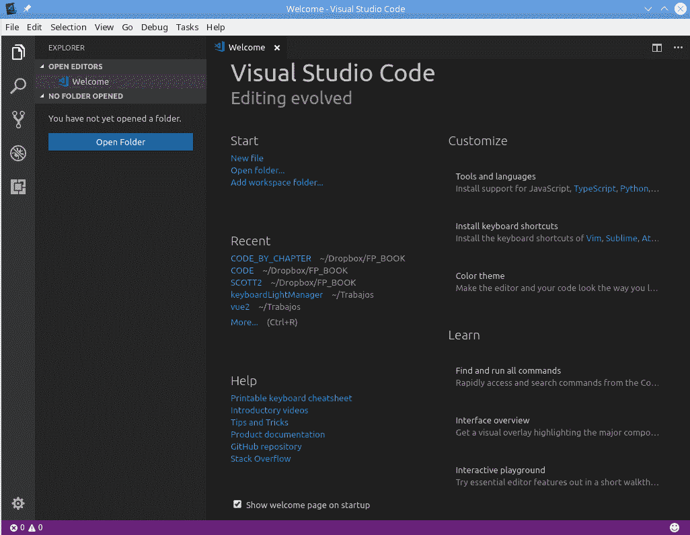

VSC 中的欢迎屏幕，以及左下角的设置齿轮

配置 VSC 有点不同寻常，但也许是可以预料的，因为它起源于 JS。基本上，如下截图所示，你会得到一个分屏，左边以 JSON 格式显示所有可用的配置项（超过四百个！），你可以通过在右边写入新值来更改它们的值。如果你将鼠标悬停在任何设置上，你将看到可能的值，并且你可以通过点击来选择新的值：

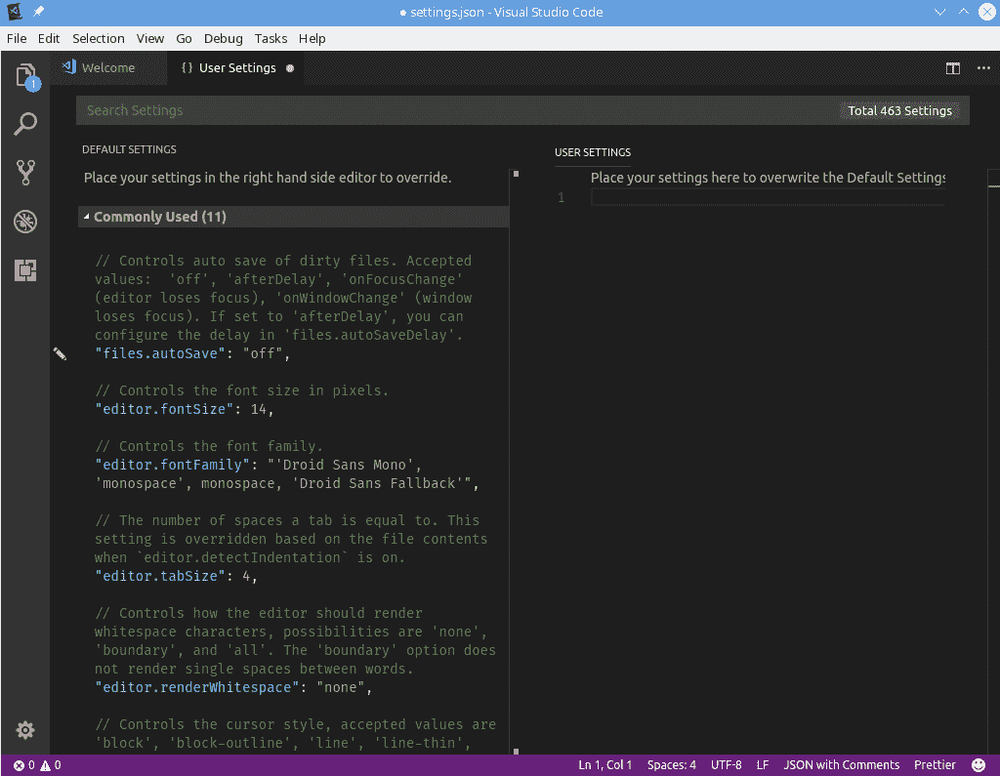

配置 VSC 是通过编辑一个 JSON 文件来完成的

您想选择一个不同的编辑器进行工作，或者至少查看一下目前有哪些可用的？您可以查看[www.slant.co/topics/1686/~javascript-ides-or-editors](https://www.slant.co/topics/1686/~javascript-ides-or-editors) ，其中列出了许多候选项，每个候选项都有其优缺点。截至目前（2018 年 10 月），该页面显示了 41 个选项，其中 Visual Studio Code 位列榜首。

VSC 的一个额外优势与更新有关。它会定期检查是否有新版本可用，并允许您下载并安装它。（另一方面，如果您使用 Linux 并通过存储库安装 VSC，它可能会自动更新，而无需您确认。）之后，您将获得一个信息屏幕，显示上个月的更改；如下面的截图所示：

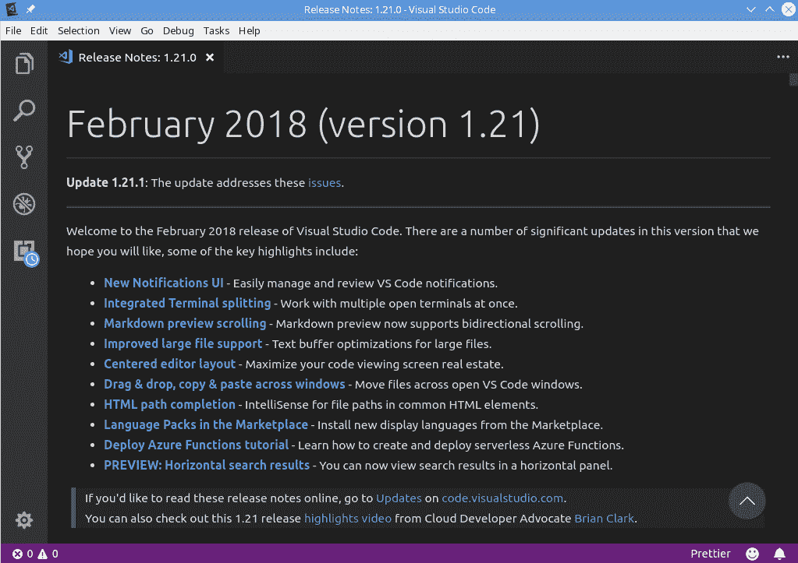

每月更新后，您将收到 VSC 的新功能通知

VSC 的配置超出了我们刚提到的内容；请查看以下部分，以了解更多扩展其功能和使其更适合您使用的方法。

# 扩展 Visual Studio Code

VSC 包括许多开箱即用的功能，您可以使用这些功能开始工作，而且没有问题。通过扩展，您可以为语言、调试、代码质量和许多其他功能添加支持。还提供了配置视觉方面的功能，您可以更改 VSC 的主题、快捷键和一般偏好设置。但是，您可能希望为 VSC 添加更多功能，这就是扩展（插件）的用武之地。

您甚至可以为 VSC 开发自己的扩展，尽管我们在本书中不会涉及这个主题。如果您感兴趣，请查看[`code.visualstudio.com/docs/extensions/overview`](https://code.visualstudio.com/docs/extensions/overview)。扩展可以用 JS 或 TypeScript 编写（请参阅*为数据类型检查添加 Flow*部分），当然您也可以使用 VSC 本身来开发它们！

# 如何做…

扩展是可选的可安装附加功能，提供特定的新功能。安装新扩展非常简单。您可以通过转到主菜单中的 View | Extensions（您也可以找到其键盘快捷键）或单击 VSC 左侧活动栏底部的 Extensions 图标来查看所有可用扩展的菜单。

首先，您将获得当前安装的扩展列表，如下面的截图所示：

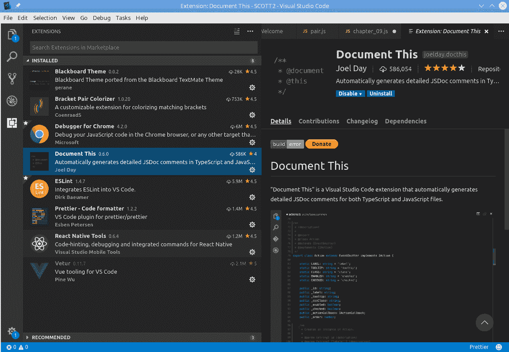

已安装的扩展列表

如果您愿意，您可以禁用任何特定的扩展：在屏幕左侧点击它，然后在右侧点击禁用。您还可以完全卸载任何扩展，而且您很可能会经常这样做；找出扩展是否适合您的唯一方法就是通过实验！看看下面的截图：

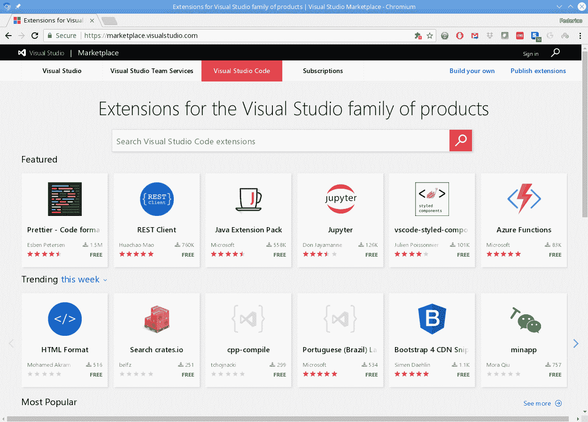

VSC 市场是搜索新扩展的好地方

查找新的扩展也很容易。您可以去 VSC 市场，如前面的截图所示，也可以直接在 VSC 内部搜索，通过在搜索框中输入，如下面的截图所示。我建议注意安装总数（越高越好）和从 1 到 5 星的评分（同样，越高越好）。我们将使用多个扩展；例如，在本章中*使用 Prettier 格式化源代码*和*使用 JSDoc 记录代码*部分；以后还会有更多：

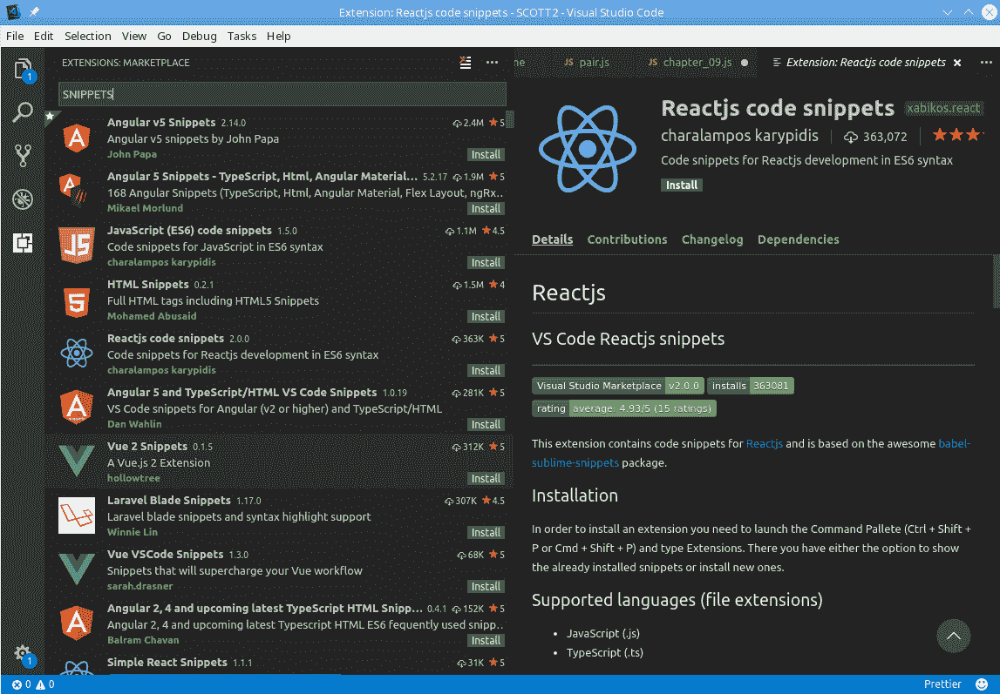

您还可以通过在 VSC 内部键入一些关键字来搜索新的扩展

扩展会自动更新，你不必做太多事情。我建议定期查看你的扩展列表，并可能再次搜索新的扩展；有些情况下，新版本会废弃旧版本，但用新名称，所以更新可能不起作用。最后，准备好进行实验，找出哪些扩展适合你！

# 添加 Fira Code 字体以获得更好的编辑

如果你想尝试一个可能很快就会引发（热烈？激烈？）讨论的话题，大声说出最适合编程的字体是哪一种，然后等着看吧！我不想引发任何争论，但我肯定可以推荐一种可以让你的 JS 代码看起来更好，更易读的字体。

Slant 上的一篇文章，网址为[`www.slant.co/topics/67/~best-programming-fonts`](https://www.slant.co/topics/67/~best-programming-fonts)，列出了 100 多种编程字体；你甚至想过有这么多可用吗？

更好的字体的关键在于连字的概念。在印刷术中，当两个或更多个字母连接在一起成为一个字符时，就会出现连字。好吧，正确的技术术语应该是字形，但我们不要把它弄得更复杂！

你可能不知道的一些连字是这样的：和符号（*&*）最初是拉丁字母*E*和*t*的连字，拼写成拉丁文的*et*，意思是*and*。同样，德语的*ß*字符是两个相邻的*s*字母的连字，而西班牙语的*Ñ*最初是一对*N*字符，一个写在另一个上面。

在 JS 中，有许多符号是以两个或更多字符编写的，只是因为没有其他方式可用。例如，大于或等于符号被键入为`>=`，这看起来不如数学符号`≥`好看，是吧？其他组合包括`<=`（小于或等于），`=>`（用于箭头函数，在第二章中我们将遇到*使用现代 JavaScript 功能*），二进制移位运算符`<<`和`>>`，相等运算符`==`和`===`（以及相应的`!=`和`!==`），等等。

不要混淆*连字*和*字距*。两者都涉及显示相邻的字符，但前者是指连接字符并用新字符替换它们，而后者是指减少字符之间的距离。如果你把一个*f*放在一个*i*旁边，字距会使它们更接近而不重叠（就像你可以减少*A*和*V*之间的间距一样，因为字母的形状），而连字会用*fi*替换两个字符，实际上连接了两个字母。

# 操作方法如下：

虽然有许多等宽字体（意思是所有字符的宽度都相同，这有助于屏幕对齐和缩进），但提供连字的字体并不多。在我的情况下，经过许多实验后，我可以推荐使用 Fira Code，可以在[`github.com/tonsky/FiraCode`](https://github.com/tonsky/FiraCode)上线获取。这种字体不仅为 JS 提供了许多连字，还为其他编程语言提供了连字。看看下面的插图，了解所有的可能性：


所有可用的连字，如图所示

https://raw.githubusercontent.com/tonsky/FiraCode/master/showcases/all_ligatures.png

下载最新版本（截至 2018 年 12 月为 1.206）并按照你的操作系统的标准程序进行安装。之后，你将不得不更改一对 VSC 设置，就像本章前面所示；只需添加以下行，并保存你的配置：

```js
"editor.fontFamily": "'Fira Code', 'Droid Sans Mono', 'Courier New'",
"editor.fontLigatures": true,
.
.
.
```

第一行定义了你想使用的字体（在 CSS 样式中，我还提供了备选方案，以防我将我的设置带到另一台没有`Fira Code`的机器上），第二行告诉 VSC 启用屏幕连字。

# 工作原理如下：

在上一节中进行更改后，当您打开 VSC 时，您将能够看到以下截图中的代码：

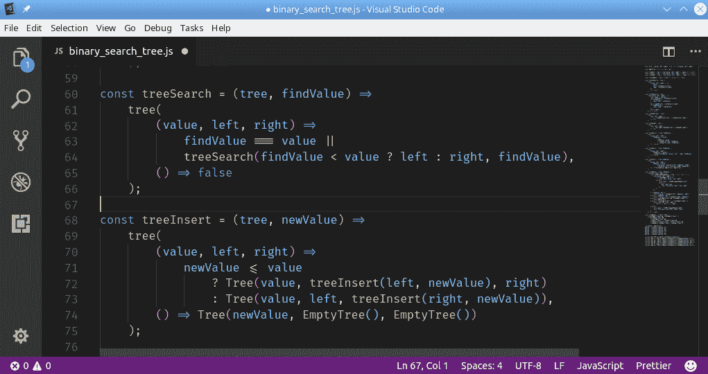

一个示例清单，显示了几个连字号；请参见第 60 行（=>），第 63 行（===和||），或第 71 行（<=）

请注意，当您输入代码时，您无需做任何事情。如果您想要一个箭头连字号，您将需要像平常一样输入两个字符`=`和`>`；它们在屏幕上的显示方式只是字体渲染的结果。同样，如果您想搜索箭头，请搜索`=>`，因为这将保存到磁盘上。

现在我们已经将 VSC 配置为我们喜欢的样子，让我们开始更多的软件包来帮助管理源代码和其他功能。

# 添加 npm 进行软件包管理

无论是在前端还是后端工作时，您肯定会想要使用已有的库和框架，这就产生了一个有趣的问题：如何处理这些软件包的需求，更多的软件包，它们自己甚至需要更多的软件包，依此类推。在第三章中，*使用 Node 进行开发*，我们将使用`Node`，但我们需要超前一步，并现在安装`npm`（`Node`的软件包管理器）以便能够设置几个其他工具。

`npm`也是一个庞大的软件仓库的名称，位于[`www.npmjs.com/`](https://www.npmjs.com/)，大约有 60 万个软件包，您可以在以下截图中观察到，它以每天超过 500 个软件包的速度增长，根据[`www.modulecounts.com/`](http://www.modulecounts.com/)等统计数据，这是一个跟踪几个知名代码仓库的地方：


根据 www.modulecounts.com/的数据，npm 仓库的增长似乎是指数级的。

可以肯定地说，现代 JS 应用程序可能不需要至少一个，更可能需要几个来自`npm`的软件包，因此添加一个软件包管理器将是强制性的；让我们看看其中的一些。

# 如何做…

要获取`npm`，您必须首先安装`Node`，这将对第三章以及接下来的章节有所帮助。我们不会从网上复制详细信息（请参见[`docs.npmjs.com/getting-started/installing-node`](https://docs.npmjs.com/getting-started/installing-node)），但我们可以总结如下：

1.  通过下载并进行手动安装（对于 Windows 来说是最常见的方式）或通过添加适当的仓库，然后使用 Linux 软件包管理器来安装`Node`（这是我在我的 OpenSuse 机器上的做法）。请注意，选择**长期支持**（**LTS**）版本，其主要版本号为偶数（例如 8.x.x），除非您足够冒险，使用最新的开发版本，并且不介意出现停止工作等风险！

1.  验证`Node`是否正确安装。在命令行中，输入`node -v`并获取当前版本；在我的机器上，是 v9.7.1，但在您尝试时这肯定会改变，是的，我感到很有冒险精神，没有使用 LTS 版本！

1.  使用`npm -v`命令检查`npm`是否是最新版本。如果不是（请参考以下代码片段），您将需要更新它：

```js
> npm -v 
5.5.1 

 ────────────────────── 
   │                                    │
   │  Update available 5.5.1 → 5.7.1    │
   │     Run npm i -g npm to update     │
   │                                    │
    ──────────────────────
```

如果您正在使用一个软件包管理器（这意味着您可以自动获取软件的更新，而无需逐个查找每个软件包），您可能还对安装`nvm`感兴趣，尽管这是可选的；有关更多信息，请参见[`github.com/creationix/nvm`](https://github.com/creationix/nvm)。

# 它是如何工作的…

我们将在本文的几个地方再次使用`npm`。您将不得不使用它来安装多个软件包（其中一些出现在本章中，例如`JSDoc`或`Prettier`），然后我们将看到如何配置应用程序，以便所有所需的软件包都可用且保持最新。

您可以在[`docs.npmjs.com/`](https://docs.npmjs.com/)找到所有`npm`功能的完整文档。

# 使用 npm 创建项目

如果您选择任何空目录并只安装一个软件包，您将收到一些与缺少文件相关的警告，并且还会发现一些新元素：

```js
~ > md sample
~ > cd sample
~/sample > npm install lodash 
npm WARN saveError ENOENT: no such file or directory, open '/home/fkereki/sample/package.json' 
npm notice created a lockfile as package-lock.json. You should commit this file. 
npm WARN enoent ENOENT: no such file or directory, open '/home/fkereki/sample/package.json' 
npm WARN sample No description 
npm WARN sample No repository field. 
npm WARN sample No README data 
npm WARN sample No license field. 

+ lodash@4.17.11
added 1 package from 2 contributors and audited 1 package in 1.945s 
found 0 vulnerabilities

~/sample> dir 
total 4 
drwxr-xr-x 3 fkereki users  20 Mar 15 11:39 node_modules 
-rw-r--r-- 1 fkereki users 313 Mar 15 11:39 package-lock.json
```

这里发生了什么？让我们一步一步地解释结果，然后添加缺少的部分。当您安装模块时，它们（以及它们的所有依赖项，以及它们依赖的依赖项等）默认放在`node_modules`目录中。这是一个很好的措施，因为将放入该目录的所有代码实际上都不是您编写的，并且最终将由`npm`在您的直接控制下进行更新。我们可以通过快速转到新创建的目录并检查其内容来快速验证：

```js
~/sample> cd node_modules
~/sample/node_modules> dir 
total 36 
drwxr-xr-x 3 fkereki users 20480 Mar 15 11:39 lodash
```

但是，您如何控制要安装哪些软件包（及其版本）？这就是缺少的`package.json`文件的目的，它让您指定要安装的软件包，以及我们稍后在本书中会遇到的其他一些东西。您可以手动创建此文件，但最好使用`npm init`并回答几个问题。这将创建所需的文件，最终描述项目的所有依赖关系，以及我们稍后将看到的其他功能（例如构建或部署过程）：

```js
~/sample> npm init
This utility will walk you through creating a package.json file.
It only covers the most common items, and tries to guess sensible defaults.
See `npm help json` for definitive documentation on these fields
and exactly what they do.
Use `npm install <pkg>` afterwards to install a package and
save it as a dependency in the package.json file.

Press ^C at any time to quit.
package name: (sample) simpleproject
version: (1.0.0) 
description: A simple project to show package.json creation
entry point: (index.js) 
test command: 
git repository: 
keywords: 
author: Federico Kereki
license: (ISC) 
About to write to /home/fkereki/sample/package.json:

{
 "name": "simpleproject",
 "version": "1.0.0",
 "description": "A simple project to show package.json creation",
 "main": "index.js",
 "scripts": {
 "test": "echo \"Error: no test specified\" && exit 1"
 },
 "author": "Federico Kereki",
 "license": "ISC"
}
Is this ok? (yes)
```

让我们快速浏览每个字段，但请记住这些只是基本字段；您可以在[`docs.npmjs.com/files/package.json`](https://docs.npmjs.com/files/package.json)找到更完整的官方描述。由于我们跳过了一些答案，生成的项目文件中并非所有字段都存在，但您可以稍后添加所有内容：

+   `name`：要分配给项目的任何名称；默认情况下为目录的名称。

+   `version`：项目的语义版本号。每当创建新版本时，您都会更新此数字。有关语义版本控制的更多信息，请参阅[`semver.org/`](https://semver.org/)。

+   `description`：项目的简单描述，由`npm`搜索命令使用。

+   `main`：程序的主要入口点的名称。通常使用`index.js`。

+   `test command`：要执行代码的单元测试，您将运行的命令（脚本）。我们稍后在本书中也会看到这一点。

+   `git repository`：如果您要使用源代码控制，您将在此处提供详细信息。我们将在本章后面的*使用 Git 进行版本控制*部分中介绍这一点。

+   `scripts`：这是一个包含可以使用`npm run`运行的脚本命令的对象；例如，您可以编写脚本来构建项目，部署它，检查它是否符合代码质量规则等。

+   `author`：创建项目的人。

+   `license`：要分配给项目的任何许可证；这是为了让其他人知道他们可以如何使用您的软件包（权限，限制），如果您允许的话。您可以在[`spdx.org/licenses/`](https://spdx.org/licenses/)找到（相当长的！）可能的许可证列表，并在选择时要小心；涉及法律方面的问题！

但是，软件包在哪里？让我们在下一节中看看。

# 为不同目的安装软件包

有两种安装`npm`软件包的方法：全局或本地：

+   如果你计划从命令行使用这个包，就全局安装它；例如，`npm install prettier -g`会安装`prettier`命令，这样你就可以在任何地方使用它。（我们将在*使用 Prettier 格式化你的源代码*部分看到更多关于`prettier`的内容。）你可能需要以管理员身份运行命令，或者使用`sudo`。

+   否则，如果你只需要这个包用于你的项目，就在本地安装它。

本地安装包也可以通过多种方式完成：

+   如果你需要这个包用于你自己的项目，那么你可以使用`npm install lodash --save`将其安装为生产包

+   或者，如果你需要这个包来构建你的项目，但不作为最终生成的代码的一部分，可以使用`npm install eslint --save-dev`将其安装为开发包

有许多命令和选项的简写版本，比如`i`代表`install`，或者`-D`代表`--save-dev`，但我更喜欢把所有东西都写出来。如果你想了解更多，请尝试`npm --help`。

运行这两个后续命令后，如果你检查`package.json`，你会注意到添加了一些行：

```js
~/sample> cat package.json  
{ 
  "name": "simpleproject", 
  "version": "1.0.0", 
  "description": "A simple project to show package.json creation", 
  "main": "index.js", 
  "scripts": { 
    "test": "echo \"Error: no test specified\" && exit 1" 
  }, 
  "author": "Federico Kereki", 
  "license": "ISC", 
  "dependencies": { 
 "lodash": "⁴.17.5" 
 }, 
 "devDependencies": { 
 "prettier": "¹.11.1" 
 } 
}
```

`dependencies`和`devDependencies`条目指的是你需要的生产和开发包。如果你正在编写软件，并且决定需要一个新的包，有两种方法可以做到这一点：

+   在`package.json`中添加一个条目，然后运行`npm install`来获取它

+   或者，使用`npm install`，要么使用`--save`要么使用`--save-dev`，`package.json`将被`npm`更新

要删除一个依赖，使用`npm uninstall`。你必须包括`--save`或`--save-dev`，以便同时从`package.json`中删除引用。

如果你需要特定版本，你将需要了解语义版本控制。版本规则可能变得复杂，我们只会看到主要的规则；查看[`docs.npmjs.com/files/package.json#dependencies`](https://docs.npmjs.com/files/package.json#dependencies)和[`github.com/npm/node-semver#versions`](https://github.com/npm/node-semver#versions)获取完整的描述：

| 4.5.6 | 版本为 4.5.6，没有其他版本 |
| --- | --- |
| ⁴.0.0 | 最新兼容版本 4.x.x |
| ⁴.2.0 | 最新兼容版本 4.2.x |
| >5.6.7 | 大于 5.6.7 的版本 |
| ~8.7.6 | 大约等于 8.7.6 的版本；应该是 8.7.x |

# 还有更多...

维护你的包并更新它们是一项重要的任务，如果你是开发团队的一部分，可能有人甚至在不同的地区或国家，那么每个人都应该始终使用相同的配置，这变得非常重要。如果项目非常动态（意味着包将经常被添加、删除或更新），`npm`可能会变得有点慢，也可能会产生一致性或安全问题；为了解决这种情况，Facebook 在 2016 年发布了一个新的包管理器`yarn`。（参见[`yarnpkg.com/en/`](https://yarnpkg.com/en/)。）

如果你想看到这些变化的原因，请参阅关于`yarn`的原始博客文章[`code.facebook.com/posts/1840075619545360`](https://code.facebook.com/posts/1840075619545360)。

一个关键特性是你可以无缝地用`yarn`替换`npm`，并开始使用后者，因为它具有相同的功能集（除了一些细微差异），同时以更快、更可靠和更安全的方式工作。例如，`yarn`可以并行管理下载，甚至可以使用缓存包，因此甚至可以在没有连接到互联网的情况下进行一些更新！

安装非常简单，有点讽刺。使用`npm`和`npm install -g yarn`，从那一刻起，你就可以直接使用`yarn`，忘记`npm`。查看[`yarnpkg.com/en/docs/install`](https://yarnpkg.com/en/docs/install)获取有关安装过程的更完整文档。

有关比较`npm`和`yarn`命令的更多细节，请查看[`yarnpkg.com/lang/en/docs/migrating-from-npm/`](https://yarnpkg.com/lang/en/docs/migrating-from-npm/)或[`shift.infinite.red/npm-vs-yarn-cheat-sheet-8755b092e5cc`](https://shift.infinite.red/npm-vs-yarn-cheat-sheet-8755b092e5cc)。

# 使用 Git 进行版本控制

在现代软件开发中，毋庸置疑，您将需要一些 SCM（软件配置管理）软件来跟踪代码中的所有更改。今天，最常用的工具是`Git`，我们也将使用它。`Git`是由 Linus Torvalds 于 2005 年创建的（他还创建了 Linux！）用于 Linux 内核的开发；考虑到其源代码超过 2500 万行，这并不是一项小任务！

Linux 不是唯一一个使用`Git`控制的主要操作系统；2017 年 2 月，微软本身决定将 Microsoft Windows 的开发迁移到`Git`，并开发了定制功能以增强远程工作。

我们不会深入探讨`Git`的工作原理，要使用哪些命令等等，因为这将是一本书的材料！我们将专注于如何在 VSC 中使用`Git`。这相当简单，因为 VSC 不仅是为了访问`Git`而编写的，而且还有一些扩展可以使工作更加轻松，因此您不必记住大量的命令和选项；看看下面的插图：

！[](img/7262d35b-aea2-4f27-b1a4-7cd70b379bb9.png)

Git 有很多命令，但您可以很好地应对其中的一些选择性命令。

这个 XKCD 漫画可以在 https://xkcd.com/1597/上找到。

# 如何做…

就我个人而言，我有一个 GitHub 账户，并决定将其用于本书的代码。这不仅是一种能够快速与读者分享所有代码的方式，而且（非常重要！）也是一种确保我不会意外丢失工作的方式，我很有能力做到这一点！请访问[`github.com/fkereki/modernjs`](https://github.com/fkereki/modernjs)获取所有代码。我假设您有一个适当的`Git`服务器，并且能够初始化项目，将其连接到服务器等等。此外，VSC 需要在您的计算机上预先安装`Git`；如果您还没有安装，请查看[`git-scm.com/book/en/v2/Getting-Started-Installing-Git`](https://git-scm.com/book/en/v2/Getting-Started-Installing-Git)开始安装。

VSC 通过其命令面板提供了对命令的完全访问...如下截图所示。您可以在那里搜索命令，点击后，VSC 将逐个询问所有可能的参数，这样您就不必靠记忆来完成它们：

！[](img/4c0c8326-e5ab-4bf6-8786-94dce2dfe998.png)

您可以通过 VSC 的命令面板输入 Git 命令，并且如果需要，会要求您输入所需的参数

提交代码是相当频繁的，所以您可以直接点击源代码控制图标（在左侧的第三个）并输入您想要的提交消息。在那个屏幕上，您还可以恢复本地更改等等；鼠标悬停以获取所有可能的功能。

# 还有更多…

有一个`Git`扩展我会推荐给 VSC：寻找`GitLens`（也称为**Git Supercharged**）并安装它。这个扩展提供了对几乎所有`Git`信息的访问。

看一下以下的截图：

！[](img/c4db95e0-4067-4468-97d3-d2f3e91f5df3.png)

GitLens 的使用

除了其他功能，`GitLens`还提供了以下功能：

+   一个镜头，显示最近的提交和作者信息

+   一个资源管理器，用于浏览存储库和文件历史

+   一个责备注释，显示谁对一行进行了最后的更改，就像 git blame 一样

+   搜索提交的能力以不同的方式，并且更多

有关更详细的信息，请参阅[`gitlens.amod.io/`](http://gitlens.amod.io/)。特别注意定制[`github.com/eamodio/vscode-gitlens/#configuration`](https://github.com/eamodio/vscode-gitlens/#configuration)，因为大多数功能都可以调整以更好地适应您的工作风格。您可以通过标准设置页面（查找所有名称以*GitLens*开头的所有配置项），或者通过打开命令面板并查找 GitLens：打开设置，这将打开一个特殊的设置屏幕，如下面的屏幕截图所示：

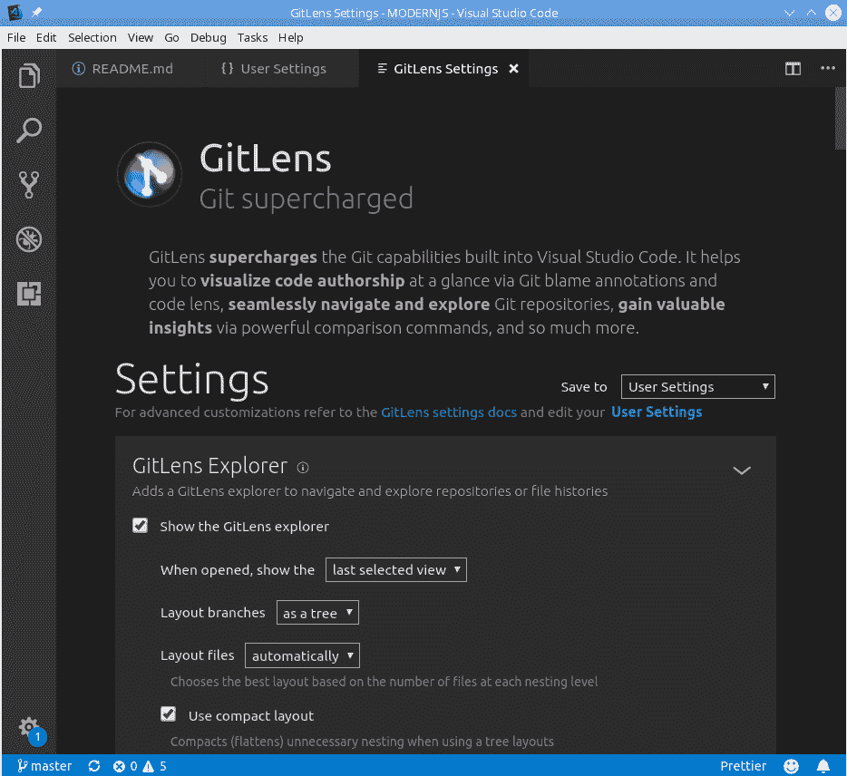

Gitlens 还提供了一个特殊的屏幕设置功能，允许您配置工具的几乎每个方面

既然我们已经建立了一个开发环境，并选择并安装了一组最少的工具，让我们进一步添加一些可选的，但强烈推荐的额外软件包，这些软件包将有助于生成更好的代码。

# 使用 Prettier 格式化您的源代码

如果您在一个有几个其他开发人员的项目中工作，迟早会出现关于代码格式应该如何格式化的争论，而且这些争论可能会持续很长时间！确定源代码的单一标准确实是必要的，但如果格式取决于每个人，那么你肯定会得到比团队成员更多的“标准”！看看下面的插图。在团队中不希望出现额外的摩擦或激怒，而且风格争论可能会持续很长时间：


你不能拥有多个标准。

这个 XKCD 漫画可以在 https://xkcd.com/927/上在线获取。

现代 JS 项目的问题更加严重，因为它们不仅包括 JS 源代码，还可能包括`TypeScript`或`Flow`（稍后请参阅*添加 Flow 进行数据类型检查*部分），JSX（请参阅第六章，*使用 React 开发*），JSON，HTML，CSS 或 SCSS，甚至更多。

在尝试了许多源代码格式化程序之后，我最终决定将`Prettier`用于所有目的。`Prettier`是一个*有主见的*代码格式化程序，支持我之前列出的所有语言，根据一套规则重新格式化源代码，从而确保所有代码符合预期的样式。

如果您想阅读`Prettier`的原始描述，请参阅[`jlongster.com/A-Prettier-Formatter`](https://jlongster.com/A-Prettier-Formatter)，作者在博客文章中描述了该项目的基本原理，并介绍了实现和选项的一些细节。

这意味着什么，它是*有主见的*吗？许多（或大多数）代码格式化程序提供了一个非常大的配置选项集，您可以调整这些选项以使代码看起来符合您的期望。另一方面，`Prettier`有自己的一套规则，几乎没有配置的余地，因此可以缩短所有争论。此外，您可以使其与 VSC 无缝配合，这意味着每当您保存代码时，它都会被重新格式化。

让我们看一些*有主见*的例子。使用箭头函数（我们将在第二章的*定义函数*部分中更详细地介绍它们，*使用现代 JavaScript 功能*），如果函数有一个参数，将其括在括号中是可选的：

```js
const plus1= (x)=> 1+x
```

然而，`Prettier`决定在这种情况下不包括括号。另外，请注意它添加了一些空格以增加清晰度，以及（可选的）缺少分号：

```js
const plus1 = x => 1 + x;
```

同样，如果您使用承诺（我们将在第二章的*紧凑执行异步调用*部分中看到它们，*使用 JavaScript 现代功能*），您可能会写出以下内容：

```js
fetch('http://some.url').then((response) => {
    return response.json();
  }).then((myJson) => {
    console.log(myJson);
  }).catch(e => { /* something wrong */ });
```

然而，它将被重新格式化为更常见的以下代码：

```js
fetch("http://some.url")
    .then(response => {
        return response.json();
    })
    .then(myJson => {
        console.log(myJson);
    })
    .catch(e => {
        /* something wrong */
    });
```

注意每个`.then(...)`都被推到了单独的一行，这是 JS 最常见的风格。`Prettier`应用的格式规则源自通常的实践，这里不可能列出所有的规则。但真正重要的是，通过使用这个工具，你可以确信你的整个团队将以相同的方式工作。

如果你的团队对某些规则抱怨，提醒他们有句话说“有一种正确的方式，一种错误的方式，还有军队的方式！”采用`Prettier`后，不再有关于风格的讨论，和平最终会降临。

# 如何做…

安装`Prettier`非常简单：你只需要添加 VSC 扩展，你可以通过搜索`Prettier Code Formatter`找到；作为检查，最新版本（截至 2018 年 12 月）是 1.16.0，作者是 Esben Petersen。插件本身可以在 VSC 市场上找到，网址为[`marketplace.visualstudio.com/items?itemName=esbenp.prettier-vscode`](https://marketplace.visualstudio.com/items?itemName=esbenp.prettier-vscode)。你也可以全局安装它（就像我们在本章前面看到的*为不同目的安装包*一节中那样），以便能够在脚本中或通过`npm`或`yarn`命令行使用它。参见[`prettier.io/docs/en/install.html`](https://prettier.io/docs/en/install.html)，我建议你这样做。

在 VSC 偏好设置中有一个改变你会想要做。转到文件|首选项|设置，并在用户配置中添加以下行，这样每个文件在保存时都会自动格式化：

```js
"editor.formatOnSave": true,
.
.
.
```

如果你更愿意只将`Prettier`应用于 JS，那么你应该使用这个：

```js
"[javascript]": {
    "editor.formatOnSave": true
},
.
.
.
```

正如我们所说，`Prettier`对代码的外观有很强的意见，并且只有少数几个选项可以更改。可用的选项可以在`package.json`中设置（这样整个团队更容易共享），在`"prettier"`键中。一些可能性（也就是你可能想要修改的）如下：

| **选项** | **默认值** | **含义** |
| --- | --- | --- |
| `arrowParens` | `false` | 对于只有一个参数的箭头函数，是否将其括在括号中。 |
| `bracketSpacing` | `true` | 在对象的开括号之后和闭括号之前包括一个空格。 |
| `jsxBracketSameLine` | `false` | 如果为`true`，多行 JSX 元素的结束`>`将添加在最后一行的末尾；如果为`false`，它将在单独的一行上。 |
| `printWidth` | `80` | 最大行大小。 |
| `semi` | `true` | 在每一行的末尾添加分号，即使不需要。 |
| `singleQuote` | `false` | 对字符串使用单引号。 |
| `tabWidth` | `2` | 缩进大小。 |
| `trailingComma` | `none` | 指定是否在可能的情况下添加尾随逗号。选项有`none`（从不添加这样的逗号），`es5`（在 ES5 允许的地方添加，如数组或对象），或`all`（即使在函数参数中也添加）。 |
| `useTabs` | `false` | 使用制表符进行缩进。 |

就我个人而言，我只使用`tabWidth:4`和`printWidth:75`，但后者只是为了这本书，而不是为了其他工作。我的`package.json`包括以下内容；我将其放在`dependencies`键之前，但你也可以将其放在其他位置：

```js
"prettier": {
    "tabWidth": 4,
    "printWidth": 75
},
.
.
.
```

你也可以独立于 VSC 使用`Prettier`，在这种情况下，配置选项应该放在一个`.prettierrc`文件中。参见[`prettier.io/docs/en/cli.html`](https://prettier.io/docs/en/cli.html)和[`prettier.io/docs/en/configuration.html`](https://prettier.io/docs/en/configuration.html)了解更多信息。

最后，如果出于某种原因你想要避免`Prettier`代码格式化，你可以这样做：

+   通过将其路径和名称添加到项目根目录下的`.prettierignore`文本文件中，可以避免给定文件的所有格式。

+   通过在其前面加上`// prettier-ignore comment`来避免重新格式化单个句子

对于后一种选项，记住根据源代码语言使用适当的注释样式。例如，在 HTML 文件中，你会使用`<!-- prettier-ignore -->`，而在 CSS 中，应该是`/* prettier-ignore */`，对于 JSX，是`{/* prettier-ignore */}`。

# 它是如何工作的…

有两种使用`Prettier`的方法。第一种是配置 VSC 在保存代码时自动格式化代码；按照我们之前安装 VSC 时看到的说明，将编辑器的“保存时格式化”选项更改为 true，就可以了。当然，你也可以通过右键单击并选择“格式化文档”选项来随时格式化代码。

你也可以在网上使用`Prettier`。转到[`prettier.io/playground/`](https://prettier.io/playground/)，将你的代码粘贴到左侧面板，你将立即在右侧面板中获得一个格式化的版本。看下面的截图，以了解代码重新格式化的示例：

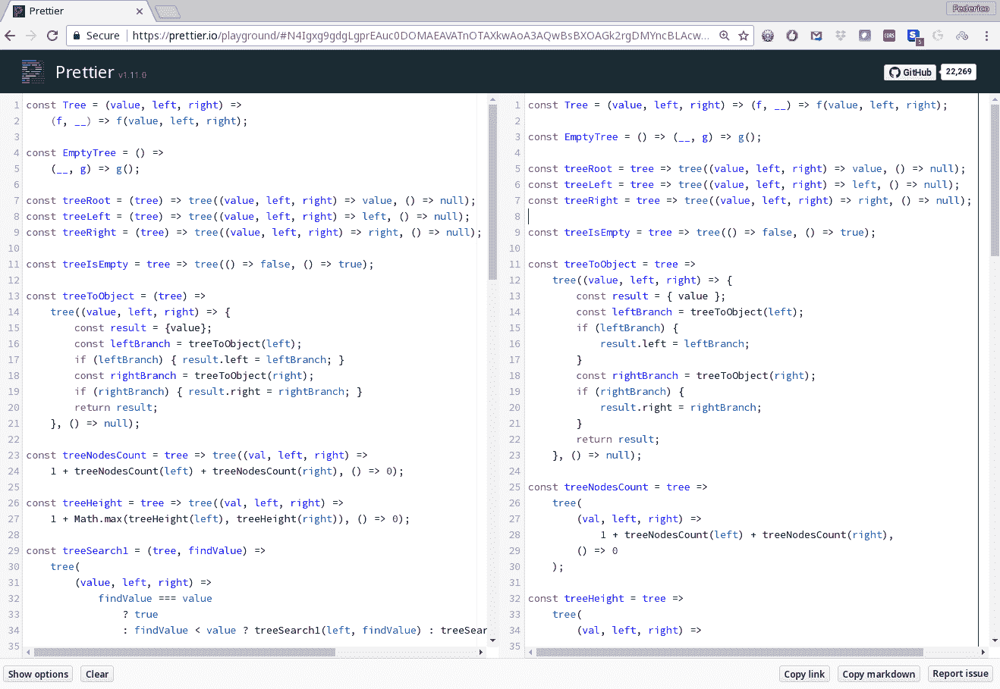

在线的 Prettier 可以用来尝试配置参数，或进行快速的代码重新格式化会话

如果你想尝试一下少量可用的选项，点击左下角的“显示选项”，你就可以根据我们在前一节中看到的内容配置 Prettier，看下面的截图：

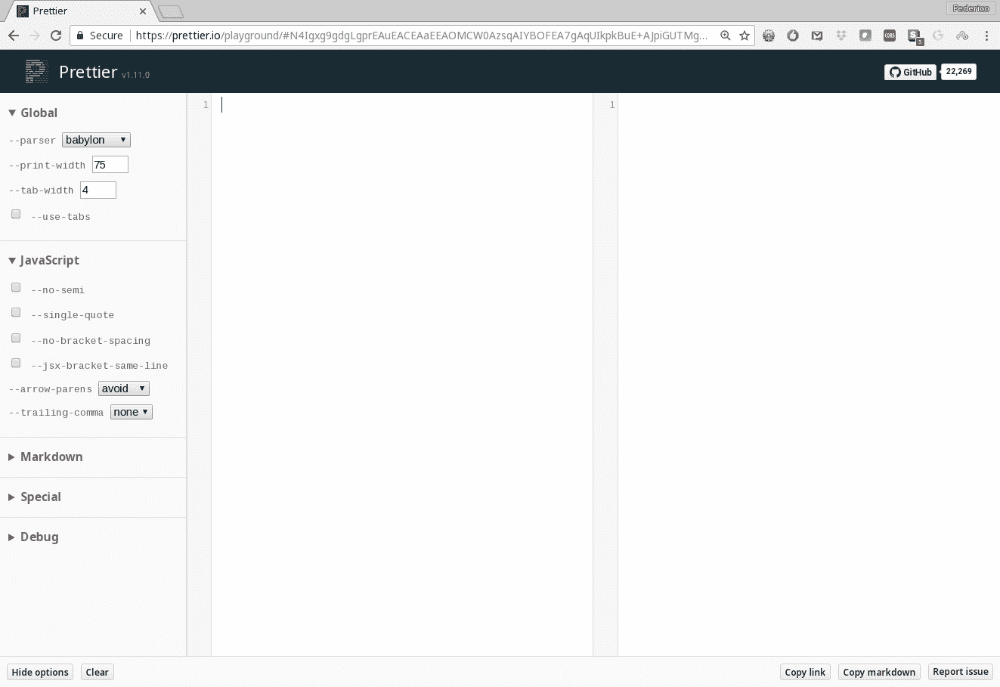

如果你想动态地尝试（少量可用的）Prettier 设置，你可以在在线游乐场中进行

在为本书准备代码时，我将右边距设置为 75，因为这样才能适合打印页面。我还将缩进设置为 4 个字符，因为我觉得这样更清晰。除此之外，我将一切都保持默认设置；这样处理起来就少了一些样式参数！

# 使用 JSDoc 记录你的代码

一个良好的可维护性规则是代码应该被记录。`JSDoc`（或`JSDoc3`；名称反映了当前版本，3.6.0）是一个 API 文档生成器，可以为你的代码生成完整的 HTML 网站文档。你只需要在你的源代码中添加注释（以特定格式），`JSDoc`就会扫描代码来提取它们并生成文档。让我们先看看这些注释应该如何编写，然后再转向一个工具，让 VSC 更容易地完成这项工作。

`JSDoc`的官方网页在[`usejsdoc.org/`](http://usejsdoc.org/)，源代码可以在[`github.com/jsdoc3/jsdoc`](https://github.com/jsdoc3/jsdoc)找到。

# 如何做…

`JSDoc`的主要思想是记录你的 API，包括函数、类、方法等。`JSDoc`注释应该在被记录的代码之前。注释以`/**`开头，以`*/`结尾；双星号将它们与普通注释区分开来。

不要过度使用星号，因为如果写三个或更多，那么注释也会被忽略；`JSDoc`期望两个星号，不多不少。

以下代码块显示了可能的最简单的示例，说明了如何通过提供函数的目标和参数描述来记录函数：

```js
/**
 * Solves the Hanoi Towers puzzle, for any number of disks.
 *
 * @param {number} disks - How many disks to move
 * @param {string} from - The starting pole's name
 * @param {string} to - The destination pole's name
 * @param {string} extra - The other pole's name
 */
const hanoi = (disks, from, to, extra) => {
    if (disks === 1) {
        console.log(`Move disk 1 from post ${from} to post ${to}`);
    } else {
        hanoi(disks - 1, from, extra, to);
        console.log(`Move disk ${disks} from post ${from} to post ${to}`);
        hanoi(disks - 1, extra, to, from);
    }
};
```

`@param`符号是一个块标签，引入了一个代码项，这里是函数的参数。常见标签的（部分）列表如下：

| `@author` | 开发者的名字。 |
| --- | --- |
| `@class` | 定义一个类。 |
| `@constructor` | 将函数标记为构造函数。 |
| `@copyright`, `@license` | 法律细节。 |
| `@deprecated` | 将函数或方法标记为已弃用。 |
| `@exports` | 导出的模块成员。 |
| `@function`, `@callback` | 定义一个函数，更具体地说，是用作回调的函数。 |
| `@param` | 期望的参数。数据类型可以在大括号内添加。 |
| `@property` or `@prop` | 对象的属性。 |
| `@return` or `@returns` | 函数或方法的返回值。 |
| `@throws` or `@exception` | 方法抛出的异常。 |
| `@version` | 库的版本。 |

还有更多的标签，比如`@private`，用于标识成员为私有，但由于 JS 实际上并没有提供这个功能，我跳过了它。其他标签更具体，你可能不会使用它们，比如`@generator`或`@mixin`。如果你想看到可能的块（以及一些内联）标签的完整列表，请查看[`usejsdoc.org/index.html`](http://usejsdoc.org/index.html)。

坦白说：我们在这本书中不会经常使用`JsDoc`，但只是因为所有需要的解释都将在文本本身中给出。对于正常的工作，我总是会使用它，但在这本书中它主要是多余的。

# 它是如何工作的...

编写这种注释可能很快变得乏味，但你可以使用*Document This* VSC 扩展来自动生成所需的模板，然后再进行补充。你可以在[`marketplace.visualstudio.com/items?itemName=joelday.docthis`](https://marketplace.visualstudio.com/items?itemName=joelday.docthis)找到这个扩展，但通过 VSC 本身安装它会更简单：搜索`Document This`，它会很快出现。

在包含了这个扩展之后，如果你在代码上右键单击，将会出现一个新的命令，它将自动生成（大部分为空）的注释，供你完成。

至于生成自动文档，查看[`usejsdoc.org/about-commandline.html`](http://usejsdoc.org/about-commandline.html)；我们不会深入讨论这个，因为它非常简单。你可以配置`JSDoc`，还可以更改它用于生成页面的模板；有关这些主题，请参阅[`usejsdoc.org/about-configuring-jsdoc.html`](http://usejsdoc.org/about-configuring-jsdoc.html)和[`usejsdoc.org/about-configuring-default-template.html`](http://usejsdoc.org/about-configuring-default-template.html)。请参阅以下截图：

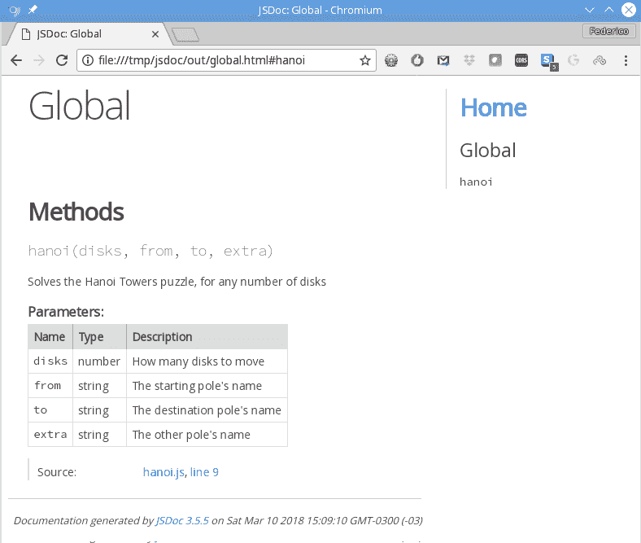

JSDoc 输出的一个简单示例

当然，文档化单个函数不会是你的用例！但对于我们的目的来说，这已经足够了；对于正常使用，你将得到一个带有链接到每个类、函数等的索引，充分记录你的代码。

你已经设置好了你的工作环境，并且能够在最新版本的 JS 中编写有文档记录的、缩进良好的代码，但这仍然不能防止可能发生的错误，所以现在让我们深入了解如何增强你的代码。

# 使用 ESLint 添加代码质量检查

JS 是一种非常强大的语言，但也有很大的滥用潜力。例如，大多数人会同意，如果`a==b`为真，并且`b==c`也为真，那么`a==c`也应该为真，但由于 JS 对`==`运算符应用的数据类型转换规则，你会得到以下结果：

```js
""==0   // true
0=="0"  // true
""=="0" // false!?
```

接下来是另一个例子；这个非常简单的函数返回什么？

```js
function mystery() {
    return
    { 
        something: true 
    }
}
```

如果你回答*一个对象*，你会被一个缺少分号咬到。这段代码实际上被 JS 解释为以下内容：

```js
function mystery() {
    return ;
    {
        something: true;
    }
}
```

注意`return`后面的分号。这个函数返回`undefined`，而`something`被解释为一个表达式的标签，恰好是`true`；糟糕！这种情况很常见，即使你知道自己在做什么，至少得到一个关于代码可能存在问题的警告也有助于排除错误，这就是`ESLint`产生的警告类型。

前面显示的*陷阱*只是 JS 对不知情的开发人员之一。搜索*JavaScript 陷阱*，你会得到几个可能错误的列表。

# 如何做到...

**Linters**是一类编程工具，它们分析你的源代码，并提出关于低质量用法或构造的警告和错误，甚至可能暗示着错误。我们将使用 ESLint，由 Nicholas Zakas 于 2013 年创建；该工具的当前版本是 5.10.0，截至 2018 年 12 月。

1978 年，贝尔实验室的 Stephen Johnson 编写了第一个`lint`程序，他还在 Unix，**另一个编译器编译器**（**yacc**）和便携式 C 编译器上工作，这使得更容易为不同的计算机架构输出代码。

^（`ESLint`基于可插拔规则，可以根据您的特定偏好启用或禁用，或进行配置。（您甚至可以开发自己的规则，但这超出了本书的范围。）还有一些规则包，可以让您避免必须单独配置数十个不同的规则。）

安装 ESLint 非常简单，只需要执行以下操作：

```js
 npm install eslint eslint-config-recommended --save-dev
```

然后，您将不得不将 ESLint 选项添加到`package.json`配置文件中；让我们开始吧。首先，我们将添加一个脚本，将 ESLint 应用于我们的完整源目录（此时只有一个文件！）使用`npm run eslint`：

```js
"scripts": {
    "build": "babel src -d out",
 "eslint": "eslint src",
    "test": "echo \"Error: no test specified\" && exit 1"
}

```

我们还必须为 ESLint 本身指定一些配置。我们将为此添加一个全新的部分：

```js
"eslintConfig": {
    "parserOptions": {
        "ecmaVersion": 2017,
        "sourceType": "module"
    },
    "env": {
        "browser": true,
        "node": true
    },
    "extends": "eslint:recommended",
    "rules": {}
} 
```

让我们逐个项目地进行：

+   `parserOptions`允许您指定要处理的 JS 版本（我选择 2017 年，用于 ES8），以及是否要使用模块（我提前指出这一点，我们将在第二章的*模块化代码组织*部分中看到）*使用现代 JavaScript 功能*）。

+   `env`允许您指定要使用的环境，这实际上意味着假定存在一些全局变量。在这种情况下，我表示我将同时使用浏览器和`Node`的代码，但还有很多其他可能的环境；请查看[`eslint.org/docs/user-guide/configuring`](https://eslint.org/docs/user-guide/configuring)中的*指定环境*部分。稍后，我们将添加一些更多的环境，例如用于单元测试。

+   `extends`允许您选择一组预定义的规则，稍后您将能够修改以适应您的口味。我选择推荐的设置；您可以在[`github.com/kunalgolani/eslint-config`](https://github.com/kunalgolani/eslint-config)上了解更多信息。可用的规则集仅在`ESlint`主要版本更改时才会更改，因此它们是相当稳定的。此外，`recommended`设置代表通常达成一致的规则列表，因此在开始进行特定更改之前，请尝试按原样进行。完整的规则集可在[`eslint.org/docs/rules/`](https://eslint.org/docs/rules/)上找到，推荐的规则可以在[`github.com/eslint/eslint/blob/master/conf/eslint-recommended.js`](https://github.com/eslint/eslint/blob/master/conf/eslint-recommended.js)上找到。

+   `rules`允许您更改一些规则以更好地适应您的风格。我们很快就会看到这样做的充分理由。

如果（仅当）您计划使用`ESLint`尚不支持的一些`Babel`功能，您应该从[`www.npmjs.com/package/babel-eslint`](https://www.npmjs.com/package/babel-eslint)安装并使用`babel-eslint`包。这还需要向`.eslintrc.json`文件添加一行以更改`ESLint`使用的解析器。但是，请记住，您几乎不太可能需要进行此更改！

# 工作原理...

如果我们按原样使用`npm run eslint`，我们将得到以下结果：

```js
> npm run eslint
> simpleproject@1.0.0 eslint /home/fkereki/sample
> eslint src

/home/fkereki/sample/src/eight_queens.js
 32:1 error Unexpected console statement no-console
> X 1 problem (1 error, 0 warnings)
```

标准规则不允许使用`console.log（...）`，因为您可能不希望将它们包含在您的应用程序中；这是[`eslint.org/docs/rules/no-console`](https://eslint.org/docs/rules/no-console)中的`no-console`规则。我们可以在全局或本地基础上启用或禁用规则。如果我们批准此`console.log（...）`，那么我们必须在本地禁用`no-console`规则。我们将在问题行之前向源代码添加注释来完成这一点：

```js
// eslint-disable-next-line no-console console.log(`Solutions found: ${solutions}`);
```

如果你使用了`// eslint-disable no-console`，你会禁用整个源文件的`no-console`规则；没有进一步的规定的`// eslint-disable`会禁用文件的*所有*规则。之后，如果你使用`npm run eslint`，你将不会得到错误。

现在，让我们设置一个全局规则。有些人不喜欢`solutions++`这一行，因为不是每个人都对`++`运算符感到舒适；对此有一个`no-plusplus`规则，位于[`eslint.org/docs/rules/no-plusplus`](https://eslint.org/docs/rules/no-plusplus)，但默认情况下它不在推荐的设置中启用，所以我们将在`package.json`的`rules`部分中全局启用它：

```js
"rules": {
 "no-plusplus": "error"
}
```

之后，如果你运行`ESLint`，你会得到一个新的错误，应该修复代码的开发者：

```js
/home/fkereki/sample/src/eight_queens.js 
  13:9  error  Unary operator '++' used  no-plusplus

```

规则的可能配置是`"off"`（如果你想要禁用它），`"warn"`（如果你想要得到一个警告，但接受它），和`"error"`（拒绝文件）。一些规则接受额外的配置，但那些是特定的；你需要阅读规则文档以了解可能的更改。参见[`eslint.org/docs/rules/no-empty`](https://eslint.org/docs/rules/no-empty)以了解`no-empty`规则的具体示例，该规则不允许空代码块，但有一个额外选项允许它们在`catch`语句中。

决定启用或禁用哪些规则通常发生在项目开始时，可以预期随着时间的推移会发生一些新的规则更改。无论你选择什么，理想情况下你应该只使用`"off"`和`"error"`；如果开发人员习惯于警告，最终他们会不再关注它们，这可能是不好的！熟悉所有规则列表，参见[`eslint.org/docs/rules/.`](https://eslint.org/docs/rules/)

最后，所有项目都将使用一个`out/`目录用于输出文件，然后你可以进行分发。如果你想查看其中的一些文件，你不需要`ESLint`在生成的代码中抗议可能的错误。为了避免这种情况，你可以在`package.json`文件中添加一个小节：

```js
 "eslintIgnore": ["**/out/*.js"],
```

# 还有更多...

当然，所有这些检查都是非常好的，但是如果你不得不停止工作，保存一切，并且每次想要检查代码中的问题时都要运行一个单独的工具，那将很快变得难以忍受。然而，使用 VSC，你可以添加一个插件以实时与 ESLint 进行交互。转到扩展视图并搜索 ESLint；你应该找到并安装一个扩展，目前版本为 1.7.2（2018 年 3 月），由 Dirk Baeumer 编写。

安装了这个扩展之后，错误将以波浪红色下划线的形式显示在屏幕上，如果你将鼠标悬停在上面，你会得到一个关于失败规则的解释。看一个例子：

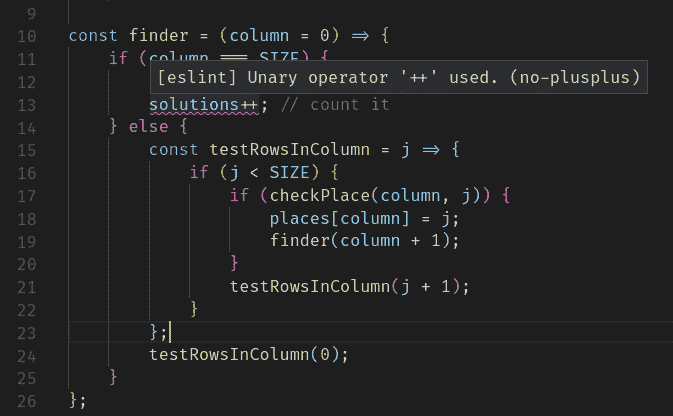

ESLint 插件在实时显示代码问题

`ESLint`的配置项非常少；我只使用了一个`"eslint.alwaysShowStatus": true`，所以状态栏将显示`ESLint`是否已启用。

一个你可以考虑的有趣的包是 web `DeepScan`工具，网址为[`deepscan.io/home/`](https://deepscan.io/home/)。`DeepScan`被宣传为*超越 Lint*，因为它还可以检测与隐式类型转换、空检查、不可达代码等有关的运行时问题。目前，`DeepScan`被认为处于测试阶段，尚无付费计划。你可以在开源项目中免费使用它；例如，你可以在 GitHub 项目中自动使用它。

# 为数据类型检查添加 Flow

让我们通过考虑一个将 JS 转换为（一种新的）语言的工具来结束本章。JS 的特点之一是无类型；例如，变量可以保存任何类型的值，函数可以返回任何类型的值，没有办法声明变量应该存储哪种类型的值，或者函数应该返回哪种类型的值。在本节中，我们将添加由 Facebook 开发的工具`Flow`，它允许进行数据类型控制。

Angular 开发人员不使用`Flow`，而是选择`TypeScript`。（好吧，不仅仅是 Angular 开发人员；您几乎可以在任何地方使用`TypeScript`！）这个 JS 的版本是由微软开发的，也包括数据类型，风格与`Flow`非常相似。`TypeScript`有自己的转换器，您不需要`Babel`或`Flow`，因此配置会简单一些。您将使用`TSLint`而不是`ESLint`，但您不需要放弃 ESLint 的规则：安装`tslint-eslint-rules`；（请参阅[`github.com/buzinas/tslint-eslint-rules`](https://github.com/buzinas/tslint-eslint-rules)），您将获得两全其美。

我们将在第二章的*添加类型*部分中全面介绍如何使用`Flow`，但让我先给您一个预览；然后，我们将安装所有所需的包，然后我们将进一步了解更多细节。假设您编写了一个非常复杂的函数来添加两个数字：

```js
function addTwoNumbers(x, y) {
    return x + y;
}

console.log(addTwoNumbers(22, 9)); // 31, fine
```

然而，由于 JS 不会检查类型并且具有一些转换规则，以下两行也可以工作：

```js
console.log(addTwoNumbers("F", "K")); // FK - oops..*.*
console.log(addTwoNumbers([], {}));   // [object Object]! more oops...
```

原则上，您可以向函数添加大量数据类型检查代码来验证`typeof(x)==="number"`，但这可能会变得很繁琐。（当然，对于某些情况，这是唯一的解决方案。）然而，许多错误可以在运行代码之前被检测到，就像这里发生的情况一样。

如果您修改函数以包含数据类型声明，`Flow`将能够检测到两个错误的使用，并且您将能够在运行代码之前解决这种情况：

```js
function addTwoNumbers(x: number, y: number) {
    return x + y;
}
```

基本上就是这样！当然，关于可用的数据类型、定义新数据类型、使用接口等细节有很多，但我们将在下一章中介绍。目前，让我们安装它，并承诺我们很快会了解更多关于它的用法。

# 操作步骤如下…

安装`Flow`取决于您是否正在使用`Babel`（例如客户端浏览器代码的情况）或不使用（例如服务器端代码的情况）。我们将在第三章中看到如何处理`Node`；在这里，我们只考虑 Babel。

首先，执行以下命令来获取所需的 Flow 包，包括 Babel 和 ESLint 包：

```js
npm install flow-bin babel-preset-flow eslint-plugin-flowtype --save-dev
```

然后，在`package.json`中添加`"flow"`预设为 Babel：

```js
"babel": {
    "presets": ["env", "flow"] 
},
```

还要在`package.json`中的`ESLint`配置中添加一些行：

```js
"eslintConfig": {
    "parserOptions": {
        "ecmaVersion": 2017,
        "sourceType": "module"
    },
    "env": {
        "browser": true,
        "node": true
    },
 "parser": "babel-eslint",
 "extends": ["eslint:recommended", "plugin:flowtype/recommended"],
 "plugins": ["flowtype"],
    "rules": {
        .
        .
        .
    }
},
```

在`package.json`中添加一个`"flow"`脚本：

```js
"scripts": {
    "build": "babel src -d out",
    "flow": "flow",
    .
    .
    .
},
```

最后，执行`npm run flow init`来初始化`Flow`，只需一次，以创建一个包含`Flow`进程将使用的信息的`.flowconfig`文件。（有关此文件的更多信息，请参见[`flow.org/en/docs/config/`](https://flow.org/en/docs/config/)。）

`.flowconfig`文件实际上并不符合其他配置文件的风格，应该是一个 JSON 文件，可能是`package.json`的一部分。然而，这仍然是一个未决事项；您可以查看[`github.com/facebook/flow/issues/153`](https://github.com/facebook/flow/issues/153)来监控进展，但目前，您将不得不处理`.flowconfig`。

# 工作原理…

通过您刚刚编写的配置，您已经准备好了！每当开始工作时，只需执行`npm run flow`，就可以运行一个后台进程，逐步检查您的代码，并让您了解可能的数据类型问题。但是，如果您使用 VSC，甚至可以跳过此步骤；请参见下一节。

# 配置 Flow 的 linting

尽管`ESLint`已经很好地帮助我们避免 JS 的不良编码实践，但它在数据类型方面做得不多，但`Flow`可以帮助我们在这方面。

您可以应用一组规则，并且可以通过我们在上一节中提到的`.flowconfig`文件进行配置：

```js
[lints]
all=warn
unsafe-getters-setters=off
```

第一行`all=warn`是一个*全局设置*，定义了所有规则的标准设置；可能的值为`off`，`warn`和`error`。之后，您可以为单个规则指定设置；例如，在前面的代码中，我决定忽略有关不安全的 getter 或 setter 的警告。一些规则如下：

+   `sketchy-null`，每当您测试可能为 false 的变量的值（例如零），但也为 null 或未定义时，例如在`if (x) { ... }`的上下文中。此警告旨在提醒您变量可能具有您未考虑的值。

+   `sketchy-null-bool`，`sketchy-null-number`，`sketchy-null-string`和`sketchy-null-mixed`是`sketchy-null`的更细粒度版本，并且仅适用于指定的数据类型。

+   `unclear-type`警告使用`any`，`Object`或`Function`作为数据类型注释。

+   `untyped-import`和`untyped-type-import`警告您不要从未输入类型的文件中导入。

+   `unsafe-getters-setters`建议不要使用 getter 或 setter，因为它们会产生副作用。

阅读完整的当前`Flow` linting 规则集，网址为[`flow.org/en/docs/linting/rule-reference/`](https://flow.org/en/docs/linting/rule-reference/)，您还将在其中找到每个规则的示例。

您还应将`include_warnings`设置为`true`，以便能够在 VSC 中获得警告：

```js
[options]
include_warnings=true
```

无论您在`.fontconfig`中包含哪些设置，都将全局应用于整个项目，但您也可以按文件或甚至按代码行进行更改，与 ESLint 类似。您可以通过使用`flowlint-next-line`注释和列出要更改的规则来禁用一行的警告：

```js
// flowlint-next-line sketchy-null-bool:off
if (x) {
    // ...
} 
```

还有另一个注释`flowlint`，适用于整个文件。查看[`flow.org/en/docs/linting/flowlint-comments/`](https://flow.org/en/docs/linting/flowlint-comments/)以获取更多可能性。

# 在 VSC 中使用 Flow

与以前一样，我们希望在 VSC 中直接查看`Flow`问题。有一个简单的解决方案：只需转到扩展，搜索`Flow Language Support`，并安装该软件包；就是这样！

您还必须更改 VSC 的两个设置：

+   添加`"flow.useNPMPackagedFlow": true`，这将消除在开始时执行`npm run flow`的需要；扩展将自行执行此操作

+   添加`"javascript.validate.enable": false`以避免 Flow 的语法与 JS 之间的冲突

之后，您将能够在屏幕上看到`Flow`错误；请参阅以下屏幕截图以了解示例：

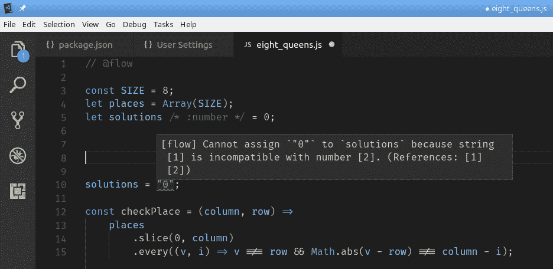

VSC Flow 扩展允许您实时捕获数据类型错误；但是，错误消息并不总是非常清晰
