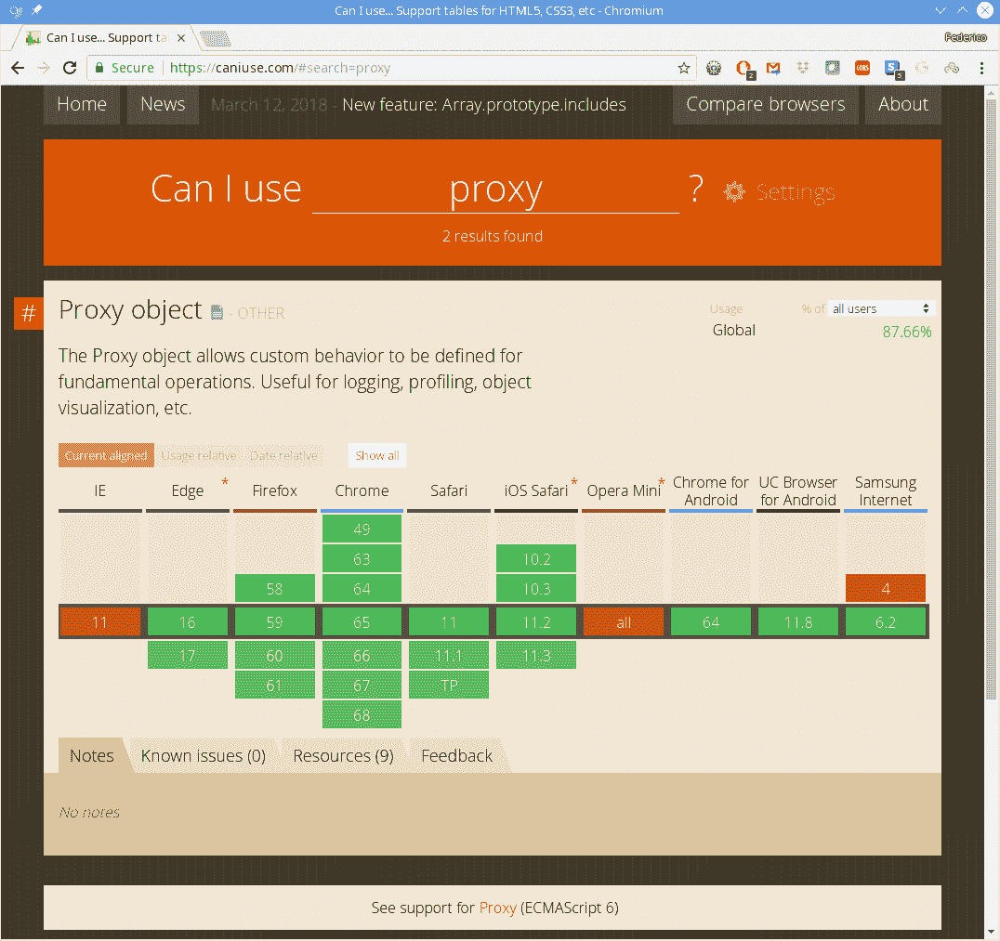

# 第二章：使用现代 JavaScript 特性

本章我们将涵盖的食谱如下：

+   添加类型

+   处理字符串

+   增强您的代码

+   定义函数

+   函数式编程

+   紧凑地进行异步调用

+   处理对象和类

+   在模块中组织代码

+   确定功能的可用性

# 介绍

在上一章中，我们使用了许多工具来设置我们的工作环境，这些工具将贯穿本书的整个过程。在本章中，我们将为本书的其余部分做好准备，并考虑一些有趣和强大的现代 JavaScript 特性，可以帮助您更有效地编写更好的代码。

我们将考虑一些新的语言特性，这些特性将会很方便，但肯定不是所有！JS 确实已经发展成为一门大语言，有一些特性您可能永远不会需要。从一开始，我们也将更认真地使用`Flow`，旨在放弃使用*无类型 JS*，以更安全地开发代码。

重要的是要强调 JS 已经在这些年里发展了，并且没有一个单一的标准版本。最近的一个版本（正式上）被称为 ECMAScript 2018，通常缩写为 ES2018。语言的当前版本列表如下：

+   ECMAScript 1，1997 年 6 月

+   ECMAScript 2，1998 年 6 月，基本上与上一个版本相同

+   ECMAScript 3，1999 年 12 月，添加了几个新功能

+   ECMAScript 5，2009 年 12 月（从未有过 ECMAScript 4；那个版本被放弃了），也称为 JS5

+   ECMAScript 5.1，2011 年 6 月

+   ECMAScript 6（ES2015 或 ES6），2015 年 6 月

+   ECMAScript 7（ES2016），2016 年 6 月

+   ECMAScript 8（ES2017），2017 年 6 月

+   ECMAScript 9（ES2018），2018 年 6 月

**ECMA** 最初是欧洲计算机制造商协会的首字母缩写，但现在这个名字被认为是一个独立的名字。您可以访问它的网站[`www.ecma-international.org/`](https://www.ecma-international.org/)，并在[`www.ecma-international.org/publications/standards/Ecma-262.htm`](https://www.ecma-international.org/publications/standards/Ecma-262.htm)上查看标准语言规范。

每当我们在本文中提到 JS 而没有进一步的规定时，我们指的是最新版本（即 ES2018）。没有浏览器完全实现这个版本，在本书的后面，我们将通过使用`Babel`来解决这个问题，这是一个工具，可以将现代特性转换为等效的、但更老的和兼容的代码，因此即使您以最新的方式编程，使用较旧的浏览器的用户仍然能够运行您的代码。我们将使用的工具将自行安装`Babel`，因此我们不需要这样做，但如果您感兴趣，可以在[`babeljs.io/`](https://babeljs.io/)上阅读更多信息。

所有与 JS 相关的很好的来源是**Mozilla 开发者网络**（**MDN**），它已经有十多年的各种网络文档。请访问他们的网站[`developer.mozilla.org/bm/docs/Web/JavaScript`](https://developer.mozilla.org/bm/docs/Web/JavaScript)；我们将经常参考它。您还可以阅读[`es6-features.org/`](http://es6-features.org/)，了解 ES6 功能的丰富示例。

# 添加类型

在上一章中，我们安装了`Flow`，以便我们可以为 JS 添加数据类型检查，但我们并没有真正涉及其语法或规则。让我们现在进入这个话题，然后再进入 JS 特定的功能。

# 入门

```js
Flow will ignore any files that lack this comment, so even if you were adding the tool to an already existing project, you could do it gradually, adding files one at a time:
```

```js
/* @flow */
```

从 Flow 的控制开始，您只需指定您期望任何变量的数据类型，`Flow`将检查它是否始终被正确使用。幸运的是，`Flow`也能够通过值确定数据类型；例如，如果您将一个字符串赋给一个变量，它将假定这个变量是用来包含字符串的。从[`flow.org/en/docs/usage/`](https://flow.org/en/docs/usage/)中调整一个例子，您可以写如下内容：

```js
/* @flow */

function foo(x: ?number): string {
    if (x) {
        return x;
    } else {
        return "some string";
    }
}

console.log(foo("x"));
```

`:?number`和`:string`注释指定`x`是一个可选的数值参数，并且`foo`应该返回一个字符串。您能看到代码的其余部分有两个问题吗？如果您使用`npm run flow`，您将得到一个报告，显示问题所在。首先，您不能`return x`，因为变量和预期返回值之间的数据类型不匹配：

```js
Error ------------------------------------------------------------------------------------- src/types_examples.js:5:16

Cannot return x because number [1] is incompatible with string [2].

        2│
 [1][2] 3│ function foo(x /* :?number */) /* :string */ {
        4│     if (x) {
        5│         return x;
        6│     } else {
        7│         return 'some string';
        8│     }
```

其次，您正在尝试调用一个函数，但传递了错误类型的参数：

```js

Error------------------------------------------------------------------------------------- src/types_examples.js:12:17

Cannot call foo with 'x' bound to x because string [1] is incompatible with number [2].

  [2] 3│ function foo(x /* :?number */) /* :string */ {
 :
 9│ }
 10│
 11│ // eslint-disable-next-line no-console
 [1] 12│ console.log(foo('x'));
 13│
```

前面的所有代码（除了类型声明）都是有效的 JS 代码，因此它将被接受；`Flow`会告诉您问题所在，以便您可以解决它们。现在，让我们更详细地了解一下，看看这个工具给我们提供了所有的可能性。

如果您想忽略`Flow`对任何行的警告，请在其前面加上注释，如`// @FlowFixMe`，并在后面说明为什么要跳过该情况。有关更多信息，请参阅[`flow.org/en/docs/config/options/#toc-suppress-comment-regex`](https://flow.org/en/docs/config/options/#toc-suppress-comment-regex)。

# 如何做...

有许多种方法来定义类型，以便您可以处理简单和复杂的情况而不会出现问题。让我们从更简单的基本类型开始，然后再转向更具体的情况。

# Flow 中的基本类型

可以在[`flow.org/en/docs/types/`](https://flow.org/en/docs/types/)找到可能的数据类型定义——我们不会在这里全部复制，而是通过一些示例向您展示主要的数据类型。请查看完整的文档，因为有许多可能性，您应该了解：

| `:boolean` | 布尔值。 |
| --- | --- |
| `:number` | 数值。 |
| `:string` | 字符串。 |
| `:null` | 空值。您不仅会声明某个变量应该始终为 null；而是，您将与高级*联合*类型一起使用这些，我们将在下一节中看到。 |
| `:void` | 空（未定义）值。 |
| `:mixed` | 任何类型，但仍会进行一致性检查。例如，如果在某一点`Flow`知道变量是布尔值，那么将其用作字符串将被标记为错误。 |
| `:any` | 任何类型，`Flow`不会对其进行任何检查。这相当于在任何*类型的任何*上禁用类型检查。 |
| `function foo(x: ?boolean)` | 一个带有可选`boolean`参数的函数。这与声明参数可以是`boolean`、`null`或`undefined`是一样的。 |
| `function bar() :string` | 返回字符串结果的函数。 |
| `{ property ?: number }` | 可选的对象属性；如果存在，它可以是数字或未定义，但不能是`null`。 |
| `: Array&lt;number>` `: number[]` | 两种不同风格的数字数组。如果您想处理固定长度的数组，*元组*可能适用；请访问[`flow.org/en/docs/types/tuples/`](https://flow.org/en/docs/types/tuples/)了解更多信息。 |

我们将在本章后面的*为箭头函数定义类型*中找出如何为这些定义分配或定义类型。

我们可以在以下代码中看到一些定义的示例。我禁用了 ESLint 关于未使用变量的规则，以避免明显的问题：

```js
// Source file: src/types_basic.js

/* @flow */
/* eslint-disable no-unused-vars */

let someFlag: boolean;
let greatTotal: number;
let firstName: string;

function toString(x: number): string {
    return String(x);
}

function addTwo(x: number | string, y: number | string) {
    return x + y;
}

function showValue(z: mixed): void {
    // not returning anything
    console.log("Showing... ", z);
}

let numbersList: Array&lt;number>;
numbersList = [22, 9, 60]; // OK
numbersList[1] = "SEP"; // error; cannot assign a string to a number

let anotherList: number[] = [12, 4, 56];

// *continues...*
```

`addTwo()`的定义存在一个隐藏的问题：您确定`x`和`y`始终是相同类型吗？实际上，`x`可以是一个数字，`y`可以是一个字符串，`Flow`不会抱怨。我们没有简单的方法来测试这一点，需要运行时检查`typeof x === typeof y`。

当您定义一个对象时，应为其所有属性和方法提供数据类型。对象定义被认为是*sealed*，这意味着您不能更改对象类型。如果您不能或不想这样做，请从一个空对象开始，然后`Flow`将允许您随意添加属性： 

```js
// *...continued*

let sealedObject: { name: string, age?: number } = { name: "" };

sealedObject.name = "Ivan Horvat"; // OK

sealedObject.id = 229; // error: key isn't defined in the data type 
sealedObject = { age: 57 }; // error: mandatory "name" field is missing

let unsealedObject = {};
unsealedObject.id = 229; // OK
```

如果一个函数期望一个带有一些属性的对象，并且它接收到一个带有这些属性以及一些额外属性的对象，`Flow`不会报错。如果你不想要这样，可以使用*exact objects*；参见[`flow.org/en/docs/types/objects/#toc-exact-object-types`](https://flow.org/en/docs/types/objects/#toc-exact-object-types)。然而，这也会导致问题，比如禁用 spread 操作符；参见[`github.com/facebook/flow/issues/2405`](https://github.com/facebook/flow/issues/2405)进行（长达两年的）讨论。

现在，让我们转向更复杂的定义，你可能最终会使用它们，因为它们更符合通常的业务需求和程序规范。

# 联合类型

上一节的基本定义可能足够用于大量的代码，但是当你开始处理更复杂的问题时，你将需要一些更高级的`Flow`特性，并且你可能希望单独定义类型，以便在其他地方重用它们。因此，在本节和接下来的几节中，我们将看一些更高级的类型。

在 JS 中，一个变量可能在不同的时间具有不同的数据类型是很常见的。对于这种情况，你可以使用*union* *types*：

```js
// Source file: src/types_advanced.js

let flag: number | boolean;
flag = true; // OK
flag = 1; // also OK
flag = "1"; // error: wrong type

let traffic: "red" | "amber" | "green"; // traffic is implicitly string
traffic = "yellow"; // error: not allowed

type numberOrString = number | string;
function addTwo(x: numberOrString, y: numberOrString) {
    return x + y;
}

// *continues...*
```

在某些情况下，你可能有对象，这些对象根据某些内部值具有不同的属性，你也可以使用*disjoint* unions；参见[`flow.org/en/docs/types/unions/`](https://flow.org/en/docs/types/unions/)。

# 类类型

`Flow`支持类，并且大部分是自动的。每当你定义一个类，它就成为一个独立的类型，所以你不需要做其他任何事情；你可以在其他地方直接使用它。（我们将在不久的将来在*使用对象和类*部分中更多地了解类。）你可以像为对象和函数一样为属性和方法分配类型。再次以`Person`类为例，以下代码展示了如何在`Flow`中定义它：

```js
// Source file: src/types_advanced.js

class Person {
 // *class fields need Flow annotations*
 first: string;
 last: string;

    constructor(first: string, last: string) {
        this.first = first;
        this.last = last;
    }

    initials(): string {
        return `${this.first[0]}${this.last[0]}`;
    }

    fullName(): string {
        return `${this.first} ${this.last}`;
    }

    get lastFirst(): string {
        return `${this.last}, ${this.first}`;
    }

    set lastFirst(lf: string) {
        // *very unsafe; no checks!*
        const parts = lf.split(",");
        this.last = parts[0];
        this.first = parts[1];
    }
}

let pp = new Person("Jan", "Jansen"); // *OK*
let qq = new Person(1, 2); // ***error: wrong types for the constructor***
let rr: Person; // *OK, "Person" type is understood and can be used* 
```

然而，你可能会遇到一个问题。如果你有不同的类，即使它们的形状完全相同，`Flow`也不会认为它们是等价的。例如，即使`Animal`和`Pet`是等价的，也不允许将`Pet`赋值给`Animal`（反之亦然）：

```js
// Source file: src/types_advanced.js

class Animal {
 name: string;
 species: string;
 age: number;
}

class Pet {
 name: string;
 species: string;
 age: number;
}

let tom: Animal;
tom = new Pet(); // error: *Pet and Animal are distinct types*
```

在这种特殊情况下，如果你说`Pet`扩展`Animal`，那么你可以将`Pet`赋值给`Animal`，但反过来不行。一个更一般的解决方案将涉及创建一个`interface`并在多个地方使用它：

```js
// Source file: src/types_advanced.js interface AnimalInt {
 name: string;
 species: string;
 age: number;
}

class Animal2 implements AnimalInt {
 name: string;
 species: string;
 age: number;
}

class Pet2 implements AnimalInt {
 name: string;
 species: string;
 age: number;
}

let tom2: AnimalInt; // *not Animal2 nor Pet2*
tom2 = new Pet2(); // *OK now*
```

请注意，包括三个字段的`interface`定义并不意味着在定义`Animal2`或`Pet2`时免除你声明这些字段；事实上，如果你忘记了其中一些字段，`Flow`会指出错误，因为这三个字段都没有标记为可选的。

# 类型别名

当你的类型变得更加复杂，或者当你想要在多个地方重用相同的定义时，你可以创建一个类型别名：

```js
// Source file: src/types_advanced.js

type simpleFlag = number | boolean;

type complexObject = {
 id: string,
 name: string,
 indicator: simpleFlag,
 listOfValues: Array&lt;number>
};
```

在这种方式中定义类型之后，你可以在任何地方使用它们，甚至在定义新类型时也可以，就像我们在`complexObject`中定义字段为之前定义的`simpleFlag`类型一样：

```js
// Source file: src/types_advanced.js

let myFlag: simpleFlag;

let something: complexObject = {
 id: "B2209",
 name: "Anna Malli",
 indicator: 1,
 listOfValues: [12, 4, 56]
};
```

类型别名甚至可以是泛型的，我们将在下一节中看到。你还可以从一个模块中导出类型，并在任何地方导入它们进行使用；我们将在*使用库*部分讨论这个问题。

# 泛型类型

在函数式编程中，通常会使用`identity`函数，它的定义如下：

```js
// Source file: src/types_advanced.jsconst identity = x => x;
```

在组合逻辑中，这对应于 I *combinator*。

你如何为这个函数编写类型定义？如果参数是一个数字，它将返回一个数字；如果是一个字符串，它将返回一个字符串，依此类推。写出所有可能的情况将是一件苦差事，也不太符合**不要重复自己**（***DRY**）。`Flow`提供了一个解决方案，使用*泛型类型*：

```js
// Source file: src/types_advanced.js

const identity = &lt;T>(x: T): T => x;
```

在这种情况下，`T`代表通用类型。函数的参数和函数本身的结果都被定义为`T`类型，因此`Flow`将知道参数的类型是什么，结果类型也将是相同的。对于更常见的定义函数的方式，将使用类似的语法：

```js
// Source file: src/types_advanced.jsfunction identity2&lt;T>(x: T): T {
    return x;
}
```

`Flow`还会检查您是否意外地限制了通用类型。在以下情况下，您将始终返回一个数字，而`T`实际上可能是任何其他不同的类型：

```js
// Source file: src/types_advanced.jsfunction identity3&lt;T>(x: T): T {
    return 229; // *wrong; this is always a number, not generic*
*}*
```

您不必限制自己只使用单个通用类型；以下荒谬的例子显示了两种类型的情况：

```js
// Source file: src/types_advanced.js

function makeObject&lt;T1, T2>(x: T1, y: T2) {
    return { first: x, second: y };
}
```

还可以使用带有通用类型的参数化类型，稍后可以对其进行指定。在以下示例中，对于`pair`的类型定义允许您进一步创建新类型，每种类型将始终生成相同类型的值对：

```js
// Source file: src/types_advanced.js

type pair&lt;T> = [T, T];

type pairOfNumbers = pair&lt;number>;
type pairOfStrings = pair&lt;string>;

let pn: pairOfNumbers = [22, 9];

let ps: pairOfStrings = ["F", "K"];
```

您还可以使用通用类型的更多方式；请查看[`flow.org/en/docs/types/generics/`](https://flow.org/en/docs/types/generics/)，了解可用可能性的完整描述。

# 不透明类型用于更安全的编码

在`Flow`（以及 TypeScript）中，结构上相同的类型被认为是兼容的，可以使用其中一个来代替另一个。让我们考虑一个例子。在乌拉圭，有一张带有 DNI 代码的国民身份证：这是一个由七位数字、一个破折号和一个检查位组成的字符串。您可以有一个应用程序，让您更新人们的数据：

```js
// Source file: src/opaque_types.js

type dniType = string;
type nameType = string;

function updateClient(id: number, dni: dniType, name: nameType) {
    /*
        *Talk to some server*
 *Update the DNI and name for the client with given id*
    */
}
```

会发生什么？如果您没有定义更好的类型，那么您可能会执行诸如`updateClient(229, "Kari Nordmann", "1234567-8")`这样的调用；您能发现交换的值吗？由于`dniType`和`nameType`都只是底层字符串，即使它们暗示完全不同的概念，`Flow`也不会抱怨。`Flow`确保类型的正确使用，但由于它不处理语义，因此您的代码仍然可能显然错误。

不透明类型是不同的，因为它们从外部隐藏了内部实现细节，并且具有更严格的兼容性规则。您可以有一个名为`opaque_types.js`的文件，其中包含以下定义：

```js
// Source file: src/opaque_types.js opaque type dniType = string;
type nameType = string; // *not opaque!*
```

然后，在另一个源文件中，我们可以尝试以下操作：

```js
// Source file: src/opaque_usage.js

import type { dniType, nameType } from "./opaque_types";
import { stringToDni } from "./opaque_types";

let newDni = "1234567-8"; // *supposedly a DNI*
```

```js
let newName = "Kari Nordmann";

updateClient(229, newName, newDni); // *doesn't work; 2nd argument should be a DNI*
updateClient(229, newDni, newName); // *doesn't work either; same reason*
```

我们如何解决这个问题？即使更改`newDni`的定义也无济于事：

```js
let newDni: dniType = "1234567-8"; // *a string cannot be assigned to DNI*
```

即使在进行此更改后，`Flow`仍然会抱怨字符串不是 DNI。当我们使用不透明类型时，如果我们想要进行类型转换，我们必须自己提供。在我们的情况下，我们应该在我们的类型定义文件中添加这样的函数：

```js
// Source file: src/opaque_types.js

const stringToDni = (st: string): dniType => {
    /*
    *    do validations on st*
 *if OK, return a dniType*
 *if wrong, throw an error*
    */
    return (st: dniType);
};

export { stringToDni };
```

现在，我们可以开始工作了！让我们看看代码：

```js
// Source file: src/opaque_usage.js

updateClient(229, stringToDni(newDni), newName); // *OK!*
```

这仍然不是最佳的。我们知道所有 DNI 值都是字符串，所以我们应该能够将它们用作字符串，对吧？事实并非如此：

```js
// Source file: src/opaque_usage.js

function showText(st: string) {
    console.log(`Important message: ${st}`);
}

let anotherDni: dniType = stringToDni("9876543-2");
showText(anotherDni); // error!
```

`anotherDni`变量是`dniType`，但是由于不透明类型不包含有关真实类型的信息，因此尝试将其用作`string`会失败。当然，您可以编写一个`dniToString()`函数，但这似乎有些过度——在一个潜在包含数十种数据类型的系统中，这种方式很快就会失控！我们有一个备选方案：我们可以添加一个子类型约束，这将允许将不透明类型用作不同的类型：

```js
// Source file: src/opaque_types.js

opaque type dniType : string = string;
```

这意味着`dniType`可以用作`string`，但反之则不行。使用不透明类型将增加代码的安全性，因为将捕获更多的错误，但通过这些约束也可以获得一定程度的灵活性，这将使您的生活更轻松。

# 使用库

今天，您创建的任何项目都很可能依赖于第三方库，而且很可能这些库并不是用`Flow`编写的。默认情况下，`Flow`将忽略这些库，并且不会进行任何类型检查。这意味着您在使用库时可能会犯任何数据类型错误，这些错误将不会被识别，您将不得不通过测试和调试来处理它们——这是一个倒退到更糟糕时代的现象！

为了解决这个问题，`Flow`让您使用**库定义**（**libdefs**）（请参阅[`flow.org/en/docs/libdefs/`](https://flow.org/en/docs/libdefs/)）来描述库的数据类型、接口或类，与库本身分开，就像 C++和其他语言中的头文件一样。Libdefs 是`.js`文件，但它们放在项目根目录下的`flow-typed`目录中。

您可以通过编辑`.flowconfig`配置文件来更改此目录，但我们不会干涉它。如果您有兴趣进行这样的更改，请参阅[`flow.org/en/docs/config/`](https://flow.org/en/docs/config)上的`[libs]`文档。

存在一个库定义的存储库`flow-typed`，在其中您可以找到许多流行库的已经制作好的文件；有关更多信息，请参阅[`github.com/flowtype/flow-typed`](https://github.com/flowtype/flow-typed)。但您不需要直接处理它，因为有一个工具可以为您完成这项工作，尽管有时它会把责任推给您！

这些天对`Flow`的主要反对意见，以及 TypeScript 的一个观点，是在数据类型描述方面，对于后者来说，支持的库列表要大得多。有一些项目试图使`Flow`与 TypeScript 的描述一起工作，但到目前为止，这仍然是悬而未决的，尽管已经显示了一些良好的结果。

首先，安装新工具：

```js
npm install flow-typed --save-dev
```

然后，在`package.json`中添加一个脚本来简化工作：

```js
scripts: {
    .
    .
    .
    addTypes: "flow-typed install",
    .
    .
    .
```

使用`npm run addTypes`将扫描您的项目并尝试添加所有可能的 libdefs。如果它找不到库的适当定义（很抱歉，这并不罕见），它将在所有地方使用`any`创建一个基本定义。例如，我将`moment`库添加到项目中：

```js
> npm install moment --save
> npm run addTypes
```

之后，`flow-typed`目录被添加到项目根目录。在其中，出现了许多文件，包括`moment_v2.3.x.js`，其中包含了`moment`库的类型定义。对于没有 libdef 的库，也创建了文件，但您可以忽略它们。

如果您需要一个 libdef，但它不存在，您可能可以自己创建它。（并且，请将您的工作贡献给`flow-typed`项目！）我添加了`npm install fetch --save`，但当我尝试获取 libdef 时，它找不到。因此，我可以继续在没有定义的情况下工作（标准情况！），或者我可以尝试创建适当的文件；没有一个真正是最佳情况。

我建议将`flow-typed`目录添加到`.gitignore`中，以便这些文件不会上传到 Git。因为每次从存储库中拉取时都要执行`npm install`是标准做法，现在您还必须使用`npm run addTypes`——或者更好的是，创建一个将执行这两个命令的脚本！

# 处理字符串

自从第一个版本以来，字符串一直是 JS 的一个特性，但现在有一些更多的功能可用。

# 如何做...

在接下来的章节中，我们将看到许多函数，我们将在本书的其余部分中使用这些函数，例如插值（从几个部分构建字符串）或标记字符串（我们将在第七章的*为内联样式创建 StyledComponents*部分中使用它们来为组件设置样式），这只是两个例子。

# 在模板字符串中插值

每个人都曾经使用常见的运算符来构建字符串，就像下面的代码片段一样：

```js
let name = lastName + "," + firstName;
let clientUrl = basicUrl + "/clients/" + clientId + "/";
```

JavaScript 现在已经添加了*模板文字*，提供了一种简单的方法来包含变量文本并生成多行字符串。字符串插值非常简单，前面的代码可以重写如下：

```js
let name = `${lastName}, ${firstName}`;
let clientUrl = `${basicUrl}/clients/${clientId}/`;
```

模板文字以前被称为*模板字符串*，但当前的 JS 规范不再使用该表达式。有关更多信息，请访问[`developer.mozilla.org/en-US/docs/Web/JavaScript/Reference/Template_literals`](https://developer.mozilla.org/en-US/docs/Web/JavaScript/Reference/Template_literals)。

模板文字由反引号字符（``...``）界定。您可以在任何需要替换值或表达式的地方使用`${...}`：

```js
let confirm = `Special handling: ${flagHandle ? "YES" : "NO"}`;
```

当插值时，当然很容易过度并开始推送太多逻辑。出于这个原因，我建议避免以下代码：

```js
let list = ["London", "Paris", "Amsterdam", "Berlin", "Prague"];
let sched = `Visiting ${list.length > 0 ? list.join(", ") : "no cities"}`;
// Visiting London, Paris, Amsterdam, Berlin, Prague
```

如果`list`为空，将生成`"访问没有城市"`。如果将逻辑推出模板，将会更清晰；即使生成的代码有点大，也会在清晰度上获得优势：

```js
let list = ["London", "Paris", "Amsterdam", "Berlin", "Prague"];
let destinations = list.length > 0 ? list.join(", ") : "no cities";
let sched = `Visiting ${destinations}`;
```

我们将在以后的模板中避免在`React`中包含逻辑，（从第六章的*使用 React 开发*到第十章的*测试您的应用程序*），并看看如何渲染组件。

# 标记模板

标记模板是模板的更高级形式，我们一直在看。基本上，这是另一种调用函数的方式，但语法类似于模板字符串。让我们看一个例子，然后解释一下：

```js
// Source file: src/tagged_templates.js function showAge(strings, name, year) {
    const currYear = new Date().getFullYear();
    const yearsAgo = currYear - year;
    return (
        strings[0] + name + strings[1] + year + `, ${yearsAgo} years ago`
    );
}

const who = "Prince Valiant";
const when = 1937;
const output1 = showAge`The ${who} character was created in ${when}.`;
console.log(output1);
// *The Prince Valiant character was created in 1937, 81 years ago*

const model = "Suzuki";
const yearBought = 2009;
const output2 = showAge`My ${model} car was bought in ${yearBought}`;
console.log(output2);
// *My Suzuki car was bought in 2009, 9 years ago*
```

`showAge()`函数被以下方式调用：

+   一个字符串数组，对应于模板的每个常量部分，因此在第一个案例中，`strings[0]`是`The`，`strings[2]`是`.`

+   每个表达式都包含一个参数；在我们的例子中，有两个

该函数可以进行任何计算并返回任何类型的值——可能不是字符串！在我们的例子中，该函数生成原始字符串的*增强*版本，添加了多少年前发生的事情——例如，漫画角色被创建或购买汽车。

我们将在第七章的*为内联样式创建 StyledComponents*部分中使用标记模板，*增强您的应用程序*；我们将使用的 styled-component 库完全依赖于此功能，以实现更可读的代码。

# 编写多行字符串

新模板文字的另一个特性是它们可以跨越多行。在 JS 的早期版本中，如果要生成多行文本，您必须在输出字符串中插入换行字符（`"\n"`），如下所示：

```js
let threeLines = "These are\nthree lines\nof text";
console.log(threeLines);
// *These are*
// *three lines*
// *of text*
```

使用模板字符串，您可以按照所需的方式编写该行：

```js
let threeLines = `These are
three lines
of text`;
```

但是，我建议不要这样做。即使代码可能看起来更易读，但当它缩进时，结果看起来很丑陋，因为续行*必须*从第一列开始——您明白为什么吗？看看以下代码——续行被推到了左边，打破了缩进代码的视觉连续性：

```js
if (someCondition) {
    .
    .
    .
    if (anotherCondition) {
        .
        .
        .
        var threeLines = `These are
three lines
of text`;
    }
}
```

您可以使用反斜杠来转义不应成为模板的一部分的字符：

```js
let notEscaped1 = `this is \$\{not\} interpolation\\nright? `;
// *"this is ${not} interpolation\nright? "*
```

您可能想了解`String.raw`（请参阅[`developer.mozilla.org/en-US/docs/Web/JavaScript/Reference/Global_Objects/String/raw`](https://developer.mozilla.org/en-US/docs/Web/JavaScript/Reference/Global_Objects/String/raw)）作为避免模板化的替代方法。您可以完全避免模板化，因为一项非正式调查显示，几乎没有开发人员知道它，而且它并不是一个很大的优势。

# 重复字符串

让我们以几个新的与字符串相关的函数结束。大多数都很容易理解，因此解释大多数都会很简短。有关所有可用字符串函数的完整列表，请参阅[`developer.mozilla.org/en-US/docs/Web/JavaScript/Reference/Global_Objects/String`](https://developer.mozilla.org/en-US/docs/Web/JavaScript/Reference/Global_Objects/String)。

您可以使用`.repeat(...)`方法迭代任何字符串：

```js
"Hello!".repeat(3); // Hello!Hello!Hello!
```

# 填充字符串

您可以通过使用`.padStart(...)`和`.padEnd(...)`在原始文本的左侧或右侧添加重复的字符串来将字符串填充到给定长度：

```js
"Hello".padStart(12);       // "       Hello"
"Hello".padStart(12,"XYZ"); // "XYZXYZXHello"
"Hello".padStart(3);        // "Hello"; no effect here

"Hello".padEnd(12);         // "Hello       "
"Hello".padEnd(12,"XYZ");   // "HelloXYZXYZX"
"Hello".padEnd(4);          // "Hello"; no effect here either
```

在可能的用途中，您可以在数字左侧用零填充。我们必须将数字转换为字符串，因为填充方法仅适用于字符串：

```js
let padded = String(229.6).padStart(12, "0"); // "*0000000229.6*"
```

使用`padStart`和`padEnd`而不是`padLeft`和`padRight`的原因与从左到右和从右到左的语言有关。人们认为 start 和 end 不会产生歧义，而 left 和 right 会产生歧义。例如，在希伯来语中，字符串的开始在右侧打印，结束在左侧。

# 在字符串中搜索

有新的功能可以确定字符串是否以给定字符串开头，结尾或包含。这可以让你摆脱使用`indexOf(...)`和与长度相关的计算：

```js
"Hello, there!".startsWith("He"); // true
"Hello, there!".endsWith("!");    // true
"Hello, there!".includes("her");  // true
```

这些方法中的每一个都有一个位置作为可选的第二个参数，指定在哪里进行搜索；有关更多信息，请参阅[`developer.mozilla.org/en-US/docs/Web/JavaScript/Reference/Global_Objects/String/startsWith`](https://developer.mozilla.org/en-US/docs/Web/JavaScript/Reference/Global_Objects/String/startsWith)，[`developer.mozilla.org/en-US/docs/Web/JavaScript/Reference/Global_Objects/String/endsWith`](https://developer.mozilla.org/en-US/docs/Web/JavaScript/Reference/Global_Objects/String/endsWith)，和[`developer.mozilla.org/en-US/docs/Web/JavaScript/Reference/Global_Objects/String/includes`](https://developer.mozilla.org/en-US/docs/Web/JavaScript/Reference/Global_Objects/String/includes)。

# 修剪字符串

您可以通过使用`.trim(...)`，`.trimStart(...)`和`.trimEnd(...)`在两端或一端修剪字符串：

```js
"   Hello, there!  ".trim();      //    "*Hello, there!*"
"   Hello, there!  ".trimStart(); //    "*Hello, there!*  "
"   Hello, there!  ".trimEnd();   // "   *Hello, there!*"
```

最初，`.trimStart()`是`.trimLeft()`，而`.trimEnd()`是`.trimRight()`，但名称已更改，原因与`.padStart()`和`.padEnd()`相同。

# 遍历字符串

字符串现在是可迭代对象（例如数组），这意味着您可以使用`for...of`逐个字符地对它们进行迭代：

```js
for (let ch of "PACKT") {
    console.log(ch);
}
```

扩展运算符（在本章的*扩展和连接值*部分深入了解）也可以工作，因此将字符串转换为单个字符的数组：

```js
let letters = [..."PACKT"];
// ["P", "A", "C", "K", "T"]
```

# 增强您的代码

现在，让我们来看看 JS 的几个有用的新功能，这些功能与基本需求和特性有关。这不会是详尽无遗的，毕竟 JS 很大！但是，我们将涉及您可能会使用的最有趣的功能。

# 如何做...

本节中的功能没有共同的主题，除了它们将帮助您编写更短，更简洁的代码，并帮助您避免可能的常见错误。

# 在严格模式下工作

让我们从一个您可能不需要的更改开始！JS 对某些错误有些漫不经心，而不是警告或崩溃，它只是悄悄地忽略它们。2015 年，新增了一个*严格*模式，改变了 JS 引擎的行为，开始报告这些错误。要启用新模式，您必须在任何其他内容之前包含一行简单的字符串：

```js
"use strict";
```

包含此字符串将强制执行代码的严格模式。捕获了哪些错误？简要列表包括以下内容：

+   您不能意外创建全局变量。如果您在函数中拼错了变量的名称，JS 会创建一个新的全局变量并继续进行；在严格模式下，会产生一个错误。

+   您不能使用`eval()`来创建变量。

+   您不能有重复名称的函数参数，例如`function doIt(a, b, a, c)`。

+   您不能删除不可写对象属性；例如，您不能删除`someObject.prototype`。

+   您不能写入某些变量；例如，您不能执行`undefined=22`或`NaN=9`。

+   `with`语句是被禁止的。

+   一些单词（例如`interface`或`private`）被保留为 JS 未来版本的关键字。

上面的列表并不完整，还有一些更改和限制。有关完整详情，请阅读[`developer.mozilla.org/en-US/docs/Web/JavaScript/Reference/Strict_mode`](https://developer.mozilla.org/en-US/docs/Web/JavaScript/Reference/Strict_mode)。

你应该使用这个吗？对于你的主脚本，`"use strict"`是可选的，但对于模块和类，它是隐含的。因此，大多数代码将始终在严格模式下运行，所以你真的会习惯包含那个字符串。也就是说，如果你使用`Babel`，转译器已经为你提供了所需的字符串。另一方面，Node 的模块将需要它，我们将在下一章中看到。

# 变量作用域

*作用域*的概念与*可见性*的概念相关联：作用域是定义元素（如变量或函数）可以被引用或使用的上下文。经典上，JS 只提供了两种类型的作用域：*全局*作用域（可在任何地方访问）和*函数*作用域（只能在函数内部访问）。由于作用域从 JS 开始就存在，让我们只记住一些规则，不做太多阐述：

+   作用域是按层次排列的，*子*作用域可以访问*父*作用域中的所有内容，但反之则不行。

+   如果你在内部作用域重新定义了某个东西，那么对*父*作用域的访问将被禁用。引用将始终指向子定义，你无法访问外部包围作用域中同名的元素。

JS5 引入了一种新类型的作用域，称为*块*作用域，它让你以更谨慎的方式工作。这允许你为单个块创建变量，而这些变量在块之外甚至在定义它们的函数或方法的其余部分中都不存在。有了这个概念，除了使用`var`之外，还添加了两种定义变量的新方法：`let`和`const`。

新的声明不受*提升*的影响，所以如果你不习惯在使用之前在代码顶部声明所有变量，可能会遇到问题。由于通常的做法是在函数开始时进行所有声明，这不太可能影响你。更多细节请参阅[`developer.mozilla.org/en-US/docs/Glossary/Hoisting`](https://developer.mozilla.org/en-US/docs/Glossary/Hoisting)。

第一个选项`let`允许你声明一个变量，该变量将被限制在使用它的块或语句中。第二个选项`const`添加了这样一个规定，即变量不应该改变值，而应该是常量；如果你尝试给常量赋新值，将会产生错误。以下简单示例展示了新的行为：

使用`const`来表示常量值需要很少的解释，但是`let`呢？原因可以追溯到`BASIC`编程语言的起源。在那种语言中，你可以使用类似`37 LET X1 = (B1*A4 - B2*A2) / D`的代码为变量赋值；这行代码来自达特茅斯学院 1964 年 10 月的`BASIC`手册复印件。更多信息请参阅[`www.bitsavers.org/pdf/dartmouth/BASIC_Oct64.pdf`](http://www.bitsavers.org/pdf/dartmouth/BASIC_Oct64.pdf)。

```js
// Source file: src/let_const.js

{ 
    let w = 0;
}
console.log(w); // *error: w is not defined!*

let x = 1;
{
    let x = 99;
}
console.log(x); // *still 1*;

let y = 2;
for (let y = 999; 1 > 2; y++) {
    /* *nothing!* */
}
console.log(y); // *still 2*;

const z = 3;
z = 9999; // *error!*
```

使用`let`也解决了一个经典问题。以下代码会做什么？在这里：

```js
// Source file: src/let_const.js

// *Countdown to zero?*
var delay = 0;
for (var i = 10; i >= 0; i--) {
    delay += 1000;
    setTimeout(() => {
        console.log(i + (i > 0 ? "..." : "!"));
    }, delay);
}
```

如果你期望一个倒计时从十到零（`10... 9... 8...`一直到`2... 1... 0!`）并且每秒递减一次，你会感到惊讶，因为这段代码会输出`-1`！十一次！这个问题与闭包有关；当循环结束时，`i`变量已经是`-1`，所以当等待（超时）函数运行时，`i`就有了*那个*值。这可以通过几种方式解决，但是使用`let`而不是`var`是最简单的解决方案；每个闭包将捕获循环变量的不同副本，倒计时将是正确的：

```js
// Source file: src/let_const.js

var delay = 0;
for (let i = 10; i >= 0; i--) { // *minimal fix!*
    delay += 1000;
    setTimeout(() => {
        console.log(i + (i > 0 ? "..." : "!"));
    }, delay);
}
```

有关块和`let`/`const`的更多信息，请查看[`developer.mozilla.org/en-US/docs/Web/JavaScript/Reference/Statements/block`](https://developer.mozilla.org/en-US/docs/Web/JavaScript/Reference/Statements/block)，[`developer.mozilla.org/en-US/docs/Web/JavaScript/Reference/Statements/const`](https://developer.mozilla.org/en-US/docs/Web/JavaScript/Reference/Statements/const)和[`developer.mozilla.org/en-US/docs/Web/JavaScript/Reference/Statements/let`](https://developer.mozilla.org/en-US/docs/Web/JavaScript/Reference/Statements/let)在 MDN 上。

# 扩展和连接值

一个新的运算符，`...`，允许你将数组、字符串或对象展开为独立的值。这比解释更难，所以让我们看一些基本的例子：

```js
// Source file: src/spread_and_rest.js

let values = [22, 9, 60, 12, 4, 56];

const maxOfValues = Math.max(...values); // 60
const minOfValues = Math.min(...values); // 4
```

你还可以用它来复制数组或连接它们：

```js
// Source file: src/spread_and_rest.js

let arr1 = [1, 1, 2, 3];
let arr2 = [13, 21, 34];

let copyOfArr1 = [...arr1]; // a copy of arr1 is created

let fibArray = [0, ...arr1, 5, 8, ...arr2]; // first 10 Fibonacci numbers
```

如果你将扩展运算符应用到一个字符串，效果就是将它分隔成单独的字符，就像你使用了`.split()`一样；例如，`console.log(..."JS")`显示`["J", "S"]`，所以这种情况并不特别有趣。

你还可以用它来克隆或修改对象；事实上，这是我们稍后要遇到的用法，主要是在第八章，*扩展你的应用*中，当我们使用`Redux`时：

```js
// Source file: src/spread_and_rest.js

let person = { name: "Juan", age: 24 };

let copyOfPerson = { ...person }; // same data as in the person object

let expandedPerson = { ...person, sister: "María" };
// {name: "Juan", age: 24, sister: "María"}
```

这对于编写具有未定义数量参数的函数也很有用，避免了`arguments`伪数组的旧式用法。在这里，它不是将一个元素拆分成多个，而是将几个不同的元素合并成一个数组。然而，请注意，这种用法仅适用于函数的最后一个参数；像`function many(a, ...several, b, c)`这样的东西是不允许的：

```js
// Source file: src/spread_and_rest.js

function average(...nums: Array&lt;number>): number {
    let sum = 0;
    for (let i = 0; i &lt; nums.length; i++) {
        sum += nums[i];
    }
    return sum / nums.length;
};

console.log(average(22, 9, 60, 12, 4, 56)); // 27.166667
```

如果你想知道为什么我称`arguments`为伪数组，原因是因为它*看起来*有点像一个数组，但只提供`.length`属性；更多信息请参见[`developer.mozilla.org/en-US/docs/Web/JavaScript/Reference/Functions/arguments`](https://developer.mozilla.org/en-US/docs/Web/JavaScript/Reference/Functions/arguments)。无论如何，由于扩展运算符，你不会与它打交道。

# 解构数组和对象

JS 现在提供的另一个强大的构造是解构赋值。这也比解释更难，所以让我们直接看一些例子！最简单的情况可以让你将数组拆分为变量：

```js
let [a, b, c] = [22, 9, 60]; // *a=22, b=9, c=60*
```

更有趣的是，你可以交换或调整变量！继续前面的例子，我们会得到以下结果：

```js
[a, b] = [b, a];       // *a and b are swapped! a=9, b=22*
[c, b, a] = [b, a, c]; // *and now a=60, b=9, c=22*
```

你还可以为缺失的变量分配默认值，忽略你不关心的值，甚至应用`rest`运算符：

```js
// *default values*
let [d, e = 1, f = 2, g] = [12, 4]; // *d=12, e=4, f=2, g=undefined*

// *ignoring values*
let [h, , i] = [13, 21, 34];       // *h=13, i=34*

// *using with rest*
let [j, k, ...l] = [2, 3, 5, 8];   // *j=2, k=3, l=[5,8]*
```

这也可以应用于对象，让你选择属性，甚至重命名它们，就像下面代码中的 flag 和 name 一样。默认情况下分配值也是可能的：

```js
let obj = { p: 1, q: true, r: "FK" };

let { p, r } = obj;             // p=1, r="FK"
let { q: flag, r: name } = obj; // Renaming: flag=true, name="FK"
let { q, t = "India" } = obj;   // q=true; t="India"
```

其中一个有趣的用法是允许函数一次返回多个值。如果你想返回两个值，你可以返回一个数组或一个对象，并使用解构将返回的值分开成一个句子：

```js
function minAndMax1(...nums) {
    return [Math.min(...nums), Math.max(...nums)];
}

let [small1, big1] = minAndMax1(22, 9, 60, 12, 4, 56);
```

或者，你可以使用一个对象和箭头函数来增加变化；注意我们使用的额外括号，因为我们正在返回一个对象。顺便说一下，我们也重命名了属性：

```js
const minAndMax2 = (...nums) => ({
    min: Math.min(...nums),
    max: Math.max(...nums)
});

let { min: small2, max: big2 } = minAndMax2(22, 9, 60, 12, 4, 56);
```

如果你访问以下链接，你可以在 MDN 上找到许多关于扩展和解构的例子：

[`developer.mozilla.org/en-US/docs/Web/JavaScript/Reference/Operators/Spread_syntax`](https://developer.mozilla.org/en-US/docs/Web/JavaScript/Reference/Operators/Spread_syntax)

[`developer.mozilla.org/en-US/docs/Web/JavaScript/Reference/Functions/rest_parameters`](https://developer.mozilla.org/en-US/docs/Web/JavaScript/Reference/Functions/rest_parameters)

[`developer.mozilla.org/en-US/docs/Web/JavaScript/Reference/Operators/Destructuring_assignment`](https://developer.mozilla.org/en-US/docs/Web/JavaScript/Reference/Operators/Destructuring_assignment)

# 进行幂运算

最后，让我们介绍一个新添加的运算符`**`，表示幂运算：

```js
let a = 2 ** 3; // *8* 
```

这只是现有的`Math.pow()`函数的快捷方式：

```js
let b = Math.pow(2, 3); // also 8
```

还存在一个指数赋值运算符，类似于`+=`，`-=`等等：

```js
let c = 4;
c **= 3; // *4 cubed: 64*
```

这是一个你可能不经常使用的运算符，除非你处理利息计算和金融公式。最后提醒一下：就像数学中的指数运算符从右到左分组一样，所以`2 ** 3 ** 4`计算为`2 ** (3 ** 4)`；小心！

# 定义函数

JS 并不是一个函数式编程语言，但它包含几乎所有一个完整的函数式语言所提供的东西。在我们的情况下，我们不会深入探讨这种编程范式，但让我们看看一些将简化你工作的重要特性。

# 如何做...

JS 一直包括函数，可以以许多方式定义，但现在又有一种函数定义样式，将提供几个优势；继续阅读。

# 编写箭头函数

在阅读前面的段落后，你是否尝试计算 JS 中有多少种方式可以定义函数？实际上有比你想象的更多，至少包括以下几种：

+   *一个命名函数声明*：`function one(...) {...}`

+   *一个匿名函数表达式*：`var two = function(...) {...}`

+   *一个命名函数表达式*：`var three = function someName(...) {...}`

+   *立即调用的表达式*：`var four = (function() { ...; return function(...) {...}; })()`

+   *函数构造函数*：`var five = new Function(...)`

+   *新样式，箭头函数*：`var six = (...) => {...}`

你可能已经习惯了前面的三种方式，而后面的两种可能不太常见。然而，我们现在关心的是最后一种样式，称为*箭头函数*。箭头函数的工作方式与其他方式定义的函数基本相同，但有三个关键区别：

+   箭头函数没有`arguments`对象

+   箭头函数可能会隐式返回一个值，即使没有提供`return`语句

+   箭头函数不绑定`this`的值

实际上，还有一些更多的区别，包括不能将箭头函数用作构造函数，它们没有原型属性，也不能用作生成器。有关更多信息，请参见[`developer.mozilla.org/en-US/docs/Web/JavaScript/Reference/Functions/Arrow_functions`](https://developer.mozilla.org/en-US/docs/Web/JavaScript/Reference/Functions/Arrow_functions)。

第一个区别可以简单地通过使用展开运算符来处理，就像我们在本章前面看到的那样。因此，让我们专注于最后两项，这两项更有趣。

# 返回值

箭头函数可以有一段代码，其中包含一些返回语句，或者它可能只是一个表达式。前一种情况最类似于定义函数的标准方式；例如，我们可以编写一个函数来添加三个数字，如下所示，使用两种样式。我们应该在定义中添加数据类型，但我们很快就会解决这个问题：

```js
function addThree1 (x, y, z) {
    const s = x + y + z;
    return s;
}

const addThree2 = (x, y, z) => {
    const s = x + y + z;
    return s;
};
```

如果你可以通过返回一个表达式来做到这一点，那么你可以写一个等效的版本；只需在箭头后面立即写出你想要返回的内容：

```js
const addThree3 = (x, y, z) => x + y + z;
```

有一个特殊情况：如果你要返回一个对象，那么你必须将它放在括号中，否则 JS 会将其与一段代码块混淆。对于`Redux`（我们将在第八章的*使用 Redux 管理状态*部分中看到），你可能想编写一个返回*action*的*action creator*，即一个带有`type`属性和可能更多属性的对象：

```js
const simpleAction = (t, d) => {
    type: t;
    data: d;
};

console.log(simpleAction("ADD_KEY", 229)); // *undefined*
```

这里发生了什么？JS 将大括号解释为一个块，然后`type`和`data`被视为*标签*（如果您不记得，请参阅[`developer.mozilla.org/en-US/docs/Web/JavaScript/Reference/Statements/label`](https://developer.mozilla.org/en-US/docs/Web/JavaScript/Reference/Statements/label)！），因此整个*对象*实际上是一个不返回任何内容的块，JS 返回一个`undefined`结果。将对象放在括号中将按预期工作：

```js
const simpleAction = (t, d) => ({
    type: t;
    data: d;
});

// *this works as expected*
```

# 在箭头函数中处理 this

一个众所周知的 JS 问题是如何处理`this`，因为它的值并不总是你期望的！现代 JS 通过箭头函数解决了这个问题，与普通函数不同，箭头函数继承了正确的`this`值。一个众所周知的例子如下：您期望以下代码在几秒钟后显示`JAVASCRIPT`，但实际上会显示`undefined`（不要在意您可以以更简单的方式编写`show()`；我想强调的是一个一般性问题而不是一个特定的解决方案）：

```js
// Source file: src/arrow_functions.js

function Show(value: mixed): void {
    this.saved = value;
 setTimeout(function() {
 console.log(this.saved);
 }, 1000);
}

let w = new Show("Doesn't work..."); // *instead, "undefined" is shown*
```

解决这个问题有三种方法：

+   使用`.bind()`来正确绑定超时函数到`this`的正确值

+   使用闭包和定义一个本地变量（通常称为`that`）来存储和保存`this`的原始值

+   使用箭头函数，无需额外工作即可工作

我们可以在以下代码中看到这三种解决方案：

```js
// Source file: src/arrow_functions.js

function Show1(value: mixed): void {
    this.saved = value;
    setTimeout(
 function() {
 console.log(this.saved);
 }.bind(this),
        1000
    );
}

function Show2(value: mixed): void {
    this.saved = value;
    const that = this;
    setTimeout(function() {
        console.log(that.saved);
    }, 2000);
}

function Show3(value: mixed): void {
    this.saved = value;
    setTimeout(() => {
 console.log(this.saved);
 }, 3000);
}

let x = new Show1("This");
let y = new Show2("always");
let z = new Show3("works");
```

我们将在第六章的*使用 React 开发*中看到在 React 中定义组件的`.bind()`思想，我们将处理与`this`相关的问题。

# 为箭头函数定义类型

最后，让我们看看如何为箭头函数定义类型。我们可以在*Flow 中的基本类型*部分中看到的`toString()`函数的另外几个实现：

```js
// Source file: src/types_basic.js

const toString2 = (x: number): string => {
    return x + "";
};

type numberToString = number => string;
const toString3: numberToString = (x: number) => String(x);
```

# 定义默认参数值

函数的一个有趣的新特性是定义缺失参数的默认值的可能性。我们可以编写一个函数来计算*n*次方根，默认情况下会计算平方根：

```js
// Source file: src/default_arguments.js

function root(a: number, n: number = 2): number {
 return a ** (1 / n);
}

// Or, equivalently:
// const root = (a: number, n: number = 2): number => a ** (1 / n);

console.log(root(125, 3));       // *5*
console.log(root(4));            // *2*
console.log(root(9, undefined)); // *3*
```

如第三个示例所示，传递`undefined`等同于省略该值。这意味着您可以为任何参数提供默认值：例如`someFunction(undefined, 22, undefined)`的调用将使用第一个和第三个参数的默认值，第二个参数为 22。

默认值也可以用于方法和构造函数。在以下`Counter`类中，如果未提供数字，`inc()`方法将使计数器递增`1`。此外，当构造计数器时，如果您没有提供初始值，将使用零：

```js
// Source file: src/default_arguments.js

class Counter {
    count: number; // *required by Flow*

    constructor(i: number = 0) {
        this.count = 0;
    }

    inc(n: number = 1) {
        this.count += n;
    }
}

const cnt = new Counter();
cnt.inc(3);
cnt.inc();
cnt.inc();

console.log(cnt.count); // 5
```

最后一个细节，您可以使用先前参数的值来计算后面参数的默认值。一个简单的无意义的例子显示了这一点；我会跳过类型声明，因为它们在这里并不重要：

```js
// Source file: src/default_arguments.js

function nonsense(a = 2, b = a + 1, c = a * b, d = 9) {
    console.log(a, b, c, d);
}

nonsense(1, 2, 3, 4);                 // *1 2 3 4*
nonsense();                           // *2 3 6 9*
nonsense(undefined, 4, undefined, 6); // *2 4 8 6*
```

使用默认值是简化函数使用的一种非常实用的方式，特别是在具有许多参数的复杂 API 的情况下，但允许用户省略任何合理值。

# 函数式编程

函数式编程通常比命令式更具声明性，具有更高级的函数，可以以更简单，直接的方式完成完整的处理。在这里，让我们看看您应该真正采用的几种函数式编程技术。

# 如何做...

函数式编程一直存在于 JS 中，但语言的最新版本已经添加了其他语言的众所周知的特性，您可以使用这些特性来缩短代码，使其更容易理解。

# 将数组减少为值

一个简单的问题：您有多少次循环遍历数组，例如，添加它的数字？很可能有很多次！这种操作——逐个遍历数组元素执行一些计算以得出最终结果——是我们将以函数方式实现的第一个操作，使用`.reduce()`。

名称`.reduce()`基本上告诉我们它的作用：将完整的数组*减少*为一个单一的值。在其他语言中，这个操作被称为*fold*。

最常见的例子，大多数文本和文章都展示了，是对数组的所有元素求和，而且由于我传统，让我们就这样做吧！您必须为您的计算提供一个初始值（在本例中，因为我们想要一个总和，所以它将是零），以及一个在访问每个数组元素时将更新计算值的函数：

```js
// Source file: src/map_filter_reduce.js

const someArray: Array&lt;number> = [22, 9, 60, 12, 4, 56];

const totalSum = someArray.reduce(
    (acc: number, val: number) => acc + val,
    0
); // *163*
```

它是如何工作的？在内部，`.reduce()`首先采用您的初始值（在本例中为零），然后调用减少函数，给它累积总数（`acc`）和数组的第一个元素（`val`）。函数必须更新累积总数：在这种情况下，它将计算*0* + *22*，所以下一个总数将是`*22*`。之后，`.reduce()`会再次调用该函数，传递 22（更新后的总数）和`9`（第二个数组元素），`31`将成为新的累积总数。这将系统地进行整个数组，直到计算出最终值（`163`）。请注意，循环控制的所有方面都是自动的，因此您不可能在某个地方出错，而且代码相当声明性：您几乎可以将其阅读为"通过对所有元素求和，从零开始，将`someArray`减少为一个值"。

`.reduce()`还有一些更多的可能性：查看[`developer.mozilla.org/en-US/docs/Web/JavaScript/Reference/Global_Objects/Array/reduce`](https://developer.mozilla.org/en-US/docs/Web/JavaScript/Reference/Global_Objects/Array/reduce)获取更多信息。您还可以使用`.reduceRight()`，它基本上以相同的方式工作，但是从数组的末尾开始并向后进行；请参阅[`developer.mozilla.org/en-US/docs/Web/JavaScript/Reference/Global_Objects/Array/ReduceRight`](https://developer.mozilla.org/en-US/docs/Web/JavaScript/Reference/Global_Objects/Array/ReduceRight)获取更多信息。

当然，您不仅限于处理数字数组；您可以处理任何数据类型，并且最终结果也可以是任何类型。例如，您可以使用`.reduce()`将一个名字数组转换为 HTML 项目符号列表，如下所示：

```js
// Source file: src/map_filter_reduce.js

const names = ["Juan", "María", "Sylvia", "Federico"];

const bulletedList =
    "&lt;ul>" +
    names.reduce((acc, val) => `${acc}&lt;li>${val}&lt;/li>`, "") +
    "&lt;/ul>";

// *&lt;ul>&lt;li>Juan&lt;/li>&lt;li>María&lt;/li>&lt;li>Sylvia&lt;/li>&lt;li>Federico&lt;/li>&lt;/ul>*
```

稍加练习，可以肯定地说，您可能能够将数组上的任何类型的计算转换为一个`.reduce()`调用，从而获得更短、更清晰的代码。

# 映射数组

第二种非常常见的操作是遍历数组，并通过对每个元素进行某种处理来生成一个新数组。幸运的是，我们也有一种函数式的方法来实现这个功能，即使用`.map()`。这个函数的工作方式很简单：给定一个数组和一个函数，它将该函数应用于数组的每个元素，并生成一个包含每次调用结果的新数组。

假设我们调用了一个 Web 服务，并得到了一个包含人员数据的数组。我们只想要他们的年龄，以便我们能够进行其他处理；比如，计算使用该服务的人员的平均年龄。我们可以简单地处理这个问题：

```js
// Source file: src/map_filter_reduce.js

type person = { name: string, sex: string, age: number };

const family: Array&lt;person> = [
    { name: "Huey", sex: "M", age: 7 },
    { name: "Dewey", sex: "M", age: 8 },
    { name: "Louie", sex: "M", age: 9 },
    { name: "Daisy", sex: "F", age: 25 },
    { name: "Donald", sex: "M", age: 30 },
    { name: "Della", sex: "F", age: 30 }
];

const ages = family.map(x => x.age);
//  [*7, 8, 9, 25, 30, 30*]
```

使用`.map()`就像`.reduce()`一样，是处理数组的一种更短、更安全的方式。事实上，大多数情况下，这两种操作是连续使用的，中间可能混合一些`.filter()`操作来选择应该或不应该被处理的内容；让我们现在来看看这个。

`.map()`操作还有一些额外的特性；请参阅[`developer.mozilla.org/en-US/docs/Web/JavaScript/Reference/Global_Objects/Array/map`](https://developer.mozilla.org/en-US/docs/Web/JavaScript/Reference/Global_Objects/Array/map)获取完整的描述。此外，如果您真的想影响原始数组，而不是生成一个新数组，请查看[`developer.mozilla.org/en-US/docs/Web/JavaScript/Reference/Global_Objects/Array/forEach`](https://developer.mozilla.org/en-US/docs/Web/JavaScript/Reference/Global_Objects/Array/forEach)中的`.forEach()`方法。

# 过滤数组

我们正在考虑的第三个操作是`.filter()`，它将扫描整个数组并生成一个新数组，但只包含满足某些条件的元素，这些条件是由您通过函数给出的。根据我们的例子，我们可以通过编写以下内容来从服务结果中选择只有男性：

```js
// Source file: src/map_filter_reduce.js

const males = family.filter(x => x.sex === "M");
// *an array with Huey, Dewey, Louie, and Donald records*
```

有了这三个操作，就可以轻松地进行调用序列并生成少量代码的结果。例如，我们可以找出家庭中年龄最大的男性吗？是的，只需几行代码就可以：

```js
// Source file: src/map_filter_reduce.js

const eldestMaleAge = family
    .filter(x => x.sex === "M")
    .map(x => x.age)
    .reduce((acc, val) => Math.max(acc, val), 0); // *30*
```

这种链式操作的风格非常常见：在这种情况下，我们首先选择男性，然后选择他们的年龄，然后将数组减少到一个单一值，即最大值：简洁！

# 从函数生成函数

让我们通过查看一个典型的函数式编程工具来完成本节的功能方面：**高阶函数**（**HOFs**）：生成函数作为结果的函数！在后面的章节中，我们将实际上遇到更多 HOF 的用法；在这里，让我们解决一个简单的例子。

以下示例摘自我之前为 Packt 撰写的书籍《精通 JavaScript 函数式编程》。第二章，*函数式思维-第一个例子*，第六章，*生成函数-高阶函数*将特别涉及到 HOFs。更多信息请参见[www.packtpub.com/web-development/mastering-javascript-functional-programming](https://www.packtpub.com/web-development/mastering-javascript-functional-programming)。

假设您开发了一个电子商务网站。用户选择产品，将它们添加到购物车中，最后点击“BILL ME”按钮，以便对其信用卡进行扣款。但是，如果用户点击两次或更多次，他/她将被多次而不是一次计费。您的应用程序可能在其 HTML 中有以下内容：

```js
&lt;button id="billBtn" onclick="billUser(sales, data)">Bill me&lt;/button>
```

在您的脚本中的某个地方，会有以下类似的代码。我没有包含数据类型声明，因为它们与我们的代码无关；我们实际上并不知道或关心`billUser()`的参数是什么：

```js
function billUser(sales, data) {
    window.alert("Billing the user...");
    // *actually bill the user*
}
```

现在，为了避免重复点击按钮，您可以采取什么措施？有几种不太好的解决方案，例如以下：

+   什么都不做，只是警告用户，并希望他们注意！

+   使用全局标志来表示用户点击一次的事实。

+   在用户点击后，从按钮中删除`onclick`处理程序。

+   将`onclick`处理程序更改为其他不会向用户收费的内容。

然而，所有这些解决方案都有些不足，依赖于全局对象，需要您干预计费功能，与用户视图紧密相关等。由于要求某些函数仅执行一次并不是一个奇特的要求，让我们指定以下内容：

+   原始函数应保持不变并执行其功能-仅此而已

+   我们希望有一个新函数，它将调用原始函数，但只调用一次

+   我们希望有一个通用的解决方案，这样我们就可以在不同的情况下应用它

我们将编写一个名为`once()`的函数，它将以一个函数作为参数并生成一个新函数，但是只会执行一次。逻辑并不复杂，但请仔细研究：

```js
// Source file: src/functional_code.js

const once = fn => {
 let done = false;
 return (...args) => {
 if (!done) {
 done = true;
 fn(...args);
 }
    };
};
```

我们新函数的一些分析如下：

+   定义显示`once()`将一个通用函数(`fn()`)作为参数

+   `return`语句表明`once()`返回另一个函数

+   我们使用展开运算符来处理具有任意数量参数的函数

+   我们使用闭包来处理`done`变量，它会记住`fn()`是否被调用

为了清晰起见，我省略了类型定义，但在本书提供的源代码中，提供了完整的定义。您能自己解决吗？提示：`once()`函数的输出应与其输入的类型相同。

有了这个新函数，你可以将按钮编码如下。当用户点击按钮时，将调用带有`(sales, data)`作为参数的函数不是`billUser()`，而是将`once()`应用于`billUser()`的结果——这将导致产生一个只调用`billUser()`一次的新函数：

```js
&lt;button id="billButton" onclick="once(billUser)(sales, data)">
Bill me
&lt;/button>;
```

这就是高阶函数的概念：一个接收函数作为参数并产生一个新函数作为结果的函数。通常，我们可能希望进行三种可能的转换：

+   *包装函数*：我们这样做是为了保持它们的原始功能，但添加一些新功能；例如，我们可以添加日志记录或计时，以便原始函数仍然执行其功能，但记录其参数或生成时间信息。

+   *修改函数*：我们这样做是为了使它们在某些关键点上与原始版本不同；这就是我们对`once()`所做的事情，它会生成一个仅运行一次的新版本的函数

+   *其他更改*：这些更改包括将函数转换为 promise（我们将在`Node`中看到这一点，在第三章的*使用 promise 代替错误优先回调*部分，*使用 Node 进行开发*）等等

# 紧凑地进行异步调用

当 Ajax 开始出现时，它通常与回调一起使用，这些回调本身可能有自己的回调，内部还有更多的回调，最终导致了“回调地狱”的术语的产生。作为摆脱这种不切实际的编程风格的一种方式，出现了另外两种处理服务和异步调用的方式：promises 和`async`/`await`——尽管事实上，后者也使用 promises！

# 入门

让我们通过一个简单的例子来看看这两种风格。这本书是在三个不同的城市写的：印度的普纳、英格兰的伦敦和乌拉圭的蒙得维的亚，所以让我们做一些与这些城市相关的工作。我们将编写代码来获取这些城市的天气信息：

+   仅对蒙得维的亚

+   先是伦敦，然后是普纳，这样第二个调用将在第一个完成后才开始

+   对三个城市进行并行处理，以便三个请求将同时进行处理，通过重叠来节省时间

我们不会深入讨论诸如使用这个或那个 API、获取私钥等细节，我们将通过访问免费的*天气频道*页面来进行伪装。我们将使用以下定义来进行所有的编码，我们将在`Node`中使用`axios`模块来完成，现在不要担心细节：

```js
// Source file: src/get_service_with_promises.js

const axios = require("axios");

const BASE_URL = "https://weather.com/en-IN/weather/today/l/";

// *latitude and longitude data for our three cities*
const MONTEVIDEO_UY = "-34.90,-56.16";
const LONDON_EN = "51.51,-0.13";
const PUNE_IN = "18.52,73.86";

const getWeather = coords => axios.get(`${BASE_URL}${coords}`);
```

`BASE_URL`常量提供基本的网址，您必须将所需城市的坐标（纬度、经度）附加到其中。单独使用时，我们将得到一个类似于以下截图的页面：


我们将使用 Ajax 来获取城市的天气信息

在现实生活中，我们不会获取网页，而是获取 API，然后处理返回的结果。在我们的情况下，由于我们实际上并不关心数据，而是关心我们将用来进行调用的方法，我们将满足于显示一些无聊的信息，比如发送回多少字节。我同意，这完全没有用，但对于我们的例子来说已经足够了！

在本书中的几个地方我们将使用`axios`，所以您可能希望阅读它的文档，可以在[`github.com/axios/axios`](https://github.com/axios/axios)找到。

# 如何做...

使用函数作为回调是处理异步调用的最经典方式，但这有几个缺点，比如代码难以阅读以及在处理一些不太常见的情况时出现系列困难。在这里，我们将看看两种替代的工作方式。

# 使用 promises 进行 Ajax 调用

我们可以进行网络服务调用的第一种方法是使用 promises，它们是（直到更现代的`async`/`await`语句出现，我们将在下一节中看到）最受欢迎的方法。promises 在一段时间内就已经可用（最早是在 2011 年通过 jQuery 的 deferred 对象，之后是通过`BlueBird`或`Q`等库），但在最近的 JS 版本中，它们变成了原生的。由于 promises 实际上不能被认为是新东西，让我们看一些例子，以便我们可以继续使用更现代的工作方式——不，我们甚至不会考虑比 promises 更早的工作方式，而是直接使用回调！

原生 promises 意味着不再需要库吗？这是一个棘手的问题！JS promises 相当基础，大多数库都添加了几种可以简化编码的方法。（请参阅[`bluebirdjs.com/docs/api-reference.html`](http://bluebirdjs.com/docs/api-reference.html)或[`github.com/kriskowal/q/wiki/API-Reference`](https://github.com/kriskowal/q/wiki/API-Reference)了解`Bluebird`或`Q`的这些功能。）因此，虽然您可能可以完全使用原生 promises，但在某些情况下，您可能希望继续使用库。

获取 Montevideo 的天气数据很简单，如果我们使用之前定义的`getWeather()`函数：

```js
// Source file: src/get_service_with_promises.js

function getMontevideo() {
    getWeather(MONTEVIDEO_UY)
        .then(result => {
            console.log("Montevideo, with promises");
            console.log(`Montevideo: ${result.data.length} bytes`);
        })
        .catch(error => console.log(error.message));
}
```

`getWeather()`函数实际上返回一个 promise；它的`.then()`方法对应于成功情况，`.catch()`对应于任何错误情况。

连续获取两个城市的数据也很简单。我们不希望在第一个请求成功之前开始第二个请求，这导致以下方案：

```js
// Source file: src/get_service_with_promises.js

function getLondonAndPuneInSeries() {
 getWeather(LONDON_EN)
 .then(londonData => {
 getWeather(PUNE_IN)
 .then(puneData => {
                    console.log("London and Pune, in series");
                    console.log(`London: ${londonData.data.length} b`);
                    console.log(`Pune: ${puneData.data.length} b`);
                })
                .catch(error => {
                    console.log("Error getting Pune...", error.message);
                });
        })
        .catch(error => {
            console.log("Error getting London...", error.message);
        });
}
```

这不是编写这样一系列调用的唯一方法，但由于我们实际上不会直接使用 promises，让我们跳过其他方法。

最后，为了并行调用和优化时间，`Promise.all()`方法将用于构建一个新的 promise，由三个单独的 promise 组成。如果所有调用都成功，那么更大的 promise 也会成功；如果其中任何一个调用失败，那么失败也将是全局结果：

有关`Promise.all()`的更多信息，请查看[`developer.mozilla.org/en-US/docs/Web/JavaScript/Reference/Global_Objects/Promise/all`](https://developer.mozilla.org/en-US/docs/Web/JavaScript/Reference/Global_Objects/Promise/all)。如果您更愿意构建一个 promise，当*任何一个*（而不是*所有*）涉及的 promises 成功时，您应该使用`Promise.race()`；请参阅[`developer.mozilla.org/en-US/docs/Web/JavaScript/Reference/Global_Objects/Promise/race`](https://developer.mozilla.org/en-US/docs/Web/JavaScript/Reference/Global_Objects/Promise/race)。

```js
// Source file: src/get_service_with_promises.js

function getCitiesInParallel() {
    const montevideoGet = getWeather(MONTEVIDEO_UY);
    const londonGet = getWeather(LONDON_EN);
    const puneGet = getWeather(PUNE_IN);

    Promise.all([montevideoGet, londonGet, puneGet])
 .then(([montevideoData, londonData, puneData]) => {
            console.log("All three cities in parallel, with promises");
            console.log(`Montevideo: ${montevideoData.data.length} b`);
            console.log(`London: ${londonData.data.length} b`);
            console.log(`Pune: ${puneData.data.length} b`);
        })
        .catch(error => {
            console.log(error.message);
        });
}
```

请注意我们如何使用解构赋值来获取每个城市的数据。调用这些函数的结果可能如下；我为了清晰起见添加了一些间距：

```js
Montevideo, with promises
Montevideo: 353277 bytes

London and Pune, in series
London: 356537 b
Pune: 351679 b

All three cities in parallel, with promises
Montevideo: 351294 b
London: 356516 b
Pune: 351679 b
```

使用 promises 组织网络调用是一种简单直接的方法，但可能嵌套的`.then()`方法的使用可能变得难以理解，因此我们真的应该看看其他方法。我们将在下一节中做到这一点。

# 使用 async/await 进行 Ajax 调用

第二种方法`async`/`await`更现代，但实际上也是使用 promises，但简化了工作。有一些重要的定义我们应该考虑：

+   `async`函数将包含一些`await`表达式，取决于 promises

+   `await`表达式暂停`async`函数的执行，直到 promise 解决。

+   promise 解决后，将恢复处理，返回值

+   如果发生错误，可以使用`try ... catch`捕获

+   `await`只能在 async 函数中使用

这如何影响我们的编码？让我们回顾一下我们的三个例子。获取单个城市的信息很简单：

```js
// Source file: src/get_service_with_async_await.js async function getMontevideo() {
    try {
        const montevideoData = await getWeather(MONTEVIDEO_UY);
        console.log("Montevideo, with async/await");
        console.log(`Montevideo: ${montevideoData.data.length} bytes`);
    } catch (error) {
        console.log(error.message);
    }
}
```

我们仍然使用承诺（通过`axios`通过`getWeather()`调用返回的承诺），但现在代码看起来更加熟悉：您等待结果出现，然后处理它们——它几乎看起来就像是同步调用一样！

按顺序获取伦敦和普纳的数据也非常直接：您等待第一个城市的数据，然后等待第二个城市的数据，然后进行最终处理；还有什么比这更简单的呢？让我们看看代码：

```js
// Source file: src/get_service_with_async_await.js async function getLondonAndPuneInSeries() {
    try {
        const londonData = await getWeather(LONDON_EN);
 const puneData = await getWeather(PUNE_IN);
        console.log("London and Pune, in series");
        console.log(`London: ${londonData.data.length} b`);
        console.log(`Pune: ${puneData.data.length} b`);
    } catch (error) {
        console.log(error.message);
    }
}
```

最后，同时获取所有数据还取决于我们在上一节中看到的`Promise.all()`方法：

```js
// Source file: src/get_service_with_async_await.js

async function getCitiesInParallel() {
    try {
        const montevideoGet = getWeather(MONTEVIDEO_UY);
        const londonGet = getWeather(LONDON_EN);
        const puneGet = getWeather(PUNE_IN);

 const [montevideoData, londonData, puneData] = await Promise.all([
 montevideoGet,
 londonGet,
 puneGet
 ]);

        console.log("All three cities in parallel, with async/await");
        console.log(`Montevideo: ${montevideoData.data.length} b`);
        console.log(`London: ${londonData.data.length} b`);
        console.log(`Pune: ${puneData.data.length} b`);
    } catch (error) {
        console.log(error.message);
    }
}
```

并行调用代码与纯承诺版本非常相似：这里唯一的区别是您`await`结果，而不是使用`.then()`。

我们已经看到了处理异步服务调用的两种方法。这两种方法都被广泛使用，但在本文中，我们倾向于使用`async`/`await`，因为生成的代码似乎更清晰，附带的额外负担更少。

# 使用对象和类

如果您想开始一场热烈的讨论，请问一群 Web 开发人员：*JavaScript 是面向对象的语言，还是仅仅是基于对象的语言？*，然后迅速撤退！这种讨论，虽然可能有些深奥，但已经进行了多年，可能还会继续一段时间。支持*基于对象*观点的常见论点与 JS 没有包括类和继承，而是基于原型。这个论点现在已经无效，因为 JS 的最新版本提供了两个新关键字，`class`和`extends`，它们的行为方式与其他*官方*面向对象语言中的对应物基本相同。但是，请记住，新类只是现有基于原型的继承的*语法糖*；没有真正引入新的范例或模型。

JS 可以进行继承，但更难。要了解如何以老式方式实现这一点，请查看[`developer.mozilla.org/en-US/docs/Learn/JavaScript/Objects/Inheritance`](https://developer.mozilla.org/en-US/docs/Learn/JavaScript/Objects/Inheritance)，您会同意使用`class`和`extends`要比手动分配原型和构造函数好得多！

# 如何做到...

如果您已经使用过其他常见的编程语言，如 Java、C++和 Python，那么类和对象的概念对您来说应该已经很清楚；我们将假设是这种情况，并看看这些概念如何应用于现代 JS。

# 定义类

让我们从基础知识开始，看看现代 JS 中如何定义类。之后，我们将转向其他有趣的特性，但您可能不经常使用。要定义一个类，我们只需编写类似以下内容的内容：

```js
// Source file: src/class_persons.js

class Person {
    constructor(first, last) {
        this.first = first;
        this.last = last;
    }

    initials() {
        return `${this.first[0]}${this.last[0]}`;
    }

    fullName() {
        return `${this.first} ${this.last}`;
    }
}

let pp = new Person("Erika", "Mustermann");
console.log(pp); // *Person {first: "Erika", last: "Mustermann"}*
console.log(pp.initials()); // *"EM"*
console.log(pp.fullName()); // *"Erika Mustermann"*
```

新的语法比在旧版本的 JS 中使用函数作为构造函数要清晰得多。我们编写了一个`.constructor()`方法，它将初始化新对象，并且我们定义了两个方法，`.initials()`和`.fullName()`，它们将对`Person`类的所有实例可用。

我们遵循使用大写字母开头的类名和使用小写字母开头的变量、函数、方法等的通常约定。

# 扩展类

我们还可以扩展先前存在的类。要引用原始构造函数，请使用`super()`，要引用父类的方法，请使用`super.method()`；请参阅此处的`.fullName()`的重新定义：

```js
// Source file: src/class_persons.js

class Developer extends Person {
    constructor(first, last, language) {
        super(first, last);
        this.language = language;
    }

    fullName() {
 // *redefines the original method*
        return `${super.fullName()}, ${this.language} dev`;
    }
}

let dd = new Developer("John", "Doe", "JS");
console.log(dd); // *Developer {first: "John", last: "Doe", language: "JS"}*
console.log(dd.initials()); // *"JD"*
console.log(dd.fullName()); // *"John Doe, JS dev"*
```

您不仅限于扩展自己的类；您也可以扩展 JS 类：

```js
// Source file: src/class_persons.js

class ExtDate extends Date {
    fullDate() {
        const months = [
            "JAN",
            "FEB",
            "MAR",
            "APR",
            "MAY",
            "JUN",
            "JUL",
            "AUG",
            "SEP",
            "OCT",
            "NOV",
            "DEC"
        ];

        return (
            months[this.getMonth()] + 
            " " +
            String(this.getDate()).padStart(2, "0") +
            " " +
            this.getFullYear()
        );
    }
}

console.log(new ExtDate().fullDate()); // *"MAY 01 2018"*
```

如果您不需要特殊的构造函数，可以省略它；默认情况下将调用父类的构造函数。

# 实现接口

JS 不允许多重继承，也不提供实现接口的方法。但是，您可以通过使用*mixins*构建自己的伪接口，使用高阶函数（正如我们之前在*从函数生成函数*部分看到的那样），但参数是一个类，并向其添加方法（但不是属性）。即使您实际上不使用它，让我们看一个简短的例子，因为它提供了另一个以函数方式工作的例子。

阅读[`developer.mozilla.org/en-US/docs/Glossary/Mixin`](https://developer.mozilla.org/en-US/docs/Glossary/Mixin)以获取定义。作为替代方案，您可以使用 TypeScript；有关后者的更多信息，请参阅[`www.typescriptlang.org/docs/handbook/interfaces.html`](https://www.typescriptlang.org/docs/handbook/interfaces.html)。

让我们再次从之前获取的`Person`类开始。让我们想象一些接口：一个可以提供一个具有生成自身的 JSON 版本的方法的对象，另一个可以告诉您对象具有多少属性。（好吧，这些示例都不太有用，但请忍耐；我们将使用的方法才是重要的。）我们将定义两个接收类作为参数并返回其扩展版本的函数：

```js
// Source file: src/class_persons.js

const toJsonMixin = base =>
    class extends base {
        toJson() {
            return JSON.stringify(this);
        }
    };

const countKeysMixin = base =>
    class extends base {
        countKeys() {
            return Object.keys(this).length;
        }
    };
```

现在，我们可以通过使用这两个 mixins 创建一个新的`PersonWithMixins`类（不是一个很好的名称，对吧？），甚至可以提供不同的实现，就像`.toJson()`方法一样。一个非常重要的细节是要扩展的类实际上是函数调用的结果；看一下：

```js
// Source file: src/class_persons.js

class PersonWithTwoMixins extends toJsonMixin(countKeysMixin(Person)) {
    toJson() { 
        // *redefine the method, just for the sake of it*
        return "NEW TOJSON " + super.toJson();
    }
}

let p2m = new PersonWithTwoMixins("Jane", "Roe");
console.log(p2m);
console.log(p2m.toJson());    // *NEW TOJSON {"first":"Jane","last":"Roe"}*
console.log(p2m.countKeys()); // *2*
```

以这种方式向对象添加方法可以解决无法实现接口的问题。这很重要，因为它展示了 JS 如何让您以高级方式工作，似乎超出了语言本身提供的范围，这样当您尝试解决问题时，您不会感到语言在阻碍您。

使用`Flow`，我们将使用通常的 Java 风格的 implements 和接口声明，但它们只用于类型检查；有关更多详细信息，请参阅*实现接口*部分。

# 静态方法

通常，您可能有一些与类相关但不属于特定对象实例的实用函数。在这种情况下，您可以将这些函数定义为静态方法，并且它们将以一种简单的方式可用。例如，我们可以创建一个`.getMonthName()`方法，它将返回给定月份的名称：

```js
// Source file: src/class_persons.js

class ExtDate extends Date {
    static getMonthName(m) {
        const months = [
            "JAN",
            "FEB",
            .
            .
            .
            "DEC"
        ];
        return months[m];
    }
    fullDate2() {
        return (
            ExtDate.getMonthName(this.getMonth()) +
            " " +
            String(this.getDate()).padStart(2, "0") +
            " " +
            this.getFullYear()
        );
    }
}

console.log(new ExtDate().fullDate2()); // *"MAY 01 2018"*
console.log(ExtDate.getMonthName(8));  // *"SEP"*
```

静态方法必须通过给出类名来访问；因为它们不对应对象，所以不能与 this 或对象本身一起使用。

# 使用 getter 和 setter

JS 现在允许您定义*动态*属性，而不是对象中存储的值，而是在现场计算的值。例如，对于先前的`Person`类，我们可以有一个用于`lastFirst`的*getter*，如下所示：

```js
// Source file: src/class_persons.js

class Person {
    constructor(first, last) {
        this.first = first;
        this.last = last;
    }

    // initials() method snipped out...

    fullName() {
        return `${this.first} ${this.last}`;
    }

 get lastFirst() {
 return `${this.last}, ${this.first}`;
 }

    // *see below...*
}
```

使用此定义，您可以访问`.lastFirst`属性，就好像它实际上是对象的属性一样；不需要括号：

```js
pp = new Person("Jean", "Dupont");
console.log(pp.fullName()); // *"Jean Dupont"*
console.log(pp.lastFirst); // *"Dupont, Jean"*
```

您可以使用*setter*来补充 getter，并且它将执行任何您希望执行的操作。例如，我们可能希望让用户为`.lastFirst`分配一个值，然后相应地更改`.first`和`.last`。

有点鲁莽地工作（没有对参数进行检查！），我们可以将以下定义添加到我们的`Person`类中：

```js
// Source file: src/class_persons.js

class Person {
    // ...*continued from above*

 set lastFirst(lf) {
 *// very unsafe; no checks!*
 const parts = lf.split(",");
 this.last = parts[0];
 this.first = parts[1];
 }
}

pp.lastFirst = "Svensson, Sven";
console.log(pp); // *Person **{first: " Sven", last: "Svensson"}***
```

当然，拥有属性并拥有相同属性的 getter 或 setter 是不允许的。此外，getter 函数不能有参数，setter 函数必须恰好有一个。

您可以在[`developer.mozilla.org/en-US/docs/Web/JavaScript/Reference/Functions/get`](https://developer.mozilla.org/en-US/docs/Web/JavaScript/Reference/Functions/get)和[`developer.mozilla.org/en-US/docs/Web/JavaScript/Reference/Functions/set`](https://developer.mozilla.org/en-US/docs/Web/JavaScript/Reference/Functions/set)找到有关 getter 和 setter 的更多信息。

前面的部分并没有穷尽 JS 关于类和对象的所有可能性（远远不够！），但我选择了最可能的一些来让它更清晰。

# 模块化代码

随着今天的 JS 应用程序变得越来越复杂，处理命名空间和依赖关系变得越来越难。解决这个问题的关键是*模块*的概念，它允许你将解决方案分成独立的部分，利用封装来避免不同模块之间的冲突。在本节中，我们将看看如何以这种方式工作。然而，我们将从以前的 JS 模式开始，这种模式可能以自己的方式变得有用。

`Node`，我们将从下一章开始使用它，也有模块，但方式不同，所以我们暂时不讨论它的模块。

# 如何做...

当处理数百甚至数千行代码时，组织代码是一种基本需求，因此在 JS 最终定义标准之前，设计了许多处理问题的方式。首先，我们将看看更经典的*iffy*方式（我们很快就会知道这意味着什么），然后转向更现代的解决方案，但请注意，阅读其他人的代码时可能会遇到所有这些风格！

# 以 IIFE 方式进行模块化

在模块广泛可用之前，有一种相当常见的模式，基本上提供了今天模块提供的相同功能。首先，让我们介绍一小段代码片段，然后检查它的属性：

```js
// Source file: src/iife_counter.js

/* @flow */

/*
   * In the following code, the only thing that needs*
 *an explicit type declaration for Flow, is "name".*
 *Flow can work out on its own the rest of the types.*
*/

const myCounter = ((name: string) => {
    let count = 0;

    const inc = () => ++count;

    const get = () => count; // private

    const toString = () => `${name}: ${get()}`;

 return {
 inc,
 toString
 }; 
})("Clicks");

console.log(myCounter); // *an object, with methods **inc** and **toString***

myCounter.inc(); // *1*
myCounter.inc(); // *2*
myCounter.inc(); // *3*

myCounter.toString(); // *"Clicks: 3"*
```

定义一个函数并立即调用它称为 IIFE，发音为*iffy*，代表*Immediately Invoked Function Expression*。

IIFE 也被称为*Self-Executing Anonymous Functions*，这听起来不如*iffy*好听！

我们定义了一个函数（以`name => ...`开头的函数），但我们立即调用它（之后跟着`("Clicks")`）。因此，`myCounter`被分配的不是一个函数，而是它的返回值，也就是一个对象。让我们分析一下这个对象的内容。由于函数的作用域规则，你在内部定义的任何东西都不会从外部可见。在我们的特定情况下，这意味着`count`、`get()`、`inc()`和`toString()`都不可访问。然而，由于我们的 IIFE 返回了一个包含后两个函数的对象，这两个函数（仅限这两个函数）可以从外部使用：这就是*揭示模块模式*。

一个问题：`"Clicks"`值存储在哪里，为什么从调用到调用`count`的值不会丢失？这两个问题的答案都与一个众所周知的 JS 特性有关，*闭包*，这个特性从语言开始就存在。更多信息请参阅[`developer.mozilla.org/en-US/docs/Web/JavaScript/Closures`](https://developer.mozilla.org/en-US/docs/Web/JavaScript/Closures)。

如果你迄今为止一直在跟进，那么以下内容对你来说应该是清楚的：

+   除非你自愿揭示它们，否则在模块中定义的任何变量或函数都不会从外部可见或可访问

+   无论你在模块中决定使用什么名称，都不会与外部名称冲突，因为正常的词法作用域规则

+   捕获的变量（在我们的例子中是`name`）会持续存在，以便模块可以存储信息并在以后使用

总的来说，我们必须同意 IIFE 是*穷人的模块*，它们的使用非常普遍。浏览一下网络；你肯定会找到它的例子。然而，ES6 引入了一种更通用（更清晰、更易理解）的定义模块的方式，这就是我们将要使用的：让我们下面来谈谈这个。

# 以现代方式重新做我们的 IIFE 模块

模块中的关键概念是你将有单独的文件，每个文件代表一个模块。有两个互补的概念：导入和导出。模块将从其他模块导入它们需要的功能，这些功能必须已经导出，以便它们可用。

首先，让我们看看前一节中计数器模块的等价物，然后评论我们可以使用的额外功能：

```js
// Source file: src/module_counter.1.js

/* @flow */

let name: string = "";
let count: number = 0;

let get = () => count;
let inc = () => ++count;
let toString = () => `${name}: ${get()}`;

/*
 *Since we cannot initialize anything otherwise,*
 *a common pattern is to provide a "init()" function*
 *to do all necessary initializations.*
*/
const init = (n: string) => {
 name = n;
};

export default { inc, toString, init }; // *everything else is private*
```

我们如何使用这个模块？让我们先搁置一些内部方面的解释，先回答这个问题。

要在我们应用程序的其他文件中使用这个模块，我们将编写如下内容，使用一个新的源文件来导入我们的模块导出的函数：

```js
// Source file: src/module_counter_usage.js
 import myCounter from "module_counter";
/*
   * Initialize the counter appropriately*
*/ myCounter.init("Clicks");

/*
   * The rest would work as before*
*/
myCounter.inc(); // 1
myCounter.inc(); // 2
myCounter.inc(); // 3
myCounter.toString(); // "Clicks: 3"
```

好的，所以使用这个模块来提供一个计数器并没有那么不同。与 IIFE 版本的主要区别在于，这里我们无法进行初始化。提供这一功能的常见模式是导出一个`init()`函数，该函数将执行所需的操作。使用模块的人必须首先调用`init()`来正确设置事物。

无需立即调用`init()`函数，就像 IIFE 版本那样，你可以推迟到必要时再调用。此外，`init()`函数可以被多次调用以重置模块。这些可能性提供了额外的功能。

# 添加初始化检查

如果你愿意，你可以通过使`.init()`函数更强大，使模块在未经初始化时崩溃。

```js
// Source file: module_counter.2.js

/* @flow */

let name = "";
let count = 0;

let get = () => count;

let throwNotInit = () => {
 throw new Error("Not initialized");
};
let inc = throwNotInit;
let toString = throwNotInit;

/*
 *Since we cannot initialize anything otherwise,*
 *a common pattern is to provide a "init()" function*
 *to do all necessary initializations. In this case,*
 *"inc()" and "toString()" will just throw an error* 
 *if the module wasn't initialized.*
*/
const init = (n: string) => {
    name = n;
 inc = () => ++count;
 toString = () => `${name}: ${get()}`;
};

export default { inc, toString, init }; // *everything else is private*
```

通过这种方式，我们可以确保正确使用我们的模块。请注意，将新函数赋值以替换旧函数的想法是函数式编程风格的典型特征；函数是一等对象，可以传递、返回或存储。

# 使用更多的导入/导出可能性

在前一节中，我们通过使用所谓的默认导出来从我们的模块中导出了一个单一项：每个模块一个。还有另一种导出方式，*命名*导出，每个模块可以有多个。你甚至可以在同一个模块中混合它们，但通常最好不要混在一起。例如，假设你需要一个模块来进行一些距离和重量转换。你的模块可能如下所示：

```js
// Source file: src/module_conversions.js

/* @flow */

type conversion = number => number;

const SPEED_OF_LIGHT_IN_VACUUM_IN_MPS = 186282;
const KILOMETERS_PER_MILE = 1.60934;
const GRAMS_PER_POUND = 453.592;
const GRAMS_PER_OUNCE = 28.3495;

const milesToKm: conversion = m => m * KILOMETERS_PER_MILE;
const kmToMiles: conversion = k => k / KILOMETERS_PER_MILE;

const poundsToKg: conversion = p => p * (GRAMS_PER_POUND / 1000);
const kgToPounds: conversion = k => k / (GRAMS_PER_POUND / 1000);

const ouncesToGrams: conversion = o => o * GRAMS_PER_OUNCE;
const gramsToOunces: conversion = g => g / GRAMS_PER_OUNCE;

/*
 *It's usually preferred to include all "export"*
 *statements together, at the end of the file.*
 *You need not have a SINGLE export, however.*
*/
export { milesToKm, kmToMiles };
export { poundsToKg, kgToPounds, gramsToOunces, ouncesToGrams };
export { SPEED_OF_LIGHT_IN_VACUUM_IN_MPS };

```

你可以有任意多的定义，并且你可以导出其中的任何一个；在我们的例子中，我们导出了六个函数和一个常量。你不需要将所有内容打包到一个单独的`export`中；你可以有多个，就像我们已经向你展示的那样。通常，导出通常会被分组放在模块的末尾，以帮助读者快速找到模块导出的所有内容，但有时你可能会在整个代码中找到它们；我们不会这样做。你也可以在定义的同一行导出某些内容，就像`export const LENGTH_OF_YEAR_IN_DAYS = 365.2422`，但出于一致性的考虑，我们也不会使用这种风格。

当导入具有命名导出的模块时，你只需要说明你想要导出的内容。你可以从不同的模块中导入；你只需要多个`import`语句。通常的做法是在源文件的开头将它们分组。你也可以重命名一个`import`，就像下面的代码中的`poundsToKg`，我们将使用`p_to_kg`。实际上，如果你从两个不同的模块中导入了同名的导出，你会这样做；在我们的特定例子中，这并没有太多意义：

```js
// Source file: src/module_conversion_usage.js

/* @flow */

import {
 milesToKm,
 ouncesToGrams,
 poundsToKg as p_to_kg
} from "./module_conversions.js";
console.log(`A miss is as good as ${milesToKm(1)} kilometers.`);

console.log(
    `${ouncesToGrams(1)} grams of protection `,
    `are worth ${p_to_kg(1) * 1000} grams of cure.`
);
```

到目前为止，我们已经看到了如何导出 JS 元素——在我们的例子中是函数和常量，但你也可以导出类、对象、数组等等。在下一节中，我们将回到 Flow，并看看类型也可以被导出和导入。

# 使用模块的 Flow 类型

导出数据类型（包括泛型、接口等）与普通导出非常相似，只是你必须包含`type`这个词。如果你想在原始模块中的其他地方使用转换类型，你可以添加以下内容：

```js
export type { conversion };
```

相应地，无论你想在哪里导入该类型，你都可以添加类似于这样的内容：

```js
import type { conversion } from "./module_conversions.js";
```

然而，一个重要的细节是：你不能在处理标准 JS 元素的同一句中导出或导入数据类型：`export`和`export type`是不同的、独立的语句，`import`和`import type`也是如此。

# 确定功能的可用性

为了完成本章，让我介绍两个网络工具，可以帮助你了解你可以安全使用哪些功能，以及哪些功能将需要转译器（比如我们在本章开头提到的`Babel`）。

# 如何做到这一点...

你的第一个资源将是[`kangax.github.io/compat-table/`](https://kangax.github.io/compat-table/)，它提供非常全面和完整的表格，逐个功能地显示了 JS 引擎在各处的支持情况。根据你的具体需求，你可能完全可以不需要转译，但在采取这样的措施之前，你应该谨慎考虑！

以下截图显示了 Kangax 的工作：


Kangax 网站可以让你确定浏览器、Node 版本等提供了哪些功能或者没有提供哪些功能

第二个你应该知道的网络工具是*Can I use...*，网址是[`caniuse.com/`](https://caniuse.com/)。在这个网站上，你可以搜索任何功能（无论是 JS、HTML 还是 CSS），你将看到哪些浏览器版本支持它或者不支持它。一个需要注意的评论是：这个网站只提供桌面和移动浏览器的信息；例如你无法看到一个功能在`Node`中是否被支持。以下截图显示了*Can I use...*的工作：



*Can I Use...* 网站可以让你找出哪些浏览器支持（或不支持）某个功能
