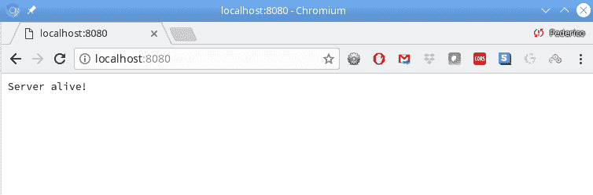
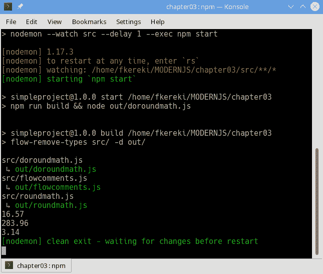
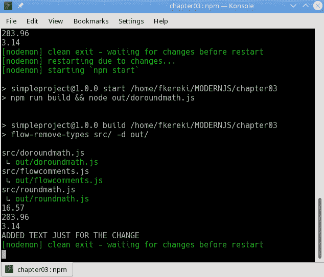
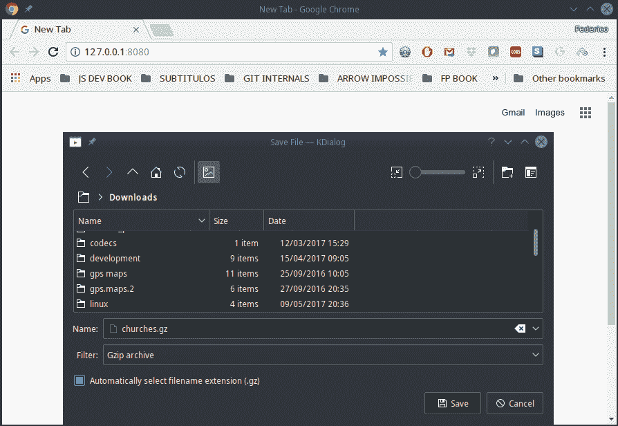

# 第三章：使用 Node 进行开发

本章中我们将看到的示例有：

+   检查 Node 的设置

+   使用模块

+   直接使用 Flow 与 Node

+   使用 Flow 与 Node 通过预处理

+   使用 Nodemon 运行您的 Node 代码

+   使用承诺代替错误回调

+   使用流处理请求

+   使用流压缩文件

+   使用数据库

+   使用 exec()执行外部进程

+   使用 spawn()运行命令，并与其通信

+   使用 fork()来运行 Node 命令

# 介绍

我们在第一章的*安装 Node 和 npm*部分安装了`Node`，但那只是为了设置`npm`。`Node`不仅可以用作 Web 服务器，这是最常见的用法，还可以用来编写 shell 命令行或者桌面应用程序，正如我们将在第十三章中看到的那样，*使用 Electron 创建桌面应用程序*。然而，所有这些环境都有一些共同的配置和开发实践，这将是本章的目标。在本章中，我们将开始`Node`的开发。

# 检查 Node 的设置

首先，让我们通过创建一个非常基本的服务器来验证`Node`是否正常工作；我们将在下一章第四章中详细介绍*使用 Node 实现 RESTful 服务*，但现在我们只是想确保一切正常。在其他章节中，我们将更认真地使用`Node`，但这里的目标是验证它是否正常工作。

# 如何做…

稍微超前一点，让我们设置一个非常基本的服务器，通过发送`'Server alive!'`字符串来回答所有请求。为此，我们需要遵循三个步骤：

1.  使用`require()`导入`Node`的`http`模块——我们将在下一节中更多地了解模块；暂时假设`require()`等同于`import`。

1.  然后，使用`createServer()`方法来设置我们的服务器。

1.  之后，提供一个函数，通过发送`text/plain`固定的答案来回答所有请求。

以下代码代表了最基本的服务器，将让我们知道一切是否都正常工作。我将文件命名为`miniserver.js`。粗体字的那一行完成了所有的工作，我们将在下一节中详细讨论：

```js
// Source file: src/miniserver.js

/* @flow */
"use strict";

const http = require("http");

http
 .createServer((req, res) => {
 res.writeHead(200, { "Content-Type": "text/plain" });
 res.end("Server alive!");
 })
 .listen(8080, "localhost");

console.log("Mini server ready at http://localhost:8080/");
```

# 工作原理…

我们写了一个服务器；现在，让我们看看它是如何运行的。通过这个非常简单的项目，我们可以直接运行服务器代码。在本章的后面部分，我们将看到使用 Flow 类型将需要一些额外的预处理；然而，我们现在可以跳过这部分。我们可以使用以下命令行启动我们的服务器：

```js
> node src/miniserver.js
Mini server ready at http://localhost:8080/
```

要验证一切是否正常工作，只需打开浏览器，转到`http://localhost:8080`。以下截图显示了（诚然不是很令人印象深刻的）结果：



我们的极简服务器正在运行，表明我们的 Node 正常工作

既然我们知道一切都正常，让我们开始一些基本技术，这些技术将在书中的其他地方使用。

为什么我们将服务器运行在端口`8080`而不是`80`？要访问低于`1024`的端口，您需要管理员（root）权限。然而，这将使您的服务器非常不安全；如果黑客设法进入服务器，他将在您的机器上拥有最高权限！因此，标准做法是以普通权限在端口`1024`以上（例如`8080`）运行`Node`，并设置反向代理以将流量发送到端口`80`（HTTP）或`443`（HTTPS）。

# 使用模块

在第二章的*在模块中组织代码*部分，我们看到了现代 JS 如何使用模块。然而，对于`Node`，我们有一点挫折：它不是用现代 JS 的方式处理模块的——除非您愿意使用实验性功能！

为什么`Node`不能使用现代的 JS 模块？原因可以追溯到新模块出现之前的几年，那时还不存在`import`和`export`语句，`Node`实现了 CommonJS 模块格式。（我们将在下一节中更多地了解这些模块。）显然，为了与`Node`一起使用的库也是使用了那种格式开发的，现在有无数个遵循这些指南的模块。

然而，自从新的模块标准出现以来，开始施加压力使用新的语法——但这带来了一些问题，不仅仅是调整语言；你可以让*两种*截然不同的模块风格共存吗？（因为，没有人能够神奇地将所有使用 CommonJS 的现有代码转换成新的格式，对吧？）还有一些其他的区别。ES 模块是用于异步方式使用的，而 CommonJS 模块是同步的；在大多数情况下，这并不会造成差异，但也有一些必须考虑的情况。

目前得出的解决方案还不能被认为是最终的。目前（自 8.5 版本以来），你可以通过使用`--experimental-modules`命令行标志来启用 ES 模块。如果你用它来调用 node，它将识别 ES 模块，如果它们的扩展名是`.mjs`而不是普通的`.js`。希望到 10 版本时，这将不再需要，但这并不能保证，而且到那时也有一定的风险，一些细节可能会发生变化！

这个解决方案使用了新的`.mjs`文件扩展名来识别新式模块，因为这个缘故它被戏称为**迈克尔·杰克逊解决方案**，因为这三个单词的首字母。

所以，如果我在一两年后写这本书，我可能会告诉你，只需继续，开始使用`.mjs`文件扩展名，并使用新的模块风格。

有关此功能的当前信息，请参阅[`nodejs.org/api/esm.html`](https://nodejs.org/api/esm.html)。

然而，此时，这并不被认为是一个完全安全的步骤——这个功能在这个时间点上显然被标记为*实验性*——所以让我们继续使用当前（旧的）标准，并学习如何使用老式模块。让我们创建一个数学模块，你可能想用它来进行金融编码，这样我们就可以看到一个从头开始构建的`Node`风格模块。

# 如何做...

对于`Node`模块，导出和导入元素的方式有两个重要的变化。任何文件都可以是一个模块，就像 ES 模块一样。简而言之，为了从一个模块中导入东西，你将不得不使用一个`require()`函数，而模块本身将使用一个`exports`对象来指定它将导出什么。

JS 数学运算符（加法、减法等）不会进行四舍五入，所以让我们编写一个`roundmath.js`模块，它将执行算术运算，但是将结果四舍五入到分，用于想象中的与业务相关的应用程序。首先，我们从启用`Flow`和设置严格模式的两行常见代码开始：

```js
// Source file: src/roundmath.js

/* @flow */
"use strict";

// *continues...*
```

不要忘记在所有模块的代码之前添加`"use strict"`行，就像我们在上一章的*在严格模式下工作*部分中提到的那样。JS 模块在定义上是严格的，但这并不适用于`Node`模块，它们*不*是严格的。

然后，让我们定义我们的函数。为了多样化，我们将有一些内部（不导出）函数，以及一些将被导出的函数：

```js
// ...*continued*

// These won't be exported:

const roundToCents = (x: number): number => Math.round(x * 100) / 100;
const changeSign = (x: number): number => -x;

// The following will be exported:

const addR = (x: number, y: number): number => roundToCents(x + y);

const subR = (x: number, y: number): number => addR(x, changeSign(y));

const multR = (x: number, y: number): number => roundToCents(x * y);

const divR = (x: number, y: number): number => {
    if (y === 0) {
        throw new Error("Divisor must be nonzero");
    } else {
        return roundToCents(x / y);
    }
};

// *continues*...
```

最后，按照通常的惯例，所有的输出将在底部放在一起，这样就很容易看到模块导出的所有内容。与现代的`export`语句不同，你可以将想要导出的内容赋值给一个`exports`对象。如果你想要保持变量或函数私有，你只需要跳过赋值；在我们的例子中，我们只导出了我们编写的六个函数中的四个。

```js
// ...*continued* exports.addR = addR;
exports.subR = subR;
exports.multR = multR;
exports.divR = divR;
```

# 它是如何工作的...

我们如何使用这个模块，它是如何工作的？如果我们想要从其他模块导入一些函数，我们会写如下内容；看看我们如何使用我们设计的一些操作：

```js
// Source file: src/doroundmath.js

/* @flow */
"use strict";

const RM = require("./roundmath.js");

console.log(RM.addR(12.348, 4.221)); // 16.57
console.log(RM.changeSign(0.07)); // error; RM.changeSign is not a function
```

前两行是通常的。然后，我们`require()`我们需要的任何模块；在这种情况下，只有一个。此外，按照惯例，所有这些要求都被分组在一起，从头开始，以便更容易理解模块的需求，而不必浏览整个代码。在我们的例子中，`RM`被分配了`exports`对象，所以你可以引用`RM.addR()`，`RM.subR()`等等，这清楚地告诉读者你正在使用`RM`模块的东西。

如果你想写得更少一些，你可以利用*解构语句*（我们在上一章的*解构数组和对象*部分遇到过）直接将所需的方法分配给单独的变量：

```js
/* @flow */
"use strict";

const { multR, divR } = require("./roundmath.js");

console.log(multR(22.9, 12.4)); // 283.96
console.log(divR(22, 7)); // 3.14
```

最好习惯于只导入你需要的模块。在其他情况下（我们将在后面的章节中看到），我们可以使用工具来删除你实际上没有使用的任何模块，如果你`require()`所有东西，那是不可能的。

# 直接使用 Flow 与 Node

由于我们使用`Flow`，而`Node`实际上并不知道数据类型，如果我们尝试执行我们的数据类型代码，显然会出现问题。对此有两种解决方案：一种不太优雅，但可以加快开发速度，另一种更强大，但需要额外的工作。让我们在这里考虑第一种更简单的解决方案，把第二种留给下一节。

# 如何做到这一点...

碰巧`Flow`提供了两种指定类型的方式：到目前为止我们一直在使用的方式，带有额外的类型标记，以及另一种更冗长的方式，通过注释。当然，JS 并不了解类型定义，所以第一种风格不会起作用，除非我们做额外的工作（正如我们将看到的），但使用注释是完全安全的。

要用注释定义类型，所有`Flow`特定的定义都必须用以`/*:`开头的注释括起来，以通常的`*/`结束，对于简单的基本类型，或者用`/*::`和`*/`来定义其他类型。我们可以回顾一些我们在第二章中看到的例子。简单的情况如下：

```js
// Source file: src/flowcomments.js

let someFlag /*: boolean */;
let greatTotal /*: number */;
let firstName /*: string */;

function toString(x /*: number */) /*: string */ {
    return String(x);
}

let traffic /*: "red" | "amber" | "green" */;

// *continues...*
```

更复杂的定义，包括可选参数、类型和不透明类型、类属性等等，需要更长的注释：

```js
// ...*continued* /*::
type pair<T> = [T, T];
type pairOfNumbers = pair<number>;
type pairOfStrings = pair<string>;

type simpleFlag = number | boolean;

type complexObject = {
    id: string,
    name: string,
    indicator: simpleFlag,
    listOfValues: Array<number>
};
*/

class Person {
 /*::
 first: string;
 last: string;
 */

    constructor(first /*: string */, last /*: string */) {
        this.first = first;
        this.last = last;
    }

    // ...several methods, snipped out
}

// *continues...*
```

你也可以导出和导入数据类型：

```js
// *...continued* /*::
import type { dniType, nameType } from "./opaque_types";
*/

/*::
export type { pairOfNumbers, pairOfStrings };
*/
```

# 它是如何工作的...

为什么以及这是如何工作的？`Flow`能够识别`/*::  ...  */`和`*/**:  ...  */`注释，因此可以很好地完成它的工作。由于`Flow`代码都隐藏在注释中，从 JS 引擎的角度来看，`Flow`部分甚至不存在，因此这种工作方式的明显优势是你可以直接执行你的代码。

为什么你不喜欢这个？显而易见的批评是，代码看起来，委婉地说，很丑陋。如果你习惯于，比如说，`TypeScript`，不得不把所有与类型相关的东西都用注释包起来可能会变得很繁琐，代码也会变得更难阅读。此外，有可能会出现你会输错注释的风险（忘记其中的一个冒号是可能的），然后 Flow 将会忽略你的定义，可能会让 bug 通过。

有没有其他选择？是的，有，但这将需要一些额外的处理，同时给我们使用标准`Flow`符号的好处；让我们现在转向这个。

# 通过预处理使用 Flow 与 Node

使用注释有点过于冗长。如果您更愿意使用直接的类型注释和额外的语句，您将不得不进行一些预处理，以在尝试运行您的`Node`代码之前摆脱`Flow`的装饰。这样做的好处是，所需的处理可以非常高效，并且在开发时几乎不会被注意到；让我们深入研究一下，看看我们如何保留`Flow`定义，同时不破坏我们的`Node`代码。

# 如何做…

我们想要使用更简短、更简洁的`Flow`风格，但`Node`无法执行带有这些附加内容的代码。我们的难题的解决方案很简单：在尝试运行之前，只需删除与`Flow`相关的所有内容！有一个叫做`flow-remove-types`的包可以做到这一点。首先，像往常一样，您需要安装所需的包：

```js
npm install flow-remove-types --save-dev
```

接着，您将需要通过添加一个新的脚本来启用它。我们是在`src/`目录中编写我们的代码，所以让我们将`Flow`清理后的输出发送到`out/`目录。在那个目录中，我们将得到我们将在服务器中使用的代码版本：

```js
"scripts": {
 "build": "flow-remove-types src/ -d out/",
    "addTypes": "flow-typed install",
    "update": "npm install && flow-typed install",
    "flow": "flow",
    .
    .
    .
},
```

最后，我们还应该告诉`Git`忽略`out/`目录。我们已经忽略了`node_modules`和`flow-typed`目录，所以让我们再添加一个：

```js
**/node_modules 
**/flow-typed 
**/out
```

我们指定`**/out`而不是只有`out/`，因为我们在许多项目之间共享一个`Git`存储库，为了这本书。如果像更常见的那样，您为每个项目都有一个单独的存储库，那么您只需指定`out`。

# 它是如何工作的…

从您开始使用`flow-remove-types`起，会有什么变化？首先，显而易见的是，您不能只是用简单的`node src/somefilename.js`来运行您的项目；首先您需要通过`npm run build`来剥离`Flow`。这个命令的效果将是在`out/`中创建一个`src/`中的所有内容的副本，但没有类型声明。然后，您将能够通过`node out/somefilename.js`来运行项目——文件名不会改变。

当`flow-remove-types`包清理您的文件时，它会用空格替换所有类型声明，因此转换后的输出文件的行数完全相同，每个函数的起始行也完全相同，不需要源映射，输出可读性不变。下面的代码显示了在*使用模块*部分中的我们模块的一部分在处理后的样子：

```js
/* @flow */
"use strict";

// These won't be exported:

const roundToCents = (x: number): number => Math.round(x * 100) / 100;

const changeSign = (x: number): number => -x;

// The following will be exported:

const addR = (x: number, y: number): number => roundToCents(x + y);

const subR = (x: number, y: number): number => addR(x, changeSign(y));

const multR = (x: number, y: number): number => roundToCents(x * y);

const divR = (x: number, y: number): number => {
    if (y === 0) {
        throw new Error("Divisor must be nonzero");
    } else {
        return roundToCents(x / y);
    }
};
```

如果您更喜欢较小的输出（毕竟，阅读带有所有这些空格的代码可能有点令人厌烦），您可以生成一个源映射并删除所有空格，方法是通过向构建脚本添加一些参数，或者通过添加一个不同的脚本，如下面的代码片段所示：

```js
"scripts": {
    "build": "flow-remove-types src/ -d out/",
    "buildWithMaps": "flow-remove-types src/ -d out/ --pretty --sourcemaps",
    .
    .
    .
},
```

VSC 中包含的`Node`调试器完全支持源映射，因此生成更简洁的代码不会成为问题。我们将在第五章中更多地了解这一点，*测试和调试您的服务器*。

现在我们有了一种方法来继续使用`Node`和`Flow`，但是运行我们的代码变得稍微复杂了一点；让我们看看我们是否可以解决这个问题！

# 使用 Nodemon 运行您的 Node 代码

到目前为止，我们所做的工作是，每次进行更改后，运行我们更新的`Node`代码都需要执行以下操作：

1.  停止当前版本的代码，如果它仍在运行。

1.  重新运行构建过程以更新`out`目录。

1.  运行新版本的代码。

对于每一个小的更改，做所有这些事情可能会很快变得无聊和令人厌烦。但是，有一个解决方案：我们可以安装一个监视程序，它将监视我们的文件变化，并自动执行这里提到的所有操作，从而使我们摆脱重复的琐事。让我们看看如何设置一个工具来监视变化，并自动执行所有这些步骤。

# 如何做…

我们将要安装和配置`nodemon`，它将为我们处理一切，根据需要运行更新的代码。首先，显然，我们必须安装提到的包。您可以使用`npm install nodemon -g`全局安装，但我宁愿在本地安装：

```js
npm install nodemon --save-dev
```

然后，我们需要添加一对脚本：

+   `npm start`将构建应用程序并运行我们的主文件

+   `npm run nodemon`将开始监视

```js
"scripts": {
    "build": "flow-remove-types src/ -d out/",
    "buildWithMaps": "flow-remove-types src/ -d out/ --pretty --
     sourcemaps",
 "start": "npm run build && node out/doroundmath.js",
 "nodemon": "nodemon --watch src --delay 1 --exec npm start",
    .
    .
    .  
},
```

现在，我们已经准备好监视我们的应用程序进行更改，并根据需要重新启动它！

# 它是如何工作的...

对我们最感兴趣的命令是第二个。当您运行它时，`nodemon`将开始监视，这意味着它将监视您选择的任何目录（在这种情况下是`out`），每当它检测到某个文件更改时，它将等待一秒钟（例如，以确保所有文件都已保存），然后重新运行应用程序。我是如何做到这一点的？

最初，我启动了`nodemon`。当您运行`npm run nodemon`时，项目将被构建然后运行，`nodemon`将继续等待任何更改；请参阅以下截图：



当您启动 nodemon 时，它会构建项目，运行它，并继续观察是否有任何需要重新启动的更改

之后，我只是添加了一个简单的`console.log()`行，所以文件会被更改；以下截图是结果，显示了重建和重新启动的代码，以及额外的输出行：



在观察文件发生任何更改后，nodemon 将重新启动项目。在这种情况下，我刚刚添加了一行日志，用于更改的添加文本。

就是这样。应用程序将自动重新构建和重新启动，而无需我们每次手动重新运行`npm start`；这是一个很大的帮助！

阅读更多关于`nodemon`的信息[`nodemon.io/`](http://nodemon.io/)和[`github.com/remy/nodemon.`](https://github.com/remy/nodemon)

# 使用承诺而不是错误优先的回调

现在，让我们开始考虑在编写服务时会派上用场的几种技术。

`Node`作为一个单线程运行，所以如果每次它需要调用一个服务，或者读取一个文件，或者访问一个数据库，或者进行任何其他 I/O 相关的操作，它都必须等待它完成，那么处理请求将需要很长时间，阻塞其他请求的处理，并且服务器的性能会非常差。相反，所有这些操作都是异步进行的，您必须提供一个回调，当操作完成时将调用该回调；与此同时，`Node`将可用于处理其他客户端的请求。

有许多函数的同步版本，但它们只能应用于桌面工作，而绝不能用于 Web 服务器。

`Node`建立了一个标准，即所有回调都应该接收两个参数：一个错误和一个结果。如果操作以某种方式失败，错误参数将描述原因。否则，如果操作成功，错误将为 null 或 undefined（但无论如何都是*假值*），结果将具有结果值。

这意味着通常的`Node`代码充满了回调，如果回调本身需要另一个操作，那就意味着更多的回调，这些回调本身可能有更多的回调，导致所谓的*回调地狱*。我们不想以这种方式工作，我们希望能够选择现代的承诺，幸运的是，有一种简单的方法可以做到这一点。让我们看看如何通过避免回调来简化我们的代码。

# 如何做…

让我们首先看一下常见的错误优先回调是如何工作的。`fs`（文件系统）模块提供了一个`readFile()`方法，可以读取一个文件，并且可以生成它的文本或错误。我的`showFileLength1()`函数尝试读取一个文件，并列出其长度。与回调一样，我们必须提供一个函数，该函数将接收两个值：可能的错误和可能的结果。

此函数必须检查第一个参数是否为 null。如果不为 null，则意味着存在问题，操作不成功。另一方面，如果第一个参数为 null，则第二个参数具有文件读取操作的结果。以下代码突出了与`Node`回调一起使用的通常编程模式；粗体字的行是关键行：

```js
// Source file: src/promisify.js

/* @flow */
"use strict";

const fs = require("fs");

const FILE_TO_READ = "/home/fkereki/MODERNJS/chapter03/src/promisify.js"; // its own source!

function showFileLength1(fileName: string): void {
    fs.readFile(fileName, "utf8", (err, text) => {
 if (err) {
 throw err;
 } else {
 console.log(`1\. Reading, old style: ${text.length} bytes`);
 }
    });
}
showFileLength1(FILE_TO_READ);

// *continues...*
```

这种编码风格是众所周知的，但实际上并不适合基于 promise 甚至更好的`async`/`await`的现代开发。因此，自`Node`的 8 版本以来，已经有一种方法可以自动将错误优先的回调函数转换为 promise：`util.promisify()`。如果将该方法应用于任何旧式函数，它将变成一个 promise，然后您可以以更简单的方式进行处理。

# 它的工作原理…

`util`模块是`Node`的标准模块，您只需执行以下操作即可使用它：

```js
const util = require("util");
```

`util.promisify()`方法实际上是另一个高阶函数的示例，正如我们在第二章的*使用 JavaScript 现代特性*部分中看到的那样。

使用`util.promisify()`，我们可以使`fs.readFile()`返回一个 promise，然后使用`.then()`和`.catch()`方法进行处理：

```js
// ...*continued*

function showFileLength2(fileName: string): void {
    fs.readFile = util.promisify(fs.readFile); 
    fs
        .readFile(fileName, "utf8")
        .then((text: string) => {
            console.log(`2\. Reading with promises: ${text.length} bytes`);
        })
        .catch((err: mixed) => {
            throw err;
        });
}
showFileLength2(FILE_TO_READ);

// *continues...*
```

您还可以编写`const { promisify } = require("util")`，然后它将变成`fs.readFile = promisify(fs.readFile)`。

这还允许我们使用`async`和`await`；我将使用箭头`async`函数，只是为了多样性：

```js
// ...*continued*

const showFileLength3 = async (fileName: string) => {
    fs.readFile = util.promisify(fs.readFile);

    try {
        const text: string = await fs.readFile(fileName, "utf8");
        console.log(`3\. Reading with async/await: ${text.length} bytes`);
    } catch (err) {
        throw err;
    }
};
showFileLength3(FILE_TO_READ);
```

# 还有更多…

请记住，您并不总是需要`util.promisify()`。这有两个原因：

+   一些库（例如我们已经使用的`axios`）已经返回了 promise，因此您无需做任何事情。

+   其他一些方法（例如`Node`的`http.request()`方法；请参见[`nodejs.org/dist/latest-v9.x/docs/api/http.html#http_http_request_options_callback`](https://nodejs.org/dist/latest-v9.x/docs/api/http.html#http_http_request_options_callback)）具有完全不同的签名，甚至没有错误参数

无论如何，追求标准用法都会有所帮助，因此我们将在本书的其余部分采用基于 promise 的风格。

# 使用流来处理请求

如果您必须处理大量数据集，很明显会引起问题。您的服务器可能无法提供所有所需的内存，或者即使这不会成为问题，所需的处理时间也会超过标准等待时间，导致超时 - 再加上您的服务器会关闭其他请求，因为它将致力于处理您的长时间处理请求。

`Node`提供了一种使用流来处理数据集合的方法，能够在数据流动时处理数据，并将其传输以将功能组合成更小步骤的方式，非常类似于 Linux 和 Unix 的管道。让我们看一个基本示例，如果您有兴趣进行低级`Node`请求处理，可以使用该示例。（正如我们将在下一章中看到的那样，我们将使用更高级的库来完成这项工作。）当请求到来时，其主体可以作为流访问，从而使您的服务器能够处理任何大小的请求。

将发送给客户端的响应也是一个流；我们将在下一节*使用流压缩文件*中看到一个示例。

流可以有四种类型：

+   *可读*：可以（显然！）读取的地方。您可以使用此选项来处理文件，或者如下例所示，获取网络请求的数据。

+   *可写*：可以写入数据的地方。

+   *双工*：可读写，例如网络套接字。

+   *转换*：可以转换读取和写入的双工流；我们将看到一个用于压缩文件的示例。

# 如何做…

让我们编写一些简单的代码来处理请求，并显示所请求的内容。我们的请求处理的主要代码将如下所示：

```js
// Source file: src/process_request.js

const http = require("http");

http
    .createServer((req, res) => {
        // *For PUT/POST methods, wait until the*
        // *complete request body has been read.*

        if (req.method === "POST" || req.method === "PUT") {
            let body = "";

 req.on("data", data => {
 body += data;
 });

 req.on("end", () => processRequest(req, res, body));

        } else {
            return processRequest(req, res, "");
        }
    })
    .listen(8080, "localhost");

// *continues...*
```

`processRequest()`函数将非常简单，仅限于显示其参数。如果您需要更好地理解如何处理请求，这种代码可能会有所帮助，正如我们将在下一章中看到的那样。我们将从 URL 和请求体中获取参数：

```js
// ...*continued*

const url = require("url");
const querystring = require("querystring");

function processRequest(req, res, body) {
 /*
 *Get parameters, both from the URL and the request body*
 */
 const urlObj = url.parse(req.url, true);
 const urlParams = urlObj.query;
 const bodyParams = querystring.parse(body);

 console.log("URL OBJECT", urlObj);
 console.log("URL PARAMETERS", urlParams);
 console.log("BODY PARAMETERS", bodyParams);

 /*
 * Here you would analyze the URL to decide what is required*
 *Then you would do whatever is needed to fulfill the request*
 *Finally, when everything was ready, results would be sent*
 *In our case, we just send a FINISHED message*
 */

 res.writeHead(200, "OK");
 res.end(`FINISHED WITH THE ${req.method} REQUEST`);
}
```

下面我们将看到的代码输出将是请求`url`对象（`req.url`），它的参数以及请求体中的参数。

# 工作原理…

让我们运行刚刚编写的简单服务器，看看它是如何工作的。我们可以使用以下两行构建并运行它：

```js
> npm run build
> node out/process_request.js
```

服务器运行后，我们可以使用`curl`进行测试——我们将在第五章的*从命令行测试简单服务*部分中回到这一点，并且我们将看到我们的`FINISHED...`消息：

```js
> curl "http://127.0.0.1:8080/some/path/in/the/server?alpha=22&beta=9" 
FINISHED WITH THE GET REQUEST

```

URL 周围的引号是必需的，因为`&`字符本身对于 shell 行命令具有特殊含义。

服务器控制台将显示以下输出，但我们现在关心的是 URL 参数，它与`curl`调用中提供的内容匹配：

```js
URL OBJECT Url {
 protocol: null,
 slashes: null,
 auth: null,
 host: null,
 port: null,
 hostname: null,
 hash: null,
 search: '?alpha=22&beta=9',
 query: { alpha: '22', beta: '9' },
 pathname: '/some/path/in/the/server',
 path: '/some/path/in/the/server?alpha=22&beta=9',
 href: '/some/path/in/the/server?alpha=22&beta=9' }
URL PARAMETERS { alpha: '22', beta: '9' }
BODY PARAMETERS {}
```

这很容易，但如果服务请求是`POST`，我们将监听事件来构建请求的`body`。请参考以下：

+   `'data'`在有更多数据需要处理时触发。在我们的情况下，每次事件中我们都会向`body`字符串添加内容，以便构建请求体

+   当没有更多数据时，将触发`'end'`。在这里，我们使用它来识别我们已经获得了完整的请求体，并且现在准备继续处理它。

+   `'close'`（当流关闭时）和`'error'`事件在这里不适用，但也适用于流处理。

如果我们执行`curl -X "POST" --data "gamma=60" --data "delta=FK" "http://127.0.0.1:8080/other/path/"`进行`POST`，传递一对 body 参数，控制台输出将会改变：

```js
URL OBJECT Url {
 protocol: null,
 slashes: null,
 auth: null,
 host: null,
 port: null,
 hostname: null,
 hash: null,
 search: null,
 query: {},
 pathname: '/other/path/',
 path: '/other/path/',
 href: '/other/path/' }
URL PARAMETERS {}
BODY PARAMETERS { gamma: '60', delta: 'FK' }
```

在[`nodejs.org/api/stream.html`](https://nodejs.org/api/stream.html)上阅读更多关于流的信息（大量信息！）。

# 使用流压缩文件

我们可以看到更多使用流的例子，包括多种类型，比如我们想要压缩文件的情况。在这个示例中，我们将使用可读流从源中读取，使用可写流放置压缩后的结果。

# 如何做…

代码非常简单，而且也很短。我们只需要`require`所需的模块，为我们将要读取的文件创建一个输入流，为我们将要创建的文件创建一个输出流，并将第一个流导入到第二个流中；没有比这更简单的了：

```js
// Source file: src/zip_files.js

const zlib = require("zlib");

const fs = require("fs");

const inputStream = fs.createReadStream(
 "/home/fkereki/Documents/CHURCHES - Digital Taxonomy.pdf"
);

const gzipStream = zlib.createGzip();

const outputStream = fs.createWriteStream(
 "/home/fkereki/Documents/CHURCHES.gz"
);

inputStream.pipe(gzipStream).pipe(outputStream);
```

# 工作原理…

我们使用`fs`模块生成两个流：一个可读流，用于读取给定文件（这里是一个固定的文件，但读取任何其他文件也很简单），一个可写流，用于存放压缩后的输出。我们将通过`gzip`模块将输入流导入，该模块将在将输入传递到输出之前对其进行压缩。

我们也可以轻松地创建一个服务器，将压缩文件发送给客户端进行下载。以下是所需的代码；关键区别在于压缩流现在转到`response`流。我们还必须提供一些头信息，以便客户端知道正在发送一个压缩文件：

```js
// Source file: src/zip_send.js

const zlib = require("zlib");
const fs = require("fs");

const http = require("http");

http
    .createServer(function(request, response) {
        // Tell the client, this is a zip file.
 response.writeHead(200, {
 "Content-Type": "application/zip",
 "Content-disposition": "attachment; filename=churches.gz"
 });

        const inputStream = fs.createReadStream(
            "/home/fkereki/Documents/CHURCHES - Digital Taxonomy.pdf"
        );

```

```js
        const gzipStream = zlib.createGzip();

        inputStream.pipe(gzipStream).pipe(response);
    })
    .listen(8080, "localhost");
```

如果您`npm run build`然后`node out/zip_send.js`，打开`127.0.0.1:8080`将会得到以下截图中显示的内容；您将获得要下载的压缩文件：



流也用于压缩并发送文件到浏览器

在[`nodejs.org/api/fs.html`](https://nodejs.org/api/fs.html)上阅读更多关于`fs`的信息，并在[`nodejs.org/api/zlib.html`](https://nodejs.org/api/zlib.html)上阅读更多关于`zlib`的信息。

# 使用数据库

现在让我们看看如何访问数据库，比如`MySQL`，`PostgreSQL`，`MSSQL`，`Oracle`或其他。 (我们将在第四章中需要这个，*使用 Node 实现 RESTful 服务*，当我们开始构建一组服务时。) 经常需要访问数据库，所以这就是我们要做的。我选择了一些地理数据（包括国家，它们的地区以及这些地区的城市），之后我们将添加一些其他内容，以便处理更复杂的例子。

# 准备工作

获取国家列表很容易：我使用了来自[`github.com/datasets/country-codes`](https://github.com/datasets/country-codes)的数据，我将其修剪为只有国家的两个字符代码（如 ISO 3166-1 标准中的那样）和名称。对于地区和城市，我使用了 GeoNames 的数据，来自[`download.geonames.org/export/dump/`](http://download.geonames.org/export/dump/)；特别是我使用了`admin1CodesASCII.txt`，我将其改编为`regions.csv`，以及`cities15000.zip`，我编辑成了`cities.csv`。

如果你想以更清晰的格式查看 CSV 文件，可以查看 VSC 的 EXCEL VIEWER 扩展。

关于这三个表，你需要知道的是：

+   *国家*由两个字母的代码标识（比如*UY*代表乌拉圭，*IN*代表印度），并且有一个名称

+   *地区*属于一个国家，由国家代码加上一个字符串标识；此外，它们有一个名称

+   *城市*由数字代码标识，有一个名称，纬度和经度，人口，并且位于一个国家的一个地区

这就足够开始了；稍后，我们将添加一些更多的表，以便进行更多的实验。我使用了`MariaDB`（`MySQL`的开源分支；参见[`mariadb.com/`](https://mariadb.com/)）和`MySQL WorkBench`（参见[`www.mysql.com/products/workbench/`](https://www.mysql.com/products/workbench/)）来创建表并导入数据，因为这比手工操作更简单！我还创建了一个`fkereki`用户，密码为`modernJS!!`，以便访问这些表。

如果你想使用不同的数据库，比如 PostgreSQL 或 Oracle，下面的代码会非常相似，所以不用太担心处理特定的数据库。如果你使用 ORM，你会看到一些访问数据的与数据库无关的方法，这可能会帮助你真正需要处理不同的数据库产品时。

# 如何做…

为了访问`MariaDB`数据库，我们将从[`github.com/mscdex/node-mariasql`](https://github.com/mscdex/node-mariasql)安装`mariasql`包，然后将其`.query()`方法 promisify，以便更轻松地工作。安装完成后使用`npm install mariasql --save`，不久之后（你会看到一些对象代码被构建），包将被安装。按照接下来提到的步骤进行。

另一个可能性是使用来自[`github.com/steelbrain/mariasql-promise`](https://github.com/steelbrain/mariasql-promise)的`mariasql-promise`，其所有方法都已经返回了 promises。然而，使用这个库获取连接对象并存储以供以后使用更加困难，这就是为什么我选择了原始的库；毕竟，我们只需要修改`.query()`来返回一个 promise。

# 获取连接

首先，让我们定义一些以后会用到的常量；除了`Flow`和严格使用行之外，我们只需要`MariaDB`库，`promisify()`函数，并定义四个常量来访问数据库：

```js
// Source file: src/dbaccess.js

/* @flow */
"use strict";

const mariaSQL = require("mariasql");
const { promisify } = require("util");

const DB_HOST = "127.0.0.1";
const DB_USER = "fkereki";
const DB_PASS = "modernJS!!";
const DB_SCHEMA = "world";

// *continues...*
```

现在，让我们获取一个数据库连接。我们只需创建一个新对象，并`promisify`它的`.query()`方法。`dbConn`变量将作为参数传递给每个需要访问数据库的函数：

```js
// ...*continued*

function getDbConnection(host, user, password, db) {
    const dbConn = new mariaSQL({ host, user, password, db });
    dbConn.query = promisify(dbConn.query);
    return dbConn;
}

const dbConn = getDbConnection(DB_HOST, DB_USER, DB_PASS, DB_SCHEMA); // *continues*...
```

# 执行一些查询

测试连接是否正常工作的一个简单方法是执行一个返回常量值的微不足道的查询；这里真正重要的是，函数应该在不抛出任何异常的情况下工作。我们使用`await`来获取`.query()`方法的结果，这是一个包含所有找到的行的数组；在这种情况下，数组显然只有一行：

```js
// ...*continued*

async function tryDbAccess(dbConn) {
    try {
        const rows = await dbConn.query("SELECT 1960 AS someYear");
        console.log(`Year was ${rows[0].someYear}`);
    } catch (e) {
        console.log("Unexpected error", e);
    }
}

// *continues*...
```

让我们试试其他的东西：比如找出有更多城市的十个国家？我们可以使用`.forEach()`以一个相当不太吸引人的格式列出结果：

```js
// ...*continued*

async function get10CountriesWithMoreCities(dbConn) {
    try {
        const myQuery = `SELECT 
            CI.countryCode, 
            CO.countryName, 
            COUNT(*) as countCities
        FROM cities CI JOIN countries CO 
        ON CI.countryCode=CO.countryCode
        GROUP BY 1 
        ORDER BY 3 DESC 
        LIMIT 10`;

 const rows = await dbConn.query(myQuery);
 rows.forEach(r =>
 console.log(r.countryCode, r.countryName, r.countCities)
 );
    } catch (e) {
        console.log("Unexpected error", e);
    }
}

// *continues...*
```

# 更新数据库

最后，让我们做一些更新。我们将首先添加一个新的（虚构的！）国家；然后我们将检查它是否存在；我们将更新它并检查更改，然后我们将删除它，最后我们将验证它是否已经消失：

```js
// ...*continued*

async function addSeekAndDeleteCountry(dbConn) {
    try {
        const code = "42";
        const name = "DOUGLASADAMSLAND";

        /*
            1\. Add the new country via a prepared insert statement
        */
 const prepInsert = dbConn.prepare(
 "INSERT INTO countries (countryCode, countryName) VALUES (:code, :name)"
 );
 const preppedInsert = prepInsert({ code, name });
        await dbConn.query(preppedInsert);

        /*
            2\. Seek the recently added country, return an array of objects
        */
 const getAdams = `SELECT * FROM countries WHERE countryCode="${code}"`;
        const adams = await dbConn.query(getAdams);
        console.log(
            adams.length,
            adams[0].countryCode,
            adams[0].countryName
        );

        /*
            3\. Update the country, but using placeholders
        */
        await dbConn.query(
            `UPDATE countries SET countryName=? WHERE countryCode=?`,
            ["NEW NAME", code]
        );

        /*
           4\. Check the new data, but returning an array of arrays instead
        */
        const adams2 = await dbConn.query(
            `SELECT * FROM countries WHERE countryCode=?`,
            [code],
            { useArray: true }
        );
        console.log(adams2.length, adams2[0][0], adams2[0][1]);

        /*
            5\. Drop the new country
        */
 await dbConn.query(`DELETE FROM countries WHERE countryCode="42"`);

        /*
            6\. Verify that the country is no more
        */
        const adams3 = await dbConn.query(getAdams);
        console.log(adams3.length);
    } catch (e) {
        console.log("Unexpected error", e);
    }
}

// *continues...*
```

# 将所有内容整合在一起

现在，我们所要做的就是调用这三个函数，以获得一个完整的工作示例：

```js
// ...*continued*

tryDbAccess(dbConn);
get10CountriesWithMoreCities(dbConn);
addSeekAndDeleteCountry(dbConn);
```

最后，我添加了一个脚本来自动运行所有测试，通过执行`npm run start-db`：

```js
"scripts": {
    "build": "flow-remove-types src/ -d out/",
    "buildWithMaps": "flow-remove-types src/ -d out/ --pretty --sourcemaps",
    "start": "npm run build && node out/doroundmath.js",
    "start-db": "npm run build && node out/dbaccess.js",
    .
    .
    .
},
```

让我们分析一下代码的工作原理，并注意一些有趣的地方。

# 它是如何工作的...

运行`tryDbAccess()`并不难理解：常量查询发送到服务器，返回一个包含单行的数组。我们的代码的输出将如下所示：

```js
Year was 1960
```

第二个查询变得更有趣。除了实际编写 SQL 查询的细节（这超出了本书的目标）之外，有趣的是返回的数组，每个数组中都有一个包含所选字段的对象：

```js
IN India 1301
BR Brazil 1203
RU Russian Federation 1090
DE Germany 1061
CN China 810
FR France 633
ES Spain 616
JP Japan 605
IT Italy 575
MX Mexico 556
```

现在，让我们来看最后一个例子。我们看到了几种创建将要执行的语句的方式。

`INSERT`使用了一个准备好的语句。准备好安全查询的一个好方法（意思是，它们不会涉及到 SQL 注入攻击）是使用准备好的字符串。`.prepare()`方法很有趣：给定一个字符串，它返回一个函数，当用实际参数调用时，它本身将返回要在查询中使用的字符串。当然，您也可以手动构建函数，就像我在其他示例中所做的那样——但是这时你必须确保生成的查询是安全的！

`.escape()`方法可以帮助构建一个安全的查询字符串，如果你不想使用`.prepare()`。更多信息请参见[`github.com/mscdex/node-mariasql`](https://github.com/mscdex/node-mariasql)。

接下来的`SELECT`使用了手工创建的字符串（这里没有什么太原创的东西），但`UPDATE`显示了另一种风格：使用`?`符号作为*占位符*。在这种情况下，您还必须提供一个值数组，用于替换占位符；数组中的值的顺序必须与预期的参数匹配，这是非常重要的。

接下来，第二个`SELECT`也使用了占位符，但添加了一个小调整：传递一个带有`useArray:true`选项的对象，函数执行速度会稍快一些，因为它不会为每一行创建对象，而是直接返回数组。然而，这也存在一个问题，因为现在你必须记住数组的每个位置代表什么意思。

代码的结果如预期的那样：首先是一行，显示实际创建了一个国家，带有我们传递的值；然后是相同的记录，但名称已更改，最后是一个零，表明该国家不再存在：

```js
1 '42' 'DOUGLASADAMSLAND'
1 '42' 'NEW NAME'
0
```

# 还有更多...

在这一部分，我们已经通过直接连接，使用表和游标对数据库执行各种操作的几个示例进行了讨论。您还可以考虑使用**对象关系映射**（**ORM**）库，以处理对象：最为人熟知的可能是`Sequelize`（在[`docs.sequelizejs.com/`](http://docs.sequelizejs.com/)），但还有一些其他包（如`TinyORM`、`Objection.js`或`CaminteJS`，只是提到一些仍在开发中的包，没有被放弃）。

# 使用 exec()执行外部进程

如果你正在使用`Node`实现一些服务，可能会有一些情况需要进行一些繁重的处理，正如我们之前提到的，这是一个*不行*，因为你会阻塞所有用户。如果你需要做这种工作，`Node`可以让你将工作卸载到外部进程中，从而使自己空闲并可继续工作。外部进程将以异步方式独立工作，完成后，你将能够处理其结果。有几种方法可以做到这一点；让我们来看看。

运行一个单独命令的第一种选择是`child_process.exec()`方法。这将生成一个 shell，并在其中执行给定的命令。生成的任何输出将被缓冲，当命令执行完成时，将调用一个回调函数，其中包含生成的输出或错误。

让我们看一个通过访问文件系统调用外部进程的例子。

# 如何做到这一点...

一个例子，获取给定路径上所有 JS 文件的目录列表，可能如下所示。（是的，当然你可以和应该使用`fs.readDir()`来做到这一点，但我们想展示如何使用子进程来做到这一点。）

正如本章前面的*使用 Promise 代替错误优先回调*部分所示，我们将`promisify()`调用，以简化编码：

```js
// Source file: src/process_exec.js

const child_process = require("child_process");
const { promisify } = require("util");
child_process.exec = promisify(child_process.exec);

async function getDirectoryJs(path: ?string) {
    try {
 const cmd = "ls -ld -1 *.js";
        const stdout = await child_process.exec(cmd, { cwd: path });
        console.log("OUT", path || "");
        console.log(stdout);
    } catch (e) {
        console.log("ERR", e.stderr);
    }
}
```

# 它是如何工作的...

当我们调用`.exec()`方法时，将创建一个单独的 shell，并在其中运行命令。如果调用成功，将返回输出；否则，将抛出一个具有`.stderr`属性的对象作为异常。可能的一对运行如下：

```js
getDirectoryJs("/home/fkereki/MODERNJS/chapter03/flow-typed/npm");
*OUT /home/fkereki/MODERNJS/chapter03/flow-typed/npm*
*-rw-r--r-- 1 fkereki users 4791 Apr 9 12:52 axios_v0.18.x.js*
*-rw-r--r-- 1 fkereki users 3006 Mar 28 14:51 babel-cli_vx.x.x.js*
*-rw-r--r-- 1 fkereki users 3904 Apr 9 12:52 babel-eslint_vx.x.x.js*
*-rw-r--r-- 1 fkereki users 2760 Apr 9 12:52 babel-preset-env_vx.x.x.js*
*-rw-r--r-- 1 fkereki users 888 Apr 9 12:52 babel-preset-flow_vx.x.x.js*
*-rw-r--r-- 1 fkereki users 518 Apr 9 12:52 eslint-config-recommended_vx.x.x.js*
*-rw-r--r-- 1 fkereki users 14995 Apr 9 12:52 eslint-plugin-flowtype_vx.x.x.js*
*-rw-r--r-- 1 fkereki users 73344 Apr 9 12:52 eslint_vx.x.x.js*
*-rw-r--r-- 1 fkereki users 1889 Mar 28 14:51 fetch_vx.x.x.js*
*-rw-r--r-- 1 fkereki users 188 Apr 9 12:52 flow-bin_v0.x.x.js*
*-rw-r--r-- 1 fkereki users 13290 Apr 9 12:52 flow-coverage-report_vx.x.x.js*
*-rw-r--r-- 1 fkereki users 1091 Apr 9 12:52 flow-remove-types_vx.x.x.js*
*-rw-r--r-- 1 fkereki users 5763 Apr 9 12:52 flow-typed_vx.x.x.js*
*-rw-r--r-- 1 fkereki users 1009 Apr 9 12:52 mariasql_vx.x.x.js*
*-rw-r--r-- 1 fkereki users 0 Mar 28 14:51 moment_v2.3.x.js*
*-rw-r--r-- 1 fkereki users 5880 Apr 9 12:52 nodemon_vx.x.x.js*
*-rw-r--r-- 1 fkereki users 4786 Apr 9 12:52 prettier_v1.x.x.js*

getDirectoryJs("/boot");
*ERR ls: cannot access '*.js': No such file or directory*
```

`.exec()`的第二个参数提供了一个可能选项的对象。在我们的情况下，我们正在指定命令的当前工作目录（`cwd`）。另一个有趣的选项可以让你处理产生大量输出的命令。默认情况下，最大缓冲输出量为 200K；如果你需要更多，你将不得不添加一个对象，其中`maxBuffer`选项设置为更大的值；查看[`nodejs.org/api/child_process.html#child_process_child_process_exec_command_options_callback`](https://nodejs.org/api/child_process.html#child_process_child_process_exec_command_options_callback)了解更多关于这些和其他选项的信息。

你可以执行的命令的复杂性没有限制，但也存在风险。请记住被黑客攻击的可能性：如果你正在根据用户提供的某些输入构建你的命令，你可能会成为命令注入攻击的受害者。想象一下，如果你想构建类似于``ls ${path}``的东西，而用户提供的`path`是`"/; rm -rf *"`，会发生什么？

# 还有更多...

使用`.exec()`对于短命令和少量输出非常好。如果你实际上不需要 shell，你甚至可以使用`.execFile()`更好，它直接运行所需的命令，而不是首先创建一个 shell，然后在其中运行命令。有关更多信息，请参阅[`nodejs.org/api/child_process.html#child_process_child_process_execfile_file_args_options_callback`](https://nodejs.org/api/child_process.html#child_process_child_process_execfile_file_args_options_callback)。

# 使用 spawn()运行命令，并与其通信

使用`.exec()`很简单，但你只能处理小型输出，并且也无法得到部分答案：让我们更多地了解这一点。想象一下，你正在准备一个大文件要发送给客户端。如果你要用`.exec()`读取该文件，你将无法在读取完整个文件之前开始将文件内容发送给客户端。然而，如果文件太大，这不仅意味着延迟，还可能导致崩溃。使用`.spawn()`给你一个有趣的补充：使用流进行双向通信，与生成的进程。

# 如何做到这一点...

使用`.spawn()`在一般情况下类似于`.exec()`。现在让我们使用一个单独的进程来读取一个目录并将其结果发送回来。我们将使用流传递要处理的路径，并且我们也将通过流获得找到的文件列表。

首先，让我们有主要的代码，它将生成一个进程：

```js
// Source file: src/process_spawn.js

const path = require("path");
const { spawn } = require("child_process");

const child = spawn("node", [path.resolve("out/process_spawn_dir.js")]);

child.stdin.write("/home/fkereki");

child.stdout.on("data", data => {
    console.log(String(data));
});

child.stdout.on("end", () => {
    child.kill();
});
```

最后，我们需要子进程，它将如下所示：

```js
// Source file: src/process_spawn.js

const fs = require("fs");

process.stdin.resume();

process.stdin.on("data", path => {
    // Received a path to process
    fs
        .readdirSync(path)
        .sort((a, b) => a.localeCompare(b, [], { sensitivity: "base" }))
        .filter(file => !file.startsWith("."))
        .forEach(file => process.stdout.write(file + "\n"));

 process.stdout.end();
});
```

# 它是如何工作的...

生成的进程展示了另一种事件的情况。进程保持在那里等待，每当进程通过`stdin`输入接收到任何数据时，就会触发`"data"`事件，就像通过`child.stdin.write("/home/fkereki")`行所做的那样。然后，进程使用`fs.readdirSync()`读取目录，这是一个同步调用，在正常的`Node`代码中不应该使用，但在子进程中是安全的，因为它不会阻塞任何东西。调用的结果被排序，过滤以避免隐藏文件，然后将行写入`stdout`。

与子进程类似，父进程监听来自子进程`stdout`的事件。每当数据到达时（触发`"data"`事件），它会简单地使用`console.log()`记录。当子进程发出信号表示不会再有数据到来时，通过执行`process.stdout.end()`，将触发`"end"`事件，父进程会识别它，并可以做任何想做的事情。

这种生成进程的方式允许父进程和子进程之间进行双向通信，可以用于许多不同的形式。

# 使用 fork()来运行 Node 命令

`Child_process.fork()`方法是`.spawn()`的一个特殊情况，它专门只生成新的`Node`进程。生成的子进程内置了一个通信通道，使得在父进程和子进程之间传递消息变得更简单：你只需使用`.send()`方法发送消息，并在另一侧监听`"message"`事件。让我们看看如何分叉出第二个进程，并与第一个进程进行通信。

# 如何做...

由于上一节的代码使用`.spawn()`来启动一个新的`Node`实例并运行一些代码，很明显我们可以很快简单地调整它，改用`.fork()`。此外，我们不必使用`stdin`和`stdout`进行通信，而是选择使用消息传递。

首先，让我们从父代码开始。它将变成以下内容；关键的差异是使用`.fork()`而不是`.spawn()`，以及发送文件路径给子进程的方式：

```js
// Source file: src/process_fork.js

const path = require("path");
const { fork } = require("child_process");

const child = fork(path.resolve("out/process_fork_dir.js"));

child.send({ path: "/home/fkereki" });

child.on("message", data => {
    console.log(String(data));
});
```

然后，子代码也会显示一些小的变化，接收消息的方式以及向父进程发送数据的方式：

```js
// Source file: src/process_fork_dir.js

const fs = require("fs");

process.on("message", obj => {
    // Received a path to process
    fs
        .readdirSync(obj.path)
        .sort((a, b) => a.localeCompare(b, [], { sensitivity: "base" }))
        .filter(file => !file.startsWith("."))
        .forEach(file => process.send && process.send(file));
});
```

# 它是如何工作的...

使用`.fork()`意味着子进程是一个`Node`进程，所以我们不需要明确地提到它，就像我们在上一节中所做的那样，我们只需要传递要执行的 JS 文件的名称。

第二个差异，正如我们所提到的，是我们不再使用`stdin`和`stdout`进行通信，而是可以`.send()`一个消息（从父到子或反之亦然），并且我们监听`"message"`事件而不是`"data"`事件。

如果你分析代码中突出显示的差异，你会意识到这些差异实际上是非常小的，对于需要运行一个单独的`Node`进程的特殊情况（但并不罕见），`.fork()`更合适，可能也更简单一些。
