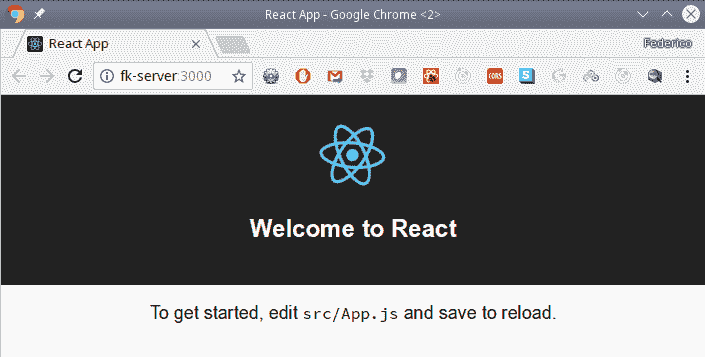
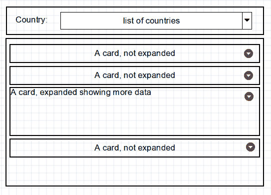
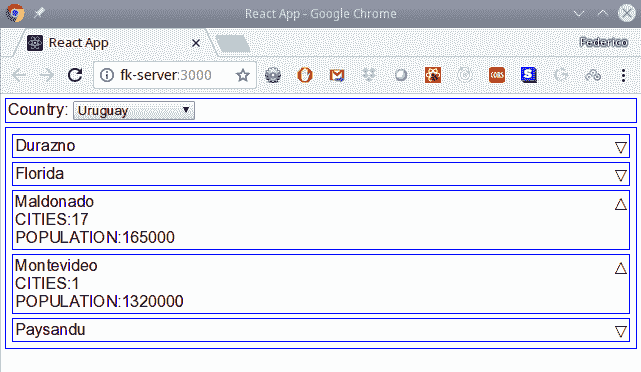
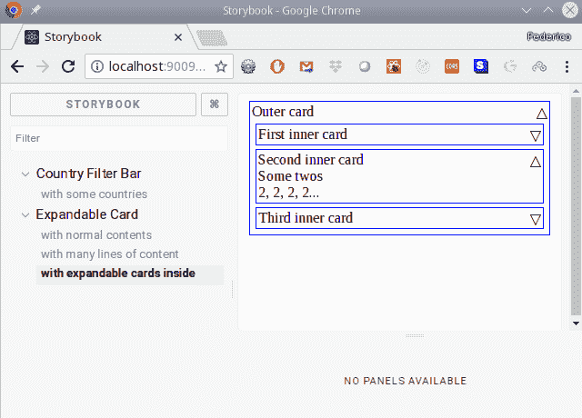
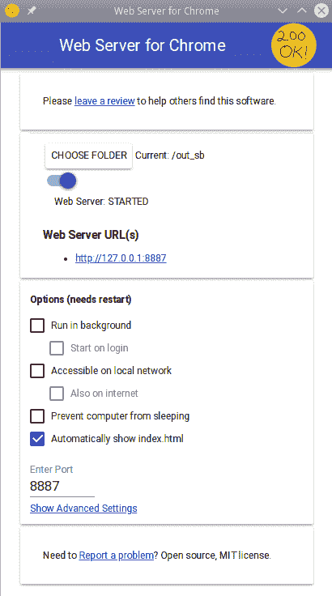
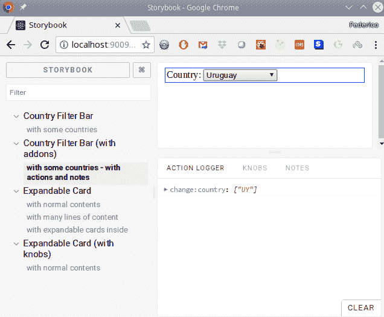
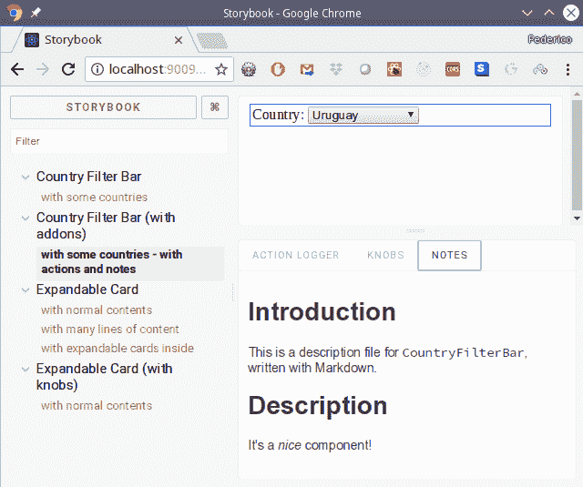
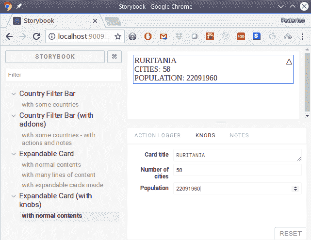

# 第六章：使用 React 进行开发

在本章中，我们将涵盖以下内容：

+   开始使用 React

+   重新安装您的工具

+   定义组件

+   处理状态

+   组合组件

+   处理生命周期事件

+   使用 Storybook 简化组件开发

# 介绍

在最后三章中，我们正在使用`Node`开发后端，现在我们将转向前端，构建一个 Web 应用程序：特别是一种现代风格的**单页应用程序**（**SPA**），用户已经习惯了。

# 开始使用 React

假设您想构建一个 Web 应用程序。您会如何做？除非您一直躲在某个地方，否则您可能已经意识到，有许多框架可以帮助您构建和组织您的网页。但是，您可能会想知道，如果您已经了解 HTML、CSS 和 JS，为什么要使用框架，而不是继续使用纯 JS，可能还有一些库，如`jQuery`或`Lodash`？毕竟，框架会施加一些规则和工作方式，您可能会认为这些规则令人讨厌或麻烦。

当然，您还必须*学习*如何使用框架，而且直到您熟练掌握它之前，您可能不会从中受益。因此，对于*为什么？*这个问题有几种可能的答案，甚至包括*当然，不使用任何框架！*，这对于一个非常小的、简单的项目可能也是可以的：

+   框架为您提供了一个经过充分测试的、稳固的方式来组织您的项目

+   框架通常更适合大型应用程序

+   框架让您在更高级的抽象层次上工作（例如，创建和使用自己的组件），并处理让一切正常运行的琐碎方面

+   培养新开发人员通常更简单：如果他们了解框架，他们已经知道应该放置在哪里以及它们如何相互作用

当然，正如我之前提到的，所有这些优势并不适用于小型项目，只有少数开发人员。

然而，还有一个更重要的原因。框架帮助您解决保持状态（数据）和视图同步的困难任务。对于大型应用程序，应用程序中一个*角落*发生的更改或事件可能会对应用程序的其他地方产生影响。试图将所有更改正确传播到代码中并不是一件简单的事情。

大多数框架会自动生成视图，从数据中获取，每当状态发生变化时，它们会以最佳方式更新屏幕。例如，假设您在某处有一个 doodads 列表。然后，您调用一个网络服务，获取更新后的列表——大多数 doodads 匹配，但有一些被添加了，有一些缺失了。当然，您可以从零开始重新创建列表，但那看起来不太好，如果您决定每次发生变化时重新生成整个屏幕，性能会受到影响。通常情况下，框架会计算当前列表和新列表之间的差异，并相应地更新 HTML 代码，添加或删除 DOM 元素，以使列表再次正确。手动完成所有这些工作，并将其扩展到整个应用程序，将是一件有点太多的事情！

有几个知名的框架，如`Angular`（由 Google）、`Vue`、`Ember`、`Backbone`、`Knockout`等等。（有时候你会觉得每天都有一个新的框架诞生！）我们将在本书中使用`React`（由 Facebook）。

承认一点：`React`更正确地称为*库*而不是框架，因为它不包含您开箱即用开发应用程序所需的一切。然而，所有必要的包都在那里，所以这不会妨碍我们。顺便说一句，这种批评也适用于`Vue`、`Knockout`和`Backbone`。

`React`还可以用于使用`React-Native`创建移动应用程序，我们将在本书的第十一章中看到，*使用 React Native 创建移动应用程序*。

一篇有趣的文章，*JavaScript 框架的终极指南*，在[`javascriptreport.com/the-ultimate-guide-to-javascript-frameworks/`](https://javascriptreport.com/the-ultimate-guide-to-javascript-frameworks/)列出了 50 多个框架！看一看，看看每个框架有什么优缺点。

在这个步骤中，我们将安装必要的包并构建我们自己的非常基本的第一个 Web 应用程序。

# 如何做...

让我们继续创建我们的基本应用程序。如果你不得不纯手工设置一个项目，你会发现自己不得不处理许多不同的工具，比如`Babel`用于转译，`ESLint`用于代码检查，`Jest`用于测试，或者`Webpack`用于将你的整个应用程序打包在一起，而不是不得不将数十个或数百个单独的文件发送到网络上。然而，如今，有一个更简单的工具，`create-react-app`，可以处理这个繁琐的工作，并让你迅速开始`React`开发。其关键卖点是*零配置*，这意味着已经选择了一些合理的好选择，用于开发和生产构建，并且你可以直接开始编写代码，而不必关心无数的配置细节。

对于内行的人来说，`create-react-app`被称为 CRA，这就是我们将要使用的名称。顺便说一句，CRA 并不是创建项目的唯一可能方式；例如，`react-boilerplate`（在[`github.com/react-boilerplate/react-boilerplate`](https://github.com/react-boilerplate/react-boilerplate)）提供了一个替代方案，但所选择的一套包和工具更适合有经验的`React`开发人员。

要创建基本结构（我们稍后会解释），我们将使用`npx`来运行应用程序创建工具，如下面的代码所示。由于我们在第六章，让我们（想象！）将我们的项目命名为`chapter06`！

```js
> npx create-react-app chapter06 Creating a new React app in /home/fkereki/JS_BOOK/modernjs/chapter06.

Installing packages. This might take a couple minutes.
Installing react-scripts...

*...many lines describing installed packages, snipped out...*

Success! Created chapter06 at /home/fkereki/JS_BOOK/modernjs/chapter06
Inside that directory, you can run several commands:

  npm start
    Starts the development server.

  npm run build
    Bundles the app into static files for production.

  npm test
    Starts the test runner.

  npm run eject
    Removes this tool and copies build dependencies, configuration files
    and scripts into the app directory. If you do this, you can’t go back!

We suggest that you begin by typing:

  cd chapter06
  npm start

Happy hacking!
```

如果你好奇，`npx`类似于`npm`，但它执行一个*二进制*命令，该命令要么在你的`node_modules`目录中找到，要么在一个中央缓存中找到，甚至安装它可能需要运行的任何包。有关更多信息，请访问其 GitHub 页面[`github.com/zkat/npx`](https://github.com/zkat/npx)，或者更好的是，阅读 npx 的创建者的一篇文章，*Introducing npx: an npm package runner* [`medium.com/@maybekatz/introducing-npx-an-npm-package-runner-55f7d4bd282b`](https://medium.com/@maybekatz/introducing-npx-an-npm-package-runner-55f7d4bd282b)。

# 它是如何工作的...

运行脚本将创建一个基本的项目结构，包括以下内容：

+   一个`package.json`文件，以及一个相应的`node_modules`目录。

+   一个`README.md`文件，基本上是你可以在[`github.com/wmonk/create-react-app-typescript/blob/master/packages/react-scripts/template/README.md`](https://github.com/wmonk/create-react-app-typescript/blob/master/packages/react-scripts/template/README.md)找到的内容的副本。特别注意它，因为它充满了提示、建议和解决你可能遇到的常见问题。

+   一个`public/`目录，其中包含应用程序的`index.html`基本 HTML 代码，以及一个`favicon.ico`图标文件和一个描述你的应用程序的`manifest.json`文件。（如果你想了解更多关于后者的信息，请查看[`developer.mozilla.org/en-US/Add-ons/WebExtensions/manifest.json`](https://developer.mozilla.org/en-US/Add-ons/WebExtensions/manifest.json)。）

+   一个`src/`目录，其中包含你的应用程序的`index.js`基本代码，带有 CSS 样式的`index.css`，以及显示一些欢迎文本和一些基本说明的`App`组件。你所有的 JS 和 CSS 文件都应该放在`src/`或其子目录中，否则它们将不会被包含在构建中。

基本上，你会想要编辑`index.*`和`App.*`文件，并通过扩展其结构来提供更多的组件、样式等来扩展项目。（注意：不要更改`index.*`文件的名称，否则你的项目将无法运行！）在开始编写代码之前，就像前面的运行所示，在创建的项目目录中，你应该尝试`npm start`。

通过这样做，你将能够看到新的应用程序，就像下面的截图所示：



创建的应用程序，准备开始编码

如果你愿意，你可以在`App.js`中进行任何小的更改，保存它，然后注意浏览器页面的立即变化。关于你可以在编码中使用的 JS 功能，项目已经设置为接受大多数现代选项，从 ES6（完整）、ES7（如指数运算符，你可能永远不会使用！），甚至更新的（最有趣的是`async`和`await`），再加上一些*Stage 3*提案；查看[`github.com/facebook/create-react-app/blob/master/packages/react-scripts/template/README.md#supported-language-features-and-polyfills`](https://github.com/facebook/create-react-app/blob/master/packages/react-scripts/template/README.md#supported-language-features-and-polyfills)获取更新的列表。值得注意的是，Flow 是被认可的，还有 JSX，我们将在后面的部分中使用。

# 还有更多...

可能会发生这样的情况，有时你需要做一些额外的配置，CRA 没有考虑到，或者你无法以其他方式添加它。在这种情况下，你可以使用`npm run eject`命令将所有配置、脚本和依赖项直接移动到你的项目中，这样你就可以按照自己的方式开始调整事情。当然，这将比使用*零配置*设置更困难，但至少你不会被锁定，没有出路。

如果你好奇想知道所有这些东西都藏在哪里，可能想研究一下所有设置是如何进行的，答案是“在`node_modules/create_react_app`”目录中；弹出项目会将这个目录中的东西复制到你的项目中。

# 重新安装你的工具

我们一直在使用`ESLint`进行代码质量检查，`Prettier`进行格式化，`Flow`进行数据类型检查。在这个教程中，我们将重新使用这些包，并且将测试（`Jest`等）留到第十章，*测试你的应用程序*。对于我们的两个工具来说，这将是非常简单的，但对于第三个工具来说会稍微复杂一些。

# 如何做...

通过完全手动安装，让所有东西一起工作将会非常困难，但 CRA 已经包含了我们需要的几乎所有东西，所以你只需要添加一些配置细节。

# 重新安装 Flow 和 Prettier

让我们从`Flow`开始。这很简单：我只是像对`Node`做的一样，添加了相同的包、脚本、`.flowconfig`文件等。（如果需要，查看第一章，*使用 JavaScript 开发工具*中的*添加 Flow 进行数据类型检查*部分获取更多信息。）

接下来，让我们处理`Prettier`。这也很简单：我不得不从`package.json`中删除以下行，并将它们放在一个单独的`.prettierrc`文件中：

```js
{
    "tabWidth": 4,
    "printWidth": 75
}
```

`Flow`已经*知道*关于`React`和 CRA 的一切，所以在这方面你不需要任何东西。然而，要使用`PropTypes`（我们很快就会讲到），你需要适当的 flow-typed 包，这很容易安装：

```js
npm run addTypes prop-types@15
```

# 重新安装 ESLint

最后，我们的第三个工具需要更多的工作。对于`ESLint`，我们也不能使用`package.json`，我们需要一个`.eslintrc`文件。但是，即使你提取了那部分，你会发现配置并没有关注你的设置，这是因为 CRA 有自己一套`ESLint`规则，你无法更改！除非当然，你决定弹出项目并开始自己进行配置，但你会尽量避免这样做。有一个包，`react-app-rewired`，它允许你在不弹出的情况下更改内部配置。首先安装一些必需的包：

```js
npm install react-app-rewired react-app-rewire-eslint --save-dev
```

至于规则本身，你会想要有以下内容：

```js
npm install eslint-plugin-flowtype eslint-config-recommended eslint-plugin-react --save-dev
```

现在你需要在`package.json`中更改一些脚本：

```js
"scripts": {
    "start": "react-app-rewired start",
    "build": "react-app-rewired build",
    "test": "react-app-rewired test --env=jsdom",
    "eject": "react-app-rewired eject",
    .
    .
    .
```

最后，在项目的根目录下创建一个`config-overrides.js`文件，与`package.json`文件处于同一级别。`/* global module */`的注释是为了避免在`ESLint`开始工作后出现一个错误，报告`module`未定义：

```js
const rewireEslint = require("react-app-rewire-eslint");
function overrideEslintOptions(options) {
    // *do stuff with the eslint options...*
    return options;
}

/* global module */
module.exports = function override(config, env) {
    config = rewireEslint(config, env, overrideEslintOptions);
    return config;
};
```

你已经准备好了！你的`.eslintrc`文件应该如下所示，其中包括一些添加和更改：

```js
{
    "parser": "babel-eslint",
    "parserOptions": {
        "ecmaVersion": 2017,
        "sourceType": "module"
    },
    "env": {
        "node": true,
        "browser": true,
        "es6": true,
        "jest": true
    },
    "extends": [
        "eslint:recommended",
        "plugin:flowtype/recommended",
        "plugin:react/recommended"
    ],
    "plugins": ["babel", "flowtype", "react"],
    "rules": {
        "no-console": "off",
        "no-var": "error",
        "prefer-const": "error",
        "flowtype/no-types-missing-file-annotation": 0
    }
}
```

如果你想知道为什么我留下了`Node`这一行，那是因为`Storybook`（我们将在本章末看到）使用了一个`module`变量，否则它将被标记为未定义。

# 它是如何工作的...

在这种情况下，没有太多需要解释的。项目的正常配置已经包括了我们需要的所有工具，所以我们只是在进行一些配置，而不是按照标准进行操作。

至于`ESLint`，当你现在使用`npm start`时，`ESLint`配置将被*重新配置*以适应你的配置，而不是 CRA 的配置。这意味着你所有的标准设置和检查将继续运行，你将为 React 应用相同的质量检查运行，除了显然的 React 特定的检查。

你可以在[`github.com/timarney/react-app-rewired`](https://github.com/timarney/react-app-rewired)了解更多关于`react-app-rewired`的信息。

# 定义组件

使用`React`的关键思想是，一切 - 我的意思是，*一切* - 都是一个组件。你整个的网络应用将是一个组件，它本身由其他组件组成，这些组件本身又有更小的组件，依此类推。组件生成 HTML，显示在屏幕上。HTML 的数据来自外部分配的*props*（属性）和内部维护的*state*。每当 props 或 state 发生变化时，React 会负责刷新 HTML，以便视图（用户所见的内容）始终保持最新。

让我们来看一个例子。想象一下，你想创建一个屏幕，让用户查询世界各地区域的数据。你该如何设计？查看以下屏幕截图以获取详细信息：



每当用户选择一个国家，我们将显示几张关于其地区的信息卡片。

注意：我在 http://www.wireframes.com 上创建了这个草图，但不要因为我糟糕的素描能力而责怪这个工具！

你的整个视图将是一个组件，但显然这对编码或测试并不会有所帮助。一个很好的设计原则是*每个组件应负责单一职责*，如果它需要做更多的事情，就将其分解为更小的组件。在我们的例子中，我们将有以下内容：

+   整个表格是一个`RegionsInformationTable`。

+   顶部的部分可以是`CountryFilterBar`，带有一个国家的下拉菜单

+   在底部我们有一个`ResultsDataTable`，显示了一系列`ExpandableCard`组件，每个组件都有一个标题，一个切换开关，以及更多组件的空间。我们本可以为这种情况设计一个特定的卡片，但是拥有一个通用的卡片，其组件可以是我们想要的任何东西，更加强大。

第一条规则涉及事件，例如单击元素，输入数据等。它们应该一直传递到某个组件能够完全处理它们为止：*事件向上流动*。例如，当用户单击按钮时，该组件不应该（也不能）完全处理它，至少因为它无法访问表格。因此，事件将通过回调传递（通过回调）直到某个组件能够处理它。您可能有选择：例如，`CountryFilterBar`组件可以处理调用服务并获取数据，然后将结果传递给`RegionsInformationTable`，以便它可以将其传递给`ResultsDataTable`组件，后者将生成必要的`ExpandableCard`元素。另一种选择是将`CountryFilterBar`的值传递给`RegionsInformationTable`，后者将自行进行搜索，或者将其传递得更高，以便某个组件进行搜索并将数据作为 props 推送到我们的大表格。

前面的解释帮助我们做出第二个决定。您应该分析组件层次结构，并决定数据（props 或 state）应该放在哪里。一个关键规则是：如果两个（或更多）组件共享数据（或者一个组件产生其他组件需要的数据），它应该属于更高级的组件，它将根据需要向下传递：*数据向下流动*。在我们的情况下，当我们决定区域数据将由`CountryFilterBar`拥有，然后传递给`RegionResults`表时，我们已经应用了该规则；每个`ExpandableCard`只能使用它接收到的 props。

即使我们还不知道如何处理 Web 服务请求以获取必要的数据（或者例如初始化国家下拉菜单），我们可以构建组件的静态版本并查看其工作原理。

最好从 Web 设计的这些静态方面开始，然后再处理动态方面，例如对事件的反应或获取数据。让我们开始编写代码。

# 如何做...

我们需要创建几个组件，这将使我们能够找出如何在其他组件中包含组件，如何传递属性，如何定义它们等。让我们逐个组件地进行。

# 创建应用程序

要启动一个`React`应用程序，我们只需要一个基本的 HTML 页面，CRA 已经在`public/index.html`中提供了一个。简化到基础部分（查看完整版本的书源代码），它大致如下，关键部分是`<div>`，其中将放置所有`React`生成的 HTML 代码：

```js
<!DOCTYPE html>
<html lang="en">
    <head>
        .
        .
        .
        <title>React App</title>
    </head>
    <body>
 <div id="root"></div>
    </body>
</html>
```

我们应用程序的入口将是`index.js`，它（我们在这里省略了一些无关紧要的代码行）归结为以下代码：

```js
/* @flow */

import React from "react";
import ReactDOM from "react-dom";
import App from "./App";

const root = document.getElementById("root");
if (root) {
    ReactDOM.render(<App />, root);
}
```

为什么我们需要定义一个`root`变量和`if`？关键是`Flow`检查：`document.getElementById(...)`调用可能会产生一个 Web 节点，也可能为空，并且`Flow`提醒我们在承诺工作之前检查空值。

现在我们有了基本的脚手架，让我们开始编写一些实际的`React`组件！

# 创建基本的 App 组件

让我们从`App.js`文件开始；我们将呈现一个简单的`RegionsInformationTable`。我们正在扩展一个名为`PureComponent`的`React`类；我们稍后会解释这意味着什么。您自己的组件名称应以大写字母开头，以区别于应该以小写字母开头的 HTML 名称。每个组件都应该有一个`.render()`方法，用于生成所需的 HTML；还有更多方法可以用于此，我们将会看到：

```js
/* @flow */

import React from "react";
import { RegionsInformationTable } from "./components/regionsInformationTable";

class App extends React.PureComponent<{}> {
 render() {
 return <RegionsInformationTable />;
 }
}

export default App;
```

在定义组件时必须指定的唯一方法是`.render()`。组件还有许多其他方法，包括几种*生命周期*方法，我们将在*处理生命周期事件*部分中看到，但它们都是可选的。

您可能会问自己：为什么要费事创建一个什么都不做，只是生成一个`<RegionsInformationTable>`组件的`<App>`组件？为什么不直接使用后者？我们将在接下来的部分中解释原因；我们希望`<App>`组件能做更多的事情，比如定义路由、管理存储等。因此，即使在这个特定的小例子中，这是多余的-这是我们想要保留的一种模式。

您还需要注意我们写了`React.PureComponent<{}>`，这是为了让`Flow`知道我们的组件既不需要属性也不需要状态。在后面的部分中，我们将看到更多需要更好类型定义的示例。

# 创建`RegionsInformationTable`组件

我们可以立即看到`RegionsInformationTable`组件是如何渲染的：它只依赖于我们决定创建的另外两个组件。请注意，我们返回 HTML 代码，就好像它是一个有效的 JS 值：这就是 JSX，它提供了一种非常简单的方式来交织 JS 代码和 HTML 代码。我们将有一个国家列表（大大减少！）据说来自于一个 Web 服务，以及一个地区列表（也减少了，带有虚假数据），它将在用户选择国家后来自不同的服务。这些数据是组件的*状态*；每当这些列表中的任何一个发生变化时，React 都会重新渲染组件及其包含的所有内容。我们将在*处理状态*部分进一步讨论这一点：

```js
// Source file: src/components/regionsInformationTable/index.js

/* @flow */

import React from "react";

import { CountryFilterBar } from "../countryFilterBar";
import { ResultsDataTable } from "../resultsDataTable.2";

export class RegionsInformationTable extends React.PureComponent<
    {},
    {
        countries: Array<{
            code: string,
            name: string
        }>,
        regions: Array<{
            id: string,
            name: string,
            cities: number,
            pop: number
        }>
    }
> {
    state = {
        countries: [
            { code: "AR", name: "Argentine" },
            { code: "BR", name: "Brazil" },
            { code: "PY", name: "Paraguay" },
            { code: "UY", name: "Uruguay" }
        ],

        regions: []
    };

    update = (country: string) => {
        console.log(`Country ... ${country}`);

        this.setState(() => ({
            regions: [
                {
                    id: "UY/5",
                    name: "Durazno",
                    cities: 8,
                    pop: 60000
                },
                {
                    id: "UY/7",
                    name: "Florida",
                    cities: 20,
                    pop: 67000
                },
                {
                    id: "UY/9",
                    name: "Maldonado",
                    cities: 17,
                    pop: 165000
                },
                {
                    id: "UY/10",
                    name: "Montevideo",
                    cities: 1,
                    pop: 1320000
                },
                {
                    id: "UY/11",
                    name: "Paysandu",
                    cities: 16,
                    pop: 114000
                }
            ]
        }));
    }

    render() {
        return (
            <div>
 <CountryFilterBar
 list={this.state.countries}
 onSelect={this.update}
 />
 <ResultsDataTable results={this.state.regions} />
            </div>
        );
    }
}
```

这个组件不接收任何属性，但使用状态，因此为了`Flow`的缘故，我们不得不写`React.PureComponent<{},{countries:..., regions:...}>`，为状态元素提供数据类型。您还可以在单独的文件中定义这些数据类型（有关此内容的更多信息，请参见[`flow.org/en/docs/types/modules/`](https://flow.org/en/docs/types/modules/)），但我们就此打住。

关于国家列表呢？`CountryFilterBar`应该显示一些国家，所以父组件将作为属性提供列表；让我们看看它将如何接收和使用该列表。我们还将提供一个回调函数`onSelect`，子组件将使用它来在用户选择国家时通知您。最后，我们将把（虚假的，硬编码的）地区列表传递给`ResultsDataTable`。

值得注意的是：属性是使用`name=...`语法传递的，与 HTML 元素的标准用法相同；您的`React`元素与常见的标准 HTML 元素的用法相同。这里唯一的区别是您使用大括号，以模板方式包含任何表达式。

顺便说一句，注意我们的地区列表起初是空的；结果表将不得不处理这一点。当用户选择一个国家时，`.update()`方法将运行，并使用`.setState()`方法加载一些地区，我们将在下一节中看到。在本书的后面，我们还将看到如何使用 Web 服务获取这些数据，但目前，固定的结果将不得不使用。

# 创建`CountryFilterBar`组件

我们需要的下一个组件更复杂：它接收一对属性，并且首先提供了这些属性的`PropTypes`定义：

```js
// Source file: src/components/countryFilterBar.js

/* @flow */

import React from "react";
import PropTypes from "prop-types";

export class CountryFilterBar extends React.PureComponent<{
    list?: Array<{ code: string, name: string }>,
    onSelect: string => void
}> {
    static propTypes = {
        list: PropTypes.arrayOf(PropTypes.object),
        onSelect: PropTypes.func.isRequired
    };

    static defaultProps = {
        list: []
    };
// *continued...*
```

这是我们第一个接收属性的组件。我们将为`Flow`提供一个定义，很简单：组件将接收`list`，一个对象数组，和`onSelect`，一个带有单个字符串参数的函数，不返回任何内容。

`React`还允许您为参数定义运行时检查。我们定义了一个`propTypes`类属性，其中包含我们的组件将接收的每个实际属性的元素，以及另一个`defaultProps`属性，用于在未提供实际值时提供默认值。如果需要定义数据类型（例如，`onSelect`是一个函数），以及它们是必需的还是可选的（在这种情况下都是必需的）。在开发中（而不是在生产中），每当您将属性传递给对象时，它们将根据其定义进行检查，如果存在某种不匹配，将产生警告；这是一种很好的调试技术。

为什么要同时使用`Flow`和`PropTypes`，如果它们似乎都是做同样的工作？基本上，`Flow`是一个静态检查器，而`PropTypes`是一个动态的运行时检查器。如果您在整个应用程序中都使用`Flow`，理论上，您可以不使用`PropTypes` - 但由于这个包在测试中会捕捉到您忽略的任何内容，它是代码的额外“安全网”。我同意写两套数据类型确实很麻烦。

这些有效的类型如下：

+   `any`，如果任何类型都可以接受 - 这不是一个好的做法

+   `array`

+   `arrayOf(someType)`，指定数组元素的值

+   `bool`，用于布尔值

+   `element`，用于 React 元素

+   `func`，用于函数

+   `instanceOf(SomeClass)`，用于必须是给定类的实例的对象

+   `node`，对于任何可以呈现为 HTML 的东西，比如数字或字符串

+   `number`

+   `object`

+   `objectOf(SomeType)`，指定具有给定类型的属性值的对象

+   `oneOf([...值数组...])`，验证属性是否限制在某些值上

+   `oneOfType([...类型数组...])`，指定一个属性将是类型列表中的一个

+   `shape({...具有类型的对象...})`，完全定义一个对象，包括键和值类型

+   `string`

+   `symbol`

您甚至可以进一步定义，例如，用于类型验证的特定函数。有关`PropTypes`的所有可能性的完整解释，请阅读[`reactjs.org/docs/typechecking-with-proptypes.html`](https://reactjs.org/docs/typechecking-with-proptypes.html)。

现在，我们如何为过滤器生成 HTML 呢？我们需要几个`<option>`元素，并且我们可以将`.map()`应用于`this.props.list`（通过`this.props`访问属性），如下所示。还要注意我们如何使用`onChange`回调来在选择不同的国家时通知父组件：

```js
// *...continues*

    onSelect(e) {
        this.props.onSelect(e.target.value);
    }

    render() {
        return (
            <div>
                Country:&nbsp;
                <select onChange={this.onSelect}>
                    <option value="">Select a country:</option>
                    {this.props.list.map(x => (
 <option key={x.code} value={x.code}>
 {x.name}
 </option>
 ))}
                </select>
            </div>
        );
    }
}
```

输入属性（`this.props`）应被视为只读，永远不要修改。另一方面，组件的状态（`this.state`）是可读写的，可以被修改，尽管不是直接修改，而是通过`this.setState()`，我们将看到。

`key=`属性需要特别解释。每当您定义一个列表（例如`<option>`或`<li>`）并且 React 需要重新呈现它时，`key`属性用于识别已经可用的元素并避免重新生成它们，而是重复使用它们。请记住，`CountryFilterBar`组件将随着时间的推移以不同的国家列表呈现，因此 React 将通过避免创建已经存在的列表元素来优化其性能。

# 创建 ResultsDataTable 组件

构建结果表格很容易，需要的工作与我们在国家选择器中所做的类似。我们只需要检查特殊情况，即当我们没有任何地区要显示时：

```js
// Source file: src/components/resultsDataTable.1/index.js

/* @flow */

import React from "react";
import PropTypes from "prop-types";

import { ExpandableCard } from "../expandableCard.1";
import "../general.css";

export class ResultsDataTable extends React.PureComponent<{
    results: Array<{
        id: string,
        name: string,
        cities: number,
        pop: number
    }>
}> {
    static propTypes = {
        results: PropTypes.arrayOf(PropTypes.object).isRequired
    };

    render() {
        if (this.props.results.length === 0) {
            return <div className="bordered">No regions.</div>;
        } else {
            return (
                <div className="bordered">
                    {this.props.results.map(x => (
 <ExpandableCard
 key={x.id}
 name={x.name}
 cities={x.cities}
 population={x.pop}
 />
 ))}
                </div>
            );
        }
    }
}
```

一个附带的评论：`React`允许我们将 props 定义为可选的（意味着在定义`PropTypes`时没有包含`isRequired`），并提供默认值。在这种情况下，如果结果可能*不*被提供，您将编写以下代码，使用`defaultProps`来提供必要的默认值：

```js
    static propTypes = {
        results: PropTypes.arrayOf(PropTypes.object)
    };

 static defaultProps = {
 results: []
 }
```

在`Flow`和`PropTypes`方面，定义与之前的非常相似。有趣的部分是使用`.map()`来处理所有接收到的对象，为每个创建一个`ExpandableCard`；这是 React 中非常常见的模式。因此，我们现在需要完成我们的应用程序的是提供一个可展开的卡片，所以让我们开始吧。

# 创建可展开卡组件

首先，让我们忘记扩展卡片 - 即使这使得组件的名称不准确！在这里，我们只是制作一个显示几个字符串的组件。在*组合组件*部分，我们将看到一些实现我们最初目标的有趣方法：

```js
// Source file: src/components/expandableCard.1/index.js

/* @flow */

import React from "react";
import PropTypes from "prop-types";

import "../general.css";

export class ExpandableCard extends React.PureComponent<{
    name: string,
    cities: number,
    population: number
}> {
    static propTypes = {
        name: PropTypes.string.isRequired,
        cities: PropTypes.number.isRequired,
        population: PropTypes.number.isRequired
    };

    render() {
        return (
            <div className="bordered">
                NAME:{this.props.name}
                <br />
                CITIES:{this.props.cities}
                <br />
                POPULATION:{this.props.population}
            </div>
        );
    }
}
```

一切准备就绪；让我们看看它是如何以及为什么运作的！

# 它是如何工作的...

当你用`npm start`启动应用程序时，你会得到我们的基本屏幕，显示带有国家的下拉框，以及没有卡片，如下面的截图所示：

！[](img/9d19b73b-35af-41bf-8382-373c442edc67.png)

我们的基本应用程序，显示固定的、不变的卡片

然后，假设你选择了一个国家；会发生什么？让我们一步一步地跟踪一下：

1.  在`CountryFilterBar`中，`onChange`事件将触发并执行一个回调(`this.props.onSelect()`)，并提供所选国家的代码。

1.  在`RegionsInformationTable`中，提供给`CountryFilterBar`的回调是`this.update()`，因此该方法将被执行。

1.  更新方法将记录国家(仅供参考)并使用`this.setState` (见下一节)在`RegionsInformationTable`状态中加载一些区域。

1.  状态的改变将导致`React`重新渲染组件。

1.  `CountryFilterBar`不需要重新渲染，因为它的 props 和状态都没有改变。

1.  另一方面，`ResultsDataTable`将重新渲染，因为它的 props 将改变，接收一个新的区域列表。

因此，说了这么多之后，新的视图将如下所示：

！[](img/f5f0f845-1642-40cd-8994-40f552af1691.png)

React 处理所有必要的重新渲染后，更新的视图

这基本上是你的应用程序将如何工作的：事件被捕获和处理，状态被改变，props 被传递，`React`负责重新渲染需要重新渲染的部分。

# 还有更多...

让我们回到`CountryFilterBar`组件。我们使用了最近的 JS 方式来定义它，但在许多文章和书籍中，你可能会发现一个你应该了解的旧风格，这样你就可以更好地理解这个变体：

```js
// Source file: src/components/countryFilterBar.old.style.js

/* @flow */

import React from "react";
import PropTypes from "prop-types";
import "../general.css";

export class CountryFilterBar extends React.PureComponent<{
    list: Array<{ code: string, name: string }>,
    onSelect: string => void
}> {
 constructor(props) {
 super(props);
 this.onSelect = this.onSelect.bind(this);
 }

 onSelect(e: { target: HTMLOptionElement }) {
 this.props.onSelect(e.target.value);
 }

    render() {
        return (
            <div className="bordered">
                Country:&nbsp;
                <select onChange={this.onSelect}>
                    <option value="">Select a country:</option>
                    {this.props.list.map(x => (
                        <option key={x.code} value={x.code}>
                            {x.name}
                        </option>
                    ))}
                </select>
            </div>
        );
    }
}

CountryFilterBar.propTypes = {
 list: PropTypes.arrayOf(PropTypes.object).isRequired,
 onSelect: PropTypes.func.isRequired
};

CountryFilterBar.defaultProps = {
 list: []
};
```

我们可以总结如下的差异：

+   `propTypes`和`defaultProps`的值是通过直接修改类来分别定义的

+   我们在构造函数中绑定了`this.onSelect`，所以当调用这个方法时，`this`的值将是`window`对象，而不是我们需要的。

使用现代 JS 功能，这是不需要的，但要注意，在旧的 JS 代码中，你可能会发现这些模式。

# 处理状态

在前一节中，我们看到了*state*用于区域的用法；让我们深入了解一下。状态的概念与 props 非常相似，但有关键的区别：props 是从外部分配的，是只读的，而状态是私下处理的，是可读写的。如果一个组件需要保留一些信息，它可以用来渲染自己，那么使用状态就是解决方案。

# 如何做...

通过使用类字段来定义状态，这是 JS 的一个相当新的功能，通过`Babel`启用，因为它还没有完全正式化。(请参阅[`github.com/tc39/proposal-class-fields`](https://github.com/tc39/proposal-class-fields)查看提案，该提案处于第 3 阶段，意味着它离正式采纳只有一步之遥。)在旧的 JS 版本中，你必须在类构造函数中创建`this.state`，但这种语法更清晰。让我们记住代码是什么样子的，然后放弃 Flow 定义。

首先，让我们修改`RegionsInformationTable`组件：

```js
export class RegionsInformationTable extends React.PureComponent<...> {
 state = {
        countries: [
            { code: "AR", name: "Argentine" },
            { code: "BR", name: "Brazil" },
            { code: "PY", name: "Paraguay" },
            { code: "UY", name: "Uruguay" }
        ],

        regions: []
 };
```

其次，让我们看看当国家改变时会发生什么。对象的渲染可以取决于它的 props(如我们所说，它不能改变)和它的状态(它可以改变)，但在更新状态时有一个重要的限制。你不能简单地给组件的状态赋一个新值，因为`React`不会检测到它，然后不会进行任何渲染。相反，你必须使用`.setState()`方法。这个方法可以以不同的方式调用，但*functional*`.setState()`是最安全的方法。通过这种方式，你必须传递一个函数，该函数将接收状态和 props，并返回需要更新的状态的任何部分。在我们之前的代码中，我们将写下以下内容：

```js
update(country: string) {
        .
        .
        .
        this.setState((state, props) => ({ regions: [ 
                .
                .
                .
            ]}));
```

如果你检查一下，你会发现我们在实际代码中没有包括`state`和`props`参数，但这是为了满足 ESLint 关于函数中没有未使用的参数的规则。

# 它是如何工作的...

为什么我们需要传递一个函数？理解这一点有一个关键：*状态更新是异步的*。每当你调用`.setState()`时，`React`将更新组件的状态并启动协调过程以更新 UI 视图。但是如果有多个`.setState()`调用会发生什么呢？问题就在这里。

`React`允许*排队*许多这样的调用一起进行单个更新，以实现更好的性能，这具有重要的影响：在执行`.setState()`之前，状态可能已经发生了变化！（即使这样，如果进行批处理，更新将按照调用它们的顺序进行。）因此，你提供一个函数，`React`将使用适当更新的`state`参数调用它。不要做任何依赖于`this.state`的事情，因为它可能是错误的；始终使用`state`参数进行操作。

无论如何，你应该知道有一个快捷方式。如果（仅当）你的更新不以任何方式依赖于状态或 props 值，你可以使用另一种调用而不需要一个函数。例如，我们的更新可以简单地写成如下形式，`this.state.regions`将被改变，而其余状态将保持不变；关键是`regions`属性的新值不以任何方式依赖于状态或 props：

```js
this.setState({ regions: [ ...]});
```

为什么这样会起作用？因为在这种情况下，即使状态在之前已经改变，你的更新仍然是相同的。但要小心，只有当你的更新完全独立于状态和 props 时，才使用这种语法；否则，使用我们首先展示的函数式方法。

一旦你意识到状态更新是函数，你就可以将逻辑从组件中移出，进行独立的编码和测试，这将与我们在第八章中使用`Redux`进行的操作非常相似，*扩展你的应用程序*。你会写`this.setState(someFunction)`，然后`someFunction()`会被单独定义；你的代码将变得更加声明式。

# 还有更多...

通过我们在这里所做的一切，你可能会意识到你拥有处理任何应用程序规模的状态所需的一切-你是对的！你可以在`App`组件中设置整个应用程序的一般状态（记得我们提到过`App`将有更多的责任？），并且你将能够进行以下操作：

+   通过使用 props 将其传递给组件

+   根据组件发送的事件进行更新

这是一个完全有效的解决方案，`App.state`可以包含整个页面的各种数据。例如，`App`可以处理调用 Web 服务以获取给定国家的地区，将结果存储在其状态中，并将其传递给我们的组件以便它们进行渲染。在我们的硬编码版本中，`RegionsInformationTable`拥有国家列表（它是从哪里获取的？）并处理地区的请求（通过返回硬编码数据）。实际上，正如我们将在本书后面看到的那样，从服务器获取这种信息将以不同的方式处理，并且在更高的级别：`RegionsInformationTable`将处理渲染表格，并将数据收集留给解决方案的另一部分。

即使你将 Web 服务处理传递给`App`，随着应用程序规模的增长，由于你可能需要跟踪的数据字段数量，这种解决方案可能变得难以控制。在第八章中，我们将为此找到更好的可扩展解决方案，通过添加一个特定的包来更有序、结构化地处理状态更新。

# 组合组件

让我们回到`ExpandableCard`，之前我们没有完全完成。我们当然可以做一个特定于地区的卡片，但似乎可扩展或压缩的卡片的一般概念足够有用，以至于我们可能更喜欢一个更一般的解决方案。`React`允许我们通过*组合*来做到这一点，我们将在本节中看到。

# 如何做...

我们想要创建的组件可以包含任何类型的内容。（顺便说一句，相同的想法也适用于通用对话框、标题部分或侧边栏。）React 允许您传递一个特殊的 children 属性（`this.props.children`），以便您可以将子元素传递给原始组件。

首先，让我们看看我们的`ResultsDataTable`代码会如何改变。首先，`render()`方法将需要更改：

```js
render() {
    if (this.props.results.length === 0) {
        return <div className="bordered">No regions.</div>;
    } else {
        return (
            <div className="bordered">
                {this.props.results.map(x => (
 <ExpandableCard key={x.id} title={x.name}>
 <div>CITIES:{x.cities}</div>
 <div>POPULATION:{x.pop}</div>
 </ExpandableCard>
                ))}
            </div>
        );
    }
}
```

其次，让我们定义我们正在使用的组件。我们正在插入一个带有键和标题的`ExpandableCard`组件，并在其中包含一对`<div>`元素，其中包含城市和人口的数据。这些内容将作为`this.prop.children`可用，我们稍后会看到。我们还添加了一个`title`prop 和一个内部状态`open`，当您通过`.toggle()`方法展开或压缩卡片时，它将被切换。首先，让我们看看 props、state 和类型：

```js
// Source file: src/comopnents/expandableCard.2/index.js

/* @flow */

import * as React from "react";
import PropTypes from "prop-types";

import "../general.css";
import "./expandableCard.css";

export class ExpandableCard extends React.PureComponent<
    {
        children: React.ChildrenArray<React.ChildrenArray<React.Node>>,
        title: string
    },
    { open: boolean }
> {
    static propTypes = {
        children: PropTypes.arrayOf(PropTypes.element).isRequired,
        title: PropTypes.string.isRequired
    };

    state = {
        open: false
    };

// *continues...*
```

对于`React`，`Flow`预定义了许多数据类型。（您可以在[`github.com/facebook/flow/blob/master/website/en/docs/react/types.md`](https://github.com/facebook/flow/blob/master/website/en/docs/react/types.md)上了解更多信息。）

您可能需要的一些更常见的类型如下，但是请阅读上述网页以获取完整的列表：

| **数据类型** | **解释** |
| --- | --- |
| `React.ChildrenArray<T>` | 一个子元素数组，类型为`<T>`，就像前面的代码中所示的那样。 |
| `React.Element<typeof Component>` | 特定类型的节点：例如，`React.Element<"div">`是一个渲染`<div>`的元素。 |
| `React.Key` | 用作键的 prop 的类型：基本上是数字或字符串。 |
| `React.Node` | 可以呈现的任何节点，包括 React 元素、数字、字符串、布尔值、未定义、null 或这些类型的数组。 |

最后，让我们来到组件的功能部分。让我们看看当组件的状态显示应该展开时，如何显示组件的子元素。还有一个有趣的地方是看看点击卡片如何调用`.toggle()`方法来改变组件的`state.open`值：

```js
// *continued*...

    toggle = () => {
        this.setState(state => ({ open: !state.open }));
    }

    render() {
        if (this.state.open) {
            return (
                <div className="bordered">
                    {this.props.title}
                    <div
                        className="toggle"
                        onClick={this.toggle}
                    >
                        △
                    </div>
 <div>{this.props.children}</div>
                </div>
            );
        } else {
            return (
                <div className="bordered">
                    {this.props.title}
                    <div
                        className="toggle"
                        onClick={this.toggle}
                    >
                        ▽
                    </div>
                </div>
            );
        }
    }
}
```

我们完成了！让我们看看这一切是如何结合在一起的。

# 它是如何工作的...

当此对象首次呈现时，`this.state.open`为 false，因此`.render()`方法将只产生卡片的标题，以及一个指向下方的三角形，表明可以通过点击展开卡片。当用户点击三角形时，将调用`this.setState()`，并传递一个函数，该函数将获取`this.state.open`的当前值，并切换它。`React`将决定对象是否需要重新呈现（因为状态的改变），这一次，由于`this.state.open`将为 true，将呈现卡片的扩展完整版本。特别是，三角形将指向上方，因此用户将了解如果他们在那里点击，卡片将被压缩。查看以下截图，进行试运行，显示一些展开和压缩的卡片：



我们应用程序的运行；一些卡片已展开并显示其子元素

扩展卡的内容将是什么？这就是`this.props.children`发挥作用的地方。任何作为 props 提供的元素都将在这里呈现。通过这种方式，你可以重用你的`ExpandableCard`来呈现任何类型的内容。主要特征（标题，展开/收缩卡的三角形）将始终存在，但由于使用了组合，你可以拥有任何你需要的可展开卡的版本。

# 处理生命周期事件

组件不仅有一个`.render()`方法 - 它们还可以实现许多更多的*生命周期*事件，可以帮助你在特定情况下。在这一节中，让我们介绍所有可用的方法，并提供关于何时使用它们的想法。

要获取所有可用方法的完整描述，请访问[`reactjs.org/docs/react-component.html`](https://reactjs.org/docs/react-component.html) - 但要特别注意一些已弃用的、遗留的方法，应该避免使用，并且阅读每个方法的条件和参数。

# 如何做...

让我们按顺序来看一下组件的生命周期，从组件被创建并放入 DOM 中开始，到它的生命周期中可能被更新的时候，直到组件从 DOM 中被移除的时刻。我们只会介绍主要的方法，即使这样，你可能也不会用到所有的方法：

+   `constructor()`: 这个方法在组件被挂载之前被调用，用于基本设置和初始化。这个方法用于各种初始化。唯一的关键规则是在做任何其他事情之前，你应该始终先调用`super(props)`，这样`this.props`就会被创建并且可以访问。

+   `componentDidMount()`: 这个方法在组件被挂载后被调用。

+   `shouldComponentUpdate(nextProps, nextState)`: 这个方法被 React 用来决定一个组件是否需要重新渲染。

+   `render()`: 这个（强制性的）方法产生 HTML 元素，理想情况下只基于`this.props`和`this.state`。如果函数返回一个`boolean`或`null`值，将不会呈现任何内容。这个方法应该是纯的，不尝试修改组件的状态（这可能导致恶性循环）或使用除了状态和 props 之外的任何东西。

+   `forceUpdate()`: 这个方法不是真正的生命周期方法，你可以在任何时候调用它来强制重新渲染。

+   `componentDidUpdate(previousProps, previousState)`: 这个方法在组件更新后被调用。

+   `componentWillUnmount()`: 这个方法在组件将要被卸载之前被调用。

# 它是如何工作的...

我们已经介绍了上一节中的方法。现在让我们来看一些关于让不太明显的方法工作的想法：

| **方法 ** | **解释** |
| --- | --- |
| `componentDidMount()` | 这是开始从网络服务获取数据的常规位置。一个常见的技巧是有一个状态属性，比如`this.state.loading`，当你请求数据时将其初始化为 true，并在数据到来后重置为 false。然后可以让`.render()`方法产生不同的输出，可能是加载图标，直到数据到来，然后是真实的数据。 |
| `shouldComponentUpdate(...)` | 这个方法作为性能优化，允许 React 跳过不必要的更新。对于`React.PureComponent`，这是通过比较当前状态和下一个状态，以及当前 props 和下一个 props 来实现的。对于普通的`React.Components`，这个方法总是返回`true`，强制重新渲染。如果你的组件是基于任何额外的东西（比如除了状态和 props 之外的其他东西）进行渲染，你应该使用`Component`而不是`PureComponent`。 |
| `componentDidUpdate(...)` | 您可以使用此方法执行一些动画，或从 Web 服务获取数据，但在后一种情况下，您可能希望将当前状态和 props 与先前的值进行比较，因为如果没有更改，则可能不需要请求，或者可能已经完成了。 |
| `componentWillUnmount()` | 这是通常执行一些清理任务的地方，比如禁用定时器或删除侦听器。 |

# 使用 Storybook 简化组件开发

在开发组件时，有一个基本而重要的问题：如何尝试它们？当然，您可以在任何页面的任何地方包含它们，但是每当您想要查看它们的工作方式时，您必须按照应用程序的完整路径，以便您可以实际看到组件。

`Storybook`是一个 UI 开发环境，可以让您在应用程序之外独立地可视化您的组件，甚至以交互方式对它们进行更改，直到您完全正确为止！

# 如何做...

首先，安装`Storybook`本身；我们将使用这个版本的`React`，但这个工具也可以与`Angular`和`Vue`一起使用：

```js
npm install @storybook/react --save-dev
```

然后在`package.json`中添加一些脚本：一个将启动`Storybook`（稍后我们将看到），另一个将构建一个独立的应用程序，您可以使用它来展示您的组件：

```js
"scripts": { 
 "storybook": "start-storybook -p 9001 -c .storybook",    "build-storybook": "build-storybook -c .storybook -o out_sb",
    .
    .
    .

```

现在让我们为`ExpandableCard`编写一个简单的故事。在该组件所在的同一目录中（最终版本，实际上允许展开和压缩，而不是没有该行为的第一个版本），创建一个`ExpandableCard.story.js`文件。您想展示关于您的组件的内容是什么？您可以显示以下内容：

+   一个可展开的卡片，里面有几行，就像我们之前使用的那样

+   另一张卡片，有很多行，展示卡片如何拉伸

+   一个包含其他卡片的卡片，每个卡片都有一些最小的内容

代码风格与我们在第五章中为`Node`编写的测试非常相似，*测试和调试您的服务器*。我假设您可以弄清楚每个测试的作用：

```js
// Source file: src/components/expandableCard.2/expandableCard.story.js

import React from "react";
import { storiesOf } from "@storybook/react";

import { ExpandableCard } from "./";

storiesOf("Expandable Card", module)
    .add("with normal contents", () => (
        <ExpandableCard key={229} title={"Normal"}>
            <div>CITIES: 12</div>
            <div>POPULATION: 41956</div>
        </ExpandableCard>
    ))

    .add("with many lines of content", () => (
        <ExpandableCard key={229} title={"Long contents"}>
            Many, many lines<br />
            Many, many lines<br />
            Many, many lines<br />
            Many, many lines<br />
            Many, many lines<br />
            Many, many lines<br />
            Many, many lines<br />
            Many, many lines<br />
            Many, many lines<br />
            Many, many lines<br />
            Many, many lines<br />
            Many, many lines<br />
            Many, many lines<br />
            Many, many lines<br />
        </ExpandableCard>
    ))

    .add("with expandable cards inside", () => (
        <ExpandableCard key={229} title={"Out card"}>
            <ExpandableCard key={1} title={"First internal"}>
                A single 1
            </ExpandableCard>
            <ExpandableCard key={2} title={"Second internal"}>
                Some twos
            </ExpandableCard>
            <ExpandableCard key={3} title={"Third internal"}>
                Three threes: 333
            </ExpandableCard>
        </ExpandableCard>
    ));
```

为了不只有一个故事，让我们为`CountryFilterBar`组件写一个简短的故事；它将在相同的目录中，命名为`countryFilterBar.story.js`。是的，我知道这是一个非常简单的组件，但这只是为了我们的例子！

```js
// Source file: src/components/countryFilterBar/countryFilterBar.story.js

import React from "react";
import { storiesOf } from "@storybook/react";

import { CountryFilterBar } from "./";

const countries = [
    { code: "AR", name: "Argentine" },
    { code: "BR", name: "Brazil" },
    { code: "PY", name: "Paraguay" },
    { code: "UY", name: "Uruguay" }
];

storiesOf("Country Filter Bar", module).add("with some countries", () => (
    <CountryFilterBar list={countries} onSelect={() => null} />
));
```

最后，我们需要一个启动器。在项目的根目录下创建一个`.storybook`目录，并在其中创建一个`config.js`文件，如下所示：

```js
import { configure } from "@storybook/react";

configure(() => {
    const req = require.context("../src", true, /\.story\.js$/);
    req.keys().forEach(filename => req(filename));
}, module);

configure(loadStories, module);
```

是的，这有点神秘，但基本上是要扫描`/src`目录，并选择所有文件名以`.story.js`结尾的文件。现在我们准备好看看这一切是如何结合在一起的。

# 它是如何工作的...

我们只为一些组件编写了故事，但这对我们的目的足够了。要启动`Storybook`服务器，您必须运行我们在本节早些时候创建的脚本之一：

```js
npm run storybook
```

经过一些工作，你会得到以下屏幕：



Storybook，显示所有可用的故事。您可以与组件交互，单击它们，甚至测试源代码中的更改。

您可以在左侧边栏中选择任何组件（甚至使用过滤文本框），并获取它的各个故事。单击一个故事将在右侧显示相应的组件。您可以使用组件并查看其外观和性能...如果您不满意，您可以动态更改其源代码，并立即查看结果！

最后，让我们构建一个独立的展示应用程序：

```js
$ npm run build-storybook

> chapter06@0.1.0 build-storybook /home/fkereki/JS_BOOK/modernjs/chapter06
> build-storybook -s public -o out_sb

info @storybook/react v3.4.8
info
info => Loading custom addons config.
info => Using default webpack setup based on "Create React App".
info => Copying static files from: public
info Building storybook ...
info Building storybook completed.
```

在`/out_sb`目录中，我们将拥有一个完整的独立版本的展示。要查看它的工作原理，我们可以使用 Chrome 浏览器的 Web 服务器应用程序（在 Chrome 扩展中搜索），并选择输出目录：



Chrome 的 Web 服务器应用程序足以让我们看到独立的 Storybook 会是什么样子

如果您打开屏幕上显示的 Web 服务器 URL，您将得到与之前完全相同的输出-但现在您可以将`out_sb`目录复制到其他位置，并将其用作展示工具，独立于开发人员。

# 还有更多...

您可以通过*插件*扩展`Storybook`，从而增强您的展示。在众多可用的插件中，我们将安装其中三个，并快速查看它们的用法：

+   `addon-actions`允许您查看事件处理程序接收的数据，以查看例如当用户单击组件时会发生什么

+   `addon-notes`允许您向组件添加注释，以解释其工作原理或提供有关其用法的见解

+   `addon-knobs`允许您动态调整组件的属性以查看其变化

您可以在[`storybook.js.org/addons/introduction/`](https://storybook.js.org/addons/introduction/)上阅读有关插件的更多信息，并查看可用插件的画廊[`storybook.js.org/addons/addon-gallery/`](https://storybook.js.org/addons/addon-gallery/)。

由于插件非常简单，让我们看一个使用了所有前述插件的示例。首先，我们需要在`.storybook`目录中创建一个`addons.js`文件，每个要使用的插件都需要一行：

```js
import "@storybook/addon-actions/register";
import "@storybook/addon-knobs/register";
import "@storybook/addon-notes/register";
```

现在让我们修改我们的故事，使`CountryFilterBar`将显示其在选择事件上发送的值，并且还将显示一些描述该组件的注释，以便`ExpandableCard`可以让您调整其接收到的属性：

```js
// Source file: src/components/expandableCard.2/expandableCardWithAddon.story.js

import React from "react";
import { storiesOf } from "@storybook/react";
import { action } from "@storybook/addon-actions";
import { withNotes } from "@storybook/addon-notes";

import { CountryFilterBar } from "./";
import markDownText from "./countryFilterBar.md";

const countries = [
    { code: "AR", name: "Argentine" },
    { code: "BR", name: "Brazil" },
    { code: "PY", name: "Paraguay" },
    { code: "UY", name: "Uruguay" }
];

storiesOf("Country Filter Bar (with addons)", module).add(
    "with some countries - with actions and notes",
    withNotes(markDownText)(() => (
        <CountryFilterBar
            list={countries}
            onSelect={action("change:country")}
        />
    ))
);
```

对于动作，我提供了一个`action(...)`函数，它将在另一个选项卡“ACTION LOGGER”中显示其结果，如下所示：



每当您选择一个国家时，执行的回调及其参数将显示在 ACTIONS 选项卡中。

我点击了我的国家乌拉圭，我可以看到正在发送“UY”。

我还添加了一个`withNotes(...)`调用，提供了我创建的一个 markdown 文件中的文本。此内容将显示在 NOTES 选项卡中，如下截图所示：



您可以为每个组件提供良好的文档（不像我的！）

最后，我们可以添加一些“旋钮”，让用户动态修改参数。让他们修改卡片的标题和其中显示的数字：

```js
import React from "react";
import { storiesOf } from "@storybook/react";

import { withKnobs, text, number } from "@storybook/addon-knobs";

import { ExpandableCard } from "./";

storiesOf("Expandable Card (with knobs)", module)
 .addDecorator(withKnobs)
    .add("with normal contents", () => (
        <ExpandableCard key={229} title={text("Card title", "XYZZY")}>
            <div>CITIES: {number("Number of cities", 12)}</div>
            <div>POPULATION: {number("Population", 54321)}</div>
        </ExpandableCard>
    ));
```

当用户看到这个故事时，KNOBS 面板会让他们在屏幕上立即更新一些值。



向故事添加旋钮可以让用户尝试不同的设置。您在旋钮面板中输入的值会自动反映在组件中。

我们仅使用文本和数字，但您还可以为布尔值、颜色、日期、给定范围内的数字、对象、字符串数组和列表中的选项提供旋钮。
