# 第七章：增强您的应用程序

在本章中，我们将继续前进，考虑一些可以使应用程序更好的工具。我们将看到的示例包括以下内容：

+   添加 SASS 进行分离样式

+   为内联样式创建 StyledComponents

+   使您的应用程序对屏幕尺寸做出响应

+   使您的应用程序适应不同的屏幕尺寸

+   创建具有国际化和本地化的全局应用程序

+   为可访问性设置

# 介绍

在上一章中，我们开始使用`React`开发应用程序，并了解了如何使用它的基础知识，如何创建应用程序以及如何开发组件。

我们还将利用在上一章中使用的`Storybook`，这样我们可以单独演示每个工具，而不必浪费时间专注于其他任何事情。

# 添加 SASS 进行分离样式

我们应该添加的第一件事就是处理应用程序的样式。如果你愿意，你无需学习任何新知识，也无需安装任何额外的东西，因为你可以使用老式的 CSS——就像我们之前做的那样！我们在上一章中使用了一些 CSS（查找`src/components/general.css`文件），但我们甚至不需要去那里。当我们创建项目时，会创建一个`App.js`文件，其中包含以下代码：

```js
import React, { Component } from "react";
import logo from "./logo.svg";
import "./App.css";

class App extends Component {
    render() {
        return (
            <div className="App">
                <header className="App-header">
                    
                    <h1 className="App-title">Welcome to 
                       React</h1>
                </header>
                <p className="App-intro">
                    To get started, edit <code>src/App.js</code>
                    and save to reload.
                </p>
            </div>
        );
    }
}

export default App;
```

通过包含`import "./App.css"`行，你可以获取在`App.css`文件中定义的样式，并且可以在代码中随处使用它们。

使用`import`来处理样式并不是 JS 的事情，而是由`Webpack`引起的，`create-react-app`使用它来为你的应用程序生成输出代码。

因此，如果你只想使用 CSS，你只需要做一点点，就可以了！然而，有许多工具可以帮助你处理样式，添加非常有用的功能，在本节中我们将考虑如何使用`SASS`，这是最著名的 CSS 扩展语言之一。

如果你想完全学习`SASS`，我建议浏览[`sass-lang.com/`](http://sass-lang.com/)，特别是查看 LEARNING SASS 和 DOCUMENTATION 区域，分别位于[`sass-lang.com/guide`](http://sass-lang.com/guide)和[`sass-lang.com/documentation/file.SASS_REFERENCE.html`](http://sass-lang.com/documentation/file.SASS_REFERENCE.html)。

# 如何做…

`SASS`是一个预处理器，可以处理`.scss`（*Sassy CSS*）文件，并生成标准的 CSS 文件，供浏览器使用。预处理步骤是使用 CSS 中尚不可用（至少目前还不可用）的功能的关键，例如变量、嵌套结构、继承、混合等。你可以安装并使用`SASS`作为一个独立的工具，但这并不是很吸引人；相反，我们将目标放在将其包含在项目中，以便所有需要的预处理都将自动完成。让我们看看如何做到这一点。

`SASS`有两种可能的语法：一种是较旧的，缩进的语法，简称为*缩进语法*，另一种是较新的 SCSS。虽然前者更为简洁，但后者的优势在于它是 CSS 的扩展，这意味着任何有效的 CSS 文件在 SCSS 中也是有效的，具有完全相同的含义。如果你正在从 CSS 迁移到`SASS`，这将是一个很好的帮助，所以我们在文本中只使用 SCSS。

首先，我们需要安装一个工具。`create-react-app`的开发人员不想包含固定的 CSS 预处理器，所以你可以添加任何你想要的。有几种`SASS`工具，但推荐使用以下工具：

```js
 npm install node-sass-chokidar --save-dev
```

其次，我们还需要在`.flowconfig`文件中添加一行额外的内容，以便正确识别`.scss`文件。更改后的部分将如下所示：

```js

[options]
include_warnings=true
module.file_ext=.scss .
.
.
```

最后，我们需要修改一些脚本。`SASS`预处理将与 npm start 并行运行，为此我们需要一个可以让你并行运行多个命令的包：

```js
npm install npm-run-all --save-dev
```

现在更改后的脚本将如下所示：

```js
"build-scss": "node-sass-chokidar src/ -o src/",
"watch-scss": "npm run build-scss && node-sass-chokidar src/ -o src/ --watch --recursive",
"start-js": "react-app-rewired start",
"build-js": "react-app-rewired build",
"storybook-js": "start-storybook -p 9001 -c .storybook",
"start": "npm-run-all -p watch-scss start-js",
"build": "npm-run-all build-scss build-js",
"storybook": "npm-run-all -p watch-scss storybook-js",
.
.
.
```

让我们看看我们的新的和更新的流程做了什么：

+   `build-scss`将`src/`中的`.scss`文件转换为`.css`文件；我们将使用后者。

+   `watch-scss`对 SASS 文件进行初始转换，然后以*watch*模式运行，每当有新的或更改的文件需要处理时就会运行。

+   `start-js`、`build-js`和`storybook-js`是我们的旧`start`、`build`和`storybook`进程，我们将不会直接使用它们。

+   `start`现在同时运行`watch-scss`和`start-js`（因为有`-p`选项）

+   `build`现在运行`build-scss`，然后是`build-js`，所以在构建应用程序之前所有的 SCSS 都已经被转换了。

+   `storybook`现在同时运行`watch-scss`和`storybook-js`，也是并行的。

你准备好了！从现在开始，`.scss`文件将被正确处理，并转换为`.css`文件；现在让我们看看如何让这对我们起作用。

# 它是如何工作的...

让我们创建和设计一个基本组件，一个有颜色的按钮，尽可能利用尽可能多的`SASS`功能。这将是一个极端的例子，因为你不太可能有这样一个复杂的方式来创建简单的代码，但我们想在这里突出`SASS`。

首先是按钮本身的代码，我们将其称为`SassButton`。它有三个 props：`normal`（如果为 true，将显示*normal*颜色；如果为 false，将显示*alert*颜色）；`buttonText`，按钮上将显示的文本；以及`onSelect`，一个点击的回调。我在下面的代码片段中突出显示了与 CSS 相关的行。

```js
// Source file: /src/components/sassButton/sassButton.js

/* @flow */

import React from "react";
import PropTypes from "prop-types";
import "./styles.css";

export class SassButton extends React.PureComponent<{
    normal: boolean,
    buttonText: string,
    onSelect: void => void
}> {
    static propTypes = {
        normal: PropTypes.bool.isRequired,
        buttonText: PropTypes.string.isRequired,
        onSelect: PropTypes.func.isRequired
    };

    render() {
        return (
            <div
                className={
                    this.props.normal ? "normalButton" : "alertButton"
                }
                onClick={this.props.onSelect}
            >
                <span>{this.props.buttonText}</span>
            </div>
        );
    }
}
```

即使使用`SASS`和`.scss`文件，你将导入预处理后的`.css`输出文件，而不是`.scss`原始文件。小心不要错误地导入`.scss`文件。

我们假设 CSS 类`.normalButton`和`.alertButton`存在；现在让我们开始创建它们。首先，让我们定义一个*partial*的 SCSS 文件，`_constants.scss`，它将定义一些颜色变量。部分文件的文件名总是以下划线开头，并且它们不会被转换为 CSS；相反，它们被认为是从其他 SCSS 文件中导入的`@import`。

```js
$normalColor: green;
$normalText: yellow;

$alertColor: red;
$alertText: white;
```

变量的名称以美元符号开头，是设置标准定义的一种非常好的方式，比如用于字体或颜色。如果我决定要将我的正常颜色改为蓝色，我只需要在一个地方进行更改，然后它就会在所有地方被替换。请注意，我可以在许多地方使用`$normalColor`，用于背景、文本等，所有这些都将在单个编辑中更新。

现在让我们定义一些*mixins*，可以用来包含 CSS 代码，甚至可以使用参数。我们的`darkenBackground()` mixin 将生成代码来设置`background-color`的值，并将`:hover`属性更改为使用它的任何元素的颜色变暗 25%。请注意`:hover`中的`&`，它代表父元素，还有`darken()`函数，这只是 SASS 提供的许多函数之一，用于处理颜色、大小等等。

查看[`sass-lang.com/documentation/file.SASS_REFERENCE.html#operations`](http://sass-lang.com/documentation/file.SASS_REFERENCE.html#operations)了解更多信息：

```js
@mixin darkenBackground($color) {
    background-color: $color;
    &:hover {
        background-color: darken($color, 25%);
        transition: all 0.5s ease;
    }
}

@mixin coloredBoldText($color) {
    color: $color;
    font-weight: bold;
}
```

最后，我们可以在`styles.scss`文件中构建我们的样式。首先，我们导入我们的 partials：

```js
@import "_constants.scss";
@import "_mixins.scss";
```

然后，为了展示其他`SASS`功能，让我们定义一个基本的占位符类，`%baseButton`，它将被扩展。初始的`%`字符（类似于类或 ID 的初始字符）表示这段代码不是直接使用的：

```js
%baseButton {
    display: inline-block;
    text-decoration: none;
    padding: 5px 10px;
    border-radius: 3px;
}
```

现在让我们扩展这个基本类来创建我们的按钮：我们将使用`@extend`来实现，还有`@include`来将我们的 mixins 的输出添加到结果代码中。我们还包括了一些`/* ... */`的注释，但你也可以使用`//`来进行单行注释：

```js
/*
    A simple button for normal situations
*/
.normalButton {
    @extend %baseButton;
    @include darkenBackground($normalColor);

    span {
        @include coloredBoldText($normalText);
    }
}

/*
    An alert button for warnings or errors
*/
.alertButton {
 @extend %baseButton;
    @include darkenBackground($alertColor);

    span {
        @include coloredBoldText($alertText);
    }
}
```

如果你想知道最终产生了什么，生成的`styles.css`文件如下：仔细查看，你会看到翻译后的 mixins 和常量，以及如何定义扩展样式，如何使用`:hover`等等。

```js
.normalButton, .alertButton {
  display: inline-block;
  text-decoration: none;
  padding: 5px 10px;
  border-radius: 3px; }

.normalButton {
  background-color: green; }
  .normalButton:hover {
    background-color: #000100;
    transition: all 0.5s ease; }
  .normalButton span {
    color: yellow;
    font-weight: bold; }

.alertButton {
  background-color: red; }
  .alertButton:hover {
    background-color: maroon;
    transition: all 0.5s ease; }
  .alertButton span {
    color: white;
    font-weight: bold; }
```

现在我们只需要编写一个故事，然后在`Storybook`中查看我们的按钮：

```js
// Source file: /src/components/sassButton/sassButton.story.js

import React from "react";
import { storiesOf } from "@storybook/react";
import { action } from "@storybook/addon-actions";

import { SassButton } from "./";

storiesOf("SASS buttons", module)
    .add("normal style", () => (
 <SassButton
 normal
 buttonText={"A normal SASSy button!"}
 onSelect={action("click:normal")}
 />
    ))
    .add("alert style", () => (
 <SassButton
 normal={false}
 buttonText={"An alert SASSy button!"}
 onSelect={action("click:alert")}
 />
    ));
```

当属性应为`true`或`false`时，只需包含其名称即可使其为 true。请看第一个故事中我们可以只写`normal`而不是`normal={true}`；两者是等价的。

我们可以在以下截图中看到普通按钮：

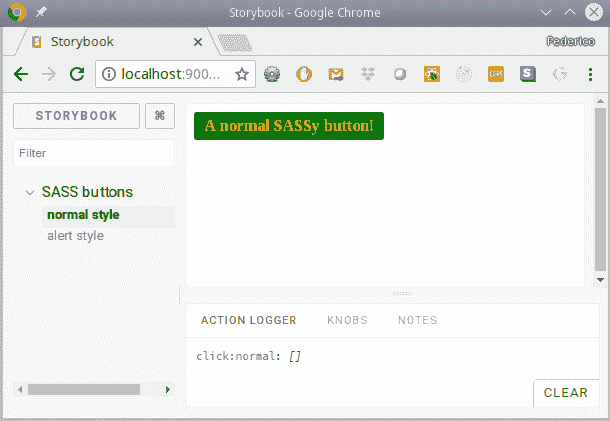

我们在 Storybook 中展示的普通按钮

警报按钮，带有悬停光标，如下截图所示：

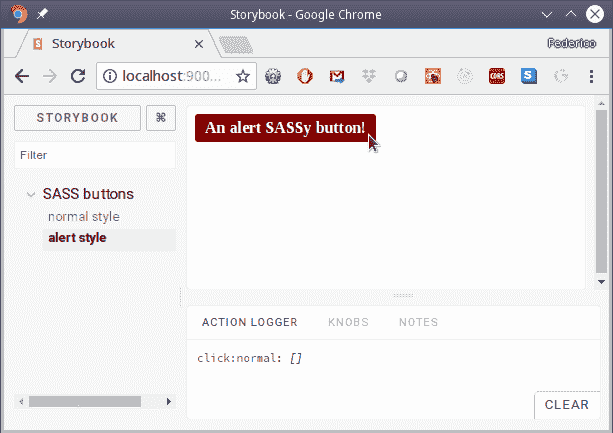

我们的警报按钮，带有悬停颜色

因此，我们已经看到了一个常见的解决方案：使用`SASS`创建 CSS。在下一节中，让我们以更原始的方式工作，通过在 JS 代码中直接使用 CSS 代码，而不是将其与 JS 代码分开！

# 为内联样式创建 StyledComponents

CSS-in-JS 有时是一个有争议的话题。在`React`之前，几乎是强制性的，您必须有一组 JS、HTML 和 CSS 分开的文件。当`React`引入 JSX 时，这是对这组的一种打击，因为我们开始在 JS 代码中放置 HTML。CSS-in-JS 是这个想法的自然延伸，因为现在我们也希望在同一个 JS 文件中包含样式。

对此的第一反应是：*这不就是回到了内联样式吗？*这是一个合理的问题，但内联样式并不足够强大。虽然您可以通过内联样式管理大量样式，但事实是，有一些功能无法以这种方式访问：关键帧动画、媒体查询、伪选择器等等。

选择 CSS-in-JS 的想法是通过使用 JS 编写样式，然后将这些样式注入 DOM 中的`<style>`标签中，因此您可以完全利用 CSS 来编写代码。此外，这也与基于组件的方法非常一致，例如 React 的方法，因为您设法将您需要的一切都封装在一起，而不是依赖全局样式文件并且必须处理 CSS 的单一命名空间。

有许多推广这种样式的包，其中，我们将选择`styled-components`，这是最受推崇的 CSS-in-JS 样式包之一。它的理念很有趣：不是向组件添加样式，而是创建包含这些样式并在各处使用它们的组件。让我们开始看看如何将这个软件包添加到我们的代码中，然后继续使用它。

关于 CSS-in-JS 的原始讨论，由 Christopher *vjeux* Chedeau 主讲，他阐述了在 JS 中处理样式的原因，请参阅[`speakerdeck.com/vjeux/react-css-in-js`](https://speakerdeck.com/vjeux/react-css-in-js)。

# 如何做…

安装`styled-components`非常简单 - 请注意，这不是开发依赖，因为您实际上将在生产代码中使用该软件包，而不是作为单独的预处理步骤或类似的东西：

```js
npm install styled-components --save
```

我们将使用标记模板文字（我们之前在第二章的*使用现代 JavaScript 功能*中看到过），因此您可能希望刷新一下书中的那部分。

使用`Flow`不会有问题，因为它对`styled-components`的支持很好，所以我们不需要做任何特别的事情。最后，对于 VSC，您可能希望使用`vscode-styled-components`扩展来添加语法高亮显示。

阅读`styled-components`的完整文档，网址为[`www.styled-components.com/docs`](https://www.styled-components.com/docs)。

# 它是如何工作的…

让我们尝试通过使用我们的新工具来重新创建我们用`SASS`构建的按钮。我们不会尝试模仿`SASS`代码，但我们将尝试应用一些相同的概念，比如在单独的文件中定义常量，使函数作为 mixin 工作，并扩展类，就像我们之前做的那样。我们有一个问题，因为`styled-components`不像`SASS`那样提供颜色函数，所以我们将添加一个新库来处理这个问题，`color`：

这个包为您提供了许多方法来创建和操作颜色，所以您最好看一下它的文档，网址是[`github.com/qix-/color`](https://github.com/qix-/color)。

```js
npm install color --save
```

现在，我们已经准备好了。首先，我们将在`constants.js`文件中定义一些基本的颜色常量，可以在任何地方使用：

```js
export const NORMAL_COLOR = "green";
export const NORMAL_TEXT = "yellow";

export const ALERT_COLOR = "red";
export const ALERT_TEXT = "white";
```

还有一种通过主题来共享全局样式数据的替代方法；如果您感兴趣，请查看[`www.styled-components.com/docs/advanced#theming`](https://www.styled-components.com/docs/advanced#theming)。

现在我们将直接开始定义我们的组件，因为所有的样式也将在那里。首先，我们需要一些导入：

```js
// Source file: /src/components/styledButton/styledButton.js

/* @flow */

import React from "react";
import PropTypes from "prop-types";
import styled from "styled-components";
import Color from "color";

import {
    NORMAL_TEXT,
    NORMAL_COLOR,
    ALERT_TEXT,
    ALERT_COLOR
} from "./constants";

// *continues...*
```

有了这个，我们可以开始主要的代码了。我们将有一个`makeSpan()`函数，它将作为一个 mixin；我们很快就会用到它，并且我们会看到`props`的含义：

```js
// ...*continued*

const makeSpan = props => `
    span {
        color: ${props.normal ? NORMAL_TEXT : ALERT_TEXT};
        font-weight: bold;
    }
`;

// *continues...*
```

然后，我们将定义一个`BasicStyledDiv`组件，带有一些基本样式，作为我们按钮的基类。（记住，我们正在以这种不必要的复杂方式工作，只是为了突出一些您可能想在真正需要的问题中使用的功能！）这个组件将大致相当于我们在上一节中使用`SASS`声明的`%baseButton`：

```js
// ...*continued*

const BasicStyledDiv = styled.div`
    display: inline-block;
    text-decoration: none;
    padding: 5px 10px;
    border-radius: 3px;
`;

// *continues...*
```

之后，我们可以通过扩展之前的组件来创建一个`StyledDiv`组件。由于`styled-component`让我们可以使用函数和表达式，我们不必像在构建`.normalButton`和`.alertButton`时那样创建两种不同的样式，就像我们在`SASS`中所做的那样。另外，请注意，我们可以在这里使用`&`，表示对类的引用，就像在`SASS`中一样：

```js
// ...*continued*

const StyledDiv = BasicStyledDiv.extend`
    background-color: ${props =>
        props.normal ? NORMAL_COLOR : ALERT_COLOR};
    &:hover {
        background-color: ${props =>
            Color(props.normal ? NORMAL_COLOR : ALERT_COLOR)
                .darken(0.25)
                .string()};
        transition: all 0.5s ease;
    }
    ${props => makeSpan(props)};
`;

// *continues...*
```

我们看到的这个`props`参数是什么？在创建样式时，组件的 props 将传递给我们的代码，因此我们可以调整我们的样式。在这种情况下，如果组件的`this.props.normal`值为`true`，将使用`NORMAL_COLOR`；否则，将应用`ALERT_COLOR`。这大大简化了我们的代码，因为我们不必以固定的方式创建样式；我们可以使它们调整到我们想要的任何东西。

在所有这些之后，我们的按钮本身的代码非常简单：

```js
// ...*continued*

export class StyledButton extends React.PureComponent<{
    normal: boolean,
    buttonText: string,
    onSelect: void => void
}> {
    static propTypes = {
        normal: PropTypes.bool.isRequired,
        buttonText: PropTypes.string.isRequired,
        onSelect: PropTypes.func.isRequired
    };

    render() {
        return (
 <StyledDiv
 normal={this.props.normal}
 onClick={this.props.onSelect}
 >
                <span>{this.props.buttonText}</span>
 </StyledDiv>
        );
    }
}

// *continues...*
```

编写一个故事来检查这实际上是微不足道的，因为我们只需要复制我们为`SASS`样式按钮编写的上一个故事，并用`StyledButton`替换`SassButton`；不需要其他任何东西。（好吧，我还为了清晰起见改变了一些字符串，但这些修改微不足道。）如果我们启动`Storybook`，我们可以快速验证我们的新按钮与之前的按钮以相同的方式工作；请参见以下截图作为证据：

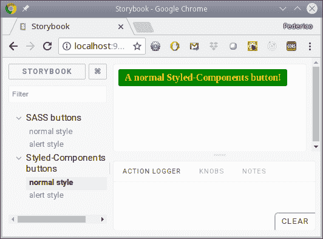

使用`styled-components`与 SASS 一样成功，而且更“JavaScripty”

如果您想获得一些具体的提示，并学习一些新技巧，请查看[`github.com/styled-components/styled-components/blob/master/docs/tips-and-tricks.md`](https://github.com/styled-components/styled-components/blob/master/docs/tips-and-tricks.md)。

# 使您的应用程序对屏幕尺寸做出响应

创建 Web 应用程序意味着您不能假设任何给定的显示尺寸。实际上，用户可能会更改浏览器窗口的大小，您的应用程序应该以某种方式对此做出响应，重新排列屏幕上显示的内容，以更好地适应当前的屏幕尺寸。如果您的 Web 应用程序能够进行这种重新组织，就可以说它是*响应式*的。如今，鉴于具有浏览器的设备范围极其广泛（从小型手机到非常大的平板显示屏），进行响应式设计确实是必不可少的，因此在本节中我们将看到如何处理这个问题。我假设您已经了解 CSS 概念，比如网格和列设计；如果不了解，请阅读相关内容。

为了消除一个常见的，相当明显的问题，如果你了解当前 CSS 的趋势，你可能会问为什么我们不使用 Flexbox 或 CSS Grids，这两者都可以轻松实现响应式设计。答案在于可用性：如果你查看诸如[`www.caniuse.com/`](https://www.caniuse.com/)这样的地方，你会发现这些功能最近才可用，因此用户可能还没有访问权限。总之，注意以下内容：

+   Internet Explorer 对这两个功能有部分支持，但有许多错误

+   Edge 自 2018 年 4 月的版本 17 开始支持它们

+   FireFox 自 2018 年 5 月的版本 60 开始支持它们

+   Safari 自 2018 年 3 月的 11.1 版本开始支持它们

+   Chrome 自 2016 年 3 月的版本 49 开始支持 FlexBox，但自 2018 年 4 月的版本 66 开始支持 CSS Grid

正如你所看到的，如果你想使用这些功能，截至今天（2018 年 12 月），只有少数用户可能可以访问它们，而对于绝大多数用户来说，显示可能会混乱。因此，即使这意味着使用比需要更大的库，我们将选择当前标准，正如我们将在下一节中看到的。

# 如何做…

`Bootstrap`是最受欢迎的用于网站和 Web 应用程序设计的前端库之一，自 2011 年 8 月就已经可用；它已经有大约七年的历史了。自第 2 版以来就包括了响应式设计处理。*移动优先设计*（所以你应该首先让你的设计在较小的设备上工作，然后才担心为较大的屏幕添加处理）是在第 3 版中包括的，而`SASS`支持出现在第 4 版中。除了响应式设计支持，`Bootstrap`还提供其他功能，如组件、排版和更多实用工具，所以你可能不要错过查看整个文档[`getbootstrap.com/docs/4.1/getting-started/introduction/`](https://getbootstrap.com/docs/4.1/getting-started/introduction/)。

`Bootstrap`目前是 GitHub 的第二大关注项目，紧随 FreeCodeCamp 的第一名。如果你想知道，`React`实际上几乎与另一个框架`Vue`和 EBook 的免费编程书籍套装的第三名并列。你可以在[`github.com/search?o=desc&q=stars%3A%3E1&s=stars&type=Repositories`](https://github.com/search?o=desc&q=stars%3A%3E1&s=stars&type=Repositories)上自行查看结果。

要安装`Bootstrap`，我们只需要常规的`npm`命令：

```js
npm install bootstrap --save
```

你可以通过下载预构建的图像（包括 CSS 和 JS）来保存你的工作；查看[`getbootstrap.com/docs/4.1/getting-started/download/`](https://getbootstrap.com/docs/4.1/getting-started/download/)获取这些选项。另外，还有一个`React`包[`react-bootstrap.github.io/`](https://react-bootstrap.github.io/)，`react-bootstrap`，它目前只支持`Bootstrap`第 3 版，但承诺即将全面支持`Bootstrap`第 4 版。你可能还想看看另一个可能的选择，`reactstrap`，在[`reactstrap.github.io/`](https://reactstrap.github.io/)。

`Bootstrap`提供了许多功能，包括：

+   *组件*，如警报、按钮、下拉菜单、导航栏等等；查看[`getbootstrap.com/docs/4.1/components`](https://getbootstrap.com/docs/4.1/components)获取完整列表

+   *表格*，一个常见的第三方组件，有许多配置选项；查看[`getbootstrap.com/docs/4.1/content/tables`](https://getbootstrap.com/docs/4.1/content/tables)获取更多信息。

+   *与排版相关的元素*，处理设计中使用的许多字体；查看[`getbootstrap.com/docs/4.1/content/typography/S`](https://getbootstrap.com/docs/4.1/content/typography/)

+   *样式细节*，如边框、颜色、阴影、大小等；阅读[`getbootstrap.com/docs/4.1/utilities/`](https://getbootstrap.com/docs/4.1/utilities/)

在任何情况下，我们不会专门处理前面的列表，因为这基本上只是样式的问题，而我们已经做过了。相反，我们将专注于定位元素，改变它们的大小，甚至根据当前屏幕大小隐藏或显示它们；让我们现在继续进行。

# 它是如何工作的...

`Bootstrap`使用基于 12 列的网格系统，具有基于媒体查询的多个设备尺寸的断点：

+   `xs`：非常小，例如纵向手机，宽度小于 576 像素

+   `sm`：小，如横向手机，最大到 768 像素

+   `md`：中等，如平板电脑，最大到 992 像素

+   `lg`：大，如台式机，最大到 1200 像素

+   `xl`：超大，超过 1200 像素

这些限制并非是硬编码的，可以更改。其他常见的值是 1024 和 1440，而不是 992 和 1200。另一个可能性是考虑高清设备（1920x1080）和 4K 设备，分辨率为 2560x1600。

无论何时放置元素，您都可以指定它们的宽度以列为单位，并且根据可用的行空间进行排列，如果需要，可以移动到新的行。您还可以根据屏幕尺寸允许元素的不同大小和顺序，并根据可用空间甚至隐藏或显示组件（完全或部分）。 

# 调整元素大小

通过使用`col-xx-yy`类（例如`col-sm-3`或`col-md-5`），您可以根据当前屏幕宽度决定元素的大小。以下代码示例显示了这一点，并请注意我避免了使用单独的样式表，只是为了简化：

```js
// Source file: /src/App.1.js

/* @flow */

import React, { Component } from "react";

class App extends Component<{}> {
    render() {
        const cl = "border border-dark p-2 bg-warning ";

        return (
            <div className="container mw-100">
                <div className="row border">
 <div className={cl + "col-sm-2 col-md-6"}>2/6</div>
                    <div className={cl + "col-sm-4"}>4</div>
                    <div className={cl + "col-sm-1"}>1</div>
                    <div className={cl + "col-sm-1"}>1</div>
                    <div className={cl + "col-sm-1"}>1</div>
 <div className={cl + "col-sm-1 col-md-5"}>1/5</div>
                    <div className={cl + "col-sm-2 "}>2</div>
 <div className={cl + "col-sm-7 col-md-3"}>7/3</div>
                    <div className={cl + "col-sm-4 "}>4</div>
 <div className={cl + "col-sm-1 col-md-3"}>1/3</div>
                </div>
            </div>
        );
    }
}

export default App;
```

我们可以看到渲染如何随着屏幕尺寸的变化而改变；请参见以下图片：

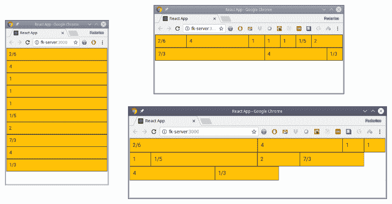

相同的元素，在不同的屏幕宽度下呈现

在最小的屏幕尺寸下，所有元素在垂直方向上都以相同的大小呈现；这在逻辑上适合非常小的设备。随着窗口大小的增加，7/3 元素现在占据了 7 列，而 2/6、1/5 和 1/3 元素变窄了。当我们进一步增加窗口宽度时，请注意 7/3 元素仅占据了三列，而其他 3 个元素变宽了。

当然，您几乎不太可能会设计出这种奇怪的设计，具有如此多不同的宽度和如此奇特的调整规则，但这里的重点是，通过使用`Bootstrap`网格，元素可以在大小上变化，并且可以优雅地流动到不同的行，而无需做任何特殊处理。

# 重新排序元素

在前面的例子中，我们看到了组件如何调整大小并跨行流动。然而，还有其他要求：例如，您可能希望组件在给定屏幕尺寸下出现在不同位置。幸运的是，`Bootstrap`也允许这样做。让我们有一个元素会在其他元素中改变位置：

```js
// Source file: /src/App.2.js

/* @flow */

import React, { Component } from "react";

class App extends Component<{}> {
    render() {
        const cl = "border border-dark p-2 bg-warning ";
        const ch = "border border-dark p-2 bg-dark text-white ";

        return (
            <div className="container mw-100">
                <div className="row border">
                    <div className={cl + "col-sm-2 col-md-6"}>2/6</div>
                    <div className={cl + "col-sm-4"}>4</div>
                    <div className={cl + "col-sm-1"}>1</div>
 <div
 className={
 ch + "col-sm-1 order-sm-first order-md-
                            last"
 }
 >
 1
 </div>
                    <div className={cl + "col-sm-1 col-md-5"}>1/5</div>
                    <div className={cl + "col-sm-3 "}>3</div>
                </div>
            </div>
        );
    }
}

export default App;
```

对于小设备，我们的特殊组件应该是第一个，对于中等设备，它应该移动到最后。对于非常小的设备（我们没有提供任何特殊规则），它应该出现在正常位置。请参见以下图片：

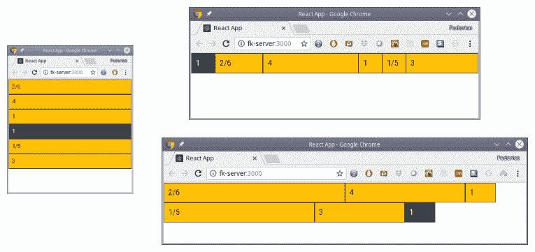

组件还可以改变它们的相对位置。

这满足了常见的第二组要求，让您可以随意变化组件在屏幕上出现的顺序。我们只有一个更多的情况，我们将在下一节中看到。

# 隐藏或显示元素

我们的最终设计规则是，某些组件（或其中的部分）在给定的屏幕尺寸下可能不应该显示。例如，如果您正在提供有关电影的信息，在大屏幕上，您可以包括一场戏的静态画面，以及主要演员的照片，以及电影标题和完整描述，但在小屏幕上，您可能只需要电影标题和基本信息。让我们用一对组件展示这种要求：一个将完全隐藏，而另一个将只隐藏部分内容：

```js
// Source file: /src/App.3.js

/* @flow */

import React, { Component } from "react";

class App extends Component<{}> {
    render() {
        const cl = "border border-dark p-2 bg-warning ";
        const ch = "border border-dark p-2 bg-dark text-white ";

        return (
            <div className="container mw-100">
                <div className="row border">
                    <div className={cl + "col-sm-2 col-md-6"}>2/6</div>
 <div className={ch + "d-none d-sm-block col-sm-4"}>
 0/4
 </div>
                    <div className={cl + "col-sm-2"}>2</div>
                    <div className={cl + "col-sm-2"}>2</div>
                    <div className={cl + "col-sm-1 col-md-5"}>1/5</div>
                    <div className={cl + "col-sm-3 "}>3</div>
 <div className={ch + "col-sm-7 "}>
 <div>TOP</div>
 <div className="d-none d-sm-block">(MIDDLE)
                        </div>
 <div>BOTTOM</div>
 </div>
                    <div className={cl + "col-sm-4 "}>4</div>
                </div>
            </div>
        );
    }
}

export default App;
```

要查看此操作，请查看以下图片：

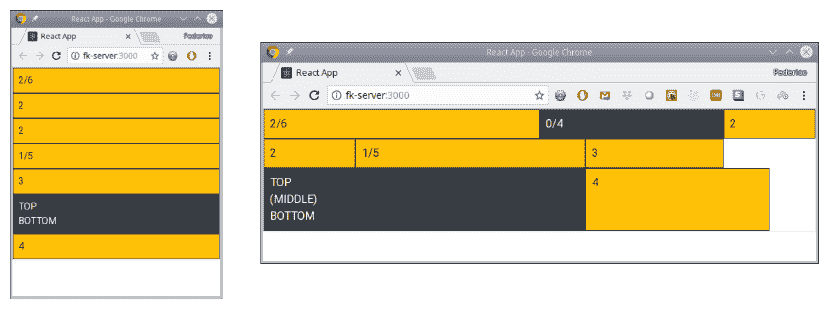

一个组件在小屏幕上完全消失，而其他组件显示不同的内容

0/4 组件设置为仅在小屏幕及更大屏幕上显示，因此在左侧截图中它就消失了。另一个组件在较小的屏幕上显示两行，但在较大的屏幕上显示更多内容（好吧，是三行而不是两行）。

# 使您的应用程序适应以提高可用性

通过使用我们在前一节中看到的网格和所有样式，在许多情况下，您不需要额外的东西来构建响应式网站。然而，在某些情况下，移动组件，调整它们的大小，甚至隐藏部分或全部内容是不够的。例如，您可能确实希望在小屏幕和大屏幕上显示完全不同的组件 - 比如，手机上有三个选项卡的屏幕，一次只显示一个选项卡，但在台式机上有三列显示，同时显示所有内容。变化可能会更加激烈：您可能会决定某些功能在移动设备上不可用，而只包含在大屏幕上。因此，您不是在进行响应式设计，而是在进行自适应设计，这意味着屏幕的实际设计和功能将发生变化，然后我们需要能够处理代码中的内部变化。

# 如何做…

如果您想自己进行自适应设计，您当然可以设置监听屏幕尺寸或方向变化，然后生成一些组件或其他内容。虽然这种方法没有错，但通过安装`react-responsive`，可以使其变得更简单，该软件包会处理所有这些事情 - 您只需指定在满足某些条件时将渲染一些组件，每当满足条件时，这些组件将被渲染。在任何尺寸或方向变化时，该软件包将处理所需的任何重新渲染。

安装需要使用常规的`npm`命令：

```js
npm install react-responsive --save
```

该软件包中的关键组件称为`<MediaQuery>`，它让您可以使用媒体查询或使用属性来处理，更像是`React`；我更喜欢后者，但如果您对更像 CSS 的选项感兴趣，请查看文档。现在让我们看看它是如何使用的。

在[`github.com/contra/react-responsive`](https://github.com/contra/react-responsive)上阅读有关`react-responsive`的更多信息。它的功能比我在本文中展示的要多得多。

# 它是如何工作的…

基本上，您只需要在渲染时生成一个或多个`<MediaQuery>`组件来检测任何尺寸变化，那些满足要求的组件将被实际渲染，而其余的将不会出现在页面上。

让我们写一个非常基本的例子，其中包含大量的媒体查询，以查看您将要使用的编码风格。以下是在 react-responsive GitHub 页面上给出的一个例子；我们将尝试检测当前设备和窗口的一些方面：

```js
// Source file: /src/App.4.js

/* @flow */

import React, { Component } from "react";
import MediaQuery from "react-responsive";

const XS = 576; // phone
const SM = 768; // tablet
const MD = 992; // desktop
const LG = 1200; // large desktop

class App extends Component<{}> {
    render() {
        return (
            <div>
                <MediaQuery minDeviceWidth={MD + 1}>
                    <div>Device: desktop or laptop</div>

                    <MediaQuery maxWidth={XS}>
                        <div>Current Size: small phone </div>
                    </MediaQuery>

                    <MediaQuery minWidth={XS + 1} maxWidth={SM}>
                        <div>Current Size: normal phone</div>
                    </MediaQuery>

                    <MediaQuery minWidth={SM + 1} maxWidth={MD}>
                        <div>Current Size: tablet</div>
                    </MediaQuery>

                    <MediaQuery minWidth={MD + 1} maxWidth={LG}>
                        <div>Current Size: normal desktop</div>
                    </MediaQuery>

                    <MediaQuery minWidth={LG + 1}>
                        <div>Current Size: large desktop</div>
                    </MediaQuery>
                </MediaQuery>

                <MediaQuery maxDeviceWidth={MD}>
                    <div>Device: tablet or phone</div>
                    <MediaQuery orientation="portrait">
                        <div>Orientation: portrait</div>
                    </MediaQuery>
                    <MediaQuery orientation="landscape">
                        <div>Orientation: landscape</div>
                    </MediaQuery>
                </MediaQuery>
            </div>
        );
    }
}

export default App;
```

我定义了四个大小常量（`XS`，`SM`，`MD`和`LG`）以匹配`Bootstrap`使用的值，但您当然可以使用其他大小。

您还可以修改`Bootstrap`中的值，以便它可以与不同的断点一起使用：请参阅[`getbootstrap.com/docs/4.1/layout/grid/#grid-tiers`](https://getbootstrap.com/docs/4.1/layout/grid/#grid-tiers)了解更多信息。

每当我们的`App`组件被渲染时，媒体查询都会被执行，根据它们的结果，组件将会或不会被渲染。在我们的情况下，我们只是生成一些带有文本的`<div>`实例，但显然您可以实际上生成任何其他类型的组件。

我们可以在 Chrome 中运行这个应用程序，并在调整窗口大小时查看它如何生成不同的内容：参见下图：

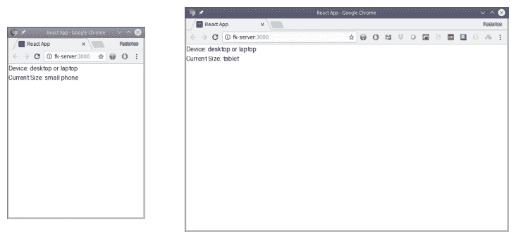

我们的组件会自动对任何屏幕尺寸的变化做出反应，并生成不同的组件，即使我们的示例缺乏多样性！

或者，您可以在工具栏中使用设备切换功能，然后还可以查看您的应用程序在手机或平板电脑上的外观； 请查看以下屏幕截图以了解示例：

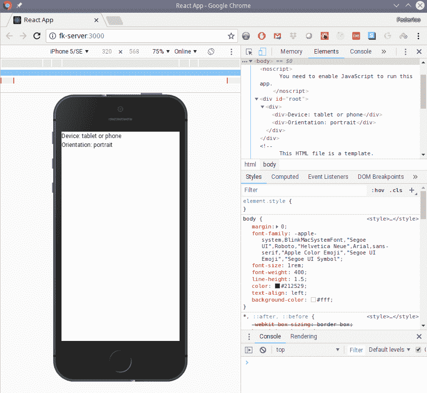

Chrome 的开发者工具包括设备切换功能，可以模拟多种设备，包括手机和平板电脑

使用`Bootstrap`进行简单调整，使用`react-responsive`进行更复杂的工作，可以确保您的应用程序适合在任何设备上运行。 现在让我们转向另一种情况：在不同的国家或地区运行！

# 制作具有国际化和本地化的全球应用

随着全球化水平的不断提高，您编写的任何网站可能需要使用两种或更多种语言。 在加拿大，英语和法语是强制性的； 在瑞士，可能需要四种语言； 甚至在（据说是单一语言的）美国，西班牙语版本的网站也可能会添加到英语版本中。 当然，仅仅翻译是不够的：日期和货币金额也需要根据国家的不同格式进行不同的格式化，因此我们也必须处理这一点。

现在，一些定义：能够使软件适应不同语言称为*国际化*，通常缩写为*i18n*——18 代表了*国际化*一词中的初始*i*和最终*n*之间的 18 个字母。然后，配置系统以适应特定区域的具体过程称为*本地化*，缩写为*l10n*，原因与*i18n*类似。最后，如果您真的喜欢这些*数字字母缩写*，国际化和本地化的组合也被称为*全球化*，缩写为*g11n*。

这对定义是基于 W3C 的一份文件，网址为[`www.w3.org/International/questions/qa-i18n`](https://www.w3.org/International/questions/qa-i18n)。 在那里，他们定义了“国际化是设计和开发[...]，使得易于适应不同文化，地区或语言的目标受众”，“本地化是指根据特定目标市场（区域设置）的语言，文化和其他要求进行调整”。

幸运的是，在`React`中处理这些方面很简单，只需要提前进行一些规划，我们将在本教程中看到。

# 如何做…

处理所有 i18n 问题的一个很好的包是`i18next`。 我们可以使用以下命令安装它，以及一个用于检测浏览器语言的包：

```js
npm install i18next i18next-browser-languagedetector --save
```

您还需要决定一个备用语言（可能是`"en"`，表示英语），并为应用程序中使用的所有字符串提供翻译。 为了体验一下，对于一个虚构的数据输入表单（在一个非常小的应用程序中；通常情况下，您可能会有数百种翻译！），您可以为英语准备以下`translations.en.json`文件：

```js
{
    "details": "Details",
    "number": "How many things?",
    "color": "Thing Color",
    "send it before": "Send the thing before",
    "please enter details": "Please, enter details for your thing:",
    "summary": "Your only thing will be there before {{date, 
     AS_DATE}}",
    "summary_plural":
        "Your {{count}} things will be there before {{date, AS_DATE}}",
    "colors": {
        "none": "None",
        "steel": "Steel",
        "sand": "Sand"
    }
}
```

如果您决定还提供西班牙语（`"es"`）翻译，您将添加另一个文件`translations.es.json`。 （注意：您可以以任何您希望的方式命名文件，不必遵循我的示例。）这个新的 JSON 文件具有完全相同的键，但是用西班牙语翻译：

```js
{
    "details": "Detalles",
    "number": "¿Cuántas cosas?",
    "color": "Color de la cosa",
    "send it before": "Enviar antes de",
    "please enter details": "Por favor, ingrese detalles para su 
     cosa:",
    "summary": "Su única cosa llegará antes de la fecha {{date, 
     AS_DATE}}",
    "summary_plural":
        "Sus {{count}} cosas llegarán antes del {{date, AS_DATE}}",
    "colors": {
        "none": "Ninguno",
        "steel": "Acero",
        "sand": "Arena"
    }
}
```

其思想是，每当您想要显示一些文本时，您将通过其键（例如`"details"`或`"number"`）引用它，最终提供额外的参数（如`"summary"`），然后翻译包将选择正确的字符串进行显示； 让我们通过完成一个示例来看看它是如何工作的。

`i18next`包还可以处理复数和特定格式规则。 您首先必须初始化它，如下所示； 我们正在创建一个`i18n`文件：

```js
// Source file: /src/components/i18nform/i18n.js

import i18n from "i18next";
import LanguageDetector from "i18next-browser-languagedetector";

import EN_TEXTS from "./translations.en.json";
import ES_TEXTS from "./translations.es.json";

i18n.use(LanguageDetector).init({
    resources: {
        en: { translations: EN_TEXTS },
        es: { translations: ES_TEXTS }
    },
    fallbackLng: "en",
    ns: ["translations"],
    defaultNS: "translations",
    debug: true,
    interpolation: {
        escapeValue: false,
        format: function(value, format, lang = i18n.language) {
            if (format === "AS_DATE") {
                try {
                    const dd = new Date(value);
                    return new Intl.DateTimeFormat(lang).format(
                        new Date(
                            dd.getTime() + dd.getTimezoneOffset() * 
                            60000
                        )
                    );
                } catch (e) {
                    return "???";
                }
            } else {
                return value;
            }
        }
    }
});

const t = i18n.t.bind(i18n); // to allow using t(...) instead of i18n.t(...)

export { i18n, t };
```

关于代码的一些细节应该注意：

+   `use（...）`方法告诉`i18next`使用浏览器语言检测器包。

+   在`resources`属性中，您必须为每种语言提供一组翻译，我们从我们的 JSON 文件中导入。

+   `fallbackLng`指定英语（`"en"`）将是默认语言。

+   `ns`和`defaultNS`定义了翻译的命名空间，通常只是*translations*，就像我们在`resources`属性中使用的那样。

+   `debug`是一个很好的工具，因为它将在控制台记录任何您想要翻译但在资源中未定义的键。

+   `interpolation.escapeValue`为您提供了转义所有值的选项：您可以使用它来显示未选中的用户输入值，但我们在这里不需要它。

+   `interpolation.format`允许您定义一个特殊的格式化函数，该函数应该为给定值以特定格式在特定语言下产生您想要的任何输出。在我们的案例中，我们将其与`summary`和`summary_plural`键一起使用，以便以适当的样式格式化日期：英语为月/日/年，西班牙语为日/月/年。您还可以使用此函数将数字格式化为货币，例如。

您可以在[`www.i18next.com/`](https://www.i18next.com/)上查看`i18next`的完整文档。

# 它是如何工作的...

想象我们正在定义一个输入表单，让您订购一些东西，选择它们的颜色，并决定交付的最终日期。我们的`<I18nForm>`组件可以编码如下-请注意，我们只关注输入表单，不关注实际*执行*用户数据！同样，不要关注糟糕的 UI 设计；再次强调，我们关心的是翻译，所以我希望尽可能少的额外 JSX 代码：

```js
// Source file: /src/components/i18nform/i18nform.js

/* @flow */

import React from "react";

import "./styles.css";

import { i18n, t } from "./i18n";

export class I18nForm extends React.PureComponent<
    {},
    {
        delivery: String,
        howMany: Number,
        thingColor: String
    }
> {
    state = {
        delivery: "2018-09-22",
        howMany: 1,
        thingColor: "NC"
    };

    constructor(props) {
        super(props);
        this.rerender = () => this.forceUpdate();
    }

    componentDidMount() {
        i18n.on("languageChanged", this.rerender);
    }

    componentWillUnmount() {
        i18n.off("languageChanged", this.rerender);
    }

    render() {
        return (
            <div>
                <div>
                    <h2>{t("details")}</h2>
                    <button onClick={() => i18n.changeLanguage("es")}>
                        ES
                    </button>
                    <button onClick={() => i18n.changeLanguage("en")}>
                        EN
                    </button>
                </div>
                <br />
                <div>{t("please enter details")}</div>
                <br />
                <div>
                    {t("send it before")}:
                    <input
                        type="date"
                        value={this.state.delivery}
                        onChange={e =>
                            this.setState({ delivery: e.target.value })
                        }
                    />
                </div>
                <div>
                    {t("number")}:
                    <input
                        type="number"
                        min="1"
                        value={this.state.howMany}
                        onChange={e =>
                            this.setState({
                                howMany: Number(e.target.value)
                            })
                        }
                    />
                </div>
                <div>
                    {t("color")}:
                    <select
                        onChange={e =>
                            this.setState({ thingColor: e.target.value })
                        }
                    >
                        <option value="NC">{t("colors.none")}</option>
                        <option value="ST">{t("colors.steel")}</option>
                        <option value="SD">{t("colors.sand")}</option>
                    </select>
                </div>
                <br />
                <div>
                    {t("summary", {
 count: this.state.howMany,
 date: this.state.delivery
 })}
                </div>
            </div>
        );
    }
}
```

应该注意代码的一些细节：

+   通过对象传递插值的额外参数（就像`"summary"`键一样）是通过对象完成的，使用所需的参数

+   如果要为单数和复数版本定义不同的行，您必须像我们在这里做的那样定义两个键：单数的`summary`和复数的`summary_plural`，然后`i18next`将根据`count`参数的值决定使用哪个

我们如何处理动态语言更改？我们提供了两个按钮来调用`i18n.changeLanguage(...)`，但是我们如何重新渲染组件？至少有三种方法可以做到这一点：

+   您可以监听`"languageChanged"`事件并强制更新，这就是我们在这里所做的。（我们使用`.on(...)`来设置我们的组件进行监听，使用`.off(...)`在卸载时停止它。）

+   另一个解决方案是将当前选择的语言包含在应用程序状态中（我们将在下一章中进行讨论），并且您可以通过 props 将其提供给组件，因此`React`将在语言更改时重新渲染所有内容。

+   最后，您可以使用`react-i18next`框架包在[`github.com/i18next/react-i18next`](https://github.com/i18next/react-i18next)上提供更无缝的集成。

我们可以用一个非常简单的故事来测试我们的翻译：

```js
// Source file: /src/components/i18nform/i18nform.story.js

/* @flow */

import React from "react";
import { storiesOf } from "@storybook/react";

import { I18nForm } from "./";

storiesOf("i18n form", module).add("standard", () => <I18nForm />);
```

当故事加载时，它看起来如下屏幕截图所示：

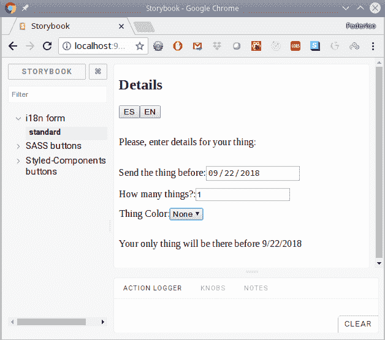

我们的输入表单，带有初始值，显示为英文

如果更改数量，底部的文本将相应更新；请参阅以下屏幕截图：

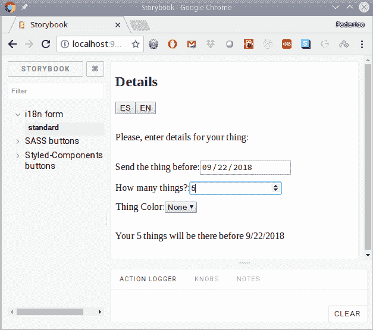

如果我们订购多件物品，将使用复数翻译。

而且，如果将语言更改为西班牙语，所有文本将自动翻译；请查看以下屏幕截图：

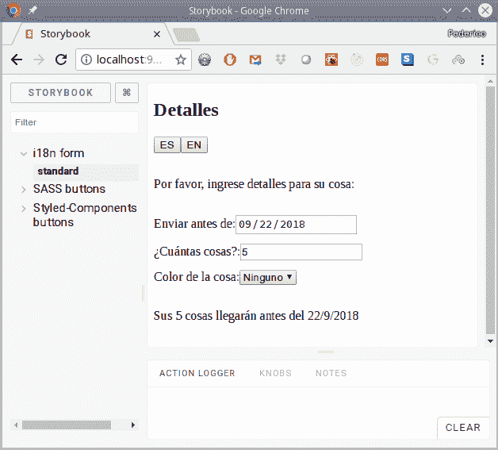

通过监听语言更改事件，我们可以强制组件重新渲染自身，并显示新选择语言的翻译

一个小细节：每当您使用日期`<input>`元素时，日期将根据您计算机的区域设置进行格式化，因此对于西班牙语，显示的值不会改变。但是，元素的值始终相同，采用 ISO 格式：在我们的案例中是`2018-09-22`。您可以通过使用特殊手工制作的组件来解决这个问题，但我们不会这样做，因为我们关心的是展示翻译是如何工作的。

正如我们所看到的，为国际使用准备应用程序并不是一个非常困难的问题。即使您一开始没有计划这样做，以这种方式工作也是值得的；在现有代码中进行翻译可能更难。

# 为辅助功能设置（a11y）

在设计网页时，“可访问性”一词指的是提供支持，以便包括残疾人在内的所有人都可以使用您的页面。因此，必须考虑许多需求，例如：

+   *视力限制*，从视力不佳，色觉问题，一直到完全失明

+   *听力限制*，需要为听力受损的用户提供一些备用方法

+   *移动限制*，可能意味着难以或无法使用手部或控制鼠标

+   *认知限制*，可能会使屏幕上显示的信息变得复杂

有许多工具可以帮助残疾用户，例如屏幕缩放，语音识别，屏幕阅读器，盲文终端，闭路字幕等，但即使这些工具也需要一些额外的信息才能正常工作。**Web 内容可访问性指南**（**WCAG**）是由**万维网联盟**（**W3C**）的**Web 可访问性倡议**（**WAI**）发布的一套指南。当前版本 2.1，可在线获取，网址为[`www.w3.org/TR/WCAG21/`](https://www.w3.org/TR/WCAG21/)，基于四个原则，即 POUR 作为首字母缩写：

+   *可感知性***：信息和用户界面组件必须以用户可以感知的方式呈现给用户

+   *可操作性*：用户界面组件和导航必须是可操作的

+   *可理解性*：用户界面的信息和操作必须是可理解的

+   *健壮性*：内容必须足够健壮，以便可以被各种用户代理解释，包括辅助技术

这些原则，引用自引用页面，包括使用颜色的指南，使用键盘工作，为屏幕阅读器提供信息，具有足够的对比度，显示错误等；*足够和建议的技术*，可以帮助遵循指南；以及*成功标准*，意味着可用于符合性测试的可测试条件。后者的标准也用于定义三个符合级别：*A*，最低级别；*AA*，中等级别，包括所有*A*和*AA*的成功标准，以及*AAA*，最难达到的级别，满足所有现有的标准，但也承认对于一些网站来说可能无法实现。

确保您的 Web 应用程序遵循所有指南并应用所有技术并不容易，因此我们将看看如何向`React`添加一些工具，以使您的任务变得更加容易。

# 如何做到…

为了检查我们的辅助功能工作，我们将安装一些软件包，因此让我们按照提到的步骤进行：一个用于编写代码时进行静态检查的软件包，使用`ESLint`，另一个用于运行应用程序时进行动态检查。如果你问自己*为什么要使用两个工具而不是一个？*，答案是静态工具无法检查一切：例如，如果您将变量的值分配给标题，那么该值在运行时不会为空吗？另一方面，由于您的所有代码都经过了检查，您有机会检测一些在正常测试期间可能被忽略的事情，因此通过使用两个工具，您并不是在做冗余工作，而是增加了发现辅助功能问题的几率。

安装`ESLint`模块非常简单。首先，我们将使用`npm`添加该软件包：

```js
npm install eslint-plugin-jsx-a11y --save-dev
```

然后，我们将不得不稍微修改我们的`.eslintrc`文件，添加新的插件，并指定我们要强制执行的规则。

```js
{
    .
    .
    .
    "extends": [
        "eslint:recommended",
        "plugin:flowtype/recommended",
        "plugin:react/recommended",
 "plugin:jsx-a11y/recommended"
    ],
    "plugins": ["babel", "flowtype", "react", "jsx-a11y"],
    .
    .
    .
}
```

如果您不想使用所有规则（就像我们在这里所做的那样），您可以在文件的`"rules"`部分中指定您关心的规则：请参阅[`github.com/evcohen/eslint-plugin-jsx-a11y`](https://github.com/evcohen/eslint-plugin-jsx-a11y)获取有关此内容的详细信息，并检查[`github.com/evcohen/eslint-plugin-jsx-a11y/tree/master/docs/rules`](https://github.com/evcohen/eslint-plugin-jsx-a11y/tree/master/docs/rules)上提供的所有规则的完整集合。

我们想要的第二个添加是`react-a11y`，这是一个在 React 渲染函数内部修改的软件包，因此可以在运行时检测到可访问性问题。安装很简单：

```js
npm install react-a11y --save
```

然后，在应用程序启动时，您将不得不初始化`a11y`模块，以及您想要检查的规则。规则的格式与`ESLint`使用的相同。检查[`github.com/reactjs/react-a11y/tree/master/docs/rules`](https://github.com/reactjs/react-a11y/tree/master/docs/rules)获取完整列表，因为可能会添加新规则。（您还必须查看该列表，以了解哪些规则（如果有的话）具有特殊选项。）默认情况下，所有规则都是“关闭”的，因此您必须明确将它们打开为“警告”或“错误”。截至 2018 年 12 月，完整的配置如下：

```js
import React from "react";
import ReactDOM from "react-dom";
import a11y from "react-a11y";

a11y(React, ReactDOM, {
    rules: {
        "avoid-positive-tabindex": "warn",
        "button-role-space": "warn",
        "hidden-uses-tabindex": "warn",
        "img-uses-alt": "warn",
        "label-uses-for": "warn",
        "mouse-events-map-to-key-events": "warn",
        "no-access-key": "warn",
        "no-hash-ref": "warn",
        "no-unsupported-elements-use-aria": "warn",
        "onclick-uses-role": "warn",
        "onclick-uses-tabindex": "warn",
        "redundant-alt": ["warn", ["picture", "image", "photo", "foto", 
        "bild"]],
        "tabindex-uses-button": "warn",
        "use-onblur-not-onchange": "warn",
        "valid-aria-role": "warn"
    }
});

// a11y.restoreAll() *would undo all changes*
```

您可能不希望在生产中启用`a11y`，以避免不必要的减速。

我们已经准备好了；现在让我们看看所有这些是如何结合在一起的。

# 它是如何工作的…

首先，让我们看看通过`ESLint`检测到的错误会发生什么，然后我们将转移到运行时问题。

# 解决静态问题

我们糟糕的`a11y`编码的第一个“受害者”是我们的 SASS 按钮；请参阅以下截图：

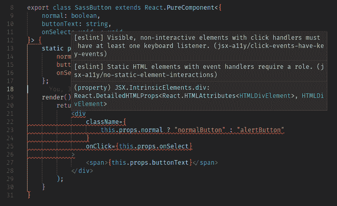

我们的 SASS 按钮至少有两个与可访问性相关的问题

一个`a11y`规则是你应该能够只使用键盘来使用应用程序，所以我们需要能够通过`tabIndex`来切换到按钮（这需要使用`tabIndex`），并提供一个键盘监听器（`onKeyPress`或`onKeyDown`）。此外，我们的元素的角色（作为按钮工作）必须被指定。更正后的 JSX 代码如下：

```js
<div
    className={
        this.props.normal ? "normalButton" : "alertButton"
    }
    onClick={this.props.onSelect}
 onKeyPress={this.keyDownAsClick}
 tabIndex="0"
 role="button"
>
    <span>{this.props.buttonText}</span>
</div>
```

新方法`.keyDownAsClick()`将检查用户是否按下空格键（ASCII 码 32）或*ENTER*键（ASCII 码 13），如果是，则调用与`onClick`处理程序相同的逻辑：

```js
keyDownAsClick = (e: { keyCode: number }) => {
    if (e.keyCode === 32 || e.keyCode === 13) {
        this.props.onSelect();
    }
}
```

我们的输入表格也有一个问题，尽管更简单。请参阅以下截图：

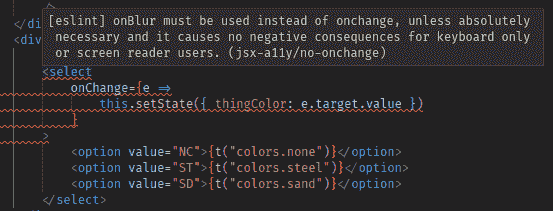

我们的物品订购表格只有一个小的 a11y 问题

问题及其解决方案很明显：建议用`onBlur`替换`onChange`，这对用户没有任何影响。鉴于所需更改很小，我们不会显示编辑后的代码，只需编辑文件以替换该方法。

我们可以尝试向我们的表单添加图像，只是为了获得另一个不同的警告。尝试向表单添加 Packt 标志，如下所示：

```js

```

在这种情况下，我们将收到有关需要`alt`属性的警告（向`img`标签添加`alt="Packt logo"`即可描述图像）；请查看以下截图：

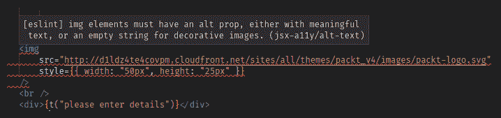

另一个 a11y 规则要求图像具有描述它们的 alt 属性

最后，让我们看一个我们的工具失败的案例！我们使用`styled-components`创建的按钮基本上与我们的`SASS`按钮有相同的问题，但没有报告任何问题；为什么？原因很简单：如果您检查代码（请参阅本章前面的*为单独的样式添加 SASS*部分），我们没有使用`<div>`或`<button>`实例或任何其他可识别的 HTML 标签，而是使用了`<StyledDiv>`和`<StyledButton>`，我们的`a11y eslint`插件无法理解。到目前为止，唯一的解决方法是手动将我们的样式组件更改回其原始标记，解决可能出现的任何问题，然后再回到样式版本，这显然不是一个很好的解决方案！

# 解决运行时问题

如果我们现在尝试在`Storybook`中使用我们的固定组件，`react-a11y`不会对它们发表任何意见，但它会报告`styled-components`的一些问题，这是我们之前无法解决的；请参见以下截图：

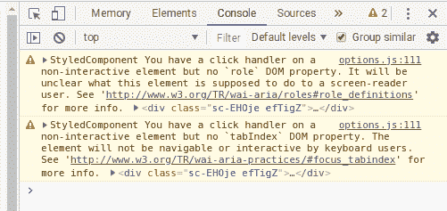

react-a11y 运行时测试显示了我们组件中的一些问题

当然，鉴于我们构建的组件与之前的`SASS`组件相匹配，不足为奇的是，解决辅助功能问题的解决方案是相同的：添加`onKeyDown`、`tabIndex`、`role`和一个键处理方法。已更正代码的相关部分如下：

```js
keyDownAsClick = (e: { keyCode: number }) => {
 if (e.keyCode === 32 || e.keyCode === 13) {
 this.props.onSelect();
 }
};

render() {
    return (
        <StyledDiv
            normal={this.props.normal}
            onClick={this.props.onSelect}
 onKeyDown={this.keyDownAsClick}
 tabIndex="0"
 role="button"
        >
            <span>{this.props.buttonText}</span>
        </StyledDiv>
    );
}
```

当然，我们只是看到了可能出现的所有问题及其解决方案的冰山一角，但真正重要的是您有一些工具来帮助您开发启用`a11y`的应用程序，正如我们所展示的那样。

# 还有更多

我们可以做些什么来确保一个完全符合`a11y`应用程序？不幸的是，您无法仅凭一些工具来管理它。例如，我们选择的工具中没有一个指出我们应该为输入字段添加名称，正如 ARIA 规则所指出的那样（有关更多信息，请参见[`w3c.github.io/using-aria/#fifth`](https://w3c.github.io/using-aria/#fifth)）。此外，有些条件无法在代码中进行测试。例如，指南指出，错误或强制字段不应仅通过颜色（由于色盲）进行突出显示，而应该有一些外部文本或标记；您如何以自动化方式测试这一点？请查看以下截图，这是从[`govuk-elements.herokuapp.com/errors/example-form-validation-multiple-questions`](https://govuk-elements.herokuapp.com/errors/example-form-validation-multiple-questions)中获取的示例，增强了错误的可见性：

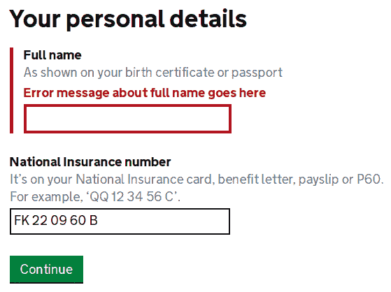

来自英国政府网站的示例输入表单，显示了良好的 a11y 实践，用于错误

没有经过审计，不可能获得 A、AA 或 AAA 级别，但您可以添加更多工具来帮助解决这个问题：

+   W3C Web Accessibility Initiative 在[`www.w3.org/WAI/ER/tools/`](https://www.w3.org/WAI/ER/tools/)提供了一个庞大的工具列表（截至今天为止有 113 个！）

+   A11Y 项目提供了一个社区努力，简化网络辅助功能，展示了一些有用的技术，网址为[`a11yproject.com/`](https://a11yproject.com/)

+   MDN 对 ARIA 进行了全面的概述，这是 W3C 专门为屏幕阅读器提供额外信息的规范，通过使用 HTML 属性，网址为[`developer.mozilla.org/en-US/docs/Web/Accessibility/ARIA/ARIA_Techniques`](https://developer.mozilla.org/en-US/docs/Web/Accessibility/ARIA/ARIA_Techniques)

+   W3C 还提供了许多关于使用 ARIA 的建议，包括代码示例，网址为[`w3c.github.io/using-aria/`](https://w3c.github.io/using-aria/)

+   有几种辅助功能检查器，适用于所有主要浏览器，可以在页面*运行时*诊断页面，所以只需搜索它们；有些作为浏览器扩展，而其他一些是用于添加到您的网站的代码，以便检测和报告可能的问题

即使没有单个工具或一组工具可以确保`a11y`合规性，您也可以构建自己的一套良好的起始工具；多做一些实验！
