# 第八章：扩展您的应用程序

在本章中，我们将专注于更大、更复杂的应用程序，添加以下示例：

+   使用 Redux 管理状态

+   使用 redux-thunk 执行异步操作

+   使用 react-router 添加路由

+   在路由中添加授权

+   性能的代码拆分

# 介绍

在前两章中，我们看到了如何使用`React`开发 Web 应用程序，并努力使它们国际化可用，对每个人都可访问，并且样式良好。在本章中，我们将添加一些更多的功能，这些功能是大多数应用程序的典型功能。

# 使用 Redux 管理状态

构建应用程序有什么困难？显然，您可以使用纯粹的 JS 做任何事情，但当您尝试保持应用程序的 UI 和状态同步时，事情开始变得复杂。您调用服务，获取数据。数据必须在多个位置反映，HTML 元素必须更改、添加或删除等等——这就是复杂性所在。

到目前为止，我们只在组件中处理状态，您完全可以继续这样做：您顶层组件的状态将包括您需要的一切，您可以通过将一切需要的内容作为 props 传递给下面的组件来管理。当然，随着应用程序的增长，这种方法将不太可行。什么时候会出现临界点？`Redux`是一个管理状态的工具，但其开发人员建议只有在满足以下条件时才使用他们的软件包，我引用自[`redux.js.org/#before-proceeding-further`](https://redux.js.org/#before-proceeding-further)：

+   <q class="calibre43">“您有合理数量的数据随时间变化。”</q>

+   <q class="calibre43">“您需要一个状态的单一真相来源。”</q>

+   <q class="calibre43">“您会发现将所有状态保留在顶层组件中已不再足够。”</q>

当然，这些规则并不是非常明确，并且允许主观性，因此没有明确的点需要使用`Redux`。然而，对于大多数现代大型应用程序来说，可以肯定地说`Redux`可能会派上用场，因此让我们在本章的其余部分假设如此。

在本教程中，我们将安装`Redux`，并开始看看如何在`React`中使用它。

# 准备工作

在任何其他操作之前，我们必须安装一些软件包：`redux`，状态管理软件包本身，以及用于在`React`中使用`Redux`的`react-redux`绑定。（您可以在其他框架或库中使用`Redux`，但本书不涵盖此内容。）安装很简单，只需使用`npm`，就像我们以前做过的那样：

```js
npm install redux react-redux --save
```

我们必须学习几个概念才能使用`Redux`：

+   *存储*: 应用程序状态的唯一位置（“单一真相来源”）。您在应用程序开始时全局创建存储，然后将组件*连接*到它。连接的组件在状态更改时将重新呈现，并且它们渲染所需的一切都应该来自存储。存储只能通过操作进行更新。

+   *操作*: 您的组件*dispatch*的对象，其中包含您希望的任何新数据。操作始终具有`type`属性以区分不同类型，并且没有限制的任何其他数据。操作通常由*操作创建者*创建以简化编码，并在被调度后由减速器处理。

+   *减速器*: 纯函数（意味着没有副作用！）根据操作接收的数据改变应用程序的状态。状态永远不会被修改；而是必须产生一个新状态，其中包含必要的任何更改。减速器根据旧状态和操作中接收的数据产生新状态。

这在以下图表中显示：

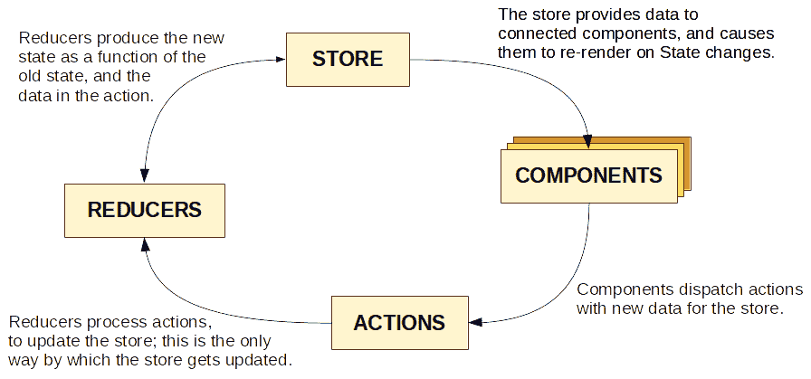

Redux 中的数据流是严格单向的，始终遵循循环模式

使用这种流程循环有助于保持状态和视图同步-因为后者是根据前者产生的，并且对状态的所有更新立即导致视图更新。我们已经安装了必要的工具，并且知道我们必须做什么；现在，让我们开始一个实际的例子。

您可能希望查看`eslint-plugin-redux`，它为您提供了如何充分利用`Redux`的一些规则。在[`github.com/DianaSuvorova/eslint-plugin-react-redux`](https://github.com/DianaSuvorova/eslint-plugin-react-redux)上查看它，如果您感兴趣，将其一些或全部规则添加到您的`ESLint`配置中；默认情况下，它们都是禁用的。

在这个示例中，让我们做一个简单的示例，展示前一节中大部分概念。在网上阅读了多篇文章和教程之后，我认为有必要提供涉及计数器的某种示例，并且让我们不要打破传统，在这里也做一下！我们想要一个可以通过点击按钮修改的计数器，并且我们还想知道我们点击了多少次。

# 如何做...

在我们开始编写代码之前，让我们公开：我们将为本可以轻松解决的问题编写太多行代码*而不需要* `Redux` - 我们不会有*合理数量的数据随时间变化*，而只有几个计数，我们肯定不会*发现将所有状态保留在顶级组件中*不够好，但由于我们想要一个简单的初始示例，我们仍然会使用`Redux`。

# 定义动作

首先，我们需要一些动作。我们想要增加和减少计数器，我们还想将其重置为零。前两个要求可以通过单个动作实现（减少只是通过负数增加），所以我们需要两个动作，每个都由一个常量标识：

```js
// Source file: src/counterApp/counter.actions.js

/* @flow */

export const COUNTER_INCREMENT = "counter:increment";
export const COUNTER_RESET = "counter:reset";

export type CounterAction = {
    type: string,
    value?: number
};

export const reset = () =>
    ({
        type: COUNTER_RESET
    }: CounterAction);

export const increment = (inc: number) =>
    ({
        type: COUNTER_INCREMENT,
        value: inc
    }: CounterAction);

export const decrement = (dec: number) =>
    ({
        type: COUNTER_INCREMENT,
        value: -dec
    }: CounterAction);

// *returning increment(-dec) would have worked as well*
```

实际上，我们应该说`increment()`，`decrement()`和`reset()`是动作创建者；这些函数返回的实际动作是值。

# 编写 reducer

然后，在定义我们的动作之后，我们需要一个 reducer 来处理它们。当然，这也意味着我们必须定义我们状态的形状和其初始值：

```js
// Source file: src/counterApp/counter.reducer.js

/* @flow */

import { COUNTER_INCREMENT, COUNTER_RESET } from "./counter.actions";

import type { CounterAction } from "./counter.actions.js";

export const reducer = (
 state = {
 // *initial state*
 count: 0,
 clicks: 0
 },
    action: CounterAction
) => {
    switch (action.type) {
        case COUNTER_INCREMENT:
            return {
                count: state.count + action.value,
                clicks: state.clicks + 1
            };

        case COUNTER_RESET:
            return { count: 0, clicks: state.clicks + 1 };

        default:
            return state;
    }
};
```

我们的 reducer 基本上是一个 switch 语句；当找到正确的类型时，将返回一个新的状态。这种模式非常重要，也是`Redux`的关键。我们不仅仅更新状态，而是每次生成一个新的状态对象。我们需要一个默认情况，因为动作会传递给所有 reducer（在我们的情况下不是这样，因为我们只有一个），所以可能会有一个 reducer 会忽略一个动作。

在我们的示例中，我们有一个单一的 reducer 和一组单一的动作，因此可以说它们都可以放在同一个文件中，但这在大多数应用程序中不太可能。此外，如果您的状态增长过大，请查看`combineReducers()`，并且您将能够以更有组织的方式工作，使用多个 reducer 和将 store 分成逻辑片段。

# 定义 store

然后，在所有先前的定义之后，我们可以定义我们的 store：

```js
// Source file: src/counterApp/store.js

/* @flow */

import { createStore } from "redux";

import { reducer } from "./counter.reducer.js";

export const store = createStore(reducer);
```

顺便说一句，还可以通过将其作为第二个参数传递给`createStore()`来定义状态的初始值。

# 构建我们的组件

最后，完全定义了我们的 store 以及将要分派的动作和将处理它们的 reducer，我们可以通过定义我们的组件来快速完成。我们的`Counter`组件将具有文本、计数器值和一些按钮。请注意，我们将`count`（计数器值）作为 prop 接收，并且我们还有一个`dispatch()`函数作为另一个 prop：

```js
// Source file: src/counterApp/counter.component.js

/* @flow */

import React from "react";
import { PropTypes } from "prop-types";

import {
    increment,
    decrement,
    reset,
    CounterAction
} from "./counter.actions.js";

export class Counter extends React.PureComponent<{
    count: number,
    dispatch: CounterAction => any
}> {
    static propTypes = {
        count: PropTypes.number.isRequired,
        dispatch: PropTypes.func.isRequired
    };

    onAdd1 = () => this.props.dispatch(increment(1));
    onSub2 = () => this.props.dispatch(decrement(2));
    onReset = () => this.props.dispatch(reset());

    render() {
        return (
            <div>
                Value: {this.props.count}
                <br />
                <button onClick={this.onAdd1}>Add 1</button>
                <button onClick={this.onSub2}>Subtract 2</button>
                <button onClick={this.onReset}>Reset</button>
            </div>
        );
    }
}
```

每个按钮都会分派一个动作，这个动作是由我们之前看到的动作创建者创建的。

我们需要第二个组件。`ClicksDisplay`组件更简单！我们将`clicks`的总数作为 prop 接收，并简单地显示它：

```js
// Source file: src/counterApp/clicksDisplay.component.js

/* @flow */

import React from "react";
import { PropTypes } from "prop-types";

export class ClicksDisplay extends React.PureComponent<{
    clicks: number
}> {
    static propTypes = {
        clicks: PropTypes.number.isRequired
    };

    render() {
        return <div>Clicks so far: {this.props.clicks}</div>;
    }
}
```

# 连接组件到 store

一个很好的设计规则是分离关注点，它说您不应该直接连接组件到存储，而是创建一个新组件，一个连接的组件，它将从存储中获取所需的任何内容，并将其传递给原始组件。这个规则将简化我们所有的测试：我们的基本组件仍然会通过 props 接收所有内容，我们不必对存储或类似的东西进行任何模拟来测试它们。

Dan Abramov 的一篇关于定义组件的好文章是*Presentational and Container Components*，网址是[`medium.com/@dan_abramov/smart-and-dumb-components-7ca2f9a7c7d0`](https://medium.com/@dan_abramov/smart-and-dumb-components-7ca2f9a7c7d0)。关于这一点的更多信息可以在*Container Components*中找到，网址是[`medium.com/@learnreact/container-components-c0e67432e005`](https://medium.com/@learnreact/container-components-c0e67432e005)。

因此，根据这个规则，对于我们想要连接的每个组件，我们将添加一个新的连接版本。在我们的情况下，计数的连接版本将如下，因此组件的`count`属性将接收`state.count`的值：

```js
// Source file: src/counterApp/counter.connected.js

/* @flow */

import { connect } from "react-redux";

import { Counter } from "./counter.component";

const getProps = state => ({ count: state.count });

export const ConnectedCounter = connect(getProps)(Counter);
```

同样，用于显示点击总数的组件将以类似的方式连接：

```js
// Source file: src/counterApp/clicksDisplay.connected.js

/* @flow */

import { connect } from "react-redux";

import { ClicksDisplay } from "./clicksDisplay.component";

const getProps = state => ({
 clicks: state.clicks
});

export const ConnectedClicksDisplay = connect(getProps)(ClicksDisplay);
```

我们将把这些连接的组件放在我们的主要代码中，它们将从存储中获取值，并将其传递给我们的原始组件，这些组件将完全不变。

# 定义主页

我们的最后一段代码是基于`create-react-app`生成的标准`App.js`文件；`index.js`导入了`App`类：

```js
// Source file: src/App.counter.js

/* @flow */

import React, { Component, Fragment } from "react";
import { Provider } from "react-redux";

import { store } from "./counterApp/store";
import { ConnectedCounter, ConnectedClicksDisplay } from "./counterApp";

class App extends Component<{}> {
    render() {
        return (
 <Provider store={store}>
                <Fragment>
                    <ConnectedCounter />
                    <hr />
                    <ConnectedClicksDisplay />
                </Fragment>
 </Provider>
        );
    }
}
```

这里的关键部分是`<Provider>`组件。这是`React`最新的`Context`功能的一部分（有关更多信息，请参见[`reactjs.org/docs/context.html`](https://reactjs.org/docs/context.html)），它为任何以下组件提供对`store`对象的访问；`connect()`函数（我们在上一节中使用过）使用它为这些组件提供 props，并订阅它们的更改。顺便说一句，我们在这里使用`Fragment`，只是因为`Provider`期望一个单一元素。除此之外，`<div>`也可以工作。

将所有内容放在一起，让我们看看这是如何工作的！

# 它是如何工作的...

当我们启动应用程序时，当前状态计数为零，点击次数也是如此，因此屏幕看起来如下：

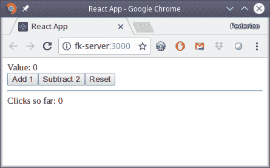

我们的计数器应用程序处于初始状态。

在点击以下按钮后，值和点击次数会更新，并且视图会自动反映这些变化；请参见以下截图。一定要理解一切是如何发生的：

+   每当您点击按钮时，都会触发一个动作。

+   当 reducer 处理动作时，它会创建一个新的状态。

+   当`React`看到状态改变时，它会重新绘制您的应用程序。看一下以下截图：

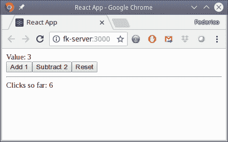

每次点击后，计数值和点击次数都会自动更新，并且视图会重新呈现

因此，我们已经看到，我们可以使用`Redux`来保持全局状态，并在需要时重新呈现视图，而我们不需要额外的工作。现在，让我们考虑一个常见的问题：当我们进行异步更改时，例如，当我们进行 Ajax 调用时，我们该如何处理？

# 另请参阅

`Redux`并不是您可以与`React`一起使用的唯一状态管理包。最受欢迎的是`MobX`，它添加了响应式编程概念，例如可观察对象和数组；请查看[`github.com/mobxjs/mobx`](https://github.com/mobxjs/mobx)。它的基本范式与`Redux`大不相同，在许多方面更简单，并更类似于电子表格；但在使用之前，请准备好改变您的思维方式！

# 使用 redux-thunk 进行异步操作

我们如何执行异步动作，比如调用 web 服务？这种调用需要一些不同的处理：如果我们仍在等待 Ajax 调用的结果，那么您不能只是分派一个动作。`Redux`的*thunk*中间件允许您编写一个返回函数而不是动作的动作创建者；该函数可以访问存储内容和分派函数本身，并且可以执行异步调用，分派其他函数等。

似乎**thunk**这个词的起源来自一个非常晚的编程会话，在那里，在经过多个小时的工作后，找到了一个之前*考虑过*的问题的解决方案，*thunk*成为了它的名字，作为*think*的派生词，你可以理解为什么！

这听起来有点神秘，所以让我们深入了解它是如何工作的，通过在第六章中构建的国家/地区组件的变体，*使用 React 进行开发*，只是这一次我们将使用实际的 API 调用——对于这些调用，我们已经有了我们的`Node`服务器，我们在第四章中创建了它，*使用 Node 实现 RESTful 服务*。

# 如何做…

让我们修改我们的地区应用程序，以便它将连接到后端服务。

首先，要使用`redux-thunk`，我们必须安装该软件包：

```js
npm install redux-thunk --save
```

然后，我们必须修改存储以使用新的中间件。（我们将在本章后面和下一章中看到更多的中间件。）这个改变非常小，如下面的代码所示：

```js
// Source file: src/regionsApp/store.js

/* @flow */

import { createStore, applyMiddleware } from "redux";
import thunk from "redux-thunk";

import { reducer } from "./worlds.reducer.js";

export const store = createStore(reducer, applyMiddleware(thunk));
```

# 定义动作

每当您尝试从服务获取数据时，一个常见的模式如下：

+   *在您发出请求时触发一个动作*；这个动作可能设置一些标志，然后由某个组件使用，以显示“正在加载…”文本或旋转图标，以显示正在进行某些操作，用户应该等待

+   *如果服务请求成功*，触发一个表示成功的动作，重置*正在加载…*标志，并提供必须添加到存储中的新数据

+   *如果服务请求失败*，重置*正在加载…*标志，但以某种方式表示错误

我们应用程序需要的动作首先与获取国家下拉列表的国家列表有关，其次是获取给定国家的地区列表。动作如下；首先是与国家相关的动作：

```js
// Source file: src/regionsApp/world.actions.js

/* @flow */

// Countries actions

export const COUNTRIES_REQUEST = "countries:request";
export const COUNTRIES_SUCCESS = "countries:success";
export const COUNTRIES_FAILURE = "countries:failure";

export type CountriesAction = {
    type: string,
    country?: string,
    listOfCountries?: [object]
};

export const countriesRequest = () =>
    ({
        type: COUNTRIES_REQUEST
    }: CountriesActions);

export const countriesSuccess = (listOfCountries: []) =>
    ({
        type: COUNTRIES_SUCCESS,
        listOfCountries
    }: CountriesActions);

export const countriesFailure = () =>
    ({
        type: COUNTRIES_FAILURE
    }: CountriesActions);

// *continues...*
```

对于地区，我们有一个类似的设置：

```js
// *...continued*

// *Regions actions*

export const REGIONS_REQUEST = "regions:request";
export const REGIONS_SUCCESS = "regions:success";
export const REGIONS_FAILURE = "regions:failure";

export type RegionsAction = {
    type: string,
    listOfRegions?: [object]
};

export const regionsRequest = (country: string) =>
    ({
        type: REGIONS_REQUEST,
        country
    }: RegionsActions);

export const regionsSuccess = (listOfRegions: [{}]) =>
    ({
        type: REGIONS_SUCCESS,
        listOfRegions
    }: RegionsActions);

export const regionsFailure = () =>
    ({
        type: REGIONS_FAILURE
    }: RegionsActions);
```

注意动作常量的风格——我们使用`"countries"`和`"regions"`作为一种命名空间（如`"countries:success"`与`"regions:success"`），以避免可能的名称重复。

# 编写 reducer

我们有动作；现在，我们需要一个 reducer。它的代码也不复杂：

```js
// Source file: src/regionsApp/world.reducer.js

/* @flow */

import {
    COUNTRIES_REQUEST,
    COUNTRIES_SUCCESS,
    COUNTRIES_FAILURE,
    REGIONS_REQUEST,
    REGIONS_SUCCESS,
    REGIONS_FAILURE
} from "./world.actions";

import type { CountriesAction, RegionsAction } from "./world.actions";

// import type { CounterAction } from "./world.actions.js";

export const reducer = (
    state: object = {
        // initial state
        loadingCountries: false,
        currentCountry: "",
        countries: [],
        loadingRegions: false,
        regions: []
    },
    action: CountriesAction | RegionsAction
) => {
    switch (action.type) {
        case COUNTRIES_REQUEST:
            return {
                ...state,
                loadingCountries: true,
                countries: []
            };

        case COUNTRIES_SUCCESS:
            return {
                ...state,
                loadingCountries: false,
                countries: action.listOfCountries
            };

        case COUNTRIES_FAILURE:
            return {
                ...state,
                loadingCountries: false,
                countries: []
            };

        case REGIONS_REQUEST:
            return {
                ...state,
                loadingRegions: true,
                currentCountry: action.country,
                regions: []
            };

        case REGIONS_SUCCESS:
            return {
                ...state,
                loadingRegions: false,
                regions: action.listOfRegions
            };

        case REGIONS_FAILURE:
            return {
                ...state,
                loadingRegions: false,
                regions: []
            };

        default:
            return state;
    }
};
```

唯一需要注意的是以下代码风格，以一种您可能以前没有见过的方式使用扩展运算符：

```js
    return {
 ...state,
        loadingCountries: true,
        currentCountry: "",
        countries: []
    };
```

当返回新状态时，我们必须小心，以免丢失旧状态的一部分，因此以`...state`开头的对象是一种非常常见的编码模式。

为了避免意外更改状态，一个很好的解决方案是使用`immutable-js`（在[`github.com/facebook/immutable-js/`](https://github.com/facebook/immutable-js/)）或`seamless-immutable`（在[`github.com/rtfeldman/seamless-immutable`](https://github.com/rtfeldman/seamless-immutable)）等软件包处理状态，因为这样你就无法修改状态对象；你被迫产生一个新的状态对象，避免许多难以发现的错误。

# 修改国家下拉列表

我们之前有一个国家下拉列表，接收了一个国家列表。让我们重写它，以便如果没有提供这样的列表，它将使用一个函数调用 thunk，并从我们的服务器获取国家：

```js
// Source file: src/regionsApp/countrySelect.component.js

/* @flow */

import React from "react";
import PropTypes from "prop-types";

import "../general.css";

export class CountrySelect extends React.PureComponent<{
    dispatch: ({}) => any
}> {
    static propTypes = {
 loading: PropTypes.bool.isRequired,
        list: PropTypes.arrayOf(PropTypes.object).isRequired,
        onSelect: PropTypes.func.isRequired,
 getCountries: PropTypes.func.isRequired
    };

    componentDidMount() {
 if (this.props.list.length === 0) {
 this.props.getCountries();
 }
    }

    onSelect = (e: { target: HTMLOptionElement }) =>
        this.props.onSelect(e.target.value);

    render() {
        if (this.props.loading) {
            return <div className="bordered">Loading countries...</div>;
        } else {
            const sortedCountries = [...this.props.list].sort(
                (a, b) => (a.countryName < b.countryName ? -1 : 1)
            );

            return (
                <div className="bordered">
                    Country:&nbsp;
                    <select
                        onChange={this.onSelect}
                        onBlur={this.onSelect}
                    >
                        <option value="">Select a country:</option>
                        {sortedCountries.map(x => (
                            <option
                                key={x.countryCode}
                                value={x.countryCode}
                            >
                                {x.countryName}
                            </option>
                        ))}
                    </select>
                </div>
            );
        }
    }
}
```

在`.componentDidMount()`方法中，如果没有可用的列表，我们调用一个函数（很快我们会看到），来获取该列表，并将其放入存储中。将使用`loading`属性，因此在等待国家到达时，将显示`加载国家...`文本，而不是空的`<select>`组件。

首先，我们的`getCountries()`函数的签名有点奇怪（一个返回异步函数的函数，带有`dispatch`参数），但这是`redux-thunk`所需的。逻辑更有趣：

```js
// Source file: src/regionsApp/countrySelect.connected.js

/* @flow */

import { connect } from "react-redux";

import { CountrySelect } from "./countrySelect.component";
import { getCountries, getRegions } from "./world.actions";

const getProps = state => ({
 list: state.countries,
 loading: state.loadingCountries
});

const getDispatch = dispatch => ({
 getCountries: () => dispatch(getCountries()),
 onSelect: c => dispatch(getRegions(c))
});

export const ConnectedCountrySelect = connect(
    getProps,
    getDispatch
)(CountrySelect);
```

# 这个组件的连接版本不像以前那样简短，因为我们将不得不将 props 连接到存储，并且还要连接要派发的动作；我在以下片段的代码中突出显示了这些部分：

由于大部分新行为将发生在国家下拉组件中，我们可以用一个非常简单的表格来处理：

```js
// Source file: src/regionsApp/regionsTable.component.js

/* @flow */

import React from "react";
import PropTypes from "prop-types";

import "../general.css";

export class RegionsTable extends React.PureComponent<{
    list: Array<{
        regionCode: string,
        regionName: string
    }>
}> {
    static propTypes = {
        list: PropTypes.arrayOf(PropTypes.object).isRequired
    };

    static defaultProps = {
        list: []
    };

    render() {
        if (this.props.list.length === 0) {
            return <div className="bordered">No regions.</div>;
        } else {
            const ordered = [...this.props.list].sort(
                (a, b) => (a.regionName < b.regionName ? -1 : 1)
            );

            return (
                <div className="bordered">
                    {ordered.map(x => (
                        <div key={x.countryCode + "-" + x.regionCode}>
                            {x.regionName}
                        </div>
                    ))}
                </div>
            );
        }
    }
}
```

我们还按字母顺序对区域进行排序，并创建一个简单的`<div>`列表，每个列表中都有一个区域的名称。连接的组件可以访问区域列表和加载标志，以便在从服务器获取区域列表时显示一些内容：

```js
// Source file: src/regionsApp/regionsTable.connected.js

/* @flow */

import { connect } from "react-redux";

import { RegionsTable } from "./regionsTable.component";

const getProps = state => ({
 list: state.regions,
 loading: state.loadingRegions
});

export const ConnectedRegionsTable = connect(getProps)(RegionsTable);
```

# 设置主应用程序

我们已经拥有所有必要的组件，所以现在我们可以制作我们的应用程序。（不，我没有忘记承诺的功能！）我们的主要代码将如下所示：

```js
// Source file: src/App.regions.js

/* @flow */

import React, { Component, Fragment } from "react";
import { Provider } from "react-redux";

import {
    ConnectedCountrySelect,
    ConnectedRegionsTable
} from "./regionsApp";

import { store } from "./regionsApp/store";

class App extends Component<{}> {
    render() {
        return (
            <Provider store={store}>
                <Fragment>
                    <ConnectedCountrySelect />
                    <ConnectedRegionsTable />
                </Fragment>
            </Provider>
        );
    }
}

export default App;
```

# 使用 thunks

我们需要两个函数：一个用于获取国家列表，另一个用于获取当前选择国家的区域。让我们从前者开始，并记住这段代码将添加到我们之前看到的动作文件中：

如果我们选择一个国家，服务将被调用，并且结果将被显示；请参阅以下截图。这个逻辑也很有趣：

```js
// Source file: src/regionsApp/world.actions.js

import axios from "axios";

export const getCountries = () => async dispatch => {
    try {
        dispatch(countriesRequest());
        const result = await axios.get(`http://fk-server:8080/countries`);
        dispatch(countriesSuccess(result.data));
    } catch (e) {
```

```js
        dispatch(countriesFailure());
    }
};
```

当用户选择一个国家时，下拉列表使用一个 thunk 来获取其区域。

+   首先，我们派发`countriesRequest()`动作创建者的结果，这样应用程序的状态将显示我们正在等待一些结果。

+   然后，我们使用`axios()`包，就像我们之前在 Node 工作中使用的那样，调用我们的服务器并获取国家列表。

+   修改区域表

+   您还会注意到，我对国家进行了排序，因为服务按国家代码顺序发送它们。

当国家列表返回时，将派发一个`countriesSuccess()`动作，并附上收到的国家列表。

要处理区域，我们将有类似的代码：

```js
// Source file: src/regionsApp/world.actions.js

export const getRegions = (country: string) => async dispatch => {
    if (country) {
        try {
            dispatch(regionsRequest());
            const result = await axios.get(
                `http://fk-server:8080/regions/${country}`
            );
            dispatch(regionsSuccess(result.data));
        } catch (e) {
            dispatch(regionsFailure());
        }
    } else {
        dispatch(regionsFailure());
    }
};
```

现在，事情开始变得有趣起来。我们为国家下拉列表提供了两个函数，这两个函数都将使用 thunks 来连接到服务器。让我们来看看它们！

# 它是如何工作的...

当我们`npm start`我们的应用程序时，我们看到一个非常简单的设计；请参阅以下截图。让我们了解我们是如何到达这里的：

1.  显示了主页面。

1.  当国家下拉列表接收到一个空的国家列表时，使用 thunk 获取所有国家。

1.  如果调用成功，我们会派发一个`countriesSuccess()`动作，并传递我们收到的国家列表。

1.  减速器更新了存储，将`loadingCountries`标志设置为 true

1.  页面被重绘，而不是下拉列表，显示了`"加载国家..."`文本。

1.  派发了一个`getCountries()`动作。

1.  当区域表绘制时没有任何区域，会显示一些`"没有区域"`文本。

1.  页面被重绘，现在国家下拉列表有一个国家列表要显示，如下截图所示：

代码与以前相似，所以我们不需要做太多分析。

我们的初始屏幕

如您所见，我们的代码能够派发许多动作，但要等到合适的时机才能这样做。

1.  如果调用失败，我们会派发一个`countriesFailure()`动作，以显示失败。

1.  派发了一个`regionsRequest()`动作。

1.  减速器更新了存储，包括所有国家，并将`loadingCountries`重置为 false。

1.  当地区返回时，将分派一个`regionsSuccess()`动作，

1.  在减速器创建了一个新状态后，页面被重绘，显示了地区列表。参考以下截图：

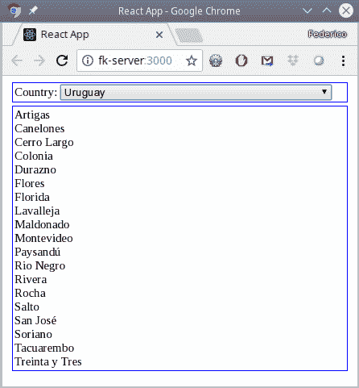

调用我们的 restful 服务器的结果

然而，你可能会想，`"加载国家..."`的文本在哪里？问题（如果你愿意这样说！）是服务响应太快了，所以消息一闪而过就消失了。如果我们在`getCountries()`函数中作弊并添加一些延迟，我们可以看到它更长一点。在调用`axios()`之前包含以下行以延迟执行五秒：

```js
await new Promise(resolve => setTimeout(resolve, 5000));
```

现在，你将有时间看到缺失的状态，如下截图所示：

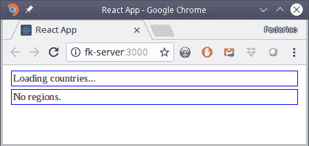

添加一些延迟让我们在等待国家列表时看到显示的内容

所以，现在我们可以看到我们的状态处理是正确的，并且一切都显示得如我们所希望的那样！

# 还有更多...

当你编写你的动作创建者时，它实际上不仅传递了`dispatch()`，还传递了`getState()`函数。这个函数可以用来访问当前的状态值。我们没有使用这个，但是，例如，你可以用它来进行缓存或其他类似的想法。我们的`getRegions()`函数可以如下所示，以检测你是否再次请求相同国家的地区：

```js
// Source file: src/regionsApp/world.actions.js

export const getRegions2 = (country: string) => async (
 dispatch,
 getState
) => {
 if (country === getState().currentCountry) {
 console.log("Hey! You are getting the same country as before!");
 }

    if (country) {
        .
        .
        . *everything as earlier*
        .
        .
    }
};
```

在我们的情况下，我们除了记录一条消息之外，没有做任何其他事情，但是你可以使用接收到的参数加上当前状态的内容来进行一些更复杂的逻辑。

# 使用 react-router 添加路由

当你使用`React`（就像其他前端框架一样，比如`Angular`或`Vue`，只是举几个例子）时，通常会开发**单页应用程序**（**SPAs**），当你访问它们的不同部分时，它们永远不会进行完整的页面重新加载；相反，新内容会被切换到视图中，但仍停留在原始页面上。即使这种导航体验现代而流畅，但仍然期望一些更传统的路由方面：*后退*和*前进*按钮应该根据你的浏览历史移动你，你还应该能够将应用程序的特定部分添加到书签中，以便以后能够快速返回到它。

通常情况下，使用`React`处理路由有很多种方式，但`react-router`目前是迄今为止最常用的库，可能是因为它真的符合`React`的范式：路由只是你渲染并且按预期工作的组件！让我们从构建一个简单的应用程序开始，以展示路由是如何工作的，然后在下一节中，我们将通过要求在允许访问某些路由之前进行身份验证来增加一些复杂性。

# 入门

`react-router`库实际上是处理`React`应用程序中的路由的标准。安装它需要一个微妙的区别：不是直接获取那个包，而是必须选择一个不同的包，`react-router-dom`，它本身会负责获取`react-router`：

```js
npm install react-router-dom --save
```

我们可以轻松地构建一个应用程序，其中包含多个链接，一个路由器将负责渲染正确的视图，甚至为错误的链接提供一个 404 页面。当然，我们将专注于路由方面，因此在其他方面，我们的应用程序将更像是一个骨架，而不是一个实际可用的网页——不要开始对它非常简单的样式着迷！

# 如何做...

在这个教程中，我们将创建一个基本的应用程序，但有几个路由；让我们看看如何做到这一点。

首先，我们需要导入一些包并创建一些组件，这些组件将代表我们应用程序中的不同页面。对于后者，因为我们不打算包含任何实际的逻辑或内容，我们将使用非常简单的功能组件，它们只渲染一个`H1`标题...我告诉过你我们的应用程序会非常简单！

```js
// Source file: src/App.routing.js

/* @flow */

import React, { Component } from "react";
import { Provider } from "react-redux";
import { BrowserRouter, Switch, Route, Link } from "react-router-dom";

import { store } from "./routingApp/store";

const Home = () => <h1>Home Sweet Home</h1>;
const Help = () => <h1>Help! SOS!</h1>;
const Alpha = () => <h1>Alpha</h1>;
const Bravo = () => <h1>Bravo</h1>;
const Charlie = () => <h1>Charlie</h1>;
const Zulu = () => <h1>Zulu</h1>;
const Error404 = () => <h1>404 Error!</h1>;

// *continued...*
```

现在，为了继续，我们必须规划我们的应用程序。我们将有一个带有`<nav>`栏的`<header>`，其中我们将包括到我们应用程序各部分的链接。在下面，我们将有一个常见区域，其中将呈现正确的组件。我们的`<App>`组件可能如下所示-虽然在现实生活中，您可能会在单独的文件中定义所有路由；我在这里放置了所有内容以保持简洁：

```js
// *...continued*

class App extends Component<{}> {
    render() {
        return (
            <Provider store={store}>
 <BrowserRouter>
                    <div>
                        <header>
                            <nav>
                                <Link to="/">Home</Link>&nbsp;
                                <Link to="/about/routing">
                                    About Routing
                                </Link>&nbsp;
                                <Link to="/alpha">Alpha...</Link>&nbsp;
                                <Link to="/bravo">Bravo...</Link>&nbsp;
                                <Link to="/charlie">Charlie...
                                </Link>&nbsp;
                                <Link to="/wrong">...Wrong...
                                </Link>&nbsp;
                                <Link to="/zulu">Zulu</Link>&nbsp;
                                <Link to="/help">Help</Link>&nbsp;
                            </nav>
                        </header>

                        <Switch>
                            <Route path="/" component={Home} />
                            <Route path="/help" component={Help} />
 <Route
 path="/about/:something"
 render={props => (
 <div>
 <h1>About...</h1>
 {props.match.params.something}
 </div>
 )}
 />
                            <Route path="/alpha" component={Alpha} />
                            <Route path="/bravo" component={Bravo} />
                            <Route path="/charlie" component={Charlie} 
                            />
                            <Route path="/zulu" component={Zulu} />
                            <Route component={Error404} />
                        </Switch>
                    </div>
                </BrowserRouter>
            </Provider>
        );
    }
}

export default App;
```

我已经突出显示了代码的几个部分；让我们看看为什么：

+   `<BrowserRouter>`是基于 HTML5“History”API 的组件，负责保持视图与 URL 同步；后者的更改将反映在新视图中。

+   `<Link ...>`是您必须使用的组件，而不是通常的`<a ...>` HTML 标签，`to=`指向所需的路由。

+   `<Switch>`是一个组件，它呈现第一个匹配当前位置的子`<Route>`或`<Redirect>`组件（我们很快将使用`<Redirect>`）。

+   `<Route ...>`定义了在路径匹配时必须呈现的组件。请注意，您可能需要精确指定以避免错误的巧合；否则，访问`"/alpha"`将匹配第一个路由`"/"`，并显示错误的组件。您可以通过使用`component=`或提供`render()`函数来指定要呈现的内容；当您需要显示多个组件或获取一些参数时，后者非常有用。特别是，我们在`"/about/:something"`中使用了这个；当匹配到这个路由时，类似于`Express`（查看第四章中的*添加路由*部分，在*使用 Node 实现 RESTful 服务*中），将提供一个新的 prop，其属性与 URL 的冒号开头部分相符。您可以通过指定`path=`来省略这一点，然后您将有一个*通配符*，这对于 404 错误非常有用，就像我们在这里做的那样。

所以，我们有了代码；让我们看看它的运行情况。

# 它是如何工作的...

如果您`npm start`应用程序，然后导航到它，您将得到主页，如下截图所示：

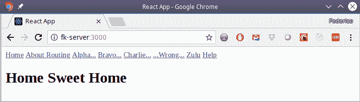

我们的路由应用程序，显示了基本“/”路由的组件

如果选择任何有效路由（即，至少现在不要选择错误的路由！），将激活匹配的路由，并显示相应的组件，如下截图所示：

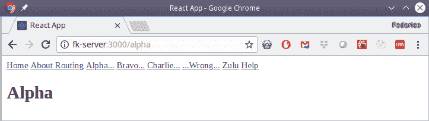

选择有效路由会得到相应的组件

最后，如果选择了错误的路由，将显示默认组件，如下所示：

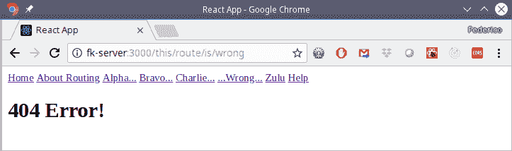

我们的<Switch>中的最后一个路由是未定义路由的通配符

# 还有更多...

有一件事我们还没有用过：直接导航到给定路由或返回到上一个位置等。每当匹配到一个`<Route>`时，呈现的组件都会获得一些特殊的 props，您可以使用：

+   `this.props.history`，提供对浏览器历史记录的访问，具有诸如`.goBack()`返回到上一页或`.push("someURL")`导航到不同页面等多种方法；有关更多信息，请参阅[`developer.mozilla.org/en-US/docs/Web/API/History_API`](https://developer.mozilla.org/en-US/docs/Web/API/History_API)和特别是[`github.com/ReactTraining/react-router/blob/master/packages/react-router/docs/api/history.md`](https://github.com/ReactTraining/react-router/blob/master/packages/react-router/docs/api/history.md)

+   `this.props.location`，具有与当前位置及其 URL 相关的几个属性；有关额外数据，请参阅[`github.com/ReactTraining/react-router/blob/master/packages/react-router/docs/api/location.md`](https://github.com/ReactTraining/react-router/blob/master/packages/react-router/docs/api/location.md)

+   `this.props.match`，告诉您当前路由是如何匹配的；请参阅[`github.com/ReactTraining/react-router/blob/master/packages/react-router/docs/api/match.md`](https://github.com/ReactTraining/react-router/blob/master/packages/react-router/docs/api/match.md)

因此，我们现在能够处理路由；让我们继续处理需要授权的路由。

# 在路由中添加授权

我们之前的路由示例工作得很好，但在一些应用程序中，您可能需要授权，以便只有已登录的用户才能访问您网站的部分。 （如果您使用的是我们在第四章中开发的 API，*使用 Node 实现 RESTful 服务*，则还需要用户进行标识，该 API 需要**JSON Web Token**（**JWT**）。因此，让我们看看我们需要做哪些额外工作，以便在页面上既有受限制的路由又有不受限制的路由。

# 如何做…

让我们通过保护一些路由并要求先前成功登录来为我们的应用程序添加授权。

我们可以找到一个非常符合`React`风格的解决方案。我们将有一些任何人都可以无限制访问的未受保护路由，以及需要登录的受保护路由。我们将需要两个组件。

# 创建一个登录组件

首先，让我们创建一个`<Login>`组件，我们将调用我们的 RESTful 服务器，向其传递用户名和密码，（如果值正确）然后获取 JWT：

```js
// Source file: src/routingApp/login.component.js

/* @flow */

import React from "react";
import PropTypes from "prop-types";
import { Redirect } from "react-router-dom";

export class Login extends React.PureComponent<{
    logging: boolean
}> {
    static propTypes = {
        onLogin: PropTypes.func.isRequired,
        logging: PropTypes.bool.isRequired,
        token: PropTypes.string.isRequired,
        location: PropTypes.object
    };

    state = {
        userName: "",
        password: ""
    };

    onUserNameBlur = e => this.setState({ userName: e.target.value });

    onPasswordBlur = e => this.setState({ password: e.target.value });

    onLoginClick = () =>
        this.props.onLogin(this.state.userName, this.state.password);

    render() {
        if (
            this.state.userName &&
            this.state.password &&
            this.props.token
        ) {
            return (
                <Redirect to={this.props.location.state.from.pathname} />
            );
        } else {
            return (
                <div>
                    <h1>Login Form</h1>
                    <div>
                        User:<input
                            type="text"
                            onBlur={this.onUserNameBlur}
                        />
                    </div>
                    <div>
                        Password:
                        <input
                            type="password"
                            onBlur={this.onPasswordBlur}
                        />
                    </div>
                    <button
                        onClick={this.onLoginClick}
                        disabled={this.props.logging}
                    >
                        Login
                    </button>
                </div>
            );
        }
    }
}
```

# 定义操作和减速器

在深入细节之前，让我们看看我们将拥有的减速器和操作。前者非常简单，因为基本上我们关心的只是有一个`token`和一个`logging`标志：

```js
// Source file: src/routingApp/login.reducer.js

/* @flow */

import {
    LOGIN_REQUEST,
    LOGIN_SUCCESS,
    LOGIN_FAILURE
} from "./login.actions";

export const reducer = (
    state: object = {
        // initial state
        logging: false,
        token: ""
    },
    action
) => {
    switch (action.type) {
        case LOGIN_REQUEST:
            return {
                ...state,
                logging: true,
                token: ""
            };

        case LOGIN_SUCCESS:
            return {
                ...state,
                logging: false,
                token: action.token
            };

        case LOGIN_FAILURE:
            return {
                ...state,
                logging: false
            };

        default:
            return state;
    }
};
```

我们将有一些操作创建者，这将帮助我们了解其余部分。其中一个重要的是`attemptLogin()`，它尝试连接到服务器，如果成功则存储令牌，标记用户已登录：

```js
// Source file: src/routingApp/login.actions.js

/* @flow */

import { loginService } from "./serviceApi";

export const LOGIN_REQUEST = "login:request";
export const LOGIN_SUCCESS = "login:success";
export const LOGIN_FAILURE = "login:failure";

export const loginRequest = () => ({
    type: LOGIN_REQUEST
});

export const loginSuccess = (token: string) => ({
    type: LOGIN_SUCCESS,
    token
});

export const loginFailure = () => ({
    type: LOGIN_FAILURE
});

// Complex actions:

export const attemptLogin = (
    user: string,
    password: string
) => async dispatch => {
    try {
        dispatch(loginRequest());
        *// the next line delays execution for 5 seconds:*
 *// await new Promise(resolve => setTimeout(resolve, 5000));*
        const result = await loginService(user, password);
        dispatch(loginSuccess(result.data));
    } catch (e) {
        dispatch(loginFailure());
    }
};
```

我们将把写一个`<LogOut>`组件留给您作为练习，它将提供一个按钮，当点击时将调用一个动作来删除当前令牌。

# 创建一个保护路由的组件

要保护一个路由，让我们创建一个新组件，它将检查用户是否已登录。在第一种情况下，路由将显示，而不需要进一步操作。但是，在第二种情况下，不会显示原始路由组件，而是会产生`<Redirect>`，将用户重定向到登录页面：

```js
// Source file: src/routingApp/authRoute.component.js

/* @flow */

import React from "react";
import { Route, Redirect } from "react-router-dom";
import PropTypes from "prop-types";

export class Auth extends React.Component<{
    loginRoute: string,
    token: string,
    location: object
}> {
    static propTypes = {
        loginRoute: PropTypes.string.isRequired,
        token: PropTypes.string.isRequired,
        location: PropTypes.object
    };

    render() {
        const myProps = { ...this.props };
        if (!myProps.token) {
            delete myProps.component;
            myProps.render = () => (
                <Redirect
                    to={{
                        pathname: this.props.loginRoute,
                        state: { from: this.props.location }
                    }}
                />
            );
        }
        return <Route {...myProps} />;
    }
}
```

我们将把这个组件连接到存储，以便它可以访问当前令牌和登录页面的路径：

```js
// Source file: src/routingApp/authRoute.connected.js

/* @flow */

import { connect } from "react-redux";

import { Auth } from "./authRoute.component";
export const AuthRoute = connect(state => ({
    token: state.token,
    loginRoute: "/login"
}))(Auth);
```

现在，我们拥有了一切我们需要的东西；让我们让它工作起来！

# 它是如何工作的…

要使用我们的新组件，我们将在本章前面的原始路由中做一些更改。让我们保护一些路由。只需要将`Route`更改为`AuthRoute`：

```js
// Source file: src/App.routing.auth.js

<AuthRoute path="/alpha" component={Alpha} />
<AuthRoute path="/bravo" component={Bravo} />
<AuthRoute path="/charlie" component={Charlie} />
<AuthRoute path="/zulu" component={Zulu} />
<AuthRoute component={Error404} />
```

所有更改后的路由都需要先前的登录——如果用户输入错误的路由，我们甚至不会告诉他们 404 错误；我们将强制他们首先登录，如果他们不这样做，他们甚至无法知道路由是否存在。

现在，如果我们打开应用程序并尝试访问普通的未受保护路由，一切都会像以前一样工作。但是，如果您尝试访问一些受保护的路由，比如`"/charlie"`，您将被重定向到登录页面，如下截图所示：

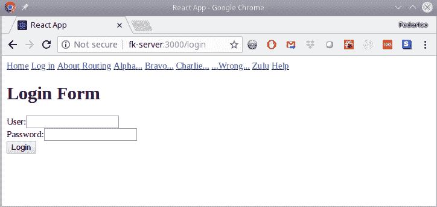

尝试访问受保护的路由将重定向到登录界面

登录后，`<Login>`组件将产生自己的`<Redirect>`，将用户发送回最初请求的页面。请参见以下截图：

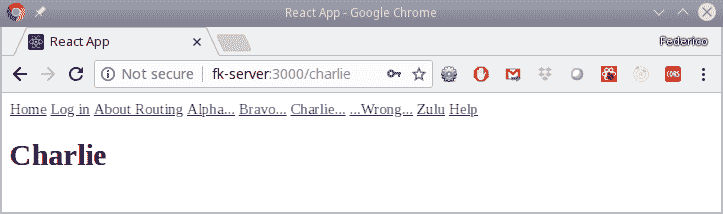

成功登录后，您将再次被重定向到您最初请求的页面；现在的 URL 指向我们想要访问的页面

因此，现在您有了一种处理各种路由的方法，而且也非常符合`React`的方式！

# 还有更多…

在通常的 Web 开发中，您使用 cookie 或可能使用本地存储来存储访问信息，但在`React`应用程序中，将令牌（或您使用的任何内容）存储在状态中就足够了。如果需要为 API 调用提供令牌，请记住，操作定义如下：

```js
const anActionCreator = 
    (...*parameters*...) => 
        (dispatch, getState) => 
            { ...*your action*... }
```

因此，您可以通过`getState()`函数访问令牌，并根据需要将其传回服务器；回到`getRegions2()`代码，我们看到了如何执行异步操作，以查看使用此函数的示例。

# 性能的代码拆分

随着应用程序规模的增长，加载速度将逐渐变慢，这将让用户感到不满意。（而且，请记住，并非每个人都可以访问高速连接，尤其是在移动设备上！）此外，如果用户只需要其中的一小部分，用户不应该下载整个代码：例如，如果用户想浏览产品，为什么还要下载注册视图？

解决这个空间和速度问题的方法是*代码拆分*，这意味着您的应用程序将被分解成较小的块，只有在需要时才会加载。幸运的是，有很好的工具可以做到这一点，而且不需要对现有代码进行太多更改，因此这是一个全面的胜利。

# 准备工作

当您导入一个模块时，它是一个静态的东西，所需模块的代码被包含在通用源代码包中。但是，您可以使用*动态*`import()`调用在运行时加载代码。您可以自己处理这个问题，但已经有一个简单的软件包可以导入，`react-loadable`，它将处理大多数情况。让我们以通常的方式安装它：

```js
npm install react-loadable --save
```

我们将使用此软件包的一些功能，因此您应该查看[`github.com/jamiebuilds/react-loadable`](https://github.com/jamiebuilds/react-loadable)以获取有关增强动态代码加载功能的更多想法。

截至 2018 年 12 月，`import()`处于第 3 阶段，这意味着它是一个候选项，只期望进行少量（如果有的话）更改，并且已经在通往第 4 阶段的道路上，这意味着它将被包含在正式的 ECMAScript 标准中。但是，与其他 JS 扩展一样，您已经可以在代码中使用它们，并且它受到`Babel`和`Webpack`的支持。您可以在[`tc39.github.io/proposal-dynamic-import/`](https://tc39.github.io/proposal-dynamic-import/)上阅读更多关于`import()`的信息。

# 如何做…

让我们修改我们的路由应用程序，即使它很小！尝试进行代码拆分。

首先，让我们看看我们的主要代码将是什么样子：

```js
// Source file: src/App.splitting.js

/* @flow */

/* eslint-disable */

import React, { Component } from "react";
import { BrowserRouter, Switch, Route, Link } from "react-router-dom";

import {
 AsyncAlpha,
 AsyncBravo,
 AsyncCharlie,
 AsyncZulu,
 AsyncHelp
} from "./splittingApp";

const Home = () => <h1>Home Sweet Home</h1>;
const Error404 = () => <h1>404 Error!</h1>;

class App extends Component<{}> {
    render() {
        return (
            <BrowserRouter>
                <div>
                    <header>
                        <nav>
                            <Link to="/">Home</Link>&nbsp;
                            <Link to="/alpha">Alpha...</Link>&nbsp;
                            <Link to="/bravo">Bravo...</Link>&nbsp;
                            <Link to="/charlie">Charlie...</Link>&nbsp;
                            <Link to="/wrong">...Wrong...</Link>&nbsp;
                            <Link to="/zulu">Zulu</Link>&nbsp;
                            <Link to="/help">Help</Link>&nbsp;
                        </nav>
                    </header>

                    <Switch>
                        <Route exact path="/" component={Home} />
                        <Route path="/help" component={AsyncHelp} />
                        <Route path="/alpha" component={AsyncAlpha} />
                        <Route path="/bravo" component={AsyncBravo} />
                        <Route path="/charlie" component={AsyncCharlie} 
                        />
                        <Route path="/zulu" component={AsyncZulu} />
                        <Route component={Error404} />
                    </Switch>
                </div>
            </BrowserRouter>
        );
    }
}

export default App;
```

我们已经将`Alpha`、`Bravo`和其他组件分开，以便我们可以动态加载它们。查看其中一个的代码就足够了：

```js
// Source file: src/splittingApp/alpha.component.js

/* @flow */

import React from "react";

const Alpha = () => <h1>Alpha</h1>;

export default Alpha;
```

但是`AsyncAlpha`、`AsyncBravo`等呢？这些组件是它们的正常对应版本的动态加载版本，我们可以使用`react-loadable`获取：

```js
// Source file: src/splittingApp/alpha.loadable.js

/* @flow */

import Loadable from "react-loadable";

import { LoadingStatus } from "./loadingStatus.component";

export const AsyncAlpha = Loadable({
 loader: () => import("./alpha.component"),
 loading: LoadingStatus
});
```

`AsyncAlpha`组件可以动态加载，而在加载时，其内容将由`LoadingStatus`组件提供；您可以使其变得很花哨，但我选择了一个非常简单的东西：

```js
// Source file: src/splittingApp/loadingStatus.component.js

/* @flow */

import React from "react";
import PropTypes from "prop-types";

export class LoadingStatus extends React.Component<{
    isLoading: boolean,
    error: boolean
}> {
    static propTypes = {
        isLoading: PropTypes.bool,
        error: PropTypes.bool
    };

    render() {
 if (this.props.isLoading) {
 return <div>Loading...</div>;
 } else if (this.props.error) {
 return <div>ERROR: the component could not be loaded.</div>;
 } else {
 return null;
 }
    }
}
```

因此，现在我们知道如何动态加载任何组件，让我们看看它是如何工作的。

能够动态加载组件，而不是像通常的 Web 应用程序一样加载整个路由，这是一个很大的优势。例如，您的应用程序可能在选项卡中有一个大型、重型组件，但除非用户实际转到该选项卡，否则为什么要加载它？延迟加载还可以帮助更快地显示页面；您可以尝试首先显示顶部的组件，并使用动态导入来加载底部的组件。

# 工作原理…

我们将使用 Web 开发人员工具来查看网络传输。当我们启动应用程序时，我们会得到主页和一些传输，包括`bundle.js`，主要源代码块。随着应用程序规模的增大，这个文件的大小将大幅增加。请参阅以下截图：

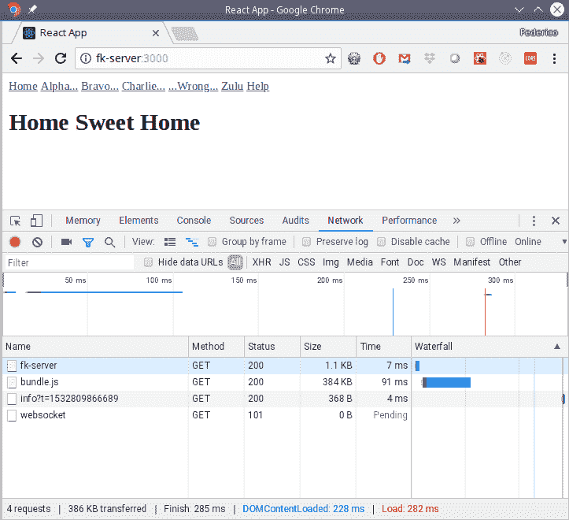

页面的初始加载显示只有 bundle.js 被发送到了网络上

如果我们点击一个链接，相应的分割代码块将被传输。访问几个链接后，您会得到类似以下的内容：

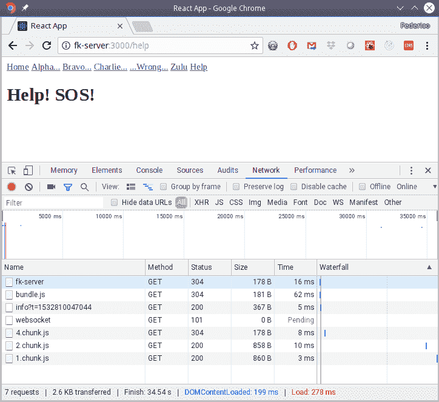

当您转到不同的链接时，块将被加载，但只有在需要时。

即使我们的示例非常小，您也可以看到您可以轻松地将应用程序分成几个较小的块。我们无法给出规则来建议何时应该开始应用这种技术，但是，正如我们所见，将任何组件更改为异步加载的等效组件所需的工作很少，因此，即使您的应用程序已经编写完成，您也可以开始使用这种技术。

# 还有更多...

`Loadable()` 创建的组件包括一个`.preload()`方法，您可以在实际需要组件之前使用它来启动导入过程。我们可以快速测试一下。例如，让我们设置一下，如果用户将鼠标移动到 Alpha 链接上，组件将被预加载：

```js
<Link to="/alpha">
    <span onMouseOver={() => AsyncAlpha.preload()}>Alpha...</span>
</Link>
```

我们可以快速验证一下这个功能。当您加载代码的更新版本时，如果您将鼠标悬停在 Alpha 链接上，您会看到一部分代码被下载 - 尽管屏幕上没有任何变化，如下面的截图所示：

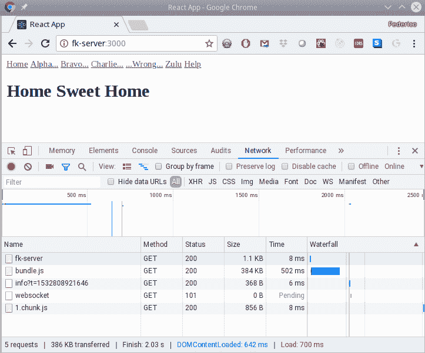

预加载在后台工作，让您可以提前下载组件：一个块（1.chunk.js）已经被加载，尽管它还没有显示在屏幕上

给它一些时间，并注意当您实际点击 Alpha 链接时，组件将立即显示，无需进一步下载。预加载还有更多用途：例如，您可以在初始页面加载后使用`setTimeout()`，或者您可以进行预测性下载，试图根据用户的操作来预测他们接下来会想要什么。
