# 第九章：调试您的应用程序

我们将在这里看到的食谱是：

+   以风格记录

+   使用 React 开发者工具进行调试

+   使用独立工具进行调试

+   使用 redux-logger 记录 Redux

+   使用 Redux 开发者工具调试 Redux

+   连接路由进行调试

# 介绍

在之前的章节中，我们看到了如何开发基本的`React`应用程序，如何增强它以获得更好的用户体验，以及如何扩展它，使其更适用于复杂和大型应用程序范围。然而，所有这些开发肯定需要测试和调试，因此在本章中，我们将涉及调试食谱，在接下来的章节中，我们将涵盖测试。

# 以风格记录

记录仍然是一个非常好的工具，但您不能仅依赖于使用`console.log（）`或`console.error（）`等工具。即使它们可以在短暂的调试运行中完成工作，但如果您计划更严肃地包括日志记录并希望在生产中禁用它，您将不得不追踪每个日志调用，或者*猴子补丁*控制台对象，以便`.log（）`或`.error（）`不起作用，这甚至更糟！

回到第五章的*使用 Winston 添加日志记录*部分，*测试和调试您的服务器*，我们使用`Winston`进行日志记录（还使用了`Morgan`，但那是特定于 HTTP 日志记录，所以不算），该库具有启用我们轻松启动或停止日志记录的功能。没有适用于浏览器的`Winston`版本，但我们可以退回到`debug`，这是一个旧标准（我们在刚才提到的章节末尾的*还有更多...*部分中提到的），它也可以在网络上使用。

您可以在[`github.com/visionmedia/debug`](https://github.com/visionmedia/debug)找到调试的完整文档。请注意，如果愿意，您也可以在`Node`中使用它，尽管我们认为我们之前的选择更好。

# 准备就绪

您可以像在`Node`中使用它一样安装`debug`。

```js
npm install debug --save
```

您还必须决定如何*命名空间*您的日志，因为使用调试可以轻松选择显示哪些消息（如果有的话）和哪些不显示。一些可能的想法是为应用程序中的每个服务使用名称，例如`MYAPP：SERVICE：LOGIN`，`MYAPP：SERVICE：COUNTRIES`，`MYAPP_SERVICE：PDF_INVOICE`等，或者为每个表单使用名称，例如`MYAPP_FORM：NEW_USER`，`MYAPP：FORM：DISPLAY_CART`，`MYAPP：FORM：PAY_WITH_CARD`等，或者为特定组件使用名称，例如`MYAPP：COMPONENT：PERSONAL_DATA`，`MYAPP：COMPONENT_CART`等；您可以根据需要为操作，减速器等列出清单。

有一种方法可以在之后选择显示哪些日志，方法是在`LocalStorage`中存储一个值（我们将在此处介绍），这样您就可以设置：

+   `MYAPP：*`显示来自我的应用程序的所有日志

+   `MYAPP：SERVICE：*`显示所有与服务相关的日志

+   `MYAPP：FORM：`和`MYAPP：COMPONENT：*`显示与某些表单或组件相关的日志，但省略其他日志

+   `MYAPP：SERVICE：COUNTRIES`，`MYAPP：FORM：NEW_USER`和`MYAPP：FORM：PAY_WITH_CARD`来显示与这三个项目相关的日志

您还可以使用`"-"`前缀字符串来排除它。 `MYAPP：ACTIONS：*，-MYAPP：ACTIONS：LOADING`将启用所有操作，但不包括`LOADING`。

您可能会想：为什么在每个地方都包含固定文本`MYAPP：`？关键在于，您可能使用的许多库实际上也使用调试进行日志记录。如果您要说显示所有内容（`*`）而不是`MYAPP：*`，则会在控制台中获得所有这些库的每条消息，这不是您预期的！

您可以自由决定日志的命名，但建立一个结构良好的列表将使您能够稍后选择要显示的日志，这意味着您不必开始乱弄代码以启用或禁用任何给定的消息集。

# 如何做到这一点...

让我们至少在某种程度上复制我们在`Winston`中所拥有的内容，这样如果您进行全栈工作，无论是客户端还是服务器端，都会更容易。我们希望有一个带有`.warn()`和`.info()`等方法的记录器对象，它将以适当的颜色显示给定的消息。此外，我们不希望在生产中显示日志。这将导致我们的代码如下：

```js
// Source file: src/logging/index.js

/* @flow */

import debug from "debug";

constWHAT_TO_LOG = "myapp:SERVICE:*"; // change this to suit your needs
const MIN_LEVEL_TO_LOG = "info"; // error, warn, info, verbose, or debug

const log = {
 error() {},
    warn() {},
    info() {},
    verbose() {},
    debug() {}
};

const logMessage = (
    color: string,
    topic: string,
    message: any = "--",
    ...rest: any
) => {
    const logger = debug(topic);
    logger.color = color;
    logger(message, ...rest);
};

if (process.env.NODE_ENV === "development") {
    localStorage.setItem("debug", WHAT_TO_LOG);

 /* *eslint-disable no-fallthrough* */
    switch (MIN_LEVEL_TO_LOG) {
        case "debug":
            log.debug = (topic: string, ...args: any) =>
                logMessage("gray", topic, ...args);

        case "verbose":
            log.verbose = (topic: string, ...args: any) =>
                logMessage("green", topic, ...args);

        case "info":
            log.info = (topic: string, ...args: any) =>
                logMessage("blue", topic, ...args);

        case "warn":
            log.warn = (topic: string, ...args: any) =>
                logMessage("brown", topic, ...args);

        case "error":
        default:
            log.error = (topic: string, ...args: any) =>
                logMessage("red", topic, ...args);
    }
}

export { log };
```

一些重要的细节：

+   `WHAT_TO_LOG`常量允许您选择应显示哪些消息。

+   `MIN_LEVEL_TO_LOG`常量定义了将被记录的最低级别。

+   日志对象具有每个严重级别的方法，就像 Winston 一样。

+   最后，如果我们不处于开发模式，将返回一个无效的`log`对象；所有对日志方法的调用都将产生完全没有任何输出。

请注意，我们在`switch`语句中使用了 fallthrough（其中没有`break`语句！）来正确构建`log`对象。这并不常见，而且我们不得不在 ESLint 中关闭它！

我们已经有了我们需要的代码；让我们看一个使用它的例子。

# 它是如何工作的…

鉴于日志记录并不是一个复杂的概念，而且我们已经在服务器上看到了它，让我们来看一个非常简短的例子。我们可以更改我们应用程序的`index.js`文件，以包含一些示例日志：

```js
// Source file: src/index.js

.
.
.

import { log } from "./logging";

log.error("myapp:SERVICE:LOGIN", `Attempt`, { user: "FK", pass: "who?" });

log.error("myapp:FORM:INITIAL", "Doing render");

log.info(
    "myapp:SERVICE:ERROR_STORE",
    "Reporting problem",
    "Something wrong",
    404
);

log.warn("myapp:SERVICE:LOGIN");

log.debug("myapp:SERVICE:INFO", "This won't be logged... low level");

log.info("myapp:SERVICE:GETDATE", "Success", {
    day: 22,
    month: 9,
    year: 60
});

log.verbose("myapp:SERVICE:LOGIN", "Successful login");
```

运行我们的应用程序将在控制台中产生以下输出；请参阅下一个截图。您应该验证只有正确的消息被记录：`info`级别及以上，并且只有它们匹配`myapp:SERVICE:*`：

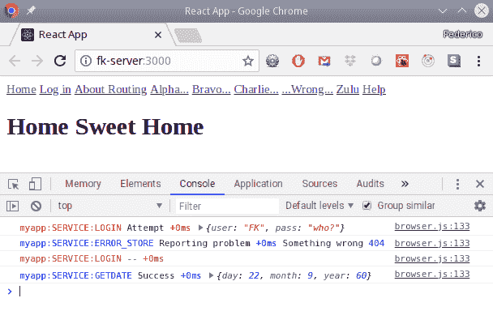

使用调试可以在控制台中产生清晰、易懂的输出

请注意，根据我们的规范，只显示了与`myapp:SERVICE`相关的消息。

# 使用 React Developer Tools 进行调试

当我们使用`Node`（在第五章中，*测试和调试您的服务器*）时，我们看到了如何进行基本调试，但现在我们将专注于一个`React`-特定的工具，**React Developer Tools**（**RDT**），这些工具专门用于与组件和 props 一起使用。在这个教程中，让我们看看如何安装和使用这个工具包。

# 准备工作

RDT 是 Chrome 或 Firefox 的扩展，可以让您在标准 Web 开发工具中检查组件。我们将在这里使用 Chrome 版本，但是 Firefox 的使用方式类似。您可以通过访问**Chrome Web Store**（[`chrome.google.com/webstore/category/extensions`](https://chrome.google.com/webstore/category/extensions)）并搜索 RDT 来安装该扩展；您想要的扩展是由 Facebook 编写的。单击“添加到 Chrome”按钮，当您打开 Chrome 开发者工具时，您将找到一个新的选项卡，React。

如果您不使用 Chrome 或 Firefox，或者如果您必须测试将显示在 iframe 中的`React`应用程序，您将希望查看工具的独立版本；我们将在*使用独立工具进行调试*部分中介绍它们，就在这一部分之后。

# 如何做…

让我们看看如何在上一章中的*使用 Redux 管理状态*部分中开发的计数器应用程序中使用 RDT。该应用程序很简单，所以我们可以很容易地看到如何使用该工具，但当然您也可以将其应用于非常复杂、充满组件的页面。启动应用程序，打开 Web 开发工具，选择 React 选项卡，如果展开每个组件，您将看到类似以下截图的内容：

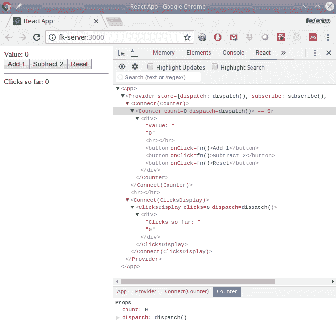

Web 开发工具中的 React 选项卡让您访问应用程序的整个组件层次结构

顺便说一下，您可以将该工具与任何使用`React`开发的应用程序一起使用。当工具的小图标变色时，表示可以使用，如果单击它，您将获得有关您是运行开发（红色图标）还是生产（绿色图标）的信息；此截图显示了我们的具体情况：

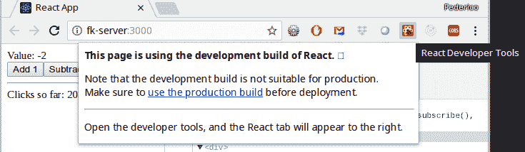

我们的新工具将检测并与任何 React 开发的应用程序一起工作

# 它是如何工作的…

我们已经安装了我们的调试工具，并将其应用到了我们的应用程序；现在让我们看看它是如何工作的，以及我们可以用它做些什么。

如果您通过点击选择任何特定组件，您可以看到它生成的组件和 HTML 元素。您还可以通过在屏幕上直接选择组件（点击 Memory 标签左侧的最左边的图标），然后点击 React 标签来以更传统的方式选择组件；您点击的元素将被选中。您还可以使用搜索功能查找特定组件；这在大型应用程序中将非常有用，可以避免手动滚动大量 HTML。

每个组件旁边的三角形可能有两种不同的颜色，这取决于它是实际的`React`组件（例如我们的情况下的`<Counter>`或`<ClicksDisplay>`）还是与存储连接的`Redux`。HTML 元素没有任何三角形。

在第三个面板中，您可以看到当前的 props。如果您编辑一个（例如尝试将`count` prop 设置为不同的值），您将立即在左侧看到更改。此外，如果您点击一个按钮，您将看到 prop 值如何更改；在您的应用程序上尝试一下三个按钮。

如果您想与任何组件进行交互，您可能会注意到当前选择的组件旁边有`== $r`。这意味着有一个特殊的 JS 变量，它指向我们的情况下所选择的组件，`<Counter>`。如果您打开 Console 标签，可以通过输入`$r.props`来检查其 props，或者尝试调用各种可用的方法，例如`$r.onAdd1()`，如下一个截图所示：

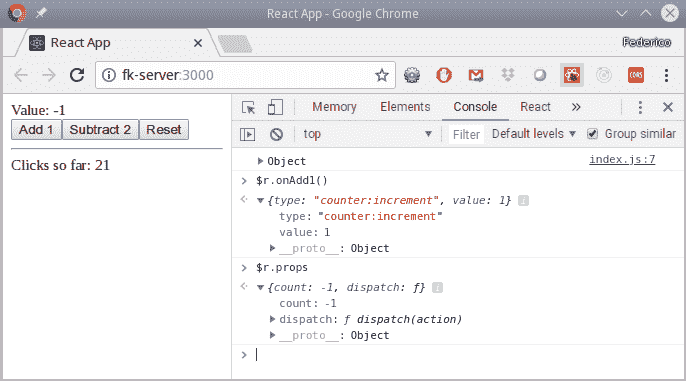

`$r`变量让您可以使用（和实验）当前选择的组件

有趣的是，在我们的应用程序中，当我们编写它时，`.onAdd1()`方法实际上会分派一个动作，我们可以在截图中看到：一个带有`type:"counter:increment"`和`value:1`的对象，就像我们编写的一样；请参阅上一章中的*定义动作*部分进行检查。

如果您选择`<Provider>`组件，您可以检查应用程序的当前状态。首先您需要选择它（以便`$r`指向它），然后在 Console 标签中，您需要输入`$r.store.getState()`来获得如下一个截图中的结果：

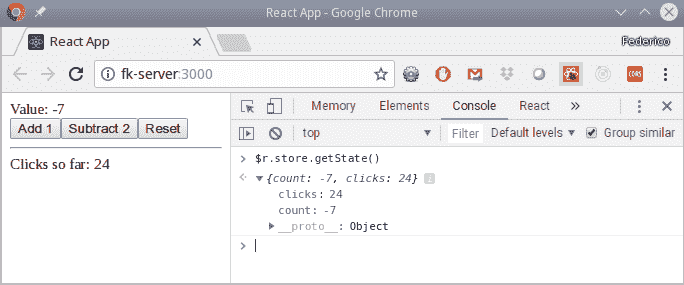

通过选择<Provider>组件，您可以检查应用程序的状态

实际上，如果您愿意，甚至可以触发动作；通过输入类似`$r.store.dispatch({type:"counter:increment", value:11})`，您可以完全控制应用程序状态。

# 使用独立工具进行调试

如果您正在使用其他浏览器，如 Safari 或 Internet Explorer，或者由于某些原因无法使用 Chrome 或 Firefox，那么有一个独立版本的工具，您可以在[`github.com/facebook/react-devtools/tree/master/packages/react-devtools`](https://github.com/facebook/react-devtools/tree/master/packages/react-devtools)找到。不过，需要警告的是，对于 Web 开发，您将无法获得完整的功能，因此最好还是使用支持的浏览器！

# 准备就绪

我们想要使用独立工具；让我们看看如何设置它。首先，显然，我们需要安装该软件包。您可以全局安装，但我更喜欢在项目本身内部进行本地工作：

```js
npm install react-devtools --save-dev
```

为了能够运行新命令，您可以使用`npx`（正如我们在书中看到的那样），但更容易的方法是在`package.json`中定义一个新的脚本。添加类似以下内容，您就可以使用`npm run devtools`打开独立应用程序：

```js
"scripts": {
    .
    .
    .
    "devtools": "react-devtools"
}
```

现在你已经设置好了；让我们看看如何使用这个工具。

如果您感兴趣，这个独立应用程序本身是用 JS 编写的，并使用`Electron`转换为桌面应用程序，我们将在本书的第十三章中看到*使用 Electron 创建桌面应用程序*。

# 如何做到这一点…

我们已经得到了独立工具；让我们看看如何使用它。为了以独立方式使用 RDT，您需要在 HTML 代码的顶部添加一行。

```js
<!DOCTYPE html>
<html lang="en">

<head>
 <script src="img/192.168.1.200:8097"></script>
  .
  .
  .
```

然后正常启动应用程序，等它运行起来后，启动独立应用程序。您将看到类似下一个截图的东西。请注意，我们看到了两个单独的窗口：一个带有 RDT，另一个带有应用程序（为了多样性）在 Opera 中；我也可以使用 Safari 或 IE 或任何其他浏览器：

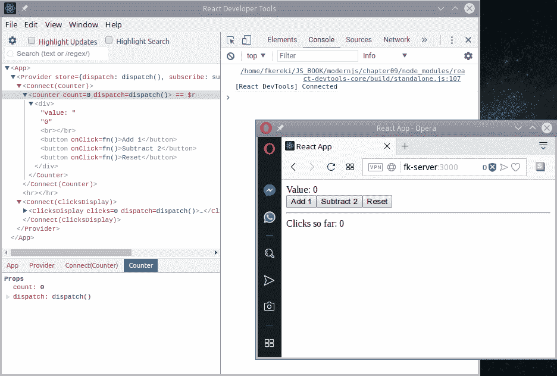

独立的 RDT 让您即使在非 Chrome 或 Firefox 浏览器中运行 React 应用程序也可以进行检查

现在您真的可以开始了；让我们通过查看我们可以（和不能）做什么来完成本节。

有关如何配置独立应用程序的更多详细信息，特别是如果您需要使用不同的端口，请查看官方文档[`github.com/facebook/react-devtools/tree/master/packages/react-devtools`](https://github.com/facebook/react-devtools/tree/master/packages/react-devtools)。对于复杂的情况，您可能需要使用不同的软件包`react-devtools-core`，在[`github.com/facebook/react-devtools/tree/master/packages/react-devtools-core`](https://github.com/facebook/react-devtools/tree/master/packages/react-devtools-core)。

# 它是如何工作的…

这个版本的开发工具让您可以与应用程序交互并查看组件和属性，但是您将受到通过控制台与它们交互的限制，我们将看到。

首先，通过检查在 Opera 窗口中单击按钮是否会自动在 RDT 中看到更改，就可以开始。在一些“添加 1”点击后查看下一个截图以查看结果：

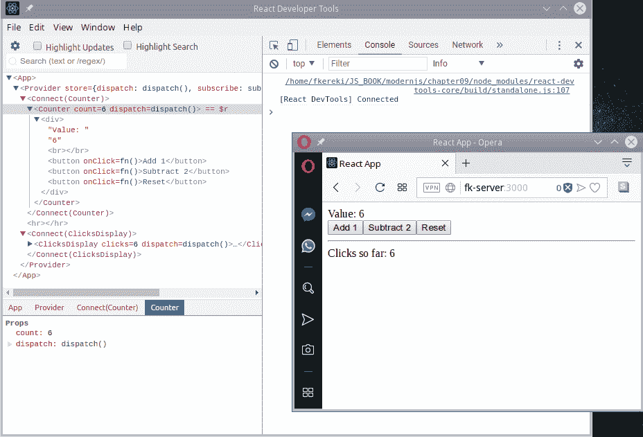

您在 React 应用程序中所做的任何操作都将显示在开发工具中。在这个示例中，我点击了六次“添加 1”，更新后的组件树显示了新值

大多数功能的工作方式与 Chrome 相同。您可以按名称搜索组件，如果右键单击组件，将获得多个选项，包括显示组件名称的所有出现（与搜索一样）或复制其属性；请参阅以下截图：

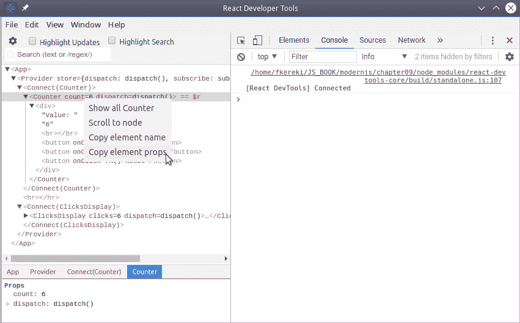

RDT 让您获取有关任何组件的完整信息

但是，请注意，您将无法获得*完整*的值。例如，在前面的示例中，复制的属性如下代码片段所示；我得到了一个字符串描述，而不是一个函数：

```js
{
  "count": 6,
  "dispatch": "[function dispatch]"
}
```

另一个限制是您将无法使用`$r`直接访问对象；这超出了工具的能力。但是，如果您在调试时没有解决方案，至少您将能够看到应用程序的内部工作，这并不是可以随意忽视的！

# 使用 redux-logger 记录 Redux

调试的一个基本工具是使用日志记录器。虽然 JS 已经有足够的日志记录功能可用（我们已经在第五章的*使用 Winston 添加日志记录*部分中提到了`window.console`函数），但是您需要一些帮助来记录`Redux`的操作，这是一个关键要求。当然，您可以在分派任何操作之前添加代码，但那将变得太冗长。相反，我们将考虑添加一些中间件，以记录所有操作；即使我们将在接下来的*使用 Redux 开发者工具调试 Redux*部分中看到更好的工具，这种日志也将非常有用。在这个示例中，让我们看看如何添加`redux-logger`。

我们已经使用了 thunks 的中间件，但是如果您想编写自己的中间件，您可以在[`redux.js.org/advanced/middleware`](https://redux.js.org/advanced/middleware)找到几个示例（包括日志函数）。

# 准备工作

像往常一样，我们的第一步是获取新工具。安装简单明了，与大部分文本中看到的情况相同：

```js
npm install redux-logger --save
```

这将安装新的包，但您必须手动将其添加到您的存储创建代码中；单独使用该包不会产生任何效果。

如果您想了解更多关于`redux-logger`的功能和能力，请查看[`github.com/evgenyrodionov/redux-logger`](https://github.com/evgenyrodionov/redux-logger)。

# 如何做…

设置`redux-logger`需要首先使用`createLogger()`函数创建一个记录器，该函数允许您选择许多选项来自定义记录的输出，然后将生成的记录器作为`Redux`的中间件包含。

在众多可用选项中，这些是最有趣的：

+   `colors` : 如果您希望更改输出的外观。

+   `diff:` : 一个布尔标志，用于决定是否要显示旧状态和新状态之间的差异；还有一个`diffPredicate(getState, action)`函数，你可以用它来决定是否显示差异。

+   `duration` : 一个布尔标志，用于打印处理操作所花费的时间；这主要在异步操作中会很有趣

+   `predicate(getState, action)` : 可以检查动作和当前状态，并返回 true 或 false 来定义是否应该记录动作；这对于限制日志记录到一些动作类型非常有用。

+   `titleFormatter()`、`stateTransformer()`、`actionTransformer()`和其他几个格式化函数。

有关完整的选项集，请查看[`github.com/evgenyrodionov/redux-logger`](https://github.com/evgenyrodionov/redux-logger)。

# 设置我们的计数器应用程序

我们将看到如何在最简单的情况下使用此记录器与我们的计数器应用程序，然后与区域浏览器一起使用，它将添加 thunks 到混合中。您必须使用`applyMiddleware()`函数（我们在*执行异步操作：redux-thunk*部分中已经看到了，当我们开始使用`redux-thunk`时，在第八章中）将记录器添加到流程中：

```js
// Source file: src/counterApp/store.js

/* @flow */

import { createStore, applyMiddleware } from "redux";
import { createLogger } from "redux-logger";

import { reducer } from "./counter.reducer.js";

const logger = createLogger({ diff: true, duration: true });
export const store = createStore(reducer, applyMiddleware(logger));
.
.
.
```

当然，您可能只想在开发中启用这个功能，因此前面片段的最后一行应该是以下内容：

```js
export const store =
    process.env.NODE_ENV === "development"
        ? createStore(reducer, applyMiddleware(logger))
        : createStore(reducer);
.
.
.
```

这将设置记录器以访问每个分派的动作，并记录它，包括状态之间的差异和处理时间。我们很快就会看到这是如何工作的，但首先让我们看一下我们的第二个应用程序，它已经有一些中间件。

# 设置我们的区域应用程序

当您想要应用两个或更多个中间件时，您必须指定它们将被应用的顺序。在我们的情况下，记住 thunk 可以是一个对象（fine to list）或一个函数（最终会被调用以产生一个对象），我们必须将我们的记录器放在所有可能的中间件的最后：

```js
// Source file: src/regionsApp/store.js

/* @flow */

import { createStore, applyMiddleware } from "redux";
import thunk from "redux-thunk";
import { createLogger } from "redux-logger";

import { reducer } from "./worlds.reducer.js";

const logger = createLogger({ duration: true });

export const store = createStore(reducer, applyMiddleware(thunk, logger));
.
.
.
```

我决定跳过列出差异，因为我们将得到一些有点长的列表（例如 200 多个国家），因此输出将变得太大。现在让我们看看这个日志是如何在实践中工作的。

# 它是如何工作的…

我们将两个应用程序都设置为记录所有操作，没有过滤；我们只需要`npm start`，日志输出将出现在 Web 开发者工具控制台中。

# 记录计数器应用程序

计数器应用程序非常简单：整个状态只有两个数据（当前计数器值和到目前为止的点击次数），因此很容易跟踪测试运行期间发生的情况；请参见下一个屏幕截图：

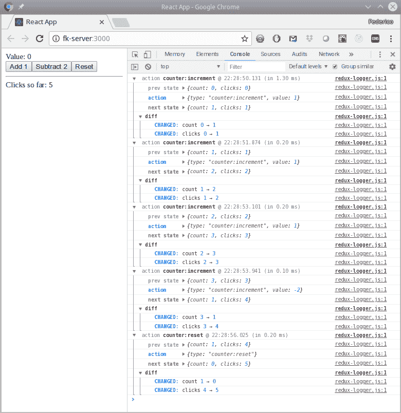

计数器应用程序的一个示例运行，但使用 redux-logger 记录所有操作

你可以轻松地跟踪测试运行，并且你将能够看到我们点击每个按钮时分派了哪个操作以及存储的连续值——如果在减速器的逻辑中有任何问题，你可能会发现它们很容易检测到，因为屏幕上显示了所有信息。

# 记录地区应用程序

我们的第二个应用程序更有趣，因为我们正在进行实际的异步请求，要处理的数据量更大，而屏幕显示虽然仍然有点简单，但至少比计数器显示更复杂。当我们启动应用程序时，下拉菜单使用了一个操作来请求整个国家列表，正如你在这个截图中所看到的：

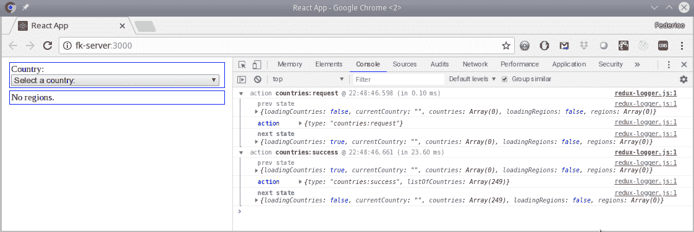

下拉组件分派了一个操作来获取国家（countries:request），并且证明成功（countries:success），返回了一个包含 249 个国家的列表

国家加载完毕后，我决定选择法国（对 2018 年 FIFA 足球世界杯冠军的一个小小的致敬！），然后一些新的操作被触发，如下一张截图所示：

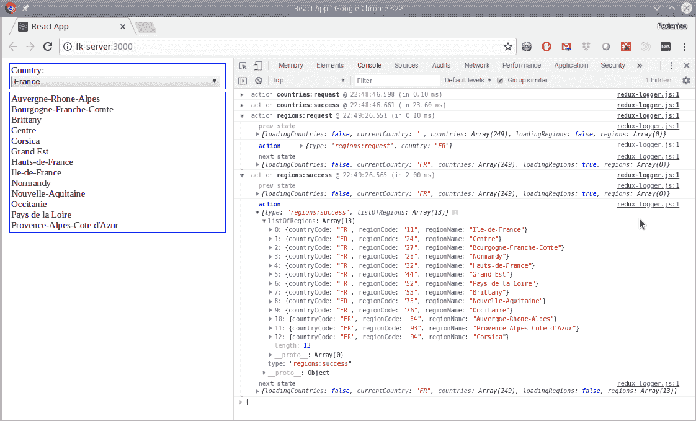

选择国家的结果：多个操作被分派并调用了 API

为了显示更小，我压缩了前两个操作，然后扩展了最后一个操作，显示了从我们自己的服务器收到的答案。你可以检查所有地区是否正确显示，尽管按名称排序，因为我们已经按名称对列表进行了排序。

有了这个记录器，你已经有了一个很好的工具来查看`React`+`Redux`应用程序中发生的事情——但我们将添加另一个工具，以更好地工作。

# 使用 Redux 开发者工具调试 Redux

如果你正在使用`React`+`Redux`工作，最好的工具之一就是`Redux`开发者工具（或 DevTools），它提供了一个控制台，让你查看操作和状态，甚至提供了一个“时光机”模式，让你可以来回穿梭，这样你就可以仔细检查一切是否如预期那样。在这个教程中，让我们看看如何使用这个非常强大的工具来帮助调试我们的代码。

如果你想看看 Dan Abramov 在 2015 年 React Europe 的演示，请查看他在[`www.youtube.com/watch?v=xsSnOQynTHs`](https://www.youtube.com/watch?v=xsSnOQynTHs)的演讲。

# 准备就绪

安装所需的`redux-devtools-extension`很容易，但要小心！不要混淆`redux-devtools-extension`包，位于[`github.com/zalmoxisus/redux-devtools-extension`](https://github.com/zalmoxisus/redux-devtools-extension)，与`redux-devtools`，一个类似但不同的包，位于[`github.com/reduxjs/redux-devtools`](https://github.com/reduxjs/redux-devtools)。后者更像是一个“自制”包，需要大量配置，尽管它可以让你为`Redux`创建一个完全定制的监视器，如果你愿意的话。对我们来说，这就是我们需要的：

```js
npm install redux-devtools-extension --save-dev
```

你还需要安装一个 Chrome 扩展程序`Redux Devtools`，它与我们刚刚安装的包一起工作。这个扩展将在 Web 开发者工具中添加一个新选项，我们将看到。

# 如何做…

```js
composeWithDevTools() added function will take care of the necessary connections to make everything work:
```

```js
// Source file: src/regionsApp/store.js

/* @flow */

import { createStore, applyMiddleware } from "redux";
import thunk from "redux-thunk";
import { createLogger } from "redux-logger";
import { composeWithDevTools } from "redux-devtools-extension";

import { reducer } from "./worlds.reducer.js";

const logger = createLogger({ duration: true });

export const store = createStore(
    reducer,
    composeWithDevTools(applyMiddleware(thunk, logger))
);
```

如果你运行代码，它将像以前一样工作，但让我们看看添加的调试功能是如何工作的。

# 它是如何工作的…

让我们启动我们的地区应用程序，然后打开 Web 开发者工具并选择 Redux 选项卡。你将得到类似下面截图的东西：

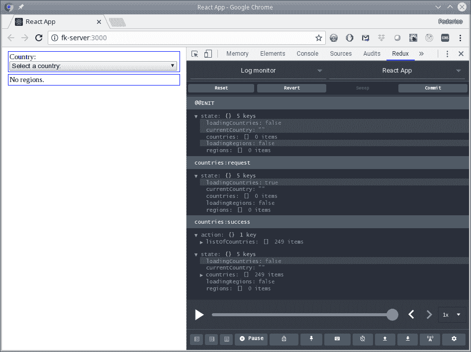

加载应用程序会显示初始状态以及一些操作：请求国家和该请求的成功

这里有很多功能。下面的滑块（你必须点击底部栏上的时钟图标才能看到）可能是最有趣的，因为它可以让你来回穿梭；尝试滑动它，你会看到应用程序的变化。

例如，你可以轻松地看到当国家请求操作被分发时屏幕是什么样子的，但数据返回之前；请参见下一个截图。你会记得为了检查这个，我们不得不添加一个人为的时间延迟；现在，你可以随意检查情况，而无需添加任何特殊代码。

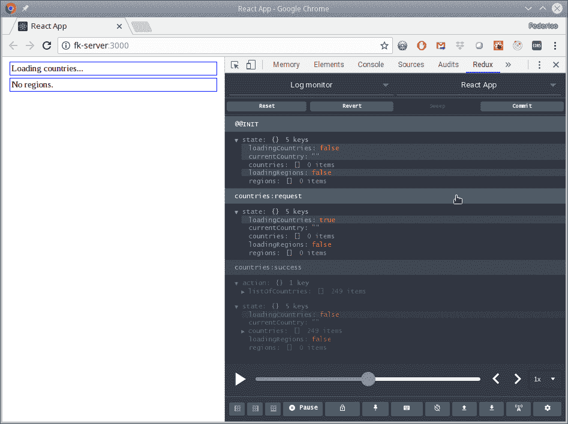

通过滑块，你可以看到应用程序在任何以前的时刻是什么样子的

如果你在顶部的下拉列表中选择检查员选项，你可以检查操作和状态。例如，在下一个截图中，你可以检查当从服务器检索到国家列表及其所有数据时分发的操作。你会注意到这种信息与`Redux`日志记录器包生成的信息非常相似，但你可以以更动态的方式处理它。

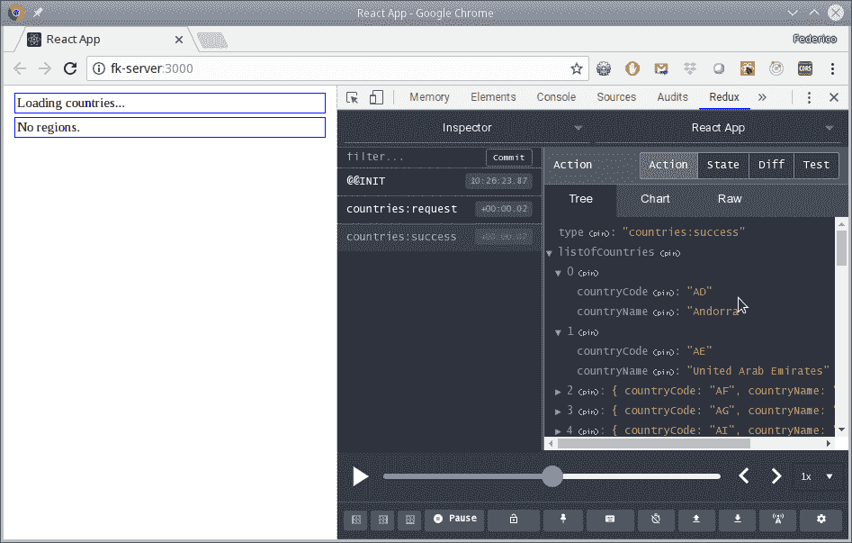

检查员功能让你查看操作（如此处）和状态，所以你可以检查发生的一切

让我们再进一步；再次选择法国，我们将看到这些地区进来后状态发生了什么变化。Diff 标签只显示状态中的差异：在我们的情况下，`loadingRegions`的值被重置为 false（当请求地区操作被分发时，它被设置为 true），地区列表得到了它的值（法国的所有地区）。请参见下一个截图。

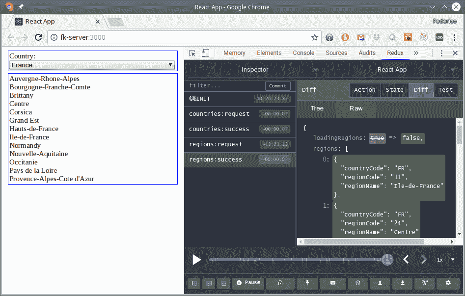

Diff 标签让你快速看到状态变化的属性，进行更快、更简单的分析

我们还没有浏览所有的功能，所以继续点击各处，找到其他可用的功能。例如，底部栏左侧的按钮可以让你打开一个单独的调试窗口，这样你的屏幕就不会那么拥挤了；另一个按钮可以让你创建和分发任何操作，所以继续，尝试一切！

你真的应该尝试使用这个工具，以清晰地了解你可以通过它实现什么，特别是尝试`时光机`功能。你会欣赏到这种结果之所以可能，是因为`React`以状态的方式创建视图，但最终你会注意到缺少了什么；让我们找出是什么，以及如何修复它？

# 连接路由进行调试

我们错过了什么？我们在本章的前几节中尝试的简单应用程序没有包括路由——但如果包括了呢？问题现在显而易见：每当用户导航到新的路由时，状态中没有任何内容来跟踪这种变化，所以时光机功能实际上不会起作用。为了解决这个问题，我们需要让路由信息与存储同步，这样就能恢复我们的调试功能；让我们看看如何做到这一点。

# 准备工作

在之前的`react-router`版本中，一个`react-router-redux`包负责链接路由和状态，但该包最近已被弃用，由`connected-react-router`取而代之，我们将安装它。我提到这一点是因为网络上仍然有许多文章显示了前一个包的用法；要小心：

```js
npm install --save connected-react-router
```

这是解决方案的一半；让这个包工作将（再一次！）需要对存储和应用程序的结构进行更改；让我们看看。

# 如何做…

我们想修改我们的代码，使 Redux 时光机功能能够工作。让我们再次使用我们在第八章中看到的*使用 react-router 添加路由*部分中的基本路由应用程序；我们有路由，还有一个分发一些操作的登录表单，所以我们将能够（在非常小的范围内，同意！）看到在正常应用程序中找到的各种东西。

将有两个地方发生变化：首先，我们将不得不将我们的存储与与路由器相关的`history`对象连接起来，其次，我们将不得不在我们的主代码中添加一个组件。存储更改如下-请注意，我们还在这里添加了与本章其余部分匹配的其他调试工具：

```js
// Source file: src/routingApp/store.js

/* @flow */

import { createStore, applyMiddleware } from "redux";
import thunk from "redux-thunk";
import { createLogger } from "redux-logger";
import { composeWithDevTools } from "redux-devtools-extension";
import { connectRouter, routerMiddleware } from "connected-react-router";
import { createBrowserHistory } from "history";

import { reducer } from "./login.reducer";

const logger = createLogger({ duration: true });

export const history = createBrowserHistory();

export const store = createStore(
 connectRouter(history)(reducer),
    composeWithDevTools(
        applyMiddleware(routerMiddleware(history), thunk, logger)
    )
);
```

代码看起来有点晦涩，但基本上：

+   我们创建一个`history`对象，我们需要导出它，因为我们以后会用到它

+   我们用`connectRouter()`包装我们原来的`reducer`，以生成一个新的`reducer`，它将意识到路由器状态

+   我们添加了`routerMiddleware(history)`以允许像`push()`这样的路由方法

然后我们将不得不在我们的主 JSX 中添加一个`<ConnectedRouter>`组件；这将需要我们之前创建的`history`对象：

```js
// Source file: src/App.routing.auth.js

import React, { Component } from "react";
import { Provider } from "react-redux";
import { BrowserRouter, Switch, Route, Link } from "react-router-dom";
import { ConnectedRouter } from "connected-react-router";

import {
    ConnectedLogin,
    AuthRoute
} from "./routingApp";
import { history, store } from "./routingApp/store";

const Home = () => <h1>Home Sweet Home</h1>;
const Help = () => <h1>Help! SOS!</h1>;
.
.
.

class App extends Component<{}> {
    render() {
        return (
            <Provider store={store}>
                <BrowserRouter>
 <ConnectedRouter history={history}>
                        <div>
                            <header>
                                <nav>
                                    <Link to="/">Home</Link>&nbsp;
                                    <Link to="/login">Log 
                                     in</Link>&nbsp;
                                    .
                                    .
                                    .
                                </nav>
                            </header>

                            <Switch>
                              <Route exact path="/" component={Home} />
                              <Route path="/help" component={Help} />
                                .
                                .
                                .
                            </Switch>
                        </div>
 </ConnectedRouter>
                </BrowserRouter>
            </Provider>
        );
    }
}

export default App;
```

现在一切都设置好了；让我们看看这是如何工作的。

要了解更多关于`connected-react-router`的信息，请查看其 GitHub 页面[`github.com/supasate/connected-react-router`](https://github.com/supasate/connected-react-router)；特别是，您可能会对页面底部列出的许多文章中的各种提示和建议感兴趣。

# 它是如何工作的…

现在让我们启动我们的应用程序，并不要忘记从第四章运行我们的服务器，*使用 Node 实现 RESTful 服务*，就像我们以前做的那样。打开`Redux` DevTools，我们看到一个新的动作`@@INIT`，现在状态包括一个新的路由器属性；请参阅以下截图：

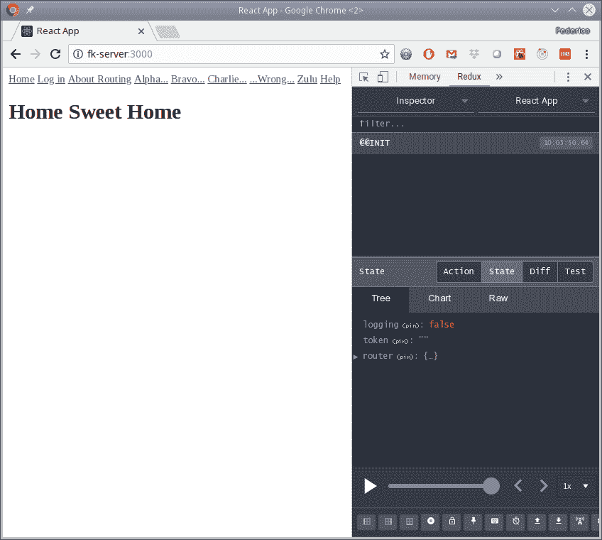

将路由连接到存储后，会出现一些新的动作和状态属性

如果我们点击 Alpha…，我们会看到有两个动作被分派：第一个尝试访问`/alpha`，第二个是我们重定向到`/login`页面，如下截图所示：

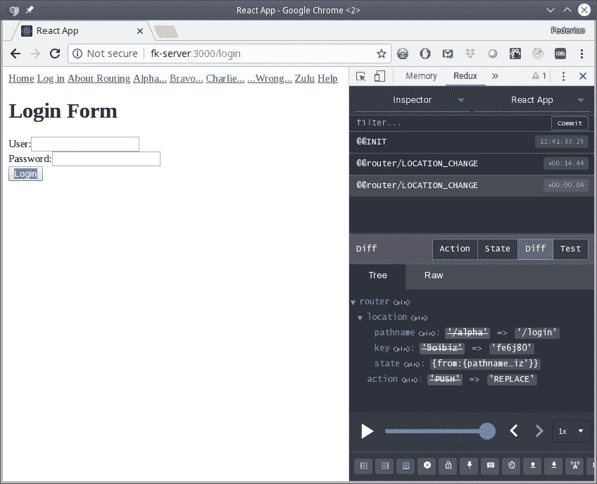

尝试访问受保护的路由会将我们重定向到登录页面

输入用户名和密码后，我们看到我们的 login:request 和 login:success 动作-就像我们启用`Redux`开发者工具以来看到的那样-然后是另一个动作，对应于重定向到`/alpha`页面，如下截图所示：

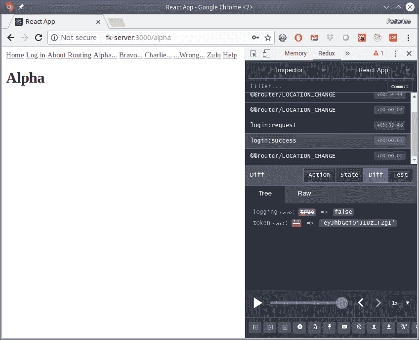

我们自己的动作与路由器动作交织在一起

但是，现在时间机器功能也对路由启用了；例如，如果您将滑块移回到开头，您将再次看到主页，并且您可以来回移动，视图将适当地反映您之前看到的一切；请查看下一个截图：

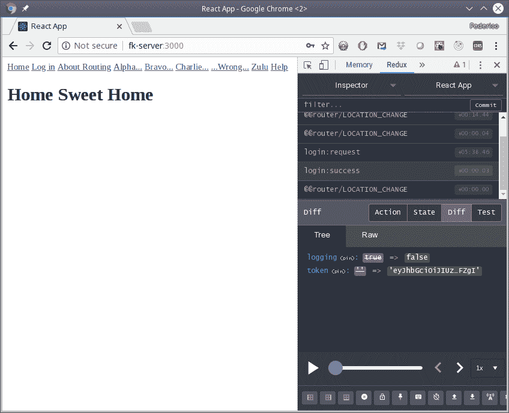

连接了路由器到状态后，现在我们可以使用滑块返回并每次看到正确的页面

现在我们有了一套很好的调试工具；让我们继续进行自动测试，就像我们之前在`Node`中做的那样。
