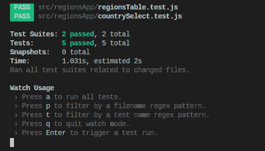
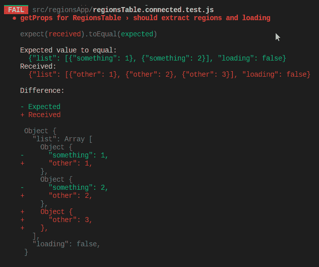
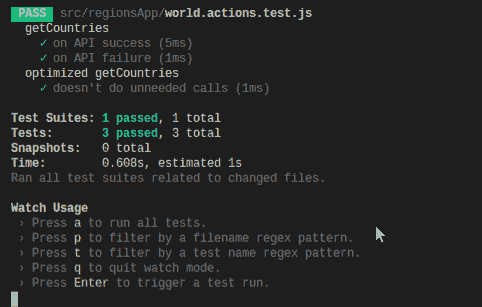
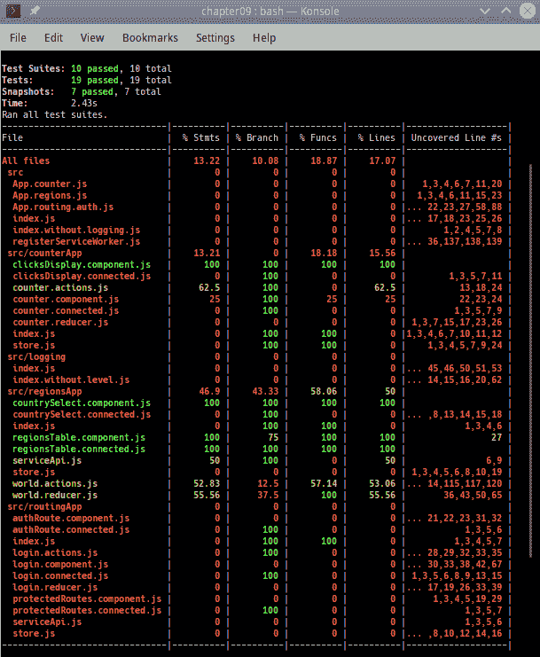
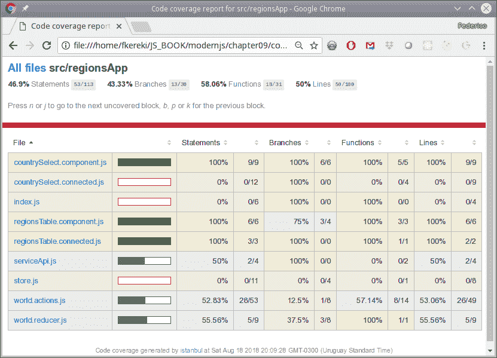

# 第十章：测试您的应用程序

在本章中，我们将涵盖以下配方：

+   使用 Jest 和 Enzyme 测试组件

+   测试 reducers 和映射

+   测试 actions 和 thunks

+   使用快照测试更改

+   测量测试覆盖率

# 介绍

在上一章中，我们处理了调试。现在让我们添加一些单元测试配方，以满足我们开发所需的一切。正如我们以前所见，良好的单元测试不仅有助于开发，还可以作为预防工具，避免回归错误。

# 使用 Jest 和 Enzyme 测试组件

回到第五章，*测试和调试您的服务器*，我们对`Node`代码进行了单元测试，并且我们使用了`Jest`。正如我们所说的，这个包的一个优点是我们也可以将其与`React`（或`React Native`一起使用，我们将在第十一章中查看*使用 React Native 创建移动应用程序*），所以我们之前在本书中学到的一切仍然有效；如果你愿意，快速浏览一下，这样我们就不必在这里重复了。

我们应该测试什么？显然，我们必须为我们的组件编写单元测试，但由于我们一直在使用`Redux`，我们还需要为 reducers、actions 和 thunks 编写测试；我们将在本节和接下来的节中涵盖所有这些主题。其中一些测试将非常简单，而其他一些则需要更多的工作。那么，让我们开始吧！

# 准备就绪

对于`Node`，我们必须自己安装`Jest`，但`create-react-app`已经为我们做了这件事，所以这是一件少了的事情需要担心。（如果你自己创建了`React`应用程序，通过编写自己的配置文件，那么你应该看一下[`jestjs.io/docs/en/getting-started`](https://jestjs.io/docs/en/getting-started)来了解如何继续。）然而，我们还将使用`Enzyme`，这是一个可以简化对组件生成的 HTML 进行断言或操作的包，这与`jQuery`非常相似。

如果你想了解更多关于这些功能，或者如果你有一段时间没有使用`jQuery`了（就像我自己一样！），请阅读有关`cheerio`的信息，这是`Enzyme`使用的包，网址是[`github.com/cheeriojs/cheerio`](https://github.com/cheeriojs/cheerio)。关于`Enzyme`本身，包括其配置，你可以访问其 GitHub 网站[`github.com/airbnb/enzyme`](https://github.com/airbnb/enzyme)。

由于我们使用的是`React`的 16 版本，安装该包的当前方式如下；需要`enzyme-adapter-react-16`附加包来将`Enzyme`与`React`链接起来：

```js
npm install enzyme enzyme-adapter-react-16 --save-dev
```

另一个好处是，我们不需要进行任何特殊配置，因为`create-react-app`也会负责设置一切。然而，如果你决定需要一些特殊的东西，`react-app-rewired`会帮助你：在[`github.com/timarney/react-app-rewired`](https://github.com/timarney/react-app-rewired)上查看更多信息。

我们拥有一切所需的东西；让我们开始测试吧！

# 如何做到这一点...

我们应该测试哪些组件？我们已经使用过连接和未连接的组件，但我们将在这里专注于后者。为什么？连接的组件从`mapStateToProps()`和`mapDispatchToProps()`函数中获取它们的 props 和 dispatch 逻辑；我们可以相信这是这样的，因此我们实际上不需要测试它。如果你愿意，你可以设置一个存储并验证这两个函数是否起作用，但这些测试很容易编写，我不建议你真的需要它们。相反，我们将专注于组件的未连接版本并对其进行全面测试。我们将在这里设置所有的测试，然后我们将看看如何运行它们，以及期望的输出是什么。

# 测试没有事件的组件

我们想要测试一个组件，所以让我们选择一个合适的组件。对于我们的第一个单元测试，让我们使用`<RegionsTable>`组件，它没有处理任何事件；它只是一个显示组件。测试通常与组件同名，但将扩展名从`.js`改为`.test.js`——或者`.spec.js`，但我更喜欢`.test.js`。随便选，只要保持一致。

首先，让我们从考虑我们应该测试什么开始。我们组件的规范说明它的工作方式取决于它接收到的国家列表是空的还是非空的。在第一种情况下，我们可以测试生成的 HTML 文本是否包含*No regions*，在第二种情况下，我们应该验证提供的所有地区是否出现在输出中。当然，你可以想出更详细、更具体的情况，但尽量不要让你的测试太*脆弱*，意思是实现的细微变化会导致测试失败。我描述的测试可能并不涵盖所有情况，但几乎可以肯定，即使你以不同的方式实现组件，测试仍然应该成功。

开始实际测试时，它们都会以类似的方式开始：我们需要导入必要的库，以及要测试的组件，并设置`Enzyme`及其适配器。在下面的代码中，我将突出显示相关的行：

```js
// Source file: src/regionsApp/regionsTable.test.js

/* @flow */

import React from "react";
import Enzyme from "enzyme";
import Adapter from "enzyme-adapter-react-16";

import { RegionsTable } from "./regionsTable.component";

Enzyme.configure({ adapter: new Adapter() });

// *continued...*
```

就像我们之前做的那样，我们将使用`describe()`和`it()`来设置不同的测试用例。要检查空地区列表的情况，我们只需要使用几行代码：

```js
// ...*continues*

describe("RegionsTable", () => {
    it("renders correctly an empty list", () => {
        const wrapper = Enzyme.render(<RegionsTable list={[]} />);
 expect(wrapper.text()).toContain("No regions.");
    });

// *continued*...
```

我们使用`Enzyme.render()`来为我们的组件生成 DOM，使用`.text()`方法生成其文本版本。通过后者，我们只需要验证所需的文本是否出现，因此整个测试非常简短。

我们还有第二个用例，其中我们提供了一个非空的地区列表。代码类似，但显然更长；让我们先看看代码，然后再解释它：

```js
// *...continues*

    it("renders correctly a list", () => {
        const wrapper = Enzyme.render(
            <RegionsTable
                list={[
                    {
                        countryCode: "UY",
                        regionCode: "10",
                        regionName: "Montevideo"
                    },
                    {
                        countryCode: "UY",
                        regionCode: "9",
                        regionName: "Maldonado"
                    },
                    {
                        countryCode: "UY",
                        regionCode: "5",
                        regionName: "Cerro Largo"
                    }
                ]}
            />
        );
 expect(wrapper.text()).toContain("Montevideo");
 expect(wrapper.text()).toContain("Maldonado");
 expect(wrapper.text()).toContain("Cerro Largo");
    });
});
```

逻辑非常相似：渲染组件，生成文本，检查正确的内容是否存在。正如我们所说，你也可以验证每个地区是否在`<li>`元素内，以及它们是否有键等；然而，要记住我们关于脆弱测试的写法，并避免过度规定测试，以便只有一个可能的、特定的组件实现才能通过它们！

# 测试带有事件的组件

现在我们想要测试一个带有事件的组件。为此，`<CountrySelect>`组件会很方便，因为它可以处理一些事件，并且会相应地调用一些回调函数。

首先，让我们看一下初始设置，包括我们将用于不同测试的国家列表：

```js
// Source file: src/regionsApp/countrySelect.test.js

/* @flow */

import React from "react";
import Enzyme from "enzyme";
import Adapter from "enzyme-adapter-react-16";

import { CountrySelect } from "./countrySelect.component";

Enzyme.configure({ adapter: new Adapter() });

const threeCountries = [
    {
        countryCode: "UY",
        countryName: "Uruguay"
    },
    {
        countryCode: "AR",
        countryName: "Argentina"
    },
    {
        countryCode: "BR",
        countryName: "Brazil"
    }
];

// *continued...*
```

现在，我们将为哪些情况编写单元测试？让我们从没有给出国家列表的情况开始：根据我们的要求，在这种情况下，组件将不得不使用一个属性，比如`getCountries()`，来获取必要的数据。我们将再次使用*spy*（我们在第五章的*使用 spy*部分中看到它们）来模拟和测试必要的行为：

```js
// ...*continues*

describe("CountrySelect", () => {
    it("renders correctly when loading, with no countries", () => {
 const mockGetCountries = jest.fn();
 const mockOnSelect = jest.fn();

        const wrapper = Enzyme.mount(
            <CountrySelect
                loading={true}
                onSelect={mockOnSelect}
                getCountries={mockGetCountries}
                list={[]}
            />
        );
        expect(wrapper.text()).toContain("Loading countries");

 expect(mockGetCountries).toHaveBeenCalledTimes(1);
 expect(mockOnSelect).not.toHaveBeenCalled();
    });

// *continued...*
```

我们创建了两个 spy：一个用于`onSelect`事件处理程序，一个用于获取国家列表。测试组件输出是否包含`"Loading countries"`文本很简单；让我们专注于 spy。我们期望组件应该调用获取国家列表的函数（但只调用一次！），并且事件处理程序不应该被调用：最后两个检查就解决了这个问题。

现在，如果提供了一个国家列表，会发生什么？我们可以编写类似的测试，只是验证一个不同之处，即组件没有调用函数来获取（已经给出的）国家；我已经突出显示了相关代码：

```js
// ...*continues*

    it("renders correctly a countries dropdown", () => {
 const mockGetCountries = jest.fn();
 const mockOnSelect = jest.fn();

        const wrapper = Enzyme.mount(
            <CountrySelect
                loading={false}
                onSelect={mockOnSelect}
                getCountries={mockGetCountries}
                list={threeCountries}
            />
        );

        expect(wrapper.text()).toContain("Uruguay");
        expect(wrapper.text()).toContain("Argentina");
        expect(wrapper.text()).toContain("Brazil");

 expect(mockGetCountries).not.toHaveBeenCalled();
 expect(mockOnSelect).not.toHaveBeenCalled();
    });

// *continued...*
```

鉴于我们已经编写的测试，这部分代码应该很容易理解：我们之前已经看到类似的测试，所以这里没有新的东西需要解释。

让我们来到最终、更有趣的情况：我们如何模拟用户选择了某些东西？为此，我们将不得不检测`<CountrySelect>`组件中的`<select>`元素，为此我决定提供一个 name 属性：我在组件原始的`render()`方法中改变了一行，并将其从`<select onChange={this.onSelect}>`改为`<select onChange={this.onSelect} name="selectCountry**"**>`，这样我就有了一种方法来获取元素。当然，你可能会反对以任何方式改变原始组件代码，你也可以非常正确地指出，这使得测试比以前更加脆弱；如果组件以不同的方式重新编码，而不使用`<select>`元素，测试将自动失败，你是对的。这是一个关于测试到何种程度以及需要什么额外负担的判断。

为了完成我们的测试套件，我们要验证正确的事件处理程序是否被调用：

```js
// ...*continues*

    it("correctly calls onSelect", () => {
        const mockGetCountries = jest.fn();
 const mockOnSelect = jest.fn();

        const wrapper = Enzyme.mount(
            <CountrySelect
                loading={false}
 onSelect={mockOnSelect}
                getCountries={mockGetCountries}
                list={threeCountries}
            />
        );

 wrapper
 .find("[name='selectCountry']")
 .at(0)
 .simulate("change", { target: { value: "UY" } });

        expect(mockGetCountries).not.toHaveBeenCalled();
 expect(mockOnSelect).toHaveBeenCalledTimes(1);
 expect(mockOnSelect).toHaveBeenCalledWith("UY");
    });
});
```

我们必须使用一些 DOM 遍历来找到所需的元素，然后使用`.simulate()`来触发事件。由于实际上并没有真正触发任何事件，我们必须提供它可能包含的值，这在我们的情况下是`.target.value`。然后我们可以通过验证事件处理程序是否以正确的值（"UY"）被调用一次来完成我们的测试。

我们已经编写了组件测试；让我们看看它们是如何工作的。

# 它是如何工作的...

运行测试很简单：您只需要使用`npm test`，就像我们为`Node`做的那样：



Jest 的输出与我们在 Node 中看到的样式相同；快照总数将在后面解释

`Jest`被设置为自动监视更改，因此如果您修改任何文件，测试将再次进行 - `q`命令将停止监视模式，您将不得不使用`a`来运行所有测试，或者`p`和`t`来过滤一些要运行的测试。

我们现在已经看到了如何测试组件。然而，还需要一些额外的工作，因为在我们的示例中，我们还没有处理任何与`Redux`相关的事项，比如分发操作或 thunks；让我们转向其他类型的测试。

# 测试 reducers 和映射

在测试完组件之后，我们现在转向一个更简单的测试集：首先是 reducers；然后是`mapStateToProps()`和`mapDispatchToProps()`等映射。为什么这些测试更容易编写？因为在所有这些情况下，我们都在处理纯函数，没有副作用，它们的输出仅基于它们的输入。我们在本书早期处理了这些类型的函数，当时我们为 Node 进行了测试，所以现在我们将用一个简短的部分来完成。我们唯一需要特别注意的是验证没有函数（例如 reducer）试图修改状态，但除此之外，测试都很简单。在这个配方中，让我们看看我们为 reducers 和映射需要哪些不同类型的测试。

# 如何做...

我们将不得不测试 reducers 和映射，所以让我们首先考虑如何测试 reducer。有两个关键的事情需要验证：首先，给定一个输入状态，它产生一个正确的输出状态，其次，reducer 不修改原始状态。第一个条件是非常明显的，但第二个条件很容易被忽视 - 修改当前状态的 reducer 可能会产生难以发现的错误。

让我们看看我们如何测试我们的国家和地区应用程序的 reducer。首先，由于所有测试都是类似的，我们只会看到其中的一些，针对所有可能的操作中的两个 - 但当然，你想测试*所有*的操作，对吧？我们还将包括另一个测试，以验证对于未知操作，reducer 只返回初始状态，以任何方式都不改变：

```js
// Source file: src/regionsApp/world.reducer.test.js

/* @flow */

import { reducer } from "./world.reducer.js";
import { countriesRequest, regionsSuccess } from "./world.actions.js";

describe("The countries and regions reducer", () => {
    it("should process countryRequest actions", () => {
        const initialState = {
            loadingCountries: false,
            currentCountry: "whatever",
            countries: [{}, {}, {}],
            loadingRegions: false,
            regions: [{}, {}]
        };

        const initialJSON = JSON.stringify(initialState);

        expect(reducer(initialState, countriesRequest())).toEqual({
            loadingCountries: true,
            currentCountry: "whatever",
            countries: [],
            loadingRegions: false,
            regions: [{}, {}]
        });

        expect(JSON.stringify(initialState)).toBe(initialJSON);
    });

    it("should process regionsSuccess actions", () => {
        const initialState = {
            loadingCountries: false,
            currentCountry: "whatever",
            countries: [{}, {}, {}],
            loadingRegions: true,
            regions: []
        };

        const initialJSON = JSON.stringify(initialState);

        expect(
            reducer(
                initialState,
                regionsSuccess([
                    { something: 1 },
                    { something: 2 },
                    { something: 3 }
                ])
            )
        ).toEqual({
            loadingCountries: false,
            currentCountry: "whatever",
            countries: [{}, {}, {}],
            loadingRegions: false,
            regions: [{ something: 1 }, { something: 2 }, { something: 3 }]
        });

        expect(JSON.stringify(initialState)).toBe(initialJSON);
    });

    it("should return the initial state for unknown actions", () => {
        const initialState = {
            loadingCountries: false,
            currentCountry: "whatever",
            countries: [{}, {}, {}],
            loadingRegions: true,
            regions: []
        };
        const initialJSON = JSON.stringify(initialState);

        expect(
            JSON.stringify(reducer(initialState, { actionType: "other" }))
        ).toBe(initialJSON);
        expect(JSON.stringify(initialState)).toBe(initialJSON);
    });
});
```

您是否想知道`Enzyme`，以及为什么我们跳过它？我们只在渲染组件时才需要它，所以对于测试 reducer 或操作（正如我们很快将要做的那样），根本不需要它。

reducer 的每个测试都是相同的，并遵循以下步骤：

1.  定义`initialState`并使用`JSON.stringify()`保存其原始字符串表示。

1.  调用 reducer 并使用`.toEqual()`（一个`Jest`方法，它在对象之间进行深度、递归的相等比较）来验证新状态是否完全匹配您期望的状态。

1.  检查`initialState`的 JSON 表示是否仍然与原始值匹配。

我为国家和地区使用了虚拟值，但如果您想更加小心，您可以指定完整、正确的值，而不是像`{ something:2 }`或`"whatever"`这样的值；这取决于您。

您可能想看看`redux-testkit`在[`github.com/wix/redux-testkit`](https://github.com/wix/redux-testkit)；这个包可以帮助您编写 reducer 测试，自动检查状态是否已被修改。

编写这些测试后，很明显为映射函数编写测试是相同的。例如，当我们设置`<ConnectedRegionsTable>`组件时，我们编写了一个`getProps()`函数：

```js
const getProps = state => ({
    list: state.regions,
    loading: state.loadingRegions
});
```

我们必须导出该函数（当时我们没有这样做，因为它不会在其他地方使用），然后可以执行测试，如下所示：

```js
// Source file: src/regionsApp/regionsTable.connected.test.js

/* @flow */

import { getProps } from "./regionsTable.connected.js";

describe("getProps for RegionsTable", () => {
    it("should extract regions and loading", () => {
        const initialState = {
            loadingCountries: false,
            currentCountry: "whatever",
            countries: [{ other: 1 }, { other: 2 }, { other: 3 }],
            loadingRegions: false,
            regions: [{ something: 1 }, { something: 2 }]
        };
        const initialJSON = JSON.stringify(initialState);

        expect(getProps(initialState)).toEqual({
            list: [{ something: 1 }, { something: 2 }],
            loading: false
        });
        expect(JSON.stringify(initialState)).toBe(initialJSON);
    });
});
```

这是如何工作的？让我们看看运行这些测试时会发生什么。

# 它是如何工作的...

使用`npm test`将产生一个很好的*全部绿色*输出，这意味着所有测试都已通过，就像前一节一样；不需要再次看到。在每个单独的测试中，我们应用了之前描述的技术：设置状态，保存其字符串版本，应用 reducer 或 mapper 函数，检查它是否与您希望它产生的匹配，并检查原始状态是否仍然与保存的版本匹配。

想象一下，有人意外地修改了我们测试的`getProps()`函数，以便它返回地区而不是返回国家列表，如下所示：



通过使用`.toEqual()`方法检测到映射（或 reducer）函数的任何意外更改，

进行产生和预期值的深度比较

因此，这些简单的测试可以帮助您防止意外更改-包括预期值的添加、删除或修改。这是一个很好的安全网！

# 测试操作和 thunks

为了完成我们的测试目标，我们必须看看如何测试操作和 thunks。测试前者在我们迄今为止所做的一切之后真的非常琐碎，因为只需要调用一个操作创建者并检查生成的操作上的字段，但是测试 thunks，这肯定会涉及异步服务调用，并且肯定会分发几个-好吧，这很有趣！

我们将跳过更简单的操作测试（尽管我们将测试它们，正如您将看到的那样），并直接开始编写我们的 thunks 的单元测试。

# 准备工作

我们在这里需要的一个好工具是`redux-mock-store`，这是一个小包，让我们可以使用一个假存储，模仿其所有功能，并提供一些调用，比如`.getActions()`，以检查分发了哪些操作，以什么顺序，带有哪些数据等等。安装很简单，像往常一样：

```js
npm install redux-mock-store --save-dev
```

您可能想知道我们将如何管理模拟 API 服务调用。根据您的架构，如果您的 thunks 直接使用`axios()`或`fetch()`之类的东西来联系服务，那么您肯定需要相应的模拟包。但是，由于我们将这些 API 调用分离到单独的包中，我们可以通过模拟整个调用来很好地完成，以便不会进行任何 AJAX 调用；我们很快就会做到这一点。

请查看`redux-mock-store`的完整文档，网址是 [`github.com/dmitry-zaets/redux-mock-store`](https://github.com/dmitry-zaets/redux-mock-store)。

# 如何做...

我们想要测试动作。让我们看看如何执行这些测试。

由于我们一直在大量使用我们的国家和地区示例，让我们通过测试（至少一部分）其动作和 thunk 来结束：`getCountries()`是一个很好的例子，而且与`getRegions()`非常相似。在这里，记住特定的代码将是很有帮助的，让我们来看一下：

```js
export const getCountries = () => async dispatch => {
 try {
 dispatch(countriesRequest());
 const result = await getCountriesAPI();
 dispatch(countriesSuccess(result.data));
 } catch (e) {
 dispatch(countriesFailure());
 }
};
```

首先，它分发一个动作来标记正在进行的请求。然后，它等待网络服务调用的结果；这将需要模拟！最后，如果调用成功，将分发一个包括接收到的国家列表的动作。在失败的调用上，将分发一个不同的动作，但显示失败。

现在让我们考虑一下-我们如何处理 API 调用？`world.actions.js`源代码直接从一个模块中导入`getCountriesAPI()`，但是`Jest`专门为此提供了一个功能：我们可以模拟一个完整的模块，为我们想要的任何函数提供模拟或间谍，如下所示：

```js
// Source file: src/regionsApp/world.actions.test.js

/* @flow */

import configureMockStore from "redux-mock-store";
import thunk from "redux-thunk";

import {
    getCountries,
    COUNTRIES_REQUEST,
    COUNTRIES_SUCCESS,
    COUNTRIES_FAILURE
} from "./world.actions.js";

import { getCountriesAPI } from "./serviceApi";

let mockPromise;
jest.mock("./serviceApi", () => {
 return {
 getCountriesAPI: jest.fn().mockImplementation(() => mockPromise)
 };

// *continues...*
```

每当`getCountries()`函数调用`getCountriesAPI()`时，我们的模拟模块将被使用，并且将返回一个承诺（`mockPromise`）；我们需要适当地决定这个承诺应该是什么，并且根据我们想要测试失败或成功来做出选择。

现在我们有了拦截 API 调用并使其产生我们想要的任何结果的方法，我们可以继续编写实际的测试。

让我们先处理*快乐路径*，在这种情况下，国家的 API 调用是成功的，没有问题。测试可以以以下方式编写：

```js
// ...*continued*

describe("getCountries", () => {
    it("on API success", async () => {
 const fakeCountries = {
 data: [{ code: "UY" }, { code: "AR" }, { code: "BR" }]
 };
 mockPromise = Promise.resolve(fakeCountries);

        const store = configureMockStore([thunk])({});

        await store.dispatch(getCountries());

        const dispatchedActions = store.getActions();

 expect(getCountriesAPI).toHaveBeenCalledWith();
 expect(dispatchedActions.length).toBe(2);
 expect(dispatchedActions[0].type).toBe(COUNTRIES_REQUEST);
 expect(dispatchedActions[1].type).toBe(COUNTRIES_SUCCESS);
 expect(dispatchedActions[1].listOfCountries).toEqual(
 fakeCountries.data
 );
    });

// *continues...*
```

这段代码的结构是怎样的？

1.  首先，我们定义了一些数据（`fakeCountries`），这些数据将由我们的`mockPromise`返回。

1.  然后，根据`redux-mock-store`的文档，我们创建了一个模拟商店；在我们的情况下，我们只使用了`thunk`中间件，但您可以添加更多。实际上，在我们的原始代码中，我们在`thunk`后面跟着`logger`，但这对我们的测试不相关。

1.  之后，我们`store.dispatch()`了`getCountries()` thunk 并等待其结果。

1.  一切都完成后，我们使用`store.getActions()`来获取实际分发的动作列表。

1.  我们测试我们的`getCountriesAPI()`函数是否被调用；如果没有被调用，我们将陷入严重麻烦！

1.  最后，我们测试了所有分发的动作，检查它们的`type`和其他属性。实际上，这是对动作创建者本身的间接测试！

既然我们已经看过一个成功的案例，让我们假设 API 调用以某种方式失败了。为了模拟这一点，我们所要做的就是为`getCountriesAPI()`调用定义一个不同的承诺来返回：

```js
// ...*continued*

    it("on API failure", async () => {
 mockPromise = Promise.reject(new Error("failure!"));

        const store = configureMockStore([thunk])({});

        await store.dispatch(getCountries());

        const dispatchedActions = store.getActions();

        expect(getCountriesAPI).toHaveBeenCalledWith();
        expect(dispatchedActions.length).toBe(2);
        expect(dispatchedActions[0].type).toBe(COUNTRIES_REQUEST);
        expect(dispatchedActions[1].type).toBe(COUNTRIES_FAILURE);
    });
});

// *continues...*
```

在这种情况下有什么不同？我们的`mockPromise`现在设置为失败，因此第二个分发的动作的测试会有所不同：在这种情况下，我们只会得到一个失败，而不是成功和国家列表-但是测试的其余部分基本相同。

最后，让我们完成一个额外的案例。当我们编写 thunk 时，我们发现我们可以通过`getState()`函数访问当前状态，并根据其内容采取不同的行动。我们本来可以编写我们的`getCountries()`函数，以避免在已经获得国家列表时进行 API 调用，以进行小优化；关键部分将如下所示：

```js
// ...*continued*

export const getCountries = () => async (dispatch, getState) => {
 if (getState().countries.length) {
 // no need to do anything!
 } else {
        try {
            dispatch(countriesRequest());
            const result = await getCountriesAPI();
            dispatch(countriesSuccess(result.data));
        } catch (e) {
            dispatch(countriesFailure());
        }
    }
};

// *continues*...
```

我们如何测试这种情况？不同之处在于我们如何设置商店，以及实际分发了哪些动作：

```js
// ...*continued*

describe("optimized getCountries", () => {
    it("doesn't do unneeded calls", async () => {
        const store = configureMockStore([thunk])({
 countries: [{ land: 1 }, { land: 2 }]
        });

 jest.resetAllMocks();

        await store.dispatch(getCountries());

        expect(getCountriesAPI).not.toHaveBeenCalled();
 expect(store.getActions().length).toBe(0);
    });
});
```

当我们设置存储时，我们可以提供初始值，就像在这种情况下，我们假设一些国家（虚假数据！）已经被加载。一个特殊的要求：我们必须使用`jest.resetAllMocks()`，否则我们将无法检查`getCountriesAPI()`是否被调用 - 因为它*被*调用了，但是由*之前*的测试调用的。然后，在分派 thunk 之后，我们只需检查 API 是否未被调用，并且未分派任何操作：一切正常！

# 它是如何工作的...

运行这些测试并不复杂，只需要`npm test`。我们可以看到我们的两个测试的结果（原始和优化后的`getCountries()`函数），通过的结果表明一切都如预期那样。当您运行单个测试时，输出会更详细，显示每个单独的测试：



对于操作和 thunk 的测试需要更多的设置，但以相同的方式运行。这次我们运行单个测试，因此获得了更详细的输出。

# 使用快照测试进行更改

到目前为止，我们一直在看组件、事件和操作的自动测试，因此让我们通过考虑一个测试工具来结束本章，这个测试工具并不真正是 TDD 的一部分，而是对事后不希望或不期望的更改的一种保障：*快照*。（在 TDD 中，测试将在编写组件代码之前编写，但您会看到这在这里是不可能的。）快照测试的工作方式如下：您渲染一个 UI 组件，捕获生成了什么 HTML，然后将其与先前存储的参考捕获进行比较。如果两个捕获不匹配，要么有人做了意外的更改，要么更改实际上是预期的。如果是这种情况，您将不得不验证新的捕获是否正确，然后放弃旧的捕获。

# 如何做...

我们可以为所有组件使用快照测试，但对于那些在其属性方面变化的组件来说，这更有趣，因此可以预期不同的行为。我们将使用不同的渲染方式：而不是生成 HTML 元素，我们将使用生成文本输出的渲染器，这样可以轻松存储和比较。

首先，最简单的情况是具有标准固定输出的组件。我们有一些例子：对于我们的`<ClicksDisplay>`组件，测试将写成如下形式：

```js
// Source file: src/counterApp/clicksDisplay.test.js

import React from "react";
import TestRenderer from "react-test-renderer";

import { ClicksDisplay } from "./";

describe("clicksDisplay", () => {
    it("renders correctly", () => {
 const tree = TestRenderer
 .create(<ClicksDisplay clicks={22} />)
 .toJSON();
 expect(tree).toMatchSnapshot();
    });
});
```

基本上，我们导入特殊的`TestRenderer`渲染器函数，使用它为我们的组件生成输出，然后将其与存储的快照进行比较；我们很快就会看到这是什么样子。测试基本上总是相同的：对于我们的`<Counter>`组件，测试代码将是完全类似的：

```js
// Source file: src/counterApp/counter.test.js

import React from "react";
import TestRenderer from "react-test-renderer";

import { Counter } from "./counter.component";

describe("clicksDisplay", () => {
    it("renders correctly", () => {
        const tree = TestRenderer
            .create(<Counter count={9} dispatch={() => null} />)
            .toJSON();
        expect(tree).toMatchSnapshot();
    });
});
```

差异很小；只需提供正确的预期属性，没有其他。让我们继续进行更有趣的案例。

如果您必须使用无法预先确定的属性值来渲染对象（这不太可能），您将不得不使用特殊的*属性匹配器*；您可以在[`jestjs.io/docs/en/snapshot-testing#property-matchers`](https://jestjs.io/docs/en/snapshot-testing#property-matchers)了解更多信息。

当您有组件的输出取决于其属性时，快照测试变得更有趣，因为它们可以让您验证不同的结果是否如预期那样产生。对于我们的国家和地区代码，我们有这样的情况：例如，`<RegionsTable>`组件预期显示区域列表（如果提供了），或者显示"没有区域"文本（如果没有可用的）。我们应该编写这些测试。让我们继续：

```js
// Source file: src/regionsApp/regionsTable.snapshot.test.js

import React from "react";
import TestRenderer from "react-test-renderer";

import { RegionsTable } from "./regionsTable.component";

describe("RegionsTable", () => {
 it("renders correctly an empty list", () => {
        const tree = TestRenderer.create(<RegionsTable list={[]} />).toJSON();
        expect(tree).toMatchSnapshot();
    });

 it("renders correctly a list", () => {
        const tree = TestRenderer
            .create(
                <RegionsTable
                    list={[
                        {
                            countryCode: "UY",
                            regionCode: "10",
                            regionName: "Montevideo"
                        },
                        .
                        .
                        .
                    ]}
                />
            )
            .toJSON();
        expect(tree).toMatchSnapshot();
    });
});
```

我们有两种不同的情况，就像我们之前描述的那样：一个快照将匹配*没有区域*的情况，另一个将匹配如果提供了一些区域的预期情况。对于`<CountrySelect>`组件，代码将类似：

```js
// Source file: src/regionsApp/countrySelect.snapshot.test.js

import React from "react";
import TestRenderer from "react-test-renderer";

import { CountrySelect } from "./countrySelect.component";

describe("CountrySelect", () => {
 it("renders correctly when loading, with no countries", () => {
        const tree = TestRenderer
            .create(
                <CountrySelect
                    loading={true}
                    onSelect={() => null}
                    getCountries={() => null}
                    list={[]}
                />
            )
            .toJSON();
        expect(tree).toMatchSnapshot();
    });

 it("renders correctly a countries dropdown", () => {
        const tree = TestRenderer
            .create(
                <CountrySelect
                    loading={false}
                    onSelect={() => null}
                    getCountries={() => null}
                    list={[
                        {
                            countryCode: "UY",
                            countryName: "Uruguay"
                        },
                        .
                        .
                        .
                    ]}
                />
            )
            .toJSON();
        expect(tree).toMatchSnapshot();
    });
});
```

因此，测试具有多个可能输出的组件并不难，只需要编写多个快照测试；一个简单的解决方案。

最后，为了简化测试，当您的组件本身有更多的组件时，使用浅渲染有助于集中在主要的高级方面，并将内部组件的渲染细节留给其他测试。我们可以像这样快速创建一个虚构的`<CountryAndRegions>`组件，显示我们国家的下拉菜单和地区表：

```js
// Source file: src/regionsApp/countryAndRegions.test.js

import React from "react";
import ShallowRenderer from "react-test-renderer/shallow";

import { CountrySelect } from "./countrySelect.component";
import { RegionsTable } from "./regionsTable.component";

class CountryAndRegions extends React.Component {
    render() {
        return (
            <div>
                <div>
                    Select:
                    <CountrySelect
                        loading={true}
                        onSelect={() => null}
                        getCountries={() => null}
                        list={[]}
                    />
                </div>
                <div>
                    Display: <RegionsTable list={[]} />
                </div>
            </div>
        );
    }
}

describe("App for Regions and Countries", () => {
    it("renders correctly", () => {
        const tree = new ShallowRenderer().render(<CountryAndRegions />);
        expect(tree).toMatchSnapshot();
    });
});

```

请注意，使用`ShallowRenderer`的方式与其他渲染器不同：您必须创建一个新对象，调用其`.render()`方法，而不再使用`.toJSON()`。我们将很快看一下这个新测试与以前的测试有何不同。

# 它是如何工作的...

运行快照与运行其他测试没有什么不同：您运行`Jest`测试脚本，所有测试一起运行。

# 运行测试

如果您像之前一样运行`npm test`，您现在会得到类似以下清单的输出：

```js
 PASS src/regionsApp/countryAndRegions.test.js
 PASS src/counterApp/counter.test.js
 PASS src/regionsApp/countrySelect.test.js
 PASS src/regionsApp/regionsTable.test.js
 PASS src/counterApp/clicksDisplay.test.js

Test Suites: 5 passed, 5 total
Tests:       7 passed, 7 total
Snapshots:   7 passed, 7 total
Time:        0.743s, estimated 1s
Ran all test suites related to changed files.

Watch Usage
 › Press a to run all tests.
 › Press p to filter by a filename regex pattern.
 › Press t to filter by a test name regex pattern.
 › Press q to quit watch mode.
 › Press Enter to trigger a test run.
```

唯一可见的区别是您会得到特定数量的快照（在这种情况下为七个），但还有更多。

# 生成的快照文件

如果您检查源代码目录，您会发现一些新的`__snapshots__`目录，其中包含一些`.snap`文件。例如，在`/regionsApp`目录中，您会发现这个：

```js
> dir
-rw-r--r-- 1 fkereki users 956 Aug 10 20:48 countryAndRegions.test.js
-rw-r--r-- 1 fkereki users 1578 Jul 28 13:02 countrySelect.component.js
-rw-r--r-- 1 fkereki users 498 Jul 25 23:16 countrySelect.connected.js
-rw-r--r-- 1 fkereki users 1301 Aug 10 20:31 countrySelect.test.js
-rw-r--r-- 1 fkereki users 212 Jul 22 21:07 index.js
-rw-r--r-- 1 fkereki users 985 Aug 9 23:45 regionsTable.component.js
-rw-r--r-- 1 fkereki users 274 Jul 22 21:17 regionsTable.connected.js
-rw-r--r-- 1 fkereki users 1142 Aug 10 20:32 regionsTable.test.js
-rw-r--r-- 1 fkereki users 228 Jul 25 23:16 serviceApi.js
drwxr-xr-x 1 fkereki users 162 Aug 10 20:44 __snapshots__
-rw-r--r-- 1 fkereki users 614 Aug 3 22:22 store.js
-rw-r--r-- 1 fkereki users 2679 Aug 3 21:33 world.actions.js
```

对于每个包含快照的`.test.js`文件，您会找到一个相应的`.snap`文件：

```js
> dir __snapshots__/
-rw-r--r-- 1 fkereki users 361 Aug 10 20:44 countryAndRegions.test.js.snap
-rw-r--r-- 1 fkereki users 625 Aug 10 20:32 countrySelect.test.js.snap
-rw-r--r-- 1 fkereki users 352 Aug 10 20:01 regionsTable.test.js.snap
```

这些文件的内容显示了运行时生成的快照。例如，`countrySelect.test.js.snap`文件包括以下代码：

```js
// Jest Snapshot v1, https://goo.gl/fbAQLP

exports[`CountrySelect renders correctly a countries dropdown 1`] = `
<div
  className="bordered"
>
  Country: 
  <select
    onChange={[Function]}
  >
    <option
      value=""
    >
      Select a country:
    </option>
    <option
      value="AR"
    >
      Argentina
    </option>
    <option
      value="BR"
    >
      Brazil
    </option>
    <option
      value="UY"
    >
      Uruguay
    </option>
  </select>
</div>
`;

exports[`CountrySelect renders correctly when loading, with no countries 1`] = `
<div
  className="bordered"
>
  Loading countries...
</div>
`;
```

您可以看到我们两种情况的输出：一个是完整的国家列表，另一个是在加载国家时，等待服务响应到达时的情况。

我们还可以在`countryAndRegions.test.js.snap`文件中看到一个浅层测试：

```js
// Jest Snapshot v1, https://goo.gl/fbAQLP

exports[`App for Regions and Countries renders correctly 1`] = `
<div>
  <div>
    Select:
    <CountrySelect
      getCountries={[Function]}
      list={Array []}
      loading={true}
      onSelect={[Function]}
    />
  </div>
  <div>
    Display: 
    <RegionsTable
      list={Array []}
    />
  </div>
</div>
`;
```

在这种情况下，请注意`<CountrySelect>`和`<RegionsTable>`组件没有展开；这意味着您只在这里测试高级快照，这是期望的。

# 重新生成快照

如果组件发生了变化会发生什么？仅仅为了这个目的，我对一个组件进行了一个非常小的更改。运行测试后，我收到了一个 FAIL 消息，附带了一个比较，这是由通常的`diff`命令生成的：

```js
 FAIL src/regionsApp/countryAndRegions.test.js
  ● App for Regions and Countries › renders correctly

    expect(value).toMatchSnapshot()

 Received value does not match stored snapshot 1.

    - Snapshot
    + Received

    @@ -7,11 +7,11 @@
           loading={true}
           onSelect={[Function]}
         />
       </div>
       <div>
 - Display: 
 + Displays: 
         <RegionsTable
           list={Array []}
         />
       </div>
     </div>

      at Object.it (src/regionsApp/countryAndRegions.test.js:31:22)
          at new Promise (<anonymous>)
      at Promise.resolve.then.el (node_modules/p-map/index.js:46:16)
```

那么，您应该怎么做呢？您应该首先验证更改是否正确，如果是这样，您可以删除`.snap`文件（这样它将在下次重新生成），或者您可以按`u`键，如测试摘要中所示：

```js
Snapshot Summary
 › 1 snapshot test failed in 1 test suite. Inspect your code changes or press `u` to update them.
```

小心！如果您只是重新生成快照而没有验证输出是否正确，那么测试将毫无意义；这是一个非常糟糕的结果！

# 测量测试覆盖率

我们已经在第五章的*测量测试覆盖率*部分看到了如何为`Jest`测试获取覆盖率，因此在这个示例中，我们将简要介绍一些我们将对测试进行的小改动。

# 如何做...

我们想要衡量我们的测试有多彻底，所以让我们看看必要的步骤。在使用`Node`时，我们直接调用了`jest`命令。然而，在这里，由于应用是由`create-react-app`构建的，我们将不得不以稍有不同的方式工作。我们将不得不向`package.json`添加一个新的脚本，以便用额外的参数调用我们的测试：

```js
"scripts": {
    .
    .
    .
    "test": "react-app-rewired test --env=jsdom",
 "coverage": "react-app-rewired test --env=jsdom --coverage --no-cache",
    .
    .
    .
}
```

`--coverage`选项将生成一个覆盖率报告，并生成一个`/coverage`目录，与`Node`一样，`--no-cache`选项将强制 Jest 重新生成所有结果，而不是依赖于先前可能不再有效的缓存值。

我们的`.gitignore`文件包括一行内容为`/coverage`，因此生成的文件不会被推送到 Git 服务器。

# 它是如何工作的...

如果你运行`npm run coverage`，你将得到文本输出和 HTML 输出。前者看起来像下面截图中显示的内容；你必须接受现实中，行是绿色、黄色或红色的，取决于覆盖程度。

在我们的情况下，我们得到了很多红色，因为我们只写了一些测试，而不是进行完整的测试套件；你可以自己完成它，作为读者的练习！



有色 ASCII 输出显示了我们所有源代码文件的覆盖评估；绿色表示良好的覆盖，黄色表示中等覆盖，

红色表示结果不佳。由于我们只写了一些测试，我们得到了很多红色！

如果你在浏览器中打开`/coverage/lcov-report/index.html`文件，你会得到与`Node`章节中相同类型的结果，如下所示：



HTML 输出允许您浏览项目的目录和文件。如果您点击特定文件，甚至可以看到哪些行和函数被执行，哪些被测试跳过。

如果你愿意，甚至可以使用`coverageThreshold`配置对象来指定必须达到的覆盖水平，以便测试被认为是足够的；有关更多信息，请参阅[`jestjs.io/docs/en/configuration.html#coveragethreshold-object`](https://jestjs.io/docs/en/configuration.html#coveragethreshold-object)。

我们现在已经完成了与`React`和`Redux`的工作，我们已经看过了如何构建 Web 应用程序，并且使用了之前开发的`Node`服务器后端。让我们继续进行其他类型的开发，首先是移动应用程序，同样也是用 JS！
