# 第十一章：使用 React Native 创建移动应用程序

在本章中，我们将看看以下食谱：

+   设置事情

+   添加开发工具

+   使用本机组件

+   适应设备和方向

+   样式和布局您的组件

+   添加特定于平台的代码

+   路由和导航

# 介绍

在过去的几章中，我们向您展示了如何使用`React`构建 Web 应用程序，在本章中，我们将使用一个紧密相关的`React Native`来开发可以在 Android 和 iOS（苹果）手机上运行的本机应用程序。

# 设置事情

对于移动应用程序的开发，有几种可能的方法：

+   *使用本机语言*，例如 Java 或 Kotlin 用于 Android，或 Objective C 或 Swift 用于 iOS，使用每个平台的本机开发工具。这可以确保您的应用程序最适合不同的手机，但需要多个开发团队，每个团队都有特定平台的经验。

+   使用纯网站，用户可以通过手机浏览器访问。这是最简单的解决方案，但应用程序会有一些限制，比如无法访问大多数手机功能，因为它们无法在 HTML 中使用。此外，使用无线连接运行，信号强度可能会有所不同，有时可能会很困难。您可以使用任何框架进行开发，比如`React`。

+   *开发混合应用程序*，这是一个网页，捆绑了一个浏览器，包括一组扩展，以便您可以使用手机的内部功能。对于用户来说，这是一个独立的应用程序，即使没有网络连接也可以运行，并且可以使用大多数手机功能。这些应用程序通常使用 Apache Cordova 或其衍生产品 PhoneGap。

还有第四种风格，由 Facebook 开发的`React Native`，沿用了现有的`React`。`React Native`（从现在开始，我们将缩写为*RN*）不是将组件呈现到浏览器的 DOM，而是调用本机 API 来创建通过您的 JS 代码处理的内部组件。通常的 HTML 元素和 RN 的组件之间存在一些差异，但并不难克服。使用这个工具，您实际上正在构建一个外观和行为与任何其他本机应用程序完全相同的本机应用程序，只是您使用了一种语言 JS，用于 Android 和 iOS 开发。

在这个示例中，我们将设置一个 RN 应用程序，以便我们可以开始尝试开发手机应用程序。

# 如何做...

有三种设置 RN 应用程序的方法：完全手动设置，这是您不想做的；其次，使用`react-native-cli`命令行界面进行打包；或者最后，使用一个与我们已经用于`React`非常相似的包，`create-react-native-app`（从现在开始，我们将称其为*CRAN*）。这两个包之间的一个关键区别是，对于后者，您无法包含自定义的本地模块，如果需要这样做，您将不得不*弹出*项目，这也需要设置其他几个工具。

您可以在[`facebook.github.io/react-native/docs/getting-started.html`](https://facebook.github.io/react-native/docs/getting-started.html)了解更多关于后两种方法的信息，如果您想为弹出做好准备，可以访问[`github.com/react-community/create-react-native-app/blob/master/EJECTING.md`](https://github.com/react-community/create-react-native-app/blob/master/EJECTING.md)。

我们首先要获取一个命令行实用程序，其中包括许多其他包：

```js
npm install create-react-native-app -g
```

之后，我们可以使用只有三个命令的简单项目创建和运行一个简单的项目：

```js
create-react-native-app yourprojectname
cd yourprojectname
npm start
```

您已经准备好了！让我们看看它是如何工作的——是的，我们还有一些配置要做，但检查一下事情是否进行得很顺利是件好事。

# 它是如何工作的...

运行应用程序时，它会在您的机器上的端口`19000`或`19001`启动服务器，您将使用`Expo`应用程序连接到该服务器，您可以在[`expo.io/learn`](https://expo.io/learn)找到该应用程序，适用于 Android 或 iOS。按照屏幕上的说明进行安装：

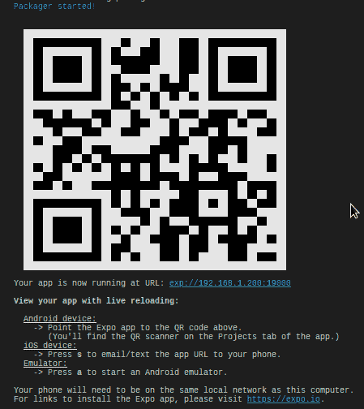

启动应用程序时获得的初始屏幕

当您第一次打开`Expo`应用程序时，它将看起来像以下截图。请注意，手机和您的机器必须在同一本地网络中，并且您的机器还必须允许连接到端口`19000`和`19001`；您可能需要修改防火墙才能使其正常工作：

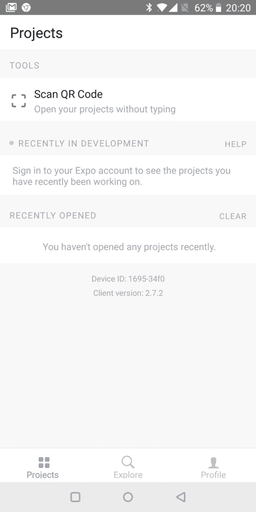

在加载 Expo 应用程序时，您需要扫描 QR 码以连接到服务器

使用扫描 QR 码选项后，将进行一些同步，很快您将看到您的基本代码运行正常：

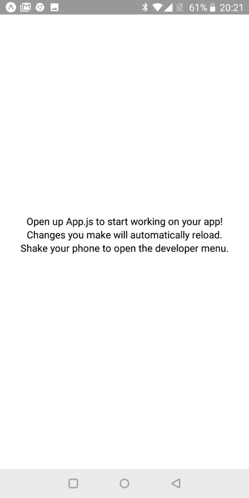

成功——您的代码已经运行起来了！

此外，如果您修改`App.js`源代码，更改将立即反映在您的设备上，这意味着一切正常！为了确保这一点，摇动手机以启用调试菜单，并确保启用了实时重新加载和热重新加载。您还需要远程 JS 调试以备后用。您的手机应该如下所示：

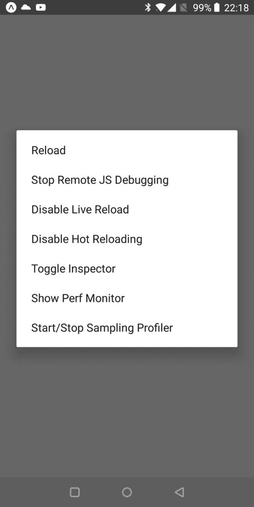

这些设置可以重新加载和调试

# 还有更多...

通过使用`Expo`客户端，CRAN 可以让您为 iOS 开发，即使您没有苹果电脑。（如果您有 Windows 或 Linux 机器，则无法为苹果系统开发；您必须拥有 MacBook 或类似设备；这是苹果的限制。）此外，在实际设备上工作在某些方面更好，因为您可以实际看到最终用户将看到的内容——毫无疑问。

但是，您可能有几个原因希望以不同方式工作，也许是在计算机上使用模拟真实设备的模拟器。首先，您可能很难获得十几个最受欢迎的设备，以便在每个设备上测试您的应用程序。其次，在自己的机器上工作更加方便，您可以轻松进行调试，截图，复制和粘贴等。因此，您可以安装 Xcode 或 Android SDK 以使自己能够使用模拟机器进行工作。

我们不会在这里详细介绍，因为根据您的开发操作系统和目标操作系统有很多组合；相反，让我们指向文档[`facebook.github.io/react-native/docs/getting-started.html`](https://facebook.github.io/react-native/docs/getting-started.html)，在那里您应该点击使用本机代码构建项目，并查看与模拟器一起工作所需的内容。安装完毕后，您将需要`Expo`客户端（与您的实际设备一样），然后您将能够在自己的机器上运行代码。

例如，看一下以下截图中模拟 Nexus 5 的 Android 模拟器：

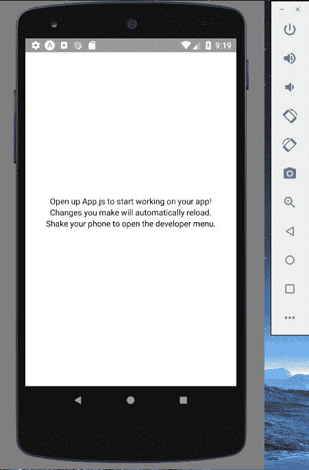

在您的屏幕上直接运行的模拟 Nexus 5 Android

使用此模拟器，您将具有与实际设备完全相同的功能。例如，您还可以获得调试菜单，尽管打开它的方式会有所不同；例如，在我的 Linux 机器上，我需要按*Ctrl* + *M*：

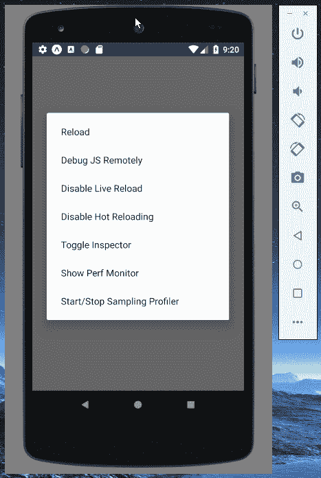

所有在手机上可用的功能在模拟设备上也同样可用

使用**Android 虚拟设备**（**AVD**）管理器，您可以为手机和平板电脑创建许多不同的模拟器；使用 Xcode，您也可以获得类似的功能，尽管这仅适用于 macOS 计算机。

# 添加开发工具

现在，让我们更好地配置一下。与之前的章节一样，我们希望使用 ESLint 进行代码检查，`Prettier`进行格式化，`Flow`进行数据类型检查。CRAN 负责包含`Babel`和`Jest`，所以我们不需要为这两个做任何事情。

# 如何做...

与在`React`中需要添加特殊的`rewiring`包才能使用特定配置的情况相反，在 RN 中，我们只需要添加一些包和配置文件，就可以准备好了。

# 添加 ESLint

对于 ESLint，我们需要相当多的包。我们在`React`中使用了大部分，但还有一个特殊的添加，`eslint-plugin-react-native`，它添加了一些 RN 特定的规则：

```js
npm install --save-dev \
 eslint eslint-config-recommended eslint-plugin-babel \
 eslint-plugin-flowtype eslint-plugin-react eslint-plugin-react-native
```

如果你想了解`eslint-plugin-react-native`添加的（实际上很少的）额外规则，请查看其 GitHub 页面[`github.com/Intellicode/eslint-plugin-react-native`](https://github.com/Intellicode/eslint-plugin-react-native)。其中大部分与样式有关，还有一个是用于特定平台代码的，但我们稍后会讨论这个。

我们需要一个单独的`.eslintrc`文件，就像我们在`React`中所做的一样。适当的内容包括以下内容，我已经突出显示了 RN 特定的添加内容：

```js
{
    "parser": "babel-eslint",
    "parserOptions": {
        "ecmaVersion": 2017,
        "sourceType": "module",
        "ecmaFeatures": {
            "jsx": true
        }
    },
    "env": {
        "node": true,
        "browser": true,
        "es6": true,
        "jest": true,
 "react-native/react-native": true
    },
    "extends": [
        "eslint:recommended",
        "plugin:flowtype/recommended",
        "plugin:react/recommended",
 "plugin:react-native/all"
    ],
    "plugins": ["babel", "flowtype", "react", "react-native"],
    "rules": {
        "no-console": "off",
        "no-var": "error",
        "prefer-const": "error",
        "flowtype/no-types-missing-file-annotation": 0
    }
}
```

# 添加 Flow

完成后，`ESLint`已经设置好识别我们的代码，但我们还需要配置`Flow`：

```js
npm install --save-dev flow flow-bin flow-coverage-report flow-typed
```

我们需要在`package.json`的`scripts`部分添加几行：

```js
"scripts": {
    "start": "react-native-scripts start",
    .
    .
    .
 "flow": "flow",
 "addTypes": "flow-typed install"
},
```

然后，我们需要初始化`Flow`的工作目录：

```js
npm run flow init
```

最后，我们可以使用与之前 React 相同的`.flowconfig`文件：

```js
[ignore]
.*/node_modules/.*

[include]

[libs]

[lints]
all=warn
untyped-type-import=off
unsafe-getters-setters=off

[options]
include_warnings=true

[strict]
```

现在我们已经准备好使用`Flow`，所以我们可以继续以我们习惯的方式工作——我们只需要添加`Prettier`来格式化我们的代码，然后我们就可以开始了！

# 添加 Prettier

重新安装`Prettier`并没有太多的事情，我们只需要一个`npm`命令，再加上我们一直在使用的`.prettierrc`文件。对于前者，只需使用以下命令：

```js
npm install --save-dev prettier
```

对于配置，我们可以使用这个`.prettierrc`文件的内容：

```js
{
    "tabWidth": 4,
    "printWidth": 75
}
```

现在，我们准备好了！我们可以检查它是否工作；让我们来做吧。

# 它是如何工作的...

让我们检查一切是否正常。我们将首先查看 CRAN 创建的`App.js`文件，我们可以立即验证工具是否正常工作——因为检测到了一个问题！看一下以下截图：

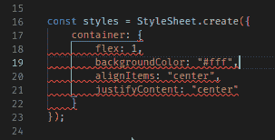

我们可以验证 ESLint 集成是否正常工作，因为它会突出显示一个问题

失败的规则是来自`eslint-plugin-react-native`的新规则：`no-color-literals`，因为我们在样式中使用了常量，这可能在将来会成为一个维护的头疼。我们可以通过添加一个变量来解决这个问题，并且我们将使用类型声明来确保`Flow`也在运行。新的代码应该如下所示——我已经突出显示了所需的更改：

```js
// Source file: App.original.fixed.js /* @flow */

import React from "react";
import { StyleSheet, Text, View } from "react-native";

export default class App extends React.Component<> {
    render() {
        return (
            <View style={styles.container}>
                <Text>Open up App.js to start working on your app!</Text>
                <Text>Changes you make will automatically reload.</Text>
                <Text>Shake your phone to open the developer menu.</Text>
            </View>
        );
    }
}

const white: string = "#fff";

const styles = StyleSheet.create({
    container: {
        flex: 1,
        backgroundColor: white,
        alignItems: "center",
        justifyContent: "center"
    }
});
```

因此，现在我们已经恢复了所有的工具，我们可以开始实际的代码了！

# 使用原生组件

使用 RN 的工作方式非常类似于使用`React`——有组件、状态、属性、生命周期事件等等，但有一个关键区别：你自己的组件不是基于 HTML，而是基于特定的 RN 组件。例如，你不会使用`<div>`元素，而是使用`<View>`元素，然后 RN 将其映射到 iOS 的`UIView`或 Android 的`Android.View`。视图可以嵌套在视图中，就像`<div>`标签一样。视图支持布局和样式，它们响应触摸事件等等，因此它们基本上等同于`<div>`标签，除了移动环境的行为和特定性。

还有更多的不同之处：组件的属性也与 HTML 的不同，你需要查看文档（在[`facebook.github.io/react-native/docs/components-and-apis`](https://facebook.github.io/react-native/docs/components-and-apis)）来了解每个特定组件的所有可能性。

您不仅限于使用 RN 提供的组件。您可以通过使用其他人开发的本机组件来扩展您的项目；一个一流的来源是令人敬畏的 React Native 列表，网址为[`www.awesome-react-native.com/`](http://www.awesome-react-native.com/)。请注意，您可能需要弹出您的项目才能这样做，因此请查看[`github.com/react-community/create-react-native-app/blob/master/EJECTING.md`](https://github.com/react-community/create-react-native-app/blob/master/EJECTING.md)获取更多信息。

# 准备就绪

让我们首先浏览一下您可能想要使用的 RN 组件和 API 的列表，然后我们将转移到一些实际的代码：

| **RN 组件** | **替代...** | **目的** |
| --- | --- | --- |
| `ActivityIndicator` | 动画 GIF | 用于显示循环加载指示器的组件 |
| `Button` | `button` | 处理触摸（点击）的组件 |
| `DatePickerAndroid` `TimePickerAndroid` | `input type="date"` `input type="time"` | 显示弹出窗口的 API，您可以在其中输入日期和时间；适用于 Android |

| `DatePickerIOS` | `input type="date"` `input type="datetime-local"`

`input type="time"` | 用户可以输入日期和时间的组件；适用于 iOS |

| `FlatList` | - | 仅呈现可见元素的列表组件；用于提高性能 |
| --- | --- | --- |
| `Image` | `img` | 用于显示图像的组件 |
| `Picker` | `select` | 从列表中选择值的组件 |
| `Picker.Item` | `option` | 用于定义列表的值的组件 |
| `ProgressBarAndroid` | - | 用于显示活动的组件；仅适用于 Android |
| `ProgressViewIOS` | - | 用于显示活动的组件；仅适用于 iOS |
| `ScrollView` | - | 可包含多个组件和视图的滚动容器 |
| `SectionList` | - | 类似于`FlatList`，但允许分段列表 |
| `Slider` | `input type="number"` | 从一系列值中选择值的组件 |
| `StatusBar` | - | 管理应用程序状态栏的组件 |
| `StyleSheet` | CSS | 为您的应用程序应用样式 |
| `Switch` | `input type="checkbox"` | 用于接受布尔值的组件 |
| `Text` | - | 用于显示文本的组件 |
| `TextInput` | `input type="text"` | 用键盘输入文本的组件 |
| `TouchableHighlight` `TouchableOpacity` | - | 使视图响应触摸的包装器 |
| `View` | `div` | 应用程序的基本结构特征 |
| `VirtualizedList` | - | `FlatList`的更灵活版本 |
| `WebView` | `iframe` | 用于呈现网络内容的组件 |

还有许多您可能感兴趣的 API；其中一些如下：

| **API** | **描述** |
| --- | --- |
| `Alert` | 显示具有给定标题和文本的警报对话框 |
| `Animated` | 简化创建动画 |
| `AsyncStorage` | `LocalStorage`的替代方案 |
| `Clipboard` | 提供获取和设置剪贴板内容的访问权限 |
| `Dimensions` | 提供设备尺寸和方向变化的访问权限 |
| `Geolocation` | 提供地理位置访问权限；仅适用于已弹出的项目 |
| `Keyboard` | 允许控制键盘事件 |
| `Modal` | 显示在视图上方的内容 |
| `PixelRatio` | 提供设备像素密度的访问 |
| `Vibration` | 允许控制设备振动 |

为了尽可能少出问题，您可能更喜欢避开特定平台的组件和 API，并使用通用的兼容组件。但是，如果您决定使用一些特定于 Android 或 iOS 的元素，请查看[`facebook.github.io/react-native/docs/platform-specific-code`](https://facebook.github.io/react-native/docs/platform-specific-code)了解如何操作的详细信息；这并不复杂。但是请记住，这将变得更难以维护，并且可能会改变一些交互或屏幕设计。

现在，让我们重新访问我们在第六章中为`React`编写的示例，*使用 React 开发*，国家和地区页面，这也将让我们使用`Redux`和异步调用，就像第八章中那样，*扩展你的应用程序*。由于我们使用了`PropTypes`，我们将需要该包。使用以下命令安装它：

```js
npm install prop-types --save
```

然后，我们将不得不重新安装一些包，从`Redux`和相关的开始。实际上，CRAN 已经包括了`redux`和`react-redux`，所以我们不需要这些，但`redux-thunk`没有包括在内。如果你以不同的方式创建了项目，而没有使用 CRAN，你将需要手动安装这三个包。在这两种情况下，以下命令都可以使用，因为`npm`不会安装已经安装的包：

```js
npm install react react-redux redux-thunk --save
```

我们还将在本书中早些时候使用`axios`进行异步调用：

```js
npm install axios --save
```

默认情况下，RN 提供了`fetch`而不是`axios`。然而，RN 包括了`XMLHttpRequest`API，这使我们可以毫无问题地安装`axios`。有关网络处理的更多信息，请查看[`facebook.github.io/react-native/docs/network`](https://facebook.github.io/react-native/docs/network)。

我们的最后一步将是运行我们在第四章中编写的服务器代码，*使用 Node 实现 RESTful 服务*，这样我们的应用程序将能够进行异步调用。转到该章节的目录，然后输入以下命令：

```js
node out/restful_server.js.
```

现在，我们准备好了！现在让我们看看如何修改我们的代码，使其适用于 RN。

# 如何做...

由于 RN 使用自己的组件，你的 HTML 经验将没有多少用处。在这里，我们将看到一些变化，但为了充分利用 RN 的所有可能性，你将需要自己学习它的组件。让我们从`<RegionsTable>`组件开始，它相当简单。我们在第六章的*使用 React 开发*部分看到了它的原始代码；在这里，让我们专注于差异，这些差异都限制在`render()`方法中。之前，我们使用`<div>`标签并在其中显示文本；在这里，使用 RN，我们需要使用`<View>`和`<Text>`元素：

```js
// Source file: src/regionsApp/regionsTable.component.js

.
.
.

render() {
    if (this.props.list.length === 0) {
        return (
 <View>
 <Text>No regions.</Text>
 </View>
        );
    } else {
        const ordered = [...this.props.list].sort(
            (a, b) => (a.regionName < b.regionName ? -1 : 1)
        );

        return (
 <View>
                {ordered.map(x => (
 <View key={x.countryCode + "-" + x.regionCode}>
 <Text>{x.regionName}</Text>
 </View>
                ))}
 </View>
        );
    }
}
```

请注意，在组件的其余部分没有变化，你所有的`React`知识仍然有效；你只需要调整你的渲染方法的输出。

接下来，我们将更改`<CountrySelect>`组件以使用`<Picker>`，这有点类似，但我们需要一些额外的修改。让我们看看我们的组件，突出显示需要进行更改的部分：

```js
// Source file: src/regionsApp/countrySelect.component.js

/* @flow */

import React from "react";
import PropTypes from "prop-types";
import { View, Text, Picker } from "react-native";

export class CountrySelect extends React.PureComponent<{
    dispatch: ({}) => any
}> {
    static propTypes = {
        loading: PropTypes.bool.isRequired,
 currentCountry: PropTypes.string.isRequired,
        list: PropTypes.arrayOf(PropTypes.object).isRequired,
        onSelect: PropTypes.func.isRequired,
        getCountries: PropTypes.func.isRequired
    };

    componentDidMount() {
        if (this.props.list.length === 0) {
            this.props.getCountries();
        }
    }

 onSelect = value => this.props.onSelect(value);

    render() {
        if (this.props.loading) {
            return (
 <View>
 <Text>Loading countries...</Text>
 </View>
            );
        } else {
            const sortedCountries = [...this.props.list].sort(
                (a, b) => (a.countryName < b.countryName ? -1 : 1)
            );

            return (
 <View>
 <Text>Country:</Text>
 <Picker
 onValueChange={this.onSelect}
 prompt="Country"
 selectedValue={this.props.currentCountry}
 >
 <Picker.Item
 key={"00"}
 label={"Select a country:"}
 value={""}
 />
 {sortedCountries.map(x => (
 <Picker.Item
 key={x.countryCode}
 label={x.countryName}
 value={x.countryCode}
 />
 ))}
 </Picker>
 </View>
            );
        }
    }
}
```

很多变化！让我们按照它们发生的顺序来看：

+   一个意外的变化：如果你想让`<Picker>`组件显示其当前值，你必须设置它的`selectedValue`属性；否则，即使用户选择了一个国家，变化也不会在屏幕上显示出来。我们将不得不提供一个额外的属性`currentCountry`，我们将从存储中获取它，这样我们就可以将它用作我们列表的`selectedValue`。

+   当用户选择一个值时触发的事件也是不同的；事件处理程序将直接调用选择的值，而不是使用`event.target.value`来处理事件。

+   我们必须用`<Picker>`替换`<select>`元素，并提供一个`prompt`文本属性，当扩展列表显示在屏幕上时将使用它。

+   我们必须使用`<Item>`元素来表示单个选项，注意要显示的`label`现在是一个属性。

让我们不要忘记连接国家列表到存储时的更改；我们只需要在`getProps()`函数中添加一个额外的属性：

```js
// Source file: src/regionsApp/countrySelect.connected.js

const getProps = state => ({
    list: state.countries,
 currentCountry: state.currentCountry,
    loading: state.loadingCountries
});
```

现在，我们需要做的就是看一下主应用是如何设置的。我们的`App.js`代码将非常简单：

```js
// Source file: App.js

/* @flow */

import React from "react";
import { Provider } from "react-redux";

import { store } from "./src/regionsApp/store";
import { Main } from "./src/regionsApp/main";

export default class App extends React.PureComponent<> {
    render() {
        return (
 <Provider store={store}>
 <Main />
 </Provider>
        );
    }
}
```

这很简单。其余的设置将在`main.js`文件中进行，其中有一些有趣的细节：

```js
// Source file: src/regionsApp/main.js

/* @flow */

import React from "react";
import { View, StatusBar } from "react-native";

import {
    ConnectedCountrySelect,
    ConnectedRegionsTable
} from ".";

export class Main extends React.PureComponent<> {
    render() {
        return (
 <View>
 <StatusBar hidden />
                <ConnectedCountrySelect />
                <ConnectedRegionsTable />
 </View>
        );
    }
}
```

除了在以前使用`<div>`的地方使用`<View>`（这是一个你应该已经习惯的变化）之外，还有一个额外的细节：我们不希望显示状态栏，因此我们使用`<StatusBar>`元素，并确保隐藏它。

好了，就是这样！在编写 RN 代码时，起初你需要努力记住哪些元素相当于你以前熟悉的 HTML 元素，哪些属性或事件发生了变化，但除此之外，你以前的所有知识仍然有效。最后，让我们看看我们的应用程序运行。

# 它是如何工作的...

为了多样化，我决定使用模拟设备，而不是像本章前面那样使用我的手机。在使用`npm start`启动应用程序后，我启动了我的设备，很快就得到了以下结果：

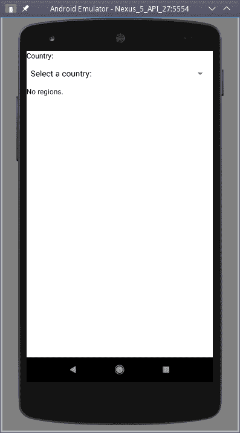

我们的应用程序刚刚加载，等待用户选择国家

如果用户触摸`<Picker>`元素，将显示一个弹出窗口，列出从我们的 Node 服务器接收到的国家，如下面的屏幕截图所示：

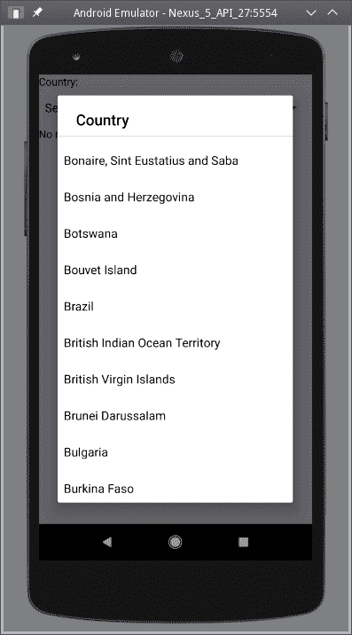

在触摸国家列表时，将显示一个弹出窗口，以便用户选择所需的国家。

当用户实际点击一个国家时，将触发`onValueChange`事件，并在调用服务器后显示区域列表，如下所示：

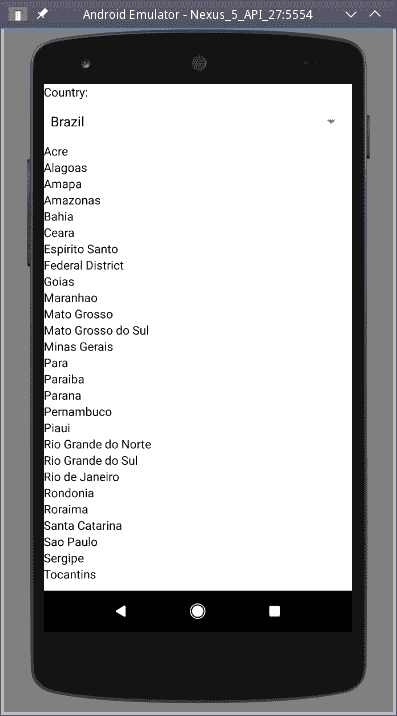

选择一个国家后，它的区域列表将显示出来，就像我们之前的 HTML React 版本一样

一切都很顺利，并且正在使用原生组件；太棒了！顺便说一句，如果你对我们描述的`selectedValue`问题不太确定，只需省略该属性，当用户选择一个国家时，你将得到一个糟糕的结果：

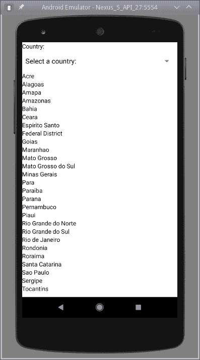

有一些差异，比如需要存在`selectedValue`属性，否则当前选择的值

不会更新-即使选择了巴西，选择器也不会显示它

在这里，我们通过一个编写 RN 代码的示例，正如我们所看到的，它与简单的`React`代码并没有太大不同，除了我们不能使用 HTML 之外，我们必须依赖不同的元素。

我们已经看到了两种运行我们代码的方式：使用我们的移动设备上的`Expo`客户端，以及在我们的计算机上使用模拟器。要尝试 RN，你可能想看看一些在线游乐场，比如 Snack，[`snack.expo.io/`](https://snack.expo.io/)，[以及`Repl.it`，在](https://snack.expo.io/)[`repl.it/languages/react_native`](https://repl.it/languages/react_native)。在这两种环境中，你可以创建文件，编辑代码，并在线查看你的实验结果。

# 还有更多...

在让你的应用程序运行后的最后一步是创建一个独立的软件包，最好可以通过苹果和谷歌应用商店进行分发。如果你手动创建了你的应用程序，那么这个过程可能会变得有点复杂，你甚至需要一台真正的 macOS 电脑，因为否则你将无法为 iOS 构建：你将不得不阅读如何使用`Xcode`或 Android 开发者工具来制作应用程序，这可能有点复杂。相反，使用 CRAN 应用程序，这个过程可以简化，因为`Expo`提供了一个应用程序构建功能，这样你就不必自己构建。查看[`docs.expo.io/versions/latest/guides/building-standalone-apps.html`](https://docs.expo.io/versions/latest/guides/building-standalone-apps.html)获取具体的说明。

无论你决定如何进行构建过程，都要查看一些建议，以确保你的应用程序将被批准并受到良好的接待。[`docs.expo.io/versions/latest/guides/app-stores.html`](https://docs.expo.io/versions/latest/guides/app-stores.html)。

# 适应设备和方向

当我们在第七章的*增强您的应用程序*中开发了一个响应式和自适应的网页时，我们必须处理窗口大小可能随时改变的可能性，我们的页面内容必须正确地重新定位自己。对于移动设备，屏幕尺寸不会改变，但仍然有可能旋转（从纵向模式到横向模式，反之亦然），因此您仍然必须处理至少一个变化。当然，如果您希望使您的应用程序在所有设备上看起来很好，那么您可能需要考虑屏幕尺寸，以决定如何容纳您的内容。

在这个示例中，我们将介绍一种简单的技术，使您的应用程序能够识别不同的设备类型。这种技术可以很容易地升级，以覆盖特定的屏幕尺寸。

我们稍后将更多地关注样式；目前，我们将专注于让应用程序识别设备类型和方向，然后在下一节中，我们将提供具体的样式示例。

# 如何做...

如果我们希望我们的应用程序适应，我们必须能够在我们的代码中回答几个问题：

+   我们如何知道设备是平板还是手机？

+   我们如何了解它是纵向模式还是横向模式？

+   我们如何编写一个组件，根据设备类型的不同进行不同的渲染？

+   我们如何使一个组件在屏幕方向改变时自动重绘？

现在让我们来讨论所有这些问题。让我们首先看看我们如何了解设备类型和方向。RN 包括一个 API，`Dimensions`，它提供了渲染应用程序所需的屏幕尺寸等数据。那么，我们如何了解设备类型和方向呢？第二个问题更容易：因为没有正方形设备（至少目前没有！），只需查看两个尺寸中哪个更大-如果高度更大，则设备处于纵向模式，否则设备处于横向模式。

然而，第一个问题更难。在屏幕尺寸方面，没有严格的规定来界定手机的结束和平板的开始，但是如果我们查看设备信息并计算形态因子（最长边与最短边的比率），一个简单的规则就出现了：如果计算出的比率为 1.6 或以下，则更可能是平板电脑，而更高的比率则表明是手机。

如果您需要更具体的数据，请查看[`iosres.com/`](http://iosres.com)获取有关 iOS 设备的信息，或查看[`material.io/tools/devices`](https://material.io/tools/devices)和[`screensiz.es`](http://screensiz.es)获取更多设备的信息，特别是用于 Android 的设备，其屏幕尺寸种类更多。

使用以下代码，我们基本上返回了`Dimensions`提供的所有信息，以及一些属性（`.isTablet`和`.isPortrait`）以简化编码：

```js
// Source file: src/adaptiveApp/device.js

/* @flow */

import { Dimensions } from "react-native";

export type deviceDataType = {
    isTablet: boolean,
    isPortrait: boolean,
    height: number,
    width: number,
    scale: number,
    fontScale: number
};

export const getDeviceData = (): deviceDataType => {
    const { height, width, scale, fontScale } = Dimensions.get("screen");

    return {
 isTablet: Math.max(height, width) / Math.min(height, width) <= 1.6,
 isPortrait: height > width,
        height,
        width,
        scale,
        fontScale
    };
};
```

使用上述代码，我们拥有了绘制适合所有设备、尺寸和两种可能方向的视图所需的一切，但我们如何使用这些数据呢？现在让我们来看看这一点，并使我们的应用程序在所有情况下都能适当调整。

有关`Dimensions` API 的更多信息，请阅读[`facebook.github.io/react-native/docs/dimensions`](https://facebook.github.io/react-native/docs/dimensions)。

我们可以直接在组件中使用`getDeviceData()`提供的信息，但这会带来一些问题：

+   因为它们在函数中有一个隐藏的依赖，所以组件将不像以前那样功能强大

+   因此，测试组件将变得更加困难，因为我们必须模拟该函数

+   最重要的是，当方向改变时，设置组件自动重新渲染将不会那么容易

解决这一切的方法很简单：让我们将设备数据放入存储中，然后相关组件（需要改变渲染方式的组件）可以连接到数据。我们可以创建一个简单的组件来实现这一点：

```js
// Source file: src/adaptiveApp/deviceHandler.component.js

/* @flow */

import React from "react";
import PropTypes from "prop-types";
import { View } from "react-native";

class DeviceHandler extends React.PureComponent<{
    setDevice: () => any
}> {
    static propTypes = {
        setDevice: PropTypes.func.isRequired
    };

    onLayoutHandler = () => this.props.setDevice();

    render() {
 return <View hidden onLayout={this.onLayoutHandler} />;
    }
}

export { DeviceHandler };
```

该组件不会显示在屏幕上，因此我们可以将其添加到我们的主视图中的任何位置。连接组件是另一个必要的步骤；当 `onLayout` 事件触发时（意味着设备的方向已经改变），我们将不得不调度一个动作：

```js
// Source file: src/adaptiveApp/deviceHandler.connected.js

/* @flow */

import { connect } from "react-redux";

import { DeviceHandler } from "./deviceHandler.component";
import { setDevice } from "./actions";

const getDispatch = dispatch => ({
 setDevice: () => dispatch(setDevice())
});

export const ConnectedDeviceHandler = connect(
    null,
    getDispatch
)(DeviceHandler);
```

当然，我们需要定义动作和减速器，以及存储。让我们看看如何做到这一点——我们将从动作开始。除了我们假设的应用程序需要的其他动作之外，我们至少需要以下内容：

```js
// Source file: src/adaptiveApp/actions.js

/* @flow */

import { getDeviceData } from "./device";

import type { deviceDataType } from "./device"

export const DEVICE_DATA = "device:data";

export type deviceDataAction = {
    type: string,
    deviceData: deviceDataType
};

export const setDevice = (deviceData?: object) =>
 ({
 type: DEVICE_DATA,
 deviceData: deviceData || getDeviceData()
 }: deviceDataAction); /* *A real app would have many more actions!*
*/
```

我们正在导出一个 thunk，其中将包含 `deviceData`。请注意，通过允许它作为参数提供（或者使用默认值，由 `getDeviceData()` 创建），我们将简化测试；如果我们想模拟横向平板电脑，我们只需提供一个适当的 `deviceData` 对象。

最后，减速器将如下所示（显然，对于真实的应用程序，将会有更多的动作！）：

```js
// Source file: src/adaptiveApp/reducer.js

/* @flow */

import { getDeviceData } from "./device";

import { DEVICE_DATA } from "./actions";

import type { deviceAction } from "./actions";

export const reducer = (
    state: object = {
        // initial state: more app data, plus:
 deviceData: getDeviceData()
    },
    action: deviceAction
) => {
    switch (action.type) {
 case DEVICE_DATA:
 return {
 ...state,
 deviceData: action.deviceData
 };

        /*
  *          In a real app, here there would*
 *be plenty more "case"s*
        */

        default:
            return state;
    }
};
```

现在，我们在存储中有了设备信息，我们可以研究如何编写自适应、响应式的组件。

我们可以通过使用一个非常基本的组件来看如何编写自适应和响应式组件，该组件只是显示它是手机还是平板电脑，以及它当前的方向。拥有所有 `deviceData` 对象的访问权限意味着我们可以做出任何决定：显示什么、显示多少元素、使它们的大小如何等等。我们将使这个示例简短，但应该清楚如何扩展它：

```js
// Source file: src/adaptiveApp/adaptiveView.component.js

/* @flow */

import React from "react";
import PropTypes from "prop-types";
import { View, Text, StyleSheet } from "react-native";

import type { deviceDataType } from "./device";

const textStyle = StyleSheet.create({
    bigText: {
        fontWeight: "bold",
        fontSize: 24
    }
});

export class AdaptiveView extends React.PureComponent<{
    deviceData: deviceDataType
}> {
 static propTypes = {
 deviceData: PropTypes.object.isRequired
 };

 renderHandset() {
        return (
            <View>
                <Text style={textStyle.bigText}>
                    I believe I am a HANDSET currently in
                    {this.props.deviceData.isPortrait
                        ? " PORTRAIT "
                        : " LANDSCAPE "}
                    orientation
                </Text>
            </View>
        );
    }

 renderTablet() {
        return (
            <View>
                <Text style={textStyle.bigText}>
                    I think I am a
                    {this.props.deviceData.isPortrait
                        ? " PORTRAIT "
                        : " LANDSCAPE "}
                    TABLET
                </Text>
            </View>
        );
    }

 render() {
 return this.props.deviceData.isTablet
 ? this.renderTablet()
 : this.renderHandset();
 }
}
```

不要担心 `textStyle` 的定义——很快我们将介绍它的工作原理，但现在我认为接受它定义了粗体、较大的文本应该很容易。

给定 `this.props.deviceData`，我们可以使用 `.isTablet` 属性来决定调用哪个方法（`.renderTablet()` 或 `.renderHandset()`）。在这些方法中，我们可以使用 `.isPortrait` 来决定使用什么布局：竖屏或横屏。最后——虽然我们在示例中没有显示这一点——我们可以使用 `.width` 或 `.height` 来显示更多或更少的组件，或计算组件的大小等等。我们只需要将组件连接到存储，如下所示，就可以了：

```js
// Source file: src/adaptiveApp/adaptiveView.connected.js

/* @flow */

import { connect } from "react-redux";

import { AdaptiveView } from "./adaptiveView.component";

const getProps = state => ({
 deviceData: state.deviceData
});

export const ConnectedAdaptiveView = connect(getProps)(AdaptiveView);
```

现在我们已经拥有了一切需要的东西，让我们看看它是如何工作的！

# 工作原理...

我们已经准备了一个（隐藏的）组件，通过调度一个动作来响应方向的变化以更新存储，我们知道如何编写一个将使用设备信息的组件。我们的主页面可能如下所示：

```js
// Source file: src/adaptiveApp/main.js

/* @flow */

import React from "react";
import { View, StatusBar } from "react-native";

import { ConnectedAdaptiveView } from "./adaptiveView.connected";
import { ConnectedDeviceHandler } from "./deviceHandler.connected";

export class Main extends React.PureComponent<> {
    render() {
        return (
            <View>
                <StatusBar hidden />
 <ConnectedDeviceHandler />
 <ConnectedAdaptiveView />
            </View>
        );
    }
}
```

如果我在（模拟的）Nexus 5 设备上以竖屏模式运行应用程序，我们会看到类似以下的内容：

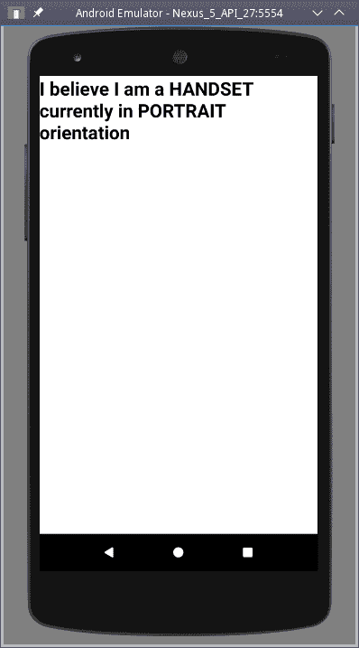

我们的设备被识别为一个手机，目前是竖屏（垂直）方向

旋转设备会产生不同的视图：

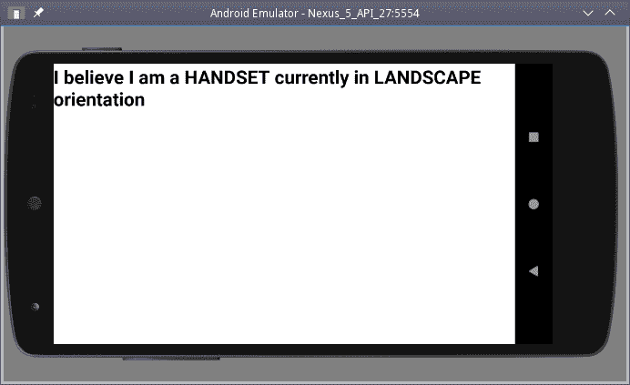

当方向改变时，存储会更新，应用程序会适当地重新渲染自己

在我们的设计中，组件从不自己使用 `Dimension` API——因为它们从存储中获取设备信息，所以可以在功能上测试不同设备和方向下的组件行为，而无需模拟任何东西。

# 还有更多...

```js
ESLint react/require-render-return rule to make .render() not to return anything:
```

```js
import React from "react";
import PropTypes from "prop-types";

// eslint-disable-next-line react/require-render-return
class SomethingBase extends React.PureComponent<{
    deviceData: deviceDataType
}> {
    static propTypes = {
        deviceData: PropTypes.object.isRequired
    };

    render() {
 throw new Error("MUST IMPLEMENT ABSTRACT render() METHOD");
 }
}

export { SomethingBase };
```

为了继续，编写单独的 `something.handset.js` 和 `something.tablet.js` 文件，这些文件扩展 `SomethingBase` 来定义 `SomethingHandset` 和 `SomethingTablet` 组件。最后，设置 `something.component.js` 文件，用于检查设备是手机还是平板，并返回 `<SomethingHandset>` 组件或 `<SomethingTablet>` 组件：

```js
import { SomethingTablet } from "./something.tablet";
import { SomethingHandset } from "./something.handset";
import { getDeviceData } from "./device";

export const Something = getDeviceData().isTablet ? SomethingTablet : SomethingHandset;
```

使用这种样式，您可以在代码中使用和连接 `<Something>` 组件，而在内部，它们实际上是当前设备类型的适当版本。

在计算机科学术语中，这被称为*工厂*设计模式，您可以在不实际指定其类的情况下创建对象。

# 样式和布局组件

将 CSS 样式应用到您的应用程序并不困难，但是与 HTML 相比，您将不得不放弃并重新学习一些概念，这些概念在 RN 中与 HTML 中的概念完全不同：

+   在网页中，CSS 样式是全局的，适用于所有标签；在 RN 中，样式是在组件之间局部完成的；没有全局样式。此外，您不需要*选择器*，因为样式直接与组件相关联。

+   没有样式的继承：在 HTML 中，子元素默认继承其父元素的一些样式，但在 RN 中，如果您希望发生这种情况，您将不得不为子元素提供特定的所需样式。但是，如果您希望，您可以`export`样式并在其他地方`import`它们。

+   RN 样式完全是动态的：您可以使用所有 JS 函数来计算您希望应用的任何值。您甚至可以动态更改样式，因此应用程序的背景颜色可以在白天变得更浅，随着时间的推移逐渐变暗。您不需要像 SASS 或 LESS 那样的东西；您可以进行数学计算并使用常量，因为这是纯 JS。

还有一些其他细微的差异：

+   RN 使用*驼峰命名*风格（例如`fontFamily`）而不是 CSS 的*kebab-case*风格（例如`font-family`）；这很容易适应。此外，并非所有通常的 CSS 属性都可能存在（这取决于特定组件），有些可能受到其可能值的限制。

+   RN 只有两种可能的测量单位：百分比或**密度无关像素**（**DP**）。DP 不是来自 Web 的经典屏幕像素；相反，它们适用于每种设备，独立于其像素密度或**每英寸像素**（**ppi**），从而确保所有屏幕具有统一的外观。

+   布局使用 flex 完成，因此定位元素更简单。您可能没有网页可用的所有选项集，但您获得的对于任何类型的布局来说绝对足够。

关于 RN 中的样式有很多内容可供阅读（首先，请参阅[`facebook.github.io/react-native/docs/style`](https://facebook.github.io/react-native/docs/style)进行介绍，以及[`facebook.github.io/react-native/docs/height-and-width`](https://facebook.github.io/react-native/docs/height-and-width)和[`facebook.github.io/react-native/docs/flexbox`](https://facebook.github.io/react-native/docs/flexbox)进行元素的大小和定位），因此，在这里，我们将通过为我们的国家和地区应用程序设置一些具体的示例来查看一些内容。

# 如何做...

让我们尝试稍微增强我们的应用程序。并且，为了完成我们之前看到的关于自适应和响应式显示的内容，我们将为纵向和横向方向提供不同的布局。我们不需要媒体查询或基于列的布局；我们将使用简单的样式。

让我们从为`<Main>`组件创建样式开始。我们将使用我们之前开发的`<DeviceHandler>`；两个组件都将连接到存储。我不想为平板电脑和手机制作特定版本，但我想在纵向和横向方向上显示不同的布局。对于前者，我基本上使用了我之前开发的内容，但对于后者，我决定将屏幕一分为二，在左侧显示国家选择器，右侧显示地区列表。哦，您可能会注意到我选择使用内联样式，即使这不是首选选项；由于组件通常很短，您可以在 JSX 代码中直接放置样式而不会失去清晰度。这取决于您是否喜欢：

```js
// Source file: src/regionsStyledApp/main.component.js

/* @flow */

import React from "react";
import { View, StatusBar } from "react-native";

import {
    ConnectedCountrySelect,
    ConnectedRegionsTable,
    ConnectedDeviceHandler
} from ".";
import type { deviceDataType } from "./device";

 export class Main extends React.PureComponent<{
    deviceData: deviceDataType
}> {
    render() {
 **if (this.props.deviceData.isPortrait) {** .
            . *// portrait view*
            .
 **} else {**            .
            . *// landscape view*
            .
        }
    }
}
```

**当设备处于纵向方向时，我创建了一个占据整个屏幕的`<View>`（`flex:1`），并使用`flexDirection:"column"`垂直设置其组件，尽管这实际上是默认值，所以我可以省略这一步。我没有为`<CountrySelect>`组件指定大小，但我设置了`<RegionsTable>`以占据所有可能的（剩余的）空间。详细代码如下：

```js
// Source file: src/regionsStyledApp/main.component.js

            return (
 <View style={{ flex: 1 }}>
                    <StatusBar hidden />
                    <ConnectedDeviceHandler />
 <View style={{ flex: 1, flexDirection: "column" }}>
                        <View>
                            <ConnectedCountrySelect />
                        </View>
 <View style={{ flex: 1 }}>
                            <ConnectedRegionsTable />
                        </View>
                    </View>
                </View>
            );
```

对于横向方向，需要进行一些更改。我将主视图的内容方向设置为水平（`flexDirection:"row"`），并在其中添加了两个大小相同的视图。对于第一个国家列表，我将其内容设置为垂直并居中，因为我认为这样看起来更好，而不是出现在顶部。对于占据屏幕右侧的地区列表，我没有做任何特别的事情。

```js
// Source file: src/regionsStyledApp/main.component.js

            return (
 <View style={{ flex: 1 }}>
                    <StatusBar hidden />
                    <ConnectedDeviceHandler />
 <View style={{ flex: 1, flexDirection: "row" }}>
                        <View
 style={{
 flex: 1,
 flexDirection: "column",
 justifyContent: "center"
 }}
                        >
                            <ConnectedCountrySelect />
                        </View>
 <View style={{ flex: 1 }}>
                            <ConnectedRegionsTable />
                        </View>
                    </View>
                </View>
            );
```

如果要使组件占据更大的空间，增加其 flex 值；*flex*意味着组件将根据可用空间灵活地扩展或收缩，这些空间按照它们的 flex 值的直接比例共享。如果我想要国家列表占据屏幕的三分之一，将其他两分之一留给地区列表，我会为其设置`flex:1`，并为地区列表设置`flex:2`。当然，您也可以直接设置高度和宽度（无论是 DIP 值还是百分比），就像您在 CSS 中所做的那样。

除了`"center"`之外，如果您想要在视图中分配子组件，还有其他几个选项：

+   `"flex-start"`将它们放在一起，放在父视图的开始位置；在这里，是顶部，因为是垂直对齐的

+   `"flex-end"`的行为类似，但将子组件放置在父视图的末尾（这里是底部）

+   `"space-between"`在子组件之间均匀分割额外的空间

+   `"space-around"`也均匀分割额外的空间，但包括父视图开头和结尾的空间

+   `"space-evenly"`在子组件和分隔空间之间均匀分割所有空间

设置主要的 flex 方向后，您可以使用`alignItems`来指定子组件沿着次要的 flex 方向对齐的方式（如果`flexDirection`是`"row"`，那么次要方向将是`"column"`，反之亦然）。可能的值是`"flex-start"`，`"center"`和`"flex-end"`，意思与刚才给出的类似，或者您可以使用`"stretch"`，它将占据所有可能的空间。

如果您想尝试这些选项，请访问[`facebook.github.io/react-native/docs/flexbox`](https://facebook.github.io/react-native/docs/flexbox)并修改代码示例。您将立即看到您的更改的效果，这是理解每个选项的效果和影响的最简单方法。

现在，让我们来设置地区表的样式。为此，我需要进行一些更改，首先是需要使用`<ScrollView>`而不是普通的`<View>`，因为列表可能太长而无法适应屏幕。另外，为了展示一些样式和常量，我决定使用单独的样式文件。我首先创建了一个`styleConstants.js`文件，其中定义了一个颜色常量和一个简单的全尺寸样式：

```js
// Source file: src/regionsStyledApp/styleConstants.js

/* @flow */

import { StyleSheet } from "react-native";

export const styles = StyleSheet.create({
    fullSize: {
        flex: 1
    }
});

export const lowColor = "lightgray";
```

这里有趣的地方，不是（假定相当简陋的）`fullSize`样式，而是您可以导出样式，或者定义将在其他地方使用的简单 JS 常量。在地区列表中，我导入了样式和颜色：

```js
// Source file: src/regionsStyledApp/regionsTable.component.js

/* @flow */

import React from "react";
import PropTypes from "prop-types";
import { View, ScrollView, Text, StyleSheet } from "react-native";

import type { deviceDataType } from "./device";

import { lowColor, fullSizeStyle } from "./styleConstants";

const ownStyle = StyleSheet.create({
 grayish: {
 backgroundColor: lowColor
 }
});

export class RegionsTable extends React.PureComponent<{
    deviceData: deviceDataType,
    list: Array<{
        regionCode: string,
        regionName: string
    }>
}> {
    static propTypes = {
        deviceData: PropTypes.object.isRequired,
        list: PropTypes.arrayOf(PropTypes.object).isRequired
    };

    static defaultProps = {
        list: []
    };

    render() {
        if (this.props.list.length === 0) {
            return (
 <View style={ownStyle.fullSize}>
                    <Text>No regions.</Text>
                </View>
            );
        } else {
            const ordered = [...this.props.list].sort(
                (a, b) => (a.regionName < b.regionName ? -1 : 1)
            );

            return (
                <ScrollView style={[fullSizeStyle, ownStyle.grayish]}>
                    {ordered.map(x => (
                        <View key={`${x.countryCode}-${x.regionCode}`}>
                            <Text>{x.regionName}</Text>
                        </View>
                    ))}
                </ScrollView>
            );
        }
    }
}
```

在上述代码块中有一些有趣的细节：

+   正如我之前所说，我使用了`<ScrollView>`组件，以便用户可以浏览超出可用空间的列表。`<FlatList>`组件也是一种可能，尽管对于这里相对较短和简单的列表来说，它不会有太大的区别。

+   我使用导入的颜色创建了一个本地样式`grayish`，稍后我会用到。

+   我直接将导入的`fullSize`样式应用到了区域的`<ScrollView>`上。

+   我给第二个`<ScrollView>`应用了多个样式；如果你提供一个样式数组，它们会按照出现的顺序应用。在这种情况下，我得到了一个全尺寸的灰色区域。请注意，只有在存在一些区域时颜色才会被应用；否则颜色不会改变。

请注意，样式可以动态创建，这可以产生有趣的效果。举个例子，基于 RN 文档中的一个例子，你可以根据 prop 改变标题的样式。在下面的代码中，标题的样式会根据`this.props.isActive`的值而改变：

```js
<View>
    <Text
        style={[
            styles.title,
 this.props.isActive
 ? styles.activeTitle
 : styles.inactiveTitle
        ]}
    >
        {this.props.mainTitle}
    </Text>
</View>
```

你可以产生更有趣的结果；记住你可以充分利用 JS 的全部功能，并且样式表可以动态创建，所以你实际上有无限的可能性。

# 它是如何工作的...

我启动了模拟器，尝试了一下代码。在纵向方向时，视图如下截图所示；请注意我向下滚动了，应用程序正确处理了它：

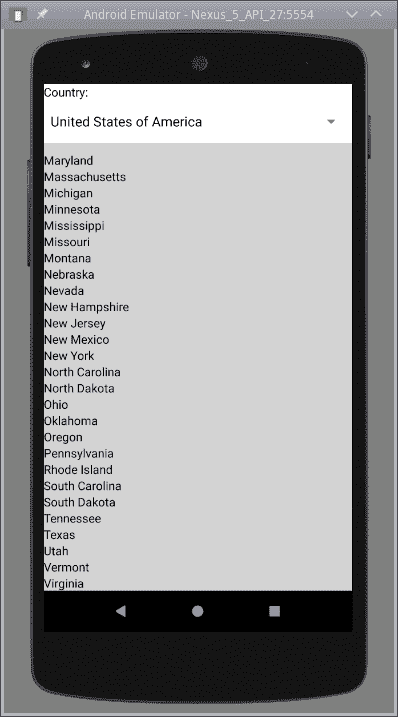

我们的样式化应用程序，显示颜色、样式和可滚动视图

如果你改变设备的方向，我们的设备处理逻辑会捕获事件，并且应用程序会以不同的方式呈现。在这里，我们可以看到分屏，左边是居中的元素，右边是可滚动的视图，有灰色的背景：

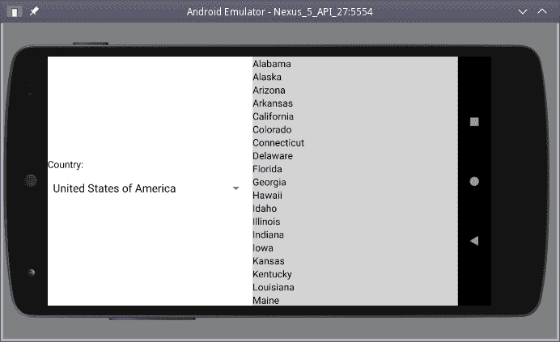

横向视图得到了不同的布局，这要归功于新的样式规则

我们已经看到了——这只是 RN 提供的许多样式特性的简介，你可以获得与 HTML 和 CSS 相同类型的结果，尽管在这里你确实在使用不同的元素和样式。应用 JS 的全部功能来定义样式的可能性让你不再需要使用诸如 SASS 之类的工具，因为它所带来的所有额外功能已经通过 JS 本身可用。让我们看一个更进一步的样式示例，这次是针对文本的，因为我们考虑如何编写专门针对特定平台的代码。

# 添加特定于平台的代码

使用通用组件对大多数开发来说已经足够了，但你可能想利用一些特定于平台的功能，RN 提供了一种方法来实现这一点。显然，如果你开始沿着这个趋势发展，你可能会面临更大的工作量，并且更难维护你的代码，但如果明智地进行，它可以为你的应用增添一些额外的*亮点*。

在这个示例中，我们将看看如何调整你的应用，使其更适合在任何平台上运行。

# 如何做...

识别你的平台最简单的方法是使用`Platform`模块，其中包括一个属性`Platform.OS`，告诉你当前是在 Android 还是 iOS 上运行。让我们来看一个简单的例子。假设你想在你的应用中使用一些等宽字体。恰好在不同平台上，相关字体系列的名称不同：在 Android 上是`"monospace"`，而在苹果设备上是`"AmericanTypewriter"`（等等）。通过检查`Platform.OS`，我们可以适当地设置样式表的`.fontFamily`属性，如下面的截图所示：

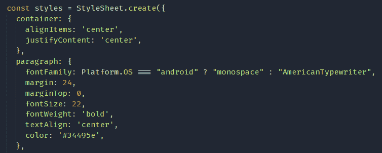

使用`Platform.OS`是检测设备平台的最简单方法

如果你想要不同地选择几个属性，你可能想使用`Platform.select()`：

```js
const headings = Platform.select({
    android: { title: "An Android App", subtitle: "directly from Google" },
    ios: { title: "A iOS APP", subtitle: "directly from Apple" }
});
```

在这种情况下，`headings.title`和`headings.subtitle`将获得适合当前平台的值，无论是 Android 还是 iOS。显然，你可以使用`Platform.OS`来管理这个，但这种样式可能更简洁。

有关 Android 和 iOS 设备上可用字体系列的更多信息，您可以查看[`github.com/react-native-training/react-native-fonts`](https://github.com/react-native-training/react-native-fonts)上的列表。但是，请注意，列表可能会随着版本的变化而改变。

# 它是如何工作的...

为了多样化，我决定在 Snack（在本章前面提到过的[`snack.expo.io/`](https://snack.expo.io/)）中尝试平台检测，因为这比在两台实际设备上运行代码要快得多，也更简单。

我打开了页面，在提供的示例应用程序中，我只是添加了我之前展示的`.fontFamily`更改，并测试了两个平台的结果：

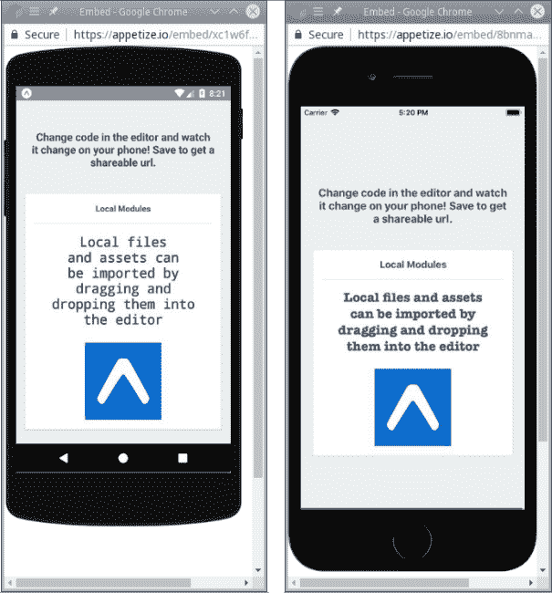

Snack 模拟器显示了我的应用程序的不同外观，Android（左）和 iOS（右）具有不同的字体

正如我们所看到的，平台差异的问题可以很容易地解决，您的应用程序的最终用户将获得更符合其对颜色、字体、组件、API 等方面期望的东西。

# 还有更多...

我们在这个示例中看到的变化范围相当小。如果您想要一些更大的差异，比如，例如，使用`DatePickerIOS`组件在 iOS 上获取日期，但在 Android 上使用`DatePickerAndroid` API，那么还有另一个功能您应该考虑。

假设您自己的组件名为`AppropriateDatePicker`。如果您分别创建名为`appropriateDatePicker.component.ios.js`和`appropriateDatePicker.component.android.js`的两个文件，那么当您使用`import { AppropriateDatePicker } from "AppropriateDatePicker"`导入您的组件时，`.ios.js`版本将用于苹果设备，`.android.js`版本将用于安卓设备：简单！

有关`Platform`模块和特定于平台的选项的完整描述，请阅读[`facebook.github.io/react-native/docs/platform-specific-code`](https://facebook.github.io/react-native/docs/platform-specific-code)。

# 路由和导航

使用`React`路由器，您只需使用`<Link>`组件从一个页面导航到另一个页面，或者使用方法以编程方式打开不同的页面。在 RN 中，有一种不同的工作方式，`react-navigation`包实际上是事实上的标准。在这里，您定义一个导航器（有几种可供选择），并为其提供应该处理的屏幕（视图），然后忘记它！导航器将自行处理一切，显示和隐藏屏幕，添加选项卡或滑动抽屉，或者其他任何需要的功能，您不必做任何额外的工作！

在这个示例中，我们将重新访问本书前面页面的一个示例，并展示路由的不同写法，以突出风格上的差异。

导航比我们在这里看到的更多。查看[`reactnavigation.org/docs/en/api-reference.html`](https://reactnavigation.org/docs/en/api-reference.html)上的 API 文档以获取更多信息，如果您在 Google 上搜索，请注意，因为`react-navigation`包已经发展，许多网站引用了当前已弃用的旧方法。

# 如何做到...

在本书的`React`部分，我们构建了一个完整的路由解决方案，包括公共和受保护的路由，使用登录视图输入用户的用户名和密码。在移动应用程序中，由于用户受到更多限制，我们可以在开始时启用登录，并在之后启用正常导航。所有与用户名、密码和令牌相关的工作基本上与以前相同，所以现在让我们只关注在 RN 中不同的导航，并忘记常见的细节。

首先，让我们有一些视图——一个带有一些居中文本的空屏幕就可以了：

```js
// Source file: src/routingApp/screens.js

/* @flow */

import React, { Component } from "react";
import {
    Button,
    Image,
    StyleSheet,
    Text,
    TouchableOpacity,
    View
} from "react-native";

const myStyles = StyleSheet.create({
    fullSize: {
        flex: 1
    },
    fullCenteredView: {
        flex: 1,
        flexDirection: "column",
        justifyContent: "center",
        alignItems: "center"
    },
    bigText: {
        fontSize: 24,
        fontWeight: "bold"
    },
    hamburger: {
        width: 22,
        height: 22,
        alignSelf: "flex-end"
    }
});

// *continues...*
```

然后，为了简化创建所有所需的视图，让我们有一个`makeSimpleView()`函数，它将生成一个组件。我们将在右上角包括一个*汉堡*图标，它将打开和关闭导航抽屉；稍后我们会详细了解。我们将使用这个函数来创建大多数视图，并添加一个`SomeJumps`额外视图，其中包含三个按钮，允许您直接导航到另一个视图：

```js
// ...*continued*

const makeSimpleView = text =>
    class extends Component<{ navigation: object }> {
        displayName = `View:${text}`;

        render() {
            return (
                <View style={myStyles.fullSize}>
 <TouchableOpacity
 onPress={this.props.navigation.toggleDrawer}
 >
 <Image
 source={require("./hamburger.png")}
 style={myStyles.hamburger}
 />
 </TouchableOpacity>
                    <View style={myStyles.fullCenteredView}>
                        <Text style={myStyles.bigText}>{text}</Text>
                    </View>
                </View>
            );
        }
    };

export const Home = makeSimpleView("Home");
export const Alpha = makeSimpleView("Alpha");
export const Bravo = makeSimpleView("Bravo");
export const Charlie = makeSimpleView("Charlie");
export const Zulu = makeSimpleView("Zulu");
export const Help = makeSimpleView("Help!");

export const SomeJumps = (props: object) => (
    <View style={myStyles.fullSize}>
 <Button
 onPress={() => props.navigation.navigate("Alpha")}
 title="Go to Alpha"
 />
 <Button
 onPress={() => props.navigation.navigate("Bravo")}
 title="Leap to Bravo"
 />
 <Button
 onPress={() => props.navigation.navigate("Charlie")}
 title="Jump to Charlie"
 />
    </View>
);
```

在这里，为了简单起见，鉴于我们没有使用 props 或 state，并且视图足够简单，我使用了`SomeJumps`组件的函数定义，而不是使用类，就像大多数其他示例一样。如果您想重新访问这个概念，请查看[`reactjs.org/docs/components-and-props.html`](https://reactjs.org/docs/components-and-props.html)。

`navigation`属性来自哪里？我们将在下一节中看到更多，但这里可以给出一些解释。每当您创建一个导航器，您都会为其提供一组视图来处理。所有这些视图都将获得一个额外的属性`navigation`，它具有一组您可以使用的方法，例如切换抽屉的可见性，导航到给定屏幕等。在[`reactnavigation.org/docs/en/navigation-prop.html`](https://reactnavigation.org/docs/en/navigation-prop.html)上阅读有关此对象的信息。

现在，让我们创建抽屉本身。这将处理侧边栏菜单并显示所需的任何视图。`createDrawerNavigator()`函数获取一个包含将要处理的屏幕的对象，以及一组选项；在这里，我们只指定了抽屉本身的颜色和宽度（还有很多可能性，详细信息请参阅[`reactnavigation.org/docs/en/drawer-navigator.html`](https://reactnavigation.org/docs/en/drawer-navigator.html)）：

```js
// Source file: src/routingApp/drawer.js

/* @flow */

import { createDrawerNavigator } from "react-navigation";

import {
    Home,
    Alpha,
    Bravo,
    Charlie,
    Zulu,
    Help,
    SomeJumps
} from "./screens";

export const MyDrawer = createDrawerNavigator(
    {
        Home: { screen: Home },
        Alpha: { screen: Alpha },
        Bravo: { screen: Bravo },
        Charlie: { screen: Charlie },
        Zulu: { screen: Zulu },
        ["Get Help"]: { screen: Help },
        ["Some jumps"]: { screen: SomeJumps }
    },
    {
 drawerBackgroundColor: "lightcyan",
 drawerWidth: 140
    }
);
```

`createDrawerNavigation()`的结果本身是一个组件，它将负责显示所选的任何视图，显示和隐藏抽屉菜单等。我们只需要创建主应用程序本身。

接下来，让我们创建可导航的应用程序，因为我们现在有一组视图和一个抽屉导航器来处理它们。我们应用程序的主视图非常简单-查看它的`.render()`方法，你会同意的：

```js
// Source file: App.routing.js

/* @flow */

import React from "react";
import { StatusBar } from "react-native";

import { MyDrawer } from "./src/routingApp/drawer";

class App extends React.Component {
    render() {
        return (
            <React.Fragment>
 <StatusBar hidden />
 <MyDrawer />
            </React.Fragment>
        );
    }
}

export default App;
```

有趣的一点是：由于导航器是组件。如果您愿意，您可以在另一个导航器中包含一个导航器！例如，您可以创建一个`TabNavigator`，并将其包含在抽屉导航器中：当选择相应选项时，您将在屏幕上获得一个选项卡视图，现在由选项卡导航器管理。如果您愿意，您可以以任何希望的方式组合导航器，从而允许非常复杂的导航结构。

# 它是如何工作的...

当您打开应用程序时，将显示初始路由。您可以提供多个选项，例如`initialRouteName`来指定应该显示的第一个视图，`order`来重新排列抽屉项，甚至自定义`contentComponent`如果您想自己绘制抽屉的内容；总而言之，有很多灵活性。您的第一个屏幕应该看起来像下面的样子：

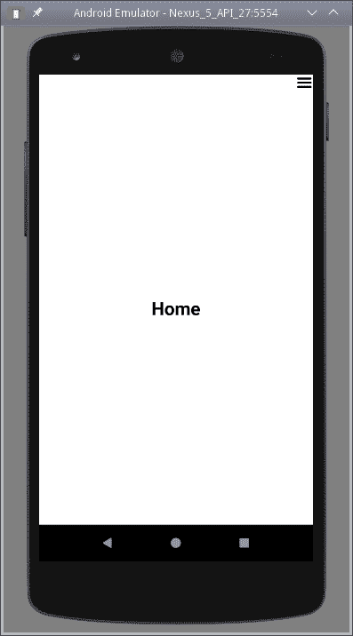

我们的抽屉导航器显示初始屏幕

通常打开抽屉的方式是从左边滑动（尽管也可以设置抽屉从右边滑动）。我们还提供了汉堡图标来切换抽屉的打开和关闭。打开抽屉应该看起来像下面的截图：

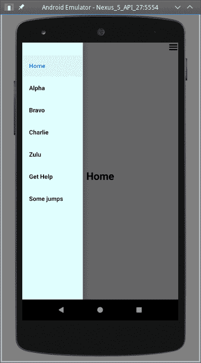

打开的抽屉显示菜单，当前屏幕突出显示，其余屏幕变暗。

单击任何菜单项将隐藏当前视图，并显示所选视图。例如，我们可以选择`Some jumps`屏幕，如下所示：

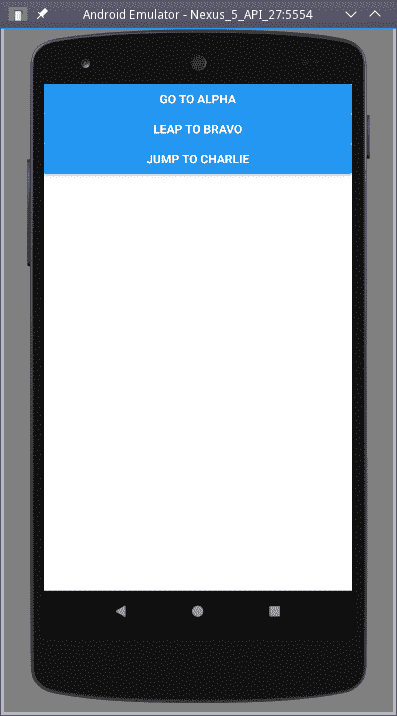

选择选项后，抽屉菜单会自动关闭，并显示所选屏幕

在这个特定的屏幕中，我们展示了三个按钮，它们都使用`props.navigation.navigate()`方法来显示不同的屏幕。这表明你的导航不仅限于使用抽屉，而且你也可以以任何你想要的方式直接浏览。

# 还有更多……

在`React`章节中我们没有提到`Redux`，你可能已经注意到了。虽然使用它是可能的，但`react-navigation`的作者们倾向于*不*启用它，在[`reactnavigation.org/docs/en/redux-integration.html`](https://reactnavigation.org/docs/en/redux-integration.html)上你可以读到以下内容：

“警告：在 2018 年秋季发布的 React Navigation 的下一个主要版本中，我们将不再提供任何关于如何与 Redux 集成的信息，它可能会停止工作。在 React Navigation 问题跟踪器上发布的与 Redux 相关的问题将立即关闭。Redux 集成可能会继续工作，但在制定库的任何设计决策时，它将不会被测试或考虑。”

这个警告表明，把空间用于一个可能会突然停止工作的集成并不是一个好主意。如果你想集成`Redux`，请阅读我之前提到的页面，但在更新导航包时要小心，以防止某些功能停止工作。你已经被警告了！**
