# 第十二章：测试和调试您的移动应用程序

在本章中，我们将研究以下配方：

+   使用 Jest 编写单元测试

+   添加快照测试

+   测量测试覆盖率

+   使用 Storybook 预览组件

+   使用 react-native-debugger 调试您的应用程序

+   使用 Reactotron 进行替代方式的调试

# 介绍

在上一章中，我们看到了如何开发`React Native`（RN）移动应用程序，以及我们如何与`Node`和`React`一样，让我们通过查看测试和调试我们的应用程序来完成移动应用程序的开发过程。

# 使用 Jest 编写单元测试

进行 RN 的单元测试不会太让人惊讶，因为我们将能够重用之前学到的大部分知识（例如，使用`Jest`也与快照一起使用，或者如何测试`Redux`），除了一些必须注意的小细节，我们将会看到。

在这个配方中，我们将看看如何为 RN 设置单元测试，沿用我们已经为`Node`和`React`做的工作。

# 准备工作

无论您是使用 CRAN（就像我们一样）还是使用`react-native init`创建移动应用程序，对`Jest`的支持都是内置的；否则，您将不得不自己安装它，就像我们在第五章的*单元测试您的代码*部分中看到的那样，*测试和调试您的服务器*。根据您创建项目的方式，在`package.json`中的`Jest`配置会有所不同；我们不必做任何事情，但是请参阅[`jestjs.io/docs/en/tutorial-react-native.html#setup`](https://jestjs.io/docs/en/tutorial-react-native.html#setup)以获取替代方案。我们将不得不添加一些我们之前使用过的包，但仅此而已：

```js
npm install enzyme enzyme-adapter-react-16 react-test-renderer redux-mock-store --save
```

完成后，我们可以像以前一样编写测试。让我们看一个例子。

# 如何做...

在本书的早些时候，我们为国家和地区应用程序编写了一些测试，因为我们已经在 RN 中重写了它，为什么不也重写测试呢？这将使我们能够验证为 RN 编写单元测试与为普通的`React`编写单元测试并没有太大的不同。我们已经为`<RegionsTable>`组件编写了测试；让我们在这里检查一下：

```js
// Source file: src/regionsStyledApp/regionsTable.test.js

/* @flow */

import React from "react";
import Enzyme from "enzyme";
import Adapter from "enzyme-adapter-react-16";

import { RegionsTable } from "./regionsTable.component";

Enzyme.configure({ adapter: new Adapter() });

const fakeDeviceData = {
 isTablet: false,
 isPortrait: true,
 height: 1000,
 width: 720,
 scale: 1,
 fontScale: 1
};

describe("RegionsTable", () => {
    it("renders correctly an empty list", () => {
 const wrapper = Enzyme.shallow(
 <RegionsTable deviceData={fakeDeviceData} list={[]} />
 );
 expect(wrapper.contains("No regions."));
    });

    it("renders correctly a list", () => {
 const wrapper = Enzyme.shallow(
            <RegionsTable
 deviceData={fakeDeviceData}
                list={[
                    {
                        countryCode: "UY",
                        regionCode: "10",
                        regionName: "Montevideo"
                    },
                    {
                        countryCode: "UY",
                        regionCode: "9",
                        regionName: "Maldonado"
                    },
                    {
                        countryCode: "UY",
                        regionCode: "5",
                        regionName: "Cerro Largo"
                    }
                ]}
            />
        );

 expect(wrapper.contains("Montevideo"));
 expect(wrapper.contains("Maldonado"));
 expect(wrapper.contains("Cerro Largo"));
    });
});
```

差异真的很小，大部分都是相同的代码：

+   我们不得不添加`fakeDeviceData`，但那只是因为我们的 RN 组件需要它

+   我们将`Enzyme.render()`更改为`Enzyme.shallow()`

+   我们改变了使用`wrapper`对象来直接检查包含的文本的方式，使用``wrapper.contains()``

有关所有可用包装器方法的完整（而且很长！）列表，请查看[`github.com/airbnb/enzyme/blob/master/docs/api/shallow.md`](https://github.com/airbnb/enzyme/blob/master/docs/api/shallow.md)。

我们还可以看一下`<CountrySelect>`的测试，其中涉及模拟事件。我们可以跳过与`React`版本几乎相同的测试；让我们专注于我们原始测试中的最后一个：

```js
// Source file: src/regionsStyledApp/countrySelect.test.js

/* @flow */
import React from "react";
import Enzyme from "enzyme";
import Adapter from "enzyme-adapter-react-16";

import { CountrySelect } from "./countrySelect.component";

Enzyme.configure({ adapter: new Adapter() });

const threeCountries = [
    {
        countryCode: "UY",
        countryName: "Uruguay"
    },
    {
        countryCode: "AR",
        countryName: "Argentina"
    },
    {
        countryCode: "BR",
        countryName: "Brazil"
    }
];

const fakeDeviceData = {
    isTablet: false,
    isPortrait: true,
    height: 1000,
    width: 720,
    scale: 1,
    fontScale: 1
}

describe("CountrySelect", () => {
    // 
    // *some tests omitted*
    //

    it("correctly calls onSelect", () => {
        const mockGetCountries = jest.fn();
        const mockOnSelect = jest.fn();

        const wrapper = Enzyme.shallow(
            <CountrySelect
                deviceData={fakeDeviceData}
                loading={false}
                currentCountry={""}
                onSelect={mockOnSelect}
                getCountries={mockGetCountries}
                list={threeCountries}
            />
        );

 wrapper.find("Picker").simulate("ValueChange", "UY");

 expect(mockGetCountries).not.toHaveBeenCalled();
 expect(mockOnSelect).toHaveBeenCalledTimes(1);
 expect(mockOnSelect).toHaveBeenCalledWith("UY");
    });
});
```

我们为`React`和 RN 编写测试的关键区别在于我们`.find()`要点击的元素的方式（RN 使用`Picker`组件，而不是一组`option`元素），以及我们模拟的事件（`"ValueChange"`而不是`"change"`）。除此之外，代码与之前的代码相同。

对于原生模块，您可能需要使用模拟来模拟预期的行为。我们的代码中没有使用这样的模块，但是如果您需要其中任何一个，可以使用我们在第五章的*测试和调试您的服务器*中看到的相同的模拟样式，以及对`React`本身的模拟样式在第十章的*测试您的应用程序*中。

在 RN 组件测试中已经讨论了一些差异，因为在测试操作或减速器时代码没有差异。这些使用相同的功能单元测试风格，不涉及任何特定的 RN 功能，所以我们没有更多可说的了。在下一节中，我们将查看我们的测试运行。

# 它是如何工作的...

运行测试与以前一样，只需一个命令：

```js
npm test
```

输出如下截图所示——请注意，我们还运行了一些从`React`章节复制过来的测试，没有任何更改，它们也表现得很完美：

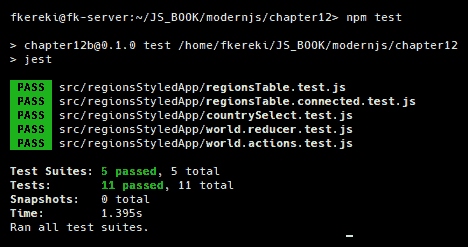

我们所有组件的测试都通过了

因此，除了需要使用浅渲染，并可能需要以不同的方式访问元素或模拟事件，为 RN 编写单元测试基本上与为`React`编写单元测试相同，这是个好消息。然而，我们忘了一件事——快照测试怎么样？让我们继续。

# 添加快照测试

使用 RN 进行快照测试是一个惊喜，因为你不需要改变之前的工作方式。让我们看几个例子，你就会相信。

# 如何做...

我们已经在第十章的*使用快照测试更改*部分中看到了快照测试。恰好，相同的代码在 RN 应用中也能完美运行，而不需要任何特定的更改，除了那些取决于代码变化的部分。让我们考虑以下示例。我们之前开发的`<RegionsTable>`组件在 RN 中有一个额外的 prop：`deviceData`。因此，我们可以复制原始快照测试代码，然后只需添加新的 prop，如下所示：

```js
// Source file: src/regionsStyledApp/regionsTable.snapshot.test.js

/* @flow */

import React from "react";
import TestRenderer from "react-test-renderer";

import { RegionsTable } from "./regionsTable.component";

const fakeDeviceData = {
 isTablet: false,
 isPortrait: true,
 height: 1000,
 width: 720,
 scale: 1,
 fontScale: 1
};

describe("RegionsTable", () => {
    it("renders correctly an empty list", () => {
        const tree = TestRenderer.create(
            <RegionsTable deviceData={fakeDeviceData} list={[]} />
        ).toJSON();
        expect(tree).toMatchSnapshot();
    });

    it("renders correctly a list", () => {
        const tree = TestRenderer.create(
            <RegionsTable
                deviceData={fakeDeviceData}
                list={[
                    {
                        countryCode: "UY",
                        regionCode: "10",
                        regionName: "Montevideo"
                    },
                    {
                        countryCode: "UY",
                        regionCode: "9",
                        regionName: "Maldonado"
                    },
                    {
                        countryCode: "UY",
                        regionCode: "5",
                        regionName: "Cerro Largo"
                    }
                ]}
            />
        ).toJSON();
        expect(tree).toMatchSnapshot();
    });
});
```

如果你愿意比较版本，你会发现唯一改变的部分是我用粗体标出的部分，它们与不同的组件有关，而不是与任何 RN 特定的东西有关。如果你为`<CountrySelect>`组件编写快照测试，你会发现完全相同的结果：唯一必要的更改与其新的 props（`deviceData`，`currentCountry`）有关，但没有其他困难。

为了多样化，让我们为我们的`<Main>`组件添加快照测试。这里有两个有趣的细节：

+   由于我们的组件在纵向或横向模式下呈现不同，我们应该有两个测试；和

+   由于该组件包含连接的组件，我们不要忘记添加`<Provider>`组件，否则连接将无法建立。

代码如下；特别要注意不同的设备数据和`<Provider>`的包含：

```js
// Source file: src/regionsStyledApp/main.snapshot.test.js

/* @flow */

import React from "react";
import { Provider } from "react-redux";
import TestRenderer from "react-test-renderer";

import { Main } from "./main.component";
import { store } from "./store";

const fakeDeviceData = {
    isTablet: false,
    isPortrait: true,
    height: 1000,
    width: 720,
    scale: 1,
    fontScale: 1
};

describe("Main component", () => {
    it("renders in portrait mode", () => {
        const tree = TestRenderer.create(
 <Provider store={store}>
                <Main
                    deviceData={{ ...fakeDeviceData, isPortrait: true }}
                />
 </Provider>
        ).toJSON();
        expect(tree).toMatchSnapshot();
    });

    it("renders in landscape mode", () => {
        const tree = TestRenderer.create(
 <Provider store={store}>
                <Main
                    deviceData={{ ...fakeDeviceData, isPortrait: false }}
                />
 </Provider>
        ).toJSON();
        expect(tree).toMatchSnapshot();
    });
});
```

# 它是如何工作的...

由于我们所有快照测试的文件名都以`.snapshot.js`结尾，我们可以用一个命令运行所有快照测试：

```js
npm test snapshot
```

第一次运行测试时，与以前一样，将创建快照：

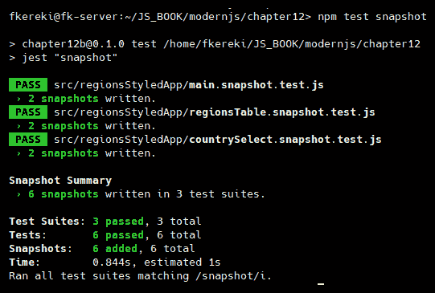

与 React 一样，第一次运行将为组件创建快照

如果我们检查`__snapshots__`目录，我们会发现其中有三个生成的`.snap`文件。它们的格式与我们之前开发的`React`示例相同。让我们看一下之前展示的`<RegionsTable>`的一个：

```js
// Jest Snapshot v1, https://goo.gl/fbAQLP

exports[`RegionsTable renders correctly a list 1`] = `
<RCTScrollView
  style={
    Array [
      undefined,
      Object {
        "backgroundColor": "lightgray",
      },
    ]
  }
>
  <View>
    <View>
      <Text
        accessible={true}
        allowFontScaling={true}
        ellipsizeMode="tail"
      >
        Cerro Largo
      </Text>
    </View>
    <View>
      <Text
        accessible={true}
        allowFontScaling={true}
        ellipsizeMode="tail"
      >
        Maldonado
      </Text>
    </View>
    <View>
      <Text
        accessible={true}
        allowFontScaling={true}
        ellipsizeMode="tail"
      >
        Montevideo
      </Text>
    </View>
  </View>
</RCTScrollView>
`;

exports[`RegionsTable renders correctly an empty list 1`] = `
<View
  style={undefined}
>
  <Text
    accessible={true}
    allowFontScaling={true}
    ellipsizeMode="tail"
  >
    No regions.
  </Text>
</View>
`;
```

如果将来再次运行测试，而且没有任何更改，那么结果将是三个 PASS 绿色消息：

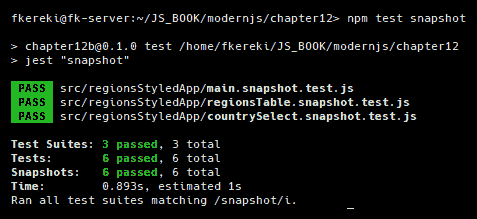

我们的快照测试都成功了

一切都很顺利，所以我们可以断言编写快照测试不会给 RN 测试增加任何复杂性，并且可以毫无困难地进行。

# 测量测试覆盖率

就像我们在第五章的*测试和调试您的服务器*和第十章的*测试您的应用程序*中为`Node`和`React`做的那样，我们希望对我们的测试覆盖率进行测量，以了解我们的工作有多彻底，并能够检测到需要更多工作的代码片段。幸运的是，我们将能够使用之前使用的相同工具来管理，因此这个步骤将很容易实现。

# 如何做...

CRAN 提供的应用程序设置包括我们之前看到的`Jest`，而`Jest`为我们提供了所需的覆盖选项。首先，我们需要添加一个简单的脚本，以便用一些额外的参数运行我们的测试套件：

```js
"scripts": {
    .
    .
    .
    "test": "jest",
 "coverage": "jest --coverage --no-cache",
},
```

就这些了，我们没有其他事情要做；让我们看看它是如何工作的！

# 它是如何工作的...

运行测试很简单；我们只需要使用新的脚本：

```js
npm run coverage
```

整个套件将以与本章前几节相同的方式运行，但最后将生成一个文本摘要。与之前一样，颜色将被使用：绿色表示覆盖良好（在测试方面），黄色表示中等覆盖率，红色表示覆盖率低或没有覆盖：

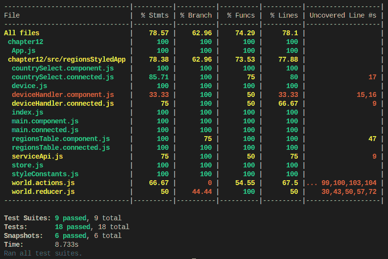

使用启用覆盖选项的 Jest 生成了与我们在 Node 和 React 中看到的相同类型的结果

我们还可以检查生成的 HTML 文件，这些文件可以在`/coverage/lcov-report`中找到。在那里打开`index.html`文件，你将得到一个交互式版本的报告，就像下面的截图一样：

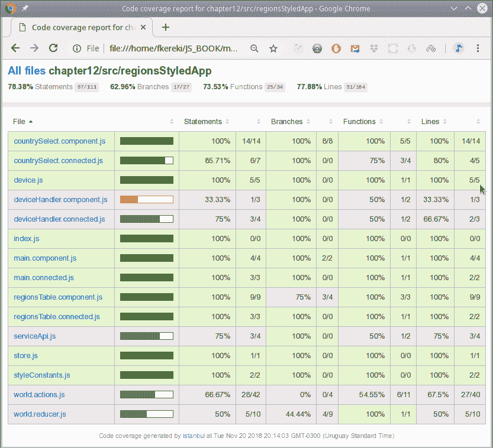

生成的 HTML 报告是交互式的，可以让你看到你在测试中错过了什么

例如，如果你想知道为什么`deviceHandler.component.js`文件得分如此之低（不要紧，你没有为它编写测试；所有的代码都应该被覆盖，如果可能的话），你可以点击它并查看原因。在我们的情况下，`onLayoutHandler`代码（逻辑上）从未被调用，因此降低了该文件的覆盖率：

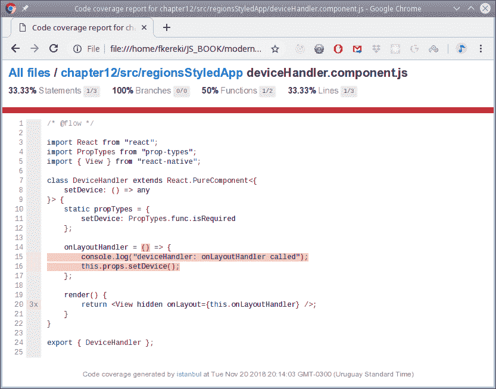

点击文件将显示哪些行被执行，哪些行（红色背景）被忽略

要查看如何禁用未覆盖的报告行，或者对于你不想考虑的情况，可以查看[`github.com/gotwarlost/istanbul/blob/master/ignoring-code-for-coverage.md`](https://github.com/gotwarlost/istanbul/blob/master/ignoring-code-for-coverage.md)。

# 使用 Storybook 预览组件

`Storybook`，我们在第六章的*Simplifying component development with Storybook*部分中介绍的`React`工具，也可以用来帮助开发组件，因此在这个教程中，让我们看看如何使用它来简化我们的工作。

# 准备工作

安装`Storybook`很简单，与之前的操作类似；`react-native-storybook-loader`包将允许我们将`*.story.js`文件放在任何我们想要的地方，并且无论如何都能找到它们。第二个命令将需要一些时间，安装许多包；请注意！此外，将在你的目录根目录下创建一个`storybook`目录。使用以下命令安装`Storybook`：

```js
npm install @storybook/cli react-native-storybook-loader --save-dev
npx storybook init
```

`storybook/Stories`目录可以安全地删除，因为我们将把我们的故事和被演示的组件放在其他地方，就像我们在本书的前面部分所做的那样。

在使用 CRNA 创建的 RN 应用程序中运行`Storybook`需要额外的步骤：提供一个适当的`App.js`文件。实现这一点的最简单方法是使用一行文件：

```js
export default from './storybook';
```

然而，这是一个问题——你将如何运行你的应用程序？当然，你可以有两个不同的`App.storybook.js`和`App.standard.js`文件，并将其中一个复制到`App.js`，但如果手动完成，这很快就会变得无聊。当然，你可以使用一些`npm`脚本。以下命令适用于 Linux 或 macOS 设备，使用`cp`命令来复制文件，但对于 Windows 设备需要进行小的更改：

```js
"scripts": {
 "start": "cp App.standard.js App.js && react-native-scripts start",
    .
    .
    .
 "storybook": "cp App.storybook.js App.js && rnstl && storybook start -p 7007"
},
```

我们还需要在`package.json`中添加一些加载器的配置。以下内容使加载器在`./src`目录中查找`*.story.js`文件，并生成一个带有找到的故事的`storyLoader.js`文件：

```js
"config": {
    "react-native-storybook-loader": {
        "searchDir": [
            "./src"
        ],
        "pattern": "**/*.story.js",
        "outputFile": "./storybook/storyLoader.js"
    }
},
```

最后，我们将不得不修改`storybook/index.js`，如下所示：

```js
import { getStorybookUI, configure } from "@storybook/react-native";

import { loadStories } from "./storyLoader";

configure(loadStories, module);
const StorybookUI = getStorybookUI({ port: 7007, onDeviceUI: true });

export default StorybookUI;
```

我们现在已经设置好了，让我们写一些故事！

查看[`github.com/storybooks/storybook/tree/master/app/react-native`](https://github.com/storybooks/storybook/tree/master/app/react-native)了解 RN 的`Storybook`的更多文档，以及[`github.com/elderfo/react-native-storybook-loader`](https://github.com/elderfo/react-native-storybook-loader)了解我们正在使用的加载程序的详细信息。

# 如何做...

让我们写一些故事。我们可以从`<RegionsTable>`组件开始，这很简单：它不包括任何操作，只显示数据。我们可以写两种情况：当提供空的地区列表时，以及当提供非空列表时。我们不必过多考虑所需的假数据，因为我们可以重用我们为单元测试编写的内容！考虑以下代码：

```js
// Source file: src/regionsStyledApp/regionsTable.story.js

/* @flow */

import React from "react";
import { storiesOf } from "@storybook/react-native";

import { Centered } from "../../storybook/centered";
import { RegionsTable } from "./regionsTable.component";

const fakeDeviceData = {
    isTablet: false,
    isPortrait: true,
    height: 1000,
    width: 720,
    scale: 1,
    fontScale: 1
};

storiesOf("RegionsTable", module)
    .addDecorator(getStory => <Centered>{getStory()}</Centered>)
    .add("with no regions", () => (
        <RegionsTable deviceData={fakeDeviceData} list={[]} />
    ))
    .add("with some regions", () => (
        <RegionsTable
            deviceData={fakeDeviceData}
            list={[
                {
                    countryCode: "UY",
                    regionCode: "10",
                    regionName: "Montevideo"
                },
                {
                    countryCode: "UY",
                    regionCode: "9",
                    regionName: "Maldonado"
                },
                {
                    countryCode: "UY",
                    regionCode: "5",
                    regionName: "Cerro Largo"
                }
            ]}
        />
    ));
```

添加一个修饰器来使显示的组件居中只是为了清晰起见：必要的`<Centered>`代码很简单，并且需要一点我们在上一章中看到的样式：

```js
// Source file: storybook/centered.js

/* @flow */

import React from "react";
import { View, StyleSheet } from "react-native";
import PropTypes from "prop-types";

const centerColor = "white";
const styles = StyleSheet.create({
 centered: {
 flex: 1,
 backgroundColor: centerColor,
 alignItems: "center",
 justifyContent: "center"
 }
});

export class Centered extends React.Component<{ children: node }> {
    static propTypes = {
        children: PropTypes.node.isRequired
    };

    render() {
        return <View style={styles.centered}>{this.props.children}</View>;
    }
}
```

现在，为`<CountrySelect>`设置故事更有趣，因为我们有操作。我们将为组件提供两个操作：当用户点击它以选择一个国家时，以及用于获取国家列表的`getCountries()`回调的另一个操作：

```js
// Source file: src/regionsStyledApp/countrySelect.story.js

/* @flow */

import React from "react";
import { storiesOf } from "@storybook/react-native";
import { action } from "@storybook/addon-actions";

import { Centered } from "../../storybook/centered";
import { CountrySelect } from "./countrySelect.component";

const fakeDeviceData = {
    isTablet: false,
    isPortrait: true,
    height: 1000,
    width: 720,
    scale: 1,
    fontScale: 1
};

storiesOf("CountrySelect", module)
    .addDecorator(getStory => <Centered>{getStory()}</Centered>)
    .add("with no countries yet", () => (
        <CountrySelect
            deviceData={fakeDeviceData}
            loading={true}
            currentCountry={""}
            onSelect={action("click:country")}
            getCountries={action("call:getCountries")}
            list={[]}
        />
    ))
    .add("with three countries", () => (
        <CountrySelect
            deviceData={fakeDeviceData}
            currentCountry={""}
            loading={false}
            onSelect={action("click:country")}
            getCountries={action("call:getCountries")}
            list={[
                {
                    countryCode: "UY",
                    countryName: "Uruguay"
                },
                {
                    countryCode: "AR",
                    countryName: "Argentina"
                },
                {
                    countryCode: "BR",
                    countryName: "Brazil"
                }
            ]}
        />
    ));
```

我们现在已经准备好了；让我们看看这是如何工作的。

# 它是如何工作的...

要查看`Storybook`应用程序，我们需要使用我们在前一节中编辑的脚本。首先运行`storybook`脚本（最好在单独的控制台中执行此操作），然后运行应用程序本身，如下所示：

```js
// *at one terminal*
npm run storybook

// *and at another terminal*
npm start
```

第一个命令产生了一些输出，让我们确认我们的脚本是否有效，并且找到了所有的故事。以下代码略作编辑以便更清晰：

```js
> npm run storybook

> chapter12b@0.1.0 storybook /home/fkereki/JS_BOOK/modernjs/chapter12
> cp App.storybook.js App.js && rnstl && storybook start -p 7007

Generating Dynamic Storybook File List

Output file: /home/fkereki/JS_BOOK/modernjs/chapter12/storybook/storyLoader.js
Patterns: ["/home/fkereki/JS_BOOK/modernjs/chapter12/src/**/*.story.js"]
Located 2 files matching pattern '/home/fkereki/JS_BOOK/modernjs/chapter12/src/**/*.story.js' 
Compiled story loader for 2 files:
 /home/fkereki/JS_BOOK/modernjs/chapter12/src/regionsStyledApp/countrySelect.story.js
 /home/fkereki/JS_BOOK/modernjs/chapter12/src/regionsStyledApp/regionsTable.story.js
=> Loading custom .babelrc from project directory.
=> Loading custom addons config.
=> Using default webpack setup based on "Create React App".
Scanning 1424 folders for symlinks in /home/fkereki/JS_BOOK/modernjs/chapter12/node_modules (18ms)

RN Storybook started on => http://localhost:7007/

Scanning folders for symlinks in /home/fkereki/JS_BOOK/modernjs/chapter12/node_modules (27ms)

+----------------------------------------------------------------------+
|                                                                      |
| Running Metro Bundler on port 8081\.                                  |
|                                                                      |
| Keep Metro running while developing on any JS projects. Feel free to |
| close this tab and run your own Metro instance if you prefer.        |
|                                                                      |
| https://github.com/facebook/react-native                             |
|                                                                      |
+----------------------------------------------------------------------+

Looking for JS files in
 /home/fkereki/JS_BOOK/modernjs/chapter12/storybook
 /home/fkereki/JS_BOOK/modernjs/chapter12
 /home/fkereki/JS_BOOK/modernjs/chapter12 

Metro Bundler ready.

webpack built bab22529b80fbd1ce576 in 2918ms
Loading dependency graph, done.
```

我们可以打开浏览器，得到一个与我们为 Web 应用程序和`React`获得的视图非常相似的视图：

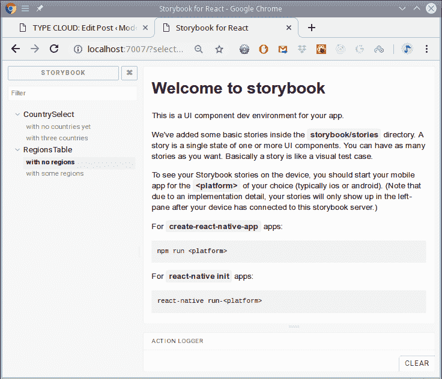

您可以在侧边栏中选择故事，应用程序将显示它们

如果您在菜单中选择一个故事，应用程序将显示它，如下所示：

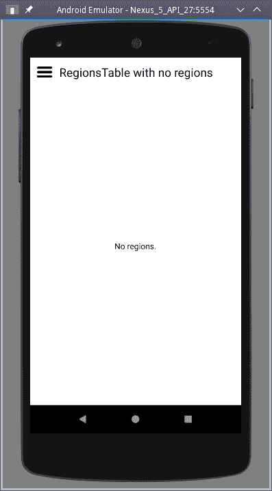

应用程序会在浏览器中显示您选择的故事

您还可以通过按压前面截图左上角的汉堡菜单来选择在应用程序本身中显示哪个故事。结果选择菜单显示如下：

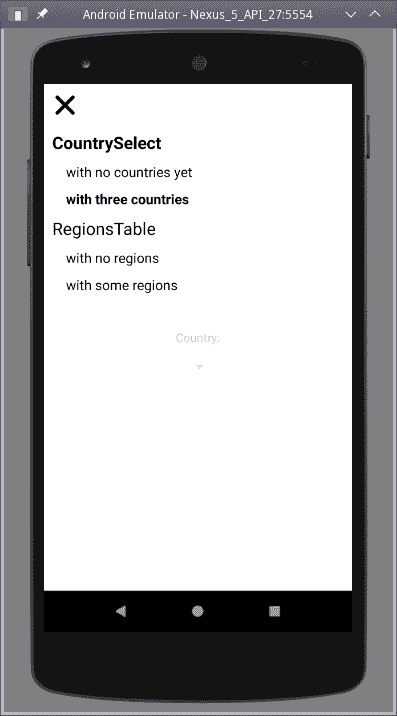

该应用程序还允许您选择要显示的故事

最后，您可以在浏览器中看到操作。让我们想象一下，您打开了包含三个国家的国家列表的故事：

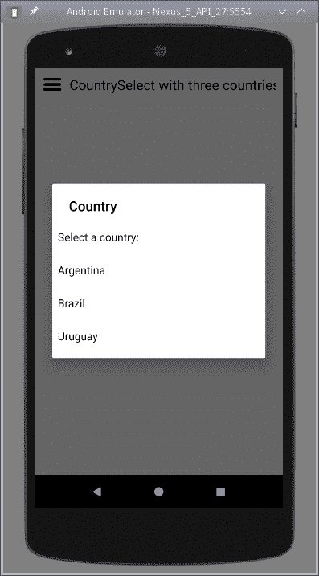

国家选择器让您与操作进行交互

如果您点击巴西，浏览器将显示已触发的操作。首先，我们可以看到当`getCountries()`回调被调用时，会出现 call:getCountries，然后当您点击一个选项时会出现 click:country。

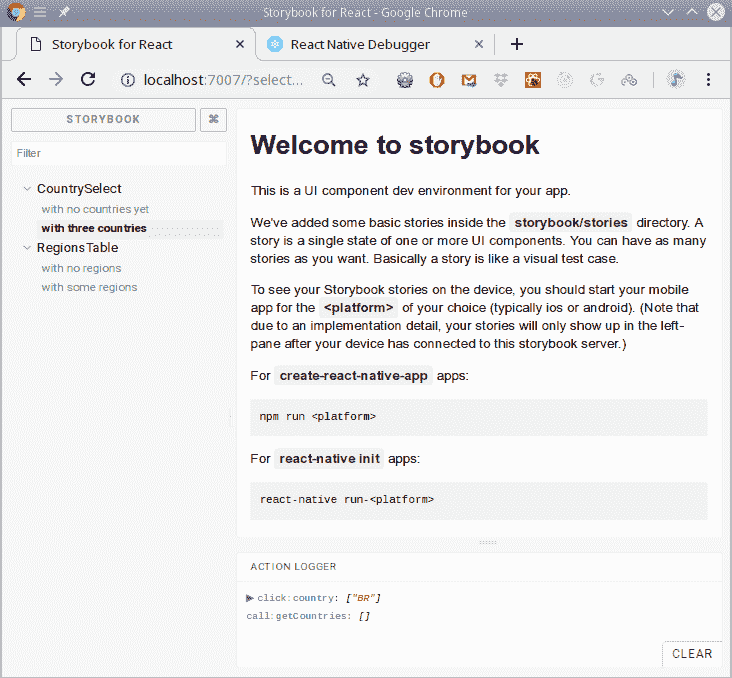

与 Web 应用程序一样，您可以与故事互动，并查看调用了哪些操作以及使用了哪些参数

因此，我们已经看到，添加故事实际上与 Web 应用程序相同，并且您还可以获得额外的工具来帮助开发-您应该考虑这一点。

# 使用 react-native-debugger 调试您的应用程序

调试 RN 应用程序比处理 Web 应用程序更难，因为您想要做的一切都是远程完成的；您不能在移动设备上运行功能齐全的调试器。有几种工具可以帮助您解决这个问题，在本节中，我们将考虑一个“万能”工具`react-native-debugger`，它包括一个强大的三合一实用程序，其中大多数（如果不是全部）您的需求应该得到满足。

您需要进行彻底调试的基本工具（我们之前已经遇到过）如下：

+   Chrome 开发者工具，网址为[`developers.google.com/web/tools/chrome-devtools/`](https://developers.google.com/web/tools/chrome-devtools/)，用于访问控制台等

+   `React devtools`（独立版本）网址为[`github.com/facebook/react-devtools`](https://github.com/facebook/react-devtools)，用于处理组件

+   `Redux DevTools`扩展，网址为[`github.com/zalmoxisus/redux-devtools-extension`](https://github.com/zalmoxisus/redux-devtools-extension)，用于检查操作和状态

当然，您可以单独安装它们，并与三者一起使用，但将它们全部放在一起无疑更简单，因此我们将遵循这个方法。所以，让我们开始调试我们的代码吧！

您可以在[`facebook.github.io/react-native/docs/debugging`](http://facebook.github.io/react-native/docs/debugging)了解 RN 调试的基础知识，并在[`github.com/jhen0409/react-native-debugger`](https://github.com/jhen0409/react-native-debugger)学习`react-native-debugger`。

# 入门

我们需要安装几个软件包才能让一切正常工作。首先，只需从[`github.com/jhen0409/react-native-debugger/releases`](https://github.com/jhen0409/react-native-debugger/releases)的发布页面获取`react-native-debugger`可执行文件。安装只需解压下载的文件；执行只需在解压后的目录中运行可执行文件。

我们需要安装一些软件包，以便将我们的应用程序连接到`react-native-debugger`，可以通过模拟器或实际设备上运行以下命令来获取这些软件包。让我们使用以下命令安装这些软件包：

```js
npm install react-devtools remote-redux-devtools --save-dev
```

我们现在已经准备好了一切。让我们看一下如何将工具（主要是 Redux 调试器）集成到我们的应用程序中的一些细节，然后我们就可以开始调试了。

# 如何做...

让我们看看如何设置我们的应用程序，以便我们可以使用我们的调试工具。首先，我们需要在存储创建代码中进行简单更改，添加几行，如下所示：

```js
// Source file: src/regionsStyledApp/store.js

/* @flow */

import { createStore, applyMiddleware } from "redux";
import thunk from "redux-thunk";
import { composeWithDevTools } from "redux-devtools-extension";

import { reducer } from "./world.reducer";

export const store = createStore(
    reducer,
 composeWithDevTools(applyMiddleware(thunk))
);
```

仅仅是为了让我们能够实际获得一些调试消息，我在整个代码中添加了各种`console.log()`和`console.error()`调用。为了保持一致，我想使用`debug`（来自[`www.npmjs.com/package/debug`](https://www.npmjs.com/package/debug)），就像我们在本书中之前所做的那样，但它不起作用，因为它需要`LocalStorage`，而在 RN 中，您将使用不同的 API`AsyncStorage`。只是举个例子，我们将查看`world.actions.js`的一些日志输出。我没有打扰记录成功的 API 调用的输出，因为我们将通过`react-native-debugger`获得，我们将看到：

```js
// Source file: src/regionsStyledApp/world.actions.js

.
.
.

export const getCountries = () => async dispatch => {
 console.log("getCountries: called");
    try {
        dispatch(countriesRequest());
        const result = await getCountriesAPI();
        dispatch(countriesSuccess(result.data));
    } catch (e) {
 console.error("getCountries: failure!");
        dispatch(countriesFailure());
    }
};

export const getRegions = (country: string) => async dispatch => {
 console.log("getRegions: called with ", country);
    if (country) {
        try {
            dispatch(regionsRequest(country));
            const result = await getRegionsAPI(country);
            dispatch(regionsSuccess(result.data));
        } catch (e) {
 console.error("getRegions: failure with API!");
            dispatch(regionsFailure());
        }
    } else {
 console.error("getRegions: failure, no country!");
        dispatch(regionsFailure());
    }
};
```

我们已经准备就绪，让我们试一试。

# 它是如何工作的...

首先，使用以下命令运行您的应用程序：

```js
npm start
```

在您的设备上（无论是真实设备还是模拟设备），通过摇动（在实际设备上）或在 macOS 上使用 command + m 或在 Windows 或 Linux 上使用 Ctrl + M 来访问开发者菜单。至少，您希望启用远程 JS 调试：

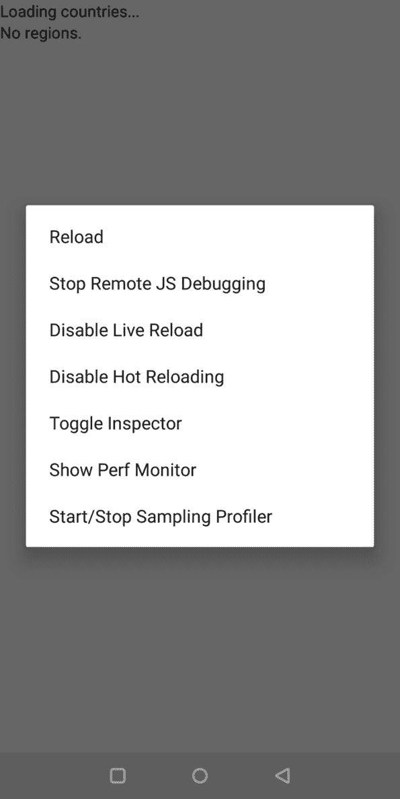

使用设备的开发者菜单启用远程 JS 调试

现在，通过点击下载的可执行文件打开`react-native-debugger`应用程序。如果没有任何反应，即使重新加载应用程序后仍然没有反应，那么问题肯定是由于设置了不同的端口：在菜单中，选择 Debugger，然后 New Window，选择端口 19001，一切都应该正常。当您启动应用程序时，它应该看起来像以下截图。请注意屏幕右侧的所有日志，左上角的第一个`Redux`操作，左下角的 React 工具（如果您不喜欢其中的某些工具，右键单击屏幕以隐藏其中的任何一个）：

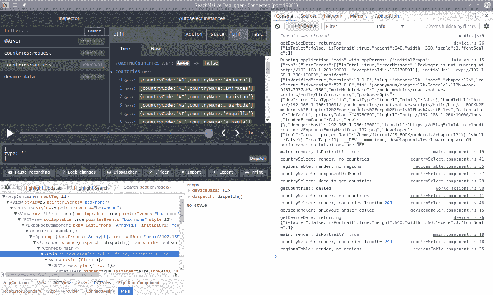

成功连接后，您将看到 react-native-debugger 中的三个工具同时运行

如果您检查网络选项卡，您会发现应用程序的 API 调用默认情况下不会显示。有一个简单的解决方法：右键单击`react-native-debugger`，选择启用网络检查，然后右键单击 Chrome 开发人员工具并选择 Log XMLHttpRequests，所有调用都将显示：

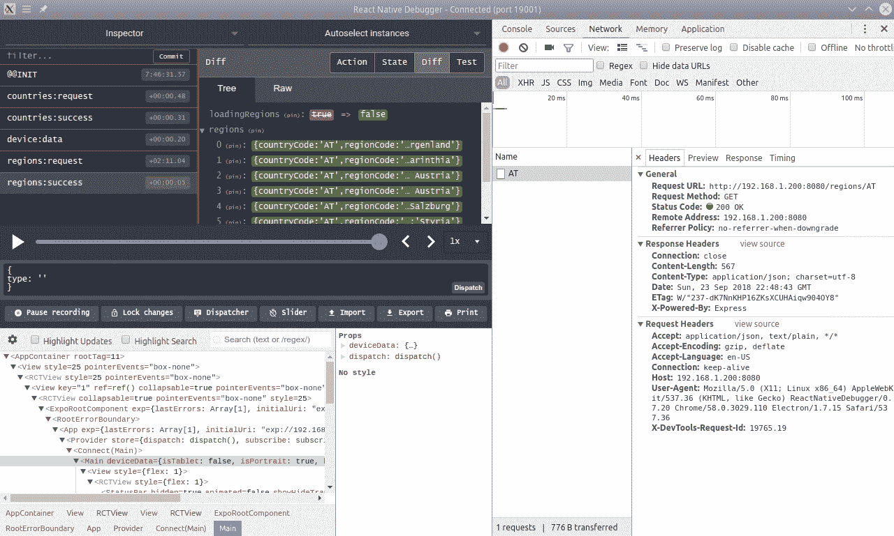

API 调用默认情况下不会显示，但可以通过右键单击 react-native-debugger 屏幕启用

您还可以检查`AsyncStorage`-请参阅以下屏幕截图。我选择隐藏`React`和`Redux DevTools`，就像我之前提到的那样，只是为了清晰。由于我们的应用实际上并没有使用`AsyncStorage`，我稍微捏造了一下：请注意，您可以对任何模块使用`require()`函数，然后直接使用它：

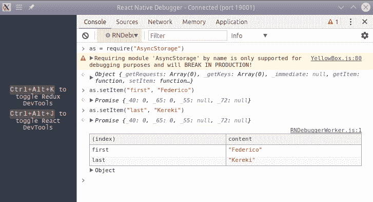

使用 RN 调试器检查 AsyncStorage

还能说什么呢？实际上并不多，因为这些工具基本上与我们在 Web 上使用`React`时看到的工具相同。这里有趣的细节是，您可以一次获得所有这些工具，而不必处理许多单独的窗口。让我们通过考虑一个可能更喜欢的备用工具来结束这一章节。

# 使用 Reactotron 以另一种方式进行调试

虽然`react-native-debugger`可能适用于您大部分的需求，但还有另一个软件包，虽然与许多功能相符，但也添加了一些新功能，或者至少对旧功能进行了调整：Reactotron。这个工具也可以与纯`React`一起使用，但我选择在这里与 RN 一起显示它，因为您更有可能需要它。毕竟，Web 的`React`工具易于使用，而无需任何不必要的复杂性，而 RN 调试，正如我们所见，稍微有些挑战。据说 Reactotron 比`react-native-debugger`更有效，但我不会证明这一点：去试试看，并且要知道**结果可能有所不同**（**YMMV**）。让我们通过演示这种替代调试方式来结束这一章节。

# 准备工作

我们需要一对包：基本的 Reactotron 包，以及`reactotron-redux`来帮助处理 Redux。使用以下命令安装它们：

```js
npm install reactotron-react-native reactotron-redux --save-dev
```

Reactotron 可以与`redux-sagas`一起工作，而不是`redux-thunk`，甚至可以与 MobX 一起工作，而不是 Redux。在[`github.com/infinitered/reactotron`](https://github.com/infinitered/reactotron)上了解更多信息。

您还需要一个连接到您的应用程序的本机可执行工具。转到[`github.com/infinitered/reactotron/releases`](https://github.com/infinitered/reactotron/releases)的发布页面，并获取与您的环境匹配的软件包：在我特定的情况下，我只下载并解压了`Reactotron-linux-x64.zip`文件。对于 macOS 用户，还有另一种可能性：查看[`github.com/infinitered/reactotron/blob/master/docs/installing.md`](https://github.com/infinitered/reactotron/blob/master/docs/installing.md)。

安装所有这些后，我们准备好准备我们的应用程序；现在让我们这样做！

# 如何做...

事实上，您可以同时使用 Reactotron 和`react-native-debugger`，但为了避免混淆，让我们有一个单独的`App.reactotron.js`文件和一些其他更改。我们必须遵循一些简单的步骤。首先，让我们通过向`package.json`添加一个新的脚本来启用使用 Reactotron 运行我们的应用程序：

```js
    "scripts": {
        "start": "cp App.standard.js App.js && react-native-scripts start",
 "start-reactotron": "cp App.reactotron.js App.js && react-native-scripts start",
        .
        .
        .
```

其次，让我们配置连接和插件。我们将创建一个`reactotronConfig.js`文件来与`Reactotron`建立连接：

```js
// Source file: reactotronConfig.js

/* @flow */

import Reactotron from "reactotron-react-native";
import { reactotronRedux } from "reactotron-redux";

const reactotron = Reactotron.configure({
    port: 9090,
    host: "192.168.1.200"
})
    .useReactNative({
        networking: {
            ignoreUrls: /\/logs$/
        }
    })
    .use(
        reactotronRedux({
            isActionImportant: action => action.type.includes("success")
        })
    )
    .connect();

Reactotron.log("A knick-knack is a thing that sits on top of a whatnot");
Reactotron.warn("If you must make a noise, make it quietly");
Reactotron.error("Another nice mess you've gotten me into.");

export default reactotron;
```

以下是上一个代码片段中一些值和选项的一些细节：

+   `192.168.1.200`是我的机器的 IP，`9090`是建议使用的端口。

+   网络调试的`ignoreUrls`选项可以消除 Expo 发出的一些调用，但不会消除我们自己的代码，使会话更清晰。

+   `isActionImportant`函数允许您突出显示一些操作，以便它们更加显眼。在我们的情况下，我选择了`countries:success`和`regions:success`操作，这两个操作的类型都包含`"success"`，但当然，您也可以选择任何其他操作。

`Reactotron`还包括日志记录功能，因此我添加了三个（无用的！）调用，只是为了看看它们在我们的调试中是如何显示的。我不想展示我们添加的所有日志，但您可能希望使用以下命令，以便所有日志都会发送到`Reactotron`：

```js
console.log = Reactotron.log;
console.warn = Reactotron.warn;
console.error = Reactotron.error;
```

现在，我们必须调整我们的存储，以便它可以与`reactotron-redux`插件一起使用。我选择复制`store.js`，并将其命名为`store.reactotron.js`，并进行以下必要的更改：

```js
// Source file: src/regionsStyledApp/store.reactotron.js

/* @flow */

import { AsyncStorage } from "react-native";
import { applyMiddleware } from "redux";
import thunk from "redux-thunk";
import reactotron from "../../reactotronConfig";

import { reducer } from "./world.reducer";

export const store = reactotron.createStore(
    reducer,
    applyMiddleware(thunk)
);

// *continues*...
```

为了多样化，并且能够看到`Reactotron`如何处理`AsyncStorage`，我添加了一些（完全无用的！）行来设置一些项目：

```js
// ...*continued*

(async () => {
    try {
        await AsyncStorage.setItem("First", "Federico");
        await AsyncStorage.setItem("Last", "Kereki");
        await AsyncStorage.setItem("Date", "Sept.22nd");
        await AsyncStorage.getItem("Last");
    } catch (e) {
    }
})();
```

接下来，让我们对`App.js`文件进行一些更改。这些更改很小：只需包含配置文件，并使用我刚刚调整的存储：

```js
// Source file: App.reactotron.js

/* @flow */

import React from "react";
import { Provider } from "react-redux";

import "./reactotronConfig";
 import { store } from "./src/regionsStyledApp/store.reactotron";
import { ConnectedMain } from "./src/regionsStyledApp/main.connected";

export default class App extends React.PureComponent<> {
    render() {
        return (
            <Provider store={store}>
                <ConnectedMain />
            </Provider>
        );
    }
}
```

现在，我们准备好了；让我们看看它的运行情况！

有关`Reactotron`的完整文档，请查看开发者的网页[`github.com/infinitered/reactotron`](https://github.com/infinitered/reactotron)。`Reactotron`还包括更多插件，可以在使用`Redux`或`Storybook`时帮助您进行慢函数的基准测试，或记录消息，因此您可能会在那里找到许多有趣的东西。

# 它是如何工作的...

要使用`Reactotron`，只需启动它（双击应该就可以了），您将看到以下截图中显示的初始屏幕。该工具将等待您的应用连接；有时，可能需要多次尝试才能开始初始连接，但之后，事情应该会顺利进行。

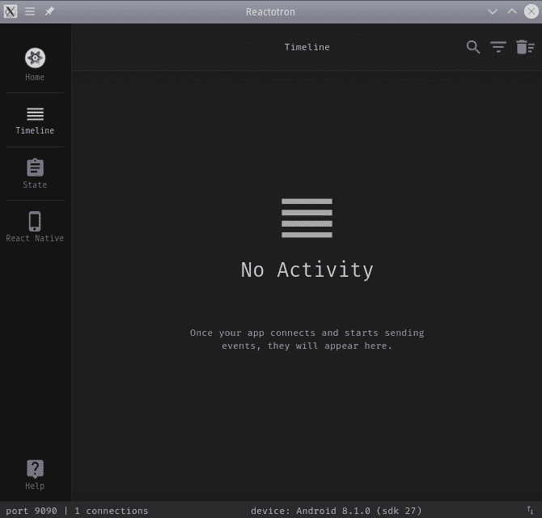

Reactotron 的初始屏幕显示它正在等待连接

启动应用程序后，您将看到它已经建立了连接。`Reactotron`显示了一些详细信息：例如，设备正在运行 Android 8.1.0 版本，我们还可以看到设备的大小和比例。请参阅以下截图：

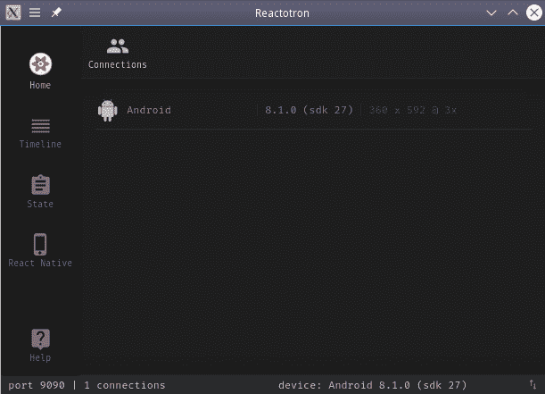

连接成功后，您可以查看有关设备的详细信息

应用程序启动时，我们会得到类似以下截图的东西。请注意突出显示的操作（`countries:success`），ASYNC STORAGE 日志，以及我们添加的来自老电影的三行（对于电影爱好者来说，这是一个有趣的时间：谁说了这三句话？）：

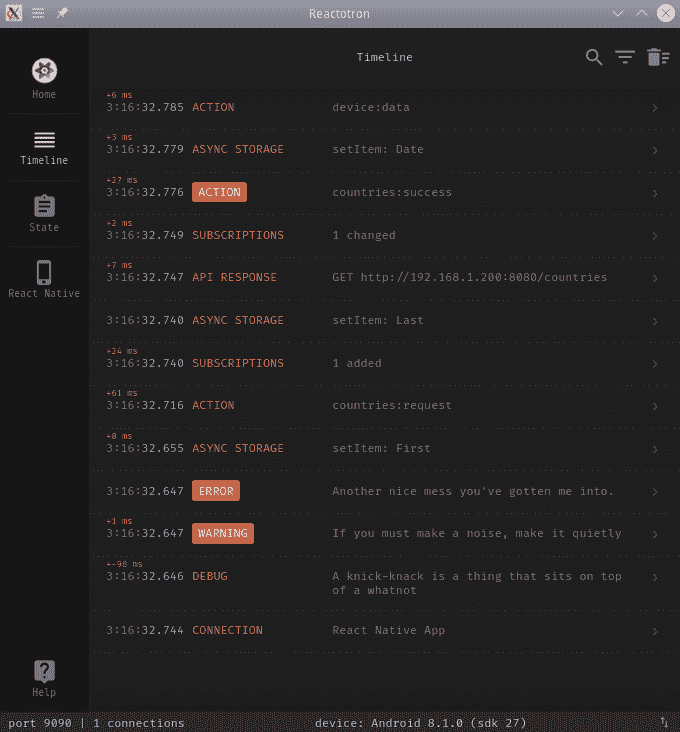

当我们的应用程序开始运行时，我们会在 Reactotron 窗口中得到所有这些调试文本。

我们还可以查看`Redux`存储的状态——请参阅以下截图。我检查了`deviceData`和一个国家：

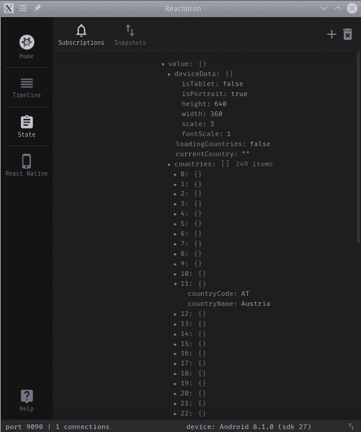

您可以检查 Redux 存储以查看其中放入了什么

最后，我在应用程序中选择了奥地利。我们可以检查已发出的 API 调用，以及随后分派的操作；请参阅以下截图：

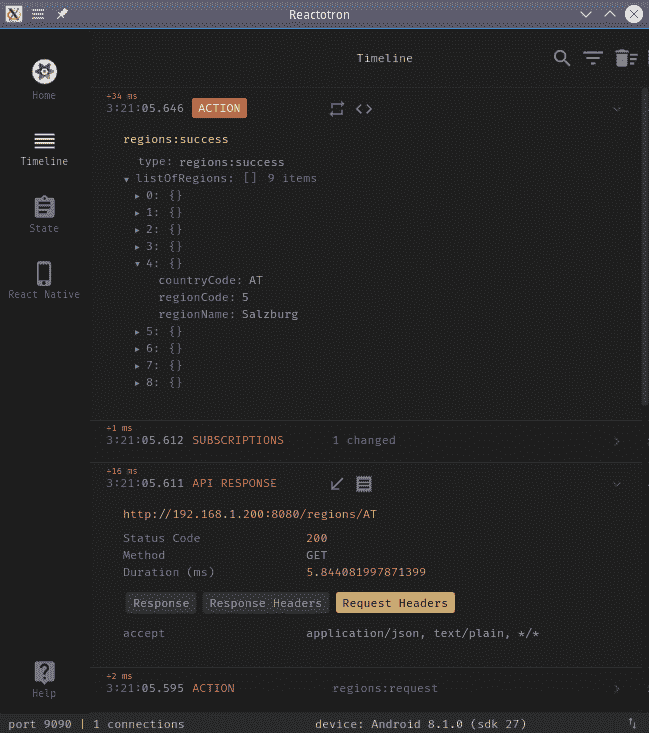

在我们的应用程序中选择奥地利的结果：我们可以检查 API 调用和 Redux 操作。在这里，我们看到了

奥地利的九个地区，以及莫扎特故乡萨尔茨堡的详细信息

`Reactotron`有一些不同的功能，正如我们所说的，对于某些目的，它可能比`react-native-debugger`更适合您，因此它是您调试工具库中值得包含的内容。
