# 第十三章：使用 Electron 创建桌面应用程序

我们将查看以下配方：

+   使用 React 设置 Electron

+   向您的应用程序添加 Node 功能

+   构建更窗口化的体验

+   测试和调试您的应用程序

+   制作一个可分发的软件包

# 介绍

在之前的章节中，我们使用`Node`来设置服务器，并使用`React`创建网页。在本章中，我们将把两者结合起来，添加另一个名为`Electron`的工具，并看看如何使用 JS 编写与任何本机可执行应用程序完全相同的桌面应用程序。

# 使用 React 设置 Electron

`Electron`是由 GitHub 创建的开源框架，它允许您开发桌面可执行文件，将 Node 和 Chrome 集成在一起，提供完整的 GUI 体验。 `Electron`已用于几个知名项目，包括开发人员工具，如 Visual Studio Code，Atom 和 Light Table。基本上，您可以使用 HTML，CSS 和 JS（或使用`React`，就像我们将要做的那样）来定义 UI，但您还可以使用`Node`中的所有软件包和功能，因此您不会受到沙箱化体验的限制，可以超越您只能使用浏览器做的事情。

您可能还想了解**渐进式 Web 应用程序**（**PWA**），这些是可以像本机应用程序一样“安装”在您的计算机上的 Web 应用程序。这些应用程序像其他应用程序一样启动，并在常见的应用程序窗口中运行，而不像浏览器那样显示标签或 URL 栏。 PWA 可能（尚未？）无法访问完整的桌面功能，但对于许多情况来说可能已经足够了。在[`developers.google.com/web/progressive-web-apps/`](https://developers.google.com/web/progressive-web-apps/)上阅读有关 PWA 的更多信息。

# 如何做...

现在，在这个配方中，让我们首先安装`Electron`，然后在后续的配方中，我们将看到如何将我们的一个`React`应用程序转换为桌面程序。

我从第八章的存储库副本开始，*扩展您的应用程序*，以获取国家和地区应用程序，这与我们用于 RN 示例的相同。恰好您可以完全使用 CRA 构建的应用程序与`Electron`完美地配合，甚至无需弹出它，这就是我们将在这里做的。首先，我们需要安装基本的`Electron`软件包，因此在我们编写`React`应用程序的同一目录中，我们将执行以下命令：

```js
npm install electron --save-dev
```

然后，我们需要一个启动 JS 文件。从[`github.com/electron/electron-quick-start`](https://github.com/electron/electron-quick-start)的`main.js`文件中获取一些提示，我们将创建以下`electron-start.js`文件：

```js
// Source file: electron-start.js

/* @flow */

const { app, BrowserWindow } = require("electron");

let mainWindow;

const createWindow = () => {
    mainWindow = new BrowserWindow({
        height: 768,
        width: 1024
    });
    mainWindow.loadURL("http://localhost:3000");
    mainWindow.on("closed", () => {
        mainWindow = null;
    });
};

app.on("ready", createWindow);

app.on("activate", () => mainWindow === null && createWindow());

app.on(
    "window-all-closed",
    () => process.platform !== "darwin" && app.quit()
);

```

以下是关于前面代码片段的一些要点：

+   此代码在`Node`中运行，因此我们使用`require()`而不是`import`。

+   `mainWindow`变量将指向浏览器实例，我们的代码将在其中运行

+   我们将首先运行我们的 React 应用程序，因此 Electron 将能够从[`localhost:3000`](http://localhost:3000)加载代码

在我们的代码中，我们还必须处理以下事件：

+   当`Electron`完成初始化并可以开始创建窗口时，将调用`"ready"`。

+   `"closed"`表示您的窗口已关闭；您的应用程序可能有多个窗口打开，因此在这一点上，您应该删除已关闭的窗口。

+   `"window-all-closed"`意味着您的整个应用程序已关闭。在 Windows 和 Linux 中，这意味着退出，但对于 macOS，通常不会退出应用程序，因为苹果通常的规则。

+   当您的应用程序重新激活时，将调用`"activate"`，因此如果窗口已被删除（如在 Windows 或 Linux 中），您必须重新创建它。

`Electron`可以发出的完整事件列表在[`github.com/electron/electron/blob/master/docs/api/app.md`](https://github.com/electron/electron/blob/master/docs/api/app.md)中；查看一下。

我们已经有了我们的`React`应用程序，所以我们只需要一种调用`Electron`的方法。将以下脚本添加到`package.json`中，你就准备好了：

```js
 "scripts": {
 "electron": "electron .",
        .
        .
        .
```

我们已经准备好了；让我们看看它是如何一起运作的。

# 它是如何工作的...

要以开发模式运行`Electron`应用程序（稍后我们将创建一个可执行文件），我们必须执行以下操作：

1.  从第四章运行我们的`restful_server_cors`服务器代码，*使用 Node 实现 RESTful 服务*。

1.  启动`React`应用程序，需要服务器正在运行。

1.  等待加载完成，然后再进行下一步。

1.  启动`Electron`。

因此，基本上，您将需要运行以下两个命令，但是您需要在单独的终端中执行这些命令，并且在启动`Electron`之前还需要等待`React`应用程序在浏览器中显示：

```js
// *in the directory for our restful server:* node out/restful_server_cors.js // *in the React app directory:* npm start

// *and after the React app is running, in other terminal:*
npm run electron
```

启动`Electron`后，屏幕迅速出现，我们再次发现我们的国家和地区应用程序，现在独立于浏览器运行。请参阅以下屏幕截图-请注意，我将窗口从其 1024×768 大小调整为：

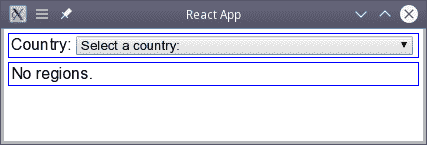

我们的应用程序作为一个独立的可执行文件运行

应用程序像往常一样工作；例如，我选择了一个国家，加拿大，并正确地得到了它的地区列表：

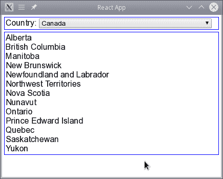

应用程序像以前一样工作；选择一个国家，然后调用我们的 RESTful 服务器将获取其地区

我们完成了！您可以看到一切都是相互关联的，就像以前一样，如果您对`React`源代码进行任何更改，它们将立即反映在`Electron`应用程序中。

到目前为止，我们已经看到我们可以将网页制作成可执行文件；现在让我们看看如何使其更加强大。

# 向您的应用程序添加 Node 功能

在上一个教程中，我们看到只需进行一些小的配置更改，我们就可以将我们的网页变成一个应用程序。但是，您仍然受到限制，因为您仍然只能使用沙盒浏览器窗口中可用的功能。您不必这样想，因为您可以使用让您超越网络限制的功能来添加基本所有`Node`功能。让我们在本教程中看看如何做到这一点。

# 如何做...

我们想要为我们的应用程序添加一些典型桌面应用程序的功能。让我们看看如何做到这一点。向您的应用程序添加`Node`功能的关键是使用`Electron`中的`remote`模块。借助它，您的浏览器代码可以调用主进程的方法，从而获得额外的功能。

有关远程模块的更多信息，请参见[`github.com/electron/electron/blob/master/docs/api/remote.md`](https://github.com/electron/electron/blob/master/docs/api/remote.md)。还有一些额外的信息可能会在[`electronjs.org/docs/api/remote`](https://electronjs.org/docs/api/remote)中派上用场。

假设我们想要添加将国家地区列表保存到文件的可能性。我们需要访问`fs`模块以便能够写入文件，并且我们还需要打开对话框来选择要写入的文件。在我们的`serviceApi.js`文件中，我们将添加以下功能：

```js
// Source file: src/regionsApp/serviceApi.js

/* @flow */

const electron = window.require("electron").remote;

.
.
.

const fs = electron.require("fs");

export const writeFile = fs.writeFile.bind(fs);

export const showSaveDialog = electron.dialog.showSaveDialog;
```

添加了这个之后，我们现在可以从我们的主代码中写文件和显示对话框。要使用此功能，我们可以在我们的`world.actions.js`文件中添加一个新的操作：

```js
// Source file: src/regionsApp/world.actions.js

/* @flow */

import {
    getCountriesAPI,
    getRegionsAPI,
 showSaveDialog,
 writeFile
} from "./serviceApi";

.
.
.

export const saveRegionsToDisk = () => async (
    dispatch: ({}) => any,
    getState: () => { regions: [] }
) => {
    showSaveDialog((filename: string = "") => {
        if (filename) {
            writeFile(filename, JSON.stringify(getState().regions), e =>
                e && window.console.log(`ERROR SAVING ${filename}`, e);
            );
        }
    });
};
```

当调度`saveRegionsToDisk()`操作时，它将显示一个对话框，提示用户选择要写入的文件，然后将当前的地区集合（从`getState().regions`中获取）以 JSON 格式写入所选文件。我们只需向我们的`<RegionsTable>`组件添加适当的按钮，以便能够调度必要的操作：

```js
// Source file: src/regionsApp/regionsTableWithSave.component.js

/* @flow */

import React from "react";
import PropTypes from "prop-types";

import "../general.css";

export class RegionsTable extends React.PureComponent<{
    loading: boolean,
    list: Array<{
        countryCode: string,
        regionCode: string,
        regionName: string
    }>,
 saveRegions: () => void
}> {
    static propTypes = {
        loading: PropTypes.bool.isRequired,
        list: PropTypes.arrayOf(PropTypes.object).isRequired,
 saveRegions: PropTypes.func.isRequired
    };

    static defaultProps = {
        list: []
    };

    render() {
        if (this.props.list.length === 0) {
            return <div className="bordered">No regions.</div>;
        } else {
            const ordered = [...this.props.list].sort(
                (a, b) => (a.regionName < b.regionName ? -1 : 1)
            );

            return (
                <div className="bordered">
                    {ordered.map(x => (
                        <div key={x.countryCode + "-" + x.regionCode}>
                            {x.regionName}
                        </div>
                    ))}
 <div>
 <button onClick={() => this.props.saveRegions()}>
 Save regions to disk
 </button>
 </div>
                </div>
            );
        }
    }
}
```

我们快要完成了！当我们将此组件连接到存储时，我们只需添加新的操作，如下所示：

```js
// Source file: src/regionsApp/regionsTableWithSave.connected.js

/* @flow */

import { connect } from "react-redux";

import { RegionsTable } from "./regionsTableWithSave.component";

import { saveRegionsToDisk } from "./world.actions";

const getProps = state => ({
    list: state.regions,
    loading: state.loadingRegions
});

const getDispatch = (dispatch: any) => ({
 saveRegions: () => dispatch(saveRegionsToDisk())
});

export const ConnectedRegionsTable = connect(
    getProps,
 getDispatch
)(RegionsTable);
```

现在，一切准备就绪-让我们看看它是如何工作的。

# 它是如何工作的...

我们添加的代码显示了我们如何访问`Node`包（在我们的情况下是`fs`）和一些额外的功能，比如显示一个保存到磁盘的对话框。（后一个功能与您的应用程序的本机外观更相关，我们将在即将到来的*构建更窗口化的体验*部分中看到更多相关内容。）当我们运行更新后的应用程序并选择一个国家时，我们将看到我们新添加的按钮，就像以下截图中的那样：

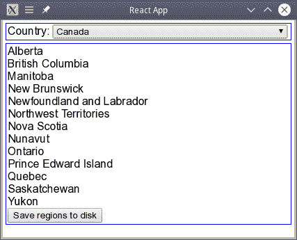

现在，在区域列表后面有一个“保存区域到磁盘”按钮

单击按钮将弹出对话框，允许您选择数据的目标：

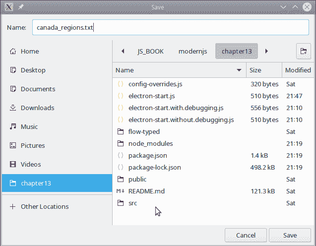

单击按钮会弹出一个保存屏幕，指定要将结果保存到哪个文件

如果单击“保存”，区域列表将以 JSON 格式编写，就像我们在`writeRegionsToDisk()`函数中指定的那样：

```js
[{"countryCode":"CA","regionCode":"1","regionName":"Alberta"},
{"countryCode":"CA","regionCode":"10","regionName":"Quebec"},
{"countryCode":"CA","regionCode":"11","regionName":"Saskatchewan"},
{"countryCode":"CA","regionCode":"12","regionName":"Yukon"},
{"countryCode":"CA","regionCode":"13","regionName":"Northwest Territories"},
{"countryCode":"CA","regionCode":"14","regionName":"Nunavut"},
{"countryCode":"CA","regionCode":"2","regionName":"British Columbia"},
{"countryCode":"CA","regionCode":"3","regionName":"Manitoba"},
{"countryCode":"CA","regionCode":"4","regionName":"New Brunswick"},
{"countryCode":"CA","regionCode":"5","regionName":"Newfoundland and Labrador"},
{"countryCode":"CA","regionCode":"7","regionName":"Nova Scotia"},
{"countryCode":"CA","regionCode":"8","regionName":"Ontario"},
{"countryCode":"CA","regionCode":"9","regionName":"Prince Edward Island"}]
```

最后要注意的细节是，您的应用程序现在无法在浏览器中运行，您将不得不习惯看到以下截图中的内容，即使您的代码在`Electron`中运行良好：

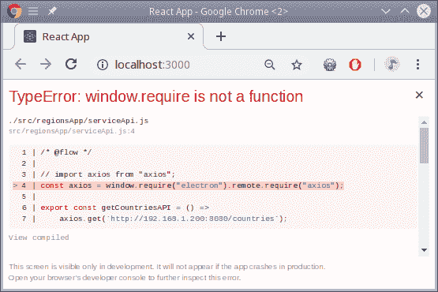

如果使用 Node 或 Electron 的功能，您的代码将不再在浏览器中运行，尽管它在 Electron 中的表现良好

就是这样！毫不费力地，我们能够超越普通浏览器应用的限制。您可以看到在`Electron`应用程序中几乎没有限制。

# 构建更窗口化的体验

在上一个示例中，我们添加了使用`Node`提供的任何和所有功能的可能性。在这个示例中，让我们专注于使我们的应用程序更像窗口，具有图标、菜单等。我们希望用户真的相信他们正在使用一个本地应用程序，具有他们习惯的所有功能。以下是来自[`electronjs.org/docs/api`](https://electronjs.org/docs/api)的有趣主题列表的一些亮点，但还有许多其他可用选项：

| `clipboard` | 使用系统剪贴板进行复制和粘贴操作 |
| --- | --- |
| `dialog` | 显示用于消息、警报、打开和保存文件等的本机系统对话框 |
| `globalShortcut` | 检测键盘快捷键 |
| `Menu`，`MenuItem` | 创建带有菜单和子菜单的菜单栏 |
| `Notification` | 添加桌面通知 |
| `powerMonitor`，`powerSaveBlocker` | 监控电源状态变化，并禁用进入睡眠模式 |
| `screen` | 获取有关屏幕、显示器等的信息 |
| `Tray` | 向系统托盘添加图标和上下文菜单 |

让我们添加一些这些功能，以便我们可以获得一个外观更好、更与桌面集成的应用程序。

# 如何做...

任何体面的应用程序可能至少应该有一个图标和一个菜单，可能还有一些键盘快捷键，所以让我们现在添加这些功能，并且仅仅是为了这个缘故，让我们也为区域写入磁盘时添加一些通知。连同我们已经使用的保存对话框，这意味着我们的应用程序将包括几个本机窗口功能。让我们实施以下步骤，并了解如何添加这些额外功能。

首先，让我们添加一个图标。显示图标是最简单的事情，因为在创建`BrowserWindow()`对象时只需要一个额外的选项。我不太擅长*图形视觉设计*，所以我只是从 Icon-Icons 网站上下载了 Alphabet, letter, r Icon Free 文件，网址是[`icon-icons.com/icon/alphabet-letter-r/62595`](https://icon-icons.com/icon/alphabet-letter-r/62595)。实现图标如下：

```js
mainWindow = new BrowserWindow({
    height: 768,
    width: 1024,
 icon: "./src/regionsApp/r_icon.png"
});
```

您还可以为系统托盘选择图标，尽管在该上下文中无法使用我们的区域应用程序，但您可能仍然希望了解一下。

在构建时，还有另一种方法可以向应用程序添加图标，即在`package.json`的``"build"``条目中添加额外的配置项。

接下来，我们将添加的第二个功能是一个菜单，还有一些全局快捷键。在我们的`App.regions.js`文件中，我们需要添加几行来访问`Menu`模块，并定义我们自己的菜单：

```js
// Source file: src/App.regions.js

.
.
.

import { getRegions } from "./regionsApp/world.actions";

.
.
.

const electron = window.require("electron").remote;
const { Menu } = electron;

const template = [
    {
        label: "Countries",
        submenu: [
            {
                label: "Uruguay",
                accelerator: "Alt+CommandOrControl+U",
                click: () => store.dispatch(getRegions("UY"))
            },
            {
                label: "Hungary",
                accelerator: "Alt+CommandOrControl+H",
                click: () => store.dispatch(getRegions("HU"))
            }
        ]
    },
    {
        label: "Bye!",
        role: "quit"
    }
];

const mainMenu = Menu.buildFromTemplate(template);
Menu.setApplicationMenu(mainMenu);
```

使用模板是创建菜单的一种简单方法，但您也可以手动执行，逐个添加项目。我决定有一个国家菜单，有两个选项，可以显示乌拉圭（我出生的地方）和匈牙利（我父亲的父亲来自的地方）的地区。`click`属性会分派适当的操作。我还使用`accelerator`属性来定义全局快捷键。请参阅[`github.com/electron/electron/blob/master/docs/api/accelerator.md`](https://github.com/electron/electron/blob/master/docs/api/accelerator.md)以获取可以使用的可能键组合的列表，包括以下内容：

+   *命令键*，如`Command`（或`Cmd`），`Control`（或`Ctrl`），或两者（`CommandOrControl`或`CmdOrCtrl`）

+   *备用键*，如`Alt`，`AltGr`或`Option`

+   *常用键*，如`Shift`，`Escape`（或`Esc`），`Tab`，`Backspace`，`Insert`或`Delete`

+   *功能键*，如`F1`到`F24`

+   光标键，包括`上`，`下`，`左`，`右`，`Home`，`End`，`PageUp`和`PageDown`

+   *媒体键*，如`MediaPlayPause`，`MediaStop`，`MediaNextTrack`，`MediaPreviousTrack`，`VolumeUp`，`VolumeDown`和`VolumeMute`

我还希望能够退出应用程序（不要紧，`Electron`创建的窗口已经有一个×图标来关闭它！）-这是一个预定义的*角色*，您不需要做任何特殊的事情。可以在[`electronjs.org/docs/api/menu-item#roles`](https://electronjs.org/docs/api/menu-item#roles)找到完整的角色列表。有了这些角色，您可以做很多事情，包括一些特定的 macOS 功能，以及以下内容：

+   使用剪贴板（`剪切`，`复制`，`粘贴`和`粘贴并匹配样式`）

+   处理窗口（`最小化`，`关闭`，`退出`，`重新加载`和`强制重新加载`）

+   缩放（`放大`，`缩小`和`重置缩放`）

最后，也只是为了这个缘故，让我们为文件写入时添加一个通知触发器。`Electron`有一个`Notification`模块，但我选择使用`node-notifier`，这个模块非常简单易用。首先，我们将以通常的方式添加这个包：

```js
npm install node-notifier --save
```

在`serviceApi.js`中，我们将不得不导出新的函数，这样我们就可以从其他地方导入，我们很快就会看到：

```js
const electron = window.require("electron").remote;

.
.
.

export const notifier = electron.require("node-notifier");
```

最后，让我们在我们的`world.actions.js`文件中使用它：

```js

import {
 notifier,
    .
    .
    .
} from "./serviceApi";
```

有了所有的设置，实际发送通知非常简单，需要的代码很少：

```js
// Source file: src/regionsApp/world.actions.js

.
.
.

export const saveRegionsToDisk = () => async (
    dispatch: ({}) => any,
    getState: () => { regions: [] }
) => {
    showSaveDialog((filename: string = "") => {
        if (filename) {
            writeFile(filename, JSON.stringify(getState().regions), e => {
 if (e) {
 window.console.log(`ERROR SAVING ${filename}`, e);
 } else {
 notifier.notify({
 title: "Regions app",
 message: `Regions saved to ${filename}`
 });
 }
            });
        }
    });
};
```

我们准备好了！让我们看看我们更*窗口化*的应用现在是什么样子。

# 工作原理...

首先，我们可以轻松检查图标是否出现。请参阅以下屏幕截图，并将其与本章的第一个屏幕截图进行比较：

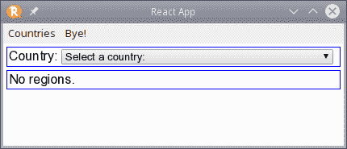

我们的应用现在有了自己的图标，可能不是太独特或原创，但总比没有好

现在，让我们看看菜单。它有我们的选项，包括快捷键：

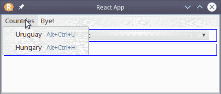

我们的应用现在也有一个菜单，就像任何值得尊敬的应用程序一样

然后，如果我们选择一个选项（比如乌拉圭），无论是用鼠标还是全局快捷键，屏幕都会正确加载预期的区域：

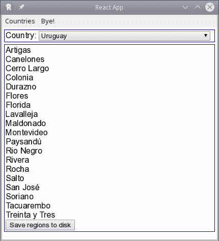

菜单项按预期工作；我们可以使用乌拉圭选项来查看我的国家的 19 个部门

最后，让我们看看通知是否按预期工作。如果我们点击“保存区域到磁盘”按钮并选择一个文件，我们将看到一个通知，如下面的屏幕截图所示：

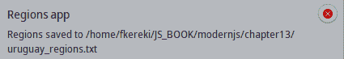

现在保存文件会显示通知；在这种情况下，是为了 Linux 与 KDE

我们已经看到如何扩展我们的浏览器页面以包括`Node`功能和窗口本地函数。现在，让我们回到更基本的要求，学习如何测试和调试我们的代码。

# 测试和调试您的应用程序

现在，我们来到了一个常见的要求：测试和调试您的应用程序。我必须告诉您的第一件事是，关于测试方面没有什么新闻！我们为测试浏览器和`Node`代码所看到的所有技术仍然适用，因为您的`Electron`应用程序本质上只是一个浏览器应用程序（尽管可能具有一些额外功能），您将以与之前相同的方式模拟它，因此在这里没有新东西需要学习。

然而，就调试而言，由于您的代码不是在浏览器中运行，因此将会有一些新的要求。与`React Native`类似，我们将不得不使用一些工具，以便能够在代码运行时查看我们的代码。让我们在本节中看看如何处理所有这些。

# 如何做...

我们想要安装和配置所有必要的调试工具。让我们在本节中完成这些。调试的关键工具将是`electron-devtools-installer`，您可以从[`github.com/MarshallOfSound/electron-devtools-installer`](https://github.com/MarshallOfSound/electron-devtools-installer)获取。我们将使用一个简单的命令安装它，以及之前使用过的`Redux Devtools`扩展：

```js
npm install electron-devtools-installer redux-devtools-extension --save-dev
```

要使用`Redux Devtools`，我们将首先修复存储，就像我们之前做的那样；这里没有什么新东西：

```js
// Source file: src/regionsApp/store.with.redux.devtools.js

/* @flow */

import { createStore, applyMiddleware } from "redux";
import { composeWithDevTools } from "redux-devtools-extension";
import thunk from "redux-thunk";

import { reducer } from "./world.reducer";

export const store = createStore(
    reducer,
 composeWithDevTools(applyMiddleware(thunk))
);
```

对于工具本身，我们还需要稍微调整我们的起始代码：

```js
// Source file: electron-start.with.debugging.js

/* @flow */

const { app, BrowserWindow } = require("electron");
const {
 default: installExtension,
 REACT_DEVELOPER_TOOLS,
 REDUX_DEVTOOLS
} = require("electron-devtools-installer");

let mainWindow;

const createWindow = () => {
    mainWindow = new BrowserWindow({
        height: 768,
        width: 1024
    });
    mainWindow.loadURL("http://localhost:3000");

 mainWindow.webContents.openDevTools();

 installExtension(REACT_DEVELOPER_TOOLS)
 .then(name => console.log(`Added Extension: ${name}`))
 .catch(err => console.log("An error occurred: ", err));

 installExtension(REDUX_DEVTOOLS)
 .then(name => console.log(`Added Extension: ${name}`))
 .catch(err => console.log("An error occurred: ", err));

    mainWindow.on("closed", () => {
        mainWindow = null;
    });
};

app.on("ready", createWindow);

app.on("activate", () => mainWindow === null && createWindow());

app.on(
    "window-all-closed",
    () => process.platform !== "darwin" && app.quit()
);
```

好消息是，您可以从代码中添加所有工具，无需特殊安装或其他程序。进行这些简单的更改后，您就完成了；现在，让我们看看它的工作原理！

# 工作原理...

如果您启动修改后的代码，您将看到`Electron`窗口现在包括经典的 Chrome 工具，包括`React`和`Redux`。请参阅以下屏幕截图：

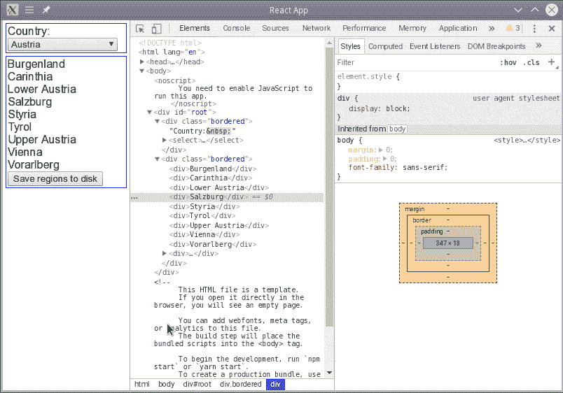

electron-devtools-installer 包让您通过简单的程序添加所需的所有工具

除了控制台，您还可以使用`React Devtools`来检查组件：

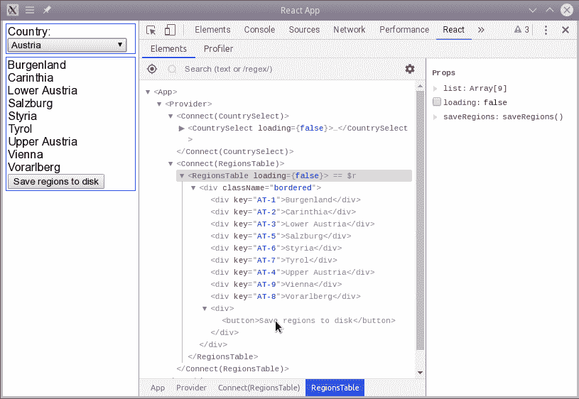

React Devtools 可用于检查组件及其属性

同样，`Redux DevTools`让您检查操作和存储。请参阅以下屏幕截图：

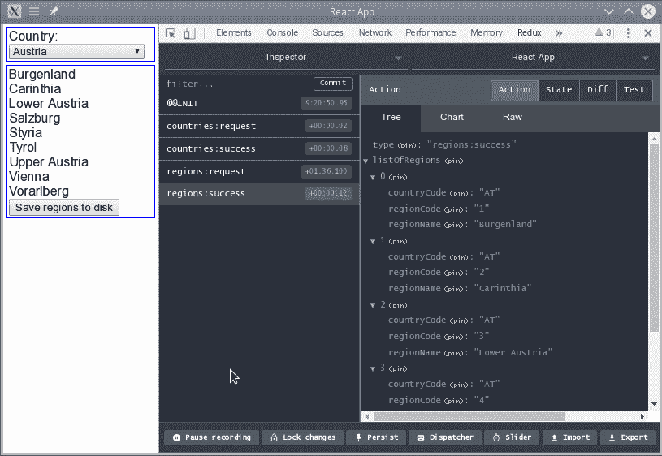

您还安装了 Redux 开发者工具，可以让您检查与 Redux 相关的所有内容

正如您所看到的，我们已经习惯的所有工具都有了，只有一个例外——网络调用呢？让我们现在来看看。

# 还有更多...

您可能已经注意到，网络选项卡不显示应用程序发出的 API 调用。在 RN 中，我们解决了这个问题，因为我们使用的工具包括检查所有网络流量的功能，但在这里不会发生这种情况。因此，我们将不得不做一些额外的工作，而不是一个简单的自动化解决方案。如果您使用`axios`进行所有 API 调用，您可以简单地修改其原始方法以生成日志：

```js
// Source file: src/regionsApp/serviceApi.js

.
.
.

axios.originalGet = axios.get;
axios.get = (uri, options, ...args) =>
    axios.originalGet(uri, options, ...args).then(response => {
        console.log(`GET ${uri}`, {
            request: { uri, options, ...args },
            response
        });
        return response;
    });
```

所示的更改将导致每个成功的`GET`都记录您需要的所有内容，就像以下屏幕截图中所示：

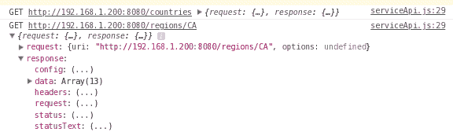

我们修改后的`axios.get()`方法产生了令人满意的日志

当然，这只是所需更改的冰山一角。您将不得不为失败的调用添加代码（因此，在`.catch()`中添加一些日志），您还将希望对其他方法（`.post()`、`.delete()`等）进行此类更改，但必要的代码很简单，所以我将把它作为读者的练习留下！

# 制作可分发的软件包

现在我们有了一个完整的应用程序，剩下的就是将其打包，以便您可以将其作为可执行文件交付给 Windows、Linux 或 macOS 用户。让我们通过本节来看看如何做到这一点。

# 如何做...

有许多打包应用程序的方法，但我们将使用一个名为`electron-builder`的工具，如果您能正确配置它，将使这一切变得更加容易！

您可以在[`www.electron.build/`](https://www.electron.build/)上阅读有关`electron-builder`、其功能和配置的更多信息。

让我们看看必要的步骤。首先，我们将不得不开始定义构建配置，我们的初始步骤将是，像往常一样，安装工具：

```js
npm install electron-builder --save-dev
```

要访问添加的工具，我们需要一个新的脚本，我们将在`package.json`中添加：

```js
"scripts": {
 "dist": "electron-builder",
    .
    .
    .
}
```

我们还需要向`package.json`添加一些更多的细节，这些细节对于构建过程和生成的应用程序是必需的。特别是，需要更改`homepage`，因为 CRA 创建的`index.html`文件使用绝对路径，这些路径将无法与`Electron`后来一起使用：

```js
"name": "chapter13",
"version": "0.1.0",
"description": "Regions app for chapter 13",
"homepage": "./",
"license": "free",
"author": "Federico Kereki",
```

最后，将需要一些特定的构建配置。您不能在 Linux 或 Windows 机器上构建 macOS，因此我将不包括该配置。我们必须指定文件的位置，要使用的压缩方法等等：

```js
"build": {
    "appId": "com.electron.chapter13",
    "compression": "normal",
    "asar": true,
    "extends": null,
    "files": [
        "electron-start.js",
        "build/**/*",
        "node_modules/**/*",
        "src/regionsApp/r_icon.png"
    ],
    "linux": {
        "target": "zip"
    },
    "win": {
        "target": "portable"
    }
}
```

在[`www.electron.build/multi-platform-build`](https://www.electron.build/multi-platform-build)上阅读有关为不同平台构建的更多信息。有关所有配置选项的更多信息，请参阅[`www.electron.build/configuration/configuration#configuration`](https://www.electron.build/configuration/configuration#configuration)。

我们已经完成了所需的配置，但代码本身也需要做一些更改，我们将不得不调整代码以构建包。当打包的应用程序运行时，将不会有 webpack 服务器运行；代码将从构建的`React`包中获取。此外，您不希望包含调试工具。因此，起始代码将需要以下更改：

```js
// Source file: electron-start.for.builder.js

/* @flow */

const { app, BrowserWindow } = require("electron");
const path = require("path");
const url = require("url");

let mainWindow;

const createWindow = () => {
    mainWindow = new BrowserWindow({
        height: 768,
        width: 1024,
 icon: path.join(__dirname, "./build/r_icon.png")
    });
    mainWindow.loadURL(
 url.format({
 pathname: path.join(__dirname, "./build/index.html"),
 protocol: "file",
 slashes: true
 })
    );
    mainWindow.on("closed", () => {
        mainWindow = null;
    });
};

app.on("ready", createWindow);

app.on("activate", () => mainWindow === null && createWindow());

app.on(
    "window-all-closed",
    () => process.platform !== "darwin" && app.quit()
);
```

主要是，我们正在从`build/`目录中获取图标和代码。`npm run build`命令将负责生成该目录，因此我们可以继续创建我们的可执行应用程序。

# 它是如何工作的...

完成此设置后，构建应用程序基本上是微不足道的。只需执行以下操作，所有可分发文件将在`dist/`目录中找到：

```js
npm run electron-builder
```

您可能希望在`.gitignore`文件中添加一行，以便不提交分发目录。我在我的文件中包含了`**/dist`行，与之前的`**/node_modules`和`**/dist`现有行相对应。

现在我们有了 Linux 应用程序，我们可以通过解压`.zip`文件并单击`chapter13`可执行文件来运行它。（名称来自`package.json`中的``"name"``属性，我们之前修改过。）结果应该像下面的截图所示：

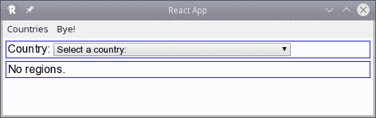

Linux 可执行文件作为本机应用程序运行，显示与我们之前看到的相同的屏幕。

我还想尝试一下 Windows 的`EXE`文件。由于我没有 Windows 机器，我通过从[`developer.microsoft.com/en-us/microsoft-edge/tools/vms/`](https://developer.microsoft.com/en-us/microsoft-edge/tools/vms/)下载免费的`VirtualBox`虚拟机来实现，它们只能使用 90 天，但我只需要几分钟。

下载虚拟机，将其设置在`VirtualBox`中，并最终运行它后，产生的结果与 Linux 的结果相同，如下面的截图所示：

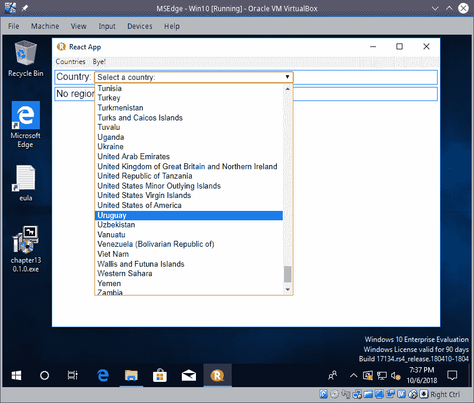

我们的本机 Windows 应用程序在 Windows 机器上同样运行

因此，我们已经成功开发了一个`React`应用程序，增强了`Node`和`Electron`功能，并最终为不同的操作系统打包了它。有了这个，我们就完成了！
