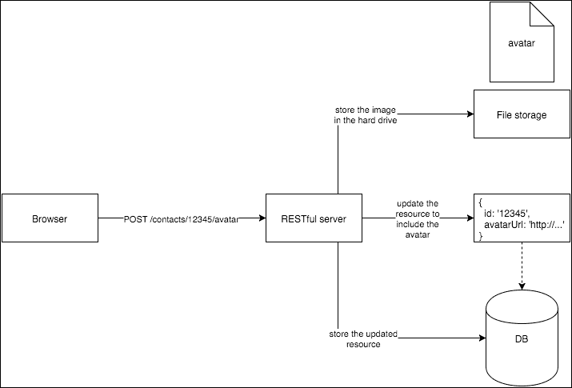
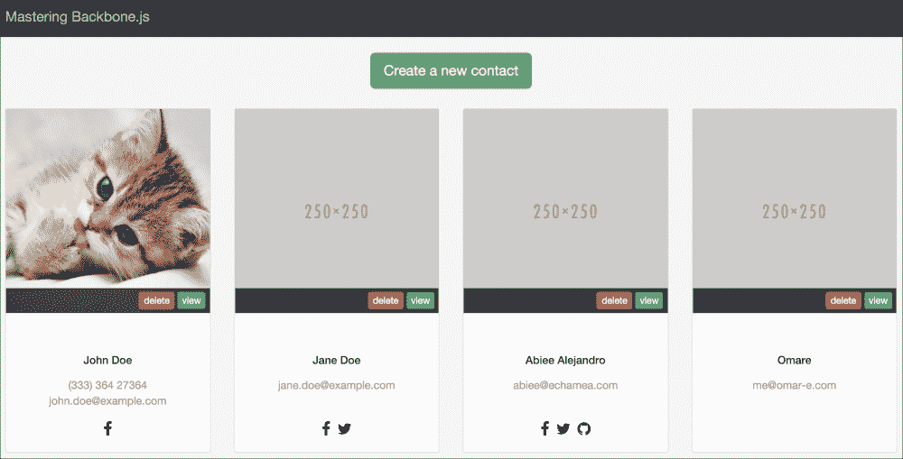
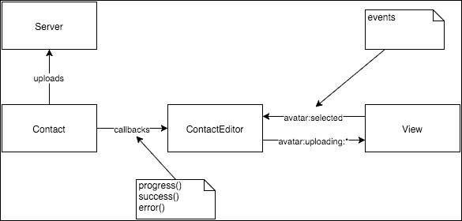
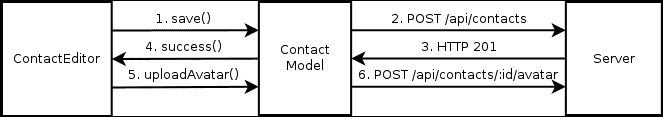

# 第五章。处理文件

当你构建一个 Backbone 应用程序时，你将从一个 RESTful 网络服务中消费资源；然而，大多数 RESTful 服务使用 JSON 格式来编码信息，但 JSON 不适合发送和接收文件。我们如何将文件发送到 RESTful 服务器？

如果你正在开发一个不是 JavaScript 密集型的应用程序，你可以通过 HTML 表单发送文件，但在 **单页应用程序**（**SPA**）中这不是最好的方法。另一个问题是 Backbone 不提供发送文件的简单机制，因为它与 RESTful 规范不兼容。

但是，Web 应用程序需要处理文件。有一些方法可以处理这个常见问题。例如，你可以在可能包含文件的资源上使用传统的 POST 表单；然而，这并不是一个好的选择。在本章中，你将学习以下内容：

+   从 Express 服务器处理文件上传

+   采用策略将文件发送到 RESTful 服务器

+   上传文件

+   创建包含文件的资源

我们将首先添加对 Express 服务器上传文件的支持，因为了解服务器如何响应上传请求是很重要的。

# Express 服务器

为了演示如何将文件发送到服务器，在本章中我们将使用 Express 的最新版本（撰写本文时可用的最新版本是 Express 4.x）。服务器将负责存储 REST 资源和处理文件上传。请查阅本书的 GitHub 仓库以获取前几章服务器的实现。

目前，当前服务器能够创建、获取、更新和删除联系人资源；我们需要添加一个机制来上传联系人的头像图片。为了简化，应用程序不使用数据库来存储其数据，而是使用散列表在内存中存储所有数据。例如，下面的代码片段演示了如何存储一个联系人：

```js
// Insert a new contact JSON into the contacts array
createContact(req, res) {
var contact = extractContactData(req);

  // Asssign a random id
  contact.id = makeId();
contacts.push(contact);

res.status(201)
.json(contact);
}
```

# 将文件附加到资源中

在我们开始在 Express 服务器接收文件之前，我们需要为它设置一个策略。我们仍然想使用 RESTful 服务，所以改变传输数据的格式不是一种选择。

尊重 RESTful 标准（有关文件上传的 REST 设计更多信息，请参阅 [`bit.ly/1GXqPNY`](http://bit.ly/1GXqPNY))，我们可以在目标资源下附加一个子资源端点来处理上传，这样就不会干扰原始资源。然而，这种方法有一个限制：资源必须先存在，这意味着你不能同时创建一个联系人和其头像照片。

按照这种方法，头像文件上传的端点可以定位在：

```js
http://example.com/api/contacts/10/avatar
```



图 5.1 文件上传方案

前面的图显示了服务器处理文件上传的架构；头像端点将处理编码为`multipart/form-data`的 POST 请求，而不是 JSON，因为这是使用 HTTP 协议上传文件的唯一方式。注意，在端点中包含了联系 ID；这样，一旦文件上传，我们就可以将文件与资源关联起来。尽管端点不接受 JSON 作为输入，但它可以返回 JSON 来通知处理过程：

```js
{
  "success": true,
  "avatar": {
    "file": "something.jpg",
    "url": "http://example.com/avatar/something.jpg"
  }
}
```

在这个示例结果中，服务器告诉我们可以通过`http://example.com/avatar/something.jpg` URL 访问头像。我们需要修改联系资源，以包含这个新信息：

```js
{
  "name": "John Doe",
  "email": "john.doe@example.com",
"avatar": {
    "file": "something.jpg",
    "url": "http://example.com/avatar/something.jpg"
  }

}
```

联系资源现在包括头像信息，以便可以在需要的地方使用它——例如，在联系人列表中。要显示头像图像，你只需要在`img`标签中包含头像 URL 即可。

服务器也应该能够提供这些文件。在最简单的流程中，你可以将所有头像图像放在一个公共路径中，并将该路径作为常规资源提供服务；这种方法的缺点是，如果有人知道文件名，任何人都可以看到文件。

# 上传头像照片到联系人

让我们先创建上传头像照片的端点：

```js
// routes.js
var controller = require('./controller');

//...
server.post('/api/contacts/:contactId/avatar', 
controller.uploadAvatar);

```

表达自身不自动处理文件；它需要一个插件，将原始请求转换为更用户友好的 API。这个插件名为`multer`；它处理`multipart/form-data`，将文件保存到临时路径或创建一个缓冲对象，然后提供一个包含元数据信息的 JSON 对象：

```js
// Avatar endpoints
var upload = multer();
server.post('/api/contacts/:contactId/avatar', upload.single('avatar'),
controller.uploadAvatar
);
server.use('/avatar', express.static(__dirname + '/avatar'));
```

默认配置下，它将所有上传的文件保存到操作系统的临时路径中，在 Unix 系统中是`/tmp`；`multer`将在`req`对象中附加一个`files`属性，我们可以检查它以检索有关上传文件的信息：

```js
uploadAvatar(req, res, next) {
varcontactId = req.params.contactId;
var filename, fullpath;

  // Ensure that user has sent the file
  if (!_.has(req, 'file')) {
    return res.status(400).json({
      error: 'Please upload a file in the avatar field'
    });
  }

  // File should be in a valid format
var metadata = req.file;
  if (!isValidImage(metadata.mimetype)) {
res.status(400).json({
      error: 'Invalid format, please use jpg, png or gif files'
    });
    return next();
  }

  // Get target contact from database
var contact = _.find(contacts, 'id', contactId);
  if (!contact) {
res.status(404).json({
      error: 'contact not found'
    });
    return next();
  }

  // Ensure that avatar path exists
  if (!fs.existsSync(AVATAR_PATH)) {
fs.mkdirSync(AVATAR_PATH);
  }

  // Ensure unique filename to prevent name colisions
var extension = getExtension(metadata.originalname);
  do {
    filename = generateFilename(25, extension);
fullpath = generateFullPath(filename);
  } while(fs.existsSync(fullpath));

  // Remove previous avatar if any
removeAvatar(contact);

  // Save the file in disk
varwstream = fs.createWriteStream(fullpath);
wstream.write(metadata.buffer);
wstream.end();

  // Update contact by assingn the url of the uploaded file
contact.avatar = {
    file: filename,
url: generateURLForAvatar(filename)
  };

res.json({
    success: true,
    avatar: contact.avatar
  });
}
```

在第一步中，我们验证用户是否上传了有效的文件，然后从数据库中获取目标用户，如果不存在，则返回 Http `404`错误。`multer`插件将上传的文件存储在内存中，可以在将文件保存到最终路径之前进行处理；例如，我们可能想要生成缩略图文件或处理图像以节省磁盘空间。

我们确保头像路径存在；如果不存在，我们则创建该路径。在接下来的步骤中，我们生成一个要分配给上传文件的文件名，以防止文件名冲突；`generateFilename()`函数生成该文件名，然后检查它是否已存在；如果存在，则生成另一个文件名，依此类推。

一旦我们为上传的文件找到一个唯一的文件名，我们就将文件从内存缓冲区存储到生成的路径。现在文件在头像路径中，我们可以构建一个 URL，从浏览器中获取图像，并最终将 URL 分配给联系资源中的`avatar`字段。

## 显示头像

现在我们可以上传图片，并且联系资源包含了头像的位置信息，我们可以通过将 `img` 标签指向 `Contact` 模型中的 `avatar.url` 属性来在我们的视图中显示头像：

```js
<% if (avatar && avatar.url) { %>
<imgsrc="img/<%= avatar.url %>" alt="Contact photo" />
<% } else { %>
<imgsrc="img/250x250" alt="Contact photo" />
<% } %>
```

这将显示图片，如果没有则显示默认图片。我们应该修改 `Contact` 模型以包含默认头像：

```js
// apps/contacts/models/contact.js
'use strict';

var Backbone = require('backbone');

class Contact extends Backbone.Model {
// ...

  get defaults() {
    return {
      name: '',
      phone: '',
      email: '',
      address1: '',
      address2: '',
facebook: '',
      twitter: '',
      google: '',
github: '',
      avatar: null
    };
  }

// ...
}

module.exports = Contact;
```

如果从服务器未检索到头像图片，则使用空图片。以下截图显示了上传图片时的外观。这足以在需要的地方显示头像图片。显示图片非常简单。在本章的其余部分，我们将看到如何执行上传：



图 5.2 显示联系人的头像

# 从 Backbone 上传图片

为了允许我们从 Backbone 应用程序上传文件，我们应该创建一个输入文件以显示 **选择** 文件对话框。这可以通过在 `ContactEditor` 子应用程序中更改 `ContactPreview` 类来实现，以添加此功能。因此，让我们更改当前模板并添加输入：

```js
<div class="box thumbnail">
<div class="photo">
<% if (avatar && avatar.url) { %>
<imgsrc="img/<%= avatar.url %>" alt="Contact photo" />
<% } else { %>
<imgsrc="img/250x250" alt="Contact photo" />
<% } %>
<input id="avatar" name="avatar" type="file" 
style="display: none" />
</div>
<!-- ... -->
</div>
```

注意我们创建了一个隐藏的输入文件字段；我们不希望显示输入字段，但希望控件打开 **选择文件** 对话框。由于输入是隐藏的，当用户点击当前图片时，我们将显示文件选择器：

```js
// apps/contacts/views/contactPreview.js
class ContactPreview extends ModelView {
// ...

  get events() {
    return {
      'click img': 'showSelectFileDialog'
    };
  }

showSelectFileDialog() {
    $('#avatar').trigger('click');
  }

  // ...
}
```

当用户点击图片时，它会在输入上触发一个点击事件；这将打开 **打开文件** 对话框，并允许用户从其硬盘驱动器中选择文件。用户选择文件后，浏览器会在文件输入上触发一个 `change` 事件，我们可以使用该事件来处理选择：

```js
// apps/contacts/views/contactPreview.js
class ContactPreview extends ModelView {
// ...

  get events() {
    return {
      'click img': 'showSelectFileDialog',
'change #avatar': 'fileSelected'
    };
  }

  // ...
}
```

`change` 事件将调用 `fileSelected()` 方法，该方法负责处理所选文件。正如我们在 第一章 中所看到的，*Backbone 应用程序的架构* 视图不应直接与服务器通信；因此，视图不应进行任何 `AJAX` 调用。

最好的上传图片位置是在 `Contact` 模型中，因此视图应该只获取所选文件并将此过程委托给控制器：

```js
// apps/contacts/views/contactPreview.js
class ContactPreview extends ModelView {
  // ...

fileSelected(event) {
event.preventDefault();

var $img = this.$('img');

    // Get a blob instance of the file selected
var $fileInput = this.$('#avatar')[0];
varfileBlob = $fileInput.files[0];

    // Render the image selected in the img tag
varfileReader = new FileReader();
fileReader.onload = event => {
      $img.attr('src', event.target.result);

      // Set the avatar attribute only if the
      // model is new
      if (this.model.isNew()) {
this.model.set({
          avatar: {
url: event.target.result
          }
        });
      }
    };
fileReader.readAsDataURL(fileBlob);

this.trigger('avatar:selected', fileBlob);
  }
}
```

当选择文件时，我们创建一个 `blob` 对象，并触发一个带有对象的事件，由控制器进行处理。注意我们使用 HTML 5 API 立即显示所选图片作为头像预览：

```js
// apps/contacts/contactEditor.js
class ContactEditor {
// ...

showEditor(contact) {
    // ...

this.listenTo(contactPreview, 'avatar:selected', blob => {
this.uploadAvatar(contact, blob);
    });
  }
}
```

`uploadAvatar()` 方法接受一个文件 blob 作为参数，并将服务器连接委托给 `Contact` 模型：

```js
// apps/contacts/contactEditor.js
class ContactEditor {
// ...

uploadAvatar(contact, blob) {
    // Tell to others that upload will start
this.trigger('avatar:uploading:start');

contact.uploadAvatar(blob, {
      progress: (length, uploaded, percent) => {
        // Tell to others that upload is in progress
this.trigger('avatar:uploading:progress',
                     length, uploaded, percent);
      },
      success: () => {
        // Tell to others that upload was done successfully
this.trigger('avatar:uploading:done');
      },
      error: err => {
        // Tell to others that upload was error
this.trigger('avatar:uploading:error', err);
      }
    });
  }
}
```

控制器将触发 `'avatar:uploading:*'` 事件以反映上传过程的状态。这些事件可以被视图监听，以向用户提供视觉反馈。图 5.3 图形化地显示了控制器和视图之间的通信：



图 5.3 视图和控制器之间的事件通信

联系模型中的 `uploadEvent()` 方法接受一个 blob 对象作为第一个参数，这是将要上传的文件，以及一个 `options` 对象，其中包含三个可能被调用的函数，这些函数将在与服务器通信的过程中被调用。

如你所猜，如果服务器接受文件或发生错误，将分别调用 `success` 和 `error` 回调。大文件将被分割并分块上传到服务器；当块在服务器上接收时，将调用 `progress()` 回调。通过 `progress()` 处理程序提供的信息，我们可以更新进度条以向用户显示进度：

```js
// apps/contacts/views/contactPreview.js
class ContactPreview extends ModelView {
  constructor(options) {
    super(options);
this.template = template;

this.model.on('change', this.render, this);

    if (options.controller) {
this.listenTo(
options.controller, 'avatar:uploading:start',
this.uploadingAvatarStart, this
      );
this.listenTo(
options.controller, 'avatar:uploading:done',
this.uploadingAvatarDone, this
      );
this.listenTo(
options.controller, 'avatar:uploading:error',
this.uploadingAvatarError, this
      );
    }
  }

uploadingAvatarStart() {
this.originalAvatarMessage = this.$('span.info').html();
this.$('span.notice').html('Uploading avatar...');
  }

uploadingAvatarDone() {
this.$('span.notice').html(this.originalAvatarMessage || '');
  }

uploadingAvatarError() {
this.$('span.notice').html(
'Can\'t upload image, try again later'
);
  }
}
```

由于事件是由控制器触发的，视图更新显示给用户的消息，因此用户可以看到是否发生错误，或者提供上传消息以显示应用程序正在执行的操作。

我们应该在创建时将控制器实例传递给视图：

```js
class ContactEditor {
// ...

showEditor(contact) {
    // ...
varcontactPreview = new ContactPreview({
      controller: this,
      model: contact
    });
  }
}
```

## 使用 AJAX 上传文件

`Client` 模型接收 blob 对象，构建到 `avatar` 端点的 URL，并对回调对象进行适当的调用：

```js
// apps/contacts/models/contact.js
class Contact extends Backbone.Model {
  // ...

uploadAvatar(imageBlob, options) {
    // Create a form object to emulate a multipart/form-data
varformData = new FormData();
formData.append('avatar', imageBlob);

varajaxOptions = {
url: '/api/contacts/' + this.get('id') + '/avatar',
      type: 'POST',
      data: formData,
      cache: false,
contentType: false,
processData: false
    };

    options = options || {};

    // Copy options to ajaxOptions
_.extend(ajaxOptions, _.pick(options, 'success', 'error'));

    // Attach a progress handler only if is defined
    if (options.progress) {
ajaxOptions.xhr = function() {
varxhr = $.ajaxSettings.xhr();

        if (xhr.upload) {
          // For handling the progress of the upload
xhr.upload.addEventListener('progress', event => {
            let length = event.total;
            let uploaded = event.loaded;
            let percent = uploaded / length;

options.progress(length, uploaded, percent);
          }, false);
        }

        return xhr;
      };
    }

$.ajax(ajaxOptions);
  }

  // ...
}
```

看看模型如何从其自身数据构建端点，这样视图就可以与任何服务器连接解耦。由于 `multipart/form-data` `POST` 不会被浏览器原生管理，我们应该创建一个表示表单数据结构的 `FormData` 对象，并添加一个 `avatar` 字段（服务器期望的字段名）。

在 `$.ajax()` 调用中，键属性是 `processData`，设置为 `false`；你可以在 jQuery 文档中阅读以下内容：

默认情况下，传递给数据选项的对象（技术上，任何非字符串）将被处理并转换成查询字符串，适合默认的内容类型 "application/x-www-form-urlencoded"。如果你想要发送一个 DOMDocument 或其他未处理的数据，请将此选项设置为 false。

如果你不将此属性设置为 `false`，或者保留默认值，jQuery 将尝试转换 `formData` 对象，文件将不会发送。

如果在 `options` 对象中设置了进度属性，我们将覆盖 jQuery 调用的原始 `xhr()` 函数以获取 `XMLHttpRequest` 对象实例；这允许我们在上传文件时监听浏览器触发的 `progress` 事件。

# 在创建时上传头像图像

如我们所见，要上传并附加文件到资源，该资源必须已经存在。我们如何创建一个带有附件的文件资源？我们如何创建一个包含头像图像的联系人？

要这样做，我们需要分两步创建资源。在第一步中，我们创建资源本身，然后在第二步中，我们可以上传所有我们想要上传到该资源的文件。是的，这不可能在单个服务器连接中完成，至少在没有对要发送的文件进行编码的情况下：



图 5.4 创建联系过程

前面的图示显示了这个过程是如何进行的。注意，模型负责处理这些连接，而控制器则协调通信的顺序和错误处理。正如我们之前看到的，`ContactEditor` 触发了几个视图可以使用的事件，向用户展示正在发生的事情。

视图可以保持原样；我们只需通过更改 `saveContact()` 方法的行为来修改 `ContactEditor` 控制器。然而，我们希望保留用户在做出选择时上传图片的功能。如果联系人模型是新的，此功能将破坏应用程序，因为没有有效的端点来上传头像：

```js
class ContactEditor {
// ...

showEditor(contact) {
    // ...

    // When avatar is selected, we can save it inmediatly if the
    // contact already exists on the server, otherwise just
    // remember the file selected
this.listenTo(contactPreview, 'avatar:selected', blob => {
this.avatarSelected = blob;

      if (!contact.isNew()) {
this.uploadAvatar(contact);
      }
    });
  }
}
```

当选择头像时，我们不会立即将文件上传到服务器，而是检查联系人是否是新的。如果模型不是新的，我们可以通过调用 `uploadAvatar()` 方法来执行上传；否则，我们将在 `avatarSelected` 属性中保留 blob 对象的引用，`uploadAvatar()` 方法将在被调用时使用它。

`saveContact()` 方法负责协调前面图示中描述的算法：

```js
// apps/contacts/contactEditor.js
class ContactEditor {
saveContact(contact) {
varphonesData = this.phones.toJSON();
varemailsData = this.emails.toJSON();

contact.set({
      phones: phonesData,
      emails: emailsData
    });

    if (!contact.isValid(true)) {
      return;
    }

varwasNew = contact.isNew();

    // The avatar attribute is read-only
    if (contact.has('avatar')) {
contact.unset('avatar');
    }

    function notifyAndRedirect() {
      // Redirect user to contact list after save
App.notifySuccess('Contact saved');
App.router.navigate('contacts', true);
    }

contact.save(null, {
      success: () =>{
        // If we are not creating an user it's done
        if (!wasNew) {
notifyAndRedirect();
          return;
        }

        // On user creation send the avatar to the server too
this.uploadAvatar(contact, {
          success: notifyAndRedirect
        });
      },
error() {
        // Show error message if something goes wrong
App.notifyError('Something goes wrong');
      }
    });
  }
  // ...
}
```

在调用联系人模型的 `save()` 方法之前，有必要保存模型是否是新的；如果我们在此方法之后调用它，`isNew()` 方法将始终返回 `true`。

如果模型不是新的，那么头像图像的任何更改已经通过 `'avatar:selected'` 事件处理程序上传，所以我们不需要再次上传图像。但如果图像是新的，那么我们应该通过调用 `uploadAvatar()` 方法来上传头像；请注意，该方法接受一个 `options` 对象来注册回调。这是必要的，以便向用户提供反馈；上传完成后，它调用 `notifyAndRedirect()` 函数来显示通知消息，并返回到联系人列表。

我们需要更改 `uploadAvatar()` 的实现，以包括前面描述的回调，并立即在它使用 `avatarSelected` 属性时接收 blob：

```js
// apps/contacts/contactEditor.js
uploadAvatar(contact, options) {
  // Tell to others that upload will start
this.trigger('avatar:uploading:start');

contact.uploadAvatar(this.avatarSelected, {
    progress: (length, uploaded, percent) => {
      // Tell to others that upload is in progress
this.trigger('avatar:uploading:progress',
                   length, uploaded, percent);
      if (options &&_.isFunction(options.success)) {
options.success();
      }
    },
    success: () => {
      // Tell to others that upload was done successfully
this.trigger('avatar:uploading:done');
    },
    error: err => {
      // Tell to others that upload was error
this.trigger('avatar:uploading:error', err);
    }
  });
}
```

方法基本上是相同的；我们只是添加了 `options` 回调，并更改了 blob 对象的来源。

# 编码上传文件

上传文件的另一种方法是将其编码为 `base64`。当你将二进制文件编码为 `base64` 时，结果是我们可以用作请求对象属性的字符串。

虽然在资源中创建附加文件的对象或将其用作服务器上的另一个资源可能很有用，但这不是推荐的方法。这种方法有一些限制：

+   如果后端服务器是节点，线程将锁定，直到服务器解码 `base64` 字符串。这将导致性能低下的应用程序。

+   你不能上传大量数据。

+   如果文件很大，Backbone 应用程序将冻结，直到文件被编码为 `base64`。

如果你上传的数据量非常小，并且没有大量的流量，你可以使用这种技术；否则，我鼓励你避免使用。我们不必上传文件，可以对其进行编码：

```js
class ContactEditor {
  // ...

showEditor(contact) {
      // ...
this.listenTo(contactPreview, 'avatar:selected', blob => {
this.setAvatar(contact, blob);
    });
  }

setAvatar(contact, blob) {
varfileReader = new FileReader();

fileReader.onload = event => {
      let parts = event.target.result.split(',');
contact.set('avatarImage', parts[1]);
    };

fileReader.readAsDataURL(blob);
  }
}
```

当然，服务器实现应该能够解码`avatarImage`并将其存储为图像文件。

# 摘要

在本章中，我们看到了如何将文件上传到服务器；这不是唯一的方法，但这是更广泛和灵活的方法。另一种可能的方法是在浏览器中将图像序列化为`base64`，然后将输出字符串设置为模型中的属性；当保存十个模型时，编码为`base64`的文件将成为有效负载的一部分。服务器应该解码字符串并将结果作为文件处理。

我们看到了如何将视图与业务逻辑解耦。视图应该只处理 DOM 事件并触发业务逻辑级别的事件；然后控制器可以处理 blob 对象而不是低级别的 DOM 节点。这种方法帮助我们将上传处理从视图移动到模型，这是理想的做法。

最后，我们处理了创建过程；我们不能同时创建资源并附加文件。我们应该首先创建资源，然后根据需要将所有文件发送到服务器。

在下一章中，你将学习如何直接在浏览器中存储信息。与其使用 RESTful 服务器，不如运行不需要服务器即可运行的独立 Web 应用程序。
