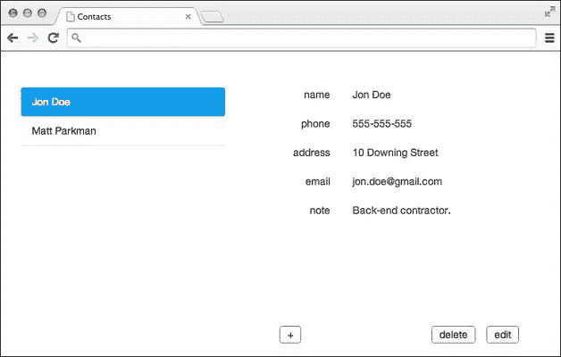
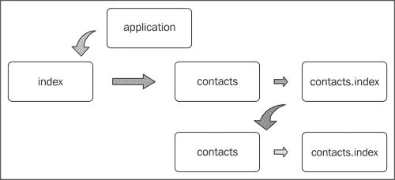
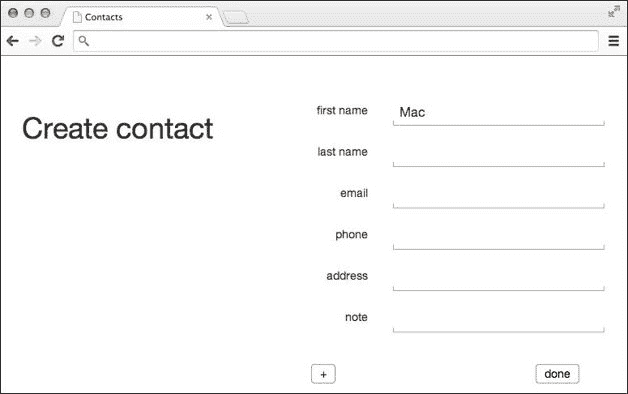

# 第三章. 路由和状态管理

在本章中，我们将学习基于 URL 的状态管理在 Ember.js 中的应用，这构成了**路由**。路由使我们能够将应用程序中的不同状态转换为 URL，反之亦然。这是 Ember.js 中的一个关键概念，使开发者能够轻松地分离应用程序逻辑。它还使用户能够通过通常的 HTTP URL 链接回应用程序中的内容。话虽如此，到本章结束时，我们应该能够完成以下任务：

+   创建一个路由器

+   定义资源和路由

+   定义路由的模型

+   执行重定向

+   实现异步路由

# 创建应用程序的路由器

我们都知道，在传统的 Web 开发中，每个请求都通过一个 URL 与服务器相连，这使得服务器能够对传入的请求做出决策。典型的操作包括发送资源文件或 JSON 有效负载、将请求重定向到不同的资源，或者在未经授权访问的情况下发送错误响应。

Ember.js 通过在浏览器环境中实现这些 URL 与应用程序状态的关联，力求保留这些理念。管理这些状态的主要组件是应用程序路由器。正如引言部分所述，它负责将应用程序恢复到与给定 URL 匹配的状态。它还允许用户按预期在应用程序的历史记录中导航。路由器在应用程序初始化时自动创建，可以引用为 `MyApplicationNamespace.Router`。在我们继续之前，我们将使用捆绑的章节示例来更好地理解这个极其方便的组件。该示例是 Contacts OS X 应用程序的简单实现，如下面的截图所示：



它使用户能够添加新的联系人，以及编辑和删除现有的联系人。为了简单起见，我们不会支持头像，但这可以是读者在章节末尾的一个实现练习。

我们已经提到了一些应用程序可以转换到的状态。这些状态必须以与服务器端框架相同的方式进行注册，这些框架有 URL 分发器，后端程序员使用它将 URL 模式映射到视图。章节示例已经说明了如何定义这些可能的状态：

```js
// app.js

var App = Ember.Application.create();

App.Router.map(function() {
  this.resource('contacts', function(){
    this.route('new');
    this.resource('contact', {path: '/:contact_id'}, function(){
      this.route('edit');
    });
  });
  this.route('about');
});
```

注意，已经实例化的路由器被引用为 `App.Router`。调用其 `map` 方法给应用程序一个机会来注册其可能的状态。此外，还使用了两种其他方法来将这些状态分类为*路由*和*资源*。

# 将 URL 映射到路由

```js
map function takes a function as its only argument. Inside this function, we may define a resource using the corresponding method, which takes the following signature:
```

```js
this.resource(resourceName, options, function);
```

第一个参数指定了资源的名称，巧合的是，这也是匹配请求 URL 的路径。下一个参数是可选的，它包含我们可能需要指定的配置，我们将在稍后看到。最后一个是一个函数，用于定义特定资源的路由。例如，在示例中第一个定义的资源表示，让`contacts`资源处理以`/contacts`开头的任何请求。它还指定了一个`new`路由，用于处理新联系人的创建。另一方面，路由接受函数参数的相同参数。

你可能正在想，“那么路由和资源有什么不同？”这两者本质上是一样的，只是前者提供了一种对在特定实体上执行操作的状态（路由）进行分类的方法。我们可以将 Ember.js 应用程序想象成一棵树，由树干（路由器）、树枝（资源）和叶子（路由）组成。例如，`contact`状态（一个资源）为特定的联系人提供服务。这个资源可以以两种模式显示：读取和写入；因此，分别有`index`和`edit`路由，如下所示：

```js
this.resource('contact', {path: '/:contact_id'}, function(){
   this.route('index'); // auto defined
   this.route('edit');
});
```

由于 Ember.js 鼓励约定，路由和资源有两个组件总是自动定义的：

+   默认应用程序资源：这是所有其他资源定义的主资源。因此，我们不需要在路由器中定义它。不是每个状态都必须定义资源。例如，我们的`about`状态是一个路由，因为它只需要向用户显示静态内容。然而，它可以被认为是已经自动定义的应用程序资源的一个路由。

+   每个资源都有一个默认的`index`路由：再次强调，每个资源都有一个默认的索引路由。它是自动定义的，因为应用程序无法确定资源的状态。因此，如果在这个资源内部没有其他路由被打算使用，应用程序将使用这个路由。

# 资源嵌套

根据应用程序的架构，资源可以被嵌套。在我们的例子中，我们需要在向用户显示任何联系人之前，在侧边栏中加载联系人。因此，我们需要在`contacts`内部定义联系人资源。另一方面，在一个像 Twitter 这样的应用程序中，在`tweets`资源内部定义一个嵌套的`tweet`资源是没有意义的，因为当用户只想从外部应用程序查看单个推文时，将会产生额外的开销。

# 理解状态转换周期

请求的处理方式与水从根部（应用程序）向上流经树干，最终在叶子处流失的方式相同。我们这里所说的请求是指浏览器位置的变化，它可以以多种方式触发，我们将在下一章中了解更多。

在我们深入探讨路由的更详细细节之前，让我们讨论一下当应用程序首次加载时发生了什么。在启动时，发生了一些事情，如下所述：

+   应用程序首先转换到应用程序状态，然后是索引状态。

+   接下来，应用程序索引路由将请求重定向到联系人资源。

+   我们的应用程序使用浏览器的本地存储来存储联系人，因此为了演示目的，联系人资源使用固定值（位于`fixtures.js`）填充了这个存储。

+   应用程序随后转换到相应的联系人资源索引路由，`contacts.index`。

+   再次，我们根据我们的存储是否包含数据做出了一些决定。由于我们确实有数据，我们将应用程序重定向到联系人资源，并传递了第一个联系人的 ID。

+   正如在前两个资源中一样，应用程序从最后一个资源转换到相应的索引路由，`contact.index`。

下图给出了先前状态变化的好视角：



# 配置路由器

路由器可以通过以下方式自定义：

+   记录状态转换

+   指定根应用 URL

+   更改浏览器位置查找方法

在开发过程中，可能需要跟踪应用程序转换到的状态。启用这些日志非常简单：

```js
var App = Ember.Application.create({
 LOG_TRANSITIONS: true
});
```

如上图所示，我们在创建应用程序时启用了`LOG_TRANSITIONS`标志。如果一个应用程序不是在网站域的根目录下提供服务，那么可能需要指定使用的路径名，如下例所示：

```js
App.Router.reopen({
  rootURL: '/contacts/'
});
```

另一个我们可能需要进行的修改是围绕 Ember.js 用于订阅浏览器位置变化的技术。这使得路由器能够完成其将应用程序转换到匹配的 URL 状态的任务。以下两种方法如下：

+   订阅`hashchange`事件

+   使用`history.pushState` API

默认技术由文档中位于[`emberjs.com/api/classes/Ember.HashLocation.html`](http://emberjs.com/api/classes/Ember.HashLocation.html)的`HashLocation`类提供。这意味着 URL 路径通常以哈希符号开头，例如，`/#/contacts/1/edit`。另一种由位于[`emberjs.com/api/classes/Ember.HistoryLocation.html`](http://emberjs.com/api/classes/Ember.HistoryLocation.html)的`HistoryLocation`类提供。这并不区分传统 URL 和 URL，并且可以启用如下：

```js
App.Router.reopen({
  location: 'history'
});
```

我们也可以选择让 Ember.js 根据以下代码选择最适合我们应用程序的方法：

```js
App.Router.reopen({
  location: 'auto'
});
```

如果我们不需要这些技术中的任何一种，我们可以选择这样做，尤其是在进行测试时：

```js
App.Router.reopen({
  location: none
});
```

# 指定路由的路径

现在我们知道，在定义一个路由或资源时，所使用的资源名称也作为路由器用来匹配请求 URL 的路径。有时，可能需要指定一个不同的路径来匹配状态。有两个常见的原因可能导致我们这样做，第一个原因是有利于将路由处理委托给另一个路由。尽管我们还没有介绍路由处理程序，但我们已经提到，我们的应用程序从`index`路由过渡到`contacts.index`状态。然而，我们可以指定联系人路由处理程序应该管理以下路径：

```js
this.resource('contacts', {path: '/'}, function(){
});
```

因此，要指定一个路由的替代路径，只需在资源定义期间将所需的路由作为哈希的第二参数传递。这也适用于定义路由。

第二个原因可能是当资源包含动态段时。例如，我们的联系人资源处理那些显然应该有不同的 URL 链接回它们的联系人。Ember.js 使用其他开源项目（如 Ruby on Rails、Sinatra 和 Express.js）使用的 URL 模式匹配技术。因此，我们的联系人资源应该定义为：

```js
this.resource('contact', {path: '/:contact_id'}, function(){
});
```

```js
/:contact_id is the dynamic segment that will be replaced by the actual contact's ID. One thing to note is that nested resources prefix their paths with those of parent resources. Therefore, the contact resource's full path would be /contacts/:contact_id. It's also worth noting that the name of the dynamic segment  is not mandated and so we could have named the dynamic segment as /:id.
```

# 定义路由和资源处理程序

现在我们已经定义了应用程序可以过渡到的所有可能的状态，我们需要定义这些状态的处理程序。从现在开始，我们将交替使用术语*路由*和*资源处理程序*。路由处理程序执行以下主要功能：

+   提供当前状态使用的（模型）数据

+   指定用于将提供的数据渲染给用户的视图和/或模板

+   将应用程序重定向到另一个状态

在我们讨论这些角色之前，我们需要知道路由处理程序是从`Ember.Route`类定义的：

```js
App.RouteHandlerNameRoute = Ember.Route.extend();
```

这个类用于定义资源和路由的处理程序，因此命名不应成为问题。正如路由和资源与路径和处理程序相关联一样，它们也与控制器、视图和模板相关联，使用 Ember.js 的命名约定。例如，当应用程序初始化时，它进入`application`状态，因此，以下对象被寻找：

+   应用程序路由

+   应用程序控制器

+   应用程序视图

+   应用程序模板

在“用更少的样板代码做更多”的精神下，Ember.js 自动生成这些对象，除非明确定义以覆盖默认实现。作为另一个例子，如果我们检查我们的应用程序，我们会注意到`contact.edit`路由有一个相应的`App.ContactEditController`控制器和`contact/edit`模板。

我们不需要定义其路由处理程序或视图。在看到这个示例后，当我们提到路由时，我们通常通过一个点将资源名称与路由名称分开，如下所示：

```js
resourceName.routeName
```

在模板的情况下，我们可以使用一个点或一个正斜杠：

```js
resourceName/routeName
```

其他对象通常采用驼峰式命名并附加类名后缀：

```js
ResourcenameRoutenameClassname
```

例如，以下表格显示了我们在章节示例中使用的所有对象。如前所述，其中一些是自动生成的。

| 路由名称 | 控制器 | 路由处理器 | 视图 | 模板 |
| --- | --- | --- | --- | --- |
| `applicationApplicationControllerApplicationRoute` | `ApplicationViewapplication` |   |   |   |
| `indexIndexControllerIndexRoute` | `IndexViewindex` |   |   |   |
| `about` | `AboutController` | `AboutRoute` | `AboutView` | `about` |
| `contactsContactsControllerContactsRoute` | `ContactsView` |   |   |   |
| `contacts.indexContactsIndexControllerContactsIndexRoute` | `ContactsIndexViewcontacts/index` |   |   |   |
| `contacts.newContactsNewController` | `ContactsNewRoute` |   |   |   |
| `contact` | `ContactController` | `ContactRoute` | `ContactView` | `contact` |
| `contact.index` | `ContactIndexController` | `ContactIndexRoute` | `ContactIndexView` | `contact/index` |
| `contact.edit` | `ContactEditController` | `ContactEditRoute` | `ContactEditView` | `contact/edit` |

有一个需要注意的事项是，与中间应用程序状态关联的对象不需要携带后缀；因此，只需`index`或`about`。

# 指定路由的模型

在第一章中，我们提到路由处理器提供控制器和模板需要显示的数据。这些处理器有一个`model`钩子，可以用来以下格式提供这些数据：

```js
AppNamespace.RouteHandlerName = Ember.Route.extend({
  model: function(){
  }
});
```

例如，章节示例中的`contacts`路由处理器从本地存储加载任何已保存的联系人，如下所示：

```js
  model: function(){
    return App.Contact.find();
  }
```

我们已经将此逻辑抽象到我们的`App.Contact`模型中。注意我们如何重新打开类来定义这个静态方法。作为对第二章中本节课的回顾，*理解 Ember.js 对象和混入*，静态方法只能由该方法所属的类调用，而不能由其实例调用：

```js
App.Contact.reopenClass({
  find: function(id){
    return (!!id)
      ? App.Contact.findOne(id)
      : App.Contact.findAll();
  },
  …
});
```

如果没有向该方法传递任何参数，它将直接调用`findAll`方法，该方法使用本地存储助手来检索联系人：

```js
  findAll: function(){
    var contacts = store('contacts') || [];
    return contacts.map(function(contact){
      return App.Contact.create(contact);
    });
  }
```

因为我们想处理联系人对象，所以我们迭代地转换已加载联系人列表的内容。如果我们检查相应的模板`contacts`，我们会注意到我们能够像以下代码所示填充侧边栏：

```js
<ul class="nav nav-pills nav-stacked">
{{#each model}}
  <li>
    {{#link-to "contact.index" this}}{{name}}{{/link-to}}
  </li>
  {{/each}}
</ul>
```

如果你刚接触 Ember.js，在这个阶段不必担心模板语法。重要的是要注意，模型是通过`model`变量访问的。当然，在那之前，我们检查模型是否有内容：

```js
{{#if model.length}}
   ...    
{{else}}
    <h1>Create contact</h1>
{{/if}}
```

正如我们稍后将要看到的，如果列表为空，应用程序将被迫过渡到`contacts.new`状态，以便用户可以添加第一个联系人，如下面的截图所示：



`contact`处理器是一个不同的情况。记住我们提到它的路径有一个动态段，这个段会被传递给处理器。这个信息以选项哈希的形式传递给模型钩子：

```js
App.ContactRoute = Ember.Route.extend({
  model: function(params){
    return App.Contact.find(params.contact_id);
  },
  ...
});
```

注意，我们能够通过哈希的`contact_id`属性访问联系人的 ID。这次，`find`方法调用联系人类别的`findOne`静态方法，该方法执行与提供的 ID 匹配的联系人搜索，如下面的代码所示：

```js
  findOne: function(id){
    var contacts = store('contacts') || [];
    var contact = contacts.find(function(contact){
      return contact.id == id;
    });
    if (!contact) return;
    return App.Contact.create(contact);
  }
```

# 资源序列化

我们提到 Ember.js 支持将内容链接回外部。内部上，Ember.js 简化了在模板中创建这些链接的过程。在我们的示例应用程序中，当用户选择一个联系人时，应用程序会过渡到`contact.index`状态，并传递其 ID。这是通过使用`link-to` handlebars 表达式实现的：

```js
{{#link-to "contact.index" this}}{{name}}{{/link-to}}
```

再次，我们将在第四章中详细回顾这个问题，*编写应用程序模板*，但现在，重要的是要注意，这个表达式使我们能够通过传递资源名称和受影响的模型来构建指向该资源的链接。目标资源或路由处理器负责生成构成**序列化**的路径。要序列化资源，我们需要像以下代码中的联系人处理器案例一样覆盖匹配的`serialize`钩子：

```js
App.ContactRoute = Ember.Route.extend({
  ...
  serialize: function(model, params){
    var data = {}
    data[params[0]] = Ember.get(model, 'id');
    return data;
  }
});
```

序列化意味着钩子应该返回所有指定段落的值。它接收两个参数，第一个是受影响的资源，第二个是在资源定义期间指定的所有段落的数组。在我们的例子中，我们只有一个，所以我们返回了所需的类似以下代码的哈希：

```js
{contact_id: 1}
```

例如，如果我们定义了一个具有多个段落的资源，如下面的代码所示：

```js
this.resource(
  'book',
  {path: '/name/:name/:publish_year'},
  function(){
  }
);
```

序列化钩子需要返回类似以下内容：

```js
{
  name: 'jon+doe',
  publish_year: '1990'
}
```

# 异步路由

在实际应用程序中，我们通常会以异步方式加载数据模型。有各种方法可以用来提供这类数据。加载异步数据最稳健的方式是通过使用**承诺**。承诺是可以在以后某个时间点设置未知值的对象。在 Ember.js 中创建承诺非常容易。例如，如果我们的联系人位于远程资源中，我们可以使用 jQuery 来加载它们，如下所示：

```js
App.ContactsRoute = Ember.Route.extend({
  model: function(params){
    return Ember.$.getJSON('/contacts');
  }
});
```

jQuery 的 HTTP 工具同样返回 Ember.js 可以消费的承诺。顺便提一下，在 Ember.js 应用程序中，jQuery 也可以被引用为`Ember.$`。在前面提到的代码片段中，一旦数据加载完成，Ember.js 就会将其设置为资源的模型。然而，还有一件事是缺失的。我们需要将加载的数据转换为定义的联系人模型，如下面的简单修改所示：

```js
App.ContactsRoute = Ember.Route.extend({
  model: function(params){
  var promise = Ember
    .Object
    .createWithMixins(Ember.DeferredMixin);

    Ember
      .$
      .getJSON('/contacts')
      .then(reject, resolve);

    function resolve(contacts){
      contacts = contacts.map(function(contact){
        return App.Contact.create(contact);
      });
      promise.resolve(contacts)
    }

    function reject(res){
      var err = new Error(res.responseText);
      promise.reject(err);
    }

    return promise;
  }
});
```

我们首先创建承诺，启动 XHR 请求，然后在请求仍在处理时返回承诺。Ember.js 将在承诺被拒绝或解决后恢复路由。XHR 调用也创建了一个承诺，因此我们需要将其附加到 `then` 方法，该方法本质上表示，*在成功或失败加载时分别调用传递的解决或拒绝函数*。`resolve` 函数将加载的数据转换为解决承诺；传递数据从而恢复路由。如果承诺被拒绝，转换将因错误而失败。我们将在稍后看到如何处理此错误。

注意，我们还可以使用以下示例中所示的其他两种方式在 Ember.js 中创建承诺：

```js
var promise = Ember.Deferred.create();

Ember
  .$
  .getJSON('/contacts')
  .then(success, fail);

function success(){
  contacts = contacts.map(function(contact){
    return App.Contact.create(contact);
  });
  promise.resolve(contacts)
}

function fail(res){
  var err = new Error(res.responseText);
  promise.reject(err);
}

return promise;
```

第二个示例如下：

```js
return new Ember.RSVP.Promise(function(resolve, reject){

  Ember
    .$
    .getJSON('/contacts')
    .then(success, fail);

  function success(){
    contacts = contacts.map(function(contact){
      return App.Contact.create(contact);
    });
    resolve(contacts)
  }

  function fail(res){
    var err = new Error(res.responseText);
    reject(err);
  }

});
```

# 配置路由的控制器

我们刚刚了解到，路由提供它们对应的控制器、它们代理到模板和视图的数据。这通常发生在路由的 `setupController` 钩子中。例如：

```js
App.ContactsRoute = Ember.Route.extend({
  setupController: function(controller, model){
    controller.set('model', model);
  }
});
```

虽然我们很少需要使用它，但此钩子提供了修改其他控制器的好机会。例如，我们可以在 `application` 控制器上设置一个属性，如下所示：

```js
App.ContactsIndexRoute = Ember.Route.extend({
  setupController: function(controller, model){
   this._super(controller, model);
   this
        .controllerFor('application')
        .set('contacts', this.modelFor('contacts'));
  }
});
```

```js
modelFor and controllerFor, that can be used to access the models and controllers of other handlers respectively. Note that the argument passed is the route's or resource's name. Here are more examples:
```

```js
this.modelFor('contacts.index');
this.controllerFor('contact.edit');
```

有时，我们可能希望指定一个不同的控制器，处理程序应该使用它。例如，`contact.edit` 路由用于编辑 `contact` 资源模型。在这种情况下，我们需要通过 `needs` 属性指定前者依赖于后者。这样，正如我们将在第五章 中学习到的，*控制器*，`contact.edit` 路由的模板能够访问控制器上设置的模型，如下所示：

```js
{{#with controller.controllers.contact}}
...
{{/with}}
```

另一种方法是通过在处理程序中指定它来直接使用此控制器：

```js
App.ContactEditRoute = Ember.Route.extend({
  controllerName: 'contact'
});
```

结果将是 `contact.edit` 模板将与 `contacts.new` 模板的类似，因此两者都可以在下一节中解释的情况下被删除。

# 渲染路由的模板

在我们讨论更多关于路由处理程序模板渲染之前，讨论一下在模板的上下文中应用程序在状态之间转换时发生的事情是值得的。这一节将在下一章中详细回顾。在我们的章节示例中，应用程序最终知道转换，按照以下顺序概述：

+   `应用状态`

+   `联系人状态`

+   `联系人状态`

+   `联系人索引状态`

因此，`application` 模板首先在屏幕上渲染。然后，下一个模板 `contacts` 被渲染到 `application` 模板中，以构成侧边栏。接下来，`contact` 模板被插入到 `contacts` 模板中。最后，`contact.index` 模板被插入到 `contact` 模板中，以完成过渡。每个模板都指定了一个 `outlet` 部分，子路由处理程序可以将它们的模板渲染到其中。例如，注意以下应用模板中的出口表达式：

```js
  <script type="text/x-handlebars">
    <div class="container">
      {{outlet}}
    </div>
  </script>
```

路由处理器可以像控制器一样指定要使用的模板。再次回顾`contact.edit`路由模板，它使用了一个部分，我们将在下一章讨论，并将共享的`contacts.form`模板包含到宿主模板中。

`renderTemplate`钩子是处理器指定要使用的自定义模板的最后机会，通过调用`render`方法并传入要使用的模板来实现，如下所示：

```js
App.ContactEditRoute = Ember.Route.extend({
  renderTemplate: function() {
    this.render('contacts/form');
  }
});
```

在这种情况下，我们可以因此去除`contacts.new`和`contact.edit`路由中定义的控制器和路由。最后，模板并不局限于单个输出。这意味着你可以在当前状态模板中渲染不同的模板，不同的控制器上下文。例如，在一个游戏应用中，我们可以定义两个输出以容纳两个不同的模板，它们服务于不同的目的，如下所示：

```js
<script type="text/x-handlebars" data-template-name="game">
  <div id="leaderboard">{{outlet leaderboard}}</div>
  <div id="mainboard">{{outlet mainboard}}</div>
</script>
```

然后，通过处理器渲染它们，如下所示：

```js
App.GameRoute = Ember.Route.extend({
  renderTemplate: function() {
    this.render('mainboard', {
      into: 'game',
      outlet: 'mainboard',
      controller: 'mainboard'
    });
    this.render('leaderboard', {
      into: 'game',
      outlet: 'leaderboard',
      controller: 'leaderboard'
    });
  }
});
```

# 重定向状态

处理器的一个常见用途是将应用程序重定向到同一状态中的另一个状态，就像如果请求的资源没有被底层服务器找到，我们可能会被重定向到`404`页面一样。在我们的示例应用中，索引控制器覆盖了路由处理器的`redirect`钩子，以便使用`transitionTo`方法将应用程序重定向到`contacts`状态，如下所示：

```js
App.IndexRoute = Ember.Route.extend({
  redirect: function(){
    this.transitionTo('contacts');
  }});
```

可能需要执行此重定向的情况有两种。第一种是我们不需要知道路由处理器的模型。我们使用这些钩子之一，`beforeModel`，在相同的处理器开始加载之前，用固定值填充联系人列表本地存储，如下所示：

```js
App.ContactsRoute = Ember.Route.extend({
  beforeModel: function(){
    var contacts = store('contacts') || CONTACTS;
    store('contacts', contacts);
  }
});
```

另一方面，如果我们需要等待处理器的模型加载，我们可以使用`redirect`和`afterModel`钩子。实际上，后者实际上只是调用了前者。例如，我们在章节示例中的`contacts`路由处理器中使用了`afterModel`钩子，以确定是否需要强制用户添加新的联系人或将他们重定向到查看第一个联系人，如下所示：

```js
App.ContactsIndexRoute = Ember.Route.extend({
  afterModel: function(){
    var model = this.modelFor('contacts') || [];
    var contact = model.get('firstObject');
    if (!contact) return this.transitionTo('contacts.new');
    return this.transitionTo('contact.index', contact);
  },
});
```

# 捕获路由错误

如果路由转换失败，例如，无法加载模型，Ember.js 会在该处理器中发出错误操作。尽管我们还没有涉及操作，但可以将它们视为可以从模板或其他路由处理器和控制器委托给处理器的事件。以下示例通过将应用程序重定向到适当的错误处理路由来捕获此类错误：

```js
App.ContactsRoute = Ember.Route.extend({
  action: {
    error: function(error){
      this.controllerFor('error').set('error', error);
      this.transitionTo('error');
    } 
  }
});
```

# 摘要

本章详细介绍了 Ember.js 中状态的管理。我们特别讨论了 Ember.js 应用程序如何从一个应用程序状态启动到其他嵌套状态。本章示例中介绍了一些概念，将在下一章中详细讨论。因此，在下一章中，我们将讨论模板，特别是它们如何渲染由控制器代理的数据以及它们如何将用户生成操作委派回路由。因此，你应该对以下本章涵盖的主题有一个稳固的理解，因为它们将被频繁回顾：

+   定义应用程序路由

+   定义应用程序路由

+   实现路由的模型

+   设置路由的控制器

+   指定路由的模板

+   执行异步路由

下一章将描述如何使用脚本标签包含模板，或者从服务器编译和打包/运输模板。
