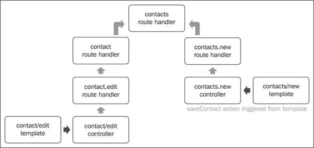
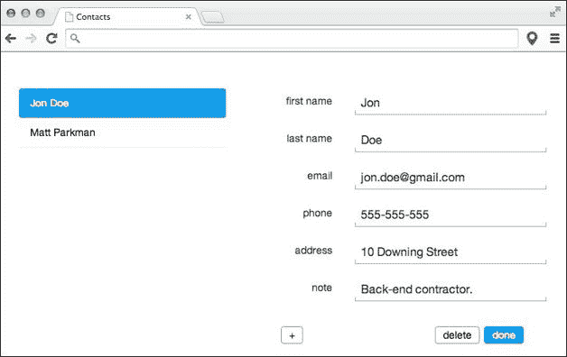

# 第四章 编写应用程序模板

现在我们已经知道了如何使用路由来管理 Ember.js 应用程序中的状态，本章将帮助我们掌握如何使用模板向用户展示应用程序逻辑。你很快就会意识到，你应用程序的大部分内容都驻留在模板中。因此，本章将经常回顾我们迄今为止所学的内容。因此，在本章结束时，以下概念将被学习：

+   创建模板

+   编写绑定模板表达式和条件

+   在模板中更改上下文

+   在模板中创建事件监听器

+   扩展模板

+   编写自定义模板助手

# 注册模板

如承诺，我们将继续在模板的背景下探索上一章中引入的章节示例。当应用程序过渡到一个状态时，该状态路径中的每个路由处理程序都会在页面上渲染一个模板。这些模板在以下签名中定义：

```js
<script type="text/x-handlebars" id="index">
 <h1>My Index Template</h1></script>
```

如所示，模板是通过`text/x-handlebars`类型的`script`标签进行注册的。使用`id`或`data-template-name`属性来识别模板。例如，章节示例中的`contacts`模板被定义为：

```js
  <script type="text/x-handlebars" data-template-name="contacts">
    ...
  </script>
```

需要注意的一点是，使用`data-template-name`属性来识别模板比使用`id`属性更明智，因为前者更可能与其他现有元素冲突。此外，请注意，第一个模板没有被*识别*。这是因为任何未识别的模板都被视为`application`模板：

```js
<script type="text/x-handlebars">
  <div class="container">
    {{outlet}}
  </div>
</script>
```

# 插入模板

在上一章中，我们讨论了应用程序中的状态是如何由各种路由组成的，这些路由的处理程序按顺序调用以执行构成此状态的各种功能。作为回顾，当用户在章节示例中加载应用程序时，应用程序过渡到`application`状态。然后，`application`路由处理程序将其相应的`application`模板渲染到 DOM 中。下一个要调用的路由处理程序是`contacts`路由处理程序，它也加载并渲染其模板到`application`模板中。我们已经讨论过，`{{outlet}}` Handlebars 表达式是`application`模板中被替换的部分。这个过程一直重复，直到应用程序稳定在目标状态。

正如我们稍后将要讨论的，一个*父*模板可以指定多个*子*模板可以渲染的命名出口。路由（不是资源）处理程序不需要包含这个表达式，因为它们通常渲染最终的模板。

# 输出模板

如前所述，Ember.js 模板是用 Handlebars（[www.handlebarsjs.com](http://www.handlebarsjs.com)）语法编写的，该库由相同的作者创建，以简化客户端模板的创建。Handlebars 是一个功能强大的模板库，它提供了许多功能，这些功能将在接下来的章节中讨论。

# 表达变量

我们刚刚提到模板由数据支持，这些数据由相应的控制器代理。Handlebars 遍历模板，用从这些数据中获得匹配值替换定义的表达式。这些表达式通常是括在花括号内的变量名。我们刚刚讨论的`{{outlet}}`表达式就是这样一种表达式。在章节示例中，`contact.index`状态负责在页面右侧显示联系人的详细信息。在其对应的模板中，我们注意到联系人的属性是用这些表达式表达的，但后来被替换，如下面的代码所示：

```js
<script type="text/x-handlebars" data-template-name="contact/index">
  {{#with controller.controllers.contact}}
  <div class="row">
    <div class="col-sm-4 text-right">name</div>
    <div class="col-sm-8">{{name}}</div>
  </div>
  <br>
  ...
</script>
```

在前面的例子中，Handlebars 找到了名称表达式，从提供的模型中检索这个变量，并执行了交换。Handlebars 始终在提供的控制器上下文中工作，这反过来又代理了对模型的请求。因此，用于交换前面表达式的值被评估为：

```js
model.name;
```

此值也可以是：

```js
{{controller.model.name}}
```

每当发出对`name`变量引用的请求时，Ember.js 首先检查控制器是否定义了该变量。由于这不是真的，控制器*代理*这个请求到其模型。

# 编写绑定和未绑定表达式

我们刚刚了解到，表达式通过引用绑定上下文中指定的变量来解析。Ember.js 更进一步，使这些表达式变得*响应式*。这意味着如果底层变量发生变化，被替换的表达式部分也将更新。有时，我们可能不希望抑制这种行为，特别是当变量太大并且构成未绑定表达式时。

这些表达式在渲染时只解析一次，并且不会订阅相应变量的进一步更改。这些表达式使用三个花括号而不是两个，如下面的示例所示，其中 Ember.js 驱动的博客文章的主要内容可以被渲染：

```js
{{{post}}}
```

# 在模板中添加注释

Handlebars 中的注释具有`{{! … }}`签名。例如，我们可以添加文档来表示页脚的结束：

```js
  </footer> {{! end of footer}}
```

这些表达式与普通 HTML 注释具有相同的作用，只是它们实际上并没有被转换为后者。因此，使用它们的良好理由是当我们不希望注释出现在渲染的输出中时。

# 编写条件语句

Handlebars 支持使用 `if`、`if...else`、`unless` 和 `unless...else` 条件语句。这意味着我们可以根据指定的条件渲染模板的不同部分。它们是封装模板部分的块表达式，通常分别以 `{{#` 和 `{{/` 模板标签开始和结束。例如，如果用户在章节示例的 `contacts` 模板中没有存储联系人，应用程序将过渡到 `contacts.new` 状态，强制用户添加一个。因此，我们需要在页面现在空白的左侧显示一个占位符字符串。我们通过检查传递的联系人列表是否确实为空来实现这一点，如下面的代码所示：

```js
{{#if model.length}}
  ...
{{else}}
    <h1>Create contact</h1>
{{/if}}
```

占位符元素放置在 `else` 块中。如图所示，块表达式仅在传递的值评估为 `True` 时才会满足。因此，以下值将导致渲染 `else` 块：

+   `false`

+   `undefined`

+   `null`

+   `[] (空数组)`

+   `''`

+   `0`

+   `NaN`

与此相反，`unless` 表达式仅在评估的变量为 `False` 时才会满足。

注意，Handlebars 是“无逻辑”的，因此我们无法使用位运算符来表示条件，如下面的情况：

```js
  {{#if user.score > 1000 }}
     <span>Level passed.</span>
   {{else}}
     <span>Level failed.</span>
   {{/if}}

   {{#if (temp.high + temp.low)/2 > 100   }}
     <span>It's hot today</span>
   {{/if}}
```

然而，我们可以使用计算属性或绑定在控制器层定义这些条件。例如，前面的示例可以正确实现如下：

```js
App.ApplicationController = Em.Controller.extend({
  levelPassed: function(){
     return this.get('user.score') > 1000;
  }.property('user.score')
});

{{#if controller.levelPassed }}
  <span>Level passed.</span>
{{else}}
  <span>Level failed.</span>
{{/if}}

App.ApplicationController = Em.Controller.extend({
  isHot: function(){
    var temp = this.get('temp');
    return (temp.high + temp.low)/2 > 100;
  }.property('temp.high', 'temp.high')
});

{{#if controller.isHot }}
  <span>It's hot today</span>
{{/if}}
```

# 切换上下文

如前所述，Ember.js 会将表达式解析为模型上下文。`{{#with}}...{{/with}}` 辅助函数允许我们在检查期间指定优先级较高的上下文。一个很好的例子是在章节示例中，我们需要重复使用创建或更新联系人的表单。这个表单包含在 `contacts/form` 模板中。唯一的问题是，虽然 `contacts/new` 模板的上下文是一个新创建的联系人对象，但 `contact/edit` 模板必须引用由联系人控制器代理的联系人。多亏了 `with` 辅助函数和控制器依赖项，我们能够改变后者的上下文，如下所示：

```js
<script type="text/x-handlebars" data-template- name="contact/edit">
  {{#with controller.controllers.contact}}
  {{partial "contacts/form"}}
  {{/with}}
</script>
```

我们将在讨论 `partial` 辅助函数时再次回到这个案例，但重要的是要注意，主要上下文现在不是相应的路由处理程序模型，而是 `contact` 控制器。

就像 `each` 辅助函数一样，我们可以创建一个新的上下文而不丢失现有的上下文，如下面的示例所示：

```js
  <script
   type="text/x-handlebars"
  data-template-name="contact/edit">
    {{#with controller.controllers.contact as contact}}
    {{partial "contacts/form"}}
    {{/with}}
  </script>

 <script
   type="text/x-handlebars"
  data-template-name="contacts/new">
    {{#with model as contact}}
    {{partial "contacts/form"}}
    {{/with}}
  </script>
```

在这两种情况下，表单中的 `email` 字段，例如，现在需要绑定到联系人上下文：

```js
{{input type="text" id="form-email" value=contact.email}}
```

# 渲染可枚举数据

通常，应用程序需要显示可枚举数据，可以使用 `{{#each}} ... {{/each}}` 块表达式来实现。例如，我们的 `contacts` 模板使用这个表达式来显示左侧的联系人列表：

```js
<ul class="nav nav-pills nav-stacked">
  {{#each model}}
  <li>
    ...{{name}}...
  </li>
  {{/each}}
</ul>
```

我们省略了`link-to`表达式，稍后我们将讨论它。`each`块表达式在每次迭代时切换工作上下文，正如前一小节所讨论的那样。如果我们不想这样做，我们可以指定当前迭代对象的名称，如下面的重新实现所示：

```js
<ul class="nav nav-pills nav-stacked">
  {{#each contact in model}}
  <li>
    ...{{contact.name}}...
  </li>
  {{/each}}
</ul>
```

这个块表达式的优点之一是我们可以使用`else`表达式检查迭代器是否为空。例如，我们可以在`contacts`模板中减少`else`和`if...else`表达式的使用，如下所示：

```js
  <ul class="nav nav-pills nav-stacked">
    {{#each model}}
    <li>
      ...{{name}}...
    </li>
    {{else}}
      <h1>Create contact</h1>
    {{/each}}
  </ul>
```

# 编写模板绑定

在*编写已绑定和未绑定表达式*部分中，我们提到 Ember.js 处理器库允许在表达式中定义的变量订阅并因此更新绑定上下文的变化。该库还允许我们将这些变量绑定到 HTML 元素属性，包括使用`{{bind-attr .. }}`辅助器绑定类。以下示例定义了一个其`href`属性绑定到提供的用户配置文件的链接：

```js
    <a {{bind-attr href="profile.link"}}>User Profile</a>
```

到目前为止，我们都知道配置文件上下文将由路由处理器的模型钩子提供。例如，如果这是应用程序的模板，相应的路由处理器将提供上下文如下：

```js
  App.ApplicationRoute = Em.Route.extend({
    model: function(){
     return { profile: {
       link: '/@jondoe'
     }}
    }
  });
```

结果渲染的模板将如下所示：

```js
    <a  HYPERLINK "mailto:href%3D'/@jondoe"href='/@jondoe'>User Profile</a>
```

每次配置文件链接更改时，链接元素的`href`属性将自动更新。

我们还可能希望切换属性的状态，例如，常用的`required`和`disabled`属性。一个常见的用例是我们希望在电子商务应用程序中允许单次点击，如下面的代码所示：

```js
<button {{bind-attr disabled='isCheckingOut'}}>
  Checkout
</button>
```

在前面的例子中，当用户点击结账按钮时，结账操作应该切换`isCheckedOut`属性，这将导致按钮被禁用。因此，如果传递的条件变为`True`或`False`，则可以添加或删除 DOM 元素上的属性。

元素类名也可以以相同的方式动态更新，只是在绑定行为上略有不同。例如，我们可能希望在应用程序中向点击的链接添加一个`active`属性，如下所示：

```js
    <a href='/'  {{bind-attr class='selected'}}>Click me</a>
```

当上下文的`selected`属性评估为`active`时，链接将更新为：

```js
  <a href='/' class='active'>Click me</a>
```

另一方面，如果属性变为未定义，链接将更改为：

```js
  <a href='/'>Click me</a>
```

就像属性的存在可以动态更新一样，类名也可以根据指定的绑定条件从元素中插入和删除。因此，前面的示例可以重新实现为：

```js
<a href='/ {{bind-attr class='selected:active:inactive'}}> Click me
</a>
```

在这里，当上下文的`selected`属性变为`True`和`False`时，元素的类将是`active`和`inactive`。

如果在分号之后只传递一个参数，则传递的参数将用作类名。例如，以下代码演示了这一点：

```js
<a href='/' {{bind-attr class='isSelected:selected'}}> Click me
</a>
```

如果上下文的`isSelected`属性变为`True`，则会产生以下结果：

```js
     <a href='/' class='selected'>Click me</a> 
```

值得注意的是，`camelCase` 类名会被转换为 *dasherized*，如下面的示例所示：

```js
<a href='/' {{bind-attr class='isSelected'}}>Click me</a>
```

这将变为以下形式：

```js
<a href='/' class='is-selected'>Click me</a>
```

与其他属性不同，我们可以使用相同的签名绑定多个类，如下面的示例所示：

```js
<a href='/' {{bind-attr class='isSelected isActive'}}> Click me
</a>
```

这将变为以下形式：

```js
<a href='/' class='is-selected is-active'>Click me</a>
```

有时，我们可能想在元素中使用绑定的和未绑定的类。以下示例演示了这一点：

```js
<a href='/'  {{bind-attr class='isSelected :active'}}> Click me
</a>
```

这就产生了以下结果：

```js
<a href=' class='is-selected active'>Click me</a>
```

如所示，未绑定的类名以分号开头。请注意，以下示例将不会工作，因为如果其中一个类名被绑定，所有类名都应该定义在 `bind-attr` 表达式内部：

```js
<a href='/'  class='active' {{bind-attr class='isSelected'}}> Click me
</a>
```

# 定义路由链接

一个典型的 Ember.js 应用程序有几个我们需要在模板中链接的路由。`{{#link-to}}...{{/link-to}}` 辅助函数用于此目的，并允许应用程序轻松创建指向这些路由的锚点。例如，我们样本应用程序左侧的列表由用户可以使用来查看各种联系人详情的链接组成。我们使用此辅助函数生成这些链接如下：

```js
  <ul class="nav nav-pills nav-stacked">
  {{#each model}}
  <li>
    {{#link-to "contact.index" this}}{{name}}{{/link-to}}
  </li>
  {{/each}}
</ul>
```

如果我们检查生成的链接之一，我们会注意到它类似于以下代码行：

```js
<a href="#/contacts/1">Jon Doe</a>
```

辅助函数将路由名称作为第一个处理程序，然后是相应路由所需的资源。如前一章所述，由于受影响的路由路径有动态段，其处理程序负责解析所需的参数以替换这些段。在这种情况下，`contact` 路由路径有一个动态段，即 `contact_id`，正如前一章所讨论的那样。

如果我们要链接到博客路由，我们只需指定路由名称如下：

```js
{{#link-to "about"}}about{{/link-to}}
```

就像 `bind-to` 表达式一样，`link-to` 表达式也接受其他元素属性，如 `rel`、`target` 或 `class`。以下示例在新的标签页或窗口中打开链接：

```js
{{#link-to "about" target="_blank"}}about{{/link-to}}
```

# 注册 DOM 元素事件监听器

在纯 JavaScript 中，应用程序脚本遍历 DOM，沿途设置事件监听器。一个典型的表单可能看起来如下：

```js
<form name='tweet'>
    <textarea name='content' required></textarea>
     <input type='submit' value='tweet'></form>

<script>
    var form = document.forms.tweet;
    form.onsubmit = function(event){
      event.preventDefault();
       alert(form.content.value); 
};
</script>
```

Ember.js 提供了一个抽象层，允许开发者使用 `{{action ...}}` 辅助函数轻松订阅元素特定的事件。我们的章节包含如下所示的形式：

```js
<form
    class="form form-horizontal"
    role="form"
    {{action "saveContact" this on="submit"}}>

  ...

  <button class="btn" type="submit">
  done
  </button>

  ...
</form>
```

```js
A function to triggerAn optional context objectAn optional type of event to listen to which defaults to click on
```

要调用的函数通常定义在路由的 `actions` 属性中，并接受任意数量的参数。默认情况下，绑定的事件类型通常是 `click` 事件。然而，您可以使用 `on` 属性来指定此类型。`actions` 属性可以定义在相应的路由或控制器上。例如，前面动作的动作处理程序是在 `contacts` 路由中定义的：

```js
App.ContactsRoute = Ember.Route.extend({
  actions: {
    saveContact: function(contact){
      var id = contact.get('id');
      contact.save();
      if (!id){
        this.controllerFor('contacts').pushObject(contact);
      }
      this.transitionTo('contact.index', contact);
    }
  }
});

```

如前所述，此动作仍然可以在控制器层中定义如下：

```js
App.ContactsController = Ember.ArrayController.extend({
  actions: {
    saveContact: function(contact){
      var id = contact.get('id');
      contact.save();
      if (!id){
        this.pushObject(contact);
      }
      this.transitionToRoute('contact.index', contact);
    }
  }
});
```

在决定将动作放置何处时需要考虑的主要点是何时我们需要利用**冒泡**动作。当一个动作被触发时，会在相应的控制器中查找指定的函数。如果这个动作被定义，它就会被执行。如果没有定义这个动作，Ember.js 会在相应的路由处理程序中进行检查。如果这个动作在控制器或路由处理程序中定义，并且返回的值等于`True`，Ember.js 就会继续检查父路由处理程序中是否有类似的功能，直到其中一个不包含该功能或没有定义它。

需要注意的一个重要事项是，冒泡动作仅在路由处理程序层发生。这是我们选择在路由处理程序中定义函数的原因之一。例如，我们应该能够从`contacts.new`和`contact.edit`模板中调用`saveContact`动作，所以我们将其定义在`contacts`路由中。以下是两种情况下动作传播的说明图：



如果我们指定了动作的`target`对象，先前的动作函数仍然可以位于任何控制器中。`target`对象包含 Ember.js 检查`action`函数的`actions`哈希。默认情况下，它通常是模板的相应控制器，如前图所示。因此，我们可以在`contact`控制器中定义`action`函数，然后将目标设置为：

```js
<form
    class="form form-horizontal"
    role="form"
    {{action "saveContact" this target="controllers.contact" on="submit"}}>
 ...
</form>
```

# 编写表单输入

编写表单是 Ember.js 通过提供许多 HTML5 表单控件模板辅助函数来简化的常见做法。以下表格显示了这些常见控件及其可以接受的属性：

| 控件 | 属性 |
| --- | --- |
| `input` | `value` `size` `name` `pattern` `placeholder` `disabled` `maxlength` `tabindex` |
| `textarea` | `checked` `disabled` `tabindex` `indeterminate` `name` |
| `checkbox` | `rows` `cols` `placeholder` `disabled` `maxlength` `tabindex` |

在示例应用程序中，用户可以通过点击页脚中的**编辑**按钮来编辑联系人，如下面的截图所示：



如果用户编辑联系人的名字，我们会注意到侧边栏中的名字也进行了更新。`input`辅助函数在`contacts/form`模板中被用来**绑定**输入元素的值与联系人的名字，如下所示：

```js
{{input
  type="text"
  id="form-first-name"
  value=first_name
  required='required'}}
```

在这里，我们定义了四个属性，它们要么是已绑定要么是未绑定的。已绑定的属性会在指定的变量更改时更新，反之亦然。例如，在前面的例子中，`value`属性是已绑定的，而`required`属性则不是。未绑定的属性用引号括起来，而绑定的则不用。

这里有一些示例，展示了如何使用其他两个表单辅助函数：

```js
{{textarea value=model.content}}
{{checkbox checked=model.isPaid}}
```

# 扩展模板

在应用程序开发的过程中，您可能会发现需要抽象模板以供重用。有几个辅助函数可以帮助我们轻松实现这一点：

+   `partial`

+   `view`

+   `render`

+   `named outlets`

`partial`辅助函数用于在模板中包含其他模板。它简单地将所需的模板插入到`partial`表达式指定的位置。如前所述，章节示例在两个地方使用了此辅助函数：

```js
  <script
   type="text/x-handlebars"
  data-template-name="contact/edit">
    {{#with controller.controllers.contact}}
    {{partial "contacts/form"}}
    {{/with}}
  </script>

 <script
   type="text/x-handlebars"
  data-template-name="contacts/new">
    {{partial "contacts/form"}}

  </script>
```

此辅助函数将应插入到当前模板中的模板作为唯一参数。需要注意的是，使用此辅助函数不会导致上下文丢失，正如在`contact/edit`案例中看到的那样。

我们可能还希望在其他模板中插入视图。在这种情况下，视图的模板将被插入到当前模板的指定部分，并且将设置定义的事件监听器。例如，我们之前看到的第一个名字输入也可以写成：

```js
{{view
  Em.TextField
  id="form-first-name"
  value=first_name
  required='required'
}}
```

我们将在第六章中更详细地讨论这个问题，*视图和事件管理*，我们将处理视图。这里需要注意的是，所命名的输入辅助函数实际上是这些视图中定义的 Handlebars 辅助函数。我们将在稍后讨论这些辅助函数是如何创建的。`render`辅助函数与`partial`辅助函数的工作方式相同，不同之处在于它接受一个可选的上下文作为第二个参数。例如，我们将定义`contact/edit`和`contact/edit`模板如下：

```js
  <script
   type="text/x-handlebars"
  data-template-name="contact/edit">
    {{render "contacts/form" controller.controllers.contact}}
  </script>

 <script
   type="text/x-handlebars"
  data-template-name="contacts/new">
    {{render "contacts/form"}}
  </script>
```

我们不是在第一个模板中切换上下文，而是简单地传递了要使用的控制器作为上下文。请注意，默认情况下，传递的上下文是对应的控制器实例，因此在这种情况下我们不需要指定此上下文。

最后一种扩展模板的方法是使用我们在前一章中讨论过的命名出口。以下是我们的示例：

```js
<script type="text/x-handlebars" data-template-name="game">
  <div id="leaderboard">{{outlet leaderboard}}</div>
  <div id="mainboard">{{outlet mainboard}}</div>
</script>
```

然后，我们通过处理程序渲染出口：

```js
App.GameRoute = Ember.Route.extend({
  renderTemplate: function() {
    this.render('mainboard', {
      into: 'game',
      outlet: 'mainboard',
      controller: 'mainboard'
    });
    this.render('leaderboard', {
      into: 'game',
      outlet: 'leaderboard',
      controller: 'leaderboard'
    });
  }
});
```

这与`partial`辅助函数的使用非常相似，但在这个情况下，我们还在路由处理器的`renderTemplate`钩子中指定了模板。

# 定义自定义辅助函数

Handlebars 提供了创建自定义辅助函数的方法。以下是新注册辅助函数的格式：

```js
Ember.Handlebars.register(helper_name, helper_function_or_class);
```

例如，让我们创建一个`heading`辅助函数，用于创建`h1`标签：

```js
  Ember.Handlebars.register('heading', function(text, options){
    var escapedText = Handlebars.Utils.escapeExpression(text);
     var heading = '<h1>'+escapedText+'</h1>';
               return new Handlebars.SafeString(heading);
  });
```

这可以在我们的应用程序模板中使用，如下所示：

```js
  {{heading 'Title'}}
```

现在，生成以下内容：

```js
  <h1>Title</h1>
```

以下示例还演示了如何从现有视图中创建辅助函数：

```js
    Ember.Handlebars.register('loader', App.LoaderView}}
```

现在可以简单地使用如下：

```js
  {{loader}}
```

这相当于以下：

```js
  {{view App.LoaderView}}
```

# 创建子表达式

子表达式，正如其名所示，是包含在其他表达式中的表达式，它具有以下签名：

```js
   {{outer-helper (inner-helper 'arg1') 'arg2'}}
```

以下是一个实现`Number.toFixed`辅助函数的示例：

```js
Ember.Handlebars.registerHelper('to-fixed', function(num, decimals) {
  return new Ember.Handlebars.SafeString(
    num.toFixed(decimals)
  );
});
```

这可以在`link-to`辅助函数中使用，如下所示：

```js
  {{#link-to 'checkout' (to-fixed cart.total)}}
  checkout
  {{/link-to}}
```

这将导致以下类似的结果：

```js
   <a href='#/checkout/10.10'>checkout</a>
```

# 摘要

这是一章令人兴奋的章节，它引导我们了解了模板层。当我们讨论下一章中的控制器时，这一章将会被重新回顾。以下是我们在本章中学到的关键概念，以及将在下一章中回顾的概念：

+   编写绑定模板表达式

+   在模板中编写条件语句

+   模板中的上下文切换

+   在模板中创建事件监听器

+   扩展模板

+   编写自定义模板助手
