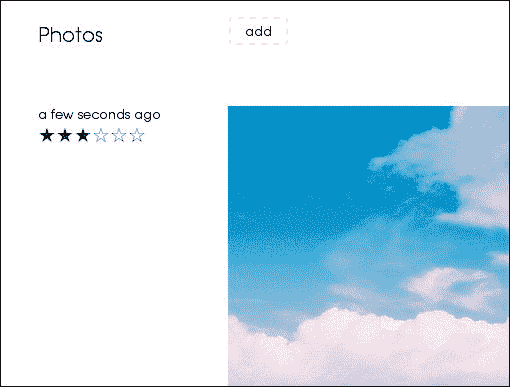

# 第七章. 组件

到本章为止，我们学习了 Ember.js 的基本概念，这些概念为我们提供了创建完整应用程序所需的工具。从本章开始，我们将通过探索更多高级 Ember.js 功能，引导您创建各种复杂的应用程序。本章将介绍 Ember.js 组件，这些组件使我们能够创建自定义的可重用元素，并将涵盖以下相关主题：

+   理解组件

+   定义组件

+   自定义组件

+   将组件用作模板布局

+   在组件内部定义动作

+   将组件与应用程序的其他部分接口

# 理解组件

网络组件是一个可重用的自定义 HTML 标签。万维网联盟已经在制定自定义网络元素（网络组件）规范([`www.w3.org/TR/components-intro/`](http://www.w3.org/TR/components-intro/))，这将允许开发者创建具有自定义行为的这些自定义 HTML 元素，而不是始终依赖于提供的标准 HTML 元素。此规范仍在制定中，但在规范完成之前，有一些 JavaScript 开源项目（shims）可以帮助您开始：

+   **聚合物**，可在[`www.polymer-project.org/`](http://www.polymer-project.org/)找到

+   **Facebook React**，可在[`facebook.github.io/react/docs/component-api.html`](http://facebook.github.io/react/docs/component-api.html)找到

+   **Ember.js 组件**

Ember.js 提供了机制，将允许开发者在网络技术近未来创建和完成这些组件。一旦网络组件标准化，Ember.js 将继续使创建这些自定义元素变得容易。因此，开始利用 Ember.js 组件 API 是一个额外的优势。

# 定义组件

组件是 Ember.js 视图的高级结构，因此，要定义一个组件，我们需要定义以下两个 Ember.js 对象之一或两个：

+   组件的类

+   组件的模板

该类通常从以下签名中的 `Ember.Component` 类扩展：

```js
MyAppNamespace.ComponentNameComponent = Ember.Component.extend();
```

组件模板随后使用 Ember.js 习惯用法进行定义和命名。例如，前面组件的模板将被命名为：

```js
components/component-name
```

本章捆绑的示例包括一个简单应用程序，该应用程序利用了几个组件。此应用程序允许用户上传和评分照片，如下面的截图所示：



应用程序定义了以下组件：

+   帖子输入组件

+   帖子日期组件

+   帖子评分组件

+   用户帖子组件

+   帖子照片组件

我们已经注意到，这些组件中的一些是由类或模板定义的。例如，`user-post`组件没有定义类。此外，模板名称使用连字符进行命名空间，而类名称使用驼峰式。因此，将`user-post`组件模板注册为`userpost`是不正确的。这个规则对应于 W3C 描述的以下组件属性之一：

+   组件自定义元素必须通过一个连字符进行命名空间。

+   组件是沙箱化的，但可以通过事件进行通信。因此，组件和宿主 DOM JavaScript 不能相互操作。

因此，例如，`post-input`组件类和模板被定义为：

```js
// class
App.PostInputComponent = Ember.Component.extend({
});

{{! template}}
<script type="text/x-handlebars" id="components/post-input">
add
</script>
```

一旦定义，一个组件就可以使用 Handlebars 表达式包含到任何应用模板中。例如，第一个组件是一个按钮，用于提示用户从磁盘中选择一个图像：

```js
<script type="text/x-handlebars" id="components/post-input">
add
</script>
```

现在，我们的路由器定义了处理主页路径请求的`photos`路由：

```js
App.Router.map(function() {
  this.resource('photos', {path: '/'})
});
```

因此，我们只需要将组件包含在相应的`photos`模板中，如下所示：

```js
<script type="text/x-handlebars" id="photos">

  ...
  {{post-input posts=model}}

  ...
</script>
```

这将导致`components`模板被交换，从而导致：

```js
<script type="text/x-handlebars" id="photos">
  ...
  <button>add</button>
  ...
</script>
```

不要担心生成的元素是一个按钮。重要的是要注意，我们只是定义并使用了一个自定义 HTML 元素，而不必担心其底层实现。

# 区分组件和视图

在我们继续之前，你可能想知道为什么组件和视图不同，因为两者都封装了模板。嗯，组件确实是视图的一个子类，但它们的控制器上下文与应用程序的其他部分是隔离的。虽然应用程序控制器可以被分配给任何视图，但定义的组件类不能分配给其他组件或视图。组件定义了一个接口，所需的上下文必须实现，因此它们更可重用和模块化，我们将在下一节中看到。

# 将属性传递给组件

尽管我们刚刚提到组件与应用程序的其他部分是隔离的，但它们可以通过几种方式与宿主应用程序进行通信。首先，它们能够绑定到宿主模板上下文中的属性。例如，我们刚刚提到，前面的按钮组件用于提示用户上传图像。该组件要求一个可枚举属性，该属性将作为照片存储库绑定到其`posts`属性：

```js
{{post-input posts=model}}
```

这样，组件将能够存储提供的照片，我们将在后面的章节中讨论。然后，这些选定的照片将在同一模板中显示给用户：

```js
<script type="text/x-handlebars" id="photos">
...
<div class='posts'>
  <ul>
    {{#each model}}
      <li>{{user-post post=this}}</li>
    {{/each}}
  </ul>
</div>
...
</script>
```

在这里，我们使用了另一个组件，`user-post`，它将给定的照片渲染到包含页面的部分。同样，我们不需要担心组件的底层实现。我们只需要满足其接口对绑定照片到其`post`属性的要求。

要了解这些组件如何使用绑定的属性，让我们考虑 `post-date` 组件，该组件被刚才讨论的 `user-post` 组件用来显示帖子的日期的人性化格式。该组件包含一个表达式，显示格式化的日期为：

```js
<script type="text/x-handlebars" id="components/post-date">
  {{formatedDate}}
</script>
```

该表达式是一个计算属性，它使用 Moment.js 库（[`momentjs.com`](http://momentjs.com)）来格式化日期，并在相应的类中定义为：

```js
App.PostDateComponent = Ember.Component.extend({
  formatedDate: function(){
    return moment(this.get('date')).fromNow();
  }.property('date')
});
```

然后在 `user-post` 组件中将依赖的日期属性绑定：

```js
{{post-date date=post.date}}
```

# 定制组件的元素标签

由于 W3C 组件规范仍在开发中，Ember.js 组件利用现有的标准 HTML 元素。在 第三章，*路由和状态管理* 中，我们了解到视图的模板被包裹在一个元素中，默认情况下是 `div`。然后可以使用视图的 `tagName` 属性来定制该元素。组件的模板也以相同的方式包裹在可定制的元素中。例如，我们承诺要讨论之前提到的 `post-input` 组件是如何渲染到 DOM 中的。

我们需要做的只是在该相应的类中定义属性：

```js
App.PostInputComponent = Ember.Component.extend({
  ...
  tagName: 'button',
  ...
});
```

# 定制组件的元素类

由于组件是视图，它们的元素类可以使用组件类上的 `classNames` 和 `classNameBindings` 数组属性静态或动态指定。例如，`post-input` 组件定义了一个静态类：

```js
App.PostInputComponent = Ember.Component.extend({
  classNames: ['post-input'],
});
```

这导致组件被渲染为：

```js
<button class='post-input'>add</button>
```

在示例应用程序中，我们提到用户可以对上传的图片进行评分。`user-post` 组件使用 `post-rating` 组件作为评分小部件：

```js
{{post-rating content=post}}
```

后一部分中的每个星号也是一个组件（`post-rating-item`），它们水平排列以组成小部件：

```js
<script type="text/x-handlebars" id="components/post-rating">
  <ul>
    {{#each rating in ratings}}
      <li>{{post-rating-item controller=post content=rating}}</li>
    {{/each}}
  </ul>
</script>
```

如预期的那样，彩色星号代表评分范围，因此在这种情况下，我们使用 `active` 类来设置它们的样式：

```js
App.PostRatingItemComponent = Ember.Component.extend({
  classNameBindings: ['active'],
  active: function() {
   ...
  }.property('parentView.selected'),
});
```

这是一个动态类的例子，其中组件只有在定义的计算 `active` 类评估为 `True` 时才会获取该类。我们将在稍后的部分讨论这个评分是如何工作的，但最后要注意的一点是，在动态类的情况下，我们可以指定要使用的类名。例如，我们可以将前面的情况实现为：

```js
App.PostRatingItemComponent = Ember.Component.extend({
  classNameBindings: ['isActive:active'],
  isActive: function() {
   ...
  }.property('parentView.selected'),
});
```

我们也可以将其实现为：

```js
App.PostRatingItemComponent = Ember.Component.extend({
  classNameBindings: ['isActive:active:not-active'],
  isActive: function() {
   ...
  }.property('parentView.selected'),
});
```

```js
not-active class will be acquired by nonactive stars.
```

# 定制组件的元素属性

组件的元素属性值也可以通过使用 `attributeBindings` 属性绑定到属性上。例如，考虑我们的 `post-photo` 组件，它以以下方式显示图片：

```js
App.PostPhotoComponent = Ember.Component.extend({
  tagName: 'img',
  classNames: ['avatar'], 
  attributeBindings: ['src'],
  src: Ember.computed.oneWay('photo')
});
```

首先，我们使用 `tagName` 属性指定其元素是一个图像标签。我们还指定该元素将有一个 `src` 属性，该属性将被别名到绑定的 `photo` 属性。然后 `user-post` 组件使用此组件来显示图片：

```js
{{post-photo photo=post.photo}}
```

一定要比较以下元素概念如何在视图、组件甚至模板中定制：

+   标签名

+   类属性

+   属性

# 在组件中管理事件

就像视图一样，组件可以捕获用户生成的事件，例如来自键盘、鼠标和触摸设备的事件。

定义这些事件处理器的两种方式，第一种是将 `.on` 函数附加到事件订阅方法上。例如，`post-input` 组件使用此函数定义了两个处理器。此按钮组件实现了一个可以从不可见的文件输入中打开的文件选择对话框，具体描述见[`github.com/component/file-picker`](https://github.com/component/file-picker)。组件一旦渲染，就会触发事件，导致包含单个输入文件的隐藏表单元素被附加到 DOM 中，如下所示：

```js
createHiddenForm: function(){
  var tmpl = [
    '<form class="post-input-form">',
    '<input type="file" style="top: -1000px; position: absolute" aria-hidden="true">',
    '</form>'
  ].join('');

  Em.$('body').append(Em.$(tmpl));
}.on('didInsertElement'),
```

此表单将用于稍后上传图像。接下来，我们定义将启动文件对话框的处理器。请注意，我们使用 `.on` 方法订阅按钮的点击事件：

```js
upload: function(){
  ...
}.on('click')
```

在此处理器内部，我们设置了一个监听器，当用户选择一个图像文件时会被调用，如下所示：

```js
var input = Em.$('.post-input-form input');
input.one('change', upload);
```

这里是执行上传的处理器：

```js
function upload(event){

  var file = input[0].files[0];
  var reader = new FileReader;
  reader.onload = post.bind(this, reader);
  reader.readAsDataURL(file);

};
```

```js
FileReader instance and pass the uploaded image to it. We then read the dataUrl representation of the image, which then gets sent to the final bound handler:
```

```js
    function post(reader){

      var data = {
        photo: reader.result,
        date: new Date
      }
      self.get('posts').pushObject(data);

    }
```

最后一个处理器将图像添加到照片控制器作为一个新的帖子。请注意，我们没有检查上传的 MIME 类型，因此用户可能会上传其他媒体类型，例如视频。这个检查被留给了读者作为实现练习。

其次，我们订阅这些事件以实现一个名称与目标事件相对应的方法，正如之前讨论的评分小部件组件所示。此组件记录以下两个属性：

+   `selected`: 这是选中/悬停的星星位置

+   `_selected`: 这是最后点击的星星的缓存位置

我们提到，小部件由代表每个星星的 `post-rating-item` 组件组成。当用户悬停在任何一个上时，我们更新父组件的 `selected` 属性，如下所示：

```js
  mouseEnter: function(e) {
    var selected = this.get('content');
    this.set('parentView.selected', selected);
  }
```

如所示，我们定义了一个与 `mouseEnter` 事件相对应的方法。此处理器将所有左侧的评分项组件的 `active` 属性设置为 `True`，因为这里的技巧是按照预期将样式应用到当前选中星星左侧的所有星星上：

```js
  classNameBindings: ['active'],

  active: (function() {
    var content = this.get('content');
    var selected = this.get('parentView.selected');
    return ~~content <= ~~selected;
  }).property('parentView.selected'),
```

另一方面，右侧的星星失去 `active` 类，因为它们的 `active` 属性被重新计算为 `False`。

如果用户没有点击任何星星，他们期望恢复之前的评分。因此，离开当前聚焦的组件会使用缓存的 `_selected` 属性来重置 `selected` 属性，如下面的代码所示：

```js
  mouseLeave: function(e) {
    var selected = this.get('parentView._selected');
    this.set('parentView.selected', selected);
  }
```

再次，我们只需要实现 `mouseLeave` 事件钩子。最后，点击任何组件都会给出实际的评分：

```js
  click: function(e){
    var content = this.get('content');
    this.set('parentView.selected', content);
    this.set('parentView._selected', content);
  }
```

注意，我们缓存了父组件的`_selected`属性，因为这个属性将在前面的检查中使用。`active`类根据以下方式适当地更新组件的状态：

```js
.rating:before{
  content: "☆"
}

.rating.active:before{
  content:"★"
}
```

# 定义组件动作

我们提到组件定义的类充当它们的控制器，这些控制器与应用程序的其余部分隔离。例如，应用程序控制器不能将其组件类定义为`needs`属性中的依赖项。然而，由于它们被视为控制器，它们可以在`actions`对象属性中定义处理程序，以处理它们相应模板中定义的动作表达式。例如，让我们定义一个消息框组件，该组件可用于任何需要实现聊天功能的应用程序：

```js
{{! template }}]
<form {{action 'save' on='submit'}}>

  {{input value=message}}
</form>

// component classApp.MessageBoxComponent = Ember.Component.extend({
  message: '',
  classNames: ['message-box'],
  actions: {
    save: function(){
      var message = this.get('message').trim();
      if (message === '') return;
      var content = this.get('content');
      content.pushObject(message);
      this.set('message', '');
    }
  }
});
```

要使用此组件，只需提供一个`Messages`容器，其中将存储新消息。以下是一个可能的示例：

```js
<script type="text/x-handlebars" id="messages">
  <h1>Messages</h1>
  <ul>
    {{#each model}}
      <li>{{this}}</li>
   {{/each}}
  </ul>
  <div>{{message-box content=model}}</div>
</script>
```

组件形式定义了一个动作，该动作将组件类的`save`动作处理程序绑定到表单的`submit`事件。当用户通过按下*Enter*键提交表单时，处理程序会在将其推送到提供的容器之前对消息进行清理。你会发现这些动作与我们之前在第四章中学习的动作类似，即*编写应用模板*。然而，组件中没有事件冒泡。如果在类中找不到处理程序，将抛出适当的错误。

# 将组件与应用程序的其余部分接口

如前所述，组件并非完全沙箱化，但它们可以通过以下方式与应用程序的其余部分进行交互：

+   绑定到属性

+   发送动作

我们已经看到组件如何通过在模板表达式中传递属性来绑定到其他应用程序属性：

```js
  {{post-input posts=model}}
```

组件还具有将它们的行为发送到应用程序中的控制器的能力。为了演示这一点，让我们为电子商务网站创建一个简单的结账按钮：

```js
{{! template}}
<script type="text/x-handlebars" id="components/checkout-button">
add to cart
</script>

// add to cart component
App.CheckoutButtonComponent = Ember.Component.extend({
  tagName: 'button',
  click: function(){
    this.sendAction();
  }
}); 

{{! cart template}}
<ul>
{{#each products}}
<li>
  {{name}}
  {{price}}
  {{checkout-button}}
</li>
</ul>

// cart controller
App.CartController = Ember.ArrayController.extend({
  actions: {
    click: function(product){
      this.pushObjects(product);
    }
  }
});
```

在前面的示例中，我们的意图是在点击相应的结账按钮时通过事件处理程序将产品添加到购物车。我们利用组件的`sendAction`方法将此动作冒泡到父控制器。然而，为了实现这一点，我们需要修复两件事。首先，我们需要将控制器中的事件处理程序重命名为更具描述性的名称。此外，相同的`click`事件处理程序可以捕获来自其他元素的事件：

```js
// cart controller
App.CartController = Ember.ArrayController.extend({
  actions: {
    addToCart: function(product){
      this.pushObjects(product);
    }
  }
});
```

接下来，我们需要通过修改模板将选定的产品发送到`addToCart`处理程序：

```js
{{! cart template}}
<ul>
{{#each products}}
<li>
  {{name}}
  {{price}}
  {{checkout-button product=this action='addToCart'}}
</li>
</ul>
```

这只是让组件能够访问产品。最后，我们将产品发送到控制器事件处理程序：

```js
// add to cart component
App.CheckoutButtonComponent = Ember.Component.extend({
  tagName: 'button',
  template: Ember.Handlebars.compile('add to cart'),
  click: function(){
    this.sendAction('action', this.get('product'));
  }
});
```

注意，`sendAction`的第一个参数始终是`action`，后面跟着我们希望发送的对象（s）。

# 组件作为布局

组件的模板可以作为其他应用程序模板的布局。这些布局在视图层中未指定；它们使用块表达式。然后可以在这些模板内部插入附加内容，而不会丢失作用域。例如，想象一下我们希望创建一个将使用 `content-editable` 元素的组件。这类组件需要将某个 HTML 内容的部分包装为：

```js
{{#content-editable}}
<p>Tweet content</p>
{{/content-editable}}
```

如所示，该组件使用与命名空间模板名称匹配的自定义 Handlebars 标签。组件内部和外部的内容仍将享受相同的范围。你能猜出这个组件将如何实现吗？一种实现方式是将包装内容在双击或聚焦时转换为 `content-editable`，当鼠标离开元素时恢复为 `div`，如下所示：

```js
App.ContentEditableComponent = Ember.Component.extend({
  attributeBindings: ['isEditing:contenteditable'],
  doubleClick: function(){
    this.set('isEditing', true);
  }
  focusOut: function(){
    this.set('isEditing', false);
  }
});
```

两个事件定义的处理程序切换 `isEditing` 属性，这随后导致 `content-editable` 属性相应地被添加或从元素中移除。

为了让事情变得更有趣，想象一下我们想要将我们的 `content-editable` 组件升级为一个所见即所得（WYSIWYG）编辑器。我们需要定义一个模板，用于托管用于操作内容的各种控件，如下面的示例所示：

```js
<script type="text/x-handlebars" id="components/content-editable">
  <div class="controls-toolbar">
    <button>bold</button>
    <button>italic</button>
    <button>underline</button>
    <button>strike-through</button>
  </div>
  <div class="content">
    {{yield}}
  </div>
</script>
```

首先，我们定义一个工具栏，用于存放标准编辑器控件。我们可以绑定之前章节中讨论的动作处理程序来执行操作；这将是一个值得读者尝试的练习。在内容部分，我们使用之前章节中讨论的 `yield` 表达式来告诉组件在这个模板的部分渲染包装内容。有了这个强大的功能，组件和包装内容都可以定义绑定到隔离上下文的表达式。

# 摘要

当你想模块化你的应用程序时，你会发现组件非常有用。有许多开源工具可以使你能够将这些组件发送到你的应用程序中。在本书的最后一章中，我们将学习如何使用组件的 ([`github.com/component`](http://github.com/component)) 资产管理器和构建将这些组件和混入（mixins）发送到你的应用程序中。因此，将你的应用程序中的模块化对象抽象为混入或组件是最佳实践。以下是我们关于组件学到的一些内容：

+   定义组件

+   自定义组件元素和属性

+   在组件内管理动作

+   将组件与应用程序的其他部分接口连接

在下一章中，我们将学习如何同步 Ember.js 应用程序和 REST 后端之间的数据。我们将特别学习如何使用 Ember.js 数据来简化这一需求。
