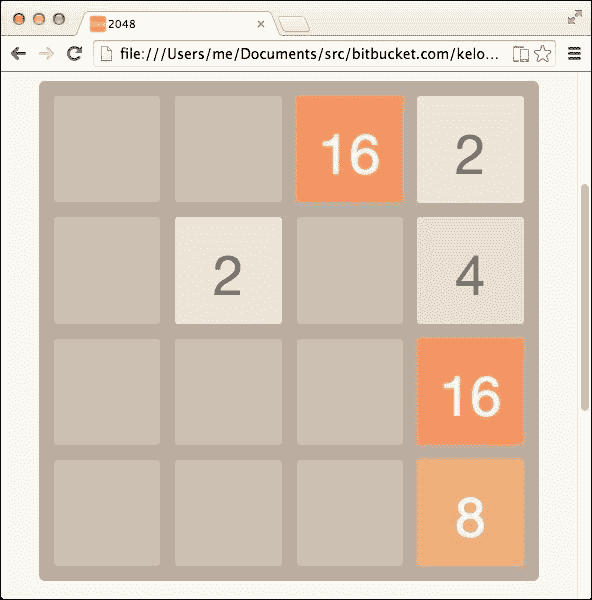
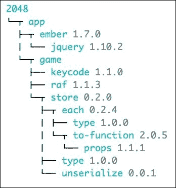

# 第十二章 模块化你的项目

许多 Ember.js 项目可能会变得复杂，因此可能需要通过以下任何一种组合对项目进行模块化，以提高可维护性：

+   将项目拆分为多个脚本文件并单独加载它们。

+   将脚本文件连接成一个构建文件。这减少了浏览器需要向后端发出的请求数量；因此，页面加载时间减少。

+   维护可重用组件，这些组件可以在多个项目中使用。

有许多开源工具可以用来执行此类任务。这些工具可能包含以下内容：

+   一个可以安装外部可重用组件的包管理器

+   一个智能地将所有项目文件连接成一个单一构建文件的构建过程

以下是一些这些流行的工具：

+   Grunt（一个构建工具）

+   Gulp（一个构建工具）

+   Bower（一个包管理器）

+   NPM（一个包管理器）

+   Browserify（一个构建工具）

+   Ember CLI（一个构建工具）

+   Brocolli（一个构建工具）

+   Ember 插件([`emberaddons.com`](http://emberaddons.com))

+   Duojs（基于 Component 和 Browserify 的构建工具和包管理器）

+   Component（一个构建工具和包管理器）

这些都可以以任何组合方式完成任务。在本章中，我们将讨论如何使用**Component**轻松管理复杂的 Ember.js 项目。值得注意的是，ES6 模块功能正在开发中，以解决这些问题。幸运的是，一些这些工具符合规范，从而使得迁移变得容易。

# 安装 Component 构建工具

组件是一个客户端 Web 项目的包管理器和构建工具。它提供了安装外部项目依赖项以及将项目组织成几个本地组件的能力，这些组件稍后可以构建成一个单独的构建文件。本章示例使用此工具安装和使用所需的项目依赖项。要运行此示例，我们首先需要安装 Node.js，可以从[`nodejs.org/download`](http://nodejs.org/download)下载。要运行项目，只需在终端外壳中执行`make`命令。如果系统没有安装`make`，可以使用以下命令运行项目，其中第一个命令安装了工具：

```js
npm install

```

Component 是一个 NPM 包，因此可以通过将依赖项添加到`package.json`中来进行安装：

```js
{ 
  "name": "2048", 
  "private": true, 
  "dependencies": { 
    "component": "⁰.19.9" 
  } 
} 
```

接下来，我们使用以下代码安装外部组件依赖项并构建文件：

```js
./node_modules/component/bin/component install
./node_modules/component/bin/component build -n public -o public

```

最后，可以通过在浏览器中加载`index.html`来打开应用程序。此应用程序是 Gabriele Cirulli 开发的流行 2048 游戏的实现([`gabrielecirulli.github.io/2048/`](http://gabrielecirulli.github.io/2048/))，并利用了 Ember.js 的运行时。

如下截图所示的开源游戏是 Web 游戏开发的良好介绍：



# 代码组织

组件工具要求项目组织到 `components`。组件是一个可重用的模块，可以包含在 `component.json` 配置文件中定义的脚本、样式、图像、模板和字体。它还可以可选地定义依赖项，这些依赖项本身也是组件。这些依赖项可以是本地或远程的。因此，可以将项目视为一个组件的树，如下面的截图所示：



在这个项目中，项目的根目录定义了一个组件 `2048`，如下所示：

```js
  "name": "2048", 
  "local": ["app"], 
  "paths": ["lib"] 
}
```

这个组件不包含任何脚本或样式，因为这些都在子组件中，所以我们不需要指定它们。然而，它指定了它依赖于一个名为 `app` 的本地组件，该组件位于 `lib` 相对目录中，它反过来又定义了另一个本地组件依赖 `game`：

```js
"local": [ 
  "game" 
],
```

# 安装组件

组件可以定义远程组件作为依赖项。远程组件是托管在 Github 或 BitBucket 上的外部 Git 仓库。一些组件版本允许从其他远程组件安装组件，只要它们遵循 `<username>/<repo>` 格式。在这种情况下，应用程序组件定义了一个依赖项，该依赖项将从 [`github.com/kelonye/ember`](http://github.com/kelonye/ember) 安装：

```js
"dependencies": { 
  "kelonye/ember": "1.7.0" 
}
```

另一方面，游戏组件也定义了三个依赖项：

```js
"dependencies": { 
  "yields/keycode": "1.1.0" ,
  "component/raf": "1.1.3", 
  "yields/store": "0.2.0"
}
```

这些组件可以通过在项目根目录中调用以下命令安装到 `components/` 相对目录中：

```js
./node_modules/component/bin/component install

```

我们也可以简单地询问 `component install`，如果模块通过 `npm install -g component` 全局安装，或者如果 `./node_modules/.bin` 被添加到 bash 配置文件 PATH 中，那么模块是否已安装：

# 构建组件

一旦远程组件被安装，可以通过调用以下命令来构建项目：

```js
./node_modules/component/bin/component build

```

这将脚本和样式连接到 `builds` 文件夹中。默认情况下，文件夹命名为 `build`，但可以通过传递 `–out` 或 `-o` 标志来更改。此外，默认情况下，构建文件命名为 `build.js` 和 `build.css`，但可以使用 `–name` 或 `-n` 标志来更改，例如：

```js
component build -o public -n public

```

# 加载构建文件

构建文件如下所示从构建文件夹中引用：

```js
<link rel="stylesheet" href="public/public.css">

<script src="img/public.js"></script> 
<script>require('app');</script>
```

注意，应用程序是通过 *require* `app` 组件来启动的。`app` 组件包含一个 `index.js` 文件，该文件在进程中被执行。每个可要求的组件都需要在配置文件中的 `.scripts` 属性中指定此文件。它也可以通过 `.main` 标志指定主文件，因此我们可以将 `index.js` 文件命名为 `app.js`，然后设置主标志为 `"app.js"`。脚本需要远程安装的 `ember.js` 组件，创建应用程序，并定义路由器：

```js
require('ember'); 

window.App = Em.Application.create(); 

require('game'); 

App.Router.map(function(){ 
  this.route('game'); 
});
```

组织本地组件的一个好方法是将它们根据路由器中定义的路由或资源分开；在这种情况下，是`app`和`game`组件。每个组件都包含相应的控制器、视图、模型、路由和模板脚本，这些都在配置文件中明确定义：

```js
"scripts": [ 
  "index.js", 
  "views.js", 
  "models.js", 
  "routes.js", 
  "templates.js", 
  "controllers.js" 
],
```

这些在主脚本中如下所示：

```js
require('./templates'); 
require('./models'); 
require('./views'); 
require('./controllers'); 
require('./routes'); 
```

`app`组件定义了两个相应所需的模板：

```js
// component.json
"templates": [ 
  "templates/application.html", 
  "templates/index.html" 
],

// template.js
function compile (template){ 
  return Em.Handlebars.compile(require(template)); 
}; 
[ 
  'application', 
  'index' 
].forEach(function(tmpl){ 
  Em.TEMPLATES[tmpl] = compile('./templates/'+tmpl+'.html'); 
});
```

```js
application and index templates to Em.TEMPLATES. The application, index controllers, and routes are then required accordingly, as follows:
```

```js
App.ApplicationController = Em.Controller.extend({ 
}); 

App.IndexController = Em.Controller.extend({ 
  needs: ['application'] 
});

App.ApplicationRoute = Em.Route.extend(); 

App.IndexRoute = Em.Route.extend({ 
  redirect: function(){ 
    this.transitionTo('game'); 
  } 
});
```

注意，`index`路由将应用程序状态重定向到游戏路由。

# 游戏逻辑

在我们讨论`game`组件之前，讨论游戏逻辑是个好主意：

+   游戏是一个 4x4 的网格，通过使用键盘箭头键滑动方块进行移动

+   如果方块的大小相等，它们将合并

+   每次移动都会生成一个新的随机方块

+   游戏的目标是将这些方块滑动，直到其中一个合并到 2048 的值

网格单元格由位于`models.js`中的`App.Cell`模型表示：

```js
App.Cell = Em.Object.extend({ 

  x: null, 
  y: null, 
  value: null, 

  move: function(cell){ 
    var value = this.get('value'); 
    var nvalue = cell.get('value'); 
    var score = nvalue+this.get('value'); 
    cell.set('value', score); 
    this.set('value', 0); 
    if (value && nvalue) return score; 
    return 0;
  },

  isTile: function(){ 
    return !!this.get('value'); 
  }.property('value'),

  is2048: function(){ 
    return this.get('value') == 2048; 
  }.property('value'),

});
```

当单元格的值被定义时，它被视为一个方块。当游戏开始时，我们首先用单元格填充游戏：

```js
App.GameRoute = Em.Route.extend({ 
  setupController: function(controller, model) { 
    this._super(); 
    controller.addStartTiles(); 
  } 
});
```

游戏控制器包含单元格，因此我们相应地填充它：

```js
App.GameController = Em.ArrayController.extend({ 
  needs: ['application'], 
  size: 4, 
  score: 0, 

  addStartTiles: function () { 

    var size = this.get('size'); 
    var rows; 

    this.setProperties({ 
      model: [], 
      tiles: [] 
    }); 

    for (var x = 0; x < 4; x++){ 
      for (var y = 0; y < 4; y++){ 
        var cell = App.Cell.create({ 
          x: x, 
          y: y 
        }); 
        this.pushObject(cell); 
      } 
    } 
  } 
});
```

在这个阶段，我们使用`store`组件从本地存储中恢复保存的游戏：

```js
// restore 

var tiles = store('tiles'); 
var score = store('score'); 
var restored = tiles && score; 
if (restored){ 

  tiles.forEach(function(tile){ 
    var x = Em.get(tile, 'next.x') || Em.get(tile, 'prev.x'); 
    var y = Em.get(tile, 'next.y') || Em.get(tile, 'prev.y'); 
    var value = Em.get(tile, 'next.value') || Em.get(tile, 'prev.value'); 
    var cell = self.find(function(_cell){ 
      return _cell.get('x') == x && _cell.get('y') == y; 
    }); 
    if (cell) cell.set('value', value); 
  }); 

  this.get('tiles').pushObjects(tiles); 
  this.set('score', Number(score)); 

  store('tiles', undefined); 
  store('score', undefined); 
} 
```

此外，我们缓存了在这个阶段需要进行的四个可能的游戏移动方向的遍历。例如，当用户向上移动时，我们将从左到右向下遍历单元格：

```js
var traversals = Em.Object.create(); 

// 'up' 

rows = []; 
for (var x = 0; x < size; x++){ 
  var row = []; 
  for (var y = 0; y < size; y++){ 
    var cell = this.find(function(_cell){ 
      return _cell.get('x') == x && _cell.get('y') == y; 
    }); 
    row.pushObject(cell); 
  } 
  rows.pushObject(row); 
} 
traversals.set('up', rows);
```

接下来，如果游戏状态未恢复，我们将生成游戏的前两个方块：

```js
// generate 2 random tiles 

if (!restored){ 
  for (var i = 0; i < 2; i++) { 
    this.get('tiles').pushObject(this.getRandomTile()); 
  } 
}
```

随机方块生成器简单地选择一个随机单元格，并将其转换为方块，通过将其值设置为`2`或`4`（如果游戏尚未结束）：

```js
getRandomTile: function () { 
  if (this.hasAvailableCells()) { 
    var value = Math.random() < 0.9 
      ? 2 
      : 4; 
    var tile = this.getRandomAvailableCell(); 
    tile.set('value', value); 
    return { 
      prev: tile 
    }; 
  } 
},
```

游戏视图设置一个监听器来播放移动：

```js
App.GameView = Em.View.extend({ 
  didInsertElement: function(){ 
    var self = this; 
    this._super(); 
    $(document).on('keydown', function(event){ 
      event.preventDefault(); 
      self.get('controller').send('onMove', event.which); 
    }); 
  }, 
});
```

当用户进行操作时，我们将按下的键的键码发送到游戏控制器的`onMove`动作。如果游戏尚未结束，该动作将首先确定操作的方向，借助`keycode`组件：

```js
if (self.hasEnded()) return self.endGame(false);

var dir = [ 
  { 
    name: 'up', 
    vector: {x: 0, y: -1} 
  }, { 
    name: 'right', 
    vector: {x: 1, y: 0} 
  }, { 
    name: 'down', 
    vector: {x: 0, y: 1} 
  }, { 
    name: 'left', 
    vector: {x: -1, y: 0} 
  } 
].find(function(_dir){ 
  return keycode(_dir.name) == code; 
});
```

下一步是找到与游戏方向相对应的遍历矩阵：

```js
if (dir){ 
  var traversals = self.get('traversals.'+dir.name); 
}
```

然后我们遍历单元格，并尝试移动方块，如果符合条件的话：

```js
try { 
  var tiles = [];
  var moved;
  var traversals = self.get('traversals.'+dir.name); 
  traversals.forEach(function(row){ 
    row.forEach(function(cell){ 
      if (cell.get('isTile')){ 

      } 
    }); 
  }); 

} catch (e) { 
  self.endGame(e.won); 
}
```

对于这些方块中的每一个，我们通过调用`getNewFarthestCell`控制器方法来找到它可以占据的最远的新的单元格：

```js
var ncell = self.getNewFarthestCell(cell, dir.vector, 0);
```

此方法接受移动的轨迹向量和移动的幅度：

```js
getNewFarthestCell: function(cell, dir, mag){

},
```

此方法旨在是递归的，即我们逐步将单元格移动到游戏的方向，直到我们找到最远的单元格。首先，我们找到当前、前一个和下一个单元格的位置，如下所示：

```js
++mag; 

var traversals = this.get('traversals.up'); 
var x = cell.get('x'); 
var y = cell.get('y'); 
var value = cell.get('value'); 

var nx = x + dir.x * mag; 
var ny = y + dir.y * mag; 

var px = x + dir.x * (mag - 1); 
var py = y + dir.y * (mag - 1);
  var pcell = traversals[px][py];
```

然后我们检查单元格是否超出网格：

```js
var nrow = traversals[nx]; // cell is x outbound 
if (!nrow) return ret();

  var ncell = nrow[ny]; // cell is y outbound 
  if (!ncell) return ret(); 
```

如果新的单元格确实超出了边界，我们将返回前一个单元格作为方块的新位置。然而，如果我们遇到一个方块，我们将测试这两个方块是否可以合并：

```js
// cell cannot be merged 
var nvalue = ncell.get('value'); 
if (nvalue && value && nvalue != value) return ret();
```

如果前面的条件没有满足，我们将继续测试下一个单元格：

```js
return this.getNewFarthestCell(cell, dir, mag);
```

接下来，我们检查单元格是否能够移动到新位置：

```js
if (ncell && ncell != cell){
}
```

然后，我们需要一个状态来确定在该迭代中是否有单元格移动，以便稍后参考：

```js
if (!moved){ 
  moved = true; 
}
```

如果已经发生了合并，那么我们需要使用它之前的单元格：

```js
if (merged && ncell.get('isTile')) { 
  ncell = pcell; 
}
```

最后，我们移动瓷砖并增加游戏的分数：

```js
var score = cell.move(ncell); 
self.set('score', self.get('score') + score); 
```

由于瓷砖已经移动，我们将它添加到将在重绘时渲染的新瓷砖集合中：

```js
tiles.pushObject({ 
  prev: cell, 
  next: ncell 
});
```

对于迭代的每次合并，我们需要检查游戏是否已经获胜或失败：

```js
if (self.hasEnded()){ 
  var err = new Error; 
  err.type = 'end-game'; 
  err.won = false; 
  throw err; 
} else if (ncell.get('is2048')){ 
  var err = new Error; 
  err.type = 'end-game'; 
  err.won = true; 
  throw err; 
}
```

根据 Gabriele 的游戏规范，只有在迭代结束后任何现有瓷砖移动的情况下，才能生成新的随机瓷砖：

```js
if (moved){ 
  tiles.pushObject(self.getRandomTile()); 
  self.set('tiles', tiles); 
}
```

最后，我们需要通过捕获抛出的异常来检查游戏是否结束：

```js
if (e.type == 'end-game'){ 
  self.set('tiles', tiles); 
  self.endGame(e.won); 
} else { 
  console.err(err); 
}
```

被调用的方法会显示一个消息覆盖层，指示游戏是否已经获胜：

```js
endGame: function(won){ 
  var classes = ['game-won', 'game-over']; 
  var type    = won ? classes[0] : classes[1]; 
  var message = won ? 'You win!' : 'Game over!'; 
  $('.game-message') 
    .removeClass(classes) 
    .addClass(type) 
    .html('<p>'+message+'</p>') 
    .show(); 
  }, 
```

在`templates/game.html`中找到的`game`模板会响应绑定控制器的变化。首先，`New Game`按钮的点击事件绑定到`createNewGame`操作：

```js
<a class="restart-button" {{action 'createNewGame'}}>New Game</a>

createNewGame: function(){ 
  this.addStartTiles(); 
  this.set('score', 0); 
  $('.game-message').hide(); 
}
```

分数标签绑定到控制器的`score`属性：

```js
<div class="score-container">{{score}}</div>
```

网格由覆盖在瓷砖上的单元格组成，因此我们首先按照以下方式布局 16 个单元格：

```js
<div class="grid-container"> 
  {{#each row in traversals.up}} 
  <div class="grid-row"> 
    {{#each cell in row}} 
    <div class="grid-cell"></div> 
    {{/each}} 
  </div> 
  {{/each}} 
</div>
```

接下来，我们布局瓷砖：

```js
<div class="tile-container"> 

  {{#each tiles}} 
  {{#view App.TileView prevBinding='prev' nextBinding='next'}} 
    <div class="tile-inner">{{view.value}}</div> 
  {{/view}} 
  {{/each}}

</div>
```

`App.TileView`的主要作用是动画化瓷砖移动以及根据它们的值显示不同的瓷砖阴影。现在，获得平滑的滑动过渡有点棘手。一旦瓷砖视图被插入到 DOM 中，我们首先在`didInsertElement`中设置瓷砖的初始位置：

```js
var prev = classes('prev'); 
var next = classes('next'); 
var hasNext = !!self.get('next.value'); 

if (!hasNext) prev.pushObject('tile-new'); 

self.set('tileClasses', prev.join(' ')); 
```

如果瓷砖正在移动，我们使用`requestAnimationFrame`组件在下一个浏览器重绘之前设置新的位置：

```js
if (hasNext){ 
  raf(function(){ 
    self.set('tileClasses', next.join(' ')); 
  }); 
}
```

# 服务器端的图像和字体

在样式表中指定的图像和字体可以使用它们对应的相对路径进行引用，如游戏组件样式表的第一行所示：

```js
@import url(fonts/clear-sans.css);
```

组件会自动解析这些路径：

```js
@import url("game/styles/fonts/clear-sans.css");
```

注意，资源是符号链接到构建文件夹的。如果需要，我们可以用所需的静态根前缀这些路径。例如，如果使用 Django 来服务器这些文件，我们会在构建命令中添加一个前缀标志：

```js
component build –prefix /static

```

这将导致如下路径：

```js
@import url("/static/game/styles/fonts/clear-sans.css");
```

在某些平台上，符号链接可能会引起问题，因此你可以传递`copy`标志来复制文件而不是链接它们，如下所示：

```js
component build --copy

```

# 摘要

组件是一个你可以用来组织你的 Ember.js 项目的强大工具。它是一个可以用来安装和重用托管在 Github 上的小型组件的强大工具。一般来说，将 Ember.js 组件发布为混合或扩展`Em.Component`类的组件。例如，位于[`github.com/kelonye/ember-link`](http://github.com/kelonye/ember-link)的组件是一个很好的最小组件示例，它可以扩展到任何项目视图中：

```js
require('ember'); 

module.exports = Em.Mixin.create({ 
  tagName: 'a', 
  href: 'javascript:', 
  attributeBindings: 'href target'.w() 
});
```

这样，Ember.js 社区就可以从常用的代码片段中受益，从而加快项目开发速度。
