# 第二章. 入门

在本书中，我们将深入探索 Sencha Ext JS 5 世界，并研究现实世界的示例。我们还将从头开始构建一个完整的应用程序，从线框阶段直到在生产环境中的部署。

在整本书中，我们将开发一个用于管理 *DVD 租赁店* 的应用程序。在本章中，我们将介绍该应用程序及其功能。你还将学习如何组织应用程序的文件，这些文件将在本书的章节中构建。本章还将展示应用程序的草图（线框）以及如何开始组织屏幕（这是一个非常重要的步骤，一些开发者会忘记做）。在本章中，我们将涵盖以下内容：

+   通过安装所需的软件来准备开发环境

+   展示应用程序及其功能

+   为每个屏幕创建草图/线框

+   使用 Sencha Cmd 创建应用程序的结构

+   创建加载页面（启动画面）

# 准备开发环境

我们将要开发的应用程序具有一个非常简单的架构。我们将在前端使用 Ext JS 5，它将通过 Ajax/JSON 与后端模块通信，然后该模块将与数据库通信。

以下图表概括了前面的段落：

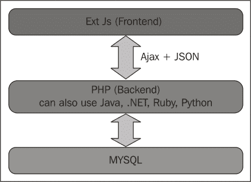

后端模块将使用 PHP 开发。如果你不知道 PHP，无需担心。我们将使用非常基础的代码（无框架），并将重点放在需要在服务器端实现的编程逻辑上。这样，你可以使用任何其他编程语言，如 Java、ASP.NET、Ruby、Python 或任何其他（支持以 JSON 或 XML 格式交换数据，因为这是 Ext JS 使用的通信格式）来应用相同的逻辑。对于数据库，我们将使用 MySQL。我们还将使用 Sakila 示例模式([`dev.mysql.com/doc/sakila/en/`](http://dev.mysql.com/doc/sakila/en/))，这是一个免费的 MySQL 示例数据库，非常适合演示如何在数据库表中执行 **创建、读取、更新和删除/销毁**（**CRUD**）操作，以及使用更复杂的操作，如视图和存储过程（我们将学习如何使用 Ext JS 处理所有这些信息）。

### 注意

如果你是一名 Java 开发者，你可以在[`goo.gl/rv76E2`](http://goo.gl/rv76E2)和[`goo.gl/nNIRuQ`](http://goo.gl/nNIRuQ)找到一些如何将 Java 与 Ext JS 集成的示例代码。

此外，我们还需要安装 Sencha Cmd（我们已经在第一章中安装了 Sencha Cmd，*Sencha Ext JS 概述*）。然而，我们仍然需要执行一些额外的步骤来配置它。一旦配置完成，我们就能创建应用程序结构，定制主题，并制作生产版本。Sencha Cmd 需要 Ruby 与 1.8 或 1.9 版本兼容（2.x 版本将无法使用）。我们还需要安装 Apache Ant（由于 Apache Ant 是用 Java 构建的，因此我们还需要在计算机上安装和配置 Java）。

在我们完成应用程序的实现后，我们将定制主题，因此我们需要安装 Ruby（1.8 或 1.9）以及 Sass 和 Compass 宝石。

为了部署应用程序，我们需要一个 Web 服务器。如果您尚未在计算机上安装任何 Web 服务器，请不要担心。在这本书中，我们将使用 Xampp 作为默认的 Web 服务器。

我们还需要一个浏览器来运行我们的应用程序。推荐使用 Firefox（带 Firebug）或 Google Chrome。

如果您之前提到的任何软件或技术尚未安装在您的计算机上，请不要担心。为了总结在开始有趣的工作之前我们需要安装的所有工具和软件，以下是一个包含下载链接和安装说明的列表（所有项目均适用于 Windows、Linux 和 Mac OS）：

+   带有调试工具的浏览器：

    +   带有 Firebug 的 Firefox：[`www.mozilla.org/firefox/`](https://www.mozilla.org/firefox/) 和 [`getfirebug.com/`](http://getfirebug.com/)

    +   Google Chrome：[www.google.com/chrome](http://www.google.com/chrome)

+   Web 服务器：

    +   Xampp：[`www.apachefriends.org/en/xampp.html`](http://www.apachefriends.org/en/xampp.html)

+   数据库：

    +   MySQL：[`dev.mysql.com/downloads/mysql/`](http://dev.mysql.com/downloads/mysql/)

    +   MySQL Workbench：[`dev.mysql.com/downloads/tools/workbench/`](http://dev.mysql.com/downloads/tools/workbench/)

    +   MySQL Sakila 示例数据库：[`dev.mysql.com/doc/index-other.html`](http://dev.mysql.com/doc/index-other.html) 和 [`dev.mysql.com/doc/sakila/en/index.html`](http://dev.mysql.com/doc/sakila/en/index.html)

+   Sencha Command 所需工具：

    +   Ruby：[`www.ruby-lang.org/en/downloads/`](http://www.ruby-lang.org/en/downloads/)

    +   Sass：[`sass-lang.com/`](http://sass-lang.com/)

    +   罗盘：[`compass-style.org/`](http://compass-style.org/)

    +   Java JDK（Java 7 或更高版本）：[`www.oracle.com/technetwork/java/javase/downloads/index.html`](http://www.oracle.com/technetwork/java/javase/downloads/index.html)

    +   Java 环境变量：[`docs.oracle.com/javase/tutorial/essential/environment/paths.html`](http://docs.oracle.com/javase/tutorial/essential/environment/paths.html)

    +   Apache Ant：[`ant.apache.org/bindownload.cgi`](http://ant.apache.org/bindownload.cgi)

当然，我们还需要 Ext JS SDK 和 Sencha Cmd，这些我们在第一章中下载并安装了，*Sencha Ext JS 概述*。

### 注意

为了帮助你配置所需的开发环境，以便能够从本书创建应用程序，这里有一个逐步演示的视频（逐步完成 Windows 环境——Linux 和 Mac OS 的设置非常相似）：[`youtu.be/B43bEnFBRRc`](http://youtu.be/B43bEnFBRRc)。

# 展示应用程序及其功能

我们将在整本书中开发的应用程序与其他你可能习惯实现的其他 Web 系统非常相似。我们将实现一个 DVD 租赁店管理应用程序（这就是为什么使用 Sakila 示例数据库）。应用程序的一些功能包括安全管理（能够在应用程序中管理用户及其权限）、管理演员、电影、库存和租赁信息。

Ext JS 将帮助你实现目标。它提供了美观的组件、完整的架构、组件重用的可能性（减少了我们的工作量），以及一个非常完整的数据包（使得连接到服务器端和发送、检索信息变得更容易）。

我们将把应用程序分成模块，每个模块将负责应用程序的一些功能。在这本书的每一章中，我们将实现一个模块。

应用程序由以下部分组成：

+   启动屏幕（这样在应用程序仍在启动时，用户就不需要看到空白屏幕）

+   主屏幕

+   登录屏幕

+   用户管理屏幕

+   MySQL 表管理（用于类别和组合框值——静态数据）

+   内容管理控制

对于前面列表中提到的每个模块和屏幕，我们将创建原型，这样我们就可以规划应用程序的工作方式。在这里，你将了解它们中的每一个。

## 启动屏幕

我们的应用程序将有一个启动屏幕，这样在应用程序还在加载初始化之前所需的文件和类时，用户就不需要看到空白页面。以下是一个展示启动屏幕的截图：

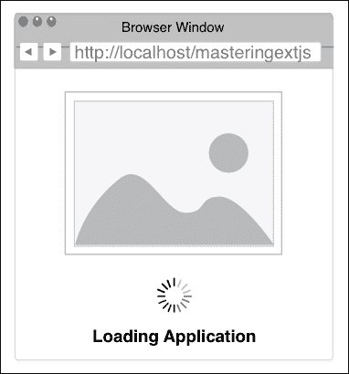

我们将在本章后面介绍这个屏幕的实现。

## 登录屏幕

在应用程序完全加载后，用户将看到的第一个屏幕是登录屏幕。用户将能够输入**用户名**和**密码**。还有一个多语言组合框，用户可以选择系统的语言（多语言功能）。然后，我们有**取消**和**提交**按钮，如下面的截图所示：

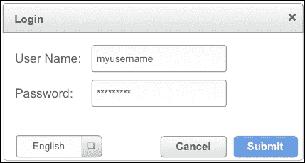

**取消**按钮将重置**登录**表单，而**提交**按钮将触发一个事件，该事件将创建一个 Ajax 请求并将用户凭据发送到服务器进行认证。如果用户认证成功，则显示主屏幕；否则，显示错误消息。

我们将在第三章，*登录页面* 中介绍登录屏幕的实现。

## 主屏幕

应用程序的一般思路是使用边框布局来组织主屏幕。边框布局分为五个区域：北、南、东、西和中心，其中除了东区域外，以下图中都进行了演示：

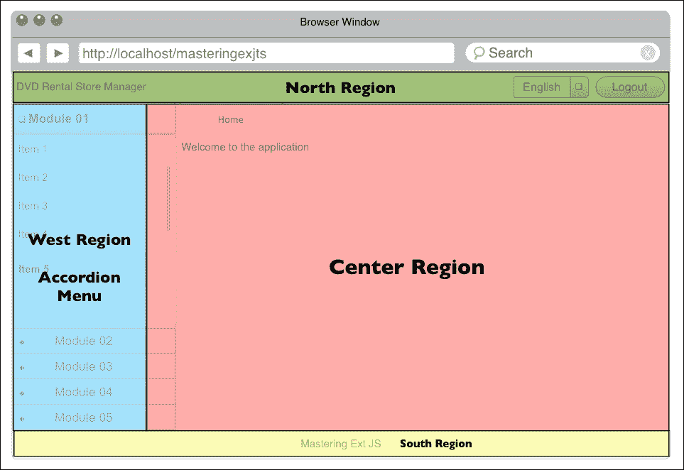

在**中心区域**，我们将有一个标签面板，每个标签代表应用程序的一个屏幕（每个屏幕将有自己的布局）——只有第一个标签不能关闭（**主页**标签）。在**北区域**，我们将有一个包含应用程序名称（**DVD 租赁店管理器**）、多语言组合框（如果用户想要更改应用程序的当前语言）和**注销**按钮的页眉。在**南区域**，我们将有一个包含版权信息的页脚（或者它可以是实施项目的公司或开发者的名称）。在**西区域**，我们将有一个动态菜单（我们将实现用户控制管理）。菜单将是动态的，并将根据用户在应用程序中的权限进行渲染。

主屏幕将看起来大致如下所示：

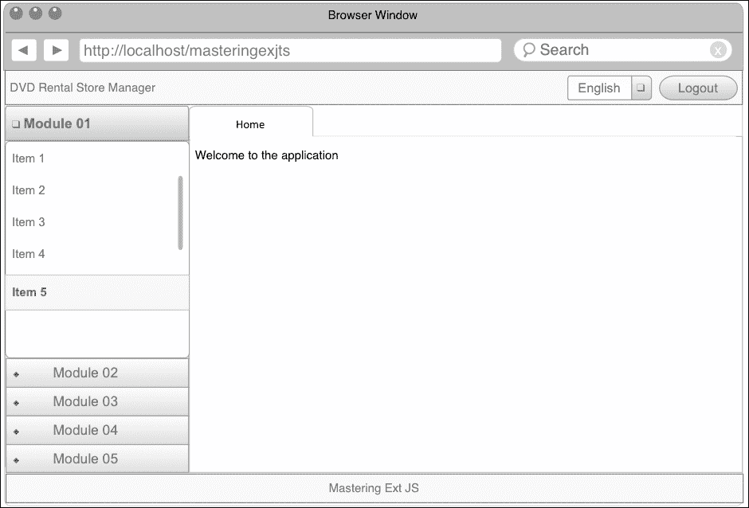

我们将在第四章，*注销和多语言功能* 中介绍主屏幕的实现以及多语言和注销功能。在第五章，*高级动态菜单* 中，我们将介绍如何生成动态菜单。

## 用户管理

在用户控制管理中，用户将能够创建新用户和新组，并为用户分配新角色。用户将能够控制系统权限（哪些用户可以看到系统中的哪些模块）。这是**创建/编辑用户**页面的样子：

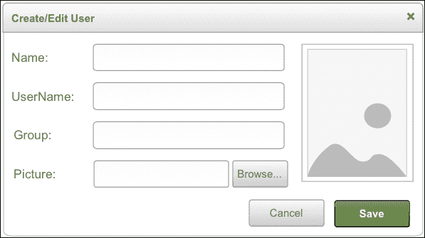

我们将在第六章，*用户管理* 中介绍用户管理的实现。

## MySQL 表管理

每个系统都有被认为是静态数据的信息，例如电影类别、电影语言、组合框选项等。对于这些表，我们需要提供所有 CRUD 选项和过滤选项。此模块的屏幕将非常类似于**MySQL Workbench**中的**编辑表数据**选项，如下面的截图所示：

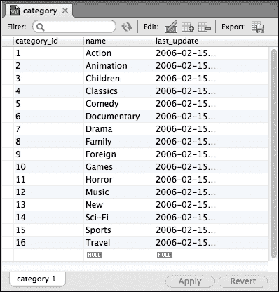

用户将能够编辑网格中的行数据，类似于在 MS Excel 中可以执行的操作。一旦用户完成更改，他们可以点击**保存更改**按钮，将所有修改后的数据保存到服务器和数据库中。以下是如何查看**浏览器窗口**视图：

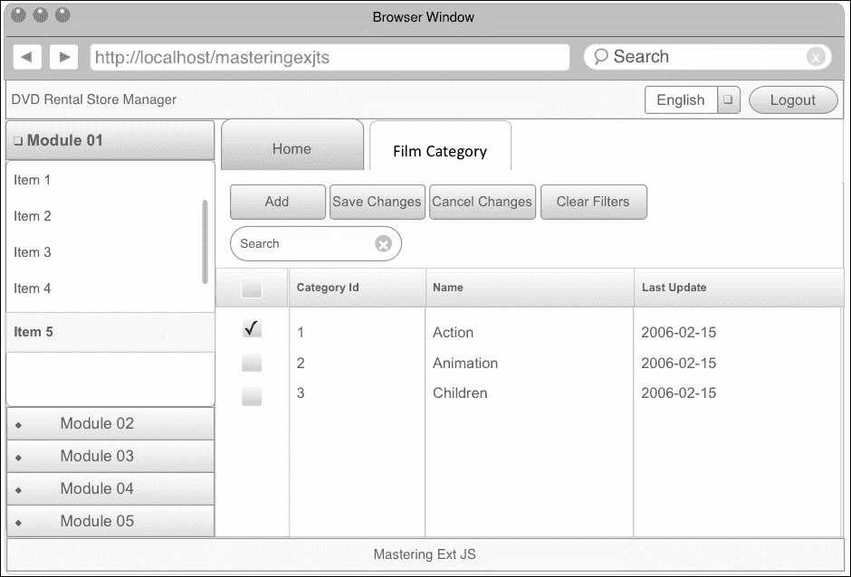

我们将在第七章静态数据管理中介绍这个模块的实现，*静态数据管理*。

## 内容管理控制

在本模块中，用户将能够查看和编辑系统中的核心信息。由于我们将在本模块中处理的数据库表中的大多数都与其他表有关联，因此信息的编辑将更加复杂，涉及主从关系。通常，我们将信息以数据网格（列表或表格）的形式呈现给用户，信息的添加将以弹出窗口内显示的形式进行。

还非常重要的一点是要记住，大多数模块的屏幕将具有类似的功能，并且由于我们将构建一个包含许多屏幕的应用程序，因此设计系统以便尽可能多地重用代码，使系统易于维护并易于添加新功能和能力是非常重要的。以下屏幕展示了本节中讨论的功能：

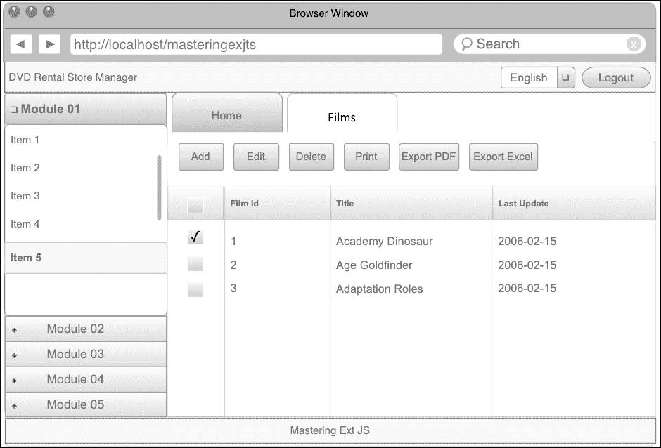

当点击**添加**或**编辑**时，将打开一个新弹出窗口来编辑信息，如下所示：

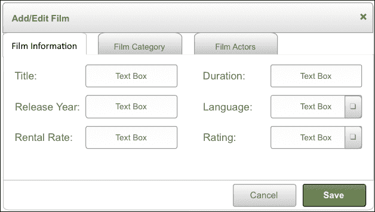

我们将在第八章内容管理和第九章添加额外功能中介绍这个模块的实现，*添加额外功能*。

## 图表

在图表模块中，我们将使用 Ext JS 创建图表。对于相同的图表信息，用户将能够生成不同类型的图表。用户还可以将图表导出为图像、SVG 或 PDF，如下所示：

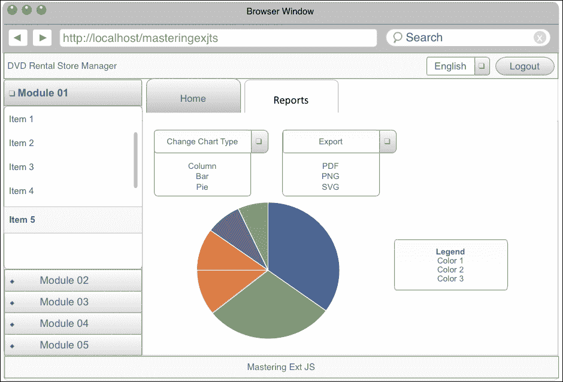

我们将在第九章添加额外功能中介绍这个模块的实现，*添加额外功能*。

# 使用 Sencha Cmd 创建应用程序

让我们开始动手编写代码。我们将要做的第一件事是使用 MVC 结构创建应用程序。从现在起，我们将称之为 Sencha 命令（Sencha Cmd），它为我们提供了自动创建应用程序结构的功能。利用 Sencha Cmd 不仅因为它为我们根据 MVC 架构创建应用程序结构，而且还因为它提供了我们在软件上线和定制主题时需要的所有文件——我们将在后面的章节中了解更多关于这一点。

## 简单谈谈 MVC

**MVC**代表**模型-视图-控制器**。它是一种软件架构模式，将信息的表示与用户的交互分离。模型表示应用程序数据，视图表示数据的表示输出（表单、网格、图表），控制器协调输入，将其转换为模型或视图的命令。

Ext JS 支持 MVC**模式**，这是一种模型-视图-控制器模式（作为架构选项之一，它还提供了**模型-视图-视图模型**（MVVM），我们将在后面讨论）。模型是我们想要在应用程序中操作的数据的表示，是数据库中表的表示。视图是我们创建的所有组件和屏幕，用于管理模型的信息。由于 Ext JS 是事件驱动的，所有视图实例在用户与之交互时都会触发事件，控制器可以配置为监听从视图引发的事件，开发者可以实施自定义处理程序来响应这些事件。控制器还可以将命令重定向到模型（或存储）或视图。在 Ext JS 中，存储与在服务器端技术中使用的**数据访问对象**（DAO）模式非常相似（在第一章

## 创建应用程序

我们将在 Xampp 目录的`htdocs`文件夹中创建应用程序。我们的应用程序将命名为`masteringextjs`。

在我们开始之前，让我们看看`htdocs`文件夹的样貌：

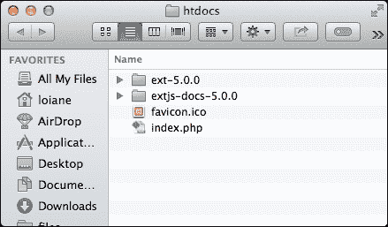

我们仍然有原始的 Xampp 文件，以及 Ext JS 5 SDK 文件夹和 Ext JS 5 文档文件夹。

下一步是使用 Sencha Cmd 为我们创建应用程序。为此，我们需要打开操作系统附带的终端应用程序。对于 Linux 和 Mac OS 用户，这将是一个终端应用程序。对于 Windows 用户，它是命令提示符应用程序。

这里是我们将要执行的步骤：

1.  首先，我们需要将当前目录更改为 Ext JS 目录（在本例中为 `htdocs/ext-5.0.0`）。

1.  然后，我们将使用以下命令：

    ```js
    sencha generate app Packt ../masteringextjs

    ```

`sencha generate app` 命令将在 `htdocs` 文件夹内创建 `masteringextjs` 目录，并包含 ExtJS 所需的 MVC 架构所需的必要文件结构。`Packt` 是我们应用程序的命名空间名称，这意味着我们创建的每个类都将以 `Packt` 开头，例如，`Packt.model.Actor`，`Pack.view.Login` 等。命令传递的最后一个参数是应用程序将被创建的目录。在这种情况下，它位于 `htdocs` 文件夹内的 `masteringextjs` 文件夹中。

### 注意

命名空间用于变量和类的范围，以确保它们不是全局的，并深入定义它们的嵌套结构。Sencha 在 [`goo.gl/2iLxcn`](http://goo.gl/2iLxcn) 有关于命名空间的好文章。

命令执行完成后，我们将得到以下截图所示的内容：

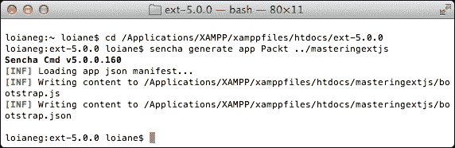

### 注意

本书中的源代码是用 Ext JS 5.0 编写的（因此您将看到带有 5.0 版本的截图），并在发布后升级到 5.1。因此，一旦您下载其源代码，它将与 5.1 版本兼容。从 5.0 升级到 5.1 的源代码没有任何影响。

但为什么我们需要创建这样的项目结构呢？以下是由 Ext JS 应用程序使用的结构：

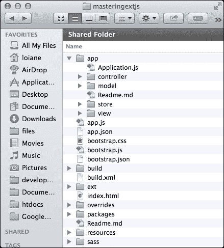

### 注意

关于 `Sencha generate app` 命令的更多信息，请参阅 [`docs.sencha.com/cmd/5.x/extjs/cmd_app.html`](http://docs.sencha.com/cmd/5.x/extjs/cmd_app.html)。

让我们看看每个文件夹的作用。

首先，我们有 `app` 文件夹。这是我们创建应用程序所有代码的地方。在 `app` 文件夹内，我们还可以找到以下文件夹：`controller`，`model`，`store` 和 `view`。我们还可以找到 `Application.js` 文件。让我们详细了解一下它们。在 `model` 文件夹中，我们将创建所有代表 Model 的文件，Model 是一个 Ext JS 类，它代表一组字段，这意味着它是我们应用程序管理的对象（演员、国家、电影等）。它与服务器端上的类类似，只是具有类的属性以及用于表示数据库表的 getter 和 setter 方法。

在`store`文件夹中，我们将创建所有的`Store`类，这些类是模型实例集合的缓存。`store`文件夹也具有类似于 DAO**—**在服务器端语言中用于在数据库上执行 CRUD 操作的类的功能。由于 Ext JS 不直接与数据库通信，因此使用`Store`类与服务器端或本地存储（使用 Proxy）进行通信。Proxies 由 Store 或 Model 实例用于处理 Model 数据的加载和保存，这是我们配置如何与服务器通信（使用 Ajax 和使用 JSON 或 XML 格式化数据，以便客户端和后端能够相互理解）的地方。

在`view`文件夹中，我们将创建所有的`view`类，也称为**用户界面组件**（**UI 组件**），例如网格、树、菜单、表单、窗口等。

最后，在`controller`文件夹中，我们可以创建处理由组件（由于组件的生命周期或用户与组件的某些*交互*）触发的事件的类。我们始终需要记住 Ext JS 是*事件驱动的*，在`Controller`类中，我们将控制这些事件并更新任何 Model、View 或 Store（如果需要）。触发的一些事件示例包括按钮的点击或鼠标悬停，网格行的`itemclick`事件等。

### 注意

我们也可以在`view`文件夹内创建`ViewController`类。这在我们使用 MVVM 模式时适用，我们将在下一章中更详细地讨论这一点。

MVC 的`app`文件夹结构已经创建。现在，我们将把 Ext JS SDK（`extjs`文件夹）复制到`masteringExtjs`文件夹中，我们还将创建一个名为`app.js`的文件。我们将在本章后面编辑此文件。

我们还有一个`Application.js`文件。这是我们的应用程序的入口点。我们稍后会回到这个话题。

`masteringextjs`目录包含一些额外的文件：

+   `app.js`：此文件从`Application.js`文件继承代码。这是应用程序的入口点。这是由 Ext JS 调用来初始化应用程序的文件。我们应该避免更改此文件`app.json`：这是应用程序的配置文件。在此文件中，我们可以添加额外的 CSS 和 JS 文件，这些文件应与应用程序一起加载，例如图表和特定地区的配置。我们将在本书中对此文件进行一些更改。

+   `bootstrap.css`、`bootstrap.json`和`bootstrap.js`：由 Sencha Cmd 创建，这些文件*不应该被编辑*。CSS 文件包含了应用程序使用的主题的导入（默认情况下是所谓的**Neptune 主题**）。在构建完成后，这些文件的内容会更新为 CSS 定义，JavaScript 文件将包含在执行前需要加载的依赖项、自定义`xtypes`和其他类系统功能。

+   `build.xml`：Sencha Cmd 使用 Apache Ant（[`ant.apache.org/`](http://ant.apache.org/)），这是一个用于构建 Java 项目的 Java 工具。Ant 使用一个名为`build.xml`的配置文件，其中包含所有必需的配置和命令来构建项目。Sencha Cmd 使用 Ant 作为后台构建 Ext JS 应用程序的引擎（而我们需要简单地使用命令）。这就是为什么我们需要安装 Java SDK 来使用一些 Sencha Cmd 功能的原因。

+   `index.html`：这是我们项目的索引文件。这是当执行我们的应用程序时浏览器将渲染的文件。在这个文件中，我们将找到`bootstrap.js`文件的导入。我们应该避免在这个文件中做任何更改，因为当我们构建应用程序时，Sencha Cmd 将在`build`文件夹中生成一个新的`index.html`文件，丢弃我们对`index.html`文件所做的所有更改。如果我们需要包含一个 JS 或 CSS 文件，我们应该在`app.json`文件中定义这个文件。

+   `ext`：在这个文件夹中，我们可以找到所有 Ext JS 框架文件（`ext-all`、`ext-all-debug`和`ext-dev`），其源代码，以及包含我们的应用程序和主题相关包的`packages`文件夹等。

+   `覆盖`：当我们创建应用程序时，这个文件夹是空的。我们可以添加我们项目需要的任何类覆盖和自定义。

+   `包`：在这个文件夹中，我们可以创建自己的包。一个包可以是一个新的主题，例如。其概念类似于 Ruby 中的*gem*或 Java 和.NET 中的自定义 API（例如，在 Java 项目中使用 Apache Ant，我们需要包含 Apache Ant 的`jar`文件）。

+   `资源`：在这个文件夹中，我们将放置我们应用程序的所有图片。我们也可以放置其他 CSS 文件和字体文件。

+   `sass`：在这个文件夹中，我们可以找到一些用于创建主题的 Sass 文件。我们应用程序的任何自定义 CSS 都将创建在这个文件夹中。

现在让我们获取第一手知识吧！我们将现在探索之前在开发我们的应用程序过程中描述的一些概念，以便更好地理解它们。

### 使用 watch 命令查看更改

Sencha Cmd 还有一个在开发 Ext JS 应用程序时非常有用的命令，那就是`watch`命令。在本书开发应用程序的过程中，我们将一直使用这个命令。

让我们执行这个命令并看看它会做什么。首先，我们需要将目录更改为`masteringextjs`文件夹（这是我们使用 Sencha Cmd 生成的应用程序文件夹）。然后，我们可以执行`sencha app watch`命令。以下截图展示了这个命令的输出：

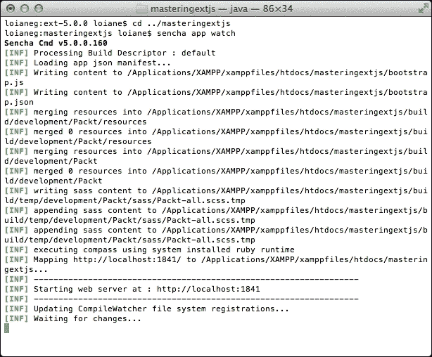

这个命令会查找 Ext JS 应用程序文件夹内部的所有更改。如果我们创建了一个新文件或更改了任何文件，这个命令就会知道已经进行了更改，并将生成一个应用程序构建。

### 小贴士

您可以最小化终端应用程序，让命令在后台执行。如果我们关闭终端，命令将不再活跃，我们必须再次执行它。

它还将启动一个位于 `http://locahost:1841` 的网络服务器，我们可以像以下截图所示那样访问我们的应用程序：

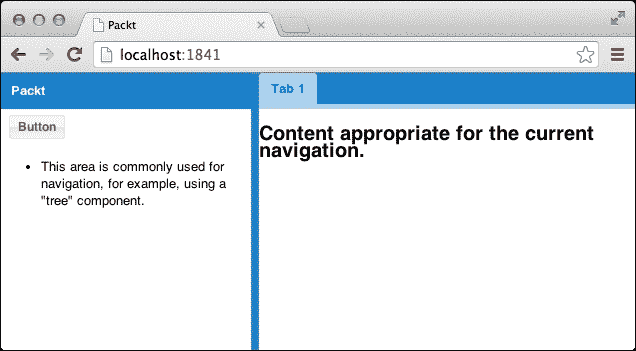

因此，这就是使用 Sencha Cmd 创建的应用程序的外观。Sencha Cmd 还在 `app` 文件夹内部创建了一些文件，我们可以根据需要更改它们。我们将在下一章中介绍这些文件。

我们也可以通过访问 `http://localhost/masteringextjs` 来从 Xampp 的 `localhost` URL 执行应用程序，如下所示：

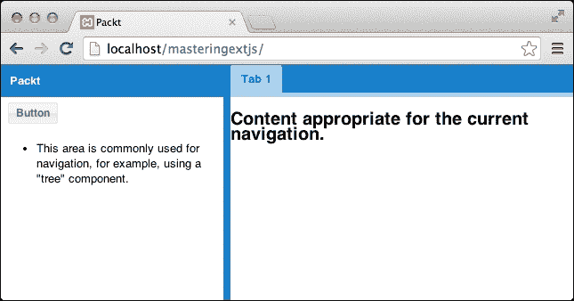

### 小贴士

通过 `http://localhost/masteringextjs` 的输出与通过 `http://locahost:1841` 访问的输出完全相同。您可以使用任何一个。但请注意，`http://locahost:1841` 只在我们使用 `sencha app watch` 命令时才会活跃。由于我们将使用 PHP 并应用一些其他配置，我们将全书使用 `http://localhost/masteringextjs`。

### 在我们的应用程序中应用第一次更改

我们知道 Sencha Cmd 为我们创建了一些文件，但我们不希望那个屏幕是用户首先看到的。我们希望用户先看到登录屏幕，然后进入主屏幕。

要实现这一点，我们需要在 `app.js` 文件中进行一些更改。如果我们打开文件，我们会看到以下内容：

```js
Ext.application({
    name: 'Packt',

    extend: 'Packt.Application',

 autoCreateViewport: 'Packt.view.main.Main'
});
```

我们将更改前面高亮的代码，改为以下代码：

```js
autoCreateViewport: false
```

我们将在这个文件中进行的唯一更改就是，我们应该避免更改它。

这行代码的作用是在应用程序初始化后自动创建 `Packt.view.main.Main` 组件，但我们不希望这样。我们希望首先显示启动屏幕，然后是登录屏幕。这就是为什么我们要求应用程序不要自动渲染视口。

注意，运行 `sencha app watch` 命令的终端将输出几行，这意味着应用程序将被刷新，开发构建更新。每次我们进行更改并保存时，都会发生这种情况。

如果我们刷新浏览器，我们应该看到一个空页面。这意味着我们可以开始开发我们的 DVD 租赁店应用程序。

### 理解 Application.js 文件

如果我们打开 `app/Application.js` 文件，它看起来是这样的：

```js
Ext.define('Packt.Application', { // #1
    extend: 'Ext.app.Application',

    name: 'Packt', // #2

    views: [ // #3

    ],

    controllers: [ // #4
        'Root'
    ],

    stores: [ // #5

    ],

    launch: function () { // #6
        // TODO - Launch the application
    }
});
```

`app.js` 文件从 `Application.js` 文件继承了应用程序的所有行为。此文件用作应用程序的入口点。

在前面代码的第一行，我们有 `Ext.application` 的声明（`#1`）。这意味着我们的应用程序将有一个单页应用（[`en.wikipedia.org/wiki/Single-page_application`](http://en.wikipedia.org/wiki/Single-page_application)），并且应用程序的父容器将是视口。视口是一个特殊的容器，代表在 HTML 页面的 `<body>` 标签内渲染的可视应用程序区域（`<body></body>`）。

在 `Ext.application` 内部，我们还可以声明应用程序使用的 `views`（`#3`）、`controllers`（`#4`）和 `stores`（`#5`）。随着我们为项目创建新的类，我们将在该文件中添加这些信息。

我们需要声明应用程序的 `name` 属性，这将作为应用程序的命名空间（`#2`）。在这种情况下，Sencha Cmd 使用了我们在 `sencha generate app` 命令中使用的命名空间。

我们还可以在 `Ext.application` 内部创建一个 `launch` 函数（`#6`）。这个函数将在所有应用程序的控制器初始化之后被调用，这意味着应用程序已经完全加载。因此，这个函数是实例化我们的主视图的好地方，在我们的例子中，这将是我们登录屏幕。

### 提示

我们在使用 `Ext.application` 时是否需要使用 `Ext.onReady`？

答案是否定的。我们只需要使用其中一个选项。根据 Ext JS API 文档，`Ext.application` *在页面准备就绪后加载 Ext.app.Application 类，并使用给定的配置启动它*，而 `Ext.onReady` *添加一个新监听器，在所有必需的脚本完全加载时执行*。

如果我们查看 `Ext.application` 的源代码，我们有：

```js
Ext.application = function(config) {
    Ext.require('Ext.app.Application');
    Ext.onReady(function() {
        new Ext.app.Application(config);
    });
};
```

这意味着 `Ext.application` 已经调用了 `Ext.onReady`，所以我们不需要重复调用它。

因此，当您有一些要显示的组件，而这些组件不在 MVC 架构中（类似于 jQuery 的 `$(document).ready()` 函数）时，请使用 `Ext.onReady`；当您正在开发 Ext JS MVC 应用程序时，请使用 `Ext.application`。

以下图表展示了 Ext JS 应用程序启动期间执行的所有高级步骤。一旦执行了这些步骤，应用程序就完全加载了：

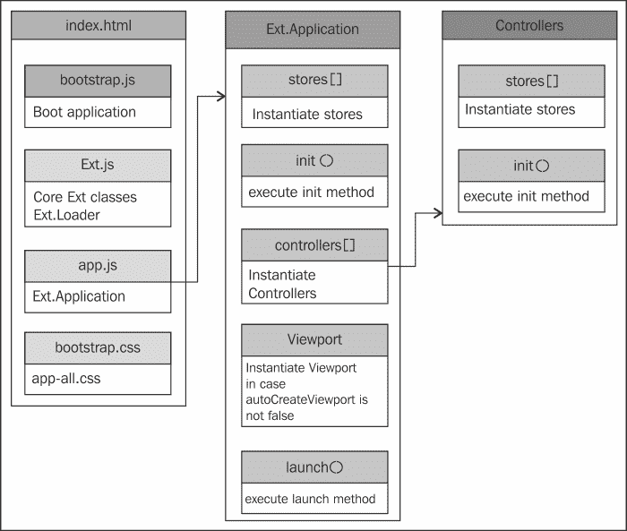

既然我们已经知道了 Ext JS 应用程序的初始化方式，我们就可以开始构建我们的应用程序了。

# 创建加载页面

当与大型 Ext JS 应用程序一起工作时，在加载应用程序时出现短暂的延迟是正常的。这是因为 Ext JS 正在加载所有必需的类，以便使应用程序运行，同时，所有用户看到的是一个空白的屏幕，这可能会对他们造成烦恼。解决这个问题的非常常见的解决方案是有一个加载页面，也称为启动屏幕。

因此，让我们在我们的应用程序中添加一个类似于以下截图所示的启动屏幕：

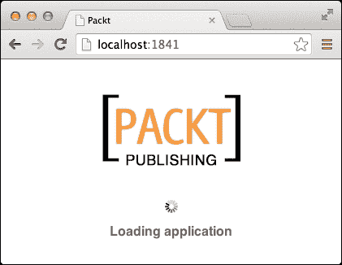

首先，我们需要了解这个启动屏幕是如何工作的。在用户加载应用程序后，启动屏幕将被显示。应用程序将在加载所有必需的类和代码的同时显示启动屏幕，以便应用程序可以被使用。

我们已经知道当应用程序准备好使用时，它会调用`launch`函数。所以我们知道我们需要在`launch`方法中移除启动屏幕。现在的问题是：在`Ext.application`的哪个位置可以调用启动屏幕？答案是`init`函数内部。`init`函数在应用程序启动时被调用，这给了所有必需的代码加载一些时间，然后调用`launch`函数。

现在我们知道了启动屏幕是如何工作的，让我们来实现它。

在`Ext.application`内部，我们在`launch`函数声明之后实现一个名为`init`的函数：

```js
init: function () {
    var me = this; // #1
    me.splashscreen = Ext.getBody().mask( // #2
        'Loading application', 'splashscreen'
    ); 
}
```

我们需要做的只是将一个`mask`方法（`#2`）应用到应用程序的 HTML 主体中（`Ext.getBody()`）。这就是为什么我们调用`mask`方法，传递加载信息（`Loading Application`），并应用一个 CSS 样式，这将是一个加载的`GIF`文件，它已经是 Ext JS CSS 的一部分（`splashscreen`）。`mask`方法将返回一个`Ext.dom.Element`类，我们稍后需要对其进行操作（从 HTML 主体中移除`mask`方法），因此我们需要保留对这个`Ext.dom.Element`类的引用，并将这个引用作为`Ext.application`的一部分存储为变量（`me.splashscreen`）。`me`变量是对`this`（`#1`）的引用，它指向`Ext.application`本身。

仅使用`init`方法的代码，我们将有一个如下所示的加载屏幕：

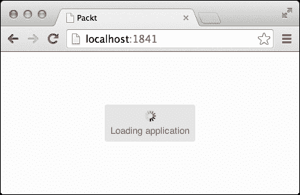

如果这对你来说足够了，那就没问题。但让我们更进一步，定制加载屏幕，添加一个标志图像，使其看起来像这个主题的第一张图片，这是我们最终的输出。

要将图片添加到我们的启动屏幕中，我们需要创建一个 CSS 样式。我们可以创建一个 CSS 文件并将其包含在我们的`index.html`文件中，但我们将遵循最佳实践，在`sass`文件夹内创建一个`Sass`文件。

Ext JS 有一种更好的方式来处理自定义 CSS 样式。当我们完成应用程序的实现后，我们想要定制主题，并想要创建一个生产构建。生产构建只包含执行应用程序所需的 Ext JS SDK 源代码，以及我们的应用程序源代码。此代码将被混淆和优化，以便用户可以下载一个最小尺寸的文件。生产构建也会对 CSS 文件做同样的事情；它将优化并添加执行应用程序所需的 Ext JS 组件的 CSS。当然，我们希望我们创建的任何自定义 CSS 也得到优化。

要做到这一点，我们将在 `sass/etc` 文件夹中使用 Sass 创建自定义 CSS（[`sass-lang.com/`](http://sass-lang.com/))。因此，让我们在 `sass/etc` 文件夹中创建一个名为 `all.scss` 的文件。

在资源内部，我们还将创建一个包含 Packt 标志图像的 `images/app` 文件夹（你可以从本书的源代码中复制 Packt 标志图像）。

创建这些文件后，我们的应用程序结构将如下所示：

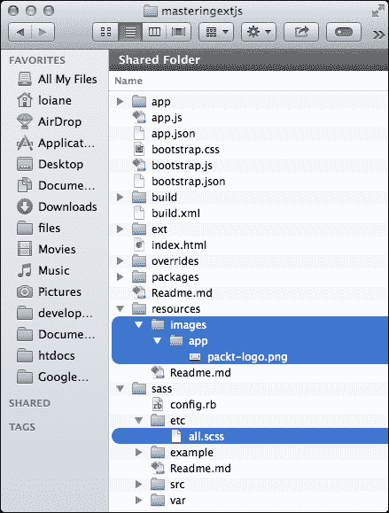

而 `all.scss` 文件将看起来像这样：

```js
.x-mask.splashscreen {
  background-color: white;
  opacity: 1;
}

.x-mask-msg.splashscreen,
.x-mask-msg.splashscreen div {
  font-size: 16px;
  font-weight: bold;
  padding: 30px 5px 5px 5px;
  border: none;
  background: {           // #1
    color: transparent;   // #2
    position: top center; // #3
  };
}

.x-message-box .x-window-body .x-box-inner {
  min-height: 110px !important;
}

.x-splash-icon {
  background-image: url('images/app/packt-logo.png') !important;
  margin-top: -30px;
  height: 70px;
}
```

这是一段纯 CSS 代码，除了行 `#1`、`#2` 和 `#3`，这是 Sass 代码。

### 注意

如果你不太熟悉 Sass，它是一种编写 CSS 代码的新方法。Sass 使用 **不要重复自己**（**DRY**）原则，这意味着你可以使用变量和嵌套语法（如我们在 `#1` 中使用的）以及导入其他 Sass 文件（允许你创建模块化 CSS），以及其他功能。Ext JS 引擎主题使用 Sass 和 Compass（一个 Sass 框架）。Sass 是 Less 的替代品。要了解更多关于 Sass 的信息，请访问 [`sass-lang.com/`](http://sass-lang.com/)。

行 `#1`、`#2` 和 `#3` 将与以下内容相同：

```js
background-color: transparent;
background-position: top center;
```

上述代码是在编译 Sass 文件后生成的 CSS 代码。

### 注意

当 Sencha Cmd 进行构建时，我们的 `all.scss` 文件中的代码将被添加到为我们的应用程序生成的单个 CSS 文件中，该文件包含 Ext JS CSS 代码以及我们的代码。

现在，让我们回到 `Application.js` 文件，并继续向 `init` 函数中添加一些代码。

我们在已有的代码之后添加以下代码：

```js
me.splashscreen.addCls('splashscreen');
```

我们将向加载 `<div>` 标签添加一个新的 CSS 样式。请注意，以下来自 `app.css` 的样式将被应用：`.x-mask.splashscreen` 和 `.x-mask-msg.splashscreen div`。这将使背景变为白色而不是灰色，并且它还将改变 “`加载应用程序`” 消息的字体。

生成的 HTML 将如下所示：

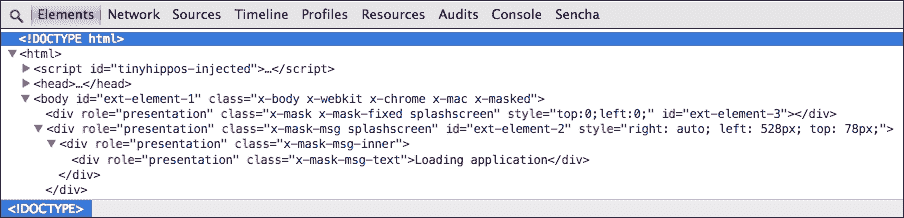

现在，我们将在 `init` 函数中添加以下代码：

```js
Ext.DomHelper.insertFirst(Ext.query('.x-mask-msg')[0], {
     cls: 'x-splash-icon'
});
```

上述代码将搜索包含 `.x-mask-msg` 类的第一个 `<div>` 标签（`Ext.query('.x-mask-msg')[0]`），并将一个新的 `<div>` 标签作为子标签添加，其类为 `x-splash-icon`，它将负责在加载消息上方添加标志图像。

生成的 HTML 将如下所示：

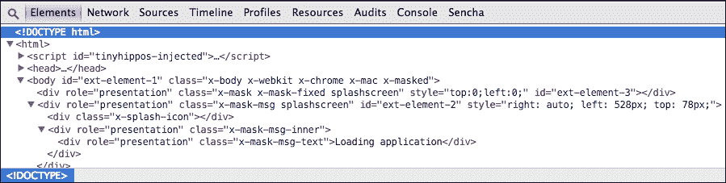

执行上述代码后，我们将得到本主题开头截图所示的输出。

现在我们已经显示了启动屏幕。我们需要在所有应用程序需要的代码加载完毕后，在 `launch` 函数中移除启动屏幕；否则，加载信息将无限期地显示在那里！

要移除启动屏幕，我们只需要在 `launch` 函数中添加以下代码，该代码涉及从 HTML 身体中移除遮罩：

```js
Ext.getBody().unmask();
```

然而，突然移除遮罩并不好，因为用户甚至看不到加载信息。在应用程序准备就绪后，除了移除遮罩，我们还可以给用户 2 秒钟的时间来查看加载信息：

```js
var task = new Ext.util.DelayedTask(function() { // #1
     Ext.getBody().unmask(); // #2
});

task.delay(2000); // #3
```

为了做到这一点，我们使用`DelayedTask`类（`#1`），这是一个在给定毫秒数（`#3`）超时后执行函数的机会的类。因此，在以下任务的情况下，我们在 2 秒（2,000 毫秒）的超时后从 HTML 主体中移除遮罩（`#2`）。

如果我们现在测试输出，它工作得很好，但对于用户来说仍然不好。如果我们能添加一个遮罩动画会更好。所以，我们将添加一个淡出动画（它动画元素的透明度——从不透明到透明），动画之后，我们将移除遮罩（在`Ext.util.DelayedTask`函数内部）。以下代码是本段提供的解释的演示：

```js
me.splashscreen.fadeOut({
    duration: 1000,
    remove:true
});
```

执行此代码后，请注意加载信息仍在显示。我们需要分析生成的 HTML 以找出原因。

在我们调用`fadeOut`函数之前，这是加载信息的 HTML：

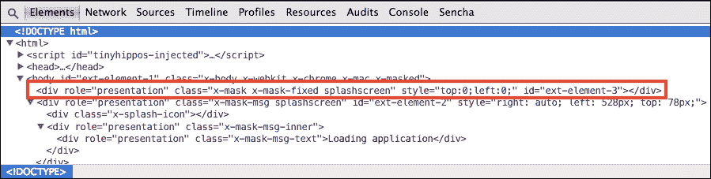

在我们调用`fadeout`函数之后，HTML 将是以下内容：

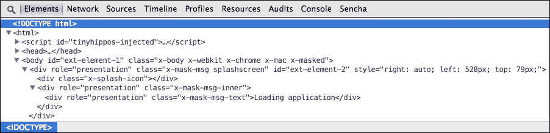

只有具有`splashscreen`类的第一个`<div>`标签被淡出。我们还需要淡出包含标志和加载信息的具有`x-mask-msg splashscreen`类的`<div>`标签。为此，我们可以使用以下方法，该方法将获取`splashscreen`节点的下一个兄弟节点，如下所示：

```js
me.splashscreen.next().fadeOut({
    duration: 1000,
    remove:true
});
```

输出将是一个用户可以看到的愉快动画。同时请注意，`splashscreen` `<div>`标签已从生成的 HTML 中删除，如下所示：

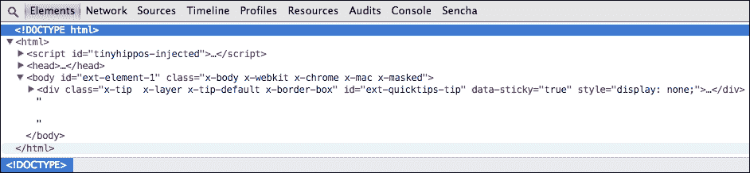

`launch`函数的完整代码如下：

```js
launch: function () {
    var me = this;

    var task = new Ext.util.DelayedTask(function() {

        //Fade out the body mask
        me.splashscreen.fadeOut({
            duration: 1000,
            remove:true
        });

        //Fade out the icon and message
        me.splashscreen.next().fadeOut({
            duration: 1000,
            remove:true,
            listeners: { // #1
                afteranimate: function(el, startTime, eOpts ){//#2
                    console.log('launch') // #3
                }
            }
        });
    });

    task.delay(2000);
},
```

### 提示

**下载示例代码**

您可以从您在[`www.packtpub.com`](http://www.packtpub.com)的账户下载示例代码文件，以获取您购买的所有 Packt Publishing 书籍。如果您在其他地方购买了这本书，您可以访问[`www.packtpub.com/support`](http://www.packtpub.com/support)并注册，以便将文件直接通过电子邮件发送给您。

为了使我们的启动屏幕更加美观，我们将监听（`#1`）`fadeOut`方法的`afteranimate`事件（`#2`），以便我们可以显示我们应用程序的初始组件。我们将展示一个将在下一章实现的登录屏幕。现在，我们将添加一个控制台消息（`#3`），以便知道我们需要在哪里调用初始组件。在 Internet Explorer 中，`console.log`将不起作用；相反，您可以使用`window.console.log`。

### 注意

注意，我们用来显示加载信息遮罩并移除它的所有代码都是`Ext.dom.Element`类的一部分。这个类封装了一个**文档对象模型**（**DOM**）元素，我们可以使用类的方法来管理它。这个类是`Ext Core`库的一部分，它是 Ext JS 框架的基础之一。

# 摘要

在本章中，我们深入探讨了本书各章节中将实现的应用程序。我们还涵盖了创建此应用程序的开发环境所需的所有要求。你学习了如何创建 Ext JS MVC 应用程序的初始结构。

你还通过示例学习了如何创建启动屏幕（也称为加载屏幕），使用`Ext.dom.Element`类操作 DOM。你学习了启动 Ext JS 应用程序的步骤，以及从`Ext.application`中学习`init`和`launch`方法之间的区别。我们让`Application.js`准备好显示其第一个屏幕，这将是一个登录屏幕，你将在下一章中学习如何实现它。
