# 第三章：登录页面

对于我们想要通过用户提供的凭据来识别和验证用户以控制对系统访问的应用程序，登录页面是非常常见的。一旦用户登录，我们可以跟踪用户执行的操作。我们还可以限制对系统某些功能和屏幕的访问，这些功能和屏幕我们不希望特定用户或特定用户组访问。

在本章中，我们将涵盖：

+   创建登录页面

+   在服务器上处理登录页面

+   在**密码**字段中添加大写锁定警告信息

+   按下*Enter*键时提交表单

+   在发送到服务器之前加密密码

# 登录界面

**登录**窗口将是我们在本项目中要实现的第一视图。我们将逐步构建它，如下所示：

+   用户将输入用户名和密码进行登录

+   客户端验证（登录所需的用户名和密码）

+   按下*Enter*键提交登录表单

+   在发送到服务器之前加密密码

+   密码大写锁定警告（类似于 Windows 操作系统）

+   多语言功能

除了我们将在下一章中实现的多语言功能外，我们将在此主题的其余部分实现所有其他功能。因此，在实现结束时，我们将拥有一个如下所示的**登录**窗口：

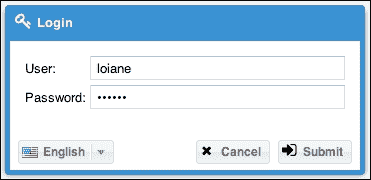

让我们开始吧！

# 创建登录界面

在`app/view`目录下，我们将创建一个新的文件夹来组织所有与**登录**屏幕相关的源代码，命名为`login`。在`login`文件夹内，我们还将创建一个名为`Login.js`的新文件。在这个文件中，我们将实现用户将在屏幕上看到的全部代码。

在`view/login/Login.js`内部，我们将实现以下代码：

```js
Ext.define('Packt.view.login.Login', { // #1
    extend: 'Ext.window.Window',       // #2

    xtype: 'login-dialog',             // #3

    autoShow: true,                    // #4
    height: 170,                       // #5
    width: 360,                        
    layout: {
        type: 'fit'                    // #7
    },
    iconCls: 'fa fa-key fa-lg',        // #8
    title: 'Login',                    // #9
    closeAction: 'hide',               // #10
    closable: false,                   // #11
    draggable: false,                  // #12
    resizable: false                   // #13
});
```

在第一行（`#1`），我们有类的定义。要定义一个类，我们使用`Ext.define`，这是一个`Ext`单例类的`define`方法调用，它接受两个参数：类名（`#1`）和包含类配置的对象字面量（`#2`–`#13`）。

我们还需要注意类的名称。这是 Sencha 在 Ext JS MVC 项目中建议的公式：*应用程序命名空间 + 包名 + JS 文件名*。在上一章中，我们将命名空间定义为`Packt`（我们传递给`sencha generate app`命令的应用程序名称）。例如，如果我们打开由 Sencha Cmd 创建的现有文件（如`app/view/main/Main.js`文件），我们会注意到类的名称以`Packt`开头。因此，我们将在此书中创建的所有类都将以命名空间`Packt`开头。

我们正在为这个项目创建一个视图，因此我们将在`view`文件夹下创建 JS 文件。为了组织目的，我们创建了一个名为`login`的子文件夹。然后，我们创建的文件名为`Login.js`；因此，我们将丢弃`.js`，只使用`Login`作为视图的名称。将所有这些放在一起，我们得到`Packt.view.login.Login`，这将是我们的类名。非常重要的一点是，类名必须遵循如上所述的目录布局；否则，我们可能会在代码中得到错误，表示 Ext JS 没有找到该类。以下截图显示了项目目录布局和类名之间的依赖关系：

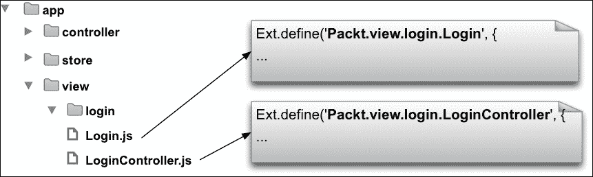

然后，我们说`login`类将扩展自`Window`类（`#2`）。回顾我们在第一章中介绍的内容，*Sencha Ext JS 概述*，我们可以在 Ext JS 中使用继承。`login`类将从`Window`类继承行为（它是`Component`类的子类）。`window`组件代表一个在浏览器中渲染为中心的弹出窗口。

### 提示

如需了解更多关于窗口组件的信息，请访问[`docs.sencha.com/extjs/5.0.0/apidocs/#!/api/Ext.window.Window`](http://docs.sencha.com/extjs/5.0.0/apidocs/#!/api/Ext.window.Window)。有关继承的更多详细信息，请阅读[`goo.gl/v4bmq8`](http://goo.gl/v4bmq8)。

我们还分配了这个类：`xtype`（`#3`）。`xtype`类是一个较短的名称，可以用它来实例化类，而不是使用它的完整名称。我们还可以使用配置`alias`而不是`xtype`。

扩展自组件的类的`alias`总是以`widget`开头，后面跟着我们想要分配的`alias`或`xtype`类。如果我们想使用`alias`配置而不是`xtype`，我们可以使用`alias: 'widget.login-dialog'`而不是`xtype: 'login-dialog'`。结果将相同；这只是个人偏好的问题。

`xtype`和`alias`的命名约定是小写。还重要的是要记住，别名在应用程序中必须是唯一的。在这种情况下，我们想将`xtype`类`login`分配给这个类，以便以后我们可以使用它的`alias`（与`xtype`相同）来实例化这个相同的类。例如，我们可以以五种不同的方式实例化`Login`类：

+   选项 1：使用类的完整名称，这是最常用的方法：

    ```js
    Ext.create('Packt.view.login.Login');
    ```

+   选项 2：在`Ext.create`方法中使用`alias`：

    ```js
    Ext.create('widget.login-dialog');
    ```

+   选项 3：使用`Ext.widget`，它是`Ext.ClassManager.instantiateByAlias`的简写：

    ```js
    Ext.widget('login-dialog');
    ```

+   选项 4：将`xtype`作为另一个组件的项目：

    ```js
    items: [
      {
        xtype: 'login-dialog'
      }
    ]
    ```

+   选项 5：使用`new`关键字：

    ```js
    new Packt.view.login.Login();
    ```

在这本书中，我们将最常使用选项 1、3 和 4。选项 1、2、3 和 5 返回实例化组件的引用。

选项 5 不是一个好的实践。尽管选项 4 和 5 是 Ext JS 3 之前实例化类的唯一方式，但其他选项是在 Ext JS 4 中引入的，并且选项 5 已经弃用。

### 小贴士

尽管选项 5 在 Ext JS 4 及其后续版本中已经弃用，但我们仍然可以在 Ext JS 文档和官方 Ext JS 示例中找到一些使用`new`关键字的代码。但不要因此感到困惑。选项 5 应该总是避免使用！

然后我们将`autoShow`配置为`true`（`#4`）。考虑以下代码行：

```js
Ext.create('Packt.view.login.Login');
```

当我们执行前面的代码时，将创建`Login`类的实例（如果我们需要的话，我们可以将这个引用存储在变量中以供以后操作）。由于`Login`类是`Window`类的子类，它继承了所有行为，其中之一就是实例化时窗口不会自动显示。如果我们想在应用程序中显示`Window`类（或其任何子类），我们需要手动调用`show()`方法，如下所示：

```js
Ext.create('Packt.view.login.Login').show();
```

上述代码的一个替代方案是将`autoShow`配置设置为`true`。这样，当实例化时，`Window`类（或我们情况下的`login`类）将自动显示。

我们还有窗口的`高度`（`#5`）和`宽度`（`#6`）。

我们将`layout`设置为`fit`（`#7`）。总结一下，当父容器（在这种情况下，`Login`）只有一个子容器时，使用`fit`布局。由于我们的**Login**窗口将包含两个字段（用户名和密码），这两个字段需要放置在`form`子类中。在这种情况下，`form`子类将是`Login`类的子类。

我们将`iconCls`（`#8`）设置为**Login**窗口；这样，窗口的标题栏将显示一个钥匙图标（我们将在本章后面设置图标）。我们也可以给窗口一个`标题`（`#9`），在这种情况下，我们选择了`Login`。

同样还有`closeAction`（`#10`）和`closable`（`#11`）配置。`closeAction`将告诉我们当我们关闭窗口时是否想要销毁它。在这种情况下，我们不想销毁它；我们只想隐藏它。而`closable`配置告诉我们是否想在窗口右上角显示*X*图标。由于这是一个**Login**窗口，我们不希望给用户这个选项（用户只能尝试提交用户名和密码来登录应用程序）。

### 注意

`close`、`hide`和`destroy`方法之间有什么区别？`close`方法关闭面板，并且默认情况下，此方法将其从 DOM 中删除并销毁面板对象及其所有子组件。`hide`方法隐藏组件，将其设置为不可见（可以通过调用`show`方法再次使其可见）。而`destroy`方法清理对象及其资源，但将其从 DOM 中删除并释放对象，以便垃圾回收器可以清理它。

我们还有`draggable`（`#12`）和`resizable`（`#13`）配置。`draggable`配置控制组件是否可以在整个浏览器空间内进行拖动。当`resizable`配置设置为`true`（其默认值）时，用户可以滚动到组件的角落并调整其大小。

到目前为止，这是我们得到的输出——一个顶部左角带有空白图标、标题为**登录**（我们将在本章后面设置所有图标）的单个窗口：

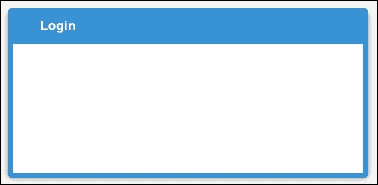

下一步是添加包含`username`和`password`字段的`form`。我们将在`Login`类中添加以下代码（在`#13`行之后）：

```js
items: [
{
    xtype: 'form',          //#14
    bodyPadding: 15,        //#15
    defaults: {             //#16
        xtype: 'textfield', //#17
        anchor: '100%',     //#18
        labelWidth: 60      //#19
    },
    items: [
        {
            name: 'user',
            fieldLabel: 'User'
        },
        {
            inputType: 'password', //#20
            name: 'password',
            fieldLabel: 'Password'
        }
    ]
]
```

由于我们正在使用`fit`布局，我们只能在`Login`类内部声明一个子`item`。因此，我们将在`Login`类内部添加一个`form`（`#14`）。请注意，在这里我们正在使用之前提到的选项 4。在 Ext JS 中声明项目时，这通常是实例化组件的方式（使用选项 4）。我们向`form`的主体添加了`body padding`（`#15`），这将增加表单与窗口边框之间的空间，使其看起来更美观。

由于我们将在表单中添加两个字段，我们可能希望避免重复某些代码。这就是为什么我们将在`form`的`defaults`配置中声明一些字段配置（`#16`）；这样，我们在`defaults`中声明的配置将应用于`form`的所有项目，我们只需要声明我们想要定制的配置。由于我们将声明两个字段，它们都将为`textfield`类型（`#17`）。

`form`组件默认使用的布局是`anchor`布局，因此我们不需要明确声明这一点。然而，我们希望两个字段都占据表单主体的所有可用水平空间。这就是为什么我们将`anchor`声明为`100%`（`#18`）的原因。

虽然`fit`布局允许你渲染一个子组件，该组件将占据父容器内的所有可用空间，但`Anchor`布局使你能够将子容器相对于父容器尺寸进行定位。在这种情况下，我们希望文本字段占据表单中可用的 100%水平空间。如果我们希望文本字段只占据 70%的可用的水平空间，我们可以将`anchor`配置设置为`70%`。

默认情况下，`textfield`类的标签的`width`属性是 100 像素。这对于`User`和`Password`标签来说空间太多，所以我们将这个值减少到`60 像素`（`#19`）。

最后，我们有`user` `textfield`和`password` `textfield`。配置`name`是我们提交表单到服务器时用来识别每个字段的内容。

只缺少一个细节：当用户在字段中输入密码时，系统不能显示其值——我们需要以某种方式将其隐藏。这就是为什么`password`字段的`inputType`是`'password'`（`#20`），因为我们想显示点而不是原始值——用户将看不到密码值。

### 注意

其他输入类型也可以与`textfield`一起使用。HTML5 的输入类型，如`email`、`url`和`tel`也可以使用。然而，如果应用程序是从较旧的浏览器（或不支持输入类型的浏览器）中执行，Ext JS 会自动将其更改为默认值，即`text`。有关 HTML5 输入类型和支持每种类型的浏览器更多信息，请访问[`www.w3schools.com/html/html5_form_input_types.asp`](http://www.w3schools.com/html/html5_form_input_types.asp)。

现在我们已经对**登录**窗口进行了一些改进。这是到目前为止的输出：

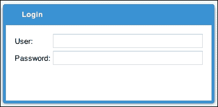

## 客户端验证

Ext JS 中的字段组件提供了一些客户端验证功能。这可以节省时间和带宽（系统只有在确认信息具有基本验证时才会进行服务器请求，我们也不需要等待服务器验证输入）。这也有助于指出用户在填写表格时出错的地方。当然，出于安全原因，在服务器端再次验证信息也是好的，但在此我们将专注于我们可以应用于**登录**窗口的表单验证。

让我们头脑风暴一下可以应用于用户名和密码字段的验证：

+   用户名和密码必须是必填项——没有用户名和密码，你如何验证用户？

+   用户只能在两个字段中输入字母数字字符（A-Z，a-z 和 0-9）

+   用户只能在`username`字段中输入 3 到 25 个字符

+   用户只能在`password`字段中输入 3 到 15 个字符

因此，让我们将以下代码添加到两个字段共有的部分中：

```js
allowBlank: false, // #21
vtype: 'alphanum', // #22
minLength: 3,      // #23
msgTarget: 'under' // #24
```

我们将把前面的配置添加到`form`的`defaults`配置中，因为它们都适用于我们拥有的两个字段。首先，两者都需要是必填项（`#21`），其次，我们只能允许用户输入字母数字字符（`#22`），用户需要输入的最小字符数是三个（`#23`）。然后，最后一个常见的配置是我们希望在字段下方显示任何验证错误消息（`#24`）。

而为每个字段定制的唯一验证是，我们可以在**用户**字段中输入最多 25 个字符：

```js
name: 'user', 
fieldLabel: 'User',
maxLength: 25

```

在**密码**字段中最多只能输入 15 个字符：

```js
inputType: 'password', 
name: 'password',
fieldLabel: 'Password',
maxLength: 15

```

在我们应用客户端验证后，如果用户在填写**登录**窗口时出错，我们将得到以下输出：

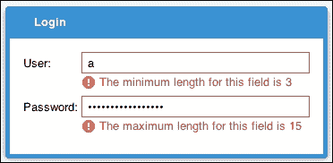

如果您不喜欢在字段下方显示的错误消息，我们可以更改错误消息出现的位置。我们只需更改`msgTarget`的值。可用的选项有：`title`、`under`、`side`和`none`。我们还可以将错误消息显示为`tooltip`（`qtip`）或在特定目标中显示它们（特定组件的`innerHTML`）。

对于`side`选项，例如，红色感叹号将显示在字段的旁边，当用户将其鼠标悬停在其上时，将显示包含错误消息的`tooltip`。一旦输入有效（用户在**用户**字段中输入更多字符或从**密码**字段中删除一些字符），错误消息将自动消失）。

### 创建自定义 VTypes

许多系统都有密码的特殊格式。比如说，我们需要密码至少包含一个数字（0-9）、一个小写字母、一个大写字母、一个特殊字符（@、#、$、%，等等）以及长度在 6 到 20 个字符之间。

我们可以创建一个正则表达式来验证密码是否被输入到应用程序中。为此，我们可以创建一个自定义的`VType`来进行验证。要创建自定义`VType`很简单。在我们的例子中，我们可以创建一个名为`customPass`的自定义`VType`，如下所示：

```js
Ext.apply(Ext.form.field.VTypes, {
    customPass: function(val, field) {
        return /^((?=.*\d)(?=.*[a-z])(?=.*[A-Z])(?=.*[@#$%]).{6,20})/.test(val);
    },
    customPassText: 'Not a valid password.  Length must be at least 6 characters and maximum of 20\. Password must contain one digit, one letter lowercase, one letter uppercase, one special symbol @#$% and between 6 and 20 characters.'
});
```

我们自定义的`VType`名为`customPass`，我们需要声明一个函数来验证我们的正则表达式。`customPassText`是当用户输入错误的密码格式时将显示给用户的消息。

### 注意

要了解更多关于正则表达式的信息，请访问[`www.regular-expressions.info/`](http://www.regular-expressions.info/)。

上述代码可以添加到代码的任何位置，例如在 Controller 的`init`函数中、在`app.js`的`launch`函数中，或者甚至在一个单独的 JavaScript 文件中（推荐），在那里您可以放置所有自定义的`Vtypes`。

### 注意

`VType`是一个单例类，它包含了一组常用的字段验证函数，并提供了一种创建可重用自定义字段验证的机制。有关此类和 Ext JS 支持的默认验证的更多信息，请访问[`docs.sencha.com/extjs/5.1/5.1.0-apidocs/#!/api/Ext.form.field.VTypes`](http://docs.sencha.com/extjs/5.1/5.1.0-apidocs/#!/api/Ext.form.field.VTypes)。

在 `app` 目录下创建一个名为 `CustomVTypes.js` 的新文件。将前面的代码添加到这个文件中。现在，我们需要这个文件与我们的应用程序一起加载。但请抑制手动在 `index.html` 文件中包含这个 JavaScript 文件的冲动。我们将遵循最佳实践！

在 `masteringextjs` 文件夹中的 `app.json` 文件大约第 110 行找到以下代码：

```js
"js": [
    {
        "path": "app.js",
        "bundle": true
    }
],
```

要使我们的 `CustomVTypes.js` 文件自动与我们的应用程序一起加载，我们只需添加以下突出显示的代码：

```js
"js": [
    {
        "path": "app.js",
        "bundle": true
    },
    {
 "path": "app/CustomVTypes.js",
 "includeInBundle": true
 }
], 
```

`includeInBundle` 配置告诉 Sencha Cmd，这个文件需要添加到最终生成的 `.js` 文件中。

只有一个文件可以配置 `bundle: true`。这意味着它是应用程序的主文件。

### 小贴士

总是记得在终端窗口中运行 `sencha app watch` 命令，以便 Sencha Cmd 每次我们更改代码时都能进行新的构建。在这种情况下，`CustomVTypes.js` 将在没有进一步更改 `index.html` 文件的情况下被加载。真的很酷！

现在，让我们将自定义的 `VType` 应用到我们的代码中。将以下代码添加到密码字段：

```js
vtype: 'customPass',
msgTarget: 'side'
```

此外，更改密码字段的提示目标。由于错误信息相当长，使用 `under` 作为消息目标看起来不会很好。这将是我们应用自定义 `vType` 后的结果：

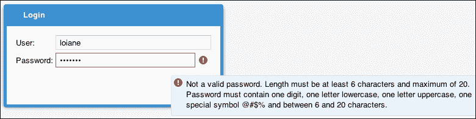

## 添加带有按钮的工具栏

到目前为止，我们创建了 **登录** 窗口，其中包含一个带有两个字段的表单，并且它已经被验证。唯一缺少的是添加两个按钮，**取消** 和 **提交**。

我们将添加按钮作为 `toolbar` 的项目，并将 `toolbar` 添加到 `form` 作为停靠项。`dockedItems` 可以停靠到面板的 *顶部*、*右侧*、*左侧* 或 *底部*（表单和窗口组件都是面板的子类）。在这种情况下，我们将 `dock` `toolbar` 到表单的底部。在表单的项目配置之后添加以下代码：

```js
dockedItems: [
    {
        xtype: 'toolbar',
        dock: 'bottom',
        items: [
                xtype: 'tbfill' //#25
            },
            {
                xtype: 'button', //#26
                iconCls: 'fa fa-times fa-lg',
                text: 'Cancel'
            },
            { 
                xtype: 'button', //#27
                formBind: true,  //#28
                iconCls: 'fa fa-sign-in fa-lg',
                text: 'Submit'
            }
        ]
    }
]
```

如果我们回顾一下本章开头首次展示的 **登录** 屏幕截图，我们会注意到有一个用于翻译/多语言功能的组件。在这个组件之后，有一个空格，然后是 **取消** 和 **提交** 按钮。由于我们还没有多语言组件，我们只能实现这两个按钮，但它们需要放在表单的右端，并且我们需要留出那个空格。这就是为什么我们首先需要添加一个 `tbfill` 组件（`#25`），它将指导工具栏布局开始使用右对齐的按钮容器。

然后，我们将添加 **取消** 按钮（`#26`）和 **提交** 按钮（`#27`）。我们将为这两个按钮添加一个图标（`iconCls`），我们将在本章后面添加到 CSS 文件中。

我们已经有了客户端验证，但即使有了验证，用户仍然可以点击**提交**按钮，我们希望避免这种行为。这就是为什么我们将**提交**按钮绑定到表单（`#28`）；这样，按钮只有在表单没有客户端验证错误的情况下才会启用。

在下面的屏幕截图中，我们可以看到添加工具栏后的当前**登录**表单输出，以及验证**提交**按钮的行为：

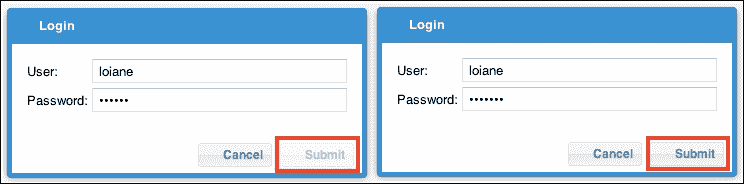

### 小贴士

当我们想在表单中添加带有按钮的工具栏时，我们可以使用`buttons`配置来添加。更多信息，请访问[`goo.gl/X38h8Q`](http://goo.gl/X38h8Q)。

### 运行代码

为了执行我们到目前为止创建的代码，我们需要在`Application.js`文件中做一些更改。

首先，我们需要声明我们正在使用的`views`（在这种情况下只有一个），如下所示：

```js
views: [
    'login.Login'
],
```

最后一个更改是在`launch`函数中。在前一章中，我们留下了一条`console.log`消息，在那里我们需要实例化我们的初始视图；现在我们只需要将`console.log`消息替换为`Login`实例（`#1`）：

```js
me.splashscreen.next().fadeOut({
    duration: 1000,
    remove:true,
    listeners: {
       afteranimate: function(el, startTime, eOpts ){
 Ext.widget('login-dialog'); //#1
        }
    }
});
```

现在`Application.js`没有问题，我们可以执行到目前为止所实现的内容！

#### 关于 Ext JS 动态类加载的简要概述

动态类加载是在 Ext JS 4 中引入的。它提供了一种集成的依赖管理能力，这在开发（本地）环境中非常有用（在最终的生产构建中也扮演着重要的角色）。这也是为什么 Ext JS 中实例化类（使用关键字`new`）的选项 5 被弃用，并且不是最佳实践的原因之一。

动态加载意味着什么？这意味着在我们加载应用程序之前，我们不需要加载所有 Ext JS SDK 类。例如，对于登录窗口，我们正在使用 Ext JS SDK 中的`Window`、`Form`和`TextField`类。为了执行我们的应用程序，我们不需要网格、树和图表的源代码。你同意吗？

仍然以登录窗口为例，当我们的应用程序加载时，Ext JS 将读取 `'login.Login'` 视图需要被加载。由于所有应用程序源代码都在 `app` 文件夹中，而视图在 `app/view` 文件夹中，Ext JS 加载器将期望找到 `app/view/login/Login.js` 文件，并且在这个文件中它期望找到 `'Packt.view.login.Login'` 类定义（这就是为什么遵循我们之前介绍的命名约定非常重要）。然后 Ext JS 加载器将看到这个类继承自 `Ext.window.Window` 类，如果这个类尚未加载，它将找出所有依赖项（从 `extend` 和 `requires` 声明中——我们将在稍后讨论 `requires`），并将它们加载，直到我们加载了执行应用程序所需的全部源代码（并且它将递归地这样做，直到所有代码都加载完毕）。

例如，当你尝试执行应用程序时，打开 Chrome 开发者工具（*Ctrl + Shift + I* 或 *Command + Shift + I*）或 Firefox 的 Firebug（启用所有面板）并打开 **网络** 选项卡。我们将能够看到为我们的应用程序加载的所有文件，如下所示：

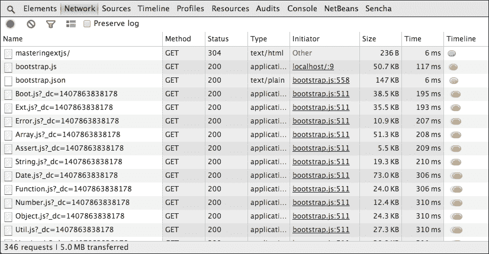

我们知道 **5MB** 对于仅有的 **登录** 屏幕来说很可怕，但当我们在这本书的生产构建中解决此问题时，我们将解决这个问题。现在我们不需要担心它。

当我们进行生产构建时会发生什么，Ext JS 将知道需要包含在最终 JavaScript 文件中的 SDK 中的哪些类，将所有内容合并成一个文件，并且还会对其进行混淆。如果你尝试打开前面截图中的任何文件，你将能够阅读源代码（并且它将像开发源代码一样美观和缩进）。

## 添加 Font Awesome 支持（符号图标）

使用应用程序上的图标可以改善其外观和感觉，使应用程序看起来更漂亮，用户通常也会喜欢它。然而，除非我们（或购买）不同尺寸的图标，否则图标大小为 16 x 16 像素。随着 **CSS3** 的引入，其中一项新特性被称为 **CSS3 网络字体** ([`www.w3schools.com/css/css3_fonts.asp`](http://www.w3schools.com/css/css3_fonts.asp))，它允许我们使用用户计算机上未安装的字体。

此功能允许开发者创建一种新的图标类型，称为 **符号图标**，实际上并不是图标，而是每个字符看起来像图标的字体（类似于 *Webding* 字体，[`en.wikipedia.org/wiki/Webdings`](http://en.wikipedia.org/wiki/Webdings))。

使用图标符号很棒，因为我们可以更改图标的大小和颜色以匹配应用程序的主题。只要可能，我们将在我们的应用程序中使用图标符号。有一个开源且免费的字体，被现代应用程序（HTML5 应用程序）广泛使用，称为 **Font Awesome**，我们也将在这个项目中使用它。

因此，第一步是从 [`fortawesome.github.io/Font-Awesome/`](http://fortawesome.github.io/Font-Awesome/) 下载 Font Awesome 文件。点击 **下载** 按钮。将要下载的文件是一个 `.zip` 文件。解压它。将 `fonts` 文件夹复制并粘贴到 `masteringextjs` 应用程序的 `resources` 文件夹内。将 `scss` 文件夹复制并粘贴到 `sass/etc` 文件夹内。将 `scss` 文件夹重命名为 `fontAwesome`。这就是修改后 `sass/etc` 和 `resource` 文件夹的样式：

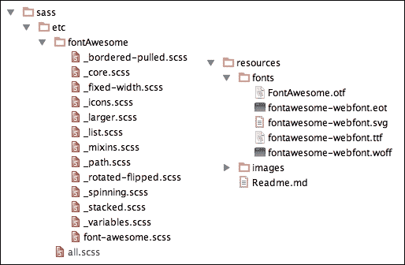

我们几乎完成了！打开 `sass/etc/fontAwesome/_variables.scss` 文件，并将变量 `$fa-font-path` 修改为以下值：

```js
$fa-font-path: "../resources/fonts" !default;
```

这是为了告诉 Sass 我们放置字体文件的位置。

现在我们所需要做的就是打开 `sass/etc/all.scss` 文件，并在文件的第一行添加以下代码：

```js
@import "fontAwesome/font-awesome";
```

如果你正在终端应用程序中运行 `sencha app watch`，你应该注意应用程序已被重新构建，我们现在可以查看应用程序中的图标。以下是如何显示 **登录** 屏幕的示例：

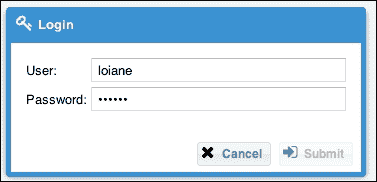

下一步是为 **取消** 和 **提交** 按钮添加一些操作。

### 注意

要了解更多关于 Sass 变量和导入功能的信息，请访问 [`sass-lang.com/guide`](http://sass-lang.com/guide)。

## 创建登录控制器

到目前为止，我们已经为 **登录** 屏幕创建了视图。由于我们遵循 MVC 架构，我们不会在 `View` 类中实现用户交互。如果我们点击 `Login` 类中的按钮，将不会发生任何操作，因为我们还没有实现这个逻辑。我们现在将在 `Controller` 类中实现这个逻辑。

在 Ext JS 5 中，我们有两种选择来完成这个任务：使用默认的 MVC 架构或使用 MVVM 架构模式（或 *混合* 模式）。

### 介绍 MVVM 架构

在上一章中，我们介绍了 Ext JS 中的 MVC 架构。让我们快速回顾一下 MVC 的工作原理：

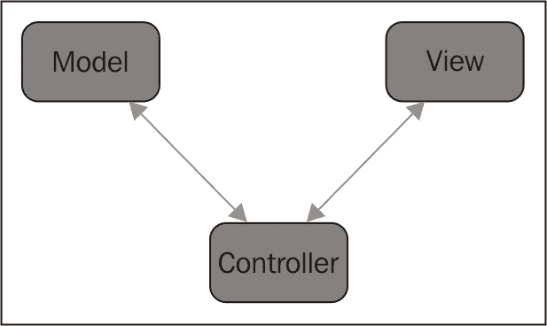

**Model**代表应用程序正在使用的信息。**View**是用户将在屏幕上看到的内容——组件。在用户与应用程序的每次交互中，组件都会触发事件。**Controller**是我们将处理事件并执行所需逻辑的地方；控制器将管理信息（**Model**）并管理**View**（以及**View**和**Model**之间的交互）。

在 Ext JS 5 中，Sencha 引入了这种新的模式，称为**模型-视图-视图模型**（**MVVM**），如下面的图所示：

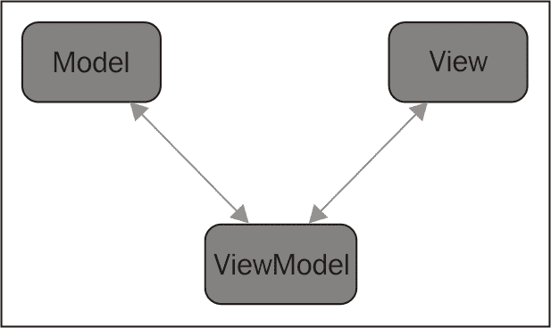

在 MVVM 中发生的情况是，如果它们被绑定，使用这种模式控制**View**和**Model**会容易得多。例如，考虑我们有一个数据网格，其中列出了一些联系人。当我们选择一个联系人并点击**编辑**按钮时，我们希望应用程序打开一个弹出窗口，该窗口的标题将是联系人的名字，并且弹出窗口还将有一个表单，用于显示供编辑的联系人详细信息。如果我们使用默认的 MVC 模式，我们需要控制**View**（数据网格、弹出窗口和表单）与**Model**（联系人信息）之间的交互方式。MVVM（基于 MVC）引入了一个新的抽象实体，即**ViewModel**。**ViewModel**在**View**和相关的**Model**之间进行调解。

然而，随着这种新模式和新的**ViewModel**抽象，Sencha 还引入了控制器的抽象，称为**ViewController**。**ViewController**非常类似于传统的 MVC 模式控制器，如下所示：

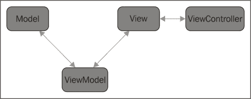

然而，正如我们在第二章，*入门*中学到的，MVC 模式的控制器是在应用程序的作用域中创建的，并且它们是唯一的实例（这意味着应用程序中每个控制器的单个实例）。只要应用程序在运行，控制器也就会存在。

**ViewModel**和**ViewController**是组件的一部分（我们曾在第一章，*Sencha Ext JS 概述*中学习了组件）。只要**View**存在，它们也就会存在。当**View**被销毁时，它们也会被销毁。这意味着我们可以节省一些内存（如果我们一次没有很多相同的**View**实例）。

如果你现在不完全理解这些概念，请不要担心。我们将通过一些示例学习如何使用它们以及它们是如何工作的，并且在这本书中，我们将使用这些不同的架构选项，以便我们可以了解每个选项是如何工作的，也许你可以选择你最喜欢的一个，或者最适合你项目的一个。

### 为登录视图创建 ViewController

让我们稍微停下来思考一下。登录是在应用的生命周期中只执行一次的操作。在应用中，我们可以做三件事：登录以开始使用它，使用其功能，或者注销（因为我们点击了注销按钮或会话过期）。一旦登录，我们就进入了，这就结束了。

在前面的主题中，我们了解到 **ViewModel** 和 **ViewController** 会在 **View** 被销毁时被销毁。因此，我们不需要在应用的生命周期中保持登录控制器活跃，我们可以有一个只在登录视图活跃期间存在的控制器。因此，对于 **Login** 屏幕，我们将使用 **ViewController**。

第一步是创建 JavaScript 文件。在 `app/view/login` 目录下，我们将创建 `LoginController.js` 文件。在这个文件中，我们将实现以下代码，这将是我们要实现的 `ViewController` 类的基础：

```js
Ext.define('Packt.view.login.LoginController', { // #1
    extend: 'Ext.app.ViewController',            // #2
    alias: 'controller.login',                   // #3 

    onTextFieldSpecialKey: function(field, e, options){ }, // #4

    onTextFieldKeyPress: function(field, e, options){ }, // #5

    onButtonClickCancel: function(button, e, options){ }, // #6

    onButtonClickSubmit: function(button, e, options){ }, // #7

    doLogin: function() { }, // #8

    onLoginFailure: function(form, action) { }, // #9

    onLoginSuccess: function(form, action) { } // #10
});
```

如同往常，在类的第一行，我们有它的名字 (`#1`)。遵循我们在 `view/login/Login.js` 中使用的相同公式，我们将有 `Packt` (*应用命名空间*) + `view` (*包名*) + `login` (*子包名*) + `LoginController` (*文件名*)，结果为 `Packt.view.login.LoginController`。

`ViewController` 类需要扩展自 `Ext.app.ViewController` (`#2`)，这样我们就可以始终为我们的 `ViewController` 使用这个父类。

我们还需要为这个 `ViewController` 提供一个 `alias` (`#3`)。ViewController 的别名以 `'controller'` 开头，后跟我们要分配的别名（记住别名总是小写）。

对于 `#4`–`#10`，我们有直到本章结束我们将要实现的一些方法的签名。我们将在稍后逐一介绍它们。

#### 将 ViewController 绑定到 View

现在我们已经准备好了 `ViewController` 的基础，我们需要将 `ViewController` 绑定到其视图，即 `Login` 视图。回到 `Packt.view.login.Login` 类，我们将向该类添加以下配置：

```js
controller: 'login',
```

上述配置将 `ViewController` 类绑定到 `Login` 类的生命周期。注意我们正在使用在 `#3` 中定义的别名。

如果你尝试执行代码，它将抛出错误。这是因为 Ext JS 不知道哪个 `ViewController` 类有 `login` 别名（因为这个别名不是框架的本地属性；我们正在创建它）。为了使其工作，我们还需要在 `login` 类中添加以下代码：

```js
requires: [
    'Packt.view.login.LoginController'
],
```

这将告诉 Ext JS 加载器在加载 `Login` 类时也需要加载它。Ext JS 将加载这个类及其所有依赖项。当 Ext JS 解析 `controller: 'login'` 代码时，它将注册 `login` 别名用于控制器，并且一切都会正常。

### 监听按钮点击事件

我们接下来的步骤是开始监听**登录**窗口的事件。首先，我们将监听**提交**和**取消**按钮。

由于我们使用的是`ViewController`类而不是 Controller（MVC），我们需要在`Login`类中添加监听器。首先，让我们为**取消**按钮做这件事，如下所示：

```js
xtype: 'button',
iconCls: 'fa fa-times fa-lg',
text: 'Cancel',
listeners: {    click: 'onButtonClickCancel'}

```

这段代码的意思是，当用户点击**取消**按钮时，`Login ViewController`类中的`onButtonClickCancel`方法将被执行。所以让我们来实现这个方法！回到`LoginController`类，我们已经知道这是我们即将实现的方法：

```js
onButtonClickCancel: function(button, e, options){}
```

但我们如何知道方法可以接收哪些参数呢？我们可以在文档中找到这个答案。如果我们查看文档中的点击事件（`Button`类），我们会发现以下内容：

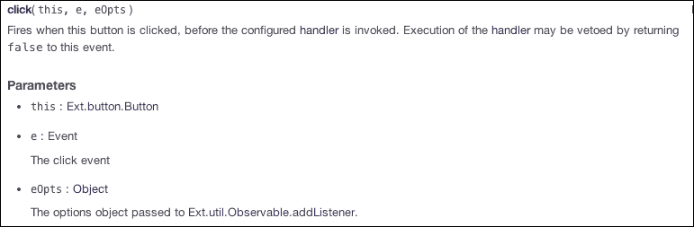

这正是我们声明的。对于所有其他事件监听器，我们将查看文档，看看事件接受哪些参数，然后在我们代码中将它们作为参数列出。这也是一个非常好的实践。即使我们只对第一个（或者甚至没有）参数感兴趣，我们也应该列出文档中的所有参数。这样，我们总是知道我们拥有所有参数的完整集合，这在我们对应用程序进行维护时非常有用。

### 小贴士

确保在开发 Ext JS 应用程序时，将文档变成你的最佳朋友。Ext JS 文档非常好，且用户友好。

注意，我们还想监听**提交**按钮的点击。`onButtonClickSubmit`方法与`onButtonClickCancel`方法具有相同的签名。让我们继续添加监听器到**提交**按钮，如下所示：

```js
xtype: 'button',
formBind: true,
iconCls: 'fa fa-sign-in fa-lg',
text: 'Submit',
listeners: {    click: 'onButtonClickSubmit'}

```

让我们快速测试一下，看看到目前为止一切是否按预期工作：

```js
onButtonClickCancel: function(button, e, options){
    console.log('login cancel'); // #1
},

onButtonClickSubmit: function(button, e, options){
    console.log('login submit');  // #2          
},
```

现在，我们只会在控制台输出一条消息，以确保我们的代码正在正常工作。所以，如果用户点击**提交**按钮，我们将输出`'login submit'`（`#2`），如果用户点击**取消**按钮，我们将输出`'login cancel'`（`#1`）。

让我们开始尝试。点击**取消**按钮，然后点击**提交**按钮。这应该是输出结果：

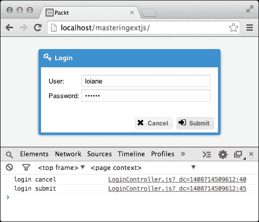

#### 取消按钮监听器实现

让我们移除`console.log`消息，并添加我们实际上想要方法执行的实际代码。首先，让我们专注于`onButtonClickCancel`方法。当我们执行这个方法时，我们希望它重置**登录**表单。

所以这是我们想要编程的逻辑序列：

+   获取表单引用

+   调用`reset`方法重置表单

如果我们查看`onButtonClickCancel`方法中可用的参数，我们有`button`、`e`和`options`，但没有一个提供了表单引用。那么我们该怎么办呢？

`ViewController` 类有一种有趣的方式来获取 `Login` 类或其子类的引用，它使用 `ViewController` 类中的 `lookupReference(reference)` 方法。为了能够使用这个方法，我们只需要在 `Login View` 类中为 `form` 添加一个引用：

```js
xtype: 'form',
reference: 'form',

```

使用这个引用，我们将能够直接调用 `this.lookupReference('form')` 方法来检索表单引用。有了表单引用，我们只需要调用 `form` 类中的 `reset()` 方法。`onButtonClickCancel` 方法的完整代码如下：

```js
onButtonClickCancel: function(button, e, options){
    this.lookupReference('form').reset();
},
```

#### 提交按钮监听器实现

现在我们需要实现 `onButtonClickSubmit` 方法。在这个方法内部，我们想要编写逻辑来将 **用户** 和 **密码** 值发送到服务器，以便进行用户认证。

我们可以在该方法内部实现两种编程逻辑：第一个是使用 `Form Basic` 类提供的 `submit` 方法，第二个是使用 Ajax 调用来提交值到服务器。无论哪种方式，我们都会达到我们的目标。对于这个例子，我们将使用默认的表单提交调用。

在这个方法中，我们需要执行以下步骤：

+   获取 **Login** 表单引用

+   获取 **Login** 窗口引用（以便在用户认证后关闭它）

+   将登录信息发送到服务器

+   处理服务器响应，如下所示：

    +   如果用户已认证，显示应用程序

    +   如果不是，显示错误信息

我们已经知道如何获取表单引用。这是 `onButtonClickSubmit` 的样子：

```js
onButtonClickSubmit: function(button, e, options){
    var me = this;
    if (me.lookupReference('form').isValid()){ // #1
        me.doLogin();              // #2
    }
},
```

因此，首先，在做什么之前，我们将确保用户已经输入了所有必要的信息（用户名和有效的密码 `#1`）。如果一切正常，然后我们调用一个辅助方法来处理认证（`#2`），如下所示：

```js
doLogin: function() {
    var me = this,
        form = me.lookupReference('form');

    form.submit({
        clientValidation: true,        // #3
        url: 'php/security/login.php', // #4
        scope: me,         // #5
        success: 'onLoginSuccess',     // #6
        failure: 'onLoginFailure'      // #7
    });
},
```

首先，只是为了确保我们试图提交的数据是有效的（我们也将从另一个方法中调用这个 `doLogin` 方法，所以确保我们发送给服务器的数据是有效的永远都不够！），我们将 `clientValidation` 配置设置为 `true` 以再次验证信息（`#3`）。然后我们有将要调用的 `url`（`#4`）。`success`（`#6`）和 `failure`（`#7`）回调被声明为单独的函数，这些函数属于 `ViewController` 类，这就是为什么作用域是 `ViewController` 类（`#5`）。

### 小贴士

我们也可以在提交调用中实现成功和失败方法（如文档中的示例所示 [`docs.sencha.com/extjs/5.0.0/apidocs/#!/api/Ext.form.Basic-method-submit`](http://docs.sencha.com/extjs/5.0.0/apidocs/#!/api/Ext.form.Basic-method-submit)）。但我们不知道我们需要多少代码来处理认证。使用作用域回调更好，因为我们的代码保持组织性，有更好的可读性。

如果我们尝试运行此代码，应用程序将向服务器发送请求，但由于我们还没有实现`login.php`页面，我们将收到一个错误响应。这没关系，因为我们现在对其他细节更感兴趣。

启用 Firebug 或 Chrome 开发者工具，打开**网络**标签页并按**XHR**请求过滤。确保输入一个`用户名`和`密码`（任何有效值，这样我们就可以点击**提交**按钮）。这将产生以下输出：

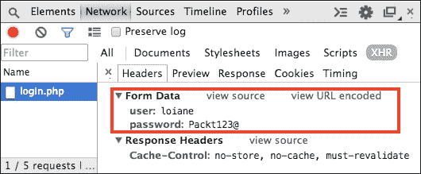

注意，用户名和密码将以表单数据的形式发送。这些信息对于在服务器端（在我们的例子中是 PHP 代码）处理信息非常有用。

### 小贴士

每当你有问题或者不知道如何处理 Ext JS 发送到服务器的信息时，打开浏览器中的调试工具并检查调用。这非常有帮助，也能帮助你了解 Ext JS 与服务器通信时的工作方式。

## 创建用户和组表

在我们开始编写`login.php`页面之前，我们需要向 Sakila 数据库中添加两个表。这两个表将代表用户以及用户可以属于的组。在我们的项目中，一个用户只能属于一个组，如下面的图所示：

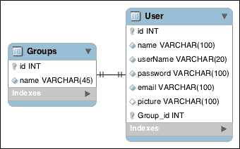

1.  首先，我们将创建`Group`表，如下所示：

    ```js
    CREATE  TABLE IF NOT EXISTS `sakila`.`Groups` (
      `id` INT NOT NULL AUTO_INCREMENT ,
      `name` VARCHAR(45) NOT NULL ,
      PRIMARY KEY (`id`) )
    ENGINE = InnoDB;
    ```

1.  然后，我们将创建包含索引和指向`Group`表的`外键`的`User`表：

    ```js
    CREATE  TABLE IF NOT EXISTS `sakila`.`User` (
      `id` INT NOT NULL AUTO_INCREMENT ,
      `name` VARCHAR(100) NOT NULL ,
      `userName` VARCHAR(20) NOT NULL ,
      `password` VARCHAR(100) NOT NULL ,
      `email` VARCHAR(100) NOT NULL ,
      `picture` VARCHAR(100) NULL ,
      `Group_id` INT NOT NULL ,
      PRIMARY KEY (`id`, `Group_id`) ,
      UNIQUE INDEX `userName_UNIQUE` (`userName` ASC) ,
      INDEX `fk_User_Group1_idx` (`Group_id` ASC) ,
      CONSTRAINT `fk_User_Group1`
        FOREIGN KEY (`Group_id` )
        REFERENCES `sakila`.`Groups` (`id` )
        ON DELETE NO ACTION
        ON UPDATE NO ACTION)
    ENGINE = InnoDB;
    ```

1.  下一步是将一些数据插入到这些表中：

    ```js
    INSERT INTO `sakila`.`Groups` (`name`) VALUES ('admin');
    INSERT INTO `sakila`.`User` (`name`, `userName`, `password`, `email`, `Group_id`) 
    VALUES ('Loiane Groner', 'loiane', '$2a$10$2a4e8803c91cc5edca222evoNPfhdRyGEG9RZcg7.qGqTjuCgXKda', 'me@loiane.com', '1');
    ```

由于密码将在数据库中以散列形式保存，值`$2a$10$2a4e8803c91cc5edca222evoNPfhdRyGEG9RZcg7.qGqTjuCgXKda`对应于值`Packt123@`。我们将在用户管理模块中散列我们的密码以提高安全性。

现在我们已经准备好开始开发`login.php`页面。

## 处理服务器上的登录页面

由于我们有一部分 Ext JS 代码用于将登录信息发送到服务器，我们可以实现服务器端代码。正如本书第一章中提到的，我们将使用 PHP 来实现服务器端代码。但是如果你不知道 PHP，不要担心，因为代码不会很复杂，我们也将使用纯 PHP。目标是关注我们需要在服务器端使用的编程逻辑；这样我们就可以将相同的编程逻辑应用到任何你喜欢的其他服务器端语言（Java、.NET、Ruby、Python 等）。

### 连接到数据库

第一步是创建一个负责连接数据库的文件。我们将在我们开发的几乎每个 PHP 页面中重用这个文件。

在项目的根文件夹下创建一个名为`php`的新文件夹，然后在`php`下创建一个名为`db`的新文件夹。然后，创建一个名为`db.php`的新文件：

```js
<?php 
$server = "127.0.0.1";
$user = "root";
$pass = "root";
$dbName = "sakila";

$mysqli = new mysqli($server, $user, $pass, $dbName);

/* check connection */
if ($mysqli->connect_errno) {
    printf("Connect failed: %s\n", mysqli_connect_error());
    exit();
}
?>
```

连接相当直接。我们只需通知 `服务器`（它将是 `localhost`），数据库的 `用户名` 和 `密码`，以及我们想要连接的数据库 `名称`。最后，我们可以检查连接是否成功完成或是否发生任何错误。

### 注意

更多关于 MySQLi 的信息，请访问 [`php.net/manual/en/book.mysqli.php`](http://php.net/manual/en/book.mysqli.php)。

### Login.php

最后，我们可以在 `php/security` 文件夹下创建 `login.php` 文件。所以让我们开始实现它，如下所示：

```js
require("../db/db.php"); // #1
require("PassHash.php"); // #2

session_start();         // #3

$userName = $_POST['user']; // #4
$pass = $_POST['password']; // #5

$userName = stripslashes($userName); // #6
$pass = stripslashes($pass);         // #7

$userName = $mysqli->real_escape_string($userName); // #8
$sql = "SELECT * FROM USER WHERE userName='$userName'"; // #9
```

首先，我们需要 `require` `db.php` 文件以连接到数据库（`#1`）。我们还将 `require` `PassHash.php` 文件（`#2`）。此文件包含 `check_password` 方法，该方法将比较用户输入的密码与数据库中存储的密码（已散列）。

然后，我们开始一个会话（`#3`）——我们稍后将在会话中存储用户名。

下一步是从 Ext JS (`#4` 和 `#5`) 的表单提交方法中检索 `用户` 和 `密码` 值。

`stripslashes` 函数从给定的字符串中移除反斜杠（`#6` 和 `#7`）。例如，如果用户值是 `"Loiane\'s"`，则 `stripslashes` 的返回值将是 `"Loiane's"`。

### 提示

这两个步骤有助于确保应用程序的安全性；然而，它们并不足够。在服务器上对用户输入进行 `清理` 非常重要，这样我们就不存储或尝试使用恶意输入执行 SQL 语句。为了本书的目的，我们将不会应用这项技术以保持服务器端代码简单，因此即使你不知道 PHP，你也能阅读并理解其背后的逻辑，并在你选择的任何服务器端语言中实现类似的功能。然而，请注意，在实际应用中，应用这一步骤非常重要，尤其是如果你将应用程序发布给公众（而不仅仅是内部使用）。

有一个名为 **Open Web Application Security Project** （**OWASP**）的项目，它是免费的开源项目，提供了一套库和 API，用于在应用程序中应用安全技术。有针对 .NET、Java 和 PHP 的子项目，有关如何避免 XSS 攻击和 SQL 注入的教程，以及如何防止其他安全漏洞。更多信息，请访问 [`www.owasp.org`](https://www.owasp.org)。

然后，我们使用 `real_escape_string` 函数（`#8`）为 SQL 语句准备 `$username` 变量，该函数用于在字符串中转义特殊字符，以便在 SQL 语句中使用。

接下来，我们准备将要执行的 SQL 查询（`#9`）。这是一个简单的 `SELECT` 语句，将返回与给定 `用户名` 匹配的结果。

让我们继续下一部分的代码：

```js
if ($resultDb = $mysqli->query($sql)) { //#10

  $count = $resultDb->num_rows; //#11

  if($count==1){ //#12

        $record = $resultDb->fetch_assoc(); //#13

         //#14  
        if (PassHash::check_password($record['password'],$pass)){
            $_SESSION['authenticated'] = "yes"; //#15
            $_SESSION['username'] = $userName; //#16

            $result['success'] = true; //#17
            $result['msg'] = 'User authenticated!'; //#18
        } else{
            $result['success'] = false; //#19
            $result['msg'] = 'Incorrect password.'; //#20
        }
  } else {
    $result['success'] = false; //#21
    $result['msg'] = 'Incorrect user or password.'; //#22
  }
  $resultDb->close(); //#23
}
```

接下来，我们需要执行 SQL 查询，并将结果集存储在 `resultDb` 变量中 (`#10`)。然后，我们将根据结果集中是否有行返回来存储数据 (`#11`)。

现在是代码中最重要的部分。我们将验证结果集是否返回了行。因为我们传递了 `username`，结果集中返回的行数必须正好是 `1`。所以，如果行数等于 `1` (`#12`)，我们需要查看数据库中存储的哈希密码是否与用户输入的密码匹配，但首先，我们需要从数据库中检索到的记录中获取这些信息 (`#13`)。

`PassHash` 类负责对密码进行哈希处理，使得将哈希密码保存到数据库中（而不是明文密码）更加安全，用于从数据库中解密哈希密码 (`$record['password']`)，以及与用户在登录页面输入的密码进行比较 (`#14`)。

### 注意

目前，您可以从本书下载的源代码中获取 `PassHash.php` 的完整代码。在 第六章，*用户管理*中，我们将逐行分析。

如果用户输入的密码和从数据库中解密后的哈希密码匹配，这意味着用户可以被认证。我们将存储认证用户的 `username` (`#16`) 在 `Session` 中，并且也存储用户已 `authenticated` (`#15`) 的信息。

我们还需要准备将要返回给 Ext JS 的结果。我们将发送两块信息：第一块是关于用户是否 `authenticated` (`#17`)——在这种情况下 `"true"`——我们还可以发送一条消息 (`#18`)。

如果用户输入的密码和数据库中的密码不匹配，那么我们还需要向 Ext JS 返回一些信息。`success` 将会是 `false` (`#19`)，并且我们将返回一条消息以便向用户显示 (`#20`)。

如果 `username` 在数据库中不存在（结果集中的行数与 `1` 不同），我们也将向 Ext JS 发送一条消息，说明用户提供的用户名或密码不正确 (`#22`)。因此，`success` 信息将是 `false` (`#21`)。

然后，我们需要关闭结果集 (`#23`)。

现在，`login.php` 代码的第三和最后一部分：

```js
$mysqli->close(); // #23

echo json_encode($result); // #24
```

我们需要关闭数据库连接 (`#23`)，并且我们将以 JSON 格式 `encode` 我们将要发送回 Ext JS 的 `result` (`#24`)。

现在，`login.php` 代码已经完成。我们不能忘记在前面代码之前添加 `<?php`。

## 处理服务器的返回——是否已登录？

我们已经处理了服务器端代码。现在，我们需要回到 Ext JS 代码，并处理来自服务器的响应。

在 Ext JS 中，成功和失败有两个不同的概念。表单以一种方式处理它，而 Ajax 请求以另一种方式处理。这可能会有些令人困惑，因此我们将通过表单提交（如本例所示）和 Ajax 请求来实现对服务器的请求，这样我们可以学习如何使用这两种方式来实现适当的代码。

对于表单，服务器需要返回 `success: true` 信息，以便执行的回调是成功的。对于失败，服务器需要返回 `success: false`，这可以在发生任何通信错误时返回（页面未找到，服务器异常等）。对于 Ajax 请求，`success` 是 `true` 还是 `false` 都没关系；它将执行成功回调；只有当发生任何通信错误时，它才会执行失败回调。

### 注意

记住服务器需要返回给 Ext JS 的内容类型是 `application/json`，并且是 JSON 格式。

让我们先处理成功回调。在成功的情况下，`onLoginSuccess` 方法将被执行。在这种情况下，我们希望关闭 **登录** 窗口并显示应用程序的主屏幕，如下所示：

```js
onLoginSuccess: function(form, action) {
    this.getView().close();             //#1
    Ext.create('Packt.view.main.Main'); //#2
}
```

`Window` 类有一个名为 `close` 的方法，我们可以调用它来关闭窗口。问题是如何获取 `login window` 类的引用。`ViewController` 类直接绑定到它，我们可以通过调用 `ViewController` 类的 `getView` 方法（`#1`）来引用 `Login` 类本身。然后，我们可以通过实例化由 Sencha Cmd 在创建应用程序时创建的 `Main` 类（`#2`）来创建主屏幕。我们将重用这个类来创建我们的主屏幕。

### 提示

使用前面提到的方法，代码的安全性存在一个缺陷。一个聪明的用户，如果理解了 Ext JS 的工作原理，即使用户未认证，也可以使用类似于前面的代码来访问主页。更安全的方法是将用户重定向到包含应用程序的页面（直接调用 `Main` 类）。由于我们在这里使用的是示例，这是可以接受的。然而，在开发真实应用程序时，请记住这一点！

在发生失败的情况下，我们需要处理两种情况：第一种情况是如果用户未认证，因为用户不存在或密码不正确。第二种情况是如果发生任何通信故障（例如，错误 404）。我们的 `onLoginFailure` 方法将如下所示：

```js
onLoginFailure: function(form, action) {

  var result = Ext.JSON.decode(action.response.responseText, true); //#3

  if (!result){ //#4
      result = {};
      result.success = false;
      result.msg = action.response.responseText;
  }

  switch (action.failureType) {
      case Ext.form.action.Action.CLIENT_INVALID:  //#5
          Ext.Msg.show({
            title:'Error!',
            msg: 'Form fields may not be submitted with invalid values',
            icon: Ext.Msg.ERROR,
            buttons: Ext.Msg.OK
        });
      break;
      case Ext.form.action.Action.CONNECT_FAILURE:  //#6
        Ext.Msg.show({
            title:'Error!',
            msg: 'Form fields may not be submitted with invalid values',
            icon: Ext.Msg.ERROR,
            buttons: Ext.Msg.OK
        });
         break;
      case Ext.form.action.Action.SERVER_INVALID:  //#7
          Ext.Msg.show({
            title:'Error!',
            msg: result.msg, //#8
            icon: Ext.Msg.ERROR,
            buttons: Ext.Msg.OK
        });
  }
},
```

在我们深入失败回调之前，请注意 `onLoginFailure` 和 `onLoginSuccess` 都接收两个参数：`form` 和 `action`。它们从哪里来？

如果我们查看文档，特别是`Form`类（`Ext.form.Panel`）的`submit`方法，我们将看到这个`submit`方法正在调用`Ext.form.Basic`类中的`submit`方法（这个类实际上包含处理表单操作的所有方法）。如果我们查看`Ext.form.Basic`类中的`submit`方法([`docs.sencha.com/extjs/5.0/5.0.1-apidocs/#!/api/Ext.form.Basic-method-submit`](http://docs.sencha.com/extjs/5.0/5.0.1-apidocs/#!/api/Ext.form.Basic-method-submit))，我们将看到与我们的代码类似的示例。如果我们阅读描述，它说这个`submit`方法是从同一类中`doAction`方法的快捷方式。

如果我们打开此方法的文档([`docs.sencha.com/extjs/5.0/apidocs/#!/api/Ext.form.Basic-method-doAction`](http://docs.sencha.com/extjs/5.0/apidocs/#!/api/Ext.form.Basic-method-doAction))，我们将能够看到我们用于表单提交调用的参数（`url`、`success`和`failure`回调函数等），以及成功和失败回调函数接收到的参数——`form`和`action`——如下所示：

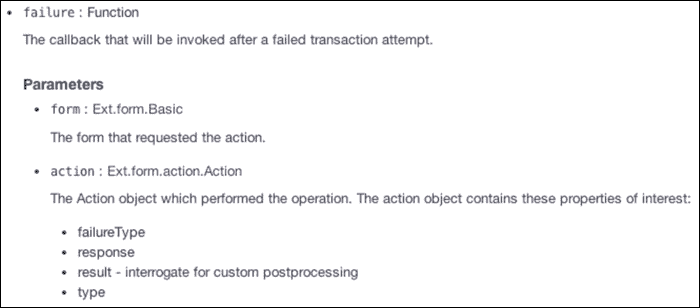

`action`参数内部包含四个属性。对于我们失败的回调函数，我们感兴趣的是其中的两个：`failureType`和`response`。首先让我们分析`response`。将以下代码（`console.log(action);`）添加到失败回调函数的第一行，并在**登录**屏幕中尝试提交错误的用户名或密码。在提交到服务器之前，打开 Chrome 开发者工具或 Firebug，查看将要记录的内容，如下所示：

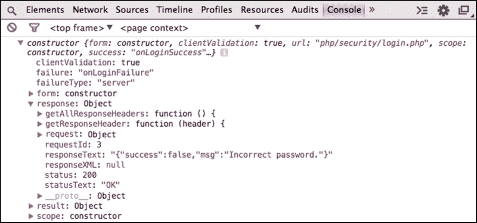

在响应中，请注意其中包含我们从服务器返回的 JSON 格式的`responseText`。因此，我们首先要做的是解码这个 JSON（`#3`）。解码之后，我们将能够访问`result.success`和`result.msg`。我们还需要注意一个细节：我们不知道服务器将返回什么。我们总是希望它是我们的`success`和`msg`信息；然而，我们无法确定。如果返回任何其他错误，它也将包含在`action.response.responseText`中，并且它不能是我们期望的 JSON 格式（也不能是 JSON）。如果发生这种情况，`Ext.JSON.decode`将失败，并抛出异常。我们可以静默异常（将`true`作为`Ext.JSON.decode`函数的第二个参数传递，`result`将具有`null`值），但我们仍然需要处理它。这正是我们在检查`result`变量是否为`null`（`#4`）时所做的。如果是 null，我们将实例化`result`并分配一些值（`msg`将接收服务器发送的错误）。

之后，我们将使用 `failureType` 动作来查看发生了哪种类型的错误。由于 `failureType` 是代码，Ext JS 定义了一些对开发者更友好的常量（例如 `Ext.form.action.Action.CLIENT_INVALID`）。如果 `failureType` 是 `'client'` (`#5`)，那么我们将通过带有错误图标的弹出警告显示错误消息。如果服务器发生了连接错误，那么 (`#6`) 将通过显示错误弹出警告来处理它。如果返回了任何异常或成功为假，(`#7`) 将处理它。由于我们处理了服务器的返回值以显示自定义错误消息或任何其他消息，我们可以在弹出警告中简单地显示 `result.msg` (`#8`)。

再次尝试输入错误用户名或密码并查看会发生什么。将 `login.php` `url` 更改为 `login.php`（或更改为任何其他 `url`），或在 `db.php` 文件中输入错误的密码以连接到数据库来模拟错误，你将看到以下内容：

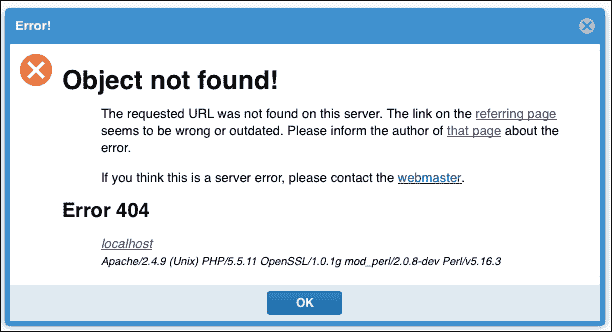

这样，我们可以处理所有类型的服务器响应；不仅是我们所期望的，还包括任何异常！

### 通过创建 Util 类重用代码

注意，在 (`#5`)、(`#6`) 和 (`#7`) 中，我们使用的是相同的错误弹出警告，因此代码是重复的。这种类型的错误弹出警告被用于应用程序的不同位置。由于我们将在应用程序的其他屏幕中处理更多的 Ajax 请求和表单提交，因此 (`#3`) 和 (`#4`) 中的代码也将重复。因此，我们可以创建一个 `Util` 类来封装此代码并提供重用它的方法。除了重用优势之外，它还很好地建立了一个应用程序可以遵循的模式，例如确定服务器需要返回给 Ext JS 的 JSON 格式。这将使应用程序更有组织性，当团队合作时也很好（通常每个开发者都有自己的他们喜欢遵循的模式，这样我们就可以为同一应用程序遵循相同的模式，并且看起来不像是由不同的开发者实现的）。

因此，让我们继续创建我们的第一个 `Util` 类。我们将将其命名为 `Packt.util.Util`。因此，我们将创建一个名为 `Util.js` 的新文件，我们还将创建一个位于 `app` 文件夹下的名为 `util` 的新文件夹，如下所示：

```js
Ext.define('Packt.util.Util', {

    statics : { //#1

        decodeJSON : function (text) { //#2
            var result = Ext.JSON.decode(text, true);
            if (!result){
                result = {};
                result.success = false;
                result.msg = text;
            }

            return result;
        },

        showErrorMsg: function (text) { //#3
            Ext.Msg.show({
                title:'Error!',
                msg: text,
                icon: Ext.Msg.ERROR,
                buttons: Ext.Msg.OK
            });
        }
    }
});
```

所有方法都将位于 `statics` 声明中 (`#1`)。正如我们在 第一章 中所学到的，*Sencha Ext JS 概述*，我们可以简单地调用 `Packt.util.Util.decodeJSON`，例如，而不需要实例化 `Packt.util.Util` 类。`decodeJSON` 方法 (`#2`) 包含处理 JSON 解码的代码，而 `showErrorMsg` 方法 (`#3`) 包含显示带有传入文本参数的错误弹出警告的代码。

### 小贴士

静态方法不需要调用类的实例。这是面向对象编程的一个概念。

让我们使用`Util`类重写`onLoginFailure`方法，如下所示：

```js
onLoginFailure: function(form, action) {

    var result = Packt.util.Util.decodeJSON(action.response.responseText);

    switch (action.failureType) {
        case Ext.form.action.Action.CLIENT_INVALID:
            Packt.util.Util.showErrorMsg('Form fields may not be submitted with invalid values');
            break;
        case Ext.form.action.Action.CONNECT_FAILURE:
       Packt.util.Util.showErrorMsg(action.response.responseText);
            break;
        case Ext.form.action.Action.SERVER_INVALID:
            Packt.util.Util.showErrorMsg(result.msg);
    }
}, 
```

现在我们只有 15 行代码，比之前的 36 行代码可读性更好！如果我们需要维护这段代码，我们可以在`Util`类中进行更改，这些更改将应用到使用该类的代码的每个地方！最佳实践让我们的代码变得非常酷！

最后一个细节：我们需要在`ViewController`类的`requires`声明中添加`Packt.util.Util`类：

```js
requires: [
    'Packt.util.Util'
],
```

这是因为我们在本章前面讨论的动态加载。如果我们尝试在没有加载`Util`类的情况下执行前面的代码，我们可能会得到一个错误。

# 增强登录界面

我们的**登录**界面已经完成。然而，我们还可以对其应用一些增强，使其变得更好，并为用户提供更好的体验。

以下列表详细说明了我们将在我们的**登录**界面中应用的功能增强：

+   在验证时应用加载遮罩

+   当用户按下*Enter*键时提交表单

+   显示大写锁定警告信息

## 在验证表单时应用加载遮罩

有时，当用户点击**提交**按钮时，在等待服务器发送响应的过程中可能会有一些延迟。一些用户可能会耐心等待，而另一些用户则不会。那些不太有耐心的用户将能够再次点击**提交**按钮，这意味着向服务器发送另一个请求。我们可以在等待响应时对**登录**窗口应用加载遮罩来避免这种行为。

首先，我们需要在`form.submit`调用之前（在`doLogin`方法内部）添加以下代码：

```js
this.getView().mask('Authenticating... Please wait...');
```

这将对**登录**屏幕应用遮罩。

然后，在`onLoginSuccess`和`onLoginFailure`函数的第一行中，我们需要添加以下代码行：

```js
this.getView().unmask();
```

这将移除**登录**窗口的遮罩。

如果我们尝试执行代码，我们将得到以下输出：

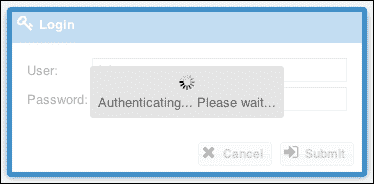

注意，登录界面不可达，用户无法在服务器发送响应并移除遮罩之前再次点击按钮。

## Enter 键表单提交

对于某些表单，尤其是**登录**表单，当用户准备好时按下*Enter*键是非常自然的。对于 Ext JS 来说，这种行为不是自动的；因此，我们必须实现它。

`textfield`组件有一个处理特殊键的事件，例如*Enter*。这个事件被称为`specialkey`，这是我们将在登录控制器中监听的事件。因为我们想监听我们拥有的两个文本字段（**用户**和**密码**）的此事件，我们可以在**登录**窗口的表单的默认值中添加以下代码：

```js
listeners: {
    specialKey: 'onTextFieldSpecialKey'
}
```

接下来，我们还需要在`ViewController`类内部实现`onTextFieldSpecialKey`方法，如下所示：

```js
onTextFieldSpecialKey: function(field, e, options){
    if (e.getKey() === e.ENTER) {
        this.doLogin();
    }
},
```

首先，我们将验证用户按下的键是否为*Enter*。如果是，我们将调用我们之前实现的`doLogin`方法。然后，将进行表单验证，如果表单有效，它将尝试登录。这将与点击**提交**按钮相同。

## Caps Lock 警告信息

我们将对表单进行的最后一个增强是**Caps Lock**信息。有时*Caps Lock*键处于激活状态，当我们输入密码时，我们可以输入正确的密码，但系统会说它不正确，因为它是区分大小写的；提醒用户这一点是个好主意。

以下截图展示了**Caps Lock**警告实现的最终结果：

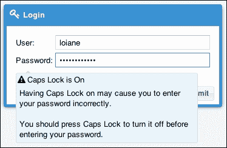

如前一个截图所示，我们将以工具提示的形式显示警告。所以我们需要做的第一件事是回到`Application.js`启动函数，并在第一行添加以下代码：

```js
Ext.tip.QuickTipManager.init();
```

另一个选择是在`Aplication.js`中配置`enableQuickTips: true`。你可以使用任何一个，结果都会相同。

没有前面的代码，应用中的工具提示将无法工作。

Ext JS 有两种工具提示的概念。第一个是`Tooltip`类，它没有内置的方法可以自动根据目标元素填充工具提示文本；你必须为每个工具提示实例配置一个固定的 HTML 值，或者实现自定义逻辑（在事件监听器内部）。第二个是`QuickTip`类，它可以自动填充和配置工具提示，基于每个目标元素特定的 DOM 属性。工具提示默认启用。QuickTips 由`QuickTipManager`管理，需要手动启动。

我们将要监听的事件是`keypress`事件，我们只监听由`password`字段触发的事件。默认情况下，`textfield`组件不会触发此事件，因为它在性能上有点沉重。因为我们想监听这个事件，所以我们需要向`password`字段添加一个配置（`enableKeyEvents`）（在`view/login/Login.js`文件中）：

```js
id: 'password',
enableKeyEvents: true,
listeners: {
    keypress: 'onTextFieldKeyPress'
}
```

我们还需要给这个字段添加一个`id`值。稍后，我们将讨论避免在组件中使用`id`的重要性（因为它不是一种好做法），但在这个情况下，我们无能为力。这是因为当创建`Tooltip`类时，我们需要设置一个`target`（在这种情况下，是`password`字段），而这个`target`只接受组件的`id`，而不是`itemId`。

在我们将代码添加到 Controller 之前，我们需要创建`Tooltip`类。我们将创建一个新的视图，名为`Packt.view.login.CapsLockTooltip`，因此我们需要在`app/view/login`文件夹下创建一个名为`CapsLockTooltip.js`的文件：

```js
Ext.define('Packt.view.login.CapsLockTooltip', {
    extend: 'Ext.tip.QuickTip',

    xtype: 'capslocktooltip',

    target: 'password',
    anchor: 'top',
    anchorOffset: 0,
    width: 300,
    dismissDelay: 0,
    autoHide: false,
    title: '<div class="fa fa-exclamation-triangle"> Caps Lock is On</div>',
    html: '<div>Having Caps Lock on may cause you to enter ' +
        'your password incorrectly.</div><br/>' +
        '<div>You should press Caps Lock to turn it off ' +
        'before entering your password.</div>'
});
```

在`Packt.view.login.CapsLockTooltip`中，我们声明了一些配置，这些配置将设置`Tooltip`类的行为。例如，我们有以下配置：

+   `target`：这具有`password`字段的`id`值。

+   `anchor`：这表示提示应该锚定到目标元素（`password` `id`字段）的特定侧面，箭头指向目标。

+   `anchorOffset`：这是一个数值（以像素为单位），用于偏移锚点箭头的默认位置。在这种情况下，箭头将在工具提示框开始后的 60 像素处显示。

+   `width`：这是表示工具提示框宽度的数值（以像素为单位）。

+   `dismissDelay`：这是在工具提示自动隐藏之前的延迟值（以毫秒为单位）。由于我们不希望工具提示自动隐藏，我们将值设置为`0`（零）以禁用它。

+   `autoHide`：将其设置为`true`以在鼠标退出目标元素后自动隐藏工具提示。由于我们不希望这样做，我们将其设置为`false`。

+   `title`：这是用作提示标题的文本。

+   `html`：这是将在工具提示体中显示的 HTML 片段。

注意，我们在标题上给`<div>`标签添加了一个类。这将显示我们之前配置的 Font Awesome 的警告图标。

### 注意

要查看应用程序中可用的所有 Font Awesome 图标，请访问[`fortawesome.github.io/Font-Awesome/cheatsheet/`](http://fortawesome.github.io/Font-Awesome/cheatsheet/)。

最后，我们需要在`ViewController`类中进行一些修改。首先，在`requires`声明中，我们将添加`CapsLockTooltip`类：

```js
requires: [
 'Packt.view.login.CapsLockTooltip',
    'Packt.util.Util'
],
```

接下来，我们将实现`onTextFieldKeyPress`方法，如下所示：

```js
onTextFieldKeyPress: function(field, e, options){

    var charCode = e.getCharCode(),  
        me = this;

    if((e.shiftKey && charCode >= 97 && charCode <= 122) || //#2
        (!e.shiftKey && charCode >= 65 && charCode <= 90)){

        if(me.capslockTooltip === undefined){                 //#3
          me.capslockTooltip = Ext.widget('capslocktooltip'); //#4
        }

        me.capslockTooltip.show(); //#5

    } else {

        if(me.capslockTooltip !== undefined){ //#6
            me.capslockTooltip.hide();        //#7
        }
    }
},
```

首先，我们需要获取用户按下的键的`code`（`#1`）。然后，我们需要验证是否按下了`Shift`键，并且用户按下了小写字母键（a-z），或者如果没有按下`Shift`键，用户按下了大写字母键（A-Z）（`#2`）。如果这个验证的结果为真，这意味着`Caps Lock`是激活的。如果您想检查每个键的值，可以访问[`www.asciitable.com/`](http://www.asciitable.com/)。

如果`Caps Lock`是激活的，我们将验证是否存在`CapsLockTooltip`类的引用（`#3`）。如果没有，我们将使用它的`xtype`创建一个引用，并将其存储在名为`capslockTooltip`的变量中。这个变量将作为`ViewController`类的一部分创建，因此如果这个方法再次执行，我们可以访问它。然后，我们通过执行显示的方法来显示它（`#5`）。

如果 *大写锁定* 未激活，我们需要验证是否存在对 `CapsLockTooltip` 类的引用 (`#6`)。如果是肯定的，我们将 `隐藏` 提示，因为 *大写锁定* 未激活。

大写锁定警告代码现在已完成。我们可以保存项目并测试它。

# 摘要

在本章中，我们逐步介绍了如何实现登录页面的细节。我们介绍了如何创建登录视图和 `Login` `ViewController` 类。我们在表单上应用客户端验证，以确保我们发送的数据对服务器是可接受的。我们介绍了如何使用 PHP 进行基本登录，以及如何处理服务器将发送回 Ext JS 的数据的重要概念。

我们了解了一些可以应用于 **登录** 屏幕的增强功能，例如当用户按下 *Enter* 键时提交表单，在密码字段中显示大写锁定警告，以及如何在表单发送数据并等待从服务器获取信息时应用加载遮罩。

我们还添加了对 Font Awesome 的支持，该支持将在我们的整个项目中使用。

在下一章中，我们将继续在 **登录** 屏幕上工作。我们将学习如何添加多语言功能，并实现注销和会话监控功能。
