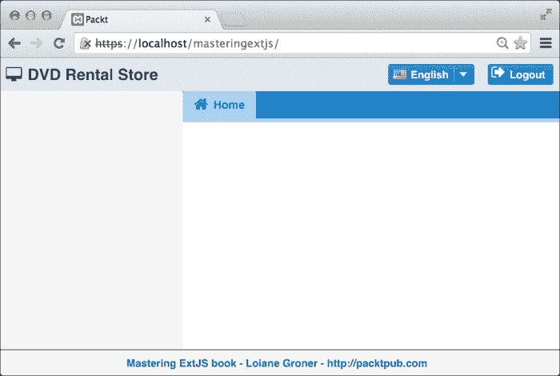
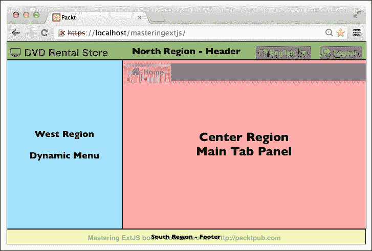
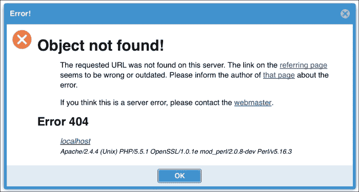
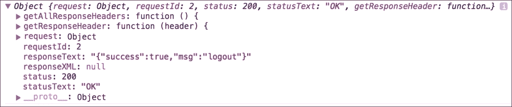
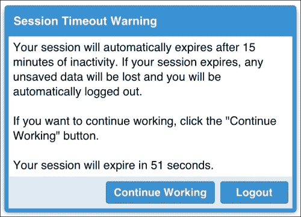
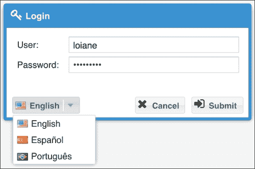
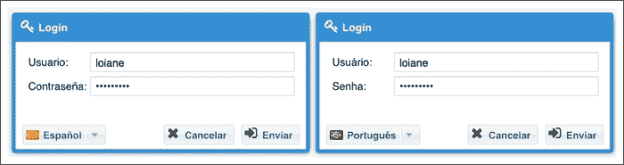
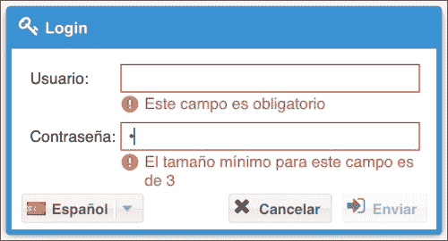

# 第四章：注销和多语言功能

在本章中，我们将实现系统的多语言功能。这个功能将允许系统根据用户选择的语言显示标签的翻译（同时使用一些 HTML5 功能）。

我们还将学习如何实现注销功能，以便用户可以结束会话，并且出于安全原因，我们将学习如何在用户不活动（一段时间内没有使用鼠标或键盘）的情况下为用户实现会话超时警告。

此外，在用户认证后，我们需要显示应用程序。在本章中，我们将学习如何实现应用程序的基础。

因此，在本章中，我们将涵盖：

+   应用程序的基础

+   注销功能

+   活动监控和会话超时警告

+   结构化应用程序以接收多语言功能

+   创建更改语言组件

+   在运行时处理更改语言组件

当我们介绍所有应用程序功能时，我们还将介绍一些 Ext JS 组件。

# 应用程序的基础 – view/main/Main.js

当我们在登录控制器中实现**提交**按钮监听器的`success`函数时，我们提到了`Packt.view.main.Main`类。我们将重用这个类（它是在我们创建项目时由 Sencha Cmd 自动创建的）作为我们应用程序的基础。在我们开始动手实践之前，让我们看看本章结束时应用程序的结果：



## 视口

无论我们是否完全使用 Ext JS 构建应用程序（因为我们确实有选择将单个组件渲染到`<div>`标签中的选项，类似于 jQuery 中执行的方式），我们都需要使用一个将成为应用程序基础的组件。这个组件是视口。视口是一个特殊的容器，代表可查看的应用程序区域（浏览器视口）。视口将自身渲染到文档主体，并自动调整自身大小以匹配浏览器视口的大小，并管理窗口大小调整。应用程序中可能只有一个视口被创建。

在我们创建视口之前，如果我们点击**登录**屏幕的**提交**按钮，我们会看到一个灰色屏幕，即使我们在`LoginController`类内部调用了`Ext.create('Packt.view.main.Main');`。这意味着`Packt.view.main.Main`正在被创建，但屏幕上没有显示任何内容。这是因为`Main`类没有被渲染为任何组件的子组件，也没有被渲染到 HTML 主体中。但我们将通过将其更改为视口来改变这种行为。

打开`app/view/main/Main.js`文件。在代码的第二行，你会找到以下代码片段：

```js
extend: 'Ext.container.Container'
```

由 Sencha Cmd 创建的 `Main` 类扩展了 `Container` 组件。`Container` 组件是 Ext JS API 中最简单的容器组件。它支持向其中添加和移除项目，同时也是许多其他组件的父类，例如 Panel、Window 和 TabPanel。我们将把 `Ext.container.Container` 改为 `Ext.container.Viewport`，这样我们就可以将 `Main` 类作为我们应用程序的基类。保存代码，刷新浏览器，试一试。下次当你点击 **提交** 按钮时，登录后你应该能看到由 Sencha Cmd 创建的原始代码。

### 使用 Viewport 插件

在 Ext JS 应用程序中扩展 `Ext.container.Viewport` 类是经典和传统的方式。Ext JS 5 引入了一种使用 Viewport 的新方法，即使用 Viewport 插件 (`Ext.plugin.Viewport`)。

### 注意

要了解更多关于 Ext JS 插件的信息，请阅读[`www.sencha.com/blog/advanced-plugin-development-with-ext-js/`](http://www.sencha.com/blog/advanced-plugin-development-with-ext-js/)。

要使用这个插件，首先撤销前面主题中我们所做的更改（`Main` 类将继续扩展 `Ext.container.Container`），然后在 `extend` 代码之后添加以下代码：

```js
Ext.define('Packt.view.main.Main', {
    extend: 'Ext.container.Container',

 plugins: 'viewport',

    xtype: 'app-main',
```

使用 `plugins` 配置与扩展 `Viewport` 类有相同的结果。这个插件将任何组件转换为一个 Viewport，使其填充浏览器中的所有可用空间。这个插件的优势在于我们仍然可以在其他上下文中重用这个类，例如在窗口内部。

我们知道，通过查阅文档，Viewport 插件的 **ptype**（插件类型）是 **viewport**。


### 小贴士

总是记住，在开发 Ext JS 应用程序时，文档需要成为你的最佳朋友！

## 使用 Border 布局组织主屏幕

如我们在第一章中学习到的，*Sencha Ext JS 概述*，Border 布局可以用来将父容器的子元素组织成五个区域：北、南、西、东和中心。

中心区域是唯一必须存在的区域。其他区域是可选的。查看下面的截图，我们可以看到我们将把主屏幕组织成四个区域：**中心**、**北**、**南**和**西**：



让我们看看 `Main` 类的 `items` 配置（你可以用以下代码替换由 Sencha Cmd 生成的代码）：

```js
items: [{
    region: 'center',   // #1
    xtype: 'mainpanel'
},{
    xtype: 'appheader', // #2
    region: 'north'
},{
    xtype: 'appfooter', // #3
    region: 'south'
},{
    xtype: 'container', // #4
    region: 'west',
    width: 200,
    split: true
}]
```

在`center`区域，我们有`mainpanel`（`#1`）。在第五章，*高级动态菜单*中，我们将创建一个动态菜单，将给用户打开他们有权访问的屏幕的选项。用户打开的每个屏幕都将作为`mainpanel`中的一个标签创建。我们将在下一分钟创建它。

在`north`区域，我们有头部（`#2`），在`south`区域，我们有页脚（`#3`）。我们也将很快对它们进行处理。

在`west`区域，我们有`container`（`#4`），我们将在下一章中使用它来渲染动态菜单。现在，我们将为它预留空间。

重要的是要知道，对于`center`区域，我们不需要指定`width`或`height`。在`center`区域渲染的容器将使用 Border 布局中剩余的任何空间。对于`south`和`north`区域，你需要指定`height`。我们将创建`Header`和`Footer`时这样做。`south`和`north`区域将使用屏幕上所有可用的水平空间——受`height`限制——这就是为什么不需要`width`。对于`west`和`east`区域，需要指定`width`。因为我们只使用`west`区域，所以我们指定了`200`像素（`#4`）。

### 创建主 TabPanel 组件

我们需要创建在`Main`类的`center`区域使用的`mainpanel`组件。为此，我们将在`app/view/main`文件夹内创建一个名为`Panel.js`的新文件，并在其中编写以下代码：

```js
Ext.define('Packt.view.main.Panel', { // #1
    extend: 'Ext.tab.Panel',          // #2
    xtype: 'mainpanel',             // #3

    activeTab: 0,                     // #4

    items: [
        {
            xtype: 'panel',                      // #5
            closable: false,                     // #6
            iconCls: 'fa fa-home fa-lg tabIcon', // #7
            title: 'Home'          // #8 
        }
    ]
});
```

如同往常，我们将从类的名称开始。类的命名约定是*app 命名空间 + 文件夹*（在`app`内部）*+ 文件名*（不带`.js`扩展名），这将导致`Packt.view.main.Panel`（`#1`）。`main.Panel`类是扩展 TabPanel 组件的（`#2`）。

在第`#3`行，我们有`main.Panel`类的`xtype`。这是我们用来在`Main`类内部实例化这个类的`xytpe`类。在第`#4`行，我们有`activeTab`配置。当我们设置一个标签为活动状态时，TabPanel 组件将显示该标签的内容，并且也会将其突出显示。

如我们在第一章中学习的，*Sencha Ext JS 概述*，TabPanel 组件是一个容器，它通过卡片布局组织子标签页，这意味着用户将一次看到一个活动标签页的内容。在`items`配置内部声明的每个子项都是`tab`类的实例（`Ext.tab.Tab`），它可以是我们`#5`行中具有的任何类型。因此，为了不显示空屏幕，我们显示了一个`'Home'`标签页（`#8`），它是一个面板（`#5`），这意味着它也可以包含工具栏和其他组件。这个`Home`标签页不能被关闭（`#6`）；否则，用户将在主屏幕中间看到一个空白区域，我们不希望这样。我们还在`#7`行设置了一个格式为`home`的 Font Awesome 图标，使其看起来更美观。

您可以使用此**主页**选项卡来显示公告或表现得像一个仪表板，用户将看到所有待办任务的摘要。

### 创建页脚

下一步是创建主屏幕的页脚。我们将在`app/view/main`内部创建一个名为`Footer.js`的新文件，并在其中包含以下代码：

```js
Ext.define('Packt.view.main.Footer', {
    extend: 'Ext.container.Container', //#1
    xtype: 'appfooter',                //#2

    cls: 'app-footer',                 //#3

    height: 30,                        //#4

    layout: 'center',                  //#5

    items: [
        {
            xtype: 'component',               //#6
            width: 350,                       //#7
            componentCls: 'app-footer-title', //#8
            bind: {
                html: '{footer}'              //#9
            }
        }
    ]
});
```

`Footer`将扩展自`Container`类（`#1`）。`Container`类是我们能创建的最轻组件，它可以包含项目。我们应该尽可能优先使用它。我们将在稍后进行更详细的讨论。然后，我们声明`xtype`类（`#2`），这是我们用于在`Main`类中实例化此类的别名。

### 小贴士

总是记住，别名（`xtype`）的约定是使用所有小写字母。如果您愿意，可以根据个人喜好使用"`-`"（连字符）分隔单词。

如果我们查看本章的第一幅图像，我们会注意到页脚有一个顶部边框。我们在`#3`行添加了一个样式，将此边框添加到页脚。`cls`配置允许我们在 Ext JS 中的组件上添加额外的 CSS。它适用于所有组件。我们将在一分钟内将样式添加到我们的 CSS 中。

由于我们在`Main`类的南部区域声明了`Footer`，因此您需要设置`height`参数。我们可以在`Footer`类内部或声明南部区域时在`Main`类内部完成此操作。在这种情况下，我们是在`Footer`类内部设置它（`#4`）。

在`Footer`类内部，我们在这个例子中只想有一个组件，即文本（您可以使用版权信息），我们将使用 HTML 显示它。我们还希望这段文本居中。因此，我们可以使用`center`布局（`#5`）。要使用`center`布局，父容器需要只有一个子组件（因为它继承自`fit`布局，它也只支持单个子组件）。还需要声明子组件的`width`参数（`#7`）；在这种情况下，我们将显示的文本大约宽`350`像素。

### 注意

在 Ext JS 4 中，Center 布局被用作与 Ext JS SDK 一起提供的 UX 插件。在 Ext JS 5 中，这个布局被提升为原生 API，但保持了向后兼容性。在布局配置中，你可以使用`center`（在 Ext JS 5 中引入）并继续使用`ux.center`（来自 Ext JS 4），如果你正在将应用程序从 Ext JS 4 迁移到 5。

为了渲染 HTML，我们将使用尽可能轻量和简单的组件，即`component`（`#6`）。因为我们还想要应用一些 CSS 到我们的文本上，我们将使用`componentCls`（`#8`）类，这是一个添加到组件根级元素的 CSS 类。

注意，在`Footer`类内部没有声明任何文本。相反，我们将`html`配置绑定到一个名为`footer`的值（`#9`）。这也是我们将在本章中使用的新的 MVVM 架构的一部分。在前一章中，我们只使用了`View`和`ViewController`类来实现登录功能。在本章中，我们将使用完整的特性：从 MVVM 架构中来的 View、ViewController 和 ViewModel（当我们创建项目时，Sencha Cmd 已经生成了这些类，所以最好重用它们！）。目前，请记住，这是 ModelView 绑定的一个部分，我们将在下一个主题中深入探讨。

#### 关于模块化 CSS 的简要说明

让我们讨论另一种向我们的应用程序添加 CSS 的方法。我们已经知道，向我们的应用程序添加 CSS 的最佳实践是在`sass/etc`文件夹内使用 Sass，就像我们在前面的例子中所做的那样。然而，有一些样式是为特定组件创建的，我们不会在整个应用程序中重用它们。而不是将这些 CSS 样式添加到我们的`all.scss`文件中，并得到一个可能会在需要维护时给我们带来头痛的大文件，我们可以使用更模块化的 CSS 方法来为我们的 Ext JS 视图创建特定的 CSS。

在`sass`文件夹内，创建一个名为`src`的新文件夹（如果 Sencha Cmd 没有自动创建），然后在`src`内部创建一个名为`view`的新文件夹。在`view`内部，创建一个名为`main`的新文件夹。我们将有`sass/src/view/main`这个目录。在这个目录内，创建一个名为`Footer.scss`的文件，并在其中包含以下内容：

```js
$packt-footer-text-color: rgb(11, 103, 196); //#1

.app-footer-title {
  color: $packt-footer-text-color; //#2
  font-size: 12px;
  font-weight: bold;
}

.app-footer {
  border-top: 1px solid darken($packt-footer-text-color, 15); //#3
}
```

在行`#1`中，我们声明了一个带有蓝色调的 Sass 变量（与`TabPanel`背景相同的蓝色）。我们在创建用于我们的`Footer`类的样式时，在行`#2`和`#3`中重用了这个变量。

### 注意

在行`#3`中，我们使用了 Sass 中的`darken`函数，它接受一个颜色和一个 0-100 之间的数字，这是我们想要使颜色变暗的百分比。有关更多信息，请参阅 Sass 文档，网址为[`goo.gl/JsAnVz`](http://goo.gl/JsAnVz)。

`view/main/Footer.scss` 文件与 `view/main/Footer.js` 文件的路径相同。请注意，这样，维护 `Footer` 类特定的样式就更容易了。我们将在下一个主题中为 `Header` 类做同样的事情。我们将 CSS 分离成模块，以便更容易阅读和维护，当我们进行构建时，所有的 CSS 都将连接成一个单独的生产 CSS 文件——这被称为模块化 CSS。看看，使用 Ext JS 开发应用程序不仅仅是 Ext JS；我们还可以应用其他前端技术的知识！

### 创建 Header 类

接下来，我们将创建 `Header` 类。`Header` 类包含应用程序的标志、应用程序名称、提供翻译功能的下拉菜单以及**注销**按钮。为了创建标题，我们将在 `app/view/main` 文件夹内创建一个新的文件，名为 `Header.js`，并包含以下代码：

```js
Ext.define('Packt.view.main.Header', {
    extend: 'Ext.toolbar.Toolbar', //#1
    xtype: 'appheader',            //#2

    requires: [
        'Packt.view.locale.Translation' //#3
    ],

    ui: 'footer',                       //#4

    items: [{
            xtype: 'component',         //#5
            bind: {                     //#6
                html: '{appHeaderIcon}' 
            }
        },{
            xtype: 'component',
            componentCls: 'app-header-title', //#7
            bind: {                           //#8
                html: '{appName}'
            }
        },{
            xtype: 'tbfill'           //#9
        },{
            xtype: 'translation'      //#10
        },{
            xtype: 'tbseparator'      //#11
        },{
            xtype: 'button',          //#12
            itemId: 'logout',         //#13
            text: 'Logout',         
            reference: 'logout',      //#14
            iconCls: 'fa fa-sign-out fa-lg buttonIcon', //#15
            listeners: {  
                click: 'onLogout'  //#16
            }
        }
    ]
});
```

我们的 `Header` 类将扩展 `Toolbar` 类（`#1`）。`Toolbar` 类通常用于面板及其子类（网格、表单、树）中，用于组织按钮，但它也可以像我们在这个例子中要做的那样，用来包含其他组件。我们将在其他章节中介绍更多关于工具栏的内容。我们还在 `Header` 类中声明了一个 `xtype` 类，我们在 `Main` 类（`#2`）中引用了这个类。

每当我们使用我们自己创建的 `xtype` 类时，Ext JS 都无法理解我们试图实例化的组件是什么。因此，我们需要引用我们正在使用的类。例如，在第 `#3` 行中，我们通过在第 `#10` 行中使用的 `xtype` 类引用我们正在实例化的翻译组件的类。我们将在本章后面开发这个组件。

### 注意

注意，在 `Main` 类中，我们还没有使用 `requires`。我们需要回到那里并添加所需的 `Header`、`Footer` 和 `main.Panel` 类。

`ui` 配置允许我们为组件使用特定的主题。`Toolbar` 组件具有配置 `ui: 'footer'` (`#4`)，这为工具栏提供了透明的背景。`footer` 值包含在 Ext JS SDK 中，并使工具栏透明。我们将在本书后面讨论主题时创建一些自定义的 `ui` 配置。

`Header` 类的前两个子项是图标（`#5`）和应用程序名称。对于图标，我们将使用 Font Awesome 来显示桌面格式的图标。对于应用程序的标题，我们将使用我们在 `Footer` 类中使用的相同方法。我们还在使用一个 `componentCls` 配置（`#7`）来对其进行样式化。我们从 ViewModel 中获取这两个值（图标-`#6` 和应用程序名称-`#8`），我们将在下一分钟进行介绍。

下一个项目是工具栏填充（`#9`）。此组件将 `translation` (`#10`) 和 `logout` 按钮 (`#13`) 对齐到右侧，填充 `Toolbar` 类中间的空间（在应用程序标题和按钮之间）。

### 注意

除了 `{ xtype: 'tbfill' }`，我们还可以使用 `'->'` 作为快捷方式。

我们还在第 `#12` 行声明了 `logout` 按钮。我们将分配 `itemId` 以便我们可以通过应用程序全局引用此按钮。当我们使用会话监控功能时，我们需要它。`itemId` 在其作用域内需要是唯一的；在这种情况下，它需要在这个类中是唯一的，但如果它在应用程序级别是唯一的会更好。

由于我们将使用 `ViewController` 类来处理注销，我们将声明一个 `reference` (`#14`) 以便在 `ViewController` 类内部更容易地检索按钮引用，我们还将声明监听器 (`#16`)，这意味着当我们在 **注销** 按钮上点击时，`ViewController` 类中的 `onLogout` 函数将被执行。

我们还设置了一个来自 Font Awesome 的图标到 `Logout` 按钮（`#15`）。默认情况下，图标将具有黑色。按钮文本是白色，我们希望图标与文本颜色相同。因此，我们添加了一个自定义样式（`buttonIcon`）。

最后，我们有工具栏分隔符在第 `#11` 行声明。这只是在按钮之间添加一个分隔符（"|"）。

### 注意

同样，`tbfill`，工具栏分隔符，也有一个快捷方式。除了 `{ xtype: 'tbseparator' }`，我们还可以使用 `'-'`。

#### 创建头部 CSS

正如我们对 `Footer` 类所做的那样，我们也将创建一个文件名，`Header.scss`，在 `sass/view/main` 文件夹中，其中包含以下内容：

```js
$packt-header-text-color: #2a3f5d;

.app-header-logo {
  color: $packt-header-text-color;
}

.app-header-title {
  padding: 5px 0 5px 3px;
  color: $packt-header-text-color;
  font-size: 18px;
  font-weight: bold;
}
```

`app-header-logo` 是为了自定义图标颜色与应用程序标题相同而创建的。我们在两种样式中都使用了 Sass 变量。标题的文本颜色是深蓝色。

#### 自定义 Font Awesome 图标颜色

默认情况下，Font Awesome 图标将以黑色显示。但我们要让一些图标与我们的主题颜色相同。我们可以使用 CSS 来进行这种自定义。

我们已经声明了两种样式来自定义 Font Awesome 图标。第一个是在 `Panel` 类中（`tabIcon`），第二个是 **注销** 按钮（`buttonIcon`）。因此，我们还需要将这些样式添加到我们的 CSS 中。为了遵循模块化 CSS 方法，让我们在 `sass/etc` 下创建一个新文件，`iconColors.scss`，其中包含以下内容：

```js
$packt-button-icon-color: #fff;
$packt-tab-icon-color: rgb(11, 103, 196);

.tabIcon {
  color: $packt-tab-icon-color;
}

.buttonIcon {
  color: $packt-button-icon-color;
}
```

### 小贴士

如果我们决定稍后自定义 Ext JS 主题，我们将习惯于使用 Sass 变量来简化我们的工作！

然后，我们只需要将此文件导入 `all.scss` 文件中：

```js
@import "fontAwesome/font-awesome";
@import "iconColors";

```

## 主屏幕和 MVVM

现在，是时候将所有内容整合在一起了。让我们看看完整的代码如何使 `Main` 类看起来：

```js
Ext.define('Packt.view.main.Main', {
    extend: 'Ext.container.Container',
    plugins: 'viewport',
    xtype: 'app-main',

    requires: [ //#1        'Packt.view.main.Header',        'Packt.view.main.Footer',        'Packt.view.main.Panel',        'Packt.view.main.MainController',        'Packt.view.main.MainModel'    ],

    controller: 'main', //#2
    viewModel: {
        type: 'main' //#3
    },

    layout: {
        type: 'border'
    },

    items: [{
        region: 'center',
        xtype: 'mainpanel'
    },{
        xtype: 'appheader',
        region: 'north'
    },{
        xtype: 'appfooter',
        region: 'south'
    },{
        xtype: 'container',
        region: 'west',
        width: 200,
        split: true
    }]
});
```

我们需要添加我们创建的所有类（我们通过它们的 `xtype` 类引用它们）的 `requires` 声明，以及由 Sencha Cmd 创建的 `Main` ViewModel 和 `Main` ViewController 类。

`controller`（`#2`）和 `viewModel`（`#3`）声明已经在创建项目时由 Sencha Cmd 添加。我们通过引用它们的类型简单地重用它们。

### 主要 ViewModel

如果我们打开 `app/view/main` 文件夹中的 `MainModel.js` 文件，我们将在其中看到一些内容。我们将向其中添加更多内容，文件将如下所示：

```js
Ext.define('Packt.view.main.MainModel', { //#1
    extend: 'Ext.app.ViewModel', //#2

    alias: 'viewmodel.main', //#3

    data: {
        name: 'Packt', //#4
        appName: 'DVD Rental Store', //#5
        appHeaderIcon: '<span class="fa fa-desktop fa-lg app-header-logo">', //#6
        footer: 'Mastering ExtJS book - Loiane Groner - http://packtpub.com' //#7
    }
});
```

让我们从类的名称（`#1`）开始。由 Sencha 提议的 ViewModel 命名规范是视图的名称（`Main`）+ "Model"，结果为 `MainModel`。ViewModel 从 Ext JS 5 中引入的 `ViewModel` 类（`#2`）扩展，并使用 MVVM 架构。ViewModel 的别名（`#3`）由 "`viewmodel.`" 加上我们想要分配的类型名称定义。在这种情况下，Sencha 已经为我们创建了此类，类型为 `main`。这就是为什么我们可以在 `View` 类中使用以下代码引用此别名：

```js
viewModel: {
    type: 'main'
}
```

`data` 配置允许我们在 `ViewModel` 类中填充值。`name` 字段（`#4`）是由 Sencha Cmd 创建的，所以我们将保留它（如果你想移除，也可以移除）。`appName`（`#5`）和 `appHeaderIcon`（`#6`）属性被 `Header` 使用，而 `footer`（`#7`）被 `Footer` 类使用。

`MainModel` 与 `Main` 类（视图）绑定。因为 `Header` 和 `Footer` 是 `Main` 组件的 `items`，它们也可以引用 `MainModel`。

这是我们创建带有预填充数据的 `ViewModel` 类的最简单方式。我们将在本书的其余部分提供其他高级示例，但我们需要从小步骤开始！

### 注意

关于 ViewModel、数据绑定以及如何绑定不同数据类型的信息，请阅读以下 Sencha 指南：[`goo.gl/qta6kH`](http://goo.gl/qta6kH)。

# 注销功能

由于用户可以选择登录应用程序，用户也可以从应用程序中注销。在 `Header` 类中，我们已经声明了 `logout` 按钮。唯一待办的事情是在 `MainController` 中实现监听器。

由于 `MainController` 类是由 Sencha Cmd 创建的，我们正在重用它。文件中已经有了一些代码。让我们移除由 Sencha 创建的任何监听器。`MainController` 将如下所示：

```js
Ext.define('Packt.view.main.MainController', {
    extend: 'Ext.app.ViewController',

    requires: [
        'Ext.MessageBox'
    ],

    alias: 'controller.main',

 //we will insert code here
});
```

在 `Header` 类中，我们声明了 `logout` 按钮、其引用和其监听器。因此，我们需要实现 `onLogout` 函数，如下所示：

```js
onLogout: function(button, e, options){

    var me = this;      //#1
    Ext.Ajax.request({
        url: 'php/security/logout.php', //#2
        scope: me,                      //#3
        success: 'onLogoutSuccess',     //#4
        failure: 'onLogoutFailure'      //#5
    });
},
```

`me` (`#1`) 变量是对 `this` 的引用，即 `MainController` 类。我们将向 `php/security/logout.php` 发起一个 Ajax 调用 (`#2`)（我们很快将创建此文件）。我们将在 `MainController` 类内部声明的单独函数中处理 `success` (`#4`) 和 `failure` (`#5`) 回调。这就是为什么作用域被设置为 `MainController` 类本身 (`#3`) 的原因。

### 小贴士

我们可以直接在 Ajax 请求中声明 `success` 和 `failure` 回调。但这样，我们的代码会非常长，这会降低其可读性。这种方式可以使代码保持组织结构，更容易阅读。这始终是一个需要遵循的最佳实践。

## 处理服务器上的注销

为了处理服务器上的注销功能，我们将在 `php/security` 文件夹下创建一个名为 `logout.php` 的新 PHP 页面。代码非常简单：

```js
<?php

session_start(); // #1

$_SESSION = array(); // #2

session_destroy(); // #3

$result = array(); // #4

$result['success'] = true;
$result['msg'] = 'logout';

echo json_encode($result); // #5
```

首先，我们需要恢复当前会话 (`#1`)，然后我们需要取消所有会话变量 (`#2`)，接下来我们需要销毁会话 (`#3`)。最后，我们需要将信息发送回 Ext JS，表明会话已被销毁 (`#4` 和 `#5`)。

## Ajax 请求成功与失败

我们已经处理了服务器端代码。现在，我们需要回到 Ext JS 代码，并处理来自服务器的响应。但首先，我们需要理解一个通常让大多数 Ext JS 开发者感到困惑的重要概念。

在 第三章，*登录页面* 中，我们提到 Ext JS 处理表单提交和 Ajax 请求的 *成功 x 失败* 方式略有不同，这正是大多数开发者感到困惑的地方。

`Ext.Ajax` 类负责 Ext JS 执行的 Ajax 请求。如果我们查看文档，这个类有三个事件：`beforerequest`、`requestcomplete` 和 `requestexception`，具体解释如下：

+   事件 `beforerequest` 在请求之前触发

+   当 Ext JS 能够从服务器获取响应时，会触发事件 `requestcomplete`

+   当服务器返回 HTTP 错误状态时，会触发 `requestexception` 事件

现在，让我们回到 `Ext.Ajax.request` 调用。我们可以向请求传递一些选项，包括我们想要连接的 `url` 属性、参数以及其他选项，包括 `success` 和 `failure` 函数。现在，误解就从这里开始了。一些开发者理解，如果服务器上的操作成功执行，我们通常从服务器返回 `success = true`。如果出现问题，我们返回 `success = false`。然后，在 `success` 函数中处理 `success = true`，在 `failure` 函数中处理 `success = false`。这是 *错误的*，并且这与 Ext JS Ajax 请求的工作方式不符；然而，*这正是表单请求的工作方式*（正如我们在 第三章，*登录页面* 中所学的）。看看它如何变得混乱？

对于 Ext JS Ajax 请求，`success`是指服务器返回响应（`success` `true`或`false`；这并不重要），而`failure`是指服务器返回 HTTP 错误状态。这意味着如果服务器能够返回响应，我们将在`success`函数中处理这个响应（无论`success`信息是`true`还是`false`），在`failure`消息中，我们需要通知用户出了问题，用户应联系系统管理员。

我们将首先实现`failure`回调函数。因此，在`ViewController`类中，我们将添加以下代码：

```js
onLogoutFailure: function(conn, response, options, eOpts){
    Packt.util.Util.showErrorMsg(conn.responseText);
},
```

我们将要执行的操作是向用户显示一个带有错误图标和**确定**按钮的警告框，并包含 HTTP 状态错误信息。

为了重现错误以便触发`requestexception`事件，我们可以在测试目的下将`logout.php`文件重命名为其他名称（例如，`logout_.php`）。然后，我们执行代码，将得到以下输出：



这就是`failure`函数所需的所有内容。请注意，我们正在重用我们在第三章中开发的`Packt.util.Util`类，在本章中再次使用！看看重用代码有多方便？

### 注意

我们正在重用代码并节省了一些重复的代码行。我们还在项目中创建了一种处理一些事情的模式。这在项目中工作尤其重要，尤其是在团队中工作。这样，项目看起来就像是一个人开发的，而不是多个人开发的，这非常好。这也是一个需要遵循的最佳实践。重用代码也是所谓的*最小化有效载荷大小*的一部分，这是使用 JavaScript 开发时的一个最佳实践，也是 Web 开发的一个关注点。要了解更多信息，请访问[`developers.google.com/speed/docs/best-practices/payload`](https://developers.google.com/speed/docs/best-practices/payload)。

为了使代码正常工作，请从`MainController`类中移除以下代码：

```js
requires: [
    'Ext.MessageBox'
],
```

在前述代码的位置编写以下代码：

```js
requires: [
 'Packt.util.Util'
],
```

现在，让我们专注于`success`回调函数：

```js
onLogoutSuccess: function(conn, response, options, eOpts){
   //#1
    var result = Packt.util.Util.decodeJSON(conn.responseText);

    if (result.success) { //#2
        this.getView().destroy(); //#3
        window.location.reload(); //#4
    } else {

        Packt.util.Util.showErrorMsg(result.msg); //#5
    }
}
```

我们需要做的第一件事是解码从服务器接收到的 JSON 消息（`#1`）。如果我们记录发送到`success`函数的`conn`参数（`console.log(conn)`），我们将在控制台得到以下输出：



我们想要检索的信息位于`conn.responseText`属性中，即`success`和`msg`值。回想一下，在第三章中，我们讨论了`responseText`可能包含除我们期望的 JSON 以外的异常的可能性。因此，出于这个原因，我们将重用我们创建的`decodeJSON`函数（`#1`），以便我们可以正确处理任何结果。

在`success`（`#2`）的情况下，我们将`destroy``Main`类（`#3`），即我们的 Viewport（这样做可以释放浏览器的内存，并使对象可供 JavaScript 垃圾回收器回收）。由于 Viewport 包含我们应用程序的所有其他组件，它将销毁它们。然后，我们将重新加载应用程序，再次显示**登录**屏幕（`#4`）。

如果`success`为`false`（或发生任何错误），我们将显示一个带有错误消息的错误警报（`#5`）。

# 客户端活动监控

让我们进一步增强我们的应用程序。让用户知道网络应用程序有超时，他们不能整天都让它开着——主要是出于安全考虑。服务器端语言也有超时。一旦用户登录，服务器将不会永远可用。这也是出于安全考虑。这就是为什么我们需要将这种功能添加到我们的应用程序中。

我们将使用一个插件来完成这个任务。这个插件叫做`Packt.util.SessionMonitor`，它基于 Sencha Market（[`market.sencha.com/extensions/extjs-activity-monitor`](https://market.sencha.com/extensions/extjs-activity-monitor)）的活动监控插件。在一段时间（默认为 15 分钟的空闲时间）后，插件将向用户显示一条消息，询问用户是否希望保持会话活跃。如果用户选择是，那么它将向服务器发送一个 Ajax 请求以保持服务器会话活跃。如果用户在消息显示 60 秒后没有任何操作，应用程序将自动注销。

您可以从[`github.com/loiane/masteringextjs/blob/master/app/util/SessionMonitor.js`](https://github.com/loiane/masteringextjs/blob/master/app/util/SessionMonitor.js)获取此插件的源代码。它在 Ext JS 4 和 Ext JS 5 中工作。

在前一个 URL 中的`Ext.ComponentQuery.query`的第*53*行，我们将更改`logout`按钮选择器为`button#logout`，这是我们为`logout`按钮创建的选择器（这就是为什么我们为`logout`按钮创建了`itemId`）。

此外，我们将更改第*42*行 Ajax 请求的`url`属性，将其更改为前一个 URL 中的`php/sessionAlive.php`。

如果我们要更改非活动间隔，我们只需要更改`maxInactive`配置。

要开始监控会话，我们只需要在`LoginController`的`onLoginSuccess`方法中添加这一行代码，在我们实例化`Main`类之后立即进行：

```js
onLoginSuccess: function(form, action) {
    Ext.getBody().unmask();
    this.getView().close();
    Ext.create('Packt.view.main.Main');
 Packt.util.SessionMonitor.start();
} 
```

我们不能忘记在 `LoginController` 中也将 `'Packt.util.SessionMonitor'` 添加到 `requires` 中。

在 `php/sessionAlive.php` 文件中，我们将有以下的代码：

```js
<?php
session_start();
```

这只是为了保持服务器会话活跃，并且将会话计时器重置为 15 分钟。

如果我们运行这段代码并等待不活动时间（15 分钟——当然我们可以将 `maxInactive` 参数改为等待更短的时间），我们将看到如下信息：



Ext JS 并没有提供这个功能的原生支持。但是，正如我们所看到的，实现它非常简单，我们可以将这个插件重用于我们正在工作的所有 Ext JS 项目中。

# 多语言功能

有时候，你可能想要将你正在海外工作的项目或产品发送出去，因此拥有翻译功能非常重要。毕竟，并不是每个人都理解或说与你相同的语言。这正是我们将在这个主题中要实现的内容：一个多语言组件，我们可以用它来翻译这个项目的标签。所以，在这个主题的结尾，这将是我们输出的结果：



理念是将用户的语言偏好本地存储，这样当用户下次加载应用程序时，首选语言将自动设置。并且当用户更改语言时，应用程序需要重新加载，以便将新的翻译加载到内存中。

## 创建更改语言组件

如果我们查看这个主题开头展示的截图，我们可以注意到多语言组件是一个按钮，当我们点击箭头时，会弹出一个包含可用语言的菜单。

带有箭头的按钮是一个分割按钮组件，它有一个菜单，每个语言选项都是菜单的一个菜单项。所以，让我们继续创建一个名为 `Packt.view.locale.Translation` 的新类，包含我们描述的特性。

### 小贴士

每当我们命名一个 `View` 类（也称为 Ext JS 小部件或组件）时，给出一个可以快速提醒我们该类做什么的名字是很好的。例如，通过将类命名为 `locale.Translation`，我们可以快速知道这个类提供了本地化应用程序的能力。

我们需要在 `app/view/locale` 文件夹下创建一个名为 `Translation.js` 的新文件，并在其中包含以下代码：

```js
Ext.define('Packt.view.locale.Translation', {
    extend: 'Ext.button.Split',   //#1
    xtype: 'translation',         //#2

    menu: {               //#3
        xtype: 'menu',    //#4
        items: [
            {
                xtype: 'menuitem', //#5
                iconCls: 'en',
                text: 'English'
            },
            {
                xtype: 'menuitem', //#6
                iconCls: 'es',
                text: 'Español'
            },
            {
                xtype: 'menuitem', //#7
                iconCls: 'pt_BR',
                text: 'Português'
            }
        ]
    }
});
```

因此，我们创建的类是从分割按钮类（`#1`）扩展而来的。分割按钮类是一种提供内置下拉箭头的类，它可以独立于按钮的默认点击事件触发事件。通常，这会被用来显示一个下拉菜单，为主要的按钮操作提供额外的选项。我们也将 `xtype` 类分配给这个类（`#2`），我们在 `Header` 类中用它来实例化它。

然后，在`menu`（`#3`）配置中，我们需要创建`menu`类的实例（`#4`），然后是`menu`类的`menuitems`，它们将代表每个区域选项。所以我们有：一个翻译成`英语`的选项（`#5`）——它还将显示美国国旗（`en`）；一个翻译成`西班牙语`的选项（`#6`）——它还将显示西班牙国旗（`es`）；还有一个翻译成`葡萄牙语`的选项（`#7`）——它还将显示巴西国旗（`pt_BR`）。

我们可以添加我们需要的任何选项。对于每个翻译选项，我们只需要为`menu`类添加新的`menuitems`。

### 添加 CSS – 国家旗帜

下一步现在是要添加`iconCls`的 CSS，我们在应用程序 CSS 的翻译组件中使用了它。为了使我们的代码更加有序（并为添加更多语言和更多旗帜图标留出空间），我们将在`sass/etc`文件夹内创建一个名为`flagIcons.scss`的新文件，其内容如下：

```js
.pt_BR {
  background-image:url('images/app/flags/br.png') !important;
}

.en {
  background-image:url('images/app/flags/us.png') !important;
}

.es {
  background-image:url('images/app/flags/es.png') !important;
}
```

### 注意

注意，样式的名称（`pt_BR`、`en`和`es`）与我们为每个`menuitem`使用的`iconCls`属性相同。这非常重要。

在`all.scss`文件中，我们需要导入我们创建的文件。在第二行添加以下代码（在我们导入 Font Awesome 文件之后）：

```js
@import "flagIcons";
```

但图标怎么办？Font Awesome 没有旗帜图标。我们将使用 FamFamFam 的旗帜集（[`www.famfamfam.com/`](http://www.famfamfam.com/）），这些图标可以免费用于任何目的（*Creative Commons License*）。在`resources/images/app`目录下创建一个名为`flags`的文件夹，并将旗帜图标复制粘贴进去。你可能需要将它们的名称更改为符合我们这个例子中使用的名称。

### 使用翻译组件

现在，`translation`组件已经准备好了（只显示给用户的内容）。我们将在项目的两个地方使用`translation`组件：在**登录**屏幕上，以及在`Header`上的**注销**按钮之前（它已经就位）。

让我们将其添加到**登录**屏幕。再次打开`Packt.view.login.Login`类。在工具栏上，我们将将其作为第一个项目添加，以便它看起来与我们在这个主题开头所展示的截图完全一样：

```js
items: [
  {      xtype: 'translation'  },
  {
      xtype: 'tbfill'
  },
  //...
]
```

我们不能忘记将类添加到**登录**屏幕类的`requires`声明中：

```js
requires: [
    ' Packt.view.locale.Translation '
],
```

如果我们重新加载应用程序（在做出所有这些更改的同时，不要忘记在终端上执行`sencha app watch`），我们将能够看到到目前为止我们所开发的内容。

## 创建多语言文件

我们需要在我们的项目中某个地方存储翻译。我们打算在`resources/locale`文件夹内的 JavaScript 文件中存储每种语言的翻译。由于我们将使用`iconCls`作为 ID 来加载翻译文件，我们需要创建三个文件：`en.js`、`es.js`和`pt_BR.js`。在每个文件中，我们将创建一个名为`translations`的 JavaScript 对象，并且该对象的每个属性都将是一个翻译。所有翻译文件必须相同；唯一不同的是将包含翻译的每个属性的值。

例如，以下代码是针对`en.js`文件的：

```js
translations = {
    login: "Login",
    user: "User",
    password: "Password",

    cancel: "Cancel",
    submit: "Submit",
    logout: 'Logout',

    capsLockTitle: 'Caps Lock is On',
    capsLockMsg1: 'Having Caps Lock on may cause you to ',
    capsLockMsg2: 'enter your password incorrectly.',
    capsLockMsg3: 'You should press Caps Lock to turn it ',
    capsLockMsg4: 'off before entering your password.'
};
```

以下代码是针对`pt_BR.js`的，其中包含巴西葡萄牙语的翻译：

```js
translations = {
    login: "Login",
    user: "Usuário",
    password: "Senha",

    cancel: "Cancelar",
    submit: "Enviar",
    logout: 'Logout',

    capsLockTitle: 'Caps Lock está ativada',
    capsLockMsg1: 'Se Capslock estiver ativado, isso pode fazer ',
    capsLockMsg2: 'com que você digite a senha incorretamente.',
    capsLockMsg3: 'Você deve pressionar a tecla Caps lock para ',
    capsLockMsg4: 'desativá-la antes de digitar a senha.'
};
```

以下代码是`es.js`代码，其中包含西班牙语的翻译：

```js
translations = {
    login: "Login",
    user: "Usuario",
    password: "Contraseña",

    cancel: "Cancelar",
    submit: "Enviar",
    logout: 'Logout',

    capsLockTitle:'Bloq Mayús está Activado',
    capsLockMsg1:'Tener el Bloq Mayús activado puede causar que ',
    capsLockMsg2:'introduzca su contraseña de forma incorrecta.',
    capsLockMsg3:'Usted debe presionar Bloq Mayús para apagarlo ',
    capsLockMsg4:'antes de escribir la contraseña.'
};
```

如我们所见，文件是相同的；然而，翻译是不同的。随着应用程序的增长，我们将向其中添加更多翻译，并且保持文件以相同的方式组织是一个好习惯，以便将来便于更改任何翻译。

## 在应用程序组件上应用翻译

要将翻译应用于我们至今开发的组件，非常简单：我们需要使用我们创建的`translations`字典来代替将要表示标签的字符串。

例如，在`Packt.view.view.Login`类中，我们有关窗口的标题，`username`和`password`字段的`fieldLabel`，以及**取消**和**提交**按钮的文本。标签是硬编码的，我们希望从翻译文件中获取翻译。

因此，我们需要将**:Login**窗口的`title`替换为以下内容：

```js
title: translations.login,
```

我们需要将`username` `textfield`的`fieldLabel`替换为以下内容：

```js
fieldLabel: translations.user,
```

我们需要将`password` `textfield`的`fieldLabel`替换为以下内容：

```js
fieldLabel: translations.password,
```

我们需要将**取消**按钮的`text`替换为以下内容：

```js
text: translations.cancel
```

我们需要将**提交**按钮的`text`替换为以下内容：

```js
text: translations.submit
```

等等。我们还可以将翻译应用于**注销**按钮和`CapsLockTooltip`类。

## HTML5 本地存储

我们对`translate`组件的想法是将用户的语言偏好存储在某个地方。我们可以使用 cookie 来做这件事，但我们想要的非常简单，cookie 包含在每个 HTTP 请求中。我们希望长期存储此信息，并使用可以持久化超过页面刷新或用户关闭浏览器的情况的东西。而完美的选择是使用 HTML5 的新特性之一——本地存储。

Ext JS 支持本地存储；它可以与**LocalStorageProxy**一起使用，但我们需要更简单的东西，直接在代码中使用 HTML5 功能会更简单。这也展示了我们可以与其他 API 一起使用 Ext JS API。

本地存储不是每个浏览器都支持的；它仅由 IE 8.0+、Firefox 3.5+、Safari 4.0+、Chrome 4.0+、Opera 10.5+、iPhone 2.0+ 和 Android 2.0+ 支持。我们将在本书稍后部分构建一个警告用户升级浏览器的页面。我们还将使用其他 HTML5 功能以及 Ext JS 在其他屏幕上。因此，现在我们需要知道，我们现在要实现的这个代码并不适用于每个浏览器。

### 注意

如需了解更多关于 HTML5 存储的信息，请访问 [http://diveintohtml5.info/storage.html](http://diveintohtml5.info/storage.html)。

我们希望这段代码在我们实例化 Ext JS 应用程序之前加载。因此，出于这个原因，我们将在 `app/Application.js` 文件中的 `Ext.define('Packt.Application', {` 之前添加它：

```js
function loadLocale(){

    var lang = localStorage ? (localStorage.getItem('user-lang') || 'en') : 'en',
        file = Ext.util.Format.format("resources/locale/{0}.js", lang);

    Ext.Loader.loadScript({url: file, onError: function(){
        alert('Error loading locale file. Please contact system administrator.');
    }});
}

loadLocale(); //#1
```

因此，首先，我们将验证 `localStorage` 是否可用。如果可用，我们将检查是否在 `localStorage` 上存储了一个名为 `user-lang` 的项；如果没有，英语将是默认语言。即使 `localStorage` 不可用，英语也将被设置为默认语言。

然后，我们创建一个名为 `file` 的变量，该变量将接收必须由应用程序加载的翻译文件的路径。

### 提示

Ext JS 有一个名为 `Ext.util.Format` 的类，其中包含一个静态方法 `format`，该方法将字符串和作为标记传递的值连接起来，在这种情况下是 `lang`。这比在 JavaScript 中手动进行字符串连接要干净。

在我们将 `url` 格式化后，我们将使用 `Ext.Loader` 加载它。`loadScript` 方法加载指定的脚本 URL，并调用提供的回调函数（如果有）。它接受 `onLoad` 和 `onError` 回调函数。在我们的情况下，不需要成功回调（`onLoad`）。如果在加载区域文件时发生任何错误，应用程序将无法加载，因此 `onError` 回调函数在这个情况下很有趣且是必需的，以便在发生错误时用户可以联系支持（尝试将 `en.js` 文件重命名以模拟错误）。

为了避免创建全局变量（因为这不是一个好的 JavaScript 实践），我们将我们的代码包装在一个函数中。因此，我们需要在 `Ext.define('Packt.Application'` 之前调用这个函数（`#1`）。

当我们的应用程序加载完毕时，它将包含所有可用的翻译。

## 实时处理更改语言

现在是 `translation` 组件代码的最后一部分。当用户选择不同的语言时，我们需要重新加载应用程序，以便 `loadLocale` 函数再次执行并加载用户选择的新语言。

为了做到这一点，我们将在我们的应用程序中创建一个新的 Controller，专门处理翻译组件。这里的问题是：我们现在使用 MVC（我们将在下一章中介绍）还是 MVVM？答案取决于您的个人喜好。为了这个功能，我们将继续使用 MVVM，或者更确切地说，使用 ViewController，原因很简单：这两个文件（`TranslationController.js`和`Translation.js`）都位于同一个目录（`app/view/locale`）中。这意味着将这个组件复制粘贴到其他项目中使用会更简单（我们可以整体复制`locale`文件夹）。

因此，我们需要创建一个名为`Packt.view.locale.TranslationController`的新类，为了创建这个类，我们需要在`app/view/locale`文件夹下创建一个名为`TranslationController.js`的新文件。在这个控制器中，我们需要监听两个事件：一个由`translation`组件本身触发，另一个由`menuitems`触发：

```js
Ext.define('Packt.view.locale.TranslationController', {
    extend: 'Ext.app.ViewController',
    alias: 'controller.translation'
});
```

让我们回到`Translation.js`文件，并将`TranslationController`添加为 ViewController，这样我们就可以开始监听事件：

```js
requires: [
    'Packt.view.locale.TranslationController'
],

controller: 'translation',
```

分割按钮有两个事件，即`click`（由于它是一个按钮而触发）和`arrowclick`事件，当用户点击箭头时触发。我们对这两个事件都不感兴趣。在分割按钮内部，有一个`Menu`类，其中包含`menuitems`，每个`menuitem`代表一个区域文件。`MenuItem`组件在点击时也会触发`click`事件。因此，我们可以为每个`MenuItem`添加`click`监听器——或者更好的是，为`menu`添加一个`defaults`配置，如下所示（这将应用于所有项目）：

```js
xtype: 'menu',
defaults:{    listeners: {        click: 'onMenuItemClick'    }},

```

现在，我们可以回到`TranslationController`并实现`onMenuItemClick`方法，如下所示：

```js
onMenuItemClick: function(item, e, options){

    var menu = this.getView(); //#1

    menu.setIconCls(item.iconCls); //#2
    menu.setText(item.text);       //#3

    localStorage.setItem("user-lang", item.iconCls); //#4

    window.location.reload(); //#5
}
```

首先，我们将获取对`translation`组件的引用（`#1`）。然后，我们将更新分割按钮的`iconCls`和`text`属性，使其与所选菜单项的`iconCls`和`text`属性相同（`#2`和`#3`）。接下来，我们将更新用户在`localStorage`上选择的新语言（`#4`），最后，我们将要求浏览器重新加载应用程序（`#5`）。

### ViewController 的早期生活

还有一个细节需要注意。当加载应用程序时，`translation`组件没有配置文本或图标。我们还需要注意这一点。我们可以监听`beforerender`或`render`事件，在组件显示给用户之前更新这两个属性，但有一个非常重要的细节：ViewController 在组件生命周期的早期就已经创建，因此无法监听这些事件。

根据 Sencha 文档，我们可以使用三种方法在组件生命周期的关键点执行一些任务：

+   `beforeInit`：可以通过覆盖此方法来在调用 `initComponent` 方法之前对视图进行操作。此方法在控制器创建后立即调用，发生在从组件构造函数中调用的 `initConfig` 期间。

+   `Init`：在调用 `initComponent` 后不久在视图中调用。这是为控制器执行初始化的典型时间，因为视图已初始化。

+   `initViewModel`：当视图的 ViewModel 被创建时（如果已定义），将调用此方法。

由于我们希望 `translation` 组件在渲染时具有 `iconCls` 和 `text`，因此我们可以使用 `TranslationController` 中的 `init` 方法来为我们执行此逻辑：

```js
init: function() {
    var lang = localStorage ? (localStorage.getItem('user-lang') || 'en') : 'en',
        button = this.getView();

    button.setIconCls(lang); //#1

    if (lang == 'en'){       //#2
        button.setText('English');
    } else if (lang == 'es'){
        button.setText('Español');
    } else {
        button.setText('Português');
    }
}
```

首先，我们将验证是否存在 `localStorage`，如果存在，我们将获取存储的语言。如果没有 `localStorage`，或者首选语言尚未存储（用户首次使用应用程序或用户尚未更改语言），则默认语言为 `English`。然后，我们将设置分割按钮的 `iconCls` 为所选语言的标志（`#1`）。

如果选择的语言是英语，我们将设置分割按钮的 `text` 为 `"English"` (`#2`)，如果选择的语言是西班牙语，我们将设置分割按钮的 `text` 为 `"Español"` (`#8`)；否则，我们将设置文本为 `"Português"`（葡萄牙语）。

### 注意

此控制器也适用于 MVC 架构。您可以查看 MVC 和 MVVM 实现之间的差异，请参阅[`goo.gl/ajaIao`](http://goo.gl/ajaIao)。

如果我们运行应用程序，我们可以更改首选语言，并看到结果是已翻译的应用程序，如下所示：



## 使用区域文件翻译 Ext JS

如同往常，还有一件事尚未完成。我们只翻译了应用程序的标签。表单错误和其他作为 Ext JS API 部分的消息没有翻译。Ext JS 提供了区域文件支持。我们所需做的只是将 JavaScript 区域文件添加到 HTML 页面中。为此，我们将在 `Application.js` 文件中的 `loadLocale` 函数内添加以下代码：

```js
var extJsFile = Ext.util.Format.format("ext/packages/ext-locale/build/ext-locale-{0}.js", lang);
Ext.Loader.loadScript({url: extJsFile});
```

### 提示

用于标志和翻译文件（`en.js`、`es.js`、`pt_BR.js`）的 `iconCls` 名称是由于 Sencha 使用的区域文件名称。因此，在命名自己的文件之前，请确保您已验证 Sencha 使用的名称。

现在，如果我们再次尝试运行应用程序，我们将能够看到所有 Ext JS 消息也将被翻译。例如，如果我们更改翻译为西班牙语，表单验证错误也将是西班牙语：



现在，应用程序的区域支持已完成！

### 提示

你可能想要在应用本地化支持后检查标签大小（使用`labelWidth`配置来更改其默认的 100 像素大小）和屏幕的消息目标。例如，标签**Contraseña**在屏幕上比**Password**需要更多的宽度。

在应用本地化后，将`Login`类中的`labelWidth`更改为`70`。你可以将`msgTarget`更改为`'side'`或增加窗口的`height`，以便在运行时以其他语言正确显示表单验证消息。

# 摘要

我们介绍了如何使用 Border 布局实现本书将要实现的应用程序的基础，你学习了如何实现一个**注销**按钮（在 Ext JS 端和服务器端）。我们还介绍了客户端活动监控和会话超时功能。

最后，你学习了如何使用 HTML5 功能和 Ext JS 构建一个`翻译`组件，该组件能够翻译应用程序的所有标签，并在运行时更改首选语言。你还学习了如何使用 Ext JS 的本地化支持来翻译框架的消息和标签。

在本章中，我们在应用程序的实现方面取得了重大进展。我们创建了新的文件，我们的应用程序正在增长。在本书的下一章中，我们将继续创建更多的文件和组件。

在下一章中，我们将学习如何使用折叠面板和树构建一个动态菜单。
