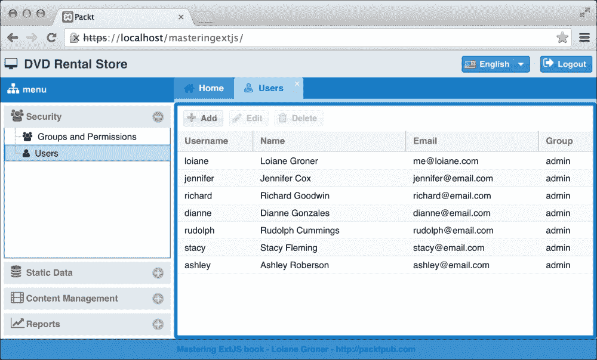
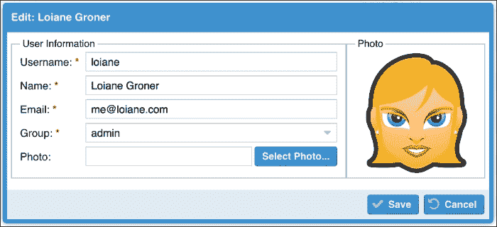
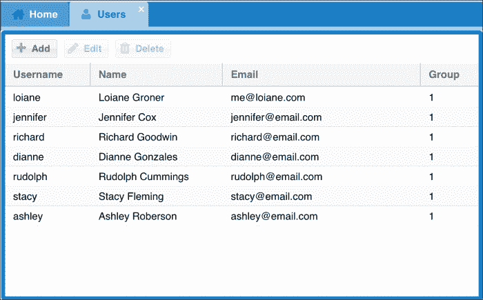
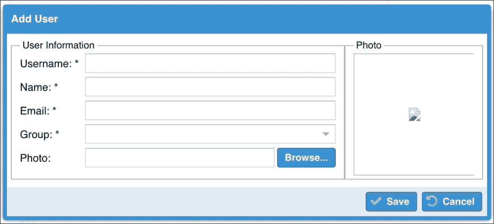
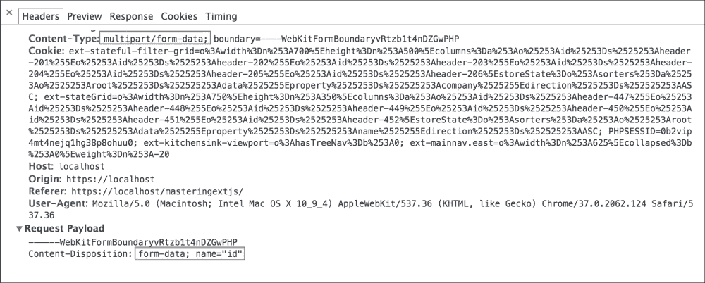
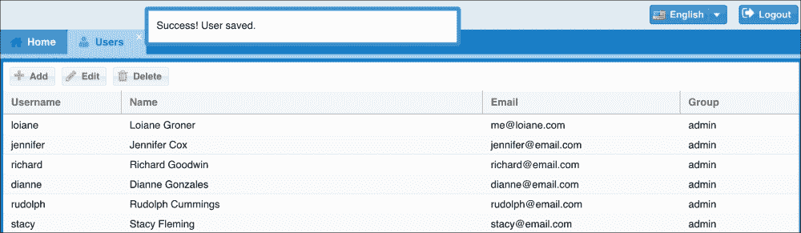

# 第六章：用户管理

在前面的章节中，我们开发了提供登录和注销功能以及客户端会话监控的机制，我们还实现了一个基于用户权限的动态菜单。然而，直到现在，所有用户、组和权限都是手动添加到数据库中的。我们不能每次需要向新用户授予应用程序访问权限或更改用户权限时都这样做。因此，我们将实现一个屏幕，我们可以在这里创建新用户并授予或更改权限。所以在本章中，我们将涵盖：

+   列出系统中的所有用户

+   创建、编辑和删除用户

+   文件上传的图片预览（用户图片）

# 管理用户

因此，我们将要开发的第一个模块是用户管理。在这个模块中，我们将能够看到系统中注册的所有用户，添加新用户，编辑和删除当前用户。

当用户点击 **用户** 菜单选项时，将打开一个新标签页，显示系统中的所有用户列表，如下截图所示：



当用户点击 **添加** 或 **编辑** 按钮时，系统将显示一个窗口，以便用户可以创建新用户或编辑当前用户（基于在 GridPanel 上选择的记录）。**编辑** 窗口将如下截图所示：



创建或编辑用户的某些功能：我们可以编辑 **用户信息**，如 **姓名**、**用户名** 等，我们还可以上传代表用户的 **照片**。但有一个额外功能；使用 HTML5 API，我们将在用户从计算机中选择图片并上传到服务器之前立即显示 **照片** 的预览。

## 使用简单的 GridPanel 列出所有用户

我们需要实现一个类似于本章第一张截图的屏幕。它是一个简单的 GridPanel。因此，要实现一个简单的 GridPanel，我们需要以下内容：

+   一个 Model 来表示存储在 `user` 表上的信息

+   用于加载数据的 Store 和用于告诉 Ext JS 从服务器读取信息的 Proxy

+   代表视图的 GridPanel 组件

+   用于监听事件的 ViewController，因为我们打算使用 MVVM 模式来开发这个模块

### 创建用户 Model

因此，第一步是创建一个 Model 来表示 `user` 表。我们将在 `app/model/security` 目录下创建一个名为 `User.js` 的新文件。这个 Model 将表示 `user` 表中的所有字段，除了 `password` 字段，因为密码是用户非常私人的信息，我们不能向任何其他用户显示用户的密码，包括管理员。因此，用户 Model 将如下所示：

```js
Ext.define('Packt.model.security.User', {
    extend: 'Packt.model.security.Base', //#1

 fields: [
        { name: 'name' },
        { name: 'userName' },
        { name: 'email' },
        { name: 'picture' },
        { name: 'groups_id' , type: 'int'}
});
```

正如我们之前提到的，`user` 表中的所有字段都映射到这个 Model 中，除了 `password` 字段。

在行 `#1` 中，我们没有扩展默认的 `Ext.data.Model` 类。我们扩展了一个我们创建的类。让我们看看它的声明。

#### 与模式一起工作

当我们设计数据库表时，我们还向 `user` 表添加了一个外键。这意味着 `user` 表与 `groups` 表有关联。Ext JS 5 引入了模式的概念。模式（`Ext.data.schema.Schema`）是一组相关实体及其相应的关联。我们知道 `User` 和 `Group` 模型类是相关实体，因此我们可以创建一个模式来表示它们。

让我们看看 `Packt.model.security.Base` 类内部的内容：

```js
Ext.define('Packt.model.security.Base', {
    extend: 'Ext.data.Model',

    requires: [
        'Packt.util.Util'
    ],

    idProperty: 'id',

    fields: [
        { name: 'id', type: 'int' } //#1
    ],

    schema: {
        namespace: 'Packt.model.security', //#2
        urlPrefix: 'php',                  //#3
        proxy: {
            //proxy code here
        }
    }
});
```

`security.Base` 模型将作为一个超级模型工作，该模型包含 `User` 和 `Group` 类（这些类将在本章的 *声明用户视图模型* 部分中定义），并为这两个模型提供共同的代码。

`User` 和 `Group` 模型类共同拥有的第一个东西是 `id` 字段 (`#1`)。因此，为了在两个类中重用这个字段，我们可以在这里声明它。

接下来，`config` 是 `schema`。在 `schema` 中，我们可以配置一些选项。第一个是 `namespace` (`#2`)。在某些情况下，我们希望为模型实体使用简短的名字。当我们声明关联和稍后在 **ViewController** 中时，我们将使用 `User` 和 `Group` 类的简短名字。这个简短的名字在 Ext JS 中也被称为模型的 `entityName`（我们也可以在模型中声明这个 `config`）。默认情况下，`entityName` 是完整的类名，但这正是我们试图避免的。然而，如果使用了 `namespace`（在 `schema` 声明中），则可以丢弃公共部分，并可以派生出更短的名字。例如，`User` 类的完整名字是 `Packt.model.security.User`，其模式命名空间是 `Packt.model.security`，因此 `entityName` 将结果是 `User`。仅使用 `User` 而不是 `Packt.model.security.User` 会更好。

我们还有一个 `urlPrefix` (`#3`), 这是用于所有服务器请求的 URL 前缀。当配置 `proxy` 时（在 第五章，*高级动态菜单* 中，我们在 Store 中使用了 `proxy`；现在我们将在 Model 中使用它）我们将使用这个信息。

接下来，我们将按照以下方式配置 `proxy`。由于我们在 `schema` 声明中使用 `proxy`，因此该配置将对所有扩展 `Packt.model.security.Base` 类的类可用：

```js
type: 'ajax',
api :{
    read : '{prefix}/{entityName:lowercase}/list.php', //#4
    create: '{prefix}/{entityName:lowercase}/create.php',
    update: '{prefix}/{entityName:lowercase}/update.php',
    destroy: '{prefix}/{entityName:lowercase}/destroy.php'
},
reader: {
    type: 'json',
    rootProperty: 'data'
},
writer: { //#5
    type: 'json',
    writeAllFields: true,
    encode: true,
    rootProperty: 'data',
    allowSingle: false
},
listeners: { //#6
    exception: function(proxy, response, operation){
        Packt.util.Util.showErrorMsg(response.responseText);
    }
}
```

当我们想要为每个 CRUD 操作指定不同的`url`时，而不是使用`url`配置，我们使用`api`配置。在`api`配置内部，我们为每个 CRUD 操作定义一个`url`配置。当使用模式时，我们可以在`proxy`中使用一个模板来配置 URL。例如，我们使用`prefix`，它指的是我们之前配置的`urlPrefix`。`entityName`属性指的是模型的`entityName`（在这个例子中，我们还要求将`entityName`转换为小写）。在行`#4`中，对于`User`模型类，读取`url`将是`php/user/list.php`。当我们想要遵循一个模式并在不同的模型之间共享（重用）`schema`配置时，这非常有用。

我们已经学习了如何配置`reader`。当我们想要向服务器发送信息（创建、更新或删除记录）时，我们也可以指定`writer`（`#5`）。在这种情况下，我们正在告诉 Ext JS 我们想要将一个 JSON 发送回服务器。`writeAllFields`配置指定了我们是否希望将模型（及其所有字段）发送到服务器，或者只发送已修改的字段（加上`id`字段）。为了使服务器端代码更简单，我们将`writeAllFields`设置为 true。就像`reader`一样，我们还将配置`rootProperty`以作为记录的包装器。然后，我们将`encode`配置设置为`true`，以便将记录数据（如果`writeAllFields`为`true`，则为所有记录字段）作为由`rootProperty`配置命名的 JSON 编码的 HTTP 参数发送。当`rootProperty`被定义时，编码选项才应设置为`true`，因为值将作为请求参数的一部分发送，而不是原始的 POST。最后，我们将`allowSingle`设置为`false`。这将强制`proxy`获取所有已修改的记录（要创建、更新或删除的记录）并将它们作为一个数组（如果已配置，则由`rootProperty`包装）发送。这将使`proxy`只向服务器发送一个请求（一个用于创建、更新或删除记录的请求），而不是每个修改发送一个请求。

最后，我们有代理`exception` `listener`（`#6`），这是我们已经在之前的章节中熟悉的。

### 使用 Users GridPanel 定义无存储网格

下一步是创建我们将用于管理应用程序用户的视图。但在我们动手编写代码之前，我们需要记住一件事；当我们实现 **Manage Groups** 模块并在 **Edit Group** 屏幕上时，我们希望显示属于该组的所有用户。为此，我们将需要使用一个 **Users** 网格。所以，我们需要创建一个可以稍后重用的组件来列出用户（在这种情况下是应用程序中的所有用户）。因此，我们将创建的组件将只包含用户列表，而不会包含 **Add**/**Edit**/**Delete** 按钮。我们将添加一个带有这些按钮的工具栏，并将 **Users** 网格包裹在另一个组件中。

因此，我们将创建一个 GridPanel。为了做到这一点，让我们在 `app/view/security` 目录下创建一个名为 `Packt.view.security.UsersGrid` 的新类。要创建这个类，我们将创建一个名为 `UsersGrid.js` 的新文件：

```js
Ext.define('Packt.view.security.UsersGrid', {
    extend: 'Ext.grid.Panel',
    alias: 'widget.users-grid',  //#1

    reference: 'usersGrid', //#2

    columns: [  //#3
        {
            width: 150,
            dataIndex: 'userName',  //#4
            text: 'Username'
        },
        {
            width: 200,
            dataIndex: 'name',
            flex: 1,             //#5
            text: 'Name'
        },
        {
            width: 250,
            dataIndex: 'email',
            text: 'Email'
        },
        {
            width: 150,
            dataIndex: 'groups_id', //#6
            text: 'Group'
        }
    ]
});
```

如同往常，我们将从 `xtype` 开始。`xtype` 的一个替代方案是使用 `alias` (`#1`)。当使用 `xtype` 时，我们可以直接声明它（例如 `xtype: 'user-grid'`）。当使用 `alias` 时，我们需要指定我们正在创建的别名类型。对于组件，我们使用 "`widget.`" 而对于插件，我们使用 "`plugin.`"，然后跟随着 `xtype`。

让我们继续创建 `reference`，这样我们就可以在 ViewModel (`#2`) 中稍后引用这个组件。

每当我们声明一个网格时，我们需要指定两个强制性的配置。第一个是 `columns` (`#3`) 配置，第二个是 `store` 配置。

`columns` (`#3`) 配置是一个列定义对象的数组，它定义了网格中出现的所有列。每个列定义提供了列的标题 `text` (`text` 配置)，以及该列数据来源的定义（`dataIndex` `#4`）。

由于网格将显示由模型表示的数据集合，每个列都需要配置 `dataIndex` (`#4`) 以匹配它所代表的模型字段。

我们可以为每个列定义一个 `width`。但我们不知道用户将使用的显示器分辨率，我们可能会剩下一些额外空间。我们可以选择一个列来使用所有可用空间，通过指定 `flex` 配置（`#5`）。

最后，在第 `#6` 行，我们有一个 `dataIndex` 为 `groups_id` 的列，它将渲染来自 `groups` 表的外键 `groups_id`。当我们在一个网格中显示关联数据时，我们不想显示外键，而是显示描述或信息名称。现在，我们将保持 `groups_id` 配置，但我们会回来并更改这一点。

在声明网格时，也需要`store`配置。但这个配置在这个类中缺失。Ext JS 5 引入了 ViewModel，由于这个新的架构和数据绑定概念，我们可以声明无存储的网格，并稍后进行配置。

#### 用户屏幕

现在我们已经有了**用户**GridPanel，我们仍然需要创建另一个组件，它将包装**用户**GridPanel，并且还将包含带有**添加**/**编辑**/**删除**按钮的工具栏。支持 Docked Items 的最简单组件是面板。

我们将创建一个名为`Packt.view.security.User`的新类，它将扩展`Ext.panel.Panel`类。为此，我们需要在`app/view/security`目录下创建一个名为`User.js`的新文件，如下所示：

```js
Ext.define('Packt.view.security.User', {
    extend: 'Ext.panel.Panel',
    xtype: 'user',

    requires: [
        'Packt.view.security.UsersGrid' //#1
    ],

    controller: 'user', //#2
    viewModel: {        //#3
        type: 'user'
    },

    frame: true,        //#4

    layout: {           //#5
        type: 'vbox',
        align: 'stretch'
    },

    items: [
        {
            xtype: 'users-grid', //#6
            flex: 1              //#7
        }
    ]
});
```

在这个类中，我们现在将在面板的主体中渲染一个组件。它是`users-grid`（`#6`）。由于我们使用其`xtype`来实例化它，我们需要确保`UsersGrid`类已经加载，这就是为什么我们需要在`requires`声明中添加类的理由（`#1`）。

之后，我们将创建一个带有表单的窗口（弹出窗口），允许我们创建或编辑用户。由于一些 ViewModel 概念和限制，我们将添加窗口为此类的项。因此，我们不会使用 Fit Layout（渲染单个子项），而是将使用`VBox`布局（`#5`）。

`VBox`布局垂直对齐子项。它使用`flex`配置（`#7`）在子项之间划分可用的垂直空间。在这个例子中，窗口将显示为弹出窗口，因此网格将继续作为唯一的子组件。

当使用`VBox`布局时，我们还可以定义项目的对齐方式。我们将使用`align: 'stretch'`。根据 Ext JS 文档，可能的选项如下：

+   `begin`：子项在容器的顶部垂直对齐

+   `middle`：子项在容器中垂直居中

+   `end`：子项在容器的底部垂直对齐

+   `stretch`：子项垂直拉伸以填充容器的宽度

+   `stretchmax`：子项垂直拉伸到最大项的高度

要在屏幕周围添加边框，我们将设置`frame:true`（`#4`）。我们还指定了`controller`（`#2`）和`ViewModel`（`#3`）来为我们将在此章后面创建的`View`。

### 小贴士

除了可以为任何面板子类设置的`border`配置之外，还有`border`配置，当指定为`false`（默认值）时，将渲染具有零宽度边框的面板。当`frame`配置指定为`true`时，将面板应用框架。

##### 与 Docked Items 一起工作

下一步是添加带有 **添加**、**编辑** 和 **删除** 按钮的工具栏，因此我们将把这个工具栏 `停靠` 在 `顶部`，并在 `Packt.view.security.User` 类的 `dockedItems` 声明中声明它：

```js
dockedItems: [
    {
        xtype: 'toolbar',
        dock: 'top', //#1
        items: [
            {
                xtype: 'button',
                text: 'Add',
                glyph: Packt.util.Glyphs.getIcon('add'), //#2
                listeners: {
                    click: 'onAdd' //#3
                }
            },
            {
                xtype: 'button',
                text: 'Edit',
                glyph: Packt.util.Glyphs.getIcon('edit'),
                listeners: {
                    click: 'onEdit'
                }
            },
            {
                xtype: 'button',
                text: 'Delete',
                glyph: Packt.util.Glyphs.getIcon('destroy'),
                listeners: {
                    click: 'onDelete'
                }
            }
        ]
    }
]
```

在 `dockedItems` 配置中，我们可以添加一个组件或组件集合，将其作为停靠项添加到面板或其任何子类。停靠项可以停靠到面板的 `顶部`、`右侧`、`左侧` 或 `底部`。我们可以根据需要添加任意多个，通常用于在面板（或其任何子类）内声明工具栏。

在这个例子中，我们在面板的 `顶部` (`#1`) 添加了一个工具栏。工具栏有三个按钮。对于每个按钮，我们将使用 `glyph` (`#2`) 配置一个图标，并配置我们将在 ViewController 中创建的事件监听器 (`#3`)。

如果我们再次查看第 `#2` 行，我们可以看到我们还没有实现 `Packt.util.Glyphs` 类。在我们深入研究 ViewModel 和 ViewController 代码之前，让我们先着手处理它。

#### 与单例一起工作——Ext JS 类系统

让我们享受为我们的项目创建一个新的实用类的机会，并深入了解 Ext JS 的类系统概念。

我们已经知道我们可以在按钮的 `iconCls` 配置（或任何支持它的其他组件）中使用 Font Awesome CSS，我们也了解到我们可以使用 `glyph` 配置作为替代。使用 `glyph` 的缺点是将代码作为值声明（`xf067`），如果我们决定将来读取此代码或另一个开发者决定维护它，这并不很有帮助；毕竟，`'xf067'` 代表什么？

我们可以利用 Ext JS 的类系统——特别是单例类——来创建一个将为我们处理这些任务的实用类。让我们看看 `Packt.util.Glyphs` 类的代码：

```js
Ext.define('Packt.util.Glyphs', {
    singleton: true, //#1

    config: { //#2
        webFont: 'FontAwesome',
        add: 'xf067',
        edit: 'xf040',
        destroy: 'xf1f8',
        save: 'xf00c',
        cancel: 'xf0e2'
    },

    constructor: function(config) { //#3
        this.initConfig(config);
    },

    getGlyph : function(glyph) { //#4
        var me = this,
            font = me.getWebFont(); //#5
        if (typeof me.config[glyph] === 'undefined') {
            return false;
        }
        return me.config[glyph] + '@' + font;
    }
});
```

策略是在类的配置（#2）中声明 glyph 代码，并使用它们作为键来检索 `glyph` 代码。`Packt.util.Glyphs.getIcon('add')` 比 `'xf067'` 更容易理解。我们可以在整个应用程序中重用它，如果我们想更改 **添加** 按钮的代码，我们可以更改 `Glyphs` 类，整个应用程序的代码都会更改。

让我们理解之前的代码。我们开始声明一个类，但在第 `#1` 行，我们有 `singleton:true`。这意味着这个类将以单例的形式实例化，这意味着只能创建这个类的一个实例。

### 注意

要了解更多关于单例的信息，请访问 [`en.wikipedia.org/wiki/Singleton_pattern`](http://en.wikipedia.org/wiki/Singleton_pattern)。

接下来，我们有类的 `config`（#2）。在 `config` 中，我们可以声明类的属性。对于每个属性，Ext JS 将生成一个 getter 方法和一个 setter 方法。例如，`webFont` 属性可以通过 `this.getWebFont()` 获取，如第 `#5` 行所示。

方法`getGlyph`（`#4`）将负责返回一个包含`glyph`代码 + `'@'` + 字体名称的字符串。如果设置了`glyphFontFamily`，我们就不需要指定字体。

在行`#3`中，我们有`constructor`。类构造函数是在创建该类的新实例时立即调用的类方法。在构造函数内部，我们调用`initConfig`方法。在构造函数中调用`initConfig`初始化类的配置。

如果我们需要使用不同的字体图标，这个类可以被修改。

我们不能忘记在将要使用此类的类中添加`requires`：

```js
requires: [
    //other requires
    'Packt.util.Glyphs'
],
```

#### 面板与容器与组件

在我们继续之前，让我们回顾一下我们已经学到的内容。我们创建了一些视图。在一些视图中我们使用了组件类，在另一些视图中我们使用了容器，在其他视图中，我们使用了面板。你能说出它们之间的区别吗？什么时候使用组件、容器或面板？

组件是所有 Ext JS 组件（小部件）的基类。它具有内置的基本隐藏/显示、启用/禁用和大小控制行为支持。从视觉上讲，没有样式。我们可以设置 HTML 内容并使用一个或多个`'cls'`配置来设置样式。

容器是能够包含其他组件（`items`配置）的基类。它也是使用我们在本书中介绍布局的基类（边框、fit、VBox、anchor、accordion 等）。

面板类是一个具有更多功能的容器。面板有一个标题，我们可以设置标题并添加工具（如折叠和展开等有用的按钮）到其中，它还支持停靠项（工具栏）。

因此，每当你想要创建一个新的 Ext JS 小部件时，你需要问自己，“我需要在这个小部件中有什么？”。如果是 HTML 内容，我们使用一个组件。如果我们需要项目或需要一个容器来组织子项的布局，我们可以使用一个容器。如果我们需要设置`title`或在其内部有工具栏，那么我们使用面板。因为面板类具有更多功能，它也是一个更重的组件。

### 提示

使用正确的组件也可以帮助提高应用程序的性能。

在这个例子中，我们可以将工具栏移动到`UserGrid`类内部。为了组织布局，我们可以将`User`类转换为一个容器。如果我们只想显示`UserGrid`类，我们根本不需要`User`类。这可以避免一种称为过度嵌套的坏习惯。过度嵌套是指使用一个额外的容器，它除了包含另一个组件之外不做任何事情。

## 声明用户视图模型

由于我们使用 MVVM 架构，我们声明模型，然后声明视图。下一步将是声明视图模型。为此，我们将创建类`Packt.view.security.UserModel`，它是`Packt.view.security.User`类的视图模型。

### 注意

注意我们使用的命名约定。视图的名称是 `User`，因此 ViewModel 的名称将是视图名称 + '`Model`'。

让我们看看 `ViewModel` 类：

```js
Ext.define('Packt.view.security.UserModel', {
    extend: 'Ext.app.ViewModel',

    alias: 'viewmodel.user',

    stores: { //#1
        users: { //#2
            model: 'Packt.model.security.User',
            autoLoad: true //#3
        }
    }
});
```

你已经了解到，我们可以在 第三章 的 “登录页面” 中，将预定义的数据设置在 `ViewModel` 类中。现在我们正在配置 ViewModel 以从我们同时声明和创建的 `store` (`#1`) 加载数据。`users` Store（这将作为 Store ID）是用户模型集合，我们还要求 Store 自动加载（`#3`）（我们不需要手动调用 load 方法）。

### 注意

由于 ViewModel 将在创建视图时创建，因此 Store 也将与视图一起加载。这与将 Store 声明为具有 `autoLoad true` 的独立 Store 的方法不同——在这种情况下，Store 将在应用程序加载时创建，并将从服务器检索信息。

我们可以在 store 包内创建表示 Store 的文件，并在其中创建引用，而不是在 ViewModel 内创建 Store。这个 Store 也没有代理，因为我们是在模型内部（特别是 schema 内部，为了重用目的）声明的。

### 使用 ViewModel 数据绑定进行工作

让我们回到 `UsersGrid` 类。我们还没有声明一个 Store，这是必需的。我们将使用数据绑定并引用 ViewModel 中创建的用户 Store。

在 `UsersGrid` 类内部，我们将添加以下代码：

```js
bind : '{users}',
```

这意味着 `UsersGrid` 将绑定到用户 Store。由于 `UsersGrid` 是 `User` 类的子组件，它引用了用户 ViewModel，因此 `UsersGrid` 类也将能够访问 ViewModel。

接下来，我们将回到 `User` 视图类以添加另一个数据绑定。我们将向 **编辑** 和 **删除** 按钮添加以下代码：

```js
bind: {
    disabled: '{!usersGrid.selection}'
}
```

我们希望 **编辑** 和 **删除** 按钮仅在用户从网格中选择一行时启用。如果没有选择行，点击 **编辑** 或 **删除** 按钮就没有意义。因此，我们将根据这个约束启用或禁用按钮。它与 `usersGrid` (`UsersGrid` 类的引用) 和网格的属性选择绑定。

我们也不能忘记将 ViewModel 添加到 `User` 类的 `requires` 中：

```js
requires: [
    //other requires
    'Packt.view.security.UserModel'd
],
```

我们到目前为止的代码已经完成了。现在是时候监听一些事件了！

## 创建用户 ViewController

下一步是创建 `User` 类的 ViewController，因此我们将创建 `Packt.view.security.UserController` 类。

### 注意

注意我们使用的命名约定。视图的名称是 `User`，因此 ViewController 的名称将是视图名称 + '`Controller`'。

让我们将以下代码添加到 ViewController 类中。它包含了我们将要创建的所有事件和内部方法的签名：

```js
Ext.define('Packt.view.security.UserController', {
    extend: 'Ext.app.ViewController',

    alias: 'controller.user',

    requires: [
        'Packt.util.Util'
    ],

    onAdd: function(button, e, options){},

    onEdit: function(button, e, options){},

    createDialog: function(record){},

    getRecordsSelected: function(){},

    onDelete: function(button, e, options){},

    onSave: function(button, e, options){},

    onSaveSuccess: function(form, action) {},

    onSaveFailure: function(form, action) {},

    onCancel: function(button, e, options){},

    refresh: function(button, e, options){},

    onFileFieldChange: function(fileField, value, options) {}
});
```

在我们深入研究每个方法之前，回到`User`视图，并将 ViewController 添加到`requires`声明中，以便我们可以运行和测试到目前为止所编写的代码：

```js
requires: [
    //other requires
    'Packt.view.security.UserController'
],
```

为了能够执行代码，我们还需要在数据库上执行`UPDATE`操作：

```js
UPDATE `sakila`.`menu` SET `className`='user' WHERE `id`='3';
```

这将更新`className`列从`menu table`到与为`User`类创建的`xtype`配置相匹配，这是我们希望在用户从菜单中选择**用户**选项时打开的视图。

重新加载项目后，我们将能够看到应用程序中所有用户的列表：



### 添加和编辑新用户

现在我们能够列出应用程序的所有用户，我们可以实现**添加**和**编辑**按钮的功能。但在我们开始向控制器添加新的事件监听器之前，我们需要创建一个新视图，我们将向用户展示以编辑或添加新用户。

#### 创建编辑视图 – 窗口内的表单

这个新的视图将是一个窗口，因为我们想将其显示为弹出窗口，在这个窗口内，我们将有一个包含用户信息的表单，然后，在底部将有一个包含两个按钮的工具栏：**取消**和**保存**。这与我们在第三章，*登录页面*中开发的登录窗口非常相似，但我们将为此新表单添加新的功能，例如文件上传以及使用 HTML5 特性预览文件。

我们将要创建的视图看起来如下截图所示：



因此，让我们开始创建一个名为`Packt.view.security.UserForm`的新类，它将`extend`从窗口类继承：

```js
Ext.define('Packt.view.security.UserForm', {
    extend: 'Ext.window.Window',
    alias: 'widget.user-form',

    height: 270,
    width: 600,

    requires: [
        'Packt.util.Util',
        'Packt.util.Glyphs'
    ],

    layout: {
        type: 'fit'
    },

    bind: {
        title: '{title}' //#1
    },

    closable: false,
    modal: true,

    items: [
        {
            xtype: 'form',
            reference: 'form',
            bodyPadding: 5,
            modelValidation: true, //#2
            layout: {
                type: 'hbox',      //#3
                align: 'stretch'
            },
            items: [
                //add form items here
            ]
        }
    ]
});
```

在本节课中，有三件非常重要的事情需要我们注意：第一点是，我们并没有使用`autoShow`属性。其目的是我们可以创建窗口，然后通过手动调用`show()`方法来显示它。

第二点是行`#1`中的数据绑定。我们希望使用数据绑定来自动设置窗口的`title`（添加新用户或编辑：用户名称）。这是 MVVM 架构的优点之一。

第三点是我们在表单上使用的`layout`。它不是表单组件默认使用的`layout`（即锚布局）。我们将使用`hbox`布局（`#3`），因为我们想水平组织表单的项目。并且我们希望项目占据所有可用的垂直空间，所以我们将使用`align: 'stretch'`——我们不想为每个表单`items`设置`height`。

最后，我们在第三章，*登录页面*中学习了如何使用表单验证来验证表单。在本章中，我们将使用`modelvalidations`（`#2`）来验证表单。

让我们将第一个项目添加到我们的表单中。如果我们查看本主题开头窗口的截图，我们会注意到我们将使用两个`fieldset`来组织表单`items`。因此，第一个将是一个`fieldset`来组织所有的"`用户信息`"，如下所示：

```js
{
    xtype: 'fieldset',
    flex: 1,                   //#4
    title: 'User Information',
    layout: 'anchor',          //#5
    defaults: {
        afterLabelTextTpl: Packt.util.Util.required, //#6
        anchor: '100%',                              //#7
        xtype: 'textfield',
        msgTarget: 'side',
        labelWidth: 75
    },
    items: [
        //add items here
    ]
},
```

由于表单使用的是`hbox`布局，我们需要指定这个组件将占用多少空间（`#4`）。当使用 HBox 或 VBox 布局时，子组件占用的空间是根据配置的相对空间计算的。如果我们有五个项目，每个项目的`flex`属性为`1`，那么总和将是五；每个项目将占用可用空间的一分之一。或者，我们也可以为某些项目设置`width`（HBox）或`height`（VBox），剩余的空间将分配给具有`flex`配置的项目。在这个例子中，我们将为这个`fieldset`使用`flex: 1`，而对于我们将要声明的下一个，我们将使用固定宽度，因此这个`fieldset`将占用所有剩余的可用空间。

`fieldset`还将使用`anchor`布局（`#5`），这允许您根据容器的尺寸锚定项目。`anchor`布局是表单的默认布局，但因为我们使用的是`fieldset`，所以我们也需要指定布局。对于每个项目，我们可以指定`anchor`配置（`#7`）。由于我们希望子项目占用`fieldset`内的所有可用宽度，我们将`anchor`配置设置为`100%`。

对于所有必填项，我们将添加一个红色星号（`#6`）。我们不必为每个表单添加 HTML，我们可以将此值添加到我们的`Util`类中，并在其他表单中重用它。在`Packt.Util.util`类内部，添加以下代码：

```js
required: '<span style="color:red;font-weight:bold" data-qtip="Required"> *</span>',
```

我们还告诉`fieldset`，项目的默认`xtype`将是`textfield`。如果声明的任何字段不需要这些默认配置，我们将用其他值覆盖它们。所以，让我们声明将成为"`用户信息`"字段集`items`配置部分的字段：

```js
{
    xtype: 'hiddenfield',
    name: 'id',               //#8
    fieldLabel: 'Label',
    bind : '{currentUser.id}' //#9
},
{
    fieldLabel: 'Username',
    name: 'userName',
    bind : '{currentUser.userName}'
},
{
    fieldLabel: 'Name',
    name: 'name',
    bind : '{currentUser.name}'
},
{
    fieldLabel: 'Email',
    name: 'email',
    bind : '{currentUser.email}'
},
{
    xtype: 'combo',
    fieldLabel: 'Group',
    displayField: 'name',  //#10
    valueField: 'id',      //#11
    queryMode: 'local',    //#12
    forceSelection: true,  //#13
    editable: false,       //#14
    name: 'groups_id',
    bind: {
        value: '{currentUser.groups_id}', //#15
        store: '{groups}',                //#16
        selection: '{currentUser.group}'  //#17
    }
},
{
    xtype: 'filefield',
    fieldLabel: 'Photo',
    name: 'picture',
    buttonText: 'Select Photo...',
    afterLabelTextTpl: '',          //#18
    listeners: {
        change: 'onFileFieldChange' //#19
    }
}
```

`id`字段将被隐藏，因为我们不希望用户看到它（我们只会在内部使用它），而`userName`、`name`和`email`是简单的文本字段。请注意，对于每个字段，我们声明了一个`name`（`#8`）和`bind`（`#9`）配置。由于我们打算使用文件上传功能，我们需要使用 Ajax 提交表单信息，这就是为什么我们需要为每个字段设置`name`配置。为了避免手动设置表单的值，我们将使用从 ViewModel 的数据绑定。我们将在 ViewModel 中设置一个名为`currentUser`的变量，它将引用`UsersGrid`中当前选中的行。

然后，我们有一个组合框。当与组合框一起工作时，我们需要设置一个存储来为其提供信息。在这种情况下，我们将绑定（`#16`），这个组合框的`store`与 ViewModel 中的`groups`存储。我们将在一分钟内创建存储。存储可以表示具有不同字段的模型。我们可以指定模型中哪个字段将用作内部值（`#11`）以及哪个字段将显示给用户（`#10`）。

我们还可以指定其他选项，例如强制用户从组合框（`#13`）中选择一个值，并阻止用户在其上写入任何内容（`#14`）——因为写入是自动完成的。由于我们已为这个组合框加载了存储，我们可以将查询模式设置为`local`（`#15`）。默认行为是，每当用户点击组合框触发器时，都会加载存储。

注意，这个字段的绑定比其他字段更复杂。我们绑定了三个值；我们之前提到的存储（`#16`）；一个值，它指的是`User`模型的外键`groups_id`（`#15`）和`selection`（`#17`），它将引用`User`模型中的`group`对象（引用选中的`Group`）。

然后，我们有文件上传字段。这个字段不是必填项，所以我们不希望它通过覆盖`defaults`配置来显示那个红色的星号（`#18`）。我们还想使用预览功能，因此我们还将为此字段添加一个`listener`声明（`#19`）。每当用户选择一个新的图片时，我们将在我们即将声明的字段集中显示它（我们将在本章后面讨论预览功能）。

这是将在表单左侧显示的第一个`fieldset`。接下来，我们需要声明另一个`fieldset`，它将包裹`Photo`并在表单右侧显示：

```js
{
    xtype: 'fieldset',
    title: 'Photo',
    width: 170,  //#19
    items: [
        {
            xtype: 'image',
            reference: 'userPicture', //#20
            height: 150,
            width: 150,
            bind:{
                src: 'resources/profileImages/{currentUser.picture}' //#21
            }
        }
    ]
}
```

在这个`fieldset`中，我们将声明一个固定的`width`（`#19`）。由于表单使用 HBox 布局，当一个组件具有固定`width`时，布局将尊重并应用指定的`width`。然后，具有`flex`配置的第一个`fieldset`将占据所有剩余的水平空间。

在图片字段集中，我们将使用`Ext.Image Component`。`Ext.Image`（`#20`）类帮助我们创建和渲染图像。它还在 DOM 中创建一个带有`src`（`#21`）指定的`<image>`标签。`src`属性也绑定到`User`模型的图片字段。我们还声明了一个引用，以便稍后使用预览功能（`#20`）。

当我们加载现有的`User`并尝试编辑表单时，我们将在这个组件上显示用户的图像（如果有）。此外，如果用户上传了新的图像，预览也将在这个组件中渲染。

现在，最后一步是声明带有**保存**和**取消**按钮的底部工具栏，如下所示：

```js
dockedItems: [
    {
        xtype: 'toolbar',
        dock: 'bottom',
        ui: 'footer', 
        layout: {
            pack: 'end', //#22
            type: 'hbox'
        },
        items: [
            {
                xtype: 'button',
                text: 'Save',
                glyph: Packt.util.Glyphs.getGlyph('save'),
                listeners: {
                    click: 'onSave'
                }
            },
            {
                xtype: 'button',
                text: 'Cancel',
                glyph: Packt.util.Glyphs.getGlyph('cancel'),
                listeners: {
                    click: 'onCancel'
                }
            }
        ]
    }
]
```

由于我们想要将按钮对齐在工具栏的右侧，我们将使用`hbox`布局并组织（`#22`）按钮到右侧工具栏。编辑/添加窗口现在已准备好。然而，在实现控制器上的添加和编辑监听器之前，我们还需要注意一些其他细节。

#### 创建组模型

在`Group`组合框中，我们声明了一个`groups`存储，用于从数据库中加载所有`Groups`。现在，我们需要实现这个缺失的存储，首先一步是创建一个将代表`group`表中组记录的模型。因此，我们将创建一个名为`Packt.model.security.Group`的新模型，如下所示：

```js
Ext.define('Packt.model.security.Group', {
    extend: 'Packt.model.security.Base',

    fields: [
        { name: 'name' }
    ]
});
```

由于`group`表非常简单，它只包含两个列，`id`和`name`；我们的`Group`模型也很简单，只包含这两个字段。由于`Group`模型是从本章开头创建的`Base`模型扩展的，`id`列将来自`Base`、`schema`和`proxy`配置。

#### 组存储

既然我们已经创建了`Group`模型，现在我们需要创建`groups`存储。

### 注意

总是记住命名约定：模型名称是你想要表示的实体的单数名称，而存储是模型/实体名称的复数形式。

因此，我们将在`UserModel`类内部创建一个新的`Store`，如下所示：

```js
stores: {
    users: {
        model: 'Packt.model.security.User',
        autoLoad: true
    },
    groups: {        model: 'Packt.model.security.Group',        autoLoad: true    }
}
```

按照其他存储相同的模式，`groups`信息将通过服务器在 JSON 中的数据属性发送，如下所示：

```js
{
    "success": true,
    "data": [{
        "id": "1",
        "name": "admin"
    }]
}
```

现在所有用于我们用户管理模块的视图、模型和存储都已创建。我们可以专注于 ViewController 来处理我们感兴趣的所有事件，并实现所有魔法！

### 注意

对于本章的所有服务器端代码以及组管理代码，请下载本书的源代码包或访问[`github.com/loiane/masteringextjs`](https://github.com/loiane/masteringextjs)。

### 控制器 – 监听添加按钮

我们将实现的第一事件是编辑或添加窗口的添加事件。当用户点击**添加**按钮时，我们希望显示**编辑**用户窗口（`Packt.view.security.UserForm`类）。

按钮**添加**已经有一个监听器。所以我们只需要在 ViewController 中添加代码：

```js
onAdd: function(button, e, options){
    this.createDialog(null);
},
```

如果用户点击**添加**按钮，我们希望打开一个空白弹出窗口，以便用户可以输入新记录信息并保存它。如果用户点击**编辑**按钮，我们希望打开包含从网格中选择的行数据的相同弹出窗口。因此，对于**添加**按钮，我们将传递 null（没有选择的行）来打开弹出窗口。`createDialog`方法在以下代码中列出：

```js
createDialog: function(record){

    var me = this,           
        view = me.getView(); //#1

    me.dialog = view.add({
        xtype: 'user-form',  //#2
        viewModel: {         //#3
            data: {
                title: record ? 'Edit: ' + record.get('name') : 'Add User' //#4
            },
            links: { //#5
                currentUser: record || { //#6
                    type: 'User',        //#7
                    create: true
                }
            }
        }
    });

    me.dialog.show(); //#7
},
```

我们开始引用（`#1`）`User`视图类引用，因为`ModelView`是在其中声明的。

接下来，我们将创建 `UserForm` 窗口（`#2`）并将其分配给属于 ViewModel 范围的变量 `dialog`（方法 `add` 返回创建的组件实例）。我们还将 `UserForm` 窗口添加到 `User` 视图（你可能记得我们使用了 VBox 布局而不是 Fit 布局；这就是原因）。当将 `UserForm` 窗口作为 `User` 视图的项目添加时，此项目也将能够访问其父级关联的 ViewModel。在这种情况下，我们想要向窗口的 ViewModel 添加更多详细信息（作为一个子 ViewModel —(`#3`))。我们将添加一个名为 `title` 的预定义字段（我们曾用它来设置窗口的标题 —(`#4`))。我们还将创建一个 `链接` (`#5`)。链接提供了一种将简单名称分配给更复杂绑定的方式。这种用法的主要目的是为数据模型中的记录分配名称。如果存在一个现有的 `record`（来自 `Edit` —(`#6`))，它将使用它的副本，如果没有，它将创建一个新的幻影记录（`#7`）。

### 控制器 – 监听编辑按钮

如果我们想要编辑现有用户，**编辑**按钮将触发点击事件，ViewController 将通过以下方法监听它：

```js
onEdit: function(button, e, options){

    var me = this,
        records = me.getRecordsSelected(); //#1

    if(records[0]){ //#2
        me.createDialog(records[0]); //#3
    }
},
```

首先，我们将从网格中获取所选的 `records` (`#1`)。如果选择了记录（`#2`)，我们将创建一个窗口并传递记录（`#3`)。

`getRecordSelected` 方法如下列出：

```js
getRecordsSelected: function(){
    var grid = this.lookupReference('usersGrid'); //#4
    return grid.getSelection(); //#5
},
```

我们将获取 `UsersGrid` 的引用（`#4`），通过访问其 `getSelection` 方法，我们可以获取所选的行（`#5`)。

`getSelection` 方法返回所选记录的数组。这就是为什么我们使用 `records[0]` 来访问所选行。默认情况下，一个网格允许你一次只选择一行。这可以通过在网格中设置以下配置来更改：

```js
selModel: {
    mode: 'MULTI'
},
```

默认情况下，一个网格允许你一次只选择一行；这可以通过使用 `selType: 'checkboxmodel'` (`Ext.selection.CheckboxModel`) 来更改。

`#2` 中的验证是一个额外的步骤，因为我们直接将 **编辑** 按钮绑定到网格的 `selection` 配置，但为了谨慎并避免代码中的异常，永远都不嫌多！

### 控制器 – 监听取消按钮

如果用户决定不保存用户信息，可以点击 **取消** 按钮，这将触发点击事件以执行以下方法：

```js
onCancel: function(button, e, options){
    var me = this;
    me.dialog = Ext.destroy(me.dialog);
},
```

我们想要做的事情非常简单：如果用户想要取消对现有用户所做的所有更改，或者想要取消创建用户，系统将`销毁`窗口。我们可以使用 `Ext.destroy` 来销毁它，或者也可以调用 `destroy` 方法。同时，`me.dialog` 也会失去引用。

### 注意

要了解更多关于 JavaScript 内存泄漏的信息，请访问 [`javascript.info/tutorial/memory-leaks`](http://javascript.info/tutorial/memory-leaks)。要了解更多关于垃圾收集器（释放内存）的重要性，请访问 [`goo.gl/qDdwwt`](http://goo.gl/qDdwwt)。

### 控制器 – 保存用户

现在用户能够打开窗口来创建或编辑一个 `User`，我们需要实现 **保存** 按钮的逻辑。无论用户是创建新用户还是编辑现有用户，我们都会使用相同的逻辑来保存用户。如果服务器端需要使用 `UPDATE` 或 `INSERT` 查询，我们将让服务器端来处理。

ViewController 将执行以下方法来保存信息：

```js
onSave: function(button, e, options){

    var me = this,
        form = me.lookupReference('form'); //#1

    if (form && form.isValid()) { //#2
        form.submit({     //#3
            clientValidation: true, //#4
            url: 'php/user/save.php', //#5
            scope: me,                //#6
            success: 'onSaveSuccess',
            failure: 'onSaveFailure'
        });
    }
},
```

第一步是获取表单引用（`#1`）。然后，我们将验证表单是否有效（`#2` 用户按照模型验证规则（`#4`）填写了有效的值，这些规则是我们将要实施的），之后我们将表单提交到指定的 `url`（`#5`）。

我们可以使用 Store 功能来创建和编辑用户（正如我们将在本书后面看到的那样）。然而，我们正在使用不同的方法，即表单提交方法直接将值发送到服务器，因为我们还正在上传文档到服务器。在上传文档到服务器时，无法使用 Store 功能。

在我们列出成功和失败回调之前，再次看看代码中的这一行 `var me = this`。每次我们有一个以上的 `this` 引用或者我们在处理回调时，我们都会进行这个赋值。

### 注意

使用 `me` 而不是 `this`（或者你也可以根据你的喜好创建其他变量名，比如 `that` 或 `self`）有两个原因。第一个原因是在一个方法中大量使用 `this` 时，使用 `me` 可以在每个引用上节省 16 位。在我们完成生产构建后，Sencha Cmd 将会替换 `me` 为 `a`、`b` 或其他任何字母。关键字 `this` 不能被替换为 `a`、`b` 或其他任何值，因此它将使用四个字符而不是一个字符。

第二个原因是我们可以保持对 `this` 的引用，在 `this` 指向其他内容的作用域内（比如回调函数，例如，表单的 `submit`——如果我们使用 `this` 在 `submit` 中，它将引用 `submit` 方法本身而不是 ViewController）。

这样，回调函数可以引用在外部函数（在这个例子中是 ViewController）中声明的函数或变量。这被称为闭包。

你可以通过从这本书下载源代码来了解如何在 PHP 中处理文件上传。如果你使用的是其他语言，或者由于某种原因表单提交不起作用，请始终检查你使用的浏览器中的 *开发者工具*，以查看发送到服务器的信息。以下截图展示了创建新用户时发送的内容：



下一步是实现`success`和`failure`回调。让我们首先实现`success`回调：

```js
onSaveSuccess: function(form, action) {
    var me = this;
    me.onCancel(); //#7
    me.refresh();  //#8
    Packt.util.Util.showToast('Success! User saved.'); //#9
},
```

如果服务器返回`success`为`true`，我们将调用负责关闭和销毁窗口（`#7`）的`onCancel`方法，该窗口是在前一个主题中实现的。由于我们使用表单提交将信息发送到服务器，我们需要刷新（`#8`）Store 以从服务器获取新信息。最后，我们将显示一个吐司（在 Ext JS 5 中引入）并显示成功消息（`#9`），如下面的图像所示：



刷新方法如下所示：

```js
refresh: function(button, e, options){
    var me = this,
        store = me.getStore('users');

    store.load();
},
```

在`refresh`方法内部，我们获取`users` Store 的引用并调用其`load`方法，再次从服务器获取信息。

以下是从`Packt.util.Util`类中的`showToast`静态方法：

```js
showToast: function(text) {
    Ext.toast({
        html: text,
        closable: false,
        align: 't',
        slideInDuration: 400,
        minWidth: 400
    });
}
```

`Ext.Toast` 类提供了轻量级、自动消失的弹出通知，称为吐司。我们可以设置其内容（`html`）、标题、**关闭**按钮、对齐方式（在我们的示例中，它将在顶部显示）、显示时长（4 秒）以及其宽度，以及其他我们可以在 Ext JS 文档中检查的选项。

接下来，让我们实现`failure`回调：

```js
onSaveFailure: function(form, action) {
    Packt.util.Util.handleFormFailure(action);
},
```

在第三章，“登录页面”，我们也处理了表单失败回调。我们将使用这里的代码完全相同。由于我们开始重复代码，我们可以在`Util`类中创建另一个静态函数，以便我们可以重用它：

```js
handleFormFailure: function(action){
    var me = this,
    result = Packt.util.Util.decodeJSON(action.response.responseText);

    switch (action.failureType) {
        case Ext.form.action.Action.CLIENT_INVALID:
            me.showErrorMsg('Form fields may not be submitted with invalid values'); //#1
            break;
        case Ext.form.action.Action.CONNECT_FAILURE:
            me.showErrorMsg(action.response.responseText);
            break;
        case Ext.form.action.Action.SERVER_INVALID:
            me.showErrorMsg(result.msg);
    }
}
```

现在的区别是，这段代码位于`Packt.util.Util`类中，我们可以引用它来调用`showErrorMsg`方法（`#1`）。

我们还可以回到`LoginController`，并用`handleFormFailure`函数的调用替换失败回调代码。

我们现在的保存代码已经准备好了。

#### 使用模型验证器

在我们实现了保存方法后，让我们利用这个机会来完成代码，以使用模型验证器验证表单。

我们将向`User`模型添加以下代码：

```js
validators: {
    name: [
        { type: 'presence', message: 'This field is mandatory'},
        { type: 'length', min: 3, max: 100}
    ],
    userName: [
        { type: 'exclusion', list: ['Admin', 'Operator'] },
        { type: 'format', matcher: /([a-z]+)/i },
        { type: 'presence', message: 'This field is mandatory'},
        { type: 'length', min: 3, max: 25}
    ],
    email: [
        { type: 'presence', message: 'This field is mandatory'},
        { type: 'length', min: 5, max: 100},
        { type: 'email' }
    ],
    groups_id: 'presence'
},
```

我们可以有以下类型的模型验证器：

+   `presence`: 这确保了字段有一个值。零被视为有效值，但空字符串不算。

+   `length`: 这确保字符串在`min`长度和`max`长度之间。这两个约束都是可选的。

+   `format`: 这确保字符串匹配正则表达式格式。

+   `inclusion`: 这确保值在特定的值集中（例如，确保性别是男性或女性）。

+   `exclusion`: 这确保值不是特定集合中的任何一个值（例如，将用户名如“admin”列入黑名单）。

+   `email`: 这确保值是有效的电子邮件。

+   `range`: 这确保值在`min`和`max`之间。这两个约束都是可选的。

每个验证器都有一个默认的`message`，以防验证未通过。我们也可以覆盖它。

### 在上传前预览文件

最后一件我们将实现与窗口相关的事情：文件上传预览。这是一件不太难实现的事情，会给应用程序用户带来惊喜！

因此，当用户使用文件上传组件选择新文件时，我们想要做的是使用 HTML5 FileReader API 读取文件。不幸的是，并非所有浏览器都支持 FileReader API；只有以下版本支持：Chrome 6+、Firefox 4+、Safari 6+、Opera 12+、Explorer 10+、iOS Safari 6+、Android 3+ 和 Opera Mobile 12+。但不用担心，我们首先会验证浏览器是否支持它，如果不支持，我们则不会使用它，这意味着文件预览将不会发生。

### 注意

要了解更多关于 FileReader API 的信息，请阅读其规范[`www.w3.org/TR/file-upload/`](http://www.w3.org/TR/file-upload/)，以及更多关于此和其他 HTML5 功能的信息，请访问[`www.html5rocks.com/`](http://www.html5rocks.com/)。

当用户使用 Ext JS 文件上传组件选择新文件时，会触发一个改变事件，因此我们需要在我们的 ViewController 中监听它。以下代码示例说明了本段讨论的内容：

```js
onFileFieldChange: function(fileField, value, options) {

    var me = this,
        file = fileField.fileInputEl.dom.files[0], //#1
        picture = this.lookupReference('userPicture'); //#2

    if (typeof FileReader !== 'undefined' && (/image/i).test(file.type)) { //#3
        var reader = new FileReader();       //#4
        reader.onload = function(e){         //#5
            picture.setSrc(e.target.result); //#6
        };
        reader.readAsDataURL(file);          //#7
    } else if (!(/image/i).test(file.type)){ //#8
        Ext.Msg.alert('Warning', 'You can only upload image files!');
        fileField.reset();                   //#9
    }
}
```

因此，首先，我们需要获取存储在 Ext JS 文件字段组件文件输入元素中的文件对象（也作为参数传递给我们的方法）。然后，我们将获取我们表单中 `Ext.Image` 组件的引用，以便我们可以更新其 `source` 为文件预览。

我们还将测试浏览器上是否可用 FileReader API，以及用户选择的文件是否为图像（`#3`）。如果为正，我们将实例化一个 `FileReader` 方法（`#4`）；我们将向它添加一个监听器（`#4`），这样当 FileReader 完成读取文件后，我们可以将其内容设置为 `Ext.Image` 的源（`#6`）。当然，为了触发 `onload` 事件，FileReader 实例需要读取文件的内容（`#7`）。一个非常重要的注意事项：我们在上传到服务器之前显示文件的内容。如果用户保存对表单所做的更改，新的用户信息将包括文件上传发送到服务器，下次我们打开窗口时，图片将显示出来。

### 注意

你如何获取正在上传的文件的全路径？例如，Ext JS 文件上传组件显示 `C:\fakepath\nameOfTheFile.jpg`，而我们想要获取其实际路径，例如 `C:\Program Files\nameOfTheFile.jpg`。答案是：无法使用 JavaScript（以及 Ext JS 是一个 JavaScript 框架）来实现这一点。

这不是 Ext JS 的限制；如果我们尝试使用任何其他 JavaScript 框架或库，例如 jQuery，这也不可能实现，因为这是一个浏览器安全限制。想象一下如果这是可能的。有人可以开发一个恶意的 JavaScript 文件，在你上网导航时运行它，并获取你电脑上的所有信息。

另一件非常不错的事情是：如果用户选择的文件不是图片（`#8`），我们将显示一条消息说明只能上传图片，并且我们将重置文件上传组件。不幸的是，在浏览窗口（打开以便我们从电脑中选择文件的那个窗口）中无法过滤文件类型，这是一个变通方法，因此我们可以在 Ext JS 端进行此验证，而不是将其留给服务器。

如果 FileReader 不可用，将不会发生任何事情。文件预览将无法正常工作。用户将选择文件，然后就没有然后了。

### 小贴士

您可以上传的文件大小限制取决于您将要部署 Ext JS 应用程序的 Web 服务器上设置的文件上传限制。例如，Apache 支持高达 2GB 的限制。IIS 的默认值为 4MB，但您可以将其增加到 2GB。Apache Tomcat 和其他 Web 服务器也是如此。因此，大小限制不在 Ext JS 中；它在于 Web 服务器，您只需进行配置即可。

### 删除用户

我们需要实现的最后一个 CRUD 操作是删除用户。因此，让我们向 ViewController 添加删除监听器，如下所示：

```js
onDelete: function(button, e, options){
    var me = this,
        view = me.getView(),
        records = me.getRecordsSelected(), //#1
        store = me.getStore('users');      //#2

    if (store.getCount() >= 2 && records.length){ //#3
        Ext.Msg.show({
            title:'Delete?', //#4
            msg: 'Are you sure you want to delete?',
            buttons: Ext.Msg.YESNO,
            icon: Ext.Msg.QUESTION,
            fn: function (buttonId){
                if (buttonId == 'yes'){ //#5
                    store.remove(records); //#6
                    store.sync();          //#7
                }
            }
        });
    } else if (store.getCount() === 1) { //#8
        Ext.Msg.show({
            title:'Warning',
            msg: 'You cannot delete all the users from the application.',
            buttons: Ext.Msg.OK,
            icon: Ext.Msg.WARNING
        });
    }
},
```

这种方法的想法是验证用户是否已从网格中选择任何要删除的行（`record[0]` 存在——`#1`），并且我们只有在应用程序中有超过两个用户的情况下才会删除用户（`#3`）。如果是这样，我们将删除用户。如果不是，这意味着应用程序中只有一个用户（`#8`），我们无法删除唯一存在的用户。

如果可以删除用户，系统将显示一个询问是否真的想要删除所选用户（`#4`）的问题。如果答案是 `yes`（`#5`），我们将获取 `store` 引用（`#2`）并使用其 `remove` 方法（`#6`）传递要删除的记录，并将此请求发送到服务器（`#7`）。当调用 `sync` 方法时，`proxy` 将调用 `destroy` URL。

### 注意

只需记住，在服务器上，您可以在数据库上执行一个 `DELETE` 查询，但在大多数情况下我们进行逻辑删除，这意味着我们将对 `active` 列执行 `UPDATE` 操作（在这种情况下，将用户更新为非活动状态）。

## 在网格中显示组名

我们有几种方法可以在网格中显示关联数据。在这个例子中，我们将使用一种方法，在其他章节中，我们将使用不同的方法。

我们将要使用的方法是向 `User` 模型添加一个 `hasOne` 关联，如下所示：

```js
hasOne: [
    {
        model: 'Group',         //#1
        name: 'group',          //#2
        foreignKey:'groups_id', //#3
        associationKey: 'group'
    }
]
```

由于我们在 `User` 和 `Group` 模型中使用相同的模式，我们可以仅通过其 `entityName`（`#1`）来引用 `Group` 模型。我们还可以为从服务器返回的包含 `Group` 信息的对象指定一个名称（`#2`）。最后，Ext JS 还需要知道哪个字段包含到 `Group` 模型的外键（`#3`）。

然后，我们将在用户模型中添加一个新字段，如下所示：

```js
{ name:'groupName', type:'string', persist:false,
    convert:function(v, rec){
        var data = rec.data;
        if (data.group && data.group.name){
            return data.group.name;
        }
        return data.groups_id;
    }
}
```

当创建一个`User`模型时，该字段将在运行时创建。我们不会持久化此信息，这意味着每当存储向服务器发送创建、更新或销毁请求时，此字段将不会被包含。对于此字段，我们还将声明一个`convert`函数，这意味着此字段的信息将从另一个现有字段创建。如果有`group`信息可用，我们将返回其`name`；否则，无论如何都会返回`groups_id`。

然后，在`UsersGrid`类中，我们将用以下代码替换当前`groups_id`列的`dataIndex`：

```js
dataIndex: 'groupName',
```

并且网格将显示组的名称而不是其 ID。

我们可以刷新应用程序并测试本章中所有功能！

# 摘要

在本章中，我们介绍了如何在我们的应用程序中创建、更新、删除和列出所有用户。

在开发此模块的过程中，我们涵盖了 Ext JS 的一些重要概念和在 Ext JS 5 中引入的一些功能。我们使用 MVVM 开发了此模块，并介绍了其他 ModelView 功能，例如数据绑定。我们学习了如何在 Model 中使用模式并使用 Model 验证来验证表单。我们还探索了 HTML5 的一个新特性，用于文件上传预览功能，这也是我们如何结合使用其他技术以及 Ext JS 的另一个示例。

在下一章中，我们将实现 MySQL 表管理模块，这意味着我们将实现一个与 MySQL Workbench 应用程序中找到的**编辑**表数据屏幕非常相似的屏幕。
