# 第七章：静态数据管理

到目前为止，我们已经实现了与应用程序基本功能相关的功能。从现在开始，我们将开始实现应用程序的核心功能，从静态数据管理开始。这究竟是什么？每个应用程序都有与核心业务不直接相关的信息，但以某种方式被核心业务逻辑使用。这就是我们称之为静态数据的原因，因为它不经常改变。还有动态数据，这是在应用程序中变化的信息，我们称之为核心业务数据。客户、订单和销售将是动态或核心业务数据的例子。

每个应用程序中都有两种类型的数据：静态数据和动态数据。例如，类别、语言、城市和国家类型可以独立于核心业务存在，也可以被核心业务信息使用；这就是我们称之为静态数据的原因，因为它不经常改变。还有动态数据，这是在应用程序中变化的信息，我们称之为核心业务数据。客户、订单和销售将是动态或核心业务数据的例子。

我们可以将这些静态信息视为独立的 MySQL 表格（因为我们使用 MySQL 作为数据库服务器），我们可以执行在 MySQL 表格上可以执行的所有操作。因此，在本章中，我们将涵盖：

+   创建一个名为静态数据的新系统模块

+   将所有信息作为 MySQL 表格列出

+   在表格上创建新记录

+   表格上的实时搜索

+   过滤信息

+   编辑和删除记录

+   创建一个用于所有表格重用的抽象组件

# 展示表格

如果我们打开并分析随 Sakila 安装提供的**实体关系**（**ER**）图，我们会注意到以下表格：

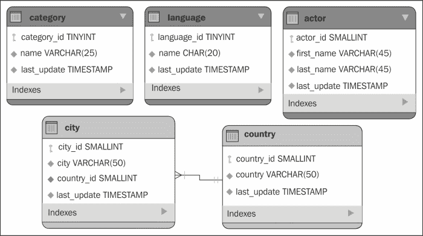

### 注意

作为提醒，Sakila 数据库可以从[`dev.mysql.com/doc/index-other.html`](http://dev.mysql.com/doc/index-other.html)下载，其文档和安装说明可在[`dev.mysql.com/doc/sakila/en/`](http://dev.mysql.com/doc/sakila/en/)找到。

这些表格可以独立于其他表格存在，我们将在本章中与它们一起工作。

当我们在 MySQL Workbench（版本 6）中打开 SQL 编辑器时（[`dev.mysql.com/downloads/workbench/`](http://dev.mysql.com/downloads/workbench/))，我们可以选择一个表格，右键单击它，并选择**选择行 – 限制 1000**。当我们选择此选项时，将打开一个新标签页，其外观如下：

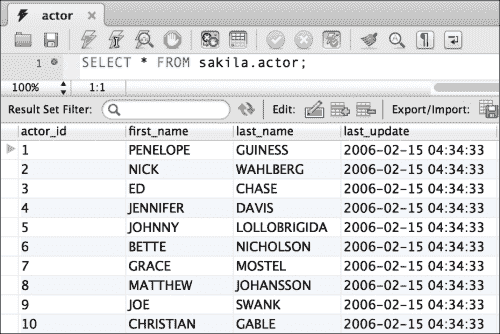

之前显示的表格是`actor`表格。我们的想法是为我们选择的每个表格实现类似于前一个屏幕截图的屏幕：**演员**、**类别**、**语言**、**城市**和**国家**，如以下屏幕截图所示（这是我们将在本章中实现的代码的最终结果）：

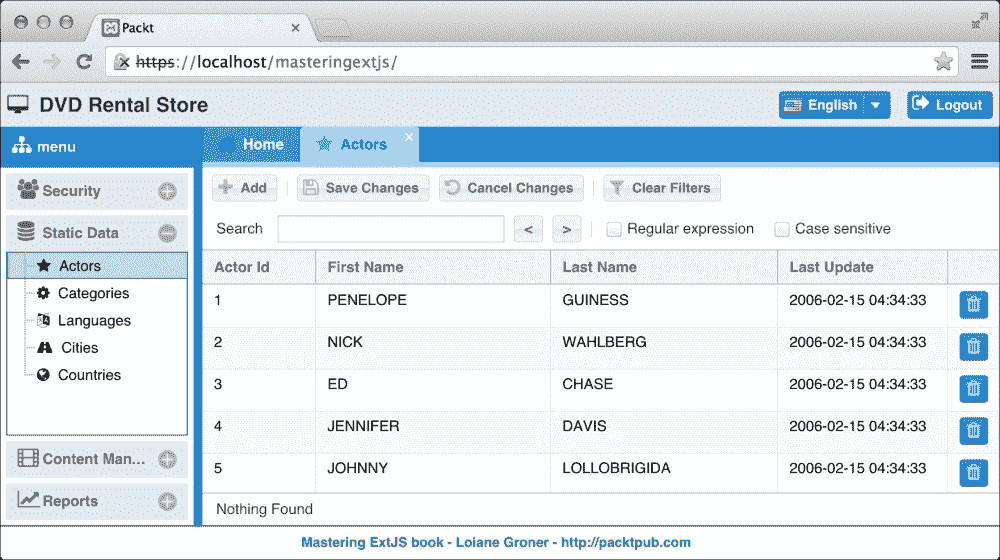

我们在本章的目标是尽量减少实现这五个屏幕所需的代码量。这意味着我们希望尽可能创建最通用的代码，这将有助于未来的代码修复和增强，并且如果需要，也更容易创建具有相同功能的新的屏幕。

那么，让我们开始开发吧。

# 创建模型

如往常一样，我们将从创建模型开始。首先，让我们列出我们将要处理的表及其列：

+   `Actor`: `actor_id`, `first_name`, `last_name`, `last_update`

+   `Category`: `category_id`, `name`, `last_update`

+   `Language`: `language_id`, `name`, `last_update`

+   `City`: `city_id`, `city`, `country_id`, `last_update`

+   `Country`: `country_id`, `country`, `last_update`

我们可以为这些实体中的每一个创建一个模型，完全没有问题；然而，我们希望尽可能多地重用代码。再次查看表和列的列表。注意，所有表都有一个共同的列——`last_update`列。

所有的前一个表都有一个共同的`last_update`列。换句话说，我们可以创建一个包含此字段的超级模型。当我们实现`actor`和`category`模型时，我们可以扩展超级模型，在这种情况下，我们不需要声明列。你不这么认为吗？

## 抽象模型

在面向对象编程（OOP）中，有一个称为继承的概念，这是一种重用现有对象代码的方式。Ext JS 使用面向对象的方法，因此我们可以在 Ext JS 应用程序中应用相同的概念。如果你回顾一下我们已实现的代码，你会注意到我们已经在大多数类中应用了继承（除了`util`包），但我们正在创建继承自 Ext JS 类的类。现在，我们将开始创建我们自己的超级类。

由于我们将要处理的模型都具有共同的`last_update`列（如果你看一下，所有的 Sakila 表都有这个列），我们可以创建一个包含此字段的超级模型。因此，我们将在`app/model/staticData`下创建一个新的文件，命名为`Base.js`：

```js
Ext.define('Packt.model.staticData.Base', {
    extend: 'Packt.model.Base', //#1

    fields: [
        {
            name: 'last_update',
            type: 'date',
            dateFormat: 'Y-m-j H:i:s'
        }
    ]
});
```

此模型只有一个列，即`last_update`。在表中，`last_update`列的类型是`timestamp`，因此字段的`type`需要是`date`，我们还将应用`date format:` `'Y-m-j H:i:s'`，这是年、月、日、时、分、秒，遵循与数据库中相同的格式（`2006-02-15 04:34:33`）。

当我们可以为每个表示表的模型创建模型时，我们就不需要再次声明`last_update`字段。

再次查看第`#1`行的代码。我们没有扩展默认的`Ext.data.Model`类，而是另一个`Base`类。还记得我们在上一章中创建的`security.Base`模型吗？我们将将其代码移动到模型包中并进行一些修改。

### 适配 Base 模型架构

在`app/model`文件夹内创建一个名为`Base.js`的文件，并在其中包含以下内容：

```js
Ext.define('Packt.model.Base', {
    extend: 'Ext.data.Model',

    requires: [
        'Packt.util.Util'
    ],

    schema: {
        namespace: 'Packt.model', //#1
        urlPrefix: 'php',
        proxy: {
            type: 'ajax',
            api :{
                read : '{prefix}/{entityName:lowercase}/list.php',
                create: 
                    '{prefix}/{entityName:lowercase}/create.php',
                update: 
                    '{prefix}/{entityName:lowercase}/update.php',
                destroy: 
                    '{prefix}/{entityName:lowercase}/destroy.php'
            },
            reader: {
                type: 'json',
                rootProperty: 'data'
            },
            writer: {
                type: 'json',
                writeAllFields: true,
                encode: true,
                rootProperty: 'data',
                allowSingle: false
            },
            listeners: {
                exception: function(proxy, response, operation){
              Packt.util.Util.showErrorMsg(response.responseText);
                }
            }
        }
    }
});
```

与我们在上一章中实现的代码相比，唯一的区别是`namespace`（`#1`）。我们不再使用`Packt.model.security`，而是将仅使用`Packt.model`。

我们在上一章中创建的`Packt.model.security.Base`类现在看起来会更简单，如下所示：

```js
Ext.define('Packt.model.security.Base', {
    extend: 'Packt.model.Base',

    idProperty: 'id',

    fields: [
        { name: 'id', type: 'int' }
    ]
});
```

它与我们为本章创建的`staticData.Base`模型非常相似。区别在于`staticData`包（`last_update`）和`security`包（`id`）共有的字段。

现在应用程序只有一个模式，这意味着模型的`entityName`将基于`'Packt.model'`之后的名称创建。这意味着我们在上一章中创建的`User`和`Group`模型将分别具有`entityName` `security.User`和`security.Group`。然而，我们不希望破坏已经实现的代码，因此我们希望`User`和`Group`模型类具有`entityName` `User`和`Group`。我们可以通过向`User`模型添加`entityName: 'User'`和向`Group`模型添加`entityName: 'Group'`来实现这一点。我们也将对接下来要创建的特定模型做同样的事情。

对于应用程序中的所有模型都有一个超级`Base`模型，这意味着我们的模型将遵循一个模式。代理模板对所有模型也是通用的，这意味着我们的服务器端代码也将遵循一个模式。这对于组织应用程序和未来的维护是有益的。

## 特定模型

现在，我们可以创建代表每个表的模型。让我们从 Actor 模型开始。我们将创建一个名为`Packt.model.staticData.Actor`的新类；因此，我们需要在`app/model/staticData`下创建一个名为`Actor.js`的新文件，如下所示：

```js
Ext.define('Packt.model.staticData.Actor', {
    extend: 'Packt.model.staticData.Base', //#1

    entityName: 'Actor', //#2

    idProperty: 'actor_id', //#3

    fields: [
        { name: 'actor_id' },
        { name: 'first_name'},
        { name: 'last_name'}
    ]
});
```

在前面的代码中，我们需要注意三个重要的事项：

+   此模型扩展自`Packt.model.staticData.Base`类，该类又扩展自`Packt.model.Base`类，而`Packt.model.Base`类又扩展自`Ext.data.Model`类。这意味着此模型继承了`Packt.model.staticData.Base`、`Packt.model.Base`和`Ext.data.Model`类的所有属性和行为。

+   由于我们使用`Packt.model`模式创建了一个超级模型，因此为该模型创建的默认`entityName`将是`staticData.Actor`。我们使用`entityName`来帮助代理编译带有`entityName`的`url`模板。为了使我们的工作更简单，我们将重写`entityName`（`#2`）。

+   第三点是`idProperty`（`#3`）。默认情况下，`idProperty`的值是"`id`"。这意味着当我们声明一个名为"`id`"的字段时，Ext JS 已经知道这是该模型的唯一字段。当它不同于"`id`"时，我们需要使用`idProperty`配置来指定它。由于所有 Sakila 表都没有名为"`id`"的唯一字段——它总是`实体名称` + "*_id*"，因此我们需要在所有模型中声明此配置。

现在，我们可以为其他模型做同样的事情。我们需要创建四个更多类：

+   `Packt.model.staticData.Category`

+   `Packt.model.staticData.Language`

+   `Packt.model.staticData.City`

+   `Packt.model.staticData.Country`

最后，我们将在 `app/model/staticData` 包内创建六个模型类（一个超级模型和五个特定模型）。如果我们为模型类创建一个 UML 类图，我们将得到以下图示：

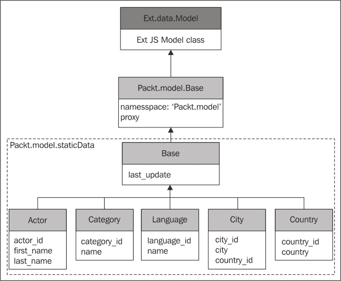

**Actor**、**Category**、**Language**、**City** 和 **Country** 模型扩展了 `Packt.model.staticData` 基础模型，该模型从 `Packt.model.Base` 扩展而来，而 `Packt.model.Base` 又从 `Ext.data.Model` 类扩展而来。

# 创建 Store

下一步是为每个模型创建 Store。就像我们对模型所做的那样，我们将尝试创建一个通用 Store（在本章中，我们将为所有屏幕创建通用代码，因此创建超级模型、Store 和 View 是能力的一部分）。尽管通用配置不在 Store 中，但在 Proxy 中（我们在 `Packt.model.Base` 类的 schema 中声明了它），拥有一个超级 Store 类可以帮助我们监听所有静态数据 Store 的通用事件。

我们将创建一个名为 `Packt.store.staticData.Base` 的超级 Store。

由于我们需要为每个模型创建一个 Store，我们将创建以下 Store：

+   `Packt.store.staticData.Actors`

+   `Packt.store.staticData.Categories`

+   `Packt.store.staticData.Languages`

+   `Packt.store.staticData.Cities`

+   `Packt.store.staticData.Countries`

在本主题结束时，我们将创建所有之前的类。如果我们为它们创建一个 UML 图，我们将得到如下所示的图示：

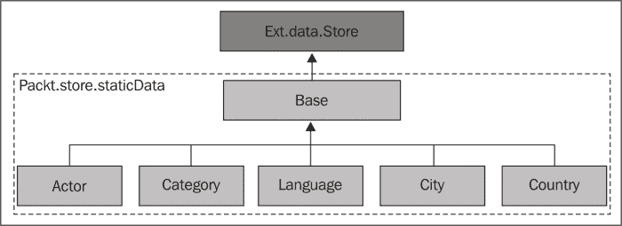

所有 Store 类都扩展自 `Base` Store。

现在我们知道了我们需要创建什么，让我们动手吧！

## 抽象 Store

我们需要创建的第一个类是 `Packt.store.staticData.Base` 类。在这个类中，我们只声明 `autoLoad` 为 `true`，以便所有这个 Store 的子类在应用程序启动时都可以被加载：

```js
Ext.define('Packt.store.staticData.Base', {
    extend: 'Ext.data.Store',

    autoLoad: true
});
```

我们将要创建的所有特定 Store 都将扩展这个 Store。创建这样一个超级 Store 可能感觉没有意义；然而，我们不知道在未来的维护中，我们是否需要添加一些通用的 Store 配置。

由于我们将在这个模块中使用 MVC，另一个原因是我们在 Controller 中也可以监听 Store 事件（自 Ext JS 4.2 版本起可用）。如果我们想监听一组 Store 的相同事件，并且执行完全相同的方法，拥有一个超级 Store 可以节省我们一些代码行。

## 特定 Store

我们接下来的步骤是实现 `Actors`、`Categories`、`Languages`、`Cities` 和 `Countries` 存储。

因此，让我们从 `Actors` Store 开始：

```js
Ext.define('Packt.store.staticData.Actors', {
    extend: 'Packt.store.staticData.Base', //#1

    model: 'Packt.model.staticData.Actor' //#2
});
```

在定义 Store 之后，我们需要从 Ext JS `Store`类扩展。由于我们使用的是超级 Store，我们可以直接从超级 Store 扩展（`#1`），这意味着从`Packt.store.staticData.Base`类扩展。

接下来，我们需要声明这个 Store 将要表示的`fields`或`model`。在我们的例子中，我们总是声明 Model（`#2`）。

### 注意

在 Store 中使用`model`对于重用是有好处的。`fields`配置建议仅在需要创建一个非常具体的 Store，其中包含我们不打算在整个应用程序中重用的特定数据时使用，例如在图表或报告中。

对于其他存储，唯一将要不同的事情是 Store 和 Model 的名称。

### 注意

由于模型和存储非常相似，我们不会在本章中列出它们的代码。然而，如果您需要与您的代码进行比较或只是想获取完整的源代码，您可以从本书中下载代码包或从[`github.com/loiane/masteringextjs`](https://github.com/loiane/masteringextjs)获取。

# 创建用于重用的抽象 GridPanel

现在是实施视图的时候了。我们必须实现五个视图：一个用于执行 Actor 的 CRUD 操作，一个用于 Category，一个用于 Language，一个用于 City，还有一个用于 Country。

以下截图表示在实现**Actors**屏幕后我们想要达到的最终结果：

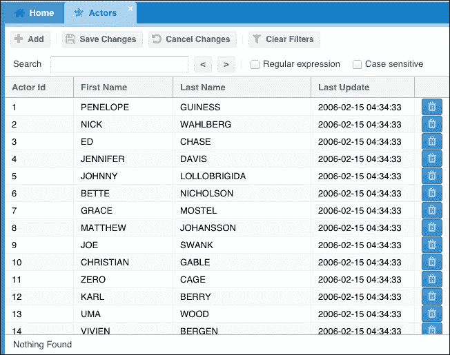

以下截图表示在实现**Categories**屏幕后我们想要达到的最终结果：

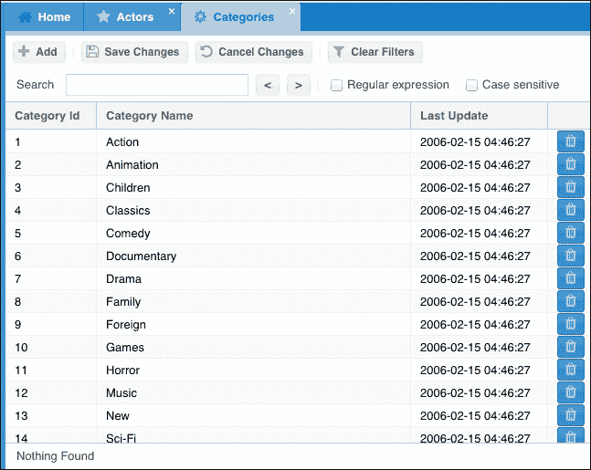

您注意到这两个屏幕之间有什么相似之处吗？让我们再看一遍：

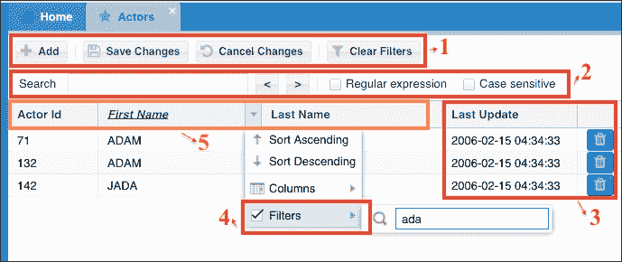

顶部的工具栏是相同的（**1**）；有一个实时搜索功能（**2**）；有一个过滤器插件（**4**），以及**最后更新**和部件列也是通用的（**3**）。再进一步，两个 GridPanels 都可以使用单元格编辑器进行编辑（类似于 MS Excel 的功能，您可以点击单个单元格来编辑它）。这两个屏幕之间唯一的不同之处在于每个屏幕特有的列（**5**）。这意味着如果我们通过创建一个具有所有这些通用功能的超级 GridPanel 来使用继承，我们可以重用代码的一部分吗？是的！

所以这就是我们要做的。让我们创建一个名为`Packt.view.staticData.BaseGrid`的新类，如下所示：

```js
Ext.define('Packt.view.staticData.BaseGrid', {
    extend: 'Ext.ux.LiveSearchGridPanel', //#1
    xtype: 'staticdatagrid',

    requires: [
        'Packt.util.Glyphs' //#2
    ],

    columnLines: true,    //#3
    viewConfig: {
        stripeRows: true //#4
    },

    //more code here
});    
```

我们将扩展`Ext.ux.LiveSearchGridPanel`类而不是`Ext.grid.Panel`。`Ext.ux.LiveSearchGridPanel`类已经扩展了`Ext.grid.Panel`类，并添加了实时搜索工具栏（**2**）。`LiveSearchGridPanel`类是随 Ext JS SDK 一起分发的插件。因此，我们不需要担心将其手动添加到我们的项目中（你将在本书后面的章节中学习如何将第三方插件添加到项目中）。

由于我们还将添加带有**添加**、**保存更改**、**取消更改**按钮的工具栏，我们需要引入我们创建的`util.Glyphs`类（`#2`）。

配置`#3`和`#4`显示了网格中每个单元格的边框，并在白色背景和浅灰色背景之间交替。

同样，任何负责在 Ext JS 中显示信息的组件，例如“面板”部分，只是外壳。视图负责在 GridPanel 中显示列。我们可以使用`viewConfig`（`#4`）来自定义它。

下一步是创建一个`initComponent`方法。

## 初始化组件或不初始化组件？

在浏览其他开发者的代码时，我们可能会看到一些人在声明 Ext JS 类时使用`initComponent`，而另一些人则没有使用（就像我们之前所做的那样）。那么使用它和不使用它的区别是什么？

在声明 Ext JS 类时，我们通常根据应用程序的需求进行配置。它们可能成为其他类的父类，也可能不是。如果它们成为父类，一些配置将被覆盖，而一些则不会。通常，我们将我们预期要覆盖的类中的配置声明为配置。我们在`initComponent`方法中声明我们不希望被覆盖的配置。

由于有一些配置我们不希望被覆盖，我们将它们声明在`initComponent`中，如下所示：

```js
initComponent: function() {
    var me = this;

    me.selModel = {
        selType: 'cellmodel' //#5
    };

    me.plugins = [
        {
            ptype: 'cellediting',  //#6
            clicksToEdit: 1,
            pluginId: 'cellplugin'
        },
        {
            ptype: 'gridfilters'  //#7
        }
    ];

    //docked items

    //columns

    me.callParent(arguments); //#8
}
```

我们可以定义用户如何从 GridPanel 中选择信息：默认配置是`Selection RowModel`类。因为我们希望用户能够逐个编辑单元格，我们将使用`Selection CellModel`类（`#5`）以及`CellEditing`插件（`#6`），它是 Ext JS SDK 的一部分。对于`CellEditing`插件，我们配置单元格在用户点击单元格时可供编辑（如果我们需要用户双击，我们可以将`clicksToEdit`改为`2`）。为了帮助我们在 Controller 中后续操作，我们还为此插件分配了一个 ID。

为了能够过滤信息（实时搜索将仅突出显示匹配的记录），我们将使用**过滤器**插件（`#7`）。**过滤器**插件也是 Ext JS SDK 的一部分。

`callParent`方法（`#8`）将调用超类`Ext.ux.LiveSearchGridPanel`中的`initConfig`，并传递我们定义的参数。

### 小贴士

在重写`initComponent`方法时忘记包含`callParent`调用是一个常见的错误。如果组件无法正常工作，请确保你已经调用了`callParent`方法！

接下来，我们将声明 `dockedItems`。由于所有 GridPanels 都将具有相同的工具栏，我们可以在我们创建的父类中声明 `dockedItems`，如下所示：

```js
me.dockedItems = [
    {
        xtype: 'toolbar',
        dock: 'top',
        itemId: 'topToolbar', //#9
        items: [
            {
                xtype: 'button',
                itemId: 'add', //#10
                text: 'Add',
                glyph: Packt.util.Glyphs.getGlyph('add')
            },
            {
                xtype: 'tbseparator'
            },
            {
                xtype: 'button',
                itemId: 'save', 
                text: 'Save Changes',
                glyph: Packt.util.Glyphs.getGlyph('saveAll')
            },
            {
                xtype: 'button',
                itemId: 'cancel',
                text: 'Cancel Changes',
                glyph: Packt.util.Glyphs.getGlyph('cancel')
            },
            {
                xtype: 'tbseparator'
            },
            {
                xtype: 'button',
                itemId: 'clearFilter',
                text: 'Clear Filters',
                glyph: Packt.util.Glyphs.getGlyph('clearFilter')
            }
        ]
    }
];
```

我们将会有 **添加**、**保存更改**、**取消更改** 和 **清除过滤器** 按钮。请注意，工具栏（`#9`）和每个按钮（`#10`）都声明了 `itemId`。由于我们将在本例中使用 MVC 方法，我们将声明一个控制器。`itemId` 配置具有与我们在与 ViewController 一起工作时声明的引用类似的责任。我们将在本章稍后声明控制器时进一步讨论 `itemId` 的重要性。

### 小贴士

在工具栏内部声明按钮时，我们可以省略 `xtype: 'button'` 配置，因为按钮是工具栏的默认组件。

在 `Glyphs` 类中，我们需要在其 `config` 中添加以下属性：

```js
saveAll: 'xf0c7',
clearFilter: 'xf0b0'
```

最后，我们将添加所有屏幕都通用的两列（`最后更新` 列和 Widget Column 的 `delete` (`#13`)）以及已在每个特定 GridPanel 中声明的列：

```js
me.columns = Ext.Array.merge( //#11
    me.columns,               //#12
    [{
        xtype    : 'datecolumn',
        text     : 'Last Update',
        width    : 150,
        dataIndex: 'last_update',
        format: 'Y-m-j H:i:s',
        filter: true
    },
    {
        xtype: 'widgetcolumn', //#13
        width: 45,
        sortable: false,       //#14
        menuDisabled: true,    //#15
        itemId: 'delete',
        widget: {
            xtype: 'button',   //#16
            glyph: Packt.util.Glyphs.getGlyph('destroy'),
            tooltip: 'Delete',
            scope: me,                //#17
            handler: function(btn) {  //#18
                me.fireEvent('widgetclick', me, btn);
            }
        }
    }]
);
```

在前面的代码中，我们将 (`#11`) `me.columns` (`#12`) 与另外两个 `columns` 合并，并将此值赋给 `me.columns`。我们希望所有子网格都拥有这两列加上每个子网格的特定列。如果 `BaseGrid` 类中的列配置在 `initConfig` 之外，那么当子类声明其自己的列配置时，该值将被覆盖。如果我们将在 `initComponent` 中声明 `columns` 配置，子类将无法添加自己的 `columns` 配置，因此我们需要合并这两个配置（子类 `#12` 的列与每个子类都希望拥有的两列）。

对于删除按钮，我们将使用一个 Widget Column (`#13`)（在 Ext JS 5 中引入）。在 Ext JS 4 之前，在网格列内放置按钮的唯一方法是使用操作列。我们将使用一个按钮 (`#16`) 来表示 Widget Column。因为它是一个 Widget Column，所以没有必要使此列 `可排序` (`#14`)，我们还可以禁用其菜单 (`#15`)。

我们将在下一节中讨论 `#17` 和 `#18` 行。

## 在 MVC 架构中处理 Widget Column

让我们再次看看在 super GridPanel 中声明的 Widget Column，特别是其在 `handler` 配置中的内容：

```js
scope: me,                //#17
handler: function(btn) {  //#18
    me.fireEvent('widgetclick', me, btn);
}
```

尽管 Widget Column 是一个组件并且包含 `xtype`，但在 MVC 控制器中无法监听其事件，因此我们需要一个解决方案使其在 MVC 架构中工作。原因是 Widget Column 内部可以声明的项是 `Ext.Widget` 类的子类，而 `Ext.Widget` 类是 `Ext.Evented` 类的子类。MVC 控制器只能监听由组件子类（面板、按钮、网格、树、图表等）触发的事件。

正因如此，我们触发了一个自定义事件 (`#18`)，传递我们需要的参数，这样我们就可以在这个控制器中捕获此事件，并处理删除记录所需的编程逻辑。

在这个例子中，我们将处理器的 `scope` 设置为 `me` (`#17`)，它指的是 GridPanel 的 `this`。这意味着将会是 GridPanel 触发 `widgetclick` 事件，传递网格本身和 widget 按钮。`btn` 参数包含一个名为 `getWidgetRecord` 的方法，用于检索用户点击 **删除** 按钮时 GridPanel 行所代表的模型。

如果我们使用动作列（在 Ext JS 4 之前是一个非常受欢迎的选择）我们会在 MVC 架构中以相同的方式处理它（触发自定义事件）。一个例子可以在：[`goo.gl/pxdU4i`](http://goo.gl/pxdU4i) 找到。

### 注意

在 MVVM 方法中处理 Widget 列处理器更为简单。我们不需要触发一个自定义事件，而可以直接引用 ViewController 中使用的方法，如下所示：`handler: 'onWidgetClick'`。

## Live Search 插件与 Filter 插件

这两个插件的目标都是帮助用户快速搜索信息。在我们的项目中，我们正在使用这两个插件。

Live Search 插件将在 GridPanel 的所有列中搜索任何匹配的结果。搜索也是本地执行的，这意味着如果我们使用分页工具栏，此插件将无法按预期工作。当使用分页工具栏时，网格一次只显示一页，这意味着它只显示有限数量的行。剩余的信息不会保留在本地，分页工具栏只获取请求的信息，这就是为什么在分页时搜索不会工作。在我们的情况下，我们一次性显示数据库中的所有记录，因此插件按预期工作。例如，如果我们搜索 "`ada`"，我们将得到以下输出：

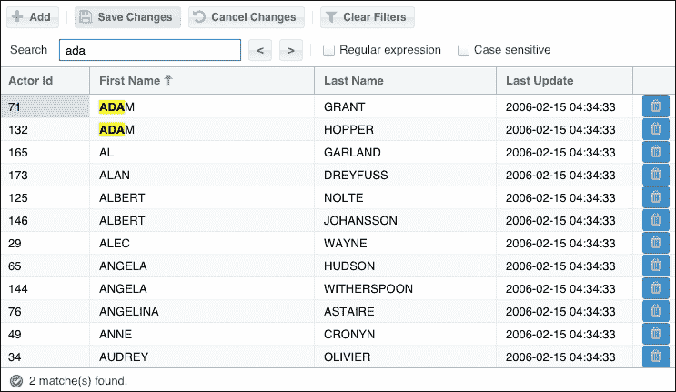

并且 Filter 插件也会在 Store 上应用过滤器，因此它只会向用户显示匹配的结果，如下所示：

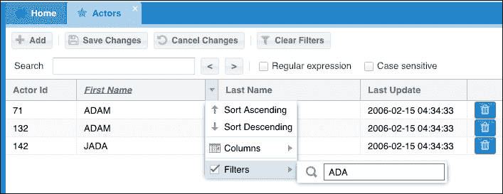

## 每个表的特定 GridPanel

在我们实现控制器之前，我们的最后一站是特定的 GridPanel。我们已经创建了一个包含我们所需大多数功能的超级 GridPanel。现在我们只需要为每个 GridPanel 声明特定的配置。

我们将创建五个 GridPanel，它们将扩展自 `Packt.view.staticData.BaseGrid` 类，如下所示：

+   `Packt.view.staticData.Actors`

+   `Packt.view.staticData.Categories`

+   `Packt.view.staticData.Languages`

+   `Packt.view.staticData.Cities`

+   `Packt.view.staticData.Countries`

让我们从 `Actors` GridPanel 开始，如下所示：

```js
Ext.define('Packt.view.staticData.Actors', {
    extend: 'Packt.view.staticData.BaseGrid',
    xtype: 'actorsgrid',        //#1

    store: 'staticData.Actors', //#2

    columns: [
        {
            text: 'Actor Id',
            width: 100,
            dataIndex: 'actor_id',
            filter: {
                type: 'numeric'   //#3
            }
        },
        {
            text: 'First Name',
            flex: 1,
            dataIndex: 'first_name',
            editor: {
                allowBlank: false, //#4
                maxLength: 45      //#5
            },
            filter: {
                type: 'string'     //#6
            }
        },
        {
            text: 'Last Name',
            width: 200,
            dataIndex: 'last_name',
            editor: {
                allowBlank: false, //#7
                maxLength: 45      //#8
            },
            filter: {
                type: 'string'     //#9
            }
        }
    ]
});
```

每个特定的类都有自己的 `xtype` (`#1`)。我们还需要在数据库中执行一个 `UPDATE` 查询来更新菜单表，以包含我们正在创建的新 xtypes：

```js
UPDATE `sakila`.`menu` SET `className`='actorsgrid' WHERE `id`='5';
UPDATE `sakila`.`menu` SET `className`='categoriesgrid' WHERE `id`='6';
UPDATE `sakila`.`menu` SET `className`='languagesgrid' WHERE `id`='7';
UPDATE `sakila`.`menu` SET `className`='citiesgrid' WHERE `id`='8';
UPDATE `sakila`.`menu` SET `className`='countriesgrid' WHERE `id`='9';
```

针对 `Actors` GridPanel 特定的第一个声明是 Store (`#2`)。我们将使用 `Actors` Store。因为 `Actors` Store 在 `staticData` 文件夹内（`store/staticData`），我们还需要传递子文件夹的名称；否则，Ext JS 会认为此 Store 文件在 `app/store` 文件夹内，这并不正确。

然后我们需要声明 `Actors` GridPanel 特定的 `columns`（我们不需要声明 `Last Update` 和 `Delete` 操作列，因为它们已经在超级 GridPanel 中了）。

现在您需要关注的是每列的 `editor` 和 `filter` 配置。`editor` 用于编辑（`cellediting` 插件）。我们只会将此配置应用到我们希望用户能够编辑的列上，而 `filter` (`filters` 插件）则是我们将应用到用户希望从 `columns` 中过滤信息的配置。

例如，对于 `id` 列，我们不想让用户能够编辑它，因为它是由 MySQL 数据库自动递增提供的序列，因此我们不会对此列应用 `editor` 配置。然而，用户可以根据 ID 过滤信息，因此我们将应用 `filter` 配置（`#3`）。

我们希望用户能够编辑其他两列：`first_name` 和 `last_name`，因此我们将添加 `editor` 配置。我们可以像在表单字段上执行客户端验证一样执行客户端验证。例如，我们希望这两个字段都是必填的（`#4` 和 `#7`），用户可以输入的最大字符数是 `45`（`#5` 和 `#8`）。

最后，由于这两个列都是渲染文本值（`string`），我们也将应用 `filter`（`#6` 和 `#9`）。

对于其他过滤类型，请参考以下截图所示的 Ext JS 文档。文档提供了一个示例和更多可用的配置选项：

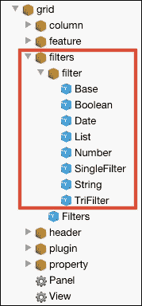

就这样！超级 GridPanel 将提供所有其他功能。

## 添加 Live Search CSS

当我们导航到 Live Search Grid 示例（[`dev.sencha.com/ext/5.0.1/examples/grid/live-search-grid.html`](http://dev.sencha.com/ext/5.0.1/examples/grid/live-search-grid.html)）并查看其源代码时，我们可以看到示例导入了两个 CSS 文件：`LiveSearchGridPanel.css` 和 `statusbar.css`（因为 Live Search 插件依赖于 `statusbar` 插件）。我们还需要将此 CSS 添加到我们的应用程序中。

我们将复制这两个 CSS 文件并将扩展名更改为 `scss`。Live Search CSS 可以从 `ext/src/ux/css` 复制，而 `statusbar` CSS 可以从 `ext/src/ux/statusbar` 复制。我们需要将这些文件放置在我们的应用程序自定义 CSS 中，该 CSS 位于 `sass/etc` 目录。创建一个名为 `ux` 的新文件夹并将这些文件粘贴进去。在 `all.scss` 中，我们将导入这两个 Sass 文件：

```js
@import "ux/statusbar";
@import "ux/LiveSearchGridPanel";
```

`statusbar`插件显示一个图标，我们还需要修复`statusbar`图像的路径。在`statusbar.scss`文件中，将所有匹配的"`../images`"替换为"`images/statusbar`"。转到`ext/src/ux/statusbar`，复制`images`文件夹，并将其粘贴到`resources/images`中。将`resources/images/images`重命名为`resources/images/statusbar`。如果你在终端中执行`Sencha app watch`，Sencha Cmd 将重新构建应用程序 CSS 文件，并且插件将 100%正常工作。

# 适用于所有表格的通用控制器

现在是时候实现静态数据模块的最后一块了。目标是实现一个控制器，它拥有最通用的代码，将为所有屏幕提供功能，而无需我们为任何屏幕创建任何特定方法。

让我们从控制器的基类开始。我们将创建一个名为`Packt.controller.StaticData`的新类，如下所示：

```js
Ext.define('Packt.controller.StaticData', {
    extend: 'Ext.app.Controller',

    requires: [
        'Packt.util.Util', //#1
        'Packt.util.Glyphs'
    ],

    stores: [  //#2
        'staticData.Actors',
        'staticData.Categories',
        'staticData.Cities',
        'staticData.Countries',
        'staticData.Languages'
    ],

    views: [ //#3
        'staticData.BaseGrid',
        'staticData.Actors',
        'staticData.Categories',
        'staticData.Cities',
        'staticData.Countries',
        'staticData.Languages'
    ],

    init: function(application) {
        var me = this;
        me.control({
            //event listeners here
        });   
    }
});
```

现在，我们将声明`requires`（`#1`）——我们将在某些方法中使用`Util`类和`Glyphs`类），`stores`（`#2`）——我们可以在这里列出这个模块的所有存储），以及`views`（`#3`）——我们可以在这里列出这个模块的所有视图）。

由于我们通过`xtype`实例化视图，我们需要在某个地方声明它们（`#2`）。这可以在`Application.js`文件中的`requires`配置内或在一个控制器内完成。这是必需的，因为 Ext JS 不知道我们创建的 xtypes，所以类的名称需要列在某个地方。

我们在这个控制器中列出的`stores`声明（`#2`）将在控制器实例化时一起实例化。由于这是一个 MVC 架构中的控制器，其作用域是全局的，它将在应用程序启动时创建。对于这种情况使用 MVC 方法是有趣的；毕竟，我们正在构建一个静态数据模块，该模块引用了应用程序其他实体使用的通用数据。在这种情况下，这些信息将在应用程序的生命周期中始终是活动的。这与在 ViewModel 内部声明的 Views、ViewModels、ViewControllers 和存储不同，它们仅在视图活动时（标签页打开）存在。由于我们在`Base`存储中设置了`autoLoad:true`，当应用程序启动时，在这个控制器中列出的存储将被实例化和加载。

我们还有`init`函数和`this.control`，我们将在这里监听所有我们感兴趣的事件。

## 找到正确的选择器

在每个静态数据网格面板的工具栏上，我们有一个上面写着**添加**的按钮。当我们点击这个按钮时，我们希望将一个新的模型条目添加到存储中（并且相应地，在网格面板上添加一条新记录），并启用编辑功能，以便用户可以填写值以便稍后保存（当他们点击**保存更改**按钮时）。

当在控制器中监听事件时，首先我们需要传递一个选择器，这个选择器将由`Ext.ComponentQuery`类使用来查找组件。然后我们需要列出我们想要监听的事件。接下来，我们需要声明当监听的事件被触发时要执行的功能，或者声明当事件被触发时要执行的控制器的名称。在我们的例子中，我们只是为了代码组织的目的声明方法。

现在，让我们专注于找到**添加**按钮的正确选择器（其他按钮也将类似）。根据`Ext.ComponentQuery` API 文档，我们可以通过它们的`xtype`来检索组件（如果你已经熟悉 JQuery，你会注意到`Ext.ComponentQuery`选择器的行为与 JQuery 选择器的行为非常相似）。嗯，我们正在尝试检索两个按钮，它们的`xtype`是`button`。然后我们可以尝试选择器`'button'`。但在我们开始编码之前，让我们确保这是一个正确的选择器，以避免不断更改代码来尝试找出正确的选择器。有一个非常有用的技巧我们可以尝试：打开浏览器控制台——命令编辑器——并输入以下命令并点击运行：

```js
Ext.ComponentQuery.query('button');
```

如以下截图所示，它返回了我们使用选择器找到的按钮数组，并且数组包含多个按钮！太多的按钮不是我们想要的。我们想要缩小到**演员**屏幕中的**添加**按钮，如下面的截图所示：

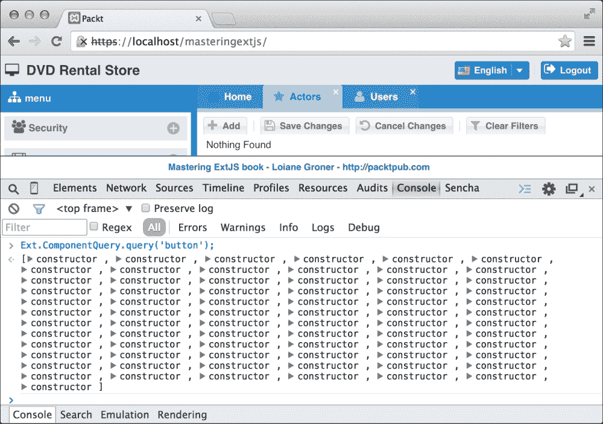

让我们尝试使用我们使用的`xtype`组件绘制**演员**屏幕的路径。我们有**演员**屏幕（`xtype: actorsgrid`）；在屏幕内部，我们有一个工具栏（`xtype: toolbar`）；在工具栏内部，我们有一些按钮（`xtype: button`）。因此，我们有`actorsgrid` | `toolbar` | `button`。所以我们可以尝试以下命令：

```js
Ext.ComponentQuery.query('actorsgrid toolbar button');
```

所以让我们在**控制台**上尝试这个最后的选择器，如下所示：

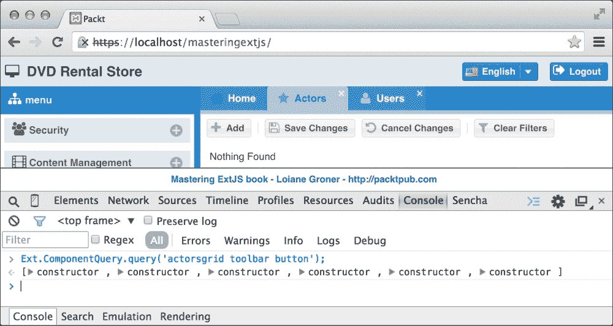

现在的结果是一个包含六个按钮的数组，这些就是我们正在寻找的按钮！还有一个细节缺失：如果我们使用`'actorsgrid toolbar button'`选择器，它将监听所有六个按钮的点击事件（这是我们想要监听的事件）。

然而，当我们点击**取消**按钮时，应该发生一个动作；当我们点击**保存**按钮时，应该发生不同的动作，因为它是不同的按钮。所以我们仍然想要进一步缩小选择器，直到它返回我们正在寻找的**添加**按钮。

回到 Base Grid 面板代码，注意我们为所有按钮声明了一个名为`itemId`的配置。我们可以使用这些`itemId`配置以独特的方式识别按钮。根据`Ext.ComponentQuery` API 文档，我们可以使用`#`作为`itemId`的前缀。所以让我们在**控制台**上尝试以下命令来获取**添加**按钮的引用：

```js
Ext.ComponentQuery.query('actorsgrid toolbar button#add');
```

并且输出结果将只有一个按钮，正如我们所期望的：

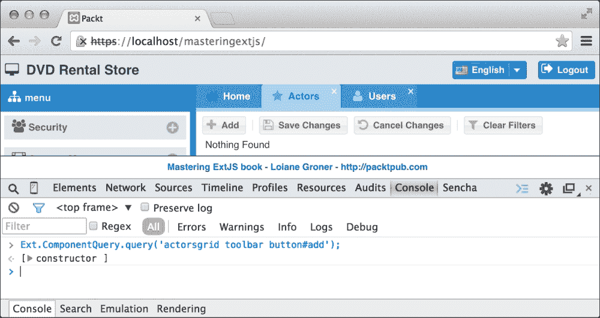

所以现在我们得到了我们一直在寻找的选择器！使用**控制台**是一个非常好的工具，当尝试找到我们想要的精确选择器而不是编码、测试、没有得到我们想要的选择器、再次编码、再次测试等等时，它可以节省我们很多时间。

### 注意

我们能否只用`button#add`作为选择器？是的，我们可以使用一个更短的选择器。然而，现在它将完美地工作。随着应用的成长和更多类和按钮的声明，事件将会对所有具有`itemId`值为`add`的按钮触发，这可能会导致应用出错。我们始终需要记住`itemId`是局部作用域的，使用`actorsgrid toolbar button`或`actorsgrid button`作为选择器，我们确保事件将来自**演员**屏幕的按钮。

现在是时候关注最后一个细节了。我们找到的选择器仅适用于**演员**屏幕。我们希望有一些通用的代码——可以在静态数据模块的所有屏幕上使用的代码。好消息是，我们创建了一个超级类（`Packt.view.staticData.BaseGrid`），其`xtype`为`staticdatagrid`。

### 使用 itemId 与 id 的比较 – Ext.Cmp 很糟糕！

每当我们能这样做的时候，我们总是会尝试使用`itemId`配置而不是`id`来唯一标识一个组件。那么问题来了：为什么？

当使用`id`时，我们需要确保`id`是唯一的，并且应用中的所有其他组件都不能有相同的`id`属性。现在，想象一下你和其他开发者在同一个团队中工作，并且这是一个大型应用的情况。你怎么能确保`id`将是唯一的呢？这将会非常困难。你不这么认为吗？这可能会是一个难以完成的任务。

使用`id`创建的组件可以通过`Ext.getCmp`全局访问，这是`Ext.ComponentManager.get`的简写。

只举一个例子，当使用`Ext.getCmp`通过`id`检索一个组件时，它将返回具有给定`id`的最后一个声明的组件。如果`id`不是唯一的，它可能会返回你意想不到的组件，这可能导致应用中出错，如下面的图所示：

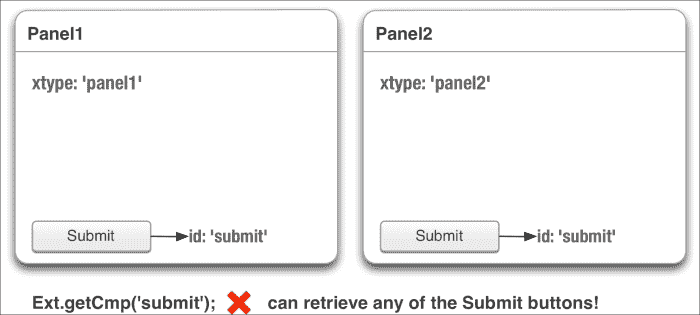

不要慌张！有一个优雅的解决方案：使用`itemId`而不是`id`。

`itemId` 可以用作获取组件引用的另一种方式。`itemId` 是容器内部 `MixedCollection` 的索引，这就是为什么 `itemId` 是在容器范围内局部化的。这是 `itemId` 的最大优势。

例如，我们可以有一个名为 `MyWindow1` 的类，它继承自 `Window`，在这个类中，我们可以有一个 `itemId` 包含 `submit` 值的按钮。然后，我们可以有一个名为 `MyWindow2` 的另一个类，它也继承自 `Window`，在这个类中，我们也可以有一个 `itemId` 为 `submit` 的按钮。

有两个 `itemId` 具有相同值的情况并不成问题。我们只需要在使用 `Ext.ComponentQuery` 检索我们想要的组件时小心。例如，如果我们有一个别名是 `login` 的 **登录** 窗口，另一个名为 **注册** 的屏幕，其窗口别名是 `registration`，并且两个窗口都有一个名为 **保存** 的按钮，其 `itemId` 是 `save`，如果我们简单地使用 `Ext.ComponentQuery.query('button#save')`，结果将是一个包含两个结果的数组。然而，如果我们进一步缩小选择器——比如说我们想要的是 **登录保存** 按钮，而不是 **注册保存** 按钮，我们需要使用 `Ext.ComponentQuery.query('login button#save')`，结果将只有一个，这正是我们期望的。本段内容的适当封装如下图所示：

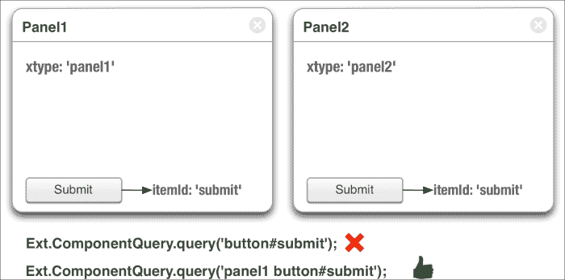

你会注意到，在我们的项目代码中不会使用 `Ext.getCmp`，因为这并不是一个好的实践，原因如前所述。在 Ext JS 3 之前，这是我们必须使用的方式来检索组件。但从 Ext JS 4 开始，随着 MVC 架构和 MVVM 的引入，这已经不再需要了。

## 在 GridPanel 上添加新记录

既然我们已经知道了如何在 Controller 中找到正确的选择器，让我们继续声明 **添加** 按钮的选择器：

```js
'staticdatagrid button#add': {
    click: me.onButtonClickAdd
}
```

然后，我们需要实现 `onButtonClickAdd` 方法：

```js
onButtonClickAdd: function (button, e, options) {
    var grid = button.up('staticdatagrid'), //#1
        store = grid.getStore(),            //#2
        modelName = store.getModel().getName(), //#3
        cellEditing = grid.getPlugin('cellplugin');  //#4

    store.insert(0, Ext.create(modelName, { //#5
        last_update: new Date()             //#6
    }));

    cellEditing.startEditByPosition({row: 0, column: 1}); //#7
}
```

从参数中，我们只有 `button` 引用。我们需要获取 GridPanel 的引用。因此，我们将使用 `up` 方法来获取它（`#1`）。我们再次将超级 GridPanel 的 `xtype` 作为选择器（`staticdatagrid`），因为这样我们就有最通用的代码。

Ext JS 中的所有组件都有查询其他组件的方法。它们如下列出：

+   `up`：这个方法沿着所有者层次结构向上导航，寻找匹配任何传递的选择器或组件的祖先容器

+   `down`：这个方法检索匹配传递的选择器的第一个后代组件

+   `query`：这个方法检索所有匹配传递的选择器的后代组件

方法 `query` 也有一些替代方案，例如 `queryBy(function)` 和 `queryById`。

一旦我们有了 GridPanel 的引用，我们可以使用 `getStore` 方法（`#2`）来获取 Store 的引用。

我们需要模型名称来实例化它（`#5`），这样我们就可以在 Store 的第一个位置插入（这样它将是 GridPanel 的第一行）。所以，仍然针对通用代码，我们可以从`store`（`#3`）中获取`modelName`。

在实例化模型时，我们可以传递一些配置。我们希望`最后更新`列也被更新；我们将只传递最新的*日期*和*时间*作为配置。

最后，我们还想让用户注意到行的某个单元格可以编辑，所以我们将焦点放在网格的第二列（第一列是`id`，不可编辑）的第一行（`#7`）。但要做到这一点，我们需要`celleditor`插件的引用；我们可以通过使用`getPlugin`方法，传递`pluginId`作为参数（`#4`）来获取它。

只是为了提醒，我们在`Packt.view.staticData.BaseGrid`类的`cellediting`插件中声明了`pluginId`，如下面的代码片段所示：

```js
{
    ptype: 'cellediting',
    clicksToEdit: 1,
 pluginId: 'cellplugin'
}
```

### 注意

注意，仅使用一个方法，我们就可以编程必要的逻辑。代码是通用的，并为所有静态数据网格面板提供相同的功能。

## 编辑现有记录

单元格的编辑将由`cellediting`插件自动完成。然而，当用户点击单元格进行编辑并完成编辑后，我们需要将**最后更新**值更新为当前的*日期*和*时间*。

`cellediting`插件有一个名为`edit`的事件，允许我们监听我们想要的事件。不幸的是，控制器无法监听插件事件。幸运的是，GridPanel 类也会触发此事件（`cellediting`插件将事件内部转发到`GridPanel`），因此我们可以监听它。所以我们将添加以下代码到控制器的`init`控制中：

```js
"staticdatagrid": {
edit: me.onEdit
}
```

接下来，我们需要实现`onEdit`方法，如下所示：

```js
onEdit: function(editor, context, options) {
    context.record.set('last_update', new Date());
}
```

第二个参数是事件（上下文）。从这个参数中，我们可以获取用户编辑的**模型实例（record**）并将`last_update`字段设置为当前的*日期*和*时间*。

## 在控制器中删除处理 Widget 列

好吧，读取、创建和更新操作已经实现。现在，我们需要实现删除操作。我们没有删除操作的按钮，但我们确实有一个动作列的`item`。

在主题*处理 MVC 架构中的 Widget 列*中，你学习了如何从动作列项触发事件，以便我们可以在控制器中处理它。我们无法监听动作列本身触发的事件；然而，我们可以监听我们创建的动作列触发的事件：

```js
"staticdatagrid actioncolumn": {
    itemclick: this.handleActionColumn
}
```

现在，让我们看看如何实现`handleActionColumn`方法：

```js
handleActionColumn: function(column, action, view, rowIndex, colIndex, item, e) {
        var store = view.up('staticdatagrid').getStore(),
        rec = store.getAt(rowIndex);

        if (action == 'delete'){
            store.remove(rec);
            Ext.Msg.alert('Delete', 'Save the changes to persist the removed record.');
        }   
    }
```

由于这是一个自定义事件，我们需要获取动作列项传递的参数。

因此，首先，我们需要获取 Store 以及用户点击删除的`record`。然后，使用第二个参数，即 Action 列项的`action`名称，我们有一种方式知道哪个项触发了事件。所以如果`action`值是`delete`，我们将从 Store 中删除`record`并要求用户通过按下按钮**保存更改**来提交更改，这将同步 Store 中的模型与服务器上的信息。

## 保存更改

用户执行更新、删除或创建操作后，更新的单元格将有一个标记（脏标记，以便 Store 知道哪些模型已被修改），如下面的截图所示：

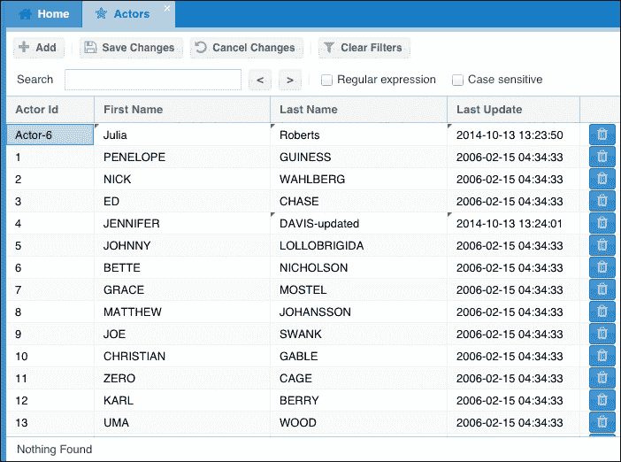

与我们可以在 MySQL 表中执行更改的方式相同，我们需要保存更改（提交）。这就是为什么我们创建了**保存更改**按钮；这样，我们将一次性将所有更改同步到服务器。

首先，我们需要向`me.control`添加一个监听器，如下所示：

```js
'staticdatagrid button#save': {
    click: me.onButtonClickSave
}
```

然后，我们需要实现`onButtonClickSave`方法：

```js
onButtonClickSave: function (button, e, options) {
    var grid = button.up('staticdatagrid'), //#1
        store = grid.getStore(),            //#2
        errors = grid.validate();           //#3

    if (errors === undefined){  //#4
        store.sync();           //#5
    } else {
        Ext.Msg.alert(errors);  //#6
    }
}
```

方法的实现相当简单：我们只需要从 GridPanel（`#1`）获取 Store（`#2`）并调用`sync`方法（`#5`）。

然而，我们将验证在 Grid 的单元格中输入的信息是否包含有效信息。为此，我们将从网格（`#3`）调用`validate`方法并获取`errors`。如果没有发现错误（`#4`），则将 Store 与服务器同步（`#5`）；否则，显示`errors`（`#6`）。

Grid Panel 默认没有验证方法。我们将向`Base` Grid Panel 添加此方法。

### 验证 GridPanel 中的单元格编辑

回到类`Packt.view.staticData.BaseGrid`，我们将添加验证行和整个网格在保存之前的逻辑。在这个例子中，你将了解到我们也可以向创建的类中添加有用的方法；我们不需要在 Controller 中开发所有代码。

我们将要实现的第一种方法是`validateRow`。给定一个记录，我们将使用模型验证器来验证它，如果有任何错误，我们将在包含错误的单元格中添加 Ext JS 在表单中显示的相同表单图标（在单元格验证错误的情况下），并且我们还将在此单元格中添加一个工具提示（与表单验证类似的行为）。该方法的代码如下（我们需要将其添加到`initComponent`方法中）：

```js
me.validateRow = function(record, rowIndex){

    var me = this,
        view = me.getView(),
        errors = record.validate(); //#1

    if (errors.isValid()) {         //#2
        return true;
    }

    var columnIndexes = me.getColumnIndexes(); //#3

    Ext.each(columnIndexes, function (columnIndex, col) { //#4
        var cellErrors, cell, messages;

        cellErrors = errors.getByField(columnIndex);      //#5
        if (!Ext.isEmpty(cellErrors)) {
            cell = view.getCellByPosition({
            row: rowIndex, column: col
   });
            messages = [];
            Ext.each(cellErrors, function (cellError) { //#6
                messages.push(cellError.message);
            });

            cell.addCls('x-form-error-msg x-form-invalid-icon x-form-invalid-icon-default'); //#7

            cell.set({ //#8
                'data-errorqtip': Ext.String.format('<ul><li class="last">{0}</li></ul>',
                    messages.join('<br/>'))
            });
        }
    });

    return false;
};
```

给定一个`record`模型（`#1`），我们将使用其`validate`方法。此方法验证模型中包含的信息是否根据模型验证器有效（我们需要回到本章定义的模型并添加验证器）。此方法返回一个包含记录中所有错误的对象。

使用`isValid`方法（`#2`），我们可以轻松地找出模型是否有效。如果它是有效的，我们返回`true`（我们将在以后使用这个信息）。

`columnIndexes`（`#3`）在一个数组中，包含网格每一列的`dataIndex`。这个方法在 Ext JS 4.1 的网格面板类中存在，但在 Ext JS 4.2 中被移除，并且在 Ext JS 5 中不存在。我们将实现这个方法，但区别在于在这种情况下，我们只对启用了编辑器的列感兴趣（因为我们想对其进行验证）。

然后，对于网格中启用了编辑器的每一列（`#4`），我们将从模型中检索该列特定的`errors`（`#5`）。我们将每个错误`message`（`#6`）添加到一个消息数组中。之后，我们将从无效表单字段中添加相同的错误图标到网格单元格（`#7`）。最后，我们还将向有错误的单元格添加一个工具提示（`#8`）。

接下来，我们将实现`getColumnIndexes`函数，如下所示：

```js
me.getColumnIndexes = function() {
    var me = this,
        columnIndexes = [];

    Ext.Array.each(me.columns, function (column) { //#9
        if (Ext.isDefined(column.getEditor())) {   //#10
            columnIndexes.push(column.dataIndex);  //#11
        } else {
            columnIndexes.push(undefined);
        }
    });

    return columnIndexes; //#12
};
```

对于网格的每一列（`#9`），我们将验证编辑器是否已启用（`#10`），如果是，我们将`dataIndex`添加到`columnIndexes`数组（`#11`）。最后，我们返回这个数组（`#12`）。

`validateRow`方法只适用于单行。当我们点击**保存更改**按钮时，我们希望验证整个网格。为此，我们将在`initComponent`内部实现一个额外的`validate`方法（我们在控制器中调用过该方法）：

```js
me.validate = function(){

    var me = this,
        isValid = true,
        view = me.getView(),
        error,
        record;

    Ext.each(view.getNodes(), function (row, col) { //#13
        record = view.getRecord(row);

        isValid = (me.validateRow(record, col) && isValid); //#14
    });

    error = isValid ? undefined : { //#15
        title: "Invalid Records",
        message: "Please fix errors before saving."
    };

    return error; //#16
};
```

对于`validate`方法，我们将从网格中检索所有行，并对每一行（`#13`）调用`validateRow`方法（`#14`）。在行`#14`中，我们还会跟踪是否有任何之前的行`是有效的`。

最后，如果没有发现错误，我们返回`undefined`（`#16`），或者返回一个包含标题和消息的对象（`#15`），我们可以在控制器中使用它来显示警告。

如果我们添加一个空行或编辑包含无效信息的单元格，网格将在单元格上显示一个错误图标，并且当我们将鼠标悬停在其上时也会显示一个工具提示。输出将类似于以下截图：

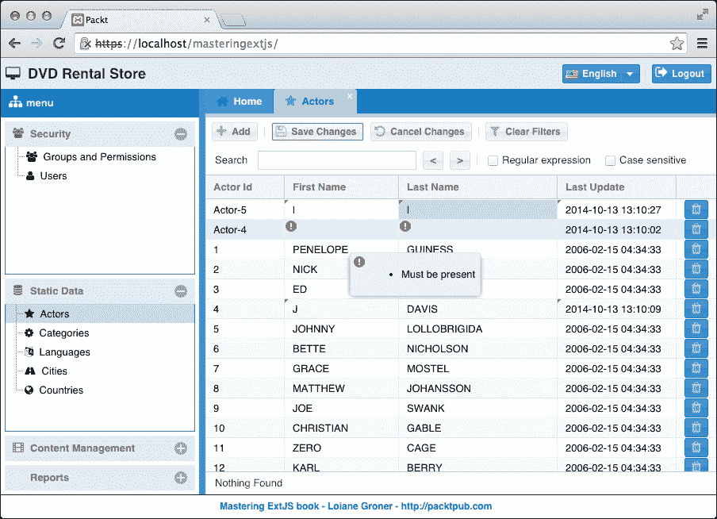

#### 模型验证器

要使此代码工作，我们需要将模型验证器添加到`staticData`模型中。例如，对于`Actors`模型，我们可以根据`actor`表的数据库验证添加以下代码：

```js
validators: {
        first_name: [
            { type: 'presence', message: 'This field is mandatory'},
            { type: 'length', min: 2, max: 45}
        ],
        last_name: [
            { type: 'presence', message: 'This field is mandatory'},
            { type: 'length', min: 2, max: 45}
        ]
    }
```

在`Packt.model.staticData.Base`类中，我们可以添加一个`last_update`验证器，这个验证器将适用于所有`staticData`模型：

```js
validators: {
    last_update: 'presence'
}
```

### 自动同步配置

Store 有一个名为`autoSync`的配置。默认值是`false`，但如果我们将其设置为`true`，Store 将在检测到更改时自动与服务器同步。这可能很好，但也可能很糟糕——这取决于我们如何使用它。

例如，如果我们没有验证，用户可以创建一个空行并尝试将其发送到服务器。服务器代码将失败（某些列不能为 `null`），这对应用程序来说很糟糕。将 `autoSync` 设置为 `false`，用户还可以选择何时保存信息，信息可以批量发送而不是每次操作（创建、更新或销毁）——`allowSingle` 也必须在代理写入器中设置为 `false`。

## 取消更改

由于用户可以保存更改（提交），用户也可以取消它们（回滚）。你只需要重新加载 Store，以便从服务器获取最新信息，用户所做的更改将会丢失。

因此，我们需要监听以下事件：

```js
staticdatagrid button#cancel"' {
    click: this.onButtonClickCancel
}
```

我们需要实现的方法：

```js
onButtonClickCancel: function (button, e, options) {
button.up('staticdatagrid').getStore().reload();
}
```

如果你想，你可以添加一个消息询问用户是否真的想要回滚更改。从 Store 调用 `reload` 方法是我们需要做的来使其工作。

### 小贴士

作为 Store 的 `reload` 方法的替代，我们也可以调用 `rejectChanges` 方法；然而，`reload` 方法更安全，因为我们再次从服务器获取信息。

## 清除过滤器

当在 GridPanel 上使用 `filter` 插件时，它将执行我们需要的所有操作（当本地使用时）。但是，它没有提供给用户的一项功能：一次性清除所有过滤器的选项。这就是为什么我们实现了**清除过滤器**按钮。

因此，首先，让我们监听这个事件：

```js
'staticdatagrid button#clearFilter {
    click: this.onButtonClickClearFilter
}
```

然后我们可以实现这个方法：

```js
onButtonClickClearFilter: function (button, e, options) {
button.up('staticdatagrid').filters.clearFilters();
}
```

当使用 `filter` 插件时，我们能够从 GridPanel 获取一个名为 `filters` 的属性。然后，我们只需要调用 `clearFilters` 方法。这将清除每个被过滤的列的过滤器值，并也会从 Store 中清除过滤器。

## 在 Controller 中监听 Store 事件

我们将要监听的最后一个是 Store 的 `write` 事件。我们已经在 Proxy 中添加了一个 `exception` 监听器（在 Ext JS 3 中，Store 有一个异常监听器，而在 Ext JS 4 和 5 中，这个监听器被移动到了 Proxy）。现在我们需要添加一个监听器以处理成功的情况。

第一步是在 Controller 中监听 Store 的事件。这个功能是在 Ext JS 4.2.x 中引入的。

在 Controller 的 `init` 函数中，我们将添加以下代码：

```js
me.listen({
    store: {
        '#staticData.Actors': {
            write: this.onStoreSync
        }
    }
});
```

我们可以在存储选项中监听 Store 事件。之前的代码将适用于**演员**屏幕。如果我们想对其他屏幕做同样的事情，我们需要添加与前面相同的代码。例如，以下代码需要添加到**分类**屏幕：

```js
'#staticData.Categories': {
    write: this.onStoreSync
}
```

我们不能在这里使用 Base Store 的 `storeId`，因为每个子 Store 都将有自己的 `storeId`。

当 Store 收到来自服务器的响应时，将触发写事件。所以让我们实现这个方法：

```js
onStoreSync: function(store, operation, options){
Packt.util.Util.showToast('Success! Your changes have been saved.');
}
```

我们将简单地显示一条消息，说明更改已保存。请注意，该消息也是通用的；这样我们就可以为所有静态数据模块使用它。输出截图如下：

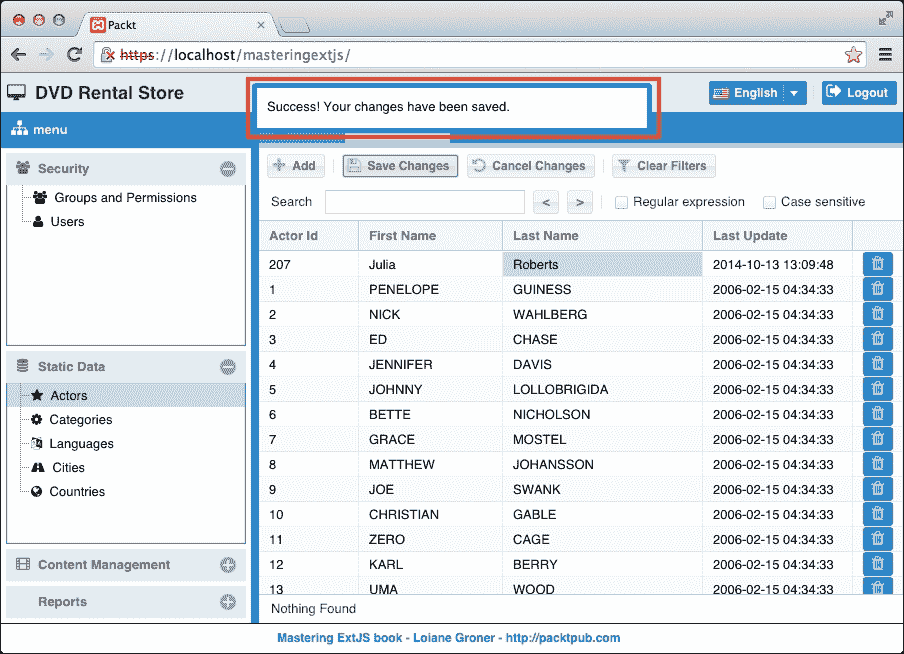

# 调试技巧 – Chrome 的 Sencha 扩展程序

有时我们需要检查我们实例化的特定 Ext JS 组件以进行调试。找到可用的方法和对象中设置的当前属性和配置可能有点棘手。在 MVC 工作时，我们可能需要找到创建的 Store ID 和应用程序中活跃的存储。使用 `console.log` 输出特定对象以进行检查是一项大量工作！

Sencha Labs 团队发布了一个名为 **Sencha App Inspector** 的免费 Chrome 扩展程序。当使用 Ext JS（或 Sencha Touch）时，建议您使用此扩展程序来帮助调试应用程序。在下面的屏幕截图中，我们可以看到扩展程序在运行——应用程序实例化的存储以及加载到其中的数据：

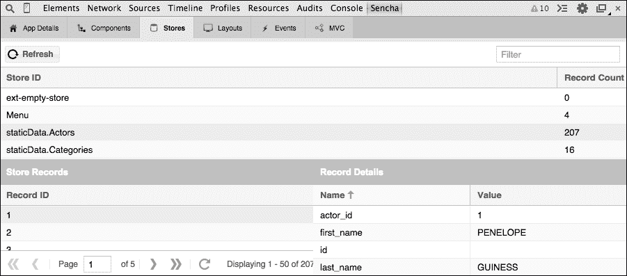

### 注意

有关 Sencha App Inspector 的更多信息以及下载链接，请访问 [`github.com/senchalabs/AppInspector/`](https://github.com/senchalabs/AppInspector/)。

## Firefox 扩展程序 – 开发者照明

如果您喜欢的开发浏览器不是 Chrome，还有适用于 Firefox（可在 Firebug 中使用）的 Sencha 扩展程序，名为开发者照明。

这不是一个免费扩展程序（但可以在有限的时间内免费试用），其成本具有很好的性价比。

在下面的屏幕截图中，我们可以看到扩展程序在运行（应用程序实例化的存储及其属性）：

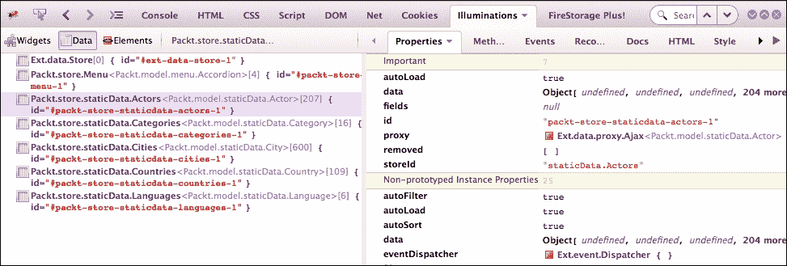

### 注意

有关开发者照明以及下载链接的更多信息，请访问 [`www.illuminations-for-developers.com/`](http://www.illuminations-for-developers.com/)。

# 摘要

在本章中，我们介绍了如何实现与 MySQL 表编辑器非常相似的屏幕。本章中我们介绍的最重要概念是使用面向对象编程中的继承概念实现抽象类。我们习惯于在服务器端语言中使用这些概念，例如 PHP、Java、.NET 等。本章演示了在 Ext JS 端使用这些概念也同样重要；这样，我们可以重用大量代码，并且实现通用的代码，为多个屏幕提供相同的功能。

我们创建了一个基础模型、存储、视图和控制器。我们使用了以下插件：`celleditor` 用于 GridPanel 和 Live Search 网格，以及 `filter` 插件用于 GridPanel。你学习了如何使用 Store 的功能来执行 CRUD 操作。你还学习了如何在控制器上创建自定义事件和处理 Widget Column 事件。在本章中，我们还探索了许多 MVC 控制器的功能。

### 注意

提醒：你可以通过从本书或 GitHub 仓库 [`github.com/loiane/masteringextjs`](https://github.com/loiane/masteringextjs) 下载代码包来获取本章（包含额外功能和服务器端代码）的完整源代码。

在下一章中，你将学习如何实现内容管理模块，这比本章中仅管理单个表要深入得多。我们将管理来自其他表（与应用程序的业务相关）的信息及其在数据库中的所有关系。
