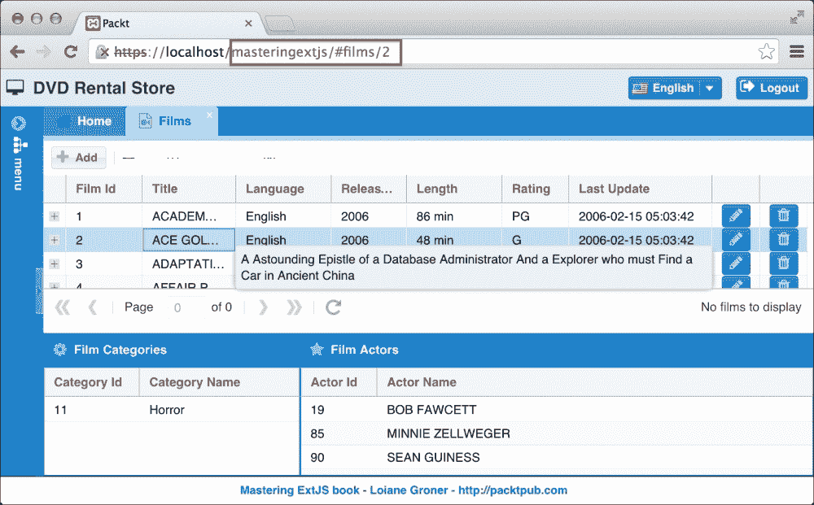
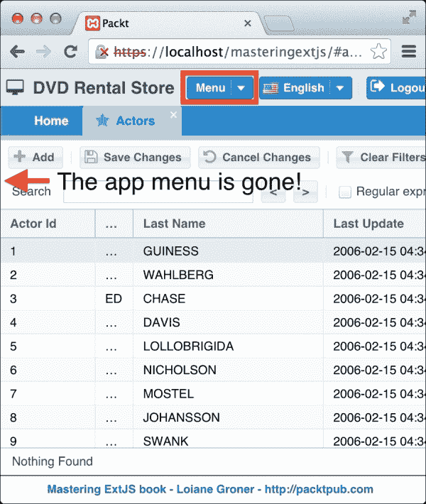
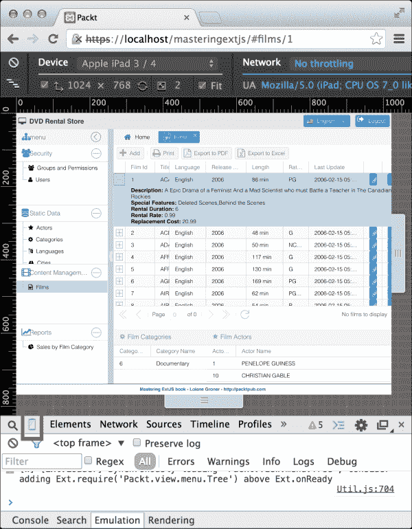
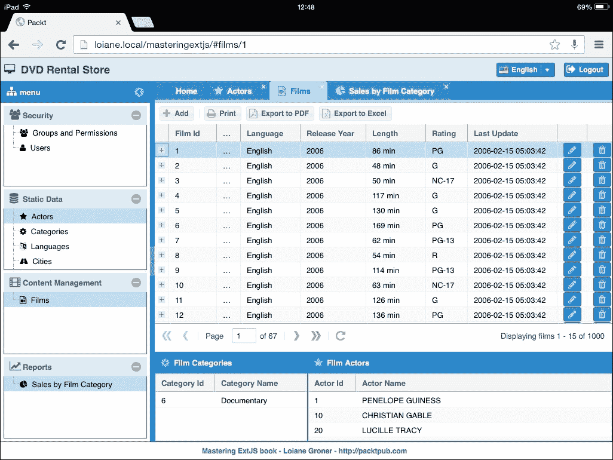
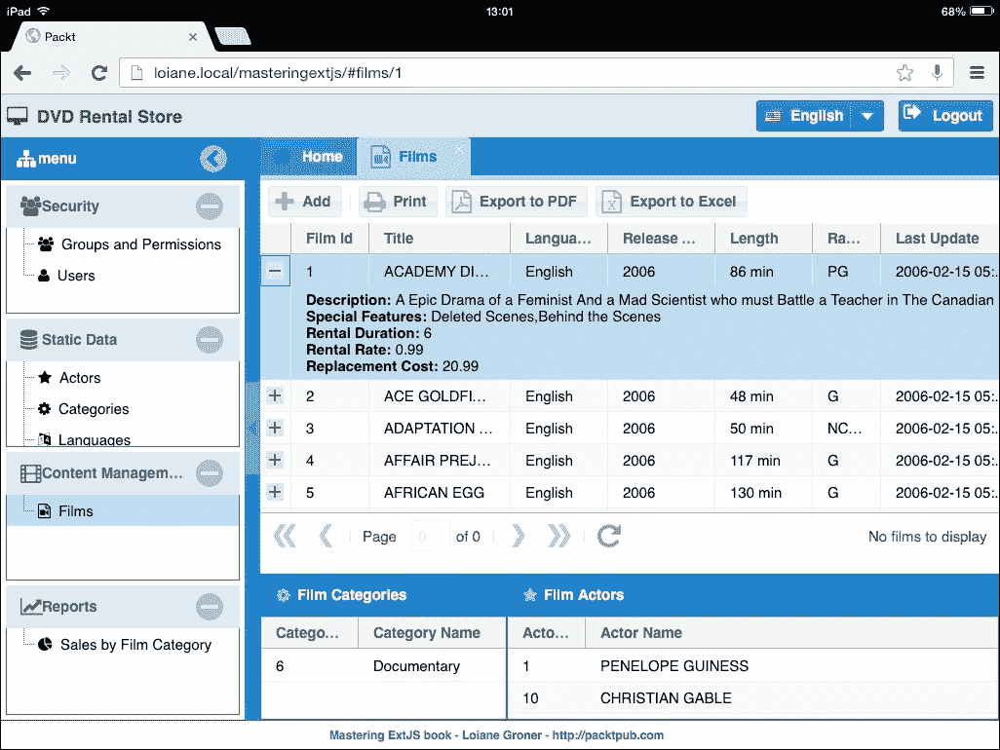
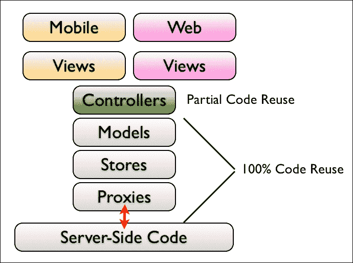
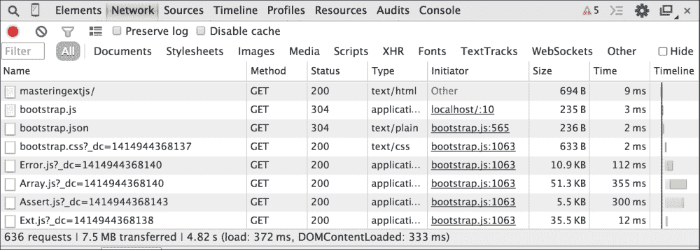
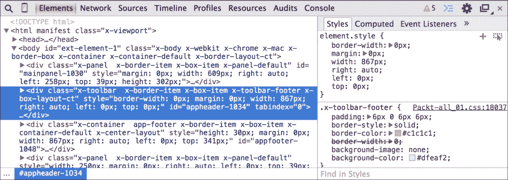
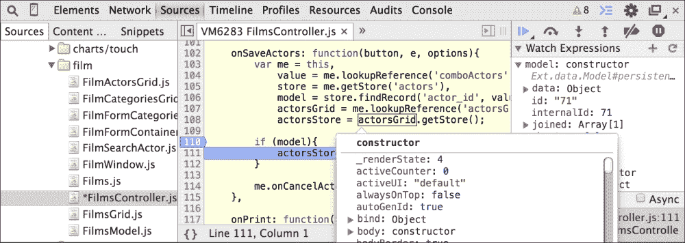

# 第十章：路由、触摸支持和调试

在本章中，我们将执行在自定义主题和创建应用程序的生产构建之前的最后几步。我们将涵盖一些不同的主题，例如在我们的应用程序中启用路由、关于响应式设计和 Ext JS 的快速概述、触摸支持、调试 Ext JS 应用程序以及关于测试的快速概述。

因此，在本章中，我们将涵盖以下内容：

+   Ext JS 路由

+   响应式设计和触摸支持

+   将 Ext JS 项目转换为移动应用程序

+   调试 Ext JS 应用程序

+   测试 Ext JS 应用程序的工具

+   有用的工具

+   如何找到额外的开源插件

# Ext JS 路由

路由是 Ext JS 5 中引入的一项功能，它使得在应用程序中使用`Ext.util.History`类处理历史记录的过程变得更加容易。

在一个普通网站上，用户通过点击链接或填写表单来导航到不同的页面。然而，在单页应用程序中，用户的交互不会加载新页面。相反，它是在单个页面内处理的，组件对这种交互做出反应。那么我们如何仍然允许用户使用浏览器的后退和前进按钮呢？使用路由允许用户通过将哈希令牌映射到控制器方法来使用这种功能。

例如，我们有一个用于管理电影信息的屏幕。使用路由，我们可以允许用户访问此屏幕（如果用户有适当的权限）并通过访问`https://localhost/masteringextjs/#films/3`自动选择电影网格的特定行。当用户访问此链接时，我们可以指示应用程序打开**电影**标签并选择 ID 为**3**的电影行。

要在我们的应用程序中启用路由，我们将使用由 Sencha Cmd 在创建应用程序时自动创建的`Root` Controller。

## 默认令牌

我们将首先启用默认令牌。当我们的应用程序启动时，它将重定向到`#home`哈希令牌。为此，我们将向`Application.js`文件中添加以下代码：

```js
defaultToken : 'home',
```

然后，在`Root` Controller 内部，我们将监听此哈希并重定向到`onHome`方法，如下所示：

```js
routes : {
    'home' : 'onHome'
},
```

在`onHome`方法内部，我们希望激活`Main Panel`的第一个标签（**首页**）。使用以下代码来完成此操作：

```js
onHome : function() {
    var mainPanel = this.getMainPanel(); //#1
    if (mainPanel){
        mainPanel.setActiveTab(0);
    }
},
```

我们使用`getMain`方法（`#1`），它指的是 Controller 的`ref`。我们需要声明它。我们将在`init`方法中声明`ref`配置：

```js
init: function() {
    this.addRef([{
        ref: 'mainPanel',
        selector: 'mainpanel'
    }]);
    this.callParent();
}
```

## 以编程方式加载 Controller

在本书的开头，你了解到当应用程序加载时（MVC）会加载控制器。由于我们的应用程序有一个**登录**屏幕，我们不想在应用程序加载时启用路由。我们只想在用户登录后启用路由。`Root` Controller 将在应用程序加载时加载，我们不希望发生这种情况。

在`Application.js`中，我们将注释掉`Root` Controller：

```js
controllers: [
    //'Root',
    'Menu',
    'StaticData'
],
```

当`Main`视图加载时，我们想要初始化`Root`控制器。所以，我们将在`main.MainController`的`init`方法中`init``Root`控制器：

```js
init: function() {
    Packt.app.createController('Root');
},
```

这就是我们在 Ext JS 中程序化创建控制器的方法。只有在`Main`视图加载后，路由器才会启用。我们可以在`MainController`内部放置所有路由，但它将与`MainController`中已有的现有代码共存，并且在未来维护此代码可能会有些困难。这也是我们需要做出的设计决策之一：我们是否将所有路由都放在单个控制器中，还是将代码分开？请随意组织代码，使其符合您的需求。在大型应用程序中，在单个控制器中维护许多组织良好的 hash 标记可能会有点困难。

到目前为止，我们有的代码，当我们渲染`https://localhost/masteringextjs`应用程序时，它将被自动重定向到`https://localhost/masteringextjs/#home`。

## 处理路由

在`Root`控制器**的`routes`配置中**，我们将处理我们应用程序的可能路由。我们将使用为我们应用程序创建的`xtypes`。好事是我们一直在跟踪它们在我们数据库的`menu`表中的`className`列！

以下是我们应用程序中可能存在的 hash 标记：`user`、`actorsgrid`、`categoriesgrid`、`languagesgrid`、`citiesgrid`、`countriesgrid`、`films`和`salesfilmcategory`。我们可以为它们中的每一个定义一个方法，就像我们为`home`标记开发的那样。但是，当用户访问任何这些标记并在相应的标签页中打开时，应该做什么。所以，我们想要在单个方法中处理多个标记。这就是我们将在`Root`控制器的`routes`配置中添加的代码：

```js
'user|actorsgrid|categoriesgrid|languagesgrid|citiesgrid|countriesgrid|films|salesfilmcategory': {
    before: 'onBeforeRoute',
    action: 'onRoute'
}
```

当我们想要在同一个方法中处理多个标记时，我们可以使用`|`来分隔它们。注意，在前面的代码中，我们声明了两个方法：`onBeforeRoute`和`onRoute`。我们可能想要检查用户是否有权限访问屏幕（毕竟，什么阻止了一个聪明的用户试图通过路由访问用户没有权限的屏幕呢？）。所以，我们可以在以下代码中处理它（然而，这不一定是最安全的保护应用程序的方法）：

```js
onBeforeRoute: function(action){
    var hash = Ext.util.History.getToken(); //#1

    Ext.Ajax.request({
        url     : 'php/security/verifyEntitlement.php',
        params  : {
            module : hash
        },
        success : function(conn, response, options, eOpts) {

            var result = Packt.util.Util.decodeJSON(conn.responseText);

            if (result.success) {
                action.resume();   //#2
            } else {
                Packt.util.Util.showErrorMsg(result.msg);
                action.stop();     //#3
            }
        },
        failure : function(conn, response, options, eOpts) {
            Packt.util.Util.showErrorMsg(conn.responseText);
            action.stop();         //#4
        }
    });
},
```

由于我们在这里使用的是通用代码，并且我们希望将用户试图访问服务器的`className`参数发送到服务器，我们可以使用第`#1`行中的代码来检索它。`before`动作方法只接收一个参数，即`action`参数。根据结果，我们可以恢复它（`#2`），这意味着用户可以访问屏幕——`onRoute`方法将被执行。或者，我们可以停止动作（`#3`和`#4`），这意味着`onRoute`方法将不会执行。

让我们看看`onRoute`方法：

```js
onRoute: function(){
    var me = this,
        hash = Ext.util.History.getToken(),
        main = me.getMain(); //#5

    me.locateMenuItem(main, hash); //#6
},
```

此方法将调用`locateMenuItem`（`#6`）方法，传递`mainmenu`引用（`#5`）：

```js
{
    ref: 'main',
    selector: '[xtype=mainmenu]'
}
```

### 重构菜单代码

让我们来看看`locateMenuItem`代码：

```js
locateMenuItem: function(mainMenu, hash){
    var me = this,
        root, node;
    Ext.each(mainMenu.items.items, function(tree){
        if (tree.getXType() === 'menutree'){
            root = tree.getRootNode();
            node = root.findChild('className', hash);
            if (node){
                me.openTab(node); //#1
                return;
            }
        }
    });
},
```

之前提到的方正在搜索我们为应用程序的菜单创建的每个`menutree`中的节点，以匹配路由的哈希。如果我们找到节点，我们将调用`openTab`方法（`#1`）：

```js
openTab: function(record){
    var mainPanel = this.getMainPanel();

    var newTab = mainPanel.items.findBy(
        function (tab){
            return tab.title === record.get('text');
        });

    if (!newTab){
        newTab = mainPanel.add({
            xtype: record.get('className'),
            glyph: record.get('glyph') + '@FontAwesome',
            title: record.get('text'),
            closable: true
        });
    }

    mainPanel.setActiveTab(newTab);
},
```

如果我们查看`Menu`控制器中`onTreePanelItemClick`方法的代码，我们将注意到它与`openTab`方法完全相同。尽管我们将在本书的末尾处理路由，但最好在我们开始开发应用程序时就处理它们。所以，如果你打算使用路由，确保路由是设计的一部分，因为如果你在应用程序开发之后决定实现它，可能需要进行一些代码更改。

`onTreePanelItemClick`方法现在将有以下代码：

```js
onTreePanelItemClick: function(view, record, item, index, event, options){
    this.redirectTo(record.get('className'));
},
```

当用户点击我们实现的菜单的`Tree`中的`Node`时，它将重定向到`Node`的`className`参数的哈希，并且`Root`控制器将处理打开标签页。

## 处理不匹配的路由

如果用户尝试访问应用程序中未定义的路由，我们也可以执行一些代码。在`Root`控制器中，我们可以添加以下代码：

```js
listen : {
    controller : {
        '*': {
            unmatchedroute: 'onUnmatchedRoute'
        }
    }
},
```

我们可以向用户显示错误消息，如下所示：

```js
onUnmatchedRoute : function(hash) {
    Packt.util.Util.showErrorMsg('Hash does not exist!');
}
```

## 处理参数

现在，让我们开发更复杂的路由处理。对于**Films**屏幕，假设我们希望用户能够使用哈希令牌从 Films 网格中选择一行，如下面的截图所示：



我们可以定义以下路由：

```js
'films/:id' : {
    action: 'onFilmSelect',
    before: 'onBeforeFilmSelect',
    conditions : {
        ':id' : '([0-9]+)'
    }
}
```

这意味着用户可以尝试访问格式为`https://localhost/masteringextjs/#films/2`的 URL。如果用户尝试访问`https://localhost/masteringextjs/#films/ace`，则由于`id`参数的条件，它是不有效的——它需要是一个数值。这意味着我们也可以定义正则表达式来验证哈希令牌的参数。

在我们执行`onFilmSelect`之前，我们想做一些事情：

```js
onBeforeFilmSelect: function(id, action){

    var me = this,
        main = me.getMain();

    this.locateMenuItem(this.getMain(),'films'); //#1

    var record = this.getFilmsGrid().getStore().findRecord('film_id', id);
    if(record) {
        action.resume();
    }
    else {
        action.stop();
    }
},
```

我们需要打开**Films**屏幕（`#1`）并检查用户想要选择的记录是否存在于 Store 中。如果结果是正的，继续执行；如果不是，停止执行。

`filmsGrid`的引用在这里给出：

```js
{
    ref: 'filmsGrid',
    selector: '[xtype=films-grid]'
}
```

最后，`onFilmSelect`方法的引用在这里给出：

```js
onFilmSelect: function(id){
    this.getFilmsGrid().fireEvent('selectfilm', id);
}
```

我们将触发`films-grid`的`selectfilm`事件，如下面的代码所示；这需要在`FilmsGrid`类内部编写一些新代码：

```js
listeners: {
    itemclick: 'onItemClick',
    selectfilm: 'onFilmSelect'
}
```

我们将在`FilmsController`类中处理监听器，如下面的代码所示：

```js
onFilmSelect: function(id){
    var me = this,
        grid = me.lookupReference('filmsGrid'),
        store = me.getStore('films'),
        record = store.findRecord( 'film_id', id );

    if (record){
        grid.getSelectionModel().select(record);
    }
},
```

在前面的代码中，我们正在通过`film_id`查找记录并在`FilmsGrid`中选择它。

当用户点击网格的行时，将触发`onItemClick`方法：

```js
onItemClick: function( view, record, item, index, e, eOpts ) {
    this.redirectTo('films/' + record.get('film_id'));
}
```

我们将简单地重定向请求到`Route`控制器，以便它可以处理我们在此主题中开发的代码所进行的选取。

### 注意

如前所述，在某些应用程序中，路由可能会变得非常复杂，因此最好的做法是从开发初期就开始处理它们。更多详情，请参阅 Sencha 关于路由的指南和文档。

# 使用响应式设计插件

Ext JS 5 引入了另一个新功能，即开发响应式应用程序的选项。移动设备已经成为我们生活的一部分。我们基本上在口袋里就有一个电脑。如今，在用户需求文档中将平板或移动设备兼容性作为一项内容列出是非常常见的。幸运的是，Ext JS 5 提供了良好的支持，并允许我们无需太多努力就能实现这一需求。

Ext JS 5 引入了响应式插件和混合。插件可用于任何组件，混合可用于任何其他类。此插件通过控制`responsiveConfig`动态响应屏幕尺寸和方向的变化。

例如，让我们在我们的项目中快速做一个示例。如果屏幕宽度小于 768 像素，并且屏幕处于`tall`模式，我们将隐藏应用程序菜单并显示一个新按钮，该按钮将显示如下截图所示的菜单：



在`Packt.view.main.Main`类中，我们将向`west`区域添加响应式插件。代码如下所示：

```js
{
    xtype: 'mainmenu',
    region: 'west',
    plugins: 'responsive',
    responsiveConfig: {
        'width < 768 && tall': {
            visible: false
        },
        'width >= 768': {
            visible: true
        }
    }
}
```

在`responsiveConfig`内部，我们可以添加一些条件并相应地设置组件的配置。我们可以更改布局，渲染不同的组件，并在应用程序中完成所需的一切。仅使用前面的代码，如果我们执行应用程序并减小浏览器宽度，当满足条件时，我们将看到菜单会自动隐藏。这真是太棒了！

在`Packt.view.main.Header`中，我们还将添加一个新的组件，如下所示：

```js
{
    xtype: 'tbfill'
},{
 xtype: 'responsive-mainmenu'
},{
    xtype: 'translation'
},
```

此组件的代码如下所示：

```js
Ext.define('Packt.view.main.ResponsiveMenuButton', {
    extend: 'Ext.button.Split',
    xtype: 'responsive-mainmenu',

    requires: [
        'Packt.view.main.MainModel'
    ],

    text: 'Menu',

    plugins: 'responsive',
    responsiveConfig: {
        'width < 768 && tall': {
            visible: true
        },
        'width >= 768': {
            visible: false
        }
    },

    menu: {
        xtype: 'menu',
        items: [{
            xtype: 'mainmenu'
        }]
    }
});
```

我们正在重用本书开头开发的菜单。当然，我们可以开发一个更用户友好的 UX，但在这里我们只是关注功能，进行快速测试。

如果我们需要处理响应式设计，Google Chrome 有一个非常棒的功能。它能够模拟项目在不同设备上的显示效果，以便查看它们的外观。在 Google 开发者工具中，点击下面的截图所示的移动设备图标，开始您的探险之旅：



### 注意

关于 Ext JS 5 和响应式设计的更多信息，请阅读[`www.sencha.com/blog/designing-responsive-applications-with-ext-js`](http://www.sencha.com/blog/designing-responsive-applications-with-ext-js)并检查此示例的源代码[`goo.gl/odce6j`](http://goo.gl/odce6j)。Firefox 在其开发者工具栏中也有一个移动视图。转到**工具** | **Web 开发者** | **响应式设计视图**。

# 启用触摸支持

在本节中，我们将简要讨论响应式设计。由于这不是本书的主要内容，我们将实现一个非常简单的示例，以让我们了解如果我们需要使用 Ext JS 开发响应式应用程序时需要做什么。谈到响应式设计，我们知道 Ext JS 非常适合开发桌面应用程序（将在台式计算机或笔记本电脑上执行），但手机现在已经成为我们生活中不可或缺的一部分。我们将找出在桌面和移动设备上运行相同应用程序的方法。我们还将讨论如何在我们的应用程序中启用触摸支持。

在桌面设备和移动设备上运行应用程序的主要区别在于事件，以及其他细节。在桌面上，当用户点击按钮时，我们监听`click`事件。在触摸式移动设备上，没有`click`事件；存在的是`tap`事件，因为我们是在触摸屏幕而不是使用鼠标。

另一个细节是组件的大小。Ext JS 经典主题确实很漂亮，但触摸屏上太小了。在本书的整个过程中，我们一直在使用`Neptune`主题，这是我们在使用 Sencha Cmd 创建应用程序时设置的默认主题。`Neptune`主题的组件比`classic`主题大，但仍然不足以在触摸设备上使用。让我们实验一下！如果您有触摸设备，请尝试在它上面运行本书中开发的整个应用程序。如果您没有触摸设备，您不必担心；您可以使用前面主题中提到的 Google Chrome 模拟器进行此实验。

以下截图展示了在 iPad mini 上运行的应用程序：



如果我们尝试使用当前的应用程序，我们将能够使用其大部分功能。因为我们使用的是桌面主题，图标较小，所以在移动设备上可能无法 100%工作。例如，`RowExpander` + 按钮工作得不是很好，因为+图标对于移动设备来说太小了。

Ext JS 5 引入了专门为触摸设备设计的全新主题。有一个特殊的`Neptune`主题版本，还有一个特殊的`Crisp`主题版本（也是在 Ext JS 5 中引入的）。我们可以通过在`app.js`文件中更改主题来为我们的应用程序添加触摸支持：

```js
"theme": "ext-theme-neptune-touch", //or "ext-theme-crisp-touch"
```

在终端中执行`sencha app watch`时，尝试将主题更改为之前提到的选项之一。别忘了清理浏览器的缓存，以确保您在下次刷新应用程序时获取到新的 CSS 文件版本。现在让我们再次尝试应用程序，如下所示：



注意组件之间的空间现在更大了。这是为了确保我们可以点击（触摸）组件。

我们没有触摸优化的应用。为了使其达到 100%，我们可以审查我们设置的任何大小（例如，列宽），并使用一些响应式设计技术，使应用在移动设备上看起来很棒！

### 注意事项

更多信息，请访问 [`goo.gl/VnT7bT`](http://goo.gl/VnT7bT)。

## 从 Ext JS 到移动

如果你正在开发的产品需要特殊的应用实现，尤其是针对触摸设备呢？我们不是在谈论我们在前一个主题中实现的技巧；我们是在谈论同一产品的移动应用。例如，Facebook 有桌面版本，但也为移动设备提供了应用。这可能也是你需要的。

我们想介绍 Sencha Touch，它是 Ext JS 的表亲！Sencha Touch 是市场上第一个 HTML5 移动框架。而且还有更多好消息：你不需要重写所有代码，就可以让同样的应用也适用于移动设备。

Sencha Touch 和 Ext JS 共享相同的 API。数据包，如模型、存储和框架的核心，是相同的。Sencha Touch 也使用 MVC。控制器和视图（组件）的工作方式与 Ext JS 控制器和视图非常相似。当然，最大的区别在于视图，因为网络组件与移动组件不同。然而，Sencha Touch 也提供了表单和列表，我们甚至可以找到为移动设备定制的网格组件。图表在框架之间也是共享的。

以下图表显示了使用 Sencha Touch 后我们可以重用多少代码的分析：



我们可以重用的代码量是巨大的！我们还有两种实现方式：第一种是拥有一个移动应用，用户将访问指向 Sencha Touch 部署的 URL（Sencha Touch 和服务器端代码在同一域名下）。第二种选择是将 Sencha Touch 代码运行在用户的设备上（Sencha Touch 为 iOS 和 Android 提供了原生打包，但我们也可以使用 Sencha Touch 创建原生 Blackberry 10 和 Windows Phone 8 应用），服务器端代码运行在 Web 服务器上。在这种情况下，我们可以使用 CORS ([`enable-cors.org/`](http://enable-cors.org/)) 来实现应用和服务器端代码之间的 Ajax 通信。

### 注意事项

想了解更多关于 Sencha Touch 的信息，请访问 [`www.sencha.com/products/touch/`](http://www.sencha.com/products/touch/)。

在移动设备上，也可以访问硬件功能，如联系人、相机、地理位置等。我们可以使用一个名为 **Apache Cordova** 的开源框架（或 **Phonegap**，它是 Apache Cordova 的实现）。Sencha Cmd 也具有支持与 Cordova 集成的命令。以下链接提供了更多关于此主题的信息：

+   [`docs.sencha.com/touch/2.4/tutorials/cordova_camera.html`](http://docs.sencha.com/touch/2.4/tutorials/cordova_camera.html)

+   [`cordova.apache.org/`](http://cordova.apache.org/)

+   [`phonegap.com/`](http://phonegap.com/)

+   [`vimeo.com/76568053`](http://vimeo.com/76568053)

# 调试 Ext JS 应用程序

调试的艺术与编程的艺术一样重要。我们通常编写我们认为一旦执行就会工作的代码，但有时这并不正确。我们编写代码，然后遇到异常或 JavaScript 错误，然后我们需要再次深入代码以查看我们哪里出了错。这是开发者工作的一部分，也是生活的一部分！

在整本书中，你了解到调试很重要，尤其是在我们学习一种更简单的方式来确定正确的 **组件查询** 选择器时。当使用 Ext JS 开发应用程序时，使用调试工具是强制性的。这是因为它不仅用于调试，你还将能够更多地了解框架，而且这是一项极好的学习练习。

在创建 Ext JS 应用程序时，我们始终需要提醒自己的几点：大小写敏感——`LoginScreen` 类与 `Loginscreen` 不同。小心保留字（[`mattsnider.com/reserved-words-in-javascript/`](http://mattsnider.com/reserved-words-in-javascript/))——你不能将它们用作命名空间、类和包的名称，或者用作变量名。检查拼写；这非常重要——有时当我们输入时，可能会多输入一个字符（*大拇指指错*综合症）。

如果你现在几乎已经用 JavaScript 编程了 10 年，你会知道在此之前，我们唯一的伙伴是亲爱的 `alert` 提示框。我们过去经常在代码中放置几个提示框，执行代码，然后查看哪个提示框没有被执行，以便我们可以找到错误所在。现在我们有我们亲爱的朋友 `console`。滥用 `console` 的 `log`、`warn` 和 `error` 功能！

我们还拥有出色的调试工具！其中最重要的两个是 Google 开发者工具和 Firefox 的 Firebug！至少学会使用其中一个（它们非常相似）。

例如，让我们使用 Google 开发者工具。它包含几个标签页；在 **网络** 标签页上，我们可以看到如下加载的文件：



至于正在加载或未加载的文件，这是一个非常大的问题！简单的错误，比如类的名称（使用 MVC）、CSS 路径和 `index.html` 文件中的 JS，可以使用 **控制台** 或 **网络** 选项卡进行验证。这个选项卡也非常重要，因为在某些章节中，我们验证了发送到服务器的参数。即使这是我们第一次使用 Ext JS 组件，并且我们不知道如何处理将发送到服务器的数据，我们也可以查看 **网络** 选项卡中的请求参数，然后更容易地读取服务器上的正确参数。当我们从服务器接收任何信息时，这也适用，例如，检查 JSON 是否符合 Ext JS 的预期。

在 **元素** 选项卡中，我们可以看到详细信息；由 Ext JS 代码生成的 HTML 代码以及应用于组件的 CSS。当我们想要应用一些自定义 CSS 并调试为什么样式没有被应用时，这非常有用。



当我们将鼠标移过时，与该 HTML 相关的部分会在屏幕上突出显示。我们还有 **CSS** 和 **脚本** 选项卡。我们可以实时更改 CSS 和脚本，并实时看到应用的变化！这真是太神奇了！因此，学习如何使用调试工具非常重要。

在 **源** 选项卡中，我们可以以项目结构的形式获取加载的源代码。对我们来说，这个选项卡非常重要，因为它允许我们使用浏览器的调试功能来调试我们的代码。调试技术非常类似于在服务器端语言中使用的技术；我们添加断点，执行代码，然后观察和检查变量值，查看源代码的每一行发生了什么，如下所示：



### 注意

想了解更多关于 Firebug 的信息，请访问 [`getfirebug.com/`](http://getfirebug.com/)。想了解更多关于 Google 开发者工具的信息，请访问：[`developers.google.com/chrome-developer-tools/`](https://developers.google.com/chrome-developer-tools/) 和 [`developer.chrome.com/extensions/tut_debugging`](https://developer.chrome.com/extensions/tut_debugging)。

当然，还有我们在第七章静态数据管理中提到的特殊附加组件：Sencha 为 Chrome 提供的附加组件和 Illumination 为 Firebug 开发者提供的附加组件。

掌握一个调试工具与掌握 Ext JS 编程的艺术同样重要。毕竟，我们不知道我们是否会有机会从头开始工作在一个项目上，或者我们需要维护其他开发者的代码。在这种情况下，知道如何调试是一项必备技能！选择你喜欢的工具，享受编码和调试的乐趣！

# 测试 Ext JS 应用程序

测试在开发应用程序或提供维护时是一个非常重要的部分。当我们不编写测试时，我们需要手动验证每个用例，如果我们对代码进行了任何更改，我们还需要手动重新执行所有测试。当我们需要维护代码时，情况也是如此；开发者通常只测试更改的部分，但正确的方法应该是回归测试，以查看更改是否破坏了其他任何东西。因此，花一些时间编写测试最终可能是有益的。你将花费更多的时间编写代码，但然后你将能够通过单次点击运行所有测试，并验证哪些部分出了问题，哪些部分仍在正常工作。

我们也非常习惯于在服务器端代码上执行单元测试。Java、PHP、Ruby、C# 社区提供了很多选项来执行服务器端代码的单元测试，有时我们可能会忘记测试前端代码（在这种情况下是 Ext JS）。但不用担心；有一些工具我们可以使用，以便将 Ext JS 也包含在测试中。

对于一般的 JavaScript 测试来说，一个非常受欢迎的工具是 **Jasmine** ([`jasmine.github.io/`](http://jasmine.github.io/))。Jasmine 是一个用于 **行为驱动开发**（**BDD**）的测试工具（[`en.wikipedia.org/wiki/Behavior_driven_development`](http://en.wikipedia.org/wiki/Behavior_driven_development)）。在 Ext JS 文档中，你可以找到两篇指南，解释如何使用 Jasmine 测试 Ext JS 应用程序：[`docs.sencha.com/extjs/4.2.0/#!/guide/testing`](http://docs.sencha.com/extjs/4.2.0/#!/guide/testing) 和 [`docs.sencha.com/extjs/4.2.0/#!/guide/testing_controllers`](http://docs.sencha.com/extjs/4.2.0/#!/guide/testing_controllers)。尽管这些指南是为 Ext JS 4.x 编写的，但它们也可以应用于 Ext JS 5。

还有一个专门为 Sencha 应用程序设计的测试框架，称为 **Siesta** ([`www.bryntum.com/products/siesta/`](http://www.bryntum.com/products/siesta/))。Siesta 还可以用于测试一般的 JavaScript 代码，但 Siesta 的酷之处在于它提供了一个特殊的 API，这样我们就可以测试 Ext JS 应用程序，包括对用户界面组件的测试。Siesta 随带了一些优秀的示例，我们可以使用这些示例来开始编写自己的测试用例。

# 有用的工具

在这个主题中，我们将介绍一些可以帮助开发者实现 Ext JS 应用程序的工具。你可以在这个主题的末尾找到提到的所有工具的链接。

第一款工具是 **JSLint**。JSLint 是一款可以帮助你查找 JavaScript 错误并帮助你清理代码的工具。

第二款工具是 **YSlow**。YSlow 分析网页，并基于高性能网站的规则告诉你它们为什么运行缓慢。YSlow 是一个与流行的 Firebug 网页开发工具集成的 Firefox 插件。

Ext JS 是一个 JavaScript 框架，JavaScript 性能是许多公司关心的话题。用户在浏览器上需要加载的最小内容越好。这就是为什么使用 Sencha Cmd 进行生产构建非常重要，而不是简单地将所有应用程序文件部署到生产环境中。

Sencha Cmd 还会压缩 Ext JS CSS 文件到一个更小的 CSS 文件，我们也可以只包含我们将要真正使用的组件的 CSS（以防我们创建了一个自定义主题）。同样重要的是，在 `sass/etc` 或 `sass/var` 文件夹中创建任何应用程序自定义 CSS，以便 CSS 也可以添加到由 Sencha Cmd 生成的主 CSS 文件中。

**CSS Sprites** 是另一个非常重要的主题。字体图标，如 Font Awesome，确实很棒，但有时需要使用图像图标。在这种情况下，我们可以创建一个 CSS Sprite，这涉及到创建一个包含所有图标的单个图像。在 CSS 中，我们只需一个图像，并传递一个 `background-position` 属性来显示我们想要的图标，如下所示：

```js
.icon-message {
  background-image: url('mySprite.png');
  background-position: -10px -10px;
}

.icon-envolope {
  background-image: url('mySprite.png');
  background-position: -15px -15px;
}
```

有一些工具也可以帮助我们创建 CSS Sprites，例如 **SpritePad**、**SpriteMe** 和 **Compass Sprite Generator**。

这里是本节中提到的所有工具的链接：

+   **JSLint**：[`www.jslint.com/`](http://www.jslint.com/)

+   **YSlow**：[`developer.yahoo.com/yslow/`](http://developer.yahoo.com/yslow/)

+   **SpritePad**：[`wearekiss.com/spritepad`](http://wearekiss.com/spritepad)

+   **SpriteMe**：[`www.spriteme.org/`](http://www.spriteme.org/)

+   **Compass Sprite Generator**：[`compass-style.org/help/tutorials/spriting/`](http://compass-style.org/help/tutorials/spriting/)

总是记住，Ext JS 是 JavaScript，因此我们还需要关注性能。通过在这个主题上发布的所有这些小贴士，一个 Ext JS 应用程序可以提高其性能。

最后但同样重要的是，Sencha 提供了两个工具：**Sencha Architect** 和 **Sencha Eclipse Plugin**。Sencha Architect 是一个类似于 Visual Studio 的可视化设计工具：你可以拖放元素，并可以看到应用程序的外观，以及你需要完成的整个配置都是通过 **Config** 面板来完成的。只有方法、函数和模板可以自由输入你喜欢的代码。Sencha Architect 的好处在于它有助于遵循所有最佳实践，并且代码组织得非常好。你还可以使用 Sencha Architect 开发所有的 Ext JS 代码，并且在服务器端，你可以继续使用你最喜爱的 IDE（Eclipse、Aptana、Visual Studio 等）。

Sencha Eclipse 插件是 Eclipse IDE 的一个插件，它启用了自动完成功能。Sencha Architect 和 Sencha Eclipse 插件都是付费工具。但你可以下载试用版进行测试，地址为[`www.sencha.com/products/complete/`](http://www.sencha.com/products/complete/)或[`www.sencha.com/products/architect/`](http://www.sencha.com/products/architect/)。

另一个用于开发 Sencha 应用程序的出色 IDE 是**WebStorm**（或**IntelliJ IDEA**）。WebStorm 还具备自动完成功能（如果设置正确），支持 Sass 和 Compass（Ext JS 用于主题的库），以及 JSLint 来验证 JavaScript 代码，以及其他功能。它也是一个付费工具，但你可以下载试用版进行测试，地址为[`www.jetbrains.com/webstorm/`](https://www.jetbrains.com/webstorm/)。本书的源代码是用 IntelliJ IDEA 编写的。

# 第三方组件和插件

虽然 Ext JS 提供了优秀的组件，但我们通常还希望开发自己的组件，或者可能使用其他开发者的组件。在这一点上，Ext JS 社区做得很好。许多开发者与社区分享他们自己的组件、扩展和插件。你可以从以下两个主要地方找到它们：

+   **Sencha 市场**：[`market.sencha.com/`](https://market.sencha.com/)

+   **Sencha 论坛**：[`www.sencha.com/forum/forumdisplay.php?82-Ext-User-Extensions-and-Plugins`](http://www.sencha.com/forum/forumdisplay.php?82-Ext-User-Extensions-and-Plugins)

# 摘要

在本章中，你学习了如何启用路由，并且也快速概述了 Ext JS 应用程序的责任设计和触摸支持。你了解了了解如何调试 Ext JS 应用程序的重要性，以及一些可以帮助我们完成这项任务的工具。你还了解到性能非常重要，并且我们可以借助一些免费工具做更多的事情来提高我们 Ext JS 应用程序的性能。我们还列出了在哪里可以找到优秀的插件、扩展和新组件，这些我们可以在项目中使用。

在下一章中，我们将为我们的应用程序定制主题，并执行生产构建。
