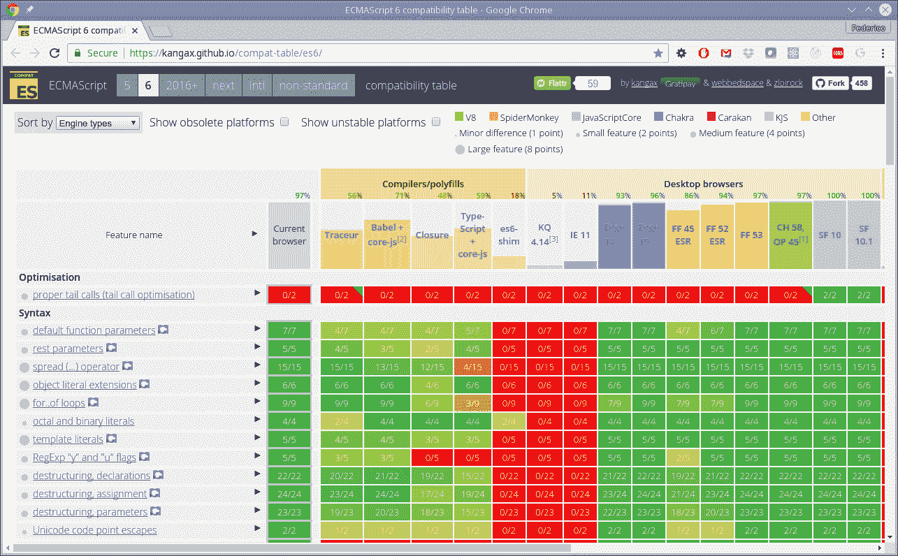
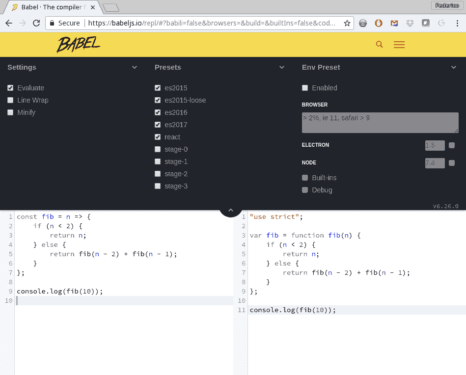
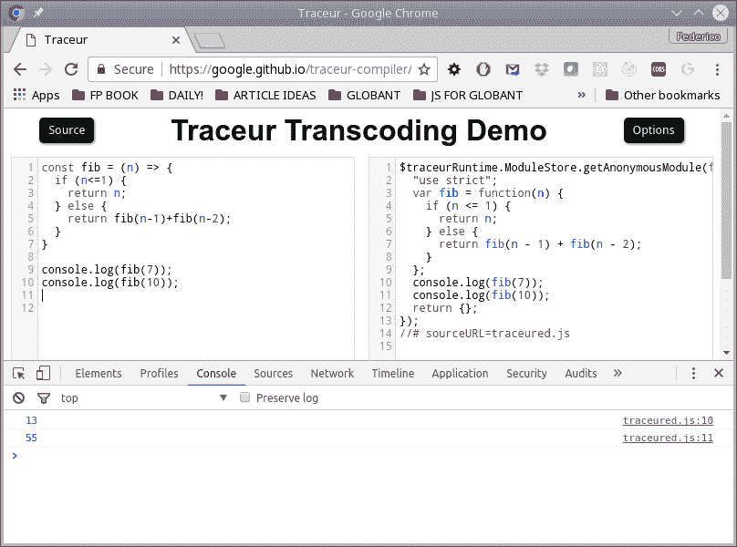
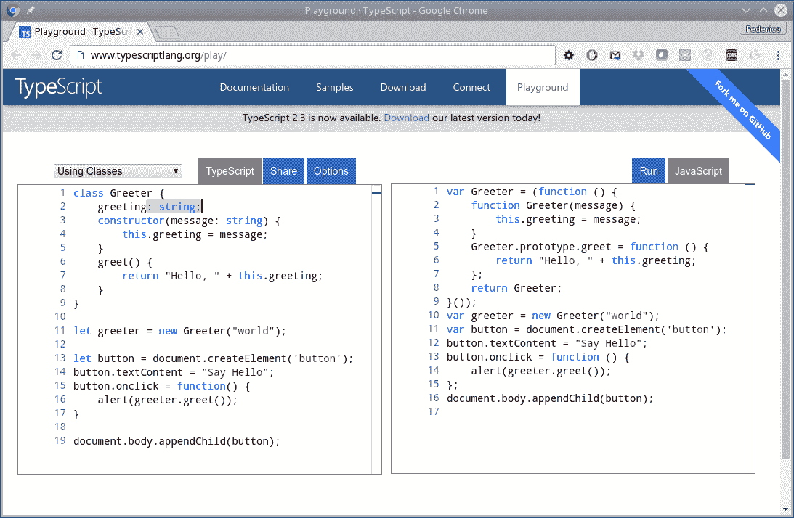
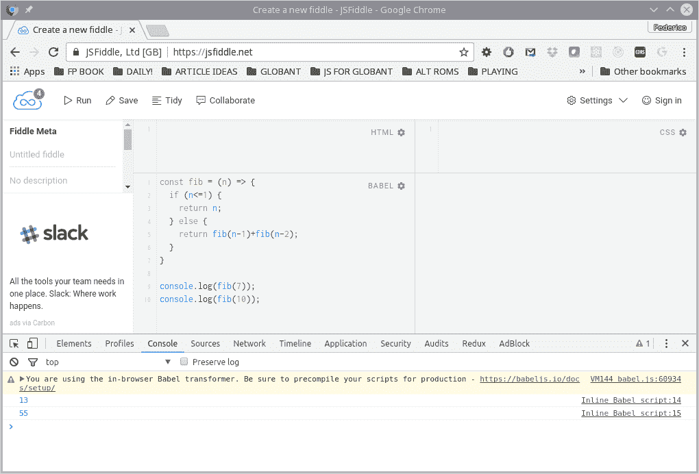

# 第一章：成为函数式编程者——几个问题

- 函数式编程（通常缩写为 FP）自古以来就存在，并且由于它在几个框架和库中的广泛使用，尤其是在 JavaScript 中的增加使用，它正在经历一种复兴。在本章中，我们将：

+   介绍一些函数式编程的概念，给出一点点它的意义

+   展示使用函数式编程所暗示的好处（和问题）

+   开始思考为什么**JavaScript**（**JS**）可以被认为是适合函数式编程的语言

+   了解你应该注意的语言特性和工具，以充分利用本书中的一切

所以，让我们开始问自己*什么是函数式编程？*并开始研究这个主题。

# 什么是函数式编程？

如果你回顾计算机历史，你会发现仍在使用的第二古老的编程语言 LISP，它的基础就是函数式编程。从那时起，出现了许多更多的函数式语言，并且函数式编程得到了更广泛的应用。但即便如此，如果你询问函数式编程是什么，你可能会得到两种截然不同的答案。

根据你问的人，你要么会得知它是一种现代的、先进的、开明的编程方法，超越了其他范式，要么会被告知它主要是一个理论上的东西，比好处更多的是复杂性，在实际世界中几乎不可能实现。而且，通常情况下，真正的答案不在极端之间，而是在其中某个地方。

对于琐事迷来说，仍在使用的最古老的语言是 FORTRAN，它于 1957 年出现，比 LISP 早了一年。LISP 之后不久又出现了另一种长寿的语言：面向业务编程的 COBOL。

# 理论与实践

在这本书中，我们不会以理论的方式来讨论函数式编程：我们的观点是，相反地，要展示一些函数式编程的技术和原则如何成功地应用于日常的 JavaScript 编程。但是，这很重要，我们不会以教条的方式来做这件事，而是以非常实际的方式。我们不会因为它们不符合函数式编程的学术期望而放弃有用的 JS 构造。我们也不会避免实际的 JS 特性，只是为了符合函数式编程的范式。事实上，我们几乎可以说我们将会做*SFP—**有点函数式编程*，因为我们的代码将是函数式编程特性和更经典的命令式和**面向对象编程**（**OOP**）的混合。

（这并不意味着我们会把所有的理论都丢在一边。我们会挑剔，只触及主要的理论要点，给一些词汇和定义，并解释核心的函数式编程概念...但我们始终会牢记帮助产生实际有用的 JS 代码的想法，而不是试图达到某种神秘的、教条式的函数式编程标准。）

OOP 一直是解决编写大型程序和系统的固有复杂性，以及开发清洁、可扩展、可伸缩的应用架构的一种方式。然而，由于今天的 Web 应用规模不断增长，所有代码库的复杂性也在不断增加。此外，JS 的新特性使得开发几年前甚至不可能的应用成为可能；例如，使用 Ionic、Apache Cordova 或 React Native 开发的移动（混合）应用，或者使用 Electron 或 NW.js 开发的桌面应用。JS 也已经迁移到了后端，使用 Node.js，因此今天语言的使用范围已经严重扩大，处理所有增加的复杂性对所有设计都是一种负担。

# 一种不同的思维方式

FP 意味着一种不同的编程方式，有时可能很难学习。在大多数语言中，编程是以命令式的方式进行的：程序是一系列语句，按照规定的方式执行，并通过创建对象并对它们进行操作来实现所需的结果，通常会修改对象本身。FP 是基于通过评估表达式来产生所需的结果，这些表达式由组合在一起的函数构建而成。在 FP 中，通常会传递函数（作为其他函数的参数，或作为某些计算的结果返回），不使用循环（而是选择递归），并且跳过副作用（例如修改对象或全局变量）。

另一种说法是，FP 关注的是*应该*做什么，而不是*如何*做。你不必担心循环或数组，而是在更高的层次上工作，考虑需要完成的任务。适应了这种风格之后，你会发现你的代码变得更简单、更短、更优雅，并且可以轻松进行测试和调试。然而，不要陷入将 FP 视为目标的陷阱！将 FP 仅视为达到目的的手段，就像所有软件工具一样。功能性代码并不仅仅因为是功能性的而好...使用 FP 编写糟糕的代码与使用其他技术一样可能！

# 函数式编程不是什么

既然我们已经说了一些关于 FP 是什么的事情，让我们也澄清一些常见的误解，并考虑一些 FP*不是*的事情：

+   **FP 不仅仅是学术的象牙塔之物**：它是真实的，基于它的*lambda 演算*是由阿隆佐·邱奇在 1936 年开发的，作为证明理论计算机科学中重要结果的工具。（这项工作比现代计算机语言早了 20 多年！）然而，FP 语言今天被用于各种系统。

+   **FP 不是面向对象编程（OOP）的对立面**：它也不是选择声明式或命令式编程的情况。你可以根据自己的需要混合使用，我们将在本书中进行这种混合，汇集所有最好的东西。

+   **学习 FP 并不是过于复杂**：一些 FP 语言与 JS 相比相当不同，但区别主要是语法上的。一旦你学会了基本概念，你会发现你可以在 JS 中获得与 FP 语言相同的结果。

还值得一提的是，一些现代框架，如 React+Redux 组合，包含了 FP 的思想。例如，在 React 中，视图（用户在某一时刻看到的内容）被认为是当前状态的函数。你使用函数来计算每个时刻必须生成的 HTML 和 CSS，以*黑盒*的方式思考。

同样，在 Redux 中，你会得到*actions*的概念，这些*actions*由*reducers*处理。一个*action*提供一些数据，而*reducer*是一个函数，以一种功能性的方式从当前状态和提供的数据中产生应用程序的新状态。

因此，无论是因为理论上的优势（我们将在接下来的部分中介绍这些优势）还是实际上的优势（比如能够使用最新的框架和库），考虑使用 FP 编码都是有意义的；让我们开始吧。

# 为什么使用函数式编程？

多年来，出现了许多编程风格和潮流。然而，FP 已经被证明相当有韧性，并且今天非常有趣。你为什么要关心使用 FP？问题应该首先是，*你想得到什么？*然后才是*FP 能帮你实现吗？*

# 我们需要的

我们当然可以同意以下关注点是普遍的。我们的代码应该是：

+   **模块化**：程序的功能应该被划分为独立的模块，每个模块包含执行程序功能的一个方面所需的内容。对模块或函数的更改不应影响代码的其余部分。

+   **可理解性**：程序的读者应该能够辨别其组件、它们的功能，并理解它们之间的关系，而不需要过多的努力。这与*可维护性*高度相关：你的代码将来必须进行维护，以改变或添加一些新功能。

+   **可测试性**：*单元测试*尝试测试程序的小部分，验证它们的行为与其余代码的独立性。你的编程风格应该有利于编写简化编写单元测试工作的代码。此外，单元测试就像文档，因为它们可以帮助读者理解代码应该做什么。

+   **可扩展性**：事实上，你的程序总有一天会需要维护，可能是为了添加新功能。这些更改应该对原始代码的结构和数据流只有最小的影响（如果有的话）。小的更改不应该意味着对代码进行大规模、严重的重构。

+   **可重用性**：*代码重用*的目标是通过利用先前编写的代码来节省资源、时间、金钱，并减少冗余。有一些特征有助于实现这一目标，比如*模块化*（我们已经提到过），再加上*高内聚*（模块中的所有部分都是相关的）、*低耦合*（模块之间相互独立）、*关注点分离*（程序的各部分应该尽可能少地重叠功能）、以及*信息隐藏*（模块内部的变化不应该影响系统的其余部分）。

# 我们得到了什么

那么，FP 是否能满足这五个特点呢？

+   在 FP 中，目标是编写独立的函数，它们被组合在一起以产生最终结果。

+   以函数式风格编写的程序通常更加清晰、更短、更容易理解。

+   函数可以单独进行测试，FP 代码在这方面有优势。

+   你可以在其他程序中重用函数，因为它们是独立的，不依赖于系统的其他部分。大多数函数式程序共享常见的函数，其中我们将在本书中考虑其中的一些。

+   函数式代码没有副作用，这意味着你可以通过研究函数来理解其目的，而不必考虑程序的其余部分。

最后，一旦你习惯了 FP 的方式，代码就会变得更容易理解和扩展。因此，似乎所有五个特点都可以通过 FP 来实现！

对于 FP 的原因，我建议阅读约翰·休斯的《为什么函数式编程很重要》（Why Functional Programming Matters）；它可以在网上找到[www.cs.kent.ac.uk/people/staff/dat/miranda/whyfp90.pdf](http://www.cs.kent.ac.uk/people/staff/dat/miranda/whyfp90.pdf)。虽然它不是针对 JS 的，但这些论点仍然很容易理解。

# 并非所有都是金子……

然而，让我们努力追求一点平衡。使用 FP 并不是一个能够自动使你的代码变得更好的“灵丹妙药”。一些 FP 解决方案实际上是棘手的，有些开发人员在编写代码后会兴高采烈地问“这段代码是做什么用的？”如果你不小心，你的代码可能会变得“只能写”，几乎不可能维护……这样就会失去“可理解性”、“可扩展性”和“可重用性”！

另一个缺点是：你可能会发现很难找到精通 FP 的开发人员。（快问：你见过多少招聘“寻找函数式编程员”的工作广告？）今天绝大多数的 JS 代码都是用命令式、非函数式的方式编写的，大多数编程人员习惯于这种工作方式。对于一些人来说，不得不转变思路，开始以不同的方式编写程序，可能会成为一个无法逾越的障碍。

最后，如果你试图完全采用函数式方法，你可能会发现自己与 JS 不合拍，简单的任务可能会变得难以完成。正如我们在开始时所说的，我们更愿意选择“有点函数式”，因此我们不会彻底拒绝任何不是 100%函数式的 JS 特性。我们希望使用 FP 来简化我们的编码，而不是使其更加复杂！

因此，虽然我会努力向你展示在你的代码中采用功能性的优势，但与任何改变一样，总会有一些困难。然而，我完全相信你能够克服这些困难，并且你的组织将通过应用 FP 开发出更好的代码。敢于改变！

# JavaScript 是功能性的吗？

大约在这个时候，你应该问另一个重要的问题：*JS 是一种功能性语言吗？*通常，在考虑 FP 时，提到的语言不包括 JS，但列出了一些常见的选项，比如 Clojure、Erlang、Haskell 或 Scala。然而，对于 FP 语言没有明确的定义，也没有一组确切的特性。主要的观点是，如果一种语言支持与 FP 相关的常见编程风格，那么你可以认为它是功能性的。

# JavaScript 作为一种工具

JS 是什么？如果你考虑像[www.tiobe.com/tiobe-index/](http://www.tiobe.com/tiobe-index/)或[`pypl.github.io/PYPL.html`](http://pypl.github.io/PYPL.html)这样的*流行指数*，你会发现 JS 一直处于*十大*流行之列。从更学术的角度来看，这种语言有点像混合体，具有来自几种不同语言的特性。几个库帮助了语言的发展，通过提供一些不那么容易获得的特性，比如类和继承（今天的 JS 版本确实支持类，但不久前还不是这样），否则必须通过一些*原型*技巧来模拟。

*JavaScript*这个名字是为了利用 Java 的流行而选择的——只是作为一种营销策略！它的第一个名字是*Mocha*；然后是*LiveScript*，然后才是*JavaScript*。

JS 已经发展成为非常强大的工具。但是，就像所有强大的工具一样，它可以帮助你产生出色的解决方案，也可以造成巨大的伤害。FP 可以被认为是一种减少或放弃语言中一些最糟糕部分的方式，并专注于以更安全、更好的方式工作。然而，由于现有的大量 JS 代码，你不能期望对语言进行大规模的重构，这将导致大多数网站失败。你必须学会接受好的和坏的，并简单地避免后者。

此外，JS 有各种各样的可用库，以许多方式完善或扩展语言。在本书中，我们将专注于单独使用 JS，但我们将参考现有的可用代码。

如果我们问 JS 是否实际上是功能性的，答案将是，再一次，有点。由于一些特性，如一流函数，匿名函数，递归和闭包，JS 可以被认为是功能性的——我们稍后会回到这个问题。另一方面，JS 有很多非函数式的方面，比如副作用（不纯性），可变对象和递归的实际限制。因此，当以一种功能性的方式编程时，我们将利用所有相关的 JS 语言特性，并尽量减少语言更传统部分造成的问题。从这个意义上讲，JS 将或不将是功能性的，取决于你的编程风格！

如果你想使用 FP，你应该决定使用哪种语言。然而，选择完全功能性的语言可能并不明智。今天，开发代码并不像只是使用一种语言那么简单：你肯定需要框架、库和其他各种工具。如果我们可以利用所有提供的工具，同时在我们的代码中引入 FP 工作方式，我们将得到最好的两种世界——不管 JS 是不是功能性！

# 使用 JavaScript 进行功能性编程

JS 经过多年的发展，我们将使用的版本（非正式地）称为 JS8，（正式地）称为 ECMAScript 2017，通常缩写为 ES2017 或 ES8；这个版本于 2017 年 6 月完成。之前的版本有：

+   ECMAScript 1，1997 年 6 月

+   ECMAScript 2，1998 年 6 月，基本上与上一个版本相同

+   ECMAScript 3，1999 年 12 月，带有几个新功能

+   ECMAScript 5 只在 2009 年 12 月出现（不，从来没有 ECMAScript 4，因为它被放弃了）

+   ECMAScript 5.1 于 2011 年 6 月发布

+   ECMAScript 6（或 ES6；后来更名为 ES2015）于 2015 年 6 月发布

+   ECMAScript 7（也是 ES7，或 ES2016）于 2016 年 6 月最终确定

+   ECMAScript 8（ES8 或 ES2017）于 2017 年 6 月最终确定

ECMA 最初代表欧洲计算机制造商协会，但现在这个名字不再被认为是一个首字母缩写。该组织负责的标准不仅仅是 JS，还包括 JSON、C#、Dart 等。请参阅其网站[www.ecma-international.org/](http://www.ecma-international.org/)。

您可以在[www.ecma-international.org/ecma-262/7.0/](http://www.ecma-international.org/ecma-262/7.0/)上阅读标准语言规范。每当我们在文本中提到 JS 而没有进一步的规定时，指的是 ES8（ES2017）。然而，在本书中使用的语言特性方面，如果您只使用 ES2015，您不会在本书中遇到问题。

没有浏览器完全实现 ES8；大多数提供较旧版本的 JavaScript 5（从 2009 年开始），其中包含 ES6、ES7 和 ES8 的一些功能。这将成为一个问题，但幸运的是，这是可以解决的；我们很快就会解决这个问题，并且在整本书中我们将使用 ES8。

事实上，ES2016 和 ES2015 之间只有一点点区别，比如`Array.prototype.includes`方法和指数运算符`**`。ES2017 和 ES2016 之间有更多的区别，比如`async`和`await`，一些字符串填充函数等，但它们不会影响我们的代码。

# JavaScript 的主要特点

JS 不是一种函数式语言，但它具有我们需要的所有功能，可以像函数式语言一样工作。我们将使用的语言的主要特点是：

+   函数作为一等对象

+   递归

+   箭头函数

+   闭包

+   展开

让我们看一些每一个的例子，解释为什么它们对我们有用。

# 函数作为一等对象

说函数是*一等对象*（也可以说是*一等公民*）意味着您可以对函数做任何其他对象可以做的事情。例如，您可以将函数存储在变量中，将其传递给函数，将其打印出来等等。这确实是进行 FP 的关键：我们经常会将函数作为参数（传递给其他函数）或将函数作为函数调用的结果返回。

如果您一直在进行异步 Ajax 调用，您已经在使用这个功能：*回调*是一个在 Ajax 调用完成后被调用并作为参数传递的函数。使用 jQuery，您可以写出类似以下的代码：

```js
$.get("some/url", someData, function(result, status) {
 // *check status, and do something*
 // *with the result*
});
```

`$.get()`函数接收一个回调函数作为参数，并在获得结果后调用它。

这个问题可以更现代化地通过使用 promises 或 async/await 来解决，但是为了我们的例子，旧的方法已经足够了。不过，我们将在第十二章的*构建更好的容器-功能数据类型*中讨论单子时，会回到 promises；特别是看看*意外的单子：promises*一节。

由于函数可以存储在变量中，您也可以这样写：

```js
var doSomething = function(result, status) {
 // *check status, and do something*
 // *with the result*
};
$.get("some/url", someData, doSomething);
```

在第六章中我们会看到更多的例子，*生成函数-高阶函数*，当我们考虑高阶函数时。

# 递归

这是开发算法的最有效工具，也是解决大类问题的重要辅助工具。其思想是一个函数在某一点可以调用*自身*，当*那个*调用完成后，继续使用它接收到的任何结果。这通常对某些类的问题或定义非常有帮助。最常引用的例子是阶乘函数（*n*的阶乘写作*n!*）对非负整数值的定义：

+   如果*n*为 0，则*n!=1*

+   如果*n*大于 0，则*n!=n*(n-1)!

*n!*的值是你可以按顺序排列 n 个不同元素的方式数。例如，如果你想把五本书排成一行，你可以选择其中任意一本放在第一位，然后以每种可能的方式排列其他四本，所以*5!=5*4!*。如果你继续处理这个例子，你会得到*5!=5*4*3*2*1=120*，所以*n!*是所有小于*n*的所有数字的乘积。

这可以立即转换为 JS 代码：

```js
function fact(n) {
 if (n === 0) {
 return 1;
 } else {
 return n * fact(n - 1);
 }
}
console.log(fact(5)); // *120*
```

递归将是算法设计的重要辅助工具。通过使用递归，您可以不使用任何`while`或`for`循环——虽然我们*不想*这样做，但有趣的是我们*能*！我们将把完整的第九章，*设计函数-递归*，用于设计算法和递归编写函数。

# 闭包

闭包是实现数据隐藏（使用私有变量）的一种方式，这导致了模块和其他很好的特性。关键概念是，当你定义一个函数时，它不仅可以引用自己的局部变量，还可以引用函数上下文之外的所有东西：

```js
function newCounter() {
    let count = 0;
 return function() {
 count++;
        return count;
 };
}
const nc = newCounter();
console.log(nc()); // *1*
console.log(nc()); // *2*
console.log(nc()); // *3*
```

即使`newCounter`退出后，内部函数仍然可以访问`count`，但该变量对您代码的任何其他部分都不可访问。

这不是 FP 的一个很好的例子——一个函数（在这种情况下是`nc()`）不应该在使用相同参数调用时返回不同的结果！

我们将发现闭包有几种用途：包括*记忆化*（见第四章，*行为良好-纯函数*，和第六章，*生成函数-高阶函数*）和*模块*模式（见第三章，*从函数开始-核心概念*，和第十一章，*实现设计模式-函数式方法*）。

# 箭头函数

箭头函数只是创建（无名）函数的一种更简洁的方式。箭头函数几乎可以在几乎任何地方使用经典函数，除了它们不能用作构造函数。语法要么是（`参数，另一个参数，...等）=> { *语句* }`，要么是（`参数，另一个参数，...等）=> *表达式*。第一种允许您编写尽可能多的代码；第二种是`{ return *表达式* }`的简写。我们可以将我们之前的 Ajax 示例重写为：

```js
$.get("some/url", data, (result, status) => {
 // *check status, and do something*
 // *with the result*
});
```

阶乘代码的新版本可能是：

```js
const fact2 = n => {
 if (n === 0) {
 return 1;
 } else {
 return n * fact2(n - 1);
 }
};
console.log(fact2(5)); // *also 120*
```

箭头函数通常被称为*匿名*函数，因为它们没有名称。如果您需要引用箭头函数，您必须将其分配给变量或对象属性，就像我们在这里做的那样；否则，您将无法使用它。我们将在第三章的*箭头函数*部分中看到更多内容，*从函数开始-核心概念*。

你可能会将后者写成一行代码——你能看到等价吗？

```js
const fact3 = n => (n === 0 ? 1 : n * fact3(n - 1));
console.log(fact3(5)); // again 120
```

使用这种更短的形式，您不必写`return`--它是暗示的。简短的评论：当箭头函数只有一个参数时，您可以省略括号。我通常更喜欢留下它们，但我已经应用了一个 JS 美化程序*prettier*到代码中，它会删除它们。是否包括它们取决于您！（有关此工具的更多信息，请查看[`github.com/prettier/prettier`](https://github.com/prettier/prettier)。）顺便说一句，我格式化的选项是`--print-width 75 --tab-width 4 --no-bracket-spacing`。

在λ演算中，函数`x => 2*x`将表示为*λx.2*x*--尽管有一些语法上的差异，但定义是类似的。具有更多参数的函数会复杂一些：*(x,y)=>x+y*将表示为*λx.λy.x+y.*我们将在第三章的*Lambda 和函数*部分，第七章的*柯里化*部分中看到更多关于这一点的内容。

# 扩展

传播运算符（参见[`developer.mozilla.org/en/docs/Web/JavaScript/Reference/Operators/Spread_operator`](https://developer.mozilla.org/en/docs/Web/JavaScript/Reference/Operators/Spread_operator)）允许您在需要多个参数、元素或变量的地方扩展表达式。例如，您可以替换函数调用中的参数：

```js
const x = [1, 2, 3];
function sum3(a, b, c) {
 return a + b + c;
}
const y = sum3(...x); // equivalent to sum3(1,2,3)
console.log(y); // 6
```

您还可以创建或加入数组：

```js
const f = [1, 2, 3];
const g = [4, ...f, 5]; // [4,1,2,3,5]
const h = [...f, ...g]; // [1,2,3,4,1,2,3,5]
```

它也适用于对象：

```js
const p = { some: 3, data: 5 };
const q = { more: 8, ...p }; // { more:8, some:3, data:5 }
```

您还可以使用它来处理期望单独参数而不是数组的函数。这种情况的常见示例是`Math.min()`和`Math.max()`：

```js
const numbers = [2, 2, 9, 6, 0, 1, 2, 4, 5, 6];
const minA = Math.min(...numbers); // *0*

const maxArray = arr => Math.max(...arr);
const maxA = maxArray(numbers); // *9*
```

您还可以编写以下*等式*。`.apply()`方法需要一个参数数组，而`.call()`则需要单独的参数：

```js
someFn.apply(thisArg, someArray) === someFn.call(thisArg, ...someArray);
```

如果您记不住`.apply()`和`.call()`需要哪些参数，这个记忆法可能会有所帮助：*A 代表*数组*，C 代表逗号*。有关更多信息，请参见[`developer.mozilla.org/en-US/docs/Web/JavaScript/Reference/Global_Objects/Function/apply`](https://developer.mozilla.org/en-US/docs/Web/JavaScript/Reference/Global_Objects/Function/apply)和[`developer.mozilla.org/en-US/docs/Web/JavaScript/Reference/Global_Objects/Function/call`](https://developer.mozilla.org/en-US/docs/Web/JavaScript/Reference/Global_Objects/Function/call)。

使用传播运算符有助于编写更短、更简洁的代码，我们将充分利用它。

# 我们如何使用 JavaScript？

这一切都很好，但正如我们之前提到的，几乎所有地方都可用的 JS 版本都不是 ES8，而是较早的 JS5。Node.js 是一个例外：它基于 Chrome 的 V8 高性能 JS 引擎，该引擎已经支持了几个 ES8 功能。尽管如此，截至今天，ES8 覆盖率并不是 100%，还有一些功能是您会错过的。（有关 Node 和 V8 的更多信息，请查看[`nodejs.org/en/docs/es6/`](https://nodejs.org/en/docs/es6/)。）

那么，如果您想使用最新版本进行编码，但可用的版本是较早、较差的版本，您该怎么办？或者，如果您的大多数用户可能使用不支持您想要使用的新功能的老版本浏览器，会发生什么？让我们看看一些解决方案。

如果您想在使用任何给定的新功能之前确保，可以查看[`kangax.github.io/compat-table/es6/`](https://kangax.github.io/compat-table/es6/)上的兼容性表。 （见图 1.1）。特别是对于 Node.js，请查看[`node.green/`](http://node.green/)。图 1.1 - JS 的最新版本尚未得到广泛和完全支持，因此在使用任何新功能之前，您需要进行检查

# 使用转换器

为了摆脱这种可用性和兼容性问题，你可以使用一些*转译器*。转译器将你的原始 ES8 代码转换为等效的 JS5 代码。（这是一种源到源的转换，而不是编译中的源到对象代码。）你可以使用 ES8 的高级特性编码，但用户的浏览器将接收 JS5 代码。转译器还可以让你跟上语言的即将推出的版本，尽管浏览器在桌面和移动设备上采用新标准需要时间。

如果你想知道*转译器*一词是从哪里来的，它是*translate*和*compiler*的混成词。在技术术语中有许多这样的组合：*email*（electronic+mail）、*emoticon*（emotion+icon）、*malware*（malicious+software）、或*alphanumeric*（alphabetic+numeric），以及其他几个。

JS 最常见的转译器是**Babel**（在[`babeljs.io/`](https://babeljs.io/)）和**Traceur**（在[`github.com/google/traceur-compiler`](https://github.com/google/traceur-compiler)）。使用**npm**或**Webpack**等工具，配置代码自动转译并提供给最终用户非常容易。你也可以在线尝试转译；参见图 1.2，这是使用 Babel 的在线环境的示例：

图 1.2 - Babel 转译器将 ES8 代码转换为兼容的 JS5 代码

如果你更喜欢 Traceur，可以使用它的工具[`google.github.io/traceur-compiler/demo/repl.html#`](https://google.github.io/traceur-compiler/demo/repl.html#)，但你需要打开开发者控制台来查看运行代码的结果。（见图 1.3。）选择实验选项，以完全启用 ES8 支持：

图 1.3 - Traceur 转译器是 ES8 到 JS5 翻译的同样有效的选择使用转译器也是学习新 JS 特性的好方法。只需在左侧输入一些代码，然后在右侧看到等效的结果。或者，使用**命令行界面**（**CLI**）工具来转译源文件，然后检查生成的输出。

还有一个可能要考虑的选择：不使用 JS，而是选择微软的 TypeScript（在[`www.typescriptlang.org/`](http://www.typescriptlang.org/)），这是 JS 的超集，编译为 JS5。TypeScript 的主要优势是为 JS 添加（可选的）静态类型检查，有助于在编译时检测一些编程错误。注意：与 Babel 或 Traceur 一样，并非所有 ES8 都可用。

你也可以在不使用 TypeScript 的情况下获得类型检查，方法是使用 Facebook 的 Flow（参见[`flow.org/`](https://flow.org/)）。

如果选择使用 TypeScript，你也可以在它们的*playground*上在线测试；参见[`www.typescriptlang.org/play/`](http://www.typescriptlang.org/play/)。你可以设置选项来更严格或更宽松地检查数据类型，并且还可以立即运行你的代码。见图 1.4：

图 1.4 - TypeScript 添加了类型检查功能，使 JS 编程更安全

# 在线工作

有一些在线工具可以用来测试你的 JS 代码。查看**JSFiddle**（在[`jsfiddle.net/`](https://jsfiddle.net/)）、**CodePen**（在[`codepen.io/`](https://codepen.io/)）、或**JSBin**（在[`jsbin.com/`](http://jsbin.com/)）等等。你可能需要指定是否使用 Babel 或 Traceur；否则，新的 JS 特性将被拒绝。在图 1.5 中可以看到 JSFiddle 的示例：

图 1.5 - JSFiddle 让你尝试 ES8 代码（还包括 HTML 和 CSS），而无需任何其他工具

# 测试

我们还将涉及测试，毕竟，这是 FP 的主要优势之一。为此，我们将使用 Jasmine（[`jasmine.github.io/`](https://jasmine.github.io/)），尽管我们也可以选择 Mocha（[`mochajs.org/`](http://mochajs.org/)）。

您可以使用 Karma（[`karma-runner.github.io`](https://karma-runner.github.io)）等运行器来运行 Jasmine 测试套件，但我选择了独立测试；有关详细信息，请参见[`github.com/jasmine/jasmine#installation`](https://github.com/jasmine/jasmine#installation)。

# 问题

1.1. **类作为一等对象**：我们看到函数是一等对象，但您知道*类*也是吗？（当然，谈论类作为*对象*听起来很奇怪……）研究这个例子，看看是什么使它起作用！注意：其中有一些故意奇怪的代码：

```js
 const makeSaluteClass = term =>
 class {
 constructor(x) {
 this.x = x;
 }

 salute(y) {
 console.log(`${this.x} says "${term}" to ${y}`);
 }
 };

 const Spanish = makeSaluteClass("HOLA");
 new Spanish("ALFA").salute("BETA");
 // *ALFA says "HOLA" to BETA*

 new (makeSaluteClass("HELLO"))("GAMMA").salute("DELTA");
 // *GAMMA says "HELLO" to DELTA*

 const fullSalute = (c, x, y) => new c(x).salute(y);
 const French = makeSaluteClass("BON JOUR");
 fullSalute(French, "EPSILON", "ZETA");
 // *EPSILON says "BON JOUR" to ZETA*
```

1.2. **阶乘错误**：我们定义的阶乘应该只计算非负整数。然而，我们编写的函数没有验证其参数是否有效。您能添加必要的检查吗？尽量避免重复冗余的测试！

1.3. **爬升阶乘**：我们的阶乘实现从*n*开始乘，然后是*n-1*，然后是*n-2*，依此类推，可以说是以*向下的方式*。您能否编写阶乘函数的新版本，它将以*向上*的方式循环？

# 总结

在本章中，我们已经了解了函数式编程的基础知识，以及一些历史、优势（也可能有一些可能的劣势，公平地说），为什么我们可以将其应用于 JavaScript，这通常不被认为是一种函数式语言，以及我们将需要哪些工具才能利用本书的其余部分。

在第二章中，“功能性思维-第一个例子”，我们将讨论一个简单问题的例子，并以*常见*的方式来看待它，最终以函数式的方式解决它，并分析这种工作方式的优势。
