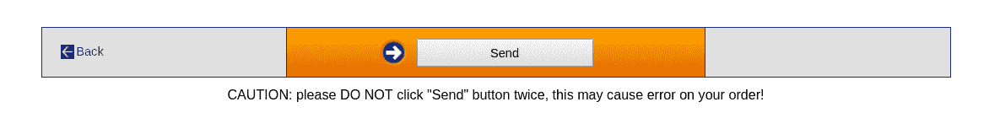

# 第二章：功能性思维 - 第一个例子

在第一章中，*成为功能性 - 几个问题*，我们讨论了 FP 是什么，提到了应用它的一些优势，并列出了一些我们在 JS 中需要的工具...但现在让我们把理论抛在脑后，从考虑一个简单的问题开始，以及如何以功能性的方式解决它。

在这一章中，我们将看到：

+   一个简单的、常见的、与电子商务相关的问题

+   用它们相关的缺陷解决它的几种常见方法

+   通过功能性的方式解决问题的方法

+   一个高阶解决方案，可以应用到其他问题上

+   如何对功能性解决方案进行单元测试

在未来的章节中，我们将回到这里列出的一些主题，所以我们不会深入细节。我们只会展示 FP 如何为我们的问题提供不同的观点，并留下更多细节以后再讨论。

# 问题 - 只做一次某事

让我们考虑一个简单但常见的情况。你开发了一个电子商务网站：用户可以填写他们的购物车，最后，他们必须点击一个“账单”按钮，这样他们的信用卡就会被收费。然而，用户不应该点击两次（或更多），否则他们将被多次计费。

你的应用程序的 HTML 部分可能会有这样的东西：

```js
<button id="billButton" onclick="billTheUser(some, sales, data)">Bill me</button>
```

而且，在你的脚本中，你可能会有类似这样的东西：

```js
function billTheUser(some, sales, data) {
 window.alert("Billing the user...");
 // *actually bill the user*
}
```

直接在 HTML 中分配事件处理程序，就像我做的那样，是不推荐的。相反，在*不显眼*的方式中，你应该通过代码分配处理程序。所以... *说话要做到，不要做到我做的那样*！

这只是对问题和你的网页的一个非常简单的解释，但对我们的目的来说已经足够了。现在让我们考虑一下如何避免重复点击那个按钮... *我们如何能够避免用户点击超过一次？*

# 一些不好的解决方案

好的，你能想到多少种方法来解决我们的问题？让我们讨论几种解决方案，并分析它们的质量。

# 解决方案＃1 - 希望一切顺利！

我们如何解决这个问题？第一个*解决方案*可能看起来像是一个笑话：什么都不做，告诉用户*不要*点击两次，然后希望一切顺利！你的页面可能看起来像图 2.1。

图 2.1\. 页面的实际截图，只是警告您不要点击两次

这是一个回避问题的狡猾方法，但我见过一些网站只是警告用户不要多次点击的风险（见图 2.1），实际上并没有采取任何措施来防止这种情况... *用户被收费两次？我们警告过他们了...这是他们的错！*你的解决方案可能看起来就像下面的代码。

```js
<button id="billButton" onclick="billTheUser(some, sales, data)">Bill me</button>
<b>WARNING: PRESS ONLY ONCE, DO NOT PRESS AGAIN!!</b>
```

好吧，这实际上不是一个解决方案；让我们继续考虑更严肃的提议...

# 解决方案＃2 - 使用全局标志

大多数人可能首先想到的解决方案是使用一些全局变量来记录用户是否已经点击了按钮。你可以定义一个名为`clicked`的标志，初始化为`false`。当用户点击按钮时，如果`clicked`是`false`，你就把它改为`true`，并执行该函数；否则，你根本不做任何事情：

```js
let clicked = false;
.
.
.
function billTheUser(some, sales, data) {
 if (!clicked) {
        clicked = true;
 window.alert("Billing the user...");
 // *actually bill the user*
 }
}
```

关于不使用全局变量的更多好理由，

阅读[`wiki.c2.com/?GlobalVariablesAreBad`](http://wiki.c2.com/?GlobalVariablesAreBad)。

这显然有效，但有几个问题必须解决：

+   你正在使用一个全局变量，你可能会意外地改变它的值。全局变量不是一个好主意，无论是在 JS 还是其他语言中。

+   当用户重新开始购买时，你还必须记得重新将其初始化为`false`。如果你不这样做，用户将无法进行第二次购买，因为支付将变得不可能。

+   你将很难测试这段代码，因为它依赖于外部事物（也就是`clicked`变量）。

所以，这不是一个很好的解决方案...让我们继续思考！

# 解决方案＃3 - 移除处理程序

我们可以采用一种侧面的解决方案，而不是让函数避免重复点击，我们可能只是完全删除点击的可能性：

```js
function billTheUser(some, sales, data) {
    document.getElementById("billButton").onclick = null;
 window.alert("Billing the user...");
 // actually bill the user
}
```

这个解决方案也有一些问题：

+   代码与按钮紧密耦合，因此您将无法在其他地方重用它

+   您必须记住重置处理程序，否则用户将无法进行第二次购买

+   测试也会更加困难，因为您将不得不提供一些 DOM 元素

我们可以稍微改进这个解决方案，并通过在调用中提供后者的 ID 作为额外参数来避免将函数与按钮耦合在一起。（这个想法也可以应用于以下一些解决方案。）HTML 部分将是：

```js
<button
 id="billButton"
    onclick="billTheUser('billButton', some, sales, data)"
>
 Bill me
</button>;
```

（注意额外的参数）和被调用的函数将是：

```js
function billTheUser(buttonId, some, sales, data) {
    document.getElementById(buttonId).onclick = null;
 window.alert("Billing the user...");
 // actually bill the user
}
```

这个解决方案有点好。但是，本质上，我们仍然使用全局元素：不是变量，而是`onclick`值。因此，尽管有增强，这也不是一个很好的解决方案。让我们继续。

# 解决方案＃4-更改处理程序

对先前解决方案的变体将不是删除单击函数，而是改为分配一个新函数。当我们将`alreadyBilled()`函数分配给单击事件时，我们在这里使用函数作为一等对象：

```js
function alreadyBilled() {
 window.alert("Your billing process is running; don't click, please.");
}
```

```js
function billTheUser(some, sales, data) {
    document.getElementById("billButton").onclick = alreadyBilled;
 window.alert("Billing the user...");
 // actually bill the user
}
```

这个解决方案有一个好处：如果用户第二次点击，他们会收到一个警告，不要这样做，但他们不会再次被收费。（从用户体验的角度来看，这更好。）但是，这个解决方案仍然有与前一个相同的异议（代码与按钮耦合在一起，需要重置处理程序，更难的测试），所以我们不认为它很好。 

# 解决方案＃5-禁用按钮

一个类似的想法：不要删除事件处理程序，而是禁用按钮，这样用户就无法单击。您可能会有一个类似以下的函数。

```js
function billTheUser(some, sales, data) {
    document.getElementById("billButton").setAttribute("disabled", "true");
 window.alert("Billing the user...");
 // actually bill the user
}
```

这也有效，但我们仍然对先前的解决方案有异议（将代码与按钮耦合在一起，需要重新启用按钮，更难的测试），所以我们也不喜欢这个解决方案。

# 解决方案＃6-重新定义处理程序

另一个想法：不要改变按钮中的任何内容，让事件处理程序自己改变。诀窍在第二行；通过为`billTheUser`变量分配一个新值，我们实际上动态地改变了函数的功能！第一次调用函数时，它会执行其操作...但它也会通过将其名称赋给一个新函数而使自己消失：

```js
function billTheUser(some, sales, data) {
    billTheUser = function() {};
 window.alert("Billing the user...");
 // *actually bill the user*
}
```

解决方案中有一个特殊的技巧。函数是全局的，所以`billTheUser=...`这一行实际上改变了函数的内部工作方式；从那时起，`billTheUser`将成为新的（空）函数。这个解决方案仍然很难测试。更糟糕的是，您如何恢复`billTheUser`的功能，将其设置回原来的目标？

# 解决方案＃7-使用本地标志

我们可以回到使用标志的想法，但是不要使其全局（这是我们的主要异议），我们可以使用*立即调用的函数表达式（IIFE）*：我们将在第三章中看到更多关于这一点，*从函数开始-核心概念*，以及在第十一章中，*实施设计模式-功能方式*。通过这样做，我们可以使用闭包，因此`clicked`将局部于函数，而不会在任何其他地方可见：

```js
var billTheUser = (clicked => {
 return (some, sales, data) => {
        if (!clicked) {
            clicked = true;
 window.alert("Billing the user...");
 // *actually bill the user*
 }
 };
})(false);
```

看看`clicked`如何从最后的调用中获得其初始值`false`。

这个解决方案沿着全局变量解决方案的思路，但是使用私有的本地变量是一种增强。我们唯一找到的异议是，您将不得不重新设计需要以这种方式工作的每个函数。（正如我们将在下一节中看到的那样，我们的 FP 解决方案在某些方面与它相似。）好吧，这并不难做，但不要忘记*不要重复自己（D.R.Y）*的建议！

# 一个功能性的解决方案

让我们尝试更通用一些：毕竟，要求某个函数或其他函数只执行一次，这并不奇怪，而且可能在其他地方也需要！让我们建立一些原则：

+   原始函数（只能调用一次的函数）应该只执行那件事，而不是其他事情

+   我们不想以任何方式修改原始函数

+   我们需要一个新函数，只能调用原始函数一次

+   我们希望有一个通用解决方案，可以应用于任意数量的原始函数

先前列出的第一个原则是*单一职责原则*（S.O.L.I.D.中的*S*），它规定每个函数应负责单一功能。有关 S.O.L.I.D.的更多信息，请查看*Uncle Bob*（编写了这五个原则的 Robert C. Martin）的文章[`butunclebob.com/ArticleS.UncleBob.PrinciplesOfOod`](http://butunclebob.com/ArticleS.UncleBob.PrinciplesOfOod)。

我们能做到吗？是的；我们将编写一个*高阶函数*，我们将能够将其应用于任何函数，以生成一个只能工作一次的新函数。让我们看看！

# 一个高阶解决方案

如果我们不想修改原始函数，我们将创建一个高阶函数，我们将其有灵感地命名为`once()`。该函数将接收一个函数作为参数，并将返回一个只能工作一次的新函数。（我们将在第六章中看到更多的高阶函数；特别是，请参阅*Doing things once, revisited*部分。）

Underscore 和 LoDash 已经有一个类似的函数，被调用为`_.once()`。Ramda 还提供了`R.once()`，大多数 FP 库都包含类似的功能，因此您不必自己编写它。

我们的`once()`函数方式一开始似乎有些强制，但是当您习惯以 FP 方式工作时，您会习惯这种代码，并发现它非常易懂。

```js
const once = fn => {
 let done = false;
    return (...args) => {
 if (!done) {
 done = true;
            fn(...args);
 }
 };
};
```

让我们来看一下这个函数的一些要点：

+   第一行显示`once()`接收一个函数（`fn()`）作为其参数。

+   我们通过利用闭包定义了一个内部的私有`done`变量，就像之前的解决方案#7 一样。我们选择*不*将其称为`clicked`，因为您不一定需要点击按钮才能调用该函数；我们选择了一个更通用的术语。

+   `return (...args) => ...`这一行表示`once()`将返回一个带有一些（0、1 或更多）参数的函数。请注意，我们正在使用我们在第一章中看到的扩展语法，*成为函数式 - 几个问题*。在较旧版本的 JS 中，您必须使用`arguments`对象；有关更多信息，请参阅[`developer.mozilla.org/en/docs/Web/JavaScript/Reference/Functions/arguments`](https://developer.mozilla.org/en/docs/Web/JavaScript/Reference/Functions/arguments)。ES8 的方式更简单更短！

+   在调用`fn()`之前，我们先赋值`done = true`，以防该函数抛出异常。当然，如果您不想在函数成功结束之前禁用该函数，那么您可以将赋值移到`fn()`调用的下面。

+   设置完成后，我们最终调用原始函数。请注意使用扩展运算符传递原始`fn()`的任何参数。

那么我们该如何使用它呢？我们甚至不需要将新生成的函数存储在任何地方；我们可以简单地编写`onclick`方法，如下所示：

```js
<button id="billButton" onclick="once(billTheUser)(some, sales, data)">
 Bill me
</button>;
```

请注意语法！当用户点击按钮时，使用`(some, sales, data)`参数调用的函数不是`billTheUser()`，而是使用`billTheUser`作为参数调用`once()`的结果。该结果只能被调用一次。

请注意，我们的`once()`函数使用函数作为一等对象、箭头函数、闭包和展开操作符；回到第一章，*成为函数式编程 - 几个问题*，我们说我们会需要这些，所以我们信守承诺！我们在这一章中唯一缺少的是递归...但正如滚石乐队唱的那样，*你并不总是能得到你想要的！*

# 手动测试解决方案

我们可以运行一个简单的测试：

```js
const squeak = a => console.log(a, " squeak!!");
squeak("original"); // "original squeak!!"
squeak("original"); // "original squeak!!" squeak("original"); // "original squeak!!" const squeakOnce = once(squeak);
squeakOnce("only once"); // "only once squeak!!"
squeakOnce("only once"); // no output
squeakOnce("only once"); // no output
```

在 CodePen 上查看结果，或者查看图 2.2：

图 2.2 - 测试我们的 once()高阶函数

# 自动测试解决方案

手动运行测试不好；它会变得烦人、无聊，久而久之，就不再运行测试了。让我们做得更好一些，用 Jasmine 编写一些自动测试。按照[`jasmine.github.io/pages/getting_started.html`](https://jasmine.github.io/pages/getting_started.html)上的说明，我设置了一个独立的运行器：

```js
<!DOCTYPE html> <html> <head>
  <meta  charset="utf-8">
  <title>Jasmine Spec Runner v2.6.1</title>

 <link  rel="shortcut icon"  type="image/png"  href="lib/jasmine-2.6.1/jasmine_favicon.png">
  <link  rel="stylesheet"  href="lib/jasmine-2.6.1/jasmine.css">

  <script  src="lib/jasmine-2.6.1/jasmine.js"></script>
  <script  src="lib/jasmine-2.6.1/jasmine-html.js"></script>
  <script  src="lib/jasmine-2.6.1/boot.js"></script>

  <script  src="src/once.js"></script>
  <script  src="tests/once.test.1.js"></script> </head> <body> </body> </html>
```

`src/once.js`文件中有我们刚刚看到的`once()`定义，`tests/once.test.js`中有实际的测试套件：

```js
describe("once", () => {
 beforeEach(() => {
 window.myFn = () => {};
 spyOn(window, "myFn");
 });

 it("without 'once', a function always runs", () => {
 myFn();
 myFn();
 myFn();
 expect(myFn).toHaveBeenCalledTimes(3);
 });

 it("with 'once', a function runs one time", () => {
 window.onceFn = once(window.myFn);
 spyOn(window, "onceFn").and.callThrough();
 onceFn();
 onceFn();
 onceFn();
 expect(onceFn).toHaveBeenCalledTimes(3);
 expect(myFn).toHaveBeenCalledTimes(1);
 });
});
```

这里有几点需要注意：

+   为了监听一个函数，它必须与一个对象相关联。（或者，你也可以直接使用 Jasmine 的`.createSpy()`方法直接创建一个 spy。）全局函数与 window 对象相关联，所以`window.fn`是一种说法，即`fn`实际上是全局的。

+   当你对一个函数进行监听时，Jasmine 会拦截你的调用并注册函数被调用的次数、使用的参数以及调用的次数。所以，就我们所关心的而言，`window.fn`可以简单地是`null`，因为它永远不会被执行。

+   第一个测试只检查如果我们多次调用函数，它会被调用相应的次数。这很琐碎，但如果这没有发生，我们肯定做错了什么！

+   在第二组测试中，我们想要看到`once()`函数(`window.onceFn()`)被调用，但只调用一次。所以，我们告诉 Jasmine 监听`onceFn`，但让调用通过。对`fn()`的任何调用也会被计数。在我们的情况下，尽管调用了`onceFn()`三次，`fn()`只被调用了一次，这是我们预期的。

我们可以在图 2.3 中看到结果：

图 2.3 - 在 Jasmine 上运行自动测试我们的函数

# 一个更好的解决方案

在之前的解决方案中，我们提到每次第一次之后都做一些事情而不是默默地忽略用户的点击是一个好主意。我们将编写一个新的高阶函数，它接受第二个参数；一个从第二次调用开始每次都要调用的函数：

```js
const onceAndAfter = (f, g) => {
 let done = false;
 return (...args) => {
 if (!done) {
 done = true;
 f(...args);
        } else {
 g(...args);
 }
 };
};
```

我们已经在高阶函数中更进一步；`onceAndAfter`接受*两个*函数作为参数，并产生一个包含另外两个函数的第三个函数。

你可以通过为`g`提供一个默认值来使`onceAndAfter`更加强大，类似于`const onceAndAfter = (f, g = ()=>{})`...所以如果你不想指定第二个函数，它仍然可以正常工作，因为它会调用一个*什么都不做*的函数，而不是引起错误。

我们可以进行一个快速而简单的测试，与之前我们做的类似：

```js
const squeak = (x) => console.log(x, "squeak!!");
const creak = (x) => console.log(x, "creak!!");
const makeSound = onceAndAfter(squeak, creak);
makeSound("door"); // "door squeak!!"
makeSound("door"); // "door creak!!"
makeSound("door"); // "door creak!!"
makeSound("door"); // "door creak!!"
```

为这个新函数编写测试并不难，只是有点长：

```js
describe("onceAndAfter", () => {
 it("should call the first function once, and the other after", () => {
 func1 = () => {};
 spyOn(window, "func1");
 func2 = () => {};
 spyOn(window, "func2");
 onceFn = onceAndAfter(func1, func2);

 onceFn();
 expect(func1).toHaveBeenCalledTimes(1);
 expect(func2).toHaveBeenCalledTimes(0);

 onceFn();
 expect(func1).toHaveBeenCalledTimes(1);
 expect(func2).toHaveBeenCalledTimes(1);

 onceFn();
 expect(func1).toHaveBeenCalledTimes(1);
 expect(func2).toHaveBeenCalledTimes(2);

 onceFn();
 expect(func1).toHaveBeenCalledTimes(1);
 expect(func2).toHaveBeenCalledTimes(3);
 });
});
```

请注意，我们总是检查`func1`只被调用一次。同样，我们检查`func2`；调用次数从零开始（`func1`被调用的时间），然后每次调用都会增加一次。

# 问题

2.1\. **没有额外的变量**：我们的函数式实现需要使用一个额外的变量`done`来标记函数是否已经被调用。这并不重要...但你能在不使用任何额外变量的情况下做到吗？请注意，我们并没有告诉你*不*使用任何变量；这只是一个不添加新变量，比如`done`，只是一个练习！

2.2\. **交替函数**：在我们的`onceAndAfter()`函数的精神下，你能否编写一个`alternator()`高阶函数，它接受两个函数作为参数，并在每次调用时交替调用一个和另一个？预期的行为应该如下例所示：

```js
 let sayA = () => console.log("A");
 let sayB = () => console.log("B");

 let alt = alternator(sayA, sayB);
 alt(); // *A*
 alt(); // *B*
 alt(); // *A*
 alt(); // *B*
 alt(); // *A*
 alt(); // *B*
```

2.3\. **一切都有限制！**：作为`once()`的扩展，你能否编写一个高阶函数`thisManyTimes(fn,n)`，让你可以调用`fn()`函数最多`n`次，但之后不做任何操作？举个例子，`once(fn)`和`thisManyTimes`(fn,1)会产生完全相同行为的函数。

# 总结

在这一章中，我们看到了一个常见的简单问题，基于一个真实的情况，并在分析了几种通常的解决方法之后，我们选择了一个*功能性思维*的解决方案。我们看到了如何将 FP 应用到我们的问题上，我们还找到了一个更一般的高阶方法，我们可以将其应用到类似的问题上，而无需进行进一步的代码更改。我们看到了如何为我们的代码编写单元测试，以完成开发工作。最后，我们甚至提出了一个更好的解决方案（从用户体验的角度来看），并看到了如何编写代码以及如何对其进行单元测试。

在下一章第三章中，*从函数开始-核心概念*，我们将更深入地探讨函数，这是所有 FP 的核心。
