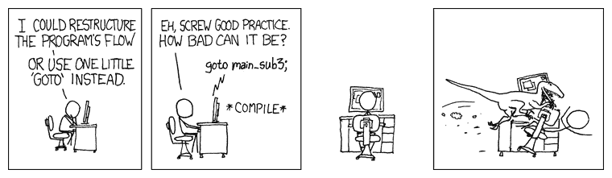

# 第三章：开始学习函数 - 一个核心概念

在第二章中，*函数式思维 - 第一个例子*，我们讨论了一个函数式思维的例子，但现在让我们回到基础，复习一下函数。在第一章中，*成为函数式 - 几个问题*，我们提到两个重要的 JS 特性是函数作为一等对象和闭包。现在，在这一章中，让我们：

+   检查 JS 中定义函数的一些关键方式

+   详细讨论箭头函数，它们是最接近 lambda 演算函数的

+   介绍*currying*的概念

+   重新审视函数作为一等对象的概念

我们还将考虑几种函数式编程技术，比如：

+   注入，根据不同策略进行排序和其他用途

+   回调和 promises，引入*continuation passing* 风格

+   *Polyfilling* 和 *stubbing*

+   立即调用方案

# 关于函数的一切

让我们从 JS 中函数的简要回顾和它们与函数式编程概念的关系开始。我们可以从我们在之前章节提到的东西开始，关于函数作为一等对象，然后继续讨论它们在 JS 中的使用。

# 关于 lambda 和函数

用 lambda 演算的术语来看，一个函数可以看起来像*λx.2*x*。理解的是，*λ* 字符后面的变量是函数的参数，点后面的表达式是你将要替换为传递的任何值的地方。

如果你有时想知道参数和实参之间的区别，一些头韵的助记词可能会有所帮助：*Parameters are Potential, Arguments are Actual.* 参数是潜在值的占位符，将要传递的值，而实参是传递给函数的实际值。

应用一个函数意味着你向它提供一个实际的参数，并且通常是用括号来表示。例如，*(λx.2*x)(3)* 将被计算为 6。这些 lambda 函数在 JS 中的等价物是什么？这是一个有趣的问题！有几种定义函数的方式，并且并非所有的方式都有相同的含义。

一篇很好的文章展示了定义函数、方法等的多种方式，是*JavaScript 中函数的多种面孔*，由 Leo Balter 和 Rick Waldron 撰写，网址是[`bocoup.com/blog/the-many-faces-of-functions-in-javascript`](https://bocoup.com/blog/the-many-faces-of-functions-in-javascript)--去看看吧！

在 JS 中你可以用多少种方式定义一个函数？答案是，*可能比你想象的要多！* 至少，你可以写：

+   一个命名的函数声明：`function first(...) {...};`

+   一个匿名函数表达式：`var second = function(...) {...};`

+   一个命名的函数表达式：`var third = function someName(...) {...};`

+   一个立即调用的表达式：`var fourth = (function() { ...; return function(...) {...}; })();`

+   一个函数构造器：`var fifth = new Function(...);`

+   一个箭头函数：`var sixth = (...) => {...};`

如果你愿意的话，你还可以添加对象方法声明，因为它们实际上也意味着函数，但这已经足够了。

JS 还允许定义生成器函数，如`function*(...) {...}`，实际上返回一个`Generator`对象，以及真正是生成器和 promises 混合的`async`函数。我们不会使用这些类型的函数，但是可以在[`developer.mozilla.org/en/docs/Web/JavaScript/Reference/Statements/function*`](https://developer.mozilla.org/en/docs/Web/JavaScript/Reference/Statements/function*)和[`developer.mozilla.org/en-US/docs/Web/JavaScript/Reference/Statements/async_function`](https://developer.mozilla.org/en-US/docs/Web/JavaScript/Reference/Statements/async_function)了解更多--它们在其他情境中可能会有用。

所有这些定义函数的方式之间的区别是什么，为什么我们要在意？让我们一一讨论：

+   第一个定义，使用`function`关键字作为独立声明，可能是 JS 中最常用的方式，并定义了一个名为`first`的函数（即`first.name=="first"`）。由于*变量提升*，这个函数将在定义它的作用域中随处可访问。

在[`developer.mozilla.org/en-US/docs/Glossary/Hoisting`](https://developer.mozilla.org/en-US/docs/Glossary/Hoisting)上阅读更多关于变量提升的内容，并记住它只适用于声明，而不适用于初始化。

+   第二个定义，将函数赋值给一个变量，也会产生一个函数，但是是一个*匿名*的函数（即没有名称）。然而，许多 JS 引擎能够推断名称应该是什么，并设置`second.name=="second"`（检查下面的代码，显示了匿名函数没有被分配名称的情况）。由于赋值不会被提升，函数只有在赋值执行后才能访问。此外，你可能更喜欢用`const`来定义变量，而不是`var`，因为你不应该改变这个函数：

```js
var second = function() {};
console.log(second.name);
// "second"

var myArray = new Array(3);
myArray[1] = function() {};
console.log(myArray[1].name);
// ""
```

+   第三个定义与第二个相同，只是函数现在有了自己的名称：`third.name === "someName"`。

函数的名称在你想要调用它时是相关的，如果你计划进行递归调用也是相关的；我们将在第九章*Designing Functions - Recursion*中回到这一点。如果你只是想要一个用于回调的函数，你可以不用名称。但是请注意，命名函数在错误回溯中更容易被识别。

+   第四个定义，使用立即调用的表达式，让你可以使用闭包。内部函数可以以完全私有、封装的方式使用外部函数中定义的变量或其他函数。回到我们在第一章的*Closures*部分看到的计数器制作函数，我们可以写出以下内容：

```js
var myCounter = (function(initialValue = 0) {
    let count = initialValue;
 return function() {
        count++;
 return count;
 };
})(77);

myCounter(); // 78
myCounter(); // 79
myCounter(); // 80
```

仔细研究代码：外部函数接收一个参数（在这种情况下是 77），这个参数被用作`count`的初始值（如果没有提供初始值，我们从零开始）。内部函数可以访问`count`（因为闭包的原因），但是这个变量在其他地方是无法访问的。在所有方面，返回的函数是一个普通的函数；唯一的区别是它可以访问私有元素。这也是*module*模式的基础。

+   第五个定义是不安全的，你不应该使用它！你传递参数名称，然后将实际的函数体作为最后一个参数的字符串传递--并且使用了`eval()`的等价物来创建函数，这可能会导致许多危险的黑客攻击，所以不要这样做！只是为了激发你的好奇心，让我们看一个例子，重写我们在第一章的*Spread*部分中看到的非常简单的`sum3()`函数：

```js
var sum3 = new Function("x", "y", "z", "var t = x+y+z; return t;");
sum3(4, 6, 7); // 17
```

这种定义不仅不安全，而且还有一些其他怪癖，比如不会在创建上下文中创建闭包，而且总是全局的。查看[`developer.mozilla.org/en-US/docs/Web/JavaScript/Reference/Global_Objects/Function`](https://developer.mozilla.org/en-US/docs/Web/JavaScript/Reference/Global_Objects/Function)了解更多信息，但请记住，使用这种方式创建函数不是一个好主意！

+   最后，使用箭头`=>`定义的最紧凑的方式来定义函数，我们将尽可能地尝试使用这种方式。我们将在下一节详细介绍。

# 箭头函数 - 现代的方式

即使箭头函数基本上与其他函数一样工作，但是与普通函数有一些重要的区别。这些函数可以隐式返回一个值，`this`的值不会被绑定，也没有`arguments`对象。让我们来看看这三点。

还有一些额外的区别：箭头函数不能用作构造函数，它们没有`prototype`属性，也不能用作生成器，因为它们不允许使用`yield`关键字。有关这些点的更多细节，请参阅[`developer.mozilla.org/en-US/docs/Web/JavaScript/Reference/Functions/Arrow_functions#No_binding_of_this`](https://developer.mozilla.org/en-US/docs/Web/JavaScript/Reference/Functions/Arrow_functions#No_binding_of_this)。

# 返回值

在 lambda 风格中，函数只包括一个结果。为了简洁起见，新的箭头函数提供了这种语法。当你写类似`(x,y,z) =>`的表达式时，会隐含一个返回。例如，以下两个函数实际上与我们之前展示的`sum3()`函数做的事情是一样的：

```js
const f1 = (x, y, z) => x + y + z;

const f2 = (x, y, z) => {
    return x + y + z;
};
```

如果你想返回一个对象，那么你必须使用括号，否则 JS 会认为代码是有意义的。

“风格问题：当你用只有一个参数定义箭头函数时，你可以省略它周围的括号。为了一致性，我更喜欢总是包括它们。然而，我使用的格式化工具，prettier，不赞成。随意选择你的风格！”

# 处理 this 值

JS 的一个经典问题是处理`this`的方式--它的值并不总是你期望的那样。ES2015 通过箭头函数解决了这个问题，它们继承了正确的`this`值，因此避免了问题。要看一个可能出现问题的例子，在下面的代码中，当超时函数被调用时，`this`将指向全局（`window`）变量，而不是新对象，所以你会在控制台中得到一个*未定义*：

```js
function ShowItself1(identity) {
 this.identity = identity;
 setTimeout(function() {
 console.log(this.identity);
 }, 1000);
}

var x = new ShowItself1("Functional");
// *after one second, **undefined** is displayed*
```

有两种经典的解决方法，使用老式的 JS5，以及箭头函数的工作方式：

+   一种解决方案使用了闭包，并定义了一个本地变量（通常命名为`that`或者有时是`self`），它将获得`this`的原始值，这样它就不会是未定义的

+   第二种方法使用`.bind()`，所以超时函数将绑定到正确的`this`值。

+   第三种更现代的方式只是使用箭头函数，所以`this`会得到正确的值（指向对象）而无需其他操作

我们还将使用`.bind()`。请参见 lambda 和 eta 部分。

让我们看看实际代码中的三种解决方案：

```js
function ShowItself2(identity) {
 this.identity = identity;
    let that = this;
 setTimeout(function() {
 console.log(that.identity);
 }, 1000);

 setTimeout(
 function() {
 console.log(this.identity);
 }.bind(this),
 2000
 );

 setTimeout(() => {
 console.log(this.identity);
 }, 3000);
}

var x = new ShowItself2("JavaScript");
// *after one second, "JavaScript"*
// *after another second, the same*
// *after yet another second, once again*
```

# 处理参数

在第一章中，*成为功能性-几个问题*，和第二章中，*思考功能性-第一个例子*，我们看到了一些使用扩展（`...`）运算符的用法。然而，我们将要做的最实际的用法，与处理参数有关；我们将在第六章中看到一些这方面的案例，*生成函数-高阶函数*。让我们回顾一下我们的`once()`函数：

```js
const once = func => {
 let done = false;
 return (...args) => {
 if (!done) {
 done = true;
 func(...args);
 }
 };
};
```

为什么我们要写`return (...args) =>`，然后是`func(...args)`？关键在于处理可变数量（可能为零）的参数的更现代方式。在旧版本的 JS 中，你是如何处理这种代码的？答案与`arguments`对象有关（*不是*数组！），它允许你访问传递给函数的实际参数。

有关更多信息，请阅读[`developer.mozilla.org/en/docs/Web/JavaScript/Reference/Functions/arguments.`](https://developer.mozilla.org/en/docs/Web/JavaScript/Reference/Functions/arguments)

在 JS5 及更早版本中，如果我们希望函数能够处理任意数量的参数，我们必须编写以下代码：

```js
function somethingElse() {
 // *get arguments and do something*
}

function listArguments() {
 console.log(arguments);
 var myArray = Array.prototype.slice.call(arguments);
 console.log(myArray);
 somethingElse.apply(null, myArray);
}

listArguments(22, 9, 60);
// (3) [22, 9, 60, callee: function, Symbol(Symbol.iterator): function]
// (3) [22, 9, 60]
```

第一个日志显示`arguments`实际上是一个对象；第二个日志对应一个简单的数组。另外，注意调用`somethingElse()`所需的复杂方式，需要使用`.apply()`。

在 ES8 中等价的代码是什么？答案要简短得多，这就是为什么我们将在整个文本中看到使用扩展运算符的几个例子：

```js
function listArguments2(...args) {
 console.log(args);
 somethingElse(...args);
}

listArguments2(12, 4, 56);
// (3) [12, 4, 56]
```

要记住的要点是：

+   通过编写`listArguments2(...args)`，我们立即并清楚地表达了我们的新函数接收多个（可能为零）参数。

+   你无需做任何事情就可以得到一个数组。控制台日志显示`args`确实是一个数组，不需要进一步操作。

+   编写`somethingElse(...args)`比之前必须使用的替代方法（使用`.apply()`）更清晰。

顺便说一下，ES8 中仍然可以使用`arguments`对象。如果你想从中创建一个数组，有两种替代方法可以做到，而不必使用`Array.prototype.slice.call`的技巧：

+   使用`.from()`方法，并写`var myArray=Array.from(arguments)`

+   或者更简单地说，比如`var myArray=[...arguments]`，这展示了扩展操作符的另一种用法。

当我们涉及到高阶函数时，编写处理其他函数的函数，可能具有未知数量的参数，将会很普遍。ES8 提供了一种更简洁的方法来做到这一点，这就是为什么你必须习惯这种用法；这是值得的！

# 一个参数还是多个参数？

还可以编写返回函数的函数，在第六章中，我们将看到更多的这种情况。例如，在 lambda 演算中，你不会写带有多个参数的函数，而只会使用一个参数，通过应用一种叫做“柯里化”的东西（为什么要这样做？先留着这个想法；我们会讲到的）。

柯里化得名于哈斯克尔·柯里，他发展了这个概念。请注意，他也因函数式编程语言*Haskell*的名字而被铭记；双重认可！

例如，我们之前看到的对三个数字求和的函数，将被写成如下形式：

```js
const altSum3 = x => y => z => x + y + z;
```

为什么我改变了函数的名字？简单地说，因为这与之前的函数*不*相同。尽管它可以用来产生与我们之前函数完全相同的结果，但它在一个重要的方面有所不同：你如何使用它？比如，对数字 1、2 和 3 求和？你将不得不写成：

```js
altSum3(1)(2)(3); // 6
```

在继续阅读之前先自我测试一下，并思考一下：如果你写成`altSum3(1,2,3)`会返回什么？

提示：它不会是一个数字！要获得完整答案，请继续阅读。

这是如何工作的？分开多次调用可能会有所帮助；这是 JS 解释器实际计算前面表达式的方式：

```js
let fn1 = altSum3(1);
let fn2 = fn1(2);
let fn3 = fn2(3);
```

从功能上来说！调用`altSum3(1)`的结果，根据定义，是一个函数，由于闭包的原因，等效于：

```js
let fn1 = y => z => 1 + y + z;
```

我们的`altSum3()`函数旨在接收一个参数，而不是三个！这次调用的结果`fn1`也是一个单参数函数。当你执行`fn1(2)`时，结果再次是一个函数，同样只有一个参数，等效于：

```js
let fn2 = z => 1 + 2 + z;
```

当你计算`fn2(3)`时，最终返回一个值；太好了！正如我们所说，这个函数做的是我们之前看到的相同类型的计算，但是以一种内在不同的方式。

你可能会认为柯里化只是一个奇特的技巧：谁会只想使用单参数函数呢？当我们考虑如何在第八章中连接函数-流水线和组合，或者第十二章中构建更好的容器-函数数据类型时，你会明白这样做的原因，下一步传递多个参数将不可行。

# 函数作为对象

“头等对象”的概念意味着函数可以被创建、分配、更改、作为参数传递，或者作为其他函数的结果返回，就像你可以对待数字或字符串一样。让我们从它们的定义开始。当你以通常的方式定义一个函数时：

```js
function xyzzy(...) { ... }
```

这（几乎）等同于写成：

```js
var xyzzy = function(...) { ... }
```

除了*hoisting*。JS 将所有定义移动到当前范围的顶部，但不包括赋值；因此，使用第一个定义，您可以从代码的任何位置调用`xyzzy(...)`，但使用第二个定义，直到执行赋值之后才能调用该函数。

看到与巨型洞穴冒险游戏的类似之处了吗？在任何地方调用`xyzzy(...)`并不总是有效！如果您从未玩过这个著名的互动小说游戏，请尝试在线游戏--例如，在[`www.web-adventures.org/cgi-bin/webfrotz?s=Adventure`](http://www.web-adventures.org/cgi-bin/webfrotz?s=Adventure)或[`www.amc.com/shows/halt-and-catch-fire/colossal-cave-adventure/landing`](http://www.amc.com/shows/halt-and-catch-fire/colossal-cave-adventure/landing)。

我们想要表达的观点是，函数可以分配给变量--并且如果需要，还可以重新分配。同样，我们可以在需要时*现场*定义函数。我们甚至可以在不命名它们的情况下执行此操作：与常见表达式一样，如果仅使用一次，则不需要命名它或将其存储在变量中。

# 一个 React+Redux 减速器

我们可以看到另一个涉及分配函数的例子。正如我们在本章前面提到的，React+Redux 通过分派由减速器处理的操作来工作。通常，减速器包括带有开关的代码：

```js
function doAction(state = initialState, action) {
 let newState = {};
 switch (action.type) {
 case "CREATE":
 // *update state, generating newState,*
 // *depending on the action data*
 // *to create a new item*
 return newState;
 case "DELETE":
 // *update state, generating newState,*
 // *after deleting an item*
 return newState;
 case "UPDATE":
 // *update an item,*
 // *and generate an updated state*
 return newState;
 default:
 return state;
 }
}
```

为`state`提供`initialState`作为默认值是初始化全局状态的简单方法。不要注意这个默认值；对于我们的示例来说并不重要，我只是为了完整性而包含它。

通过利用存储函数的可能性，我们可以构建一个*调度表*并简化前面的代码。首先，我们将使用每种操作类型的函数代码初始化一个对象。基本上，我们只是采用前面的代码，并创建单独的函数：

```js
const dispatchTable = {
 CREATE: (state, action) => {
 // *update state, generating newState,*
 // *depending on the action data*
 // *to create a new item*
 return newState;
 },
 DELETE: (state, action) => {
 // *update state, generating newState,*
 // *after deleting an item*
 return newState;
 },
 UPDATE: (state, action) => {
 // *update an item,*
 // *and generate an updated state*
 return newState;
 }
};
```

我们已经将处理每种类型的操作的不同函数存储为对象中的属性，该对象将作为调度表。该对象仅创建一次，并且在应用程序执行期间保持不变。有了它，我们现在可以用一行代码重写操作处理代码：

```js
function doAction2(state = initialState, action) {
 return dispatchTable[action.type]
 ? dispatchTableaction.type
 : state;
}
```

让我们来分析一下：给定操作，如果`action.type`与调度对象中的属性匹配，我们执行相应的函数，该函数取自存储它的对象。如果没有匹配，我们只需返回当前状态，就像 Redux 要求的那样。如果我们不能处理函数（存储和调用它们）作为一等对象，这种代码是不可能的。

# 一个不必要的错误

然而，通常会有一个常见的（尽管实际上是无害的）错误。您经常会看到这样的代码：

```js
fetch("some/remote/url").then(function(data) {
 processResult(data);
});
```

这段代码是做什么的？这个想法是获取远程 URL，并在数据到达时调用一个函数--这个函数本身调用`processResult`并将`data`作为参数。也就是说，在`then()`部分，我们希望一个函数，给定`data`，计算`processResult(data)`...我们已经有这样一个函数了吗？

一点点理论：在λ演算术语中，我们将λx.func x 替换为一个函数--这称为 eta 转换，更具体地说是 eta 缩减。（如果您要以另一种方式进行操作，那将是 eta 抽象。）在我们的情况下，这可以被认为是一种（非常非常小的！）优化，但它的主要优势是更短，更紧凑的代码。

基本上，我们可以应用的规则是，每当您看到以下内容时： 

```js
function someFunction(someData) { 
 return someOtherFunction(someData);
}
```

您可以用`someOtherFunction`替换它。因此，在我们的示例中，我们可以直接写下面的内容：

```js
fetch("some/remote/url").then(processResult);
```

这段代码与以前的方式完全相同（或者，由于避免了一个函数调用，可能稍微更快），但更容易理解...或者不是？

这种编程风格称为 pointfree 风格或*暗示*风格，其主要特点是您从不为每个函数应用指定参数。这种编码方式的优势在于，它有助于编写者（以及代码的未来读者）思考函数本身及其含义，而不是在低级别上处理数据并与之一起工作。在较短的代码版本中，没有多余或无关的细节：如果您了解所调用的函数的作用，那么您就了解了完整代码的含义。在我们的文本中，我们通常（但不一定总是）以这种方式工作。

Unix/Linux 用户可能已经习惯了这种风格，因为当他们使用管道将命令的结果作为输入传递给另一个命令时，他们就以类似的方式工作。当您编写类似 ls | grep doc | sort 的内容时，ls 的输出是 grep 的输入，后者的输出是 sort 的输入--但是输入参数没有写在任何地方；它们是暗示的。我们将在第八章的*PointFree Style*部分中回到这一点，*连接函数 - 管道和组合*。

# 使用方法

然而，有一种情况您应该注意：如果您正在调用对象的方法会发生什么？如果您的原始代码是这样的：

```js
fetch("some/remote/url").then(function(data) {
 myObject.store(data);
});
```

然后，看似明显的转换后的代码会失败：

```js
fetch("some/remote/url").then(myObject.store);
```

为什么？原因是在原始代码中，调用的方法绑定到一个对象（`myObject`），但在修改后的代码中，它没有绑定，它只是一个`free`函数。然后我们可以通过使用`bind()`以简单的方式来修复它：

```js
fetch("some/remote/url").then(myObject.store.bind(myObject));
```

这是一个通用解决方案。处理方法时，您不能只是分配它；您必须使用`.bind(`以便正确的上下文可用。像这样的代码：

```js
function doSomeMethod(someData) { 
 return someObject.someMethod(someData);
}
```

应该转换为：

```js
const doSomeMethod = someObject.someMethod.bind(someObject);
```

在[`developer.mozilla.org/en/docs/Web/JavaScript/Reference/Global_objects/Function/bind`](https://developer.mozilla.org/en/docs/Web/JavaScript/Reference/Global_objects/Function/bind)上阅读有关`.bind()`的更多信息。

这看起来相当笨拙，不太优雅，但是这是必需的，以便方法将与正确的对象关联。我们将在第六章中看到这种应用，*生成函数 - 高阶函数*。即使这段代码看起来不太好看，但是每当您必须使用对象（记住，我们并没有说我们会尝试完全 FP 代码，并且如果其他构造使事情变得更容易，我们将接受其他构造）时，您必须记住在以 pointfree 风格传递它们之前绑定方法。

# 使用 FP 方式的函数

实际上有几种常见的编码模式实际上利用了 FP 风格，即使您不知道。让我们来看看它们，并指出代码的功能方面，这样您就可以更加习惯这种编码风格。

# 注入 - 整理它

`Array.prototype.sort()`方法提供了将函数作为参数传递的第一个示例。如果您有一个字符串数组，并且想对其进行排序，您可以使用以下代码。例如，要按字母顺序对彩虹颜色数组进行排序：

```js
var colors = [
 "violet",
 "indigo",
 "blue",
 "green",
 "yellow",
 "orange",
 "red"
];
colors.sort();
console.log(colors);
// *["blue", "green", "indigo", "orange", "red", "violet", "yellow"]*
```

请注意，我们不必为`.sort()`调用提供任何参数，但数组被完美地排序了。默认情况下，此方法根据其 ASCII 内部表示对字符串进行排序。因此，如果您使用此方法对数字数组进行排序，它将失败，因为它将决定 20 必须介于 100 和 3 之间，因为*100*在*20*之前--被视为字符串！--而后者在*3*之前...这需要修复！下面的代码显示了问题。

```js
var someNumbers = [3, 20, 100];
someNumbers.sort();
console.log(someNumbers);
// ***[100, 20, 3]***
```

但是，让我们暂时忘记数字，继续排序字符串。我们要问自己：如果我们想按适当的区域设置规则对一些西班牙单词（*palabras*）进行排序，会发生什么？我们将对字符串进行排序，但结果无论如何都不正确：

```js
var palabras = ["ñandú", "oasis", "mano", "natural", "mítico", "musical"];
palabras.sort();
console.log(palabras);
// *["mano", "musical", "mítico", "natural", "oasis", "ñandú"]* -- ***wrong result***!
```

对于语言或生物学爱好者，英文中的`"ñandú"`是`"rhea"`，一种类似鸵鸟的奔跑鸟。以`"ñ"`开头的西班牙语单词并不多，我们碰巧在我的国家乌拉圭有这些鸟，所以这就是这个奇怪单词的原因！

糟糕！在西班牙语中，`"ñ"`位于`"n"`和`"o"`之间，但`"ñandú"`最终被排序。此外，`"mítico"`（英文中为`"mythical"`；请注意带重音的`"i"`）应该出现在`"mano"`和`"musical"`之间，因为应该忽略波浪号。解决这个问题的适当方法是为`sort()`提供一个比较函数。在这种情况下，我们可以使用`localeCompare()`方法：

```js
palabras.sort((a, b) => a.localeCompare(b, "es"));
console.log(palabras);
// *["mano", "mítico", "musical", "natural", "ñandú", "oasis"]*
```

`a.localeCompare(b,"es")`调用比较字符串`a`和`b`，如果`a`应该在`b`之前，则返回负值，如果`a`应该在`b`之后，则返回正值，如果`a`和`b`相同，则返回 0--但是，根据西班牙（`"es"`）排序规则。现在事情变得正确了！通过引入一个易懂的名称的新函数，代码可能会变得更清晰：

```js
const spanishComparison = (a, b) => a.localeCompare(b, "es");

palabras.sort(spanishComparison);
// *sorts the palabras array according to Spanish rules:*
// *["mano", "mítico", "musical", "natural", "ñandú", "oasis"]*
```

在接下来的章节中，我们将讨论 FP 如何让您以更声明式的方式编写代码，生成更易理解的代码，这种小的改变有所帮助：代码的读者在到达排序时，即使没有注释，也会立即推断出正在做什么。

通过注入不同的比较函数来改变`sort()`函数的工作方式，实际上是*策略*设计模式的一个案例。我们将在第十一章中看到更多关于这一点的内容，*实现设计模式-函数式方法*。

以参数形式提供排序函数（以非常 FP 的方式！）还可以帮助解决其他一些问题，例如：

+   `sort()`只适用于字符串。如果要对数字进行排序（就像我们之前尝试的那样），您必须提供一个进行数字比较的函数。例如，您可以编写类似`myNumbers.sort((a,b) => a-b)`的东西

+   如果要按给定属性对对象进行排序，您将使用一个与之进行比较的函数。例如，您可以按年龄对人进行排序，类似于`myPeople.sort((a,b) => a.age - b.age)`的方式

有关`localeCompare()`的更多可能性，请参阅[`developer.mozilla.org/en/docs/Web/JavaScript/Reference/Global_Objects/String/localeCompare`](https://developer.mozilla.org/en/docs/Web/JavaScript/Reference/Global_Objects/String/localeCompare)。您可以指定要应用的区域设置规则，要放置大写/小写字母的顺序，是否忽略标点符号等等--但要小心；并非所有浏览器都支持所需的额外参数。

这是一个简单的例子，您可能以前使用过--但毕竟是 FP 模式。让我们继续讨论函数作为参数的更常见用法，当您进行 Ajax 调用时。

# 回调，承诺和继续

可能是将函数作为一等对象使用的最常见例子与回调和承诺有关。在 Node.JS 中，读取文件是通过类似以下方式异步完成的：

```js
const fs = require("fs");
fs.readFile("someFile.txt", (err, data) => {
 if (err) {
 console.error(err); // *or throw an error, or otherwise handle the problem*
 } else {
 console.log(data.toString());
 }
});
```

`readFile()`函数需要一个回调，在这个例子中只是一个匿名函数，当文件读取操作完成时调用。

使用更现代的编程风格，您可以使用承诺或 async/await。例如，在进行 Ajax 网络服务调用时，使用更现代的`fetch()`函数，您可以编写类似以下代码的内容：

```js
fetch("some/remote/url")
    .then(data => {
 // *Do some work with the returned data*
 })
    .catch(error => {
 // *Process all errors here*
 });
```

请注意，如果您定义了适当的`processData(data)`和`processError(error)`函数，代码可以缩短为`fetch("some/remote/url").then(processData).catch(processError)`，就像我们之前看到的那样。

# Continuation Passing Style

在前面的代码中，您调用一个函数，同时传递另一个函数，该函数在输入/输出操作完成时将被执行，可以被视为 CPS - *Continuation Passing Style*的一种情况。这种编码方式是什么？一个解释方式是，如果使用`return`语句是被禁止的，您将如何编程？

乍一看，这可能看起来是一个不可能的情况。然而，我们可以摆脱困境，只要我们同意这一点：允许您将回调传递给被调用的函数，因此当该过程准备返回给调用者时，它将调用传递的回调，而不是实际返回。在这些条件下，回调为被调用的函数提供了继续过程的方式，因此称为*Continuation*。我们现在不会深入讨论这个问题，但在第九章中，*设计函数 - 递归*，我们将深入研究它。特别是，CPS 将有助于避免重要的递归限制，正如我们将看到的那样。

研究如何使用 continuations 有时是具有挑战性的，但总是可能的。这种编码方式的一个有趣优势是，通过自己指定过程如何继续，您可以超越所有通常的结构（`if`，`while`，`return`等）并实现您可能想要的任何机制。这在某些类型的问题中可能非常有用，其中过程不一定是线性的。当然，这也可能导致您发明任何一种控制结构，远比您可能想象的使用`GOTO`语句更糟糕！图 3.1 显示了这种做法的危险！

图 3.1：如果您开始干扰程序流程，最糟糕的情况会是什么？

（注：这张 XKCD 漫画可以在 https://xkcd.com/292/上在线获取。）

您不仅限于传递单个 continuation。与 promises 一样，您可以提供两个或更多的备用回调。顺便说一句，这也可以提供另一个问题的解决方案：您如何处理异常？如果我们简单地允许函数抛出错误，那将意味着隐含地返回给调用者 - 而我们不希望这样。解决方法是提供一个备用回调（即不同的 continuation），以便在抛出异常时使用（在第十二章中，*构建更好的容器 - 函数数据类型*，我们将找到另一个解决方案，使用*Monads*）：

```js
function doSomething(a, b, c, normalContinuation, errorContinuation) {
 let r = 0;
 // *... do some calculations involving a, b, and c,*
 // *and store the result in r*

 // *if an error happens, invoke:*
 // *errorContinuation("description of the error")*

 // *otherwise, invoke:*
 // *normalContinuation(r)*
}
```

# Polyfills

能够动态分配函数（就像您可以为变量分配不同的值一样）还可以让您在定义*polyfills*时更有效地工作。

# 检测 Ajax

让我们回到 Ajax 开始出现的时候。鉴于不同的浏览器以不同的方式实现了 Ajax 调用，您总是需要围绕这些差异编码：

```js
function getAjax() {
 let ajax = null;
    if (window.XMLHttpRequest) {
 // *modern browser? use XMLHttpRequest*
 ajax = new XMLHttpRequest();

 } else if (window.ActiveXObject) {
 // *otherwise, use ActiveX for IE5 and IE6*
 ajax = new ActiveXObject("Microsoft.XMLHTTP");

 } else {
 throw new Error("No Ajax support!");
 }

 return ajax;
}
```

这个方法有效，但意味着你需要为每次调用重新执行 Ajax 检查，即使测试的结果永远不会改变。有一种更有效的方法，它涉及使用函数作为一等对象。我们可以定义*两个*不同的函数，只测试一次条件，然后将正确的函数分配给以后使用：

```js
(function initializeGetAjax() {
 let myAjax = null;
 if (window.XMLHttpRequest) {
 // *modern browsers? use XMLHttpRequest*
 myAjax = function() {
 return new XMLHttpRequest();
 };

 } else if (window.ActiveXObject) {
 // *it's ActiveX for IE5 and IE6*
 myAjax = function() {
 new ActiveXObject("Microsoft.XMLHTTP");
 };

 } else {
 myAjax = function() {
 throw new Error("No Ajax support!");
 };
 }

    window.getAjax = myAjax;
})();
```

这段代码展示了两个重要的概念。首先，我们可以动态分配一个函数：当这段代码运行时，`window.getAjax`（即全局`getAjax`变量）将根据当前浏览器获得三种可能的值之一。当您稍后在代码中调用`getAjax()`时，正确的函数将执行，而无需进行任何进一步的浏览器检测测试。

第二个有趣的想法是我们定义了`initializeGetAjax`函数，并立即运行它——这种模式称为 IIFE，代表*Immediately Invoked Function Expression*。函数运行后，会*自我清理*，因为它的所有变量都是局部的，在函数运行后甚至都不存在了。我们以后会更多地了解这一点。

# 添加缺失的函数

这种在运行时定义函数的想法，也使我们能够编写*polyfills*，提供其他缺失的函数。例如，假设我们不是写代码像：

```js
if (currentName.indexOf("Mr.") !== -1) {
 // *it's a man*
 ...
}
```

你会更喜欢使用更新、更清晰的方式，只需写：

```js
if (currentName.includes("Mr.")) {
 // *it's a man*
 ...
}
```

如果你的浏览器不提供`.includes()`会发生什么？再一次，我们可以在运行时定义适当的函数，但只有在需要时才这样做。如果`.includes()`可用，你什么都不用做，但如果它缺失了，你就定义一个提供完全相同功能的 polyfill。

你可以在 Mozilla 的开发者网站上找到许多现代 JS 功能的 polyfill。例如，我们用于 includes 的 polyfill 直接取自[`developer.mozilla.org/en/docs/Web/JavaScript/Reference/Global_Objects/String/includes`](https://developer.mozilla.org/en/docs/Web/JavaScript/Reference/Global_Objects/String/includes)。

```js
if (!String.prototype.includes) {
    String.prototype.includes = function(search, start) {
 "use strict";
 if (typeof start !== "number") {
 start = 0;
 }
 if (start + search.length > this.length) {
 return false;
 } else {
 return this.indexOf(search, start) !== -1;
 }
 };
}
```

当这段代码运行时，它会检查`String`原型是否已经有了 includes 方法。如果没有，它会给它分配一个执行相同工作的函数，所以从那时起，你就可以使用`.includes()`而不用再担心了。

直接修改标准类型的原型对象通常是不被赞同的，因为本质上它相当于使用全局变量，因此容易出错。然而，在这种情况下，为一个已经被广泛认可和已知的函数编写 polyfill，几乎不太可能引起任何冲突。

最后，如果你认为之前展示的 Ajax 示例已经老掉牙了，考虑一下：如果你想使用更现代的`fetch()`方式来调用服务，你会发现并不是所有的现代浏览器都支持它（查看[`caniuse.com/#search=fetch`](http://caniuse.com/#search=fetch)来验证），你也需要使用一个 polyfill，比如[`github.com/github/fetch`](https://github.com/github/fetch)上的 polyfill。研究一下代码，你会发现它基本上使用了之前描述的相同方法，来检查是否需要一个 polyfill，并创建它。

# Stubbing

这是一个在某些方面类似于 polyfill 的用例：根据环境的不同，让函数执行不同的工作。这个想法是做*stubbing*，这是测试中的一个概念，意思是用另一个函数替换一个函数，这个函数执行一个更简单的工作，而不是执行实际的工作。

一个常见的情况是使用日志函数。你可能希望应用程序在开发时进行详细的日志记录，但在生产时不发出任何声音。一个常见的解决方案是写一些类似于以下的东西：

```js
let myLog = someText => {
    if (DEVELOPMENT) {
 console.log(someText); // *or some other way of logging*
 } else {
 // do nothing
 }
}
```

这样做是有效的，但就像关于 Ajax 检测的示例一样，它做的工作比需要的要多。

关于 Ajax 检测，它做的工作比需要的要多，因为它每次都要检查应用程序是否处于开发状态。如果我们将日志函数 stub out，这样它就不会实际记录任何东西，我们可以简化代码（并获得一个非常非常小的性能提升！）：

```js
let myLog;
if (DEVELOPMENT) {
 myLog = someText => console.log(someText);
} else {
 myLog = someText => {};
}
```

我们甚至可以用三元运算符做得更好：

```js
const myLog = DEVELOPMENT
 ? someText => console.log(someText)
 : someText => {};
```

这有点晦涩，但我更喜欢它，因为它使用了`const`，它是不可修改的。

考虑到 JS 允许调用函数时传递比参数更多的参数，并且当我们不处于开发状态时`myLog()`不做任何事情，我们也可以写`() => {}`，它也可以正常工作。然而，我更喜欢保持相同的签名，这就是为什么我指定了`someText`参数，即使它不会被使用；由你决定！

# 立即调用

还有另一种常见的函数用法，通常在流行的库和框架中看到，它让你从其他语言中带入 JS（甚至是旧版本！）一些模块化的优势。通常的写法是像下面这样：

```js
(function() {
 // *do something...*
})();
```

另一种等效的样式是`(function(){ ... }())` - 注意函数调用的括号放置不同。两种样式都有他们的粉丝；选择适合你的那种，但要保持一致。

你也可以使用相同的样式，但将一些参数传递给函数，这些参数将用作其参数的初始值：

```js
(function(a, b) {
 // *do something, using the*
 // *received arguments for a and b...*
})(some, values);
```

最后，你也可以从函数中返回一些东西：

```js
let x = (function(a, b) {
 // *...return an object or function*
})(some, values);
```

模式本身被称为，正如我们提到的，*立即调用函数表达式* - 通常简化为 IIFE，发音为*iffy*。这个名字很容易理解：你正在定义一个函数并立即调用它，所以它立即执行。为什么要这样做，而不是简单地内联编写代码呢？原因与作用域有关。

注意函数周围的括号。这有助于解析器理解我们正在写一个表达式。如果你省略了第一组括号，JS 会认为你正在写一个函数声明而不是调用。括号也作为一个视觉提示，所以你的代码读者会立即认出 IIFE。

如果你在 IIFE 内定义了任何变量或函数，由于 JS 的函数作用域，这些定义将是内部的，你的代码的任何其他部分都无法访问它。想象一下，你想写一些复杂的初始化，比如下面的例子：

```js
function ready() { ... }
function set() { ... }
function go() { ... }
// *initialize things calling ready(),*
// *set() and go() appropriately*
```

可能出什么问题？问题在于你可能（不小心）有一个与这三个函数中的任何一个同名的函数，提升会意味着*后面*的函数会被调用：

```js
function ready() {
 console.log("ready");
}
function set() {
 console.log("set");
}
function go() {
 console.log("go");
}
ready();
set();
go();

function set() {
 console.log("UNEXPECTED...");
}
// *"ready"*
// *"UNEXPECTED"*
// *"go"*
```

哎呀！如果你使用了 IIFE，问题就不会发生。此外，三个内部函数甚至不会对代码的其余部分可见，这有助于保持全局命名空间的污染较少：

```js
(function() {
 function ready() {
 console.log("ready");
 }
 function set() {
 console.log("set");
 }
 function go() {
 console.log("go");
 }
 ready();
 set();
 go();
})();

function set() {
 console.log("UNEXPECTED...");
}
// *"ready"*
// *"set"*
// *"go"*
```

要看一个涉及返回值的例子，我们可以重新访问第一章中的例子，*成为函数式 - 几个问题*，并编写以下内容，这将创建一个单一的计数器：

```js
const myCounter = (function() {
 let count = 0;
 return function() {
 count++;
 return count;
 };
})();
```

然后，每次调用`myCounter()`都会返回一个递增的计数 - 但没有任何其他部分的代码会覆盖内部的`count`变量，因为它只能在返回的函数内部访问。

# 问题

3.1 **未初始化的对象？**React+Redux 程序员通常编写*action creators*来简化稍后由 reducer 处理的操作的创建。操作是对象，必须包括一个`type`属性，用于确定你正在分派的操作的类型。下面的代码应该做到这一点，但你能解释意外的结果吗？

```js
 const simpleAction = t => {
 type: t;
 };

 console.log(simpleAction("INITIALIZE"));
 // ***undefined***
```

3.2\. **箭头函数允许吗？**如果你使用箭头函数来定义`listArguments()`和`listArguments2()`，而不是我们使用的*经典*方式，使用`function`关键字，一切都会一样吗？

3.3\. **一行代码。**一些节省代码行数的程序员建议将`doAction2()`重写为一行代码...尽管格式不让它看起来如此！你认为这样正确吗？

```js
 const doAction3 = (state = initialState, action) =>
 (dispatchTable[action.type] && 
 dispatchTableaction.type) ||
 state;
```

# 总结

在本章中，我们讨论了 JS 中定义函数的几种方式，主要关注箭头函数，它比标准函数有几个优点，包括更简洁。我们展示了*柯里化*的概念（我们稍后会重新讨论），考虑了函数作为一等对象的一些方面，最后考虑了几种 JS 技术，这些技术在概念上完全是 FP。

在第四章中，*行为得当 - 纯函数*，让我们更深入地探讨函数，从而引入*纯函数*的概念，这将使我们的编程风格更好。
