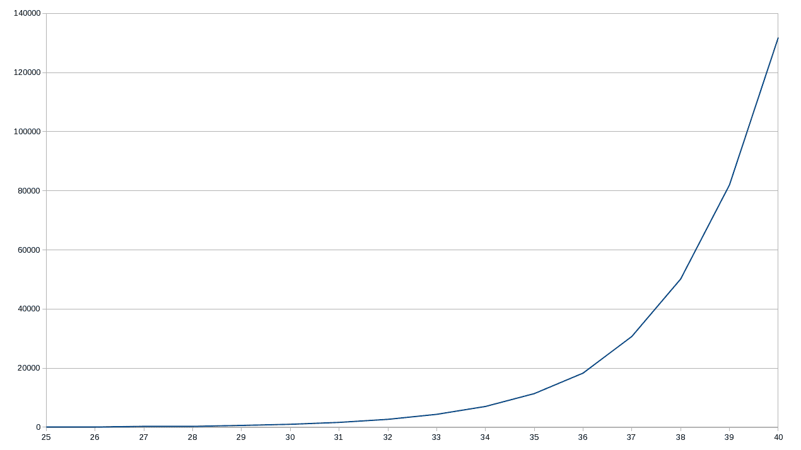
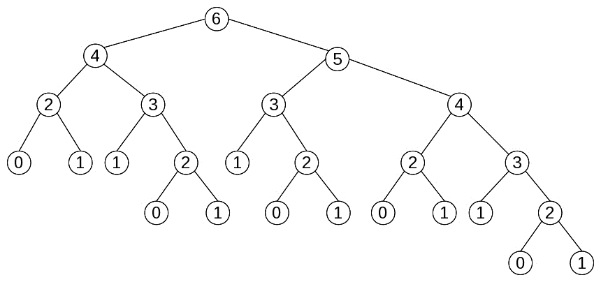
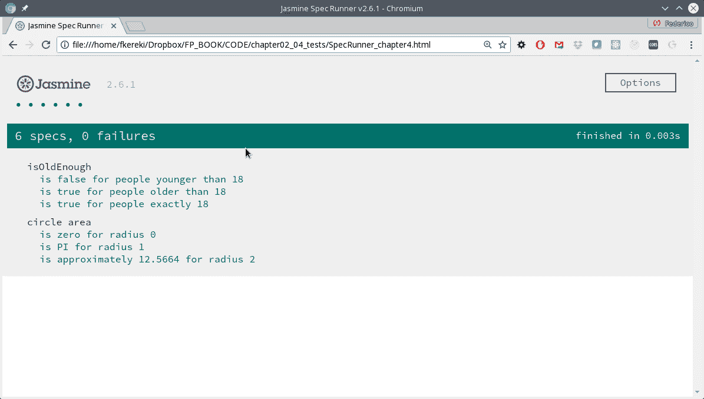

# 第四章：行为得当-纯函数

在第三章中，*从函数开始-核心概念*，我们将函数视为 FP 中的关键元素，详细介绍了箭头函数，并介绍了一些概念，如注入、回调、填充和存根。现在，在这一章中，我们将有机会重新审视或应用其中一些想法，同时我们也...

+   考虑*纯度*的概念，以及为什么我们应该关心*纯函数*

+   审查*引用透明性*的概念

+   认识到副作用所暗示的问题

+   展示纯函数的一些优势

+   描述不纯函数的主要原因

+   找到减少不纯函数数量的方法

+   专注于测试纯函数和不纯函数的方法

# 纯函数

纯函数的行为方式与数学函数相同，并提供各种好处。如果函数满足两个条件，可以认为函数是纯的：

+   **给定相同的参数，函数总是计算并返回相同的结果**，无论调用多少次，或者在什么条件下调用它。这个结果值不能依赖于任何*外部*信息或状态，这些信息在程序执行期间可能会发生变化，并导致它返回不同的值。函数结果也不能依赖于 I/O 结果、随机数或其他外部变量，这些变量不是直接可控的值。

+   **在计算其结果时，函数不会引起任何可观察的*副作用***，包括输出到 I/O 设备，对象的突变，函数外部程序状态的改变等等。

如果你愿意，你可以简单地说纯函数不依赖于，也不修改其范围之外的任何东西，并且总是对相同的输入参数返回相同的结果。

在这个背景下还有一个词叫做*幂等性*，但它并不完全相同。一个幂等函数可以被调用任意次，并且总是产生相同的结果。然而，这并不意味着函数没有副作用。幂等性通常在 RESTful 服务的背景下提到，并且一个简单的例子展示了纯度和幂等性之间的区别。一个`PUT`调用会导致数据库记录被更新（一个副作用），但如果你重复调用，元素将不会被进一步修改，因此数据库的全局状态不会再发生变化。

我们还可以引用一个软件设计原则，并提醒自己函数应该*只做一件事，只做一件事，而且只做那件事*。如果一个函数做了其他事情，并且有一些隐藏的功能，那么对状态的依赖将意味着我们无法预测函数的输出，并且会让开发人员的工作变得更加困难。

让我们更详细地了解这些条件。

# 引用透明性

在数学中，*引用透明性*是一种属性，它允许您用其值替换表达式，而不改变您正在进行的任何操作的结果。

*引用透明性*的对应物是*引用不透明性*。引用不透明的函数不能保证始终产生相同的结果，即使使用相同的参数调用。

举个简单的例子，当优化编译器决定进行*常量折叠*并替换句子时：

```js
var x = 1 + 2 * 3;
```

与：

```js
var x = 1 + 6;
```

或者，更好的是，直接使用：

```js
var x = 7;
```

为了节省执行时间，它利用了所有数学表达式和函数（根据定义）都是引用透明的事实。另一方面，如果编译器无法预测给定表达式的输出，它将无法以任何方式优化代码，计算将不得不在运行时进行。

在λ演算中，如果你用函数的计算值替换涉及函数的表达式的值，这个操作被称为β（beta）规约。请注意，你只能安全地对引用透明的函数进行这样的操作。

所有算术表达式（涉及数学运算符和函数）都是引用透明的：*22*9*总是可以被 198 替换。涉及 I/O 的表达式不是透明的，因为它们的结果在执行之前无法知道。出于同样的原因，涉及日期和时间相关函数或随机数的表达式也不是透明的。

关于 JS 函数，你可能会自己编写一些不满足*引用透明*条件的函数。事实上，函数甚至不需要返回一个值，尽管 JS 解释器会在这种情况下返回一个未定义的值。

有些语言区分函数和过程，预期函数返回某个值，而过程不返回任何东西，但 JS 不是这种情况。此外，有些语言提供手段来确保函数是引用透明的。

如果你愿意的话，你可以将 JS 函数分类为：

+   **纯函数**：它们根据其参数返回一个值，并且没有任何副作用

+   **副作用**：它们不返回任何东西（实际上，JS 让这些函数返回一个`undefined`值，但这在这里并不重要），但会产生某种副作用

+   **具有副作用的函数**：意味着它们返回一些值（这些值可能不仅取决于函数参数，还涉及副作用）

在 FP 中，非常强调第一组引用透明函数。不仅编译器可以推断程序行为（从而能够优化生成的代码），而且程序员也可以更容易地推断程序和其组件之间的关系。反过来，这可以帮助证明算法的正确性，或者通过用等效函数替换一个函数来优化代码。

# 副作用

什么是*副作用*？我们可以将其定义为在执行某些计算或过程期间发生的状态变化或与外部元素（用户、网络服务、另一台计算机等）的交互。

对于这个意义的范围可能存在一些误解。在日常语言中，当你谈论*副作用*时，这有点像谈论*附带损害*--对于给定行动的一些*意外*后果。然而，在计算中，我们包括函数外的每一个可能的效果或变化。如果你编写一个旨在执行`console.log()`调用以显示一些结果的函数，即使这正是你首先打算让函数执行的，它也会被视为副作用！

# 通常的副作用

有（太多！）被认为是副作用的事情。在 JS 编程中，包括前端和后端编码，你可能会发现更常见的副作用包括：

+   改变全局变量。

+   改变接收的对象。

+   进行任何类型的 I/O，比如显示警报消息或记录一些文本。

+   处理和更改文件系统。

+   更新数据库。

+   调用网络服务。

+   查询或修改 DOM。

+   触发任何外部进程。

+   最后，只是调用一些其他函数，这些函数恰好会产生自己的副作用。你可以说不纯度是具有传染性的：调用不纯的函数的函数会自动变得不纯！

有了这个定义，让我们开始考虑什么会导致函数不纯（或者*引用不透明*，正如我们所看到的）。

# 全局状态

在所有前述观点中，最常见的原因是使用非本地变量，与程序的其他部分共享全局状态。由于纯函数根据定义，始终返回相同的输出值，给定相同的输入参数，如果函数引用其内部状态之外的任何东西，它就会自动变得不纯。此外，这对于调试是一个障碍，要理解函数的作用，你必须了解状态如何得到其当前值，这意味着要理解程序的所有过去历史：这并不容易！

```js
let limitYear = 1999;

const isOldEnough = birthYear => birthYear <= limitYear;

console.log(isOldEnough(1960)); // true
console.log(isOldEnough(2001)); // false
```

`isOldEnough()`函数正确检测一个人是否至少 18 岁，但它依赖于一个外部变量（该变量仅适用于 2017 年）。除非你知道外部变量及其值是如何得到的，否则你无法知道函数的作用。测试也很困难；你必须记住创建全局`limitYear`变量，否则所有的测试都将无法运行。尽管函数可以工作，但实现并不是最佳的。

这个规则有一个例外。看看下面的情况：`circleArea`函数，它根据半径计算圆的面积，是纯的还是不纯的？

```js
const PI = 3.14159265358979;
const circleArea = r => PI * Math.pow(r, 2); // or PI * r ** 2
```

尽管函数正在访问外部状态，但`PI`是一个常数（因此不能被修改），允许在`circleArea`中替换它而不改变功能，因此我们应该接受函数是纯净的。对于相同的参数，函数将始终返回相同的值，因此满足我们的纯度要求。

即使你使用`Math.PI`而不是我们定义的常数（顺便说一句，这是一个更好的主意），参数仍然是相同的；常数是不能改变的，所以函数保持纯净。

# 内部状态

这个概念也适用于内部变量，其中存储了本地状态，然后用于将来的调用。在这种情况下，外部状态没有改变，但是有一些副作用意味着未来从函数返回的值会有所不同。让我们想象一个`roundFix()`四舍五入函数，它考虑到是否已经过多地向上或向下四舍五入，所以下次它将以另一种方式四舍五入，使累积差异更接近零：

```js
const roundFix = (function() {
 let accum = 0;
 return n => {
 // *reals get rounded up or down*
 // *depending on the sign of accum*
 let nRounded = accum > 0 ? Math.ceil(n) : Math.floor(n);
 console.log("accum", accum.toFixed(5), " result", nRounded);
 accum += n - nRounded;
 return nRounded;
 };
})();
```

关于这个函数的一些评论：

+   `console.log()`行只是为了这个例子; 它不会包含在真实世界的函数中。它列出了到目前为止的累积差异，以及它将返回的结果：给定数字四舍五入的结果。

+   我们正在使用 IIFE 模式，这是我们在`myCounter()`示例中看到的，在第三章的*立即调用*部分，*从函数开始-核心概念*，以便获得隐藏的内部变量。

+   `nRounded`的计算也可以写成`Mathaccum > 0 ? "ceil": "floor"`--我们测试`accum`来看要调用什么方法（`"ceil"`或`"floor"`），然后使用`Object["method"]`表示法间接调用`Object.method()`。我们使用的方式更清晰，但我只是想提醒你，如果你碰巧发现这种其他编码风格。

仅使用两个值（认出它们吗？）运行此函数显示，对于给定的输入，结果并不总是相同。控制台日志的*结果*部分显示了值是如何四舍五入的，向上还是向下：

```js
roundFix(3.14159); // *accum  0.00000    result 3*
roundFix(2.71828); // *accum  0.14159    result 3*
roundFix(2.71828); // *accum -0.14013    result 2*
roundFix(3.14159); // *accum  0.57815    result 4*
roundFix(2.71828); // *accum -0.28026    result 2*
roundFix(2.71828); // *accum  0.43802    result 3*
roundFix(2.71828); // *accum  0.15630    result 3*
```

第一次，`accum`是零，所以 3.14159 被舍入，`accum`变成了`0.14159`，对我们有利。第二次，因为`accum`是正数（意味着我们一直在我们的利益上四舍五入），所以 2.71828 被舍入为 3，现在`accum`变成了负数。第三次，相同的 2.71828 值被舍入为 2，因为累积的差值是负的；我们得到了相同输入的不同值！其余的例子类似；你可以得到相同的值被舍入为上或下，取决于累积的差异，因为函数的结果取决于它的内部状态。

这种使用内部状态的方式，是为什么许多 FPers 认为使用对象可能是不好的。在 OOP 中，我们开发人员习惯于存储信息（属性）并将它们用于未来的计算。然而，这种用法被认为是不纯的，因为尽管传递相同的参数，重复的方法调用可能返回不同的值。

# 参数突变

你还需要意识到一个不纯的函数可能会修改它的参数。在 JS 中，参数是按值传递的，除了数组和对象，它们是按引用传递的。这意味着对函数参数的任何修改都会影响原始对象或数组的实际修改。这可能会更加模糊，因为有几种*mutator*方法，它们根据定义改变了底层对象。例如，假设你想要一个函数，它会找到一个字符串数组的最大元素（当然，如果它是一个数字数组，你可以简单地使用`Math.max()`而无需进一步操作）。一个简短的实现可能如下所示：

```js
const maxStrings = a => a.sort().pop();

let countries = ["Argentina", "Uruguay", "Brasil", "Paraguay"];
console.log(maxStrings(countries)); // ***"Uruguay"***
```

该函数确实提供了正确的结果（如果你担心外语，我们已经在第三章的*注入：解决问题*部分看到了解决方法，*从函数开始-核心概念*），但它有一个缺陷：

```js
console.log(countries);  // ***["Argentina", "Brasil", "Paraguay"]***
```

糟糕的是，原始数组被修改了；这是根据定义的副作用！如果你再次调用`maxStrings(countries)`，而不是返回与之前相同的结果，它会产生另一个值；显然，这不是一个纯函数。在这种情况下，一个快速的解决方法是对数组的副本进行操作（我们可以使用扩展运算符来帮助），但我们将在第十章中处理更多避免这类问题的方法，*确保纯度-不可变性*：

```js
const maxStrings2 = a => [...a].sort().pop();

let countries = ["Argentina", "Uruguay", "Brasil", "Paraguay"];
console.log(maxStrings2(countries)); *// "Uruguay"*
console.log(countries); // *["Argentina", "Uruguay", "Brasil", "Paraguay"]*
```

# 麻烦的函数

最后，一些函数也会引起问题。例如，`Math.random()`是不纯的：它不总是返回相同的值--如果它这样做了，它肯定会打破它的目的！此外，对该函数的每次调用都会修改全局*种子*值，从而计算下一个*随机*值。

*随机*数字实际上是由内部函数计算的，因此根本不是随机的（如果你知道使用的公式和种子的初始值），这意味着*伪随机*可能更合适。

例如，考虑这个生成随机字母（`"A"`到`"Z"`）的函数：

```js
const getRandomLetter = () => {
 const min = "A".charCodeAt();
 const max = "Z".charCodeAt();
 return String.fromCharCode(
 Math.floor(Math.random() * (1 + max - min)) + min
 );
};
```

这个函数不接受任何参数，但是预期每次调用都会产生*不同*的结果，这清楚地表明这个函数是不纯的。

查看我写的`getRandomLetter()`函数的解释，请访问[`developer.mozilla.org/en-US/docs/Web/JavaScript/Reference/Global_Objects/Math/random`](https://developer.mozilla.org/en-US/docs/Web/JavaScript/Reference/Global_Objects/Math/random)，以及[`developer.mozilla.org/en-US/docs/Web/JavaScript/Reference/Global_Objects/String`](https://developer.mozilla.org/en-US/docs/Web/JavaScript/Reference/Global_Objects/String)的`.charCodeAt()`方法。

调用函数会继承不纯性。如果一个函数使用了不纯的函数，它立即变得不纯。我们可能想要使用`getRandomLetter()`来生成随机文件名，还可以选择给定的扩展名：

```js
const getRandomFileName = (fileExtension = "") => {
 const NAME_LENGTH = 12;
 let namePart = new Array(NAME_LENGTH);
 for (let i = 0; i < NAME_LENGTH; i++) {
 namePart[i] = getRandomLetter();
 }
 return namePart.join("") + fileExtension;
};
```

在第五章中，*声明式编程——更好的风格*，我们将看到一种更加函数式的初始化数组`namePart`的方法，使用`map()`。

由于它使用了`getRandomLetter()`，`getRandomFileName()`也是不纯的，尽管它的表现如预期：

```js
console.log(getRandomFileName(".pdf"));  // *"SVHSSKHXPQKG.pdf"*
console.log(getRandomFileName(".pdf"));  // *"DCHKTMNWFHYZ.pdf"*
console.log(getRandomFileName(".pdf"));  // *"GBTEFTVVHADO.pdf"*
console.log(getRandomFileName(".pdf"));  // *"ATCBVUOSXLXW.pdf"*
console.log(getRandomFileName(".pdf"));  // *"OIFADZKKNVAH.pdf"*
```

记住这个函数；我们稍后会在本章解决单元测试问题的一些方法，并稍作修改以帮助解决这个问题。

对于访问当前时间或日期的函数，不纯性的考虑也适用，因为它们的结果将取决于外部条件（即一天中的时间），这是应用程序的*全局状态*的一部分。我们可以重写我们的`isOldEnough()`函数，以消除对全局变量的依赖，但这并没有太大帮助：

```js
const isOldEnough2 = birthYear =>
 birthYear <= new Date().getFullYear() - 18;

console.log(isOldEnough2(1960)); // true
console.log(isOldEnough2(2001)); // false
```

一个问题已经被解决了——新的`isOldEnough2()`函数现在更加*安全*。此外，只要你不在新年前夕的午夜附近使用它，它将始终返回相同的结果，因此你可以说，用 19 世纪象牙皂的广告语来说，它是*约 99.44%纯*。然而，一个不便仍然存在：你该如何测试它？如果你今天写了一些测试，明年它们可能会开始失败。我们将不得不努力解决这个问题，我们稍后会看到如何解决。

还有其他一些不纯的函数，比如那些引起 I/O 的函数。如果一个函数从某个来源获取输入（网络服务、用户本身、文件等），显然返回的结果可能会有所不同。你还应该考虑 I/O 错误的可能性，因此同一个函数，调用同一个服务或读取同一个文件，可能在某个时候失败，原因是超出了它的控制范围（你应该假设你的文件系统、数据库、套接字等可能不可用，因此给定的函数调用可能产生错误，而不是预期的恒定、不变的答案）。即使是一个纯输出的、通常安全的语句，比如`console.log()`，它在内部并不会改变任何东西（至少在可见的方式上），但它确实会产生一些影响，因为用户看到了变化：产生的输出。

这是否意味着我们永远无法编写需要随机数、处理日期或进行 I/O 的程序，并且还使用纯函数？一点也不——但这意味着有些函数不会是纯函数，它们会有一些我们需要考虑的缺点；我们稍后会回到这个问题。

# 纯函数的优势

使用纯函数的主要优势，源于它们没有任何副作用。当你调用一个纯函数时，你不需要担心任何事情，除了你传递给它的参数。而且更重要的是，你可以确信你不会造成任何问题或破坏其他任何东西，因为函数只会处理你给它的东西，而不会处理外部来源。但这并不是它们唯一的优势；让我们看看更多。

# 执行顺序

从这一章中我们所说的另一个角度来看，纯函数可以被称为*健壮*的。你知道它们的执行——无论以哪种顺序——都不会对系统产生任何影响。这个想法可以进一步扩展：你可以并行评估纯函数，放心地得出结果不会与单线程执行中得到的结果有所不同。

不幸的是，JS 在并行编程方面限制了我们很多。我们可能会以非常有限的方式使用 Web Workers，但这大概就是它的极限了。对于 Node.js 开发人员，集群模块可能会有所帮助，尽管它并不是线程的替代品，只允许您生成多个进程以利用所有可用的 CPU 核心。总之，您不会得到诸如 Java 的线程之类的设施，因此在 JS 术语中，并行化并不是 FP 的优势。

当您使用纯函数时，需要牢记的另一个考虑因素是，没有明确的需要指定它们应该被调用的顺序。如果您使用数学，例如*f(2)+f(5)*这样的表达式总是与*f(5)+f(2)*相同；顺便说一下，这被称为*交换律*。然而，当您处理不纯函数时，这可能不成立，就像下面的代码所示：

```js
var mult = 1;
const f = x => {
 mult = -mult;
 return x * mult;
};

console.log(f(2) + f(5)); //  3
console.log(f(5) + f(2)); // -3
```

对于之前显示的不纯函数，您不能假设计算*f(3)+f(3)*会产生与*2*f(3)*相同的结果，或者*f(4)-f(4)*实际上会是零；检查一下！更常见的数学属性都泡汤了...

为什么您应该关心呢？当您编写代码时，无论是否愿意，您总是牢记着您学到的那些属性，比如交换律。因此，虽然您可能认为这两个表达式应该产生相同的结果，并相应地编写代码，但是对于不纯函数，您可能会遇到令人惊讶的难以修复的难以发现的错误。

# 记忆化

由于纯函数对于给定的输入始终产生相同的输出，您可以缓存函数的结果，避免可能昂贵的重新计算。这个过程，即仅在第一次评估表达式，并缓存结果以供以后调用，称为*记忆化*。

我们将在第六章中回到这个想法，*生成函数 - 高阶函数*，但让我们看一个手工完成的例子。斐波那契序列总是被用来举例，因为它简单，而且隐藏的计算成本。这个序列的定义如下：

+   对于*n*=0，*fib*(*n*)=0

+   对于*n*=1，*fib*(*n*)=1

+   对于*n*>1，*fib*(*n*)=*fib*(*n*-2)+*fib*(*n*-1)

斐波那契的名字实际上来自*filius Bonacci*，或者*Bonacci 的儿子*。他最著名的是引入了我们今天所知的 0-9 数字的使用，而不是繁琐的罗马数字。他将以他命名的序列作为解答引入了一个涉及兔子的谜题！

如果您计算一下，序列从 0 开始，然后是 1，从那一点开始，每个项都是前两个项的和：再次是 1，然后是 2，3，5，8，13，21，依此类推。通过递归编程这个系列很简单--尽管我们将在第九章中重新讨论这个例子，*设计函数 - 递归*。下面的代码，是对定义的直接翻译，将会这样做：

```js
const fib = (n) => {
 if (n == 0) {
 return 0;
 } else if (n == 1) {
 return 1;
 } else {
 return fib(n - 2) + fib(n - 1);
 }
}
//
console.log(fib(10)); // *55, a bit slowly*
```

如果您真的喜欢一行代码，您也可以写成`const fib = (n) => (n<=1) ? n : fib(n-2)+fib(n-1)`--您明白为什么吗？但更重要的是...值得失去清晰度吗？

如果您尝试使用这个函数来增加`n`的值，很快就会意识到存在问题，计算开始花费太多时间。例如，在我的机器上，这是我测得的一些时间，以毫秒为单位--当然，您的情况可能有所不同。由于函数速度相当快，我不得不运行 100 次计算，对`n`的值在 0 到 40 之间。即使如此，对于较小的`n`值，时间确实非常短暂；只有从 25 开始，我得到了有趣的数字。图表（见图 4.1）显示了指数增长，这预示着不祥的事情。

图 4.1：fib()递归函数的计算时间呈指数增长。

如果我们绘制出计算`fib(6)`所需的所有调用的图表，你会注意到问题。每个节点代表计算`fib(n)`的调用：我们只在节点中记录`n`的值。除了`n`=0 或 1 的调用外，每个调用都需要进一步的调用；参见图 4.2：

图 4.2：计算 fib(6)所需的所有计算显示出大量重复

延迟增加的原因变得很明显：例如，`fib(2)`的计算在四个不同的场合重复进行，而`fib(3)`本身被计算了三次。鉴于我们的函数是纯函数，我们可以存储计算出的值，避免一遍又一遍地进行数字计算。可能的版本如下：

```js
let cache = [];
const fib2 = (n) => {
 if (cache[n] == undefined) {
 if (n == 0) {
 cache[0] = 0;
 } else if (n == 1) {
 cache[1] = 1;
 } else {
 cache[n] = fib2(n - 2) + fib2(n - 1);
 }
 }
    return cache[n];
}

console.log(fib2(10)); // *55, as before, but more quickly!*
```

最初，缓存是空的。每当我们需要计算`fib2(n)`的值时，我们都会检查它是否已经计算过。如果不是，我们进行计算，但有一个小变化：我们不会立即返回值，而是先将其存储在缓存中，然后再返回。这意味着不会重复进行计算：在我们为特定的`n`计算了`fib2(n)`之后，未来的调用将不会重复这个过程，而只是返回之前已经计算过的值。

一些简短的注释：

+   我们手动进行了函数的记忆化，但我们可以使用高阶函数来实现，我们将在第六章中看到，*生成函数 - 高阶函数*。完全可以对函数进行记忆化，而无需改写它。

+   使用全局变量作为缓存不是一个很好的做法；我们可以使用 IIFE 和闭包来隐藏缓存；你看到了吗？在第三章的*立即调用*部分中查看`myCounter()`示例，回顾我们如何做到这一点。

当然，你不需要为程序中的每个纯函数都这样做。你只会对频繁调用、需要花费重要时间的函数进行这种优化 - 如果情况不是这样的话，额外的缓存管理时间将会比你期望节省的时间更多！

# 自我文档化

纯函数还有另一个优势。由于函数需要处理的一切都通过其参数给出，没有任何隐藏的依赖关系，所以当你阅读其源代码时，你已经拥有了理解函数目标所需的一切。

额外的优势：知道一个函数不会访问除了其参数之外的任何东西，会让你更有信心使用它，因为你不会意外地产生一些副作用，函数将会完成的唯一事情，就是你已经通过文档学到的。

单元测试（我们将在下一节中介绍）也可以作为文档，因为它们提供了在给定特定参数时函数返回的示例。大多数程序员都会同意，最好的文档是充满示例的，每个单元测试都可以被视为这样一个示例。

# 测试

纯函数的另一个优势 - 也是最重要的之一 - 与单元测试有关。纯函数只负责以其输入产生输出。因此，当你为纯函数编写测试时，你的工作会简化得多，因为不需要考虑上下文，也不需要模拟状态。

你可以简单地专注于提供输入和检查输出，因为所有函数调用都可以在与*世界其他部分*独立的情况下重现。我们将在本章后面更多地了解测试纯函数和不纯函数。

# 不纯函数

如果你决定完全放弃所有种类的副作用，你的程序只能使用硬编码的输入...并且无法显示计算结果！同样，大多数网页将变得无用；你将无法进行任何网络服务调用，或者更新 DOM；你只能有静态页面。对于服务器端的 JS，你的 Node.JS 代码将变得非常无用，无法进行任何 I/O...

在 FP 中减少副作用是一个很好的目标，但我们不能过分追求！所以，让我们想想如何避免使用不纯的函数，如果可能的话，以及如何处理它们，寻找最好的方法来限制或限制它们的范围。

# 避免不纯的函数

在本章的前面，我们看到了不纯函数更常见的原因。现在让我们考虑如何最小化它们的数量，如果完全摆脱它们并不现实的话。

# 避免使用状态

关于使用全局状态--获取和设置--解决方案是众所周知的。关键在于：

+   将全局状态所需的内容作为参数提供给函数

+   如果函数需要更新状态，它不应该直接这样做，而是应该产生状态的新版本，并返回它

+   如果有的话，将由调用者负责获取返回的状态并更新全局状态

这是 Redux 用于其 reducer 的技术。reducer 的签名是`(previousState, action) => newState`，意味着它以状态和动作作为参数，并返回一个新的状态作为结果。更具体地说，reducer 不应该简单地改变`previousState`参数，它必须保持不变（我们将在第十章中看到更多关于这一点的内容，*确保纯度-不可变性*）。

关于我们第一个版本的`isOldEnough()`函数，它使用了一个全局的`limitYear`变量，改变很简单：我们只需要将`limitYear`作为函数的参数提供。有了这个改变，函数就会变得纯净，因为它只会使用它的参数来产生结果。更好的是，我们应该提供当前年份，让函数来计算，而不是强制调用者这样做：

```js
const isOldEnough3 = (currentYear, birthYear) => birthYear <= currentYear-18;
```

显然，我们将不得不改变所有调用以提供所需的`limitYear`参数（我们也可以使用柯里化，正如我们将在第七章中看到的，*转换函数-柯里化和部分应用*）。初始化`limitYear`的值的责任仍然在函数之外，但我们已经成功避免了一个缺陷。

我们也可以将这个解决方案应用到我们特殊的`roundFix()`函数中。你还记得，这个函数通过累积由四舍五入引起的差异来工作，并根据累加器的符号决定是向上还是向下舍入。我们无法避免使用这个状态，但我们可以将四舍五入部分与累积部分分开。因此，我们的原始代码（减去注释和日志）将从以下内容更改：

```js
const roundFix1 = (function() {
 let accum = 0;
 return n => {
 let nRounded = accum > 0 ? Math.ceil(n) : Math.floor(n);
 accum += n - nRounded;
 return nRounded;
 };
})();
```

至于：

```js
const roundFix2 = (a, n) => {
 let r = a > 0 ? Math.ceil(n) : Math.floor(n);
 a += n - r;
 return {a, r};
};
```

你会如何使用这个函数？初始化累加器，将其传递给函数，并在之后更新，现在都是调用者代码的责任。你会有类似以下的东西：

```js
let accum = 0;

// *...some other code...*

let {a, r} = roundFix2(accum, 3.1415);
accum = a;
console.log(accum, r); // 0.1415 3
```

请注意：

+   `accum`现在是应用程序的全局状态的一部分

+   由于`roundFix2()`需要它，当前的累加器值在每次调用时都会被提供

+   调用者负责更新全局状态，而不是`roundFix2()`

请注意使用解构赋值，以便允许函数返回多个值，并且可以轻松地将每个值存储在不同的变量中。更多信息，请查看[`developer.mozilla.org/en/docs/Web/JavaScript/Reference/Operators/Destructuring_assignment`](https://developer.mozilla.org/en/docs/Web/JavaScript/Reference/Operators/Destructuring_assignment)。

这个新的`roundFix2()`函数是完全纯粹的，可以很容易地进行测试。如果你想要隐藏累加器不被应用程序的其他部分访问，你仍然可以像其他示例中一样使用闭包，但这将再次在你的代码中引入不纯性；你决定！

# 注入不纯的函数

如果一个函数变得不纯，因为它需要调用一些其他函数，而这些函数本身是不纯的，解决这个问题的方法是在调用中注入所需的函数。这种技术实际上为您的代码提供了更多的灵活性，并允许更容易地进行未来更改，以及更简单的单元测试。

让我们考虑一下我们之前看到的随机文件名生成器函数。问题的关键在于它使用`getRandomLetter()`来生成文件名：

```js
const getRandomFileName = (fileExtension = "") => {
 ...
 for (let i = 0; i < NAME_LENGTH; i++) {
 namePart[i] = getRandomLetter();
 }
 ...
};
```

解决这个问题的方法是用一个注入的外部函数替换不纯的函数：

```js
const getRandomFileName2 = (fileExtension = "", randomLetterFunc) => {
 const NAME_LENGTH = 12;
 let namePart = new Array(NAME_LENGTH);
 for (let i = 0; i < NAME_LENGTH; i++) {
 namePart[i] = randomLetterFunc();
 }
 return namePart.join("") + fileExtension;
};
```

现在，我们已经从这个函数中移除了固有的不纯性。如果我们愿意提供一个预定义的伪随机函数，实际上返回固定、已知的值，我们将能够轻松地对这个函数进行单元测试；我们将在接下来的示例中看到。函数的使用将会改变，我们需要编写：

```js
let fn = getRandomFileName2(".pdf", getRandomLetter);
```

如果这种方式让你困扰，你可能想为`randomLetterFunc`参数提供一个默认值，如下所示：

```js
const getRandomFileName2 = (
 fileExtension = "",
 randomLetterFunc = getRandomLetter
) => {
 ...
};
```

或者你也可以通过部分应用来解决这个问题，就像我们将在第七章中看到的那样，*转换函数 - 柯里化和部分应用*。

这实际上并没有避免使用不纯的函数。在正常使用中，你将调用`getRandomFileName()`并提供我们编写的随机字母生成器，因此它将表现为一个不纯的函数。然而，为了测试目的，如果你提供一个返回预定义（即非随机）字母的函数，你将能够更轻松地测试它是否纯粹。

但是原始问题函数`getRandomLetter()`呢？我们可以应用相同的技巧，编写一个新版本，如下所示：

```js
const getRandomLetter = (getRandomInt = Math.random) => {
 const min = "A".charCodeAt();
 const max = "Z".charCodeAt();
 return String.fromCharCode(
 Math.floor(getRandomInt() * (1 + max - min)) + min
 );
};
```

在正常使用中，`getRandomFileName()`会调用`getRandomLetter()`而不提供任何参数，这意味着被调用的函数将按照预期的随机方式行事。但是，如果我们想要测试函数是否符合我们的预期，我们可以运行它，使用一个返回我们决定的任何内容的注入函数，让我们彻底测试它。

这个想法实际上非常重要，对其他问题有广泛的应用。例如，我们可以提供一个函数来直接访问 DOM，而不是直接访问 DOM。对于测试目的，可以简单地验证被测试的函数是否真的做了它需要做的事情，而不是真的与 DOM 进行交互（当然，我们必须找到其他方法来测试那些与 DOM 相关的函数）。这也适用于需要更新 DOM、生成新元素和进行各种操作的函数，你只需使用一些中间函数。

# 你的函数是纯的吗？

让我们通过考虑一个重要的问题来结束这一节：你能确保一个函数实际上是纯的吗？为了展示这个任务的困难，我们将回到我们在前几章中看到的简单的`sum3()`函数。你会说这个函数是纯的吗？它看起来是！

```js
const sum3 = (x, y, z) => x + y + z;
```

让我们看看，这个函数除了它的参数之外没有访问任何东西，甚至不尝试修改它们（即使它可能...或者可能吗？），不进行任何 I/O 或使用我们之前提到的任何不纯的函数或方法...会出什么问题呢？

答案与检查你的假设有关。例如，谁说这个函数的参数应该是数字？你可能会对自己说“好吧，它们可以是字符串...但是函数仍然是纯的，不是吗？”，但是对于这个（肯定是邪恶的！）答案，看看下面的代码。

```js
let x = {};
x.valueOf = Math.random;

let y = 1;
let z = 2;

console.log(sum3(x, y, z)); // 3.2034400919849431
console.log(sum3(x, y, z)); // 3.8537045249277906
console.log(sum3(x, y, z)); // 3.0833258308458734
```

观察我们如何将一个新函数分配给`x.valueOf`方法，我们充分利用了函数是一级对象的事实。在第三章的*一个不必要的错误*部分中，可以了解更多相关信息。

嗯，`sum3()`应该是纯的...但它实际上取决于你传递给它的参数！你可能会安慰自己，认为肯定没有人会传递这样的参数，但边缘情况通常是错误的根源。但你不必放弃纯函数的想法。添加一些类型检查（TypeScript 可能会派上用场），你至少可以防止一些情况--尽管 JS 永远不会让你完全确定你的代码*总是*是纯的！

# 测试-纯函数与不纯函数

我们已经看到纯函数在概念上比不纯函数更好，但我们不能开始一场消灭代码中所有不纯性的运动。首先，没有人能否认副作用是有用的，或者至少是不可避免的：你需要与 DOM 交互或调用 Web 服务，而没有办法以纯粹的方式做到这一点。因此，与其抱怨你必须允许不纯性，不如尝试构建你的代码，以便隔离不纯函数，并让你的代码尽可能地好。

有了这个想法，你将能够为各种函数编写单元测试，无论是纯函数还是不纯函数。编写纯函数和不纯函数的单元测试是不同的，因为在处理纯函数或不纯函数时，其难度和复杂性也不同。对于前者编写测试通常相当简单，并遵循基本模式，而对于后者通常需要搭建和复杂的设置。因此，让我们通过看看如何测试这两种类型的函数来结束本章。

# 测试纯函数

鉴于我们已经描述的纯函数的特性，你的大部分单元测试可能会很简单：

+   使用给定的一组参数调用函数

+   验证结果是否与预期相匹配

让我们从一些简单的例子开始。测试`isOldEnough()`函数将比需要访问全局变量的版本更复杂。另一方面，最后一个版本`isOldEnough3()`不需要任何东西，因为它接收了两个参数，所以测试起来很简单：

```js
describe("isOldEnough", function() {
 it("is false for people younger than 18", () => {
 expect(isOldEnough3(1978, 1963)).toBe(false);
 });

 it("is true for people older than 18", () => {
 expect(isOldEnough3(1988, 1965)).toBe(true);
 });

 it("is true for people exactly 18", () => {
 expect(isOldEnough3(1998, 1980)).toBe(true);
 });
});
```

我们编写的另一个纯函数同样简单，但需要注意精度。如果我们测试`circleArea`函数，我们必须使用 Jasmine 的`.toBeCloseTo()`匹配器，它允许在处理浮点数时进行近似相等。除此之外，测试基本相同：使用已知参数调用函数，并检查预期结果。

```js
describe("circle area", function() {
 it("is zero for radius 0", () => {
 let area = circleArea(0);
 expect(area).toBe(0);
 });

 it("is PI for radius 1", () => {
 let area = circleArea(1);
 expect(area).toBeCloseTo(Math.PI);
 });

 it("is approximately 12.5664 for radius 2", () => {
 let area = circleArea(2);
 expect(area).toBeCloseTo(12.5664);
 });
});
```

毫无困难！测试运行报告对两个套件都成功（见图 4.3）：

图 4.3：一对简单纯函数的成功测试运行

因此，我们不必担心纯函数，让我们继续处理不纯函数，将它们转换为纯函数的等价物。

# 测试纯化函数

当我们考虑`roundFix`特殊函数时，它需要使用状态来累积由于舍入而产生的差异，我们通过将当前状态作为附加参数提供，并使函数返回两个值：舍入后的值和更新后的状态，从而生成了一个新版本：

```js
const roundFix2 = (a, n) => {
 let r = a > 0 ? Math.ceil(n) : Math.floor(n);
 a += n - r;
 return {a, r};
};
```

这个函数现在是纯的，但测试它需要验证不仅返回的值，还有更新的状态。我们可以基于之前的实验来进行测试。再次，我们必须使用`toBeCloseTo()`来处理浮点数，但对于整数，我们可以使用`toBe()`，它不会产生舍入误差：

```js
describe("roundFix2", function() {
 it("should round 3.14159 to 3 if differences are 0", () => {
 let {a, r} = roundFix2(0.0, 3.14159);
 expect(a).toBeCloseTo(0.14159);
 expect(r).toBe(3);
 });

 it("should round 2.71828 to 3 if differences are 0.14159", () => {
 let {a, r} = roundFix2(0.14159, 2.71828);
 expect(a).toBeCloseTo(-0.14013);
 expect(r).toBe(3);
 });

 it("should round 2.71828 to 2 if differences are -0.14013", () => {
 let {a, r} = roundFix2(-0.14013, 2.71828);
 expect(a).toBeCloseTo(0.57815);
 expect(r).toBe(2);
 });

 it("should round 3.14159 to 4 if differences are 0.57815", () => {
 let {a, r} = roundFix2(0.57815, 3.14159);
 expect(a).toBeCloseTo(-0.28026);
 expect(r).toBe(4);
 });
});
```

我们注意到包括了几种情况，积累的差异为正、零或负，并检查在每种情况下是否四舍五入。我们当然可以进一步进行，对负数进行四舍五入，但思路很清楚：如果你的函数将当前状态作为参数，并更新它，与纯函数测试的唯一区别是你还必须测试返回的状态是否符合你的期望。

现在让我们考虑测试的另一种方式，对于我们纯净的`getRandomLetter()`变体；让我们称之为`getRandomLetter2()`。这很简单；你只需要提供一个函数，它本身会产生*随机*数字。（在测试术语中，这种函数被称为*存根*）。存根的复杂性没有限制，但你会希望保持它简单。

然后，我们可以根据对函数工作原理的了解进行一些测试，以验证低值产生`A`，接近 1 的值产生`Z`，因此我们可以有一点信心，不会产生额外的值。此外，中间值（大约 0.5）应该产生字母在字母表中间的位置。然而，请记住，这种测试并不是很好；如果我们替换了一个同样有效的`getRandomLetter()`变体，新函数可能完全正常工作，但由于不同的内部实现，可能无法通过这个测试！

```js
describe("getRandomLetter2", function() {
 it("returns A for values close to 0", () => {
 let letterSmall = getRandomLetter2(() => 0.0001);
 expect(letterSmall).toBe("A");
 });

 it("returns Z for values close to 1", () => {
 let letterBig = getRandomLetter2(() => 0.99999);
 expect(letterBig).toBe("Z");
 });

 it("returns a middle letter for values around 0.5", () => {
 let letterMiddle = getRandomLetter2(() => 0.49384712);
 expect(letterMiddle).toBeGreaterThan("G");
 expect(letterMiddle).toBeLessThan("S");
 });

 it("returns an ascending sequence of letters for ascending values", () => {
 let a = [0.09, 0.22, 0.6];
 const f = () => a.shift(); // impure!!

 let letter1 = getRandomLetter2(f);
 let letter2 = getRandomLetter2(f);
 let letter3 = getRandomLetter2(f);
 expect(letter1).toBeLessThan(letter2);
 expect(letter2).toBeLessThan(letter3);
 });
});
```

测试我们的文件名生成器可以通过使用存根来以类似的方式进行。我们可以提供一个简单的存根，按顺序返回`"SORTOFRANDOM"`的字母（这个函数是相当不纯的；知道为什么吗？）。因此，我们可以验证返回的文件名是否与预期的名称匹配，以及返回的文件名的一些其他属性，例如其长度和扩展名：

```js
describe("getRandomFileName", function() {
 let a = [];
 let f = () => a.shift();

 beforeEach(() => {
 a = "SORTOFRANDOM".split("");
 });

 it("uses the given letters for the file name", () => {
 let fileName = getRandomFileName("", f);
 expect(fileName.startsWith("SORTOFRANDOM")).toBe(true);
 });

 it("includes the right extension, and has the right length", () => {
 let fileName = getRandomFileName(".pdf", f);
 expect(fileName.endsWith(".pdf")).toBe(true);
 expect(fileName.length).toBe(16);
 });
});
```

测试*纯化*的不纯函数与测试最初纯函数非常相似。现在，我们将不得不考虑一些真正不纯函数的情况，因为正如我们所说的，几乎可以肯定，你迟早会使用这样的函数。

# 测试不纯函数

首先，让我们回到我们的`getRandomLetter()`函数。有了对其实现的内部知识（这被称为*白盒测试*，与*黑盒测试*相对，后者我们对函数代码本身一无所知），我们可以*监视*（Jasmine 术语）`Math.random()`方法，并设置一个*模拟*函数，它将返回我们想要的任何值。

我们可以重新审视我们在上一节中进行的一些测试用例。在第一个案例中，我们将`Math.random()`设置为返回 0.0001，并测试它是否实际被调用，以及最终返回是否为`A`。在第二个案例中，为了多样化，我们设置了`Math.random()`可以被调用两次，返回两个不同的值。我们还验证了函数被调用了两次，而且两个结果都是`Z`。第三个案例展示了检查`Math.random()`（或者说，我们的模拟函数）被调用了多少次的另一种方式：

```js
describe("getRandomLetter", function() {
 it("returns A for values close to 0", () => {
 spyOn(Math, "random").and.returnValue(0.0001);
 let letterSmall = getRandomLetter();
 expect(Math.random).toHaveBeenCalled();
 expect(letterSmall).toBe("A");
 });

 it("returns Z for values close to 1", () => {
 spyOn(Math, "random").and.returnValues(0.98, 0.999);
 let letterBig1 = getRandomLetter();
 let letterBig2 = getRandomLetter();
 expect(Math.random).toHaveBeenCalledTimes(2);
 expect(letterBig1).toBe("Z");
 expect(letterBig2).toBe("Z");
 });

 it("returns a middle letter for values around 0.5", () => {
 spyOn(Math, "random").and.returnValue(0.49384712);
 let letterMiddle = getRandomLetter();
 expect(Math.random.calls.count()).toEqual(1);
 expect(letterMiddle).toBeGreaterThan("G");
 expect(letterMiddle).toBeLessThan("S");
 });
});
```

当然，你不会随意发明任何测试。据说，你会从所需的`getRandomLetter()`函数的描述开始工作，这个描述是在你开始编码或测试之前编写的。在我们的情况下，我假装那个规范确实存在，并且明确指出，例如，接近 0 的值应该产生`A`，接近 1 的值应该返回`Z`，并且函数应该对升序的`random`值返回升序的字母。

现在，你如何测试原始的`getRandomFileName()`函数，即调用不纯的`getRandomLetter()`函数的函数？这是一个更加复杂的问题....你有什么期望？你无法知道它将会给出什么结果，因此你无法编写任何`.toBe()`类型的测试。你可以测试一些预期结果的属性。而且，如果你的函数涉及某种形式的随机性，你可以重复测试多次，以增加捕获错误的机会：

```js
describe("getRandomFileName, with an impure getRandomLetter function", function() {
 it("generates 12 letter long names", () => {
 for (let i = 0; i < 100; i++) {
 expect(getRandomFileName().length).toBe(12);
 }
 });

 it("generates names with letters A to Z, only", () => {
 for (let i = 0; i < 100; i++) {
 let n = getRandomFileName();
 for (j = 0; j < n.length; n++) {
 expect(n[j] >= "A" && n[j] <= "Z").toBe(true);
 }
 }
 });

 it("includes the right extension if provided", () => {
 let fileName1 = getRandomFileName(".pdf");
 expect(fileName1.length).toBe(16);
 expect(fileName1.endsWith(".pdf")).toBe(true);
 });

 it("doesn't include any extension if not provided", () => {
 let fileName2 = getRandomFileName();
 expect(fileName2.length).toBe(12);
 expect(fileName2.includes(".")).toBe(false);
 });
});
```

我们没有向`getFileName()`传递任何随机字母生成函数，因此它将使用原始的、不纯的函数。我们对一些测试运行了一百次，作为额外的保险。

在测试代码时，永远记住*没有证据*不是*证据的缺失*。即使我们的重复测试成功了，也不能保证，使用其他随机输入时，它们不会产生意外的、迄今未被发现的错误。

让我们进行另一个*属性*测试。假设我们想测试一个洗牌算法；我们可以决定实现 Fisher-Yates 版本，按照以下的方式。按照实现，该算法是双重不纯的：它不总是产生相同的结果（显然！）并且修改了它的输入参数：

```js
const shuffle = arr => {
 const len = arr.length;
 for (let i = 0; i < len - 1; i++) {
 let r = Math.floor(Math.random() * (len - i));
 [arr[i], arr[i + r]] = [arr[i + r], arr[i]];
 }
 return arr;
};

var xxx = [11, 22, 33, 44, 55, 66, 77, 88];
console.log(shuffle(xxx));
// ***[55, 77, 88, 44, 33, 11, 66, 22]***
```

有关此算法的更多信息--包括对不慎的程序员造成的一些问题--请参阅[`en.wikipedia.org/wiki/Fisher-Yates_shuffle`](https://en.wikipedia.org/wiki/Fisher-Yates_shuffle)。

你如何测试这个算法？考虑到结果是不可预测的，我们可以检查其输出的属性。我们可以使用已知的数组调用它，然后测试它的一些属性：

```js
describe("shuffleTest", function() {
 it("shouldn't change the array length", () => {
 let a = [22, 9, 60, 12, 4, 56];
 shuffle(a);
 expect(a.length).toBe(6);
 });

 it("shouldn't change the values", () => {
 let a = [22, 9, 60, 12, 4, 56];
 shuffle(a);
 expect(a.includes(22)).toBe(true);
 expect(a.includes(9)).toBe(true);
 expect(a.includes(60)).toBe(true);
 expect(a.includes(12)).toBe(true);
 expect(a.includes(4)).toBe(true);
 expect(a.includes(56)).toBe(true);
 });
});
```

我们不得不以这种方式编写单元测试的第二部分，因为正如我们所看到的，`shuffle()`会修改输入参数。

# 问题

4.1\. **极简主义函数**：函数式程序员有时候倾向于以极简主义的方式编写代码。你能检查这个斐波那契函数的版本，并解释它是否有效，如果有效，是如何有效的吗？

```js
 const fib2 = n => (n < 2 ? n : fib2(n - 2) + fib2(n - 1));
```

4.2\. **一个廉价的方法**：下面这个版本的斐波那契函数非常高效，不会进行任何不必要或重复的计算。你能看出来吗？建议：尝试手工计算`fib4(6)`，并与本书前面给出的例子进行比较：

```js
 const fib4 = (n, a = 0, b = 1) => (n === 0 ? a : fib4(n - 1, b, a 
 + b));
```

4.3 **洗牌测试**：你如何为`shuffle()`编写单元测试，以测试它在具有*重复*值的数组上是否正确工作？

4.4\. **违反规律**：使用`.toBeCloseTo()`非常实用，但可能会引发一些问题。一些基本的数学属性是：

一个数字应该等于它自己：对于任何数字*a*，*a*应该等于*a*

+   如果数字*a*等于数字*b*，那么*b*应该等于*a*

+   如果*a*等于*b*，*b*等于*c*，那么*a*应该等于*c*

+   如果*a*等于*b*，*c*等于*d*，那么*a*+*c*应该等于*b*+*d*

+   如果*a*等于*b*，*c*等于*d*，那么*a***c*应该等于*b***d*

+   如果*a*等于*b*，*c*等于*d*，那么*a*/*c*应该等于*b*/*d*

`.toBeCloseTo()`是否也满足所有这些属性？

# 总结

在本章中，我们介绍了*纯函数*的概念，并研究了它们为什么重要。我们还看到了*副作用*造成的问题，这是不纯函数的原因之一；考虑了一些*净化*这些不纯函数的方法，最后，我们看到了对纯函数和不纯函数进行单元测试的几种方法。

在第五章中，*声明式编程 - 更好的风格*，我们将展示 FP 的其他优势：如何以声明式的方式进行编程，以更高的层次编写更简单、更强大的代码。
