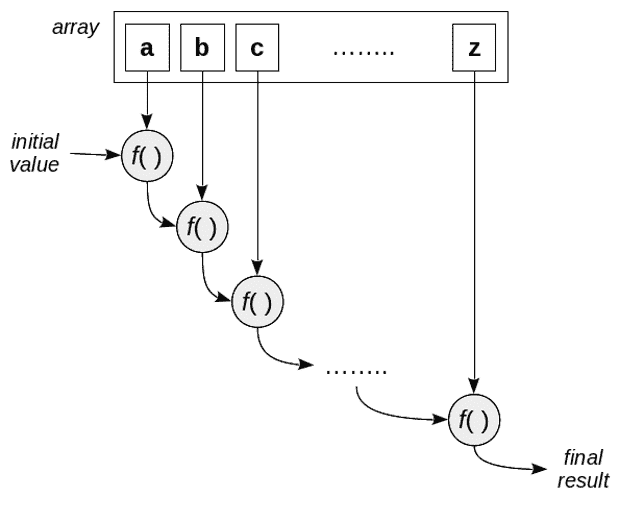
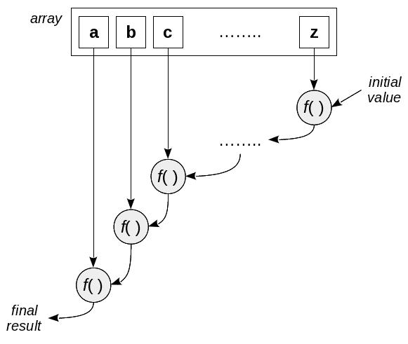
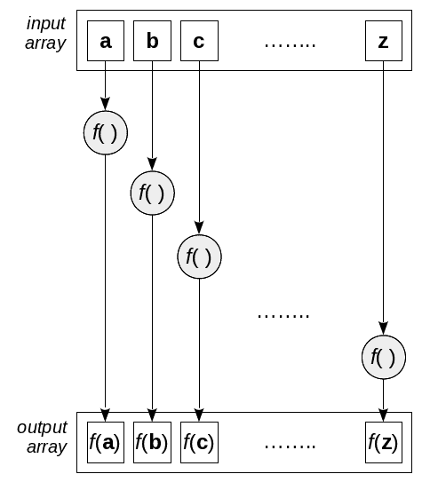
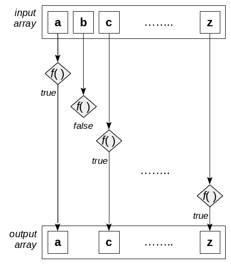

# 第五章：声明式编程 - 更好的风格

到目前为止，我们还没有真正能够欣赏到 FP 的可能性，因为它涉及以更高级别、声明性的方式工作。在本章中，我们将纠正这一点，并通过使用一些高阶函数（HOF：接受函数作为参数的函数）来编写更短、更简洁、更易于理解的代码。

+   `.reduce()`和`.reduceRight()`来对整个数组应用操作，将其减少为单个结果

+   `.map()`，通过对其每个元素应用函数来将数组转换为另一个数组

+   `.forEach()`，通过抽象必要的循环代码来简化编写循环

我们还可以使用以下功能进行搜索和选择：

+   `.filter()`，从数组中选择一些元素

+   `.find()`和`.findIndex()`，用于搜索满足条件的元素

+   还有一对谓词`.every()`和`.some()`，用于检查数组是否通过了某些布尔测试

使用这些函数可以让您更加声明式地工作，您会发现您的注意力往往会转向需要做什么，而不是如何做；肮脏的细节隐藏在我们的函数内部。我们将不再编写一系列可能嵌套的`for`循环，而是更专注于使用函数作为构建块来指定我们想要的结果。

我们还可以以*流畅*的方式工作，其中函数的输出成为下一个函数的输入：这是我们稍后将涉及的一种风格。

# 转换

我们将要考虑的第一组操作是在数组上进行操作，并在函数的基础上处理它以产生一些结果。有几种可能的结果：使用`.reduce()`操作得到单个值；使用`.map()`得到一个新数组；或者使用`.forEach()`得到几乎任何类型的结果。

如果您在网上搜索，您会发现一些声明这些函数不高效的文章，因为手动完成的循环可能更快。尽管这可能是真的，但实际上并不重要。除非您的代码真的受到速度问题的困扰，并且能够测量出慢速是由于使用这些高阶函数导致的，否则试图避免它们，使用更长的代码和更多的错误可能性根本就没有多大意义。

让我们从考虑函数列表开始，按顺序开始，从最一般的函数开始，正如我们将看到的那样，甚至可以用来模拟本章中其余的转换！

# 将数组减少为一个值

回答这个问题：你有多少次不得不循环遍历数组，执行一些操作（比如，求和元素）以产生单个值（也许是所有数组值的总和）作为结果？可能很多次。这种操作通常可以通过应用`.reduce()`和`.reduceRight()`来实现函数化。让我们从前者开始！

是时候学一些术语了！在通常的 FP 术语中，我们谈论*折叠*操作：`.reduce()`是*foldl*（*fold left*）或简单的*fold*，而`.reduceRight()`相应地被称为*foldr*。在范畴论术语中，这两个操作都是*catamorphisms*：将*容器*中所有值减少到单个结果。

`reduce()`函数的内部工作如图 5.1 所示：

图 5.1：reduce 操作遍历数组，对每个元素和累积值应用函数为什么应该尽量使用`.reduce()`或`.reduceRight()`而不是手动编写循环？

+   所有循环控制方面都会自动处理，因此您甚至没有可能出现例如*偏移一个*的错误

+   结果值的初始化和处理也是隐式完成的

+   而且，除非你非常努力地进行不纯和修改原始数组，否则你的代码将是无副作用的

# 对数组求和

`.reduce()`的最常见应用示例通常在所有教科书和网页中都能看到，就是对数组中所有元素求和。因此，为了保持传统，让我们从这个例子开始！

基本上，要减少一个数组，你必须提供一个二元函数（也就是说，一个带有两个参数的函数；*二进制*可能是另一个名称）和一个初始值。在我们的情况下，函数将对它的两个参数求和。最初，函数将被应用于提供的初始值和数组的第一个元素，所以对我们来说，我们必须提供的第一个结果是零，第一个结果将是第一个元素本身。然后，函数将再次被应用，这次是对上一次操作的结果和数组的第二个元素--因此第二个结果将是数组的前两个元素的和。以这种方式沿着整个数组进行下去，最终的结果将是所有元素的和：

```js
const myArray = [22, 9, 60, 12, 4, 56];
const sum = (x, y) => x + y;
const mySum = myArray.reduce(sum, 0); // 163
```

你实际上不需要`sum`的定义；你可以直接写`myArray.reduce((x,y) => x+y, 0)`。然而，用这种方式代码的含义更清晰：你想通过对所有元素进行求和来将数组减少为一个单一的值。而不是必须编写循环，初始化一个变量来保存计算结果，然后遍历数组进行求和，你只需声明应该执行的操作。这就是我所说的，使用本章中将要看到的这些函数进行编程，可以让你更多地以声明性的方式工作，关注*做什么*而不是*如何做*。

你甚至可以不提供初始值：如果你跳过它，数组的第一个值将被使用，并且内部循环将从数组的第二个元素开始。更多信息请参见[`developer.mozilla.org/en-US/docs/Web/JavaScript/Reference/Global_Objects/Array/Reduce`](https://developer.mozilla.org/en-US/docs/Web/JavaScript/Reference/Global_Objects/Array/Reduce)。然而，如果数组为空，并且你跳过提供初始值，你将得到一个运行时错误！

我们可以改变减少函数来看它是如何通过包含一点不纯度而进行计算的！

```js
const sumAndLog = (x, y) => {
 console.log(`${x}+${y}=${x + y}`);
 return x + y;
};
myArray.reduce(sumAndLog, 0);
```

输出将是：

```js
0+22=22
22+9=31
31+60=91
91+12=103
103+4=107
107+56=163
```

你可以看到第一个求和是通过将初始值（零）和数组的第一个元素相加来完成的，然后将该结果用于第二次相加，依此类推。

之前看到的*foldl*名称的一部分（至少是`l`部分）现在应该是清楚的：减少操作从左到右进行，从第一个元素到最后一个元素。然而，你可能会想知道，如果它是由一个从右到左的语言（比如阿拉伯语、希伯来语、波斯语或乌尔都语）的说话者定义的，它会被命名为什么！

# 计算平均值

让我们再多做一点工作；如何计算一组数字的平均值？如果你要向某人解释这个问题，你的答案肯定会有点像“对列表中的所有元素求和，然后除以元素的数量”。从编程的角度来看，这不是一个*过程性*的描述（你不解释如何对元素求和，或者如何遍历数组），而是一个*声明性*的描述，因为你说了要做什么，而不是如何做。

我们可以将这个计算的描述转化为一个几乎是自解释的函数：

```js
const average = arr => arr.reduce(sum, 0) / arr.length;

console.log(average(myArray)); // *27.166667*
```

`average()`的定义遵循了一个口头解释：对数组中的元素求和，从零开始，然后除以数组的长度--简单，不可能出错！

正如我们在前一节中提到的，你也可以写成`arr.reduce(sum)`，而不指定减少的初始值（零）；这样更简洁，更接近所需计算的口头描述。然而，这样做不太安全，因为如果数组为空，它会失败（产生运行时错误）。因此，最好总是提供起始值。

然而，这并不是计算平均值的唯一方法。减少函数还会传递数组的当前位置的索引和数组本身，因此您可以在最后一次做一些不同的事情：

```js
const myArray = [22, 9, 60, 12, 4, 56];

const average2 = (sum, val, ind, arr) => {
 sum += val;
 return ind == arr.length - 1 ? sum / arr.length : sum;
};

console.log(myArray.reduce(average2, 0)); // 27.166667
```

获取数组和索引意味着您也可以将函数转换为不纯的函数；避免这样做！每个看到`.reduce()`调用的人都会自动假设它是一个纯函数，并且在使用它时肯定会引入错误。

然而，从可读性的角度来看，我相信我们会同意，我们看到的第一个版本比这个第二个版本更具声明性，更接近数学定义。

也可以修改`Array.prototype`以添加新函数。通常修改原型是不受欢迎的，因为至少可能会与不同的库发生冲突。但是，如果您接受这个想法，那么您可以编写以下代码。请注意需要外部`function()`（而不是箭头函数）的需要，因为它隐式处理`this`，否则将无法绑定：

```js
Array.prototype.average = function() {
 return this.reduce((x, y) => x + y, 0) / this.length;
};

let myAvg = [22, 9, 60, 12, 4, 56].average(); // *27.166667*
```

# 同时计算多个值

如果您需要计算两个或更多结果，您会怎么做？这似乎是一个适合使用普通循环的情况，但是您可以使用一个技巧。让我们再次回顾一下平均值的计算。我们可能想要以*老式的方式*循环，同时对所有数字进行求和和计数。嗯，`.reduce()`只允许您生成一个单一的结果，但是没有反对返回一个对象，其中包含尽可能多的字段：

```js
const average3 = arr => {
 const sc = arr.reduce(
 (ac, val) => ({ sum: val + ac.sum, count: ac.count + 1 }),
    { sum: 0, count: 0 }
 );
 return sc.sum / sc.count;
};

console.log(average3(myArray)); // *27.166667*
```

仔细检查代码。我们需要两个变量，用于所有数字的总和和计数。我们提供一个对象作为累加器的初始值，其中两个属性设置为零，我们的减少函数更新这两个属性。

顺便说一句，使用对象并不是唯一的选择。您还可以生成任何其他数据结构；让我们看一个数组的例子：

```js
const average4 = arr => {
 const sc = arr.reduce((ac, val) => [ac[0] + val, ac[1] + 1], [0, 0]);
 return sc[0] / sc[1];
};
console.log(average4(myArray)); // *27.166667*
```

坦率地说，我认为这比使用对象的解决方案更加晦涩。只需将其视为一种（不太可取的）同时计算多个值的替代方法！

# 左右折叠

补充的`.reduceRight()`方法与 reduce 方法一样，只是从末尾开始循环，直到数组的开头。对于许多操作（例如我们之前看到的平均值的计算），这没有区别，但也有一些情况会有区别。

我们将在第八章中看到一个明显的例子，*连接函数 - 管道和组合*，当我们比较管道和组合时：让我们在这里使用一个更简单的例子：

图 5.2：`.reduceRight()`操作与`.reduce()`相同，只是顺序相反。在[`developer.mozilla.org/en-US/docs/Web/JavaScript/Reference/Global_Objects/Array/ReduceRight`](https://developer.mozilla.org/en-US/docs/Web/JavaScript/Reference/Global_Objects/Array/ReduceRight)上阅读更多关于`.reduceRight()`的信息。

假设我们想要实现一个反转字符串的函数。一种解决方案是使用`.split()`将字符串转换为数组，然后反转该数组，最后使用`.join()`将其重新组合：

```js
const reverseString = str => {
 let arr = str.split("");
 arr.reverse();
 return arr.join("");
};

console.log(reverseString("MONTEVIDEO")); // *OEDIVETNOM*
```

这个解决方案（是的，它可以被简化，但这不是重点）有效，但让我们以另一种方式来做，只是为了尝试`.reduceRight()`：

```js
const reverseString2 = str =>
 str.split("").reduceRight((x, y) => x + y, "");

console.log(reverseString2("OEDIVETNOM")); // *MONTEVIDEO*
```

鉴于加法运算符也适用于字符串，我们也可以编写`reduceRight(sum,"")`。如果我们使用的不是函数，而是`(x,y) => y+x`，结果将是我们的原始字符串；您能看出为什么吗？

从前面的例子中，你也可以得到一个想法：如果你首先对一个数组应用`reverse()`，然后使用`reduce()`，效果将与你只是对原始数组应用`.reduceRight()`相同。只需要考虑一点：`reverse()`改变了给定的数组，所以你会导致一个意外的副作用，即颠倒了原始数组！唯一的出路是首先生成数组的副本，然后再做其他操作... 太麻烦了；还是继续使用`.reduceRight()`吧！

然而，我们可以得出另一个结论，展示了我们之前预言的结果：即使更加繁琐，也可以使用`.reduce()`来模拟与`.reduceRight()`相同的结果--在后面的章节中，我们还将使用它来模拟本章中的其他函数。

# 应用操作 - map

处理元素列表，并对每个元素应用某种操作，在计算机编程中是一个非常常见的模式。编写循环，系统地遍历数组或集合的所有元素，从第一个开始循环，直到最后一个结束，并对每个元素进行某种处理，是一个基本的编码练习，通常在所有编程课程的第一天就学到。我们已经在上一节中看到了这样一种操作，使用了`.reduce()`和`.reduceRight()`；现在让我们转向一个新的操作，叫做`.map()`。

在数学中，*map*是将元素从*域*转换为*余域*的变换。例如，你可以将数字转换为字符串，或者字符串转换为数字，但也可以将数字转换为数字，或者字符串转换为字符串：重要的是你有一种方法将第一种*类型*或*域*的元素（如果有帮助的话，可以考虑*类型*）转换为第二种*类型*或*余域*的元素。在我们的情况下，这意味着取出数组的元素，并对每个元素应用一个函数，以产生一个新的数组。更像计算机的术语，map 函数将输入数组转换为输出数组。

还有一些术语。我们会说一个数组是一个函子，因为它提供了一个具有一些预先指定属性的映射操作，我们稍后会看到。在范畴论中，我们将在第十二章中稍微谈一下，*构建更好的容器-函数数据类型*，映射操作本身将被称为态射。

`.map()`操作的内部工作可以在图 5.3 中看到：

图 5.3：map()操作通过应用映射函数转换输入数组的每个元素 jQuery 库提供了一个函数`$.map(array, callback)`，它类似于`.map()`方法。不过要小心，因为有重要的区别。jQuery 函数处理数组的未定义值，而`.map()`跳过它们。此外，如果应用的函数产生一个数组作为其结果，jQuery 会*展平*它，并单独添加其每个个体元素，而`.map()`只是将这些数组包含在结果中。

使用`.map()`的优势，而不是使用直接的循环是什么？

+   首先，你不必编写任何循环，这样就少了一个可能的错误来源。

+   其次，你甚至不需要访问原始数组或索引位置，尽管它们可以供你使用，如果你真的需要的话

+   最后，产生了一个新的数组，所以你的代码是纯的（当然，如果你真的想产生副作用，当然可以！）

在 JS 中，`.map()`基本上只适用于数组。（在[`developer.mozilla.org/en-US/docs/Web/JavaScript/Reference/Global_Objects/Array/map`](https://developer.mozilla.org/en-US/docs/Web/JavaScript/Reference/Global_Objects/Array/map)上阅读更多。）然而，在第十二章的*扩展当前数据类型*中，*构建更好的容器-功能数据类型*，我们将考虑如何使它适用于其他基本类型，如数字、布尔值、字符串，甚至函数。此外，诸如 LoDash 或 Underscore 或 Ramda 之类的库提供类似的功能。

在使用此功能时只有两个注意事项：

+   总是从您的映射函数返回一些东西。如果您忘记了这一点，因为 JS 总是为所有函数提供默认的`return undefined`，那么您将只会生成一个填满`undefined`的数组。

+   如果输入数组元素是对象或数组，并且您将它们包含在输出数组中，那么 JS 仍然允许访问原始元素。

# 从对象中提取数据

让我们从一个简单的例子开始。假设我们有一些地理数据，如下面的片段所示，与国家和它们首都的坐标（纬度、经度）有关。假设我们碰巧想要计算这些城市的平均位置。（不，我不知道为什么我们要这样做……）我们该如何去做？

```js
const markers = [
 {name: "UY", lat: -34.9, lon: -56.2},
 {name: "AR", lat: -34.6, lon: -58.4},
 {name: "BR", lat: -15.8, lon: -47.9},
 ...
 {name: "BO", lat: -16.5, lon: -68.1}
];
```

如果您想知道为什么所有数据都是负数，那只是因为所显示的国家都位于赤道以南，而且位于格林威治以西。然而，有一些南美国家的纬度是正数，比如哥伦比亚或委内瑞拉，所以并非所有数据都是负数。当我们学习`some()`和`every()`方法时，我们将在下面回到这个问题。

我们想要使用我们在本章前面开发的`average()`函数，但是有一个问题：该函数只能应用于*数字*数组，而我们这里有的是*对象*数组。然而，我们可以做一个小技巧。专注于计算平均纬度；我们可以以类似的方式稍后处理经度。我们可以将数组的每个元素映射到其纬度，然后我们就可以得到`average()`的适当输入。解决方案可能是以下内容：

```js
let averageLat = average(markers.map(x => x.lat));
let averageLon = average(markers.map(x => x.lon));
```

如果您扩展了`Array.prototype`，那么您可以以不同的风格编写一个等效版本：

```js
let averageLat2 = markers.map(x => x.lat).average();
let averageLon2 = markers.map(x => x.lon).average();
```

我们将在第八章中看到更多关于这些风格的内容，*连接函数-管道和组合*。

# 暗示式解析数字

使用 map 通常比手动循环更安全和更简单，但有些边缘情况可能会让您感到困惑。假设您收到了一个表示数值的字符串数组，并且您想将它们解析为实际的数字。您能解释以下结果吗？

```js
["123.45", "67.8", "90"].map(parseFloat);
// [123.45, 67.8, 90]

["123.45", "-67.8", "90"].map(parseInt);
// [123, NaN, NaN]
```

当您使用`parseFloat()`获得浮点结果时，一切都很好。然而，如果您想要将结果截断为整数值，那么输出就会出现问题……发生了什么？

答案在于暗示式编程的问题。（我们已经在第三章的*不必要的错误*部分看到了一些暗示式编程的用法，我们将在第八章中看到更多，*连接函数-管道和组合*。）当您不明确显示函数的参数时，很容易出现一些疏忽。请看下面的代码，这将引导我们找到解决方案：

```js
["123.45", "-67.8", "90"].map(x => parseFloat(x));
// [123.45, -67.8, 90]

["123.45", "-67.8", "90"].map(x => parseInt(x));
// [123, -67, 90]
```

`parseInt()`出现意外行为的原因是，这个函数也可以接收第二个参数，即在将字符串转换为数字时要使用的基数。例如，像`parseInt("100010100001", 2)`这样的调用将把二进制数 100010100001 转换为十进制数。

在[`developer.mozilla.org/en/docs/Web/JavaScript/Reference/Global_Objects/parseInt`](https://developer.mozilla.org/en/docs/Web/JavaScript/Reference/Global_Objects/parseInt)上查看更多关于`parseInt()`的信息，其中详细解释了基数参数。您应该始终提供它，因为某些浏览器可能会将具有前导零的字符串解释为八进制，这将再次产生不需要的结果。

那么，当我们将`parseInt()`提供给`map()`时会发生什么？记住，`.map()`调用映射函数时会传递三个参数：数组元素值，其索引和数组本身。当`parseInt`接收这些值时，它会忽略数组，但假设提供的索引实际上是一个基数...并且会产生`NaN`值，因为原始字符串在给定基数下不是有效数字。

# 使用范围

现在让我们转向一个辅助函数，这将对许多用途很有用。我们想要一个`range(start,stop)`函数，它生成一个数字数组，值范围从`start`（包括）到`stop`（不包括）：

```js
const range = (start, stop) =>
 new Array(stop - start).fill(0).map((v, i) => start + i);

let from2To6 = range(2, 7); // [2, 3, 4, 5, 6];
```

为什么要使用`.fill(0)`？所有未定义的数组元素都会被`map()`跳过，所以我们需要用一些东西来填充它们，否则我们的代码将没有效果。

像 Underscore 或 LoDash 这样的库提供了我们的范围函数的更强大版本，让您可以按升序或降序进行操作，并且还可以指定要使用的步长，就像`_.range(0, -8, -2)`会产生[`0`, `-2`, `-4`, `-6`]，但对于我们的需求，我们编写的版本就足够了。请参阅本章末尾的*问题*部分。

我们如何使用它？在接下来的部分中，我们将看到一些使用`forEach()`进行控制循环的用法，但我们可以通过应用`range()`然后`reduce()`来重新实现我们的阶乘函数。这个想法很简单，就是生成从 1 到 n 的所有数字，然后将它们相乘：

```js
const factorialByRange = n => range(1, n + 1).reduce((x, y) => x * y, 1);

factorialByRange(5); // 120
factorialByRange(3); // 6
```

检查边界情况很重要，但该函数也适用于零；你能看出原因吗？原因是生成的范围是空的（调用是`range(1,1)`返回一个空数组），然后`reduce()`不进行任何计算，只是返回初始值（1），这是正确的。

在第八章中，*连接函数-管道和组合*，我们将有机会使用`range()`来生成源代码；请查看*使用* *eval()* *进行柯里化*和*使用* *eval()* *进行部分应用*部分。

您可以使用这些数字范围来生成其他类型的范围。例如，如果您需要一个包含字母表的数组，您肯定可以（而且很繁琐地）写`["A", "B", "C"...`一直到`..."X", "Y", "Z"]`。一个更简单的解决方案是生成一个包含字母表的 ASCII 代码范围，并将其映射为字母：

```js
const ALPHABET = range("A".charCodeAt(), "Z".charCodeAt() + 1).map(x =>
 String.fromCharCode(x)
);
// ["A", "B", "C", ... "X", "Y", "Z"]
```

请注意使用`charCodeAt()`获取字母的 ASCII 代码，以及`String.fromCharCode(x)`将 ASCII 代码转换回字符。

# 使用 reduce()模拟 map()

在本章的早些时候，我们看到`reduce()`可以用来实现`reduceRight()`。现在，让我们看看`reduce()`也可以用来为`map()`提供一个 polyfill--尽管您可能不需要它，因为浏览器通常提供这两种方法，但只是为了更多地了解您可以用这些工具实现什么样的想法。

我们自己的`myMap()`是一行代码，但可能很难理解。思路是我们将函数应用于数组的每个元素，并将结果`concat()`到（最初为空的）结果数组中。当循环完成处理输入数组时，结果数组将具有所需的输出值：

```js
const myMap = (arr, fn) => arr.reduce((x, y) => x.concat(fn(y)), []);
```

让我们用一个简单的数组和函数来测试一下：

```js
const myArray = [22, 9, 60, 12, 4, 56];
const dup = x => 2 * x;

console.log(myArray.map(dup));    // *[44, 18, 120, 24, 8, 112]*
console.log(myMap(myArray, dup)); // *[44, 18, 120, 24, 8, 112]*
console.log(myArray);             // *[22, 9, 60, 12, 4, 56]*
```

第一个日志显示了由`map()`产生的预期结果。第二个输出给出了相同的结果，所以似乎`.myMap()`有效！最后一个输出只是为了检查原始输入数组没有以任何方式被修改；映射操作应该总是产生一个新数组。

# 更一般的循环

我们上面看到的例子，只是简单地循环遍历数组。然而，有时您需要做一些循环，但所需的过程实际上并不适合`.map()`或`.reduce()`...那么该怎么办呢？有一个`.forEach()`方法可以帮助。

在[`developer.mozilla.org/en-US/docs/Web/JavaScript/Reference/Global_Objects/Array/forEach`](https://developer.mozilla.org/en-US/docs/Web/JavaScript/Reference/Global_Objects/Array/forEach)上阅读更多关于`.forEach()`方法的规范。

您必须提供一个回调函数，该函数将接收值、索引和您正在操作的数组。（最后两个参数是可选的。）JS 将负责循环控制，您可以在每一步做任何您想做的事情。例如，我们可以通过使用一些`Object`方法逐个复制源对象属性，并生成一个新对象来编写对象复制方法：

```js
const objCopy = obj => {
 let copy = Object.create(Object.getPrototypeOf(obj));
 Object.getOwnPropertyNames(obj).forEach(prop =>
 Object.defineProperty(
 copy,
 prop,
 Object.getOwnPropertyDescriptor(obj, prop)
 )
 );
 return copy;
};

const myObj = {fk: 22, st: 12, desc: "couple"};
const myCopy = objCopy(myObj);
console.log(myObj, myCopy); // {fk: 22, st: 12, desc: "couple"}, twice
```

是的，当然，您也可以编写`myCopy={...myObj}`，但这样做有什么乐趣呢？好吧，那样更好，但我需要一个好的例子来使用`.forEach()`...对此很抱歉！此外，在那段代码中还有一些隐藏的不便之处，我们将在第十章中解释，*确保纯度-不可变性*，当我们试图获得真正冻结的、不可修改的对象时。只是一个提示：新对象可能与旧对象共享值，因为我们进行的是*浅*复制，而不是*深*复制。我们将在本书的后面更多地了解这一点。

如果您使用我们之前定义的`range()`函数，您也可以执行常见的循环，例如`for(i=0; i<10; i++)`。我们可以使用这种方式编写阶乘（!）的另一个版本：

```js
const factorial4 = n => {
 let result = 1;
    range(1, n + 1).forEach(v => (result *= v));
 return result;
};

console.log(factorial4(5)); // 120
```

这个阶乘的定义确实与通常的描述相匹配：它生成从 1 到 n 的所有数字，并将它们相乘；简单！

为了更通用，您可能希望扩展`range()`，使其能够生成升序和降序的值范围，可能还可以通过不同于 1 的数字进行步进。这实际上可以让您用`.forEach()`循环替换代码中的所有循环。

# 逻辑高阶函数

到目前为止，我们一直在使用高阶函数来生成新的结果，但也有一些其他函数，通过将谓词应用于数组的所有元素来生成逻辑结果。

一些术语：*谓词*一词可以用多种意义（如*谓词逻辑*）,但对于我们来说，在计算机科学中，我们采用*返回 true 或 false 的函数*的含义。好吧，这不是一个非常正式的定义，但对我们的需求来说足够了。例如，我们将根据谓词筛选数组，这意味着我们可以决定根据谓词的结果包含或排除哪些元素。

使用这些函数意味着您的代码将变得更短：您可以用一行代码获得与整套值对应的结果。

# 筛选数组

一个常见的需求是根据某些条件筛选数组的元素。`.filter()`方法允许您检查数组的每个元素，方式与`.map()`相同。不同之处在于，函数的结果决定了输入值是否会保留在输出中（如果函数返回`true`）或者是否会被跳过（如果函数返回`false`）。与`.map()`类似，`.filter()`不会改变原始数组，而是返回一个包含选定项的新数组。

查看图 5.4，显示输入和输出的图表：

图 5.4：`filter()`方法选择满足给定谓词的数组元素在[`developer.mozilla.org/en/docs/Web/JavaScript/Reference/Global_Objects/Array/filter`](https://developer.mozilla.org/en/docs/Web/JavaScript/Reference/Global_Objects/Array/filter)上阅读更多关于`.filter()`函数的内容。

筛选数组时要记住的事情有：

+   **始终从谓词中返回一些东西**。如果你忘记包含一个`return`，函数将隐式返回`undefined`，而由于那是一个*假值*，输出将是一个空数组。

+   **复制的是浅层的**。如果输入数组元素是对象或数组，原始元素仍然是可访问的。

# 一个 reduce()示例

让我们看一个实际的例子。假设一个服务返回了一个 JSON 对象，其中包含一个包含账户`id`和账户`balance`的对象数组。我们如何获取*处于赤字状态*，即余额为负的 ID 列表？输入数据可能如下：

```js
{
 accountsData: [
 {
 id: "F220960K",
 balance: 1024
 },
 {
 id: "S120456T",
 balance: 2260
 },
 {
 id: "J140793A",
 balance: -38
 },
 {
 id: "M120396V",
 balance: -114
 },
 {
 id: "A120289L",
 balance: 55000
 }
 ]
}
```

假设我们将这些数据存储在一个`serviceResult`变量中，我们可以通过以下方式获取拖欠账户：

```js
const delinquent = serviceResult.accountsData.filter(v => v.balance < 0);

console.log(delinquent); // two objects, with id's J140793A and M120396V
```

顺便说一下，考虑到过滤操作产生了另一个数组，如果你只想要账户 ID，你可以通过映射输出来实现。

```js
const delinquentIds = delinquent.map(v => v.id);
```

如果你不在乎中间结果，一行代码也可以。

```js
const delinquentIds2 = serviceResult.accountsData
 .filter(v => v.balance < 0)
 .map(v => v.id);
```

# 使用 reduce()模拟 filter()

就像我们之前用`.map()`做的一样，我们也可以通过使用`.reduce()`创建我们自己的`.filter()`版本。这个想法是类似的：循环遍历输入数组的所有元素，对其应用谓词，如果结果为`true`，则将原始元素添加到输出数组中。当循环结束时，输出数组将只包含谓词为`true`的那些元素。

```js
const myFilter = (arr, fn) =>
 arr.reduce((x, y) => (fn(y) ? x.concat(y) : x), []);
```

我们可以很快地看到我们的函数按预期工作。

```js
console.log(myFilter(serviceResult.accountsData, v => v.balance < 0));
// two objects, with id's J140793A and M120396V
```

输出与本节前面的账户对相同。 

# 搜索数组

有时，你不想过滤数组的所有元素，而是想找到满足给定条件的元素。根据你的具体需求，可以使用一些函数来实现这一点：

+   `.find()`搜索数组并返回满足给定条件的第一个元素的值，如果找不到这样的元素，则返回`undefined`

+   `.findIndex()`执行类似的任务，但是它返回的不是元素，而是数组中满足条件的第一个元素的索引，如果找不到则返回-1

这个类比很明显，`.includes()`和`.indexOf()`搜索特定的值，而不是满足更一般条件的元素。我们可以很容易地编写等效的一行代码：

```js
arr.includes(value); // arr.find(**v => v === value**)
arr.indexOf(value);  // arr.findIndex(**v => v === value**)
```

回到我们之前使用的地理数据，我们可以很容易地找到一个给定的国家。

```js
markers = [
 {name: "UY", lat: -34.9, lon: -56.2},
 {name: "AR", lat: -34.6, lon: -58.4},
 {name: "BR", lat: -15.8, lon: -47.9},
 //…
 {name: "BO", lat: -16.5, lon: -68.1}
];

let brazilData = markers.find(v => v.name === "BR");
// {name:"BR", lat:-15.8, lon:-47.9}
```

我们无法使用更简单的`.includes()`方法，因为我们必须深入对象以获取我们想要的字段。如果我们想要数组中国家的位置，我们将使用`.findIndex()`：

```js
let brazilIndex = markers.findIndex(v => v.name === "BR"); // 2
let mexicoIndex = markers.findIndex(v => v.name === "MX"); // -1
```

# 特殊的搜索情况

现在，为了多样化，来做一个小测验。假设你有一个数字数组，并想要进行一次健全性检查，研究其中是否有任何`NaN`。你会怎么做？提示：不要尝试检查数组元素的类型：尽管`NaN`代表*Not a Number*，`typeof NaN === "number"`...如果你试图以*显而易见的方式*进行搜索，你会得到一个令人惊讶的结果...

```js
[1, 2, NaN, 4].findIndex(x => x === NaN); // -1
```

这里发生了什么？这是有趣的 JS 小知识：`NaN`是唯一不等于自身的值。如果你需要查找`NaN`，你将不得不使用新的`isNaN()`函数，如下所示：

```js
[1, 2, NaN, 4].findIndex(x => isNaN(x)); // 2
```

# 使用 reduce()模拟 find()和 findIndex()

和其他方法一样，让我们通过使用万能的`.reduce()`来学习如何实现我们展示的方法。这是一个很好的练习，可以让你习惯使用高阶函数，即使你永远不会真正使用这些 polyfills！

`.find()`函数需要一些工作。我们从一个未定义的值开始搜索，如果我们找到一个数组元素使得谓词为`true`，我们就将累积值更改为数组的值：

```js
arr.find(fn);
// arr.reduce((x, y) => (x === undefined && fn(y) ? y : x), undefined);
```

对于`findIndex()`，我们必须记住回调函数接收累积值、数组当前元素和当前元素的索引，但除此之外，等价表达式与`find()`的表达式非常相似；比较它们是值得的。

```js
arr.findIndex(fn);
// arr.reduce((x, y, i) => (x == -1 && fn(y) ? i : x), -1);
```

初始累积值在这里是`-1`，如果没有元素满足谓词，则将返回该值。每当累积值仍为`-1`，但我们找到满足谓词的元素时，我们将累积值更改为数组索引。

# 更高级的谓词-一些，每个

我们要考虑的最后一个函数大大简化了通过数组来测试条件。这些函数是：

+   `.every()`，如果数组中的每个元素都满足给定的谓词，则为`true`

+   `.some()`，如果数组中至少*一个*元素满足谓词，则为`true`

例如，我们可以轻松检查我们关于所有国家都有负坐标的假设：

```js
markers.every(v => v.lat < 0 && x.lon < 0); // *false*

markers.some(v => v.lat < 0 && x.lon < 0);  // *true*
```

如果我们想要找到这两个函数的`reduce()`等价物，那么两个替代方案显示出很好的对称性：

```js
arr.every(fn);
// arr.reduce((x, y) => x && fn(y), true);

arr.some(fn);
// arr.reduce((x, y) => x || fn(y), false);
```

第一个折叠操作评估`fn(y)`，并将结果与先前的测试进行逻辑与运算；最终结果为`true`的唯一方式是如果每个测试都为`true`。第二个折叠操作类似，但将结果与先前的结果进行逻辑或运算，除非每个测试都为`false`，否则将产生`true`。

从布尔代数的角度来看，我们会说`every()`和`some()`的替代形式表现出对偶性。这种对偶性与表达式`x === x && true`和`x === x || false`中出现的对偶性相同；如果`x`是一个布尔值，并且我们交换`&&`和`||`，以及`true`和`false`，我们将一个表达式转换为另一个表达式，两者都是有效的。

# 检查负数-无

如果您愿意，您还可以定义`.none()`，作为`.every()`的补集--这个新函数只有在数组的元素都不满足给定的谓词时才为真。编写这个函数的最简单方法是注意到如果没有元素满足条件，那么所有元素都满足条件的否定。

```js
const none = (arr, fn) => arr.every(v => !fn(v));
```

如果您愿意，您可以将其转换为一个方法，通过修改数组原型，就像我们之前看到的那样--这仍然是一个不好的做法，但这是我们在开始寻找更好的方法来组合和链接函数之前所拥有的。

```js
Array.prototype.none = function(fn) {
 return this.every(v => !fn(v));
};
```

我们必须使用`function()`，而不是箭头函数，原因与我们之前看到的相同；在这种情况下，我们确实需要正确分配`this`。 

在第六章中，*生成函数-高阶函数*，我们将看到通过编写适当的自定义高阶函数来否定函数的其他方法。

# 问题

5.1\. **过滤...但是什么**：假设您有一个名为`someArray`的数组，并且您对其应用以下`.filter()`，乍一看甚至看起来不像有效的 JS 代码。新数组中会有什么，为什么？

```js
 let newArray = someArray.filter(Boolean);
```

5.2\. **生成 HTML 代码，带限制**：使用`filter()`...`map()`...`reduce()`序列是相当常见的（即使有时您可能不会使用所有三个），我们将在第十一章的*功能设计模式*部分回到这一点，*实现设计模式-功能方式*。这里的问题是使用这些函数（而不是其他任何函数！）来生成一个无序元素列表（`<ul>`...`</ul>`），以便稍后在屏幕上使用。您的输入是一个类似以下对象的数组（字符列表是否让我显得老？），您必须列出与国际象棋或跳棋玩家对应的每个名称：

```js
 var characters = [
 {name: "Fred", plays: "bowling"},
 {name: "Barney", plays: "chess"},
 {name: "Wilma", plays: "bridge"},
 {name: "Betty", plays: "checkers"},
 .
 .
 .
 {name: "Pebbles", plays: "chess"}
 ];
```

输出将类似于以下内容--尽管如果您不生成空格和缩进也没关系。如果您能使用`.join()`，那将更容易，但在这种情况下，不允许使用；只能使用这三个提到的函数。

```js
 <div>
 <ul>
 <li>Barney</li>
 <li>Betty</li>
 .
 .
 .
 <li>Pebbles</li>
 </ul>
 </div>;
```

5.3 **更正式的测试：** 在前面的一些示例中，比如在*用`reduce()`模拟`map()`*部分，我们没有编写实际的单元测试，而是满足于做一些控制台日志记录。你能否写出适当的单元测试呢？

5.4\. **广泛涉猎：** 我们在这里看到的`range()`函数可以有很多用途，但在通用性上有点欠缺。你能否扩展它，使其允许降序范围，比如`range(10,1)`？（范围中的最后一个数字应该是什么？）另外，你还能否允许包含步长，以指定范围中连续数字之间的差异？有了这个，`range(1,10,2)`将产生`[1, 3, 5, 7, 9]`。

5.5 **做字母表：** 如果在*使用范围*部分，而不是编写`map(x => String.fromCharCode(x))`，你只是简单地写了`map(String.fromCharCode)`会发生什么？你能解释不同的行为吗？提示：我们在本章的其他地方已经看到了类似的问题。

5.6\. **生成 CSV：** 在某个应用程序中，您希望用户能够通过使用数据 URI（逗号分隔值）文件下载一组数据。 （在[`developer.mozilla.org/en-US/docs/Web/HTTP/Basics_of_HTTP/Data_URIs/`](https://developer.mozilla.org/en-US/docs/Web/HTTP/Basics_of_HTTP/Data_URIs/)中了解更多。）当然，第一个问题是生成 CSV 本身！假设您有一个数字值数组的数组，如下面的代码段所示，并编写一个函数，将该结构转换为 CSV 字符串，然后您将能够将其插入 URI 中。像往常一样，`\n`代表换行符：

```js
 let myData = [[1, 2, 3, 4], [5, 6, 7, 8], [9, 10, 11, 12]];
 let myCSV = dataToCsv(myData); // "1,2,3,4\n5,6,7,8\n9,10,11,12\n"
```

# 摘要

在本章中，我们已经开始使用高阶函数，以展示更具声明性的工作方式，以更简洁、更具表现力的代码。我们已经讨论了几种操作：我们已经看到了`.reduce()`和`.reduceRight()`，从数组中获取单个结果；`.map()`，对数组的每个元素应用函数；`.forEach()`，简化循环；`.filter()`，从数组中选择元素；`.find()`和`.findIndex()`，在数组中搜索；以及`.every()`和`.some()`，验证一般逻辑条件。

在第六章中，*生成函数 - 高阶函数*，我们将继续使用高阶函数，但随后我们将转而编写自己的函数，以获得更多表达力，为我们的编码。
