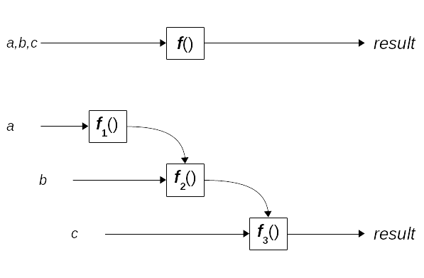

# 第七章：函数转换-柯里化和部分应用

在第六章中，*生成函数-高阶函数*，我们看到了几种操纵函数的方法，以获得具有某些功能变化的新版本。在本章中，我们将深入研究一种特定类型的转换，一种*工厂*方法，它让您可以使用一些固定参数来生成任何给定函数的新版本。

我们将考虑以下内容：

+   *柯里化*，一个经典的 FP 理论函数，将具有许多参数的函数转换为一系列一元函数

+   *部分应用*，另一个历史悠久的 FP 转换，通过固定一些参数来产生函数的新版本

+   我将称之为*部分柯里化*的东西，可以看作是两种先前转换的混合体

公平地说，我们还将看到，一些这些技术可以通过简单的箭头函数来模拟，可能会更清晰。然而，由于您很可能会在各种 FP 文本和网页上找到柯里化和部分应用，因此了解它们的含义和用法非常重要，即使您选择更简单的方法。

# 一点理论

本章中我们将使用的概念在某些方面非常相似，在其他方面则有很大不同。人们常常会对它们的真正含义感到困惑，并且有很多网页滥用术语。您甚至可以说，本章中的所有转换大致等效，因为它们让您将一个函数转换为另一个函数，固定一些参数，留下其他参数自由，并最终导致相同的结果。好吧，我同意，这并不是很清楚！因此，让我们从澄清一些概念开始，并提供一些简短的定义，稍后我们将进行扩展。（如果您觉得自己的眼睛开始发直，请跳过这一部分，稍后再来看！）是的，您可能会觉得以下描述有点令人困惑，但请耐心等待：我们马上就会详细介绍！

+   *柯里化*是将*m*元函数（即，具有*m*个参数的函数）转换为一系列*m*个一元函数的过程，每个函数接收原始函数的一个参数，从左到右。（第一个函数接收原始函数的第一个参数，第二个函数接收第二个参数，依此类推。）每次调用带有参数的函数时，都会产生序列中的下一个函数，最后一个函数执行实际的计算。

+   *部分应用*是提供*n*个参数给*m*元函数的想法，其中*n*小于或等于*m*，以将其转换为具有(*m-n*)个参数的函数。每次提供一些参数时，都会产生一个具有更小元数的新函数。当提供最后的参数时，将执行实际的计算。

+   *部分柯里化*是两种先前想法的混合体：您向*m*元函数提供*n*个参数（从左到右），并产生一个新的元函数（*m-n*）。当这个新函数接收到其他参数，同样是从左到右，它将产生另一个函数。当提供最后的参数时，函数将产生正确的计算结果。

在本章中，我们将看到这三种转换，它们需要什么，以及实现它们的方法。关于这一点，我们将探讨每个高阶函数的编码方式，这将为我们提供有关 JS 编码的一些有趣见解，您可能会发现对其他应用程序很有趣。

# 柯里化

我们已经在第一章的*箭头函数*部分和第三章的*一个参数还是多个参数？*部分中提到了柯里化，但让我们在这里更加彻底。柯里化是一种设备，它使您只能使用单变量函数，即使您需要多变量函数。

将多变量函数转换为一系列单变量函数的想法（或者更严格地说，将具有多个操作数的运算符减少为单操作数运算符的一系列应用）是由 Moses Schönfinkel 研究过的，有一些作者建议，不一定是开玩笑，柯里化更正确地被称为*Schönfinkeling*！

# 处理许多参数

柯里化的想法本身很简单。如果您需要一个带有三个参数的函数，而不是（使用箭头函数）像下面这样写：

```js
const make3 = (a, b, c) => String(100 * a + 10 * b + c);
```

您可以有一系列具有单个参数的函数：

```js
const make3curried = a => b => c => String(100 * a + 10 * b + c);
```

或者，您可能希望将它们视为嵌套函数：

```js
const make3curried2 = function(a) {
 return function(b) {
 return function(c) {
 return String(100 * a + 10 * b + c);
 };
 };
};
```

在使用上，每个函数的使用方式有一个重要的区别。虽然您可以像这样调用第一个函数，比如`make3(1,2,4)`，但是对于第二个定义，这样是行不通的。让我们来看看为什么：`make3curried()`是一个*一元*（单参数）函数，所以我们应该写`make3curried(1)`...但是这会返回什么？根据上面的定义，这也会返回一个一元函数--*那*个函数也会返回一个一元函数！因此，要获得与三元函数相同的结果，正确的调用应该是`make3curried(1)(2)(4)`！参见图 7.1：

图 7.1。普通函数和柯里化等价函数之间的区别。

仔细研究这一点--我们有第一个函数，当我们对其应用一个参数时，我们得到第二个函数。对它应用一个参数会产生第三个函数和最终的应用会产生期望的结果。这可以被视为在理论计算中不必要的练习，但实际上它带来了一些优势，因为您可以始终使用一元函数，即使您需要具有更多参数的函数。

由于存在柯里化转换，也存在反柯里化转换！在我们的例子中，我们会写`make3uncurried = (a,b,c) => make3curried(a)(b)(c)`来恢复柯里化过程，并再次使用，一次性提供所有参数。

在某些语言中，比如 Haskell，函数只允许接受一个参数--但是语言的语法允许您调用函数，就好像允许多个参数一样。对于我们的例子，在 Haskell 中，写`make3curried 1 2 4`会产生结果 124，甚至不需要有人意识到它涉及*三*个函数调用，每个函数都有一个参数。由于您不在参数周围写括号，并且不用逗号分隔它们，您无法知道您没有提供三个单一值而是三个值的三元组。

柯里化在 Scala 或 Haskell 中是基本的，这些都是完全功能的语言，但 JavaScript 有足够的功能来允许我们在工作中定义和使用柯里化。这不会那么容易--毕竟，它不是内置的--但我们将能够应对。

因此，回顾基本概念，我们原始的`make3()`和`make3curried()`之间的关键区别如下：

+   `make3()`是一个三元函数，但`make3curried()`是一元的

+   `make3()`返回一个字符串；`make3curried()`返回另一个函数--它本身返回*第二*个函数，然后返回*第三*个函数，最终返回一个字符串！

+   您可以通过编写类似`make3(1,2,4)`的东西来生成一个字符串，它返回 124，但是您将不得不编写`make3curried(1)(2)(4)`来获得相同的结果

为什么要费这么大的劲呢？让我们看一个简单的例子，然后我们将看到更多的例子。假设您有一个计算增值税（VAT）的函数：

```js
const addVAT = (rate, amount) => amount * (1 + rate / 100);
addVAT(20, 500); // 600 -- *that is,* 500 + 20%
addVAT(15, 200); // 230 -- 200 +15%
```

如果您必须应用单一的恒定费率，那么您可以对`addVAT()`函数进行柯里化，以生成一个更专业的版本，它总是应用您给定的费率。例如，如果您的国家税率是 6%，那么您可以有以下内容：

```js
const addVATcurried = rate => amount => amount * (1 + rate / 100);
const addNationalVAT = addVATcurried(6);
addNationalVAT(1500); // 1590 -- 1500 + 6%
```

第一行定义了我们的增值税计算函数的柯里化版本。给定一个税率，`addVATcurried()`返回一个新函数，当给定一定金额的钱时，最终将原始税率加到其中。因此，如果国家税率为 6%，那么`addNationalVAT()`将是一个函数，它会给任何给定的金额增加 6%。例如，如果我们要计算`addNationalVAT(1500)`，就像前面的代码一样，结果将是 1590：1500 美元，再加上 6%的税。

当然，你可能会认为这种柯里化对于只增加 6%的税来说有点过分，但简化才是最重要的。让我们看一个例子。在您的应用程序中，您可能希望包含一些日志记录，例如以下函数：

```js
let myLog = (severity, logText) => {
 // *display logText in an appropriate way,*
 // *according to its severity ("NORMAL", "WARNING", or "ERROR")*
};
```

然而，采用这种方法，每次您想要显示一个正常的日志消息时，您将写`myLog`(`"NORMAL"`, "一些正常文本")，而对于警告，您将写`myLog`(`"WARNING"`, "一些警告")--但您可以通过柯里化简化一下，通过固定`myLog()`的第一个参数，如下所示，使用我们稍后将看到的`curry()`函数：

```js
myLog = curry(myLog);
// *replace myLog by a curried version of itself*

const myNormalLog = myLog("NORMAL");
const myWarningLog = myLog("WARNING");
const myErrorLog = myLog("ERROR");
```

你得到了什么？现在你可以只写`myNormalLog("一些正常文本")`或`myWarningLog("一些警告")`，因为你已经对`myLog()`进行了柯里化，然后固定了它的参数--这使得代码更简单，更易读！

顺便说一句，如果您愿意，您也可以通过逐个案例地对原始的非柯里化`myLog()`函数进行柯里化来以单个步骤实现相同的结果：

```js
const myNormalLog2 = curry(myLog)("NORMAL");
const myWarningLog2 = curry(myLog)("WARNING");
const myErrorLog2 = curry(myLog)("ERROR");
```

# 手动柯里化

如果我们只想为特殊情况实现柯里化，就没有必要做任何复杂的事情，因为我们可以使用简单的箭头函数来处理：我们看到了`make3curried()`和`addVATcurried()`都是如此，所以没有必要重新审视这个想法。

相反，让我们看一些自动执行这些操作的方法，这样我们将能够生成任何函数的等效柯里化版本，即使事先不知道它的 arity。更进一步，我们可能希望编写一个函数的更智能版本，它可以根据接收到的参数数量而有所不同。例如，我们可以有一个`sum(x,y)`函数，它的行为如下例所示：

```js
sum(3, 5); // 8; *did you expect otherwise?*

const add2 = sum(2);
add2(3); // 5

sum(2)(7); // 9 -- *as if it were curried*
```

我们可以手动实现这种行为。我们的函数将是以下内容：

```js
const sum = (x, y) => {
 if (x !== undefined && y !== undefined) {
 return x + y;
 } else if (x !== undefined && y == undefined) {
 return z => sum(x, z);
 } else {
 return sum;
 }
};
```

让我们回顾一下我们在这里做了什么。我们手动柯里化的函数有以下行为：

+   如果我们用两个参数调用它，它会将它们相加，并返回总和；这提供了我们的第一个用例，就像`sum(3,5)==8`一样。

+   如果只提供一个参数，它将返回一个新函数。这个新函数期望一个参数，并将返回该参数和原始参数的总和：这种行为是我们在其他两种用例中所期望的，比如`add2(3)==5`或`sum(2)(7)==9`。

+   最后，如果没有提供参数，它将返回自身。这意味着我们可以写`sum()(1)(2)`如果我们愿意。（不，我想不出想要写那个的原因...）

因此，如果我们愿意，我们可以在函数的定义中直接包含柯里化。然而，您必须同意，必须在每个函数中处理所有特殊情况，这很容易变得麻烦，也容易出错。因此，让我们尝试找出一些更通用的方法来实现相同的结果，而不需要任何特定的编码。

# 使用 bind()进行柯里化

我们可以通过使用`.bind()`方法找到柯里化的解决方案。这使我们能够固定一个参数（或更多，如果需要；我们现在不需要，但以后会用到），并提供具有固定参数的函数。当然，许多库（如 Lodash、Underscore、Ramda 等）提供了这种功能，但我们想看看如何自己实现。

在[`developer.mozilla.org/en/docs/Web/JavaScript/Reference/Global_objects/Function/bind`](https://developer.mozilla.org/en/docs/Web/JavaScript/Reference/Global_objects/Function/bind)上阅读更多关于`.bind()`的内容--这将很有用，因为我们将在本章中多次利用这个方法。

我们的实现非常简短，但需要一些解释：

```js
const curryByBind = fn =>
 fn.length === 0 ? fn() : p => curryByBind(fn.bind(null, p));
```

首先注意到`curry()`总是返回一个新函数，该函数取决于作为其参数给定的函数`fn`。如果函数没有（更多）剩余参数（当`fn.length===0`时），因为所有参数已经被固定，我们可以通过执行`fn()`来简单评估它。否则，柯里化函数的结果将是一个新函数，它接收一个参数，并产生一个新的柯里化函数，其中另一个参数被固定。让我们通过一个详细的例子来看看这个过程，再次使用我们在本章开头看到的`make3()`函数：

```js
const make3 = (a, b, c) => String(100 * a + 10 * b + c);

const f1 = curryByBind(make3); // *f1 is a function, that will fix make3's 1st parameter*
const f2 = f1(6); // *f2 is a function, that will fix make3's 2nd parameter*
const f3 = f2(5); // *f3 is a function, that will fix make3's last parameter*
const f4 = f3(8); // *"658" is calculated, since there are no more parameters to fix*
```

这段代码的解释如下：

+   第一个函数`f1()`还没有接收任何参数。它的结果是一个单参数函数，它本身将产生`make3()`的柯里化版本，其第一个参数固定为给定的值。

+   调用`f1(6)`会产生一个新的一元函数`f2()`，它本身将产生`make3()`的柯里化版本--但其第一个参数设置为`6`，因此实际上新函数将结束固定`make3()`的第二个参数。

+   类似地，调用`f2(5)`会产生第三个一元函数`f3()`，它将产生`make3()`的一个版本，但固定其第三个参数，因为前两个参数已经被固定。

+   最后，当我们计算`f3(8)`时，这将把`make3()`的最后一个参数固定为`8`，并且由于没有更多的参数了，三次绑定的`make3()`函数被调用，产生结果`"658"`。

如果您想手动进行函数柯里化，可以使用 JavaScript 的`.bind()`方法。顺序如下：

```js
const step1 = make3.bind(null, 6);
const step2 = step1.bind(null, 5);
const step3 = step2.bind(null, 8);
step3(); // *"658"*
```

在每一步中，我们提供一个进一步的参数。（需要`null`值来提供上下文。如果它是附加到对象的方法，我们将该对象作为`.bind()`的第一个参数提供。由于这不是这种情况，所以期望是`null`。）这相当于我们的代码所做的事情，唯一的例外是最后一次，`curryByBind()`执行实际计算，而不是让您自己来做，就像`step3()`中一样。

测试这个转换相当简单--因为柯里化的可能方式并不多！

```js
const make3 = (a, b, c) => String(100 * a + 10 * b + c);

describe("with curryByBind", function() {
 it("you fix arguments one by one", () => {
 const make3a = curryByBind(make3);
 const make3b = make3a(1)(2);
 const make3c = make3b(3);
 expect(make3c).toBe(make3(1, 2, 3));
 });
});
```

还有什么可以测试的吗？也许可以添加只有一个参数的函数，但没有更多可以尝试的了。

如果我们想对具有可变参数数量的函数进行柯里化，那么使用`fn.length`是行不通的；它只对具有固定参数数量的函数有值。我们可以通过提供所需的参数数量来简单解决这个问题：

```js
const curryByBind2 = (fn, len = fn.length) =>
 len === 0 ? fn() : p => curryByBind2(fn.bind(null, p), len - 1);

const sum2 = (...args) => args.reduce((x, y) => x + y, 0);
sum2.length; // *0;* *curryByBind() wouldn't work*

sum2(1, 5, 3); // 9
sum2(1, 5, 3, 7); // 16
sum2(1, 5, 3, 7, 4); // 20

curriedSum5 = curryByBind2(sum2, 5); // *curriedSum5 will expect 5 parameters*
curriedSum5(1)(5)(3)(7)(4); // *20*
```

新的`curryByBind2()`函数与以前的工作方式相同，但是不再依赖于`fn.length`，而是使用`len`参数，该参数默认为`fn.length`，用于具有恒定参数数量的标准函数。请注意，当`len`不为 0 时，返回的函数调用`curry2()`，并将`len-1`作为其最后一个参数--这是有道理的，因为如果一个参数刚刚被固定，那么剩下要固定的参数就会少一个。

在我们的例子中，`sum()`函数可以处理任意数量的参数，JavaScript 告诉我们`sum.length`为零。然而，当对函数进行柯里化时，如果我们将`len`设置为`5`，柯里化将被视为`sum()`是一个五参数函数--代码中列出的最后一行显示这确实是这种情况。

与之前一样，测试是相当简单的，因为我们没有要尝试的变体：

```js
const sum2 = (...args) => args.reduce((x, y) => x + y, 0);

describe("with curryByBind2", function() {
 it("you fix arguments one by one", () => {
 const suma = curryByBind2(sum2, 5);
 const sumb = suma(1)(2)(3)(4)(5);
 expect(sumb).toBe(sum(1, 2, 3, 4, 5));
 });

 it("you can also work with arity 1", () => {
 const suma = curryByBind2(sum2, 1);
 const sumb = suma(111);
 expect(sumb).toBe(sum(111));
 });
});
```

我们测试了将柯里化函数的 arity 设置为 1，作为边界情况，但没有更多的可能性。

# 使用 eval()进行柯里化

还有一种有趣的柯里化函数的方法，通过使用`eval()`创建一个新的函数... 是的，那个不安全的、危险的`eval()`！（记住我们之前说过的：这是为了学习目的，但最好避免`eval()`可能带来的潜在安全问题！）我们还将使用我们在第五章的*使用范围*部分编写的`range()`函数，*声明式编程-更好的风格*。

像 LISP 这样的语言一直都有生成和执行 LISP 代码的可能性。JavaScript 也共享了这一功能，但并不经常使用--主要是因为可能带来的危险！然而，在我们的情况下，由于我们想要生成新的函数，利用这种被忽视的能力似乎是合乎逻辑的。

这个想法很简单：在本章的*一点理论*部分中，我们看到我们可以通过使用箭头函数轻松地柯里化一个函数：

```js
const make3 = (a, b, c) => String(100 * a + 10 * b + c);

const make3curried = a => b => c => String(100 * a + 10 * b + c);
```

让我们对第二个版本进行一些更改，以便以后能更好地帮助我们：

```js
const make3curried = x1 => x2 => x3 => make3(x1, x2, x3);
```

生成等效版本所需的代码如下。我们将使用我们在第五章的*使用范围*部分编写的`range()`函数，以避免需要编写显式循环：

```js
const range = (start, stop) =>
 new Array(stop - start).fill(0).map((v, i) => start + i);

const curryByEval = (fn, len = fn.length) =>
 eval(`**${range(0, len).map(i => `x${i}`).join("=>")}** **=> 
 ${fn.name}(${range(0, len).map(i => `x${i}`).join(",")})**`);
```

这是相当多的代码需要消化，实际上，它应该被编码成几行分开来更容易理解。让我们以`make3()`函数作为输入来跟随它：

+   `range()`函数生成一个值为`[0,1,2]`的数组。如果我们不提供`len`参数，将使用`make3.length`（即 3）。

+   我们使用`.map()`生成一个包含值`["x0","x1","x2"]`的新数组。

+   我们使用`join()`将该数组中的值连接起来，生成`x0=>x1=>x2`，这将是我们将要`eval()`的代码的开头。

+   然后我们添加一个箭头，函数的名称和一个开括号，以使我们新生成的代码的中间部分：`=> make3(`。

+   我们再次使用`range()`、`map()`和`join()`，但这次是为了生成参数列表：`x0,x1,x2`。

+   最后我们添加一个闭括号，并在应用`eval()`之后，我们得到了`make3()`的柯里化版本：

```js
curryByEval(make3); // x0=>x1=>x2=> make3(x0,x1,x2)
```

只有一个问题：如果原始函数没有名称，转换就无法进行。（有关更多信息，请查看第三章的*关于 Lambda 和函数*部分，*从函数开始-核心概念*。）我们可以通过包含要柯里化的函数的实际代码来解决函数名称问题：

```js
const curryByEval2 = (fn, len = fn.length) =>
 eval(`${range(0, len).map(i => `x${i}`).join("=>")} => 
 **(${fn.toString()})**(${range(0, len).map(i => `x${i}`).join(",")})`);
```

唯一的变化是，我们用实际的代码替换原始函数名：

```js
curryByEval2(make3); // x0=>x1=>x2=> ((a,b,c) => 100*a+10*b+c)(x0,x1,x2)
```

生成的函数令人惊讶，有一个完整的函数后跟其参数--但这实际上是有效的 JavaScript！所有以下都会产生相同的结果：

```js
const add = (x, y) => x + y;
add(2, 5); // 7
((x, y) => x + y)(2, 5); // *7*
```

当你想调用一个函数时，你写下它，并在括号内跟上它的参数--这就是我们正在做的，即使看起来有点奇怪！

# 部分应用

我们将要考虑的第二个转换允许你固定函数的一些参数，创建一个接收其余参数的新函数。让我们通过一个无意义的例子来澄清这一点。想象一下，你有一个有五个参数的函数。你可能想要固定第二个和第五个参数，部分应用将产生一个新版本的函数，固定这两个参数，但为新的调用留下其他三个。如果你用这三个必需的参数调用结果函数，它将使用原始的两个固定参数加上新提供的三个参数产生正确的答案。

在函数应用中只指定一些参数，生成剩余参数的函数的想法被称为*投影*：你被认为是*投影*函数到剩余的参数上。我们不会使用这个术语，但我们想引用一下，以防你在其他地方找到它。

让我们考虑一个例子，使用被广泛认为是现代 Ajax 调用的`fetch()` API。你可能想要获取多个资源，总是指定调用的相同参数（例如请求头），只改变搜索的 URL。因此，通过部分应用，你可以创建一个新的`myFetch()`函数，它总是提供固定的参数。假设我们有一个实现这种应用的`partial()`函数，看看我们如何使用它。

你可以在[`developer.mozilla.org/en-US/docs/Web/API/Fetch_API/Using_Fetch`](https://developer.mozilla.org/en-US/docs/Web/API/Fetch_API/Using_Fetch)上了解更多关于`fetch()`的信息。根据[`caniuse.com/#search=fetch`](http://caniuse.com/#search=fetch)的信息，你可以在大多数浏览器中使用它，除了（哦，惊讶！）Internet Explorer...但你可以通过 polyfill 绕过这个限制，比如在[`github.com/github/fetch`](https://github.com/github/fetch)找到的 polyfill：

```js
const myParameters = {
 method: "GET",
 headers: new Headers(),
 cache: "default"
};

const myFetch = partial(fetch, undefined, myParameters);
// *undefined means the first argument for fetch is not yet defined*
// *the second argument for fetch() is set to myParameters*

myFetch("a/first/url").then(/* do something */).catch(/* on error */);
myFetch("a/second/url")
 .then(/* do something else */)
 .catch(/* on error */);
```

如果请求参数是`fetch()`的第一个参数，柯里化就会起作用。（我们稍后会详细讨论参数的顺序。）通过部分应用，你可以替换任何参数，所以在这种情况下，`myFetch()`最终成为一个一元函数。这个新函数将从任何你希望的 URL 获取数据，始终传递相同的参数集合进行`GET`操作。

# 箭头函数的部分应用

手动进行部分应用，就像我们用柯里化一样，太复杂了，因为对于一个有五个参数的函数，你需要编写代码，允许用户提供 32 种可能的固定和未固定参数的组合（32 等于 5 的 2 次方），即使你可以简化问题，编写和维护仍然很困难。见图 7.2：

图 7.2。部分应用可能让你首先提供一些参数，然后提供其余的参数，最终得到结果。

然而，使用箭头函数进行部分应用要简单得多。对于上面提到的例子，我们会有以下代码。在这种情况下，我们假设我们想要将第二个参数固定为 22，第五个参数固定为 1960：

```js
const nonsense = (a, b, c, d, e) => `${a}/${b}/${c}/${d}/${e}`;

const fix2and5 = (a, c, d) => nonsense(a, 22, c, d, 1960);
```

以这种方式进行部分应用是相当简单的，尽管我们可能想找到一个更一般的解决方案。你可以固定任意数量的参数，你所做的就是从之前的函数中创建一个新函数，但固定了更多的参数。例如，你现在可能还想将新的`fix2and5()`函数的最后一个参数固定为 9；没有比这更容易的了！

```js
const fixLast = (a, c) => fix2and5(a, c, 9);
```

如果你愿意，你也可以写成`nonsense(a, 22, c, 9, 1960)`，但事实仍然是，使用箭头函数固定参数是简单的。现在让我们考虑一个更一般的解决方案。

# 使用 eval()进行部分应用

如果我们想要能够部分应用固定任意组合的参数，我们必须有一种方法来指定哪些参数将被保留，哪些将从那一点开始被固定。一些库，比如 Underscore 或 LoDash，使用一个特殊对象 `_` 来表示省略的参数。以这种方式，仍然使用相同的 `nonsense()` 函数，我们将编写以下内容：

```js
const fix2and5 = _.partial(nonsense, _, 22, _, _, 1960);
```

我们可以通过使用一个全局变量来表示一个待处理的、尚未固定的参数来做同样的事情，但让我们简化一下，只需写 `undefined` 来表示缺少的参数。

在检查未定义时，记得始终使用 `===` 运算符；使用 `==` 会导致 `null==undefined`，你不希望出现这种情况。请参阅 [`developer.mozilla.org/en/docs/Web/JavaScript/Reference/Global_Objects/undefined`](https://developer.mozilla.org/en/docs/Web/JavaScript/Reference/Global_Objects/undefined) 了解更多信息。

我们想要编写一个函数，部分应用一些参数，并将其余部分留给未来。我们想要编写类似以下的代码，并以与我们之前使用箭头函数相同的方式生成一个新函数：

```js
const nonsense = (a, b, c, d, e) => `${a}/${b}/${c}/${d}/${e}`;

const fix2and5 = partialByEval(
 nonsense,
 undefined,
 22,
 undefined,
 undefined,
 1960
);
// *fix2and5 would become* (X0, X2, X3) => nonsense(X0, 22, X2, X3, 1960);
```

我们可以回到使用 `eval()`，并想出类似以下的东西：

```js
const range = (start, stop) =>
 new Array(stop - start).fill(0).map((v, i) => start + i);

const partialByEval = (fn, ...args) => {
 const rangeArgs = range(0, fn.length);
 const leftList = rangeArgs
 .map(v => (args[v] === undefined ? `x${v}` : null))
 .filter(v => !!v)
 .join(",");
 const rightList = rangeArgs
 .map(v => (args[v] === undefined ? `x${v}` : args[v]))
 .join(",");
 return eval(`(${leftList}) => ${fn.name}(${rightList})`);
};
```

让我们一步一步地分解这个函数。我们再次使用我们的 `range()` 函数：

+   `rangeArgs` 是一个包含从零到输入函数的参数数量（不包括）的数字的数组。

+   `leftList` 是一个字符串，表示未应用变量的列表。在我们的例子中，它将是 `"X0,X2,X3"`，因为我们为第二个和第五个参数提供了值。这个字符串将用于生成箭头函数的左部分。

+   `rightList` 是一个字符串，表示调用提供的函数的参数列表。在我们的例子中，它将是 `"X0,'Z',X2,X3,1960"`。我们将使用这个字符串来生成箭头函数的右部分。

在生成了两个列表之后，代码的剩余部分只是生成适当的字符串，并将其传递给 `eval()` 以获得一个函数。

如果我们对具有可变数量参数的函数进行部分应用，我们可以用 `args.length` 替换 `fn.length`，或者提供一个额外的（可选的）参数来指定要使用的数量，就像我们在本章的柯里化部分所做的那样。

顺便说一句，我故意用这种冗长的方式来表达这个函数，以使其更清晰。（我们之前已经看到了类似的，虽然更短的代码，当我们使用 `eval()` 进行柯里化时。）然而，请注意，你可能会找到一个更短、更紧凑和更难理解的版本……这就是给函数式编程带来不好名声的代码！

```js
const partialByEval2 = (fn, ...args) =>
 eval(
 `(${range(0, fn.length)
 .map(v => (args[v] === undefined ? `x${v}` : null))
 .filter(v => !!v)
 .join(",")}) => ${fn.name}(${range(0, fn.length)
 .map(v => (args[v] == undefined ? `x${v}` : args[v]))
 .join(",")})`
 );
```

让我们通过编写一些测试来结束这一部分。我们应该考虑一些什么事情？

+   当我们进行部分应用时，生成的函数的参数个数应该减少。

+   当参数按正确顺序传入时，应该调用原始函数。

我们可以编写类似以下的代码，允许在不同位置固定参数。我们可以直接使用 `nonsense()` 函数，而不是使用间谍或模拟，因为它非常高效：

```js
const nonsense = (a, b, c, d, e) => `${a}/${b}/${c}/${d}/${e}`;

describe("with partialByEval()", function() {
 it("you could fix no arguments", () => {
 const nonsensePC0 = partialByEval(nonsense);
 expect(nonsensePC0.length).toBe(5);
 expect(nonsensePC0(0, 1, 2, 3, 4)).toBe(nonsense(0, 1, 2, 3, 4));
 });

 it("you could fix only some initial arguments", () => {
 const nonsensePC1 = partialByEval(nonsense, 1, 2, 3);
 expect(nonsensePC1.length).toBe(2);
 expect(nonsensePC1(4, 5)).toBe(nonsense(1, 2, 3, 4, 5));
 });

 it("you could skip some arguments", () => {
 const nonsensePC2 = partialByEval(
 nonsense,
 undefined,
 22,
 undefined,
 44
 );
 expect(nonsensePC2.length).toBe(3);
 expect(nonsensePC2(11, 33, 55)).toBe(nonsense(11, 22, 33, 44, 55));
 });

 it("you could fix only some last arguments", () => {
 const nonsensePC3 = partialByEval(
 nonsense,
 undefined,
 undefined,
 undefined,
 444,
 555
 );
 expect(nonsensePC3.length).toBe(3);
 expect(nonsensePC3(111, 222, 333)).toBe(
 nonsense(111, 222, 333, 444, 555)
 );
 });

 it("you could fix ALL the arguments", () => {
 const nonsensePC4 = partialByEval(nonsense, 6, 7, 8, 9, 0);
 expect(nonsensePC4.length).toBe(0);
 expect(nonsensePC4()).toBe(nonsense(6, 7, 8, 9, 0));
 });
});
```

我们编写了一个部分应用的高阶函数，但它并不像我们希望的那样灵活。例如，我们可以在第一次调用中固定一些参数，但然后我们必须在下一次调用中提供所有其余的参数。如果在调用 `partialByEval()` 后，我们得到一个新函数，并且如果我们没有提供所有需要的参数，我们将得到另一个函数，以此类推，直到所有参数都被提供——这与柯里化的情况有些类似。因此，让我们改变部分应用的方式，并考虑另一个解决方案。

# 使用闭包进行部分应用

让我们再看一种进行部分应用的方式，它的行为方式有点像我们在本章前面写的`curry()`函数，并解决了我们在上一节末尾提到的不足：

```js
const partialByClosure = (fn, ...args) => {
 const partialize = (...args1) => (...args2) => {
 for (let i = 0; i < args1.length && args2.length; i++) {
 if (args1[i] === undefined) {
 args1[i] = args2.shift();
 }
 }
 const allParams = [...args1, ...args2];
 return (allParams.includes(undefined) ||
 allParams.length < fn.length
 ? partialize
 : fn)(...allParams);
 };

 return partialize(...args);
};
```

哇，一大段代码！关键在于内部函数`partialize()`。给定一个参数列表（`args1`），它生成一个接收第二个参数列表（`args2`）的函数：

+   首先，它用`args2`中的值替换`args1`中所有可能的未定义值。

+   然后，如果`args2`中还有任何参数，它也会将它们附加到`args1`的参数中，生成`allParams`。

+   最后，如果参数列表中不再包含任何未定义值，并且足够长，它就会调用原始函数。

+   否则，它会部分化自身，等待更多的参数。

举个例子会更清楚。让我们回到我们可靠的`make3()`函数，并构建它的一个部分版本：

```js
const make3 = (a, b, c) => String(100 * a + 10 * b + c);
const f1 = partialByClosure(make3, undefined, 4);
```

现在我们写一个第二个函数：

```js
const f2 = f1(7);
```

发生了什么？原始参数列表（`[undefined, 4]`）与新列表（在这种情况下是一个单一元素，`[7]`）合并，生成一个现在接收`7`和`4`作为它的前两个参数的函数。然而，这还不够，因为原始函数需要三个参数。如果我们现在写：

```js
const f3 = f2(9);
```

然后，当前的参数列表将与新参数合并，生成`[7,4,9]`。由于列表现在是完整的，原始函数将被评估，产生`749`作为最终结果。

这段代码的结构与我们之前在*使用`bind()`进行柯里化*部分写的另一个高阶函数有重要的相似之处。

+   如果所有参数都已经提供，原始函数就会被调用。

+   如果还需要一些参数（在柯里化时，只是简单地计算参数的数量；在进行部分应用时，你还必须考虑可能存在一些未定义的参数），那么高阶函数会调用自身来生成函数的新版本，这个新版本将*等待*缺失的参数。

让我们最后写一些测试，展示我们新的部分应用方式的增强。基本上，我们之前做的所有测试都会生效，但我们还必须尝试按顺序应用参数，这样我们应该在两个或更多步骤的应用之后得到最终结果。然而，由于我们现在可以用任意数量的参数调用我们的中间函数，我们无法测试参数个数：对于所有函数，`function.length===0`：

```js
describe("with partialByClosure()", function() {
 it("you could fix no arguments", () => {
 const nonsensePC0 = partialByClosure(nonsense);
 expect(nonsensePC0(0, 1, 2, 3, 4)).toBe(nonsense(0, 1, 2, 3, 4));
 });

 it("you could fix only some initial arguments, and then some more", () => {
 const nonsensePC1 = partialByClosure(nonsense, 1, 2, 3);
 const nonsensePC1b = nonsensePC1(undefined, 5);
 expect(nonsensePC1b(4)).toBe(nonsense(1, 2, 3, 4, 5));
 });

 it("you could skip some arguments", () => {
 const nonsensePC2 = partialByClosure(
 nonsense,
 undefined,
 22,
 undefined,
 44
 );
 expect(nonsensePC2(11, 33, 55)).toBe(nonsense(11, 22, 33, 44, 55));
 });

 it("you could fix only some last arguments", () => {
 const nonsensePC3 = partialByClosure(
 nonsense,
 undefined,
 undefined,
 undefined,
 444,
 555
 );
 expect(nonsensePC3(111)(222, 333)).toBe(
 nonsense(111, 222, 333, 444, 555)
 );
 });

 it("you could simulate currying", () => {
 const nonsensePC4 = partialByClosure(nonsense);
 expect(nonsensePC4(6)(7)(8)(9)(0)).toBe(nonsense(6, 7, 8, 9, 0));
 });

 it("you could fix ALL the arguments", () => {
 const nonsensePC5 = partialByClosure(nonsense, 16, 17, 18, 19, 20);
 expect(nonsensePC5()).toBe(nonsense(16, 17, 18, 19, 20));
 });
});
```

代码比以前长了，但测试本身很容易理解。倒数第二个测试应该会让你想起柯里化！

# 部分柯里化

最后一个我们将看到的转换是柯里化和部分应用的混合。如果你在网上搜索一下，在一些地方你会发现它被称为*柯里化*，在其他地方被称为*部分应用*，但事实上，它都不太符合……所以我还在犹豫不决，称它为*部分柯里化*！

这个想法是，给定一个函数，固定它的前几个参数，并生成一个新的函数来接收其余的参数。然而，如果给这个新函数传递的参数较少，它将固定它所接收到的参数，并生成一个新的函数来接收其余的参数，直到所有参数都被给出并且最终结果可以被计算出来。参见图 7.3：

图 7.3。"部分柯里化"是柯里化和部分应用的混合。你可以提供任意数量的参数，直到所有参数都被提供，然后计算结果。

为了举例说明，让我们回到我们在之前部分中一直在使用的`nonsense()`函数。假设我们已经有了一个`partialCurry()`函数：

```js
const nonsense = (a, b, c, d, e) => `${a}/${b}/${c}/${d}/${e}`;

const pcNonsense = partialCurry(nonsense);
const fix1And2 = pcNonsense(9, 22); // fix1And2 is now a ternary function
const fix3 = fix1And2(60); // fix3 is a binary function
const fix4and5 = fix3(12, 4); // fix4and5 === nonsense(9,22,60,12,4), "9/22/60/12/4"
```

原始函数的参数个数为 5。当我们*部分柯里化*该函数，并给它参数 9 和 22 时，它变成了一个三元函数，因为在原始的五个参数中，有两个已经固定。如果我们拿到这个三元函数并给它一个参数（60），结果就是另一个函数：在这种情况下，是一个二元函数，因为现在我们已经固定了原始五个参数中的前三个。最后一次调用，提供最后两个参数，然后执行实际计算所需的结果。

柯里化和部分应用有一些共同点，但也有一些不同之处：

+   原始函数被转换为一系列函数，每个函数产生下一个函数，直到系列中的最后一个实际执行其计算。

+   您始终从第一个参数（最左边的参数）开始提供参数，就像柯里化一样，但您可以像部分应用一样提供多个参数。

+   在柯里化函数时，所有中间函数都是一元的，但部分柯里化则不需要如此。然而，如果在每个实例中我们提供一个参数，那么结果将需要与普通柯里化一样多的步骤。

所以，我们有了我们的定义--现在让我们看看如何实现我们的新高阶函数；我们可能会在本章的这一部分中重复使用前几节中的一些概念。

# 使用 bind()进行部分柯里化

与我们对柯里化所做的类似，有一种简单的方法可以进行部分柯里化。我们将利用`.bind()`实际上可以一次固定多个参数的事实：

```js
const partialCurryingByBind = fn =>
 fn.length === 0
 ? fn()
 : (...pp) => partialCurryingByBind(**fn.bind(null, ...pp)**);
```

将代码与之前的`curryByBind()`函数进行比较，您会看到非常小的差异：

```js
const curryByBind = fn =>
 fn.length === 0 
 ? fn() 
 : p => curryByBind(fn.bind(null, p));
```

机制完全相同。唯一的区别是在我们的新函数中，我们可以同时绑定多个参数，而在`curryByBind()`中我们总是只绑定一个。我们可以重新访问我们之前的例子--唯一的区别是我们可以在更少的步骤中得到最终结果：

```js
const make3 = (a, b, c) => String(100 * a + 10 * b + c);

const f1 = partialCurryingByBind(make3);
const f2 = f1(6, 5); // *f2 is a function, that fixes make3's first two arguments*
const f3 = f2(8); // *"658" is calculated, since there are no more parameters to fix*
```

顺便说一句，只要意识到现有的可能性，您可以在柯里化时固定一些参数：

```js
const g1 = partialCurryingByBind(make3)(8, 7);
const g2 = g1(6); // "876"
```

测试这个函数很容易，我们提供的例子是一个很好的起点。但是，请注意，由于我们允许固定任意数量的参数，我们无法测试中间函数的参数个数：

```js
const make3 = (a, b, c) => String(100 * a + 10 * b + c);

describe("with partialCurryingByBind", function() {
 it("you could fix arguments in several steps", () => {
 const make3a = partialCurryingByBind(make3);
 const make3b = make3a(1, 2);
 const make3c = make3b(3);
 expect(make3c).toBe(make3(1, 2, 3));
 });

 it("you could fix arguments in a single step", () => {
 const make3a = partialCurryingByBind(make3);
 const make3b = make3a(10, 11, 12);
 expect(make3b).toBe(make3(10, 11, 12));
 });

 it("you could fix ALL the arguments", () => {
 const make3all = partialCurryingByBind(make3);
 expect(make3all(20, 21, 22)).toBe(make3(20, 21, 22));
 });

 it("you could fix one argument at a time", () => {
 const make3one = partialCurryingByBind(make3)(30)(31)(32);
 expect(make3one).toBe(make3(30, 31, 32));
 });
});
```

现在，让我们考虑具有可变参数数量的函数。与以前一样，我们将不得不提供额外的值：

```js
const partialCurryingByBind2 = (fn, len = fn.length) =>
    len === 0
 ? fn()
 : (...pp) =>
 partialCurryingByBind2(
 fn.bind(null, ...pp),
                  len - pp.length
 );
```

我们可以以一种简单的方式尝试这一点，重新访问一些页面前的柯里化示例：

```js
const sum = (...args) => args.reduce((x, y) => x + y, 0);

pcSum5 = partialCurryingByBind2(sum2, 5); // curriedSum5 will expect 5 parameters
pcSum5(1, 5)(3)(7, 4); // 20
```

新的`pcSum5()`函数首先收集了两个参数（1,5），并产生了一个期望另外三个参数的新函数。给定了一个单一参数（3），并创建了第三个函数，等待最后两个参数。当提供了这两个参数（7,4）时，原始函数被调用，计算结果为（20）。

我们还可以为这种替代的部分柯里化添加一些测试：

```js
const sum2 = (...args) => args.reduce((x, y) => x + y, 0);

describe("with partialCurryingByBind2", function() {
 it("you could fix arguments in several steps", () => {
 const suma = partialCurryingByBind2(sum2, 3);
 const sumb = suma(1, 2);
 const sumc = sumb(3);
 expect(sumc).toBe(sum2(1, 2, 3));
 });

 it("you could fix arguments in a single step", () => {
 const suma = partialCurryingByBind2(sum2, 4);
 const sumb = suma(10, 11, 12, 13);
 expect(sumb).toBe(sum(10, 11, 12, 13));
 });

 it("you could fix ALL the arguments", () => {
 const sumall = partialCurryingByBind2(sum2, 5);
 expect(sumall(20, 21, 22, 23, 24)).toBe(sum2(20, 21, 22, 23, 24));
 });

 it("you could fix one argument at a time", () => {
 const sumone = partialCurryingByBind2(sum2, 6)(30)(31)(32)(33)(34)(
 35
 );
 expect(sumone).toBe(sum2(30, 31, 32, 33, 34, 35));
 });
});
```

尝试不同的参数个数比坚持只使用一个更好，所以我们为了多样性而这样做了。

# 使用闭包进行部分柯里化

与部分应用一样，有一种使用闭包的解决方案：

```js
const partialCurryByClosure = fn => {
 const curryize = (...args1) => (...args2) => {
 const allParams = [...args1, ...args2];
 return (allParams.length < func.length ? curryize : fn)(
 ...allParams
 );
 };
 return curryize();
};
```

如果您比较`partialCurryByClosure()`和`partialByClosure()`，主要区别在于部分柯里化，因为我们总是从左边提供参数，没有办法跳过一些参数，您将之前的任何参数与新参数连接起来，并检查是否已经足够。如果新的参数列表达到了原始函数的预期参数个数，您可以调用它，并得到最终结果。在其他情况下，您只需使用`curryize()`来获得一个新的中间函数，等待更多的参数。

与以前一样，如果您必须处理具有不同数量参数的函数，您可以为部分柯里化函数提供额外的参数：

```js
const partialCurryByClosure2 = (fn, len = fn.length) => {
 const curryize = (...args1) => (...args2) => {
 const allParams = [...args1, ...args2];
 return (allParams.length < len ? curryize : fn)(...allParams);
 };
 return curried();
};
```

结果与上一节的*通过 bind 进行部分柯里化*完全相同，因此不值得重复。您还可以轻松地更改我们编写的测试，使用`partialCurryByClosure()`而不是`partialCurryByBind()`，它们也可以正常工作。

# 最后的想法

让我们以两个更多的关于柯里化和部分应用的哲学考虑来结束这一章，这可能会引起一些讨论：

+   首先，许多库在参数顺序上都是错误的，使它们更难使用

+   其次，我通常甚至不使用本章中的高阶函数，而是使用更简单的 JS 代码！

这可能不是您此时所期望的，所以让我们更详细地讨论这两点，这样您就会看到这不是*我说什么，我做什么*或*库所做的*的问题！

# 参数顺序

不仅如此，这个问题不仅存在于 Underscore 或 LoDash 的`_.map(list, mappingFunction)`或`_.reduce(list, reducingFunction, initialValue)`等函数中，还存在于我们在本书中生成的一些函数中，比如`demethodize()`的结果。 （请参阅第六章的*Demethodizing: turning methods into functions*部分，以回顾高阶函数。）问题在于它们的参数*顺序*并不能真正帮助柯里化。

在柯里化函数时，您可能希望存储中间结果。当我们像下面的代码一样做某事时，我们假设您将重用带有固定参数的柯里化函数，这意味着原始函数的第一个参数最不可能改变。现在让我们考虑一个具体的情况。回答这个问题：更可能的是——您将使用`map()`将相同的函数应用于几个不同的数组，还是将几个不同的函数应用于相同的数组？对于验证或转换，前者更有可能……但这并不是我们得到的结果！

我们可以编写一个简单的函数来翻转二元函数的参数：

```js
const flipTwo = fn => (p1, p2) => fn(p2, p1);
```

请注意，即使原始的`fn()`函数可以接收更多或更少的参数，但在将`flipTwo()`应用于它之后，结果函数的 arity 将固定为 2。我们将在接下来的部分中利用这一事实。

有了这个，您可以按照以下方式编写代码：

```js
const myMap = curry(flipTwo(demethodize(map)));
const makeString = v => String(v);

const stringify = myMap(makeString);
let x = stringify(anArray);
let y = stringify(anotherArray);
let z = stringify(yetAnotherArray);
```

最常见的使用情况是您希望将函数应用于几个不同的列表，无论是库函数还是我们自己的*demethodized*函数都无法提供这种功能。然而，通过使用`flipTwo()`，我们可以按照我们希望的方式工作。

在这种特殊情况下，我们可能已经通过使用部分应用来解决了我们的问题，而不是柯里化，因为这样我们就可以固定`map()`的第二个参数而不需要进一步的麻烦。然而，翻转参数以产生具有不同参数顺序的新函数也是一种经常使用的技术，我认为你应该意识到这一点很重要。

对于像`.reduce()`这样通常接收三个参数（列表、函数和初始值）的情况，我们可以选择这样做：

```js
const flip3 = fn => (p1, p2, p3) => fn(p2, p3, p1);

const myReduce = partialCurry(flip3(demethodize(reduce)));
const sum = (x, y) => x + y;

const sumAll = myReduce(sum, 0);
sumAll(anArray);
sumAll(anotherArray);
```

我使用了部分柯里化，简化了`sumAll()`的表达式。另一种选择是使用常规柯里化，然后我会定义`sumAll = myReduce(sum)(0)`。

如果您愿意，您也可以选择更神秘的参数重新排列函数，但通常您不需要更多的这两种。对于真正复杂的情况，您可能更愿意使用箭头函数（就像我们在定义`flipTwo()`和`flip3()`时所做的那样），并明确说明您需要哪种重新排序。

# 功能性

现在我们接近本章的结束，有一个坦白的话要说：我并不总是像上面所示的那样使用柯里化和部分应用！不要误会我，我确实应用这些技术 -- 但有时它会导致更长、不太清晰、不一定更好的代码。让我向您展示我在说什么。

如果我正在编写自己的函数，然后想要对其进行柯里化以固定第一个参数，与箭头函数相比，柯里化（或部分应用，或部分柯里化）并不真的有什么区别。我将不得不编写以下内容：

```js
const myFunction = (a, b, c) => { ... };
const myCurriedFunction = curry(myFunction)(fixed_first_argument);

// *and later in the code...*
myCurriedFunction(second_argument)(third_argument);
```

柯里化函数，并在同一行给它一个第一个参数，可能被认为不太清晰；另一种调用需要一个额外的变量和一行代码。稍后，未来的调用也不太好；然而，部分柯里化使它更简单：`myPartiallyCurriedFunction(second_argument, third_argument)`。无论如何，当我将最终代码与箭头函数的使用进行比较时，我认为其他解决方案并不真的更好：

```js
const myFunction = (a, b, c) => { ... };
const myFixedFirst = (b, c) => myFunction(fixed_first_argument, b, c);

// *and later...*
myFixedFirst(second_argument, third_argument);
```

我认为柯里化和部分应用非常好的地方在于我的小型库中的去方法化、预柯里化的基本高阶函数。我有自己的一组函数，如下所示：

```js
const _plainMap = demethodize(map);
const myMap = curry(_plainMap, 2);
const myMapX = curry(flipTwo(_plainMap));

const _plainReduce = demethodize(reduce);
const myReduce = curry(_plainReduce, 3);
const myReduceX = curry(flip3(_plainReduce));

const _plainFilter = demethodize(filter);
const myFilter = curry(_plainFilter, 2);
const myFilterX = curry(flipTwo(_plainFilter));

// *...and more functions in the same vein*
```

以下是有关代码的一些要点：

+   我将这些函数放在一个单独的模块中，并且只导出`myXXX()`命名的函数。

+   其他函数是私有的，我使用前导下划线来提醒我这一点。

+   我使用`my...`前缀来记住这些是*我的*函数，而不是正常的 JavaScript 函数。有些人可能更愿意保留标准名称，如`map()`或`filter()`，但我更喜欢不同的名称。

+   由于大多数 JavaScript 方法具有可变的 arity，我在进行柯里化时必须指定它。

+   我总是为`.reduce()`提供第三个参数（用于减少的初始值），因此我为该函数选择的 arity 是三。

+   当对翻转函数进行柯里化时，您不需要指定参数的数量，因为翻转已经为您做到了。

最终，这完全取决于个人决定；尝试本章中所见的技术，并看看您更喜欢哪些！

# 问题

7.1\. **随心所欲地求和**。以下练习将帮助您理解我们上面讨论的一些概念，即使您在不使用我们在本章中看到的任何函数的情况下解决它。编写一个`sumMany()`函数，让您以以下方式对不定数量的数字求和。请注意，当不带参数调用该函数时，将返回总和：

```js
 let result = sumMany((9)(2)(3)(1)(4)(3)());
 // *22*
```

7.2\. **时尚工作**。编写一个`applyStyle()`函数，让您以以下方式对字符串应用基本样式。使用柯里化或部分应用：

```js
 const makeBold = applyStyle("b");
 document.getElementById("myCity").innerHTML = 
 makeBold("Montevideo");
 // <b>Montevideo</b>, *to produce* Montevideo

 const makeUnderline = applyStyle("u");
 document.getElementById("myCountry").innerHTML = 
 makeUnderline("Uruguay");
 // <u>Uruguay</u>, *to produce* Uruguay
```

7.3\. **原型柯里化**。修改`Function.prototype`以提供一个`.curry()`方法，该方法将像我们在文本中看到的`curry()`函数一样工作。完成下面的代码应该产生以下结果：

```js
 Function.prototype.curry = function() {
 // ...*your code goes here...*
 };

 const sum3 = (a, b, c) => 100 * a + 10 * b + c;
 sum3.curry()(1)(2)(4); // *124*

 const sum3C = sum3.curry()(2)(2);
 sum3C(9); // *229*
```

7.4\. **取消柯里化**。编写一个函数`unCurry(fn,arity)`，它接收一个（柯里化的）函数和其预期的 arity 作为参数，并返回`fn()`的一个非柯里化版本；也就是说，一个将接收*n*个参数并产生结果的函数。（提供预期的 arity 是必要的，因为您无法自行确定它。）

```js
 const make3 = (a, b, c) => String(100 * a + 10 * b + c);

 const make3c = curry(make3);
 console.log(make3c(1)(2)(3)); // 123

 const remake3 = uncurry(make3c, 3);
 console.log(remake3(1, 2, 3)); // 123
```

# 总结

在本章中，我们考虑了一种新的生成函数的方式，即通过多种不同的方式固定现有函数的参数：柯里化，一种理论方式；部分应用，更灵活；以及部分柯里化，结合了前两种方法的优点。使用这些转换，您可以简化编码，因为您可以生成更专门的通用函数版本，而无需任何麻烦。

在第八章中，*连接函数 - 管道和组合*，我们将回顾一些我们在纯函数章节中看到的概念，并考虑确保函数不会因为意外变得*不纯*的方法，通过寻找使它们的参数不可变的方式，使它们不可能被改变。
