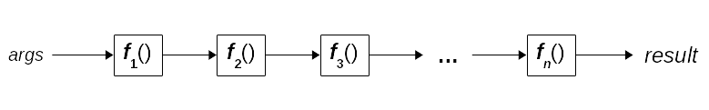
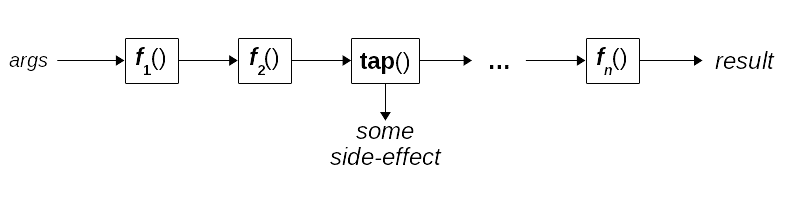
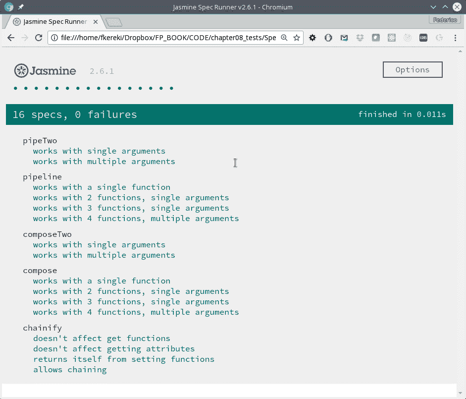

# 第八章：连接函数-管道和组合

在第七章中，*转换函数-柯里化和部分应用*，我们看到了通过应用高阶函数构建新函数的几种不同方式。在本章中，我们将深入 FP 的核心，看看如何创建函数调用序列，以便它们的组合将从几个更简单的组件中产生更复杂的结果。我们将包括以下内容：

+   **管道**，一种类似于 Unix/Linux 管道的函数连接方式

+   **链接**，这可能被认为是管道的一种变体，但限于对象

+   **组合**，这是一种经典操作，起源于基本的计算机理论

在这个过程中，我们将涉及相关概念，例如以下内容：

+   **无点风格**，通常与管道和组合一起使用

+   组合或管道函数的调试，我们将编写一些辅助工具

+   组合或管道函数的测试，这不会被证明是高复杂度的

# 管道

管道和组合是一种设置函数按顺序工作的技术，因此一个函数的输出成为下一个函数的输入。有两种看待这个问题的方式：从计算机的角度和从数学的角度。通常，大多数 FP 文本都从后者开始，但由于我假设大多数读者更接近计算机而不是数学，让我们从前者开始。

# Unix/Linux 中的管道

在 Unix/Linux 中，执行一个命令并将其输出作为第二个命令的输入，其输出将作为第三个命令的输入，依此类推，称为*管道*。这是相当常见的，也是 Unix 哲学的应用，正如贝尔实验室的一篇文章所解释的，这篇文章是由管道概念的创造者 Doug McIlroy 撰写的：

1.  让每个程序都做一件事情。要做新工作，最好重新构建，而不是通过添加新的*功能*来使旧程序复杂化。

1.  期望每个程序的输出成为另一个尚不知道的程序的输入。

鉴于 Unix 的历史重要性，我建议阅读一些描述（当时新的）操作系统的重要文章，位于*贝尔系统技术杂志*1978 年 7 月，网址为[`emulator.pdp-11.org.ru/misc/1978.07_-_Bell_System_Technical_Journal.pdf`](http://emulator.pdp-11.org.ru/misc/1978.07_-_Bell_System_Technical_Journal.pdf)。两条引用的规则在*风格*部分，*前言*文章中。

让我们考虑一个简单的例子来开始。假设我想知道一个目录中有多少个 LibreOffice 文本文档。有很多方法可以做到这一点，但这样做就可以了。我们将执行三个命令，将每个命令的输出作为输入传递给下一个命令（这就是`|`字符的含义）。假设我们`cd /home/fkereki/Documents`，然后执行以下操作：

```js
$ ls -1 | grep "odt$" | wc -l
***4***
```

这是什么意思？它是如何工作的？（忽略美元符号：这只是控制台提示。）我们必须逐步分析这个过程：

+   管道的第一部分`ls -1`列出目录中的所有文件（根据我们的`cd`命令为`/home/fkereki/Documents`），以单列形式，每行一个文件名

+   第一个命令的输出作为`grep "odt$"`的输入，它过滤（通过）只有以`"odt"`结尾的行，这是 LibreOffice Writer 的标准文件扩展名

+   过滤后的输出提供给计数命令`wc -l`，它计算其输入中有多少行

您可以在 Dennis Ritchie 和 Ken Thompson 的*UNIX 分时系统*文章的第 6.2 节*过滤器*中找到管道，这也是我上面提到的贝尔实验室期刊的一部分。

从 FP 的角度来看，这是一个关键概念。我们希望通过简单、单一用途、较短的函数来构建更复杂的操作。管道是 Unix shell 用来应用这个概念的方式，简化了执行命令、获取其输出，并将其作为输入传递给另一个命令的工作。我们将在 JS 中以我们自己的函数式风格应用类似的概念，正如我们将看到的；请查看图 8.1：

图 8.1\. JS 中的管道与 Unix/Linux 中的管道类似。每个函数的输出都成为下一个函数的输入。

顺便说一句（不，放心，这不会变成一个 shell 教程！）你也可以使管道接受参数。例如，如果我经常想要计算我有多少个带有这种或那种扩展名的文件，我可以创建一个名为`cfe`的函数，代表*计算扩展名的数量：*

```js
$ function cfe() {
 ls -1 | grep "$1\$"| wc -l
} 
```

然后我可以使用`cfe`作为一个命令，将所需的扩展名作为参数传递：

```js
$ cfe odt
***4***
$ cfe pdf
***6***
```

我们还希望编写类似的参数化管道：我们不仅受限于在我们的流程中只有固定的函数，而是完全自由地决定要包含什么。

# 重新审视一个例子

我们可以通过重新审视早期章节中的一个问题来开始将各个部分联系在一起。还记得之前需要计算一些地理数据的平均纬度和经度吗？我们在第五章的*从对象中提取数据*部分中看到了这个问题，*声明式编程 - 更好的风格*？基本上，我们从以下数据开始，问题是要计算给定点的平均纬度和经度：

```js
let markers = [
 {name: "UY", lat: -34.9, lon: -56.2},
 {name: "AR", lat: -34.6, lon: -58.4},
 {name: "BR", lat: -15.8, lon: -47.9},
 ...
 {name: "BO", lat: -16.5, lon: -68.1}
];
```

有了我们现在所知道的，我们可以用以下方式来编写一个解决方案：

+   能够从每个点中提取纬度（以及之后的经度）

+   使用该函数来创建一个纬度数组

+   将结果数组传递给我们在*计算平均值*部分编写的平均函数，上述章节

要完成第一个任务，我们可以使用第七章的*参数顺序*部分中的`myMap()`函数，以及第六章的*从对象中获取属性*部分中的`getField()`函数，再加上一些柯里化来固定一些值。用长篇大论来写，我们的解决方案可能是以下内容：

```js
const average = arr => arr.reduce(sum, 0) / arr.length;
const getField = attr => obj => obj[attr];
const myMap = curry(flipTwo(demethodize(map)));

const getLat = curry(getField)("lat");
const getAllLats = curry(myMap)(getLat);

let averageLat = pipeline(getAllLats, average);
// *and similar code to average longitudes*
```

当然，你总是可以屈服于去写一些*一行代码*的诱惑，但要注意：这样真的更清晰，更好吗？

```js
let averageLat2 = pipeline(curry(myMap)(curry(getField)("lat")), average);
let averageLon2 = pipeline(curry(myMap)(curry(getField)("lon")), average);
```

这是否对你有意义将取决于你对 FP 的经验。无论采取哪种解决方案，事实仍然是，添加管道（以及后来的组合）到你的工具集中可以帮助你编写更紧凑、声明式、更容易理解的代码，所以现在让我们转向看看如何以正确的方式进行函数管道化。

# 创建管道

我们希望能够生成一个包含多个函数的管道。我们可以以两种不同的方式来做到这一点：通过以问题特定的方式*手动*构建管道，或者试图使用更通用的构造，可以以一般性地应用。让我们看看这两种解决方案。

# 手动构建管道

让我们以一个 Node.js 的例子来进行，类似于我们在本章前面构建的命令行管道。我们需要一个函数来读取目录中的所有文件，我们可以这样做（这种方式不太推荐，因为它是同步调用，通常在服务器环境中不好）：

```js
function getDir(path) {
 const fs = require("fs");
 const files = fs.readdirSync(path);
 return files;
}
```

过滤`odt`文件非常简单。我们从以下函数开始：

```js
const filterByText = (text, arr) => arr.filter(v => v.endsWith(text));
```

因此，我们现在可以写出以下内容：

```js
const filterOdt = arr => filterByText(".odt", arr);
```

更好的是，我们可以应用柯里化，并采用无参风格，就像第三章中的*一个不必要的错误*部分所示的那样：

```js
const filterOdt2 = curry(filterByText)(".odt");
```

最后，要计算数组中的元素，我们可以简单地编写以下代码。由于`.length`不是一个函数，我们无法应用我们的去方法化技巧：

```js
const count = arr => arr.length;
```

有了这些函数，我们可以写出类似这样的代码：

```js
const countOdtFiles = (path) => {
 const files = getDir(path);
 const filteredFiles = filterOdt(files);
 const countOfFiles = count(filteredFiles);
 return countOfFiles;
}

countOdtFiles("/home/fkereki/Documents"); // 4, *as with the command line solution*
```

如果你想摆脱所有的中间变量，你也可以选择*一行式*的定义：

```js
const countOdtFiles2 = path => count(filterOdt(getDir(path)));

countOdtFiles2("/home/fkereki/Documents"); // 4, *as before*
```

这就是问题的关键：我们的文件计数函数的两种实现都有缺点。第一个定义使用了几个中间变量来保存结果，并且将 Linux shell 中的一行代码变成了多行函数。另一方面，第二个定义要短得多，但在某种程度上更难理解，因为我们似乎是以相反的顺序编写计算的步骤！我们的流水线必须首先读取文件，然后过滤它们，最后计数--但在我们的定义中，这些函数的顺序却是*相反的*！

我们当然可以手动实现流水线处理，正如我们所见，但如果我们可以采用更具声明性的风格会更好。让我们继续尝试以更清晰和可理解的方式构建更好的流水线，尝试应用我们已经见过的一些概念。

# 使用其他构造

如果我们从函数的角度思考，我们拥有的是一系列函数，我们想要按顺序应用它们，从第一个开始，然后将第二个应用于第一个函数产生的结果，然后将第三个应用于第二个函数的结果，依此类推。如果我们只是修复两个函数的流水线，这样就可以：

```js
const pipeTwo = (f, g) => (...args) => g(f(...args));
```

这并不是那么无用，因为我们可以组合更长的流水线--尽管，我承认，这需要写得太多了！我们可以用两种不同但等效的方式来编写我们的三个函数的流水线：

```js
const countOdtFiles3 = path =>
    pipeTwo(pipeTwo(getDir, filterOdt), count)(path);

const countOdtFiles4 = path =>
    pipeTwo(getDir, pipeTwo(filterOdt, count))(path);
```

我们正在利用管道是一个可结合的操作这一事实。在数学中，结合性质是指我们可以通过首先添加*1+2*然后将结果添加到 3，或者通过将 1 添加到添加*2+3*的结果来计算*1+2+3*：换句话说，*1+2+3*与*(1+2)+3*或*1+(2+3)*相同。

这是如何工作的？详细跟踪给定调用的执行将是有用的；很容易因为有这么多的调用而感到困惑！第一个实现可以一步一步地跟踪，直到最终结果，幸运的是与我们已经知道的相匹配：

```js
countOdtFiles3("/home/fkereki/Documents") ===
 pipeTwo(pipeTwo(getDir, filterOdt), count)("/home/fkereki/Documents") ===
 count(pipeTwo(getDir, filterOdt)("/home/fkereki/Documents")) ===
 count(filterOdt(getDir("/home/fkereki/Documents"))) // 4
```

第二个实现也得到了相同的最终结果：

```js
countOdtFiles4("/home/fkereki/Documents") ===
 pipeTwo(getDir, pipeTwo(filterOdt, count))("/home/fkereki/Documents") ===
 pipeTwo(filterOdt, count)(getDir("/home/fkereki/Documents")) ===
 count(filterOdt(getDir("/home/fkereki/Documents"))) // **4**
```

好吧，现在我们知道我们只需要一个基本的*两个管道*高阶函数...但我们真的希望能够以更短、更紧凑的方式工作。首先的实现可能是以下内容：

```js
const pipeline = (...fns) => (...args) => {
 let result = fns0;
 for (let i = 1; i < fns.length; i++) {
 result = fnsi;
 }
 return result;
};

pipeline(getDir, filterOdt, count)("/home/fkereki/Documents"); // *still* 4
```

这确实有效--现在我们的文件计数流水线的指定方式更清晰，因为现在函数按照正确的顺序给出。然而，`pipeline()`函数的实现本身并不是非常函数式的，而是回到了旧的、命令式的、手动循环的方法。我们可以使用`.reduce()`来做得更好，就像第五章中的*以更好的风格进行声明式编程*。

如果你查看一些 FP 库，我们这里称为`pipeline()`的函数也可能被称为`flow()`--因为数据从左到右流动--或`sequence()`--暗示操作是按升序顺序执行的--但语义是相同的。

这个想法是从第一个函数开始评估，将结果传递给第二个函数，然后将该结果传递给第三个函数，依此类推。然后我们可以用更短的代码实现我们的流水线：

```js
const pipeline2 = (...fns) =>
 fns.reduce((result, f) => **(...args) => f(result(...args))**);

pipeline2(getDir, filterOdt, count)("/home/fkereki/Documents"); // 4
```

这段代码更具声明性，你甚至可以通过使用我们的`pipeTwo()`函数来写得更好，它执行的是相同的操作：

```js
const pipeline3 = (...fns) => fns.**reduce(pipeTwo)**;

**pipeline3(getDir, filterOdt, count)**("/home/fkereki/Documents"); // *again* 4
```

您也可以通过意识到，基本上它使用了我们提到的结合性质，并首先将第一个函数传递给第二个；然后，将这个结果传递给第三个函数，依此类推来理解这段代码。

哪个版本更好？我会说引用`pipeTwo()`函数的版本更清晰：如果您知道`.reduce()`的工作原理，您可以很容易理解我们的管道是如何一次两个函数地通过的，从第一个开始--这与您对管道工作原理的了解相匹配。我们写的其他版本更多或少是陈述性的，但可能不那么容易理解。

# 调试管道

现在，让我们转向一个实际问题：如何调试您的代码？使用管道，您无法真正看到从函数到函数传递的内容，那么您该如何做呢？我们有两个答案：一个（也）来自 Unix/Linux 世界，另一个（最适合本书）使用包装器来提供一些日志。

# 使用 tee

我们将使用的第一个解决方案意味着向管道中添加一个函数，该函数将仅记录其输入。我们希望实现类似于`tee` Linux 命令的功能，它可以拦截管道中的标准数据流并将副本发送到备用文件或设备。记住`/dev/tty`是通常的控制台，我们可以执行以下操作并在屏幕上获得通过`tee`命令传递的所有内容的副本：

```js
$ ls -1 | grep "odt$" | **tee /dev/tty** | wc -l

*...the list of files with names ending in odt...*
*4*
```

我们可以轻松地编写一个类似的函数：

```js
const tee = arg => {
 console.log(arg);
 return arg;
};
```

如果您了解逗号运算符的用法，您可以更加简洁，只需编写`const tee = (arg) => (console.log(arg), arg)`--您明白为什么吗？查看[`developer.mozilla.org/en-US/docs/Web/JavaScript/Reference/Operators/Comma_Operator`](https://developer.mozilla.org/en-US/docs/Web/JavaScript/Reference/Operators/Comma_Operator)获取答案！

我们的日志记录函数将接收一个参数，列出它，并将其传递给管道中的下一个函数。我们可以看到它的工作方式：

```js
console.log(
 pipeline2(getDir, tee, filterOdt, tee, count)(
 "/home/fkereki/Documents"
 )
);

[...*the list of all the files in the directory*...]
[...*the list of files with names ending in odt*...]
*4*
```

如果我们的`tee()`函数可以接收一个日志记录函数作为参数，那就更好了，就像我们在第六章的*以函数式方式记录日志*部分中所做的那样；这只是做出与我们之前所做的相同类型的更改的问题。同样的良好设计概念再次应用！

```js
const tee2 = (arg, logger = console.log) => {
    logger(arg);
 return args;
};
```

请注意，以这种方式传递`console.log`可能会存在绑定问题。最好写成`console.log.bind(console)`，作为一种预防措施。

然而，这只是一个特定的增强：现在让我们考虑一个更通用的接入函数，比仅仅做一些日志记录更有可能。

# 接入流

如果您愿意，您可以编写一个增强的`tee()`函数，可以产生更多的调试信息，可能将报告的数据发送到文件或远程服务等--您可以探索许多可能性。您还可以探索更一般的解决方案，`tee()`只是一个特例，并且还允许创建个性化的接入函数。参见图 8.2：

图 8.2。接入允许您应用一些函数来检查数据在管道中流动的情况。

在使用管道时，您可能希望在其中间放置一个日志记录函数，或者您可能需要一些其他类型的*窥探*函数--可能在某处存储数据，或者调用服务，或者其他一些副作用。我们可以有一个通用的`tap()`函数，它可以以这种方式运行：

```js
const tap = curry((fn, x) => (fn(x), x));
```

这可能是本书中 *看起来最棘手的代码* 候选，所以让我们解释一下。我们想要生成一个函数，给定一个函数 `fn()` 和一个参数 `x`，将评估 `fn(x)`（以产生我们可能感兴趣的任何一种副作用），但返回 `x`（这样管道就可以继续进行而不受干扰）。逗号运算符正好具有这种行为：如果您编写像 `(a, b, c)` 这样的代码，JS 将按顺序评估这三个表达式，并使用最后一个值作为表达式的值。

逗号在 JS 中有几种用法，您可以在 [`developer.mozilla.org/en-US/docs/Web/JavaScript/Reference/Operators/Comma_Operator`](https://developer.mozilla.org/en-US/docs/Web/JavaScript/Reference/Operators/Comma_Operator) 上阅读更多关于其作为运算符的用法。

现在我们可以利用柯里化来生成几个不同的 tapping 函数。我们在上一节中编写的 `tee()` 函数也可以按照以下方式编写：

```js
const tee3 = tap(console.log);
```

顺便说一句，您也可以不使用柯里化来编写 `tap()`... 但您会承认它失去了一些神秘感！

```js
const tap2 = fn => x => (fn(x), x);
```

您会认出这种柯里化的方式，就像我们在 第七章 的 *Currying by hand* 部分中看到的那样，*Transforming Functions - Currying and Partial Application*。

# 使用日志包装器

我们提到的第二个想法基于我们在 第六章 的 *Logging* 部分中编写的 `addLogging()` 函数，*Producing Functions - Higher-Order Functions*。这个想法是用一些日志功能包装一个函数，这样在进入时，参数将被打印出来，退出时，函数的结果将被显示出来：

```js
pipeline2(
 **addLogging**(getDir), 
    **addLogging**(filterOdt), 
    **addLogging**(count))("/home/fkereki/Documents"));

entering getDir: /home/fkereki/Documents
exiting getDir: ...*the list of all the files in the directory*...
entering filterOdt: ...*the same list of files*...
exiting filterOdt: ...*the list of files with names ending in odt*...
entering count: ...*the list of files with names ending in odt*...
exiting count: 4 
```

我们可以轻松验证 `pipeline()` 函数是否正确执行 -- 函数产生的结果作为输入传递给下一个函数，我们也可以理解每次调用发生了什么。当然，您不需要在 *每个* 管道函数中添加日志记录：您可能只在怀疑出现错误的地方这样做。

# 链接和流畅接口

当您使用对象或数组时，还有另一种方法可以将多个调用的执行链接在一起，即应用 *chaining*。例如，当您使用数组时，如果应用了 `.map()` 或 `.filter()` 方法，结果将是一个新数组，您可以对其应用新的方法，依此类推。我们已经使用了这样的方法，就像我们在 第五章 的 *Working with ranges* 部分中定义 `range()` 函数时一样：

```js
const range = (start, stop) =>
 new Array(stop - start).fill(0).map((v, i) => start + i);
```

首先，我们创建了一个新数组；然后，我们对其应用了 `.fill()` 方法，这个方法会直接更新数组（副作用...）并返回更新后的数组，最后我们对其应用了 `.map()` 方法。后者确实生成了一个新数组，我们可以对其应用进一步的映射、过滤或任何其他可用的方法。

这种连续链式操作的风格也用于流畅的 API 或接口。举一个例子，图形库 `D3.js`（请参阅 [`d3js.org/`](https://d3js.org/) 了解更多信息）经常使用这种风格 -- 下面的例子取自 [`bl.ocks.org/mbostock/4063269`](https://bl.ocks.org/mbostock/4063269)：

```js
 var node = svg
 .selectAll(".node")
 .data(pack(root).leaves())
 .enter()
 .append("g")
 .attr("class", "node")
 .attr("transform", function(d) { 
 return "translate(" + d.x + "," + d.y + ")"; 
 });
```

每个方法都作用于前一个对象，并提供对将来应用方法调用的新对象的访问（例如 `.selectAll()` 或 `.append()` 方法），或者更新当前对象（就像 `.attr()` 属性设置调用一样）。这种风格并不是唯一的，还有其他一些知名的库（比如 jQuery，仅举一个例子）也应用了这种风格。

我们能自动化这个过程吗？在这种情况下，答案可能是*可能，但我宁愿不这样做*。在我看来，使用`pipeline()`或`compose()`同样可以实现相同的结果。使用对象链接，你只能返回新的对象或数组或可以应用方法的东西。 （请记住，如果你使用标准类型，比如字符串或数字，你不能给它们添加方法，除非你修改它们的原型，这是不推荐的！）然而，使用组合，你可以返回任何类型的值；唯一的限制是下一个函数必须期望你提供的数据类型。

另一方面，如果你正在编写自己的 API，那么你可以通过让每个方法`return this`来提供一个流畅的接口--当然，除非它需要返回其他东西！如果你正在使用其他人的 API，你也可以通过使用代理来进行一些技巧，但要注意可能有情况下你的代理代码可能会失败：也许正在使用另一个代理，或者有一些 getter 或 setter 会导致问题，等等。

你可能想在[`developer.mozilla.org/en/docs/Web/JavaScript/Reference/Global_Objects/Proxy`](https://developer.mozilla.org/en/docs/Web/JavaScript/Reference/Global_Objects/Proxy)上阅读代理对象的相关内容--它们非常强大，可以提供有趣的元编程功能，但它们也可能陷入技术细节，并且会导致代理代码的轻微减速。

让我们来看一个基本的例子。我们可以有一个`City`类，带有名称、纬度（`lat`）和经度（`long`）属性：

```js
class City {
 constructor(name, lat, long) {
 this.name = name;
 this.lat = lat;
 this.long = long;
 }

 getName() {
 return this.name;
 }

 setName(newName) {
 this.name = newName;
 }

 setLat(newLat) {
 this.lat = newLat;
 }

 setLong(newLong) {
 this.long = newLong;
 }

 getCoords() {
 return [this.lat, this.long];
 }
}
```

我们可以像下面这样使用这个类，详细介绍我的家乡蒙得维的亚，乌拉圭：

```js
let myCity = new City("Montevideo, Uruguay", -34.9011, -56.1645);
console.log(myCity.getCoords(), myCity.getName());
// [ -34.9011, -56.1645 ] 'Montevideo, Uruguay'
```

如果我们想要允许流畅地处理 setter，我们可以设置一个代理来检测这样的调用，并提供缺失的`return this`。我们怎么做呢？如果原始方法没有返回任何东西，JS 将默认包含一个`return undefined`语句，因此我们可以检测方法是否返回这个值，并替换为`return this`。当然，这是一个问题：如果我们有一个方法，根据其语义，它可以合法地返回一个`undefined`值，我们可以有一种*异常列表*，告诉我们的代理在这些情况下不添加任何东西，但我们不要深入讨论这个问题。

我们的处理程序代码如下。每当调用对象的方法时，都会隐式调用一个 get，我们捕获它。如果我们得到一个函数，那么我们用自己的一些代码包装它，这些代码将调用原始方法，然后决定是返回它的值还是返回代理对象的引用。如果我们没有得到一个函数，那么我们直接返回所请求属性的值。我们的`chainify()`函数将负责将处理程序分配给一个对象，并创建所需的代理。

```js
const getHandler = {
    get(target, property, receiver) {
 if (typeof target[property] === "function") {
 // requesting a method? return a wrapped version
 return (...args) => {
 const result = targetproperty;
 return result === undefined ? receiver : result;
 };
 } else {
 // an attribute was requested - just return it
 return target[property];
 }
 }
};

const chainify = obj => new Proxy(obj, getHandler);
```

有了这个，我们可以*chainify*任何对象，这样我们就有机会检查任何调用的方法。当我写这篇文章时，我目前住在印度浦那，所以让我们反映这个变化。

```js
myCity = chainify(myCity);

console.log(myCity
 .setName("Pune, India")
 .setLat(18.5626)
 .setLong(73.8087)
 .g    oords(), 
 myCity.getName());
// [ 18.5626, 73.8087 ] 'Pune, India'
```

请注意以下内容：

+   我们将`myCity`更改为它自己的代理版本。

+   我们以流畅的方式调用了几个 setter，它们工作正常，因为我们的代理负责为下一个调用提供所需的 this 值。

+   对`.getCoords()`和`.getName()`的调用被拦截，但没有做任何特殊处理，因为它们已经返回一个值。

这值得吗？这取决于你--但请记住我的评论，可能有情况下这种方法会失败，所以要小心！

# Pointfree 风格

当你将函数连接在一起，无论是像这样以管道方式，还是像我们将在本章后面看到的组合方式，你都不需要任何中间变量来保存结果，这些结果将成为下一个函数的参数：它们是隐式的。同样，你可以编写函数而不提及它们的参数，这被称为 pointfree 风格。

点无码风格也被称为暗示式编程--以及无意义的编程，由反对者提出！术语*point*本身意味着函数参数，点无码指的是不命名这些参数。

# 定义点无码函数

你可以很容易地识别点无码函数定义，因为它既不需要`function`关键字，也不需要`=>`符号。我们可以重新审视本章中我们之前编写的一些函数的定义，来验证这一点。例如，我们原始的文件计数函数的定义：

```js
const countOdtFiles3 = path =>
 pipeTwo(pipeTwo(getDir, filterOdt), count)(path);

const countOdtFiles4 = path =>
 pipeTwo(getDir, pipeTwo(filterOdt, count))(path);
```

前面的代码可以重写如下：

```js
const countOdtFiles3b = pipeTwo(pipeTwo(getDir, filterOdt), count);

const countOdtFiles4b = pipeTwo(getDir, pipeTwo(filterOdt, count));
```

新的定义没有引用新定义的函数的参数。你可以通过检查管道中的第一个函数（在这种情况下是`getDir()`）并查看它接收的参数来推断它。 （在第十二章中，我们将看到，使用类型签名会对文档方面有所帮助。）同样，`getLat()`的定义是点无码的：

```js
const getLat = curry(getField)("lat");
```

等价的完整风格定义应该是什么？你需要检查`getField()`函数（我们刚在*重新访问一个例子*部分看到它），来确定它期望一个对象作为参数。然而，通过写成明确的形式来表达这种需求：

```js
const getLat = obj => curry(getField)("lat")(obj);
```

这没有太多意义：如果你愿意写所有这些，你可能只需坚持以下方式：

```js
const getLat = obj => obj.lat;
```

然后你可以根本不用关心柯里化或类似的东西！

# 转换为点无码风格

另一方面，最好稍作停顿，不要试图以点无码的方式写*所有*东西，不管它可能会付出什么代价。例如，考虑我们在第六章中编写的`isNegativeBalance()`函数，*生成函数 - 高阶函数*：

```js
const isNegativeBalance = v => v.balance < 0;
```

我们可以以点无码的方式写这个吗？可以，我们将看到如何做到这一点--但我不确定我们是否想以这种方式编写代码！我们可以考虑构建一个由两个函数组成的流水线：一个函数将从给定对象中提取余额，下一个函数将检查它是否为负数，因此我们将以以下方式编写我们的余额检查函数的替代版本：

```js
const isNegativeBalance2 = pipeline(getBalance, isNegative);
```

要从给定对象中提取余额属性，我们可以使用`getField()`和一点柯里化，然后写成以下形式：

```js
const getBalance = curry(getField)("balance");
```

对于第二个函数，我们可以写成以下形式：

```js
const isNegative = x => x < 0;
```

我们的点无码目标就在这里！相反，我们可以使用同一章节中的`binaryOp()`函数，再加上一些柯里化，来写成以下形式：

```js
const isNegative = curry(binaryOp(">"))(0);
```

我之所以以另一种方式编写测试（*0>x*而不是*x<0*）只是为了编码方便。另一种选择是使用我在同一章节的*一个更方便的实现*部分中提到的增强函数--稍微简单一些！

```js
const isNegative = binaryOpRight("<", 0);
```

因此，最终，我们可以写成以下形式：

```js
const isNegativeBalance2 = pipeline(
 curry(getField)("balance"),
 curry(binaryOp(">"))(0)
);
```

或者，我们可以写成以下形式：

```js
const isNegativeBalance3 = pipeline(
 curry(getField)("balance"),
 binaryOpRight("<", 0)
);
```

你真的认为这是一个进步吗？我们的`isNegativeBalance()`的新版本没有引用它们的参数，并且完全是点无码的，但使用点无码风格的想法应该是为了帮助提高代码的清晰度和可读性，而不是产生混淆和不透明性！我怀疑任何人看到我们函数的新版本并认为它们比原来的有任何优势。

如果你发现你的代码变得难以理解，而这只是因为你想使用点无码编程，那就停下来，撤销你的更改。记住我们书中的原则：我们想要进行 FP，但我们不想过分使用它--使用点无码风格并不是一个要求！

# 组合

*组合*与管道非常相似，但它源自数学理论。组合的概念很简单 - 一系列函数调用，其中一个函数的输出是下一个函数的输入 - 但顺序与管道相反。在后者中，要应用的第一个函数是最左边的，但在组合中，你从最右边开始。让我们更深入地研究一下这个问题。

当你定义三个函数的组合，比如(*f∘* *g∘* *h*)并将其应用于*x*时，这等同于你写成*f*(*g*(*h*(*x*)))。重要的是要注意，与管道相同，第一个要应用的函数的 arity 可以是任何值，但所有其他函数必须是一元的。此外，除了函数评估的顺序不同之外，组合是 FP 中的一个重要工具，因为它也抽象了实现细节（让你专注于你需要完成的任务，而不是为了实现这个任务而专注于具体的细节），因此让你以更声明式的方式工作。

如果有帮助的话，你可以将(*f∘* *g∘* *h*)看作是*f 在 g 之后在 h 之后*，这样就清楚了*h*是要应用的第一个函数，*f*是最后一个。

由于与管道的相似性，实现组合并不会太难，但仍然有一些重要和有趣的细节。

# 一些组合的例子

也许对你来说并不奇怪，但我们已经看到了几个组合的例子，或者至少是功能上等价于使用组合的情况。让我们回顾一些这些例子，并且也用一些新的例子来工作。

# 一元运算符

在第六章的*逻辑否定函数*部分，*生成函数 - 高阶函数*，我们写了一个`not()`函数，给定另一个函数，它会逻辑地反转其结果。我们使用该函数来否定对负余额的检查；示例代码可能如下：

```js
const not = fn => (...args) => !fn(...args);
const positiveBalance = not(isNegativeBalance);
```

在同一章的另一部分，*将操作转换为函数*，我给你留下了一个挑战，写一个`unaryOp()`函数，它将提供与常见 JS 运算符等价的一元函数。所以，如果你能写出以下内容：

```js
const logicalNot = unaryOp("!");
```

然后，假设存在一个`compose()`函数，你也可以写成以下形式：

```js
const positiveBalance = compose(logicalNot, isNegativeBalance);
```

你更喜欢哪一个？这实际上是一个品味的问题，但我认为第二个版本更清楚地表达了我们想要做的事情。使用`not()`函数，你必须检查它的作用才能理解整个代码。而使用组合，你仍然需要知道`logicalNot()`是什么，但整体结构是可以看到的。

在同一章的*反转结果*部分，你也可以看到另一个例子。记住，我们有一个函数可以根据西班牙语规则比较字符串，但我们想要反转比较的意义，以降序排序：

```js
const changeSign = unaryOp("-");
palabras.sort(**compose(changeSign, spanishComparison)**);
```

# 计算文件

我们也可以回到我们的管道。我们已经写了一个单行函数来计算给定路径中的`odt`文件：

```js
const countOdtFiles2 = path => count(filterOdt(getDir(path)));
```

暂且不考虑这段代码不如后来我们开发的管道版本清晰的观察，我们也可以用组合来编写这个函数：

```js
const countOdtFiles2b = path => compose(count, filterOdt, getDir)(path);
countOdtFiles2b("/home/fkereki/Documents"); // *4, no change here*
```

我们也可以以 pointfree 的方式编写这个函数，不指定`path`参数，使用`const countOdtFiles2 = compose(count, filterOdt, getDir)`，但我想更好地与之前的定义相对应。

也可以以*一行*的方式来看待这个问题：

```js
compose(count, filterOdt, getDir)("/home/fkereki/Documents");
```

即使它不像流水线版本那样清晰（这只是我的观点，可能受我对 Linux 的喜好影响！），这种声明式实现清楚地表明我们依赖于组合三个不同的函数来获得我们的结果--这很容易看出，并应用了将大型解决方案构建成更简单的代码片段的思想。

# 查找唯一单词

最后，让我们举一个例子，我同意，这也可以用于流水线处理。假设你有一段文本，你想从中提取所有唯一的单词：你会怎么做？如果你考虑它的步骤（而不是试图一次性创建一个完整的解决方案），你可能会想出类似这样的解决方案：

+   忽略所有非字母字符

+   将所有内容转换为大写

+   将文本拆分为单词

+   创建一个单词集合

为什么要使用集合？因为它会自动丢弃重复的值；请查看[`developer.mozilla.org/en/docs/Web/JavaScript/Reference/Global_Objects/Set`](https://developer.mozilla.org/en/docs/Web/JavaScript/Reference/Global_Objects/Set)了解更多信息。顺便说一句，我们将使用`Array.from()`方法将我们的集合转换为数组；请参阅[`developer.mozilla.org/en-US/docs/Web/JavaScript/Reference/Global_Objects/Array/from`](https://developer.mozilla.org/en-US/docs/Web/JavaScript/Reference/Global_Objects/Array/from)。

现在，以 FP 方式解决每个问题：

```js
const removeNonAlpha = str => str.replace(/[^a-z]/gi, " ");
const toUpperCase = demethodize(String.prototype.toUpperCase);
const splitInWords = str => str.trim().split(/\s+/);
const arrayToSet = arr => new Set(arr);
const setToList = set => Array.from(set).sort();
```

有了这些函数，结果可以写成如下形式：

```js
const getUniqueWords = compose(
    setToList,
 arrayToSet,
 splitInWords,
 toUpperCase,
 removeNonAlpha
);
```

由于你看不到组合函数的参数，你真的不需要显示`getUniqueWords()`的参数，所以在这种情况下，点无风格是自然的。

我们可以测试我们的函数；让我们将这个函数应用于亚伯拉罕·林肯于 1863 年 11 月 19 日在葛底斯堡的演讲的前两句话，并打印出由 43 个不同单词组成的句子（相信我，我数过了！）：

```js
const GETTYSBURG_1_2 = `Four score and seven years ago
our fathers brought forth on this continent, a new nation, conceived in Liberty, and dedicated to
the proposition that all men are created equal. Now we are engaged in a great civil war, testing whether
that nation, or any nation so conceived and dedicated,
can long endure.`; console.log(**getUniqueWords(GETTYSBURG_1_2)**); [ 'A', 'AGO', 'ALL', 'AND', 'ANY', 'ARE', 'BROUGHT', 'CAN', 'CIVIL',
... 'TESTING',| 'THAT', 'THE', 'THIS', 'TO', 'WAR', 'WE', 'WHETHER', 'YEARS' ]
```

当然，你可能已经以可能更短的方式编写了`getUniqueWords()`，但我要说的是，通过将解决方案组合成几个较短的步骤，你的代码更清晰，更容易理解。然而，如果你希望说流水线处理的解决方案似乎更好，那只是一种观点！

# 使用高阶函数进行组合

很明显，手动组合可以像我们上面看到的流水线处理一样轻松地完成。例如，我们在前面的几节中编写的唯一单词计数函数可以用简单的 JS 风格编写：

```js
const getUniqueWords1 = str => {
 const str1 = removeNonAlpha(str);
 const str2 = toUpperCase(str1);
 const arr1 = splitInWords(str2);
 const set1 = arrayToSet(arr1);
 const arr2 = setToList(set1);
 return arr2;
};
```

或者，它可以以更简洁（更晦涩！）的*一行*风格编写：

```js
const getUniqueWords2 = str =>
    setToList(arrayToSet(splitInWords(toUpperCase(removeNonAlpha(str)))));

console.log(getUniqueWords2(GETTYSBURG_1_2));
// [ 'A', 'AGO', 'ALL', 'AND', ... 'WAR', 'WE', 'WHETHER', 'YEARS' ]
```

然而，与流水线处理一样，让我们寻找一个更通用的解决方案，这样就不需要每次想要组合其他函数时都写一个特殊的函数。

组合两个函数非常容易，只需要对我们在本章前面看到的`pipeTwo()`函数进行一点小改动：

```js
const pipeTwo = (f, g) => (...args) => g(f(...args));
const composeTwo = (f, g) => (...args) => f(g(...args));
```

唯一的区别是，使用流水线处理时，你首先应用最左边的函数，而使用组合时，你从最右边的函数开始。这种变化表明我们可以使用来自第七章 *转换函数-柯里化和部分应用*部分的`flipTwo()`高阶函数。这样清楚吗？

```js
const composeTwoByFlipping = flipTwo(pipeTwo);
```

无论如何，如果我们想要组合超过两个函数，我们也可以利用结合律，编写类似以下的内容：

```js
const getUniqueWords3 = composeTwo(
 setToList,
 composeTwo(
 arrayToSet,
 composeTwo(splitInWords, composeTwo(toUpperCase, removeNonAlpha))
 )
);

console.log(getUniqueWords3(GETTYSBURG_1_2));
// [ 'A', 'AGO', 'ALL', 'AND', ... 'WAR', 'WE', 'WHETHER', 'YEARS' ] *OK again*
```

尽管这样可以运行，但让我们寻找更好的解决方案--我们可以提供至少两种。第一种方法与流水线和组合工作*相反*有关。当我们进行流水线处理时，我们从左到右应用函数，而在组合时，我们从右到左应用函数。因此，我们可以通过颠倒函数的顺序并进行流水线处理来实现与组合相同的结果；这是一个非常实用的解决方案，我非常喜欢！

```js
const compose = (...fns) => pipeline(...(fns.reverse**()))**; console.log(
 compose(
 setToList,
 arrayToSet,
 splitInWords,
 toUpperCase,
 removeNonAlpha
 )(GETTYSBURG_1_2)
);
// [ 'A', 'AGO', 'ALL', 'AND', ... 'WAR', 'WE', 'WHETHER', 'YEARS' ] *OK once more*  
```

唯一棘手的部分是在调用`pipeline()`之前使用展开运算符。在反转`fns`数组之后，我们必须再次展开其元素，以正确调用`pipeline()`。

另一个不太声明式的解决方案是使用`.reduceRight()`，所以我们不是反转函数列表，而是反转处理它们的顺序：

```js
const  compose2  = (...fns) => fns.reduceRight(pipeTwo);

console.log(
 compose2(
 setToList,
 arrayToSet,
 splitInWords,
 toUpperCase,
 removeNonAlpha
 )(GETTYSBURG_1_2)
);
// [ 'A', 'AGO', 'ALL', 'AND', ... 'WAR', 'WE', 'WHETHER', 'YEARS' ] *still OK* 
```

为什么/如何这个工作？让我们跟随这个调用的内部工作。我们可以用它的定义替换`pipeTwo()`，以使这更清晰：

```js
const  compose2b  = (...fns) => 
 fns.reduceRight((f,g) => (...args) =>  g(f(...args)));
```

好的，让我们看看！

+   由于没有提供初始值，第一次`f()`是`removeNonAlpha()`，`g()`是`toUpperCase()`，所以第一个中间结果是一个函数`(...args) => toUpperCase(removeNonAlpha(...args))`；让我们称之为`step1()`。

+   第二次，`f()`是前一步的`step1()`，`g()`是`splitInWords()`，所以新的结果是一个函数`(...args) => splitInWords(step1(...args)))`，我们可以称之为`step2()`

+   第三次，以同样的方式，我们得到`(...args) => arrayToSet(step2(...args))))`，我们称之为`step3()`

+   最后一次，结果是`(...args) => setToList(step3(...args))`，一个名为`step4()`的函数

最终的结果正确地成为一个接收`(...args)`的函数，并首先应用`removeNonAlpha()`，然后是`toUpperCase()`，以此类推，最后应用`setToList()`。

也许令人惊讶的是，我们也可以用`.reduce()`来实现这个功能--你能看出为什么吗？推理与我们所做的类似，所以我们将其留给读者作为*一个练习*！

```js
const  compose3  = (...fns) => fns.reduce(composeTwo**)**;
```

弄清楚`compose3()`的工作原理后，您可能想编写一个使用`.reduceRight()`的`pipeline()`版本，只是为了对称地完成一切！

我们可以通过提及，就测试和调试而言，我们可以应用与调试相同的思想；只是记住组合*走另一条路*！我们不会通过提供更多相同类型的示例来获得任何好处，所以现在让我们考虑一种在使用对象时链接操作的常见方式，并看看它是否有利，鉴于我们不断增长的 FP 知识和经验。

# 测试组合函数

让我们通过考虑对流水线化或组合函数进行测试来完成本章。鉴于这两种操作的机制相似，我们将为它们都提供示例，它们不会有区别，除了由于函数评估的从左到右或从右到左的逻辑差异。

在流水线方面，我们可以从看如何测试`pipeTwo()`函数开始，因为设置将类似于`pipeline()`。我们需要创建一些间谍，然后检查它们是否被正确调用了正确次数，以及每次是否收到了正确的参数。我们将设置间谍，以便它们提供对调用的已知答案，这样我们就可以看到函数的输出是否成为管道中下一个函数的输入：

```js
var fn1, fn2;

describe("pipeTwo", function() {
 beforeEach(() => {
 fn1 = () => {};
 fn2 = () => {};
 });

 it("works with single arguments", () => {
 spyOn(window, "fn1").and.returnValue(1);
 spyOn(window, "fn2").and.returnValue(2);

 const pipe = pipeTwo(fn1, fn2);
 const result = pipe(22);

 expect(fn1).toHaveBeenCalledTimes(1);
 expect(fn2).toHaveBeenCalledTimes(1);
 expect(fn1).toHaveBeenCalledWith(22);
 expect(fn2).toHaveBeenCalledWith(1);
 expect(result).toBe(2);
 });

 it("works with multiple arguments", () => {
 spyOn(window, "fn1").and.returnValue(11);
 spyOn(window, "fn2").and.returnValue(22);

 const pipe = pipeTwo(fn1, fn2);
 const result = pipe(12, 4, 56);

 expect(fn1).toHaveBeenCalledTimes(1);
 expect(fn2).toHaveBeenCalledTimes(1);
 expect(fn1).toHaveBeenCalledWith(12, 4, 56);
 expect(fn2).toHaveBeenCalledWith(11);
 expect(result).toBe(22);
 });
});
```

鉴于我们的函数始终接收两个函数作为参数，没有太多需要测试的。测试之间唯一的区别是一个显示了对单个参数应用的管道，另一个显示了对多个参数应用。

接下来是`pipeline()`，测试会相当类似。不过，我们可以为单函数管道添加一个测试（边界情况！），另一个测试包含四个函数：

```js
describe("pipeline", function() {
 beforeEach(() => {
 fn1 = () => {};
 fn2 = () => {};
 fn3 = () => {};
 fn4 = () => {};
 });

 it("works with a single function", () => {
 spyOn(window, "fn1").and.returnValue(11);

 const pipe = pipeline(fn1);
 const result = pipe(60);

 expect(fn1).toHaveBeenCalledTimes(1);
 expect(fn1).toHaveBeenCalledWith(60);
 expect(result).toBe(11);
 });

 // *we omit here tests for 2 functions,*
 // *which are similar to those for pipeTwo()*

 it("works with 4 functions, multiple arguments", () => {
 spyOn(window, "fn1").and.returnValue(111);
 spyOn(window, "fn2").and.returnValue(222);
 spyOn(window, "fn3").and.returnValue(333);
 spyOn(window, "fn4").and.returnValue(444);

 const pipe = pipeline(fn1, fn2, fn3, fn4);
 const result = pipe(24, 11, 63);

 expect(fn1).toHaveBeenCalledTimes(1);
 expect(fn2).toHaveBeenCalledTimes(1);
 expect(fn3).toHaveBeenCalledTimes(1);
 expect(fn4).toHaveBeenCalledTimes(1);
 expect(fn1).toHaveBeenCalledWith(24, 11, 63);
 expect(fn2).toHaveBeenCalledWith(111);
 expect(fn3).toHaveBeenCalledWith(222);
 expect(fn4).toHaveBeenCalledWith(333);
 expect(result).toBe(444);
 });
});
```

最后，对于组合，风格是一样的（除了函数评估的顺序相反），所以让我们只看一个测试--我只是改变了前一个测试中函数的顺序：

```js
var fn1, fn2, fn3, fn4;

describe("compose", function() {
 beforeEach(() => {
 fn1 = () => {};
 fn2 = () => {};
 fn3 = () => {};
 fn4 = () => {};
 });

 // *other tests omitted...*

 it("works with 4 functions, multiple arguments", () => {
 spyOn(window, "fn1").and.returnValue(111);
 spyOn(window, "fn2").and.returnValue(222);
 spyOn(window, "fn3").and.returnValue(333);
 spyOn(window, "fn4").and.returnValue(444);

 const pipe = compose(fn4, fn3, fn2, fn1);
 const result = pipe(24, 11, 63);

 expect(fn1).toHaveBeenCalledTimes(1);
 expect(fn2).toHaveBeenCalledTimes(1);
 expect(fn3).toHaveBeenCalledTimes(1);
 expect(fn4).toHaveBeenCalledTimes(1);

 expect(fn1).toHaveBeenCalledWith(24, 11, 63);
 expect(fn2).toHaveBeenCalledWith(111);
 expect(fn3).toHaveBeenCalledWith(222);
 expect(fn4).toHaveBeenCalledWith(333);
 expect(result).toBe(444);
 });
});
```

最后，为了测试`chainify()`函数，我选择使用上面创建的`City`对象--我不想搞乱模拟、存根、间谍之类的东西，而是想确保代码在正常情况下能够工作：

```js
class City {
 // *as above*
}

var myCity;

describe("chainify", function() {
 beforeEach(() => {
 myCity = new City("Montevideo, Uruguay", -34.9011, -56.1645);
 myCity = chainify(myCity);
 });

 it("doesn't affect get functions", () => {
 expect(myCity.getName()).toBe("Montevideo, Uruguay");
 expect(myCity.getCoords()[0]).toBe(-34.9011);
 expect(myCity.getCoords()[1]).toBe(-56.1645);
 });

 it("doesn't affect getting attributes", () => {
 expect(myCity.name).toBe("Montevideo, Uruguay");
 expect(myCity.lat).toBe(-34.9011);
 expect(myCity.long).toBe(-56.1645);
 });

 it("returns itself from setting functions", () => {
 expect(myCity.setName("Other name")).toBe(myCity);
 expect(myCity.setLat(11)).toBe(myCity);
 expect(myCity.setLong(22)).toBe(myCity);
 });

 it("allows chaining", () => {
 const newCoords = myCity
 .setName("Pune, India")
 .setLat(18.5626)
 .setLong(73.8087)
 .getCoords();

 expect(myCity.name).toBe("Pune, India");
 expect(newCoords[0]).toBe(18.5626);
 expect(newCoords[1]).toBe(73.8087);
 });
});
```

所有测试的最终结果显示在下图中：

图 8.3。组合函数测试的成功运行。

# 问题

8.1\. **标题大写**。让我们定义*标题风格大写*，要求一个句子全部用小写书写，除了每个单词的第一个字母。（这种风格的真正定义更复杂，所以让我们简化这个问题。）编写一个函数`headline(sentence)`，它将接收一个字符串作为参数，并返回一个适当大写的版本。空格分隔单词。通过组合较小的函数来构建这个函数：

```js
 console.log(headline("**Alice's ADVENTURES in WoNdErLaNd**")); 
 // Alice's Adventures In Wonderland
```

8.2\. **待办任务**。一个 web 服务返回一个结果，如下所示，逐个人显示他们所有分配的任务。任务可能已完成（`done===true`）或待办（`done===false`）。你的目标是为给定的人（通过名字识别）生成一个待办任务 ID 数组，该数组应该与`responsible`字段匹配。通过使用组合或管道解决这个问题：

```js
 const allTasks = {
 date: "2017-09-22",
 byPerson: [
 {
 responsible: "EG",
 tasks: [
 {id: 111, desc: "task 111", done: false},
 {id: 222, desc: "task 222", done: false}
 ]
 },
 {
 responsible: "FK",
 tasks: [
 {id: 555, desc: "task 555", done: false},
 {id: 777, desc: "task 777", done: true},
 {id: 999, desc: "task 999", done: false}
 ]
 },
 {
 responsible: "ST",
 tasks: [{id: 444, desc: "task 444", done: true}]
 }
 ]
 };
```

确保你的代码不会抛出异常，例如，如果你要查找的人在 web 服务结果中没有出现！

在书的最后一章，*更进一步*，我们将看到另一种解决这个问题的方法，通过使用`Maybe`单子，这将大大简化处理可能缺失的数据的问题。

8.3\. **以抽象方式思考**。假设你正在查看一些旧代码，你发现一个函数看起来像下面这样。（我保持名称模糊和抽象，这样你可以专注于结构而不是实际功能。）你能把这个转换成 Pointfree 风格吗？

```js
function getSomeResults(things) {
 return sort(group(filter(select(things))));
};
```

# 总结

在本章中，我们已经看到了通过不同方式将几个其他函数连接起来创建新函数的方法，通过管道化（还有一个我们不推荐的变体，链式）和组合。

在第九章中，*设计函数 - 递归*，我们将继续进行函数设计，并学习递归的使用，这在函数式编程中经典上是一种基本工具，并且允许非常干净的算法设计。
