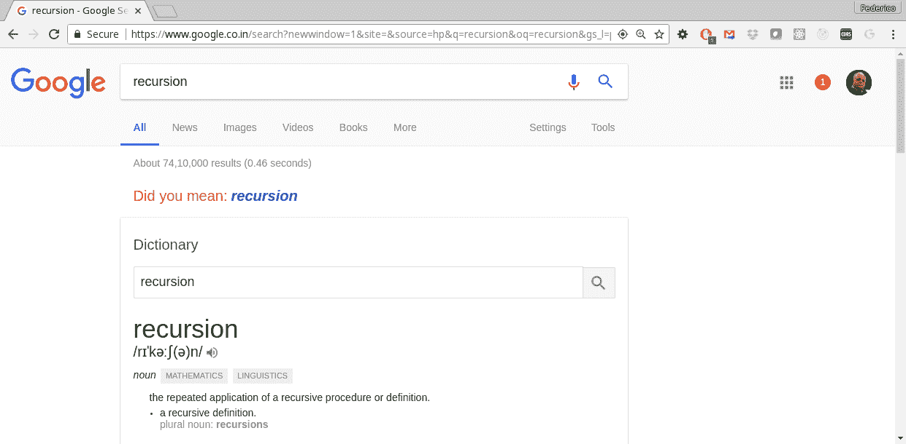
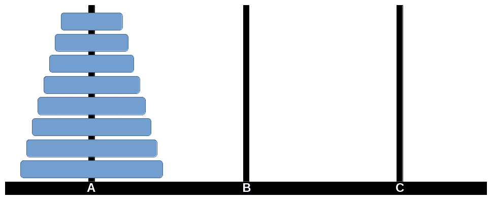
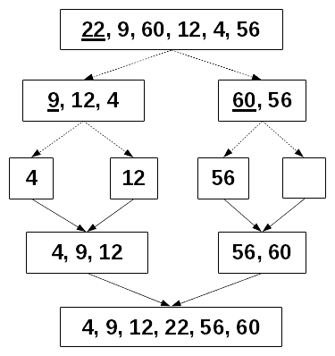
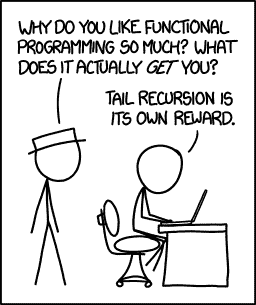

# 第九章：设计函数-递归

在第八章中，*连接函数-管道和组合*，我们考虑了更多的方法来通过组合现有的函数来创建新函数。在这里，我们将进入一个不同的主题：如何通过应用递归技术以典型的功能方式设计和编写函数。

我们将涵盖以下主题：

+   了解递归是什么以及如何思考以产生递归解决方案

+   将递归应用于一些众所周知的问题，例如找零钱或*汉诺塔*

+   使用递归而不是迭代来重新实现早期章节中的一些高阶函数

+   轻松编写搜索和回溯算法

+   遍历数据结构，例如树，以处理文件系统目录或浏览器 DOM

+   解决由浏览器 JS 引擎考虑引起的一些限制

# 使用递归

递归是 FP 中的关键技术，有些语言甚至不提供任何形式的迭代或循环，而完全使用递归（我们已经提到的 Haskell 就是一个典型例子）。计算机科学的一个基本事实是，无论您使用递归还是迭代（循环），您都可以使用递归完成的任何事情，反之亦然。关键概念是有许多算法的定义如果使用递归工作起来要容易得多。另一方面，递归并不总是被教授，或者许多程序员即使了解它，也宁愿不使用它。因此，在本节中，我们将看到几个递归思维的例子，以便您可以将其适应到您的功能编码中。

典型的、经常引用的、非常古老的计算机笑话！*字典定义：

**递归**：（n）见**递归***

但是，什么是递归？有许多定义递归的方法，但我见过的最简单的一种是*一个函数一遍又一遍地调用自己，直到不再需要*。递归是解决几种问题的自然技术，例如：

+   数学定义，例如斐波那契数或阶乘

+   与递归定义的结构相关的数据结构算法，例如*列表*（列表要么为空，要么由一个头节点和一个节点列表组成）或*树*（树可以被定义为一个特殊节点，称为根节点，链接到零个或多个树）

+   基于语法规则的编译器的语法分析，这些规则本身依赖于其他规则，这些规则又依赖于其他规则，依此类推

+   以及更多

Google 本身就对此开玩笑：如果您询问递归，它会回答您是否想要：递归！

无论如何，递归函数除了一些简单的*基本*情况外，其中不需要进一步的计算，总是需要调用自身一次或多次以执行所需计算的一部分。这个概念现在可能不太清楚，所以让我们看看如何以递归的方式思考，然后通过应用该技术解决几个常见问题。

# 递归思考

递归解决问题的关键是假设您已经有一个可以满足您需求的函数，然后正常调用它。（这听起来奇怪吗？实际上，这是相当合适的：要使用递归解决问题，您必须首先解决问题...）另一方面，如果您试图在脑海中思考递归调用的工作方式并尝试在脑海中跟随流程，您可能会迷失方向。因此，您需要做的是：

1.  假设您已经有一个适当的函数来解决您的问题。

1.  然后，看看如何通过解决一个（或多个）较小的问题来解决大问题。

1.  使用步骤 1 中想象的函数解决这些问题。

1.  确定哪些是您的*基本情况*，足够简单，可以直接解决，不需要任何更多的调用。

有了这些元素，你可以通过递归来解决问题，因为你将拥有递归解决方案的基本结构。

通过应用递归，有三种通常的方法来解决问题：

+   **减少和征服**是最简单的情况，其中解决一个问题直接取决于解决其自身的一个更简单的情况

+   **分而治之**是一种更一般的方法。其思想是尝试将问题分解为两个或更多较小的版本，递归地解决它们，并使用这些解决方案来解决原始问题。*减少和征服*的唯一区别在于，这里你需要解决两个或更多其他问题，而不仅仅是一个问题

+   **动态规划**可以被看作是*分而治之*的一种变体：基本上，你通过将一个复杂的问题分解为一系列稍微简单的相同问题的版本，并依次解决每个问题来解决它。然而，这种策略中的一个关键思想是存储先前找到的解决方案，因此每当你发现自己需要再次解决一个更简单的情况时，你不会直接应用递归，而是使用存储的结果，避免不必要的重复计算

在这一部分，我们将看到一些问题，并通过递归的方式来解决它们。当然，在本章的其余部分，我们将看到递归的更多应用；在这里，我们将专注于创建这样一个算法所需的关键决策和问题。

# 减少和征服：搜索

递归的最常见情况涉及一个更简单的情况。我们已经看到了一些例子，比如普遍的阶乘计算：要计算*n*的阶乘，你之前需要计算*n-1*的阶乘。（见第一章，*成为函数式 - 几个问题*。）现在让我们转向一个非数学的例子。

要在数组中搜索一个元素，你也会使用这种*减少和征服*策略。如果数组为空，显然搜索的值不在其中。否则，结果在数组中，当且仅当它是数组中的第一个元素，或者它在数组的其余部分中：

```js
const search = (arr, key) => {
 if (arr.length === 0) {
 return false;
 } else if (arr[0] === key) {
 return true;
 } else {
 return search(arr.slice(1), key);
 }
};
```

这个实现直接反映了我们的解释，很容易验证其正确性。

顺便说一句，作为一种预防措施，让我们看看相同概念的另外两种实现。你可以稍微缩短搜索函数 -- 这样还清晰吗？

```js
const search2 = (arr, key) =>
 arr.length === 0
 ? false
 : arr[0] === key || search2(arr.slice(1), key);
```

稀疏性甚至可以更进一步！

```js
const search3 = (arr, key) =>
 arr.length && (arr[0] === key || search3(arr.slice(1), key));
```

我并不是真的建议你以这种方式编写函数 -- 相反，把它看作是对一些 FP 开发者倾向的一种警告，他们试图去寻求最紧凑、最简短的解决方案...而不在乎清晰度！

# 减少和征服：做幂

另一个经典的例子涉及以高效的方式计算数字的幂。如果你想计算，比如说，2 的 13 次方（2¹³），你可能需要进行 12 次乘法。然而，你可以通过将 2¹³写成以下形式来做得更好：

= 2 乘以 2¹²

= 2 乘以 4⁶

= 2 乘以 16³

= 2 乘以 16 乘以 16²

= 2 乘以 16 乘以 256¹

= 8192

总乘法次数的减少可能看起来并不是很令人印象深刻，但是从算法复杂度的角度来看，它可以将计算的顺序从*O(n)*降低到*O(lg n)*。在一些与加密相关的方法中，这将产生非常重要的差异。我们可以用几行代码来实现这个递归算法：

```js
const powerN = (base, power) => {
 if (power === 0) {
 return 1;
 } else if (power % 2) { // *odd power?*
 return base * powerN(base, power - 1);
 } else { // *even power?*
 return powerN(base * base, power / 2);
 }
};
```

在生产中实现时，会使用位操作，而不是模数和除法。检查一个数字是否是奇数可以写为`power & 1`，而除以 2 可以用`power > > 1`来实现。这些替代计算比被替换的操作要快得多。

当达到基本情况（将某物的零次方）或者基于先前计算较小指数的一些幂进行计算时，计算幂是简单的。（如果你愿意，你可以为将某物的一次方添加另一个基本情况。）这些观察表明，我们正在看到*减少和征服*递归策略的教科书案例。

最后，我们的一些高阶函数，比如`map()`、`reduce()`或`filter()`，也应用了这种技术；我们将在本章后面讨论这个问题。

# 分而治之：汉诺塔

使用这种策略，解决一个问题需要两个或更多的递归解决方案。首先，让我们考虑一个经典的难题，由 19 世纪法国数学家Édouard Lucas 发明。据说印度有一座寺庙，有三根柱子，上面有 64 个金质圆盘，直径递减。僧侣们必须将圆盘从第一根柱子移动到最后一根柱子，遵循两条规则：一次只能移动一个圆盘，较大的圆盘永远不能放在较小的圆盘上。根据传说，当 64 个圆盘移动时，世界将终结。这个难题通常以*汉诺塔*的名义（是的，他们换了国家！）在 10 个圆盘以下进行市场营销。见图 9.1：

图 9.1-经典的汉诺塔难题有一个简单的递归解法。n 个圆盘的解决方案需要*2^n-1*次移动。原始难题需要*2⁶⁴-1*次移动，以每秒一次的速度，需要超过 5840 亿年才能完成……这是一个非常长的时间，考虑到宇宙的年龄只有 138 亿年！

假设我们已经有一个能够解决从源柱移动任意数量的圆盘到目标柱，使用剩余柱作为额外辅助的问题的函数。那么，现在考虑解决一般问题，如果你已经有一个解决该问题的函数：`hanoi(disks, from, to, extra)`。如果你想要从一个柱移动多个圆盘到另一个柱，你可以通过使用这个（尚未编写的！）函数轻松解决：

+   将所有圆盘但一个移动到额外柱

+   将较大的圆盘移动到目标柱

+   再次使用你的函数，将所有圆盘从额外柱（你之前放置它们的地方）移动到目标柱

但是，我们的基本情况呢？我们可以决定，要移动一个单独的圆盘，你不需要使用函数；你可以直接移动它。编码后变成：

```js
const hanoi = (disks, from, to, extra) => {
 if (disks === 1) {
 console.log(`Move disk 1 from post ${from} to post ${to}`);
 } else {
        hanoi(disks - 1, from, extra, to);
 console.log(`Move disk ${disks} from post ${from} to post ${to}`);
        hanoi(disks - 1, extra, to, from);
 }
};
```

我们可以快速验证这段代码是否有效：

```js
hanoi (4, "A", "B", "C"); // we want to move all disks from A to B
Move disk 1 from post A to post C
Move disk 2 from post A to post B
Move disk 1 from post C to post B
Move disk 3 from post A to post C
Move disk 1 from post B to post A
Move disk 2 from post B to post C
Move disk 1 from post A to post C
Move disk 4 from post A to post B
Move disk 1 from post C to post B
Move disk 2 from post C to post A
Move disk 1 from post B to post A
Move disk 3 from post C to post B
Move disk 1 from post A to post C
Move disk 2 from post A to post B
Move disk 1 from post C to post B 
```

还有一个小细节需要考虑，可以进一步简化函数。在这段代码中，我们的基本情况（不需要进一步递归的情况）是`disks`等于 1。你也可以以不同的方式解决它，让圆盘减少到零，然后根本不做任何事情——毕竟，从一个柱移动零个圆盘到另一个柱是通过根本不做任何事情来实现的！

```js
const hanoi2 = (disks, from, to, extra) => {
 if (disks > 0) {
 hanoi(disks - 1, from, extra, to);
 console.log(`Move disk ${disks} from post ${from} to post ${to}`);
 hanoi(disks - 1, extra, to, from);
 }
};
```

我们可以跳过检查是否有圆盘需要移动，而不是在进行递归调用之前进行检查，并让函数在下一级测试是否有事情要做。

如果你正在手动解决这个难题，有一个简单的解决方案：在奇数轮次，总是将较小的圆盘移动到下一个柱子（如果圆盘的总数是奇数）或者移动到前一个柱子（如果圆盘的总数是偶数）。在偶数轮次，做唯一可能的不涉及较小圆盘的移动。

因此，递归算法设计的原则是有效的：假设你已经有了你想要的函数，并用它来构建它！

# 分而治之：排序

我们可以看到另一个例子，使用*分而治之*策略，进行排序。一种对数组进行排序的方法，称为*快速排序*，基于以下前提：

1.  如果你的数组有 0 或 1 个元素，什么也不做；它已经排序好了（这是基本情况）。

1.  否则，选择数组的某个元素（称为“枢轴”），并将数组的其余部分分成两个子数组：小于您选择的元素和大于或等于您选择的元素的元素。

1.  递归地对每个子数组进行排序。

1.  将两个排序后的结果连接起来，枢轴放在中间，以生成原始数组的排序版本。

让我们看一个简单版本的这个问题--有一些更好优化的实现，但我们现在对递归逻辑感兴趣。通常建议随机选择数组的一个元素，以避免一些性能不佳的边界情况，但是对于我们的例子，让我们只取第一个元素：

```js
const quicksort = arr => {
 if (arr.length < 2) {
 return arr;
 } else {
 const pivot = arr[0];
 const smaller = arr.slice(1).filter(x => x < pivot);
 const greaterEqual = arr.slice(1).filter(x => x >= pivot);
 return [...quicksort(smaller), pivot, ...quicksort(greaterEqual)];
 }
};

console.log(quicksort([22, 9, 60, 12, 4, 56]));
// *[4, 9, 12, 22, 56, 60]*
```

我们可以在图 9.2 中看到这是如何工作的：每个数组和子数组的枢轴都被划线标出。拆分用虚线箭头表示，并用实线连接：

图 9.2\. 快速排序递归地对数组进行排序，应用分而治之的策略，将原始问题减小为较小的问题。

# 动态规划：找零

第三种一般策略，*动态规划*，假设您将不得不解决许多较小的问题，但是不是每次都使用递归，而是依赖于存储先前找到的解决方案...也就是记忆化！在第四章中，*行为得当 - 纯函数*，以及在第六章中以更好的方式，*生成函数 - 高阶函数*，我们已经看到了如何优化通常的斐波那契数列的计算，避免不必要的重复调用。现在，让我们考虑另一个问题。

给定一定金额的美元和现有票面值列表，计算我们可以用不同的票据组合支付该金额的美元的方式有多少种。假设您可以无限使用每张票据。我们该如何解决这个问题？让我们从考虑基本情况开始，不需要进一步计算的情况：

+   支付负值是不可能的，因此在这种情况下，我们应该返回 0

+   支付零美元只有一种可能的方式（不给任何票据），因此在这种情况下，我们应该返回 1

+   如果没有提供任何票据，则无法支付任何正数金额的美元，因此在这种情况下也返回 0

最后，我们可以回答这个问题：用给定的票据集合，我们可以用多少种方式支付`N`美元？我们可以考虑两种情况：我们根本不使用更大的票据，只使用较小面额的票据支付金额，或者我们可以拿一张更大金额的票据，并重新考虑这个问题。（现在让我们忘记避免重复计算。）

+   在第一种情况下，我们应该使用相同的`N`值调用我们假定存在的函数，但已经从可用票据列表中删除了最大面额的票据

+   在第二种情况下，我们应该使用`N`减去最大面额的票据调用我们的函数，保持票据列表不变：

```js
const makeChange = (n, bills) => {
 if (n < 0) {
 return 0; // no way of paying negative amounts

 } else if (n == 0) {
 return 1; // one single way of paying $0: with no bills

 } else if (bills.length == 0) {
 // here, n>0
 return 0; // no bills? no way of paying

 } else {
 return (
 makeChange(n, bills.slice(1)) + makeChange(n - bills[0], bills)
 );
 }
};

console.log(makeChange(64, [100, 50, 20, 10, 5, 2, 1]));
// *969 ways of paying $64*
```

现在，让我们进行一些优化。这种算法经常需要一遍又一遍地重新计算相同的值。（要验证这一点，在`makeChange()`的第一行添加`console.log(n, bills.length)`，但要准备大量的输出！）但是，我们已经有了解决方案：记忆化！由于我们正在将这种技术应用于二元函数，我们将需要一个处理多个参数的记忆化算法的版本：

```js
const memoize3 = fn => {
 let cache = {};
 return (...args) => {
 let strX = JSON.stringify(args);
 return strX in cache ? cache[strX] : (cache[strX] = fn(...args));
 };
};

const makeChange = memoize3((n, bills) => {
 // ...*same as above*
});
```

`makeChange()`的记忆化版本要高效得多，您可以通过记录来验证。虽然您可以自己处理重复（例如，通过保留已计算的值的数组），但是记忆化解决方案在我看来更好，因为它由两个函数组合产生了给定问题的更好解决方案。

# 高阶函数再探讨

经典的 FP 技术根本不使用迭代，而是完全依赖递归作为唯一的循环方式。让我们重新审视一些我们在第五章中已经看到的函数，如`map()`、`reduce()`、`find()`和`filter()`，看看我们如何只使用递归就能完成。

尽管如此，我们并不打算用我们自己的*递归 polyfills*替换基本的 JS 函数：很可能我们的性能会比*递归 polyfills*差，而且我们不会因为函数使用递归而获得任何优势。相反，我们想研究如何以递归方式执行迭代，因此我们的努力更多是教学性的，好吗？

# 映射和过滤

映射和过滤非常相似，因为两者都意味着遍历数组中的所有元素，并对每个元素应用回调以产生输出。让我们首先解决映射逻辑，这将有几个要解决的问题，然后过滤将变得几乎轻而易举，只需要做一些小改动。

对于映射，根据我们使用的递归函数开发方式，我们需要一个基本情况。幸运的是，这很容易：映射一个空数组只会产生一个新的空数组。映射一个非空数组可以通过首先将映射函数应用于数组的第一个元素，然后递归地映射数组的其余部分，最后产生一个累积两个结果的单一数组。

基于这个想法，我们可以制定一个简单的初始版本：让我们称之为`mapR()`，只是为了记住我们正在处理我们自己的递归版本的`map()`。但是，要小心：我们的 polyfill 有一些错误！我们将逐个解决它们：

```js
const mapR = (arr, cb) =>
    arr.length === 0 ? [] : [cb(arr[0])].concat(mapR(arr.slice(1), cb));
```

让我们来测试一下：

```js
let aaa = [ 1, 2, 4, 5, 7];
const timesTen = x => x * 10;

console.log(aaa.map(timesTen));   // *[**10, 20, 40, 50, 70**]*
console.log(mapR(aaa, timesTen)); // *[**10, 20, 40, 50, 70**]*
```

太好了！我们的`mapR()`函数似乎产生了与`.map()`相同的结果...但是，我们的回调函数不应该接收更多的参数吗，特别是数组中的索引和原始数组本身？我们的实现还不够完善。

查看`.map()`的回调函数的定义：[`developer.mozilla.org/en/docs/Web/JavaScript/Reference/Global_Objects/Array/map`](https://developer.mozilla.org/en/docs/Web/JavaScript/Reference/Global_Objects/Array/map)

```js
const timesTenPlusI = (v, i) => 10 * v + i;

console.log(aaa.map(timesTenPlusI));    // *[10, 21, 42, 53, 74]*
console.log(mapR2(aaa, timesTenPlusI)); // *[**NaN, NaN, NaN, NaN, NaN**]*
```

生成适当的索引位置将需要递归的额外参数，但基本上很简单：当我们开始时，我们有`index=0`，当我们递归调用我们的函数时，它从位置`index+1`开始。访问原始数组需要另一个参数，这个参数永远不会改变：

```js
const mapR2 = (arr, cb, i = 0, orig = arr) =>
 arr.length == 0
 ? []
 : [cb(arr[0], i, orig)].concat(
 mapR2(arr.slice(1), cb, i + 1, orig)
 );

let aaa = [1, 2, 4, 5, 7];
const senseless = (x, i, a) => x * 10 + i + a[i] / 10;
console.log(aaa.map(senseless));    // *[**10.1, 21.2, 42.4, 53.5, 74.7**]*
console.log(mapR2(aaa, senseless)); // *[**10.1, 21.2, 42.4, 53.5, 74.7**]*
```

太好了！当你使用递归而不是迭代时，你就无法访问索引，所以如果你需要它（就像我们的情况一样），你就必须自己生成它。这是一种经常使用的技术，所以制定我们的`.map()`替代方案是一个好主意。

但是，函数中有额外的参数并不是很好；开发人员可能会意外地提供它们，然后结果将是不可预测的。因此，使用另一种常用的技术，让我们定义一个内部函数`mapLoop()`来处理循环。实际上，这是唯一使用递归时实现循环的常规方式：

```js
const mapR3 = (orig, cb) => {
 const mapLoop = (arr, i) =>
 arr.length == 0
 ? []
 : [cb(arr[0], i, orig)].concat(
 mapR3(arr.slice(1), cb, i + 1, orig)
 );

 return mapLoop(orig, 0);
};
```

只有一个未解决的问题：如果原始数组中有一些缺失的元素，在循环过程中它们应该被跳过：

```js
[1, 2, , , 5].map(tenTimes)
// [10, 20, undefined × 2, 50]
```

幸运的是，修复这个问题很简单——并且很高兴在这里获得的所有经验将帮助我们编写本节中的其他函数！

```js
const mapR4 = (orig, cb) => {
 const mapLoop = (arr, i) => {
 if (arr.length == 0) {
 return [];
 } else {
 const mapRest = mapR4(arr.slice(1), cb, i + 1, orig);
 if (!(0 in arr)) {
 return [,].concat(mapRest);
 } else {
 return [cb(arr[0], i, orig)].concat(mapRest);
 }
 }
 };
 return mapLoop(orig, 0);
};

console.log(mapR4(aaa, timesTen)); // *[**10, 20, undefined × 2, 50**]*
```

哇！这比我们预期的要多得多，但我们看到了几种技巧：用递归替换迭代，如何在迭代中累积结果，如何生成和提供索引值——很好的建议！此外，编写过滤代码将会更容易，因为我们可以应用与映射几乎相同的逻辑。主要区别在于我们使用回调函数来决定元素是否进入输出数组，因此内部循环函数会稍微长一点：

```js
const filterR = (orig, cb) => {
 const filterLoop = (arr, i) => {
 if (arr.length == 0) {
 return [];
 } else {
 const filterRest = filterR(arr.slice(1), cb, i + 1, orig);
 if (!(0 in arr)) {
 return filterRest;
 } else if (cb(arr[0], i, orig)) {
 return [arr[0]].concat(filterRest);
 } else {
 return filterRest;
 }
 }
 };
 return filterLoop(orig, 0);
};

let aaa = [1, 12, , , 5, 22, 9, 60];
const isOdd = x => x % 2;
console.log(aaa.filter(isOdd));   // *[1, 5, 9]*
console.log(filterR(aaa, isOdd)); // *[1, 5, 9]*
```

好吧，我们成功实现了两个基本的高阶函数，使用了非常相似的递归函数。其他的呢？

# 其他高阶函数

从一开始，编写`.reduce()`就有点棘手，因为你可以决定省略累加器的初始值。既然我们之前提到提供该值通常更好，那么我们在这里假设它会被给出；处理其他可能性也不会太难。

基本情况很简单：如果数组为空，结果就是累加器。否则，我们必须将 reduce 函数应用于当前元素和累加器，更新后者，然后继续处理数组的其余部分。这可能有点令人困惑，因为有三元运算符，但毕竟，我们已经看到了，应该足够清楚：

```js
const reduceR = (orig, cb, accum) => {
 const reduceLoop = (arr, i) => {
 return arr.length == 0
 ? accum
 : reduceR(
 arr.slice(1),
 cb,
 !(0 in arr) ? accum : cb(accum, arr[0], i, orig),
 i + 1,
 orig
 );
 };
 return reduceLoop(orig, 0);
};

let bbb = [1, 2, , 5, 7, 8, 10, 21, 40];
console.log(bbb.reduce((x, y) => x + y, 0));   // 94
console.log(reduce2(bbb, (x, y) => x + y, 0)); // 94
```

另一方面，`.find()`特别适用于递归逻辑，因为你（尝试）找到某物的定义本身就是递归的：

+   你首先看你想到的地方——如果你找到了你要找的东西，你就完成了

+   或者，你可以看看其他地方，看看你所寻找的东西是否在那里

我们只缺少基本情况，但那很简单：如果你没有地方可以查找，那么你知道你在搜索中不会成功：

```js
const findR = (arr, cb) => {
 if (arr.length === 0) {
 return undefined;
 } else {
 return cb(arr[0]) ? arr[0] : findR(arr.slice(1), cb);
 }
};
```

同样地：

```js
const findR2 = (arr, cb) =>
 arr.length === 0
 ? undefined
 : cb(arr[0]) ? arr[0] : findR(arr.slice(1), cb);
```

我们可以快速验证它的有效性：

```js
let aaa = [1, 12, , , 5, 22, 9, 60];
const isTwentySomething = x => 20 <= x && x <= 29;
console.log(findR(aaa, isTwentySomething)); // 22
const isThirtySomething = x => 30 <= x && x <= 39;
console.log(findR(aaa, isThirtySomething)); // undefined
```

让我们完成我们的管道函数。管道的定义本身适合快速实现。

+   如果我们想要将单个函数串联起来，那么结果就是管道的结果

+   否则，如果我们想要将几个函数串联起来，那么我们必须先应用初始函数，然后将该结果作为输入传递给其他函数的管道

我们可以直接将这转化为代码：

```js
const pipelineR = (first, ...rest) =>
 rest.length == 0
 ? first
 : (...args) => pipelineR(...rest)(first(...args));
```

我们可以验证它的正确性：

```js
const plus1 = x => x + 1;
const by10 = x => x * 10;

pipelineR(
 by10,
 plus1,
 plus1,
 plus1,
 by10,
 plus1,
 by10,
 by10,
 plus1,
 plus1,
 plus1
)(2);
// 23103
```

对于组合来说，做同样的事情很容易，只是你不能使用展开运算符来简化函数定义，而必须使用数组索引——自己解决吧！

# 搜索和回溯

寻找问题的解决方案，特别是当没有直接的算法，你必须诉诸反复试验时，递归特别适用。这些算法中的许多都属于这样的方案：

+   在众多可选项中，选择一个

+   如果没有其他选择，你就失败了

+   如果你能挑选一个，应用相同的算法，但找到其余部分的解决方案

+   如果你成功了，你就完成了

+   否则，尝试另一个选择

稍微变种一下，你也可以应用类似的逻辑来找到一个好的——或者可能是最优的——解决方案。每当你找到一个可能的解决方案时，你都会将其与之前可能找到的解决方案进行匹配，并决定保留哪一个。这可能会一直持续下去，直到所有可能的解决方案都被评估，或者直到找到足够好的解决方案为止。

有许多问题适用于这种逻辑：

+   找到迷宫的出口——选择任何路径，标记为*已经跟随*，并尝试找到迷宫的出口，不要重复使用该路径：如果成功，你就完成了，如果没有，回去选择另一条路径

+   填充数独谜题——如果一个空单元格只能包含一个数字，那么分配它；否则，运行所有可能的分配，并对每一个进行递归尝试，看看是否可以填充谜题的其余部分

+   下棋——你不太可能能够跟随所有可能的走法序列，所以你更愿意选择最佳估计的位置

让我们将这些技术应用于两个问题：解决*八皇后*问题和遍历完整的文件目录。

# 八皇后问题

*八皇后*问题是在 19 世纪发明的，需要在标准国际象棋棋盘上放置八个国际象棋皇后。特殊条件是没有皇后可以攻击另一个——这意味着没有一对皇后可以共享一行、一列或对角线。这个谜题可能要求任何解决方案，或者，正如我们将要做的那样，要求不同解决方案的总数。

这个谜题也可以推广到*n 皇后*，通过在*nxn*方格棋盘上工作。已知对于 n 的所有值都有解决方案，除了 n=2（很容易看出为什么：放置一个皇后后，整个棋盘都受到威胁）和 n=3（如果在中心放置一个皇后，整个棋盘都受到威胁，如果在一侧放置一个皇后，只有两个方块没有受到威胁--但它们互相威胁，这使得不可能在它们上面放置皇后）。

让我们从顶层逻辑开始解决我们的问题。由于给定的规则，每列中将有一个皇后，因此我们使用`places()`数组来记录每个皇后在给定列中的行。`SIZE`常量可以修改以解决更一般的问题。我们将在`solutions`变量中计算每个找到的皇后分布。最后，`finder()`函数将对解决方案进行递归搜索。

```js
const SIZE = 8;
let places = Array(SIZE);
let solutions = 0;

finder();
console.log(`Solutions found: ${solutions}`);
```

当我们想在某一列的特定行放置一个皇后时，我们必须检查之前放置的任何一个皇后是否已经放在了同一行或对角线上。让我们编写一个`checkPlace(column, row)`函数来验证是否可以安全地在给定方块中放置皇后。最直接的方法是使用`.every()`，如下面的代码所示：

```js
const checkPlace = (column, row) =>
 places
 .slice(0, column)
 .every((v, i) => v !== row && Math.abs(v - row) !== column - i);
```

这种声明式的方式似乎是最好的：当我们在一个位置放置一个皇后时，我们希望确保每个先前放置的皇后都在不同的行和对角线上。递归解决方案也是可能的，所以让我们看看。我们怎么知道一个方块是安全的？

+   基本情况是：当没有更多的列可以检查时，方块是安全的

+   如果方块与任何其他皇后在同一行或对角线上，那么它是不安全的

+   如果我们已经检查了一列，并且没有问题，我们现在可以递归地检查下一列：

```js
 const checkPlace2 = (column, row) => {
 const checkColumn = i => {
 if (i == column) {
 return true;
 } else if (
 places[i] == row ||
 Math.abs(places[i] - row) == column - i
 ) {
 return false;
 } else {
 return checkColumn(i + 1);
 }
 };
 return checkColumn(0);
 };
```

代码可以运行，但我不会使用它，因为声明版本更清晰。无论如何，经过这个检查，我们可以关注主`finder()`逻辑，它将进行递归搜索。过程如我们在开始时描述的那样进行：尝试为皇后找到可能的位置，如果可以接受，使用相同的搜索过程尝试放置剩余的皇后。我们从第 0 列开始，我们的基本情况是当我们到达最后一列时，这意味着所有皇后都已成功放置：我们可以打印出解决方案，计数它，并返回搜索新的配置。

看看我们如何使用`.map()`和一个简单的箭头函数来打印皇后的行，逐列，作为 1 到 8 之间的数字，而不是 0 到 7。在国际象棋中，行编号从 1 到 8（列从*a*到*h*，但这里并不重要）。

```js
const finder = (column = 0) => {
 if (column === SIZE) {
 // *all columns tried out?*
 console.log(places.map(x => x + 1)); // *print out solution*
 solutions++; // *count it*

 } else {
 const testRowsInColumn = j => {
 if (j < SIZE) {
 if (checkPlace(column, j)) {
 places[column] = j;
                    finder(column + 1);
 }
 testRowsInColumn(j + 1);
 }
 };
 testRowsInColumn(0);
 }
};
```

内部的`testRowsInColumn()`函数也起到了迭代的作用，但是是递归的。想法是尝试在每一行放置一个皇后，从零开始：如果方块是安全的，就调用`finder()`从下一列开始搜索。无论是否找到解决方案，都会尝试列中的所有行，因为我们对解决方案的总数感兴趣；在其他搜索问题中，您可能只对找到任何解决方案感兴趣，并且会在那里停止搜索。

我们已经走到了这一步，让我们找到我们问题的答案！

```js
[1, 5, 8, 6, 3, 7, 2, 4]
[1, 6, 8, 3, 7, 4, 2, 5]
[1, 7, 4, 6, 8, 2, 5, 3]
[1, 7, 5, 8, 2, 4, 6, 3]
*...*
*... 84 lines snipped out ...*
*...*
[8, 2, 4, 1, 7, 5, 3, 6]
[8, 2, 5, 3, 1, 7, 4, 6]
[8, 3, 1, 6, 2, 5, 7, 4]
[8, 4, 1, 3, 6, 2, 7, 5]
Solutions found: 92
```

每个解决方案都是以皇后的行位置，逐列给出的--总共有 92 个解决方案。

# 遍历树结构

数据结构，其中包括递归在其定义中，自然适合递归技术。让我们在这里考虑一个例子，例如如何遍历完整的文件系统目录，列出其所有内容。递归在哪里？如果您考虑到每个目录都可以执行以下操作之一，答案就会出现：

+   为空--一个基本情况，在这种情况下，没有任何事情要做

+   包括一个或多个条目，每个条目都是文件或目录本身

让我们解决一个完整的递归目录列表--也就是说，当我们遇到一个目录时，我们继续列出它的内容，如果其中包括更多的目录，我们也列出它们，依此类推。我们将使用与`getDir()`中相同的 Node.js 函数（来自第八章中的*手动构建管道*部分，*连接函数-管道和组合*），再加上一些函数，以便测试目录条目是否是符号链接（我们不会跟随它，以避免可能的无限循环），目录（这将需要递归列表）或普通文件：

```js
const fs = require("fs");

const recursiveDir = path => {
 console.log(path);
 fs.readdirSync(path).forEach(entry => {
 if (entry.startsWith(".")) {
 // skip it!

 } else {
 const full = path + "/" + entry;
 const stats = fs.lstatSync(full);
 if (stats.isSymbolicLink()) {
 console.log("L ", full); // symlink, don't follow

 } else if (stats.isDirectory()) {
 console.log("D ", full);
                recursiveDir(full);

 } else {
 console.log(" ", full);
 }
 }
 });
};
```

列表很长，但是正确的。我选择在我自己的 OpenSUSE Linux 笔记本电脑上列出`/boot`目录：

```js
recursiveDir("/boot"); /boot
 /boot/System.map-4.11.8-1-default
   /boot/boot.readme
   /boot/config-4.11.8-1-default
D  /boot/efi
D  /boot/efi/EFI
D  /boot/efi/EFI/boot
   /boot/efi/EFI/boot/bootx64.efi
   /boot/efi/EFI/boot/fallback.efi
   ...
 ... *many omitted lines*
 ...
L  /boot/initrd
   /boot/initrd-4.11.8-1-default
   /boot/message
   /boot/symtypes-4.11.8-1-default.gz
   /boot/symvers-4.11.8-1-default.gz
   /boot/sysctl.conf-4.11.8-1-default
   /boot/vmlinux-4.11.8-1-default.gz
L  /boot/vmlinuz
   /boot/vmlinuz-4.11.8-1-default
```

顺便说一句，我们可以将相同的结构应用于类似的问题：遍历 DOM 结构。我们可以从给定元素开始列出所有标签，使用基本相同的方法：我们列出一个节点，然后（通过应用相同的算法）列出它的所有子节点。基本情况也与以前相同：当一个节点没有子节点时，不再进行递归调用：

```js
const traverseDom = (node, depth = 0) => {
 console.log(`${"| ".repeat(depth)}<${node.nodeName.toLowerCase()}>`);
 for (let i = 0; i < node.children.length; i++) {
        traverseDom(node.children[i], depth + 1);
 }
};
```

我们使用`depth`变量来知道我们距离原始元素有多少*级别。当然，我们也可以使用它来使遍历逻辑在某个级别停止；在我们的情况下，我们只是使用它来添加一些竖线和空格，以适当地缩进每个元素，根据其在 DOM 层次结构中的位置。这个函数的结果如下。很容易列出更多的信息，而不仅仅是元素标签，但我想专注于递归过程：

```js
traverseDom(document.body);
<body>
| <script>
| <div>
| | <div>
| | | <a>
| | | <div>
| | | | <ul>
| | | | | <li>
| | | | | | <a>
| | | | | | | <div>
| | | | | | | | <div>
| | | | | | | <div>
| | | | | | | | <br>
| | | | | | | <div>
| | | | | | <ul>
| | | | | | | <li>
| | | | | | | | <a>
| | | | | | | <li>
*...etc!*
```

然而，有一个丑陋的地方：为什么我们要循环遍历所有子节点？我们应该更了解！问题在于我们从 DOM 中得到的结构实际上并不是一个数组。但是，有一个办法：我们可以使用`Array.from()`将其创建为一个真正的数组，然后编写一个更具声明性的解决方案：

```js
const traverseDom2 = (node, depth = 0) => {
 console.log(`${"| ".repeat(depth)}<${node.nodeName.toLowerCase()}>`);
    Array.from(node.children).forEach(child =>
 traverseDom2(child, depth + 1)
 );
};
```

写`[...node.children].forEach()`也可以工作，但我认为使用`Array.from()`可以更清楚地告诉潜在的读者，我们试图从看起来像数组的东西中创建一个数组，但实际上并不是。

# 递归技术

虽然递归是一种非常好的技术，但由于实际实现中的细节，它可能会遇到一些问题。每个函数调用，无论是递归还是非递归，都需要在内部 JS 堆栈中有一个条目。当您使用递归时，每个递归调用本身都计为另一个调用，您可能会发现在某些情况下，由于多次调用而导致代码崩溃并抛出错误，因为内存耗尽。另一方面，对于大多数当前的 JS 引擎，您可能可以有数千个待处理的递归调用而没有问题（但对于早期浏览器和较小的机器，这个数字可能会下降到数百，甚至可能更低），因此可以说，目前您不太可能遇到任何特定的内存问题。

无论如何，让我们回顾一下问题，并讨论一些可能的解决方案，因为即使您可能无法真正应用它们，它们代表了有效的 FP 思想，您可能会在其他问题中找到它们的位置。

# 尾调用优化

递归调用何时不是递归调用？以这种方式提出问题可能没有多少意义，但有一个常见的优化--对于其他语言来说，不幸的是，但不适用于 JS！--可以解释答案。如果递归调用是函数将要执行的最后一件事，那么调用可以转换为简单地跳转到函数的开始，而无需创建新的堆栈条目。（为什么？不需要堆栈条目：在递归调用完成后，函数将没有其他事情要做，因此无需进一步保存进入函数时推入堆栈的任何元素。）原始堆栈条目将不再需要，可以简单地替换为新的堆栈条目，对应于最近的调用。

递归调用，作为典型的 FP 技术，被一个基本的命令式`GO TO`语句实现，这可能被认为是一个终极的讽刺！

这些调用被称为*尾调用*（理由很明显），并且意味着更高的效率，不仅因为节省了堆栈空间，而且因为跳转比任何其他替代方案都要快得多。如果浏览器实现了这个增强功能，它就是在进行*尾调用优化*，简称 TCO。然而，查看[`kangax.github.io/compat-table/es6/`](http://kangax.github.io/compat-table/es6/)上的兼容性表，现在（2017 年中）唯一提供 TCO 的浏览器是 Safari。

图 9.3。要理解这个笑话，你必须事先理解它！

（注意：这张 XKCD 漫画可以在 https://xkcd.com/1270/上在线获取。）

有一个简单（虽然非标准）的测试，可以让您验证您的浏览器是否提供 TCO。（我在网上的几个地方找到了这段代码片段，但很抱歉我不能证明原作者。不过，我相信这是来自匈牙利的 Csaba Hellinger。）调用`detectTCO()`可以让您知道您的浏览器是否使用 TCO：

```js
"use strict";

function detectTCO() {
 const outerStackLen = new Error().stack.length;
 return (function inner() {
 const innerStackLen = new Error().stack.length;
 return innerStackLen <= outerStackLen;
 })();
}
```

`Error().stack`的结果不是 JS 标准，但现代浏览器支持它，尽管方式有些不同。无论如何，这个想法是，当一个名字很长的函数调用另一个名字较短的函数时，堆栈跟踪：

+   如果浏览器实现了 TCO，堆栈应该会变短，因为较长命名函数的旧条目将被较短命名函数的条目替换

+   如果没有 TCO，堆栈应该变长，因为会创建一个完全新的堆栈条目，而不会消除原始的条目

我在我的 Linux 笔记本上使用 Chrome，并添加了一个`console.log()`语句来显示`Error().stack`。您可以看到`inner()`和`detectTCO()`的两个堆栈条目都是*活动的*，所以没有 TCO：

```js
Error
 at inner (<anonymous>:6:13)
 at detectTCO (<anonymous>:9:6)
 at <anonymous>:1:1
```

当然，还有另一种方法可以了解您的环境是否包括 TCO：尝试运行以下函数，它什么也不做，使用足够大的数字。如果您能够使用 100,000 或 1,000,000 这样的数字运行它，您可能相当确定您的 JS 引擎正在执行 TCO！

```js
function justLoop(n) {
 n && justLoop(n - 1); // *until n is zero*
}
```

让我们用一个非常简短的测验来结束这一节，以确保我们理解了什么是尾调用。我们在第一章中看到的阶乘函数中的递归调用是否是尾调用？

```js
function fact(n) {
 if (n === 0) {
 return 1;
 } else {
 return n * fact(n - 1);
 }
}
```

好好想想，因为答案很重要！您可能会倾向于肯定回答，但正确答案是*不是*。这有很好的理由，这是一个关键点：在递归调用完成之后，`fact(n-1)`的值已经被计算出来，函数*仍然*有工作要做。（因此，递归调用实际上不是函数将要做的最后一件事。）如果您用等价的方式编写函数，您会更清楚地看到它：

```js
function fact2(n) {
 if (n === 0) {
 return 1;
 } else {
 const aux = fact2(n - 1);
 return n * aux;
 }
}
```

所以...这一节的要点应该有两个：TCO 通常不被浏览器支持，即使支持，如果您的调用不是实际的尾调用，您也可能无法利用它。既然我们知道问题所在，让我们看看一些 FP 解决方法！

# 继续传递风格

如果我们的递归调用堆栈太高，我们已经知道我们的逻辑会失败。另一方面，我们知道尾调用应该缓解这个问题...但是，由于浏览器的实现，它并没有，但是有一种解决方法。让我们首先考虑如何将递归调用转换为尾调用，使用一个众所周知的 FP 概念，*continuations*，并且我们将在下一节解决 TCO 限制的问题。（我们在第三章的*回调，承诺和 continuations*部分提到了 continuations，但当时我们没有详细讨论。）

在 FP 术语中，*continuation*是表示进程状态并允许处理继续的东西。这可能太抽象了，所以让我们为我们的需求实际一些。关键思想是，当你调用一个函数时，你也会提供一个继续函数（实际上是一个简单的函数），它将在返回时被调用。

让我们看一个简单的例子。假设你有一个返回当天时间的函数，并且你想在控制台上显示出来。通常的做法可能如下：

```js
function getTime() {
 return new Date().toTimeString();
}

console.log(getTime()); // *"21:00:24 GMT+0530 (IST)"*
```

如果你正在使用 CPS（**Continuation Passing Style**），你会将一个继续函数传递给`getTime()`函数。函数不会返回计算出的值，而是会调用继续函数，将值作为参数传递给它：

```js
function getTime2(cont) {
 return cont(new Date().toTimeString());
}

getTime2(console.log); // *similar result as above*
```

有什么不同？关键在于我们可以应用这种机制将递归调用转换为尾调用，因为所有*之后的*代码都将在递归调用本身中提供。为了澄清这一点，让我们重新看一下阶乘函数，在明确表示我们没有进行尾调用的版本中：

```js
function fact2(n) {
 if (n === 0) {
 return 1;
 } else {
 const aux = fact2(n - 1);
 return n * aux;
 }
}
```

我们将为函数添加一个新的参数，用于继续函数。对于`fact(n-1)`调用的结果我们该怎么办？我们将它乘以`n`，所以让我们提供一个将这样做的继续函数。我将阶乘函数重命名为`factC()`，以明确表示我们正在使用继续函数：

```js
function factC(n, cont) {
 if (n === 0) {
 return cont(1);
 } else {
 return factC(n - 1, x => cont(n * x));
 }
}
```

我们如何得到最终结果？很简单：我们可以用一个继续函数调用`factC()`，这个继续函数将返回它所给出的任何东西：

```js
factC(7, x => x); // *5040, correctly*
```

在 FP 中，一个返回其参数作为结果的函数通常被称为`identity()`，原因是显而易见的。在组合逻辑中（我们不会使用），我们会谈到**I**组合子。

你能理解它是如何工作的吗？那么我们来看一个更复杂的例子，使用斐波那契函数，其中有*两个*递归调用：

```js
const fibC = (n, cont) => {
 if (n <= 1) {
 return cont(n);
 } else {
 return fibC(n - 2, p => fibC(n - 1, q => cont(p + q)));
 }
};
```

这更加棘手：我们用`n-2`调用`fibC()`，并且一个继续函数表示无论那个调用返回了什么，然后调用`fibC()`用`n-1`，当*那个*调用返回时，然后将这两个调用的结果相加并将结果传递给原始的继续函数。

让我们再看一个例子，涉及一个未定义数量的递归调用的循环，到那时，你应该对如何将 CPS 应用到你的代码有一些想法--尽管我愿意承认，它可能变得非常复杂！我们在本章的*遍历树结构*部分中已经看到了这个函数。这个想法是打印出 DOM 结构，就像这样：

```js
<body>
| <script>
| <div>
| | <div>
| | | <a>
| | | <div>
| | | | <ul>
| | | | | <li>
| | | | | | <a>
| | | | | | | <div>
| | | | | | | | <div>
| | | | | | | <div>
| | | | | | | | <br>
| | | | | | | <div>
| | | | | | <ul>
| | | | | | | <li>
| | | | | | | | <a>
| | | | | | | <li>
*...etc!*
```

我们最终设计的函数如下：

```js
const traverseDom2 = (node, depth = 0) => {
 console.log(`${"| ".repeat(depth)}<${node.nodeName.toLowerCase()}>`);
    Array.from(node.children).forEach(child =>
 traverseDom2(child, depth + 1)
 );
};
```

让我们从完全递归开始，摆脱`forEach()`循环。我们之前已经看过这种技术，所以我们可以直接转向结果：

```js
var traverseDom3 = (node, depth = 0) => {
 console.log(`${"| ".repeat(depth)}<${node.nodeName.toLowerCase()}>`);

 const traverseChildren = (children, i = 0) => {
 if (i < children.length) {
 traverseDom3(children[i], depth + 1);
 return traverseChildren(children, i + 1); // loop
 }
 return;
 };

 return traverseChildren(Array.from(node.children));
};
```

现在，我们需要给`traverseDom3()`添加一个继续函数。与之前的情况唯一的区别是这个函数不返回任何东西，所以我们不会给继续函数传递任何参数。另外，重要的是要记住`traverseChildren()`循环结束时的隐式`return`：我们必须调用继续函数：

```js
var traverseDom3C = (node, depth = 0, cont = () => {}) => {
 console.log(`${"| ".repeat(depth)}<${node.nodeName.toLowerCase()}>`);

 const traverseChildren = (children, i = 0) => {
 if (i < children.length) {
 return traverseDom3C(children[i], depth + 1, () =>
 traverseChildren(children, i + 1)
 );
 }
 return cont();
 };

 return traverseChildren(Array.from(node.children));
};
```

我们选择给`cont`一个默认值，所以我们可以像之前一样简单地调用`traverseDom3C(document.body)`。如果我们尝试这种逻辑，它可以工作--但潜在的大量待处理调用的问题还没有解决；现在让我们寻找一个解决方案。

# 跳板和 thunks

对于我们问题的最后一个关键点，我们必须考虑问题的原因。每个待处理的递归调用都会创建一个新的堆栈条目。每当堆栈变得太空，程序就会崩溃，你的算法也就结束了。因此，如果我们能找到一种避免堆栈增长的方法，我们就可以自由了。在这种情况下，解决方案相当响亮，需要 thunks 和一个跳板--让我们看看这些是什么！

首先，*thunk*真的很简单：它只是一个无参数的函数（所以，没有参数），它有助于延迟计算，提供了一种*惰性评估*的形式。如果你有一个 thunk，除非你调用它，否则你不会得到它的值。例如，如果你想要以 ISO 格式获取当前日期和时间，你可以用`new Date().toISOString()`得到它。然而，如果你提供一个计算它的 thunk，你在实际调用它之前不会得到值。

```js
const getIsoDateAndTime = () => new Date().toISOString(); // a thunk
const isoDateAndTime = getIsoDateAndTime(); // getting the thunk's value
```

这有什么用呢？递归的问题在于一个函数调用它自己，然后调用它自己，然后调用它自己，依此类推，直到堆栈溢出。我们不是直接调用它自己，而是让函数返回一个 thunk——当执行时，实际上会递归调用函数。所以，堆栈不会越来越多地增长，它实际上会相当平坦，因为函数永远不会真正调用它自己——当你调用函数时，堆栈会增加一个位置，然后在函数返回它的 thunk 时，堆栈会恢复到原来的大小。

但是...谁来做递归呢？这就是*蹦床*的概念介入的地方。蹦床只是一个调用函数的循环，获取它的返回值，如果它是一个 thunk，那么它就调用它，所以递归将继续进行——但是以一种平坦、线性的方式！当 thunk 评估返回一个实际值时，循环退出，而不是一个新的函数。

```js
const trampoline = (fn) => {
    while (typeof fn === 'function') { fn = fn();
    }
    return fn;
};
```

我们如何将这个应用到一个实际的函数？让我们从一个简单的函数开始，它只是递归地求和从 1 到 n 的所有数字，但以一种保证会导致堆栈崩溃的方式。

```js
const sumAll = n => (n == 0 ? 0 : n + sumAll(n - 1));

sumAll(10); // 55
sumAll(100); // 5050
sumAll(1000); // 500500
sumAll(10000); // ***Uncaught RangeError: Maximum call stack size exceeded***
```

堆栈问题将根据你的机器、内存大小等的不同，迟早会出现，但它肯定会出现。让我们以延续传递风格重写函数，这样它将变成尾递归。

```js
const sumAllC = (n, cont) =>
 n === 0 ? cont(0) : sumAllC(n - 1, v => cont(v + n));

sumAllC(10000, console.log); // *crash as earlier*
```

现在，让我们应用一个简单的规则：每当你要从一个调用中返回时，而不是返回一个 thunk，当执行时，它将执行你实际想要执行的调用。

```js
const sumAllT = (n, cont) =>
 n === 0 ? () => cont(0) : () => sumAllT(n - 1, v => () => cont(v + n));
```

每当应该调用一个函数时，我们现在返回一个 thunk。我们如何运行这个函数？这是缺失的细节。你需要一个初始调用，它将首次调用`sumAllT()`，并且（除非函数是用零参数调用的）会立即返回一个 thunk。蹦床函数将调用 thunk，这将导致一个新的调用，依此类推，直到最终得到一个简单返回值的 thunk，然后计算将结束。

```js
const sumAll2 = n => trampoline(sumAllT(n, x => x));
```

实际上，你可能不想要一个单独的`sumAllT()`函数，所以你可以选择这样的方式：

```js
const sumAll3 = n => {
 const sumAllT = (n, cont) =>
 n === 0
 ? () => cont(0)
 : () => sumAllT(n - 1, v => () => cont(v + n));

 return trampoline(sumAllT(n, x => x));
};
```

现在只剩下一个问题：如果我们递归函数的结果不是一个值，而是一个函数，我们该怎么办？问题在于`trampoline()`代码，只要 thunk 评估的结果是一个函数，它就会一次又一次地返回。最简单的解决方案是返回一个 thunk，但包装在一个对象中：

```js
function Thunk(fn) {
 this.fn = fn;
}

var trampoline2 = thk => {
 while (typeof thk === "object" && thk.constructor.name === "Thunk") {
 thk = thk.fn();
 }
 return thk;
};
```

现在的区别在于，你不再返回一个 thunk，而是写成`return (v) => new Thunk(() => cont(v+n)`，所以我们的新蹦床函数现在可以区分一个实际的 thunk（意味着要被调用和执行）和任何其他类型的结果（意味着要被返回）。

所以，如果你碰巧有一个非常复杂的算法，递归解决方案是最好的，但由于堆栈限制而无法运行，你可以通过一个合理的方式来修复它：

1.  通过使用延续，将所有递归调用改为尾递归。

1.  替换所有的返回语句，使它们返回 thunk。

1.  用蹦床调用替换对原始函数的调用，以开始计算。

当然，这并不是免费的。你会注意到，当使用这种机制时，会有额外的工作涉及返回 thunk，评估它们，等等，所以你可以期待总时间增加。尽管如此，这是一个便宜的代价，如果另一种选择是有一个不能工作的问题解决方案！

# 递归消除

还有另一种可能性你可能想探索，但这超出了 FP 的范围，而是算法设计的范畴。计算机科学事实是，任何使用递归实现的算法都有一个不使用递归而完全依赖于堆栈的等价版本。有方法可以将递归算法系统地转换为迭代算法，因此，如果你耗尽了所有选项（意思是：甚至连 continuations 或 thunks 也无法帮助你），那么你将有最后的机会，通过用迭代替换所有递归。我们不会深入讨论它--正如我所说的，这种消除与 FP 关系不大--但重要的是要知道这个工具存在，你可能能够使用它。

# 问题

9.1\. **逆转**。你能以递归的方式编写一个`reverse()`函数吗？显然，最好的方法是使用标准的 String`.reverse()`方法，如[`developer.mozilla.org/en-US/docs/Web/JavaScript/Reference/Global_Objects/Array/reverse`](https://developer.mozilla.org/en-US/docs/Web/JavaScript/Reference/Global_Objects/Array/reverse)中详细说明的，但这不适合作为递归问题的问题，是吗...？

9.2\. **爬楼梯**。假设你想要爬一个有*n*步的梯子。每次，你可以选择走 1 步或 2 步。你可以以多少种不同的方式爬上那个梯子？例如，你可以用五种不同的方式爬上一个有四步的梯子。

+   总是一次走一步

+   总是一次走两步

+   先走两步，然后一步，再一步

+   先走一步，然后两步，再走一步

+   先走一步，然后再一步，最后两步

9.3\. **最长公共子序列**。一个经典的动态规划问题如下：给定两个字符串，找到它们共同存在的最长子序列的长度。注意：我们将子序列定义为以相同相对顺序出现但不一定相邻的字符序列。例如，INTERNATIONAL 和 CONTRACTOR 的最长公共子序列是 N...T...R...A...T...O。尝试使用或不使用记忆化，看看有什么区别！

9.4\. **对称皇后**。在我们上面解决的八皇后问题中，只有一个解决方案显示了皇后的摆放对称性。你能修改你的算法找到它吗？

9.5\. **递归排序**。有许多可以用递归描述的排序算法；你能实现它们吗？

+   **选择排序**：找到数组的最大元素，移除它，递归地对剩下的部分进行排序，然后将最大元素推到排序好的剩余部分的末尾

+   **插入排序**：取数组的第一个元素；对剩下的部分进行排序；最后将移除的元素插入到排序好的剩余部分的正确位置

+   **归并排序**：将数组分成两部分；对每一部分进行排序；最后将两个排序好的部分合并成一个排序好的列表

9.6\. **完成回调**。在我们的`findR()`函数中，我们没有为`cb()`回调提供所有可能的参数。你能修复吗？你的解决方案应该沿用我们为`map()`和其他函数所做的方式。

9.7\. **递归逻辑**。我们没有使用递归编写`.every()`和`.some()`：你能做到吗？

# 总结

在本章中，我们已经看到了如何使用递归，这是 FP 中的一种基本工具，作为一种强大的技术来创建算法，对于其他问题，可能需要更复杂的解决方案。我们首先考虑了什么是递归以及如何递归思考来解决问题，然后继续看到了不同领域中几个问题的递归解决方案，最后分析了深度递归可能出现的问题以及如何解决这些问题。

在第十章中，“确保纯净性 - 不可变性”，我们将回顾本书中早前提到的一个概念，即函数纯净性，并了解一些技术，这些技术将帮助我们确保函数不会产生任何副作用，通过确保参数和数据结构的不可变性。
