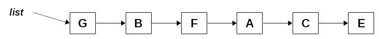
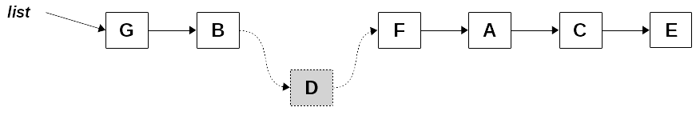
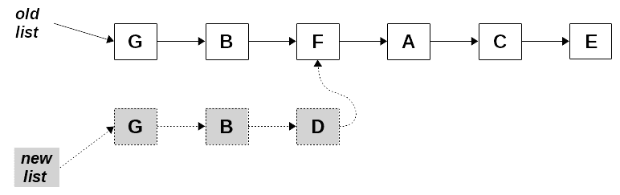
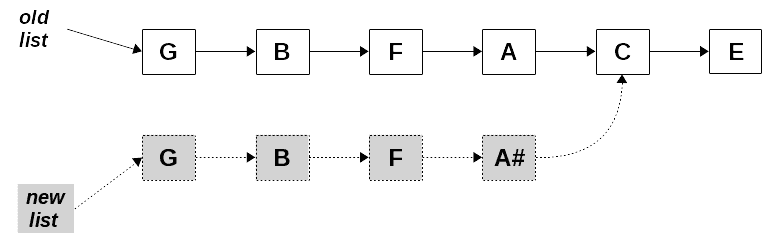
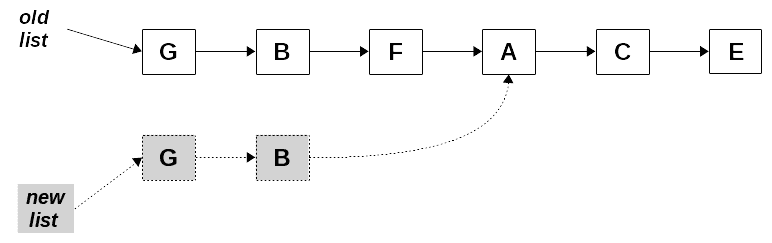
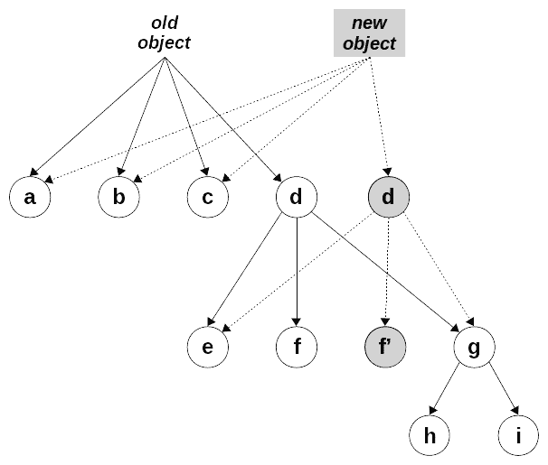

# 第十章：确保纯度-不可变性

在第四章的*行为良好-纯函数*中，当我们考虑纯函数及其优点时，我们看到修改接收到的参数或全局变量等副作用经常导致不纯。现在，在处理 FP 的许多方面和工具的几章之后，让我们来看看*不可变性*的概念：如何以这样一种方式处理对象，使得意外修改它们变得更加困难，甚至更好的是不可能。

我们无法强迫开发人员以安全、受保护的方式工作，但如果我们找到某种方法使数据结构不可变（意味着除了通过一些永远不允许修改原始数据但产生新对象的接口之外，它们不能直接更改），那么我们将有一个可执行的解决方案。在本章中，我们将看到两种处理这种不可变对象和数据结构的不同方法：

+   基本的 JS 方法，如冻结对象，以及克隆来创建新对象，而不是修改现有对象

+   持久数据结构，具有允许更新它们而不更改原始数据且无需克隆所有内容的方法，以获得更高的性能

警告：本章中的代码不适合生产；我想专注于主要观点，而不是所有与属性、getter、setter、原型等有关的无数细节，这些细节应该考虑到一个完整、牢固的解决方案。对于实际开发，我非常建议使用第三方库，但在确认它确实适用于您的情况之后。我们将推荐几个这样的库，但当然还有许多其他库可供使用。

# 直接的 JS 方式

副作用的最大原因之一是函数可能修改全局对象或其参数本身。所有非原始对象都作为引用传递，因此当/如果您修改它们时，原始对象将被更改。如果我们想要阻止这种情况（而不仅仅依赖开发人员的善意和清洁编码），我们可能需要考虑一些直接的 JS 技术来禁止这些副作用。

# 修改器函数

意外问题的一个常见来源是几个 JS 方法实际上修改了底层对象。在这种情况下，仅仅使用它们就会导致副作用，甚至您可能都意识不到。数组是问题的基本来源，令人头痛的方法列表并不短。（有关每种方法的更多信息，请参见[`developer.mozilla.org/en-US/docs/Web/JavaScript/Reference/Global_Objects/Array#Mutator_methods`](https://developer.mozilla.org/en-US/docs/Web/JavaScript/Reference/Global_Objects/Array#Mutator_methods)。）

+   `.copyWithin()` 允许您在数组内复制元素

+   `.fill()` 用给定值填充数组

+   `.push()` 和 `.pop()` 允许您在数组末尾添加或删除元素

+   `.shift()` 和 `.unshift()` 以相同的方式工作，但在数组的开头

+   `.splice()` 允许您在数组中的任何位置添加或删除元素

+   `.reverse()` 和 `.sort()` 在原地修改数组，颠倒其元素或对其进行排序

对于其中一些操作，您可能会生成数组的副本，然后使用它。在第四章的*参数突变*部分，*行为良好-纯函数*，我们就是用了展开运算符；我们也可以使用`.slice()`：

```js
const maxStrings2 = a => [...a].sort().pop();
const maxStrings3 = a => a.slice().sort().pop();

let countries = ["Argentina", "Uruguay", "Brasil", "Paraguay"];
console.log(maxStrings3(countries)); // *"Uruguay"*
console.log(countries); // *["Argentina", "Uruguay", "Brasil", "Paraguay"] - unchanged*
```

Setter 方法也是修改器，逻辑上会产生副作用，因为它们可以做任何事情。如果是这种情况，您将不得不选择稍后描述的其他解决方案之一。

# 常量

如果突变不是因为使用某些 JS 方法而发生的，那么我们可能希望尝试使用`const`定义，但那只是行不通的。在 JS 中，const 定义只意味着对象或数组的*引用*不能更改（因此您不能将不同的对象分配给它），但您仍然可以修改对象本身的属性。

```js
const myObj = {d: 22, m: 9};
console.log(myObj);
// {d: 22, m: 9}

myObj = {d: 12, m: 4};
// ***Uncaught TypeError: Assignment to constant variable.***

myObj.d = 12; // *but this is fine!*
myObj.m = 4;
console.log(myObj);
// {d: 12, m: 4}
```

因此，如果您决定在任何地方都使用`const`，那么您只能安全地防止对对象和数组的直接赋值。更为温和的副作用，例如更改属性或数组元素，仍然是可能的，因此这不是一个解决方案。

可以工作的是使用*冻结*来提供不可修改的结构和*克隆*来生成修改后的新结构。这可能不是禁止对象被更改的最佳方法，但可以用作权宜之计。让我们详细讨论一下这两种方法。

# 冻结

如果我们想要避免程序员意外或故意修改对象的可能性，冻结它是一个有效的解决方案。在对象被冻结之后，任何修改它的尝试都将悄无声息地失败。

```js
const myObj = { d: 22, m: 9 };
Object.freeze(myObj);

myObj.d = 12; // *won't have effect...*
console.log(myObj);
// Object {d: 22, m: 9}
```

不要将冻结与密封混淆：`Object.seal()`应用于对象，禁止向其添加或删除属性，因此对象的结构是不可变的，但属性本身可以更改。`Object.freeze()`不仅包括密封属性，还使它们不可更改。有关更多信息，请参阅[`developer.mozilla.org/en/docs/Web/JavaScript/Reference/Global_Objects/Object/seal`](https://developer.mozilla.org/en/docs/Web/JavaScript/Reference/Global_Objects/Object/seal)和[`developer.mozilla.org/en/docs/Web/JavaScript/Reference/Global_Objects/Object/freeze`](https://developer.mozilla.org/en/docs/Web/JavaScript/Reference/Global_Objects/Object/freeze)。

这种解决方案只有一个问题：冻结对象是一个*浅*操作，它类似于`const`声明，冻结属性本身。如果任何属性本身是对象或数组，并且具有进一步的对象或数组作为属性，依此类推，它们仍然可以被修改。在这里我们只考虑数据；您可能还想要冻结函数，但对于大多数用例，您想要保护的是数据。

```js
let myObj3 = {
 d: 22,
 m: 9,
 o: {c: "MVD", i: "UY", f: {a: 56}}
};
Object.freeze(myObj3);
console.log(myObj3);
// *{d:22, m:9, o:{c:"MVD", i:"UY", f:{ a:56}}}*
```

这只是部分成功，如我们所见：

```js
myObj3.d = 8888;          // *wont' work*
myObj3.o.f.a = 9999; // *oops, does work!!*
console.log(myObj3);
// *{d:22, m:9, o:{c:"MVD", i:"UY", f:{ **a:9999** }}}*
```

如果我们想要实现对象的真正不可变性，我们需要编写一个冻结对象所有级别的例程。幸运的是，通过递归很容易实现这一点。主要的想法是首先冻结对象本身，然后递归地冻结其每个属性。我们必须确保只冻结对象自己的属性；例如，我们不应该干扰对象的原型：

```js
const deepFreeze = obj => {
 if (obj && typeof obj === "object" && !Object.isFrozen(obj)) {
        Object.freeze(obj);
 Object.getOwnPropertyNames(obj).forEach(prop =>
            deepFreeze(obj[prop])
 );
 }
 return obj;
};
```

请注意，与`Object.freeze()`的工作方式相同，`deepFreeze()`也会*原地*冻结对象。我希望保持操作的原始语义，因此返回的对象将始终是原始对象。如果我们想以更纯粹的方式工作，我们应该首先复制原始对象（我们将在下一节中看到如何做到这一点），然后再冻结它。

仍然存在一个小的可能问题，但结果非常糟糕：如果对象包含对自身的引用，那么会发生什么？如果我们跳过已经冻结的对象进行冻结，我们可以避免这种情况：因为对象所引用的对象已经被冻结，所以会忽略向后的循环引用。因此，我们编写的逻辑已经解决了这个问题，没有更多需要做的了！

如果我们对一个对象应用`deepFreeze()`，我们可以安全地将其传递给任何函数，知道它根本不可能被修改。您还可以使用此属性来测试函数是否修改其参数：深度冻结它们，调用函数，如果函数依赖于修改其参数，它将无法工作，因为更改将被悄悄忽略。但是，那么，我们如何从函数中返回结果，如果它涉及到一个接收到的对象？这可以通过许多方式解决，一个简单的方法使用克隆，我们将看到。

在本章末尾的*问题*部分中，查看另一种通过代理冻结对象的方式。

# 克隆和变异。

如果不允许改变对象，则必须创建一个新对象。例如，如果你使用 Redux，reducer 是一个函数，它接收当前状态和一个动作（本质上是一个带有新数据的对象），并产生新状态。修改当前状态是完全禁止的，我们可以通过始终使用冻结对象来避免这种错误，就像我们在前一节中看到的那样。因此，为了满足 reducer 的要求，我们将需要能够克隆原始状态，然后根据接收到的动作进行相应的改变，然后得到的对象将成为新状态。

您可能希望重新查看第五章的*更一般的循环*部分，即*声明式编程 - 更好的风格*，在那里我们编写了一个基本的`objCopy()`函数，提供了与此处所示的不同方法。

最后，我们还应该冻结返回的对象，就像我们对原始状态做的那样。但让我们从头开始：我们如何克隆一个对象？当然，你总是可以手工做，但当处理大型复杂对象时，这不是你真正想考虑的事情。

```js
let oldObject = {
 d: 22,
 m: 9,
 o: {c: "MVD", i: "UY", f: {a: 56}}
};

let newObject = {
 d: oldObject.d,
 m: oldObject.m,
 o: {c: oldObject.o.c, i: oldObject.o.i, f: {a: oldObject.o.f.a}}
};
```

现在，寻找更自动化的解决方案，有几种简单的 JS 数组或对象复制方式，但它们都有相同的*浅显性*问题。

```js
let newObject1 = Object.assign({}, myObj);
let newObject2 = {...myObj};

let myArray = [1, 2, 3, 4];
let newArray1 = myArray.slice();
let newArray2 = [...myArray];
```

如果一个对象或数组包含对象（它们自己可能包含对象，依此类推），我们会遇到与冻结相同的问题：对象是通过引用复制的，这意味着新对象的更改也将意味着更改旧对象。

```js
let oldObject = {
 d: 22,
 m: 9,
 o: { c: "MVD", i: "UY", f: { a: 56 } }
};
let newObject = Object.assign({}, oldObject);

newObject.d = 8888;
newObject.o.f.a = 9999; 
console.log(newObject);
// {d:8888, m:9, o: {c:"MVD", i:"UY", f: {a:9999}}} -*- ok*

console.log(oldObject);
// {d:22, m:9, o: {c:"MVD", i:"UY", f: {a:9999}}} -- *oops!!*
```

有一个简单的解决方案，基于 JSON。如果我们`stringify()`原始对象，然后`parse()`结果，我们将得到一个新对象，但它与旧对象完全分离。

```js
const jsonCopy = obj => JSON.parse(JSON.stringify(obj));
```

这适用于数组和对象，但无论如何都存在一个问题。如果对象的任何属性具有构造函数，它将不会被调用：结果将始终由普通 JS 对象组成。我们可以通过`Date()`非常简单地看到这一点。

```js
let myDate = new Date();
let newDate = jsonCopy(myDate);
console.log(typeof myDate, typeof newDate); // ***object string***
```

我们可以采用递归解决方案，就像深度冻结一样，逻辑是相当相似的。每当我们发现一个真正是对象的属性时，我们调用适当的构造函数。

```js
const deepCopy = obj => {
 let aux = obj;
 if (obj && typeof obj === "object") {
        aux = new obj.constructor();
 Object.getOwnPropertyNames(obj).forEach(
 prop => (aux[prop] = deepCopy(obj[prop]))
 );
 }
 return aux;
};
```

这解决了我们在日期或者实际上任何对象中发现的问题！如果我们运行上面的代码，但使用`deepCopy()`而不是`jsonCopy()`，我们将得到`object object`作为输出，这正是应该的。如果我们检查类型和构造函数，一切都将匹配。此外，数据更改实验现在也将正常工作。

```js
let oldObject = {
 d: 22,
 m: 9,
 o: { c: "MVD", i: "UY", f: { a: 56 } }
};

let newObject = deepCopy(oldObject);
newObject.d = 8888;
newObject.o.f.a = 9999;
console.log(newObject);
// {d:8888, m:9, o:{c:"MVD", i:"UY", f:{a:9999}}}
console.log(oldObject);
// {d:22, m:9, o:{c:"MVD", i:"UY", f:{a:56}}} -- *unchanged!*
```

现在我们知道如何复制一个对象，我们可以这样工作：

1.  接收一个（冻结的）对象作为参数。

1.  制作一个不会被冻结的副本。

1.  从该副本中获取值，以在您的代码中使用。

1.  随意修改副本。

1.  冻结它。

1.  将其作为函数的结果返回。

尽管有些麻烦，但所有这些都是可行的。因此，让我们添加一些函数，帮助将所有内容整合在一起。

# 获取器和设置器

在上一节末尾列出的所有工作中，每次你想要更新一个字段，都会变得麻烦，并容易出错。让我们添加一对函数，以便能够从冻结的对象中获取值，但解冻它们以便你可以使用，并允许修改对象的任何属性，创建它的新副本，这样原始对象就不会被实际修改。

# 获取属性

回到第六章中的*从对象中获取属性*部分，*生成函数 - 高阶函数*，我们编写了一个简单的`getField()`函数，可以处理从对象中获取单个属性。

```js
const getField = attr => obj => obj[attr];
```

我们可以通过组合一系列`getField()`调用来从对象中获取深层属性，但这样做会相当麻烦。相反，让我们编写一个函数，它将接收一个*路径* - 一个字段名称的数组 - 并返回对象的相应部分，如果路径不存在则返回 undefined。使用递归非常合适，简化了编码！

```js
const getByPath = (arr, obj) => {
 if (arr[0] in obj) {
 return arr.length > 1
 ? getByPath(arr.slice(1), obj[arr[0]])
 : deepCopy(obj[arr[0]]);
 } else {
 return undefined;
 }
};
```

一旦对象被冻结，就无法*解冻*它，所以我们必须求助于制作它的新副本；`deepCopy()`非常适合这个任务。让我们尝试一下我们的新函数：

```js
let myObj3 = {
 d: 22,
 m: 9,
 o: {c: "MVD", i: "UY", f: {a: 56}}
};
deepFreeze(myObj3);

console.log(getByPath(["d"], myObj3)); // 22
console.log(getByPath(["o"], myObj3)); // {c: "MVD", i: "UY", f: {a: 56}}
console.log(getByPath(["o", "c"], myObj3)); // "MVD"
console.log(getByPath(["o", "f", "a"], myObj3)); // 56
```

我们还可以检查返回的对象是否被冻结。

```js
let fObj = getByPath(["o", "f"], myObj3);
console.log(fObj); // {a: 56}
fObj.a = 9999;
console.log(fObj); // {a: 9999} *-- it's not frozen*
```

# 按路径设置属性

现在我们写了这个，我们可以编写一个类似的`setByPath()`函数，它将接受一个路径、一个值和一个对象，并更新一个对象。

```js
const setByPath = (arr, value, obj) => {
 if (!(arr[0] in obj)) {
 obj[arr[0]] =
 arr.length === 1 ? null : Number.isInteger(arr[1]) ? [] : {};
 }

 if (arr.length > 1) {
 return setByPath(arr.slice(1), value, obj[arr[0]]);
 } else {
 obj[arr[0]] = value;
 return obj;
 }
};
```

我们在这里使用递归来进入对象，如果需要的话创建新属性，直到我们遍历完路径的全部长度。一个重要的细节是，在创建属性时，我们是否需要一个数组还是一个对象。我们可以通过检查路径中的下一个元素来确定：如果它是一个数字，那么我们需要一个数组；否则，一个对象就可以了。当我们到达路径的末尾时，我们简单地赋予新给定的值。

如果你喜欢这种做事情的方式，你应该看看*seamless-immutable*库，它正是以这种方式工作。名称中的*seamless*部分指的是你仍然可以使用正常的对象，尽管是冻结的！所以你可以使用`.map()`、`.reduce()`等方法。在[`github.com/rtfeldman/seamless-immutable`](https://github.com/rtfeldman/seamless-immutable)了解更多。

然后我们可以编写一个函数，它将能够接受一个冻结的对象，并更新其中的属性，返回一个新的，同样被冻结的对象。

```js
const updateObject = (arr, obj, value) => {
 let newObj = deepCopy(obj);
 setByPath(arr, value, newObj);
 return deepFreeze(newObj);
};
```

我们可以看看它是如何工作的：让我们对我们一直在使用的`myObj3`对象运行几次更新。

```js
let new1 = updateObject(["m"], myObj3, "sep");
// {d: 22, m: "sep", o: {c: "MVD", i: "UY", f: {a: 56}}};

let new2 =updateObject(["b"], myObj3, 220960);
// {d: 22, m: 9, o: {c: "MVD", i: "UY", f: {a: 56}}, b: 220960};

let new3 =updateObject(["o", "f", "a"], myObj3, 9999);
// {d: 22, m: 9, o: {c: "MVD", i: "UY", f: {a: 9999}}};

let new4 =updateObject(["o", "f", "j", "k", "l"], myObj3, "deep");
// {d: 22, m: 9, o: {c: "MVD", i: "UY", f: {a: 56, j: {k: "deep"}}}};
```

有了这一对函数，我们终于找到了保持不可变性的方法：

+   对象必须从一开始就被冻结

+   从对象中获取数据是通过`getByPath()`完成的

+   使用`updateObject()`来设置数据，它在内部使用`setByPath()`

如果你想看另一种使用 setter 和 getter 来实现对对象的功能访问和更新的方法，请查看 lenses，它由 Ramda 等库提供。Lenses 可以被看作是一种功能性的方式，不仅可以获取和设置变量，还可以以可组合的方式对其运行函数：一种*某物*，让你专注于数据结构的特定部分，访问它，并可能也改变它或对其应用函数。从[`ramdajs.com/docs/#lens.`](http://ramdajs.com/docs/#lens.)开始了解更多。

# 持久数据结构

如果每次你想要改变数据结构中的某些东西，你都去改变它，你的代码将充满副作用。另一方面，每次复制完整的结构都是浪费时间和空间。有一种中间方法，使用持久数据结构，如果处理正确，可以让你在创建新结构的同时应用更改，以一种高效的方式。

# 使用列表

考虑一个简单的过程：假设你有一个列表，你想要向其中添加一个新元素。你会怎么做？我们可以假设每个节点都是一个`NodeList`对象。

```js
class ListNode {
 constructor(value, next = null) {
 this.value = value;
 this.next = next;
 }
}
```

可能的列表如下，其中`list`变量将指向第一个元素。见图 10.1：

图 10.1。初始列表。（你能告诉这个列表缺少什么，以及缺少的部分在哪里吗？）

如果你想在 B 和 F 之间添加 D（这是音乐家会理解的：我们这里有“三度圈”，但缺少了 D），最简单的解决方案就是添加一个新节点并更改一个现有节点，得到以下结果。见图 10.2：

图 10.2。列表现在有一个新元素：我们不得不修改一个现有的元素来进行添加。

然而，以这种方式工作显然是非功能性的，很明显我们正在修改数据。有一种不同的工作方式，即创建一个持久的数据结构，在这种结构中，所有的改动（插入、删除和修改）都是分开进行的，小心不要修改现有的数据。另一方面，如果结构的某些部分可以被重复使用，那么就会为了性能而这样做。进行持久更新将返回一个新的列表，其中一些节点是之前的一些节点的副本，但原始列表完全没有任何改变。见图 10.3：

图 10.3。虚线元素显示了新返回的列表：一些元素必须被复制以避免修改原始结构。旧列表指的是原始结构，新列表指的是插入的结果。

当然，我们还将处理更新或删除。再次从图 10.4 中的列表开始，如果我们想要更新它的第四个元素，解决方案将涉及创建列表的一个新子集，直到并包括第四个元素，同时保持其余部分不变。

图 10.4。我们的列表，有一个改变的元素。

删除一个元素也是类似的。让我们在原始列表中去掉第三个元素 F。见图 10.5：

图 10.5。在持久的方式下删除第 3 个元素后的原始列表。

使用列表或其他结构始终可以解决数据持久性的问题。但是，现在让我们专注于对我们来说可能是最重要的工作：处理简单的 JS 对象。毕竟，所有的数据结构都是 JS 对象，所以如果我们可以处理任何对象，我们就可以处理其他结构。

# 更新对象

这种方法也可以应用于更常见的需求，比如修改一个对象。这对于 Redux 用户来说是一个非常好的主意：可以编写一个 reducer，它将接收旧状态作为参数，并生成一个带有最小必要更改的更新版本，而不会以任何方式改变原始状态。

想象你有一个如下的对象：

```js
myObj = {
 a: ...,
 b: ...,
 c: ...,
    d: {
 e: ...,
        f: ...,
 g: {
 h: ...,
 i: ...
 }
 }
};
```

如果你想修改`myObj.d.f`，并且想以持久的方式进行，你将创建一个新对象，它将与之前的对象有几个共同的属性，但将为修改的属性定义新的属性。见图 10.6：

图 10.6。通过创建一个具有一些共享属性和一些新属性的新对象，以持久的方式编辑对象。

如果你想手动完成这个操作，你将不得不以非常繁琐的方式编写类似下面的内容。大多数属性都来自原始对象，但`d`和`d.f`是新的：

```js
newObj = {
 a: myObj.a,
 b: myObj.b,
 c: myObj.c,
 d: {
 e: myObj.d.e,
 f: *the new value*,
 g: myObj.d.g
 }
};
```

我们在本章的早些时候已经看到了类似的代码，当时我们决定要编写一个克隆函数，但现在让我们选择一种不同类型的解决方案。事实上，这种更新可以自动完成。

```js
const setIn = (arr, val, obj) => {
 const newObj = Number.isInteger(arr[0]) ? [] : {};

 Object.keys(obj).forEach(k => {
 newObj[k] = k !== arr[0] ? obj[k] : null;
 });

 newObj[arr[0]] =
 arr.length > 1 ? setIn(arr.slice(1), val, obj[arr[0]]) : val;
 return newObj;
};
```

逻辑是递归的，但并不太复杂。首先，我们在当前级别确定我们需要什么样的对象：数组还是对象。然后，我们将所有属性从原始对象复制到新对象，除了我们正在更改的属性。最后，我们将该属性设置为给定值（如果我们已经完成了属性名称的路径），或者我们使用递归来深入复制。

注意参数的顺序：首先是路径，然后是值，最后是对象。我们应用了将最*稳定*的参数放在前面，最可变的参数放在最后的概念。如果你对这个函数进行柯里化，你可以将相同的路径应用到几个不同的值和对象上，如果你固定路径和值，你仍然可以使用不同的对象来使用该函数。

我们可以尝试这种逻辑。让我们从一个毫无意义的对象开始，但是有几个级别，甚至有一个对象数组，以增加变化。

```js
let myObj1 = {
 a: 111,
 b: 222,
 c: 333,
 d: {
 e: 444,
 f: 555,
 g: {
 h: 666,
 i: 777
 },
 j: [{k: 100}, {k: 200}, {k: 300}]
 }
};
```

我们可以测试将`myObj.d.f`更改为一个新值：

```js
let myObj2 = setIn(["d", "f"], 88888, myObj1);
/*
{
 a: 111,
 b: 222,
 c: 333,
 d: {
 e: 444,
 f: 88888,
 g: {h: 666, i: 777},
 j: [{k: 100}, {k: 200}, {k: 300}]
 }
}
*/

console.log(myObj.d === myObj2.d);     // *false*
console.log(myObj.d.f === myObj2.d.f); // *false*
console.log(myObj.d.g === myObj2.d.g); // *true*
```

底部的日志验证了算法是否正确运行：`myObj2.d`是一个新对象，但`myObj2.d.g`重用了`myObj`中的值。

在第二个对象中进一步更新数组让我们也能测试逻辑在这些情况下是如何工作的。

```js
let myObj3 = setIn(["d", "j", 1, "k"], 99999, myObj2);
/*
{
 a: 111,
 b: 222,
 c: 333,
 d: {
 e: 444,
 f: 88888,
 g: {h: 666, i: 777},
 j: [{k: 100}, {k: 99999}, {k: 300}]
 }
}
*/
console.log(myObj.d.j === myObj3.d.j);       // *false*
console.log(myObj.d.j[0] === myObj3.d.j[0]); // *true*
console.log(myObj.d.j[1] === myObj3.d.j[1]); // *false*
console.log(myObj.d.j[2] === myObj3.d.j[2]); // *true*
```

我们可以将`myObj.d.j`数组中的元素与新创建的对象中的元素进行比较，你会发现数组是一个新数组，但两个元素（没有更新的元素）仍然是与`myObj`中相同的对象。

这显然还不够。我们的逻辑可以更新现有字段，甚至在没有的情况下添加它，但你还需要可能消除一些属性的可能性。通常库提供了更多的功能，但至少让我们来看看如何删除一个属性，以查看对象中的其他重要结构变化。

```js
const deleteIn = (arr, obj) => {
 const newObj = Number.isInteger(arr[0]) ? [] : {};

 Object.keys(obj).forEach(k => {
 if (k !== arr[0]) {
 newObj[k] = obj[k];
 }
 });

 if (arr.length > 1) {
 newObj[arr[0]] = deleteIn(arr.slice(1), obj[arr[0]]);
 }
 return newObj;
};
```

这个逻辑类似于`setIn()`的逻辑。不同之处在于我们并不总是将所有属性从原始对象复制到新对象：只有在我们还没有到达路径属性数组的末尾时才这样做。在更新后继续测试系列之后，我们得到了以下结果：

```js
myObj4 = deleteIn(["d", "g"], myObj3);
myObj5 = deleteIn(["d", "j"], myObj4);

// {a: 111, b: 222, c: 333, d: {e: 444, f: 88888}};
```

有了这一对函数，我们可以管理持久对象的工作，以一种高效的方式进行更改、添加和删除，而不会不必要地创建新对象。

可能最著名的用于处理不可变对象的库是名为*immutable.js*的库，网址为[`facebook.github.io/immutable-js/`](https://facebook.github.io/immutable-js/)。唯一的弱点是其臭名昭著的晦涩文档。然而，对此有一个简单的解决方案：查看[`untangled.io/the-missing-immutable-js-manual/`](http://untangled.io/the-missing-immutable-js-manual/)上的*The Missing Immutable.js Manual With All The Examples You’ll Ever Need*，你就不会有任何麻烦了！

# 最后的警告

使用持久数据结构需要一些克隆，但你如何实现一个持久数组？如果你考虑一下，你会意识到，在这种情况下，除了在每次操作后克隆整个数组之外，没有其他办法。这意味着像更新数组中的元素这样的操作，它本来只需要基本恒定的时间，现在将需要与数组大小成比例的时间。

在算法复杂度方面，我们会说更新从 O(1)操作变为 O(n)操作。同样，访问一个元素可能会变成 O(log n)操作，其他操作也可能出现类似的减速，比如映射、减少等。

我们如何避免这种情况？没有简单的解决方案。例如，你可能会发现数组在内部被表示为二叉搜索树（甚至更复杂的数据结构），并且持久库提供了所需的接口，这样你仍然可以将其用作数组，而不会注意到内部的差异。

当使用这种类型的库时，具有不可变更新而无需克隆的优势可能部分地被一些操作所抵消，这些操作可能变得更慢。如果这成为应用程序的瓶颈，甚至可能需要改变实现不可变性的方式，甚至想出一些改变基本数据结构的方法来避免时间损失，或者至少将其最小化。

# 问题

10.1\. **通过代理进行冻结**。在第八章的*链接函数 - 管道和组合*部分，我们使用代理来获取操作，以便提供自动链接。通过使用代理进行*设置*和*删除*操作，您可以自行进行*冻结*（如果您不想设置对象的属性，而是宁愿抛出异常）。实现一个`freezeByProxy(obj)`函数，将这个想法应用到禁止所有类型的更新（添加、修改或删除属性）的对象上。记得要递归地工作，以防一个对象具有其他对象作为属性！

10.2\. **持久地插入到列表中**。在*使用列表*部分，我们描述了一种算法如何以持久的方式向列表中添加一个新节点，通过创建一个新的列表，就像我们之前描述的那样。实现一个`insertAfter(list, newKey, oldKey)`函数，它将创建一个新的列表，但在具有键`oldKey`的节点之后添加一个具有键`newKey`的新节点。您可以假设列表的节点是通过以下逻辑创建的：

```js
class Node {
 constructor(key, next = null) {
 this.key = key;
 this.next = next;
 }
}

const node = (key, next) => new Node(key, next);

let c3 = node("G", node("B", node("F", node("A", node("C", node("E"))))));

```

# 总结

在本章中，我们已经看到了两种不同的方法（实际上是常见的不可变性库使用的方法），通过使用不可变对象和数据结构来避免副作用：一种是基于使用 JavaScript 的*对象冻结*加上一些特殊逻辑来克隆，另一种是应用持久数据结构的概念，其中的方法允许进行各种更新，而不会改变原始对象或需要完全克隆。

在第十一章*实现设计模式 - 函数式方法*中，我们将专注于面向对象程序员经常问的一个问题：设计模式在 FP 中如何使用？它们是否必需、可用或可用？它们是否仍然被实践，但关注点转移到了函数而不是对象？我们将通过几个示例来回答这些问题，展示它们在哪里以及如何它们与通常的 OOP 实践相等或不同。
