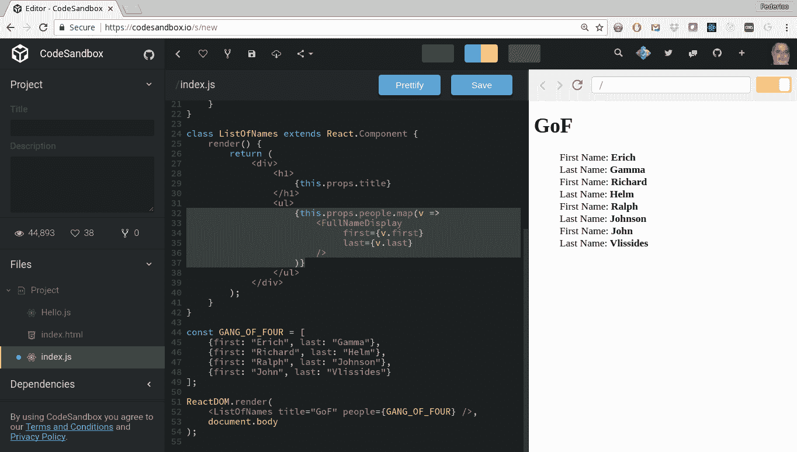
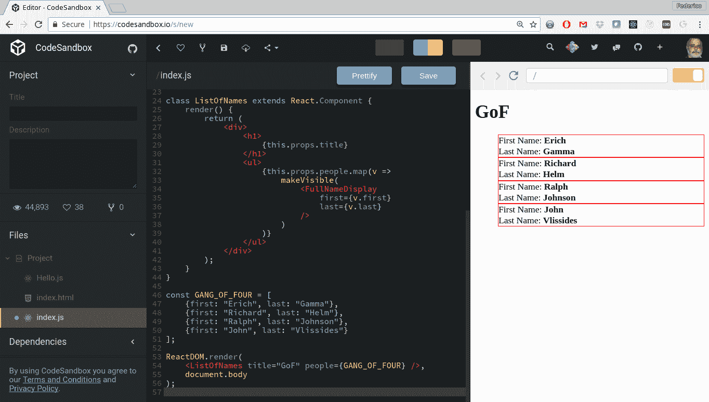

# 第十一章：实现设计模式-函数式方法

在[第十章]（383f5538-72cc-420a-ae77-896776c03f27.xhtml）中，我们看到了几种解决不同问题的函数式技术。然而，习惯于使用 OOP 的程序员可能会发现我们错过了一些众所周知的公式和解决方案，这些公式和解决方案在命令式编码中经常使用。由于设计模式是众所周知的，并且程序员可能已经了解它们在其他语言中的应用，因此重要的是看看如何进行函数实现。

在本章中，我们将考虑设计模式所暗示的解决方案，这些解决方案在面向对象编程中很常见，以便看到它们在 FP 中的等价物。特别是，我们将研究以下主题：

+   设计模式的概念及其适用范围

+   一些 OOP 标准模式以及在 FP 中我们有什么替代方案，如果需要的话。

+   与面向对象设计模式无关的 FP 设计模式讨论

# 什么是设计模式？

软件工程中最重要的书籍之一是《设计模式：可复用面向对象软件的元素》，1994 年，由 GoF（四人帮）：Erich Gamma，Richard Helm，Ralph Johnson 和 John Vlissides 编写。这本书介绍了大约两打不同的 OOP 模式，并被认为是计算机科学中非常重要的书籍。

*模式*实际上是建筑设计的概念，最初由建筑师克里斯托弗·亚历山大定义。

在软件术语中，*设计模式*是软件设计中通常出现的常见问题的一般适用的可重用解决方案。它不是特定的、完成的和编码的设计，而是一个可以解决许多情境中出现的给定问题的解决方案的描述（也使用了“模板”这个词）。鉴于它们的优势，设计模式本身是开发人员在不同类型的系统、编程语言和环境中使用的*最佳实践*。

这本书显然侧重于 OOP，并且其中的一些模式不能推荐或应用于 FP。其他模式是不必要的或无关的，因为 FP 语言已经为相应的 OOP 问题提供了标准解决方案。即使存在这种困难，由于大多数程序员已经接触过 OOP 设计模式，并且通常会尝试在其他上下文中（如 FP）应用它们，因此考虑原始问题，然后看看如何产生新的解决方案是有意义的。标准的基于对象的解决方案可能不适用，但问题仍然存在，因此看看如何解决它仍然是有效的。

通常用四个基本要素来描述模式：

1.  用于描述问题、解决方案及其后果的简单、简短的名称。这个名称对于与同事交流、解释设计决策或描述特定实现是有用的。

1.  模式适用的*上下文*：这意味着需要解决的特定情况，可能还需要满足一些额外条件。

1.  列出解决特定情况所需的元素（类、对象、函数、关系等）的解决方案

1.  如果应用模式，*后果*（结果和权衡）。您可能会从解决方案中获得一些收益，但它也可能意味着一些损失。

在本章中，我们将假设读者已经了解我们将描述和使用的设计模式，因此我们不会提供太多关于它们的细节。相反，我们将重点放在 FP 如何使问题变得无关（因为有一种明显的应用函数技术来解决它的方式）或以某种方式解决它。此外，我们不会涉及所有 GoF 模式；我们只会专注于那些应用 FP 更有趣的模式，从而带出与通常的 OOP 实现更多的差异。

# 设计模式类别

设计模式通常根据它们的焦点分为几个不同的类别。以下列表中的前三个是出现在原始 GoF 书中的模式，但还添加了更多的类别：

+   行为设计模式：这些与对象之间的交互和通信有关。与其关注对象如何创建或构建，关键是如何连接它们，以便它们在执行复杂任务时可以合作，最好以提供众所周知的优势的方式，例如减少耦合或增强内聚性。

+   创建设计模式：它们处理以适合当前问题的方式创建对象的方法，可能引导在几种替代对象之间进行选择，以便程序可以根据可能在编译时或运行时已知的参数以不同的方式工作。

+   结构设计模式：它们涉及对象的组成，从许多个体部分形成更大的结构，并实现对象之间的关系。一些模式意味着继承或接口的实现，而其他模式使用不同的机制，都旨在能够在运行时动态地改变对象组合的方式。

+   并发模式：它们与处理多线程编程有关。尽管函数式编程通常非常适合这样做（例如，由于缺少赋值和副作用），但由于我们使用 JavaScript，这些模式对我们来说并不是很相关。

+   架构模式：它们更加高层次，比我们列出的先前模式具有更广泛的范围，并提供了软件架构问题的一般解决方案。目前，我们不考虑这些问题，所以我们也不会处理这些问题。

耦合和内聚性是在面向对象编程流行之前就已经使用的术语；它们可以追溯到 60 年代末，当时 Larry Constantine 的《结构化设计》出版。前者衡量任何两个模块之间的相互依赖性，后者与模块的所有组件真正属于一起的程度有关。低耦合和高内聚性是软件设计的良好目标，因为它们意味着相关的事物是靠在一起的，而不相关的事物是分开的。

沿着这些线路，你也可以将设计模式分类为“对象模式”（涉及对象之间的动态关系）和“类模式”（处理类和子类之间的关系，这些关系在编译时静态定义）。我们不会过多地担心这种分类，因为我们的观点更多地与行为和函数有关，而不是类和对象。

正如我们之前提到的，我们现在可以清楚地观察到这些类别是严重面向面向对象编程的，并且前三个直接提到了对象。然而，不失一般性，我们将超越定义，记住我们试图解决的问题，然后探讨函数式编程的类似解决方案，即使不是与面向对象编程完全等价，也会以类似的方式解决相同的问题。

# 我们需要设计模式吗？

有一个有趣的观点认为，设计模式只是需要修补编程语言的缺陷。理由是，如果你可以用一种语言以简单、平凡的方式解决问题，那么你可能根本不需要设计模式。

无论如何，对于面向对象的开发人员来说，真正理解为什么函数式编程可以解决一些问题而无需进一步的工具是很有趣的。在下一节中，我们将考虑几种众所周知的设计模式，并看看为什么我们不需要它们，或者我们如何可以轻松地实现它们。事实上，我们在文本中已经应用了几种模式，所以我们也会指出这些例子。

然而，我们不会试图将所有设计模式都表达或转换成 FP 术语。例如，*Singleton*模式基本上需要一个单一的全局对象，这与函数式编程者习惯的一切都有点相悖。鉴于我们对 FP 的方法（还记得第一章初步部分的 SFP，*Sorta Functional Programming*吗？），我们也不会介意，如果需要 Singleton，我们可能会考虑使用它，即使 FP 没有合适的等价物。

最后，必须说一下，一个人的观点可能会影响什么被认为是模式，什么不是。对一些人来说可能是模式，对其他人来说可能被认为是微不足道的细节。我们会发现一些这样的情况，因为 FP 让我们以简单的方式解决一些特定问题，我们在之前的章节中已经看到了一些例子。

# 面向对象的设计模式

在本节中，我们将介绍一些 GoF 设计模式，检查它们是否与 FP 相关，并学习如何实现它们。当然，有一些设计模式没有 FP 解决方案。例如，没有 Singleton 的等价物，这意味着全局访问对象的外来概念。此外，虽然你可能不再需要面向对象的特定模式，但开发人员仍会以这些术语思考。最后，既然我们不是*完全函数式*，如果面向对象的模式适用，为什么不使用呢？

# Façade 和 Adapter

在这两种模式中，让我们从*Façade*开始。这是为了解决为类或库的方法提供不同接口的问题。其想法是为系统提供一个新的接口，使其更易于使用。你可以说，Façade 提供了一个更好的*控制面板*来访问某些功能，为用户消除了困难。

Façade 还是 facade？原词是建筑术语，意思是*建筑物的正面*，来自法语。根据这个来源和ç的通常发音，它的发音大约是*fuh-sahd*。另一种拼写可能与键盘上国际字符的缺失有关，并提出了以下问题：你不应该把它读成*faKade*吗？你可以把这个问题看作是*celtic*的反面，*celtic*的发音是*Keltic*，用*k*音代替了*s*音。

我们要解决的主要问题是能够以更简单的方式使用外部代码（当然，如果是你的代码，你可以直接处理这些问题；我们必须假设你不能——或者不应该——尝试修改其他代码。例如，当你使用任何可在网上获得的库时，就会出现这种情况）。关键是实现一个自己的模块，提供更适合你需求的接口。你的代码将使用你的模块，而不会直接与原始代码交互。

假设你想要进行 Ajax 调用，你唯一的可能性是使用一些具有非常复杂接口的库。有了 ES8 的模块，你可以编写以下内容，使用一个想象中的复杂 Ajax 库：

```js
// simpleAjax.js

import * as hard from "hardajaxlibrary";
// *import the other library that does Ajax calls*
// *but in a hard, difficult way, requiring complex code*

const convertParamsToHardStyle = params => {
 // *do some internal things to convert params*
 // *into the way that the hard library requires*
};

const makeStandardUrl = url => {
 // *make sure the url is in the standard*
 // *way for the hard library*
};

const getUrl = (url, params, callback) => {
 const xhr = hard.createAnXmlHttpRequestObject();
 hard.initializeAjaxCall(xhr);
 const standardUrl = makeStandardUrl(url);
 hard.setUrl(xhr, standardUrl);
 const convertedParams = convertParamsToHardStyle(params);
 hard.setAdditionalParameters(params);
 hard.setCallback(callback);
 if (hard.everythingOk(xhr)) {
 hard.doAjaxCall(xhr);
 } else {
 throw new Error("ajax failure");
 }
};

const postUrl = (url, params, callback) => {
 // *some similarly complex code*
 // *to do a POST using the hard library*
};

export {getUrl, postUrl}; // *the only methods that will be seen*
```

现在，如果你需要进行`GET`或`POST`，而不是必须经历提供的复杂 Ajax 库的所有复杂性，你可以使用提供更简单工作方式的新 façade。开发人员只需`import {getUrl, postUrl} from "simpleAjax"`，然后可以以更合理的方式工作。

然而，为什么我们要展示这段代码，虽然有趣，但并没有显示任何特定的 FP 方面？关键是，至少在浏览器中完全实现模块之前，隐式的内部方法是使用 IIFE（*立即调用函数表达式*），就像我们在第三章的*立即调用*部分中看到的那样，通过*模块模式*的方式：

```js
const simpleAjax = (function() {
 const hard = require("hardajaxlibrary");

 const convertParamsToHardStyle = params => {
 // ...
 };

 const makeStandardUrl = url => {
 // ...
 };

 const getUrl = (url, params, callback) => {
 // ...
 };

 const postUrl = (url, params, callback) => {
 // ...
 };

 return {
 getUrl,
 postUrl
 };
})();
```

*揭示模块*名称的原因现在应该是显而易见的。由于 JS 中的作用域规则，`simpleAjax`的唯一可见属性将是`simpleAjax.getUrl`和`simpleAjax.postUrl`；使用 IIFE 让我们以安全的方式实现模块（因此也实现了外观），使实现细节成为私有的。

现在，*适配器*模式类似，因为它也意味着定义一个新接口。然而，虽然*外观*为旧代码定义了一个新接口，但当您需要为新代码实现旧接口时，就会使用适配器，以便匹配您已经拥有的内容。如果您正在使用模块，很明显，对于*外观*有效的解决方案在这里也同样有效，因此我们不必深入研究它。

# 装饰器或包装器

*装饰器*模式（也称为*包装器*）在您希望以动态方式向对象添加额外的职责或功能时非常有用。让我们考虑一个简单的例子，我们将用一些 React 代码来说明。 （如果您不了解这个框架，不要担心；这个例子很容易理解）。假设我们想在屏幕上显示一些元素，并且出于调试目的，我们想在对象周围显示一个红色的细边框。您该如何做？

如果您使用面向对象编程，您可能需要创建一个具有扩展功能的新子类。对于这个特定的例子，您可能只需提供一些属性，其名称为一些 CSS 类，该类将提供所需的样式，但让我们将注意力集中在面向对象上；使用 CSS 并不总是解决这个软件设计问题，因此我们需要一个更通用的解决方案。新的子类将*知道*如何显示自己的边框，并且每当您想要对象的边框可见时，您将使用这个子类。

有了我们对高阶函数的经验，我们可以用*包装*的方式以不同的方式解决这个问题；将原始函数包装在另一个函数中，该函数将提供额外的功能。

请注意，在第六章的*生成函数 - 高阶函数*部分中，我们已经看到了一些包装的示例。例如，在该部分中，我们看到了如何包装函数以生成可以记录其输入和输出、提供时间信息，甚至记忆调用以避免未来延迟的新版本。在这种情况下，为了多样性，我们将这个概念应用于*装饰*一个可视组件，但原则仍然是相同的。

让我们定义一个简单的 React 组件，`ListOfNames`，它可以显示一个标题和一个人员列表，对于后者，它将使用`FullNameDisplay`组件。这些元素的代码如下片段所示：

```js
class FullNameDisplay extends React.Component {
 render() {
 return (
 <div>
 First Name: <b>{this.props.first}</b>
 <br />
 Last Name: <b>{this.props.last}</b>
 </div>
 );
 }
}

class ListOfNames extends React.Component {
 render() {
 return (
 <div>
 <h1>
 {this.props.heading}
 </h1>
 <ul>
 {this.props.people.map(v =>
 <FullNameDisplay first={v.first} last={v.last} />
 )}
 </ul>
 </div>
 );
 }
}
```

`ListOfNames`组件使用映射来创建`FullNameDisplay`组件，以显示每个人的数据。我们应用程序的完整逻辑可能如下：

```js
import React from "react";
import ReactDOM from "react-dom";

class FullNameDisplay extends React.Component {
 // *...as above...*
}

class ListOfNames extends React.Component {
 // *...as above...*
}

const GANG_OF_FOUR = [
 {first: "Erich", last: "Gamma"},
 {first: "Richard", last: "Helm"},
 {first: "Ralph", last: "Johnson"},
 {first: "John", last: "Vlissides"}
];

ReactDOM.render(
    <ListOfNames heading="GoF" people={GANG_OF_FOUR} />,
 document.body
);
```

在现实生活中，您不会将每个组件的所有代码都放在同一个源代码文件中——您可能会有几个 CSS 文件。但是，对于我们的例子，将所有内容放在一个地方，并使用内联样式就足够了，所以请忍耐一下，并记住以下格言：*说话容易做到难*。

我们可以在[`codesandbox.io/`](https://codesandbox.io/)在线 React 沙箱中快速测试结果；如果您想要其他选项，请搜索*react online sandbox*。结果并不值得讨论，但我们现在对设计模式感兴趣，而不是 UI 设计；参考图 11.1：

图 11.1：我们组件的原始版本显示了一个（不值得一提）的名称列表

在 React 中，内联组件是用 JSX（内联 HTML 样式）编写的，实际上被编译为对象，稍后将其转换为 HTML 代码以进行显示。每当调用`render()`方法时，它都会返回一组对象结构。因此，如果我们编写一个函数，该函数将以组件作为参数，并返回新的 JSX，这将是一个包装对象。在我们的情况下，我们希望在所需的边框内包装原始组件：

```js
const makeVisible = component => {
 return (
        <div style={{border: "1px solid red"}}>
 {component}
        </div>
 );
};
```

如果您愿意，您可以使此函数知道它是在开发模式下执行还是在生产模式下执行；在后一种情况下，它将简单地返回原始组件参数，而不做任何更改，但现在让我们不要担心这个。

现在我们必须更改`ListOfNames`以使用包装组件：

```js
class ListOfNames extends React.Component {
 render() {
 return (
 <div>
 <h1>
 {this.props.title}
 </h1>
 <ul>
 {this.props.people.map(v =>
 makeVisible(
 <FullNameDisplay
 first={v.first}
 last={v.last}
 />
 )
 )}
 </ul>
 </div>
 );
 }
}
```

代码的装饰版本按预期工作：现在`ListOfNames`组件中的每个组件都包装在另一个组件中，该组件为它们添加所需的边框；请参阅图 11.2：

图 11.2：装饰的 ListOfNames 组件仍然没有太多可看的，但现在它显示了一个添加的边框

在早期的章节中，我们看到如何装饰一个函数，将其包装在另一个函数中，以便执行额外的代码并添加一些功能。现在，在这里，我们看到了如何应用相同风格的解决方案，以提供一个*高阶组件*（在 React 术语中称为）包装在额外的`<div>`中，以提供一些视觉上的独特细节。

如果您使用过 Redux 和*react-redux*包，您可能会注意到后者的`connect()`方法也是以相同方式的装饰器；它接收一个组件类，并返回一个新的、连接到存储的组件类，供您在表单中使用；有关更多详细信息，请参阅[`github.com/reactjs/react-redux`](https://github.com/reactjs/react-redux)。

# 策略、模板和命令

*策略*模式适用于您希望能够通过更改*执行其操作方式*的方式来更改类、方法或函数的能力，可能是以动态方式。例如，GPS 应用程序可能希望在两个地点之间找到一条路线，但如果人是步行、骑自行车或开车，就应用不同的策略。在这种情况下，可能需要最快或最短的路线。问题是相同的，但根据给定条件，必须应用不同的算法。

顺便说一下，这听起来很熟悉吗？如果是这样，那是因为我们已经遇到过类似的问题。当我们想以不同的方式对一组字符串进行排序时，在第三章中，*从函数开始 - 核心概念*，我们需要一种方法来指定如何应用排序，或者等效地，如何比较两个给定的字符串并确定哪个应该先进行。根据语言的不同，我们必须应用不同的比较方法进行排序。

在尝试 FP 解决方案之前，让我们考虑更多实现我们的路由功能的方法。您可以通过编写足够大的代码来实现，该代码将接收声明要使用哪种算法以及起点和终点的参数。有了这些参数，函数可以执行 switch 或类似的操作来应用正确的路径查找逻辑。代码大致等同于以下片段：

```js
function findRoute(byMeans, fromPoint, toPoint) {
    switch (byMeans) {
        case "foot":
            /* *find the shortest road
                for a walking person* */

        case "bicycle":
            /** find a route apt 
                for a cyclist* */

        case "car-fastest":
            /* *find the fastest route
                for a car driver* */

        case "car-shortest":
            /** find the shortest route
                for a car driver* */

        default:
            /** plot a straight line,
                or throw an error, 
                or whatever suits you * */
    }
}
```

这种解决方案确实不理想，您的函数实际上是许多不同其他函数的总和，这并不提供高度的内聚性。如果您的语言不支持 lambda 函数（例如，直到 2014 年 Java 8 推出之前，Java 就是这种情况），则此问题的 OO 解决方案需要定义实现您可能想要的不同策略的类，创建一个适当的对象，并将其传递。

在 JS 中使用 FP，实现策略是微不足道的，而不是使用`byMeans`这样的变量进行切换，您可以只是传递一个函数，该函数将实现所需的路径逻辑：

```js
function findRoute(routeAlgorithm, fromPoint, toPoint) {
 return routeAlgorithm(fromPoint, toPoint);
}
```

您仍然必须实现所有所需的策略（没有其他方法），并决定要传递给`findRoute()`的函数，但现在该函数独立于路由逻辑，如果您想要添加新的路由算法，您不会触及`findRoute()`。

如果考虑*模板*模式，不同之处在于策略允许您使用完全不同的方式来实现结果，而模板提供了一个总体算法（或*模板*），其中一些实现细节留给方法来指定。同样，您可以提供函数来实现策略模式；您也可以为模板模式提供函数。

最后，*命令*模式也受益于能够将函数作为参数传递。这种模式旨在将请求封装为对象，因此对于不同的请求，您有不同参数化的对象。鉴于我们可以简单地将函数作为参数传递给其他函数，因此不需要*封闭*对象。

我们还在《第三章》的*A React+Redux reducer*部分看到了这种模式的类似用法，*从函数开始 - 核心概念*。在那里，我们定义了一个表，其中每个条目都是在需要时调用的回调。我们可以直接说，命令模式只是作为回调工作的普通函数的面向对象替代。

# 其他模式

让我们通过简要介绍一些其他模式来结束本节，其中等价性可能不那么完美：

+   **柯里化和部分应用**（我们在第七章中看到，*转换函数 - 柯里化和部分应用*）：这可以被视为函数的*工厂*的近似等价物。给定一个通用函数，您可以通过固定一个或多个参数来生成专门的情况，这本质上就是工厂所做的事情，当然，这是关于函数而不是对象。

+   **声明性函数**（例如`map()`或`reduce()`）：它们可以被视为*Iterator*模式的应用。容器元素的遍历与容器本身解耦。您还可以为不同的对象提供不同的`map()`方法，因此可以遍历各种数据结构。

+   **持久数据结构**：如第十章中所述，*确保纯度 - 不可变性*，它们允许实现*Memento*模式。其核心思想是，给定一个对象，能够返回到先前的状态。正如我们所看到的，数据结构的每个更新版本都不会影响先前的版本，因此您可以轻松添加一个机制来提供任何先前的状态并*回滚*到它。

+   **责任链**模式：在这种模式中，可能存在可变数量的*请求处理器*，并且要处理的请求流可以使用`find()`来确定哪个是处理请求的处理器（所需的是接受请求的列表中的第一个），然后简单地执行所需的处理。

请记住开始时的警告：对于这些模式，与 FP 技术的匹配可能不像我们之前看到的那样完美，但是我们的目的是要表明有一些常见的 FP 模式可以应用，并且将产生与面向对象解决方案相同的结果，尽管具有不同的实现。

# 功能设计模式

在看过了几种面向对象设计模式之后，可能会认为说 FP 没有经过批准、官方或甚至远程普遍接受的类似模式列表是一种欺骗。然而，对于某些问题，存在标准的 FP 解决方案，这些解决方案本身可以被视为设计模式，并且我们已经在书中涵盖了大部分。

可能的模式清单有哪些候选者？让我们尝试准备一个--但请记住，这只是一个个人观点；另外，我承认我并不打算模仿通常的模式定义风格--我只会提到一个一般问题并提到 JS 中 FP 的解决方法，我也不会为这些模式力求取一个好听、简短、易记的名字：

+   **使用 filter/map/reduce 处理集合**：每当你需要处理数据集合时，使用声明式的高阶函数，如`filter()`、`map()`和`reduce()`，就像我们在第五章中看到的那样，*声明式编程 - 更好的风格*，是一种从问题中消除复杂性的方法（通常的*MapReduce* web 框架是这个概念的扩展，它允许在多个服务器之间进行分布式处理，即使实现和细节并不完全相同）。你不应该将循环和处理作为一个步骤来执行，而应该将问题看作一系列顺序应用的步骤，应用转换直到获得最终期望的结果。

JS 还包括*迭代器*，也就是通过集合的另一种循环方式。使用*迭代器*并不特别功能，但你可能想看看它们，因为它们可能能简化一些情况。在[`developer.mozilla.org/en-US/docs/Web/JavaScript/Reference/Iteration_protocols`](https://developer.mozilla.org/en-US/docs/Web/JavaScript/Reference/Iteration_protocols)了解更多。

+   **使用 thunks 进行惰性求值**：*惰性求值*的概念是在实际需要之前不进行任何计算。在一些编程语言中，这是内置的。然而，在 JS（以及大多数命令式语言）中，应用的是*急切求值*，也就是表达式在绑定到某个变量时立即求值（另一种说法是 JavaScript 是一种*严格的编程语言*，具有*严格的范式*，只有在所有参数都完全求值后才允许调用函数）。当你需要精确指定求值顺序时，这种求值是必需的，主要是因为这样的求值可能会产生副作用。在 FP 中，你可以通过传递一个可以执行而不是进行计算的 thunk（我们在第九章的*Trampolines and Thunks*部分中使用了 thunk，*设计函数 - 递归*）来延迟这种求值，这样每当实际值需要时，它将在那时计算，而不是更早。

你可能还想看看 JS 的*生成器*，这是另一种延迟求值的方式，尽管它与 FP 并没有特别的关系。在[`developer.mozilla.org/en-US/docs/Web/JavaScript/Reference/Global_Objects/Generator`](https://developer.mozilla.org/en-US/docs/Web/JavaScript/Reference/Global_Objects/Generator)了解更多关于*生成器*的信息。*生成器*和 promises 的组合被称为异步函数，这可能会引起你的兴趣；参考[`developer.mozilla.org/en-US/docs/Web/JavaScript/Reference/Statements/async_function`](https://developer.mozilla.org/en-US/docs/Web/JavaScript/Reference/Statements/async_function)。

+   **不可变性的持久数据结构**。拥有不可变的数据结构，就像我们在第十章中看到的那样，*确保纯净 - 不可变性*，在使用某些框架时是强制性的，而且一般来说是推荐的，因为它有助于推理程序或调试程序。（在本章的早些地方，我们还提到了*备忘录*面向对象模式可以以这种方式实现）。每当你需要表示结构化数据时，使用持久数据结构的 FP 解决方案在许多方面都有帮助。

+   **用于检查和操作的包装值**：如果直接使用变量或数据结构，您可能会随意修改它们（可能违反任何限制），或者在使用它们之前可能需要进行许多检查（例如在尝试访问相应对象之前验证值不为空）。这种模式的想法是将一个值包装在对象或函数中，这样就不可能进行直接操作，并且可以以更加功能化的方式进行管理检查。我们将在第十二章中更多地提到这一点，*构建更好的容器-功能数据类型*。

正如我们所说，FP 的力量在于，与其拥有几十种标准设计模式（这仅仅是在 GoF 书中；如果您阅读其他文本，列表会变得更长！），还没有一个标准或公认的功能模式列表。

# 问题

11.1\. **装饰方法，未来的方式**。在第六章中，*生成函数-高阶函数*，我们编写了一个装饰器来为任何函数启用日志记录。目前，方法装饰器正在考虑纳入 JavaScript 的即将推出的版本中：请参阅[`tc39.github.io/proposal-decorators/`](https://tc39.github.io/proposal-decorators/)（草案 2 意味着该功能很可能会被纳入标准，尽管可能会有一些添加或小的更改）。研究草案，看看是什么让下一个代码运行。

一些问题：您是否认为需要`savedMethod`变量？为什么在分配新的`descriptor.value`时使用`function()`，而不是箭头函数？您能理解为什么要使用`.bind()`吗？`descriptor`是什么？

```js
const logging = (target, name, descriptor) => {
 const savedMethod = descriptor.value;
 descriptor.value = function(...args) {
 console.log(`entering ${name}: ${args}`);
 try {
 const valueToReturn = savedMethod.bind(this)(...args);
 console.log(`exiting ${name}: ${valueToReturn}`);
 return valueToReturn;
 } catch (thrownError) {
 console.log(`exiting ${name}: threw ${thrownError}`);
 throw thrownError;
 }
 };
 return descriptor;
};
```

一个工作示例如下：

```js
class SumThree {
 constructor(z) {
 this.z = z;
 }
    @logging
 sum(x, y) {
 return x + y + this.z;
 }
}

new SumThree(100).sum(20, 8);
// *entering sum: 20,8*
// *exiting sum: 128*
```

11.2.**使用 mixin 的装饰器**：回到第一章的*问题*部分，*成为功能性-几个问题*，我们看到类是一等对象。利用这一点，完成以下`addBar()`函数，它将向`Foo`类添加一些 mixin，以便代码将如所示运行。创建的`fooBar`对象应该有两个属性（`.fooValue`和`.barValue`）和两个方法（`.doSomething()`和`.doSomethingElse()`），它们只是显示一些文本和一个属性。

```js
class Foo {
 constructor(fooValue) {
 this.fooValue = fooValue;
 }
 doSomething() {
 console.log("something: foo... ", this.fooValue);
 }
}

var addBar = BaseClass =>
 /*
      *your code goes here*
 */
 ;

var fooBar = new (addBar(Foo))(22, 9);
fooBar.doSomething();   // *something: foo... 22*
fooBar.somethingElse(); // *something else: bar... 9* console.log(Object.keys(fooBar)); // [*"fooValue", "barValue"*]
```

您能否包括第三个 mixin，`addBazAndQux()`，以便`addBazAndQux(addBar(Foo))`会向`Foo`添加更多属性和方法？

# 总结

在本章中，我们已经从面向对象的思维方式和编码时使用的常规模式，过渡到了函数式编程风格，通过展示如何解决相同的基本问题，但比使用类和对象更容易。

在第十二章中，*构建更好的容器-功能数据类型*，我们将使用一系列功能编程概念，这将给您更多关于可以使用的工具的想法。我承诺这本书不会变得深奥理论，而更加实用，我们会尽量保持这种方式，即使其中一些概念可能看起来晦涩或遥远。
