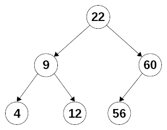

# 第十二章：构建更好的容器-函数式数据类型

在第十二章 *以函数式方式实现设计模式* 中，我们已经讨论了使用函数实现不同结果的许多方法，在本章中，我们将更深入地从函数式角度考虑数据类型。我们将考虑实际实现自己的数据类型的方法，其中包括几个功能，以帮助组合操作或确保纯度，因此您的 FP 编码实际上会变得更简单和更短。我们将涉及几个主题：

+   **从函数式角度看数据类型**，因为即使 JavaScript 不是一种类型化的语言，也需要更好地理解类型和函数

+   **容器**，包括*函子*和神秘的*单子*，以更好地结构化数据流

+   **函数作为结构**，我们将看到另一种使用函数表示数据类型的方式，其中还加入了不可变性

# 数据类型

即使 JavaScript 是一种动态语言，没有静态或显式的类型声明和控制，也不意味着您可以简单地忽略类型。即使语言不允许您指定变量或函数的类型，您仍然会--即使只是在脑海中--使用类型。现在让我们来看看如何指定类型的主题，这样我们至少会有一些优势：

+   即使您没有运行时数据类型检查，也有一些工具，比如 Facebook 的*flow*静态类型检查器或 Microsoft 的*TypeScript*语言，可以让您处理它

+   如果您计划从 JavaScript 转移到更多的函数式语言，比如*Elm*，这将有所帮助

+   它作为文档，让未来的开发人员了解他们必须传递给函数的参数的类型，以及它将返回的类型。例如，Ramda 库中的所有函数都是以这种方式记录的

+   这也将有助于后面的函数数据结构，在这一部分中，我们将研究一种处理结构的方法，某些方面类似于您在 Haskell 等完全函数语言中所做的事情。

如果您想了解我引用的工具，请访问[`flow.org/`](https://flow.org/)了解 flow，[`www.typescriptlang.org/`](https://www.typescriptlang.org/)了解 TypeScript，以及[`elm-lang.org/`](http://elm-lang.org/)了解 Elm。如果您直接想了解类型检查，相应的网页是[`flow.org/en/docs/types/functions/`](https://flow.org/en/docs/types/functions/)，[`www.typescriptlang.org/docs/handbook/functions.html`](https://www.typescriptlang.org/docs/handbook/functions.html)，以及[`flow.org/en/docs/types/functions/`](https://flow.org/en/docs/types/functions/)

每当您阅读或使用函数时，您将不得不思考类型，考虑对这个或那个变量或属性的可能操作等。有类型声明将有所帮助，因此我们现在将开始考虑如何定义最重要的函数类型及其参数和结果。

# 函数的签名

函数的参数和结果的规范由*签名*给出。类型签名基于一个名为 Hindley-Milner 的*类型系统*，它影响了几种（最好是函数式）语言，包括 Haskell，尽管符号已经从原始论文中改变。这个系统甚至可以推断出不直接给出的类型；诸如 TypeScript 或 Flow 的工具也可以做到这种推断，因此开发人员不需要指定*所有*类型。与其去进行干燥、正式的解释关于编写正确签名的规则，我们不如通过例子来工作。我们只需要知道：

1.  我们将把类型声明写成注释。

1.  函数名首先写出，然后是`::`，可以读作*是类型*或*具有类型*。

1.  可选的约束条件可能会跟在之后，使用双（*粗*）箭头`⇒`（或者如果你无法输入箭头，则使用基本 ASCII 风格的`=>`）。

1.  函数的输入类型在箭头后面，使用`→`（或者根据你的键盘使用`->`）。

1.  函数的结果类型最后出现。

请注意，除了这种普通的 JS 风格之外，Flow 和 TypeScript 都有自己的语法来指定类型签名。

现在我们可以开始一些例子：

```js
// firstToUpper :: String → String
const firstToUpper = s => s[0].toUpperCase() + s.substr(1).toLowerCase();

// Math.random :: () → Number
```

这些都是简单的情况——注意签名；我们这里不关心实际的函数。第一个函数接收一个字符串作为参数，并返回一个新的字符串。第二个函数不接收参数（空括号表明如此），并返回一个浮点数。箭头表示函数。因此，我们可以将第一个签名解读为`firstToUpper` *是一个接收字符串并返回字符串的类型的函数*，我们也可以类似地谈论受到诟病（在纯度方面）的`Math.random()`函数，唯一的区别是它不接收参数。

我们看到了零个或一个参数的函数：那么多个参数的函数呢？对此有两个答案。如果我们在严格的函数式风格中工作，我们总是会进行柯里化（正如我们在第七章中看到的，*转换函数 - 柯里化和部分应用*），因此所有函数都是一元的。另一个解决方案是将参数类型的列表括在括号中。我们可以这样看待以下两种方式：

```js
// sum3C :: Number → Number → Number → Number
const sum3C = curry((a, b, c) => a + b + c);

// sum3 :: (Number, Number, Number) → Number
const sum3 = (a, b, c) => a + b + c;
```

第一个签名也可以解读为：

```js
// sum3C :: Number → (Number → (Number → (Number)))
```

当你记得柯里化的概念时，这是正确的。当你提供函数的第一个参数后，你会得到一个新的函数，它也期望一个参数，并返回一个第三个函数，当给定一个参数时，将产生最终结果。我们不会使用括号，因为我们总是假设从右到左进行分组。

现在，对于接收函数作为参数的高阶函数呢？`map()`函数提出了一个问题：它可以处理任何类型的数组。此外，映射函数可以产生任何类型的结果。对于这些情况，我们可以指定*通用类型*，用小写字母表示：这些通用类型可以代表任何可能的类型。对于数组本身，我们使用方括号。因此，我们会有以下内容：

```js
// map :: [a] → (a → b) →  [b]
const map = curry((arr, fn) => arr.map(fn));
```

*a*和*b*代表相同类型是完全有效的，就像应用于数字数组的映射会产生另一个数字数组一样。关键是，原则上*a*和*b*可以代表不同的类型，这就是之前描述的内容。还要注意，如果我们不进行柯里化，签名将是`([a], (a → b)) → [b]`，显示一个接收两个参数（类型为*a*的元素数组和从类型*a*到类型*b*的映射函数）并产生类型为*b*的元素数组作为结果的函数。鉴于此，我们可以以类似的方式写出以下内容：

```js
// filter :: [a] → (a → Boolean) → [a]
const filter = curry((arr, fn) => arr.filter(fn));
```

还有一个大问题：`reduce()`的签名是什么？一定要仔细阅读，看看你能否弄清楚为什么它是这样写的。你可能更喜欢将签名的第二部分看作`((b, a) → b)`：

```js
// reduce :: [a] → (b → a → b) → b → b
const reduce = curry((arr, fn, acc) => arr.reduce(fn, acc));
```

最后，如果你定义的是一个方法而不是一个函数，你会使用一个类似`~>`的波浪箭头：

```js
// String.repeat :: String ⇝ Number → String
```

# 其他类型选项

我们还缺少什么？让我们看看你可能会使用的其他选项。*联合类型*被定义为可能值的列表。例如，我们在第六章中的`getField()`函数，*生成函数 - 高阶函数*，要么返回属性的值，要么返回 undefined。然后我们可以写出以下签名：

```js
// getField :: String → attr → a | undefined
const getField = attr => obj => obj[attr];
```

我们还可以定义一个类型（联合类型或其他类型），然后在进一步的定义中使用它。例如，可以直接比较和排序的数据类型是数字、字符串和布尔值，因此我们可以写出以下定义：

```js
// Sortable :: Number | String | Boolean
```

之后，我们可以指定比较函数可以根据可排序类型来定义...但要小心：这里存在一个隐藏的问题！

```js
// compareFunction :: (Sortable, Sortable) → Number
```

实际上，这个定义并不太准确，因为实际上你可以比较任何类型，即使这并没有太多意义。然而，为了例子的完整性，请暂时忍耐！如果你想要回顾一下排序和比较函数，请参阅[`developer.mozilla.org/en/docs/Web/JavaScript/Reference/Global_Objects/Array/sort`](https://developer.mozilla.org/en/docs/Web/JavaScript/Reference/Global_Objects/Array/sort)。

最后的定义将允许编写一个函数，比如说，接收一个数字和一个布尔值：它并没有说这两种类型应该是相同的。然而，还是有办法的。如果对于某些数据类型有约束条件，你可以在实际签名之前表达它们，使用一个*胖*箭头：

```js
// compareFunction :: Sortable a ⇒ (a, a) → Number
```

现在定义是正确的，因为所有相同类型的出现（在这种情况下，用相同的字母表示，*a*）必须完全相同。另一种选择，但需要更多的输入，是使用联合写出所有可能性：

```js
// compareFunction :: 
// ((Number, Number) | (String, String) | (Boolean, Boolean)) → Number
```

到目前为止，我们一直在使用标准类型定义。但是，当我们使用 JavaScript 时，我们必须考虑一些其他可能性，比如带有可选参数的函数，甚至带有不确定数量的参数。我们可以使用`...`代表任意数量的参数，并添加`?`来表示可选类型：

```js
// unary :: ((b, ...) → a) → (b → a) 
const unary = fn => (...args) => fn(args[0]);
```

我们在之前引用的同一章节中定义的`unary()`高阶函数，它以任何函数作为参数，并返回一个一元函数作为其结果：我们可以表明原始函数可以接收任意数量的参数，但结果只使用第一个：

```js
// parseInt :: (String, Number?) -> Number
```

`parseInt()`函数提供了可选参数的示例：虽然强烈建议不要省略第二个参数（基数），但实际上可以跳过它。

查看[`github.com/fantasyland/fantasy-land/`](https://github.com/fantasyland/fantasy-land/)和[`sanctuary.js.org/#types`](https://sanctuary.js.org/#types)以获取更正式的类型定义和描述，应用于 JavaScript。

从现在开始，在本章中，我们将经常为方法和函数添加签名。这不仅是为了让你习惯于它们，而且当我们开始深入研究更复杂的容器时，它将有助于理解我们正在处理的内容：有些情况可能很难理解！

# 容器

回到第五章，*声明式编程-更好的风格*，以及稍后的第八章，*连接函数-管道和组合*，我们看到能够将映射应用于数组的所有元素，甚至更好的是，能够链接一系列类似的操作，是生成更好、更易理解的代码的好方法。

然而，存在一个问题：`.map()`方法（或等效的*解方法*，如第六章，*生成函数-高阶函数*）仅适用于数组，我们可能希望能够将映射和链接应用于其他数据类型。那么，我们该怎么办呢？

让我们考虑不同的做法，这将为我们提供更好的功能编码工具。基本上，解决这个问题只有两种可能的方法：我们可以为现有类型添加新的方法（尽管这将受到限制，因为我们只能将其应用于基本的 JS 类型），或者我们可以将类型包装在某种类型的容器中，这将允许映射和链接。

让我们首先扩展当前类型，然后转而使用包装器，这将使我们进入深层的功能领域，涉及到诸如函子和单子等实体。

# 扩展当前数据类型

如果我们想要将基本的 JS 数据类型添加映射，让我们首先考虑我们的选择：

+   对于`null`、`undefined`和`Symbol`，应用映射听起来并不太有趣

+   对于`Boolean`、`Number`和`String`数据类型，我们有一些有趣的可能性，因此我们可以检查其中一些

+   将映射应用于对象将是微不足道的：你只需要添加一个`.map()`方法，它必须返回一个新对象

+   最后，尽管不是基本数据类型，我们也可以考虑特殊情况，比如日期或函数，我们也可以添加`.map()`方法

与本书的其余部分一样，我们坚持使用纯 JS，但是你应该查看诸如 LoDash、Underscore 或 Ramda 之类的库，它们已经提供了我们在这里开发的功能。

在所有这些映射操作中，一个关键点应该是返回的值与原始值的类型完全相同：当我们使用`Array.map()`时，结果也是一个数组，任何其他`.map()`实现都必须遵循类似的考虑（你可以观察到生成的数组可能具有不同的元素类型，但它仍然是一个数组）。

我们能对布尔值做什么？首先，让我们接受布尔值不是容器，因此它们的行为方式与数组不同：显然，布尔值只能有一个布尔值，而数组可以包含任何类型的元素。然而，接受这种差异，我们可以扩展`Boolean.prototype`（尽管，正如我已经提到的，这通常是不推荐的），通过向其添加一个新的`.map()`方法，并确保映射函数返回的任何内容都转换为新的布尔值。对于后者，解决方案将是类似的：

```js
// Boolean.map :: Boolean ⇝ (Boolean → a) → Boolean
Boolean.prototype.map = function(fn) {
 return !!fn(this);
};
```

`!!`运算符强制结果为布尔值：`Boolean(fn(this))`也可以使用。这种解决方案也可以应用于数字和字符串：

```js
// Number.map :: Number ⇝ (Number → a) → Number
Number.prototype.map = function(fn) {
 return Number(fn(this));
};

// String.map :: String ⇝ (String → a) → String
**String.prototype.map** = function(fn) {
 return **String(fn(this))**;
}; 
```

与布尔值一样，我们强制映射操作的结果为正确的数据类型。

最后，如果我们想将映射应用到一个函数，那意味着什么？映射一个函数应该产生一个函数。`f.map(g)`的逻辑解释应该是首先应用`f()`，然后将`g()`应用于结果。因此，`f.map(g)`应该与编写`x => g(f(x))`或等效地`pipe(f,g)`是相同的：

```js
// Function.map :: (a → b) ⇝ (b → c) → (a → c)
Function.prototype.map = function(fn) {
 return (...args) => fn(this(...args));
};
```

验证这是否有效很简单：

```js
const plus1 = x => x + 1;
const by10 = y => 10 * y;

console.log(plus1.map(by10)(3));
// 40: first add 1 to 3, then multiply by 10
```

有了这个，我们对基本的 JS 类型可以做的事情就完成了——但是如果我们想将这个应用到其他数据类型，我们需要一个更通用的解决方案。我们希望能够将映射应用到任何类型的值上，为此，我们需要创建一些容器；让我们来做这个。

# 容器和函子

我们在上一节中所做的确实有效，并且可以无问题地使用。然而，我们希望考虑一个更通用的解决方案，可以应用于任何数据类型。由于 JS 中并非所有东西都提供所需的`.map()`方法，我们将不得不扩展类型（就像我们在上一节中所做的那样），或者应用我们在第十一章中考虑过的设计模式，*实现设计模式-函数式方法*：用一个包装器包装我们的数据类型，该包装器将提供所需的`map()`操作。

# 包装一个值：一个基本的容器

让我们暂停一下，考虑一下我们需要这个包装器。有两个基本要求：

+   我们必须有一个`.map()`方法

+   我们需要一种简单的方法来包装一个值

让我们创建一个基本的容器来开始——但我们需要做一些改变：

```js
const VALUE = Symbol("Value");

class Container {
 constructor(x) {
 this[VALUE] = x;
 }

 map(fn) {
 return fn(this[VALUE]);
 }
}
```

一些基本的考虑：

+   我们希望能够将一些值存储在容器中，因此构造函数会处理这个问题

+   使用`Symbol`有助于*隐藏*字段：属性键不会显示在`Object.keys()`中，也不会显示在`for...in`或`for...of`循环中，使它们更加*不易干涉*

+   我们需要能够`.map()`，因此提供了一个方法

我们的基本容器已经准备好了，但是我们可以为方便起见添加一些其他方法：

+   为了获取容器的值，我们可以使用`.map(x => x)`，但这对于更复杂的容器不起作用，所以让我们添加一个`.valueOf()`方法来获取包含的值

+   能够列出一个容器肯定有助于调试：`.toString()`方法会派上用场

+   因为我们不需要一直写`new Container()`，我们可以添加一个静态的`.of()`方法来完成相同的工作。

当在函数式编程世界中使用类来表示容器（以及后来的函子和单子）可能看起来像异端邪说或罪恶...但请记住我们不想教条主义，`class`和`extends`简化了我们的编码。同样，可以说你绝不能从容器中取出一个值--但是使用`.valueOf()`有时太方便了，所以不会那么严格。我们的容器变成了这样：

```js
class Container {
 // 
 // *everything as above*
 //

    static of(x) {
 return new Container(x);
 }

    toString() {
 return `${this.constructor.name}(${this[VALUE]})`;
 }

    valueOf() {
 return this[VALUE];
 }
}
```

现在，我们可以使用这个容器来存储一个值，并且我们可以使用`.map()`来对该值应用任何函数...但这与我们可以用变量做的事情并没有太大的不同！让我们再加强一点。

# 增强我们的容器：函子

我们想要包装值，那么`map()`方法到底应该返回什么？如果我们想要能够链接操作，那么唯一合乎逻辑的答案是它应该返回一个新的包装对象。在真正的函数式风格中，当我们对包装值应用映射时，结果将是另一个包装值，我们可以继续使用它。

这个操作有时被称为`fmap()`，代表函子映射，而不是`.map()`。更改名称的原因是为了避免扩展`.map()`的含义。但是，由于我们正在使用支持重用名称的语言，我们可以保留它。

我们可以扩展我们的`Container`类来实现这个改变。`.of()`方法将需要一个小改变：

```js
class Functor extends Container {
 static of(x) {
 return new Functor(x);
 }

 map(fn) {
 return Functor.of(fn(this[VALUE]));
 }
}
```

有了这些属性，我们刚刚定义了范畴论中所谓的*函子*！（或者，如果你想变得更加技术化，是*指向函子*，因为有`.of()`方法--但让我们保持简单）。我们不会深入理论细节，但粗略地说，函子只是一种允许对其内容应用`.map()`的容器，产生相同类型的新容器...如果这听起来很熟悉，那是因为你已经知道一个函子：数组！当你对数组应用`.map()`时，结果是一个新数组，包含转换（映射）后的值。

函子还有更多要求。首先，包含的值可能是多态的（任何类型），就像数组一样。其次，必须存在一个函数，其映射产生相同的包含值--`x => x`就是这个工作。最后，连续应用两个映射必须产生与应用它们的组合相同的结果：`container.map(f).map(g)`必须与`container.map(compose(g,f))`相同。

让我们暂停一下来考虑我们函数和方法的签名：

```js
of :: Functor f ⇒ a → f a 
Functor.toString :: Functor f ⇒ f a ⇝ String
Functor.valueOf :: Functor f ⇒ f a ⇝ a
Functor.map :: Functor f ⇒ f a ⇝ (a → b) → f a → f b
```

第一个函数`of()`是最简单的：给定任何类型的值，它产生该类型的函子。接下来的两个也很容易理解：给定一个函子，`toString()`总是返回一个字符串（毫无意外！），如果函子包含的值是某种给定类型，`valueOf()`产生相同类型的结果。第三个`map()`更有趣。给定一个接受类型为*a*的参数并产生类型为*b*的结果的函数，将其应用于包含类型为*a*的值的函子，产生包含类型为*b*的值的函子--这正是我们上面描述的。

目前，函子不允许或期望产生副作用、抛出异常或任何其他行为，除了产生一个包含的结果。它们的主要用途是提供一种操作值、对其应用操作、组合结果等的方式，而不改变原始值--在这个意义上，我们再次回到了不可变性。

你也可以将函子与承诺进行比较，至少在一个方面是如此。在函子中，你不直接作用于其值，而是使用`.map()`应用函数——在承诺中，你也是这样做的，但是使用`.then()`！事实上，还有更多的类比，我们很快就会看到。

然而，你可能会说这还不够，因为在正常的编程中，必须处理异常、未定义或空值等情况是非常常见的。因此，让我们开始看更多的函子示例，过一段时间，我们将进入单子的领域，进行更复杂的处理。所以，现在让我们进行一些实验！

# 使用 Maybe 处理丢失的值

编程中的一个常见问题是处理丢失的值。造成这种情况的可能原因有很多：Web 服务 Ajax 调用可能返回空结果，数据集可能为空，或者对象中可能缺少可选属性，等等。在正常的命令式方式中处理这种情况需要在各处添加`if`语句或三元运算符，以捕获可能丢失的值，避免某种运行时错误。通过实现一个`Maybe`函子，我们可以做得更好，以表示可能存在（或可能*不存在*）的值！我们将使用两个类，`Just`（表示*刚好有些值*）和`Nothing`，每个函子一个：

```js
class Nothing extends Functor {
 isNothing() {
 return true;
 }

 toString() {
 return "Nothing()";
 }

    map(fn) {
        return this;
 }
}

class Just extends Functor {
 isNothing() {
 return false;
 }

    map(fn) {
        return Maybe.of(fn(this[VALUE]));
 }
}

class Maybe extends Functor {
    constructor(x) {
        return x === undefined || x === null
 ? new Nothing()
 : new Just(x);
 }

 static of(x) {
 return new Maybe(x);
 }
}
```

我们可以通过尝试将操作应用于有效值或丢失的值来快速验证这一点：

```js
const plus1 = x => x + 1;

Maybe.of(2209).map(plus1).map(plus1).toString(); // *"Just(2211)"*
Maybe.of(null).map(plus1).map(plus1).toString(); // *"Nothing()"*
```

我们刚刚对`Maybe.of(null)`值多次应用了`plus1()`，完全没有错误。`MayBe`函子可以处理映射丢失的值，只需跳过操作，并返回一个包装的`null`值。这意味着这个函子基本上包括了一个抽象的检查，不会让错误发生。让我们举一个更现实的例子来说明它的用法。

在本章后面，我们将看到 Maybe 实际上可以是一个单子，而不是一个函子，并且我们还将研究更多的单子示例。

假设我们正在 Node 中编写一个小的服务器端服务，并且我们想要获取某个城市的警报，并生成一个不太时尚的 HTML `<table>`，假设它是某个服务器端生成的网页的一部分（是的，我知道你应该尽量避免在你的页面中使用表格，但我在这里想要的是一个 HTML 生成的简短示例，实际结果并不重要）。如果我们使用*Dark Sky* API（请参阅[`darksky.net/`](https://darksky.net/)了解更多关于此 API 的信息，并注册使用），来获取警报，我们的代码将是这样的；都很正常...请注意错误的回调；你将在下面的代码中看到原因：

```js
const request = require("superagent");

const getAlerts = (lat, long, callback) => {
 const SERVER = "https://api.darksky.net/forecast";
 const UNITS = "units=si";
 const EXCLUSIONS = "exclude=minutely,hourly,daily,flags";
 const API_KEY = "*you.need.to.get.your.own.api.key*";

 request
 .get(`${SERVER}/${API_KEY}/${lat},${long}?${UNITS}&${EXCLUSIONS}`)
 .end(function(err, res) {
 if (err) {
                callback({});
 } else {
                callback(JSON.parse(res.text));
 }
 });
};
```

这样调用的输出（经过大幅编辑和缩小）可能是这样的：

```js
{
 latitude: 29.76,
 longitude: -95.37,
 timezone: "America/Chicago",
 offset: -5,
 currently: {
 time: 1503660334,
 summary: "Drizzle",
 icon: "rain",
 temperature: 24.97,
 ...
 uvIndex: 0
 },
 alerts: [
 {
 title: "Tropical Storm Warning",
 regions: ["Harris"],
 severity: "warning",
 time: 1503653400,
 expires: 1503682200,
 description:
 "TROPICAL STORM WARNING REMAINS IN EFFECT... WIND - LATEST LOCAL FORECAST: Below tropical storm force wind ... CURRENT THREAT TO LIFE AND PROPERTY: Moderate ... Locations could realize roofs peeled off buildings, chimneys toppled, mobile homes pushed off foundations or overturned ...",
 uri:
 "https://alerts.weather.gov/cap/wwacapget.php?x=TX125862DD4F88.TropicalStormWarning.125862DE8808TX.HGXTCVHGX.73ee697556fc6f3af7649812391a38b3"
 },
 ...
 {
 title: "Hurricane Local Statement",
 regions: ["Austin",...,"Wharton"],
 severity: "advisory",
 time: 1503748800,
 expires: 1503683100,
 description:
 "This product covers Southeast Texas **HURRICANE HARVEY DANGEROUSLY APPROACHING THE TEXAS COAST** ... The next local statement will be issued by the National Weather Service in Houston/Galveston TX around 1030 AM CDT, or sooner if conditions warrant.\n",
 uri:
 "https://alerts.weather.gov/cap/wwacapget.php?..."
 }
 ]
};
```

我在飓风哈维逼近德克萨斯州的那一天获取了这些信息。如果你在正常的一天调用 API，数据将完全排除`alerts:[...]`部分。因此，我们可以使用`Maybe`函子来处理接收到的数据，无论是否有警报，都不会出现任何问题：

```js
const getField = attr => obj => obj[attr];
const os = require("os");

const produceAlertsTable = weatherObj =>
    Maybe.of(weatherObj)
 .map(getField("alerts"))
 .map(a =>
 a.map(
 x =>
 `<tr><td>${x.title}</td>` +
 `<td>${x.description.substr(0, 500)}...</td></tr>`
 )
 )
 .map(a => a.join(os.EOL))
 .map(s => `<table>${s}</table>`)

getAlerts(29.76, -95.37, x =>
    console.log(produceAlertsTable(x).valueOf())
);
```

当然，你可能会做一些比仅仅记录`produceAlertsTable()`的结果更有趣的事情！最有可能的选择是再次使用`.map()`，使用一个输出表格的函数，将其发送给客户端，或者你需要做的任何其他事情。无论如何，最终的输出将与以下内容匹配：

```js
**<table><tr><td>**Tropical Storm Warning**</td><td>**...TROPICAL STORM WARNING REMAINS IN EFFECT... ...STORM SURGE WATCH REMAINS IN EFFECT... * WIND - LATEST LOCAL FORECAST: Below tropical storm force wind - Peak Wind Forecast: 25-35 mph with gusts to 45 mph - CURRENT THREAT TO LIFE AND PROPERTY: Moderate - The wind threat has remained nearly steady from the previous assessment. - Emergency plans should include a reasonable threat for strong tropical storm force wind of 58 to 73 mph. - To be safe, earnestly prepare for the potential of significant...**</td></tr>** 
**<tr><td>**Flash Flood Watch**</td><td>**...FLASH FLOOD WATCH REMAINS IN EFFECT THROUGH MONDAY MORNING... The Flash Flood Watch continues for * Portions of Southeast Texas...including the following counties...Austin...Brazoria...Brazos...Burleson... Chambers...Colorado...Fort Bend...Galveston...Grimes... Harris...Jackson...Liberty...Matagorda...Montgomery...Waller... Washington and Wharton. * Through Monday morning * Rainfall from Harvey will cause devastating and life threatening flooding as a prolonged heavy rain and flash flood thre...**</td></tr>** 
**<tr><td>**Hurricane Local Statement**</td><td>**This product covers Southeast Texas **PREPARATIONS FOR HARVEY SHOULD BE RUSHED TO COMPLETION THIS MORNING** NEW INFORMATION --------------- * CHANGES TO WATCHES AND WARNINGS: - None * CURRENT WATCHES AND WARNINGS: - A Tropical Storm Warning and Storm Surge Watch are in effect for Chambers and Harris - A Tropical Storm Warning is in effect for Austin, Colorado, Fort Bend, Liberty, Waller, and Wharton - A Storm Surge Warning and Hurricane Warning are in effect for Jackson and Matagorda - A Storm S...**</td></tr></table>** 
```

如果我们改为使用乌拉圭蒙得维的坐标调用`getAlerts(-34.9, -54.60, ...)`，因为该城市没有警报，`getField("alerts")`函数将返回`undefined`——尽管所有后续的`.map()`操作仍将被执行，但实际上没有任何操作，最终结果将是`null`值。见图 12.1：

图 12.1。输出表格看起来并不起眼，但产生它的逻辑并不需要一个 if 语句。

我们在编写错误逻辑时也利用了这种行为。如果在调用服务时发生错误，我们仍然会调用原始回调来生成一个表，但提供一个空对象。即使这个结果是意外的，我们也会很安全，因为相同的保护措施会避免导致运行时错误。

作为最后的增强，我们可以添加一个`.orElse()`方法，在没有值的情况下提供一个默认值：

```js
class Maybe extends Functor {
 //
 // *everything as before...*
 //
    orElse(v) {
 return this.isNothing() ? v : this.valueOf();
 }
}
```

使用这种新方法而不是`valueOf()`，如果尝试为某个地方获取警报，而那里没有警报，你将得到任何你想要的默认值。在我们之前引用的情况下，当尝试获取蒙得维的亚的警报时，我们现在将得到一个合适的结果，而不是一个`null`值：

```js
getAlerts(-34.9, -54.6, x =>
 console.log(
 produceAlertsTable(x).orElse("<span>No alerts today.</span>")
 )
);
```

以这种方式工作，我们可以简化我们的编码，并避免对空值和其他类似情况进行许多测试。然而，我们可能想要超越这一点；例如，我们可能想知道*为什么*没有警报：是服务错误吗？还是正常情况？最后只得到一个`null`是不够的，为了满足这些新的要求，我们需要向我们的函子添加一些东西，并进入*单子*的领域。

# 单子

*单子*在程序员中有着奇怪的名声。著名的开发者道格拉斯·克罗克福德曾经谈到过*它们*的“诅咒”，他认为*一旦你终于理解了单子，你立刻就失去了向其他人解释它们的能力！*另一方面，如果你决定回到基础，阅读一本像是*工作数学家的范畴*这样的书，作者是范畴论的创始人之一桑德斯·麦克莱恩，你可能会发现一个有些令人困惑的解释：*X 中的单子只是 X 的自函子范畴中的幺半群，乘积* × *被自函子的组合所取代，单位集由恒等自函子取代。*并不是太有启发性！

单子和函子之间的区别只是前者增加了一些额外的功能。让我们先看看新的要求，然后再考虑一些常见的有用的单子。与函子一样，我们将有一个基本的单子，你可以将其视为*抽象*版本，并且具体的*单子类型*，它们是*具体*的实现，旨在解决特定情况。

如果你想阅读关于函子、单子以及它们所有家族的精确和仔细的描述（但更倾向于理论方面，并且有大量的代数定义），你可以尝试一下 Fantasy Land 规范，网址是[`github.com/fantasyland/fantasy-land/`](https://github.com/fantasyland/fantasy-land/)。不要说我们没有警告过你：该页面的另一个名称是*代数 JavaScript 规范*！

# 添加操作

让我们考虑一个简单的问题。假设你有以下一对函数，它们使用`Maybe`函子工作：第一个函数尝试根据其键搜索*某些东西*（比如客户或产品，无论是什么），第二个函数尝试从中提取*某些*属性（我故意含糊其辞，因为问题与我们可能正在处理的任何对象或事物无关）。这两个函数产生`Maybe`结果，以避免可能的错误。我们使用了一个模拟的搜索函数，只是为了帮助我们看到问题：对于偶数键，它返回虚假数据，对于奇数键，它会抛出异常。

```js
const fakeSearchForSomething = key => {
 if (key % 2 === 0) {
 return {key, some: "whatever", other: "more data"};
 } else {
 throw new Error("Not found");
 }
};

const findSomething = key => {
 try {
 const something = fakeSearchForSomething(key);
 return Maybe.of(something);
 } catch (e) {
 return Maybe.of(null);
 }
};

const getSome = something => Maybe.of(something.map(getField("some")));

const getSomeFromSomething = key => getSome(findSomething(key));
```

问题在哪里？问题在于`getSome()`的输出是一个`Maybe`值，它本身包含一个`Maybe`值，所以我们想要的结果被双重包装了。

```js
let xxx = getSomeFromSomething(2222).valueOf().valueOf(); // *"whatever"*
let yyy = getSomeFromSomething(9999).valueOf().valueOf(); // *null*
```

这个玩具问题中可以很容易地解决这个问题（只需在`getSome()`中避免使用`Maybe.of()`），但这种结果可能以更复杂的方式发生。例如，您可能正在构建一个`Maybe`，其中一个属性恰好是一个`Maybe`，如果在访问该属性时出现相同的情况：您最终会得到一些双重包装的值。

单子应该提供以下操作：

+   一个构造函数。

+   一个将值插入单子的函数：我们的`.of()`方法。

+   允许链接操作的函数：我们的`.map()`方法。

+   可以去除额外包装的函数：我们将其称为`.unwrap()`，它将解决我们之前的多重包装问题。有时它被称为`.flatten()`。

我们还将有一个用于链接调用的函数，只是为了简化我们的编码，还有另一个用于应用函数的函数，但我们稍后再说。让我们看看实际的 JavaScript 代码中单子是什么样子的。数据类型规范非常类似于函子的规范，所以我们不会在这里重复它们：

```js
class Monad extends Functor {
 static of(x) {
 return new Monad(x);
 }

 map(fn) {
 return Monad.of(fn(this[VALUE]));
 }

    unwrap() {
 const myValue = this[VALUE];
 return myValue instanceof Container ? myValue.unwrap() : this;
 }
}
```

我们使用递归来逐步去除包装，直到包装的值不再是一个容器。使用这种方法，我们可以轻松地避免双重包装：

```js
const getSomeFromSomething = key => getSome(findSomething(key)).unwrap();
```

然而，这种问题可能会在不同的层面上重复出现。例如，如果我们正在进行一系列`.map()`操作，任何中间结果都可能最终被双重包装。您可以很容易地通过记住在每个`.map()`之后调用`.unwrap()`来解决这个问题--请注意，即使实际上并不需要，您也可以这样做，因为在这种情况下，`.unwrap()`的结果将是完全相同的对象（你能看出为什么吗？）。但我们可以做得更好！让我们定义一个`.chain()`操作，它将为我们执行这两个操作（有时`.chain()`被称为`.flatMap()`）：

```js
class Monad extends Functor {
 //
 // *everything as before...*
 //
    chain(fn) {
 return this.map(fn).unwrap();
 }
}
```

只剩下一个操作。假设您有一个柯里化的函数，有两个参数；没有什么奇怪的！如果您将该函数提供给`.map()`操作，会发生什么？

```js
const add = x => y => x+y; // *or* curry((x,y) => x+y)
const something = **Monad.of(2).map(add)**;
```

某物会是什么？鉴于我们只提供了一个参数来添加，该应用的结果将是一个函数...不仅仅是任何函数，而是一个*包装*的函数！（由于函数是一级对象，逻辑上没有障碍将函数包装在单子中，对吧？）我们想对这样的函数做什么？为了能够将这个包装的函数应用到一个值上，我们需要一个新的方法：`.ap()`。这个值可能是什么？在这种情况下，它可以是一个普通的数字，或者是由其他操作的结果作为单子包装的数字。由于我们总是可以将一个普通数字`Map.of()`成一个包装数字，让我们让`.ap()`使用一个单子作为它的参数：

```js
class Monad extends Functor {
 //
 // *everything as earlier...*
 //
    ap(m) {
 return m.map(this.valueOf());
 }
}
```

有了这个，你就可以这样做：

```js
const monad5 = something.ap(Monad.of(3)); // Monad(5)
```

现在，您可以使用单子来保存值或函数，并根据需要与其他单子和链接操作进行交互。因此，正如您所看到的，单子并没有什么大技巧，它们只是带有一些额外方法的函子。现在让我们看看如何将它们应用到我们的原始问题中，并以更好的方式处理错误。

# 处理替代方案 - Either 单子

知道一个值是否丢失在某些情况下可能足够了，但在其他情况下，您可能希望能够提供一个解释。如果我们使用一个不同的函子，它将接受两个可能的值，一个与问题、错误或失败相关联，另一个与正常执行或成功相关联，我们可以得到这样的解释：

+   一个*左*值，应该是 null，但如果存在，它代表某种特殊值（例如，错误消息或抛出的异常），它不能被映射

+   一个*正确*的值，它代表了函子的*正常*值，并且可以被映射

我们可以以与我们为`Maybe`所做的类似的方式构造这个 monad（实际上，添加的操作使得`Maybe`也可以扩展`Monad`）。构造函数将接收左值和右值：如果左值存在，它将成为`Either` monad 的值；否则将使用右值。由于我们为所有的 functors 提供了`.of()`方法，我们也需要为`Either`提供一个：

```js
class Left extends Monad {
    isLeft() {
 return true;
 }

    map(fn) {
        return this;
 }
}

class Right extends Monad {
    isLeft() {
 return false;
 }

    map(fn) {
        return Either.of(null, fn(this[VALUE]));
 }
}

class Either extends Monad {
    constructor(left, right) {
 return right === undefined || right === null
 ? new Left(left)
 : new Right(right);
 }

 static of(left, right) {
 return new Either(left, right);
 }
}
```

`.map()`方法是关键。如果这个 functor 有一个*left*值，它将不会被进一步处理；在其他情况下，映射将被应用于*right*值，并且结果将被包装。现在，我们如何用这个来增强我们的代码呢？关键的想法是每个涉及的方法都返回一个`Either` monad；`.chain()`将被用来依次执行操作。获取警报将是第一步--我们调用回调，要么得到`AJAX FAILURE`消息，要么得到 API 调用的结果：

```js
const getAlerts2 = (lat, long, callback) => {
 const SERVER = "https://api.darksky.net/forecast";
 const UNITS = "units=si";
 const EXCLUSIONS = "exclude=minutely,hourly,daily,flags";
 const API_KEY = "you.have.to.get.your.own.key";

 request
 .get(`${SERVER}/${API_KEY}/${lat},${long}?${UNITS}&${EXCLUSIONS}`)
 .end((err, res) =>
 callback(
 err
 ? Either.of("AJAX FAILURE", null)
 : Either.of(null, JSON.parse(res.text))
 )
 );
};
```

然后，一般的过程将变成如下。我们再次使用一个 Either：如果没有警报，而不是一个数组，我们返回一个`NO ALERTS`消息：

```js
const produceAlertsTable2 = weatherObj => {
 return weatherObj
        .chain(obj => {
 const alerts = getField("alerts")(obj);
            return alerts
 ? Either.of(null, alerts)
 : Either.of("NO ALERTS", null);
 })
        .chain(a =>
 a.map(
 x =>
 `<tr><td>${x.title}</td>` +
 `<td>${x.description.substr(0, 500)}...</td></tr>`
 )
 )
        .chain(a => a.join(os.EOL))
        .chain(s => `<table>${s}</table>`);
};
```

注意我们如何使用`.chain()`，所以多个包装器不会有问题。现在我们可以测试多种情况，并得到适当的结果--或者至少对于世界各地的当前天气情况是这样！

+   对于 TX 的 Houston，我们仍然得到一个 HTML 表格。

+   对于 UY 的 Montevideo，我们得到一条消息，说没有警报。

+   对于错误坐标的点，我们得知 AJAX 调用失败了：不错！

```js
// *Houston, TX, US:*
getAlerts2(29.76, -95.37, x => console.log(produceAlertsTable2(x).toString()));
Right("...*a table with alerts: lots of HTML code*...");

// *Montevideo, UY*
getAlerts2(-34.9, -54.6, x => console.log(produceAlertsTable2(x).toString()));
Left("NO ALERTS");

// *A point with wrong coordinates*
getAlerts2(444, 555, x => console.log(produceAlertsTable2(x).toString()));
Left("AJAX FAILURE");
```

我们还没有完成 Either monad。你的大部分代码可能涉及调用函数。让我们寻找一个更好的方法来实现这一点，通过这个 monad 的一个变体。

# 调用函数 - Try monad

如果我们调用可能抛出异常的函数，并且我们想以一种功能性的方式来做，我们可以使用*Try* monad，来封装函数的结果或异常。这个想法基本上与 Either monad 是一样的：唯一的区别在于构造函数，它接收一个函数，并调用它：

+   如果没有问题，返回的值将成为 monad 的右值

+   如果有异常，它将成为左值

```js
class Try extends Either {
 constructor(fn, msg) {
 try {
 return Either.of(null, fn());
 } catch (e) {
 return Either.of(msg || e, null);
 }
 }

 static of(fn, msg) {
 return new Try(fn, msg);
 }
}
```

现在，我们可以调用任何函数，以一种良好的方式捕获异常。例如，我们一直在使用的`getField()`函数，如果用空参数调用，就会崩溃：

```js
// getField :: String → attr → a | undefined
const getField = attr => obj => obj[attr];
```

我们可以使用 Try monad 来重写它，这样它就可以与其他组合函数*友好*地协作：

```js
const getField2 = attr => obj => Try.of(() => obj[attr], "NULL OBJECT");

const x = getField2("somefield")(null);
console.log(x.isLeft()); // true
console.log(x.toString()); // Left(NULL OBJECT)
```

还有许多其他的 monads，当然，你甚至可以定义自己的 monad，所以我们不可能涵盖所有的 monads。然而，让我们再访问一个，你可能一直在使用，却没有意识到它的*monad-ness*！

# 意外的 Monads - Promises

让我们通过提及另一个你可能使用过的 monad 来完成 monads 的这一部分，尽管它有一个不同的名字：*Promises*！我们在本章的前面已经评论过，functors（记住，monads 是 functors）至少与 promises 有一些共同之处：使用方法来访问值。然而，这种类比更大！

+   `Promise.resolve()`对应于`Monad.of()` -- 如果你传递一个值给`.resolve()`，你将得到一个解析为该值的 promise，如果你提供一个 promise，你将得到一个新的 promise，其值将是原始 promise 的值（有关更多信息，请参阅[`developer.mozilla.org/en-US/docs/Web/JavaScript/Reference/Global_Objects/Promise/resolve`](https://developer.mozilla.org/en-US/docs/Web/JavaScript/Reference/Global_Objects/Promise/resolve)）。这是一种*解包*行为！

+   `Promise.then()`代表`Monad.map()`，也代表`Monad.chain()`，鉴于前面提到的解包。

+   我们没有直接匹配`Monad.ap()`，但我们可以添加类似以下代码的东西：

```js
Promise.prototype.ap = function(promise2) {
 return this.then(x => promise2.map(x));
};
```

即使您选择现代的`async`和`await`功能，它们在内部也是基于承诺。此外，在某些情况下，您可能仍然需要`Promise.race()`和`Promise.all()`，因此您可能会继续使用承诺，即使选择完整的 ES8 编码。

这是本节的一个合适的结尾。之前，您已经发现常见的数组实际上是函子。现在，以同样的方式，就像莫里哀戏剧《市民绅士》中的角色若尔当先生发现他一生都在说散文一样，您现在知道自己已经在使用单子，即使不知道它！

# 函数作为数据结构

到目前为止，我们已经看到如何使用函数来处理其他函数，处理数据结构或创建数据类型。让我们通过展示函数实际上如何实现自己的数据类型来结束本章，成为一种容器。事实上，这是λ演算的一个基本理论点（如果您想了解更多，请查阅*Church 编码*和*Scott 编码*），因此我们很可能可以说我们已经回到了本书的起点，即函数式编程的起源！

# Haskell 中的二叉树

考虑一个二叉树。这样的树可以是空的，也可以由一个节点（树的*根*）和两个子树组成：左二叉树和右二叉树。

在第九章中，*设计函数 - 递归*，我们使用了更一般的树结构，比如文件系统或浏览器 DOM 本身，这些结构允许一个节点有任意数量的子节点。在本节中，我们正在处理的树的特殊情况是，每个节点始终有两个子节点，尽管它们中的每一个都可能为空。这种差异似乎很小，但允许空子树是让您定义所有节点都是二进制的关键。

让我们用 Haskell 语言做一个离题。在这种语言中，我们可能会写出以下内容；*a*将是我们在节点中持有的任何值的类型：

```js
data Tree a = Nil | Node a (Tree a) (Tree a)
```

在这种语言中，模式匹配经常用于编码。例如，我们可以定义一个`empty`函数，如下所示：

```js
empty :: Tree a -> Bool
empty Nil = True
empty (Node root left right) = False
```

逻辑很简单：如果树是`Nil`（类型定义中的第一种可能性），那么树肯定是空的；否则，树不是空的。最后一行可能会写成`empty _ = False`，因为您实际上不关心树的组件；它不是`Nil`就足够了。

在二叉搜索树中搜索值（其中根大于其左子树的所有值，并且小于其右子树的所有值）将类似地编写：

```js
contains :: (Ord a) => (Tree a) -> a -> Bool
contains Nil _ = False
contains (Node root left right) x 
        | x == root = True
        | x  < root = contains left x 
        | x  > root = contains right x
```

空树不包含搜索的值。对于其他树，如果根与搜索的值匹配，我们就完成了。如果根大于搜索的值，则在左子树中搜索；否则，在右子树中搜索。

有一个重要的要点需要记住：对于这种数据类型，两种可能类型的联合，我们必须提供两个条件，并且将使用模式匹配来决定应用哪一个。记住这一点！

# 函数作为二叉树

我们能否用函数做类似的事情？答案是肯定的：我们将用函数本身来表示树（或任何其他结构） - 请注意：不是用一组函数处理的数据结构，也不是用一些方法的对象，而只是一个函数。此外，我们将得到一个功能性数据结构，100%不可变，如果更新会产生一个新的副本。而且，我们将在不使用对象的情况下完成所有这些操作；相反，闭包将提供所需的结果。

这怎么可能？我们将应用与本章前面所见类似的概念，因此该函数将充当容器，并且其结果将是其包含值的映射。让我们倒着走，首先展示如何使用新的数据类型，然后再去实现细节。

创建树将使用两个函数：`EmptyTree()`和`Tree(value, leftTree, rightTree)`。例如，创建图 12.2 中所示的树，将使用以下代码：

图 12.2 二叉搜索树，由以下代码创建。

```js
const myTree = Tree(
 22,
 Tree(
 9,
 Tree(4, EmptyTree(), EmptyTree()),
 Tree(12, EmptyTree(), EmptyTree())
 ),
 Tree(
 60,
 Tree(56, EmptyTree(), EmptyTree()),
 EmptyTree()
 )
);
```

你如何使用这个结构？根据数据类型描述，每当你使用树时，你必须考虑两种情况：非空树或空树。在前面的代码中，`myTree()`实际上是一个接收两个函数作为参数的函数，分别对应两种数据类型情况。第一个函数将以节点值和左右树作为参数调用，第二个函数将不接收参数。因此，要获取根，我们可以写如下内容：

```js
const myRoot = myTree((value, left, right) => value, () => null);
```

如果我们处理的是非空树，我们期望调用第一个函数并将根的值作为结果。对于空树，应该调用第二个函数，然后返回一个`null`值。

同样，如果我们想要计算树中有多少个节点，我们会写如下代码：

```js
const treeCount = aTree => aTree(
    (value, left, right) => 1 + treeCount(left) + treeCount(right),
 () => 0
);
console.log(treeCount(myTree));
```

对于非空树，第一个函数将返回 1（对于根）加上根的子树的节点计数。对于空树，计数就是零。明白了吗？

现在我们可以展示`Tree()`和`EmptyTree()`函数：

```js
const Tree = (value, left, right) => (destructure, __) =>
 destructure(value, left, right);

const EmptyTree = () => (__, destructure) => destructure();
```

`destructure()`函数是你将作为参数传递的函数（名称来自 JS 中的解构语句，它允许你将对象属性分隔为不同的变量）。你将需要提供这个函数的两个版本。如果树是非空的，将执行第一个函数；对于空树，将运行第二个函数（这模仿了 Haskell 代码中的*case*选择，只是我们将非空树的情况放在第一位，空树的情况放在最后）。`__`变量只是作为占位符使用，表示一个被忽略的参数，但显示了假定有两个参数。

这可能很难理解，所以让我们看一些更多的例子。如果我们需要访问树的特定元素，我们有以下三个函数，其中一个（`treeRoot()`）我们已经看到了--让我们在这里重复一下以完整起见：

```js
const treeRoot = tree => tree((value, left, right) => value, () => null);
const treeLeft = tree => tree((value, left, right) => left, () => null);
const treeRight = tree => tree((value, left, right) => right, () => null);
```

访问结构的组件值的函数（或*构造*，用另一个术语）称为*投影函数*。我们不会使用这个术语，但你可能会在其他地方找到它。

我们如何判断一棵树是否为空？看看你是否能理解为什么这一行代码有效：

```js
const treeIsEmpty = tree => tree(() => false, () => true);
```

让我们再看一些例子。例如，我们可以从树中构建一个对象，这有助于调试。我添加了逻辑以避免包含左侧或右侧的空子树，因此生成的对象会更短：

```js
const treeToObject = tree =>
 tree((value, left, right) => {
 const leftBranch = treeToObject(left);
 const rightBranch = treeToObject(right);
 const result = { value };
 if (leftBranch) {
 result.left = leftBranch;
 }
 if (rightBranch) {
 result.right = rightBranch;
 }
 return result;
 }, () => null);
```

注意递归的使用，就像第九章中的*遍历树结构*部分中所述的那样，为了生成左右子树的对象等价物。这个函数的一个例子如下；我编辑了输出以使其更清晰：

```js
console.log(treeToObject(myTree));
{
 value: 22,
 left: {
 value: 9,
 left: {
 value: 4
 },
 right: {
 value: 12
 }
 },
 right: {
 value: 60,
 left: {
 value: 56
 }
 }
}
```

我们可以搜索节点吗？当然可以，逻辑紧随我们在上一节中看到的定义（我们可以缩短代码，但我确实想要与 Haskell 版本保持一致）：

```js
const treeSearch = (findValue, tree) =>
 tree(
 (value, left, right) =>
            findValue === value
 ? true
 : findValue < value
 ? treeSearch(findValue, left)
 : treeSearch(findValue, right),
 () => false
 );
```

最后，为了完成本节，让我们还包括如何向树中添加新节点。仔细研究代码，您会注意到当前树没有被修改，而是产生了一个新的树。当然，鉴于我们使用函数来表示我们的树数据类型，显然我们不能只修改旧结构：它默认是不可变的：

```js
const treeInsert = (newValue, tree) =>
 tree(
 (value, left, right) =>
 newValue <= value
 ? Tree(value, treeInsert(newValue, left), right)
 : Tree(value, left, treeInsert(newValue, right)),
 () => Tree(newValue, EmptyTree(), EmptyTree())
 );
```

当尝试插入一个新键时，如果它小于或等于树的根节点，我们会产生一个新树，该树的根节点为当前根节点，保留旧的右子树，但更改其左子树以包含新值（这将以递归方式完成）。如果键大于根节点，则更改不会对称，但类似。如果我们尝试插入一个新键，并且发现自己是一个空树，我们只需用一个新树替换该空结构，该树只有新值作为其根，以及空的左右子树。

我们可以轻松测试这个逻辑--但最简单的方法是验证之前显示的二叉树（图 12.2）是否由以下操作序列生成：

```js
let myTree = EmptyTree();
myTree = treeInsert(22, myTree);
myTree = treeInsert(9, myTree);
myTree = treeInsert(60, myTree);
myTree = treeInsert(12, myTree);
myTree = treeInsert(4, myTree);
myTree = treeInsert(56, myTree);

// *The resulting tree is:*
{
 value: 22,
 left: { value: 9, left: { value: 4 }, right: { value: 12 } },
 right: { value: 60, left: { value: 56 } }
};
```

我们可以通过提供比较器函数来使这个插入函数更加通用，该函数将用于比较值。这样，我们可以轻松地调整二叉树以表示通用映射。节点的值实际上将是一个对象，例如`{key:... , data:...}`，并且提供的函数将比较`newValue.key`和`value.key`以决定在哪里添加新节点。当然，如果两个键相等，我们将更改当前树的根节点：

```js
const compare = (obj1, obj2) =>
    obj1.key === obj2.key ? 0 : obj1.key < obj2.key ? -1 : 1;

const treeInsert2 = (comparator, newValue, tree) =>
 tree(
 (value, left, right) =>
            comparator(newValue, value) === 0
? Tree(newValue, left, right)
 : comparator(newValue, value) < 0
 ? Tree(
 value,
 treeInsert2(comparator, newValue, left),
 right
 )
 : Tree(
 value,
 left,
 treeInsert2(comparator, newValue, right)
 ),
 () => Tree(newValue, EmptyTree(), EmptyTree())
 );
```

我们还需要什么？当然，我们可以编写各种函数：删除节点，计算节点数，确定树的高度，比较两棵树等等。但是，为了获得更多的可用性，我们真的应该将结构转换为一个函子，通过实现`map()`函数。幸运的是，使用递归，这被证明是很容易的：

```js
const treeMap = (fn, tree) =>
 tree(
 (value, left, right) =>
            Tree(fn(value), treeMap(fn, left), treeMap(fn, right)),
 () => EmptyTree()
 );
```

我们可以继续举更多的例子，但这不会改变我们从这项工作中得出的重要结论：

+   我们正在处理一个数据结构（一个递归的数据结构），并用一个函数来表示它

+   我们没有为数据使用任何外部变量或对象：而是使用闭包

+   数据结构本身满足我们在第十章*确保纯度-不可变性*中分析的所有要求，因为它是不可变的，所有更改总是产生新的结构

+   最后，树是一个函子，提供了所有相应的优势

因此，我们甚至看到了函数式编程的另一个应用--我们看到一个函数实际上可以成为一个结构，这并不是人们通常习惯的！

# 问题

12.1\. **也许任务？** 在第八章的问题部分，*连接函数-管道和组合*，一个问题涉及获取某人的待办任务，但考虑到错误或边界情况，比如所选的人可能根本不存在。重新做这个练习，但使用 Maybe 或 Either 单子来简化编码。

12.2\. **扩展您的树**。为了获得我们的函数式二叉搜索树的更完整的实现，实现以下函数：

+   计算树的高度--或者等效地，从根到任何其他节点的最大距离

+   按升序列出树的所有键

+   从树中删除一个键

12.3\. **函数式列表**。在与二叉树相同的精神下，实现函数式列表。由于列表被定义为空或一个节点（头部）后跟另一个列表（尾部），您可能希望从以下内容开始：

```js
 const List = (head, tail) => (destructure, __) => 
 destructure(head, tail);
 const EmptyList = () => (__, destructure) => destructure();
```

以下是一些简单的一行操作，让您开始：

```js
 const listHead = list => list((head, __) => head, () => null);
 const listTail = list => list((__, tail) => tail, () => null);
 const listIsEmpty = list => (() => false, () => true);
 const listSize = list => list((head, tail) => 1 + listSize(tail), 
 () => 0);
```

您可以考虑进行以下操作：

+   将列表转换为数组，反之亦然

+   反转列表

+   将一个列表附加到另一个列表的末尾

+   连接两个列表

不要忘记`listMap()`函数！此外，`listReduce()`和`listFilter()`函数会派上用场。

12.4\. **代码缩短**。我们提到`treeSearch()`函数可以缩短 - 你能做到吗？是的，这更多是一个 JavaScript 问题，而不是一个功能性的问题，我并不是说更短的代码一定更好，但许多程序员似乎是这样认为的，所以了解这种风格是很好的，因为你可能会遇到它。

# 总结

在本章中，我们更接近理论，看到了如何从功能性的角度使用和实现数据类型。我们从定义函数签名的方式开始，以帮助理解后来遇到的多个操作所暗示的转换；然后，我们继续定义了几个容器，包括函子和单子，并看到它们如何用于增强函数组合，最后我们看到函数如何直接被自身使用，不需要额外的负担，来实现功能性数据结构。

到目前为止，在本书中我们已经看到了 JavaScript 的函数式编程的几个特性。我们从一些定义开始，到一个实际的例子，然后转向重要的考虑因素，如纯函数、避免副作用、不可变性、可测试性、通过函数连接和数据容器实现数据流的构建新函数，我们已经看到了很多概念，但我相信你能够将它们付诸实践，并开始编写更高质量的代码 - 试一试吧！
