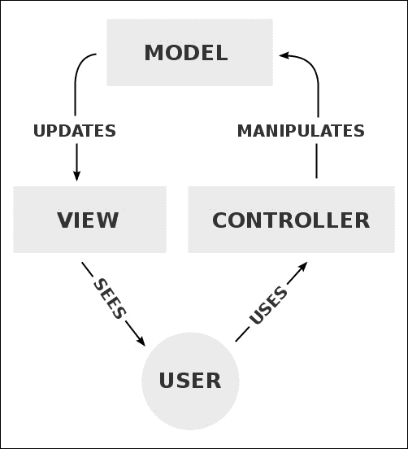
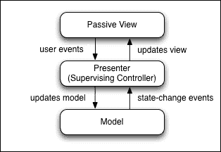
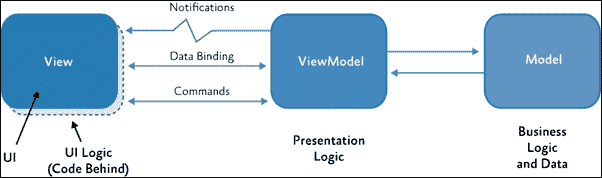
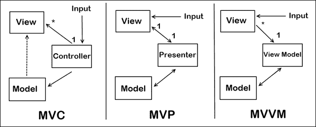
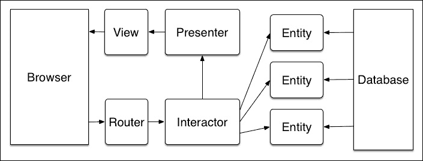
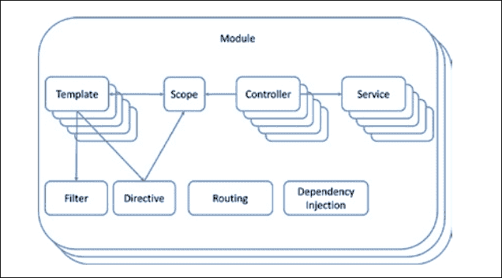
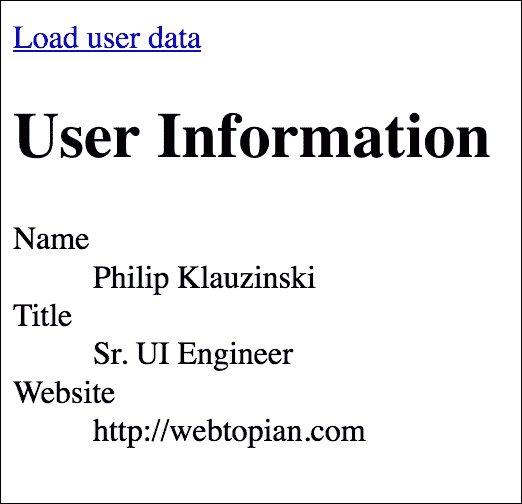

# 第二章. 模型-视图-任何东西

如果你是一名前端开发者，你可能不熟悉被称为 **模型-视图-控制器**（**MVC**）的传统软件架构模式。近年来，这种模式的变体通过 *Backbone.js*、*Ember.js* 和 AngularJS 等框架进入了前端软件架构模式。无论你在这些领域的经验如何，本章将通过以下主题区域讨论所谓的 **模型-视图-任何东西**（**MVW**）模式的演变及其与 SPA 开发的相关性：

+   原始的 MVC 模式

+   **模型-视图-展示**（**MVP**）/**模型-视图-视图模型**（**MVVM**）解释

+   **视图-交互器-展示器-实体-路由器**（**VIPER**）和其他 MVW 变体

+   AngularJS 和 MVW

+   在 SPA 中使用 MVW 模式

# 原始的 MVC 模式

MVC 软件架构模式自 20 世纪 70 年代以来以某种形式存在，但随着其在 Ruby on Rails、CakePHP 和 Django 等网络应用框架中的应用，它变得更加流行并被广泛接受。这类 MVC 框架为网络应用开发带来了比以往更高的组织和复杂性水平，并在这样做的同时，为现代单页应用（SPA）的发展铺平了道路。

要了解 MVC 对现代 SPA 开发的相关性，让我们首先分解 MVC 的组件和理念。

## 模型

MVC 的 *模型* 组件处理应用的数据。这包括显示给用户的数据、从用户接收的数据以及存储在数据库中的数据。此外，模型处理与数据库的所有 **创建、读取、更新、删除**（**CRUD**）操作。许多框架还使用模型来处理应用的业务逻辑，即数据在保存或查看之前应该如何被操作，但这并不一定是标准。

简单来说，MVC 网络应用中的模型是应用数据的表示。这些数据可能包括与应用相关的任何内容，例如当前用户的信息。传统的网络应用框架使用关系数据库，如 MySQL 来存储数据。然而，现代 SPA 架构现在越来越多地倾向于文档导向数据库，通常被称为 *NoSQL*。MongoDB 和许多其他 NoSQL 数据库使用 JSON 文档来存储记录。这对于前端架构来说非常好，因为 JavaScript 可以直接解析 JSON，在 MEAN 栈的情况下，JSON 数据是架构每一层的原生数据。

让我们以当前网络应用的用户信息为例。我们将称之为 *用户模型* **：**

```js
{ 
    "id": 1, 
    "name": { 
        "first": "Philip", 
        "last": "Klauzinski" 
    }, 
    "title": "Sr. UI Engineer", 
    "website": "http://webtopian.com" 
} 

```

这样的简单 JSON 文档将从数据库返回到您的应用，由 JavaScript 直接解析。在文档导向数据库中不需要任何 **结构化查询语言**（**SQL**），因此有 *NoSQL* 这个术语。

## 视图

MVC 的核心组件是 *视图*，如果你是前端开发者，你很可能最熟悉它。视图体现了用户与之交互的一切，在 Web 应用程序的情况下，是浏览器所消耗的内容。传统的 MVC 框架从服务器端提供视图，但在 JavaScript SPA 和使用类似 MEAN 栈的架构的情况下，视图完全包含在前端。从开发和资产管理角度来看，这使得维护变得更加容易，因为处理服务器端和前端视图的双重性质不存在。

在 JavaScript SPA 中，视图的模板使用 HTML 与某种类型的 Web 模板系统（如 Underscore、Handlebars 或 Jade）混合编写，仅举几个例子。Web 模板系统允许您的 HTML 标记被 JavaScript 解析并评估表达式，这些表达式将动态数据和内容放置在您的视图中。例如，让我们看看一个简单的 Handlebars 模板，它使用了之前提到的用户模型：

```js
<h1>User Information</h1> 
<dl> 
    <dt>Name</dt> 
    <dd>{{name.first}} {{name.last}}</dd> 
    <dt>Title</dt> 
    <dd>{{title}}</dd> 
    <dt>Website</dt> 
    <dd>{{website}}</dd> 
</dl> 

```

假设有一个 AJAX 请求用于获取当前登录用户的资料，SPA 通过 `GET` 请求返回用户模型的 JSON 文档。该 JSON 文档中的属性可以直接插入到该请求的视图。在 Handlebars 的例子中，使用一对开闭花括号（`{{ ... }}`）或双花括号表示法来标识模板内要解析的表达式。在这种情况下，这些表达式仅仅是用户的姓氏、名字和头衔。有关 Handlebars 模板的更多信息，请参阅 [handlebarsjs.com](http://handlebarsjs.com)。

## 控制器

MVC 模式中的 *控制器* 组件在不同框架之间变化最大，因此作为一般概念，用真正的清晰度来定义它是最困难的。在像 Ruby on Rails 或 CakePHP 这样的传统 Web 应用 MVC 框架中，控制器从用户那里接收以 Web 请求或 *动作* 的形式输入，在渲染新响应到视图之前对模型进行更改。以下图表显示了 MVC 范式中控制器的流程：



（来自维基百科的图表 - [`en.wikipedia.org/wiki/Model%E2%80%93view%E2%80%93controller#Components`](https://en.wikipedia.org/wiki/Model%E2%80%93view%E2%80%93controller#Components)）

通过这种控制器表示法，很容易看出它如何封装大量的应用程序代码，实际上，在与某些 MVC Web 框架一起工作时，很难知道在控制器逻辑、模型业务规则、视图验证规则以及许多其他 Web 应用程序常见组件之间如何划清界限。控制器的这种模糊性质导致许多现代 Web 框架的作者决定完全放弃使用 *控制器* 这个术语，并采用一个新的概念来替代。

MVC 中的模型和视图组件易于理解，并且可以在 Web 应用程序中区分它们的目的，但 Controller 并不是那么清晰。现在让我们探讨一些最近 Web 应用程序架构模式中取代 Controller 的概念。

# MVP 和 MVVM

术语 *模型-视图-任何东西* 出现在许多包含模型和视图的架构模式兴起之际，但用不同的概念替换了核心组件的 Controller，甚至替换了多个组件。

## MVP

MVP 是 MVC 架构模式的一种变体，其中 *Presenter* 组件取代了 Controller。在这个模式中，Presenter 也充当 Controller 的角色，但它承担了额外的责任，即处理视图的展示逻辑。这种范式背后的推理是通过让视图本身包含很少或没有展示逻辑来增强应用程序的可测试性。

MVP 和 MVC 之间的另一个关键区别是，MVP 中的 Presenter 与视图有一个一对一的关系，这意味着为每个视图定义了一个独特的 Presenter，而 MVC 允许 Controller 与视图有一对多的关系。换句话说，MVC 允许为 Controller 定义任意数量的视图，并且每个视图都映射到该 Controller 的 *操作*。MVP 只映射一个视图到 Presenter。此外，MVP 禁止视图和模型之间的直接关系，这又是为了通过将业务逻辑排除在视图之外来增强可测试性：



(来自维基百科的图表 - [`zh.wikipedia.org/wiki/模型-视图-控制器`](https://zh.wikipedia.org/wiki/模型-视图-控制器))

## MVVM

MVVM 是 MVC 架构模式的一种变体。在这个范式中的 *ViewModel* 是当前用户会话中模型数据的表示。对 ViewModel 的更改总是在对模型进行任何更改之前进行的。

MVVM 与 MVP 类似，因为视图对模型没有了解，但相比之下，视图与 ViewModel 之间有一个多对一的关系。这意味着多个视图可以映射到一个 ViewModel。ViewModel 组件也与 MVP 中的 Presenter 相对立，因为它对视图没有了解。相反，视图有一个对 ViewModel 的引用，这使得它可以根据 ViewModel 的更改进行更新。

然而，与 SPA 开发中的其他架构模式相比，MVVM 的主要区别在于支持**双向数据绑定**。这意味着 ViewModel 的变化会自动反映在视图中，而用户在视图中对数据的变化也会自动更新 ViewModel。这使得 MVVM 成为现代 SPA 开发中更可行的模式，因为视图可以更新并保持与 ViewModel 的同步，而无需新的页面请求，这在传统的 MVC 或 MVP 架构中是必需的：



（图来自[`social.technet.microsoft.com/wiki/contents/articles/13347.mvvm-model-view-viewmodel-part-1.aspx`](http://social.technet.microsoft.com/wiki/contents/articles/13347.mvvm-model-view-viewmodel-part-1.aspx)）

数据绑定将在*第六章、数据绑定，以及为什么你应该接受它*中进一步讨论。

## 总结 MVC、MVP 和 MVVM 之间的区别

现在你应该对 MVC 架构模式及其 MVP 和 MVVM 变体有一个基本的了解。对这些概念有全面的理解并不是学习 JavaScript SPA 开发所必需的，但了解可以组成多层堆栈的组件类型是很重要的。下面是一个图解，突出了本节中讨论的三个架构模式之间的关键区别：



（图来自[`geekswithblogs.net/dlussier/archive/2009/11/21/136454.aspx`](http://geekswithblogs.net/dlussier/archive/2009/11/21/136454.aspx)）

# VIPER 和其他 MVW 变体

现代架构模式远离 MVC 的主要原因是 MVC 中的控制器通常包含太多的应用程序代码，变得难以管理，因此难以测试。这导致了不仅用其他东西替换控制器，而且在它的位置添加多个层，以进一步在应用程序中建立关注点的分离。

## VIPER

在*iOS*的世界里，苹果的移动操作系统，MVC 长期以来一直被鼓励作为遵循的模式。然而，最近，许多 iOS 开发者已经远离了纯 MVC，并采用了在应用程序架构中建立超过三个层的模式。其中一种模式是*VIPER*，代表**视图（View）、交互器（Interactor）、展示者（Presenter）、实体（Entity）和路由（Routing**）（或路由器）。

让我们简要地介绍一下这些组件各自是什么：

+   **视图**：与 MVC 一样，视图代表用户界面。

+   **交互器**：包含应用程序中特定行为和对应视图的业务逻辑。交互器类似于 MVC 中的控制器，但它可能与多个模型交互，并且不受限于仅与一个模型交互。

+   **展示者**：包含视图的逻辑，就像 MVP 一样。

+   **实体**：是“模型”的另一种说法，简单来说就是用来实现**VIPER**缩写中的“E”。

+   **路由**：在应用程序中，每个请求都是通过一个唯一的调用进行的，在 Web 应用程序的情况下，使用浏览器中的 URL 或*路由*来发起应用程序请求。这一层也可以称为路由器。

从 VIPER 组件的描述中可以看出，它们实际上并不是按照缩写本身的顺序流动，而是为了美观目的而这样排序。下面的图表显示了 VIPER 模式的真正流程，以及浏览器和数据库的表示，以补充对这种流程的理解：



（来自[`khanlou.com/2014/03/model-view-whatever/`](http://khanlou.com/2014/03/model-view-whatever/)的图表）

## MVW 的其他变体

到目前为止，我们已经涵盖了传统的 MVC 架构模式、MVP、MVVM 以及最近提出的 VIPER 模式。应该清楚的是，这些在 MVC 之后出现的模式并不代表一个完整的范式转变，而是对传统控制器组件的重构，以体现更多的清晰性，在 VIPER 的情况下，则是进一步的关注点分离。在这些其他模式中，一般范式并没有丢失，因为模型和视图的概念仍然保持不变。这种趋势导致了通用范式术语*模型-视图-任何东西*或 MVW。

我们剩下的是许多作为 MVC 抽象的架构模式。那么，对于 JavaScript SPA，你应该选择哪种模式呢？这是一个非常主观的话题，所以最好的答案是，你应该根据你正在构建的应用程序类型来选择模式，同时也基于对你来说最有意义和最舒适的东西。

你选择的软件库和框架也应该考虑你使用哪种模式。在这方面，让我们看看 AngularJS 是如何为它的 MVW 版本调整 MVC 的。

# AngularJS 和 MVW

AngularJS 是一个用于构建 Web 应用程序的前端 JavaScript 框架，它是 MEAN 堆栈的核心组件。它为开发者提供了使用自定义 HTML 属性和元素来驱动应用程序内行为的能力。它还提供了一些实用的功能，如双向数据绑定和依赖注入。

## AngularJS 的简要历史

AngularJS 最初是两位 Google 开发者的一个侧项目，但最终成为了一个官方的 Google 开源项目。自其诞生以来，它在方法论上经历了许多变化，包括从宣传 MVC 作为首选模式转变为不再宣传。相反，AngularJS 团队现在将其标记为*一个 JavaScript MVW 框架*（截至写作时）。

声明 AngularJS 为 MVW 的原因是对开发者社区中关于 AngularJS 遵循何种模式的广泛辩论和混淆的反应。标签本身可能对某些开发者来说并不重要，但它有助于强调 AngularJS 使用的架构模式比传统的 MVC 更复杂。然而，AngularJS 的确包括控制器组件等。让我们更详细地看看这些组件是什么。

## AngularJS 组件

AngularJS 是为了创建网页应用而设计的，因此它包括了一些在传统 MVC 中不存在的概念组件。同时，请记住 AngularJS 只是一个前端框架，所以它与后端框架和数据库解决方案无关。

### Template

AngularJS 中的 **模板** 是一个包含特殊标记的 HTML 文档，允许它被解析以处理动态数据，就像任何网页模板系统一样。AngularJS 使用自己的专有网页模板系统，而不是第三方系统，如 **Handlebars**。然而，与 Handlebars 一样，AngularJS 也使用双大括号符号来标识 HTML 标记中的表达式：

```js
<html ng-app="myApp"> 
<head> 
    <script src="img/angular.js"></script> 
    <script src="img/app.js"></script> 
</head> 
<body ng-controller="UsersController"> 

    <ul> 
        <li ng-repeat="user in users"> 
            {{user.first_name}} {{user.last_name}} 
        </li> 
    </ul> 

</body> 
</html> 

```

这是一个简单的 AngularJS 模板的例子。你可以看到它就像一个正常的 HTML 文档一样构建，但它还包括 AngularJS 表达式。你还会注意到有一些特殊 HTML 属性以 `ng-` 为前缀，这些属性将不同类型的应用信息传达给 AngularJS 框架。

### Directives

指令是 AngularJS 用来在 DOM 中驱动行为的特殊 HTML 标记。一个指令可以通过以 `ng` 为前缀的自定义 HTML 属性、自定义 HTML 元素名称（如 `<my-element></my-element>`）、注释或 CSS 类来驱动。

你可以为你的应用定义自己的指令，但 AngularJS 也包括一些预定义的指令用于常见用例。例如，前一个示例中显示的 `ng-repeat` 属性使用了内置的 `ngRepeat` 指令，该指令用于在迭代集合时渲染模板标记：

```js
    <ul> 
        <li ng-repeat="user in users"> 
            {{user.first_name}} {{user.last_name}} 
        </li> 
    </ul> 

```

在这个例子中，`users` 对象被迭代，每个 `user` 的属性从模板中渲染出来。

### Model

*Model* 是当前 View 中可用于表达式的变量数据的表示。一个 View 可用的 Model 被限制在特定的 **Scope** 或上下文中：

```js
$scope.users = [ 
    { 
        id: 1, 
        first_name: 'Peebo', 
        last_name: 'Sanderson' 
    }, 
    { 
        id: 2, 
        first_name: 'Udis', 
        last_name: 'Petroyka' 
    } 
]; 

```

在这个例子中，一个 `users` 数组被注册在 `$scope` 对象上。这使 `users` 变量暴露给可以访问此特定 Scope 的模板。

### Scope

Scope 是一个 JavaScript 对象，它定义了 View 中变量的 Model 上下文。正如前一个示例所示，`$scope.users` 将在该 Scope 的 View 中以 `{{users}}` 的形式访问。

### Expressions

AngularJS 中的 **表达式** 就像任何网页模板系统中的表达式一样，如前所述。AngularJS 中使用双大括号符号来标识表达式：

```js
    <ul> 
        <li ng-repeat="user in users"> 
            {{user.first_name}} {{user.last_name}} 
        </li> 
    </ul> 

```

在这个例子中，`{{user.first_name}}`和`{{user.last_name}}`是 AngularJS 表达式。

### 编译器

**编译器**解析模板标记，并对其中的指令和表达式进行评估，以驱动视图中的行为和数据。AngularJS 编译器是框架内部的，通常不会直接访问或与之交互。

### 过滤器

**过滤器**用于在视图中格式化表达式，以便以特定方式呈现。例如，视图可能从模型中接收到一个以数字形式表示的货币金额。可以通过添加过滤器到表达式中来格式化用户看到的货币值，并带有货币符号。管道`|`符号在双大括号符号内用于附加过滤器：

```js
<p><strong>Cost:</strong> {{ total | currency }} 

```

在这个例子中，`total`代表表达式，而`currency`代表过滤器。

### 视图

就像传统的 MVC（模型-视图-控制器）一样，AngularJS 中的视图是用户界面。视图由模板组成，在 AngularJS 应用程序的上下文中，这两个术语在很大程度上是可以互换的。

### 数据绑定

AngularJS 中的数据绑定是**双向的**，或者说双向的，因此视图中的数据变化会更新到模型中，而模型中的数据变化会更新到视图中。这是自动完成的，无需任何额外的业务逻辑来处理这些变化。

### 控制器

控制器在 AngularJS 中实际上是一个**视图控制器**，因为它是一个纯前端框架。像传统的 MVC 一样，控制器包含业务逻辑，但这种业务逻辑仅与视图相关：

```js
var myApp = angular.module('myApp', []); 
myApp.controller('UsersController', function($scope) { 
    $scope.users = [ 
        { 
            id: 1, 
            first_name: 'Peebo', 
            last_name: 'Sanderson' 
        }, 
        { 
            id: 2, 
            first_name: 'Udis', 
            last_name: 'Petroyka' 
        } 
    ]; 
}); 

```

例如，可以创建一个`UsersController`，其中包含之前显示的`users`模型，并通过其`$scope`对象将其暴露在视图中。

### 依赖注入

术语*依赖注入*在 JavaScript 中通常与异步向当前网页添加资源的能力相关联。在 AngularJS 中，这个概念类似，但仅限于其他 AngularJS 组件。例如，指令（Directives）、过滤器（Filters）和控制器（Controllers）都是可注入的。

### 注入器

**注入器**是依赖项的容器，负责在需要时查找并添加它们。它通过视图中的声明性语法与应用程序代码解耦，通常不会直接访问。

### 模块

**模块**是应用程序所有主要组件的容器。它为应用程序提供了一个主命名空间引用，包括所有相关的指令（Directives）、服务（Services）、控制器（Controllers）、过滤器（Filters）以及任何额外的配置信息：

```js
Var myAppModule = angular.module('myApp', []); 

```

如果你的模块依赖于任何其他模块，你可以将它们添加到前一个例子中显示的空数组参数中。

要将模块应用于使用 AngularJS 的 SPA（单页应用），你可以在主页的 HTML 中简单地使用自定义的`ng-app`属性在你的应用容器元素中声明模块的名称：

```js
<body ng-app="myApp"> 

```

### 服务

**服务**是区分 AngularJS 和传统 MVC 的组件，因为它用于包含可重用的业务逻辑，你可能在应用程序的不同控制器之间共享这些逻辑。这有助于防止控制器变得过大和复杂，并允许应用程序的不同部分共享一些常用的业务逻辑。例如，货币转换可以编写为一个服务，因为你可能想在多个控制器中使用它。

下面的图表说明了 AngularJS 的组件如何相互交互：



（来自 [`dzone.com/refcardz/angularjs-essentials`](https://dzone.com/refcardz/angularjs-essentials) 的图表）

AngularJS 2.x（在撰写本文时处于测试版）在架构模式上与 v1.x 不同，这里展示的是 v1.x 版本。

现在你已经更好地理解了构成 AngularJS MVW 架构模式的组件以及这些组件如何与前端 SPA 架构相关，让我们将这些 MVW 原则应用到简单的 JavaScript SPA 示例中。

# 在 SPA 中使用 MVW 模式

现在应该很清楚，MVW 不是一个精确的架构模式，而是一种范式，其中你有一个模型、一个视图，以及一个模糊的第三组件，或者更多组件，这取决于你决定如何细化你的关注点分离。所有落在那个灰色区域的东西都是基于你正在构建的应用程序类型、作为开发者的你感到舒适的架构组件，以及你正在使用的框架和库。

## 构建 JavaScript SPA

你的 SPA 的复杂性应该是你选择构建它的技术的一个因素。更具体地说，你不应该假设每个项目你都会使用某个特定的技术栈或框架。这个规则也适用于 MEAN 栈。

让我们以前面的用户模型示例和相应的 Handlebars 模板视图为例，实际上构建一个 SPA，包括用于检索用户模型数据的 AJAX 请求。对于这样简单的东西，使用 AngularJS 和 MEAN 栈无疑是过度设计。让我们从使用你在 *第一章**使用 NPM、Bower 和 Grunt 进行组织*中设置的 NPM、Bower 和 Grunt 环境 开始。那么我们该如何进行呢？

### 创建模型

模型是我们之前定义的简单 JSON 用户数据对象。而不是为这个设置数据库，让我们简单地将它放在一个文本文件中，命名为 `user.json`：

```js
{ 
    "id": 1, 
    "name": { 
        "first": "Philip", 
        "last": "Klauzinski" 
    }, 
    "title": "Sr. UI Engineer", 
    "website": "http://webtopian.com" 
} 

```

将文件保存到与你的 `package.json`、`bower.json` 和 `Gruntfile.js` 相同的目录下。在这个示例中，你可以随意替换用户信息。

### 创建视图

本例的视图将是之前定义的包含用户信息的网页模板文档：

```js
<h1>User Information</h1> 
<dl> 
    <dt>Name</dt> 
    <dd>{{name.first}} {{name.last}}</dd> 
    <dt>Title</dt> 
    <dd>{{title}}</dd> 
    <dt>Website</dt> 
    <dd>{{website}}</dd> 
</dl> 

```

将此文件保存到您的项目根目录，并命名为 `user.handlebars`。

### 设置前端资产

在这个例子中，我们不会创建一个复杂的 SPA，因此我们不会使用任何前端框架，但我们确实想安装一些库以简化开发。

如果您遵循了 *第一章*、*使用 NPM、Bower 进行组织* 和 Grunt 的示例，您应该已经通过 Bower 安装了 jQuery。如果您尚未安装它，请现在安装：

```js
$ bower install jquery --save

```

我们将使用 jQuery 在 SPA 中处理 AJAX 请求和 DOM 操作。

现在让我们安装 Handlebars 库以解析我们的网页模板视图：

```js
$ bower install handlebars --save

```

#### 编译网页模板

在解析表达式之前，网页模板必须编译为 JavaScript。这可以在浏览器中使用 Handlebars 前端库完成，但这意味着加载模板时的执行时间会更长，同时也意味着在初始页面加载时加载更大的库资产文件。对于 SPA 来说，初始页面加载是至关重要的，因为您不希望用户长时间等待您的应用程序下载资产并准备初始视图。此外，如果您想将视图分离到单独的文件中，就像我们用 `user.handlebars` 做的那样，那么这些视图文件必须在某个时刻异步加载，以便传递给编译器。

#### 预编译网页模板

为了绕过大量资产负载以及服务器往返以获取视图的额外往返，Handlebars 允许您将网页模板 *预编译* 为 JavaScript，以便它们可以在您的应用程序中立即使用。这使您能够将视图分离到不同的文件中，保持事物组织有序，同时仍然保持较低的初始页面加载。

对于这个例子，让我们全局安装 Handlebars Node.js 包，以便可以在任何目录中使用命令行：

```js
$ npm install handlebars -g

```

这将允许您在命令行中编译模板，创建一个预编译的 JavaScript 模板文件，您可以在您的 SPA 中使用。从您的项目目录的根目录开始，输入以下命令：

```js
$ handlebars *.handlebars -f templates.js

```

此命令告诉 Handlebars 编译器将所有扩展名为 .`handlebars` 的文件（在这种情况下仅为 `user.handlebars`）编译到一个名为 `templates.js` 的单个文件中。这可以使您拥有 100 个独立的网页模板视图文件，并将它们预编译到一个 JavaScript 文件中，例如。这是一个好习惯，因为它允许您将每个视图文件映射到服务器端的 REST API 端点。在我们的 SPA 示例中，我们的端点将通过 AJAX 请求 `user.json` 文件。

#### 处理服务器 HTTP 请求

现在我们将安装 *PayloadJS* 库以在 SPA 中处理 REST 请求：

```js
$ bower install payloadjs --save

```

PayloadJS 将允许我们通过使用自定义的 `data-` HTML 属性在 DOM 中定义行为和参数，轻松地从我们的 SPA 标记中触发 AJAX 请求。

### 创建 SPA 布局

单页应用（SPA）最重要的部分之一是*单页*本身，或者说是你应用的*布局*。这是你将加载的唯一一个服务器端 HTML 页面，用于初始化和显示你的应用。

在你的目录根目录下创建一个名为`index.html`的文件，并将以下代码输入到其中：

```js
<!doctype html> 
<html> 
    <head> 
        <title>My Application</title> 
    </head> 
    <body> 
        <p><a href="#" data-url="/user.json" data-template="user" data-selector=".results">Load user data</a></p> 
        <div class="results"></div> 
        <script src="img/jquery.min.js"></script> 
        <script src="img/handlebars.runtime.min.js"></script> 
        <script src="img/payload.js"></script> 
        <script src="img/templates.js"></script> 
        <script> 
            Payload.deliver({ 
                templates: Handlebars.templates             
            }); 
        </script> 
    </body> 
</html> 

```

这将是你的 SPA 的主要布局页面。你会注意到已经添加了`script`标签引用，指向 jQuery、Handlebars、PayloadJS 和我们创建的`templates.js`文件。这些都是你需要加载以运行此 SPA 的资产。此外，`Payload.deliver()`命令在页面底部运行，并传递一个对象以覆盖其任何默认初始化选项。此方法简单初始化 PayloadJS 以驱动 DOM 中`data-`属性指示的行为。在这种情况下，我们正在设置传递给`Handlebars.templates`的`templates`属性，因为它是包含我们的 Handlebars 模板的命名空间。

关于使用 PayloadJS 的更多信息，请参阅 payloadjs.com。

### 服务器端渲染 SPA

现在，你已经放置了所有必要的文件来运行这个简单的 SPA。唯一剩下的事情是运行一个本地服务器来加载和测试`index.html`文件。让我们使用 NPM 安装一个简单的 HTTP 服务器来完成这个目的：

```js
$ npm install http-server -g

```

将此包全局安装，以便可以从命令行运行。这个简单的 Node.js HTTP 服务器可以指定任何本地目录作为你的服务器。在这种情况下，我们想要运行当前项目目录的服务器：

```js
$ http-server ./ 

```

运行此命令后，你应该能在你的控制台看到以下类似的输出：

```js
Starting up http-server, serving ./
Available on:
 http:127.0.0.1:8080
 http:192.168.0.2:8080
Hit CTRL-C to stop the server

```

这表明 HTTP 服务器正在本地运行并可用。

现在，你应该能够打开浏览器并加载 URL `localhost:8080`，你将看到你创建的`index.html`页面的内容。页面上唯一可见的内容是带有文本**加载用户数据**的链接。如果一切设置正确，并且你点击该链接，你应该会注意到短暂的**加载中...**指示器，随后是`user.handlebars`模板文件的内容，这些内容是从加载到页面中的`user.json`文件中获取的：



点击链接后的完整页面应类似于前面的截图。

### 简单 JavaScript SPA 概述

因此，我们使用以下组件创建了一个简单的 JavaScript SPA，采用通用的 MVW 模式：

+   模型：`user.json`

+   视图：`user.handlebars`

+   预编译的模板文件：`templates.js`

+   SPA 布局页面：`index.html`

+   HTTP 服务器：Node.js *http-server* 包

这已经是最简单的情况了，但你仍然创建了一个 SPA。这个例子应该能给你一个关于 JavaScript 在创建单页应用方面多么强大的概念。你可以自由地通过添加更多的模型数据文件、额外的网页模板视图、一些 CSS 和一点自己的创意来扩展这个简单的 SPA。

# 摘要

你现在应该已经理解了传统的 MVC 模式、MVP、MVVM、VIPER，以及从传统 MVC 和约定过渡到更通用的 MVW 模式的理由。你也应该明白，“模型-视图-任何东西”（Model-View-Whatever），或简称 MVW，这个术语在很大程度上是由 AngularJS 团队推广的，这是为了满足现代单页应用（SPA）需要的新和更复杂的组件集，而这些组件在原始 MVC 模式构思时并不存在。

你现在也应该有能力仅使用几个 Node.js 和 Bower 包来构建一个简单的 JavaScript SPA。现在，让我们继续前进，做一些更大、更好的事情。在下一章中，我们将讨论如何通过扩展我们迄今为止一直在使用的 Node.js 环境，来创建一个理想的 SPA 应用程序开发环境。
