# 第四章. REST 最佳实践 – 与应用程序的后端进行交互

创建 JavaScript 单页应用程序所涉及的大多数开发工作通常将集中在前端，但不可忽视的是至关重要的数据传输层，它与服务器和数据库进行通信。**表征状态转移**（**REST**）是万维网和**物联网**（**IoT**）客户端和服务器之间数据传输的标准架构风格。每次你使用 Web 应用程序时，很可能会使用 REST 来从 UI 通信数据状态转换。

使用 REST 架构风格为 SPA 带来的好处是，你的应用程序的前端可以完全不受用于在服务器上检索请求的软件类型的影响，只要你的应用程序可以通过**超文本传输协议**（**HTTP**），即万维网的标准化应用协议。

在本章中，你将学习：

+   REST 架构风格的基本方面

+   如何为单页 Web 应用程序编写基本的 REST API 端点以执行 CRUD 操作

+   如何使用 AJAX 在你的应用程序前端处理 REST 请求

+   一些 REST 替代方案的基本知识，如 SOAP、WebSockets、MQTT、CoAP 和 DDP

# 理解 REST 的基本原理

REST 是用于在万维网或简称为 Web 上提供网页和发起请求的架构风格。尽管互联网和 Web 经常被互换使用，但它们在 Web 仅仅是互联网的*一部分*这一事实上有所不同。

Web 是一组文档，或称为*网页*，这些网页托管在世界各地的计算机上，并通过*超链接*或通常所说的链接连接。这些链接通过 HTTP 提供，这是 Web 的通信语言。由于与 Web 的相互关系，REST 经常与 HTTP 混淆，但 HTTP 和 REST 远非同一事物。

## 理解架构风格与协议的区别

REST 是一种架构风格，而 HTTP 是一种应用层协议。这意味着虽然 HTTP 是网络上的通信语言，但 REST 仅仅是执行网络上的请求和操作的一组规则。通过 REST 架构风格执行的操作通常被称为*Web 服务*。这样，HTTP 仅仅是使用 REST 的应用程序执行 Web 服务的方法。

### 架构风格

架构风格，或架构模式，是一组规则，它为开发者提供了构建抽象层作为框架的能力，这些框架旨在实现一个最终将被某种类型的客户端或用户代理消费的通用交互语言。在 Web 的情况下，那个用户代理是网络浏览器。

网络抽象层，或网络框架，可以用任何数量的语言编写，以通过 REST 或 RESTful 服务提供 Web 服务，只要该语言可以在 Web 服务器上托管。当该框架遵循 REST 架构风格时，使用它的任何应用程序的 UI 可以完全 **无偏见**，即对 RESTful 服务的背后技术保持中立。

### **协议**

在与网络相关的情况下，协议是 **互联网协议套件** 或 TCP/IP 的抽象层的一部分，为连接的计算机之间提供了一种通用的通信方法。

#### **传输层协议**

术语 TCP/IP 是互联网协议套件中最广泛使用的协议的组合：**传输控制协议** (**TCP**) 和 **互联网协议** (**IP**)。

**TCP**

**TCP** 是一种传输层协议，位于应用层之下。这意味着服务和信息被 **传输** 到互联网协议套件的最顶层应用层。

**IP**

**IP** 也是一种传输层协议。你很可能已经看到这个协议与术语 IP 地址或互联网协议地址相关联，这是网络上设备的唯一数字标识符。在互联网上，域名通常用于指向 IP 地址，以便人们更容易记住如何到达该地址。

#### **应用层协议**

TCP/IP 的应用层是定义通过互联网连接的主机之间通信方法的抽象层。该层指定了多个协议，其中一些最常见的是 HTTP、FTP、SSH 和 SMTP。

**HTTP**

**HTTP** 是 TCP/IP 应用层内数据交换的主要协议，并为 RESTful 网络服务提供了通信的基础。HTTP 还负责在浏览器中显示网页，并将网页上的表单数据发送到服务器。

**FTP**

**文件传输协议** (**FTP**) 是 TCP/IP 应用层中的另一种标准协议，用于在计算机之间传输文件。FTP 通信需要一个 FTP 服务器和一个 FTP 客户端。

**SSH**

**Secure Shell** (**SSH**) 是应用层中另一种常见的协议，它用于允许对非安全网络入口点进行安全的远程登录。为了使 SSH 连接工作，必须有一个 SSH 服务器来接收来自 SSH 客户端的请求。SSH 客户端通常以终端应用程序的形式出现，具有 **命令行界面** (**CLI**)。

**SMTP**

**简单邮件传输协议** (**SMTP**) 是在 TCP/IP 应用层发送电子邮件或电子邮件的标准方法。SMTP 也可以用来接收电子邮件，并且通常由电子邮件服务器用于此目的。然而，SMTP 通常不用于用户级电子邮件客户端接收电子邮件。相反，这些客户端更常见地使用 POP3 或 IMAP。

POP3 是**邮局协议**的第三个版本，它是一种标准的应用层协议，用于通过 TCP/IP 连接接收电子邮件。POP3 通常用于将电子邮件下载到本地计算机，然后从主机服务器上删除。

IMAP 是**互联网消息访问协议**。它也是一种标准的应用层协议，用于通过 TCP/IP 连接接收电子邮件。IMAP 通常用作管理多个客户端通过主机服务器电子邮件收件箱的方式，因此它不会像 POP3 那样在将电子邮件下载到本地计算机后从服务器上删除电子邮件。IMAP 的最新版本也支持跟踪主机服务器上电子邮件的状态，例如已读、已回复或已删除。

#### 使用 HTTP 作为 REST 的传输协议

REST 定义了一套规则，用于在 Web 应用程序或服务中发出 HTTP 请求。HTTP 请求可以通过任何数量的方式发出，但只有遵循这些规则，它们才是 RESTful 的。HTTP 提供了请求所依赖的传输层。

就像与 REST API 交互的 Web 应用程序对用于提供 API 端点的软件框架类型一无所知一样，HTTP 对所有与之通信的服务器上使用的操作系统类型也是一无所知的。

## REST 的约束

REST 架构风格由一系列约束或规则所管理，这些规则规定了它应该如何实现、交互和处理数据。REST 最初由美国计算机科学家 Roy Fielding 在 2000 年的一篇博士论文中定义，并伴随着这些约束。

REST 被认为是一种*混合*架构风格，因为它借鉴了在其构思之前存在的其他架构风格。这些其他架构风格极大地促进了这里概述的 REST 约束。

### 客户端-服务器

REST 的第一个约束是客户端-服务器架构风格。这个约束存在是为了强制执行 REST 的不可知性，或者说是其基础性的*关注点分离*：

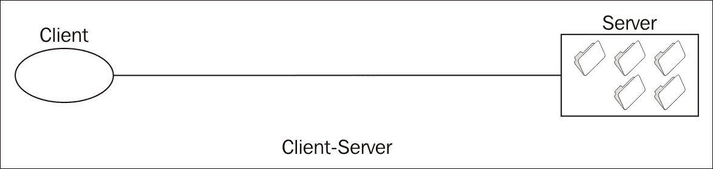

此图显示了客户端-服务器关系以及它们是如何分离的。**客户端**，或网页浏览器，只需要显示应用程序的用户界面。UI 可以简单或复杂，只要认为有必要，而不会影响服务器上的 REST 架构。此 REST 约束提供了可伸缩性。

### 无状态

REST 的第二个约束建立在客户端-服务器约束之上，即客户端和服务器之间的通信必须是无状态的。这意味着任何来自网页浏览器的 REST 服务器的请求都必须提供所有预期信息，这些信息对于请求的上下文和当前会话是必需的，以便期望从服务器获得适当的响应。

服务器将没有存储信息来帮助界定请求，因此使 REST 服务器*无状态*并将会话状态的压力放在了网页浏览器上：

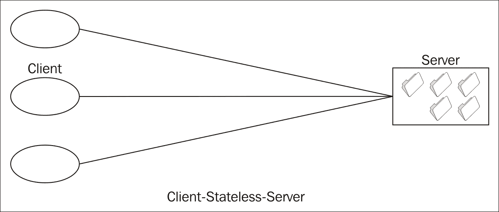

此图展示了客户端无状态-服务器架构风格，其中网页浏览器的状态可以改变，而 REST 服务器保持一致性。这种 REST 约束提供了可见性、可靠性和可扩展性，这些都是使用 REST 的一些关键好处。

### 缓存

REST 的第三个约束再次建立在客户端-服务器和无状态约束之上。一个缓存，或为重用存储的数据，可以根据 REST 服务器委托的该请求的可缓存性，允许浏览器用于任何给定的请求。如果服务器的缓存组件指示请求是可缓存的，那么浏览器可以将其缓存以供未来的请求使用。可缓存性通常在多次向特定 REST 端点发出请求的情况下表示，每次请求都可能导致相同的响应：

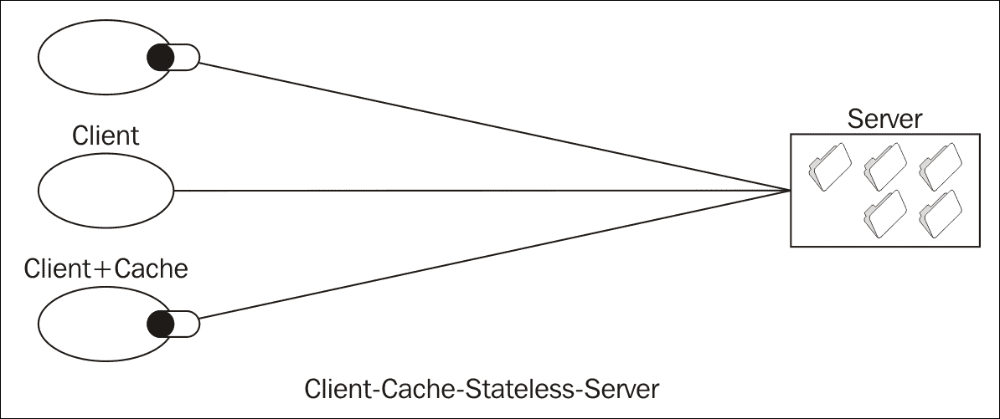

此图展示了客户端-缓存-无状态服务器架构风格。这种风格与客户端-无状态服务器类似，但增加了客户端缓存的组件。

### 统一接口

REST 的第四个约束是在系统的组件之间使用统一接口。这指的是 REST 实现中涉及的架构的简单性，其中组件是解耦的。这允许架构的每个组件独立发展，而不会影响其他组件：

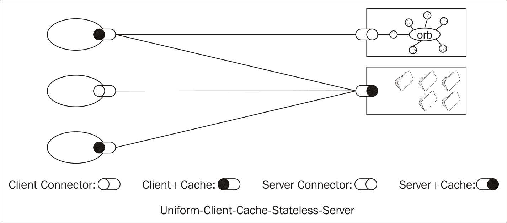

此图展示了统一客户端-缓存-无状态服务器架构风格。这结合了前三种架构风格约束，并增加了统一接口的约束。

统一接口约束进一步细分为其自身的四个约束。

#### 资源标识

REST 中的资源是对信息到唯一可识别对象的任何概念映射。这个对象可以是人、地点或事物。在 Web 的例子中，这是一个统一资源标识符（URI）。更具体地说，统一资源定位符（URL）是一种特殊的 URI，它提供了一种查找网络资源的方法，并指定了如何从该资源获取信息表示。URL 也常被称为网络地址。在 REST 的相关性中，URL 也可能被称为端点。

#### 通过表示形式操作资源

REST 中的表示是一组数据，它代表了资源的当前状态。在采用 REST 的 Web 架构中，JSON 文档可以用作表示，在客户端和服务器之间传递，以操作或更改资源。

#### 自描述消息

REST 中的消息是组件之间的通信。根据 REST 服务器无状态的约束，消息必须是自描述的，这意味着它携带了所有必要的信息，以告诉每个组件如何处理。

#### 超媒体作为应用程序状态引擎

超媒体指的是网页或超文本，以及连接它们的超链接。为了保持无状态，RESTful 架构使用超媒体根据从服务器接收到的表示来传达应用程序的状态。

### 分层系统

REST 的第五个约束是分层系统，这是一个架构组件的层次结构，其中每一层为其上层提供服务并使用下层的服务。以这种方式，每一层只能看到其下一层，因此对任何下层的层都是不可知的。

这个概念应用于用于增强应用程序可扩展性的 Web 分布式服务器。例如，一个网络浏览器可能根据其位置与任何数量的**中间**服务器通信，但它永远不会意识到它是连接到端服务器还是那些中间服务器之一。

在服务器之间实现负载均衡也使用了分层系统。这允许当主服务器因请求过多而超负荷时，额外的服务器可以承担请求：

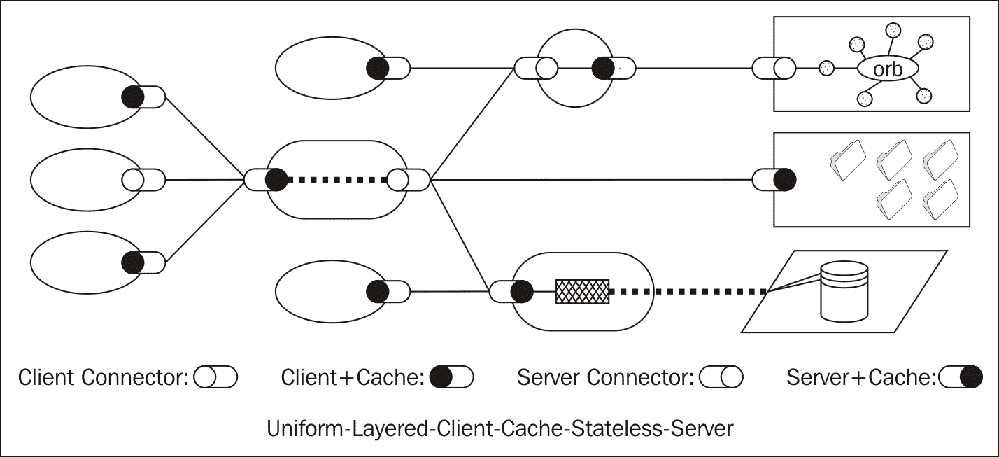

此图展示了统一分层客户端缓存无状态服务器。这种架构风格结合了前四种风格，并增加了分层系统的约束。

### 按需代码

REST 的第六个也是最后的约束是**按需代码**的架构风格，并且这是唯一的**可选**约束。在这种风格中，服务器提供一组封装在某种形式中、可以被浏览器消费的可执行代码。这种风格的例子包括 Java 小程序、运行 ActionScript 的 Flash 动画以及运行 JavaScript 的客户端小工具。

使用按需代码可以提高 REST 应用程序的灵活性，但它也通过封装一些功能来减少**可见性**。这就是为什么按需代码是 REST 的一个可选约束：

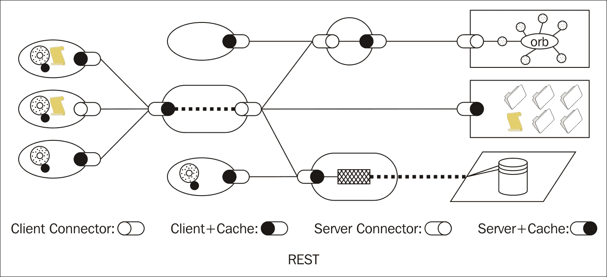

此图展示了最终的 REST 架构风格。它结合了之前描述的所有必须用于 REST 的约束，以及可选的按需代码约束。

# REST 的好处

REST 约束的设计考虑到了关注点的分离和向前兼容性，这种设计允许 REST 的各个组件独立演变，而不会损害底层架构风格本身。

通过强制实施 REST 的约束，一些特定的架构属性被揭示出来，这揭示了这种架构风格的益处。让我们更深入地探讨 REST 的一些具体好处。

## 性能

性能是 REST 的主要好处之一，它通过使用缓存、简单的表示形式如 JSON、具有多个服务器和负载均衡的分层系统以及通过统一接口解耦组件来体现。

## 简单性

简单性是 REST 的另一个关键优势，它主要通过统一资源约束来体现，其中系统的各个组件是解耦的。简单性也体现在服务器组件上，它只需要支持 HTTP 请求，而不需要为任何请求支持状态。

## 关注点分离

关注点分离有助于 REST 的简单性，同时本身也是一个优势。这体现在独立的客户端-服务器关系、将缓存负担放在前端以及分层系统的使用上。关注点分离是一个常见的模式，不仅体现在架构中，也体现在软件设计上，例如在*第二章*中讨论的 MVW 架构模式，*模型-视图-任何*。

## 可扩展性

通过客户端-服务器关系的简单性和关注点分离属性，REST 在可扩展性方面表现出其架构属性。通过结合这些关键属性，系统变得更加可扩展，因为组件之间关系的复杂性通过具体的指导原则来降低，这些原则规定了它们应该如何协同工作。

## 可移植性

可移植性是 REST 的一个优势，它通过关注点分离的客户端-服务器模型来体现。这使得应用程序的用户界面层可以*可移植*，因为它对用于托管 REST 端点的底层服务器软件是中立的。

可移植性也通过代码按需功能体现出来，这使得 REST 能够将应用程序代码从服务器传输到客户端。

## 可视性

可视性简单来说是指根据组件之间的交互理解系统发生情况的能力。在 REST 中，由于组件的解耦性质以及它们之间几乎不需要相互了解，高可视性是一个优势。这允许在架构内部进行的交互，如对端点的请求，容易被理解。为了确定请求的完整性质，不需要查看请求本身的表示之外的内容。

REST 的代码按需约束实际上会降低可视性，但正因为这个原因，它是可选的。在接下来的内容中，除了在网页上发现的简单 JavaScript 小部件，用于广告、社交网络和其他第三方交互之外，现代网络应用很少使用代码按需功能。

## 可靠性

可靠性是 REST 的一个优势，主要通过无状态服务器约束来体现。在无状态服务器中，应用程序的故障可以在系统级别进行分析，因为你知道该故障的来源是系统的一个单独、解耦的组件。

例如，如果你在 Web 应用的 UI 中收到一个错误消息，提示用户输入的信息不正确，那么这个错误可以在 UI 级别进行处理。另一方面，如果你在输入正确信息后从服务器收到 HTTP 400 响应代码错误，你可以进一步推断出 REST 服务器端点配置不正确。

# RESTful Web 服务

如前所述，REST 架构风格常用于在现代 Web 单页应用中执行**读取**、**更新**和**删除**（**创建**、**读取**、**更新**、**删除**（**CRUD**））操作，这些操作被称为 Web 服务。为了在你的应用程序中使用 RESTful Web 服务，你不仅需要一个 HTTP 服务器，还需要一个托管数据库或数据库服务器，以便在数据上执行 CRUD 操作。

## 使用 MongoDB 设置简单数据库

MongoDB 是 MEAN 栈使用的数据库。它是一个开源的、面向文档的数据库系统，可以很容易地通过下载或包管理器添加到你的栈中，具体取决于你使用的操作系统。

### 安装 MongoDB

MongoDB 可以安装在运行 Linux、Windows 和 OS X 的系统上。这些操作系统都有可用的直接下载，此外，在 OS X 上还可以使用 Homebrew 安装 MongoDB。Homebrew 是 OS X 上流行的 CLI 包管理器。有关安装 Homebrew 的说明，请访问 brew.sh。

如果你正在运行 OS X 并且已经安装了 Homebrew，你可以使用以下说明通过 CLI 安装 MongoDB。对于其他系统的安装，你可以在 MongoDB 的文档网站上找到说明，网址为[docs.mongodb.com/manual/installation/](http://docs.mongodb.com/manual/installation/)。

#### 使用 Homebrew 在 Mac 上安装 MongoDB

在使用 Homebrew 之前，首先将其更新到最新版本：

```js
$ brew update

```

接下来，安装`mongodb`包：

```js
$ brew install mongodb

```

一旦安装了 MongoDB，你可能希望将其添加到你的命令行`PATH`中以便于使用。为此，将以下内容添加到你的用户目录下的`.profile`、`.bash_profile`或`.bashrc`文件中，如果你已经有其中之一的话。如果你没有这些文件，那么创建`.profile`：

```js
export PATH=/usr/local/opt/mongodb/bin:$PATH 

```

一旦将 MongoDB 添加到你的`PATH`中，你需要在运行它之前创建一个用于存储数据的目录。MongoDB 的默认数据目录是`/data/db`。你很可能会需要以超级用户身份运行此命令。

#### 创建 MongoDB 数据目录

首先，前往 CLI 并使用`sudo`创建一个数据库目录：

```js
$ sudo mkdir -p /data/db

```

接下来，你需要设置目录权限，以便你能够进行读写操作：

```js
$ sudo chown -R $(whoami):admin /data/db

```

#### 运行 MongoDB

现在应该已经设置好了，你可以继续在 CLI 上使用`mongod`命令运行 MongoDB：

```js
$ mongod

```

如果一切设置正确，你应该会看到几行输出，最后一行显示的内容类似于以下行：

```js
I NETWORK  [initandlisten] waiting for connections on port 27017

```

端口 27017 是 MongoDB 的默认端口，但必要时可以使用 CLI 上的 `--port` 选项进行更改：

```js
$ mongod --port 27018

```

要在任何时候停止 MongoDB 的运行，请在它运行的命令提示符中按 *Ctrl* + *C*。

### 使用 MongoDB 创建集合

MongoDB 中的集合类似于传统关系数据库中的表。让我们使用我们在示例应用程序中使用的 `user.json` 文档设置一个测试数据库和集合。从应用程序的根目录运行以下命令：

```js
$ mongoimport --db test --collection users --file user.json

```

此命令将创建一个名为 test 的数据库和一个名为 users 的集合，然后它将从 user.json 文件中导入数据到 users 集合。运行此命令后，你应该看到两行输出：

```js
connected to: localhost
imported 1 document

```

此输出指示 `user.json` 文档已导入到运行在本地的 MongoDB 实例中。

### 安装 Node.js MongoDB 驱动程序

MongoDB 为几种编程语言提供了驱动程序。我们将使用 Node.js 驱动程序。可以使用 NPM 安装 MongoDB 的 Node.js 驱动程序。转到应用程序的根目录并安装它，并将其保存到本地的 `package.json` 文件中：

```js
$ npm install mongodb --save

```

现在，你可以在你的 Node.js 应用程序中使用 MongoDB。首先，让我们向之前创建的 `server.js` 文件中添加一些额外的行：

```js
var mongo = require('mongodb').MongoClient; 
var assert = require('assert'); 
var url = 'mongodb://localhost:27017/test'; 

mongo.connect(url, function(err, db) { 
    assert.equal(null, err); 
    console.log('Connected to MongoDB.'); 
    db.close(); 
}); 

```

这将设置与本地 MongoDB 测试数据库的连接，如果成功，将在控制台输出一条消息。

如果你将这些行添加到我们在 *第三章* 中为 `server.js` 编写的附加代码中，*SPA 基础 - 创建理想的应用程序环境*，文件的整个内容应如下所示：

```js
var express = require('express'); 
var app = express(); 
var mongo = require('mongodb').MongoClient; 
var assert = require('assert'); 
var url = 'mongodb://localhost:27017/test'; 

mongo.connect(url, function(err, db) { 
    assert.equal(null, err); 
    console.log('Connected to MongoDB.'); 
    db.close(); 
}); 

app.use('/', express.static('./')); 

app.get('*', function(request, response) { 
    response.sendFile('/index.html', {root: __dirname}); 
}); 

app.listen(8080, function() { 
    console.log('App now listening on port 8080'); 
}); 

```

我们添加的 assert 模块提供了一组简单的断言测试，可用于测试不变量，或不能更改的值。现在让我们保存文件并再次运行服务器：

```js
$ node server.js

```

如果一切正常，并且你的 Node.js 服务器连接到了数据库，你应该看到以下输出：

```js
App now listening on port 8080
Connected to MongoDB.

```

这表明你的 Node.js 服务器正在运行并连接到 MongoDB。如果 MongoDB 连接不成功，控制台将抛出错误。

现在我们已经有一个 Node.js 服务器在运行，并且连接到了 MongoDB 中的测试数据库，我们可以开始编写一些 REST API 端点了。

# 编写基本的 REST API 端点

在 Web 上最常见的一种 RESTful 请求是 HTTP `GET` 或 `Read` 操作。一个例子是通过 URL 查看网页的简单请求。GET 请求可以执行以读取任何类型的数据，并且不需要由数据库支持，但为了实现数据的创建、更新和删除操作，必须使用某种类型的数据库或数据存储，以及一个 REST **应用程序编程接口** (**API**)。

## 使用 REST 进行 CRUD

使用您迄今为止一直在使用的简单 NPM、Bower 和 Grunt 应用程序执行您的 Web 应用程序的完整 CRUD 操作；我们只需要编写一些 API 端点来实现这一点。让我们回到我们的应用程序 CLI 进行一些更改。

### 使用 Node.js 和 Express 处理请求数据

在我们能够处理发送到我们服务器的任何 API 请求数据之前，我们必须添加解析这些数据的能力。在大多数情况下，这将是从网页通过表单或其他方式发送的数据。这类数据被称为请求的 **正文**，为了解析它，我们需要添加另一个 Node.js 包：

```js
$ npm install body-parser --save

```

这将把 Node.js `body-parser` 包添加到我们的应用程序依赖项中。现在让我们回到编辑 `server.js` 并添加一些额外的代码：

```js
var bodyParser = require('body-parser'); 

app.use(bodyParser.json()); 

```

在文件顶部的其他变量声明下方添加 bodyParser 变量声明，然后在其下方调用 `app.use(bodyParser.json())`，并在所有路由定义之上。现在这将允许我们处理和解析任何作为请求正文的 JSON 数据。

### 使用 POST 请求创建

Express 通过提供与各自 HTTP 请求类型匹配的方法名称来遵循 REST 术语。在 REST 中，HTTP POST 请求是用于创建操作的标准化方法。对应的 Express 方法是 `.post()`。让我们使用 Express 设置一个简单的 POST 请求，这将允许我们向 MongoDB 中的用户集合添加额外的记录。

首先，让我们从 `server.js` 中删除 MongoDB 连接测试代码，并替换为以下代码：

```js
app.post('/api/users', function(request, response) { 
    console.dir(request.body); 
    mongo.connect(url, function(err, db) { 
        db.collection('users') 
        .insertOne(request.body, function(err, result) { 
            if (err) { 
                throw err; 
            } 
            console.log('Document inserted successfully.'); 
            response.json(result); 
            db.close(); 
        }); 
    }); 
}); 

```

确保此代码位于我们创建的 `app.use('/', ...)` 和 `app.get('*', ...)` 定义之上，这些定义在 *第三章*，*SPA 基础 - 创建理想的应用程序环境*中。

`server.js` 的全部内容现在应该看起来像以下代码：

```js
var express = require('express'); 
var app = express(); 
var mongo = require('mongodb').MongoClient; 
var assert = require('assert'); 
var url = 'mongodb://localhost:27017/test'; 
var bodyParser = require('body-parser'); 

app.use(bodyParser.json()); 

app.post('/api/users', function(request, response) { 
    console.dir(request.body); 
    mongo.connect(url, function(err, db) { 
        db.collection('users') 
        .insertOne(request.body, function(err, result) { 
            if (err) { 
                throw err; 
            } 
            console.log('Document inserted successfully.'); 
            response.json(result); 
            db.close(); 
        }); 
    }); 
}); 

app.use('/', express.static('./')); 

app.get('*', function(request, response) { 
    response.sendFile('/index.html', {root: __dirname}); 
}); 

app.listen(8080, function() { 
    console.log('App now listening on port 8080'); 
}); 

```

我们添加的 `.post()` 请求端点或处理程序将首先记录已解析并从 JSON 转换的 `request.body` 对象，并将其输出到命令行上的服务器控制台。然后，它将连接到 MongoDB 并调用 MongoDB 的 `insertOne()` 方法，将 `request.body` 文档插入到我们数据库中的用户集合中。

有许多库可以优雅地处理这种交互和从请求中插入数据库，但了解 Express 服务器如何与 MongoDB 交互非常重要，因此，出于这个原因，我们使用原生的 MongoDB API 来执行这些操作。

#### 在前端测试 POST 请求

现在我们已经在服务器中设置了 POST 处理程序，让我们通过从前端发送请求来测试它是否工作。从用户表单输入插入信息是常见的做法，因此让我们编辑应用程序布局 `index.html` 文件并添加一个：

```js
<h2>POST Request</h2> 
<form data-url="/api/users" data-method="post"> 
    <p> 
        <label> 
            First name:  
            <input type="text" name="first_name"> 
        </label> 
    </p> 
    <p> 
        <label> 
            Last name:  
            <input type="text" name="last_name"> 
        </label> 
    </p> 
    <p> 
        <label> 
            Title:  
            <input type="text" name="title"> 
        </label> 
    </p> 
    <p> 
        <label> 
            Website:  
            <input type="text" name="website"> 
        </label> 
    </p> 
    <p> 
        <button type="submit">Submit</button> 
    </p> 
</form> 

```

在页面的 `<body>` 标签下方添加此 HTML 代码。我们再次使用 `Payload.js` API 向服务器发送请求；这次是一个简单的 POST 请求。注意，`<form>` 标签的 `data-url` 属性设置为 API 端点 URL，而 `data-method` 属性设置为 *post*。当表单提交时，这将获取表单数据并将其转换为 JSON，然后通过 POST 请求将请求体发送到服务器。

现在从 CLI 运行应用程序，并在浏览器中转到 `localhost:8080`。你应该在那里看到表单。向表单输入中添加一些示例数据：

```js
First name: Peebo
Last name: Sanderson
Title: Vagrant
Website: http://salvationarmy.org
```

现在单击一次提交表单。如果一切顺利，你应该会在你的控制台中看到以下内容：

```js
App now listening on port 8080
{ first_name: 'Peebo',
 last_name: 'Sanderson',
 title: 'Vagrant',
 website: 'http://salvationarmy.org' }
Document inserted successfully.

```

从表单创建的 JSON 文档现在应该被插入到 MongoDB 测试数据库的用户集合中。这意味着现在集合中有两个文档 - 我们最初从 user.json 文件中插入的文档，以及我们从表单 POST 中添加的文档。

现在我们数据库中已经有了一些记录，我们需要一种方法来检索这些文档并在浏览器中显示它们。我们可以通过首先创建一个端点来从数据库中读取数据来实现这一点。

### 使用 GET 请求进行读取

HTTP `GET` 请求是 REST 中用于读取操作的标准方法。相应的 Express 方法是 `.get()`。我们之前在第三章中设置了一个 GET 请求来加载我们的布局页面，但这次我们想要编写一个 REST API 请求，该请求将以 JSON 格式返回 MongoDB 中的用户记录。

首先，在命令行中按 *Ctrl* + *C* 停止服务器，然后再次打开 `server.js` 进行编辑。在我们的 `.post()` 端点下方，添加以下代码：

```js
app.get('/api/users', function(req, res) { 
    mongo.connect(url, function(err, db) { 
        db.collection('users').find() 
            .toArray(function(err, result) { 
            if (err) { 
                throw err; 
            } 
            console.log(result.length + ' documents retrieved.'); 
            res.json(result); 
            db.close(); 
        }); 
    }); 
}); 

```

你会注意到这个处理程序是通过与 `.post()` 处理程序相同的 URL 请求的，但由于 HTTP 请求方法是 GET 而不是 POST，所以它将被不同地处理。

首先，请求将连接到测试数据库，然后对用户集合调用 MongoDB 的 `.find()` 方法，这将返回一个游标。在 MongoDB 中，游标是指向数据库查询结果的指针。正如我们在 *第三章* 中提到的，*SPA 基础 - 创建理想的应用程序环境*，MongoDB 在内部使用 BSON 数据格式，因此为了将游标格式化以供我们的应用程序使用，我们必须将 BSON 数据转换为 HTTP 可消费的格式。为此，我们将 `.toArray()` 方法链接到 `.find()` 操作，这将把结果集转换为文档数组。我们还可以访问结果数组的长度属性，并将检索到的文档数量记录到服务器控制台。

接下来，我们将一个匿名回调函数传递给 `.toArray()` 方法，并将结果数据作为 JSON 响应返回。

#### 测试前端上的 GET 请求

现在，让我们设置一些 HTML 来测试我们在前端上的 GET 请求。编辑应用程序布局 index.html 页面，并编辑我们添加的用于从 `第二章`，*模型-视图- Whatever* 中检索和显示 `user.json` 文件中的数据的 HTML。这应该就在我们刚刚添加的用于 POST 请求的表单下面：

```js
<h2>GET Request</h2> 
<p> 
    <a href="#" 
       data-url="/api/users" 
       data-template="users" 
       data-selector=".results">Load user data</a> 
</p> 
<div class="results"></div> 

```

我们现在已将 GET 请求的 URL 从 `/user.json` 更改为 `/api/users`。Payload.js 默认会将 API 请求作为 GET 处理，因此除了提供更多透明度外，无需为此 URL 添加 `data-method="get"` 属性。此外，空的 `.results <div>` 被标记为我们想要显示结果数据的地方。

我们还更改了这里的 `data-template` 属性值，从用户（单数）更改为用户（复数）。这表明我们想要加载一个名为 users 的 Handlebars 模板。在你的应用程序目录的根目录中创建一个名为 `users.handlebars` 的新文件，并将以下代码添加到其中：

```js
{{#each data}} 
    <p>{{first_name}} {{last_name}}</p> 
{{/each}} 

```

现在我们需要重新编译 Handlebars 模板并将它们保存到 `templates.js` 文件中：

```js
$ handlebars *.handlebars -f templates.js

```

在命令行中运行此操作，你差不多就可以将 MongoDB 数据加载到模板中了。首先，再次运行服务器，然后在浏览器中转到或刷新 `localhost:8080`。点击“加载用户数据”链接，你应该会看到下面只显示一个名称：你刚刚插入到数据库中的文档的 `first_name` 和 `last_name` 字段。如果你检查控制台，你应该会看到如下输出：

```js
App now listening on port 8080
2 documents retrieved.

```

因此，实际上从数据库中检索到了两个文档，但在浏览器中只显示了一个名称。为什么是这样呢？原因很简单，但很容易被忽视。我们从 `user.json` 首次插入的文档中的数据看起来如下：

```js
{ 
    "id": 1, 
    "name": { 
        "first": "Philip", 
        "last": "Klauzinski" 
    }, 
    "title": "Sr. UI Engineer", 
    "website": "http://webtopian.com" 
} 

```

我们从表单的 `POST` 请求中添加的新文档看起来是这样的：

```js
{ 
    "first_name": "Peebo", 
    "last_name": "Sanderson", 
    "title": "Vagrant", 
    "website": "http://salvationarmy.org" 
} 

```

如您所见，我们从表单创建的文档没有像 `user.json` 文档那样嵌套着具有首字母和姓氏属性的对象名称，而是明确地具有 `first_name` 和 `last_name` 属性，而这些正是我们希望在 Handlebars 模板中显示的属性。

这就是为什么 HTML 视图只显示一个名称的原因，但我们是如何忽略这个问题的呢？这个问题的原因归因于 MongoDB 是一个没有严格数据类型的面向文档的数据库，就像关系型数据库一样。正如我们在 *第三章* 中讨论的，*SPA 基础 - 创建理想的应用程序环境*，这是使 NoSQL 面向文档的数据库与传统 SQL 数据库完全不同的一个原因。

因此，当我们从表单 POST 中插入新数据到我们的集合时，MongoDB 并没有检查新文档的格式是否与现有文档的格式匹配。自定义文档结构是面向文档数据库的一个强大功能，但如果不进行规范化，也可能导致应用程序错误和 UI 缺失数据。

现在，让我们编写一个更新端点，以更改我们现有的文档，并使其与另一个匹配。

### 使用 PUT 请求进行更新

在 REST 中，HTTP `PUT`请求是用于更新操作的标准方法。对应的 Express 方法是.put()。

现在，按*Ctrl* + *C*停止 Node.js 服务器，然后再次打开 server.js 文件，在`.get()`处理程序下方添加以下代码：

```js
app.put('/api/users', function(req, res) { 
    mongo.connect(url, function(err, db) { 
        db.collection('users').updateOne( 
            { "id": 1 }, 
            req.body, 
            function(err, result) { 
                if (err) { 
                    throw err; 
                } 
                console.log(result); 
                res.json(result); 
                db.close(); 
            } 
        ); 
    }); 
}); 

```

我们再次使用相同的端点 URL，但这次只会处理从前端发出的`PUT`请求。这个方法首先会连接到我们的测试数据库，然后调用 MongoDB 的`.updateOne()`方法来更新现有的文档。传递给这个方法的第一个参数是一个过滤器，或者是要查找并匹配的数据。`.updateOne()`方法只会查找与过滤器匹配的第一个文档，然后结束查询。

注意，传递给这个方法的过滤器是`{ "id": 1 }`。这是从`user.json`文件中传递进来的`id`字段。记住，如果未提供，MongoDB 会为每个文档创建自己的内部 id，这个字段称为`_id`。所以，在我们的原始用户对象中，它将有一个设置为 BSON `ObjectId`的`_id`字段，以及我们提供的原始`*id*`字段设置为 1。由于我们知道我们从表单 POST 创建的新文档没有多余的`*id*`字段，我们可以安全地基于该字段进行过滤，以找到原始文档并更新它。

我们传递给`.updateOne()`方法的第二个参数是整个请求体，它将是从表单提交中生成的一个对象。通常，在 PUT 请求中，意图是使用新值更新现有字段，但在这个情况下，我们实际上想要改变文档的结构，以匹配我们使用表单 POST 创建的新记录的结构。

传递给`.updateOne()`方法的第三个参数是一个匿名回调函数，更新请求的结果会被传递给它。在这里，我们将结果记录到控制台，并以 JSON 格式返回给前端。

#### 在前端测试 PUT 请求

现在，让我们回到应用程序布局 index.html 文件，并在之前添加的 GET 请求 HTML 下方添加一些更多的 HTML。为此，复制`POST`请求表单中的 HTML，并修改它看起来像以下这样：

```js
<h2>PUT Request</h2> 
<form data-url="/api/users" data-method="put"> 
    <p> 
        <label> 
            First name: 
            <input type="text" name="first_name"> 
        </label> 
    </p> 
    <p> 
        <label> 
            Last name:  
            <input type="text" name="last_name"> 
        </label> 
    </p> 
    <p> 
        <label> 
            Title:  
            <input type="text" name="title"> 
        </label> 
    </p> 
    <p> 
        <label> 
            Website:  
            <input type="text" name="website"> 
        </label> 
    </p> 
    <p> 
        <button type="submit">Submit</button> 
    </p> 
</form> 

```

这段代码与 POST 请求的 HTML 相匹配，除了几个小的改动。我们已编辑 `<h2>` 标题以显示这是一个 PUT 请求表单，并且表单上的 `data-method` 属性现在设置为 `put`。保留所有表单输入不变，因为我们希望更新的文档与我们所创建的新文档相匹配。

现在，从命令行重新启动服务器，然后在浏览器中转到或刷新 localhost:8080。你应该会在页面上的 `POST` 请求和 `GET` 请求区域下方看到我们添加的新 `PUT` 请求表单。现在将原始 `user.json` 对象中的数据输入到相应的表单字段中：

```js
First name: Philip
Last name: Klauzinski
Title: Sr. UI Engineer
Website: http://webtopian.com
```

现在点击提交按钮一次，检查你的控制台输出。你应该看到大量信息打印到控制台。在最上面，你应该看到以下内容：

```js
{ result: { ok: 1, nModified: 1, n: 1 }

```

此结果表示已修改了一条记录。如果更新成功，原始的 `user.json` 文档现在应与我们在表单 POST 中添加的第二份文档的格式相匹配。为了测试这一点，点击“加载用户数据”链接以获取用户文档，并使用 Handlebars 模板和 `first_name` 以及 `last_name` 属性列出名称。你现在应该在浏览器中看到两个名称都被列出：

```js
Philip Klauzinski
Peebo Sanderson
```

为了在 server.js 中完成我们的 RESTful API 端点，让我们添加一个最终的 `Delete` 处理程序，并使用它来删除两个用户记录中的一个。

### 使用 DELETE 请求进行删除

HTTP `DELETE` 请求是用于 REST 中同名的 Delete 操作的标准方法。自然，Express 中对应的方法是 `.delete()`。

按 *Ctrl* + *C* 停止服务器，然后再次打开 *server.js* 进行编辑。在 `.put()` 处理程序下方添加以下代码：

```js
app.delete('/api/users', function(req, res) { 
    mongo.connect(url, function(err, db) { 
        db.collection('users').deleteOne( 
            { "first_name": "Peebo" }, 
            function(err, result) { 
            if (err) { 
                throw err; 
            } 
            console.log(result); 
            res.json(result); 
            db.close(); 
        }); 
    }); 
}); 

```

此处理程序将首先连接到数据库，然后将在用户集合上调用 MongoDB 的 `.deleteOne()` 方法。传递给 `.deleteOne()` 方法的第一个参数是一个条件，用于匹配要删除的记录。在这种情况下，我们想要删除从表单 POST 中创建的新记录，因此我们使用 `Peebo` 的唯一 `first_name` 值。

传递给 `.deleteOne()` 方法的第二个参数是一个匿名回调函数，该函数传递删除请求的结果。我们再次将此结果记录到控制台，并将其作为 JSON 返回到前端。

#### 在前端测试 DELETE 请求

再次打开应用程序布局的 index.html 文件，并在之前添加的 `PUT` 请求表单下方添加以下代码：

```js
<h2>DELETE Request</h2> 
<button data-url="/api/users"  
        data-method="delete"  
        data-template="user"  
        data-selector=".delete-response">Delete Peebo</button> 
<div class="delete-response"></div> 

```

在这里，我们添加了一个简单的按钮，并包含了发送 HTTP `DELETE` 请求所需的 Payload.js 属性。

### 小贴士

应注意，不能在 `DELETE` 请求中发送请求体，例如表单数据。

再次启动 Node.js 服务器，然后在浏览器中打开或重新加载 index.html。你应该在页面底部看到 **删除 Peebo** 按钮。单击该按钮一次，然后检查控制台输出。你将看到大量结果信息。在输出的最顶部，你应该看到以下内容：

```js
{ result: { ok: 1, n: 1 }

```

这里显示的 n: 1 属性表示一条记录已成功删除。要验证这一点，请返回浏览器并滚动到 **GET 请求**标题下的“加载用户数据”链接。点击该链接，你现在应该只看到原始的 `user.json` 文档的 `first_name` 和 `last_name`。控制台也将指示在用户集合中只找到单个结果：

```js
1 documents retrieved.

```

恭喜你，你现在已经使用 Express 和 MongoDB 编写了一个完整的 RESTful 端点集，用于执行 CRUD 操作。尽管这些示例方法相当原始，但它们应该为你学习更多知识并在此基础上构建更健壮的单页应用程序提供一个基础。它们还应该帮助你更好地理解 REST 架构风格以及 Node.js 如何与 MongoDB 交互。

# REST 的替代方案

无疑，REST 是跨 Web 和物联网最广泛使用的架构风格，但还有许多其他技术、协议和架构风格可供用于 Web 服务和单页 Web 应用程序的数据交换。

## TCP 与 UDP

如前所述，TCP 是 HTTP 运行到应用层的传输层协议。TCP 连接的一些有益属性是它们是可靠的、串行的，并且在发送信息时检查错误。然而，这些好处有时会导致不希望的延迟：

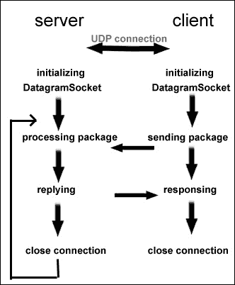

互联网协议套件包括许多其他协议，与 TCP 一起。其中之一是 **用户数据报协议**（**UDP**）。UDP 也是 TCP/IP 的 *传输层* 的核心成员。UDP 与 TCP 的主要区别在于 UDP 是 *无连接的*。这意味着数据单元以自识别信息传输，接收端对该信息没有先前的了解，不知道何时或如何接收。UDP 不会确保接收端点实际上可以接收该信息，因此在使用 UDP 时必须考虑这种风险。

由于 UDP 不使用连接，它本质上不是 *可靠的*，这也是它与基于连接的协议（如 TCP）的区别所在。TCP 允许在传输过程中进行错误检查和纠正，因为双方都了解对方，这是由于它们的 *连接*。

通过 UDP 和其他无连接协议发送的消息被称为*数据报*。UDP 和数据报仅在不需要错误检查和纠正或这些操作在应用层本身执行时才应使用。由于错误检查和纠正几乎总是任何应用程序的必要条件，因此在 UDP 中通常使用在应用层检查错误的应用程序类型模型。使用 UDP 的一些应用程序类型示例包括：

+   流媒体

+   **IP 语音**（**VoIP**）

+   大规模多人在线游戏

+   **域名系统**（**DNS**）

+   一些**虚拟专用网络**（**VPN**）系统

与 UDP 和无连接协议的最明显缺点是没有消息传递的保证，没有错误检查，因此也没有错误纠正。在用户自己与系统交互的应用程序中，这可能会成为一个主要缺点，因为大多数事件都是用户生成的。然而，在一个可能有数百或数千个用户相互交互的系统中，无连接协议允许应用程序免受错误纠正导致的延迟。一个大规模多人在线游戏就是一个很好的例子，其中可能需要在网络上持续传输数千甚至数百万条消息，但同时在保持带有错误检查和纠正的连接的情况下可靠地完成这一点是不可能的。

## SOAP

REST 经常被与**简单对象访问协议**（**SOAP**）相比较，尽管 SOAP 实际上是一个协议，而不是像 REST 那样的架构风格。比较的原因是因为两者都用于 Web 服务，在这个背景下，REST 等同于 HTTP，这是一个协议。尽管 SOAP 是一个协议，但它也与 HTTP 交互以传输消息以实现 Web 服务。它也可以通过 SMTP 使用。

SOAP 的消息格式是 XML。使用 SOAP 发送的 XML 消息被称为*信封*。SOAP 信封的结构遵循特定的模式，包括一个强制性的*主体*元素和一个可选的*头部*元素。主体还可以包括嵌套的*故障*结构，这些结构携带有关异常的信息。以下是一个 SOAP 消息的示例：

```js
<env:Envelope > 
<env:Header> 
    <n:shipping > 
      This is a shipping message 
    </n:shipping> 
  </env:Header> 
  <env:Body> 
    <env:Fault> 
      <env:Code> 
        <env:Value> 
          env:VersionMismatch 
        </env:Value> 
      </env:Code> 
      <env:Reason> 
        <env:Text xml:lang="en"> 
          versions do not match 
        </env:Text> 
      </env:Reason> 
    </env:Fault> 
  </env:Body> 
</env:Envelope> 

```

REST 也可以使用 XML 进行数据交换，但在现代 Web 应用程序中更常用 JSON。

## WebSockets

WebSockets 是一种允许 Web 浏览器和服务器之间进行交互式通信的协议。在这个上下文中，“交互式”一词意味着服务器可以在浏览器不需要定期*轮询*服务器以获取新数据的情况下向浏览器*推送*消息，这在使用 HTTP、AJAX 和 REST 的典型 Web 应用程序中可能会这样做。

你可能之前听说过*推送*技术。这种模式在许多智能手机应用中都很明显，它们会在新数据可用时立即将更新通知推送到手机上。这也被称为*实时数据*。HTTP 的局限性在于它不支持接收实时数据的开放连接。相反，HTTP 需要发起一个请求并打开一个连接或*套接字*，接收响应，下载信息，然后关闭连接。一旦新信息可用，如果没有定期向服务器请求数据，应用程序将不会意识到这一点，这种做法被称为*轮询*。

2011 年，WebSockets 被正式标准化并由现代网络浏览器支持。该协议允许通过使用*开放*套接字连接将数据从服务器传输到客户端，允许客户端随意请求数据，同时也允许服务器在实时中将数据推送到客户端：

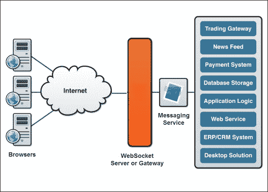

使用 REST 的 Web 应用程序受 HTTP 的开放/关闭连接约束限制。这对于许多不需要服务器响应的用户交互或可以实施定期服务器轮询而不需要太多开销的 Web 应用程序是有意义的。然而，对于那些想要向用户提供实时数据而不需要用户动作的 Web 应用程序，使用 WebSockets 可能更合适。

## MQTT

MQTT 最初代表**MQ 遥测传输**。它是一种设计用于 TCP/IP 或互联网协议套件之上的消息协议。MQTT 采用*发布-订阅*或 PubSub 的消息模式，其中事件或消息由发布者发布，可供任何数量的订阅者获取。在后续过程中，订阅者会从任何数量的发布者那里接收消息。在这个模式中，发布者对订阅者是完全不知情的。

与 SOAP 和 WebSockets 相比，MQTT 不是为在 HTTP 上使用 Web 服务而设计的，而是主要用于**机器到机器**（**M2M**）通信。MQTT 常用于卫星通信、家庭或**智能家居**自动化以及移动应用程序。MQTT 被认为是轻量级且代码占用空间小，非常适合可能使用较慢的无线移动网络连接的移动应用程序。

MQTT 中的“MQ”最初来源于 IBM 的**消息队列**（**MQ**）协议。然而，消息队列并不是 MQTT 的必要要求，这就是为什么它不再是一个真正的缩写，而只是被称为 MQTT。

MQTT 是**结构化信息标准推进组织**（**OASIS**）的一个标准。OASIS 是一个定义物联网和其他技术领域标准的组织。

任何实现 MQTT 的软件都被称为 MQTT 代理，它是一种消息代理架构模式，将应用程序发送的消息转换为接收者的专用格式，或者消息代理本身：

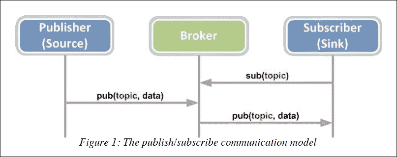

消息代理的目的是接收应用程序接收到的消息并对它们执行某种操作。例如，一些操作可能包括：

+   启动 Web 服务请求

+   将消息转发到其他目的地

+   将消息转换为另一种类型的表示，以便由另一个应用程序或端点消费

+   存储用于发布/订阅事件和响应的消息

+   记录和/或响应应用程序错误

有许多流行的消息代理应用程序和服务可用于单页应用程序中的消息交换。其中一些是 Mosquitto、CloudMQTT、IBM MessageSight 和 ActiveMQ。

## AMQP

**高级消息队列协议**（**AMQP**）与 MQTT 类似。它是一种用于消息代理的开放标准应用层协议。

对于现代 Web 应用程序来说，RabbitMQ 是最受欢迎的开源消息代理之一，它使用 AMQP。在类似 RabbitMQ 的 AMQP 架构中，消息由应用程序*产生*，然后*排队*或存储在 RabbitMQ 服务器中。在某种程度上，队列也是一个*缓冲区*，因为它可以存储任何数量的信息，直到需要时：

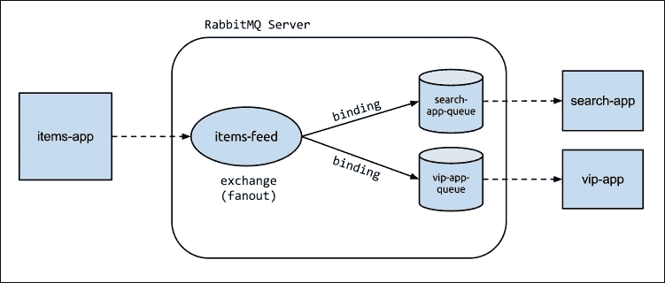

虽然 RabbitMQ 使用 AMQP，但它还包括 MQTT 的适配器。它还支持 HTTP 和**流文本导向消息协议**（**STOMP**）。RabbitMQ 是开源的，并且它还包括对其他协议的适配器，特别是 HTTP，这极大地促进了它今天的普及。

## CoAP

**受限应用协议**（**CoAP**）是一种为机器对机器通信设计的 Web 传输协议。CoAP 服务主要针对的机器是物联网设备。

CoAP 实际上与 HTTP 非常相似，并在其规范中采用 REST 架构风格。与 CoAP 的不同之处在于，它严格遵循 REST 原则，而 HTTP 仅支持 REST，但不强制要求。

由于 CoAP 使用 REST 架构风格，它实际上可以通过 HTTP 连接，因为与任何 RESTful 架构一样，客户端对其访问的 RESTful 服务器是无关的。在这种情况下，使用跨协议代理使 CoAP 服务对 HTTP 客户端可用：

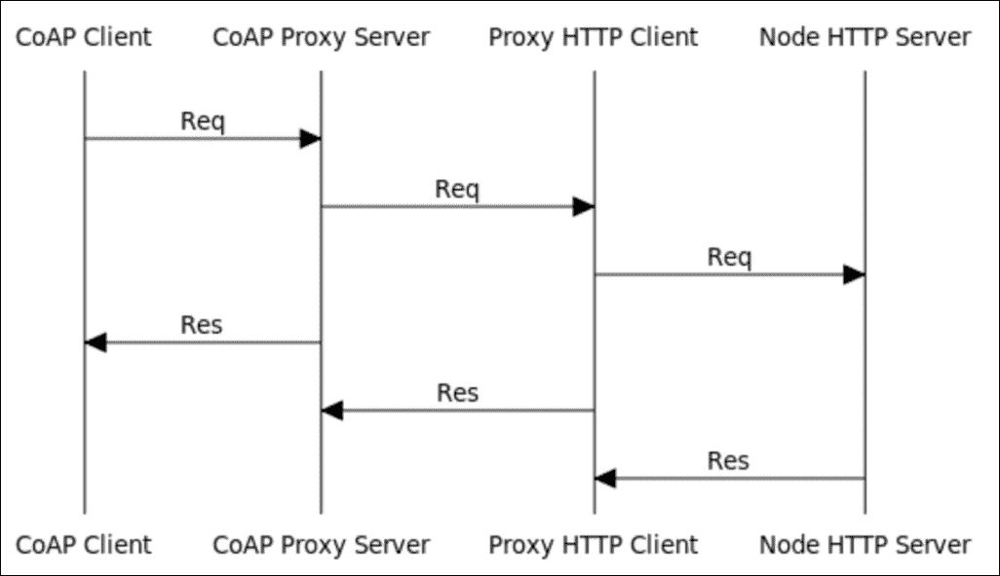

## DDP

**分布式数据协议**（**DDP**）虽然不太常用，但通过流行的 Meteor JavaScript 框架正在获得认可。DDP 是一种简单的协议，用于显式地从服务器检索表示，并在实时接收有关这些表示修改的更新。

DDP 允许 Meteor 应用程序使用 WebSocket 进行服务，为这些服务提供了一个无连接的框架。使用 JSON 数据，但与 RESTful 架构中明确请求不同，JSON 数据消息可以实时 *推送* 到应用程序。

DDP 最初是由 Meteor 的创始人为其开发的；然而，它并不仅限于 Meteor，也可以在其他框架中使用。Meteor 对 DDP 的实现完全用 JavaScript 编写，并且是开源的。

# 摘要

你现在已经学习了 REST 架构风格的基本方面，架构风格与协议之间的区别，REST 与 HTTP 协议之间的关系，以及 REST 的约束。你还学会了使用 Express 和 MongoDB 编写一些基本的 REST API 端点。对 REST 和单页应用程序后端有良好的理解对于成为一名熟练的 Web SPA 开发者至关重要。在下一章中，我们将把重点转向 SPA 开发的前端，学习一些关于 SPA UI 框架和最佳实践的知识，并将我们迄今为止所学的一切应用到视图层。
