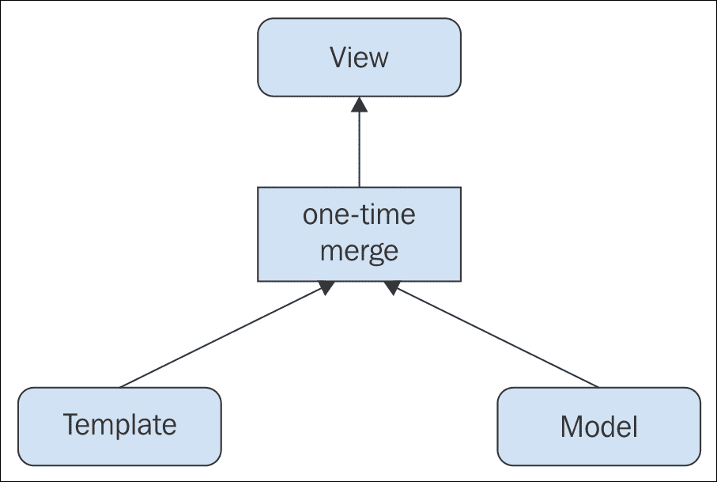
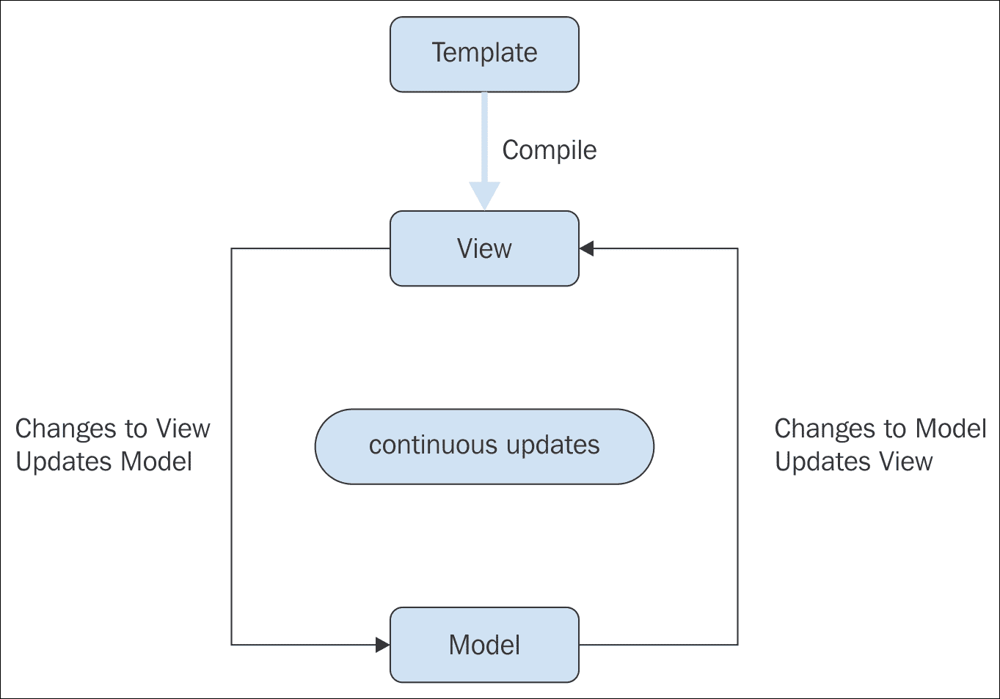

数据绑定，以及为什么你应该拥抱它

单页应用的视图层远远超出了通过 JavaScript 模板引擎或其他方式静态显示 HTML 和数据。一个现代的 JavaScript 应用必须处理实时更新并具有反应性。在第四章中描述的一些协议，如 WebSockets、MQPP 和 DDP，可以用来主动检索应用的数据更新，但将这些更改绑定到 DOM 并在视图中显示的能力必须在应用的前端处理。这就是数据绑定发挥作用的地方。

在本章中，你将学习：

+   什么是数据绑定？

+   单向和双向数据绑定的区别

+   AngularJS 的数据绑定实现

+   其他流行的数据绑定实现

+   如何使用原生 JavaScript 实现数据绑定？

+   数据绑定的某些用例是什么？

# 第六章：什么是数据绑定？

在高层次上，数据绑定是一种软件设计模式，它指定了将更改直接绑定到你的底层应用数据，或模型，到视图的能力，通过视觉上自动反映这些更改。这可以通过使用 JavaScript 的多种方式来完成，并且这实际上取决于你使用的 JavaScript 版本及其能力和限制。在 Web 应用的情况下，这些能力和限制当然是由用户的浏览器控制的，这也是为什么在 JavaScript 社区中有如此多的数据绑定实现。

如果你曾经使用过任何流行的 JavaScript 框架，或者至少阅读过关于它们的资料，你可能已经听说过数据绑定。你也可能从未尝试过自己实现它，考虑到现在有那么多库和框架提供了这种功能。这些实现中的一些给你带来的优势是通过在浏览器中使用多种方法和功能检测来提供跨浏览器兼容性。其他框架，如 Ember.js 和 Knockout.js，使用它们自己的专有数据绑定实现，这些实现可以在大多数浏览器中工作，但如果你只想使用数据绑定功能，可能需要加载一个可能很大的库。

使用库或框架进行复杂的数据观察通常比编写自定义 JavaScript 来自己实现更受欢迎，这也说明了 AngularJS 等框架的流行——它经常因其数据绑定功能而受到赞誉。利用这些功能是一回事，但理解它们是如何工作的以及框架底层发生了什么则是另一回事。首先，让我们更深入地分解一下数据绑定的概念。

## 单向数据绑定

单向，或单向，数据绑定是指应用程序数据模型的更改被更新，并随后反映在视图中。数据模型的初始更改可能来自任何地方，无论是当前用户提交表单，还是另一台计算机上不同用户的帖子编辑，或者是应用程序的主服务器直接推送的当前数据变化。当数据的变化自动与动态模板合并并在视图中更新，而不需要用户的干预时，这被称为单向数据绑定：



单向数据绑定通过将 ViewModel 与模板合并在视图中进行可视化。

在这里，你可以看到单向数据绑定设计模式的一个简单表示。视图更新的方式完全取决于应用程序的前端 JavaScript 编写方式，可以以任何数量的方式完成，但概念模式本身保持不变。

使用 JavaScript 模板引擎，如第五章中讨论的，*关于视图的一切*在编译模板中的表达式绑定到动态数据时，在模板级别提供单向数据绑定。然而，要更新视图以反映数据的实时变化，必须使用额外的代码来观察模型更改并相应地触发视图更新。

## 双向数据绑定

双向，或双向，数据绑定包括单向数据绑定模式，但还允许用户更改视图中数据的表示，并反映在底层的模型本身中。有了这种模式，视图中显示的数据始终是模型当前状态的表示，即使用户在视图中更改了这些数据，而没有通过表单或其他方式明确提交：



### 注意

双向数据绑定通过从 ViewModel 的更改合并到模板中在视图中进行可视化，并且用户对视图中数据表示的更改会合并回 ViewModel。

此图显示了双向数据绑定设计模式。为了使此模式工作，必须有一些类型的观察者持续监视数据的变化，并在两个方向上同步它。这自然需要一个更复杂的客户端架构，并且可以使用流行的框架，如 AngularJS，来掌握主动权。

# 使用现代 JavaScript 框架进行数据绑定

由于数据绑定设计模式带来的复杂性，有一些独立的 JavaScript 库，例如 Rivets.js 和 Knockout.js，可以为你提供这项功能。许多完整的 JavaScript 框架也包含它们自己的数据绑定实现，作为核心功能之一。

## 使用 AngularJS 进行数据绑定

由谷歌维护的 AngularJS 是现代 JavaScript 框架中最受欢迎的之一。正如在*第二章*中讨论的，*模型-视图-任意*是一个自诩的 MVW 框架。除了其 MVW 架构模式的实现外，它还包括一个强大的数据绑定设计模式，这通常是它最被吹嘘的功能。

### AngularJS 的单向数据绑定

当视图中的一个表达式被与该视图关联的控制器中的模型值填充时，就实现了 AngularJS 的单向数据绑定。考虑以下控制器和模型数据：

```js
var myApp = angular.module('myApp', []); 
myApp.controller('UserController', function UserController($scope) { 
    $scope.user = { 
        firstName: 'Peebo', 
        lastName: 'Sanderson' 
    }; 
}); 

```

在此控制器的作用域上定义的用户模型可以用以下模板标记在视图中表示：

```js
<body ng-app="myApp"> 
    <div ng-controller="UserController"> 
        <p> 
            <strong>First Name:</strong> {{user.firstName}}<br> 
            <strong>Last Name:</strong> {{user.lastName}} 
        </p> 
    </div> 
</body> 

```

就像许多其他 JavaScript 模板引擎一样，AngularJS 模板中使用双大括号语法来表示要评估的表达式。此外，AngularJS 允许在空 HTML 元素上使用 ng-bind 属性，以替代双大括号语法来表示表达式：

```js
<body ng-app="myApp"> 
    <div ng-controller="UserController"> 
        <p> 
            <strong>First Name:</strong> 
            <span ng-bind="user.firstName"></span><br> 
            <strong>Last Name:</strong> 
            <span ng-bind="user.lastName"></span> 
        </p> 
    </div> 
</body> 

```

这种语法更冗长，但可能对某些人来说更可取。在任何情况下，模型属性的更改都将自动更新到视图，这些属性通过它们各自的模板表达式绑定。这样，AngularJS 提供了底层 DOM 操作层，将模型更改与视图更新连接起来，而无需任何其他代码。

### AngularJS 的双向数据绑定

当视图中的可编辑值，如文本输入，被分配给当前控制器作用域的模型属性时，就实现了 AngularJS 的双向数据绑定。当用户更改该属性的值时，模型将自动更新，并且该更改将传播回视图，以任何绑定到该模型属性的任何表达式。

使用前一个示例中的控制器和模型，考虑以下模板标记：

```js
<body ng-app="myApp"> 
    <div ng-controller="UserController"> 
        <p> 
            <strong>First Name:</strong> {{user.firstName}}<br> 
            <strong>Last Name:</strong> {{user.lastName}} 
        </p> 
        <p> 
            <label> 
                <input type="text" ng-model="user.firstName"> 
            </label><br> 
            <label> 
                <input type="text" ng-model="user.lastName"> 
            </label> 
        </p> 
    </div> 
</body> 

```

文本输入被赋予 ng-model 属性，在视图最初加载时将模型属性作为值分配。当用户更改这些输入中的任何一个的值时，$scope.user 模型将被更新，然后该更改将在输入上方的段落块中反映出来，其中相同的属性通过它们各自的表达式绑定到 DOM。从这个视图中的变化到模型，再到视图的往返是双向数据绑定的一个简单示例。

### AngularJS 的脏检查

AngularJS 使用轮询方法来查找模型和视图之间的差异，这种方法被称为脏检查。这种检查是在定义的间隔内进行的，这被称为消化周期**。**对于每个消化周期，作用域通过注册监听器来注册特殊方法，称为观察者，以监视传递给它们的绑定表达式的变化：

```js
$scope.$watch(watchExpression, listener); 

```

如第二章所述，*模型-视图-Whatever* 中的 *作用域* 是一个 JavaScript 对象，它为视图中的变量表达式定义了模型上下文。观察者将绑定模型表达式与其先前值进行比较，如果其中任何一个被发现是 *脏的* 或不同的，则执行监听器回调，并将更改同步到视图。

AngularJS 允许根据您的需求在对象的多个深度级别上进行脏检查。为此提供了三种类型的观察，分别对应三个深度级别。这些级别提供了灵活的数据绑定功能，但深度越大，性能问题就越多。

#### 通过引用进行脏检查

AngularJS 中脏检查的标准方法是在绑定表达式的整个值改变为新值时进行观察。这被称为通过引用进行脏检查。如果表达式表示一个对象或数组，并且只对其属性或成员进行更改，则更改将不会被检测到。这是脏检查的最深层次，因此性能最佳。

例如，考虑一个具有多个属性的用户对象被应用于作用域：

```js
$scope.user = { 
    firstName: 'Peebo', 
    lastName: 'Sanderson', 
    age: 54 
}; 

```

现在可以绑定一个观察表达式，通过引用到对象的一个属性：

```js
$scope.$watch('user.firstName', listener); 
$scope.user.firstName = 'Udis'; 

```

由于 user.firstName 已更改，这将在后续的消化周期中被捕获，并将触发监听器函数。现在考虑相反的情况，我们观察用户对象本身：

```js
$scope.$watch('user', listener); 
$scope.user.lastName = 'Petroyka'; 
// The entire value of $scope.user has not changed 

```

在这种情况下，在更改 user.lastName 之后，观察者没有捕获到任何内容。这是因为观察者正在寻找用户对象本身的更改 - 而不是其单个属性：

```js
$scope.user = { 
    firstName: 'Udis', 
    lastName: 'Petroyka, 
    age: 82 
}; 
// The entire value of $scope.user has changed 

```

如果您要替换整个用户对象本身，观察者会发现值是 *脏的*，然后在下一个消化周期中调用监听器。

#### 通过集合内容进行脏检查

如果您需要观察对象或数组的浅层更改，AngularJS 提供了另一种观察方法，称为 `$watchCollection`。在这种情况下，*浅层* 意味着观察者只会对对象或数组的第一个级别的更改做出响应，`**- 深层**` 属性更改，或嵌套对象或数组的更改将不会被检测到。AngularJS 将此称为通过集合内容进行脏检查：

```js
$scope.$watchCollection(obj, listener); 

```

在这种情况下，从上一个示例中更改用户对象的属性将被观察者捕获并触发 `监听器`：

```js
$scope.$watchCollection('user', listener); 
$scope.user.firstName = 'Jarmond'; 
// A property of the object has changed 

```

通过集合内容进行脏检查的性能不如通过引用进行脏检查，因为必须在内存中保留被观察对象或数组的副本。

#### 通过值进行脏检查

AngularJS 还允许您观察对象或数组中任何嵌套数据的更改。这被称为通过值进行脏检查：

```js
$scope.$watch(watchExpression, listener, true); 

```

您可以使用`$watch`方法实现此监视方法，就像使用引用检查一样，但添加一个设置为 true 的第三个参数。此参数告诉监视器您是否想要检查对象相等性，它默认为 false。当监视器通过引用检查相等性时，它执行简单的`!==`条件。然而，当$watch 的第三个参数设置为 true 时，它使用内部 angular.equals 方法进行深度比较。

`angular.equals` 方法可以用来比较任何两个值，它支持值类型、正则表达式、对象和数组。如果被比较的属性是一个函数或其名称以 `$` 开头，它将被忽略。忽略函数的原因很明显，至于 `$` 前缀，可能是为了避免 AngularJS 内部功能被覆盖。

通过值进行脏检查是 AngularJS 中最全面的数据绑定形式，但同时也是性能最差的。这是因为必须将任何复杂对象或数组被比较的完整副本保留在内存中，就像通过集合内容进行脏检查一样，但除此之外，还必须在每个消化周期中对整个对象或数组进行深度遍历。为了在您的应用程序中保持内存效率，使用这种类型的数据绑定时应该格外小心。

#### 何时使用脏检查进行数据绑定

数据绑定的脏检查方法有其优点和缺点。AngularJS 向我们保证，只要您在一个视图中不进行数千次绑定，内存就不会成为问题。然而，缺点是，由于消化周期的延迟，模型的变化并不总是实时显示。如果您正在设计一个希望显示真正实时、双向数据绑定的应用程序，那么 AngularJS 可能不是您的解决方案。

## 使用 Ember.js 进行数据绑定

Ember.js 是一个流行的开源 JavaScript 框架，用于构建 Web 应用程序。它在提供的功能上与 AngularJS 相似，但在数据绑定方面采取了相当不同的方法。

Ember.js 运行一个内部循环，类似于 AngularJS 中的消化周期，称为`**运行循环**`。它不对绑定模型数据使用脏检查，但维护运行循环以执行其他内部功能，例如按特定顺序执行工作队列。在运行循环中安排操作的主要原因是提供内存管理和优化框架的效率。

Ember.js 使用属性访问器来提供数据绑定，这意味着它使用直接对象属性来获取和设置绑定模型的值。有了这种机制，它可以放弃脏检查来使用数据绑定。

### 计算属性

Ember.js 通过对象属性访问器内部使用计算属性来设置和获取值。这意味着属性被定义为执行某种类型操作以产生最终返回值的函数。为此，使用内部`Ember.Object.extend`方法扩展了原生的 JavaScript 对象类型，并使用`Ember.computed`方法返回计算属性：

```js
var User = Ember.Object.extend({ 
    firstName: null, 
    lastName: null, 
    fullName: Ember.computed('firstName', 'lastName', function() { 
        return `${this.get('firstName')} ${this.get('lastName')}`; 
    }) 
}); 

```

对于这个扩展的`User`对象，`firstName`和`lastName`属性是静态的，但`fullName`属性是通过传递给它的参数`'firstName'`和`'lastName'`字符串计算得出的。这告诉计算方法，扩展对象的这些属性将用于计算`fullName`返回的值。

现在，要访问`fullName`返回的值，必须首先使用静态的`firstName`和`lastName`属性创建一个新的`User`对象：

```js
var currentUser = User.create({ 
    firstName: 'Chappy', 
    lastName: 'Scrumdinger' 
}); 

```

一旦使用给定的`firstName`和`lastName`值创建了一个`currentUser`对象，就可以计算并返回`fullName`属性：

```js
currentUser.get('fullName'); // returns "Chappy Scrumdinger" 

```

这种扩展对象的约定有点冗长，但它允许 Ember.js 在内部处理计算属性，同时跟踪绑定对象，并在各种用户代理或浏览器之间规范化 JavaScript 的不一致性：

### Ember.js 通过对象属性访问器内部使用计算属性来设置和获取值。这意味着属性被定义为执行某种类型操作以产生最终返回值的函数。为此，使用内部`Ember.Object.extend`方法扩展了原生的 JavaScript 对象类型，并使用`Ember.computed`方法返回计算属性：

Ember.js 在其数据绑定实现中使用计算属性，这意味着可以直接使用属性访问器，并且不需要进行脏检查。对于单向绑定，你可以获取对象的属性，但不能设置它：

```js
var User = Ember.Object.create({ 
    firstName: null, 
    lastName: null, 
    nickName: Ember.computed.oneWay('firstName') 
}); 

```

在这个例子中，使用`Ember.computed.oneWay`方法将`nickName`属性作为一个*别名*应用于`firstName`属性的单一方向绑定：

```js
var currentUser = User.create({ 
    firstName: 'Peebo', 
    lastName: 'Sanderson' 
}); 

```

当创建一个新的`User`对象时，可以访问它的`nickName`属性：

```js
currentUser.get('nickName'); // returns "Peebo" 

```

由于这只是一个单向绑定，因此`nickName`属性不能用来设置别名的`firstName`属性：

```js
currentUser.set('nickName', 'Chappy'); 
currentUser.get('firstName'); // returns "Peebo" 

```

通常，你可能只需要在应用程序中返回绑定值，而不是从视图隐式设置它们。使用 Ember.js，可以使用`Ember.computed.oneWay`方法来实现这个目的，并将节省你额外的性能担忧。

### Ember.js 也通过计算属性提供双向数据绑定。

Ember.js 也通过计算属性提供双向数据绑定。这也使用了一个别名范式；然而，计算的双向别名允许获取和设置别名的属性：

```js
var User = Ember.Object.extend({ 
    firstName: null, 
    lastName: null, 
    nickName: Ember.computed.alias('firstName') 
}); 

```

在这种情况下，我们使用`Ember.computed.alias`方法通过计算`nickName`属性来为别名的`firstName`属性实现双向数据绑定：

```js
var currentUser = User.create({ 
    firstName: 'Udis', 
    lastName: 'Petroyka' 
}); 

```

当现在创建一个新的`User`对象时，可以通过`nickName`属性来设置和获取别名的`firstName`属性：

```js
currentUser.get('nickName'); // returns "Udis" 
currentUser.set('nickName', 'Peebo'); 
currentUser.get('firstName'); // returns "Peebo" 

```

现在，随着双向数据绑定，视图同步开始发挥作用。在这个场景中关于 Ember.js 有一点需要注意，尽管它不使用脏检查，但在模型值改变后，它不会立即更新绑定到模型上的值。属性访问器确实用于聚合绑定数据的更改，但它们只有在下一个运行循环时才会同步，就像 AngularJS 和其消化周期一样。在这方面，你可以推断出，与 Ember.js 相比，AngularJS 的数据绑定实际上并没有太大区别，并且在这方面的框架之间也没有任何优势。

请记住，这些框架中实现的内部循环机制是为了性能优化而设计的。在这种情况下，区别在于 AngularJS 使用其消化周期来检查绑定值的更改，以及其其他内部操作，而 Ember.js 总是知道其绑定值的更改，并且只使用其运行循环来同步它们。

很可能，每个框架都提供了一些相对于其他框架的优势，这取决于你正在构建的应用类型。在选择框架来构建应用时，始终了解这些内部机制非常重要，这样你就可以考虑它们可能对你特定用例的性能产生的影响。

## 使用 Rivets.js 的数据绑定

有时候，你可能希望使用更小、更模块化的库来构建一个单页应用（SPA），这些库为你提供特定的功能，而不是使用像 AngularJS 或 Ember.js 这样的完整前端框架。这可能是因为你正在构建一个不需要 MVW 架构模式复杂性的简单应用，或者你可能只是不想受框架约定的限制。

Rivets.js 是一个轻量级库，主要围绕数据绑定设计，尽管它提供了一些额外的功能，但它对你的应用架构几乎没有假设。在这方面，如果你只是想向模块化应用添加数据绑定层，它是一个不错的选择。

### 使用 Rivets.js 的一向数据绑定

Rivets.js 使用一个内部构造，称为 *绑定器*，来定义在绑定属性值发生变化时如何更新 DOM。该库提供了一系列内置绑定器，但也允许你定义自己的自定义绑定器。

在 Rivets.js 中，当绑定模型上的属性发生变化时，单向绑定器会更新 DOM。正如你所预期的单向场景一样，更新视图不会更新模型。

考虑以下对象：

```js
var dog = { 
    name: 'Belladonna', 
    favoriteThing: 'Snacks!' 
}; 

```

使用 Rivets.js 的绑定器语法，这些属性可以绑定到视图，如下所示：

```js
<h1 rv-text="dog.name"></h1> 
<p> 
    My favorite thing is:  
    <span rv-text="dog.favoriteThing"></span> 
</p> 

```

Rivets.js 使用`rv-`自定义属性前缀在 HTML 元素上定义不同类型绑定器的行为。`rv-`text 属性是一个内置绑定器，它将绑定值直接插入 DOM 中，就像任何 JavaScript 模板引擎可能做的那样。就此而言，还有一个使用单括号的表达式插值语法：

```js
<h1>{ dog.name }</h1> 
<p>My favorite thing is: { dog.favoriteThing }</p> 

```

使用这两个示例中的任何一个，视图将渲染以下 HTML：

```js
<h1>Belladonna</h1> 
<p>My favorite thing is: Snacks!</p 

```

更改绑定模型上的任何属性也会更新视图：

```js
dog.name = 'Zoe'; // binder in View is updated 
dog.favoriteThing = 'Barking!'; // binder in View is updated 

```

视图中渲染的 HTML 将反映这些更改：

```js
<h1>Zoe</h1> 
<p>My favorite thing is: Barking!</p> 

```

#### 定义您自己的单向绑定器

如果 Rivets.js 中预定义的许多绑定器都无法满足您的需求，您始终可以定义自己的：

```js
rivets.binders.size = function(el, val) { 
    el.style.fontSize = val; 
}; 

```

在此示例中，我们创建了一个名为 size 的绑定器，可以根据模型值动态更改元素的 CSS 字体大小属性：

```js
var dog = { 
    name: 'Belladonna', 
    favoriteThing: 'Snacks!', 
    size: '2rem' 
}; 

```

然后，可以在视图中如下使用自定义绑定器：

```js
<h1>{ dog.name }</h1> 
<p> 
    My favorite thing is: 
    <span rv-size="dog.size">{ dog.favoriteThing }</span> 
</p> 

```

这将使视图以`dog.favoriteThing`值显示，其字体大小是正文文本的两倍，正如在绑定的狗模型中定义的那样。

### 使用 Rivets.js 进行双向数据绑定

当模型通过同步视图中的绑定值更新时，Rivets.js 中的双向绑定器的行为与单向绑定器相同，但它们也会在视图中的绑定值被用户更改时更新模型。这种行为可能由表单输入或其他类型的事件触发，例如点击按钮。

Rivets.js 包含一些预定义的双向绑定器。正如您所期望的，它为最常见的用例提供支持——一个文本输入：

```js
<input type="text" rv-value="dog.name"> 

```

使用`rv-value`属性将模型属性绑定到输入元素将使用绑定模型的值预先填充该输入的值，并且当用户更改输入的值时，它也会更新模型值。

#### 定义您自己的双向绑定器

在 Rivets.js 中定义自定义的双向绑定器需要采取更明确的方法，与单向绑定器相比。这是因为您必须定义如何绑定和解除绑定到元素，以及当绑定值更改时运行的数据绑定例程：

```js
rivets.binders.validate = { 
    bind: function(el) { 
        adapter = this.config.adapters[this.key.interface]; 
        model = this.model; 
        keypath = this.keypath; 

        this.callback = function() { 
            value = adapter.read(model, keypath); 
            adapter.publish(model, keypath, !value); 
        } 

        $(el).on('focus', this.callback); 
    }, 

    unbind: function(el) { 
        $(el).off('blur', this.callback); 
    }, 

    routine: function(el, value) { 
        $(el)value ? 'removeClass' : 'addClass'; 
    } 
}; 

```

使用此示例中显示的特殊属性定义，我们正在告诉 Rivets.js 绑定到`onfocus`输入，并在`onblur`输入时解除绑定。此外，我们定义了一个在值更改时运行的例程，当值为空时，向输入添加`className`为 invalid，当值被填充时移除。

# 使用原生 JavaScript 实现数据绑定

使用原生 JavaScript 编写自己的数据绑定实现可以相当容易地完成。如果您不需要为您的应用程序使用全面的框架或库，并且只想利用数据绑定设计模式的好处，使用原生 JavaScript 来实现它是合乎逻辑的选择。这将为您带来以下好处：

+   您将了解数据绑定实际上是如何在底层工作的

+   你将拥有一个更精简的前端，它不包括你可能甚至没有使用的额外库代码。

+   当你只想要数据绑定的额外好处时，你不会局限于由特定框架定义的架构。

## 对象获取器和设置器

JavaScript 中的`Object`类型具有原生的`get`和`set`属性，可以用作特定对象上任何属性名的`getter`和`setter`。`getter`是一个返回对象动态计算值的函数，而`setter`是一个用于将值传递给对象上给定属性的函数，就像你正在分配该值一样。当定义了设置器并传递了值时，该设置器的属性名本身实际上不能持有值；然而，它可以用来在完全不同的变量上`设置`值。

`get`和`set`属性默认为`undefined`，就像对象上的任何未分配属性一样，因此它们可以很容易地定义为任何用户定义对象的函数，而不会影响 JavaScript 的本地`Object`原型。当在直观的设计模式（如数据绑定）中适当使用时，这可以是一个强大的工具。

### 对象初始化器

可以使用对象初始化器为对象定义`getter`和`setter`，这通常是通过使用字面量表示法定义对象来完成的。例如，假设我们想在名为`user`的对象上为`firstName`属性创建一个`getter`和一个`setter`：

```js
var firstName = 'Udis'; 
var user = { 
    get firstName() { 
        return firstName; 
    }, 
    set firstName(val) { 
        firstName = val; 
    } 
}; 

```

在这个例子中，我们可以通过简单地使用标准对象字面量语法来使用`user.firstName`属性通过`get`和`set``firstName`变量的值：

```js
console.log(user.firstName); // Returns "Udis" 
user.firstName = 'Jarmond'; 
console.log(user.firstName); // Returns "Jarmond" 
console.log(firstName); // Returns "Jarmond" 

```

在这个例子中，设置`user.firstName = 'Jarmond'`实际上并没有改变`user.firstName`属性的值；相反，它调用了属性定义的设置器方法，并设置了独立的`firstName`变量的值。

### `Object.defineProperty()`方法

有时你可能想要修改现有的对象，以便在你的应用程序中为该对象提供数据绑定。为此，可以使用`Object.defineProperty()`方法向预定义对象添加特定属性的`getter`和`setter`：

```js
var user = {}; 
Object.defineProperty(user, 'firstName', { 
    get: function() { 
        return firstName; 
    } 
    set: function(val) { 
        firstName = val; 
    }, 
    configurable: true, 
    enumerable: true 
}); 

```

此方法将你想要定义属性的的对象作为第一个参数，你正在定义的属性名作为第二个参数，以及一个`descriptor`对象作为第三个参数。`descriptor`对象允许你使用`get`和`set`键名来定义属性的`getter`和`setter`，并且它还允许一些其他键来进一步描述属性。

如果`configurable`键为`true`，则允许更改属性的配置以及删除属性本身。它默认为`false`。如果`enumerable`键为`true`，则允许在遍历父对象时使属性可见。它也默认为`false`。

使用`Object.defineProperty()`是一种更简洁的方式来声明对象的属性`getter`和`setter`，因为你可以明确配置该属性的行为，同时还能将属性添加到预定义的对象中。

### 设计 getter 和 setter 数据绑定模式

现在，我们可以通过创建一个 DOM 元素和我们已经定义了`getter`和`setter`的`user`对象之间的双向绑定来进一步扩展这个例子。让我们考虑一个文本输入元素，它在页面加载时预先填充了`firstName`值：

```js
<input type="text" name="firstName" value="Jarmond"> 

```

现在，我们可以根据这个输入的值来定义我们的`getter`和`setter`，以便在模型和视图之间建立响应式绑定：

```js
var firstName = document.querySelector('input[name="firstName"]'); 
var user = {}; 
Object.defineProperty(user, 'firstName', { 
    get: function() { 
        return firstName.value; 
    }, 
    set: function(val) { 
       firstName.value = val; 
    }, 
    configurable: true, 
    enumerable: true 
}); 

```

如果你创建一个包含输入元素的页面并运行上面的代码，然后你可以使用浏览器中的开发者控制台设置`user.firstName`的值，并看到它自动更新 DOM 中输入元素的值：

```js
user.firstName = 'Chappy'; 

```

此外，如果你在文本输入中更改了值，然后在开发者控制台中检查`user.firstName`属性的值，你会看到它反映了输入的更改值。通过这种简单的`getter`和`setter`的使用，你已经在架构上实现了使用原生 JavaScript 的双向数据绑定。

#### 同步视图中的数据

为了进一步扩展这个例子，使得模型在视图中的表示始终保持同步，并且工作方式类似于 Rivets.js 数据绑定模式，我们只需简单地给我们的输入添加一个 oninput 事件回调来以期望的方式更新 DOM：

```js
firstName.oninput = function() { 
    user.firstName = user.firstName; 
}; 

```

现在，如果我们希望当这个输入框的值发生变化时，DOM 中其他表示这些数据的地方也能更新，我们只需要将所需的行为添加到该属性的 setter 中。让我们使用一个自定义的 HTML 属性`data-bind`来传达属性在 DOM 中的表示，而不仅仅是文本输入本身。

首先，创建一个包含以下 HTML 的静态文件：

```js
<p> 
    <label> 
        First name:  
        <input type="text" name="firstName" value="Udis"> 
    </label> 
</p> 

```

然后，在 HTML 下方，就在文档的`</body>`标签关闭之前，在`<script>`标签内添加以下 JavaScript 代码：

```js
var firstName = document.querySelector('input[name="firstName"]'); 
var user = {}; 
Object.defineProperty(user, 'firstName', { 
    get: function() { 
        return firstName.value; 
    }, 
    set: function(val) { 
        var list = document.querySelectorAll( 
            '[data-bind="firstName"]' 
        ), i; 
        for (i = 0; i < list.length; i++) { 
            list[i].innerHTML = val; 
        } 
        firstName.value = val; 
    }, 
    configurable: true, 
    enumerable: true 
}); 
user.firstName = user.firstName; 
firstName.oninput = function() { 
    user.firstName = user.firstName; 
}; 

```

现在，在浏览器中加载页面，并观察`<strong data-bind="firstName">`元素将根据输入的值填充为`Udis`。这是通过调用`user.firstName`属性的 setter 并把它赋给相应的`getter`作为`user.firstName = user.firstName`来实现的。这看起来可能有些冗余，但实际上，这里正在执行的是 setter 方法中定义的代码，并使用从`getter`获取的给定值。setter 会在页面上查找任何设置了`data-bind`属性为`firstName`的元素，并使用输入中的`firstName`值更新该元素的内容，该值在模型中表示为`user.firstName`。

接下来，将光标放在文本输入中并更改值。注意，随着你输入，`<strong>` 元素中代表的名字会改变，每个表示都与模型保持同步。最后，使用你的开发者控制台更新模型的值：

```js
user.firstName = 'Peebo'; 

```

注意到文本输入和 `<strong>` 元素中的表示都是自动更新并同步的。你已经成功使用少量原生 JavaScript 创建了一个双向数据绑定和视图同步设计模式。

#### 将设计模式抽象为可重用方法

你可以通过创建一个方法来进一步抽象你的数据绑定设计模式，该方法可以用于将此行为应用于任何预定义对象的属性：

```js
function dataBind(obj, prop) { 
    var input = document.querySelector('[name="' + prop + '"]'); 
    input.value = obj[prop] || input.value; 
    Object.defineProperty(obj, prop, { 
        get: function() { 
            return input.value; 
        }, 
        set: function(val) { 
            var list = document.querySelectorAll( 
                '[data-bind="' + prop + '"]' 
            ), i; 
            for (i = 0; i < list.length; i++) { 
                list[i].innerHTML = val; 
            } 
            input.value = val; 
        }, 
        configurable: true, 
        enumerable: true 
    }); 
    obj[prop] = obj[prop]; 
    input.oninput = function() { 
        obj[prop] = obj[prop]; 
    }; 
} 

```

在这里，我们创建了一个名为 `dataBind` 的方法，它接受一个对象和一个属性作为参数。属性名称用作 DOM 中要绑定到模型的元素的标识符：

```js
// For the input 
var input = document.querySelector('[name="' + prop + '"]'); 
// For other elements 
var list = document.querySelectorAll('[data-bind="' + prop + '"]'); 

```

接下来，只需定义一个对象，并在其上调用 `dataBind` 方法，此外还需要传入要绑定到 DOM 的属性名称。此方法还允许你在模型中设置属性的初始值，如果设置了，它将在绑定时反映在视图上。如果没有设置，它将显示输入本身设置的值（如果有的话）：

```js
var user = {}; 
user.firstName = 'Peebo'; 
dataBind(user, 'firstName'); 

```

如果你修改你刚刚创建的页面中的代码以使用抽象的 `dataBind` 方法，你会发现它的工作方式与之前完全相同，但现在它可以被重用来绑定 DOM 中多个相应元素与多个对象属性。这种模式当然可以进一步抽象化，并与建模模式结合，在其中它可以作为一个强大的数据绑定层在 JavaScript SPA 中使用。开源库 inbound.js 是这种模式提升到更高层次的优秀例子。你可以在 [inboundjs.com](http://inboundjs.com) 上了解更多信息。

## 考虑 DOM 变化

之前例子中，在视图同步方面的一个缺点是，只有用户输入会触发从视图设置模型。如果你想要全面的、双向的数据绑定，其中视图中绑定值的任何更改都会同步到相应的模型属性，那么你必须能够通过任何方式观察 DOM 变化或更改。

让我们再次看看之前的例子：

```js
var user = {}; 
user.firstName = 'Peebo'; 
dataBind(user, 'firstName'); 

```

现在，如果你编辑文本输入的值，模型上的 `firstName` 属性将更新，并且 `<strong data-bind="firstName">` 元素的 内容也将更新：

```js
<input type="text" name="firstName" value="Jarmond"> 

console.log(user.firstName); // returns "Jarmond" 

```

现在让我们改用开发者控制台并更改 `<strong data-bind="firstName">` 元素的 `innerHTML`：

```js
document.querySelector('strong[data-bind="firstName"]') 
    .innerHTML = 'Udis'; 

```

完成这些操作后，你会注意到输入的值没有更新，模型数据也没有更新：

```js
console.log(user.firstName); // returns "Jarmond" 

```

你通过控制台创建的 DOM 变化现在破坏了你的双向数据绑定和视图同步。幸运的是，有一个原生的 JavaScript 构造函数可以用来避免这个陷阱。

### MutationObserver

`MutationObserver`构造函数提供了观察 DOM 变更的能力，无论这些变更是从哪里触发的。在大多数情况下，用户输入可能足以触发模型更新，但如果你正在构建一个可能由其他来源（如通过 Websockets 推送的数据）触发的 DOM 变更的应用程序，你可能希望将这些变更同步回你的模型。

MutationObserver 通过提供一个特殊类型的监听器，在 DOM 变更时触发回调，其工作方式与原生的 addEventListener 类似。这种事件类型是独特的，因为它通常不会由直接的用户交互触发，除非开发者控制台被用来操作 DOM。相反，通常是应用程序代码在更新 DOM，而这个事件是由这些变更直接触发的。

一个简单的`MutationObserver`可以如下实例化：

```js
var observer = new MutationObserver(function(mutations) { 
  mutations.forEach(function(mutation) { 
    console.log(mutation); 
  });     
});  

```

接下来，必须定义一个配置来传递给新观察者对象的`observe`方法：

```js
    var config = { 
        attributes: true, 
        childList: true, 
        characterData: true 
    }; 

```

这个对象被称为`MutationObserverInit`。它定义了特殊属性，这些属性被`MutationObserver`实现用来指定元素应该被观察得多紧密。至少需要将`attributes`、`childList`或`characterData`中的一个设置为 true，否则将抛出错误：

+   `attributes`：告诉观察者是否应该观察元素属性的变更。

+   `childList`：告诉观察者是否应该观察元素子节点的添加和删除。

+   `characterData`：告诉观察者是否应该观察元素数据的变更。

此外，还可以定义四个额外的、但可选的`MutationObserverInit`属性：

+   `subtree`：如果为 true，告诉观察者除了元素本身外，还要观察元素后代的变更。

+   `attributeOldValue`：如果与属性设置为 true 一起为 true，告诉观察者在变更之前保存元素属性的老值。

+   `characterDataOldValue`：如果与`characterData`设置为 true 一起为 true，告诉观察者在变更之前保存元素的老数据值。

+   `attributeFilter`：一个数组，指定了不应与设置为 true 的属性一起观察的属性名称。

配置定义后，现在可以在一个 DOM 元素上调用观察者：

```js
var elem = document.querySelector('[data-bind="firstName"]'); 
observer.observe(elem, config); 

```

在此代码到位后，任何对具有属性`data-bind="firstName"`的元素的变更都将触发在观察者对象的`MutationObserver`构造函数实例化中定义的回调，并且它将记录传递给迭代器的变更对象。

#### 使用 MutationObserver 扩展 dataBind

现在让我们通过使用`MutationObserver`构造函数来触发具有 data-bind 属性的元素变更时的回调，进一步扩展我们的`dataBind`方法：

```js
function dataBind(obj, prop) { 
    var input = document.querySelector('[name="' + prop + '"]'); 
    var observer = new MutationObserver(function(mutations) { 
        mutations.forEach(function(mutation) { 
            var val = mutation.target.innerHTML; 
            if (obj[prop] !== val) { 
                console.log( 
                    'Inequality detected: "' +  
                    obj[prop] + '" !== "' + val + '"' 
                ); 
                obj[prop] = mutation.target.innerHTML; 
            } 
        }); 
    }); 
    var config = { 
        attributes: true, 
        childList: true, 
        characterData: true 
    }; 
    var list = document.querySelectorAll( 
        '[data-bind="' + prop + '"]' 
    ), i; 
    for (i = 0; i < list.length; i++) { 
        observer.observe(list[i], config); 
    } 
    input.value = obj[prop] || input.value; 
    Object.defineProperty(obj, prop, { 
        get: function() { 
            return input.value; 
        }, 
        set: function(val) { 
            var list = document.querySelectorAll( 
                '[data-bind="' + prop + '"]' 
            ), i; 
            for (i = 0; i < list.length; i++) { 
                list[i].innerHTML = val; 
            } 
            input.value = val; 
        }, 
        configurable: true, 
        enumerable: true 
    }); 
    obj[prop] = obj[prop]; 
    input.oninput = function() { 
        obj[prop] = obj[prop]; 
    }; 
} 

```

`MutationObserver`构造函数仅接受一个回调函数作为其唯一参数。此回调函数传递一个突变对象，可以遍历以定义每个突变的回调：

```js
var observer = new MutationObserver(function(mutations) { 
    mutations.forEach(function(mutation) { 
        var val = mutation.target.innerHTML; 
        if (obj[prop] !== val) { 
            console.log( 
                'Inequality detected: "' +  
                obj[prop] + '" !== "' + val + '"' 
            ); 
            obj[prop] = mutation.target.innerHTML; 
        } 
    }); 
}); 

```

注意，在`MutationObserver`实例化回调中，我们在设置模型属性之前，对绑定模型属性与`mutation.target.innerHTML`进行不等式比较，后者是被观察的 DOM 元素的内容。这是很重要的，因为它确保我们只在直接触发此特定 DOM 节点的 DOM 突变时设置绑定的模型属性，而不是作为设置器的结果。如果我们不执行此检查，所有设置器都会触发回调，这会再次调用设置器，从而导致无限递归。这当然是不希望的。

使用`dataBind`方法的新版本，在浏览器中再次测试 HTML 页面并更新输入值：

```js
<input type="text" name="firstName" value="Chappy"> 

console.log(user.firstName); // returns "Chappy" 

```

接下来，使用开发者控制台更改绑定的模型属性，你将看到它在 DOM 中的输入和`<strong data-bind="firstName">`元素中更新，正如预期的那样：

```js
user.firstName = 'Peebo'; 

```

最后，使用开发者控制台更改`<strong data-bind="firstName">`元素的`innerHTML`并触发一个突变事件：

```js
document.querySelector('strong[data-bind="firstName"]') 
    .innerHTML = 'Udis'; 

```

这次，你将看到输入元素的值也会更新。这是因为突变事件被观察对象触发并检测到，然后触发了回调函数。在回调函数内部，进行了`obj[prop] !== val`的比较，并发现为真，因此对新值调用了设置器，随后更新了输入值和从`user.firstName`属性返回的值：

```js
console.log(user.firstName); // returns "Udis" 

```

你现在已经实现了双向数据绑定和全面视图同步，使用了原生的`getters`和`setters`以及`MutationObserver`构造函数。请记住，这里给出的示例是实验性的，尚未在实际应用中使用。在您的应用中采用这些技术时应谨慎行事，并且测试应该是首要的。

# 为什么使用数据绑定？

数据绑定提供了一层抽象，可以消除大量额外应用连接、自定义事件发布和订阅以及模型对视图的评估的需求。当不使用框架或某种类型的数据绑定时，这些通常由针对应用本身特定的自定义应用代码处理。如果没有仔细规划和使用定义的架构模式，这可能会导致大量辅助代码，进而导致代码库不可扩展、扩展性不好，并且对新开发者来说难以接受和学习。

如果你认为数据绑定是你想要包含在应用中的组件，那么考虑你的选择，其中一些我们已经在这里列出，并据此选择。你可能需要使用像 AngularJS 这样的完整 JavaScript 框架来构建你的应用，或者你可能只想结合你自己的定制架构使用数据绑定的附加抽象层。同时，考虑你选择带来的性能影响，以及你是否需要双向数据绑定，它更占用内存，或者只需要单向数据绑定，这有助于保持你的应用性能更优。

## 单向数据绑定的用例

在现代单页应用中最常见的绑定形式是单向数据绑定。在最基本的情况下，单向数据绑定只需要在渲染时将动态模型值绑定到模板中相应的表达式。如果模型在模板已经渲染后发生变化，将数据同步到视图是某些框架（如 AngularJS、Ember.js 和 Rivets.js）的附加好处。

如果你正在构建一个需要向用户显示实时、频繁变化的数据的应用，并且这些数据不需要被用户操作，这是一个使用带有视图同步的单向数据绑定的好例子。一个更具体的例子是跟踪股票报价并实时显示价格变化的应用。在这种情况下，模型数据完全是供用户查看的，但由于股票报价不能被用户更改，因此从视图到模型不需要任何更改。在这种情况下，双向数据绑定监听器将没有用，只会产生额外的和不必要的工作量。

## 双向数据绑定的用例

在单页应用中，双向数据绑定不像单向数据绑定那样常用，但它确实有其位置。在决定将双向数据绑定行为附加到 DOM 并使用额外内存之前，完全理解你应用的需求是很重要的。

在线聊天或实时消息应用是双向数据绑定最常见的例子之一。无论应用提供的是一对一消息还是多用户消息，双向数据绑定都可以用于同步每个用户的视图，实现双向同步。当用户查看应用时，其他用户的新消息会被添加到模型中，并在视图中显示。同样，查看应用的用户在视图中输入新消息，这些消息会被添加到模型中，下载到服务器，然后显示给其他用户在自己的视图中。

# 摘要

你现在已经学会了什么是数据绑定，单向数据绑定和双向数据绑定的区别，数据绑定在现代 JavaScript 框架和库中的实现方式，以及数据绑定在现实世界中的某些用例。你还了解了单向和双向数据绑定实现之间的架构差异，以及如何使用现代原生 JavaScript 中的获取器和设置器来编写自己的数据绑定实现。此外，你还学习了 `MutationObserver` 构造函数及其如何根据突变事件在 DOM 中触发行为。

接下来，我们将把迄今为止关于不同架构组件所学的所有知识，包括 MongoDB、Express、AngularJS 和 Node.js，结合起来学习如何开始将它们全部整合起来，以充分利用 MEAN 全栈。
