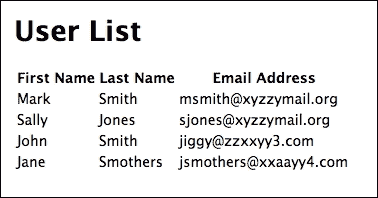

使用 MongoDB 管理数据

MongoDB 是 MEAN 栈的数据库，我们已经探索了一些其更基本的功能。它是一个功能强大、可扩展的 NoSQL 数据库，因其在大数据和 Web 应用中的广泛流行而受到青睐。它恰好是开源的，并且支持广泛的操作系统和平台。

MongoDB 可以通过 MongoDB shell 访问，这是一个使用类似 JavaScript 语法的命令行界面。

在本章中，我们将更深入地探索 MongoDB，并将其开始整合到我们的 SPA 中。你将探索 MongoDB shell 中的各种 CRUD 操作，以及使用 Node.js 插件来访问单页应用内的数据库。

我们将涵盖以下主题：

+   NoSQL 数据库

+   使用 shell 命令操作 MongoDB

+   将 MongoDB 整合到 SPA 中

+   MongoDB 性能

# 第八章：探索 NoSQL 数据库模型

MongoDB 是众多 NoSQL 数据库之一。目前，根据那些关注数据库的人收集的统计数据，它恰好是使用中最受欢迎的 NoSQL 数据库。基于 SQL 的关系型数据库已经为我们服务了几十年，那么 NoSQL 究竟有什么大不了的？

## 定义 NoSQL

MongoDB 通常被称为 NoSQL 数据库。NoSQL 是一个流行的术语，适用于 MongoDB 和其他几个数据库引擎。但这是什么意思呢？

首先，没有一个权威机构对 NoSQL 的定义有标准定义。这个术语最早在 1998 年由 Carlo Strozzi 提出，用来描述一个没有 SQL 界面的开源关系型数据库。然而，今天这个术语的使用有所不同。NoSQL 数据库通常有两个定义特征。

### NoSQL

如其名所示，大多数 NoSQL 数据库不使用 SQL 来访问数据库。然而，也有一些 NoSQL 数据库允许使用类似 SQL 或从 SQL 派生的语言。因此，有些人将 NoSQL 理解为“不仅限于 SQL”。

MongoDB 数据库通常通过类似 JavaScript 的语法访问。

### 非关系型

NoSQL 数据库不使用关系模型，其中数据存储在结构化的列或行表格中。在 MongoDB 的情况下，数据作为文档存储在集合中。

在关系型数据库中，数据存储在表格中，就像电子表格中的表格一样。

### 分布式

MongoDB 和其他 NoSQL 数据库被设计为分布式，以便在集群中良好工作。这使得在云中托管多个服务器上的 NoSQL 数据库变得更容易，并提供了安全性、备份、性能和扩展性。

MongoDB 支持分片。分片是一个将数据库的部分托管在不同的服务器上的过程。这使得 MongoDB 非常快，并且具有高度的可扩展性。

尽管这超出了本书的范围，但 MongoDB 的分布式特性使其对大数据项目具有吸引力。当然，它使 MongoDB 成为 Web 应用的诱人解决方案，这也是它目前最流行的用途。

## MongoDB 的特点

Mongo 有一些你应该知道的功能，这些功能使其与其他数据库不同。它们如下所述。

### 文档模型

NoSQL 数据库使用了多种模型。其中一些包括图模型、键值模型、对象模型等。这些其他模型超出了本书的范围。

MongoDB 使用文档模型。数据存储在 MongoDB 数据库中文档的集合中。

这里是一个 MongoDB 文档的例子：

```js
{  
"_id" : ObjectId("566d9d4c1c09d090fd36ba82"), 
"name" : "John",  
"address" : {  
"street" : "77 Main street",  
"city" : "Springfield" }  
} 

```

如你所见，MongoDB 中的文档是 JSON 的一种形式。在这种情况下，文档甚至包含一个子文档，即地址。

数据库本身以二进制编码文档，并以称为 BSON 的形式存储。不过，不用担心，你不需要自己关心编码或解码任何数据，这一切都是在幕后处理的。

JSON 和 BSON 之间的一大区别是 BSON 支持许多 JSON 不支持的数据类型。这包括二进制数据、正则表达式、符号、日期等。例如，日期在 JSON 输出中可能被表示为一个简单的字符串。然而，将日期作为日期类型存储在 BSON 中，允许在查询或插入时进行有效的日期比较和操作。

在大多数情况下，这并不是你需要担心的事情。MongoDB 将无缝地将数据转换为可用的 JSON。然而，当我们到达 Mongoose 时，数据验证将成为一个重要的特性，将由中间件处理。

### 无模式

MongoDB 的一个特性，以及一些其他 NoSQL 数据库的特性是，它没有固定的模式。

在 MongoDB 中，文档存储在称为*集合*的组中。存储在集合中的文档在概念上应该是相关的，但数据库软件本身并没有强制执行这一点的限制。这与那些严格定义可以输入到表中的数据的数据库形成鲜明对比。

这里存在一个风险，即随机文档可以放入任何集合，使得集合的组织变得没有意义。你可以在名为 pets 的集合中插入反映汽车数据的文档，但这并没有太多意义，并且可能使该集合中的数据难以进行有意义的查询。

这值得深思。

### 开源

MongoDB 是一个开源数据库。服务器本身、驱动程序、工具和文档都适用多种不同的许可证。

MongoDB 的完整许可信息可在[`www.mongodb.org/licensing`](https://www.mongodb.org/licensing)找到。

## 为什么使用 MongoDB？

你可以选择许多数据库来构建一个单页 Web 应用程序。例如，MySQL 是 Web 应用程序中流行的数据库。你为什么想要选择 MongoDB 而不是 MySQL 之类的数据库呢？

最终，几乎任何数据库都能完成这项工作，但 MongoDB 中的一些特性使其特别适合用于单页应用程序（SPAs）。

### 支持良好

MongoDB 在多个操作系统和平台上享有广泛的支持。MongoDB 提供了 Windows、多种 Linux 版本、Mac 和 Solaris 的下载和安装程序。

在云端运行 MongoDB 的流行方式之一是在 **平台即服务**（**PaaS**）上。PaaS 是一种服务，通常由亚马逊等供应商提供，允许开发者在云中构建 Web 应用程序，而无需管理基础设施的麻烦。MongoDB 维护了一个支持平台列表，可在 [`docs.mongodb.org/ecosystem/platforms/`](https://docs.mongodb.org/ecosystem/platforms/) 查找。

MongoDB 在许多流行的编程语言中得到支持。快速浏览 MongoDB 的驱动程序页面 [`docs.mongodb.org/ecosystem/drivers/`](https://docs.mongodb.org/ecosystem/drivers/) 可以看到，截至本书编写时，MongoDB 已经支持 C、C++、C#、Java、Node.js、Perl、PHP、Python、Motor、Ruby 和 Scala 的驱动程序。此外，社区支持的 Go 和 Erlang 驱动程序无疑也将很快推出。

### 数据模型

由于 MongoDB 的数据模型基于 JSON，因此它非常适合用于 Web 应用程序。JSON 输出可以直接通过前端 JavaScript 和 AngularJs 等 JavaScript 框架进行消费。

由于 JSON 是一种面向对象的数据格式，因此数据与自身也是面向对象的编程语言配合得很好。数据结构可以在你编写的软件中非常容易地进行建模。

### 受欢迎度

作为一名开发者，你使用的工具的受欢迎程度相对重要。一方面，不受欢迎的框架不会像受欢迎的框架那样得到开发社区的注意。使用流行的开源工具可以确保有活跃的开发正在进行。

这包括书籍和学习资源、平台可用性和语言支持等方面。

受欢迎度也可以是质量的一个指标，至少可以表明它适合流行的应用程序类型。MongoDB 在 **大数据** 领域非常受欢迎，在那里非结构化数据是日常运营的基础。然而，MongoDB 在一些最受欢迎的 Web 应用程序类型——如 CMS 和地理空间数据——方面表现得尤为出色。

MongoDB 非常受欢迎。根据 MongoDB 2015 年的新闻稿（[`www.mongodb.com/press/mongodb-overtakes-postgresql-4-most-popular-dbms-db-engines-ranking`](https://www.mongodb.com/press/mongodb-overtakes-postgresql-4-most-popular-dbms-db-engines-ranking)），MongoDB 已经超越了 PostgreSQL，成为第四大最受欢迎的数据库。根据该新闻稿，当时它是前五名中唯一的非关系型数据库。同样，根据该新闻稿，MongoDB 在过去两年中的受欢迎程度增长了超过 160%。

MongoDB 正在越来越多地被用于比许多其他数据库更广泛的地方。所有迹象都表明，它将长期存在，并在所有最受欢迎的平台上得到支持。

# 掌握 MongoDB

MongoDB 附带一个交互式 shell，我们在上一章中已经简要使用过。为了刷新你的记忆，在通过输入`mongod`启动 MongoDB 守护进程后，你可以在单独的终端窗口中通过输入`mongo`来访问 shell。

主要，你将通过在应用程序中使用本地代码来访问 MongoDB。然而，了解 MongoDB shell 对于使用它是无价的。有时你将需要直接访问 shell，特别是进行调试。你可能还需要管理云中的 MongoDB 实例。

你应该很好地掌握 MongoDB shell。

## 获取信息

在 MongoDB shell 中，你可以做的一件最重要的事情是管理你的数据库。使用 shell 命令从 MongoDB 中获取元信息是最容易的。以下是一些你可以在 MongoDB shell 中使用的基本命令，以获取信息。

`help` - 这将输出 MongoDB shell 中可用的基本命令列表。对于操作数据库的方法的帮助，你将使用`db.help()`方法。在 MongoDB shell 中输入 help 会输出以下内容：

+   `db.help()`: db 方法帮助

+   `db.mycoll.help()`: 集合方法帮助

+   `sh.help()`: 分片辅助工具

+   `rs.help()`: 副本集辅助工具

+   `help admin`: 管理帮助

+   `help connect`: 连接到数据库的帮助

+   `help keys`: 键快捷键

+   `help misc`: 一些需要知道的事情

+   `help mr`: Mapreduce

+   `show dbs`: 显示数据库名称

+   `show collections`: 显示当前数据库中的集合

+   `show users`: 显示当前数据库中的用户

+   `show profile`: 显示最近系统.profile 条目，时间`s>= 1 m*`

+   `show logs`: 显示可访问的记录器名称

+   `show log [name]`: 打印内存中最后一段日志；`global`是默认值

+   `use <db_name>`: 设置当前数据库

+   `db.foo.find()`: 列出`foo`集合中的对象

+   `db.foo.find( { a : 1 } )`: 列出`foo`集合中 a 等于 1 的对象

+   `it`: 上一条评估的结果；用于进一步迭代

+   `DBQuery.shellBatchSize = x`: 设置 shell 上显示的默认项目数

+   `exit`: 退出 Mongo shell

从数据库中收集信息的最重要命令之一是以`show`开头的命令。例如，`showdbs`将给出系统上当前可访问的数据库名称列表。`showcollections`将列出当前数据库中的集合。

这里没有列出的一项是检索你当前操作数据库的方法。要这样做，只需输入`db`，shell 就会输出当前数据库的名称。

## 插入和更新数据

在上一章中，我们使用 insert 方法插入了一些记录。在这里，你将稍微不同地做这件事，以便你可以设置并加载一些数据到你的`giftapp`数据库中，这是我们上一章为构建的 SPA 创建的。

我们将使用两种方法来插入你尚未使用过的数据。一种方法是在 MongoDB shell 中执行 JavaScript 文件，这将设置并执行命令。我们将使用此方法插入一些文档。我们将使用的另一种方法是批量操作，它允许我们设置一些数据，然后执行并批量插入。

### 在 MongoDB shell 中运行脚本

MongoDB shell 允许你加载和执行 JavaScript 文件。在你的`giftapp`目录中，创建一个名为`scripts`的新文件夹，并创建一个名为`db-init.js`的 JavaScript 文件：

```js
db = db.getSiblingDB('giftapp'); 

var user1 = {firstName:"Mark", lastName:"Smith",       email:"msmith@xyzzymail.org"}; 

var user2 = {firstName:"Sally", lastName:"Jones", email:"sjones@xyzzymail.org"}; 

var users = [user1, user2]; 

db.users.insert(users); 

```

第一行`db=db.getSiblingDB('giftapp'),`告诉 MongoDB shell 在未以某种方式选择`giftapp`数据库的情况下，要使用哪个数据库。我们需要使用这个方法，因为`use`命令在 JavaScript 中是无效的。

接下来，你使用 JavaScript 对象字面量表示法创建了两个对象`user1`和`user2`。这些对象代表`Mark Smith`和`Sally Jones`的用户数据。然后你创建了一个名为`users`的数组，它包含这两个用户对象。

接下来，我们在`users`集合上调用`insert`方法，并将`users`数组传递给它。如果在`giftapp`数据库中没有`users`集合，当我们执行此脚本时，将会创建一个。

注意，当将数组传递给`insert`方法时，MongoDB 将单独插入每个文档。这是一个强大的功能，允许轻松高效地插入多个文档。

我们有两种方法可以加载和执行此脚本。

在不运行 MongoDB shell 的终端的命令行中，导航到脚本存储的目录，并输入以下内容：

```js
$ mongo localhost:27017/test db-init.js
MongoDB shell version: 3.0.4
connecting to: localhost:27017/test

```

不幸的是，没有真正有用的输出告诉你插入已完成。如果你启动 MongoDB shell，或在已运行的终端中使用，你可以通过以下操作进行验证：

```js
> db.users.count()
2
> db.users.find()
{ "_id" : ObjectId("566dcc5b65d385d7fa9652e3"), "firstName" : "Mark", "lastName" : "Smith", "email" : "msmith@xyzzymail.org" }
{ "_id" : ObjectId("566dcc5b65d385d7fa9652e4"), "firstName" : "Sally", "lastName" : "Jones", "email" : "sjones@xyzzymail.org" }

```

`count`方法返回集合中的文档数量。这里有两个。我们已经探讨了`find`方法。这里我们使用不带参数的`find`，它返回集合中的所有文档。你可以看到`Mark`和`Sally`现在作为单独的文档存储在`users`集合中。

如果你多次运行此脚本，将会创建许多`Mark`和`Sally`文档。如果你想清理集合并重新开始，可以使用`drop`方法，并使用以下命令进行验证：

```js
> db.users.drop()
true
> db.users.count()
0
> db.users.find()
>

```

我承诺给你第二种运行脚本的方法，我们将继续探讨。首先，让我们对脚本进行一些小的修改：

```js
db = db.getSiblingDB('giftapp'); 
var now = new Date(); 

var user1 = {firstName:"Mark", lastName:"Smith", email:"msmith@xyzzymail.org", created: now}; 
var user2 = {firstName:"Sally", lastName:"Jones", email:"sjones@xyzzymail.org", created: now}; 

var users = [user1, user2]; 

db.users.insert(users); 

```

我们添加了一个名为`now`的变量，它包含一个新的`Date`对象。以这种方式创建`Date`对象将对象中的日期和时间设置为当前日期和时间。接下来，我们在`Mark`和`Sally`中添加了一个名为`created`的字段，并将其值设置为`now`，我们的日期对象。

在运行 MongoDB shell 的终端中，执行以下操作：

```js
> db.users.drop()
true
> db.users.count()
0
> load('/[path to your directory]/giftapp/scripts/db-init.js')
true
> db.users.count()
2
> db.users.find()
{ "_id" : ObjectId("566dd0cb1c09d090fd36ba83"), "firstName" : "Mark", "lastName" : "Smith", "email" : "msmith@xyzzymail.org", "created" : ISODate("2015-12-13T20:10:51.336Z") }
{ "_id" : ObjectId("566dd0cb1c09d090fd36ba84"), "firstName" : "Sally", "lastName" : "Jones", "email" : "sjones@xyzzymail.org", "created" : ISODate("2015-12-13T20:10:51.336Z") }

```

这里，我们使用`load`方法运行脚本，传递脚本的路径。我们看到两个用户已经被添加到集合中，并且`find`方法检索了它们的文档。

如果你查看`Mark`和`Sally`文档上创建的字段，你会看到一些新东西。`Date`可能看起来有点不同。内部，MongoDB 将日期存储为自 1970 年 1 月 1 日以来的 64 位整数，表示毫秒数。负数用于表示该日期之前。

将日期和时间存储为整数而不是字符串，允许进行日期计算和比较。

幸运的是，MongoDB 以某种可使用和可读的格式输出日期。我们将在后面的章节中探索以更人性化的方式显示日期。

### 执行批量操作

在单次传递中将多个文档插入到 MongoDB 集合中的一种方法是使用 MongoDB 的`Bulk` API。这允许我们设置一个有序或无序操作的列表，然后在我们选择执行时运行它们。我们可以使用 MongoDB shell 命令来实验这个。

看看下面的命令：

```js
> var bulk = db.users.initializeUnorderedBulkOp()
> bulk.insert(
... { firstname: "John",
... lastname: "Smith",
... email: "jiggy@zzxxyy3.com",
... created: new Date()
... }
... );
> bulk.insert(
... { firstname: "Jane",
... lastname: "Smothers",
... email: "janes@zzxxyy3.com",
... created: new Date()
... }
... );
> bulk.execute()
BulkWriteResult({
 "writeErrors" : [ ],
 "writeConcernErrors" : [ ],
 "nInserted" : 2,
 "nUpserted" : 0,
 "nMatched" : 0,
 "nModified" : 0,
 "nRemoved" : 0,
 "upserted" : [ ]
})

```

在第一行，我们在用户上打开了一个无序批量操作，并将其分配给名为`bulk`的变量。我们也可以将其作为一个有序操作，但我们目前不关心插入执行的顺序。

然后我们在批量操作中添加两个`insert`命令，一个用于`John Smith`，另一个用于`Jane Smothers`。然后我们可以调用`bulk`操作的`execute`。返回的值告诉我们没有错误，并且插入了两个文档。

让我们看看我们的集合现在：

```js
> db.users.find().pretty()
{
 "_id" : ObjectId("566dd0cb1c09d090fd36ba83"),
 "firstName" : "Mark",
 "lastName" : "Smith",
 "email" : "msmith@xyzzymail.org",
 "created" : ISODate("2015-12-13T20:10:51.336Z")
}
{
 "_id" : ObjectId("566dd0cb1c09d090fd36ba84"),
 "firstName" : "Sally",
 "lastName" : "Jones",
 "email" : "sjones@xyzzymail.org",
 "created" : ISODate("2015-12-13T20:10:51.336Z")
}
{
 "_id" : ObjectId("566dff161c09d090fd36ba85"),
 "firstname" : "John",
 "lastname" : "Smith",
 "email" : "jiggy@zzxxyy3.com",
 "created" : ISODate("2015-12-13T23:26:42.165Z")
}
{
 "_id" : ObjectId("566dff161c09d090fd36ba86"),
 "firstname" : "Jane",
 "lastname" : "Smothers",
 "email" : "janes@zzxxyy3.com",
 "created" : ISODate("2015-12-13T23:28:00.383Z")
}

```

我在`find`方法的末尾添加了`pretty`方法，以便整理我们的输出并使其更易于阅读。正如你所见，`John`和`Jane`已经被添加到我们的集合中。

## 查找、修改和删除数据

查询是我们如何在数据库中搜索和返回数据的方式。我们一直在使用查询，每次我们使用`find`方法时。我们知道，单独的`find`会返回集合中的每个文档。这并不太有用。

### 特定结果

通常，我们希望查询一个集合并返回特定的结果。我们只想那些出口花生或我们想要在法国居住的客户名单。

要指定我们想要特定字段与特定值匹配的文档，我们这样做：

```js
> db.users.find({lastname:"Smith"}).pretty()
{
 "_id" : ObjectId("566dff161c09d090fd36ba85"),
 "firstname" : "John",
 "lastname" : "Smith",
 "email" : "jiggy@zzxxyy3.com",
 "created" : ISODate("2015-12-13T23:26:42.165Z")
}

```

在这里，我调用了查找操作，并传递了一个包含单个字段的对象：`lastname`。这被称为条件。该字段的值是`Smith`。正如你所见，这返回了`John Smith`的记录。对于多个字段，您可以通过逗号分隔字段。

等一下，我不应该也看到`Mark Smith`的文档吗？如果你仔细看，`Mark Smith`和`Sally Jones`的`firstName`和`lastName`是驼峰式命名的。也就是说，`N`是一个大写字母。因此，MongoDB 不认为这是一个相同的字段。

这很好地说明了无模式数据库的一个危险，并且是需要记住的事情。我们将在更新部分修复这个问题。

假设我们想要获取 `lastName` 字段匹配 `Smith` 或 `Jones` 的用户文档。你可以用几种方式编写这个查询，但在比较相同字段时，最佳方式是使用 `$in` 运算符，如下面的命令所示：

```js
> db.users.find({lastName: { $in: ['Jones', 'Smith']}}).pretty()
{
 "_id" : ObjectId("566dd0cb1c09d090fd36ba83"),
 "firstName" : "Mark",
 "lastName" : "Smith",
 "email" : "msmith@xyzzymail.org",
 "created" : ISODate("2015-12-13T20:10:51.336Z")
}
{
 "_id" : ObjectId("566dd0cb1c09d090fd36ba84"),
 "firstName" : "Sally",
 "lastName" : "Jones",
 "email" : "sjones@xyzzymail.org",
 "created" : ISODate("2015-12-13T20:10:51.336Z")
}

```

### 查询运算符

MongoDB 附带了许多以美元符号开头的运算符。它们用于在查询条件中进行修改和比较。

查询运算符包括比较运算符，如 `$eq`：等于，`$gt`：大于，和 `$lte`：小于或等于。以下是一个示例：

```js
> db.users.find({payrate: {$gt: 45}})

```

这将返回 `users` 集合中所有 `payrate` 字段值大于 `45` 的文档。

逻辑运算符包括 `$or`、`$and`、`$not` 和 `$nor`。如果你熟悉逻辑运算符，那么这些运算符的行为就像你预期的那样。以下是一个示例：

```js
db.find({$and: [{firstName: "Steve"},{lastName: "Smith"}]})

```

此查询返回所有 `firstName` 字段等于 `Steve` 且 `lastName` 字段等于 `Smith` 的文档。

MongoDB 包含两个元素运算符：`$exists`：检查字段是否存在，和 `$type`：检查指定字段的类型。请查看以下命令：

```js
> db.users.find({car: { $exists: true })

```

此查询返回 `users` 集合中所有具有 `car` 字段的文档。

MongoDB 包含了许多其他运算符。这些包括正则表达式匹配和地理空间比较等。还有比较数组的运算符。

要获取运算符的更完整列表，请参阅 MongoDB 文档中关于运算符的说明，请参阅[`docs.mongodb.org/v3.0/reference/operator/query/`](https://docs.mongodb.org/v3.0/reference/operator/query/)。

### 投影

我们在上一章中简要介绍了投影，但为了刷新你的记忆，投影指定了查询中返回的字段。我们并不总是想要返回文档中的所有字段，因此投影允许我们限制数据到我们感兴趣的字段。

投影将是 `find` 方法的第二个参数，如下面的命令所示：

```js
> db.users.find({},{ email: 1 })
{ "_id" : ObjectId("566dd0cb1c09d090fd36ba83"), "email" : 
      "msmith@xyzzymail.org" }
{ "_id" : ObjectId("566dd0cb1c09d090fd36ba84"), "email" : 
      "sjones@xyzzymail.org" }
{ "_id" : ObjectId("566dff161c09d090fd36ba85"), "email" : 
      "jiggy@zzxxyy3.com" }
{ "_id" : ObjectId("566dff161c09d090fd36ba86"), "email" : "janes@zzxxyy3.com"
    }

```

我们通过将一个空对象作为 `find` 方法的第一个参数传递来指定我们想要集合中的所有文档。然后，我们使用投影来告诉 MongoDB 我们想要查看 `email` 字段。

你会注意到 `_id` 字段在结果中返回。这是一个默认值。为了抑制它，我们在投影中的查找操作中将其值设为 `0`，如下面的命令所示：

```js
> db.users.find({},{ email: 1, _id: 0 })
{ "email" : "msmith@xyzzymail.org" }
{ "email" : "sjones@xyzzymail.org" }
{ "email" : "jiggy@zzxxyy3.com" }
{ "email" : "janes@zzxxyy3.com" }

```

在此查询中，`email` 被包含，而 `_id` 被排除。

还有许多投影运算符。你可以在 MongoDB 文档中找到有关这些运算符的详细信息，请参阅[`docs.mongodb.org/v3.0/reference/operator/query/`](https://docs.mongodb.org/v3.0/reference/operator/query/)。

### 查询修饰符

如其名所示，查询修改器用于修改查询返回的数据。这包括执行诸如排序或返回最大结果数等操作。

在 MongoDB 中有两种修改器形式（我更喜欢第一种）。看看下面的命令：

```js
db.collection.find( { <query> } )._addSpecial( <option> )
db.collection.find( { $query: { <query> }, <option> } )

```

让我用一个例子来说明：

```js
> db.users.find({},{ email:1, _id:0 }).sort({ email:1 })
{ "email" : "janes@zzxxyy3.com" }
{ "email" : "jiggy@zzxxyy3.com" }
{ "email" : "msmith@xyzzymail.org" }
{ "email" : "sjones@xyzzymail.org" }

```

在这里，我正在选择用户集合中的所有文档。我只返回`email`字段（并抑制`_id`字段）。然后按`email`的升序排序。如果我们想按`email`字段降序排序文档，我们将在修改器中将值设置为`-1`，如下面的命令所示：

```js
> db.users.find({},{ email:1, _id:0 }).sort({ email:-1 })
{ "email" : "sjones@xyzzymail.org" }
{ "email" : "msmith@xyzzymail.org" }
{ "email" : "jiggy@zzxxyy3.com" }
{ "email" : "janes@zzxxyy3.com" }

```

### 修改数据

要修改 MongoDB 文档，你通常使用`update`方法。

看看下面的命令：

```js
> db.users.find({lastname:"Smothers"}).pretty()
{
 "_id" : ObjectId("566dff161c09d090fd36ba86"),
 "firstname" : "Jane",
 "lastname" : "Smothers",
 "email" : "janes@zzxxyy3.com",
 "created" : ISODate("2015-12-13T23:28:00.383Z")
}
> db.users.update({lastname:"Smothers"},{$set:{ 
     email:"jsmothers@xxaayy4.com"}})
WriteResult({ "nMatched" : 1, "nUpserted" : 0, "nModified" : 1 })
> db.users.find({lastname:"Smothers"}).pretty()
{
 "_id" : ObjectId("566dff161c09d090fd36ba86"),
 "firstname" : "Jane",
 "lastname" : "Smothers",
 "email" : "jsmothers@xxaayy4.com",
 "created" : ISODate("2015-12-13T23:28:00.383Z")
}

```

在这里，我们执行一个`find`操作只是为了显示`Jane Smothers`的文档。我们想更改`Jane`的电子邮件地址，所以我们使用`update`方法。`update`方法的第一参数与`find`方法中用于选择文档或文档集的相同标准。第二个参数是更新的指令。

在这里，我们使用了`$set`运算符来更改电子邮件地址。如果文档中没有`email`字段，`$set`运算符将创建一个新的字段。

重要的是要注意，默认情况下，`update`只会更新单个文档。要更新多个文档，你需要在更新选项中设置一个多选项。

让我们修复用户集合，将`firstname`和`lastname`字段的格式改为驼峰式：

```js
> db.users.update({ lastname: { $exists: true }}, {$rename:
      {'lastname':'lastName','firstname':'firstName'}}, { multi: true })
WriteResult({ "nMatched" : 2, "nUpserted" : 0, "nModified" : 2 })
> db.users.find().pretty()
{
 "_id" : ObjectId("566dd0cb1c09d090fd36ba83"),
 "firstName" : "Mark",
 "lastName" : "Smith",
 "email" : "msmith@xyzzymail.org",
 "created" : ISODate("2015-12-13T20:10:51.336Z")
}
{
 "_id" : ObjectId("566dd0cb1c09d090fd36ba84"),
 "firstName" : "Sally",
 "lastName" : "Jones",
 "email" : "sjones@xyzzymail.org",
 "created" : ISODate("2015-12-13T20:10:51.336Z")
}
{
 "_id" : ObjectId("566dff161c09d090fd36ba85"),
 "email" : "jiggy@zzxxyy3.com",
 "created" : ISODate("2015-12-13T23:26:42.165Z"),
 "lastName" : "Smith",
 "firstName" : "John"
}
{
 "_id" : ObjectId("566dff161c09d090fd36ba86"),
 "email" : "jsmothers@xxaayy4.com",
 "created" : ISODate("2015-12-13T23:28:00.383Z"),
 "lastName" : "Smothers",
 "firstName" : "Jane"
}

```

`update`方法的第一参数使用`$exists`运算符来选择没有驼峰式`lastname`字段的任何文档。第二个参数使用`$rename`运算符将`firstname`和`lastname`字段名更改为驼峰式。最后一个参数将多选项设置为`true`，告诉 MongoDB 更新所有匹配的文档。

结果显示我们匹配了两个文档，并更新了两个文档。运行`find`方法显示所有文档现在具有相同的字段名。

默认情况下，如果`update`方法的查询部分没有匹配任何文档，MongoDB 不会做任何事情。我们可以使用`upsert`选项告诉 MongoDB 如果没有匹配的文档，则创建一个新的文档：

```js
> db.users.update(
... { email: "johnny5@fbz22.com"},
... {
...   firstName: "Johnny",
...   lastName: "Fiverton",
...   email: "johnny5@zfb22.com",
...   created: new Date()
... },
... { upsert: true })
WriteResult({
 "nMatched" : 0,
 "nUpserted" : 1,
 "nModified" : 0,
 "_id" : ObjectId("566eaec7fa55252158538298")
})
> db.users.find().pretty()
{
 "_id" : ObjectId("566dd0cb1c09d090fd36ba83"),
 "firstName" : "Mark",
 "lastName" : "Smith",
 "email" : "msmith@xyzzymail.org",
 "created" : ISODate("2015-12-13T20:10:51.336Z")
}
{
 "_id" : ObjectId("566dd0cb1c09d090fd36ba84"),
 "firstName" : "Sally",
 "lastName" : "Jones",
 "email" : "sjones@xyzzymail.org",
 "created" : ISODate("2015-12-13T20:10:51.336Z")
}
{
 "_id" : ObjectId("566dff161c09d090fd36ba85"),
 "email" : "jiggy@zzxxyy3.com",
 "created" : ISODate("2015-12-13T23:26:42.165Z"),
 "lastName" : "Smith",
 "firstName" : "John"
}
{
 "_id" : ObjectId("566dff161c09d090fd36ba86"),
 "email" : "jsmothers@xxaayy4.com",
 "created" : ISODate("2015-12-13T23:28:00.383Z"),
 "lastName" : "Smothers",
 "firstName" : "Jane"
}
{
 "_id" : ObjectId("566eaec7fa55252158538298"),
 "firstName" : "Johnny",
 "lastName" : "Fiverton",
 "email" : "johnny5@zfb22.com",
 "created" : ISODate("2015-12-14T11:57:59.196Z")
}

```

在这里，我们选择`email`字段匹配`johnny5@fbz22.com`的文档。正如我们所知，没有文档匹配此查询。`update`方法的第二个参数列出我们想要更改的数据。最后，我们将`upsert`选项设置为`true`。

写入结果显示没有文档匹配或修改，但有一个文档被插入更新。

使用`find`操作显示`Johnny Fiverton`的记录已被添加。

你可能已经注意到这次我们没有使用 `$set` 操作符。如果更新中的第二个参数没有使用操作符，MongoDB 将用第二个参数中的数据替换整个文档。这是一件需要注意的事情；当你不希望替换整个文档时，请使用 `$set`。

MongoDB 文档中提供了 `update` 操作符的列表：[`docs.mongodb.org/v3.0/reference/operator/update/`](https://docs.mongodb.org/v3.0/reference/operator/update/)。

### 删除数据

到目前为止，我们已经涵盖了 CRUD（创建、读取、更新、删除）的创建、读取和更新组件。剩下的部分是删除文档。对于删除，MongoDB 有 `remove` 方法。

`Remove` 有一个相当熟悉的签名。

查看以下命令：

```js
> db.users.remove({ email: "johnny5@zfb22.com" })
WriteResult({ "nRemoved" : 1 })
> db.users.find().pretty()
{
 "_id" : ObjectId("566dd0cb1c09d090fd36ba83"),
 "firstName" : "Mark",
 "lastName" : "Smith",
 "email" : "msmith@xyzzymail.org",
 "created" : ISODate("2015-12-13T20:10:51.336Z")
}
{
 "_id" : ObjectId("566dd0cb1c09d090fd36ba84"),
 "firstName" : "Sally",
 "lastName" : "Jones",
 "email" : "sjones@xyzzymail.org",
 "created" : ISODate("2015-12-13T20:10:51.336Z")
}
{
 "_id" : ObjectId("566dff161c09d090fd36ba85"),
 "email" : "jiggy@zzxxyy3.com",
 "created" : ISODate("2015-12-13T23:26:42.165Z"),
 "lastName" : "Smith",
 "firstName" : "John"
}
{
 "_id" : ObjectId("566dff161c09d090fd36ba86"),
 "email" : "jsmothers@xxaayy4.com",
 "created" : ISODate("2015-12-13T23:28:00.383Z"),
 "lastName" : "Smothers",
 "firstName" : "Jane"
}

```

然后就是和 `Johnny` 说再见了。

你可能可以推断出 `remove` 的第一个参数是查询。在这里，我们选择了所有 `email` 字段匹配 `johnny5@zfb22.com` 的文档。在这种情况下，只有一个。写入结果告诉我们删除的文档数量为一条。

一个注意事项：默认情况下，删除将删除所有匹配的文档。如果查询是一个空对象，删除将删除集合中的所有内容。然而，索引将保持完整。为了确保你只删除单个文档，你需要将 `justOne` 参数，即删除的第二个可选参数，设置为 `1`，如下面的命令所示：

```js
db.users.remove( { lastName: "Smith" }, 1 )

```

这将从一个用户集合中删除单个 `Smith`。

## 游标

在 MongoDB 中，调用 `db.collection.find()` 的结果实际上是一个 `cursor`。游标是查询结果的指针。在 MongoDB 壳中，如果你没有将 `cursor` 赋值给变量，游标将被自动迭代并输出。这就是我们到目前为止所做的一切：

```js
> var cursor = db.users.find({},{ email:1, _id: 0 })
> cursor
{ "email" : "msmith@xyzzymail.org" }
{ "email" : "sjones@xyzzymail.org" }
{ "email" : "jiggy@zzxxyy3.com" }
{ "email" : "janes@zzxxyy3.com" }
> cursor
>

```

在这里，我们创建了一个名为 `cursor` 的变量，并将其赋值为 `find` 方法返回的 `cursor`。然后我们通过手动输入其名称并按 *Enter* 键来迭代 `cursor`。再次输入 `cursor` 名称并按 *Enter* 键将不会产生任何作用，因为 `cursor` 已经被迭代过了。

这本身并不是很有用，但我们可以用游标做很多事情。例如，如果我们想将所有文档放入一个数组中，我们可以这样做：

```js
> var cursor = db.users.find({},{ email:1, _id: 0 })
> var myDocs = cursor.toArray()
> myDocs
[
 {
 "email" : "msmith@xyzzymail.org"
 },
 {
 "email" : "sjones@xyzzymail.org"
 },
 {
 "email" : "jiggy@zzxxyy3.com"
 },
 {
 "email" : "janes@zzxxyy3.com"
 }
]

```

MongoDB 提供了大量的内置游标方法。MongoDB JavaScript 游标方法的文档可以在以下位置找到：[`docs.mongodb.org/manual/reference/method/#js-query-cursor-methods`](https://docs.mongodb.org/manual/reference/method/#js-query-cursor-methods)。

# 将 MongoDB 集成到 SPA 中

所有这些命令行操作都很棒，但我们需要开始将我们的 MongoDB 数据库集成到我们的 SPA 中。在未来的章节中，我们将介绍 node 的 `mongoose` 插件，它将允许我们进行数据建模，并为我们完成大量的繁重工作。

目前，我们将以简单的方式将 MongoDB 连接添加到我们的 SPA 中，这将突出如何集成数据库并显示一些动态数据。

## 添加 NPM 模块

对于这一章节，我们需要两个模块来连接并轻松访问 Express 应用程序内部的 MongoDB 数据库。这些模块是`mongodb`和`monk`。

在你的终端中，导航到你的`giftapp`目录，并输入以下命令（如果你使用的是 Mac 或 Linux，请记住在命令前加上`sudo`）：

```js
npm install mongodb --save
...
npm install monk -save

```

你的`package.json`文件的依赖关系部分现在应该看起来像这样：

```js
"dependencies": { 
    "body-parser": "~1.13.2", 
    "cookie-parser": "~1.3.5", 
    "debug": "~2.2.0", 
    "ejs": "~2.3.3", 
    "express": "~4.13.1", 
    "mongodb": "².1.1", 
    "monk": "¹.0.1", 
    "morgan": "~1.6.1", 
    "serve-favicon": "~2.3.0" 
  } 

```

## 将 MongoDB 添加到主应用程序中

接下来，我们需要使 MongoDB 数据库在主应用程序中可访问。我们将在`app.js`文件中添加几行代码：

```js
var express = require('express'); 
var path = require('path'); 
var favicon = require('serve-favicon'); 
var logger = require('morgan'); 
var cookieParser = require('cookie-parser'); 
var bodyParser = require('body-parser'); 

//Database stuff
var mongodb = require('mongodb');
var monk = require('monk');
var db = monk('localhost:27017/giftapp') 

var routes = require('./routes/index'); 
var users = require('./routes/users'); 

var app = express(); 

// view engine setup 
app.set('views', path.join(__dirname, 'views')); 
app.set('view engine', 'ejs'); 

// uncomment after placing your favicon in /public 
//app.use(favicon(path.join(__dirname, 'public', 'favicon.ico'))); 
app.use(logger('dev')); 
app.use(bodyParser.json()); 
app.use(bodyParser.urlencoded({ extended: false })); 
app.use(cookieParser()); 
app.use(express.static(path.join(__dirname, 'public'))); 

//Database middleware
app.use(function(req,res,next){
 req.db = db;
 next();
}); 

app.use('/', routes); 
app.use('/users', users); 

// catch 404 and forward to error handler 
app.use(function(req, res, next) { 
  var err = new Error('Not Found'); 
  err.status = 404; 
  next(err); 
}); 

// error handlers 

// development error handler 
// will print stacktrace 
if (app.get('env') === 'development') { 
  app.use(function(err, req, res, next) { 
    res.status(err.status || 500); 
    res.render('error', { 
      message: err.message, 
      error: err 
    }); 
  }); 
} 

// production error handler 
// no stacktraces leaked to user 
app.use(function(err, req, res, next) { 
  res.status(err.status || 500); 
  res.render('error', { 
    message: err.message, 
    error: {} 
  }); 
}); 

module.exports = app; 

```

在第一个高亮部分，我们使用`require`方法加载`mongodb`和`monk`模块。然后通过调用`monk`并分配连接到变量`db`来实例化数据库连接。

接下来，我们编写一小段中间件。请注意，这个中间件必须出现在路由中间件之前。中间件将数据库连接附加到请求对象，然后通过调用`next`函数将其传递给下一个中间件。

## 编写查询

现在让我们从你的数据库中获取一些数据并将其显示在浏览器上。为此，我们需要添加一个新的路由。打开你的`routes/users.js`文件，我们将添加几行代码：

```js
var express = require('express'); 
var router = express.Router(); 

/* GET users listing. */ 
router.get('/', function(req, res, next) { 
  res.send('respond with a resource'); 
}); 

router.get('/show', function(req, res, next)
 { 
 var db = req.db; 
 var collection = db.get('users'); 
 collection.find({},{},function(err,docs)
{
 if(!err)
{
 res.json(docs); 
 }
else
{ 
 res.send('error'); 
 } 
 }); 
}); 

module.exports = router; 

```

我们将在稍后的章节中深入探讨 Express 路由，但在这里我们所做的是在`/users`路径之后为`/show`路径创建一个新的路由器。我们使用`monk`的`get`方法将数据库从请求对象中别名化，并设置我们感兴趣的集合。

然后我们在集合上调用`monk`的`find`方法，传递一个空查询。根据我们的命令行实验，空查询应该返回集合中的所有记录。

在这里`find`方法的最后一个参数是一个`callback`函数，当查询返回时执行。该函数的第一个参数接收如果查询导致错误，则接收一个错误。第二个参数接收查询返回的文档。

我们检查以确保没有错误，如果没有错误，我们使用响应对象的`json`函数输出文档。正如其名所示，输出以 JSON 格式返回给浏览器。

确保你的 MongoDB 守护进程仍在运行，或者在终端窗口中重新启动它。在另一个终端窗口中，导航到你的`giftapp`目录，并输入`npm start`来启动服务器。

在浏览器中导航到`localhost:3000/users/show`将显示如下内容：

```js
[{"_id":"566dd0cb1c09d090fd36ba83","firstName":"Mark","lastName":"Smith","email":"msmith@xyzzymail.org","created":"2015-12-13T20:10:51.336Z"},{"_id":"566dd0cb1c09d090fd36ba84","firstName":"Sally","lastName":"Jones","email":"sjones@xyzzymail.org","created":"2015-12-13T20:10:51.336Z"},{"_id":"566dff161c09d090fd36ba85","email":"jiggy@zzxxyy3.com","created":"2015-12-13T23:26:42.165Z","lastName":"Smith","firstName":"John"},{"_id":"566dff161c09d090fd36ba86","email":"jsmothers@xxaayy4.com","created":"2015-12-13T23:28:00.383Z","lastName":"Smothers","firstName":"Jane"}] 

```

它看起来并不美观，但这是一个包含所有文档的数组，文档格式为 JSON。我们本可以将其作为 Web 服务来消费，但让我们用一种更美观的方式来做这件事。

## 在页面上显示数据

让我们格式化我们的数据并将其放入 HTML 页面，使其看起来更美观。在你的`views`文件夹中，创建一个名为`users`的新文件夹。在该文件夹内，创建一个名为`show.ejs`的新文件，并在其中包含以下代码：

```js
<!DOCTYPE html> 
<html> 
<head> 
    <title>Show Users</title> 
    <link rel='stylesheet' href='/stylesheets/style.css' /> 
</head> 
<body> 
<h1>User List</h1> 

<table> 
    <thead> 
        <tr> 

            <th>First Name</th> 
            <th>Last Name</th> 
            <th>Email Address</th> 
        </tr> 
    </thead> 
    <tbody> 
    <% users.forEach(function(user, index){ -%> 
        <tr> 
            <td><%= user.firstName %></td> 
            <td><%= user.lastName %></td> 
            <td><%= user.email %></td> 
        </tr> 
    <% }); %> 
    </tbody> 
</table> 

</body> 
</html> 

```

我们在这里创建了一个嵌入的 JavaScript 文档，它包含一个名为`users`的项目集合。我们使用`forEach`函数遍历它，将每个实例分配给一个名为`user`的变量。

对于我们创建的每个遍历，我们都会创建一个表格行。该表格行包含用户的首字母、姓氏和电子邮件地址的表格数据元素。

仅此还不够；我们必须查询数据库并将数据传递到页面。为此，我们需要更改我们刚刚创建的路由以渲染此模板，并将检索到的文档传递给它。

这里是`users`路由文件的变化：

```js
var express = require('express'); 
var router = express.Router(); 

/* GET users listing. */ 
router.get('/', function(req, res, next) { 
  res.send('respond with a resource'); 
}); 

router.get('/show', function(req, res, next) { 
    var db = req.db; 
    var collection = db.get('users'); 
    collection.find({}, {}, function(err,docs){ 
        if(!err){ 
 //res.json(docs);
 res.render('users/show', { users: docs }); 
        }else{ 
            res.send('error'); 
        } 
    }); 
}); 

module.exports = router; 

```

这里唯一的实际变化是我们已经注释掉了使用响应的`json`方法将结果作为 JSON 发送回浏览器的行。相反，我们使用响应的`render`函数来选择`users/show.ejs`模板，并将检索到的文档作为名为`users`的属性传递。

现在，如果你重新启动`giftapp`服务器并导航到`localhost:3000/users/show`，你应该能看到以下内容：



你可以看到使用 Express 与 MongoDB 结合使用如何给我们带来很多便利和灵活性，以便将数据发送到浏览器。发送 JSON 格式的数据很简单，动态渲染页面也很简单。

随着我们继续构建我们的 SPA，我们将更多地依赖于构建返回 JSON 数据的 Web 服务。

# MongoDB 数据库性能

诸如复制和分片等主题超出了本书的范围。然而，开发者可以采取一些措施来优化 MongoDB 数据库的性能。

主要，我们将讨论覆盖索引和调整查询以提升性能。

## 索引

在许多数据库系统中，当适当的时候，在字段中添加一个`索引`可以加快查询速度。在索引字段上执行查询时，查询会被优化。MongoDB 也不例外。

索引的缺点是它们会增加一些额外的写入操作时间。它们也在数据库中占用额外的空间。明智地索引是有意义的。在考虑添加索引时，你想考虑你是否预期读取操作多于写入操作。这将有利于添加额外的索引。

让我们在用户集合中添加一个索引。我们将说我们经常通过用户的姓氏查找我们的用户。在`lastname`字段上添加一个索引是有意义的，如下面的命令所示：

```js
> db.users.createIndex({lastname:1})
{
 "createdCollectionAutomatically" : false,
 "numIndexesBefore" : 1,
 "numIndexesAfter" : 2,
 "ok" : 1
}

```

我们使用集合的`createIndex`方法命令，传递一个包含单个字段的对象。该字段具有`lastname`键和值为`1`。这告诉 MongoDB 我们想要创建一个索引，在这个索引中，我们将集合中的`lastname`字段以升序存储。

在内部，这会创建一个所有姓氏按升序排列的列表，以及指向文档的指针。基于`lastname`字段的读取操作是高效的，因为 MongoDB 引擎不需要搜索集合中的每个文档来找到匹配的值，它只需搜索姓氏列表。

写入操作将会稍微慢一些，因为它们还需要更新`索引`。

## 优化查询

网络应用程序的性能可能会受到缓慢的数据读取操作的影响。优化数据库操作可以帮助扩展操作，同时也有助于提高感知性能，增强用户满意度。

开发者可以通过优化查询显著影响性能。减少查询所需时间的主要方法包括减少返回的数据量以及使用索引来提高查找效率。

### 使用限制

当`limit()`方法添加到查询中时，它会限制查询返回的记录数。限制返回的记录数意味着更少的数据传输，从而提高性能并减少资源使用。

查看以下命令：

```js
> db.users.find().limit(2).pretty()
{
 "_id" : ObjectId("566dd0cb1c09d090fd36ba83"),
 "firstName" : "Mark",
 "lastName" : "Smith",
 "email" : "msmith@xyzzymail.org",
 "created" : ISODate("2015-12-13T20:10:51.336Z")
}
{
 "_id" : ObjectId("566dd0cb1c09d090fd36ba84"),
 "firstName" : "Sally",
 "lastName" : "Jones",
 "email" : "sjones@xyzzymail.org",
 "created" : ISODate("2015-12-13T20:10:51.336Z")
}

```

我们在这里添加了`limit`函数来执行无查询的查找，并给它一个参数为 2。这告诉 MongoDB 返回两个文档，你可以在这里看到。

注意，我们仍然可以通过链式调用在末尾添加`pretty()`函数。

### 使用投影

我们已经讨论了投影作为限制每个文档返回的字段数的一种方法。投影是减少数据传输的另一种工具，如下面的命令所示：

```js
> db.users.find({},{email:1,_id:0}).limit(2)
{ "email" : "msmith@xyzzymail.org" }
{ "email" : "sjones@xyzzymail.org" }

```

在这个查询中，我们添加了一个投影来显示`email`并抑制`_id`。我们保留了`limit`函数。结果是两个文档，每个文档只包含`email`字段。

### 使用提示()

使用`hint()`函数强制 MongoDB 使用特定的`索引`进行查询。

如果你还记得，我们之前在`users`集合的`lastname`字段上创建了一个`索引`。然而，这不会帮到我们，因为我们已经将文档更改为了使用驼峰式命名的字段名`lastName`。让我们看一下：

```js
db.users.getIndexes()
[
 {
 "v" : 1,
 "key" : {
 "_id" : 1
 },
 "name" : "_id_",
 "ns" : "giftapp.users"
 },
 {
 "v" : 1,
 "key" : {
 "lastname" : 1
 },
 "name" : "lastname_1",
 "ns" : "giftapp.users"
 }
]

```

你可以看到`_id`和`lastname`都是索引。让我们删除`lastname`并添加`lastName`：

```js
> db.users.dropIndex({ 'lastname':1})
{ "nIndexesWas" : 2, "ok" : 1 }
> db.users.createIndex({ lastName:1 })
{
 "createdCollectionAutomatically" : false,
 "numIndexesBefore" : 1,
 "numIndexesAfter" : 2,
 "ok" : 1
}
> db.users.getIndexes()
[
 {
 "v" : 1,
 "key" : {
 "_id" : 1
 },
 "name" : "_id_",
 "ns" : "giftapp.users"
 },
 {
 "v" : 1,
 "key" : {
 "lastName" : 1
 },
 "name" : "lastName_1",
 "ns" : "giftapp.users"
 }
]

```

现在我们可以执行查询，确保我们使用`lastName`索引：

```js
> db.users.find({ lastName: "Smith" }).hint({ lastName:1 }).pretty()
{
 "_id" : ObjectId("566dd0cb1c09d090fd36ba83"),
 "firstName" : "Mark",
 "lastName" : "Smith",
 "email" : "msmith@xyzzymail.org",
 "created" : ISODate("2015-12-13T20:10:51.336Z")
}
{
 "_id" : ObjectId("566dff161c09d090fd36ba85"),
 "email" : "jiggy@zzxxyy3.com",
 "created" : ISODate("2015-12-13T23:26:42.165Z"),
 "lastName" : "Smith",
 "firstName" : "John"
}

```

### 分析性能

如果你想要深入了解查询，可以在查询上使用附加的`explain()`方法。

查看以下命令：

```js
> db.users.find({},{email:1,_id:0}).limit(2).explain()
{
 "queryPlanner" : {
 "plannerVersion" : 1,
 "namespace" : "giftapp.users",
 "indexFilterSet" : false,
 "parsedQuery" : {
 "$and" : [ ]
 },
 "winningPlan" : {
 "stage" : "LIMIT",
 "limitAmount" : 2,
 "inputStage" : {
 "stage" : "PROJECTION",
 "transformBy" : {
 "email" : 1,
 "_id" : 0
 },
 "inputStage" : {
 "stage" : "COLLSCAN",
 "filter" : {
 "$and" : [ ]
 },
 "direction" : "forward"
 }
 }
 },
 "rejectedPlans" : [ ]
 },
 "serverInfo" : {
 "host" : "Mac-695b35ca77e.local",
 "port" : 27017,
 "version" : "3.0.4",
 "gitVersion" : "nogitversion"
 },
 "ok" : 1
}

```

为了理解输出，请查阅 MongoDB 文档[`docs.mongodb.org/v3.0/reference/explain-results/`](https://docs.mongodb.org/v3.0/reference/explain-results/)。

# 摘要

MongoDB 是一个灵活且可扩展的 NoSQL 数据库。它是非关系型的，将记录作为集合中的文档来维护，而不是作为表中的行。MongoDB 是无模式的；其集合是灵活的，不强制执行特定的数据结构。

MongoDB 文档以二进制编码的 JSON 或 BSON 形式存储。其文档的面向对象特性使得 MongoDB 非常适合与 JavaScript 等面向对象语言一起使用。

与所有数据库一样，MongoDB 提供 CRUD 操作。MongoDB 的操作使用类似 JavaScript 的语法执行。

作为开发者，优化 MongoDB 性能包括减少查询返回的数据量以及有效地使用索引。

在下一章中，你将开始使用 Express Web 应用程序框架处理你的 SPA 的 Web 请求。
