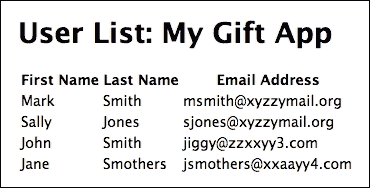
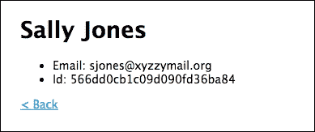

# 第九章：使用 Express 处理 Web 请求

Express 是一个基于 Node.js 构建的强大、无偏见的 Web 应用程序框架。它提供了一个高度可插拔的接口和一些基本对象来处理 HTTP 请求响应生命周期。

我们已经开始了与 Express 的合作，使用 Express 生成器开始了我们的单页应用（SPA）。现在是时候进一步构建事物并了解 Express 的强大功能了。

Express 的真正力量来自于其最小化和无偏见的特点。它非常灵活和可扩展，使其成为许多 Web 应用程序、单页应用、混合应用甚至基于套接字的应用程序的好工具。

本章更详细地介绍了 Express，从内置对象开始。我们将构建许多路由，将应用程序代码组织到逻辑模块中。我们将详细学习 Express 中的请求和响应对象，并开发自己的中间件功能来处理 AJAX 请求。

我们将通过为我们的 SPA 提供一个 RESTful API 来结束，配置它以使用不同的数据格式进行响应。

本章涵盖了以下主题：

+   配置 Express

+   Express 请求和响应对象

+   在 GET 和 POST 请求中传递变量

+   开发 Express 中间件

+   构建 RESTful 服务

+   将路由组织到逻辑模块中

# 详细考察 Express

Express 在 Node 的 HTTP 服务器之上代表一个非常薄的层，但它有一些内置的对象，这些对象对于熟悉它们非常重要。这些包括`App`、`Request`、`Response`和`Router`对象。这些对象以及一些插件提供了 Express 框架的所有核心功能。

## 应用对象

在 Express 中，`app`对象通常指的是 Express 应用程序。这是惯例，也是调用`express()`函数的结果。打开你的`app.js`文件，看看读取`var app = express()`的那一行。这是我们创建应用程序并将其分配给变量`app`的地方。我们可以使用任何变量名，但惯例是使用`app`。我们将遵循惯例，并将此对象称为`app`。

让我们更仔细地看看我们的`app.js`文件，看看我们是如何使用`app`对象的：

```js
var express = require('express'); 
var path = require('path'); 
var favicon = require('serve-favicon'); 
var logger = require('morgan'); 
var cookieParser = require('cookie-parser'); 
var bodyParser = require('body-parser'); 

//Database stuff 
var mongodb = require('mongodb'); 
var monk = require('monk'); 
var db = monk('localhost:27017/giftapp') 

var routes = require('./routes/index'); 
var users = require('./routes/users'); 

var app = express(); 

// view engine setup 
app.set('views', path.join(__dirname, 'views')); 
app.set('view engine', 'ejs'); 

// uncomment after placing your favicon in /public 
//app.use(favicon(path.join(__dirname, 'public', 'favicon.ico'))); 
app.use(logger('dev')); 
app.use(bodyParser.json()); 
app.use(bodyParser.urlencoded({ extended: false })); 
app.use(cookieParser()); 
app.use(express.static(path.join(__dirname, 'public'))); 

//Database middlewear 
app.use(function(req,res,next){ 
    req.db = db; 
    next(); 
}); 

app.use('/', routes); 
app.use('/users', users); 

// catch 404 and forward to error handler 
app.use(function(req, res, next) { 
  var err = new Error('Not Found'); 
  err.status = 404; 
  next(err); 
}); 

// error handlers 

// development error handler 
// will print stacktrace 
if (app.get('env') === 'development') { 
  app.use(function(err, req, res, next) { 
    res.status(err.status || 500); 
    res.render('error', { 
      message: err.message, 
      error: err 
    }); 
  }); 
} 

// production error handler 
// no stacktraces leaked to user 
app.use(function(err, req, res, next) { 
  res.status(err.status || 500); 
  res.render('error', { 
    message: err.message, 
    error: {} 
  }); 
}); 

module.exports = app; 

```

`app` API 包括一个重要的属性、事件和多个方法。要查看 Express 应用程序 API 中的完整功能列表，您可以在[`expressjs.com/en/api.html`](http://expressjs.com/en/api.html)查看文档，但在这里我们将介绍一些最重要的功能。

### app.locals

`app.locals`是一个在应用程序本身中持久存在的 JavaScript 对象。添加到该对象中的任何属性或函数都将在整个`app`中可用。这对于创建辅助函数或应用级别的值非常有用。

`app.locals`对象可以通过请求对象通过`req.app.locals`在中间件中访问。

在你的`app.js`文件中`app.set();`调用之后添加以下行：`app.locals.appName="MyGiftApp";`

现在打开你的 `routes/users.js` 文件并按如下方式修改它：

```js
var express = require('express'); 
var router = express.Router(); 

/* GET users listing. */ 
router.get('/', function(req, res, next) { 
  res.send('respond with a resource'); 
}); 

router.get('/show', function(req, res, next) { 
    var db = req.db; 
    var collection = db.get('users'); 
    collection.find({}, {}, function(err,docs){ 
        if(!err){ 
            //res.json(docs); 
 res.render('users/show',
 { 
 users: docs, 
 appName: req.app.locals.appName 
 }
); 
        }else{ 
            res.send('error'); 
        } 
    }); 
}); 
module.exports = router; 

```

在 `show` 路由内部，我们在 `res.render()` 的第二个参数中添加了一些数据。我们将 `req.app.locals.appname` 映射到属性 `appName`。这使得它可以在我们的模板中使用。

现在，打开你的 `views/users/show.ejs` 模板文件并按如下方式修改它：

```js
<!DOCTYPE html> 
<html> 
<head> 
    <title>Show Users</title> 
    <link rel='stylesheet' href='/stylesheets/style.css' /> 
</head> 
<body> 
<h1>User List: <%= appName %></h1> 

<table> 
    <thead> 
        <tr> 

            <th>First Name</th> 
            <th>Last Name</th> 
            <th>Email Address</th> 
        </tr> 
    </thead> 
    <tbody> 
    <% users.forEach(function(user, index){ -%> 
        <tr> 
            <td><%= user.firstName %></td> 
            <td><%= user.lastName %></td> 
            <td><%= user.email %></td> 
        </tr> 
    <% }); %> 
    </tbody> 
</table> 
</body> 
</html> 

```

我们为 `appName` 属性添加了一个输出标签。

现在，确保 MongoDB 守护程序正在运行，并启动或重启你的应用程序。在你的浏览器中，导航到 `:localhost:3000/users/show`，你应该看到如下内容：



我们已成功添加了一个应用程序级别的本地属性，并在我们的模板中显示了它。

### app.set()

在我们通过调用 express 函数创建应用程序之后，我们看到几个对 `app.set()` 的调用，设置视图目录和视图引擎的路径。set 函数接受两个参数。第一个参数是一个字符串，包含 Express 应用程序设置中的一个设置名称。一些应用程序设置包括以下内容：

+   `casesensitiverouting`：一个布尔值，默认禁用。当启用时，它忽略路由的大小写。`/route` 和 `/Route` 将被视为相同的路由。

+   `env`：一个用于环境模式的字符串设置。默认是 `development` 或 `NODE_ENV` 环境变量设置的值。

+   `etag`：用于 `ETag` 响应头的设置。它有一个合理的默认值，但如果你想更改它，我建议参考文档。

+   `jsonpcallbackname`：一个字符串，指定 JSONP 响应的默认回调函数。

+   `jsonspaces`：一个数值，当指定时，它将使用指定的空格数美化并缩进返回的 JSON 响应。

+   `queryparser`：默认情况下，这设置为 `extended`，但你可以用它来禁用查询解析或设置一个更简单或定制的查询解析函数。

+   `strictrouting`：一个布尔值，默认禁用，将 `/route` 视为 `/route/`。

+   `views`：一个字符串或数组，告诉 Express 在哪里查找显示模板。如果值是一个数组，Express 将按数组中出现的顺序查找它们。

+   `viewcache`：一个布尔值，在生产环境中默认为 true，这告诉 Express 缓存视图模板。在开发中这通常是不希望的。

+   `viewengine`：一个字符串 - 默认引擎扩展（例如 `ejs`）。

+   `x-powered-by`：一个布尔值，默认为 true，发送一个 `X-Powered-By:Express` HTTP 头。我认为关闭这个功能通常是个好主意，给潜在的黑客提供更少的信息。请在设置视图引擎的行之后，向你的 `app.js` 文件中添加 `app.set('x-powered-by',false);`。

### app.enable()

任何接受布尔值的 `app` 设置都可以通过 `app.enable()` 打开；例如，要启用视图缓存，你可以使用 `app.enable('viewcache');`。

### app.disable()

如果你有一个启用函数，你应该有一个禁用函数，对吧？`app.disable()` 将任何 `app` 设置的布尔值设置为 false，将其关闭。

### app.listen()

在底层，`express()` 调用返回的应用程序对象是一个 JavaScript 函数。记住，JavaScript 中的函数是对象，可以像其他任何对象一样传递。当我们调用 `app.listen()` 时，它实际上调用了 Node 的原生 `http.createServer()` 函数，并将自身、`app` 函数作为回调传递。

如果我们想使用 HTTPS，情况会有所不同，我们将在后面的章节中介绍。

对于我们的目的，我们会使用 `app.listen()` 并将我们希望监听的端口作为参数传递。然而，Express 生成器已经为我们设置了 `bin/www` 中的代码，如下所示：

```js
/** 
 * Module dependencies. 
 */ 

var app = require('../app'); 
var debug = require('debug')('giftapp:server'); 
var http = require('http'); 

/** 
 * Get port from environment and store in Express. 
 */ 

var port = normalizePort(process.env.PORT || '3000'); 
app.set('port', port); 

/** 
 * Create HTTP server. 
 */ 

var server = http.createServer(app); 

/** 
 * Listen on provided port, on all network interfaces. 
 */ 

server.listen(port); 
server.on('error', onError); 
server.on('listening', onListening); 

```

与简单地调用 `app.listen()` 不同，Express 生成器已经设置了此方法，它本质上做的是同样的事情，但为服务器对象添加了一些事件监听器以处理错误等。

### app.METHOD()

`app.METHOD()` 通过实际方法路由进入服务器的请求。没有 `METHOD` 函数，实际函数是特定 HTTP 请求方法的下划线形式。换句话说，你会使用 `app.get()` 或 `app.post()` 方法。

这里可能会有一些小的混淆点，因为 `app.get('somevalue')` 也可以用来返回一个 `app` 设置。

通常，我们将请求传递给 Express 路由器，并以更模块化的方式处理路由。

### app.all()

`app.all()` 与 `app.METHOD()` 类似，但它匹配所有 HTTP 请求方法。它通常用于通过中间件轻松地向路径或应用程序的某个部分添加全局功能。

例如，如果你想在不添加到每个单独的路由或方法的情况下，为 `app` 的某个部分添加身份验证，你可能做些像这样的事情：

```js
app.all('/protected/', authenticationRequired); 

```

这将使所有以 `/protected/` 路径开始的请求（无论方法如何）通过 `authenticationRequired` 中间件传递。

## 请求对象

Express 中的请求对象包含与 HTTP 请求相关的数据。默认情况下，它将包含查询字符串、参数、头部、POST 参数等属性。它是中间件（如路由）提供的回调函数的第一个参数，按照惯例，通常称为 `req`：

```js
router.get('/show', function(req, res, next) { 
    var db = req.db; 
    var collection = db.get('users'); 
    collection.find({}, {}, function(err,docs){ 
        if(!err){ 
            //res.json(docs); 
            res.render('users/show', { 
                users: docs, 
                appName: req.app.locals.appName 
            }); 
        }else{ 
            res.send('error'); 
        } 
    }); 
}); 

```

在我们的 `routes/users` 文件中，这里是我们对 URI `/show` 的 GET 请求的一个路由。你可以看到回调函数的第一个参数是 `req`。这是请求对象。我们从请求对象中获取对数据库的引用，以及 `app.locals.appName` 属性的引用。

### req.params

请求对象的 `params` 属性使我们能够访问通过 URL 传递给服务器的参数。

让我们修改 `routes/users` 文件以添加一个新的路由：

```js
var express = require('express'); 
var router = express.Router(); 

/* GET users listing. */ 
router.get('/', function(req, res, next) { 
  res.send('respond with a resource'); 
}); 

router.get('/show/:id', function(req, res, next)
 { 
 var db = req.db; 
 var collection = db.get('users'); 
 collection.findOne({ "_id": req.params.id },{}, function(err,User)
{
 if(!err)
{ 
 res.render('users/user',
 { 
 user: User, 
 appName: req.app.locals.appName 
 }
); 
 }
else
{ 
 res.send('error'); 
 } 
 }); 
}); 

router.get('/show', function(req, res, next) { 
    var db = req.db; 
    var collection = db.get('users'); 
    collection.find({}, {}, function(err,docs){ 
        if(!err){ 
            //res.json(docs); 
            res.render('users/show', { 
                users: docs, 
                appName: req.app.locals.appName 
            }); 
        }else{ 
            res.send('error'); 
        } 
    }); 
}); 

module.exports = router; 

```

我们添加了一个新的路由，匹配`/show/:id`。`:id`部分将匹配 URL 的变量部分；在这种情况下，我们期望一个 ID，并将其作为名为`id`的属性放置在`req.params`对象上。

我们对用户集合数据库发出`findOne`查询。`findOne`返回一个对象（第一个匹配项），其中`find`返回一个包含所有匹配项的数组。在这种情况下，我们只对单个匹配项感兴趣；我们正在寻找具有特定`_id`的用户。

然后我们渲染`users/user`模板，传递我们的值。我们还没有用户模板，所以让我们在`views/users`目录中创建`user.ejs`：

```js
<!DOCTYPE html> 
<html> 
<head> 
    <title><%= appName %>: <%= user.firstName %> <%= user.lastName  
%></title> 
    <link rel='stylesheet' href='/stylesheets/style.css' /> 
</head> 
<body> 
<h1><%= user.firstName %> <%= user.lastName %></h1> 
<ul> 
    <li>Email: <%= user.email %></li> 
    <li>Id: <%= user._id %></li> 
</ul> 

<p><a href="/users/show">&lt; Back</a></p> 

</body> 
</html> 

```

传递到模板中的包含我们的用户数据的对象被称为`user`。在这里，我们可以访问它的所有属性，`firstName`、`lastName`、`email`和`_id`。为了使生活更加简单，我们添加了一个链接回到显示路由。

让我们稍微修改一下`show.ejs`以添加导航：

```js
<!DOCTYPE html> 
<html> 
<head> 
    <title>Show Users</title> 
    <link rel='stylesheet' href='/stylesheets/style.css' /> 
</head> 
<body> 
<h1>User List: <%= appName %></h1> 

<table> 
    <thead> 
        <tr> 

            <th>First Name</th> 
            <th>Last Name</th> 
            <th>Email Address</th> 
        </tr> 
    </thead> 
    <tbody> 
    <% users.forEach(function(user, index){ -%> 
        <tr> 
 <td><a href=""show/<%= user._id%>""><%= user.firstName %></a></td> 
            <td><%= user.lastName %></td> 
            <td><%= user.email %></td> 
        </tr> 
    <% }); %> 
    </tbody> 
</table> 

</body> 
</html> 

```

我们添加了一个链接到`show/<%=user._id%>,`，这将创建我们需要导航到单个用户显示路由的 URL。

启动或重启你的服务器。每次更改路由或主应用程序时都需要重启，但对于简单的模板更改则不需要。

导航到`localhost:3000/users/show`并点击你用户的一个名字。你应该会看到如下内容：



当然，因为 Mongo 生成`_id`字段，你的不会匹配我的。嗯，它们可能匹配，但那将是一个天文巧合。

### `req.body`

请求对象上的`body`属性包含通常作为 POST 请求一部分发送的名称值对。为了访问这些，你需要向你的`app`添加`body`解析中间件。

Express 生成器已经为我们设置好了，通过要求一个`body`解析器然后在两行中添加中间件：

```js
app.use(bodyParser.json()); 
app.use(bodyParser.urlencoded({ extended: false })); 

```

这两行允许我们解析以`application/json`或`application/x-www-form-urlencoded`发送回的数据。

在我们的路由中，我们可以访问通过`req.body`传入的参数。当我们开始构建资源路由时，我们会做很多这样的事情。这里有一个例子（不需要将其添加到我们的代码中）：

```js
router.post('/user', function(req, res, next) { 
    var db = req.db; 
    var collection = db.get('users'); 
    collection.insert({ firstName: req.body.firstName, 
                        lastName: req.body.lastName, 
                        email: req.body.email}, 
                        function(err){ 
        if(!err){ 
            res.redirect('/users/show'); 
        }else{ 
            res.send('error'); 
        } 
    }); 
}); 

```

在这里，我们接受对`users/user`的 POST 请求。我们使用`monk`进行插入（将记录添加到我们的 MongoDB 数据库中）。插入函数的第一个参数是一个对象，我们使用`req.body`中的`firstName`、`lastName`和`email`字段来填充要插入的文档的相同属性。假设没有错误，我们将重定向到`users/show`，显示包括我们的新用户在内的用户列表。

### `req.query`

另一种从请求中获取数据的方法是使用附加到 URL 的查询字符串。如果你不熟悉这个，查询字符串是在 URL 问号后附加的名称值对数据。

例如，在`http:www.mymadeupdomain.org/foo?name=john+smith&q=foo`中，查询字符串部分是`name=john+smith&q=foo`。要在我们`app`内部访问它，我们会使用`req.query.name`和`req.query.q`。这将分别返回`johnsmith`和`foo`，在`john`和`smith`之间没有加号。加号是 URL 编码的一部分，因为空格在 URL 中无法翻译。

如果没有查询字符串，`req.query`将包含一个空对象。

### 注意

**我应该何时使用查询字符串而不是参数？**

没有最好的答案。一般来说，当你想要多个路由处理不同类型的操作时，你应该使用路由参数。我们大多数时候都会采取这种方法。如果你想要一个灵活地接收不同类型数据的单个`GET`请求路由，并且希望用户能够将其添加到书签中，查询字符串就很好。Google 使用查询字符串进行搜索：[`www.google.com/search?q=things`](https://www.google.com/search?q=things)。

### req.cookies

`req.cookies`需要使用 cookie 解析器中间件，Express 生成器已经为我们方便地安装了它，并使我们能够访问请求中的 cookie。如果没有 cookie，`req.cookies`的值将是一个空对象。

通过名称访问 cookie：`req.cookies.userID`将给我们一个名为`userID`的 cookie。

### 注意

我们将在稍后更详细地探讨 cookie，但 cookie 解析器对于诸如身份验证和安全等操作是必需的。如果你打算直接使用 cookie，或者不使用 cookie，最好都保留它。

### req.xhr

这是一个简单的布尔值，如果`X-Requested-With`请求头是`XMLHttpRequest`，则为`true`。这种情况通常发生在由 jQuery 等库发出的 AJAX 请求中。

这对于 SPA 很有用，因为我们可能希望在请求来自浏览器位置变化时响应 HTML 页面，但在随后的请求来自通过 AJAX 发出请求的客户端代码时响应数据。

让我们看看`/routes/users.js`中的`/show/:id`路由：

```js
router.get('/show/:id', function(req, res, next) { 
    var db = req.db; 
    var collection = db.get('users'); 
    collection.findOne({ ""_id"": req.params.id }, {}, function(err,User){ 
        if(!err){ 
 if(req.xhr){ 
 User.appName = req.app.locals.appName; 
 res.json(User); 
 } else { 
 res.render('users/user',
 { 
 user: User, 
 appName: req.app.locals.appName 
 }); 
 } 
        }else{ 
            res.send('error'); 
        } 
    }); 
}); 

```

因此，我们检查请求是否通过`XMLHTTPRequest`，即 AJAX 发出。如果是，我们将`appName`添加到`User`对象中，然后将其作为 JSON 返回。如果不是，我们像平常一样渲染并返回页面。

这非常方便，我们稍后会使用这个机制。

### req.accepts()

`req.accepts`是一个函数，它检查请求的`Accept`头，如果匹配则返回`true`。它可以接受字符串、数组、扩展名或 MIME 类型，如果没有匹配项，则返回最佳匹配或`false`（`undefined`，在 JavaScript 中为假值）。

例如，假设浏览器返回了以下头信息：`Accept:text/*`。`application/json`：`req.accepts('html')`将匹配`text/*`部分并返回`html`。`req.accepts(['image/png','application/json'])`将返回`json`。

与`req.xhr`类似，这对于灵活响应同一路由上的不同类型的请求非常有用。

### req.get()

`req.get()`是一个函数，它返回请求中发送的 HTTP 头的值。该函数接受一个字符串，进行不区分大小写的匹配。此函数的别名是`req.header()`。

例如，`req.get('content-type')`返回 HTTP 请求中的内容类型头，如字符串`application/json`或`text/html`。

## 响应对象

Express 响应对象是一个 JavaScript 对象，它代表我们将从服务器发送回客户端的响应。我们看到它与请求对象配对，并且像使用`req`进行请求一样，惯例是使用`res`。

### res.app

`res.app`对象与`req.app`属性相同。它是对应用的引用，但在此情况下附加到响应对象。这为访问应用属性提供了一些灵活性。

### res.cookie()

这是一个响应对象方法，允许我们设置 cookie 并将其与响应一起发送。它接受一个名称、值和一个可选的包含参数的对象。

这里有一个例子：

```js
res.cookie('userName', 'Joe', { maxage: 900000, secure: true, signed:true }); 

```

这将设置一个值为`Joe`的`userName`cookie。cookie 在响应后的 900,000 秒后过期。cookie 仅用于 HTTPS，并且需要签名。还可以设置 cookie 的域和路径，以及实际的过期日期。

此方法清除指定的 cookie：

```js
res.clearCookie() 

```

这将清除我们之前设置的 cookie：

```js
res.clearCooke('userName'); 

```

### res.download()

`res.download`将给定路径的文件作为附件传输。它接受路径、可选的文件名和一个可选的回调函数，一旦文件传输完成：

```js
res.download('/reports/TPS-coversheet.pdf', 'coversheet.pdf, function(err){ 
  if(err){ 
    //handle error here 
} else { 
    //do something appropriate 
  } 
}); 

```

我们开始下载位于`/reports/TPS-coversheet`的文件，但将其传输为`coversheet.pdf`。一旦完成，我们检查是否有错误，并在任何情况下做适当的事情。

### res.json()

此方法发送 JSON 响应，非常直接。它可以接受任何 JavaScript 对象。使用 MongoDB 数据库的好处是，我们通常可以直接使用`res.json()`传递原始数据库响应：

```js
res.json({dog: 'Fido', breed: 'Sheltie' commands: {sit: true, stay: false}); 

```

在这里，我们通过传递一个包含名为`Fido`的`Sheltie`和它所知道的命令的对象来响应 JSON。

### res.jsonp()

此方法返回被回调函数包裹的 JSON 数据，也称为 JSONP。默认情况下，函数将被命名为 callback。但可以通过使用`app.set('jsonpcallbackname','someFunction');`来覆盖它。在这种情况下，我们得到以下结果：

```js
res.jsonp({dog: 'Fido'); 
//returns someFunction({""dog"": ""Fido""}) 

```

当然，必须放置适当的客户端代码来处理响应。

### res.redirect()

我们已经使用过这个了。这会将带有适当 HTTP 状态码的重定向发送回请求者。如果没有指定状态码，则使用`302`。

这里是我们之前查看的内容：

```js
router.post('/user', function(req, res, next) { 
    var db = req.db; 
    var collection = db.get('users'); 
    collection.insert({ firstName: req.body.firstName, 
                        lastName: req.body.lastName, 
                        email: req.body.email}, 
                        function(err){ 
        if(!err){ 
 res.redirect('/users/show'); 
        }else{ 
            res.send('error'); 
        } 
    }); 
}); 

```

在插入操作之后，将新文档添加到我们的数据库中，我们向浏览器发送一个重定向，使其跳转到 `/users/show`。因为没有指定状态，所以将返回一个 `302` 状态码。

路径非常灵活，可以是完整的 URL：`res.redirect('https://www.google.com/search?q=food');`，也可以是相对路径：`res.redirect('../dashboard/show');`。

```js
res.redirect(301, 'http://www.whitehouse.gov'); 

```

这将发送一个永久重定向到 `whitehouse.gov`，从而混淆了 Google 并破坏了你的 SEO。有关各种重定向代码的更多信息，请查看官方 HTTP 规范，注意 `3xx` 状态码：[`www.w3.org/Protocols/rfc2616/rfc2616-sec10.html`](http://www.w3.org/Protocols/rfc2616/rfc2616-sec10.html)。

### res.render()

这是我们已经使用过的另一个方法，它发送回由 `view` 模板编译的渲染后的 HTML。该方法参数包括模板视图、包含本地变量的可选对象以及可选的回调函数。

让我们看一下我们 `/show` 路径在 `routes/users.js` 文件中的内容：

```js
router.get('/show', function(req, res, next) { 
    var db = req.db; 
    var collection = db.get('users'); 
    collection.find({}, {}, function(err,docs){ 
        if(!err){ 
            //res.json(docs); 
 res.render('users/show',
 { 
 users: docs, 
 appName: req.app.locals.appName 
 }
); 
        }else{ 
            res.send('error'); 
        } 
    }); 
}); 

```

正如我们所看到的，这个对 `res.render()` 的调用渲染了 `/views/users/show` 路径下的模板。它使用户和 `appName` 本地对象对模板可用。

如果我们在渲染方法中添加一个回调函数，则需要显式调用 `res.send()`：

```js
res.render('users/show', { 
    users: docs, 
    appName: req.app.locals.appName 
}, function(err, html){ 
    if(!err){ 
    res.cookie('rendered':""someValue"") 
        res.send(html); 
    } else { 
        res.send(""There's been a horrible error.""); 
    } 
}); 

```

在这里，我们添加了一个具有两个参数的回调函数，一个错误（如果有），以及渲染后的 `html`。这允许我们添加错误处理程序，在响应对象上设置一个 cookie，然后发送响应。

### res.send()

我们已经看到 `res.send()` 是一个用于发送 HTTP 响应的方法。`res.send()` 非常灵活，可以接受多种类型的参数，包括 `Buffer`、对象、数组或字符串。

`res.send()` 会根据参数适当地调整 HTTP `Content-Type` 头。当参数是一个字符串时，`Content-Type` 将是 `text/html`，当是一个对象或数组时，将是 `application/json`，而当它是一个 `Buffer` 对象时，将被设置为 `application/octet-stream`。这些默认值可以通过调用 `res.set()` 并传入不同的 `Content-Type` 来覆盖。

我们还可以链式调用 `status()` 来传递一个 HTTP 状态码：

```js
router.get('/show', function(req, res, next) { 
    var db = req.db; 
    var collection = db.get('users'); 
    collection.find({}, {}, function(err,docs){ 
        if(!err){ 
            //res.json(docs); 
            res.render('users/show', { 
                users: docs, 
                appName: req.app.locals.appName 
            }); 
        }else{ 
 res.status(500).send(""There has been a major error""); 
        } 
    }); 
}); 

```

通过将状态与 `500` HTTP 状态码链式调用，我们可以发送一条消息，表明发生了内部服务器错误，并附带我们的消息。

## 路由对象

路由对象在 Express 文档中被描述为一个仅提供中间件和路由功能的 `mini-application`。路由器作为中间件使用，因此可以作为 `app.use()` 或另一个路由器的 `use()` 方法的参数，这使得嵌套和组织路由变得容易。

我们通过调用 `express.Router()` 函数来创建一个路由对象：

```js
var router = express.Router(); 

```

在我们的路由文件中，我们总是使用 `module.exports=router` 来导出路由。这允许我们通过 `require()` 加载路由作为模块，然后像使用任何其他中间件一样使用它。

让我们再次审查一下 `app.js` 文件：

```js
var express = require('express'); 
var path = require('path'); 
var favicon = require('serve-favicon'); 
var logger = require('morgan'); 
var cookieParser = require('cookie-parser'); 
var bodyParser = require('body-parser'); 

//Database stuff 
var mongodb = require('mongodb'); 
var monk = require('monk'); 
var db = monk('localhost:27017/giftapp') 

var routes = require('./routes/index');
var users = require('./routes/users'); 

var app = express(); 

// view engine setup 
app.set('views', path.join(__dirname, 'views')); 
app.set('view engine', 'ejs'); 

app.set('x-powered-by', false); 

app.locals.appName = "My Gift App"; 

// uncomment after placing your favicon in /public 
//app.use(favicon(path.join(__dirname, 'public', 'favicon.ico'))); 
app.use(logger('dev')); 
app.use(bodyParser.json()); 
app.use(bodyParser.urlencoded({ extended: false })); 
app.use(cookieParser()); 
app.use(express.static(path.join(__dirname, 'public'))); 

//Database middlewear 
app.use(function(req,res,next){ 
    req.db = db; 
    next(); 
}); 

app.use('/', routes);
app.use('/users', users); 

// catch 404 and forward to error handler 
app.use(function(req, res, next) { 
  var err = new Error('Not Found'); 
  err.status = 404; 
  next(err); 
}); 

// error handlers 

// development error handler 
// will print stacktrace 
if (app.get('env') === 'development') { 
  app.use(function(err, req, res, next) { 
    res.status(err.status || 500); 
    res.render('error', { 
      message: err.message, 
      error: err 
    }); 
  }); 
} 

// production error handler 
// no stacktraces leaked to user 
app.use(function(err, req, res, next) { 
  res.status(err.status || 500); 
  res.render('error', { 
    message: err.message, 
    error: {} 
  }); 
}); 

module.exports = app 

```

我们需要索引路由，将其分配给变量`routes`，然后我们需要用户路由，将其分配给变量`users`。接着，我们使用`app.use`函数将路由添加到`app`中，匹配根路径和`/users`路径。

注意，Express 会按顺序尝试匹配路由。由于每个路由都会匹配根路径，它会首先查找那里，如果找不到以`/users`开头的匹配项，Express 会接着匹配下一个路由。在我们的`/users`路由中，我们知道我们有一个 show 路由，所以`/users/show`会被匹配到那里。

### `router.METHOD()`

这与`app.METHOD()`的工作方式完全相同。我们添加小写的 HTTP 动词作为函数，传递一个匹配的路由和一个回调函数。我们已经看到这个模式了：

```js
router.get('/something', function(req, res, next) { 
    res.send(""something loaded""); 
}); 

```

这里需要注意的是，`res.send()`、`res.render()`和`res.end()`都会终止响应。这意味着`next()`中的任何内容都不会被调用。把它想象成从 JavaScript 函数中返回。在那之后就没有更多的事情可以做了。然而，你可以通过不终止来连续调用多个路由：

```js
router.get('/something', function(req, res, next) { 
    res.locals.foo = ""bar""; 
    next() 
}); 

router.get('/something', function(req, res, next) { 
    res.send(res.locals.foo); 
    //send s 'bar' 
}); 

```

这两条路由都匹配`/something`，所以第一条会被调用，并将`foo`添加到响应对象的`locals`属性中。然后它调用`next`，调用下一个匹配的路由，发送`res.locals,foo`的值。

### `router.all()`

`router.all()`的工作方式类似于`router.METHOD()`，除了它匹配所有 HTTP 动词，如 get、post 等。这对于向一系列路由添加`全局`功能非常有用。例如，假设你有一个`api`路由，并确保对`api`中任何路由的每次调用都是经过认证的：

```js
router.all('/api/*', someAuthenticationMiddleware); 

```

将此放在路由文件的最顶部，会使所有以`/api/`开头的 URL 调用都通过`someAuthenticationMiddleware`中间件。

### `router.param()`

`router.param()`是一种强大的方式，可以根据路由参数添加回调功能。例如，假设在我们的`users`路由文件中，每次我们获取一个`id`参数。

让我们再次深入到我们的`routes/users.js`文件：

```js
var express = require('express'); 
var router = express.Router(); 

/* GET users listing. */ 
router.get('/', function(req, res, next) { 
  res.send('respond with a resource'); 
}); 

router.param('id', function(req, res, next, id)
 { 
 var db = req.db; 
 var collection = db.get('users'); 
 collection.findOne({ ""_id"": id }, {}, function(err,User)
{ 
 if(err)
{
 res.send(err); 
 }else if(User){ 
 req.user = User; 
 next(); 
 }
 else
 { 
 res.send(new Error('User not found.')
); 
 } 
 }); 
}); 
router.get('/show/:id', function(req, res, next)
 { 
 if(req.xhr)
{ 
 User.appName = req.app.locals.appName; 
 res.json(req.user); 
 }
 else
 { 
 res.render('users/user',
 { 
 user: req.user, 
 appName: req.app.locals.appName 
 }); 
 }
}); 

router.get('/show', function(req, res, next) { 
    var db = req.db; 
    var collection = db.get('users'); 
    collection.find({}, {}, function(err,docs){ 
        if(!err){ 
            //res.json(docs); 
            res.render('users/show', { 
                users: docs, 
                appName: req.app.locals.appName 
            }); 
        }else{ 
            res.send('error'); 
        } 
    }); 
}); 

module.exports = router; 

```

我们使用`router.param()`来查找任何具有`id`参数的路由调用。回调函数在用户上进行数据库查找。如果有错误，我们通过发送错误来终止。如果找到了用户，将其添加到请求对象中。然后我们调用`next()`来传递请求到匹配的路由。

## 编写我们自己的中间件

正如我们所看到的，Express 被设计为高度依赖可插拔的中间件来为我们的应用程序添加功能。让我们自己编写一段中间件，这样我们就可以轻松地在`app`的任何地方切换响应到 JSON 格式。

在你的`giftapp`项目文件夹中添加一个`utils`目录，并在该目录中创建一个名为`json.js`的文件：

```js
var isJSON = function(req, res, next){ 
    if(req.xhr || req.headers['accepts'] == 'application/json'){ 
        req.isJSON = true; 
    } 
    next(); 
} 

module.exports = isJSON; 

```

我们创建的`isJSON`函数接受所有 Express 中间件接受的三个参数 - 请求对象、响应对象和指向下一个的引用。我们检查请求对象的`xhr`值是否为`true`，或者请求的`accepts`头是否为`application/json`。如果任一条件为真，我们可以假设客户端正在请求`JSON`而不是`HTML`。

我们在请求对象中添加一个`isJSON`属性，将其设置为`true`。

现在，让我们修改我们的`app.js`文件，在应用程序需要的地方包含这个中间件：

```js
var express = require('express'); 
var path = require('path'); 
var favicon = require('serve-favicon'); 
var logger = require('morgan'); 
var cookieParser = require('cookie-parser'); 
var bodyParser = require('body-parser'); 
var isJSON = require('./utils/json'); 

//Database stuff 
var mongodb = require('mongodb'); 
var monk = require('monk'); 
var db = monk('localhost:27017/giftapp') 

var routes = require('./routes/index'); 
var users = require('./routes/users'); 

var app = express(); 

// view engine setup 
app.set('views', path.join(__dirname, 'views')); 
app.set('view engine', 'ejs'); 

app.set('x-powered-by', false); 

app.locals.appName = ""My Gift App""; 

// uncomment after placing your favicon in /public 
//app.use(favicon(path.join(__dirname, 'public', 'favicon.ico'))); 
app.use(logger('dev')); 
app.use(bodyParser.json()); 
app.use(bodyParser.urlencoded({ extended: false })); 
app.use(cookieParser()); 
app.use(express.static(path.join(__dirname, 'public'))); 
app.use(isJSON); 

//Database middlewear 
app.use(function(req,res,next){ 
    req.db = db; 
    next(); 
}); 

app.use('/', routes); 
app.use('/users', users); 

// catch 404 and forward to error handler 
app.use(function(req, res, next) { 
  var err = new Error('Not Found'); 
  err.status = 404; 
  next(err); 
}); 

// error handlers 

// development error handler 
// will print stacktrace 
if (app.get('env') === 'development') { 
  app.use(function(err, req, res, next) { 
    res.status(err.status || 500); 
    res.render('error', { 
      message: err.message, 
      error: err 
    }); 
  }); 
} 

// production error handler 
// no stacktraces leaked to user 
app.use(function(err, req, res, next) { 
  res.status(err.status || 500); 
  res.render('error', { 
    message: err.message, 
    error: {} 
  }); 
}); 

module.exports = app; 

```

首先，我们在模块中引入，将其分配给变量`isJSON`。注意，在这里我们需要使用一个明确的路径。如果我们仅仅使用一个模块名称，Node 将尝试在`node_modules`目录中查找它。

然后，我们使用`app.use(isJSON)`将我们的中间件添加到应用程序中。我们在文件中的位置很重要，因为中间件是按顺序调用的。在我们的情况下，它可以在任何地方，只要它出现在使用它的路由之前：

```js
Next, we'll modify our routes/users.js file to use the middleware:var express = require('express'); 
var router = express.Router(); 

/* GET users listing. */ 
router.get('/', function(req, res, next) { 
  res.send('respond with a resource'); 
}); 

router.param('id', function(req, res, next, id) { 
    var db = req.db; 
    var collection = db.get('users'); 
    collection.findOne({ ""_id"": id }, {}, function(err,User){ 
        if(err){ 
            res.send(err); 
        }else if(User){ 
            req.user = User; 
            next(); 
        } else { 
            res.send(new Error('User not found.')); 
        } 
    }); 
}); 

router.get('/show/:id', function(req, res, next) { 
 if(req.isJSON){
 User.appName = req.app.locals.appName;
 res.json(req.user);
 } else {
 res.render('users/user', {
 user: req.user,
 appName: req.app.locals.appName
 });
 } 
}); 

router.get('/show', function(req, res, next) { 
    var db = req.db; 
    var collection = db.get('users'); 
    collection.find({}, {}, function(err,docs){ 
        if(!err){ 
 if(req.isJSON)
{ 
 res.send(docs); 
 }
 else
 { 
 res.render('users/show',
 { 
 users: docs, 
 appName: req.app.locals.appName 
 }); 
 } 
        }else{ 
            res.send('error'); 
        } 
    }); 
}); 

module.exports = router; 

```

我们修改了我们的两个路由，根据新的`isJSON`标志有条件地发送 JSON 或 HTML。重启服务器然后浏览任一路由应该没有区别，因为你实际上并没有请求 JSON。

如果你想测试这个功能，你可以使用浏览器插件如`Postman`或终端请求如`curl`来发出一个`xhr`请求，并查看数据以`JSON`格式返回。

# 开发 RESTful API

让我们通过构建一些资源路由作为 RESTful API 的一部分来进一步设置我们的 SPA，这样我们就可以稍后将其连接到数据库和客户端代码。我们很幸运，Express 有一个充满活力的开发者社区，他们构建了许多附加组件，我们将使用其中一个用于资源路由。

## 安装资源路由

我们需要做的第一件事是安装我们的模块，它将为我们提供一些资源路由：

```js
npm install resource-routing -save

```

这安装了我们将要使用的资源路由插件，并保存了对`package.json`文件的引用。

接下来，我们需要在我们的`app.js`文件中进行一些设置：

```js
var express = require('express'); 
var path = require('path'); 
var favicon = require('serve-favicon'); 
var logger = require('morgan'); 
var cookieParser = require('cookie-parser'); 
var bodyParser = require('body-parser'); 
var isJSON = require('./utils/json'); 
var routing = require('resource-routing');
var controllers = path.resolve('./controllers'); 

//Database stuff 
var mongodb = require('mongodb'); 
var monk = require('monk'); 
var db = monk('localhost:27017/giftapp') 

var routes = require('./routes/index'); 
var users = require('./routes/users'); 

var app = express(); 
routing.expose_routing_table(app, { at: ""/my-routes"" }); 

// view engine setup 
app.set('views', path.join(__dirname, 'views')); 
app.set('view engine', 'ejs'); 

app.set('x-powered-by', false); 

app.locals.appName = ""My Gift App""; 

// uncomment after placing your favicon in /public 
//app.use(favicon(path.join(__dirname, 'public', 'favicon.ico'))); 
app.use(logger('dev')); 
app.use(bodyParser.json()); 
app.use(bodyParser.urlencoded({ extended: false })); 
app.use(cookieParser()); 
app.use(express.static(path.join(__dirname, 'public'))); 
app.use(isJSON); 

//Database middlewear 
app.use(function(req,res,next){ 
    req.db = db; 
    next(); 
}); 

app.use('/', routes); 
app.use('/users', users); 

routing.resources(app, controllers, ""giftlist""); 

// catch 404 and forward to error handler 
app.use(function(req, res, next) { 
  var err = new Error('Not Found'); 
  err.status = 404; 
  next(err); 
}); 

// error handlers 

// development error handler 
// will print stacktrace 
if (app.get('env') === 'development') { 
  app.use(function(err, req, res, next) { 
    res.status(err.status || 500); 
    res.render('error', { 
      message: err.message, 
      error: err 
    }); 
  }); 
} 

// production error handler 
// no stacktraces leaked to user 
app.use(function(err, req, res, next) { 
  res.status(err.status || 500); 
  res.render('error', { 
    message: err.message, 
    error: {} 
  }); 
}); 

module.exports = app; 

```

我们使用`require()`引入资源路由模块，并将其分配给变量`routing`。然后我们创建一个指向控制器目录的快捷变量，这是我们接下来要构建的。

我们添加以下代码，`routing.expose_routing_table(app,{at:"/my-routes"});`，这允许我们在`my-routes` URL 查看我们的路由表。显然，这不是我们会在生产环境中保留的东西，但它是一个有用的调试工具。

最后，我们使用`routing.resources(app,controllers,"giftlist");`为`giftlists`设置我们的资源路由。目前这不会做任何事情，因为我们还没有设置我们的控制器。

## 构建礼品清单控制器

默认情况下，我们的资源路由器会为我们构建一系列标准的 RESTful 路由，包括：

```js
GET    /giftlist             giftlist_controller.index 
GET    /giftlist.format      giftlist_controller.index 
GET    /giftlist/new         giftlist_controller.new 
GET    /giftlist/new.format  giftlist_controller.new 
POST   /giftlist             giftlist_controller.create 
POST   /giftlist:format      giftlist_controller.create 
GET    /giftlist/:id         giftlist_controller.show 
GET    /giftlist/:id.format  giftlist_controller.show 
GET    /giftlist/:id/edit    giftlist_controller.edit 
GET    /giftlist/:id/edit.format  giftlist_controller.edit 
PUT    /giftlist/:id         giftlist_controler.update 
PUT    /giftlist/:id.format  giftlist_controller.update 
DELETE    /giftlist/:id      giftlist_controller.destroy 
DELETE    /giftlist/:id.format   giftlist_controller.destroy 

```

如你所见，这些路由为我们提供了基本的 CRUD（创建、读取、更新、删除）功能。

然而，只有当控制器和路由实际存在时，这些路由才会被创建，因此我们需要构建它们。在你的 `giftapp` 文件夹中创建一个名为 `giftlist_controller.js` 的控制器目录。我们的插件在加载我们的控制器时会添加 `_controller` 部分，所以请确保命名正确。现在，我们将模拟我们的路由以确保它们正常工作：

```js
exports.index = function(req, res){ 
    res.send('giftlist index'); 
}; 

exports.new = function(req, res){ 
    res.send('new giftlist'); 
}; 

exports.create = function(req, res){ 
    res.send('create giftlist'); 
}; 

exports.show = function(req, res){ 
    res.send('show giftlist'+ req.params.id); 
}; 

exports.edit = function(req, res){ 
    res.send('edit giftlist'); 
}; 

exports.update = function(req, res){ 
    res.send('update giftlist'); 
}; 

exports.destroy = function(req, res){ 
    res.send('destroy giftlist'); 
}; 

```

如您所见，我们的每个路由处理程序都是一个接收请求和响应对象的函数。

重新启动你的服务器并导航到 `localhost:3000/giftlist/17`，你应该会看到：

```js
show giftlist 17 

```

### 以不同的数据格式响应

我们的资源路由也可以支持不同的数据格式，所以让我们也模拟这些，我们还会在我们的 `giftlist_controller.js` 中使用我们的 `isJSON` 属性：

```js
exports.index = function(req, res){ 
    if(req.params.format == ""json"" || req.isJSON){ 
        res.json({""title"":""giftlist index""}) 
    }else{ 
        res.send('<h1>giftlist index</h1>'); 
    } 

}; 

exports.new = function(req, res){ 
    exports.index = function(req, res){ 
        if(req.params.format == ""json"" || req.isJSON){ 
            res.json({""title"":""new giftlist""}) 
        }else{ 
            res.send('<h1>new giftlist</h1>'); 
        } 

    }; 

}; 

exports.create = function(req, res){ 
    exports.index = function(req, res){ 
        if(req.params.format == ""json"" || req.isJSON){ 
            res.json({""title"":""create giftlist""}) 
        }else{ 
            res.send('<h1>create giftlist</h1>'); 
        } 

    }; 

}; 

exports.show = function(req, res){ 
    exports.index = function(req, res){ 
        if(req.params.format == ""json"" || req.isJSON){ 
            res.json({ ""title"":""show giftlist"", ""giftlist"":req.params.id }) 
        }else{ 
            res.send('<h1>show giftlist' + req.params.id + '</h1>'); 
        } 

    }; 

}; 

exports.edit = function(req, res){ 
    exports.index = function(req, res){ 
        if(req.params.format == ""json"" || req.isJSON){ 
            res.json({ ""title"":""edit giftlist"", ""giftlist"":req.params.id }) 
        }else{ 
            res.send('<h1>edit giftlist' + req.params.id + '</h1>'); 
        } 

    }; 

}; 

exports.update = function(req, res){ 
    exports.index = function(req, res){ 
        if(req.params.format == ""json"" || req.isJSON){ 
            res.json({ ""title"":""update giftlist"", ""giftlist"":req.params.id }) 
        }else{ 
            res.send('<h1>update giftlist' + req.params.id + '</h1>'); 
        } 

    }; 

}; 

exports.destroy = function(req, res){ 
    exports.index = function(req, res){ 
        if(req.params.format == ""json"" || req.isJSON){ 
            res.json({ ""title"":""delete giftlist"", ""giftlist"":req.params.id }) 
        }else{ 
            res.send('<h1>delete giftlist' + req.params.id + '</h1>'); 
        } 

    }; 

}; 

```

在这里，我们为每个路由添加了测试，以查看客户端是否请求 `JSON` 数据。如果是，我们返回 `JSON`。否则，我们返回 `HTML`。

我们通过两种方式检查客户端是否期望 `JSON` 格式。

首先，我们查看 `req.params.format` 是否为 `json`。使用这种资源路由中间件，在 URL 后添加 `.:format` 将该格式添加到 `req.params` 对象中作为格式值。换句话说，输入 URL `localhost:3000/giftlist.json` 会触发 `giftlist_controller.index` 路由，将格式参数设置为 `json`。

第二种方法是依赖于我们中间件设置的 `req.isJSON` 参数。

在下一章中，我们将将这些资源路由连接到我们数据库上的 CRUD 操作，并开始将数据渲染到页面上，以完善我们的 SPA。

# 摘要

在本章中，我们更详细地探讨了 Express，这是一个基于 Node.js HTTP 服务的 Node.js 网络应用程序框架。你了解到 Express 是一个在 Node.js HTTP 服务之上构建的极其灵活且无偏见的网络框架。

在其核心，Express 提供了对请求、响应、应用程序和路由对象的访问。使用这些对象，我们可以以复杂的方式操纵网络请求并做出响应。

主要使用 Express 意味着编写或使用中间件插件，请求通过这些插件流动。我们学习了如何使用这些插件，并编写了一些我们自己的实用中间件。我们详细研究了路由，并使用了一个资源路由插件来开始为我们的 SPA 构建 RESTful API。我们使 API 变得灵活，能够根据请求以 `JSON` 或 `HTML` 数据格式进行响应。

下一章将涵盖前端。具体来说，你将学习关于视图模板以及 AngularJS 的内容。
