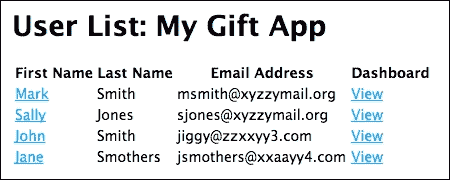
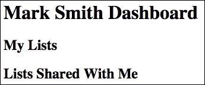
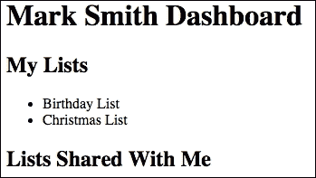
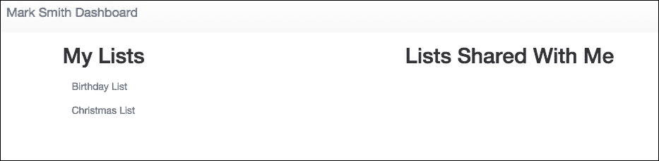
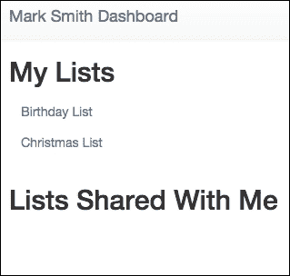
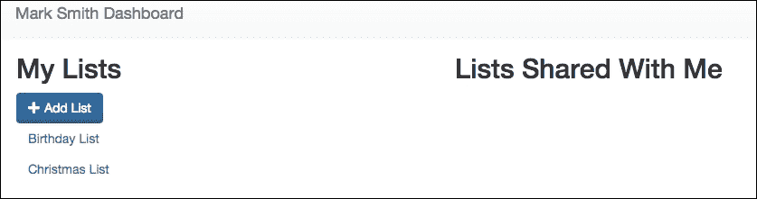
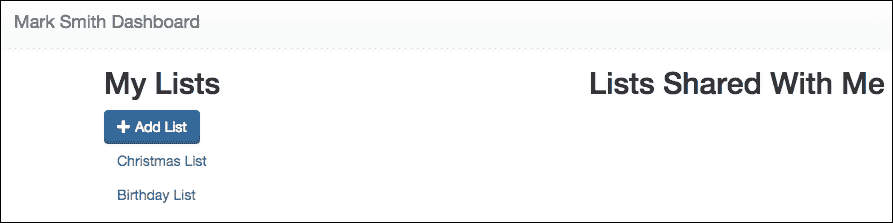
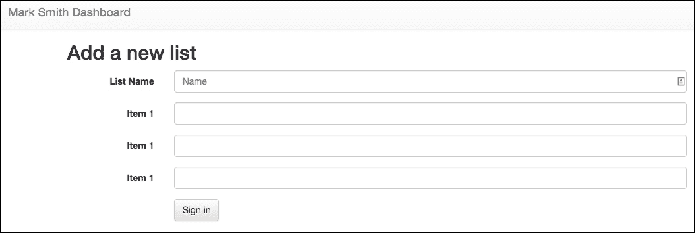
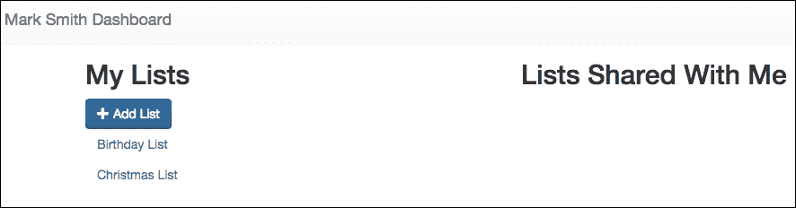

# 第十章。显示视图

大多数 SPA 的核心和灵魂是一个动态的前端。SPA 将与显示逻辑相关的许多繁重工作转移到浏览器上。现代浏览器拥有快速且强大的 JavaScript 引擎，可以处理比几年前多得多的计算。实际上，Node.js 是建立在 VB 引擎之上的，它是 Chrome 浏览器的一个标准部分。

然而，最重要的是，SPA 的主要思想是给用户提供接近桌面应用程序的体验。完整的页面加载已成为过去式，被状态中的快速变化所取代。

在本章中，我们将构建我们自己的 SPA 的核心。这将是一个用户可以构建 `giftlists` 并与其他用户分享的仪表板。我们还需要在后台构建更多路由和数据结构，但我们将专注于前端。我们将构建一个 Express 视图，该视图将加载 AngularJS - 一个专门为快速创建 SPA 而设计的 JavaScript 工具包。

我们将构建 AngularJS 路由、视图、服务和控制器，以实现 SPA 的核心功能。使用 AngularJS 插件 UI-router，我们将管理我们应用程序的状态。我们还将实现服务以与终端进行通信，以便数据可以在我们的应用程序中自由流动。

在本章中，我们将涵盖以下主题：

+   在 Express 中开发初始仪表板视图

+   实现 AngularJS

+   AngularJS 路由

+   使用 AngularJS `$resource` 访问 RESTful 端点

# 设置我们的仪表板

由于这是一个 SPA，我们需要设置一个单页来包含我们的应用程序。在我们的案例中，我们将构建一个用户仪表板。该仪表板将允许用户创建 `giftlists`（例如生日愿望清单），选择他们想要与之分享的人，并查看与他们分享的列表。在下一章中，我们将构建身份验证，以便单个用户只能看到他们自己的仪表板，但到目前为止，我们需要在没有身份验证的情况下进行一些模拟。

我们需要一些路由和一个视图。我们还将使用 `Bootstrap` 为我们的视图添加一些样式。

## 构建视图

我们需要为我们的仪表板创建一个视图。在您的视图目录中创建一个名为 `dash` 的新文件夹。在该文件夹内，创建一个名为 `dashboard.ejs` 的文件：

```js
<!DOCTYPE html> 
<html> 
<head> 
    <title>Dashboard for <%= user.firstName %> <%= user.lastName %> </title> 
</head> 
<body> 
<h1><%= user.firstName %> <%= user.lastName %> Dashboard</h1> 
<div> 
    <h2>My Lists</h2> 
</div> 

<div> 
    <h2>Lists Shared With Me</h2> 
</div> 

</body> 
</html> 

```

所以这里目前还没有什么特别激动人心的东西。我们已经设置了一些占位符，并假设我们将有一个 `user` 对象来显示。我们目前还看不到我们的视图 - 为了做到这一点，我们需要一个 `route` 来渲染视图。

让我们设置显示仪表板的 `route`。在您的 `routes` 目录中，创建一个名为 `dashboard.js` 的新文件：

```js
var express = require('express'); 
var router = express.Router(); 

router.get('/', function(req, res, next) { 
    res.send('respond with a resource'); 
}); 

router.param('id', function(req, res, next, id) { 
    var db = req.db; 
    var collection = db.get('users'); 
    collection.findOne({ "_id": id }, {}, function(err,User){ 
        if(err){ 
            res.send(err); 
        }else if(User){ 
            req.user = User; 
            next(); 
        } else { 
            res.send(new Error('User not found.')); 
        } 
    }); 
}); 

router.get('/:id', function(req, res, next){ 
    res.render('dash/dashboard', {user: req.user}); 
}); 

module.exports = router; 

```

我们在这里做了一些事情。首先，我们设置了我们的中间件来响应带有 id 参数的路由，就像我们为用户路由所做的那样。接下来，我们设置了一个用于显示仪表板的路由。

除非你记住了用户的 ID，否则测试我们的新视图将会很困难。让我们通过修改列出我们用户的视图来让它变得容易一些。打开`views/users/show.ejs`：

```js
<!DOCTYPE html> 
<html> 
<head> 
    <title>Show Users</title> 
    <link rel='stylesheet' href='/stylesheets/style.css' /> 
</head> 
<body> 
<h1>User List: <%= appName %></h1> 

<table> 
    <thead> 
        <tr> 

            <th>First Name</th> 
            <th>Last Name</th> 
            <th>Email Address</th> 
 <th>Dashboard</th> 
        </tr> 
    </thead> 
    <tbody> 
    <% users.forEach(function(user, index){ -%> 
        <tr> 
            <td><a href="show/<%= user._id%> "><%= user.firstName %></a></td> 
            <td><%= user.lastName %></td> 
            <td><%= user.email %></td> 
 <td><a href="/dash/<%= user._id %>">View</a></td> 
        </tr> 
    <% }); %> 
    </tbody> 
</table> 

</body> 
</html> 

```

我们在我们的用户表中添加了一个新列，其中包含指向每个用户仪表板的链接。我们仍然不能显示我们的仪表板。我们必须修改我们的`app.js`文件：

```js
var express = require('express'); 
var path = require('path'); 
var favicon = require('serve-favicon'); 
var logger = require('morgan'); 
var cookieParser = require('cookie-parser'); 
var bodyParser = require('body-parser'); 
var isJSON = require('./utils/json'); 
var routing = require('resource-routing'); 
var controllers = path.resolve('./controllers'); 

//Database stuff 
var mongodb = require('mongodb'); 
var monk = require('monk'); 
var db = monk('localhost:27017/giftapp') 

var routes = require('./routes/index'); 
var users = require('./routes/users'); 
var dashboard = require('./routes/dashboard'); 

var app = express(); 

// view engine setup 
app.set('views', path.join(__dirname, 'views')); 
app.set('view engine', 'ejs'); 

app.set('x-powered-by', false); 

app.locals.appName = "My Gift App"; 

// uncomment after placing your favicon in /public 
//app.use(favicon(path.join(__dirname, 'public', 'favicon.ico'))); 
app.use(logger('dev')); 
app.use(bodyParser.json()); 
app.use(bodyParser.urlencoded({ extended: false })); 
app.use(cookieParser()); 
app.use(express.static(path.join(__dirname, 'public'))); 
app.use(isJSON); 

//Database middleware 
app.use(function(req,res,next){ 
    req.db = db; 
    next(); 
}); 

app.use('/', routes); 
app.use('/users', users); 
app.use('/dash', dashboard); 

routing.resources(app, controllers, "giftlist"); 
routing.expose_routing_table(app, { at: "/my-routes" }); 

// catch 404 and forward to error handler 
app.use(function(req, res, next) { 
  var err = new Error('Not Found'); 
  err.status = 404; 
  next(err); 
}); 

// error handlers 

// development error handler 
// will print stacktrace 
if (app.get('env') === 'development') { 
  app.use(function(err, req, res, next) { 
    res.status(err.status || 500); 
    res.render('error', { 
      message: err.message, 
      error: err 
    }); 
  }); 
} 

// production error handler 
// no stacktraces leaked to user 
app.use(function(err, req, res, next) { 
  res.status(err.status || 500); 
  res.render('error', { 
    message: err.message, 
    error: {} 
  }); 
}); 

module.exports = app; 

```

这里的两个关键变化是，我们导入了仪表板路由器，然后我们将任何对`/dash`的请求映射到该`router`。

确保你的 MongoDB 守护进程仍在运行，如果不是，请重新启动它。启动或重新启动你的服务器。导航到你的用户列表`http://localhost:3000/users/show`，然后点击表格右侧的一个`view`链接：



URL 应该看起来像这样：`http://localhost:3000/dash/566dd0cb1c09d090fd36ba83`。你应该看到一个看起来像这样的页面：



现在我们已经设置了一个视图模板和路由来显示页面。接下来我们需要做的是构建一些数据。

## 连接到初始数据

我们的应用程序将允许用户构建`giftlists`并与其他用户共享。我们想稍微考虑一下我们想要如何表示我们的数据。一个好的数据模型将为我们服务，即使我们添加和更改功能。

正如我们所学的，MongoDB 非常灵活，我们可以在文档中嵌套文档。这可能可行；我们可以让每个用户都有一个列表数组。问题是，我们的单个用户文档将非常可变，并且很容易增长到巨大的大小。如果我们想在将来做一些像共享列表这样的操作，这也不提供很多灵活性。

我们现在想要的关系类型是一对多关系。一个用户可以有多个列表。我们将通过在列表本身上存储拥有该列表的用户的引用来实现这一点。如果我们以后想要让多个用户共同拥有一个列表，这个更改将会非常直接。

我们想使用我们的`giftapp`数据库，并且我们将创建一个新的`giftlists`集合。在一个新的终端窗口中启动 MongoDB 命令行工具。注意，你需要复制你其中一个用户的精确`ID`，因为这与我的不同：

```js
>use giftapp
switched to db giftapp
> db.giftlist.insert({'name':'Birthday List', 'gifts':[{'name':'ball'},
     {'name':'pony'},{'name':'gift card'}], 'owner_id':
       566dff161c09d090fd36ba85"})
WriteResult({ "nInserted" : 1 })
> db.giftlist.insert({'name':'Christmas  List', 'gifts':[{'name':'TV'},
      {'name':'Corvette'},{'name':'gift card'}], 'owner_id':
       566dff161c09d090fd36ba85"})
WriteResult({ "nInserted" : 1 })

```

这里重要的是插入语句的格式。让我们稍微分解一下。

```js
db.giftlist.insert({ 
    'name':'Christmas  List',  
    'gifts':[{'name':'TV'},{'name':'Corvette'},{'name':'gift card'}],  
    'owner_id': 566dff161c09d090fd36ba85") 
    } 
}) 

```

我们将这个对象插入到`giftlist`集合中，如果它还不存在，将会创建。该对象有一个名称属性和一个`gifts`属性。`gifts`属性是一个包含名称属性的对象数组。

我们还有一个`owner_id`属性。这个属性是对`giftlist`所属用户的引用。它只是用户`_id`的字符串。由于 MongoDB 是一个非关系型数据库，我们将把它放在这里，以便在`users`集合中进行查找。

我们知道我们将通过所有者来查找信息，所以让我们添加一个`索引`：

```js
> db.giftlist.ensureIndex({'owner_id':1})
{
 "createdCollectionAutomatically" : false,
 "numIndexesBefore" : 1,
 "numIndexesAfter" : 2,
 "ok" : 1
}

```

现在，让我们通过在命令行运行查询来看看我们得到了什么：

```js
>db.giftlist.find({'owner':{'$ref':'users','$id':ObjectId('566dff161c09d090fd36ba85')}}).pretty()
{
 "_id" : ObjectId("569bd08d94b6b374a00e8b49"),
 "name" : "Birthday List",
 "gifts" : [
 {
 "name" : "ball"
 },
 {
 "name" : "pony"
 },
 {
 "name" : "gift card"
 }
 ],
 "owner_id" : 566dff161c09d090fd36ba85"
}
{
 "_id" : ObjectId("569bd0d794b6b374a00e8b4a"),
 "name" : "Christmas  List",
 "gifts" : [
 {
 "name" : "TV"
 },
 {
 "name" : "Corvette"
 },
 {
 "name" : "gift card"
 }
 ],
 "owner_id" : "566dff161c09d090fd36ba85"
}

```

正如我们所期望的那样。

现在，让我们修改我们的`dashboard.js`路由：

```js
var express = require('express'); 
var router = express.Router(); 

router.get('/', function(req, res, next) { 
    res.send('respond with a resource'); 
}); 

router.param('id', function(req, res, next, id)
 { 
 var db = req.db; 
 var collection = db.get('giftlist'); 
 collection.find({'owner_id':id}, {}, function(err,giftlists)
{
 if(err){ 
 res.send(err); 
 }else if(giftlists)
{ 
 req.giftlists = giftlists; 
 collection = db.get('users');
 collection.findOne({"_id":id}, function(err, user)
{ 
 if(err){ 
 res.send(err); 
 } else
 { 
 req.user = user; 
 next(); 
 } 
 }); 
 } else { 
 res.send(new Error('User not found.')); 
 } 
 }); 
}); 

router.get('/:id', function(req, res, next){ 
 res.render('dash/dashboard', {user: req.user, giftlists: req.giftlists}); 
}); 

module.exports = router; 

```

我们已经修改了对`router.param()`的调用，以便根据传入的用户`id`搜索`giftlists`集合。如果我们得到了一个`giftlist`，我们接着搜索`users`集合以获取用户数据。

是的，这里有两个数据库调用。这是为了灵活性而牺牲性能的一点点权衡。记住，我们之前决定不在用户文档中嵌入`giftlists`。这种权衡是你自己应用中需要仔细思考的问题。

让我们也修改我们的`dashboard.ejs`视图模板：

```js
<!DOCTYPE html> 
<html> 
<head> 
    <title>Dashboard for <%= user.firstName %> <%= user.lastName %> </title> 
</head> 
<body> 
<h1><%= user.firstName %> <%= user.lastName %> Dashboard</h1> 
<div> 
    <h2>My Lists</h2> 

 <ul>
 <% giftlists.forEach(function(giftlist, index){ -%>
 <li><%= giftlist.name %></li>
 <% }); %>
 </ul> 
</div> 

<div> 
    <h2>Lists Shared With Me</h2> 
</div> 

</body> 
</html> 

```

现在我们有一个无序列表，它渲染了每个`giftlists`的名称。当我们开始添加 AngularJS 时，我们将链接每个这些到显示列表的状态。导航到`用户仪表板`页面，你应该看到如下内容：



现在我们有一个用户`giftlists`的列表以及与他们共享的列表的占位符。在不久的将来，当我们添加 AngularJS 时，我们也将添加添加、编辑和共享列表的代码。

目前，我们的仪表板有些丑陋。让我们稍微改进一下。

## 实现 Bootstrap

如果你之前没有听说过`Bootstrap`，它是一个非常流行的 CSS 框架。插入`Bootstrap`可以帮助前端开发者通过编写很少的手动代码来实现布局、绘制按钮和实现控件等功能。

你可以获取`Bootstrap`，并在[`getbootstrap.com`](https://getbootstrap.com)查看其文档。

让我们稍微美化一下我们的`dashboard.ejs`模板：

```js
<!DOCTYPE html> 
<html> 
<head> 
    <title>Dashboard for <%= user.firstName %> <%= user.lastName %> </title> 

    <meta name="viewport" content="width=device-width, initial-scale=1"> 

    <link rel="stylesheet" href="https://maxcdn.bootstrapcdn.com/bootstrap/3.3.6/css/bootstrap.min.css"> 
    <link rel="stylesheet" href="https://maxcdn.bootstrapcdn.com/bootstrap/3.3.6/css/bootstrap-theme.min.css"> 

</head> 
<body> 
<nav class="nav navbar-default"> 
    <div class="container-fluid"> 
        <div class="navbar-header"> 
            <a class="navbar-brand" href="#"><%= user.firstName %> <%= user.lastName %> Dashboard</a> 
        </div> 
    </div> 
</nav> 

<div class="container"> 
    <div class="row"> 
        <div class="col-xs-12 col-md-6"> 
            <h2>My Lists</h2> 

            <ul class="list-unstyled"> 
            <% giftlists.forEach(function(giftlist, index){ -%> 
                <li><a class="btn btn-link" href="#" role="button"><%= giftlist.name %></a></li> 
            <% }); %> 
            </ul> 
        </div> 

        <div class="col-xs-12 col-md-6"> 
            <h2>Lists Shared With Me</h2> 
        </div> 
    </div> 
</div> 

</body> 
</html> 

```

在文档的头部，你会看到三行新内容。第一行是一个`meta`标签，它为移动设备设置了视口。接下来的两行从 CDN 加载了`Bootstrap`和`Bootstrap`主题。

我们然后将之前放在`H1`标签内的内容放入多个元素中，这将绘制页面顶部的导航栏。

下一个部分是一个具有`container`类的`div`元素。这对于`Bootstrap`布局是必要的。`Bootstrap`使用一个网格系统进行布局，包括行和列。基本上，在每一行中，有 12 个宽度相等的列。

类似于`col-xs-12`的类告诉`Bootstrap`，当视口非常小（如手机）时，该特定元素应占据容器的整个宽度。`col-md-6`类使得元素在屏幕宽度中等或更大时宽度为半宽（六个列）。通过组合这些类，我们可以有一个基于屏幕宽度的可变布局，这是所谓的响应式设计的主要组成部分。

全屏查看我们的仪表板，我们看到如下内容：



在全尺寸下，我们的仪表板分为两个等宽的列。您还可以看到我们的顶部`nav`栏正在渲染**Mark Smith Dashboard**。现在，如果您将浏览器的一侧拖动以使其变窄，就像手机屏幕一样，您会看到这个：



我们现在将列堆叠在一起，这对于移动设备格式来说更有意义。让我们添加一个按钮元素来添加新的列表，我们稍后会将其连接起来：

```js
<!DOCTYPE html> 
<html> 
<head> 
    <title>Dashboard for <%= user.firstName %> <%= user.lastName %> </title> 

    <meta name="viewport" content="width=device-width, initial-scale=1"> 

    <link rel="stylesheet" href="https://maxcdn.bootstrapcdn.com/bootstrap/3.3.6/css/bootstrap.min.css"> 
    <link rel="stylesheet" href="https://maxcdn.bootstrapcdn.com/bootstrap/3.3.6/css/bootstrap-theme.min.css"> 

</head> 
<body> 
<nav class="nav navbar-default"> 
    <div class="container-fluid"> 
        <div class="navbar-header"> 
            <a class="navbar-brand" href="#"><%= user.firstName %> <%= user.lastName %> Dashboard</a> 
        </div> 
    </div> 
</nav> 

<div class="container"> 
    <div class="row"> 
        <div class="col-xs-12 col-md-6"> 
            <h2>My Lists</h2> 
 <button class="btn btn-primary">
 <span class="glyphicon glyphicon-plus" aria-hidden="true"></span>
 Add List</button> 
            <ul class="list-unstyled"> 
            <% giftlists.forEach(function(giftlist, index){ -%> 
                <li><a class="btn btn-link" href="#" role="button"><%= giftlist.name %></a></li> 
            <% }); %> 
            </ul> 
        </div> 

        <div class="col-xs-12 col-md-6"> 
            <h2>Lists Shared With Me</h2> 
        </div> 
    </div> 
</div> 

<script src="img/jquery.min.js"></script> 
<script src="img/bootstrap.min.js" ></script> 
</body> 
</html> 

```

我们添加了一个具有`btn-primary`类的按钮。在该按钮内部，我们有一个带有几个`glyphicon`类的 span。这些类实际上使用一种字体来绘制不同类型的常见符号。

查看我们的页面，我们会看到一个带有加号的漂亮蓝色按钮：



我们将开发更多的视觉组件作为 AngularJS 视图。

# 实现 AngularJS

现在是时候通过实现一个更健壮的 AngularJS 应用程序来实现我们的大部分视图逻辑了。我们首先需要做的是将 AngularJS 代码添加到我们的`dashboard.ejs`视图模板中：

```js
<!DOCTYPE html> 
<html ng-app> 
<head> 
    <title>Dashboard for <%= user.firstName %> <%= user.lastName %> </title> 

    <meta name="viewport" content="width=device-width, initial-scale=1"> 

    <link rel="stylesheet" href="https://maxcdn.bootstrapcdn.com/bootstrap/3.3.6/css/bootstrap.min.css"> 
    <link rel="stylesheet" href="https://maxcdn.bootstrapcdn.com/bootstrap/3.3.6/css/bootstrap-theme.min.css"> 
 <script src="img/angular.min.js"></script>
 <script src="img/angular-ui-router.min.js"></script> 

</head> 
<body> 
<nav class="nav navbar-default"> 
    <div class="container-fluid"> 
        <div class="navbar-header"> 
            <a class="navbar-brand" href="#"><%= user.firstName %> <%= user.lastName %> Dashboard</a> 
        </div> 
    </div> 
</nav> 

<div class="container"> 
    <div class="row"> 
        <div class="col-xs-12 col-md-6"> 
            <h2>My Lists</h2> 
            <button class="btn btn-primary"> 
                <span class="glyphicon glyphicon-plus" aria-hidden="true"></span> 
                Add List</button> 
            <ul class="list-unstyled"> 
            <% giftlists.forEach(function(giftlist, index){ -%> 
                <li><a class="btn btn-link" href="#" role="button"><%= giftlist.name %></a></li> 
            <% }); %> 
            </ul> 
        </div> 

        <div class="col-xs-12 col-md-6"> 
            <h2>Lists Shared With Me</h2> 
        </div> 
    </div> 
</div> 

</body> 
</html> 

```

我们在 CDN 上链接了 AngularJS 版本 1.4.8，以及一个名为 UI-router 的插件。我们将深入讨论 UI-router。我们还向打开的`html`标签添加了 AngularJS 指令`ng-app`。当 AngularJS 加载时，它会查找这个指令以确定它应该管理文档的哪个部分。大多数应用程序将通过这种方式从顶级开始由 Angular 管理，尽管可以将 AngularJS 引导到文档的任何部分。

## 我们的 AngularJS 模块

AngularJS 使用模块打包应用程序、应用程序的部分和依赖项。我们将使用 AngularJS 完成的每一件事都将通过使用模块或使用代码来完成，例如控制器，这些控制器已被添加到模块中。

这是 AngularJS 架构的核心部分。模块是应用程序部分的容器，并允许 AngularJS 正确地`Bootstrap`您的应用程序。

目前，我们的模块将保持简单，然后我们会随着进展逐步添加功能。在`public/javascripts`目录下创建一个名为`giftapp.js`的新文件：

```js
var giftAppModule = angular.module('giftAppModule', ['ui.router']); 

```

我们通过调用`angular.module()`函数来创建我们的模块。第一个参数是模块的名称。第二个参数是一个数组，包含我们想要注入到模块中的依赖项列表。在这种情况下，我们目前只注入了 UI-router。

现在，我们需要将我们的模块添加到我们的`dashboard.ejs`模板中：

```js
<!DOCTYPE html> 
<html ng-app="giftAppModule"> 
<head>  
    <title>Dashboard for <%= user.firstName %> <%= user.lastName %> </title> 

    <meta name="viewport" content="width=device-width, initial-scale=1"> 

    <link rel="stylesheet" href="https://maxcdn.bootstrapcdn.com/bootstrap/3.3.6/css/bootstrap.min.css"> 
    <link rel="stylesheet" href="https://maxcdn.bootstrapcdn.com/bootstrap/3.3.6/css/bootstrap-theme.min.css"> 
    <script src="img/angular.min.js"></script> 
    <script src="img/angular-ui-router.min.js"></script> 

</head> 
<body> 
<nav class="nav navbar-default"> 
    <div class="container-fluid"> 
        <div class="navbar-header"> 
            <a class="navbar-brand" href="#"><%= user.firstName %> <%= user.lastName %> Dashboard</a> 
        </div> 
    </div> 
</nav> 

<div class="container"> 
    <div class="row"> 
        <div class="col-xs-12 col-md-6"> 
            <h2>My Lists</h2> 
            <button class="btn btn-primary"> 
                <span class="glyphicon glyphicon-plus" aria-hidden="true"></span> 
                Add List</button> 
            <ul class="list-unstyled"> 
            <% giftlists.forEach(function(giftlist, index){ -%> 
                <li><a class="btn btn-link" href="#" role="button"><%= giftlist.name %></a></li> 
            <% }); %> 
            </ul> 
        </div> 

        <div class="col-xs-12 col-md-6"> 
            <h2>Lists Shared With Me</h2> 
        </div> 
    </div> 
</div> 

<script src="img/giftapp.js"></script> 
</body> 
</html> 

```

我们只需使用一个普通的`script`标签来加载我们的模块。同时，我们更改了`ng-app`指令，使其将我们的新模块作为页面的主要应用程序入口点。

## 使用 UI-router 控制状态

在应用程序中，状态可以指很多事物，但在我们的 SPA 中，它指的是一组特定的视图、控制器和数据，可以通过 URL 更改器来调用。到目前为止，开发者处理 AngularJS 应用程序状态最流行的方式是使用一个名为 UI-router 的插件。

UI-router 插件允许我们优雅地控制状态，并且非常灵活。

让我们在应用程序中实现 UI-router。首先，我们将在`dashboard.ejs`模板中从 CDN 引用 UI-router：

```js
<!DOCTYPE html> 
<html ng-app="giftapp"> 
<head > 
    <title>Dashboard for <%= user.firstName %> <%= user.lastName %> </title> 

    <meta name="viewport" content="width=device-width, initial-scale=1"> 

    <link rel="stylesheet" href="https://maxcdn.bootstrapcdn.com/bootstrap/3.3.6/css/bootstrap.min.css"> 
    <link rel="stylesheet" href="https://maxcdn.bootstrapcdn.com/bootstrap/3.3.6/css/bootstrap-theme.min.css"> 
    <script src="img/angular.min.js"></script> 
 <script src="img/angular-ui-router.min.js"></script> 

</head> 
<body> 
<nav class="nav navbar-default"> 
    <div class="container-fluid"> 
        <div class="navbar-header"> 
            <a class="navbar-brand" href="#"><%= user.firstName %> <%= user.lastName %> Dashboard</a> 
        </div> 
    </div> 
</nav> 

<div class="container"> 

 <div ui-view></div> 

</div> 

<script src="img/giftapp.js"></script> 
</body> 
</html> 

```

我们在 CDN 上链接了 UI-router 并使用正常的`script`标签加载它。我们模板中的另一个主要变化是在`div`元素上实现了一个`ui-view`指令作为属性。`ui-view`指令告诉 UI-router 在哪里加载它将要绘制的视图。

下一步是编辑我们的`giftapp.js`应用程序文件以添加路由：

```js
angular.module('giftapp', ['ui.router']) 

    .config( 
        ['$stateProvider', '$urlRouterProvider', 
            function ($stateProvider,   $urlRouterProvider) { 

                $urlRouterProvider 
                    .otherwise('/dash'); 

                $stateProvider 

                    .state('dash', { 
                        url:'/dash', 
                        templateUrl: '/templates/dash-main.tpl.html' 
                    }) 
                    .state('add', { 
                        url:'/add', 
                        templateUrl: '/templates/dash-add.tpl.html' 
                    }); 

            }]); 

```

首先，我们确保将`ui.router`模块注入到我们的模块中。我们将一个`config`函数链接到我们的模块声明。使用数组表示法，我们将`$stateProvider`和`$urlRouteprovider`注入到`config`函数中。

在那个函数内部，魔法发生了。首先，我们调用`$urlRouterProvider.otherwise('/dash');`，这设置了默认路由。当我们加载页面时，除非另一个路由通过 URL 片段触发，否则`#/dash`将被附加到 URL 上。

接下来，我们在`$stateProvider`上设置两个状态。目前，每个状态都有一个名称、URL 和`templateURL`属性。模板 URL 指向一个用于加载的可视模板的 URL。

让我们模拟我们的两个模板。在`public/templates`下创建一个新的目录。

这是我们的`dash-main.tpl.html`：

```js
<div class="row"> 
    <div class="col-xs-12 col-md-6"> 
        <h2>My Lists</h2> 
        <a class="btn btn-primary" role="button" ui-sref="add" href="#/add"> 
            <span class="glyphicon glyphicon-plus" aria-hidden="true"></span> 
            Add List</a> 
        <ul class="list-unstyled"> 

            <li><a class="btn btn-link" href="#" role="button">Angular Router List</a></li> 
            <li><a class="btn btn-link" href="#" role="button">Angular Router List 2</a></li> 
        </ul> 
    </div> 

    <div class="col-xs-12 col-md-6"> 
        <h2>Lists Shared With Me</h2> 
    </div> 
</div> 

```

这是我们的`dash-add.tpl.html`文件：

```js
<div class="row"> 
    <div class="col-md-12"> 
        <h2>Add a new list</h2> 
        <form class="form-horizontal"> 
            <div class="form-group"> 
                <label for="listname" class="col-sm-2 control-label">List Name</label> 
                <div class="col-sm-10"> 
                    <input type="text" class="form-control" id="listname" placeholder="Name"> 
                </div> 
            </div> 
            <div class="form-group"> 
                <label for="item[]" class="col-sm-2 control-label">Item 1</label> 
                <div class="col-sm-10"> 
                    <input type="text" class="form-control" id="Item[]"> 
                </div> 
            </div> 
            <div class="form-group"> 
                <label for="item[]" class="col-sm-2 control-label">Item 1</label> 
                <div class="col-sm-10"> 
                    <input type="text" class="form-control" id="Item[]"> 
                </div> 
            </div> 
            <div class="form-group"> 
                <label for="item[]" class="col-sm-2 control-label">Item 1</label> 
                <div class="col-sm-10"> 
                    <input type="text" class="form-control" id="Item[]"> 
                </div> 
            </div> 
            <div class="form-group"> 
                <div class="col-sm-offset-2 col-sm-10"> 
                    <a href="#/dash" class="btn btn-default"> 
                    Save 
                    </a> 
                </div> 
            </div> 
        </form> 

    </div> 

</div> 

```

在这里，我们模拟了一个可以用来添加新列表的表单。我们稍后会完善它，并将其实际连接到后端以存储数据。

## AngularJS 控制器

目前，我们的模板基本上只是简单的 HTML，使用 AngularJS 方法将我们的 DOM 与数据和功能链接起来。控制器包含业务逻辑，但不应该直接用于操作 DOM。

在使用 UI-router 时，我们可以轻松地将控制器附加到状态，使它们的`$scope`可用于我们的视图。

在`public/javascripts`内部创建一个新的控制器文件夹。创建一个名为`dashMainController.js`的新 JavaScript 文件：

```js
angular.module('giftappControllers',[]) 
    .controller('DashMainController', ['$scope', function($scope) { 
        $scope.lists = [{'name':'Christmas List'}, {'name':'Birthday List'}]; 
    }]); 

```

我们创建了一个名为`giftAppControllers`的新模块，它没有依赖项。然后，我们构建了一个名为`DashMainController`的控制器。使用数组表示法，我们注入`$scope`然后声明一个构造函数。

在那个函数内部，我们将一个列表数组附加到`$scope`上，这将使它可用于任何引用此控制器的视图。

接下来，我们需要将那个文件加载到`dashboard.ejs`视图模板中：

```js
<!DOCTYPE html> 
<html ng-app="giftapp"> 
<head > 
    <title>Dashboard for <%= user.firstName %> <%= user.lastName %> </title> 

    <meta name="viewport" content="width=device-width, initial-scale=1"> 

    <link rel="stylesheet" href="https://maxcdn.bootstrapcdn.com/bootstrap/3.3.6/css/bootstrap.min.css"> 
    <link rel="stylesheet" href="https://maxcdn.bootstrapcdn.com/bootstrap/3.3.6/css/bootstrap-theme.min.css"> 
    <script src="img/angular.min.js"></script> 
    <script src="img/angular-ui-router.min.js"></script> 

</head> 
<body> 
<nav class="nav navbar-default"> 
    <div class="container-fluid"> 
        <div class="navbar-header"> 
            <a class="navbar-brand" href="#"><%= user.firstName %> <%= user.lastName %> Dashboard</a> 
        </div> 
    </div> 
</nav> 

<div class="container"> 

    <div ui-view></div> 

    <!-- div class="row"> 
        <div class="col-xs-12 col-md-6"> 
            <h2>My Lists</h2> 
            <a class="btn btn-primary" role="button" ui-sref="add"> 
                <span class="glyphicon glyphicon-plus" aria-hidden="true"></span> 
                Add List</a> 
            <a class="btn btn-primary" role="button" ui-sref="dash"> 
                <span class="glyphicon glyphicon-plus" aria-hidden="true"></span> 
                Add List</a> 
            <ul class="list-unstyled"> 
            <% giftlists.forEach(function(giftlist, index){ -%> 
                <li><a class="btn btn-link" role="button"><%= giftlist.name %></a></li> 
            <% }); %> 
            </ul> 
        </div> 

        <div class="col-xs-12 col-md-6"> 
            <h2>Lists Shared With Me</h2> 
        </div> 
    </div --> 

</div> 

<script src="img/giftapp.js"></script> 
<script src="img/dashMainController.js"></script> 
</body> 
</html> 

```

你会注意到你可以在主模块之后加载控制器模块。

接下来，我们需要编辑我们的主要`giftapp.js`模块以使用新的控制器作为路由的一部分：

```js
angular.module('giftapp', ['ui.router', 'giftappControllers' ]) 

    .config( 
        ['$stateProvider', '$urlRouterProvider', 
            function ($stateProvider, $urlRouterProvider) { 

                $urlRouterProvider 
                    .otherwise('/dash'); 

                $stateProvider 

                    .state('dash', { 
                        url:'/dash', 
                        templateUrl: '/templates/dash-main.tpl.html', 
 controller: 'DashMainController' 
                    }) 
                    .state('add', { 
                        url:'/add', 
                        templateUrl: '/templates/dash-add.tpl.html', 

                    }); 

            }]); 

```

我们首先将新的控制器模块注入到我们的`giftapp`模块中。这使得`DashMainController`在模块中可用。然后，我们将它的名称（作为一个字符串）设置为`dash`状态的控制器属性。

我们最后应该做的事情是修改我们的模板，以便利用我们新的控制器。控制器中添加到`$scope`的任何方法或属性都将在视图中可用。

这是我们的新`dash-main.tpl.html`：

```js
<div class="row"> 
    <div class="col-xs-12 col-md-6"> 
        <h2>My Lists</h2> 
        <a class="btn btn-primary" role="button" ui-sref="add" href="#/add"> 
            <span class="glyphicon glyphicon-plus" aria-hidden="true"></span> 
            Add List</a> 
        <ul class="list-unstyled"> 
 <li ng-repeat="list in lists"><a class="btn btn-link" href="#" role="button">{{ list.name }}</a></li> 

        </ul> 
    </div> 

    <div class="col-xs-12 col-md-6"> 
        <h2>Lists Shared With Me</h2> 
    </div> 
</div> 

```

我们不依赖于预制的列表项，而是依赖于由 AngularJS 本身提供的`ng-repeat`指令。`ng-repeat`指令遍历可迭代的事物 - 在这种情况下是一个名为 list 的数组。对于数组的每个成员，指令将绘制一个`li`元素，并将实例分配给变量 list（本质上创建了一个新的作用域）。由于我们的列表对象都有 name 属性，我们可以在标记表达式中通过`{{list.name}}`访问它。

确保我们的数据库和服务器正在运行，刷新我们的仪表板应该看起来像这样：



**圣诞清单**和**生日清单**来自我们新控制器中的`$scope`。点击**添加清单**按钮将我们带到添加状态，页面突然看起来像这样：



因此，我们现在已经拥有了一个单页 Web 应用程序的核心。我们有模型、视图和控制器。我们有管理状态的方法。

在模拟这个功能时，我们确实移除了与数据库的连接。所以，让我们按照 AngularJS 的方式将其添加回来。

# 与后端通信

因此，我们现在需要将我们的前端连接到后端。我们不想在页面加载时渲染数据，而是想使用 AJAX 进行连接并执行所有的 CRUD 操作。幸运的是，Angular 有一个相当优雅的方式来处理这个问题。

## 创建一个 AngularJS 工厂

假设我们的应用程序的不同部分可能需要访问一些相同的数据端点，或者一些其他功能。一个处理这个问题的好方法是使用 AngularJS 提供者。提供者本质上是一个可注入的单例，并且有多个选项可用 - 请参阅[`docs.angularjs.org/guide/providers`](https://docs.angularjs.org/guide/providers)。

我们将要使用的提供者类型是一个工厂。让我们首先在我们的`public/javascripts`目录内创建一个`services`目录。在那个目录内创建一个名为`giftlistFactory.js`的新文件：

```js
angular.module('giftlistServices', []) 
    .factory('List', function(){ 
        return {} 
    }); 

```

我们为服务创建了一个新的模块，并在该模块上创建了一个名为`List`的工厂。这个工厂目前还没有做什么，但我们会做到这一点。

接下来，我们将使用`dashboard.ejs`模板中的`script`标签来加载这个文件：

```js
<!DOCTYPE html> 
<html ng-app="giftapp"> 
<head > 
    <title>Dashboard for <%= user.firstName %> <%= user.lastName %> </title> 

    <meta name="viewport" content="width=device-width, initial-scale=1"> 

    <link rel="stylesheet" href="https://maxcdn.bootstrapcdn.com/bootstrap/3.3.6/css/bootstrap.min.css"> 
    <link rel="stylesheet" href="https://maxcdn.bootstrapcdn.com/bootstrap/3.3.6/css/bootstrap-theme.min.css"> 
    <script src="img/angular.min.js"></script> 
    <script src="img/angular-ui-router.min.js"></script> 

</head> 
<body> 
<nav class="nav navbar-default"> 
    <div class="container-fluid"> 
        <div class="navbar-header"> 
            <a class="navbar-brand" href="#"><%= user.firstName %> <%= user.lastName %> Dashboard</a> 
        </div> 
    </div> 
</nav> 

<div class="container"> 

    <div ui-view></div> 

</div> 

<script src="img/giftapp.js"></script> 
<script src="img/dashMainController.js"></script> 
<script src="img/giftlistFactory.js"></script> 
</body> 
</html> 

```

现在我们已经加载了这个模块，我们可以将其注入到我们的控制器中。打开`dashMainController.js`并编辑以下内容：

```js
angular.module('giftappControllers',['giftlistServices'])
 .controller('DashMainController', ['$scope','List', function($scope,List) { 
        $scope.lists = [{'name':'Christmas List'}, {'name':'Birthday List'}]; 
    }]); 

```

我们将`giftlistServices`模块注入到我们的`giftappControllers`模块中。在我们的`DashMainController`中，我们注入了`List`工厂。目前，`List`只返回一个空对象，但未来放入那里的任何内容都将对控制器可用。

## 使用 AngularJS $resource

开发 AngularJS 的聪明人意识到，在 SPA 中人们想要做很多事情都是与 RESTful 服务进行交互。他们有了在他们的`$http`服务（提供 AJAX 功能）之上构建工厂的想法，这将提供一个与 RESTful 接口交互的简单方法。这正是`$resource`所做的事情。

我们将首先加载`ngResource`模块，该模块公开了`$resource`。在我们的`dashboard.ejs`模板中，添加一个`script`标签以从 CDN 加载模块：

```js
<!DOCTYPE html> 
<html ng-app="giftapp"> 
<head > 
    <title>Dashboard for <%= user.firstName %> <%= user.lastName %> </title> 

    <meta name="viewport" content="width=device-width, initial-scale=1"> 

    <link rel="stylesheet" href="https://maxcdn.bootstrapcdn.com/bootstrap/3.3.6/css/bootstrap.min.css"> 
    <link rel="stylesheet" href="https://maxcdn.bootstrapcdn.com/bootstrap/3.3.6/css/bootstrap-theme.min.css"> 
    <script src="img/angular.min.js"></script> 
    <script src="img/angular-ui-router.min.js"></script> 
    <script src="img/angular-resource.js"></script> 

</head> 
<body> 
<nav class="nav navbar-default"> 
    <div class="container-fluid"> 
        <div class="navbar-header"> 
            <a class="navbar-brand" href="#"><%= user.firstName %> <%= user.lastName %> Dashboard</a> 
        </div> 
    </div> 
</nav> 

<div class="container"> 

    <div ui-view></div> 

</div> 

<script src="img/giftapp.js"></script> 
<script src="img/dashMainController.js"></script> 
<script src="img/giftlistFactory.js"></script> 
</body> 
</html> 

```

现在我们已经加载了模块，让我们编辑我们的工厂以利用`$resource`。打开`giftlistFactory`并做出以下编辑：

```js
angular.module('giftlistServices', ['ngResource']) 
    .factory('List', function($resource){ 
        return $resource('/giftlist/:id',{id: '@_id'}) 
    }); 

```

你可以看到我们在我们的模块中注入了`ngResource`模块。这使我们能够将`$resource`注入到我们的`List`工厂中。最后，我们返回调用`$resouce`并带有路径`/giftlist/:id`的结果。这与第二个参数结合，设置了一系列可选地包含`id`的函数。

记得我们之前构建的资源丰富的控制器吗？现在我们将使用一些硬编码的数据进行编辑。打开`controllers/giftlist_controller.js`：

```js
exports.index = function(req, res){ 

        var db = req.db; 
        var collection = db.get('giftlist'); 

        collection.find({'owner_id':'566dd0cb1c09d090fd36ba83'}, {}, function(err,giftlists){ 
            if(err){ 
                res.send(err); 
            }else if(giftlists){ 
                res.json(giftlists); 

            }; 
        }); 

}; 

```

目前，只需编辑`index`。你可以看到我已经硬编码了查询的`owner_id`以匹配我在数据库中工作的用户。你应该相应地匹配你的`user id`，因为它将不同于我的。

现在，编辑你的`dashMainController.js`文件：

```js
angular.module('giftappControllers',['giftlistServices']) 
    .controller('DashMainController', ['$scope','List', function($scope,List) { 
 $scope.lists = List.query(); 

    }]); 

```

我们将`$scope.lists`的值设置为对`List`资源进行查询的结果。在这种情况下，结果是对象数组。如果你重新启动你的服务器然后重新加载页面，你会看到这个：



# 摘要

在这一章中，你构建了 SPA UI 方面的主要部分。你首先在 Express 中构建了一个视图。你包括了`Bootstrap`以进行一些简单的样式、布局和响应式设计。然后你重构了页面以利用 AngularJS。

你使用 AngularJS 设置了模块、路由、模板和一个控制器。然后你构建了一个工厂并将`$resource`注入其中。你开始从 RESTful 端点访问数据，然后通过将数据映射到控制器中的`$scope`来在应用程序中显示这些数据。
