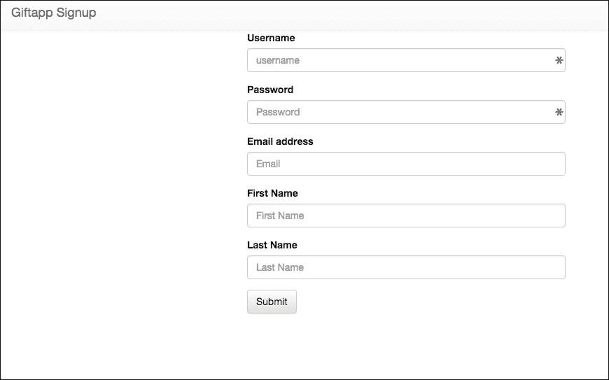
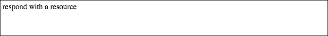
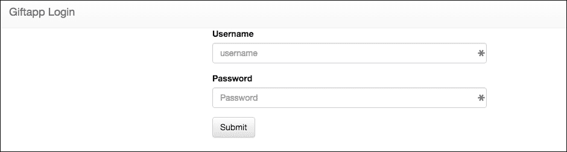
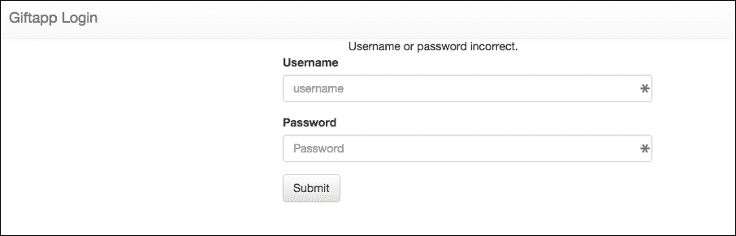
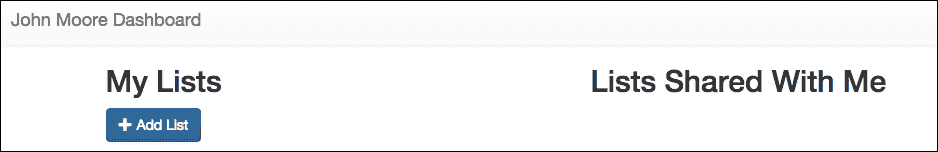

# 第十一章。添加安全和身份验证

在前面的章节中，我们模拟了用户，以便我们可以测试各种功能，但显然这不是我们希望应用程序继续工作的方式。我们希望只有授权用户才能添加和编辑他们的列表并与他人分享。我们的应用程序目前安全性不高。

身份验证几乎是每个 Web 应用程序的基本功能。我们有一个很好的选项来管理用户注册、登录和访问受保护的路由。我们将为 Node.js 安装 Passport 身份验证中间件，对其进行本地身份验证配置，并设置会话管理。我们将保护仪表板路由，以确保只有经过身份验证的用户才能看到自己的仪表板。

在本章中，我们将使用 Node.js 和 Express 中间件通过防止常见的漏洞，如**跨站请求伪造**（**CSRF**）来保护我们的单页应用（SPA）。我们还将讨论在部署期间我们将处理的其他安全关注点。

本章将涵盖以下主题：

+   设置 **Passport** 以实现用户身份验证

+   创建用于注册和登录的本地身份验证策略

+   使用 **Mongoose** 模型用户

+   保护路由

+   在我们的应用程序中添加安全头并防止 CSRF 攻击

# 使用 Passport 添加身份验证

Passport 是一个具有单一目的的 Node.js 插件，即验证请求。也就是说，确保只有登录的用户和应该能够发出某些请求的人才能这样做。身份验证是每个 Web 应用程序的基本安全功能，包括单页应用（SPAs）。

Passport 非常灵活，允许通过多种不同的方式实现身份验证，这些方式被称为策略。策略包括使用简单的用户名和密码登录，或者使用**OAuth**通过 Facebook 或 Twitter 登录。Passport 提供了超过 100 种不同的策略，我们应该用于身份验证。本章将重点介绍本地身份验证策略，而下一章将集成社交媒体策略。

与大多数与 Express 一起使用的插件一样，Passport 是中间件，因此它的使用对我们来说很熟悉。这是一个很好的架构，因为它在我们的应用程序中保持了关注点的分离。

## 安装 Passport

我们需要做的第一件事是安装 Passport。获取实际的 Passport 模块非常简单，我们只需使用 `npm` 安装它：

```js
$ npm install passport --save
passport@0.3.2 node_modules/passport
|- pause@0.0.1
|_ passport-strategy@1.0.0

```

我们还需要单独安装我们将为 Passport 使用的每个策略：

```js
$ npm install passport-local -save
passport-local@1.0.0 node_modules/passport-local
|_ passport-strategy@1.0.0

```

我们最不需要的就是一些中间件来管理用户会话。为此，我们将安装`express-session`包：

```js
$ npm install express-session -save
express-session@1.13.0 node_modules/express-session
|- utils-merge@1.0.0
|- cookie-signature@1.0.6
|- parseurl@1.3.1
|- cookie@0.2.3
|- on-headers@1.0.1
|- depd@1.1.0
|- crc@3.4.0
|- uid-safe@2.0.0 (base64-url@1.2.1)

```

接下来，我们需要将 Passport 添加到我们的应用程序中。打开我们的主 `app.js` 文件并做出以下修改：

```js
var express = require('express'); 
var path = require('path'); 
var favicon = require('serve-favicon'); 
var logger = require('morgan'); 
var cookieParser = require('cookie-parser'); 
var bodyParser = require('body-parser'); 
var isJSON = require('./utils/json'); 
var routing = require('resource-routing'); 
var controllers = path.resolve('./controllers'); 

//Database stuff 
var mongodb = require('mongodb'); 
var monk = require('monk'); 
var db = monk('localhost:27017/giftapp'); 

var routes = require('./routes/index'); 
var users = require('./routes/users'); 
var dashboard = require('./routes/dashboard'); 

var app = express(); 

// view engine setup 
app.set('views', path.join(__dirname, 'views')); 
app.set('view engine', 'ejs'); 

app.set('x-powered-by', false); 

app.locals.appName = "My Gift App"; 

// uncomment after placing your favicon in /public 
//app.use(favicon(path.join(__dirname, 'public', 'favicon.ico'))); 
app.use(logger('dev')); 
app.use(bodyParser.json()); 
app.use(bodyParser.urlencoded({ extended: false })); 
app.use(cookieParser()); 
app.use(express.static(path.join(__dirname, 'public'))); 
app.use(isJSON); 

var passport = require('passport');
var expressSession = require('express-session');
app.use(expressSession({secret: 'someKeyYouPick'}));
app.use(passport.initialize());
app.use(passport.session()); 

//Database middleware 
app.use(function(req,res,next){ 
    req.db = db; 
    next(); 
}); 

app.use('/', routes); 
app.use('/users', users); 
app.use('/dash', dashboard); 

routing.resources(app, controllers, "giftlist"); 
routing.expose_routing_table(app, { at: "/my-routes" }); 

// catch 404 and forward to error handler 
app.use(function(req, res, next) { 
  var err = new Error('Not Found'); 
  err.status = 404; 
  next(err); 
}); 

// error handlers 

// development error handler 
// will print stacktrace 
if (app.get('env') === 'development') { 
  app.use(function(err, req, res, next) { 
    res.status(err.status || 500); 
    res.render('error', { 
      message: err.message, 
      error: err 
    }); 
  }); 
} 

// production error handler 
// no stacktraces leaked to user 
app.use(function(err, req, res, next) { 
  res.status(err.status || 500); 
  res.render('error', { 
    message: err.message, 
    error: {} 
  }); 
}); 

module.exports = app; 

```

在任何路由之前，确保我们引入并初始化 Passport 非常重要，以确保我们的身份验证对路由可用。在初始化`expressSession`时，设置一个与我在这里给出的不同的密钥。它可以是任何字符串。

我们几乎准备好了。Express 本地策略假定存储在 MongoDB 数据库中的用户。我们已经有了一个带有用户表的 MongoDB 数据库，但我们确实需要强制一致性，并且有一个简单的方式来建模我们的数据。

## 使用 Mongoose 配置数据库

我们将使用一个名为 Mongoose 的包。Mongoose 是 Node.js 的数据建模工具，在 Express 包中广泛使用。在我们之前直接访问数据库的地方，我们现在将让 Mongoose 为我们做很多繁重的工作。

### 安装和配置 Mongoose

与其他模块一样，我们将使用`npm`来安装`mongoose`：

```js
$ npm install mongoose -save
mongoose@4.3.7 node_modules/mongoose
|- ms@0.7.1
|- regexp-clone@0.0.1
|- hooks-fixed@1.1.0
|- async@0.9.0
|- mpromise@0.5.4
|- mpath@0.1.1
|- muri@1.0.0
|- sliced@0.0.5
|- kareem@1.0.1
|- bson@0.4.21
|- mquery@1.6.3 (bluebird@2.9.26)
|_ mongodb@2.1.4 (es6-promise@3.0.2, readable-stream@1.0.31, kerberos@0.0.18, mongodb-core@1.2.32)

```

现在我们将在`app.js`文件中添加初始化 Mongoose 的代码：

```js
var express = require('express'); 
var path = require('path'); 
var favicon = require('serve-favicon'); 
var logger = require('morgan'); 
var cookieParser = require('cookie-parser'); 
var bodyParser = require('body-parser'); 
var isJSON = require('./utils/json'); 
var routing = require('resource-routing'); 
var controllers = path.resolve('./controllers'); 

//Database stuff 
var mongodb = require('mongodb'); 
var monk = require('monk'); 
var db = monk('localhost:27017/giftapp'); 

var mongoose = require('mongoose');
mongoose.connect('localhost:27017/giftapp'); 

var routes = require('./routes/index'); 
var users = require('./routes/users'); 
var dashboard = require('./routes/dashboard'); 

var app = express(); 

// view engine setup 
app.set('views', path.join(__dirname, 'views')); 
app.set('view engine', 'ejs'); 

app.set('x-powered-by', false); 

app.locals.appName = "My Gift App"; 

// uncomment after placing your favicon in /public 
//app.use(favicon(path.join(__dirname, 'public', 'favicon.ico'))); 
app.use(logger('dev')); 
app.use(bodyParser.json()); 
app.use(bodyParser.urlencoded({ extended: false })); 
app.use(cookieParser()); 
app.use(express.static(path.join(__dirname, 'public'))); 
app.use(isJSON); 

var passport = require('passport'); 
var expressSession = require('express-session'); 
app.use(expressSession({secret: 'mySecretKey'})); 
app.use(passport.initialize()); 
app.use(passport.session()); 

//Database middleware 
app.use(function(req,res,next){ 
    req.db = db; 
    next(); 
}); 

app.use('/', routes); 
app.use('/users', users); 
app.use('/dash', dashboard); 

routing.resources(app, controllers, "giftlist"); 
routing.expose_routing_table(app, { at: "/my-routes" }); 

// catch 404 and forward to error handler 
app.use(function(req, res, next) { 
  var err = new Error('Not Found'); 
  err.status = 404; 
  next(err); 
}); 

// error handlers 

// development error handler 
// will print stacktrace 
if (app.get('env') === 'development') { 
  app.use(function(err, req, res, next) { 
    res.status(err.status || 500); 
    res.render('error', { 
      message: err.message, 
      error: err 
    }); 
  }); 
} 

// production error handler 
// no stacktraces leaked to user 
app.use(function(err, req, res, next) { 
  res.status(err.status || 500); 
  res.render('error', { 
    message: err.message, 
    error: {} 
  }); 
}); 

module.exports = app; 

```

在这里，我们引入 Mongoose 库，并用我们本地数据库的 URL 初始化它。

### 创建用户模型

Mongoose 使用预定义的数据模型来验证、存储和访问 MongoDB 数据库。我们需要创建一个将代表我们的用户文档的模型。在我们的`db`中已经有一个`users`集合，所以让我们将其删除，以避免任何冲突或混淆。

确保你有一个 Mongo daemon 正在运行的终端窗口打开。如果没有，只需打开一个新的终端并输入`mongod`来启动它。在第二个终端窗口中，通过输入`mongo`来启动 MongoDB 命令行工具。

一旦运行起来，输入以下内容：

```js
> use giftapp
switched to db giftapp
> show collections
giftapp
giftlist
system.indexes
test
users
> db.users.drop()
true
> show collections
giftapp
giftlist
system.indexes
test

```

我们确保使用的是礼品应用数据库。然后我们运行`showcollections`来列出集合，并看到有一个`users`集合。我们运行`db.users.drop()`集合方法来删除该集合。然后我们再次显示集合，以检查用户集合是否已被移除。

完成这些后，创建一个名为 models 的新文件夹。在该文件夹内，创建一个名为`user.js`的文件：

```js
var mongoose = require('mongoose'); 
var Schema = mongoose.Schema; 
module.exports = mongoose.model('User', new Schema({ 
    id: String, 
    username: String, 
    email: String, 
    password: String, 
    firstName: String, 
    lastName: String 
})); 

```

在文件顶部引入 mongoose，然后使用`mongoose.model()`函数创建一个名为`User`的模型。该函数接受一个字符串，该字符串成为模型名称，以及一个对象，该对象代表实际的模型。在我们的情况下，我们有一个`id`、`username`、`email`、`password`、`firstName`和`lastName`，每个都被定义为字符串。Mongoose 将确保我们数据库中存储的每个`User`文档都符合此格式定义。

### 注意

Passport 本地策略的默认设置是存在一个`username`和`password`字段。如果你只想使用`email`和`password`或某种其他方案，这可以更改。

## 设置 Passport 策略

现在我们必须设置一个本地 Passport 策略。我们需要扩展这个策略来处理用户登录和注册。

### 初始化 Passport

创建一个名为`passport`的新目录。创建一个名为`init.js`的文件：

```js
var User = require('../models/user'); 

module.exports = function(passport){ 
  passport.serializeUser(function(user, done) { 
        done(null, user._id); 
    }); 

    passport.deserializeUser(function(id, done) { 
        User.findById(id, function(err, user) { 

            done(err, user); 
        }); 
    }); 
} 

```

这段代码给 Passport 提供了访问我们的`User`模型。序列化和反序列化函数用于从数据库中查找用户（反序列化）以及将用户信息存储到`User`的会话中（序列化）。

现在让我们使用主`app.js`文件中的`init`函数来初始化 Passport：

```js
var express = require('express'); 
var path = require('path'); 
var favicon = require('serve-favicon'); 
var logger = require('morgan'); 
var cookieParser = require('cookie-parser'); 
var bodyParser = require('body-parser'); 
var isJSON = require('./utils/json'); 
var routing = require('resource-routing'); 
var controllers = path.resolve('./controllers'); 

//Database stuff 
var mongodb = require('mongodb'); 

var mongoose = require('mongoose'); 
mongoose.connect('localhost:27017/giftapp'); 

var routes = require('./routes/index'); 
var users = require('./routes/users'); 
var dashboard = require('./routes/dashboard'); 

var app = express(); 

// view engine setup 
app.set('views', path.join(__dirname, 'views')); 
app.set('view engine', 'ejs'); 

app.set('x-powered-by', false); 

app.locals.appName = "My Gift App"; 

// uncomment after placing your favicon in /public 
//app.use(favicon(path.join(__dirname, 'public', 'favicon.ico'))); 
app.use(logger('dev')); 
app.use(bodyParser.json()); 
app.use(bodyParser.urlencoded({ extended: false })); 
app.use(cookieParser()); 
app.use(express.static(path.join(__dirname, 'public'))); 
app.use(isJSON); 

var flash = require('connect-flash');
app.use(flash()); 

var passport = require('passport'); 
var expressSession = require('express-session'); 
app.use(expressSession({secret: 'mySecretKey'})); 
app.use(passport.initialize()); 
app.use(passport.session()); 

var initializePassport = require('./passport/init');
initializePassport(passport); 

//Database middleware 
app.use(function(req,res,next){ 
    req.db = db; 
    next(); 
}); 

app.use('/', routes); 
app.use('/users', users); 
app.use('/dash', dashboard); 

routing.resources(app, controllers, "giftlist"); 
routing.expose_routing_table(app, { at: "/my-routes" }); 

// catch 404 and forward to error handler 
app.use(function(req, res, next) { 
  var err = new Error('Not Found'); 
  err.status = 404; 
  next(err); 
}); 

// error handlers 

// development error handler 
// will print stacktrace 
if (app.get('env') === 'development') { 
  app.use(function(err, req, res, next) { 
    res.status(err.status || 500); 
    res.render('error', { 
      message: err.message, 
      error: err 
    }); 
  }); 
} 

// production error handler 
// no stacktraces leaked to user 
app.use(function(err, req, res, next) { 
  res.status(err.status || 500); 
  res.render('error', { 
    message: err.message, 
    error: {} 
  }); 
}); 

module.exports = app; 

```

在我们的`init`文件中，我们需要将导出的函数分配给变量名`initializePassport`，然后我们通过传递一个 Passport 实例来调用该函数。

我们还在 Passport 代码之前添加了一个新的库，`connect-flash`。这允许我们在会话中存储闪存消息，如*无效密码*，并将它们传递回显示给视图。我们需要使用`npm`安装此软件：

```js
$ npm install connect-flash --save
connect-flash@0.1.1 node_modules/connect-flash

```

### 创建注册策略

现在让我们构建并要求注册策略。

首先，我们需要添加一个用于散列用户密码的库，这样我们就不在我们的数据库中存储未加密的密码，这可不是什么好消息。我们将使用一个名为`bycrypt-nodejs`的模块，它可以通过`npm`轻松安装：

```js
$ npm install bcrypt-nodejs --save
bcrypt-nodejs@0.0.3 node_modules/bcrypt-nodejs

```

在你的`passport`目录中，创建一个名为`signup.js`的新文件：

```js
var LocalStrategy   = require('passport-local').Strategy; 
var User = require('../models/user'); 
var bCrypt = require('bcrypt-nodejs'); 

module.exports = function(passport){ 

    passport.use('signup', new LocalStrategy({ 
            passReqToCallback : true 
        }, 
        function(req, username, password, done) { 
            //this is asynchronous 
            process.nextTick(function () { 
                console.log('inside signup'); 
                // see if user already exists 
                User.findOne({'username': username}, function (err, user) { 
                    if (err) { 
                        console.log('Error in SignUp: ' + err); 
                        return done(err); 
                    } 
                    // user exists 
                    if (user) { 
                        console.log('User already exists'); 
                        return done(null, false, req.flash('message', 'User
                        Already Exists')); 
                    } else { 
                        //create a new User and store to the
                        database 
                        var user = new User(); 

                        user.username = username; 
                        user.email = req.param('email'); 
                        user.password = 
                        bCrypt.hashSync(password,
                        bCrypt.genSaltSync(10), null); 
                        user.firstName = 
                        req.param('firstName'); 
                        user.lastName = req.param('lastName'); 

                        user.save(function (err) { 
                            if (err) { 
                                console.log('save error ' + 
                                             err); 
                                throw err; 
                            } 
                            console.log("saving") 
                            return done(null, user); 
                        }); 
                    } 
                }); 
            }); 

        }) 
    ); 

} 

```

我们需要我们需要的模块，其中包括对 Mongoose `User`模块的引用。我们通过调用`passport.use()`来设置策略。第一个参数是策略的名称，在这种情况下，是`signup`。下一个参数是构造一个新的`LocalStrategy`的调用。

这个调用接收一个对象，在这个例子中包含`passReqToCallback = true`。这使得请求对象对回调函数可用，即下一个。这对于我们获取注册信息非常重要。

回调函数设置了一个名为`newSignup`的新函数，它做了大部分工作。我们首先搜索是否存在具有指定用户名的用户。如果存在，我们退出并设置一个闪存消息，表明用户已存在。如果用户不存在，我们创建一个新的用户。最后，我们将函数传递给 Node.js 事件循环的下一个 tick 来执行。

你会注意到，由于这个调用的异步性质，实际的回调功能是在`process.nextTick()`的调用中执行的。

现在让我们编辑我们的`init.js`文件，包括并初始化我们的注册策略：

```js
var signup = require('./signup'); 
var User = require('../models/user'); 

module.exports = function(passport){ 

  passport.serializeUser(function(user, done) { 

        done(null, user._id); 
    }); 

    passport.deserializeUser(function(id, done) { 
        User.findById(id, function(err, user) { 

            done(err, user); 
        }); 
    }); 

    signup(passport); 

} 

```

我们只需在我们的`init`函数中调用我们的注册模块，并调用导出的函数。

### 创建登录策略

因此，现在我们有了创建用户的注册策略，我们需要一个策略让用户登录。在`passport`目录中创建一个新文件，命名为`signin.js`：

```js
var LocalStrategy   = require('passport-local').Strategy; 
var User = require('../models/user'); 
var bCrypt = require('bcrypt-nodejs'); 

module.exports = function(passport){ 

    passport.use('login', new LocalStrategy({ 
            passReqToCallback : true 
        }, 
        function(req, username, password, done) { 

            User.findOne({ 'username' :  username }, 
                function(err, user) { 
                    if (err) 
                        return done(err); 
                    if (!user){ 
                        // username not found 
                        return done(null, false, req.flash('message', 'Username
                        or password incorrect.')); 
                    } 

                    if (!bCrypt.compareSync(password, user.password)){ 
                        //password is invalid 
                        return done(null, false, req.flash('message', 'Username 
                        or password incorrect.')); 
                    } 
                    //success condition 
                    return done(null, user); 
                } 
            ); 

        }) 
    ); 

} 

```

再次，我们在依赖项中需要。然后我们创建并导出一个函数，当调用时，创建一个新的用于登录的 Passport 策略。

我们首先做的事情是查询数据库，看看是否存在具有我们`username`的用户。如果用户不存在，我们在闪存中设置一个错误消息，并返回`done`函数的结果，第二个参数为 false。

假设我们匹配了`username`，下一步是使用`bCrypt.compareSync()`函数来检查传入的密码是否与数据库中用户的散列密码匹配。如果不匹配，我们再次在闪存中设置错误消息，然后返回`done`，第二个参数为`false`。

最后，假设`username`返回一个`user`，并且`password`匹配，我们只需通过返回`done`来认证，第二个参数是`user`。

现在，我们将在`init.js`文件中加载和初始化登录策略：

```js
var signup = require('./signup'); 
var login = require('./login'); 
var User = require('../models/user'); 

module.exports = function(passport){ 

    passport.serializeUser(function(user, done) { 

        done(null, user._id); 
    }); 

    passport.deserializeUser(function(id, done) { 
        User.findById(id, function(err, user) { 

            done(err, user); 
        }); 
    }); 

    signup(passport); 
    login(passport); 

} 

```

就像注册策略一样，我们只需引入登录策略模块然后调用导出的函数。

### 创建认证路由

现在我们已经设置了 Passport，我们还不能注册或登录用户。我们需要设置路由和视图来渲染注册和登录体验。

在您的`routes`文件夹中创建一个新的文件，命名为`login.js`：

```js
var express = require('express'); 
var router = express.Router(); 

module.exports = function(passport){ 

    router.get('/', function(req, res) { 

        res.render('login/login', { message: req.flash('message') }); 
    }); 

    router.post('/', passport.authenticate('login', { 
        successRedirect: '/dash', 
        failureRedirect: '/login', 
        failureFlash : true 
    })); 

    router.get('/signup', function(req, res){ 
        res.render('login/signup',{message: req.flash('message')}); 
    }); 

    router.post('/signup', passport.authenticate('signup', { 
        successRedirect: '/dash', 
        failureRedirect: '/login/signup', 
        failureFlash : true 
    })); 

    router.get('/signout', function(req, res) { 
        req.logout(); 
        res.redirect('/login'); 
    }); 

    return router; 
} 

```

如您所见，我们导出了一个设置登录、注册和注销路由的函数。当函数被调用时，我们期望传递一个`passport`实例。当用户成功登录时，他们将被重定向到`/dash`路径。

现在让我们将路由添加到我们的主`app.js`文件中：

```js
var express = require('express'); 
var path = require('path'); 
var favicon = require('serve-favicon'); 
var logger = require('morgan'); 
var cookieParser = require('cookie-parser'); 
var bodyParser = require('body-parser'); 
var isJSON = require('./utils/json'); 
var routing = require('resource-routing'); 
var controllers = path.resolve('./controllers'); 

//Database stuff 
var mongodb = require('mongodb'); 

var mongoose = require('mongoose'); 
mongoose.connect('localhost:27017/giftapp'); 

var routes = require('./routes/index'); 
var users = require('./routes/users'); 
var dashboard = require('./routes/dashboard'); 

var app = express(); 

// view engine setup 
app.set('views', path.join(__dirname, 'views')); 
app.set('view engine', 'ejs'); 

app.set('x-powered-by', false); 

app.locals.appName = "My Gift App"; 

// uncomment after placing your favicon in /public 
//app.use(favicon(path.join(__dirname, 'public', 'favicon.ico'))); 
app.use(logger('dev')); 
app.use(bodyParser.json()); 
app.use(bodyParser.urlencoded({ extended: false })); 
app.use(cookieParser()); 
app.use(express.static(path.join(__dirname, 'public'))); 
app.use(isJSON); 

var flash = require('connect-flash'); 
app.use(flash()); 

var passport = require('passport'); 
var expressSession = require('express-session'); 
app.use(expressSession({secret: 'mySecretKey'})); 
app.use(passport.initialize()); 
app.use(passport.session()); 

var initializePassport = require('./passport/init'); 
initializePassport(passport); 

//Database middleware 
app.use(function(req,res,next){ 
    req.db = db; 
    next(); 
}); 

app.use('/', routes); 
app.use('/users', users); 
app.use('/dash', dashboard); 

var login = require('./routes/login')(passport);
app.use('/login', login); 

routing.resources(app, controllers, "giftlist"); 
routing.expose_routing_table(app, { at: "/my-routes" }); 

// catch 404 and forward to error handler 
app.use(function(req, res, next) { 
  var err = new Error('Not Found'); 
  err.status = 404; 
  next(err); 
}); 

// error handlers 

// development error handler 
// will print stacktrace 
if (app.get('env') === 'development') { 
  app.use(function(err, req, res, next) { 
    res.status(err.status || 500); 
    res.render('error', { 
      message: err.message, 
      error: err 
    }); 
  }); 
} 

// production error handler 
// no stacktraces leaked to user 
app.use(function(err, req, res, next) { 
  res.status(err.status || 500); 
  res.render('error', { 
    message: err.message, 
    error: {} 
  }); 
}); 

module.exports = app; 

```

您会注意到我们必然需要将 Passport 的引用传递给路由。

### 创建认证视图

现在我们已经有了注册和登录的路由，我们需要视图来渲染并显示`user`。

在您的视图目录中创建一个登录文件夹。在该文件夹中，创建一个新的模板，命名为`signup.ejs`：

```js
<!DOCTYPE html> 
<html> 
<head > 
    <title>Signup</title> 

    <meta name="viewport" content="width=device-width, initial-scale=1"> 

    <link rel="stylesheet" href="https://maxcdn.bootstrapcdn.com/bootstrap/3.3.6/css/bootstrap.min.css"> 
    <link rel="stylesheet" href="https://maxcdn.bootstrapcdn.com/bootstrap/3.3.6/css/bootstrap-theme.min.css"> 

</head> 
<body> 

<nav class="nav navbar-default"> 
    <div class="container-fluid"> 
        <div class="navbar-header"> 
            <a class="navbar-brand" href="#"> Giftapp Signup</a> 
        </div> 
    </div> 
</nav> 

<div class="container"> 
    <% if(message){ %> 
    <div class="row"> 
        <div class="col-md-4 col-md-offset-4" role="alert"> 
            <%= message %> 
        </div> 
    </div> 
    <% } %> 

    <div class="row"> 
        <div class="col-md-6 col-md-offset-3"> 
            <form method="post" action="/login/register"> 
                <div class="form-group"> 
                    <label for="username">Username</label> 
                    <input type="text" class="form-control" id="username" 
                     name="username" placeholder="username"> 
                </div> 
                <div class="form-group"> 
                    <label for="password">Password</label> 
                    <input type="password" class="form-control" id="password" 
                     name="password" placeholder="Password"> 
                </div> 
                <div class="form-group"> 
                    <label for="email">Email address</label> 
                    <input type="email" class="form-control" id="email" 
                      name="email" placeholder="Email"> 
                </div> 
                <div class="form-group"> 
                    <label for="firstName">First Name</label> 
                    <input type="text" class="form-control" id="firstName" 
                      name="firstName" placeholder="First Name"> 
                </div> 

                <div class="form-group"> 
                    <label for="lastName">Last Name</label> 
                    <input type="text" class="form-control" id="lastName" 
                     name="lastName" placeholder="Last Name"> 
                </div> 
                <button type="submit" class="btn btn-default">Submit</button> 
            </form> 
        </div> 
    </div> 

</div> 

</body> 
</html> 

```

这是一个相当标准的注册表单，我们使用了一些`Bootstrap`类来使界面更美观。如果您启动服务器并导航到`http://localhost:3000/login/signup`，您将看到以下内容：



如果您填写了表单——确保至少有`username`和`password-`，您应该创建一个`user`并重定向到`/dash` URL。目前看起来并不令人印象深刻，但如下所示：



现在，如果您启动 MongoDB 命令行并查看，您将再次看到一个`users`集合。Mongoose 为我们自动创建了它。如果您创建了一些用户，您可以看到他们在这里：

```js
> db.users.find({}).pretty()
{
 "_id" : ObjectId("56ae11990d7ca83f048f3c2a"),
 "lastName" : "Moore",
 "firstName" : "John",
 "password" :
      "$2a$10$OFhNNsA5MKrWCyFG9nATq.CIpTYZ5DH.jr8FnJYYFzgH7P4qM5QZy",
 "email" : "john@johnmoore.ninja",
 "username" : "ninja",
 "__v" : 0
}
{
 "_id" : ObjectId("56ae18d10d7ca83f048f3c2b"),
 "lastName" : "Blanks",
 "firstName" : "Billy",
 "password" :
      "$2a$10$NZQz8Nq4hBjSuU5yvO1Lnen.sy.sxEWwht0nPrIlP3aKC0jUrgSTq",
 "email" : "billy@fakeemailaddress.com",
 "username" : "billy",
 "__v" : 0
}

```

您可以看到我们有两个用户。我使用注册表单创建了这些用户。他们的密码散列只存储在数据库中。为了在生产环境中完善注册，您至少想要验证用户的`email`地址，但出于开发目的，我们能够随意创建假账户会更容易一些。

现在我们需要一个用于登录的表单。在您的`views/login`目录中创建一个新的`login.ejs`模板：

```js
<!DOCTYPE html> 
<html> 
<head > 
    <title>Signup</title> 

    <meta name="viewport" content="width=device-width, initial-scale=1"> 

    <link rel="stylesheet"
    href="https://maxcdn.bootstrapcdn.com/bootstrap/3.3.6/css/bootstrap.min.css"> 
    <link rel="stylesheet"
     href="https://maxcdn.bootstrapcdn.com/bootstrap/3.3.6/css/bootstrap-
     theme.min.css"> 

</head> 
<body> 

<nav class="nav navbar-default"> 
    <div class="container-fluid"> 
        <div class="navbar-header"> 
            <a class="navbar-brand" href="#"> Giftapp Login</a> 
        </div> 
    </div> 
</nav> 

<div class="container"> 
    <% if(message){ %> 
    <div class="row"> 
        <div class="col-md-4 col-md-offset-4" role="alert"> 
            <%= message %> 
        </div> 
    </div> 
    <% } %> 

    <div class="row"> 
        <div class="col-md-6 col-md-offset-3"> 
            <form method="post" action="/login"> 
                <div class="form-group"> 
                    <label for="username">Username</label> 
                    <input type="text" class="form-control" id="username"
                     name="username" placeholder="username"> 
                </div> 
                <div class="form-group"> 
                    <label for="password">Password</label> 
                    <input type="password" class="form-control" id="password" 
                     name="password" placeholder="Password"> 
                </div> 

                <button type="submit" class="btn btn-default">Submit</button> 
            </form> 
        </div> 
    </div> 

</div> 

</body> 
</html> 

```

访问`http://localhost:3000/login`会给我们一个如下所示的页面：



使用正确的用户凭据登录将带你到我们仍然无聊的`/dash`路由。使用错误的凭据登录将返回到登录路由，并填充闪存消息：



# 认证请求

我们应用程序的主要部分是用户仪表板，用户将能够创建`giftlists`。之前，我们会通过在仪表板 URL 中传递用户`id`来访问用户的仪表板。显然，这里没有认证，这不是一种安全的方式。

现在我们希望用户在查看自己的仪表板之前先登录。如果他们直接访问仪表板 URL，他们应该被重定向到登录页面。

我们将按照典型的 Express 风格来处理这个问题，通过编写一个中间件来处理为路由添加认证。

## 添加认证检查中间件

Passport 为我们提供了会话访问权限，以检查用户是否当前已认证。我们可以使用这个功能轻松地保护应用程序的整个部分，或者按路由逐个添加认证。

在你的`utils`目录下创建一个名为`authenticated.js`的新文件：

```js
var authenticated = function (req, res, next) { 

    if (req.isAuthenticated()){ 
        return next(); 
    } else { 
        res.redirect('/login'); 
    } 

} 

module.exports = authenticated; 

```

我们的认证函数设置了所有 Express 中间件的签名——带有请求、响应和`next`参数。我们检查请求对象的`isAuthenticied()`函数的返回值——这是 Passport 为我们提供的。

如果我们已认证，我们只需通过调用`next()`将请求传递下去。如果我们未认证，我们将请求重定向到`/login`路由，渲染我们的登录页面。

## 将中间件插入路由中

接下来，我们想在需要使用新中间件的地方插入它，在我们的仪表板路由文件中：

```js
var express = require('express'); 
var router = express.Router(); 
var isAuthenticated = require('../utils/authenticated');
router.get('/', isAuthenticated, function(req, res, next) {
 res.send('respond with a resource');
}); 

router.param('id', function(req, res, next, id) { 
    var db = req.db; 
    var collection = db.get('giftlist'); 

    collection.find({'owner_id':id}, {}, function(err,giftlists){ 
        if(err){ 
            res.send(err); 
        }else if(giftlists){ 
            req.giftlists = giftlists; 
            collection = db.get('users'); 
            collection.findOne({"_id":id}, function(err, user){ 
                if(err){ 
                    res.send(err); 
                } else { 

                    req.user = user; 
                    next(); 
                } 

            }); 

        } else { 
            res.send(new Error('User not found.')); 
        } 
    }); 
}); 

router.get('/:id', function(req, res, next){ 
    res.render('dash/dashboard', {user: req.user, giftlists: req.giftlists}); 
}); 

module.exports = router; 

```

我们将新模块导入到路由器文件中，将其分配给`isAuthenticated`变量。接下来，我们将中间件添加到主路由。

重新启动你的服务器应该会注销你。如果你想在不需要重新启动服务器的情况下注销，你可以访问`http://localhost:3000/login/signout`的注销路由。然后你可以尝试访问`/dash`，你将被重定向回登录页面。以有效用户身份重新登录将把你重定向到仪表板，并且可以正确渲染。

## 修改仪表板路由

之前，我们设置了`dash/:id`路由，使用`param`函数查找用户。这已经不再适合我们的需求。我们想要的是在用户登录后显示认证用户的仪表板。幸运的是，Passport 已经为我们缓存了会话中需要的用户数据，所以我们每次渲染仪表板时不需要查找用户。

让我们对`dashboard`路由器做一些修改：

```js
var express = require('express'); 
var router = express.Router(); 
var isAuthenticated = require('../utils/authenticated'); 

router.get('/', isAuthenticated, function(req, res, next) { 

    var db = req.db; 
    var collection = db.get('giftlist'); 

    collection.find({'owner_id':req.user._id}, {}, function(err,giftlists){ 
        if(err){ 
            res.send(err); 
        }else { 
            giftlists = giftlists || []; 
            res.render('dash/dashboard', {user: req.user, giftlists: giftlists}); 
        } 
    }); 
}); 

module.exports = router; 

```

现在我们稍微简化了代码。我们的`/:id`路由已经不存在了，剩下的唯一路由是主路由，它由对`/dash`的 GET 请求触发。

由于 Passport，我们已经在请求中缓存了用户数据，因此节省了我们一次数据库查询，有助于我们的代码性能提升。然后我们查找该用户拥有的礼品清单，接着渲染我们之前构建的仪表板模板，其中包含我们的单页应用前端。

我们得到以下结果：



因此，我们已经认证了用户并将`user`对象存储在会话中，使其在请求期间可用。

# 保护 Express

认证可能是从前端保护 Web 应用程序最重要的且最具挑战性的主题之一。当然，有很多不同的威胁向量。

## Helmet

我们可以采取的最简单的方法之一来保护我们的 Express 应用是安装并使用名为 Helmet 的安全中间件。Helmet 添加了多个安全头和策略，以及防止一些攻击，例如`clickjacking`。

它在幕后做了大部分工作，无需我们进行配置。有关更详细的信息，以及找到其他配置方式，请参阅。

要开始使用 Helmet，首先使用`npm`安装它：

```js
$ npm install helmet --save
helmet@1.1.0 node_modules/helmet
|- nocache@1.0.0
|- hide-powered-by@1.0.0
|- dont-sniff-mimetype@1.0.0
|- dns-prefetch-control@0.1.0
|- ienoopen@1.0.0
|- hpkp@1.0.0
|- x-xss-protection@1.0.0
|- hsts@1.0.0 (core-util-is@1.0.2)
|- frameguard@1.0.0 (lodash.isstring@3.0.1)
|- connect@3.4.0 (parseurl@1.3.1, utils-merge@1.0.0, finalhandler@0.4.0)
|_ helmet-csp@1.0.3 (lodash.isfunction@3.0.6, platform@1.3.0, camelize@1.0.0, lodash.assign@3.2.0, content-security-policy-builder@1.0.0, lodash.reduce@3.1.2, lodash.some@3.2.3)

```

您实际上可以通过子模块的名称看到一些保护措施的内容。

接下来，我们只需将模块添加到我们的主`app.js`文件中：

```js
var express = require('express'); 
var path = require('path'); 
var favicon = require('serve-favicon'); 
var logger = require('morgan'); 
var cookieParser = require('cookie-parser'); 
var bodyParser = require('body-parser'); 
var isJSON = require('./utils/json'); 
var routing = require('resource-routing'); 
var controllers = path.resolve('./controllers'); 
var helmet = require('helmet'); 

//Database stuff 
var mongodb = require('mongodb'); 
var monk = require('monk'); 
var db = monk('localhost:27017/giftapp'); 

var mongoose = require('mongoose'); 
mongoose.connect('localhost:27017/giftapp'); 

var routes = require('./routes/index'); 
var users = require('./routes/users'); 
var dashboard = require('./routes/dashboard'); 

var app = express(); 

// view engine setup 
app.set('views', path.join(__dirname, 'views')); 
app.set('view engine', 'ejs'); 

app.set('x-powered-by', false); 

app.locals.appName = "My Gift App"; 

// uncomment after placing your favicon in /public 
//app.use(favicon(path.join(__dirname, 'public', 'favicon.ico'))); 
app.use(logger('dev')); 
app.use(bodyParser.json()); 
app.use(bodyParser.urlencoded({ extended: false })); 
app.use(cookieParser()); 
app.use(express.static(path.join(__dirname, 'public'))); 
app.use(isJSON); 

var flash = require('connect-flash'); 
app.use(flash()); 

var passport = require('passport'); 
var expressSession = require('express-session'); 
app.use(expressSession({secret: 'mySecretKey'})); 
app.use(passport.initialize()); 
app.use(passport.session()); 

var initializePassport = require('./passport/init'); 
initializePassport(passport); 

//Database middleware 
app.use(function(req,res,next){ 
    req.db = db; 
    next(); 
}); 

app.use('helmet'); 

app.use('/', routes); 
app.use('/users', users); 
app.use('/dash', dashboard); 

var login = require('./routes/login')(passport); 
app.use('/login', login); 

routing.resources(app, controllers, "giftlist"); 
routing.expose_routing_table(app, { at: "/my-routes" }); 

// catch 404 and forward to error handler 
app.use(function(req, res, next) { 
  var err = new Error('Not Found'); 
  err.status = 404; 
  next(err); 
}); 

// error handlers 

// development error handler 
// will print stacktrace 
if (app.get('env') === 'development') { 
  app.use(function(err, req, res, next) { 
    res.status(err.status || 500); 
    res.render('error', { 
      message: err.message, 
      error: err 
    }); 
  }); 
} 

// production error handler 
// no stacktraces leaked to user 
app.use(function(err, req, res, next) { 
  res.status(err.status || 500); 
  res.render('error', { 
    message: err.message, 
    error: {} 
  }); 
}); 

module.exports = app; 

```

由此，我们已经缓解了大量常见的 Web 安全漏洞。

请注意，`app.use('helmet')`必须在任何路由之前，否则这些路由的保护将不会生效。

## CSRF

最常见的 Web 攻击向量之一是**跨站请求伪造**（**CSRF**）。CSRF 是一种攻击，其中一些不受信任的来源，如另一个网站或甚至一封电子邮件，利用用户的认证状态在另一个应用程序上执行特权代码。您可以在[`www.owasp.org/index.php/Cross-Site_Request_Forgery_(CSRF)`](https://www.owasp.org/index.php/Cross-Site_Request_Forgery_(CSRF))找到有关 CSRF 的更多详细信息。

再次，中间件来拯救：

```js
$ npm install csurf --save
csurf@1.8.3 node_modules/csurf
|- cookie@0.1.3
|- cookie-signature@1.0.6
|- http-errors@1.3.1 (inherits@2.0.1, statuses@1.2.1)
|_ csrf@3.0.1 (rndm@1.2.0, base64-url@1.2.1, scmp@1.0.0, uid-safe@2.1.0)

```

然后，以相同的方式将`csurf`中间件插入到我们的`app.js`中，需要 Helmet 并在使用它之前。请注意，`app.use('csurf')`必须在`cookie parser`和`express-session`中间件之后，因为它使用这两个中间件。

接下来，我们编辑我们的`login`路由文件：

```js
var express = require('express'); 
var router = express.Router(); 

module.exports = function(passport){ 

    router.get('/', function(req, res) { 
 res.render('login/login', { message: req.flash('message'), csrfToken:
        req.csrfToken() }); 
    }); 

    router.post('/', passport.authenticate('login', { 
        successRedirect: '/dash', 
        failureRedirect: '/login', 
        failureFlash : true 
    })); 

    router.get('/signup', function(req, res){ 
        console.log('signing up'); 
 res.render('login/signup',{message: req.flash('message'), csrfToken:
        req.csrfToken()}); 
    }); 

    router.post('/register', passport.authenticate('signup', { 
        successRedirect: '/dash', 
        failureRedirect: '/login/signup', 
        failureFlash : true 
    })); 

    router.get('/signout', function(req, res) { 
        req.logout(); 
        res.redirect('/login'); 
    }); 

    return router; 
} 

```

我们将 CSRF 令牌添加到传递给`login`和`signup`页面的数据中。

接下来，我们在`login`和`signup`页面添加一个隐藏字段：

```js
<!DOCTYPE html> 
<html> 
<head > 
    <title>Signup</title> 

    <meta name="viewport" content="width=device-width, initial-scale=1"> 

    <link rel="stylesheet" href="https://maxcdn.bootstrapcdn.com/bootstrap/3.3.6/css/bootstrap.min.css"> 
    <link rel="stylesheet" href="https://maxcdn.bootstrapcdn.com/bootstrap/3.3.6/css/bootstrap-theme.min.css"> 

</head> 
<body> 

<nav class="nav navbar-default"> 
    <div class="container-fluid"> 
        <div class="navbar-header"> 
            <a class="navbar-brand" href="#"> Giftapp Signup</a> 
        </div> 
    </div> 
</nav> 

<div class="container"> 
    <% if(message){ %> 
    <div class="row"> 
        <div class="col-md-4 col-md-offset-4" role="alert"> 
            <%= message %> 
        </div> 
    </div> 
    <% } %> 

    <div class="row"> 
        <div class="col-md-6 col-md-offset-3"> 
            <form method="post" action="/login/register"> 
                <div class="form-group"> 
                    <label for="username">Username</label> 
                    <input type="text" class="form-control" 
                     id="username" name="username" placeholder="username"> 
                </div> 
                <div class="form-group"> 
                    <label for="passwordd">Password</label> 
                    <input type="password" class="form-control" id="password" 
                      name="password" placeholder="Password"> 
                </div> 
                <div class="form-group"> 
                    <label for="email">Email address</label> 
                    <input type="email" class="form-control" id="email" 
                     name="email" placeholder="Email"> 
                </div> 
                <div class="form-group"> 
                    <label for="firstName">First Name</label> 
                    <input type="text" class="form-control"  
                     id="firstName" name="firstName" placeholder="First Name"> 
                </div> 

                <div class="form-group"> 
                    <label for="lastName">Last Name</label> 
                    <input type="text" class="form-control" id="lastName"
                     name="lastName" placeholder="Last Name"> 
                </div> 
 <input type="hidden" name="_csrf" value="<% csrfToken %>"> 
<button type="submit" class="btn btn-default">Submit</button> 

            </form> 
        </div> 
    </div 

</div> 

</body> 

</html> 

```

重新启动我们的服务器，重新加载我们的`login`或`signup`页面，并查看源代码，您将看到一个如下所示的隐藏输入标签：

```js
<input type="hidden" name="_csrf" value="UBDtLOuZ-emrxDagDmIjxxsomxFS2pSeXKb4"> 

```

那个隐藏字段会随我们的请求一起返回并检查其有效性。

## 采取额外的安全措施

我们已经采取了一些基本但强大的步骤来保护我们的应用程序免受一些最大威胁。对可能威胁和安全措施的全面探讨超出了本书的范围，但有一些值得注意的考虑因素。

### 实施 HTTPS

当你部署到生产环境时实施 HTTPS 可以防止多种中间人攻击，并防止数据在传输过程中被拦截和修改。我们将在关于部署到生产环境的章节中探讨这一点。

此外，你可以设置你的 cookie 为安全模式。同样，我们将在讨论部署时涵盖这一点。

### 避免以 root 身份运行

我们在本地使用端口`3000`的原因之一是，在许多环境中，在端口`80`（标准 HTTP 端口）上运行需要以 root 身份运行。一个众所周知的安全策略是所有进程都应该尽可能少地运行权限。同样，这也是我们在部署时要注意的事情——主要是由 PaaS 提供商来完成。

### 验证用户输入

目前，我们的应用程序在输入验证方面做得很少——除了`username`和`password`在注册和登录时是必需的外。但我们可以也应该在客户端和服务器端检查用户输入。

我们将在下一章中添加一些输入验证。

# 摘要

我们本章开始时安装并配置了 Node.js 的 Passport 中间件。Passport 为我们提供了一个认证框架，包括创建新用户、登录和确保特定路由的安全。然后我们构建了登录和注册的本地认证策略。

我们创建了登录和注册的路由和视图模板，并将成功的尝试重定向到我们的主仪表板 URL。我们能够通过依赖 Passport 缓存用户会话来减少数据库查询。

最后，我们通过使用 Helmet 添加安全头到请求，并使用`csurf`来减轻 CSRF 尝试，增强了我们应用程序的安全性。我们在讨论将应用程序迁移到生产环境时的几个额外安全问题时结束。
