# 第十二章。将应用连接到社交媒体

许多网络应用使用第三方身份验证进行注册和登录。特别是，使用像 Facebook 和 Twitter 这样的流行社交媒体网站来验证用户已经变得非常流行。因为这些网站已经对用户进行了某些验证工作，所以使用它们来验证用户可以节省一些时间。

在本章中，我们将设置 Passport 策略，使用 Facebook 和 Twitter 账户注册和验证用户。我们将使用一个流行的协议，称为 OAuth 2。

此外，我们将完成构建用户创建和分享礼物清单的功能。在本章中，我们将涵盖以下内容：

+   使用 Facebook 验证用户

+   使用 Twitter 验证用户

+   在仪表板中处理礼物清单创建

+   添加分享按钮

# 连接到 Facebook

我们将通过允许用户使用他们的 Facebook 账户创建账户和登录来开始与社交媒体的集成。我们需要做的第一件事是设置一个 Facebook 开发者账户并构建一个 Facebook 应用。

## 设置你的 Facebook 开发者账户和应用

为了使用 Facebook 验证用户，你必须有一个 Facebook 应用。幸运的是，Facebook 使设置这一点变得非常简单。

如果你没有 Facebook 开发者账户，请立即访问[`developers.facebook.com/`](https://developers.facebook.com/)并注册一个开发者账户。只需遵循说明并同意服务条款。接下来，我们需要设置一个应用。从开发者仪表板中，选择**我的应用**下拉菜单中的**添加新应用**。你将得到一个类似于以下截图的模态窗口：

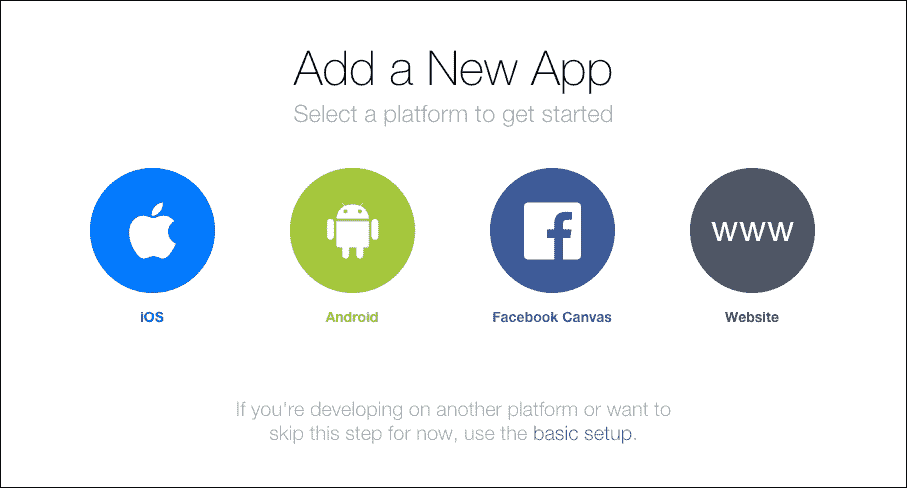

选择**网站**：

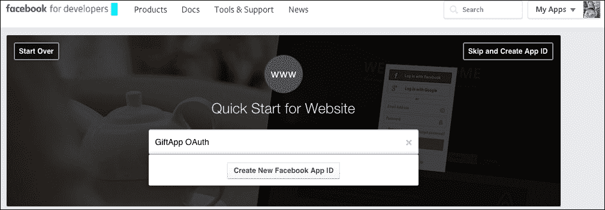

给你的新应用起一个名字，并选择**创建新的 Facebook App ID**：

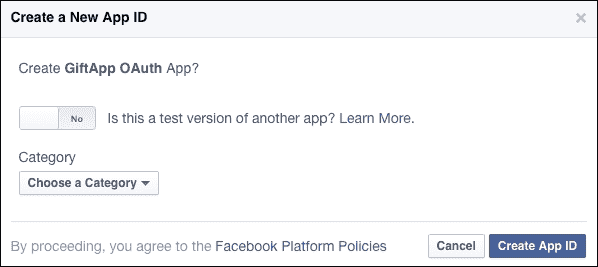

为你的新应用选择一个类别（实际上任何类别都可以）。确保不要选择**这是另一个应用的测试版本吗？**选项。然后点击**创建 App ID**：

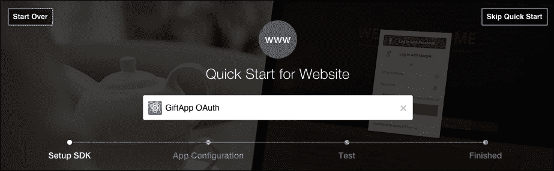

从这里，我建议你选择**跳过快速入门**，我们将手动设置你的应用程序。在下一屏幕上，选择**设置**：

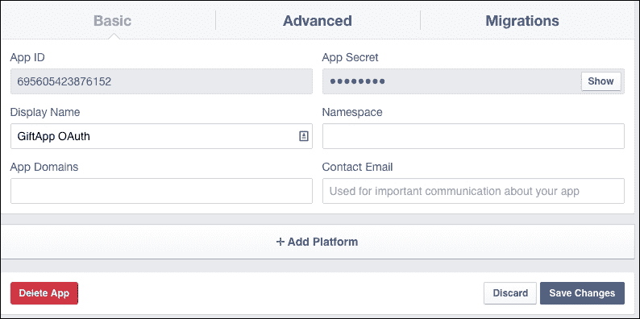

你需要在这里输入你的电子邮件地址并点击**保存更改**。接下来，点击**应用审核**：

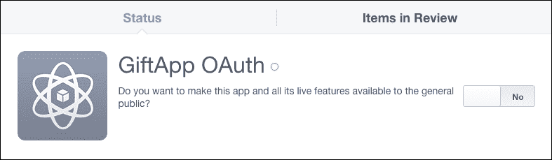

对于**你希望将此应用及其所有实时功能提供给公众吗？**选择**是**。然后返回到你的仪表板：

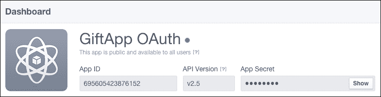

你将需要你的 App ID 和 App Secret 值。Facebook 将强制你输入密码以显示你的 App Secret。

**App Secret** 正如其名——是秘密。你应该保护它，不要将其检查到公共源代码控制中。

## 设置 Passport 策略

接下来我们需要做的是在 Passport 中设置策略。打开你的终端并导航到你的 `giftapp` 根目录：

```js
$ npm install passport-facebook --save
passport-facebook@2.1.0 node_modules/passport-facebook
    |__ passport-oauth2@1.1.2 (uid2@0.0.3, passport-strategy@1.0.0, oauth@0.9.14)

```

这里，我们已经安装了 Passport Facebook 模块，它允许我们使用 OAuth 2 通过 Facebook 登录。

### 注意

OAuth 是一个开放协议，允许通过简单和标准的方法在网页、移动和桌面应用程序中进行安全的授权。你可以在 [`oauth.net/2/`](http://oauth.net/2/) 找到有关 OAuth 2（该协议的最新版本）的更多信息。

### 配置 Facebook

现在我们需要制定我们的策略。在你的 giftapp 目录内，创建一个名为 `config` 的新目录，并添加一个名为 `authorization.js` 的新文件：

```js
module.exports = { 
    facebookAuth : { 
        clientID: '695605423876152', // App ID 
        clientSecret: 'd8591aa38e06a07b040f20569a', // App secret 
        callbackURL: 'http://localhost:3000/login/FBcallback' 
    } 
} 

```

我们只是存储了一个包含我们稍后需要的几个值的对象。`clientID` 是我们的 App ID。`clientSecret` 是我们的 App Secret（不，那不是我的真实秘密）。最后一个值是我们的 `callBackURL`。这是一个 Facebook 在授权后会重定向到的 URL。

如果你使用 Git 仓库来存储你的源代码，将这个 `config` 文件添加到你的 `.gitignore` 文件中是个好主意。

### 设置 Facebook 认证的路由

接下来我们需要做的是设置几个路由。在你的 `routes` 目录中，打开你的路由文件，`login.js`：

```js
var express = require('express');s 
var router = express.Router(); 

module.exports = function(passport){ 

    router.get('/', function(req, res) { 
        res.render('login/login', { message: req.flash('message'), csrfToken:
        req.csrfToken() }); 
    }); 

    router.post('/', passport.authenticate('login', { 
        successRedirect: '/dash', 
        failureRedirect: '/login', 
        failureFlash : true 
    })); 

    router.get('/signup', function(req, res){ 
        console.log('signing up'); 
        res.render('login/signup',{message: req.flash('message'), csrfToken: 
        req.csrfToken()}); 
    }); 

    router.post('/register', passport.authenticate('signup', { 
        successRedirect: '/dash', 
        failureRedirect: '/login/signup', 
        failureFlash : true 
    })); 

    router.get('/signout', function(req, res) { 
        req.logout(); 
        res.redirect('/login'); 
    }); 

 router.get('/facebook', passport.authenticate('facebook', scope:['emails'])); 
 router.get('/FBcallback',
 passport.authenticate('facebook',
 { 
successRedirect: '/dash',
 failureRedirect: '/login' })); 

    return router; 
} 

```

第一个新路由将被用于使用 Facebook 登录。回调 URL 在认证后使用。如果失败，用户将被重定向到登录页面。如果成功，用户将被发送到仪表板。

注意在 `facebook` 路由上调用 `passport.authenticate` 的第二个参数。这个对象包含一个 scope 属性，它接受一个数组。这个数组由 Facebook 需要额外权限才能访问的数据字段字符串组成。Facebook 需要额外权限来访问用户的电子邮件地址。

### 完成设置 Passport 策略

现在我们有更多步骤来设置策略。在你的 Passport 目录中，创建一个名为 `facebook.js` 的新文件：

```js
var FacebookStrategy = require('passport-facebook').Strategy; 
var User = require('../models/user'); 
var auth = require('../config/authorization'); 

module.exports = function(passport){ 

    passport.use('facebook', new FacebookStrategy({ 
            clientID: auth.facebookAuth.clientID, 
            clientSecret: auth.facebookAuth.clientSecret, 
            callbackURL: auth.facebookAuth.callbackURL, 
            profileFields: ['id', 'displayName', 'email'] 
        }, 
        function(accessToken, refreshToken, profile, cb) { 
            User.findOne({ 'facebook.id': profile.id }, function (err, user) { 
                if(err){ 
                    return cb(err) 
                } else if (user) { 
                    return cb(null, user); 
                } else { 
                    var newUser = new User(); 
                    newUser.facebook.id = profile.id; 
                    newUser.facebook.token = accessToken; 
                    newUser.facebook.name = profile.displayName; 
                    if(profile.emails){ 
                        newUser.email = profile.emails[0].value; 
                    } 

                    newUser.save(function(err){ 
                        if(err){ 
                            throw err; 
                        }else{ 
                            return cb(null, newUser); 
                        } 
                    }); 
                } 
            }); 
        } 
    )); 
} 

```

我们首先引入我们的依赖项，包括由 `passport-facebook` 模块提供的 Strategy 对象、我们的 User 模型以及包含我们的 Facebook 凭据的授权配置文件。

我们接着创建一个模块，该模块定义了我们的 Facebook 认证策略。它接受一个配置对象作为其第一个参数，我们使用配置文件中的 `facebook` 授权值来定义它。最后一个属性 `profileFields` 设置了我们期望从 Facebook 返回的配置文件中接收的字段。

第二个参数是一个在授权策略被使用时被调用的函数。它从 Facebook 接收`accessToken`、`refreshToken`、`profile`和`callback`作为参数。

我们使用用户的`findOne`函数来查看用户是否基于从 Facebook 返回的`profile.id`已存在。我们首先检查是否有错误。如果有，我们将其返回给回调。如果没有错误且用户存在，则将用户对象传递回回调，错误字段为 null。最后，如果用户不存在，我们创建一个新的用户，将该用户保存到数据库中，然后将新的用户对象传递回回调。

注意，我们不一定总是从 Facebook 收到电子邮件，因此在我们尝试访问它之前，我们需要测试在配置文件中是否返回了该属性。

记住，如果您想删除`users`集合，可以使用 Mongo 控制台。输入`use giftapp`来选择数据库，然后输入`db.users.drop()`来删除集合。

## 修改用户模型以存储 Facebook 数据

让我们对我们的`User`模型做一些修改。我们的 Facebook 授权将给我们一些之前没有的数据，并且有一些东西我们需要存储。打开你的模型目录中的`user.js`文件并编辑以下内容：

```js
var mongoose = require('mongoose'); 

var userSchema = mongoose.Schema({ 
    id: String, 
    email: String, 
    username: String, 
    password: String, 
    firstName: String, 
    lastName: String, 

    facebook: { 

        id: String, 
        token: String 
    } 

}); 
module.exports = mongoose.model('User',userSchema); 

```

在这里，我们将使用`mongoose.Schema`函数开始构建我们的模式。我们在用户中添加了一个`Facebook`对象，用于存储 ID 和令牌。请注意，这个新的 ID 是由 Facebook 提供的，并且与`User`对象顶层的 ID 不同。

令牌是一个 Facebook 为每个应用程序提供的唯一`id`。我们需要存储这个信息以确保认证能够正确工作。

## 完成与 Facebook 的连接

我们几乎准备好了。我们只需要完成最后几个步骤，以完成使用 Facebook 进行认证和注册的工作。

### 重建我们的主页

让我们简化一下自己的工作，并在视图目录内重写我们的`index.ejs`文件：

```js
<!DOCTYPE html> 
<html> 
  <head> 
    <title><%= title %></title> 
    <meta name="viewport" content="width=device-width, initial-scale=1"> 

    <link rel="stylesheet" href="https://maxcdn.bootstrapcdn.com/bootstrap/3.3.6/css/bootstrap.min.css"> 
    <link rel="stylesheet" href="https://maxcdn.bootstrapcdn.com/bootstrap/3.3.6/css/bootstrap-theme.min.css"> 

  </head> 
  <body> 
    <div class="container"> 
      <div class="jumbotron"> 
        <h1 class="text-center">Welcome to Giftapp</h1> 
        <hr> 
        <p class="text-center"> 
          <a class="btn btn-default btn-lg" href="/login/" role="button">Log in</a> 
          <a class="btn btn-default btn-lg" href="/login/signup" role="button">Sign Up</a> 
          <a class="btn btn-primary btn-lg" href="/login/facebook" role="button">Log in or sign up with Facebook</a> 
        </p> 
      </div> 
    </div> 
  </body> 
</html> 

```

在这里，我们使用 Bootstrap 的`jumbotron`创建了一个简单的欢迎页面。我们有三个按钮，实际上这些按钮是作为链接样式设计的：一个用于登录，一个用于注册，还有一个用于 Facebook 注册/登录。

页面，在`http://localhost:3000`，将看起来如下所示：

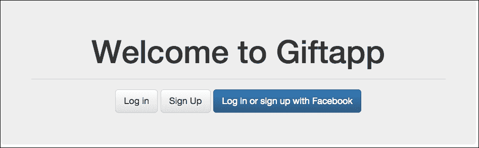

您可以测试这些按钮。不幸的是，点击我们的 Facebook 按钮会出现错误：

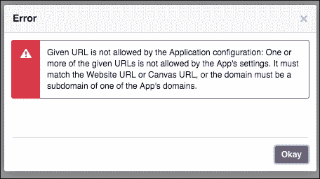

这是因为我们必须在 Facebook 应用程序内特别启用 URL。Facebook 强制执行这项安全措施。对我们来说没问题。回到你的 Facebook 应用程序仪表板的**设置**：

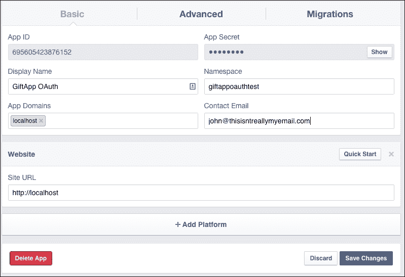

一旦进入这里，点击**+ 添加平台**并选择**网站**。在 URL 字段中输入`http://localhost`。现在您应该能够使用 Facebook 进行注册和认证。

您可能希望自行实现的一个功能是检查数据库中是否已存在用户，通过检查 Facebook 返回的任何电子邮件地址与数据库中已有的用户电子邮件地址进行对比。这将有助于避免重复账户。

# 连接到 Twitter

Passport 和 OAuth 2 的一个优点是，我们可以使用许多不同的策略来与第三方进行身份验证。让我们设置 Twitter 身份验证。

## 添加 Twitter 应用

与 Facebook 类似，我们需要在我们的应用程序与 Twitter 通信时在 Twitter 上设置一个应用。前往 [`apps.twitter.com`](https://apps.twitter.com) 并创建一个新的应用：

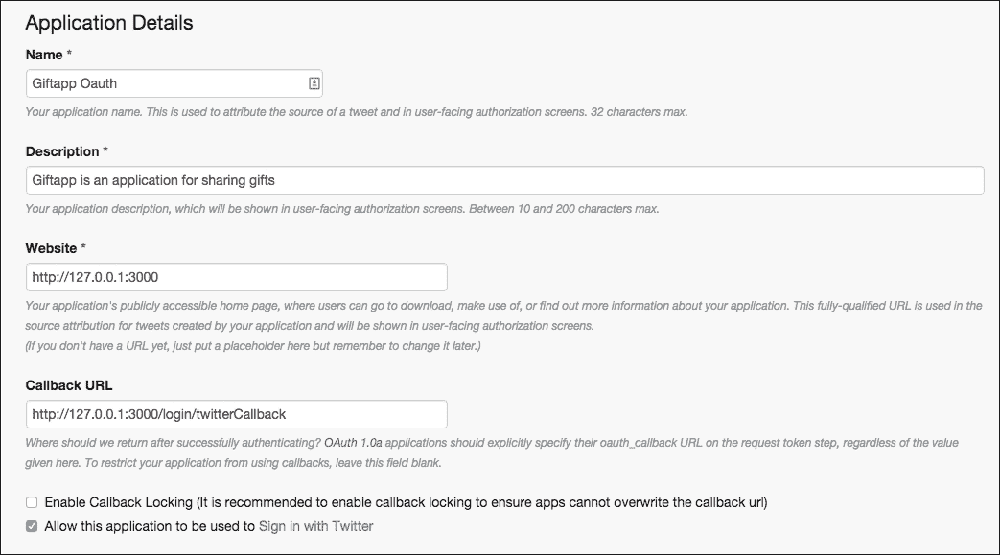

填写名称、描述和两个 URL。在撰写本文时，Twitter 不允许使用 `http://localhost` 作为 URL，因此您必须使用 `http://127.0.0.1`。

现在点击到 **密钥和访问令牌** 并获取您的 Consumer Key 和 Consumer Secret。我们将把这些添加到我们的 `authorization.js` 配置文件中：

```js
module.exports = { 
    facebookAuth : { 
        clientID: '695605423876152', // App ID 
        clientSecret: 'd85fR1nkOz2056801c8f9a', // App secret 
        callbackURL: 'http://localhost:3000/login/FBcallback' 
    }, 

    twitterAuth : { 
        'consumerKey'       : 'JksPJ0z46tf10/15/16asUdgxW1lJp', 
        'consumerSecret'    : 'IV095CmDyUsSOZo21GnejiShTXWzzxxybalubae82P4hfLa', 
        'callbackURL'       : 'http://127.0.0.1:3000/login/twitterCallback' 
    } 
} 

```

我们在我们的授权 `config` 文件中添加一个 `twitterAuth` 部分，其中包含我们需要的密钥以及回调。这一切都与 Facebook 非常相似。

## 设置我们的 Twitter 策略

现在我们需要采取步骤构建我们的 Twitter 策略。

首先，我们需要安装 Passport Twitter 策略模块：

```js
$ npm install passport-twitter --save
passport-twitter@1.0.4 node_modules/passport-twitter
|--- passport-oauth1@1.0.1 (passport-strategy@1.0.0, utils-merge@1.0.0, 
        oauth@0.9.14)
|__ xtraverse@0.1.0 (xmldom@0.1.22)

```

现在在您的 Passport 目录中创建一个 `twitter.js` 文件：

```js
var TwitterStrategy = require('passport-twitter').Strategy; 
var User = require('../models/user'); 
var auth = require('../config/authorization'); 

module.exports = function(passport){ 

    passport.use('twitter', new TwitterStrategy({ 
            consumerKey     : auth.twitterAuth.consumerKey, 
            consumerSecret  : auth.twitterAuth.consumerSecret, 
            callbackURL     : auth.twitterAuth.callbackURL 
        }, 
        function(token, tokenSecret, profile, cb) { 
            User.findOne({ 'twitter.id': profile.id }, function (err, user) { 
                if(err){ 
                    return cb(err) 
                } else if (user) { 
                    return cb(null, user); 
                } else { 
                    // if there is no user, create them 
                    var newUser                 = new User(); 

                    // set all of the user data that we need 
                    newUser.twitter.id          = profile.id; 
                    newUser.twitter.token       = token; 
                    newUser.twitter.username    = profile.username; 
                    newUser.twitter.displayName =              
                                                profile.displayName; 

                    newUser.save(function(err){ 
                        if(err){ 
                            throw err; 
                        }else{ 
                            return cb(null, newUser); 
                        } 
                    }); 
                } 
            }); 
        } 
    )); 
} 

```

这种策略与我们的 Facebook 策略非常相似。我们使用授权配置设置我们的密钥和回调。然后我们检查是否已存在具有相同 Twitter ID 的用户。如果没有，我们将使用 Twitter 发送给我们的数据创建一个新的用户，并将记录保存到数据库中。

谈到数据库，我们现在需要修改我们的 `User` 模型以处理我们的 Twitter 数据：

```js
var mongoose = require('mongoose'); 

var userSchema = mongoose.Schema({ 
    id: String, 
    email: String, 
    username: String, 
    password: String, 
    firstName: String, 
    lastName: String, 

    facebook: { 
        name: String, 
        id: String, 
        token: String 
    }, 

 twitter: {
 id: String,
 token: String,
 username: String,
 displayName: String
 } 

}); 
module.exports = mongoose.model('User',userSchema); 

```

就像 Facebook 部分，我们添加一个 Twitter 属性来存储我们从 Twitter 分离获取的数据。

接下来，我们需要在我们的 `routes/login.js` 文件中添加 Twitter 身份验证的路由：

```js
var express = require('express'); 
var router = express.Router(); 

module.exports = function(passport){ 

    router.get('/', function(req, res) { 
        res.render('login/login', { message: req.flash('message'), csrfToken: 
        req.csrfToken() }); 
    }); 

    router.post('/', passport.authenticate('login', { 
        successRedirect: '/dash', 
        failureRedirect: '/login', 
        failureFlash : true 
    })); 

    router.get('/signup', function(req, res){ 
        console.log('signing up'); 
        res.render('login/signup',{message: req.flash('message'), csrfToken:
        req.csrfToken()}); 
    }); 

    router.post('/register', passport.authenticate('signup', { 
        successRedirect: '/dash', 
        failureRedirect: '/login/signup', 
        failureFlash : true 
    })); 

    router.get('/signout', function(req, res) { 
        req.logout(); 
        res.redirect('/login'); 
    }); 

    router.get('/facebook', passport.authenticate('facebook', {scope:
    ['email']})); 

    router.get('/FBcallback', 
        passport.authenticate('facebook', { successRedirect: '/dash', 
            failureRedirect: '/login' })); 

 router.get('/twitter', passport.authenticate('twitter')); 
 // handle the callback after twitter has authenticated the user 
 router.get('/twitterCallback', 
 passport.authenticate('twitter',
 { 
 successRedirect : '/dash', 
 failureRedirect : '/login' 
 })); 

    return router; 
} 

```

再次，Twitter 路由与我们在 Facebook 身份验证中使用的路由非常相似。我们有主要的授权路由和用于回调的路由。

现在我们只需要对我们的 `passport/init.js` 文件进行一些编辑，以包含 Twitter 策略：

```js
var signup = require('./signup'); 
var login = require('./login'); 
var facebook = require('./facebook'); 
var twitter = require('./twitter'); 
var User = require('../models/user'); 

module.exports = function(passport){ 

    passport.serializeUser(function(user, done) { 

        done(null, user._id); 
    }); 

    passport.deserializeUser(function(id, done) { 
        User.findById(id, function(err, user) { 

            done(err, user); 
        }); 
    }); 

    signup(passport); 
    login(passport); 
    facebook(passport); 
 twitter(passport); 

} 

```

我们在这里需要做的唯一改变是导入 Twitter 策略并初始化它。到这一点，我们的 Twitter 策略应该可以工作。让我们让它对用户来说更容易一些。

## 将 Twitter 授权添加到我们的主页

与我们的 Facebook 策略一样，让我们在我们的 `index.ejs` 文件中添加一个 Twitter 登录按钮：

```js
<!DOCTYPE html> 
<html> 
  <head> 
    <title><%= title %></title> 
    <meta name="viewport" content="width=device-width, initial-scale=1"> 

    <link rel="stylesheet" href="https://maxcdn.bootstrapcdn.com/bootstrap/3.3.6/css/bootstrap.min.css"> 
    <link rel="stylesheet" href="https://maxcdn.bootstrapcdn.com/bootstrap/3.3.6/css/bootstrap-theme.min.css"> 

  </head> 
  <body> 
    <div class="container"> 
      <div class="jumbotron"> 
        <h1 class="text-center">Welcome to Giftapp</h1> 
        <hr> 
        <p class="text-center"> 
          <a class="btn btn-default btn-lg" href="/login/" role="button">Log in</a> 
          <a class="btn btn-default btn-lg" href="/login/signup" role="button">Sign Up</a> 
          <a class="btn btn-primary btn-lg" href="/login/facebook" role="button">Log in or sign up with Facebook</a> 
 <a class="btn btn-primary btn-lg" href="/login/twitter" role="button">Log in or sign up with Twitter</a> 
        </p> 
      </div> 
    </div> 
  </body> 
</html> 

```

我们已添加了一个 Twitter 登录按钮。

注意，为了测试，请从 `http://127.0.0.1:3000/` 开始，而不是 `http://localhost:3000`。这样做的原因是您需要域与回调 URL 中的会话 cookie 匹配。当您这样做时，您将看到以下内容：

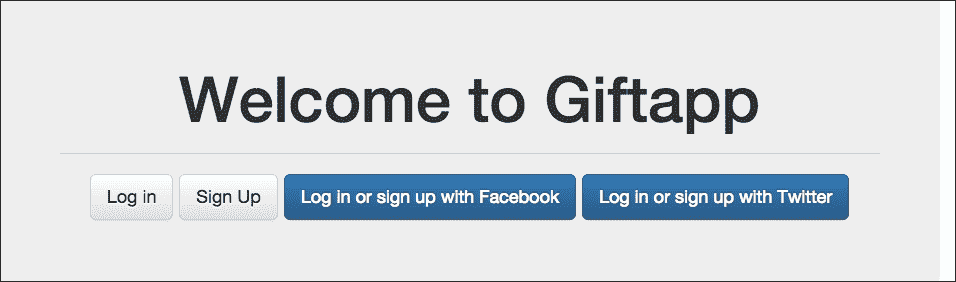

点击 Twitter 登录按钮将带您重定向到 Twitter，它将要求您登录或为您的应用授权：

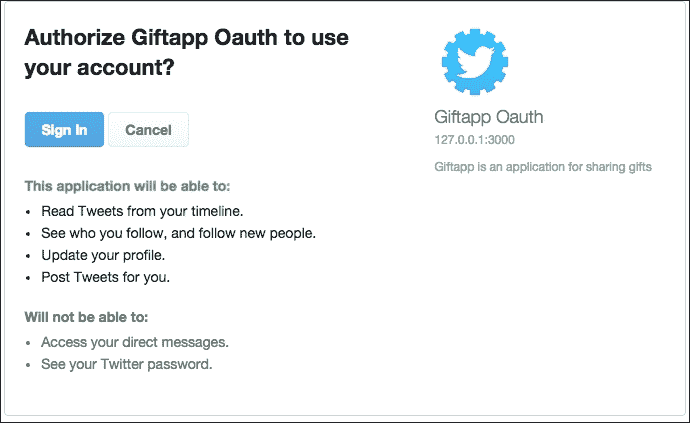

点击**登录**应该会带您到仪表板。

现在我们已经通过 Facebook 和 Twitter 登录，让我们看看我们的`giftapp`数据库中的`users`集合。通过在命令行中输入 mongo 启动您的 MongoDB 客户端：

```js
> use giftapp
switched to db giftapp
> db.users.find({}).pretty()
{
 "_id" : ObjectId("56bbdc4308ca9a596f0006d8"),
 "email" : "john@thisisafakeemail.com",
 "facebook" : {
 "name" : "John Moore",
 "token" : "CAAJ4pkIxqDgBABrsfsds345435ZAZAE73UZCjehrtjWQ8YhGWVxdoa6VA0OuydPPuQO8wJWBDO4ZCylNX7dMPOJL4VW7WX3nZCLt1b16Mghgdfdg34543543",
 "id" : "101539512345670"
 },
 "__v" : 0
}
{
 "_id" : ObjectId("56bd252d32d162207ab35be4"),
 "twitter" : {
 "displayName" : "John Moore",
 "username" : "JohnMooreNinja",
 "token" : "4867525577-dvlIz4uEZMgMZHFd6tRjhgjhgjgf8WrGv",
 "id" : "486633445565657"
 },
 "__v" : 0
}

```

因此，在我们的`users`集合中有两个用户，一个有一组 Facebook 凭证，另一个有 Twitter 凭证。您会注意到 Twitter 配置文件不包括电子邮件。

# 分享 giftlists

目前，我们的 giftlist 功能实际上并不起作用。我们希望用户能够创建他们可以分享的 giftlists。

## 完善 giftlist 模型

由于我们使用 Mongoose 为我们的用户建模数据，让我们也用它来为我们的`giftlists`建模。在您的`models`文件夹中，创建一个名为`giftlist.js`的新文件：

```js
var mongoose = require('mongoose'); 

var giftlistSchema = mongoose.Schema({ 
    id: String, 
    user_id: String, 
    name: String, 
    gifts: [{name: String}] 
    sharedWith [{user_id: String}] 

}); 
module.exports = mongoose.model('Giftlist',giftlistSchema); 

```

这个模型相当简单。一个 giftlist 有一个 ID，一个名称，一个`gift`对象的列表，以及一个`user_id`字段。我们将用拥有 giftlist 的用户 ID 填充`user_id`。在一个关系型数据库中，这将是一个外键，定义了用户和 giftlist 之间的一对多关系。

gifts 字段是一个只期望有 name 属性的 object 数组。我们还有一个与我们已经分享的 giftlist 的用户列表。我们将分享功能留到以后。

## 连接 UI

下一步，我们希望允许用户从我们的 SPA 仪表板创建新的 giftlists。

由于我们打算通过 Ajax 发送数据，我们需要做一些工作来使 CSRF 令牌对 Angular 应用可用。为此有两个步骤；首先，我们希望在`dashboard.js`路由中传递令牌：

```js
var express = require('express'); 
var router = express.Router(); 
var isAuthenticated = require('../utils/authenticated'); 

router.get('/', isAuthenticated, function(req, res, next) { 

    var db = req.db; 
    var collection = db.get('giftlist'); 
        console.log("routing dash for " + req.user._id); 
    collection.find({'owner_id':req.user._id}, {}, function(err,giftlists){ 
        if(err){ 
            res.send(err); 
        }else { 
            giftlists = giftlists || []; 
 res.render('dash/dashboard', {user: req.user, giftlists: giftlists, csrfToken: req.csrfToken()}); 
        } 
    }); 
}); 

module.exports = router; 

```

我们将令牌传递给渲染函数。

接下来，我们将在`dashboard.ejs`模板中添加一些内容：

```js
<!DOCTYPE html> 
<html ng-app="giftapp"> 
<head > 
    <title>Dashboard for <%= user.firstName %> <%= user.lastName %> </title> 

    <meta name="viewport" content="width=device-width, initial-scale=1"> 

    <link rel="stylesheet" href="https://maxcdn.bootstrapcdn.com/bootstrap/3.3.6/css/bootstrap.min.css"> 
    <link rel="stylesheet" href="https://maxcdn.bootstrapcdn.com/bootstrap/3.3.6/css/bootstrap-theme.min.css"> 
    <script src="img/angular.min.js"></script> 
    <script src="img/angular-ui-router.min.js"></script> 
    <script src="img/angular-resource.js"></script> 

</head> 
<body> 
<nav class="nav navbar-default"> 
    <div class="container-fluid"> 
        <div class="navbar-header"> 
            <a class="navbar-brand" href="#"><%= user.firstName %> <%= user.lastName %> Dashboard</a> 
        </div> 
    </div> 
</nav> 

<div class="container"> 

    <div ui-view></div> 
</div> 
<script src="img/dashMainController.js"></script> 
<script src="img/giftappFormController.js"></script> 
<script src="img/giftlistFactory.js"></script> 
<script>
 angular.module("csrfValue", []) 
 .value("csrfToken","<%= csrfToken %>");
</script> 
</body> 
</html> 

```

我们在我们的页面内创建一个新的 Angular 模块，并向其中添加一个值。一个值基本上是一个可注入的名称值对，我们可以在我们的应用程序中使用它。我们在仪表板模板中这样做，因为我们需要服务器将`csrfToken`提供给 UI。

我们还添加了一个 script 标签来加载一个新控制器脚本文件，我们将使用它来处理和提交表单。

## 连接表单

接下来，我们需要将 giftlist 表单连接到控制器，并让控制器与后端通信。

### 创建控制器

在您的`javascripts/controllers`目录中创建一个名为`giftappFormController.js`的新文件：

```js
angular.module('giftappControllers') 
    .controller('GiftappFormController', ['$scope','List','csrfToken', '$state', function($scope, List, csrfToken, $state) { 
        $scope.formData = {}; 
        $scope.formData.items = []; 
        $scope.formData._csrf = csrfToken; 

        $scope.create = function() { 
            console.log("create"); 
            var myList = new List($scope.formData); 
            myList.$save(function(giftList){ 
                console.log(giftList); 
                $state.go('dash'); 
            }); 

        } 
    }]); 

```

我们在我们的`giftappControllers`模块中添加了一个新的控制器。我们将一些东西注入到控制器中，包括我们的 List 资源，以及$state。我们还注入了`csrfToken`。我们目前还不能访问它，但稍后我们会将其模块注入到我们的模块中。

在控制器内部，我们在`$scope`上设置了一个名为`formData`的对象。这个对象将保存用户在我们表单中输入的数据。我们还添加了一个名为`create`的函数到作用域中，当用户提交表单时将被调用。我们创建了一个新的列表资源实例，将我们的数据添加到其中，并将其保存到后端。保存后，我们触发状态改变以返回仪表板。

由于我们的模块实际上是在`insidedashMainController`.`js`中定义的，这是我们想要注入包含我们的`csrfToken`值的模块的地方：

```js
angular.module('giftappControllers',['giftlistServices','csrfValue']) 
    .controller('DashMainController', ['$scope','List', function($scope,List) { 
        $scope.lists = List.query(); 

    }]); 

```

通过简单地将模块名称添加到我们的模块依赖中，我们就可以访问模块内的值服务。

### 规范化表单

下一步，我们需要在`public/templates/dash-add.tpl.html`模板中添加一些 AngularJS 指令：

```js
<div class="row"> 
    <div class="col-md-12"> 
        <h2>Add a new list</h2> 
 <form class="form-horizontal" ng-submit="create()"> 
            <div class="form-group"> 
                <label for="listname" class="col-sm-2 control-label">List 
                 Name</label> 
                <div class="col-sm-10"> 
 <input type="text" class="form-control" id="listname"
                     placeholder="Name" ng-model="formData.name"> 
                </div> 
            </div> 
            <div class="form-group"> 
                <label class="col-sm-2 control-label">Item 1</label> 
                <div class="col-sm-10"> 
 <input type="text" class="form-control" ng-
                     model="formData.items[0]"> 
                </div> 
            </div> 
            <div class="form-group"> 
                <label class="col-sm-2 control-label">Item 2</label> 
                <div class="col-sm-10"> 
 <input type="text" class="form-control" ng-
                     model="formData.items[1]"> 
                </div> 
            </div> 
            <div class="form-group"> 
                <label class="col-sm-2 control-label">Item 3</label> 
                <div class="col-sm-10"> 
 <input type="text" class="form-control" ng-
                     model="formData.items[2]"> 
                </div> 
            </div> 
            <div class="form-group"> 
                <div class="col-sm-offset-2 col-sm-10"> 
                    <button type="submit" class="btn btn-default btn-lg btn-
                     block"> 
                        <span class="glyphicon glyphicon-flash"></span> Create
                          List 
                    </button> 
                </div> 
            </div> 
        </form> 
 {{formData}} 
    </div> 

</div> 

```

第一次更改是在表单中添加`ng-submit`指令。在提交表单时，控制器中的`$scope.create()`函数将被调用。

我们然后将输入与`$scope.formdata`通过`ng-model`指令连接起来。这创建了两向数据绑定。为了演示这一点，我们在模板中添加了`{{formData}}`。这将显示`$scope.formdata`中保存的所有数据，并且是调试表单的好方法。显然，这不是在生产模板中留下的事情。

### 连接到后端控制器

现在既然我们的表单已经连接到我们的控制器，我们需要将我们的控制器连接到后端以存储和从数据库中检索我们的数据。打开你的`controllers/giftlist_controller.js`文件：

```js
var Giftlist = require('../models/giftlist'); 

exports.index = function(req, res){ 

        Giftlist.find({'user_id':req.user._id}, {}, function(err,giftlists){ 
            if(err){ 
                res.send(err); 
            }else if(giftlists){ 
                res.json(giftlists); 

            }; 
        }); 

}; 

exports.create = function(req, res){ 
    var newGiftlist = new Giftlist(); 
    newGiftlist.name = req.body.name; 
    newGiftlist.user_id = req.user._id; 

    var gifts = []; 
    req.body.items.forEach(function(item){ 
        gifts.push({name:item}); 
    }); 
    newGiftlist.gifts = gifts; 

    newGiftlist.save(function(err){ 
        if(err){ 
            throw err 
        } else { 
            res.json(newGiftlist); 
        } 
    }); 

}; 

exports.show = function(req, res){ 
    Giftlist.findOne({_id:req.params.id}, function(err, list){ 
        if(req.params.format == "json" || req.isJSON){ 
            res.json(list); 
        }else{ 
            res.render('giftlist/show',{giftlist:list}); 
        } 
    }); 

}; 

```

我们在我们的`giftlist`模型中引入了依赖，并编辑了索引、显示和创建路由以利用 Mongoose 数据库功能。因为我们希望能够轻松地将列表与未登录我们的仪表板的人分享，所以显示的非 JSON 请求将渲染在单独的页面上。

在你的视图目录中，创建一个新的`giftlist`目录，并创建一个名为`show.ejs`的模板：

```js
<!DOCTYPE html> 
<html> 
<head> 
    <title>Show Users</title> 
    <link rel='stylesheet' href='/stylesheets/style.css' /> 
</head> 
<body> 
<h1>User List: <%= appName %></h1> 

<table> 
    <thead> 
        <tr> 

            <th>First Name</th> 
            <th>Last Name</th> 
            <th>Email Address</th> 
            <th>Dashboard</th> 
        </tr> 
    </thead> 
    <tbody> 
    <% users.forEach(function(user, index){ -%> 
        <tr> 
            <td><a href="show/<%= user._id%> "><%= user.firstName %></a></td> 
            <td><%= user.lastName %></td> 
            <td><%= user.email %></td> 
            <td><a href="/dash/<%= user._id %>">View</a></td> 
        </tr> 
    <% }); %> 
    </tbody> 
</table> 

</body> 
</html> 

```

这是一个相当直接的模板，用于渲染列表名称和列表上的礼物。

## 添加在社交媒体上分享列表的能力

接下来，我们希望允许用户轻松地分享他们的列表。我们需要对`dash-main`模板进行一些小的调整：

```js
<div class="row"> 
    <div class="col-xs-12 col-md-6"> 
        <h2>My Lists</h2> 

        <a class="btn btn-primary" role="button" ui-sref="add" href="#/add"> 
            <span class="glyphicon glyphicon-plus" aria-hidden="true"></span> 
            Add List</a> 
        <ul class="list-unstyled"> 
 <li ng-repeat="list in lists"><a class="btn btn-link" 
             href="/giftlist/{{list._id}}" role="button">{{ list.name }}</a></li> 

        </ul> 
    </div> 

    <div class="col-xs-12 col-md-6"> 
        <h2>Lists Shared With Me</h2> 
    </div> 
</div> 

```

我们添加到链接中的 URL 将触发控制器中的显示路由，并传递我们想要显示的列表的 ID。

接下来，我们将向我们的`giftlist/show.ejs`模板添加分享按钮：

```js
<!DOCTYPE html> 
<html> 
<head > 
    <title>Giftlist: <%= giftlist.name %></title> 

    <meta name="viewport" content="width=device-width, initial-scale=1"> 

    <link rel="stylesheet" href="https://maxcdn.bootstrapcdn.com/bootstrap/3.3.6/css/bootstrap.min.css"> 
    <link rel="stylesheet" href="https://maxcdn.bootstrapcdn.com/bootstrap/3.3.6/css/bootstrap-theme.min.css"> 

 <!-- You can use open graph tags to customize link previews. 
 Learn more: https://developers.facebook.com/docs/sharing/webmasters --> 
 <meta property="og:url"
           content="http://localhost:3000/giftlist/<%= giftlist._id %>" /> 
 <meta property="og:type"
          content="website" /> 
 <meta property="og:title"
          content="Giftlist App" /> 
 <meta property="og:description"
         content="<%= giftlist.name %>" /> 

</head> 
<body> 
<div id="fb-root"></div>
<script>(function(d, s, id)
 { 
 var js, fjs = d.getElementsByTagName(s)[0]; 
 if (d.getElementById(id)) return; 
 js = d.createElement(s); js.id = id; 
 js.src =
 "//connect.facebook.net/en_US/sdk.js#xfbml=1&version=v2.5&appId=228887303845448"; 
 fjs.parentNode.insertBefore(js, fjs); 
 }
(document, 'script', 'facebook-jssdk'));
</script>
<nav class="nav navbar-default"> 
 <div class="container-fluid"> 
 <div class="navbar-header"> 
 <a class="navbar-brand" href="#">Giftlist</a> 
 </div> 
 </div> 
</nav> 

<div class="container"> 
    <h1><%= giftlist.name %></h1> 

    <div class="row"> 
        <div class="col-md-12"> 
            <ul> 
                <% giftlist.gifts.forEach(function(gift, index){ -%> 
                <li><%= gift.name %></li> 
                <% }); -%> 
            </ul> 
 <a href="https://twitter.com/share" class="twitter-share-button" data-via="JohnMooreNinja" data-size="large" data-hashtags="giftapp">Tweet</a>
 <script>!function(d,s,id){var js,fjs=d.getElementsByTagName(s)[0],p=/^http:/.test(d.location)?'http':'https';if(!d.getElementById(id)){js=d.createElement(s);js.id=id;js.src=p+'://platform.twitter.com/widgets.js';fjs.parentNode.insertBefore(js,fjs);}}(document, 'script', 'twitter-wjs');
</script> 
 <div class="fb-like"></div> 

        </div> 
    </div> 

</div> 

</body> 
</html> 

```

我们添加了一些开放图标签，以及一些代码来启用 Twitter 和 Facebook 分享。

Twitter 有一个基于表单的便捷向导来设置 Twitter 分享按钮。你可以在[`about.twitter.com/resources/buttons#tweet`](https://about.twitter.com/resources/buttons#tweet)找到它。你将需要为你的应用 ID 特别配置 Facebook 按钮。Facebook 也有一个基于表单的配置工具，在[`developers.facebook.com/docs/plugins/like-button`](https://developers.facebook.com/docs/plugins/like-button)。

# 摘要

我们通过设置与 Facebook 和 Twitter 的 Passport 策略来开始本章，为每个社交媒体网站设置开发者账户是一个简单但必要的步骤。

然后，我们利用我们的`Mongoose Giftlist`模型以及我们资源丰富的控制器，从 SPA 内部启用创建礼品列表。我们通过构建一个新的 AngularJS 控制器来启用前端代码和 AJAX 功能。为了能够将数据发布到后端，我们添加了一个可注入的值服务来携带 CSRF 令牌。

有几件事情留给我们来完成应用的完善。这包括动态添加更多礼品输入的方式，以及与其他注册用户共享列表。
